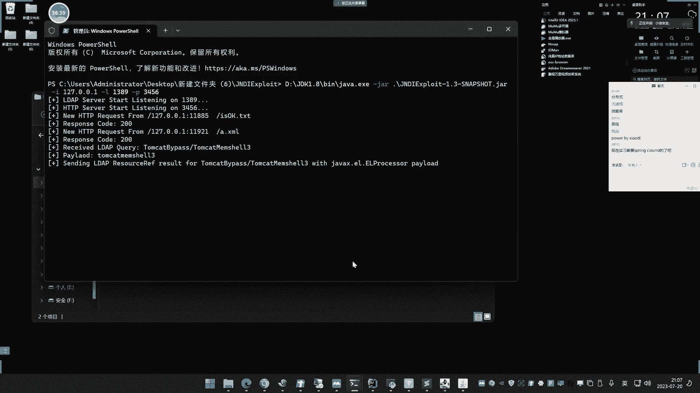
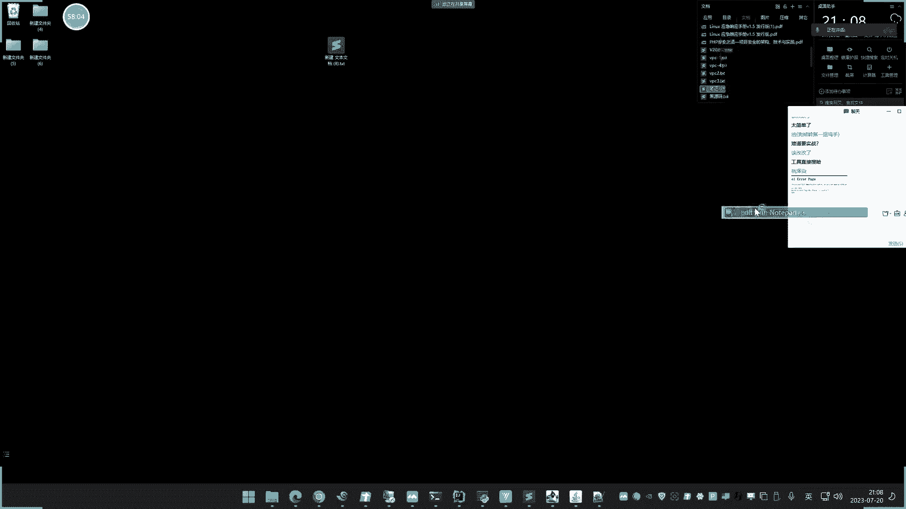
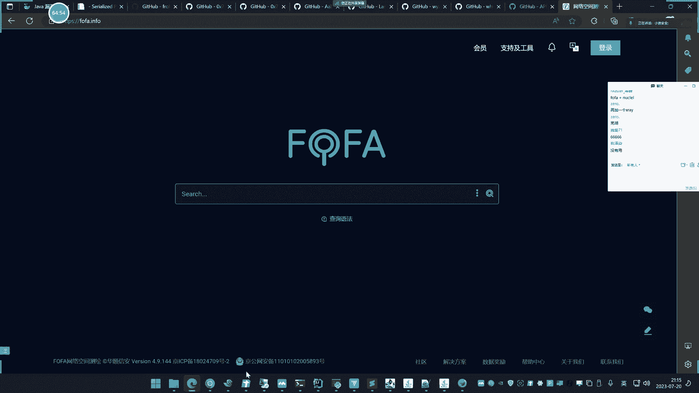
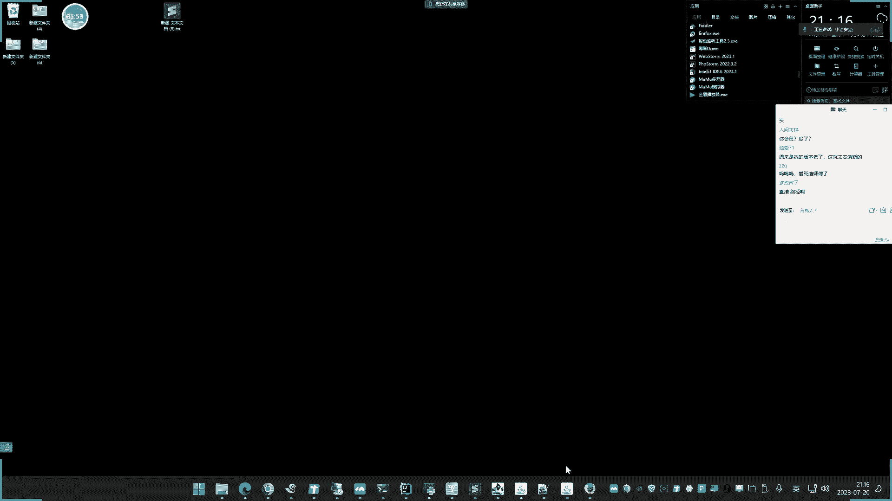

# 【小迪安全】V2024版 全栈网络安全 ｜ 攻防渗透工程师 （持续更新） - P67：第68天：Java安全&原生反序列化&SpringBoot攻防&heapdump提取&CVE - 逆风微笑的代码狗 - BV1Mx4y1q7Ny

今天呢看一下这个内容啊，今天讲这个两个啊，java的燃生反序列化的一些产生和简单的利用，然后呢再来说下java的一个开发框架是ping put的，上面的安全问题和攻防，其实我们讲java强呢。

第一个呢是了解他的常见漏洞，再就是各种漏洞的一些利用和分析，讲了之后啊，你以后碰上了或者面试问上了，你不要说没有讲，或者说不会啊，这个支点呢先来看一下这个简单支点啊，就两个支点。

终点呢就是下面这个SPP的框架啊，因为这个反虚化原生态的呢，在后面他还会继续讲嘶，因为他的更多细节呢，还是要在代码里面中去体现，才会更加的直观，这个呢要在代码审计的那个章节的去分析啊。

现在呢就是先把它进行的一个简单的漏洞和理，解和他的利用，那具体的产生原理和那个连呢，那个就是难点，说实话那个东西呢你可以理解的很深入，也可以理理解的很浅显，一般理解很深入的话，面试问的时候。

那能对答如流，后期挖洞呢有帮助，实战中呢帮助不大，因为实战中大部分都是用工具呢直接开搞，就不会搞那些名堂，我们来看一下啊，这个序列化的这个概念呢我就不说了，这个java0呢反循环呢一般是分为两个部分。

一个部分呢就是我们常见的这种原声内呢，接口呢实现的孩子呢，就像我们前三节课介绍过的，怎么发射，介绍温呐，JKJJS温呐这种框啊，这种组件呢是吧，它里面呢内值的就两种啊，那为什么把它区分起来啊。

他们都做的是一样的事情，但是为什么要把它区分起来呢，就是因为他们这个实现的东西和利用呢，有点不同，那如果说是什么发射健身的反序列化啦，杰克杰克森O森反序列化呢啊。

你就根据网上给到的那个POCE叉P呢去打，那如果说是这种原生态产生的反虚的话呢，那就按照我们正常的这种工具呢去生成，去去打它，他是这么一个流程啊，你要根据这个反虚化啊，是怎么产生的，怎么去利用。

那和pp呢也是一样的，pp原生内那就是我们正常逻辑那样去玩，然后如果说是这个框架的话，也是框架那种玩法，不同的这个产生的原理都不一样啊，但是大家要记住啊，这个java的原始内呢他有个特征。

这个特征呢常在面试，或者是在这个考点里面会出现，就是他有个特征点，特征点呢在序列化数据呢，通常以ACED0005开始，然后贝斯缪斯的这个特征为R0，RO0AB这个特征的为准，这个有时候需要温啊。

你记住一下就可以了，这是那个原声内啊，原生的那个反虚化的一个特征，就是流量的特征啊，一般问你呢，就是说这个流量怎么去分析到，是这个java的反需要攻击啊，你就可以回答这个东西。

然后此类漏洞呢黑盒中是没办法发现的，一般黑盒发现呢，就是流量分析呢捕获到这个特征了，那白盒呢就是直接看这个Z的接口和函数，和引用的这个组件呢，有没有进行这个呢较简单啊，所以说找凡需要漏洞的话啊。

黑盒中呢就是简单的说，就是从蓝队角度去看待了啊，红队角度，那是没办法去从网上能看到是不是个漏洞，就根据这个增长的这个什么流量特征的决定啊，那么在java的原生类中啊。

我们前三节课演示的这个什么fast js jn，你们不是有很多反需要漏洞利用吗，上节课都讲过对吧，那里面的利用方法不一样啊，都是反虚化，然后呢在原生内，原生内目前的JVA里面的三个比较主流啊。

那用的最多的就是最下面一个，就是他本地的一个叫return object，就是读取文件的，它是干嘛的呢，就是将文件呢进行这个序列化数据，还有一个呢就是XML语言的，就针对XML的格式呢进行序列化。

还有一个呢就是这个S迈克啊，YML就支持这个语法的一个序列化，一般呢它会有这三类啊，这就要自己去写代码的去实现的，还有一种，那就是像对JSN的数据呢进行反序化。

那可能就会用到这个fast JSON和jack，JSON的组件呢来实现好，那么这个呢实现呢都比较简单，我们都可以看一下函数，和看一下这个代码就能看到的实现，那最主要就是说这个东西啊。

你知道有个漏洞之后怎么用它，这个是关键，点庸呢分为两点啊，还是我来说这句话啊，如果是这一类东西造成的反虚化，那用的就是我们今天讲的项目，那如果说是上面这种组件里面的反虚化的话，那就参考网上的给到的工具。

或者是EXP来去利用，那至于为什么这样区分和为什么这样用，那个就需要分析捏了，那那个呢是暂时我们先不用接触的啊，那是这个java里面的最高端的课程。

我们讲到的时候呢再来看这，那么现在呢我们先把环境启动起来啊，启动起来之后呢，还是用那环境先做，做完之后呢，我们还是以这个真实案例和这个源码案例呢，去讲这个支点啊，今天的这个工具项目呢还是有点多的。

注意一下啊，我现在呢是采用的JDK1。801R的，这个去启动它的啊，我这里呢先启动它，答案呢我们再换个版本再来看一下啊，因为我们昨天讲过那个GNDI注入，这个在反序R中也会用到。

我们可以观察一下这个版本之后啊，是不是这个GNDI在反序化中也会受到影响，这个呢要大家要等下呢自己关注一下啊，好齐东。

我们来进行一个打开啊，这是那个网站，我们打开啊，嗯来访问一下，好来到这个反虚化这里啊，这第一个啊用到remote object。

然后这里呢我们可以对应一下源码呢，看一下他那个实现的一个写法，这个呢就是用他自己本身语言啊。

没有加载任何的这个库呢来实现的这种操作啊，哎怎么打不开呀。

好我们这里呢给大家看一下啊，在这个地方啊，代码端的是在这里啊，第一个呢是这个啊，看这个它的一个实现呢，我们可以看一下代码段啊，哎这个接收这个值，然后再把他比贝斯六四进行个解码，解码之后呢。

进入这个将之间的堵路输流，就是用到的是这个object这个类啊，这个接口，然后呢后面呢用到这个什么这个东西呢，来进行这个反序化操作的啊。

其实我就是和我们之前这里看的一样啊，就这个东西啊用到这个一个堵路。

还有个写入啊，两个人来实现序列化和反序化的两个操作啊，堵路是反序列化啊，写入呢是序列化，这里呢就是他的一个实现啊，就是资金流的一个数据，然后呢把它还原成对象，就是把它封装成的一个东西啊。

这个序列化的东西呢，前期PPT里面的那个概念呢已经跟他说过了，这就不讲了啊，啊这里还多了一个贝斯牛斯这个抵扣的。

然后呢我们可以看一下啊，呃他这里有写到，他说这个原生态如果用这个东西来实现的，这个反序列化的话，他有个特征特征呢，就是没有序列化，之前的是ACED05020005的开端，如果base64的特征。

那就变成了R0RO0AB，你看一下啊，这里就是一个RO0vb的一个数据，那么如何进行这个利用呢，对不对，这个东西是如何利用的啊。

这个参数值呢可以看一下他接收的参数值呢，就是content结束参数值发送过去呢，对它进行一个还原啊，来反虚化的一个牛。

就是既还原object啊，既还原好，那么现在呢我们如何实现它啊，它的这个燃生利用呢可以用三个工具来实现，这个工具呢在前期讲pp的项目的时候呢，提过pp的反循环。

提过还有个这个呢是新杰出的一个专门用java的，其实这个呢有集成，还有就是我们用的这个YAKIT，这个是最开始的第一个，后面呢这款工具和这个项目呢，都把这个东西都集成了。

所以说其实啊这三个都是一个都是这个东西，这是第二个，只是说了第二个呢是自己下载，自己遵行呢自己实现比较麻烦啊，第一个和第三个呢就是展现自己的图形化操作，不需要你自命令啊，啊搞什么事情就点鼠标动几下。

做个会点鼠标的猴子，就可以生成一个基于这个反虚化啊，漏洞的一个利用的一个PYLOAD就可以构造出来，然后三个呢都给看一下啊，额这个呢YS的啊，这个很简单啊，就是他利用呢有个东西要介绍一下啊。

我们先把这个东西给拿出来啊，这个YS。

呃这个项目里应该在这里有吧，嗯我没放进去啊，没放进去，我要放进去啊，在这个工具包里面那也有啊，你给他直接工具箱里面也有，这个好，我们来运行一下啊，好我这里运行呢，嗯就直接还是用这个版本吧。

都用这个版本啊。

好它运行之后呢，它会提示这么个东西，这啥东西呢，这啥东西呢，好是这样的啊，嘶他要进行序列化的话，就会你想想P1P的那个反虚化，是不是会调用一些类了去加载一些东西，比如说我要执行RC1是吧。

他就会利用一些其他类里面，那有这个RCE的东西呢来实现，你看一下啊，后面的前面是他的这个接口，后面是带个库的那个版本。

他这里呢告诉你说用到的是这个什么，C o m o n condex5，这为什么要用这个呢，这啥意思啊。

那我可以看一下这个对应这点啊，呃就是下面嘛来这里这里他会说让你用这个，为什么会用这个，而不用这上面这些其他的呢，那就是说它生成的话。

我们先给他演示出来啊，演示出来之后呢，大家在思考这个问题啊，那是拉了个命令啊，我把命令的直接后面补充啊。

来执行执行之后呢，报错了，这个要报错了是什么原因呢，就是我们这windows呢不支持这个在线的base，六四的一个这个自动编码哈，你这样生成呢，它就会生成一个那个文件，是生成什么鬼东西啊，那它不支持啊。

我们先把它给他看一下呢，他结果里面的生成就这个东西，那我再背六四编码啊，这个不支持啊，所以说你用这个呢就是能看一个大概情况，他能看到那个，所有的那个知识的东西，我们在这里呢可以看到这么多啊。

我还是推荐大家呢不要用这里生成啊，只用，做个会点鼠标的猴子会方便很多，我们把那个两个项目呢给他启动起来，那上个那个项目呢，我们已经在前面的课程呢已经给大家讲过了，就是他的搭建啊是吧。

他的搭建已经讲过了，这个YART呢在这里啊点一下呃，这是这个，然后还有一个呢就是这里看到这个啊，我打开的就这个项目呢搭建好了啊，那这是在服务器上面啊，已经搭建了，把放到i is上面搭建的啊。

这已经是答建好了啊，这个答建那讲过啊，你翻一下pp那个反虚化在哪一天讲过啊，啊在PPP反序化那个讲过啊，所以这个呢可以自己去再去搭建啊，那天讲过啊，就不要再说这个什么有什么都不会搭建，什么鬼啊。

好这里呢你看啊它有三个呢，点net的反序列化的，利用PHPGGC的，还有Python的，然后呢这个是当时讲PPT的是吧呢，各种里面的这个生成，然后呢这个是点net上面的。

点net里面的就是我们说的SBX语言的，这个是Python的，然后这个呢是我们java的四个语言都有，在java的反虚化的利用的在线生成PLO的项目，我们选择这个五，然后呢进行一个执行条命令。

把他以贝斯牛斯呢去生成勾，它就会产生这么一个代码出来传承于复制是吧，放到这里来呢，去掉粘贴低级提交，提交之后呢，计算机呢就弹出来了是吧。

很好用的一个项目，但是这个我们要明白。

为什么这里哎他要选择的是这个啊，选择的是这个五呢，那我用移行不行呀，看要用一呢，用一次化呢，我们的放在哪呢，来进行一个执行，去掉权限，粘贴执行了，但是没有任何反应啊，对不对，这为什么要用五。

就用其他的为什么不行啊。

这里呢你要根据这个星系啊，我们来看一下啊，嘶这个五这里呢他有个后面一个注释，这个是桌子，这不用看看看这里啊，他说这里呢是大于等于3。2。1，然后移这里呢是一个什么东西啊，看移啊。

移这里呢是ES大于等于3。1，这好像是没有什么他的区别啊，都一样啊，这为什么不行呀，要注意啊，他这个连呢和具体版本和写法有关，那我们注注意给大家看一下啊。

为什么会这么细啊，这又是什么东西，我们来看项目，项目里面我们来看一下啊，来看没，来看到没，这里CMOS3。2。1，看到没，他这个项目的引用里面的包，里面呢是有这么个东西的啊，有这么个东西的。

也就是说你这个原生内啊，去利用反序列化的时候呢，是要根据当前项目里面有没有这么个东西，你比如说我这边呢再换到这个3。2仪嘛，我换到这个3。2。1这里我换个六啊，换这个五换七啊，看是不是行不行啊。

我们再来看一下啊。

比如说我换个五啊，换六它都是一个东西吗，看环流执行好，再来看一下。

哎es可以对吧，然后呢你看啊你就是要看，比如说你要用这个的话啊，他这里的说什么格拉菲2。3。9，那你就看你这里面库里面的有没有，他有那就能用，没有就不能用，能理解啥意思没有。

你比如说像现在啊，你要利用它的话啊，你找个呢它不存在的，比如说我们找个这个随便找个吧，就这个啊就刚才那个好，伸出来好，我们放这来，那其实呢这个报错了吗，这什么鬼东西不用看了吗，因为他没有。

你看他提示里面有个什么叫long class，什么server fu i d等于-二三十枚，这个提示呢其实就是说这个class文件呢，这个东西它不存在，也其实包的就这个东西不存在，你要找他一个存在的。

并且版本符合的才行，那你可能又会问了，那如果都没有呢，是不是，都没有的话，那就不能执行命令执行了，那就一般都会用这种通用的。

用这种URDS，这个呢你可以看一下啊，来U20S它是为空的，就是说这里为空的，就是可以说啊都能用，但是它能不能执行命令执行。

是不是就不一定了，你看下我选择UR扣了是吧啊，比如这里啊，在这个COV4，那它生成不了，为什么U2DX为什么生成不了，你看它为什么生成不了啊，因为这个他只能访问一个网站，并不能执行命令。

所以你在你让执行命令去生成它，没有，你在用这个项目里面也是可以在线生成的，就你用哪种都行，你不想安装的环境，你就用这种这个呢就只有java的，如果说你这里还有搞需求，搞pp的呀，搞这个点net呀是吧。

搞Python呢。

那你就把这个装好，我们看下这个这个这个YAKKI。

P的平台是吧，打到这个y so java黑客其实就是个简写嘛，y so就是个工具简写，那吊链是吧，你在这里呢也可以，那刚才五是吧，那run time e1C这个根直接那CLOC是吧，点击生成啊。

选择贝斯流斯，选择16进制，根据你自己需求，你看他他的特征呢，A c e d0057，Base64，他认为什么R00ABRRRRRO0ab，对不对，你又生成了一幅字是吧，然后那你放这来设一下。

比如说结束数据里面给的数据，结束这个提交我也执行了呀，然后呢你再看啊，你比如说我这里呢，假如我都找不到，我搞个UN点S那ds slog啊，给个DSS域名啊，我在这里，那就自己呢再给你起个DSS域名。

生成一个好，复制一下给他哈是吧，进行一个生成好勾，看下这边呢会不会有这个信息啊，来看一下，那有了对不对，没问题，收到了，这是log呢存在，所以说像这一种啊，他的这个呃工具里面就说这个这个项目。

这个里面的项目和这个工具的，其实呢他都是用的，就是这个就是个解压，只是说他把这个解压呢啊利用命令生成的啊。

它怎么样集成到这个上面去了，让你做个点鼠标的盒子就可以用了，这里能理解吧，所以说他这里呢是有分几种情况的。

在后面显示空白的，就是说都能用，但是呢啊他能他能做什么事情，这就不是你说的准啊，一般像这种include里面的啊啊，那就一般都是RC1了对吧，就算有这个库的话啊，你就可以用他这个库来生成一些这个RC1。

但是你比如说刚才ULS他这里没有限制，但这里能不能是吧，R c1，那就看公认的这个用点S呢，就只能做个访问域名啊，不能不能做其他事情了，能理解吧，所以说他有没有这个哭啊，你该怎么玩，有了再吃啊。

没有我们就做一下其他的，像这种哈，基于他的版本的，比如说这个JDK8U20的是吧。

你也可生成一下基于版本的来long time执行个域名，看一下啊，C2为C，当然了，你可以在这边生存，这边版本都没有集成上去，只有个接一个起余的啊，呵呵8U的都没有说明这个版本。

它调用这个解压包版本还不行啊，来这个生成一下是吧，啊这个呢也不行，他说不能被调用，把这个混构造方法混淆，把它去掉一下，再试一下啊，这里都去掉一下，也是一样道理啊，所以说呢这里还有很多呢它可以实现。

就说你在这里用这个自带的里面些东西呢，来实现啊，这个能不能行，就听天由命了啊，后期呢我们在分析练的时候呢，就知道怎么选择会成功几率会更高一些，现在呢我们就是先盲用啊，盲用知道原理就可以。

这个呢就是我们原声啊，原声呢对序列化数据的一个简单的利用啊，就是这三个项目的一个情况啊，就是针对这种object这个接口的re啊，reader object和write roobject。

实现的序列化和反序列化的，这个什么漏洞应用啊，那黑河就不说了啊，就是看那个特征，然后还有一个，那就是对XML语言呢进行序列化的特征，的一个接口叫XML decode，我们来看一下这个。

这个呢我可以先给他直接执行一下啊，比如我这里直接执行啊，来执行它，有弹数计算器啊，那么这个是什么东西呢，这个就是一个反循环的一个插描的，其实呢就是说你在攻击的时候，那你取消下面这个值，这个是什么。

我先给他拿到这个记事本，你们看一下。

你可以打开一个代码看一下啊，呢先导答案码再来，这是那个啊弹幕端啊，实现的呢是用的是什么，你来讲啊，他去接受的是这个XML的一个格式语言，后面呢用这个XML的decoder呢进行rap。

他其实呢也是用的是这个哎，也是用的这个rate object，刚才那个是输入流的object读入，然后现在呢换成这个XML的里面的东西，其实就是说换了一个格式啊，刚才那个资金流格式。

那现在呢就变成了这个什么XML语言的格式，解释这个XM语言呢进行这个REPUTER，也会实现这个反序列化，也会造成这个漏洞，然后漏洞的payload呢，就是自己构造一个XML的一个什么。

自己呢构造一个XML的一个这个啥。

这个攻击的这么一个payload啊，就这么写的，你看一下啊，就是呢对象写进去是吧，然后呢后面就写命令嘛，你只需要前面都不用改它啊，你只需要改的就是栏杆，你要执行的命令，因为这个是自带的啊。

不用管来自呆的CLAC，这个自带的JV里面都有CVC，你的命令一改就可以了，比如我这里要改成什么good part。

然后呢去发过去，那么就执行note part。

就这个意思啊，你看一下我们把这里改啊，改打开记事本，那么PAYORDER在你这里呢，你看这个圆就变成了这个LOPART，咳所以说呢这个呢就是基于这个XML的啊。

就是序列化里面呢也会对XML数据进行序列化，还有个就是这个YML了，这个呢有点小讲究啊，因为他这里呢会用到JNDI的一些注入啊，又会来尖点I注入，所以它会有一些版本上面的一些差异，我们给大家先看一下啊。

这个实现语言呢就是用到了这个YML，那后面的去这个load啊造成的，这个是它的漏洞的核心，我们接着呢是这个reader object，然后这个呢是插苗的XML的这个什么不open open对吧。

读取对象，然后这个呢是这个load啊，load造成的，就这里呢就是这三个点啊造成的这个堵住。

数据呢反虚化了个操作好，这个呢该怎么用它，我们看一下啊，嗯这里呢就是它的一个payload，这个payload呢说实话啊，你可以这样去玩，它就是他说远程加载这个解压文件的。

来实现这个调用这个jr的一个执行条件，这是它的一个写法，但是给他说一下，他还有另外一种玩法，把另外一种玩法来给他看一下，另外一种玩法，那就是利用这种啊，对就是说前期我们那个讲那个fast的介入声呢。

有点类似payload，有点类似啊，就这个呢把两个拿出来，这是XML的那个payload，然后再看这个啊，这个是那个YL嘛，那和那个前面的那个JS文档有点类似啊，这是传参传输的地方。

然后这里呢给到那个节点安DNDI，这个注入那个payload是吧，你看一下啊。

我们来复制一下，这是那个打入的payload啊，来放这里执行。

这个呢就显示我们那个集合里I生成的，那如何生成呢，前期讲过是不是啊，直接生成一个执行这个地方。

然后呢把这些替换啊是吧，勾啊计算机呢就弹出来了是吧。

对不对，现在基本就弹出来啊，重新来一下。

嗯然后这个呢呃他也是用那个RMH，RMRJDJDI的一个组入来实现这个攻击的啊。

那个佩洛的一个打打法，我们现在呢大家换一下啊。

看一下他有没有收到这个版本的差异，好我们再来呢。

那这边好，我先问一下，大家来呃，我刚才的这个项目呢是用的是这个JDK，1。802112这个去运行的这个靶场环境，那么现在呢我们换一下，换到诶，好我们现在呢换到这个环境里面去，然后呢我们用这个JDK的1。

8，下面的这个这个啊这个版本是吧，这个版本呢大家都知道他是一个，这个3UR的啊，这个呢是一个，多少版本，这个呢是一个112的啊，两个版本啊，362和112，我们现在在用这个362的去运行这个靶场。

重新启动一下，用它们再去做这个实验，好，我问一下大家啊，大家觉得刚才那个实验能不能成功啊。

嗯大家觉得能成功还是不能成功啊。

来我们把刚才那个把改一下啊。

直接这难得老每次复制粘贴了。

直接把这个先复制上来，再把它去掉吧。

就这个嘛哈来，这是这个用了一个新版本。

重新刷新一下啊，重新登录一下，能不能成挂，这里大家觉得能不能成挂，成不成，不可以是吧，提交看到没什么情况，东西谈不谈。

没有吧，哎。

所以说呀你不要去管这个漏洞是什么东西，你既然用到这个间谍来注入。

就必须要符合它的规则，那么大家觉得这里用这个行不行呢，啊用上面这个。

不行是吧，好还有个这个呢。

这个行不行啊啊这个行不行啊，用这个呢，这个行不行啊，行之外就是说看一下你都不敢回答呀。

这是学的啥玩意呀，天哪行了啊，这个行了，不要问为什么上节课听过的都知道，听不懂的翻不说了。

对不对，那个敢回答说行的啊。

鼓励一下啊，上节课听过的好。

这个呢我们就说到这里啊，所以说你凡事你不管它这个这个JND啊，这个这个什么版本不版本啊，你凡是用到了这个什么JNDI的，你都要综合那个规则。

就是我们说的那个图片规则啊，是吧，IMI到哪里。

LDAP到哪里，是不是自己呢去看啊，好，这个是我们说的那个嗯，反序化的那几个实线内啊，叫实现实现内，然后呢这里的搞完了啊，这是原生的这个fast jsn和JSN呢，上这个讲过他的一些利用就不说了啊。

嘶额，然后这方面的原理和练的分析，我们在代码审计呢会详细讲到，现在呢就是现在结束他了啊，项目的利用呢就是这么个东西啊，没什么太大的一个难点，难点呢就自己自己呢是吧，多撕一下就可以了。

注意一下这个选择的一个前提条件啊，我刚才也讲的很清楚了啊，一个是观察这个项目里面的，是不是有这个内衣的一个生成，还有一种呢就是如果不知道的话，可以使用通用的先测试一下啊，后面的再选用对应的，好。

那么现在呢我们再来看一下这个，今天的这个spring put上面的一个框架啊，这个一个工坊在对应靶场合上有很多人讲过，互网里面经常会出现这种东西，我们等下呢会以这个真实的案例呢，和真实的源码来去给他讲。

先给大家看一下啊，spring input的，那是目前java搞web开发的一个最流行的一个框架，使用是最多的，取代了之前的什么struts，struck呀是吧，还有spring的FVC呀。

那几个框架spring boot呢最流行，现在嘶，那么他这个呢是有安全问题的，安全问题呢是一个是这个造成的这个监控模块，导致的一些泄漏和利用，还有一个呢就是它本身框架的漏洞。

这一课我是参考了大量的文章总结出来的，能够让你在之前呢就把网上那些文章的都学会，不用你再去自己上去翻什么资料了啊，你去学了之后呢，就会用它了，简单来说，这里有个叫检查清单。

可以给他看一下，网差很多啊，我看了不下十篇文章，在一个清单，关于spring boot漏洞的一个学习资料呃，这里有信息泄露，后面呢有什么鬼，远程代码执行呀，一大堆原理方面呢。

我们暂时呢没有那个精力去研究它，现在说怎么用，它怎么玩，它碰到这安全问题怎么玩，玩会了再去分析原理。

他的这个玩法呢分为两种，这个玩法是基于这个ACT模块导致的啊，注意一下，现在讲的这个玩法是基于这个ACTOR，这个监控模块，你可能会问这个东西是啥呀，前期在安全开发我们讲过，你说这安全开发要不要看呢。

看过了就影响没看过的，这里讲的跟没讲一样，他就是一个提供啊给这个视频ING谱的框架呢，作为一个监控的一个类似的一个模块吧，啊，就说你用它呢，就可以监控这个项目运行的一些情况是吧，他有没有问题。

然后呢里面的这个访问的路由等等等等啊，就是帮助我们管理这个应用的，就是说你用这个东西呢去开发的这个网站，这是java这个web的一个开发的一个流行的，spring boot框架是吧，那你基本都会用到它。

那用了它你配置不好就会造成今天的安全问题，那刚才检查清单的就是这个上面的安全问题，我们呢也会从黑盒和白盒里面去给他分析，那么这里呢先给大家看一下啊，这个靶场呢先有一个游玩的，先玩靶场再玩这个真实的。

我们来看一下啊，他说这里有一个这个漏洞学习资料。

然后点击访问啊，他就会访问这个地址是吧，返回这个例子，然后呢这个东西如何检测的啊，我们来给看一下啊，首先它分为两个部分。

一个部分呢是基于泄露安全的玩法，还有个是基于漏洞安全的玩法，由海这两行工具呢一个集成一部分，两个要同时用这两个项目给大家打开看一下。

现在说SHO的玩法啊。

来再看这个啊泄露的玩法，杠U对单一URL地址进行泄露测试，直接访问，那新泄露，这是泄露的一个情况，这么一个爆红的就不用说了啊，内置的一些支点呢对它进行扫描，这个是有泄漏了，这个呢是判断泄漏的一种情况啊。

好你说C罗有什么用呢，我们先说泄露的玩法啊，泄露里面有个关键东西。

一个叫英文V的地方，就是这个地址后面他还有个加个英V。

在地址上面有写的啊，加个英V好，然后你在这里可以搜到呢，比如说password，这里有个叫spring data server，password fu等于六个新，其实这里就是密码。

就是我们设计的一些数据库的配置密码，关键字，他这里有，但是卫星看不到，你需要看到的话，就需要下载一个叫hop down文件，他不当文件，这个文件前期讲过啊，他是一个内存文件，这个文件需要分析。

把它进行下载好，这下载好了，下载好之后，啊放到专门的工具里面去推荐两个工具，网上可以看到三个，四个或者一个，这两个是优点，缺点我都会给你用，这个有什么东西呢，就是从这个泄露里面呢去提取啊。

这个项目里面的配置密码或者是AKSK，就是人安全上面的啊，OSS资源上面的一些啊，这个id和K值啊，后期利用这个可以说过啊，永安全的会详细讲，比如说数据库的配置密码呀等等一些东西啊。

就从这个内存里面再去提取，网上呢都教啊，网上呢有那种专门工具，就是自己呢去打开之后呢，自己用语法去分那个比较麻烦，直接给他看这个项目。

项目这个呢自动化分析，下个这个呢自定义分析，两个各有各的优势，把下好之后，两个项目都可以用一下，先讲玩法再讲原理啊，把这个东西呢给他替换进去啊，嗯这里先把它改个名字吧，好我们把这个呢放到这来啊。

额这两个一个是都是这个运行啊，把运起来，注意一下啊，这个呢最好是用那个1。8的版本去运行，为什么呢，因为他其他版本运行可能会失败，因为他本身这个工具呢是1。8开发的啊，他有点不兼容，注意下一个这个。

然后加上这个哈布down的一个，这个这个这个这个文件啊，好就这个那直接回车，这个是自动化分析，你看它自动帮你提取里面有价值的信息，你刚刚提到什么东西，刚才下载到的MYSQL的这个配置的什么信息。

来123456，Java s e c，你要去本地是root，提到的就是你这个项目中的配置信息啊。

他得帮你自动提取，他根据他的规则，它有哪些规则呢，你看一下他支持哪些提取，啊就在知识的提取呐，支持如下提取数据源，基于这些的配置配置信息，基于这些配置reduce的提取，小K的提取。

你看我JK提取模糊用户信息提取。

这样支持的自动化提取，这里不要做任何事情啊，装好之后呢就提就完了，好这个是这个项目，但说实话啊，我不是很推荐大家用这个项目，因为这个项目呢方便，但是它会有一些提取不刀，或者说有些东西看不到的情况。

你比如说像刚才那个小K啊啊他还提示到了啊，现在可以提交了，我还算是没提到来那个消K的那个东西，就是我们利用那个消，然后进行那个打排序化时候需要这个K嘛，那他也提取到了，对不对。

那上面有个提取的一个痕迹啊，但这个呢他有个缺点，就是说它没有自定义的，就是你想死，比如说我有时候我可能说对这事都对性的，我不是很需要，我想要其他的，我能不能呢，是不是，那这里呢他不行。

你就可以用这个项目，用这个，Fair to us，那用它然后加上那个目录的那个地方，就是这个他当的这个文件执行，他会问你啊，你这里呢一般会选择第一种或者是第二种，一般会选择第一种啊，第一种呢D啊。

零呢就是说简易搜索最好选一，就是全部的都把它编一编，然后呢在里面搜他有哪些信息可以搜啊，比如说你搜关键字，搜password，看哪些password关键词可以提出来。

database123456还给提到了，对不对，然后呢你比如说我还可以搜什么呢，搜了个小K啊，小K，那四也给收到了，对不对，就说你可以自定义搜索啊，你说那个自动搜索不好吗，他还可以搜很多东西。

你看他上面有模板，Get file get ip，可以从这个内存里面去提取资产，比如说get file，Get file，Get ip，那提取了个IP，17。94。236。117。

这应该就是我攻击他遗留的那个什么攻击IP，提到了，get file文件，那调用的文件给提到了get在URL提取URL信息，这是加载的一些URL信息，那很有可能就是一些网站的源码或者是资产，对不对。

好理解吧，这个这两个项目，就是基于这个什么泄露安全去用的，就是在你们那去提取有价值信息的后期渗透，还有一种情况呢就是我们的漏洞安全。

就是它本身漏洞好，接下来我们来看一下啊。

这个靶场上面有个漏洞塞那个啊，就是这个spring铺的下面那个叫这个漏洞，哎，你不用管这什么漏洞啊。

不用管它，然后呢我们给大家看一下啊，这漏洞工具这个是它本身的漏洞力工具。

这个是什么漏洞呢，给大家说一下啊，一个是用它自身的调用内来实现漏洞，就是通过他的泄露信息里面，发现有这么一个利用地方。

还有一种就是本身框架漏洞，这两个项目就是针对这两个事情的，好来云一下。

用完之后啊，我们再来看案例啊，以后呢再碰到这种是吧，这种叫啥呀，这是平铺的的时候啊，你就知道怎么玩了，有些人还可能说哎我哪知道是不是死平复的，那不知道，那就直接放弃学习是吧，可以还是先换其他的。

先学一下这个东西呢就先暂时不学了，啧妈的这个箱箱名叫什么鬼啊，哦是在这个里面是吧啊，不不不加包呢，哦在这里面在这里面，这个是个pr文件，这个里面哎放哪去了，个解包嘞，狗东西我还没把他放出来啊。

哎我尼玛我没把他下下来吗，网上那放哪去了哦，在这里啊，在这里这个啦，哦太多东西太多，哎栽这里面的哎呀，这也是好。

就这个啊，这个是太高啊，检测地址，这个呢集成集成一个检测，注意啊，这个是检测的什么啊，你注意一下这个它检测的是有没有这个泄露，然后呢再利用这个泄露的群体用这些漏洞，这个是啥意思啊，我给大家说一下啊。

这个工具他是做了什么事情呢，解释一下，怕有些人不明白啊，这个项目它是通过泄露里面，因为我们泄露里面是能够看到很多东西的。

哪些东西呢，来我给大家看一下啊，就这里呢能看到它的加载类是吧，都能看到就是他有一些各种各样的信息吧。

你比如说在哎用过哪些类啊，这这种这种环境变量啊，各种各样的一些东西，然后呢他才通过这个类里面啊，你有没有用到以下这些操作，这以下的这几个类出现和漏洞，然后再利用这个漏洞，啥意思呢。

就是说通过你的信息搜集，看有没有利用这个类，然后呢再用这个low类呢去利用它，能理解吗，所以说他的这个利用的原理，不是说是spring put漏洞，而是说因为spring pinput上面的泄露。

让你知道里面呢还有有这些东西好，然后呢你再用到这些东西的漏洞，就是由他泄露给了你这些类的这个漏洞利用，这是这个工具的情况，另外呢还有一款工具，就是只针对的是spring put的框架上面的漏洞。

要明白的啊，我们在那给他看一下呢，直接检环检测，他说了是吧，存在检测到泄露，然后呢告诉你存在哪些漏洞来说，存在一个接口，local j n d i r c e漏洞。

为什么呀，为什么存在这个漏洞啊，因为你可以看项目中吗，看他就写这个地方，我们可以打开代码端给他看一下，啊这是哪个地方啊，嗯不在这里啊，找一下那个地方是在哪个里面，这个那个弄的。

我看第一次啊，我先看看第一次。

哦他是这里面只有啊这不需要写的。

就是在配置里面去调的，带有那个有那个哭啊，好我们现在来看一下啊，这个地方啊，他说报这个漏洞，就是说其实呢这个bug设计就是只有这个，他为什么不报这几个呢，你看啊这几个呢我们去留用它，然后再利用的时候。

那是一个服务器地址，这样写了这个服务器地址该怎么玩啊。

这个服务器应该怎么玩，就是建立那个RC1。

RC1都全部是调用那个反虚化，怎么玩呢，把这个JNDI呢给他开起来，这个JII给他开起来啊，这个JNDI把它开起来，好在这里呢执行版本呢要保持一致啊，不要搞错版，这个是那个1。8运行的，我们那也搞个1。

8运行的，就你用工具的要保证满分一四，保一四的话可能有问题啊，1。8的啊，然后呢去认识这个尖底I的这个注入，大家可以关注一下啊，这个工具过程用到是1。3的。

你可以看一下他官方的一个介绍，我们等下给他看嗯，然后怎么用在它这个上面有写的。

那他这个呢目前呢不对外，但是我跟他单搞到了，他也可以下载到啊，他是用的，虽然说用的是这个JDK，1。8呢那个运行的，但是呢也不影响它，它也是可以绕过的，什么意思啊，就是我们的项目呢是刚才启动的时候。

是哪个哪个版本启动的，大家还有没有印象，看看什么卡带个1。8的吧啊1。8的啊。

是那个高版本的啊，所以这个JDI呢刚才租的时候呢，只有那个可行是吧。

但这个项目的不是这个影响，不要大家搞混乱了啊，这个知识点呢太多了，一时的说实话，有些人听着听着就不知道讲啥了啊，说实话我也不建议你听啊，还是前期把安全开发呢学好之后啊，你再来去看，你没有去学过的话。

你说别人说这个东西呢啊简单简单，或说有用有用，你要听得懂才有用啊，听不懂不听不听懂，用都不没用来形容起来啊，就是本地的创建一个JDI的一个，那个注入环境啊，这边呢再点一下连接啊，他说连接OK是吧。

连上了，连上之后呢，你看啊，我检测利用链攻击他弄不流失败，第一个不行，第二个第二个他说什么这个使用方法这也不行，第三个落户流失败，努力失败，你只能选择这个一点，他成功了，我先不点。

为什么刚才检测就是他嘛，然后你可以观察一下这个连这边的情况，你看他有接收到这个连接的一个验证，你点其他的时候点完之后呢，这边没有任何反应，没有接收到任何数据，你一旦点这个的时候，你看一下啊。

来点一下内并线内什么做成功，ATATE显示地址写出来了，接收到LDAP请求，发送了一个tomcat内测码子路请求写进去了，对不对，写进去了。

内测码植入进去之后呢，来再来看一下这边，打开我们的冰箱啊，用这个4。0的啊，这个3。0不行，先删掉新增减SP引擎AT哎DEZ，密码直接扣提交打开。

连接上文件管理没问题啊，删了关闭管理权限。

是吧，大进去了，这个呢就直接工具一梭哈，他就进去了，对不对，你这是怎么玩的呢，哎呀说白了，利用这个SPINPUT的监控模块的信息泄露，在这里面呢，找到了有这么一个东西呢，还存活，用他的RC1打。

然后呢这里呢自己建立一个尖底来，13度呢，这个JIR9的浮桥运行啊，连接啊，随时呢去发给对方呢，去应用。

好这就把他打了，那么还有行工具。

就是刚才检测这工具，那这工具打开它呃，这个工具呢我们把它打开之后，你看一下二货在这杠U是扫描这个例子，还要杠D还搞一非杠非进行单一漏洞应用啊，我搞飞一下，这个地址把写上去嗯，这里直接改成高飞吧。

开始对CV1进行CV，12022297222963，Cv122965，这啥东西啊，都说不存在啥情况嘞，开这个项目介绍啊，呼，咳在这个项目介绍，网上的还有工具版本，工具版本的在这里也有。

但是说实话工具版本用起来太麻烦了，就这俩啊，那就这个啊框图形化的。

其实就是那个这个项目，然后呢它是检测了什么呢，你看一下啊，支持这三个漏洞检测，你看这个三个漏洞是什么呢，code grewp r r c1co的function。

Spr r c e c r a r c e，然后你再看我们这个工具的是不一样啊，只有一格相似，就这个嘛，code gory21对，啧其实这几个呢都是框架里面的漏洞，就是检测code这个模块的。

这code什么模块啊。

为中心模块为中心引擎，大家可以网搜一下，这个没有伤过啊，这是那个，spring put的里面那个微服务吧。

好像叫微服务的一个东西，就是开发那个来微服务的一个那个东西，而我这个网站上面呢没有这个微服务，所以说为什么这个项目它检测不出来。

原因是这样的，能理解吧，这两个项目都要用啊。

实战中都要用，一个呢是针对泄露出来的信息里面啊。

进行这个相应的这种检测。

还有一个呢是针对他有没有这个clod上面的，一些CV1的进行检测。

两个都要有，好那讲了这么多啊。

大家也听得人力物理玩浮现的，是把它浮现完毕了，泄露安全的两个项目去里面去提取哈，希down来提到关键信息呢，来后期利用，那么漏洞安全里面呢是用这两个项目呢去扫啊，存不存在这个漏洞都是一一梭哈的事情啊。

也比较简单好，那么现在看一下啊，呃黑河中如何发现呢，啊白河中的业务如何发现呢，我们先说黑客发现很有发现呢，人工识别，何为人工识别呢，啊人工识别有什么特征呢，哎大家看一下啊，这个呢他是看不出特征的。

我给个真实利用给你看一下啊，哎。

一个是图标，还有一个是界面。

嗯打错了。

一个是图标，还有一个是界面资简单啊，学会对比一下啊，比如说这个这是界面的一个关键字啊。

嗯来看一下了。

以后看到这种界面啊，不用去看的啊，是ping铺的，这个还说检测不出来，哎这也是人才啊，呃容易玩项目呢，你也不知道怎么熟的，那是啥，他检测不出来哎。

那就是这个界面典型的spring布的，更加重要的是图标，那图标我把图标的直接给他看一下，就这个图标了啊，人工识别啊，就是你打开网站，如果看到是这个东西，那你也不管说你怎么收集来的。

你扫端口啊，或者突然访问网页来这东西的这个图标，r r co的视频，新收集呢也收集到了，那你看这东西呢，这种图标这样内容啊，不用看了啊，Spring put，这里是spring。

然后接下来知道是spring put之后，如果发现有没有这个安全问题呢是吧。

我说白了其实就是判断那些目录存不存在，这就是这就行了啊。

就看哪些目录存不存在，就是我们说的这个这ACTU模块那个目录。

那个目录是死的啊，是固定的。

就是它不更改，一般就那样子，那刚才在这个项目扫描的时候，那个该看到过。

那就这个东西，那你肯定说用这个工具是吧，就把你扫就不不就得了吗，那很简单的道理啊，比如说像刚才这里让我们这个点是吧。

我来复制粘贴，方子来，杠U加上去，那他就帮我自动扫，如果说这里当斯密斯没有，那恭喜你，他就没有这样的事情，对不对，如果有，那就是立马为另外一回事了。

好这个大家都知道，那有没有更方便的呢，能够帮助我做很多的呢，BB插件，你只要明白啊，我这个课听和你看文章，以我这个讲这个内容的笑话，你要讲的跟你东西等于你看十篇文章，你不信你下去看各种各样的文章。

这都是各种文章总结出来的，把好的全部讲了，坏的我都省略了这个BB啥件APIKEIT。

这不仅在spring boot上面有收集。

在后面的API接口上面也同样有收集，有哪些东西呢，我给他看一下啦，这是个查询的介绍，对啊，这是他支持的双路SPINTERSOOP的WSDL，还有现在的，这是之前的啊。

你给看下，他关放了个JS嘛，它还可以去联动这个呢，你自己想怎么用就怎么用，这是一个比较好的一个场景啊，其实那是专门测试接口和这种东西的啊，啊支持的，这是他目前支持的，那然后他有什么好处啊。

大家一看就知道了，这是知识的，先说引用吧。

全自动挖洞是吧，我跟你讲，你用这个插件，你用搜索一搜一刮，答对呀，一大堆我都懒得说，不好掩饰的，老说他妈挖不到，都是神经病啊，会怎么说这样的问题，包包素材是吧，一打开把包数据打开啊。

插件应用man，这还用说的吧，添加了直接选择那个API的那个诶API了，这个解压包啊，人家发一一下载一引用啊，这就不说了啊，一引用就行了，那下一步嘞就出来了，是不是我这里要引用过啊，所以我把那个删掉。

引用两个啊，目前是1。5版本，好像3。2C这里啊，这有什么用呢，啥都不用管，你引用上去就完了啊，抓个包看着啊，来开个包啊，抓个包最好是把那个证书都搞好啊。

那你看着啊。

你什么都不能做，你正常访问网站，或者说把流量发到这个bu布数字上面去，就完了，其他的你就不用管了，你防王咱也好，或者说你发包也好啊，你都不用管，只要说有流量从你爸爸数据上面走，他就会全部检测。

你不用管他，你看着啊，我再来访问法制网站是吧，那网站访问了流量也有了，再来看API，这里来检测到了，来下面的地址全部帮你列出来了，spring boot的哎，包括上面的路由地址全部给你搞出来了。

你看就是从这里自动帮你分析了一跟V这个，比如说一些CDC，那它里面涉及到U2地址也帮你找出来了，那上面的一些触发例子，你可以说哎呀这你妈的本纪是吧，实战中有没用啊，把这个勾选啊，全部两个勾选来。

我们都对着给你看啊。

我这个打开FOFO啊。

来放到这边来，这个在这是那个页面的啊，你也我设八零端口，因为我这个火狐呢不能装abs，所以有点尴尬啊，我这里呢就是用这个图标啊。

这个这个这这全部符合这个资产信息的是吧，你给我打开看一下，会打开来，我先看这里啊，你看这里的代理有这个流量吗，来你看API这里。

啊他没有是吧，没有就说这个没有嘛，就就鼠标自己点。

你只要有那个流量，他尤其是个a abs，有abs他抓不到啊。

有点尴尬啊，因为我这个不知道啥情况，妈的我多点几个吧。

啧啧还abs他抓不到妈的帧数问题啊，你换其他的abs就抓他，这开箱点这几个应该有一个了吧，那有一个啦，你看呐，这不是帮我打的那个吗，来这里存在这几个，你看我这里还看这个代理信息在里面呢。

这是访问的吧，你继续往下面看吧。

不信你多试几个吧，哦豁这他妈的尴尬了，登录什么呀，没有会员，会员封了呀。

你以为我不想登录会员了呢。

是这个国内这都是国内的。

我们也不好说去演示啥的，看那这个也有了，你看来来看没来。

你说呀这真是怎么好说的一些事情啊，你都可，所以说这黑盒发西吗。

这个东西呀，你想象一下吗，你把那个流量把那用报数那个代理，你走的流量都经过他手的。

有没有自动展示到这里，你还看啥呢，你帮你自动把这几个东西这些接口给你找到了。

那有这个ACT的是吧，有哈气当的一下载下载好了。

你说泄露里面也可以玩，这工具里面也可以梭哈，哎呀，或者我说的更绝一点，对不对，你比如说我把这个，这个foo啊，否否飞六啊被打开是吧。

啊打不开算了，一打开把那个东西抓下来。

唉批人也跑，唉呀，对不对，唉这个就不说了啊，我们就说做做这个演示啊，就是大家知道这个检测就可以了啊。

后面讲什么那个泄漏啊，有没有那个漏洞啊。

那不是我们操心的问题，你只要知道这个怎么检测就完了。

检测有没有这个安全问题。

或者检测是不是sting框架也非常简单，这个插件呢不仅是那个spring boot。

像我们后面那马上要学习到的这个什么呃。

是庄哥呀，还有这个API接口里面的SOAP协议啊，RESDWAST协议啊，对吧，都要讲这个接口的，都支持这1。0版本啊，他现在1。5版本的，还有些他跟也有只没显示上去，那其实就算你只要把那个包啊。

给他发到那个Buff上面去。

这个茶几呢就自动帮你找了，你也不用一个个看的唉，你访问过的。

他也帮你找，你没有访问过的流量在上面，那他也帮你找啊，找到之后呢。

这个视频谱特的攻防呢就可以用上去了是吧，黑客发现人工识别也是完全OK的，人工识别它识别好之后呢，再去判断对不对，PPP插件也行啊，利用那就分为两种利用，一种是利用这个泄漏的去提取价值信息，利用。

还有一个呢，就是我们说的这个直接用这个漏洞的去干他，对不对，但这个有没有呢不一定啊，这个泄漏呢一般都有，但这个漏洞呢不一定有啊，因为漏洞呢是要看他本身项目的知识情况，和应用情况才决才才决定的啊。

好这个是黑盒，那我们再说白盒，白盒里面又怎么发现这个是平铺的呀，学过安全开发的，不用讲，都知道，没有学过的，大概提一遍啊，看这个应用库里面有这个用到spring put的，这个ACT这个模块。

这是第一点啊，第二点呢就是看配置信息里面，是不是这样配置的，这样配置呢只是说通用配置，如果说这里写到其他的写这个东西的也可以，这个星号代表所有他写其他的也要看哈，我给他开个项目。

这是我们之前写的啊，你看这个这个漏洞靶场。

你看他啊，首先呢我们在这里搜，就在这个这里直接搜个关键字啊。

也可以直接在这个POC里面搜搜，那找着你了，应用过这个spring谱的这个监控模块好。

那就有了这第一点再来看看配置，配置一般在哪里呢。

配置一般会在这个这个里面啊，就这里来，这里的ACT的配置就这样配置啊，也可以写一行写一行，这样写，这个代表就是暴露所有端点，在前期讲过啊，如果你不清楚，你看一下我们前期讲的这个spring boot的。

这个DONO的代码段，那这个我们前期讲过的，还给大家做个例子呢，这是我们前期啊安全开发里面呢小于你gay啊，这种项目是我们自己写的，你看这种就全部，然后呢你要单独设置某一个，比如说baby把EN飞。

这个显示信息呢给它设置为false，把这个哈奇down呢会为成个4false，那这两个人就不再存在，这个ENV和哈奇down是什么东西呢。

哎这个呢在我们那个呢39天呐，39天讲这个内容啊，安全开发里面，那是SPINPUT的那个利用呢，当时呢只讲过这个工具的提取没有，今天讲两个也没有讲后续的漏洞利用都没有讲，是不是其他应用，接下文。

然后呢今天讲到了，这是那个加字啊，里面那个地址信息的比较关键的几个，就是一个ENV，还有个哈希down，这两个比较关键，英非就是环境的配置，然后哈希当呢就是内存文件，其他的呢基本上不用看了啊。

所以说但安全配置的话，如果说你要用到这个监控模块的话，你配置的话啊，尽量把这个英菲和哈希当呢给他设置false，防止内源访问和触发大获取到你项目信息，因为一旦获取到哈希当中之后呢。

它可以提取到你这个项目里面的一些配置信息，比如说数据库账密码呀，设置的这个API的接口配置啊，这些都可以泄露，能理解吧，所以安全配置呢就这样去写它，对不对，禁止他看鹰飞和海子汤啊。

如果说你没有去这样配置啊，把装这两个文件都给他访问了，那就尴尬了啊，那就完全问题就出现了啊，嗯当然啦你这里呢也可以是吧，不用这个不用这个配置的，也可以测漏洞，你比如说像现在他即使没有泄漏。

也可以测这几个漏洞，就是盲车了啊，就是盲盲车了，这就是盲猜了啊，理解一下啊，嘶就是说他有没有人就撤了啊，因为这个工具呢它是基于这个泄露出来呢，然后去车的啊，就泄露这里面发现有什么东西呢。

然后呢他这么一个提示，如果说你没有泄露的话，你也可以在这里直接点上去点击，直接开始管它是吧，也可以这样玩啊。

还有那个项目也是一样道理，检测个CV1的好，这个是他的一个白盒里面的情况啊。

前期安全开发呢有演示过，这里再给提一遍嗯好那么现在呢是吧。

再给他看一下有没有实力呢，啊有啊是吧，再给他看一下啊。

网上呢台比在隔壁星球呢，找了个cm s给他去演示啊。

我这都是乱七八糟的乱造啊，没办法呀，可要讲好啊，到处借鉴啊。

这个怎么用啊。

来看一下这个源码项目啊。

这是那个年时计划他们那个星球的第一个项目。

啊这个项目啊安装呢就不说了呗，那都安装过啊，还是说一下吧，怕有人不懂，先改数据库账号密码呢，账号密码一改，数据库名是RRBDAC1复制粘贴，把你的PPP的这个把搜狗给他启动，启动好之后呢。

你用这个数据库连接工具啊，给它通上去，通上去呢把数据库给导入上去呀是吧，来进行一个执行啊，那选择执行好是吧，他这里有报错，唯一报错呢就是因为呢先把数据给删掉啊，啊重新来，那先这个新建数据库取个名字。

选中数据库呢，在执行SQL文件，找这个项目里面的这个SQL文件执行好根目录啊。

刷新有了，改了之后，然后呢就是我们老套路什么老套路啊，来到IDE这边的maven啊，给他maven clean和隐私多一下，先一三在一起嗯，香的很啊，这个有点时时间长的啊，他这个眉粉东西有点多的嗯。

好这里呢就请大等到ma分完啊，我这个下去呢也没粉了半天啊，好他这个完成了，只因为我没粉过谁的快啊，你这个自己没有没粉过，可能需要个35分钟点一下啦，运行啊，点一下这个上面那亮了之后呢。

它运行运行的地址呢也可以从这里呢设置啊，啊8088端口啊，咱们去来访问一下。

80088端口执行，哎，这就是那个项目啊，登录相应的用户名呢，可以看一下这个项目是干嘛的，他就是一个类似的一个监控平台啊，然后呢里面呢是吧，有这个用户管理信息啊，这个系统监控啊。

其实呢它调用的就是那个什么，我们说那个那个ACT那个模块，那实现的对不对，就他有这个需求嘛，哎这这是个项目的那个源码啊。

这个情况啊，嘶然后呢这个今天这个act at怎么审计来呢，非常简单的来看一下啊，直接全局搜索，先看你这里有没有引用过ACT模块，里面去找对，找一下来看一下啊，找这里啊，比如说那个呃这里对不对。

项目里面PCS搜一下AC a t spring boot里面有CD呀，有了呀，当然了，你可以在这个外部库里面去搜，还是完全OK的，对不对，好找到了再来看它的配置文件啊，配置文件就肯定看这个啦。

打开看看里面配置怎么配置的啊，跑去了哎，is在这个看见没在这里啦，一个微博诶，全部为新。

全部都放心，那这里面的还用说呀，直接撤了访问这个地址是吧，来我们来测起来，比如说黑客车啊，我说直接怎么玩，他都帮你车挡，你看那那我刚访问的浏览器，刚访问的帮我车到了呢，刚才你说是这不是舒服吗，内测到了。

对不对哈，希当都有了，好呃，先说泄露安全上面的，再来说这个上面漏洞测试，漏洞测试呢我们可以等下在这里测，我先骑狼犬给他服千遍，先这里呢先测一下这里吧，好吧，先看漏洞情况，帮你把挖的检测一下。

在检测的情况啊，不存在这个漏洞，对不算多，先连接连接好了，一个个吃嘛，这应该就没有了啊，因为它上面那没有这些其他的啊，他都没有漏洞，那就只能用这个什么，只能用这个泄露里面的这个哈希down呢。

来去实现它，那就下载它的哈希down文件。

包村。

保存到桌面，因此叫hash down test，下下来80张放到我们的项目里面来。

分析起来呗。

嗯分析项目呢，哎开了他也都是个终端的啊，第一盘，JDK两盘1java杠DL，先用这个来分析一下，还是down updown回车，是分析到了啦，哎哎搞错了啊，test test这文件。

那JDBC那RRABC数据库密码是有了啊，password的信息，username的一些那账号密码啦，分析是吧。

那我们就不看了啊，在后面利用啊这个代码审计这个ACT的安全，简单吧，有没有用到它，看一下他的这个写法，他的这个什么配置信息里面是否是安全配置，就完了，就这么简单，就升级有没有ACT的安全问题啊。

然后呢其他的还有一个测法，就是我们直接的盲盲盲测，有了工具的直接扫他几个那个CV的那个漏洞，所以这个项目内就有啊。

在网上一大堆的哈希汤呢。

我就懒得一个个瞎了啊，因为都是实力的一些网站。

我们还是要遵循这个法律原则啊。

不能乱尝试，因为这里面提取到的信息，全部是一些啧数据密码的信息。

这个东西呢很敏感的啊。

一些数据库的信息啊，包括接口信息比较敏感啊。

好这个呢就是我们今天这个内容啊，呃这个关于这个spring boot呀和这个需花了一些情况，大家记住就可以了啊，啊包括里面介绍很多工具项目，说白了都是用这个工具呢项目给他以一键梭哈。

那大家呢也理解什么是东西，碰上呢也不知道说什么不灰了啊，特征呢也给他说清楚了啊，白河黑河的四路人都给他讲了，碰到那不要说不认识，没讲过，你在信息收集的时候，如果发现四个spring boot的话啊。

今天讲的就用到了，然后下节课呢我们又要讲这个上面的stranger，还有这里面呢大家也看到了啊，刚才在提信息的时候呢，还有那个DRUID是吧，Stronger，还有JWT都要讲。

这都是java里面特有技术，JWP的身份验证的攻击，还有那个DRUID的那个监控的那个模块，又是个监控模块，还有个那个什么呀，还有一个叫什么呀，装个那个接口的东西，一的一个测试哎，三个就下几个内容。

全部是java里面特有的几个东西啊。

因为哪几个东西呢，PPP没有啊，所以他是java的特有安全问题。

有碰到呢就知道怎么测来就点了哈，这个倒是在黑河的角度呢去给他教大家怎么测，白盒子呢具体还是要带代码升级的时候啊，代码审计呢我们也按照是吧，隔壁的那个链式机花的那个java的特有的。

那个那个什么那个星球的那个支点去讲，它里面呢说有50套，但是目前我看了一下啊，更新了十套还是13套，多少套吧，我不记得了啊，这大概就是十多套的，十套左右的，那个java的那个程序的一个代码升级的分析啊。

我们呢是吧，也是完全可以给他直接搞过来的，他那个全部是文章啊，有一两个的是有视频，那文章你看你有些看不懂啊，你要配合，有人跟你讲啊，那只有我来呀，那我应该什么法子呢，是不是。

然后呢我又在在这个GATUV上面呢，给大家看了那个什么罗伊呀，还有几个那个搭的那个OA系统的一些，java程序的一些分析，那当时呢也是是吧，也给大家分析一遍啊，弄一遍，嗯啊你不要说我什么早操。

早操你看不懂，你给你抄，你也抄不到啊，那有些作业都交不了，他写的这个是上面信息，上面装的叫文章都叫不了，我也不是说照抄别人的，脑子怎么这么想呢，是不是，他因为他整理了很多那个源码啊。

真的很多源码我要照抄，我都不会告诉你是不是找他，我说我自己搞的，你不觉得我更牛逼吗，我要说它干嘛呢，你真的是呀，啧啧，这个加完权呢，这个攻击点呢应该还有两次直播，把两直播一讲啊，那就再干再告一段路。

你看然后再把东西扫完之后呢，到后面讲到代码审计的时候呢，在开始分了啊，哪个支点就难了啊，那个就是难支点了，现在呢说实话都是简单的一些知识点，比较好理解的，还听得懂哈，因为代码量不是很多。

主要就是一个理解私有，就说这么多吧啊我说的那句话呢，就是知道就说网上的。

你不要我说怎么隔壁的不隔壁，我不说别人好不好，我说你不要乱七八糟的在网上看啊，总觉得别人像别人好，对不对，有是有好的，有是有相的。

你就像拿我今天讲的这个SP平铺的这个攻防，看似简单呐，半个小时把它讲完了，事实上呢我在网上我翻了不下十篇文章，翻了不下十篇文章，参考了十几乎十篇文章的一些资料，才把这些项目啊，把这些是吧。

这些东西都搞起搞搞搞上去，你自己在网上去看，有些文章呢要么错的，要么是一些老的工具，或者说老的一些东西，他也没给你讲明白，你也不知道是干嘛的，看了跟没看一样，需要有人呆，这就是培训的意义是吧。

我当这个领头人呢。

帮大家总结下，唉以后大家打攻防的时候啊，碰到那个STM的啊，就不要再说这个不那个什么，那个不知道是啥玩意啊，通用面试问到真的，现在也不知道是不是不知道啥玩意，这个东西也用win的啊。

护航的那些场景漏洞，这个SPM的呢也不在少数，他也属于一种配置上面导致安全问题。

好看看大家有没有什么问题啊，今天这课就讲这么多了啊，下节课我也说了，讲那个JWT的攻防点呢，再就是那个JWT，就是那个身份验证的一个基数啊，我们都知道啊，这个cooking呀C型啊是吧，JWT呀。

java里面常用的一个JWP身份验证技术的功法，然后还有那个接口的stronger，还有那个监控模块的DRUID，这都是java里面几个特有的，以后碰到这种东西了啊，能回测它的安全性。

这就是这在java安全的外部工坊里面的课程，内容啊，教大家就是常见的java上面的一些接口，模块的一些安全漏洞的测试，和它的产生的一个漏洞的代码的一个分析，代码审计呢就是要讲是吧。

从代码中的角度来去分析，这个漏洞的产生和利用情况，JWT好像讲过了吧，没有讲过啊，没有讲过，上期讲过了，这期没有讲，你搜一下嘛，没有讲过啊，我印象中没有讲过，讲的话应该只是讲了他的那个使用。

没有讲他的安全问题，讲了呀，拿这个加呢假了吗。

我搞错啦，哪一个奖的。

