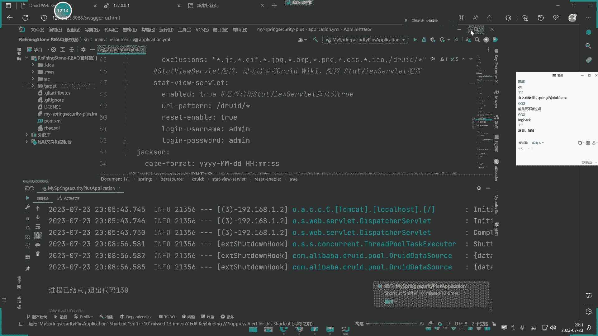
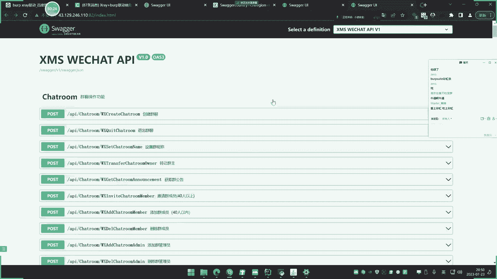
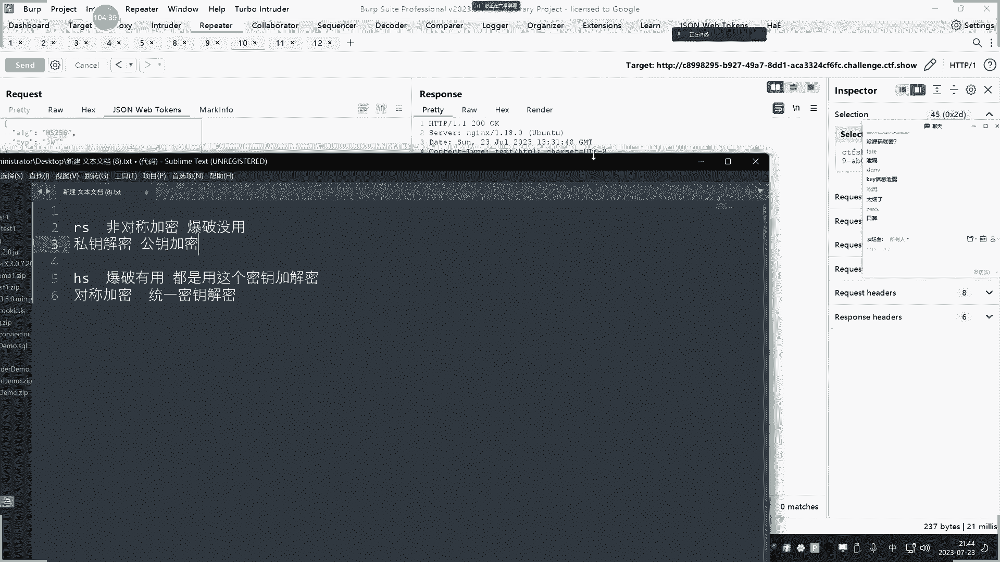
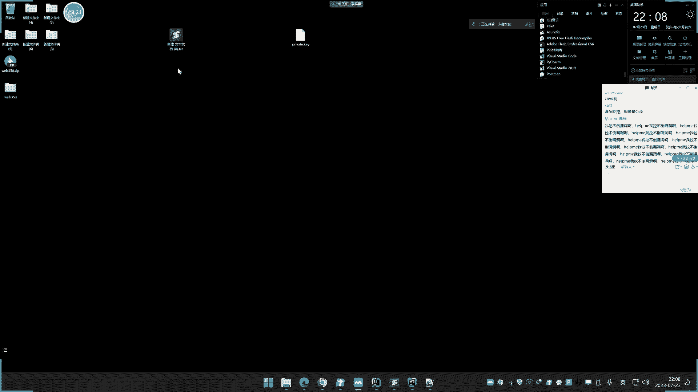

# 【小迪安全】V2024版 全栈网络安全 ｜ 攻防渗透工程师 （持续更新） - P68：第69天：Java安全&JWT攻防&Swagger自动化&算法&签名&密匙&Druid泄漏 - 逆风微笑的代码狗 - BV1Mx4y1q7Ny

的内容啊。

今天呢讲一下这个三个知识点啊，啊有一两个字典呢后面还会讲的，像这个时装狗的这个自动化的一个漏洞测试呢，今天做个简单的讲解，后面讲PI的，那个时候呢，我们来个这是比较真实的。

一干一的去讲这个stronger，然后今天的终点是这个JWT的这个工坊，我们先说一个小知识点啊，先把这个DRUID讲了啊，因为这个是上节课遗漏的。

其实他应该是上节课和那个spring pa u c t o啊，那个监控呢差不多的，把它放在一起讲会好一点啊，上节课忘记讲这个东西了，把它补充一下，今天主要是GWT和stronger，张哥的后面还会讲啊。

这个JWT呢今天终点，然后我们看一下，今天给大家支点讲三个，先来说一下这个DRUID的啊，这个呢现在也有点用的少了啊，不像是用了spring pro的UCTOR，那那个比这个阳痿用的多。

但是这个还有一些市场份额，这个是专门来监控，在java中呢帮忙监控这个数据库连接池的啊，我们可以看一下这个东西啊，这个干嘛的，然后呢他的一个配置不当，会容易造成这个未授权访问，导致的一些信息泄露。

然后我们通过这个信息泄露呢，来获取一些有价值的信息，我们具体给他看一下，我这里的打开项目的，把那天那个项目给他删了嗯，这还是有点小麻烦好吧。

先打开一个吧。

现在是这个DUID了啊。

这个项目我们先把它启动起来啊，这前期的这个安装启动的锁骨啊，我就不在这里啰嗦了啊，打开一下，这里要把那个数据库位要配合起来啊，库要启动起来。

然后呢呃他这个源码里面呢，就有那个DU的那个操作啊。

那么一般有这个东西，从黑河和白河两个角度怎么看待这个问题啊。

黑客的角度，那其实那就只需要找到这个地址就可以了，就是在它的当前目录啊，我觉得这个地址呢有这个DURD这个东西，就是了啊，然后现在呢直接等打开之后呢，它这里就显示这个东西，你看上面有什么东西啊。

有什么12口监控web应用，然后什么URL监控，还有这个什么C型监控，视频监控，还有这几个地方，这几个地方呢比较有意思的几个地方呢，就是我们这里关注到这几点啊，比如说这里呢我们可以这个得到他的UR路径。

然后呢我们尝试去访问这个UR路径呢，他是不是能测出一些未授权访问的系统功能点，就说我知道有哪些药，我尝试去访问看哪些内饰吧，不需要登录就能访问到一些敏感的地方在访问。

还有一种呢就是说如果说有这个验证的话，我们再通过这个UL地址和C型信息呢，同时配合，就是说这个地址呢，把这个C型的写到那个访问数据包里面，然后呢利用这个BUBU的修改之后再尝试访问。

看一下是不是就绕过了，就说呢他这里呢会有这个C型信息，还有这个UL的信息，对不对，访问带附带C型的尝试去访问来测啊，直接测URL呢就是测他的直接访问的，还有一个就是配合C型，对不对。

然后呢如果说有后台路径的话，再去通过这个C型过来的信息去访问它，那么这个呢直接打开，那就这么个界面啊，这里呢这种呢就是说配置不当导致的未授权，这个东西呢是需要登录才能看到的信息。

你比如说像这个SQL监控啊，你在执行的这个语句是吧，他也能有这个查看到他这个专门监控这个，SQL功能的一个信息啊。

那么我们可以看一下啊，在这个项目中呢，黑盒里面就直接访问那个页面不存在，就是车发白盒子，就是搜这个DRU的DRUID这个地方，它的一个配置在哪里呢，我们可以看一下他一个配置是在里面。

然后这里有个登录上密码，在这里配置的话，来我们把它启动起来之后再重新启动一下啊，那么现在呢就需要登录这个密码啊，就如果你没有设置它的话啊，这个项目中呢，那这个就是直接访问就可以看到。

那如果说你这个设置哪里看，我们要登录啊，所以说这里呢有两种情况，一种是需要登录的还是情况，那就是直接看懂啊。

登录的那就是在这里自己配置的啊，看怎么配置情况，在源码中，如果说在这里要配置了这个东西的话啊，那么就需要登录啊。

如果没有配置的话，那就是未收全放，我直接可以看到，那登录进去之后呢，就是通过这些，比如说我在页面中单是吧，随便登录访问一下，操作一下是吧，那点一下，那么这里就会有信息，那就当前执行的一些信息。

通过信息包括UL路径啊，由于这里呢它上面没有配置监控这个UL路径，所以这里没有信息啊，web访问的路径呢，还有这个C型配置好之后，这两个星期都有有了之后。

就通过这些东西来做这个事情，所以他的攻击点呢就是这么个情况啊。

上面查又要路径去访，又要路径车上面有没有这个直接访问到的，没有的话，配合C型的再次访问，就这么个东西，它没有什么其他信息啊，所以他也是个监控的啊，和那个ACAUT呢差不多的功能。

只是说这个只有一些简单的信息，ACET的那个要信息多一些，这个是我们一个题外的啊，大家记住一下就可以了，它造成的安全问题，那就是微生访问和信息泄露，白盒中的话直接搜他的配置信息。

那么黑盒中呢就是访问那个特定的月敖地址，来看有没有就完事了啊。

你可以在这个风口上面那去看一下是吧，DRUD上面对不对。

搜一下啊，嗯还是应该还是有一些这个使用的一个，场景的啊，这个是在登录页面吧，然后他有几个产品像这个阿帕奇这个UID呢。

还有包括lo，这个类似的一些登录啊，这个是另外一个数据库的一些信息。

还有一些呢就是直接登录进去就可以看到，有一些那就可能是需要我们这个那个啊，然后这个是另外一个产品啊。

不是我们说的那个监控产品，这个是另外一个，它还包括一些这种漏洞啊，还有个2023的一个漏洞系列产品，联系的一些原代码，哎我们这边就不说这个事情啊，因为在后面漏洞服务器都会做这个事情，打简单了解一下就行。

因为这个东西说实话实战中碰到还比较少啊，不是很多，像上面两个就比较多了，好我们来说一下这个stronger，这个呢正规来讲，这个安全问题呢属于接口的安全问题，窗口是干嘛的啊，他是一个。

API的一个接口服务是归类到Rest for接口，那其实也是一个web接口，然后这个有什么用呢，为什么要有这个事情，这个干嘛的，前期有讲过啊，它通常在java中呢会比较多用的。

他的方面呢就是在程序项目上线之后啊，很多这个开发站长或者说管理员呢，为了测试一些接口和访问的地址，是否能够正常的接收数据和，数据的发送和返回是否正常啊。

他就会用这个stronger呢来进行一个在线的测试，那么这个东西一旦有了之后，它会将当前项目的所有要调试的，这个又要地址和接口进行展示，给予了这个商业开发者的一个方便，也给予攻击者的一个方面。

攻击人呢就是直截了当的，就能看出这个网站上面有哪些UR地址，可以怎么去请求测试，所以说一般的话我们可以通过这个stronger呢，作为攻击者的话，是可以测试一下常见的漏洞，比如说访问上面的诱饵。

有没有微缩权，访问上面的参数提交，有没有SQL注入里面的文件上传，有没有文件上传等漏洞，但是由于这个东西啊，它这个接口呢太多了，一个个测试呢又太费时间，所以一般呢我们都会采用自动化的一个接口，漏洞测试。

前期的课程呢，我们就简单的给大家用过这个postman，来实现一个自动发包的一个测试，那么如何联动商这个漏洞测试呢，这个就是今天的一个课程啊，后期呢就会在API的那个课程里面呢。

我们会有一些僵硬的使命呢，来从你那到漏洞的发现，先来看一下啊这个东西的一个情况。

前期的安全开发呢有简单讲过这么一个东西啊，我们可以看一下二前期的讲故。

然后我们这里呢也可以在这个，地方呢可以看到这个网站呢，也配置有这个东西哈。

你看一下啊，那一般页面地址呢，就是网站的这个stronger页面地址诶，忘记开了。

这个是在java项目中比较出现的啊，就这东西，那么它上面就会集成有，对你这个项目的一些地方进行测试，那这个项目地方测试呢，其实就是我们这个网站一些功能点系统管理，用户管理是吧。

点一下呢是不是有这个正常用户回血，那数据都有显示，你点一下呢用户列表，然后再来个揣，点一下try，那个日后它会尝试性的去在这里发包，然后这里呢构造你自己想要的参数，写完之后点击执行，执行完之后呢。

他就尝试去请求地址，求地址后面是回血，所以说呢他其实就是将网站上面的所有的一些，接口信息啊，包括访问的地址信息呢都进行了显示，这也是帮助我们攻击者啊，就说他本身是设计出来的，是给这个做这个项目的。

这个开发人员来测一下哪些地方的写没写对，是否功能正常，是做这个事情的，但是给攻击者呢就提供了一个什么，他也可以测这些点了，那如果做到这里呢有漏洞是吧，我们就可以点进去的车。

比如说我这里呢就可以自己把一些这个，主参数啊陷进去呢来尝试测试了吗，不对，比如说我这里面就写个字参数是吧，写生啊，然后点后面的这个测试，那么同样道理，文件上传这里也会有，如果说有文件上传的点，那也会有。

那就可以测这些漏洞呃，你比如说像这里菜单管理那里对不对，正常来讲，如果说没有登录后台，这如果是后台的功能的话，系统菜单管理如果是后台的功能的话，那在这里车呢肯定是看不到啥东西的，大家既然有这个点啊。

你正常操作的话，你也不知道菜单管理啊，其实请求这个路径的这个UR，你肯定不知道他这里给到你了，你就可以尝试着继续对这里去请求，如果说数据能够正常的回血，那恭喜你，这就是一个未收权仓，为什要访问。

因为你没有登录，按正常来讲，这里那是不可能回血数据给你看到的对吧，但如果说有这样的，你看一测试之后呢，他把一些信息工作空间啊，控制后台啊，什么系统管理，这些各种各样一些这个数据都显示了，是不是。

这数据应该是菜单栏里面的哪个地方对吧，这显示了，那说明这里呢就突破了这个什么后台登录，来尝试尝试着登录进去，但是你也明白啊。

这么多攻击这么多地方啊，就是我这里写了一堆，但实战中可能可多可少对吧，他有可能有几百个，上千个都有可能也可能很少少的呢，我们还可以手动点一下多的呢，那不可能一个点的呀对吧，你说后台火焰，谁先点一下。

测一下他那个返回状态里面，是不是这个后台里面看到的页面，还是说本身就看不到买车，所以说我们就前面，那就是讲的是用那个postman去联动。

那如何联动呢，我们再演示一遍，演示完之后呢，再结合漏洞测试，postman呢我给大家准备了一个中文版工具，网上都是英文的，中文版呢就是版本的稍微低一点，还是去年那个版本。

今年的版本没有中文版，网上找不到这个补丁，这是中文版啊，然后呢这个怎么去批量词和它啊，这个也是API的一个车，是经常用的一个测试工具啊，我们这里呢先点这个就是最新版的就不更新，不要更新了。

更新就变英文版呃，这里呢就点导入，然后连接是吧，把这个地址写进去，这样写的是不行的啊。

要注意写这个地址啊，这个PIDOC通过整理得到这个点击。

然后这里呢根据自己需要啊，我们一般就默认就完事了，导入好，这里呢就你看啊，他就会把这个所有的地址信息，包括刚才测的user里面的那些地址呢，他全部就把你这个什么整理到这个类里去了，选中这个最上级。

这里啊啊这里有个叫温性集合，或者点这个地方的一个韧性也行啊是吧，然后呢根据自己需要传序选完之后呢，这里有个保存响应，就是看那个返回值了啊，点击确认。

如果说这里呢有这个文件上传的操作，你这里那还可以治的选这个文件，就是如果说碰到有文件上传了，那你就可以尝试呢是吧，让他上传这张图片试一下啊。

都要把它放进去，然后呢点击这个数据类型选择下啊是吧，JS数据还是表格，数据还是不知道对不对，这个呢我们就由于他没有文件上传的操作啊，我们就不选了，免得这个增加这个时间的一个返回，然后点击这个勾啊。

他这里要包戳这个包戳是什么情况呢，你可以看一下啊，包括信息说是这个月要低值，那你看啊，他说这个错误的又什么情况呢，这里多了两斜杠，这啥情况造成的呢，注意啊，这个地方碰到这个错误，点一下这个变量。

这里多了，因为刚才AP呢多加点些，刚说第一次错误，我们就把它去掉吧，这刀去掉啊，点击保存，这样子呢我们再测一下，看一下是不是就好了，重新再来运行好，他就撤下了是吧，他就针对这个某一个啊。

我这个所有点的都测了一遍，但是你可以看到啊，大部分车的返回是个什么，500错误发挥是500错误，为什么是500错误类高高，为什么这个500除测这么多点，可以看下这个结果啊，结果里面你可以选到这里来呀。

那他这里请求头和响应内容过期，为什么呢，说明这点要登录啊，踩这个点要登录啊，为什么，因为很简单的道理。

我刚才在浏览器上面测的时候，比如说我车这里啊，我点赞你的时候啊，比我是真的好点，给它一次性，他有一些真超信息能是能返回的。

当然都是回200都会到这里，那变成500了。

这啥情况，是因为啊我现在呢，那我这边是登录了，我是登录状态，然后再测的，其实他这个接口全部是他后台这些这些地方的，这个地方在测，对不对，但是你的post闷着你呢，很清楚他有没有登录啊，他没有登录啊。

对不对，而且不仅没有登录，你可以关注一下，他这个地方的一个车子的地方啊，你点一下这里啊，看那个结果来，结果呢这个请求投着你呢，UA头是这个POSRUNTIME，7。2点什么鬼东西呃。

正常就说你正常个人的人工的去测的话。

这个请求头呢不是这样子的啊，我可以看一下，就是我点赞，你让我自己测啊，我try1勾一下来，我执行的这个请求时，应按照这里来讲的，是这种类似浏览器这个请求的，就是说如果对方呢有对这个请求头呢有些过滤。

它会有一些检测的话，那么你用那个postman，你啥都不修改，你那车呢他可能就不行，来正常来是这么个数据包。

所以就是说如果你要真正在实战中去测的话，不仅呢要改动一下这个测试的变量里面的东西，什么叫变量呢，就说你在车的时候，那这个里面的值呢要进修改，就是那个数据包的那个东西要修改。

而且呢你可以看到他这里说有没有授权，啥意思呢，就是说你要测的话，如果你有这个相关的一些普通账号的一些K啊，你可以把它加到这里面去，就是带有用户登录的测试，提供这么多，能理解吧。

然后呢数据包呢写到这个地方的，现在身体不能，那么你在测的时候，就能按照正常的那个请求的那个东西呢，去测试它了啊，好那这个呢我们先不管他这个事情，那如何这个怎么和漏洞有关系的是吧。

我点了半天返回了五百五百出，我也不知道啊，我给大家看一下啊，他这里面有个年度年度，那是怎么联动呢，如果说大家有学过什么巴布和XAYAWFS，那些联动的话，这个问题就很好理解了。

比如说我联通到八部书的上面去。

我把他的水书完了，给他罚到车的水水，把他给他罚到八部书的上面去。

然后八不速腾，那再做个什么事情呢，再通过一些这种插件呀。

或者XAAAY再联动啊，哎就OK了啊，比如说我现在给他看一下啊，我联动下这个什么巴普。

把他这个请求的数据包呢给他发了，这去8P要联动这个8P的一个联动方案呢，大家都知道啊，现在我这个8P的不花屏了，我把它解决了啊，我告诉大家是什么问题啊，不是我显卡问题。

是之前我开了那个显示那个真鱼的那个软件，现在不花屏了啊，香的很，我想他花他都不给我花了，我舒服的要死，对不对，终于不花了，那这里呢是8080端口，对不对，然后大家看一下啊，你就把这个这里的设计啊。

这里有个设置代理添加代理8080添加上，这里就不开这个验证验证这个账号密码，不搞那些事情，搞好之后啊，对不对，好关好，现在我们再来看一下啊，我把它一根一勾对吧，看这两个历史包，看这个历史包啊。

勾来所有的测试的东西，那就到了，我这个是吧，到了我这个发布的上面去，对不对，那我再搞个事情对吧。

那XARY，大家也知道XRY那个扫描工具对吧。

XLY呢在巴布斯在转发不就行了吗。

就是巴普勒和那个XLY呢，一年多的那个操作是吧，这个钱上节课上期讲过，像这期呢还没讲过，这建筑这个X2Y呢进漏洞扫描那个X2Y，那怎么办呢，这八不速腾呢是吧，在这里呢USGT里面设置一下。

转发到本地的一个端口，然后呢你在那个执行的时候，那就加上这条语句执行，那他就接收到了，那我们试验一下呗是吧，比如说在这里呢那个UI在哪里，妈的新版本我用的不太习惯呢，行吧，那又该在哪里，设置里面吧。

是不是在这里呢，妈的这鬼东西network里面是吧，应该是在这里哈，看一下是不是小欧带你，应该是这里，是这个地方吧，应该是来这里那个这个写上这个地址是吧，然后7。0。01是吧。

然后四个启端口类型的空点确定勾选上呢，在X2Y里面的执行的时候呢，就这样去操作监听这个数据包啊，我们来就找到XRV，这上面有没有啊，程序里面有啊，这是那个工具包里面的啊，无所谓啦，咱想怎么用就怎么用啊。

这个也是没问题的啊，X2Y不运起来呀对吧。

我就演示一下，因为这工具这些东西呢啊。

你这个这个后面也会讲的啊，就说现在的是联通这个简单就是要做漏洞设施。

还有很多细节要做啊，点一下这个执行啊，然后我们可以试一下啊，他这里呢就监听到这个数据包呢，把它转换，先把这个数据包给删掉，重新来试一下啊，就是这边呢一旦数据包发了八部，八部都转发了这个S加YS2。

对数据包进行漏洞测试，就是那个流程啊，就是结果呢我们再运行一下的勾，好热情啊，你看看他就开车了，你看他车起来了，是不是想死我了，对不对，这个东西呢就是你要自己学会哪个啊是吧，然后等一下呢我把JWT讲。

JWT讲了之后呢，你再反过来再看，你会发现有很多细节点嘛。

我们讲漏洞发现呢，这个怎么讲啊，哇咔。

所以说呀你有时候思路转变一下啊。

这好办的事情那么难嗯，我们这里就不点它了啊，让他随便他去了，不管他了。

后面我们会详细说了，因为这个字典呢我们到时候要在那个，在那个什么呀，在那个，嗯API的那个字典里面会详细说的啊，刚才有人说这个什么花屏怎么解决啊，告诉大家啊，你把那个显示帧率的那个软件关闭就行了。

就是什么小飞机啊，那些观景啊，那软件把它关闭就行了哈。

好这个是stronger啊，呃其实呢就是说你呢把那个发包发了，转发到巴普，巴普呢，在可以转到什么X2Y呀，或者是我们后面还会讲到的什么aw f s啊，还有这个什么view map啊等等一些。

只要能够支持监听，这个工具就是有代理配置，有监听的，支持这个功能的，基本上都能转发过去，转发过去呢，再用那个这东西呢，对那个包呢进行自动化的一些检测，那就不需要你手工再去一个个看的啊，他会帮你自动车。

所以你就找到就可以了，你可以看一下这个网站是非常多的，不是说我们对不对。

那个RPSGO这个东西太多了，网上这种接口都可以是吧，测一下啊，我找一下，我这个不测国内的吧，这不吃干嘛呢，这是太卡了，这网上过外网太卡了。

终于质量起来了呀，那这都是让时装的，你看看这都湿的对吧，你看他吃这么多，你自己拿车拿车到什么鬼时候啊。

对不对，这都是网上一些哪个网站自己的一个借口。

然后呢这个开发者做了这个事情，他肯定是有些车的啊，你看这个抖死的啊，你就测那些地址上面有没有未授权啊，有没有那东西对吧，都死了，你看这里也不知道是哪个对应哪个应用的，但是如果你能测出来的话啊。

能测出一点的话，你可以在里面再去找这个信息，他都是这个存在的，你看啊，刚才是本地压力也是你看我这里呢对不对，用这个东西简单看一下啊，看看能不能吃啊，对不对，运行集合呢给他来一下，也是报这个错误。

这个错误呢基本就是个低质错误啊，这个低错误呢放环里面来改就行了啊，这里注意一下，这是网址信息吗，信息这个是哎，刚才听见是这个吗，是这个吧，这个地址啊，斜四到这来，然后你看他多了两斜杠，去掉去掉就完了。

再来，这不就正常了吗是吧，就开始测了呀，对不对，你看他尤其是500错误，401错误401就是这个东西嘛，那肯定是要找一些200啊那些东西，然后有些人可能是你这个头部的事情对吧，你看这个星期都来了。

对不对，然后呢哎这个就来了吗，那你自己在联动啊，我这里就不讲了哈，比三个黑客好用，我跟你讲，你网上看一些文章，和我这个自己给你讲出来是不一样的，知道吧，我都是从网上看了之后，截取了有经典的，有用的。

我才会跟你讲，我就不看了啊，这个是真实应用，我不看了啊，就是这个车法好，这个呢这个黑河中如何判定，白河中如何判定。

那白鹤也不用多说了，你看这个项目呢就有这个事情呢，stronger里面的引用过啊，他这个配置文件了呢，还用过这个stronger吗，对不对，然后这个应用呢白盒中呢很好发现。

黑盒中呢其实也非常简单，基本上呢就是访问那个特定地址。

就是我们说的stronger ui d t m，然后呢版本不一样的这个地址有点小不一样。

但是前期我们讲的那个ACT的。

那个OR的利用工具里面有集成这个扫描啊，就是常见的目录扫描里面会有这个录音地址的。

扫描，判断一下就可以，我们后面也会讲啊。

好我们来正式进入到今天这个终点的一个支点，就是这个JWT的啊。

是stronger的话，就是个接口啊，就是你可以通过这个接口呢找到更多的测试的，UL低值呢，测它也没有漏洞，这个知识点呢在API接口呢我们会详细说的，因为它是属于API接口里面那个部分啊。

我们会到时间去联动各种工具呢，来修改里面的变量值来实现突破一些是吧，一些问题啊，就是刚才刚才刚才看到什么500错误啊，401错误，有些错误呢并不是说他没有漏洞，而是说什么请求的头呢没有改掉所造成的。

还有一些呢就是里面的那个数据里面有更改，啥意思啊，刚才我提了啊，就是在这里呢他还有一个东西。

就说你点这里呢，你看他有些数据要带入进去，你看这是比如这里呢他去请求的时候啊，那在他这里有个token是吧，这个要带入进去啊，你这没有啊，是你车的时候就像是扭空了，那这个呢如果说你自己知道的话。

你这里可以填上去车，那可能会更精准一些，所以说啊这是我们后面要继续做的事情，就是要更改请求的这个头，更改这个数据包这里那让这个测试更为精准，就是后面要做的好。

这个呢就说到这里，我们今天来看一下这个ZWT的啊，明白DRUID是监控数据库词的，java里面的应用，然后这个stronger也是java里面那个项目的一个API，接口，来去帮助这个挂你门是吧。

来测一下当前项目中的一些接口，是否正常接收和返回星系的一个地方啊，给攻击者提供机会，那这个JWP又是什么呢，JWP呢类似于java里的那个SHOSHO组件，它是用来做这个身份验证的。

然后呢他和C罗有点不同之处，他这个图形是为了取代传统的cookie，加C型的身份验证方法，在早期的都用cookie后面呢更安全，选用了C型，那么随着这个时间进行了，这道题的这个技术也出现了。

它是一个JS文的格式的一个技术名字叫js web啊，他是什么情况呢，C型呢它有个差异，C型呢就是这里我可以看一张图片啊，这是JWP那个验证的逻辑图。

登录账号密码之后，服务器会创建一个JWP的一个东西给你，给你之后呢，你去带这个东西去访问浏览器，浏览器接收到之后，它会检测这个GWP里面的签名信息，再通过这个里面的信息呢给予相关的返回。

是用户是真实用户还是加用户给予相应返回，所以服务器在这里呢他只做了一件事情，做了两件事情，第一个就是执行，那就是给你一个JWP的身份，最后再验证他老的这个C型呢是怎么做的呢。

脑的C型会产生一个文件名字叫C型文件，它会比对你当前访问的这个C型呢，再去比对这个文件是否和它对应商，来确定是不是这个用户，这是以前的那个C型验证，那JWP呢就把这个东西给取出来了。

就是生成一个JWP不会产生文件，所以从这个根本上面让它解决了一些效率问题，也让这个更加方便，所以在一些后面的网站中的，一些分布式的网站呢，就会采用JWP来进行这个身份的验证，他就是做这个事情的啊。

那么在java中JWP级数呢也是很多，很多都会用到这个JWP的编程，包括我们熟知的一些大网站，好多都是GLP，那如何判定是不是接到P，它的识别是怎么识别的啊，人工识别通过看看三部分，标头。

有效载荷和签名三个部分呢，通常第一个部分以1VJ为主，这是我们这里看到的啊，来一飞机为主，然后呢还有一部分呢就是什么呢，就是点点部分，我这里呢给他看一下，我们可以找几个案例给他看一下。

和我接WP，他有三个部分啊，这里的一张图片我们先看一下啊。

然后再看这个例，这是他的一个典型的一个这个JWP的值，第一部分称之为头部，第二部分称之为PO的部分，第三部分为签名部分，中间有个点分割，那里凡是看到了1V7开始的那一飞机开始的，然后后面还有点。

那不用看了，直接打P3部分啊，然后每一部分都有什么对应的东西呢，这里面解密出来是base6是编码的，解密出来之后，通常会有一个叫ALG的字，表示当前采用的算法类型，第二个是tap类型。

就是表示他的这个类型啊，然后呢这个有效载荷里面有这些啊，这些呢你等下可以自己去看了之后，再对应查一下，现在呢不用去理解太多，签名呢就是对上面两个部分来进行一个总结呢，称之为这个签名。

第一部分呢就是对这个头呢做了贝斯六四，第二部分呢也是对配头头做贝斯流斯，第三部分呢，就是将两个呢头部和载荷呢总合在一起，再进行配4。4啊，这是他的一个大概的一个组成啊，然后给他看一下他这个扮演角色。

第一部分，标头呢会声明一些加密算法和加密类型，第二部分呢就是用来存储一些值的，也就是说我们大部分的数据，只会在第二部分里面都会有用户的什么id值啊，账号名字啊，或者密码呀。

或者生存时间啊等等一些信息在里面，第一部分呢就是那个JWP的加密信息和，类型信息，第三部分呢就是这个当前的加密值的一个签名，这是它的组成部分啊，就是每个部分都有不同的角色。

第一部分呢就是我们说的这个信息的，JWP值的加密的一些信息，第二部分呢就是加密的数据，第三部分呢，就是对这个前面两部分的一个总和签名，这是他的一个大概三部分啊，识别的话可以通过人工识别或者插件识别。

或者是自己去看，我们呢刚才看了这么一个图片。

看到了啊是吧，这个是他的一个大概的一个类型的一个数据。

关键点呢我给大家列出来关键点，那就是这个地方，这是一个关键点。

这个一飞机，这是个关键点，这是它流量特征啊，以后呢如果说有人在这个面试问到你GDP的话。

这个特征啊你要知道怎么回答，第一个特征就是我们说的啊，只有这个地方，这是啥特征，就是前面两个部分啊，头部和这个PO的部分，这个PO的部分是头部，这是签名部分，它有三个部分组成。

三个部分的间隔符为这个点为这个点啊，这个点这边有个点啊，建个负极为一点，然后呢在头部和这个签名部分呢，前面的首选三个字母是不变的，就是一飞机啊，这是它的特征啊。

这是它的这个值的特征啊，记住嗯好。

那么现在呢我们看一下这个网站中，有没有这种一打飞的呢，我看。

我记得这个CSDN，好像有这么个EWT的特征，这个网站有，因为上面有个什么鬼梯子，我都忘记了。

看一下，你其实我跟你讲啊，你这里自己看呢，说实话啊比用工具看的会更加的明显，工具看财经看更明显。

我直接说不用工具看啊，直接给工具看吧，等我们把这两个工具加好啊，一个呢就是8P插件，这个是用的最多的这个HAREHAE，这是YSRC的一个必备的插件，还有一个专门针对这个JJS呢，两个都装上去吧。

装法的话，这个场景呢在他的这个市场里面有那个HAV，H1呢，那是在在我们自己要下载相关地址，我也改改了啊，并且今天也打包了，再看一下啊，就是在它的官方里面有个JS文的，这个地方呢要把这个下载好啊。

这两个一攻击下下面这个就可以了，点击安装就完了啊，这里我安了，安了之后呢，在这边有个这个东西呢是吧。

然后他特征里面的这里有个配置文件，它的特征呢其实呢就是在这个数据包里面，通常会有这么个值，这是它的一个特征，然后再就是那个值的特征，这里再回到标识为黄颜色，这个可以根据需要修改一下啊。

我们这里不改了吧，把这个装好啊，就放这里，然后呢还有一个插件，就是我们AHA加一啊是吧，这个呢是吧，自己安装啊，来这是我安装的啊，自己点添加嘛，把它选中啊，我给他打爆那个AHIA呀呀对对对，就是这里啊。

目前最新版本是2。466J8的，还有一个G9G9是那个java9版本的，这个J8的八版，我想要个八版本吧，好不选中，要点下一步就可以了啊，这里我已经装上去，然后勾选他就进去了啊。

然后这个A加一有什么东西呢，诶这个怎么没显示出来鬼东西呀，脑子不给我显示，我怀疑是不是这个分辨00H1，怎么。

扩大了也还没显示，重新打开一下吧。

这个最新版本里面的有个那个啊，有了你看一下印子的配置啊，这里点一下配置，这个配置文件能给他打包了，自己把它进行一个什么把它选中啊，这是我这个配置啊，这个配置文件呢没有啊，都是有的。

在那个官网上面的都有啊，就这个地方那个配置文件在这里下载啊，官方的那你也可以自行的去修改，我们可以看一下啊，这个地方也是我们的配置。

那个地方呢就是那个配置文件，其实就是对各种东西呢这个正则表达式，通过数据包呢，用这个正则表示去匹配匹配一些规则。

规则里面呢在这个是颜色显示，然后这里可以看一下啊，它这个官方规则里面呢有哪些知识来，这是针对相关信息收集的那泄露的这个关键字，泄露的特征，DNI和REMAI，这是上期啊前面几期我们讲的呀。

那个数据包里面带着东西啊，这个js web t对不对，显示为绿色对吧，那就是这个关键字呢，真正表达式呢我们查询的也能识别它，这里面也有这个东西，那是专给的，刚才说的特征的关键字符，对不对，U1D的。

这是在email啊，什么电话号码的是吧，IP地址的，Mac地址的这里为什么有这样的信息显示呢，很简单啊，一个是挖新泄露的时候是吧，有些个人信息还有VIP地址，就是玩什么RCE的是吧。

还有这个呢RCE的关键字是CMD啊，这种关键字，老混混说，怎么看那个号的信息里面有没有什么鬼，是不是成了什么21，他这个插件呢就把一些关键字，比如说参数里面呢，或者纸里面的带什么CMDEC啊。

这种关键字都给你显酸了啊，你就在那里测呀，该更改命名的去测，也没有RC1啊，所以说有些东西呀哎怎么好说呢，那这反序列化的关键字在数据包中发现了，有什么java的一些这种掉链。

再来个各种的啦上传的关键字啊，发现这里有文件上传的一些关键字啊，各种各样的是这里的，还有这种亚马逊的是吧，这个云服务的云服务的一些这种啊，泄露了这个JS文件泄露什么啊，cask啊，这东西是不是这个啊。

亚马逊的，那你自己那还给自己添加吗，根据自己的规则添加这个规则，比如说巴黎人的那个东西写上去，这个规则呢就需要自己填写的啊，网上有人写过一些，你可以自己再加载，但是就是说从数据包里面去匹配这些东西。

是匹配这些各种乱七八糟的JDBC的呀，一大堆啊，这就没有了啊，你可以自己呢，这是官方的一些啊，你可以自己根据自己需要去写，去在里面去寻找网传的，还是有人写的啊，你可以收集一下有些人一些那种哦。

SRC经常挖掘的，他肯定是私底下的，有些不一样的这种配置的一些东西，官方的就这么多，你自己写的还有更多好，有了这些之后呢，有什么作用呢，好拿下来让大家看一下啊，比如说我随便打开一个网站啊。

我打开网站看是不是这个有这个JWP啊。

这种东西啊，看下。

我们就拿这个stronger stronger的一个搜索啊，在这里搜这个stronger的这么一个东西好吧，我搜stronger的就拿stronger在那看啊。

你看他1+1这里还有这两个东西啊，那个插件啊，这个插件是能够识别他这里的识别的颜色呢。

可以看一下啊，我把它改成yellow是吧，我把它改成一个什么鬼颜色呢。

就搞yellow黄色吧，那个本身的这个hr1里面识别它是这个green绿色。

那个这里呢我们看一下啊。

是不是都能识别，然后这个我们其实不是让它识别啊，它识别功能等一下要解析的时候，它能帮我解析，所以说这个必须要装啊，你玩JWT安全这个场景也比较完。

你等下看一下它有什么作用啊，好我们先找一下，比如说我随便打开网站啊。

看这里啊，它能是不是识别一些不一样的东西出来啊，一个是1+1的东西。

一个是我们说的那个GWT什么鬼啊，这么狭窄的。

我们先这里把代理开一下啊，这个巴里马丽庄府代理开一下。

确定了，我开了之后啊，你给讲打开啊。

你看第一个那女的就标了关键字，匹配到了口欲望，JS的更亮了，都亮了是吧。

然后如果说里面这个有GDP的，那就会把GDP我们多找几个试一下，他总有会有JWP的一些这种验证的地方吧。

不可能都没有吧，是不是给点一下这种登录的一些操作，可能这里是GTP的音，证实一下吧，勾一下他匹配的地方都有了吧。

诶怎么卡了呀。

诶我没卡没卡啊，他都是匹配的时装，他妈的，我接到了你妹的，我考完刚才找那几个的时候死机。

WP这几个都不是。

GWT那个燕子，那也没什么关键字去测啊，哎我要是哎我直接这样子啊，这样一个点就撤到猴年马月，我不是这样的啊。

不要紧，找个那个。

找个那个postman帮我吃啊，批量跑，跑完之后呢，我看那个数据包来着，这一个点点到马，太卡了啊。

找一下之前刚才那个，刚才那个车子那个地方有啊，我看到过那个G大P有个地址上面是有。

那你看这个学院的权限，这都不用看了，这个网站应该是个一流的SC的啊，那看来有了，你看看，那是不是啊，E非EYJ那EYZ3个点我们来确定一下呢，刷新呢这第一个点头部，第二个点什么PO的部分。

第三个点就这里签名部分，你看他妈的这个API否否的，用的是GWPJWT先生，然后然后你说哎呀，我怎么JWT在哪里看的，要解析这个数据怎么办呢。

把它解怎么解析呢，一个呢是用官方的这个JWP的官网。

就是这个技术的官网区域，在它上面的区域，在这里呢把它写上去，那他解析了，你看ALG它的这个加密类型为HS512，KID是什么呢，KD是什么呢，KD是他这个头部里面还有这个东西呢。

其他数KD这里PO的是他这个值，你看use name小的SC，其实要说他怎么知道我是小林SC这个用户呢。

就是因为我服务登录了呀，登录了那个地址就是小DC嘛。

他知道我是个小DC用户，其实呢他就是通过这个PO的部分呢啊，比如说你啊你这个用户的id值是R8R73，然后用户名是小的C然后这个是时间戳，就是EXP嘛，一叉P对应的值，你看看就对。

这道题的过期时间就是时间戳时间戳了，你可以往上转换一下是吧，然后这是我的mid值，那么大家试想一下，如果我把这个值呢一改，我把这个us改成一个小笛，对不对，然后我也知道id号，id号一改。

那会不会这样子，发包的话，他就会认为是这个用户呢，所以说我现在改个艾德里，那会不会就是管理员呢，这就是那个aw的测法，就是尝试性的对这个PLOAD进行修改之后啊，来法宝来测一下。

是不是会造成一些用户权限的这个什么跨越，这种类似的事情，就是导致这个身份的认定失败，就比如说你正常发包过去啊，他认定这里解密是小于C，所以他他认定你是小S，如果你这一改数据包重组。

那么发过去会不会这个用户，那就判定为其他用户的，是不是，所以说这就是说他的车法啊，你看他这个人呢就展示出来了，而且这是这个官方去展示，如果说你装了这个插件，你看啊，我把这个插件呢给他发过来。

repeat模式，下面这个叫make a refo fo，有些是能展示数据的，来看这个地方应该是有来看看这里的，那这里就有这个显示啊，你看这里面有JWPF和F，里面那个也有JW数据。

你看你看这里有个叫JONWTC，你看它自动帮你截出来了，这个裁剪的看到没，你没有装，它是没有这个显示的啊，你没有装，你怎么发包过去呢，发到这个repeat这里来看一下啊是吧，它自动给你显示啊。

你看然后呢这里就有一些攻击点，那你比如说比如你那后面就讲这个攻击点嘛，然后呢你自己要修改，它就会自动重组，你比如说像现在啊他的这个GLT值是这个东西，我们给做个备份啊，做个备份啊，这是我们JW值啊。

我们选择来看。

啊这是他目前的啊。

你看啊，我这里呢尝试性在这里修改，比如我改成这个小改完之后呢，你看一下啊，这个字你看。

有没有修改，那是不是修改了。

明显在大家看一下，明显短了，短了就是修改了呗，所以说这这这这就可以怎么样，在这里是吧，根据自己需要的微修改，修改就撤了呗，然后呢你修改之后，这个包自动也修改了呀，哎发包诶。

会不会把我认成小迪在线测试呢吧，所以说这个插件呢也是要把它必备的哈，你不必备就不行了，你看看这个识别就不说了呗，这个插件也能识别它，然后你看这里还有什么RC的关键字，就在这找这些RC关键字。

这插件能识别它啊，包括这个RAAA加1RGSN，这两个都能识别啊，这都能识别，这都不用说的啊，你，假如这个绿色是什么，黄色是我们那个插件识别出来的，然后这个绿色的是那个HEE的那个插件，识别出来的啊。

这个就不说了啊，所以它的识别呢非常简单啊，人工识别也能看出来，人工识别，看这个数据包，这里面这个三个点的EYJ的是吧，就是一般看这个cookie里面，然后以这个值为准的啊，嗯好查点呢也能十点。

这就好简单了，那么现在呢我们就来说一下它的攻击点啊。

就是它的利用点，十点呢我们就讲到这里了啊，相信大家都会的啊，查检呢人工呢分析呢也是没问题的啊，好那么现在呢我们就来看一下它的攻击点，攻击点呢主要分为四个部分，最常用的就是三个部分。

三个部分呢就是这个空加密算法，还有个是V11V1啊，为硝烟签名，还有一种是暴力破解密室三个攻击点，还有一个呢就是第四点，就是源码泄露了这个加密密室造成的这个重组，JWP呢来实现约权。

还有一个就是这个KID组路，这个具体的参考这个文章，但这个凯迪主呢说实话啊呃不是很常见，很少，主要是前面三个居多一些，我们这里呢用这个用这个CTF修的题目呢，给大家讲。

讲完之后可以看一下网上那个真实的情况，在那接打P呢，就这么个东西啊，我们现在说这个空加密算法中，加密算法的原理是这样的啊，在加密算法中呢，如果你把它改成NJ1W呢，是支持把算法设定为N就是不使用加密。

那么不使用加密的话，签名呢就会滞空，这样子呢任何东西都是身份的，就给人伪造，这是什么意思呢，它是修改哪里啊，他是修改头部的A2机制，就是把这个这个头部的这个加密呢，正常来讲他会生命这个这个加密算法。

就像我刚才大家看到的啊，那个foo，那个解密说的那个他这里有个叫G的，A7S551R嘛，就这个算法，那算法有哪些可以看到呢，这是他支持的算法，HS呢是miss加MRS呢是啊，HS呢是啊，对称加密呃。

这个rs呢是非对称加密，这个P的不知道啊，啊E的也不知道，这个网上查一下啊，我只知道这个前面两个，这个非堆层和堆层加密呢，大家有没有这个简单的理解，应该知道吧，呃对称加密的话是什么意思呢。

对称加密就是说双方采用同一个密室去加，要去加密，啥意思呢，就是说啊，你就是说你加密的和解密的，都是用一个密室去解密，就是它有个密钥嘛，就是我说的密钥就是一个钥匙，就和你们一样，你有这个钥匙是吧。

你的家人呢也这个钥匙可以同时呢都开这个门，对这种的称之为叫对称加密，就是双方解密和加密都是采用的这么一个密室，这叫对称非对称，就是说一个叫私钥，一个叫公钥，私钥用来解密，公钥用来加密，啥意思呢。

就是公钥去加密这个密文，解密的时候呢，公钥就没有用了，就用私钥去解密，这种叫非对称加密，这种加密难度会更高，那么rs开始的就称之为非对称的HS，那就是对称的好，等一下呢我们会详细说的啊。

这个在GWP也讲解啊，这rs呢其实就是rs的解析啊，是这个意思啊，大家可以看到啊，你看上到我们这个课程里面，男人的好多东西都要懂一点，虽然说不是需要精通是吧，难算法，但是至少这个概念方面。

知识点呢还是要明白的啊，这个是属于算法的一些知识啊，我们简单理解一下就行好啊，那这里呢你看到这个是有的东西，他就说把这个地方改成这个long啊，那么就表示说没有加密，没有加密呢，前期我们学过这几个头部。

你可以看到啊，在签名这个头部呢，它是需要对这个两个人进行签名的，但是由于你的算法已经没有了，所以这个签名呢相当于就是没用了，啥意思啊，它有三部分，头部披露的部分和签名部分，如果说你要重组这个东西的话。

你看啊我重组它，你比如说我这里修改它的确是修改了，但是我告诉你，如果他这里是H512的话，你miss这里没有填写上去的话，你没有填写正确的密室的话，你这样修改之后，对方呢这个铭文它是解析不出来的。

啥意思呢，就和我们加密的时候是一样的，你要加密一串密文，密室里面有闲居加密，就是空加密，那对方呢去解密的时候，它是采用的是有密室的，解密，对应不上啊，你空加密的发给他，有miss的去解密。

那怎么可能会解密成功呢，所以说你这样子呢，你不写miss是吧，你要写正确密码，你这里修改这个数据，这个数据包发给你去，对方才能正确解密，而如果说你这里写的这个long的话，没有加密的话。

那就相当于这个部分就没有腰了，这个签名就没有用处了，所以他这里攻击的理解啊，就是把加密算法置换为空，置换为空之后呢，啊这样子呢签名就没有用了，没有用之后这个算法呢TOK就任意有效。

但是这个攻击点也是有前提条件的，前提条件就是对方的什么样的，本身他就是个空算法，或者说他本身就没有迷失加密才能用这个方法，否则的话他解密的时候呢用到了算法，用到了密室解密，那你用这个方法是不行的啊。

好那么如何判定这个方法有效不有效，如何操作它，我们用这个题目呢去给他讲，在CTF修这个题，这个官方平台呢有五题，五题呢都是针对三个题的一个讲解，第一个题呢就是没有签名认证，第二天那就是算法绕过签名验证。

就是没有验证，签名好，我们一个一个一个讲啊，通过这个武器呢，把上面的知识点都给他学习一下，这是在CDF里面选考的题目，JWP只要是涉及到java或者说身份验证的题目，那个G大屏就是逃不了的。

因为他是现在主流的身份验证技术，好我们再给它把这个。

接着设备所有的题目呢给大家拿出来啊。

哎呀我人都麻了，谁把我密码改了，我真是唉多少次啊，你在这大伙的这样搞子哎，就是说大家老妖妖的人多了，那做题的时候，那就相互的是吧，你把我关一下呀，我把你关一下，大家会有这种现象，所以他直接改了啊。

这改呢可以在里面改，里面呢就直接授权给了，也是，完了完了完了，这他妈的真是登都登不了了啊，这怎么我改了之后还不能登上啊，妈的老有这种毛病，哎呀我都说了，不想那个老这个腰呢，不给也不行啊。

妈的老改这种密码，我真是服了，哎这，还好我之前早找那个人要了一个好，我先用她的号做一下，哎我找一下啊，我找有个人呢，就是后来要了个号的，找一下那个人给我发的那个号，你要是没有这东西。

这现在都不知道怎么讲了啊，唉真是无语，你说这改的，这是谁领的猪来着。

有啊有啊，大家不用发不用发啊，我有，然后这个JWP的啊，来给他看一下啊，那肯定是给的人多了，然后呢有人经常在上面打打的，另外一上去就把他一关，反不过来，直接改了，你不能这样自私，他都是这样子的对吧。

你真想不要和别人，不要和别人搞，你自己搞个号，或者说对吧，你晚一点时间再打，你们休息的时候，你再来转，这个题目怎么做啊。

大家看一下啊，我这里那就不开全局代理。

开全局代理老是卡卡的，我就在火候牛奶上面开吧。

在湖里去做吧，那你打开呀，这个地址打开发现了，你看他说的什么波子EZ flag，在艾米上面对吧，那这个这个都已经给我出来，你看这个插件呢就是这么好用，那个查出来了，他说让我访问这个艾德米去得到。

然后这里是个星系啊，防艾德米得到，然后呢，我们把这个数据包直接发到正面来提交访问，然后数据呢进行一个简单的检测，这是那个数据是不是，然后诶，在这里呢也数据呢可以发到这里来提交，模拟一下啊。

诶这边怎么没有那个介绍的东西了，他妈的真是啥情况啊，狗子的，他这里解析成了这个，还行吧，我这里有三个点，他只用那个make in f，刚才那个介绍那个数据解析插件，里面有激活出来给你，好不管了啊。

我们尝试去访问一下这个艾米，阿米访问之后呢，可以明显看到啊，2D访问之后啊，他这个也是显示那个东西嘛，然后呢我们这里呢把这个值呢给他解析一下，你看啊他只有两个部分，这里的AG为空为long。

这是下面的值。

sub inside my sub是什么值呢，你看下它这个解释。

sub是接到并面向的用户，用户为user，这里为艾米，那我直接改这个名不就行了吗，改完之后你会发现来你不能改它，你改这边就没了，为什么呀，因为你这个虫族呢要写这个字的啊，你重组要写这个字，你在这改。

或者说你这个VN呢这里就不能改，所以这个东西呢就不能这样改，它需要怎么办呢，他需要怎么办，我告诉大家怎么办啊，有两种方式，一种呢用插件搞，一种呢就用这种专业工具，有个JWP的测试专业工具。

网上有什么捷达哈克拉克一些东西乱七八糟的，我直接给他推荐，最好用的就是这个JWP图勒斯，他是GDP的测试专业工具，也是目前我在市面上看到，最好用的一个GDP的工具，如何用它啊，给大家看一下啊。

Python认清JWT的这个文件，然后用杠七是他的所有的使用方式，全部都是老外写的啊。

然后怎么用呢，我们写了这个立法，那是用空算法生成一个出来，就是直接把你得到的JWT值呢把它复制过来。

接着来杠X然后呢这里有个参数GA诶，它就会自动生成一个这个是什么提示，没有伤哦，没有签名，他说没有签名是吧，然后我们这里他直接把显示上去，他说这个没有什么没有签名，因为说这里只有两个嘛。

这个子里面只有两个，所以他说解析有问题，那我这里呢反这种方式哈，把这个值呢发到这个PO的，由于我们知道啊，这个第一部分和第二部分你可以看到啊，这个第一部分和第二部分呢它是用base64的。

所以我可以发到code下面去，在这里给它进行解密，decode解密数据出来了，你看这是解密数据，然后呢你再把这个改成艾米，改成艾德米，再把它进行什么加密，好这个数据已复制。

就是我把这个艾米呢这里改成艾米，就是我改这个地方呢，艾米因为你在这里改的，它无法重组，所以我只能在这个场景这里改编码，改，改完之后，把这里的替换替换成，用户认为艾米再去尝试访问。

他说的这个enemy地址，Go cctf shift，答案就出来了，这个可以直接改，这个直接改的原因是因为什么呢，因为这里用到的是空算法，也说不需要验证这个签名，我们的攻击点的第一个，这个只能第一个点。

那就是这个知识点，利用这个空算法呢把它设置为long，所以这里呢第一这个签名呢就会滞空，就没有，然后呢我再修改这里面的值，它就能重组，如果说你要重组的话，如果这里不是空算法的话，它是有miss的。

你不写miss就是空加迷，空加迷的话，对方是有密室解密就会错误，所以说为什么呢，啊这个东西能行的原因就是因为它这里是空算，就是没有miss，没有miss，这个签名就是相当于没有的情况。

所以你改这里就能重组重组了，就按照那个规则，就是我们说的什么规则啊，因为它的加密规则就是看的嘛，对这两个字进行这个编码，所以说你只需要动这两个字就可以了，先去解码是吧，解码出来之后呢，再修改这个值。

再重新编码，把它重新组合就可以了，因为呢我们就不需要考虑第三个东西了，第三个参数呢是有加密的时候才有，所以这是说第一种啊，就针对这种空算法，把它改成空算法重组，这里面只让大家以为是艾米用户。

从而达到flag好，那现在呢再看第二题。

我帮他把那个关卡给他写上去吧。

好再看第二题啊，好这道题呢也是一样道理，你访问呢这数据包也出现了啊，我先把它删掉，都删掉，避免和之前的中途岛，你访问呢，你看地址已经解析了，你看这就解析了，你放到这来了，自动帮你解析，你看好。

你看现在就不一样了，你看ALG就成为了HS256了，对不对，他成为LS256了，刚才那是直接是long，所以我直接在这里修改它，对不对，修改它能实现，但是现在你看我按照刚才那个思想直接修改。

这里行不行呢，我试一下呗，我就说按照那个思路，按照思路你看行不行啊，发到这个decode模型去，那我进行先解吧，把它写成字符，然后呢你看字都乱了嘛，不用管它呢，这里改成哎，这里是按照刚才那个思路。

然后呢再把它进行编码，编码成这个东西好，我按照刚才思路来，我就这样子，怎么让我一改，对不对，再跟我们新加密了，完了这里请求2。0是吧，Go，请求阿B，对不对，那go没有flag显示，为什么呢，为什么。

重新再发过去啊，为什么呢，因为很简单的道理，他这里已经有这个加密了，并且你看到他的签名都有了，他是三个字呢，一个点两个点，三个签名有，并且是加密的，你这样直接改是没有任何用处的，为什么这样说呢。

那你看哈我把这个值放到这个解析上面去，给他解这个JWP那个平台上面去解解出来了，你改这个地方呢也确是改动了，改动有没有用和用处呢是吧，你这个发过去有没有用和用处，没有用处啊，为什么，因为它针对来讲。

这里会有个密室，这个密室对了，你才有用处，这个miss duino才有用处，米四不对就不行，所以这里有两个解法，一个解法就是保护米四，就是常识呢对这个密室爆破，还有一种解法是什么解法呢，就是指空。

就是我们说空加迷啥意思呢，就是把这里的强制性把它改成long，就是我尝试性把这个算法它改成L改成狼之后，那么签名就失效了，签名失效，就像是没有这个加密的，没有加密的，所以room和token那就有消。

那么怎么改它呢，你看啊，如果我用这个平台改，他是不支持的，你一旦把这里改，那这个东西就啥都没有了，因为它不支持这样改啊。

平台不是这个工具可以支持，看着工具啊，怎么玩啊，工具可以支持，并且插件也能支持这个解答，P呢就这个好处，把抓到数据包的圆形翻过来，先把它解析，看到它能正常解析呢，HS256J打P艾德米。

然后这里是要改成艾米呀，这要改成密码，这个时间戳在明在这个啊，这是过期时间在两个小时，然后呢这个把它改是吧，然后怎么怎么改它啊，告诉大家怎么改啊，看着啊，刚打题自定义修改，刚答题制定修改，他问你啊。

是添加一个值还是删除一个值还是继续，如果我选择E就是对它进行修改，如果选的话，就对应修改，我选择E，把这个HIS256加密方式，改成当写大小写都行啊，两个都行，写这东西也可以写。

这东西也可以写什么东西也可以是吧都行啊，对不对。

感觉摘星那个好用心好，用个屁，这个你改不了，我这个说了吗，你改个毛，你这改怎么改，这个写上去就没了，还听不懂啊。

这个这个也好用，这个插件也好用，但插件呢它的功能没有这个工具包多。

工具包多了，你玩的跟深度有很多功能的，还有这个是用dd扣的客服，我真是服了，你有没有听讲啊，有没有听讲啊，啊你们说那个decode行不行呢，有没有听讲啊。

我这他妈的刚才在做这个事情吗，我不是改了，还给你发包车似的吗，真是无语啊。

唉这还是直播，这要是录播，这咋办呢。

这是刚才改的，改了之后发包都发了，发了两次了，发了几次都不行。

改啊改啥啊，改成汤，改成汤之后呢，我直接领零，它就会生成了这个东西吗，好问下大家啊，我把这东西发过去能不能行啊，这个东西是啥呢，就是你刚才改动的，你看把它改成long，来把这个东西生成的，重新生成的。

自杀重新生成的，你看这个重新生成的能不能行啊，不行，为什么没有改的，你对的，那继续改，这个是get down，对不对，大小写都行啊，不要说只只能这个啊，改完之后你继续对这个里面改改了。

改改SUV改成什么user改名，改完之后呢，改了三零执行好，做完了，你看他现在就是把这里改了名呃，之前呢改成零是吧，然后呢我们看一下啊。

现在复制把这个改改完之后呢，逍遥在哪啊，炮在哪行不行，勾哎啥情况咋不行呢，什么鬼，啊翻车了，看着啊，把这后面去掉，勾出来了，为什么要去掉后面的，为什么去了后面啊，看这里啊，签名要指空的啊，改这个东西呢。

签名要把指空的留留下去，第三个那个删掉，好这是这个工具自定义。

把修改生成这个新的东西，这个很明显啊。

这个没什么说的，然后呢我们再说这个场景也能改，那这个插件也能玩，这个插件怎么玩，来看着啊，先把这个原石帮我把它发过去，大家再来啊，那解析，这是刚才那个原始的数据包怎么办，这里有个叫什么A药剂攻击。

看到没指控的五种指控法，我们就选择第一个和第二个吗，这还换个大小写，无所谓的啊，这个呢指控你看是指控的呀，再把这里改改，这里对不对，改好之后，它自动帮你替换好了，勾来访问AI路径，出来了更方便。

但这功能没有那么多啊，他这个功能没有没有没没没有那个工具多。

工具上面还有一些功能，那功能是高级玩法的一些功能。

所以呢再锁一下啊。

好这是这个第二题，我们来看第三题，第三题，我们这每一题都是有媒体的这个东西啊，啊这个空算法加名义，还有这个呢直接把这个签名呢给他删掉，对不对，把三角呢就让这个签名呢让它失效啊，就是不让它有签名，带签名。

就是围绕人签名，这个只验证了前面两个，但是没有验证签名，这也是一种知识点哈，第二第二关就是把这个签名给他删掉了，然后绕过了，对不对，把签名删掉了，然后前面那是用这个滞空手法重新加名，然后呢。

然后第二第二关的时候就把签名也给去了，就第三部分删掉，那他这个签名呢不断生效，因为它有签名会带来一个效果，就是他大家有没有思考过一个文件呢。

我想想啊，我们刚才第二关在做的时候呢，是不是这样去把它指空了，然后这里去修改它了是吧，修改这个地方了，但是它生成时生成了这个带签名的，如果你把这发过去，刚才没有成功的原因是什么呢。

因为这个签名里面带有这个什么加密的兴起，发给对方，对方是不是要解密这个数据啊，它本身解密，肯定是有这个加密方式和解密方式的，但是呢他看这个签名，这里呢你把制空之后呢，他就误认为是这个空间名。

所以呢他就正常逻辑就正常进行了。

所以说刚才为什么把自充，其实来源于这个攻击点，第二点就是把签名给删掉，好，我们来看第三关，第三关，妈耶第三关，第一次跑哪去了，鬼东西啊，好这是第三关地址啊，然道理啊，先把BB的包给他都删掉。

那他也识别出来了，所以说这个东西还是非常好用的啊，开发的很难，看下10月星期和刚才差不多，那么用刚才的方法测试一下，看看行不行啊，那给他指控改成，那么这里就重组了是吧，重组了访问地址，哎不行了。

那怎么可能还行呢，刚才那个直空法重加密不行啊，对不对，所以说这一关是怎么做的呢，这关是要爆破密室，啥意思，其实这几个攻击点都是基于他的几个点，一个呢就是把那个指环为空加密，还有那是删掉签名。

让他这个这个加密的生肖，就是不不使用签名验证，还有就是不使用加密验证，其实他这里都是攻击的，这个是攻击这个头部，不使用这个加密，就是让对方不使用这个加密，然后这个呢是攻击这个签名。

就不使用这个什么签名认证，这个呢也是攻击这个什么攻击签名，然后呢就是指导小米知道这个miss密钥，然后呢实现重组，他是这么一个流程啊，这么一个原理不一样，你看这个呢就不行了是吧。

用刚才的方法写上去也不行了，把它改了也不行，都不行，那这关怎么办呢，这关就是要爆破那个密室了，密室怎么爆破啊，给大家说一下密室怎么爆破，网上那些讲解的工具都是什么鬼，JWBCD可以搜一下啊。

呃这是网上那个GWP的那个什么东西。

但是大陆介绍，那你看都是用的这个，这个文章介绍的是用的什么app啊。

这个呢他玩的都是那个以前的靶场，我们都玩的CTF体系，包括密室保密室，他用的用的是JWP，怎么爆破的，那也写了这个文章还可以啊，有些人就是用以前的那个什么鬼，那可瑞克接触啊，都是哪几货，怎么爆破啊。

先生成个字典出来。

一说到字典呢，每次都有发点指点给我，哎呀我没支点，我都是梗啊，这个字典呢自己生成，或者网上下了个FUZZ的字典，多的是啊，里面都有是吧，这个FUZZ的那个项目里面的字典呢，这太多了，来这密码字典呢。

这都是字典对吧。

那个热字典对不对。

那我们就用这个字典来试一下，被人复制，我自己的通过小工具制点生成工具有啊，呃找这个JWP这里呢把字典放上去，这点啊，然后怎么操作它啊，来看着啊，Python jwt网上一些其他项目的爆破速度慢了。

他这个非常快，这只能说字典在里面啊，非常快。

还有用那个哈卡哈卡的，我本来想讲那个爆破的哈奇卡的也能爆破gt，但是哈卡在网上用的比较多。

它包括一些彩虹表啊，哈希值的用的比较多，那个是讲内网的时候锁啊，好这个是那个刚才那个东西呢。

把它复制啊，复制再来，然后杠C杠什么D指向密码字典就这个码，这是那个爆破的一个写法，这个是字典，然后这个是谁参数对它进行爆破，回车123456，已知cra key出来了，快不快呀，很快的啊。

因为这个支点呢也不搭支点，那你可以看一下多少行啊，这700多行有700多个嘛。

3万个呢也就是那几秒钟的事情啊，他根据电脑配置呢很快啊，基本上它是能够达到1万个字点一秒钟啊，只要在里面的话，那这里呢已经除了13456，对不对，那还可以验证这个密码字典。

就是说还可以验证的杠P验证是不是对的，想验证这个里面的这个密室是对的，他说了1236是正确的，如果你是个错误的呢，再说了，野生的K是吧，说的是正确的，123456，那么知道是123456之后呢。

怎么办呢，有两种方式，一个呢就是在这里呢把它进行一个解析，在这里的重组，它就是在这里重组它，那这里呢就是吧写上这个类似字典啊，写上去重组啊。

这里的最好方式就是还是放到官网在那去解析，它会比较方便一些。

因为这个插件有些功能的英文版本，有些也看不懂，放上去我们都知道啊，你这里改阿德米呢，他的确是能够改，改完之后呢，这个把它发出去，是这个把它发出去的时候呢，去测试这个阿德米地址的时候呢，他肯定就不对了嘛。

是不是他也是这个不显示flag的，为什么呢，因为你这里只改了这个地方，密室都没有写，默认是空的密室刚才爆破了，我这里改这个地方呢也不行，刚才也测了，所以说必须要知道miss miss。

包普特来为123456写上去，那重新再把它写上去，这个miss也复制放到这里，重组的miss对吧，放上去go a出来是吧。

这个就是那个367罐。

因为你有正确的密室才能行，不然的话你V4不对，他就不能这样，不能这个重组，因为他重组的这个算法呢，对方不识别，必须要正确的，B是比对加密的，他才能识别出这里面的艾德米，所以说你要想的啊。

你即使把这个GW给他解码出来，这里修改这个地方呢，再一发包，对方就要认为你是，那你是大错特错了，它是通过这个签名这里的密室啊，对它进行解密之后，里面见过3米才认为16米，才认为你3D米用户。

你在这里修改它，能让它这里要么就是没有使用签名，要么就是空算法，就是我刚才说的那两种攻击，那可以，否则的话啊，如果说有这个签名的话，就是我们这第三关，那么就只能包括密室，如果像前面两款那么简单的话。

那这个GTP，那比你们的cooking c型都还要垃圾了，那还谁谁还用它呀，可想而知的事情啊，好那么接下来这个38关啊，它其实它的攻击点呢就是我们说的啊，就是伪造用户权限。

就说尝试性的把这个里面的职能性修改，让对方以为你是这个用户来实现用户的跨越，它主要工艺利用点就在这里啊，就是和权限最全的一些支点相关，好我们看这关，这关打开之后。

这个地方呢也报了这个JWP的这个东西是吧，然后你可以看一下这个值的一个指向，这是他的个字，你看对不对，这一关呢我也不用跟他说了啊，这关也是个爆破，然后呢他画了个字典，这个没什么说的啊，字典呢就是多少呢。

就是我直接告诉大家懒得爆破了啊，我把自己写出来给你看一下。

把这个密码字写写进去啊。

这是按密码字典AB你爆破弹出来了，这话和三观一样啊，我也不知道这题他怎么出的，这是那个东西，卡C卡D。

这里。

啊这是那个密室，所以这关的一个过关呢也是相对简单啊。

啊对应上，马可波，嗯第一次搞错了，是这下面这个地址，就是那个那个啊这个我有些过了啊，因为这个没什么知识点，33379好，这个是这个这关啊，这关是考的什么，这块还是有些知识点讲的也比较符合真实情况。

就是一般大概真实情况是什么情况，这网站真实情况的话，空加密和微笑，你签名的这个比较少见，这些小型网站的初次使用捷达B站，可能会犯这个错误，就是开发者呢是吧，把它没有使用加密算法。

还有就是我们说的这个没有使用签名，所以导致这两个问题，一般的话正规真的去讲的话，大部分人都是会暴风密室才能有这个攻击，才会有这个攻击的这么简单的，然后呢所以说在实战中呢有什么问题呢。

就是会涉及到一些源码泄露，源码泄露里面就是会泄露源码程序源码，那么在泄露的时候呢，可能就会出现里面的这个加密的什么东西啊，算法呢包括密室呢被泄露出来，所以现在呢我们就来看一下啊，其实如果源码里面达到了。

你们可以看一下JWT里面的这个泄露。

你看他这里呢给了个源码，这个源码呢就是一个JW的泄露。

源码就是JS的啊，就是模拟呢对方采用JS实现了这个，加密，然后JS大家都知道，是可以通过这个浏览器去调试出来的。

所以他这里模拟一道题目，那就是真实中JS能泄露这个什么，泄露这个雅马，然后呢我们给大家看一下啊，用这个专门的JS打工的给大家看一下这套源码，源码里面你可以看到啊，这样写的啊。

JS写的那个GWP的那个换换算，就用JS实现了JWP的加密，这里有个叫什么rs256rs刚才说了，这里面有支点要讲的，这个是，好这是他的一个差异啊，在JS里面的SS开头的就是对称加密。

rs开头的就是非对称加密，那么这里可以看一下它的源码采用的是什么，Rs256，你看他这里要定义一个变量变量的K呢，为什么用这个FS的模块去打开一个文件，当前目录下面的一个叫public。

里面的这个PRV1K这个文件，这个单词翻译过来应该是什么私私私有的，public是公有的，这个呢是你看他的写法也是很明确啊，打开这个文件之后呢，你用的是GW的注册，就是应该就是加密的过程。

然后这个是JWSIN是解密的过程，解谜的时候用公钥去解密之，加密的时候呢是用弓啊，解密的时候用私钥解密之，加密的时候用公钥呢去加密之，拿它判断，如果在租车里面是吧，解码之后呢，解码的只有er呢为等于米。

诶搞错了搞错了啊啊啊，我说错了，说反了啊，是这个公钥加密啊，不说反了，说反了啊，是这个是这个是这个是加密私钥加密，诶这个是什么鬼啊，说反了，这个代码逻辑是公有解密的，死宫要加密私钥解密啊。

妈的这个呆不了一个。

我看一下啊，我想想啊，是是公钥加密，私钥加密RSRRSA的这个加密提示啊，我看一下。

我看代码逻辑代码逻辑有点像。

是应该没说错啊。

私要不公开，那就私的嘛，公钥是公开的，任何人都可以获取私德的啊，那就公钥加密，私钥解密，对的啊。

那没问题啊，那他这里呢就进行判断啊，公钥加密的东西之后呢，他这里进行判断啊，这个就是搞错了啊，就说这里呢是这个函数，应该是进行解密解密的一个操作，这个呢是进加密的操作，加密的时候哎不对呀。

这加的是人马的死药啊，哎不管他了啊，你只要记记得啊，公要这个加密私钥解密就可以了啊，那么我们现在要怎么做呢，我们要寻找这个题目的答案呢，答案就是说让他解密出来这个结果呀。

这个UZI他才会输出这个flag，对不对，他要结果里面的enemy才是那个，但是由于他这里用的是rs5256，我们之前讲的那个所有的测试点。

你看啊，之前我们在这里测的时候，大家还没有看到啊，资源在这里射手你看它都是HS256，所以他们都是用一个密室。

我刚才爆破的，他们都是用的米斯加密。

而现在呢它就不是采用统一了，刚才是用的是这个，所以这里面包括有用，为什么有用啊，因为都是用这个什么密钥，加减一的能不能理解，那么你真的这种加密方式的爆破有用吗，没有用啊，他没有用啊，为什么呀。

因为你的加密算法你把它保护出来了，有用吗，没用，他只负责加密这个石油，你怎么知道呢，对方给到的只是一个用公钥加密的加密字，你怎么不出书要来，你包不出来呀，你爆破的是公钥，所以你爆破公钥。

他只负责加密解密和他无相关，那么鲍勃就没有用。

所以这里写个题外话，这个知识点是针对的是对称加密的算法，这个非对称呢，它是没有用的，能明白吧，那么这里呢在体外计划，那么非对称要使用什么方法呢，就是我们说的获取源码，不简单说获取源码或者是什么这个。

这个什么公钥私钥文件，获取源码，等同于就是说从里面去提取这个东西嘛，哎说白了啊，就说你能不能得到一些源码文件，那得到你这个文件啊，如果说你没有这个文件的话，那不好意思，GG啊，不用看了，那包括的不行。

包括的啊爆棚爆棚不了，理解吧，能不能理解好吧。

所以说这就是西亚，你不吸讲的，明天早面试题问，你知道GWP采用rs，你还在上面说哎我爆不爆破，别人听是吧，我知道你学都没学到点上。

好那这个呢他把这个像源码拿到了源码，拿到泄露这个路径，所以我就可以把路径下载下来，对不对，我把路径下载了呀。

能接吧，我把路径下载下来就完了呗。

因为他这里泄露源码源码里面写了这个路径，所以我就下了下来。

这是他这个解法，其实就等同于在网上泄露源码，源码里面有这个什么加加加私钥公钥文件，就这么个事情啊。

然后呢我们就对不对，把它进行下载啊。

点K，哎，嗯文件大，什么鬼东西啊，我下载了这削的好的。

把它翻过来。

放这里吧，打开一看啊，这个就是他的这个呢是要就是用这一串东西呢，给他进行解密的，公药我就不下了啊，公药那肯定就不一样，你可以自己下啊，难道一样的话，那就没有这个必要用这个算法啊，你问我为什么不下公。

要我下个私钥的，你想一想下班啊，其实我这个是怎么解开，我就自己去写个JWT干嘛呀干嘛呀，我用个payload设置user等于把它进行解码，解码的时候用什么解码呀，哦搞错了啊，就是用这个撕咬呢。

我就说嘛妈的逻辑我没有说错啊。

刚才说对陈佳明是用什么什么这个公钥解密，什么情况啊。

这个呢他买了个代码的，写的是用私钥生成的GDP公钥的解密的GLP，我说难怪了，怎么逻辑上面搞错了呢。

如果逻辑是这个逻辑的话，就是说私钥解密公钥加密的话，那我就只拿只拿公钥就可以了，因为我就用公钥来加密。

USI等于2米，用来加密一个字符串，那么发过去对方解密也是UZI等于密码，是不是，但是由于他妈的这个鬼代码逻辑呢。

他用的是这用的是这个私钥加密。

这个加密把它加密了，用公钥去解密这个鸟毛事情啊，服务器呢它是用私钥来去生成的，所以我下载私钥，然后呢用这个Python代码呢给他怎么样生成一个。

能不能理解他这个代码逻辑是用私钥加密。

公钥解密，所以我下载的私钥能不能加我加，我加了他的私钥啊。

我加了他的私钥，私钥文件呢，给他复制到当前这个Python的这个统计目录，用Python那去死，用Python的去生成一个。

写一个脚本代码，脚本代码去打开这个腰，然后呢，用这个用这个JWP去生成一个这个K，可以指向这个public public，就是个四样，然后呢指向这个RRS256生成一个，这个算不算问题。

生成一个优质的阿米，因为它判断的标准就是优质的米，你不用去下这个public，为什么，因为这个public呢，它是用来解密的，他是加密使用这个，所以我让他加密的时候让这个user。

所以他解密也为user，所以我就不用下他解密文件，我只要下载加密文件去重新状态，加密一个user等于2米的数据出来就可以了，然后算法呢指向为23256，和它代码这里保持一致就可以了。

因为它的代码逻辑上是验证这个user，是不是他的密码，所以代码就这样写，然后这个代码呢大家要注意一下啊，呃大家在安装的时候呢，这个库呢要安装两个，我怕有些人碰到这个问题，一个是接到T。

一个是要安装JDP，还要安装这个PYJWP两个都要安装，一定要安装JDP，还要安装JDP，那么这个库才能正常运行，有些人在安装的时候少安装PYJP，这两个都要安装啊，一个是PYG的P，还有G大P。

免得到时候再运行呢，他生出来了。

那那我现在就是那一复制，复制好之后呢，就可以做了啊，我们试一下，用加密出来的发过去，在原来的吗，再发过去嗯，地址有搞错了吗，哦是正面的这个例子这个例子，鬼B地址是哪个啊。

这个地址这个地址。

所以说为什么老要把这个鸟毛事情给删掉，举个例子。

好用这个生成的这个是啊。

来替换啊，哎，D错了吧，哦我知道了代码还有一个地方啊。

改了他用POS的发送好吧，这你妈的你不看代码还不知道啊，还以为是饿的，你呢，那POS去发送这个逻辑啊，这个路由里面接着pose。

请求当前路径去接收这个值的哎呀，那是个鸟毛事情啊，真是不，这里把它改成提到当前路径，把这个算提交方式改一下啊，改一下改，大家都知道怎么改吧，再到阿利亚，提交方式在哪里啊，更换提交方式诶，跑哪去。

跑哪去了，眼睛近视了啊，诶我记得这里有的哦，在哎，哦这里这里啊，前几request ma改成post好勾一下，唉算了，妈的真是搞些莫名其妙的鬼东西啊。

所以说这一关他如果没有源码泄露，你没有那个公钥文件，就是没有那个加密文件，一是无人呢，怎么搞就搞不出来的，无论怎么搞，只要是CTF，他必定会给你提示，有个缺口等着你，如果实战中，那你如果说实战中实战中。

那还搞个屁呀，搞那源码没得那个放弃。

拜拜呀，你把那个JWP呢把它解密。

解密的那个结果呢一看是吧，是2S256啊，爆破就不用想了，那什么空加迷啊，指环这个东西把它去掉啊，那还有点想法，那可测一下，测一次，做完之后呢还是不行不行，那就继续跑路吧是吧，但如果说没有源码。

没有公司文件，那搞个屁也不用搞的啊，直接跑这个CCTF题型呢。

他就考这个点，他肯定是有个关卡留给你好，还有最后一关这块呢他给了个源码。

所以他必定要给源码给源码，你呢就是给你提示。

不给原八零呢，那就GG这个源码呢其实也是也是个思路转变，就说明如果有源码的话，你也可以问到这个身份。

你直接把思路呢给它体现好就给做了啊，好这是那个题目。

好我们来看一下这个源码啊。

源码呢我就用这个就用这个专门的，它应该是什么语言的。

我看下好JS语言的JS开发的，那么我就直接用这个专门的ID1打开它，这还是用这种专门id，还是看上去不一样啊。

代码逻辑都很清楚，好我们看一下这个东西啊，老虎是他代码代码里面的，代码逻辑可以看一下哦，这里有限，你看啊啊，就是刚才的代码呢一样呢，又是用这个鬼，公鸟的对它进行这个解密，然后再判断嗯。

是要对它进行加密呢，进行那个，但是这里很显然源码里面没有没有这个什么，他放到路特斯，这个放到路特斯里面，这个公钥私钥呢没看到啊，啊你这里全去搜也搜不到的，他没有这个文件啊，没有这个文件。

这是一个算法写的名称，他把删了，这个没有这个次要，我刚才是用它的属性加装等于6米呢，然后正面去解密的时候，那就正常了，但是现在很喜欢啊，他这里只有一个这个什么public。

就是解密的那个什么解密的那个东西，要用它进行解密了，那现在怎么办呢，大家觉得这个怎么办呢，换算法，什么叫换算法呀，来思路点啊，打开，他刚才这里用的是rs356，对不对，然后呢就是说它是个什么情况呢。

用这个进行加密，用这个来进行解密好，那么这是他的一个代码逻辑啊，用那个东西进行解密，然后这个呢我们上三节三三个题目呢，就是用它进行加密，加密里面的就是用优质的等于这里，然后绕过这个什么，就是验证通过啊。

验证通过验证通过得到这个flag，对不对好，那么现在呢这是上一题的题目，现在呢就是说这个没有了，你不能用这个加密了，因为他没有这个文件都没有，那怎么办呢，我就把它换成这个HS算法，那HS算法啊。

就是这个对称加密了呀，对称加密了呀，那怎么办，我就用这个对称加密的密钥啊，保证成为这个不就是对应上了吗，是这么个意思，用他的这个解密的，当时我的加密的换算法，是不是能不能理解。

就是他是用这个public解密的，以前是用RSA太加密了，用这个加，现在我换成HS算法，那么就是对称加密，就是都用一个密室解密，那么我就全部都用这个public，那我加密我也用public解密了。

你还你这个代码也是用public的来对应上了呀，那怎么办呢。

代码一搞就行了是吧。

代码就这样写的啊，大家可以看一下这个代码的写法，JS这个代码啊还是要懂点开发啊，有时候是写这种脚本，这个车是双马的都写不出来，那就很尴尬了啊啊看下来呃，两个模块应用。

一个是引用js token的那个模块，一个呢是用文件打开文件，打开模块，打开这个public模块，打开这个模块是什么，加密user等于米，然后用什么HSR56算法，就保证这个算法解密结果呢，加密结果啊。

加密结果的算法的VH22456，然后对方呢去解密的时候呢，用public去解密，而刚好解密成功，对不对，把运行就完了呗，哎这哪里有问题啊，我这里有个public这个文件，把public文件都给他放了。

这个不，出了这个结果呢，大家可以解析出来，你看我解析一下。

放到JWP那个网站上去解析，那它的解析结果呢是RRHSR56，然后结果是这个艾特米对吧。

就是说我刚才那对这个结果进行加密的嘛呢，user进行加密RUTS56啊，你可能说对方明明是用rs250，那解密用rs56啊，怎么对应上呢，你看解密代码吗，他的解密代码呢是不会规定算法的。

他只会用这个密室解密，你看他没有算法，解密的时候是这里没有固定算法，加密的时候是固定算法，但是加密我们可以控制它呀，我有你这个解密密室了，我就把它换成HX。

让你成为HS就行了呗。

所以生成出来的结果呢就这个嘛啊把它复制，那么它的对应逻辑呢就是请求post类型，那和刚才一样。

请求类型，请求这个地址，这就够了好，那么现在呢我们就来到这个地方，放一个水包，抓到一个地方的，就这个地方放在对，然后这里替换啊，这个方法也改变，勾答案出来了。

至此为CDFGWP全部通关。

对不对啊。

那其实呢他还有一些攻击点，但是我没有讲其他攻击点啊。

这个其他攻击呢说实话讲太多了，没什么用，因为实战中碰不到。

实际中用到最多的就是这几个，就是在攻击这种未授权逻辑。

越权的这种支点上面，接WP这个支点呢有这个攻击点啊。

还有一些什么，这个你可以看一下这个文章啊，大家可以试一下看一下，这个还是一个神器，这个是搞内网里面通常不包括哈奇多的啊，这个卡卡卡，那就不用看了啊，垃圾的要死啊，这个不用看了，JW除了是要好一些。

然后你看在下面头部注入还产生什么伤口，注入一大堆一大堆啊，但实话告诉你啊，这个东西马上碰不到，基本上用的最多的就是那毕竟签名，就是我刚说的无言证签名，还有这个什么鬼爆破密室是吧。

还有这个嗯就是为签名就是空算法啊，刚才讲的那个什么鬼，混淆攻击就是对称加密呢，就这个支点啊，这是个支点，后面都是安利的啊，我们都是安利，他用的是这个上面都用的是网上那些靶场啊，我用的是那个CTFT。

就是说我们没有讲的部分是哪个部分呢。

就这个部分这个上面的部分知识点呢，只有这个部分没有讲。

就这部分这里我什么没有讲啊，你可以往下面看一下啊，嗯其实也比较简单，就这里呢他针对这个什么KID，还有这个，那就这地方你看一下啊，针对这几个地方诶，跑哪去了，这几个地方改了几个参数值来实现一些攻击。

但这个你可以看到很多这个网站都没有那个字，因为你可以看到这个官方的说明，这里啊啊他说这里呢一般这两个字是必备的，就是这个算法和这个top类型，然后这里呢其他参数像什么KIDJKU，什么X5U。

他说的是在这里注入满了攻击点，在这几方进行注入嘛，就这几个地方，有些地方加密知识不会有这个东西的，有的你才能用，没有的话，这个支点呢这个攻击点就不会有，他说是可行，他也说这个东西是可有可无的。

有的时候才会有那个攻击点，没有的话就是没有攻击点，所以说为什么讲它的原因是真理哈，大部分都不会有，有的话你也不一定能攻击那个FO里面有啊，FO那个官网上有，你可以看一下啊，否否那边有刚才抓的那个FO。

网站上面是有什么东西的，FO里面有，但是那一个呢，你需要至少他那个算法之后才能更改。

你可以看一下那个文章啊，不是说我懒，或者说这个东西呢我不会不给他讲啊，是实战中呢，我搞了这么多年，也没有发现有这么个攻击点，网上文章是讲没有浪费大家时间啊，这个CTF修也没有考这个资料。

好这就是我们今天的这个啊字典啊，然后时间关系我们就不多说了，这里最后给大家提个醒啊，就这个GWP呢是CDF的演示，如果在实战中的话，他是这么个情况，我这里呢在网上找了一个菊花，大家可以看一下。

最下面啊黑盒中JW的一个测试啊，它主要是测试这几点啊，就是说你发现是用GDB建全的，就是说你访问一些网站，然后网站登录进去之后，或者说那个数据包里面有GDP的特征，你尝试性的把GDP的那个签名给他删掉。

看是不是能够再访问，那就是验证是不是未验证签名啊，就是删除这个东西，还有一个呢就是我们通过这个解密出来之后呢，看里面的敏感信息是吧，加密里面带不带什么用户的账号密码，常识性呢包括miss啊。

重组和这个算法是吧，重组这个修改这个用户名和密码来尝试，能不能做到这个用户名的权限上面去啊，这是他的几个测试方法啊，是祈求说JWP的一个测试呢，主要是针对于权限和未授权访问的居多。

因为这个CTF靶场大家也看到了啊，就是修改那个用户名呢，来实现对这个用户名的权限跨距，比如说你的名字叫小林，你修改成小李SC，那么会不会就是小李SC的页面，那么就是越权成功了，那么修改之后能不能成功。

就是要看对方的JWP10能不能用空算法，能不能用这个签名删掉的认证，能不能自己爆破出密室，重新组合，能不能得到源码，得到你们的加密密斯，或得到你们的加密的这个原文件，然后重组那个GWP来实现这个是吧。

G大批的重新认证，这就是它的攻击点，我不知道我这样说，大家能不能理解啊，GWP呢在实战中是这么一个攻击点啊，CTF修的题目呢给大家说了，其实也比较偏向于实际，主要是攻击他的这个加密的密斯，加密的密钥。

然后再就是我说的那个空算法，未见未验证那个证书，就这几个点造成的漏洞，危害就是伪造身份，说白了就是伪造身份，通过把里面的那个身份的那个对应用户修改，来实现伪造，能不能修改之后能不能可行。

那就是看个GWT有没有密实验证，有没有签名验证，是不是以空算法等等为准，好今天字典呢就讲这么多了啊。

我们就不说了啊，问题呢大有问题赶紧问啊，没问题我就瞎了啊，时间关系就不多说了啊，其实这个捷达兵到后面还会讲一些的啊，还会有一些小微的讲解，如果不是在这个web方面的啊，在接口方面。

因为这个JWP的验证呢，在接口比较多。

接口的一些网站比较多，然后呢今天也给大家介绍两个插件，hr e r和这个js web脱口，这个hr1呢大家下去可以试着去搞一下啊，这对于我们长期用Buff数的抓包的抓包之后，再去分析漏洞啊。

包括里面去找什么维修权啊，信息泄露啊，都很有帮助，大家可以去做实验啊，包括后期我们在讲漏洞发现的时候呢，还会有更多更好玩一些插件来介绍给大家，当时呢大家挖东的话啊，就不用去什么隔壁那什么什么报那个班。

我跟你讲，我讲了那么多漏洞，又介绍这种东西，一点都不差，你在哪里都能学的话，在我这里怎么可能学的玩不到多种呢。

我还漏总讲的那么多，好就说这么多了啊，大家有问题赶紧问啊，没有问题，我瞎了啊，哈克米CCTF，修改密码改回来，然后发我，我刚才改了都登不上，我法里有个鸟用，我等我登不上了，我自己都登不上，不是用别人号。

哎我还不知道什么时候能登上，他老有那个bug。

