# 【小迪安全】V2024版 全栈网络安全 ｜ 攻防渗透工程师 （持续更新） - P69：第70天：Python安全&SSTI模版注入&Jinja2引擎&利用绕过项目&黑盒检测 - 逆风微笑的代码狗 - BV1Mx4y1q7Ny

我们先来看一下今天的内容啊。

今天呢是这个第70天，讲下这个Python方面的啊，这个Python方面呢说实话遇遇上的机会呢也不大，这个字典主要是在CTF的一些题型里面，喜欢考，然后呢再就是这个面试里面学问。

那实战中Python的站点的不多，还是pp java的多一些，Python的web方面呢不是很强啊，不过碰到了CDF体系呢也不学，那也不会打，嗯然后呢我们看一下啊，今天上的话其实就是上一个支点。

这个支点呢也是把前期这个pp啊，或者java里面的这个STI呀，把他也删了啊，这其实就是讲这个STI，这是专业叫法，简单来说就是模板注入，这个什么是模板注入啊，我先了解一下啊。

这个模板猪呢称之为STI叫server site，这个是模板的意思吧，injection啊，服务器站点的模板注入，这个前期在pp安全开发，java的安全开发呢有做过简单的演示。

但其实在各种语言里面都有啊，这个呢有张表格，这个是目前那相关的各种语言里面的，一些模板啊，你像这里呢我们可以看一下啊，这个是Python的，有六个，其中两个的是原生的，那这里有什么jungle是吧。

Marco，还有个JJRPP里面的smart t w i g java里面的，我们也删过java里面的，像这个呢是我们讲过这个THYMEMEAF，对不对，你看还有JS的，然后呢还有什么卢比勾的。

像这些冷门的，那就是不是没没太大必要去学啊，这个就是目前呢已知的一些这个各种语言，在这个web开发里面的前端的一些模板，然后呢出现过哪些安全问题的一些总结啊，大家可以熟练一下。

像我们这里呢有前期安全开发讲过哪些，我给看一下啊，这个node js和JAVASCRIPT什么勾比勾啊，这个ruby呢没讲过啊，这个P1P里面呢我们是讲过这个的是吧，演示过完全开发的啊。

今天讲的呢是这个对不对，然后这个java里面呢我们讲的是这个，就是演示过他的安全问题，对不对，那其实那举一反三的意思啊，他还有其他模板，那也安全问题，他并不是说这个基数安全问题啊。

而是在使用不当呢造成的啊，好那这个呢是模板那个情况啊，那么是如何产生漏洞的，前期在这个安全开发的课程里面呢有讲过啊，前期的安全科学的课程里面有讲过，具体呢它的一个影像的话。

一般都是类似的进行这个RC1的一个配合，就是利用这个模板作文呢，形成RC1的一个漏洞零，这是大概八个情况，这个取决原理呢其实就是我们都知道啊，这个网站呢为了显示更加美观，能够实时的让这个页面显示。

相关我们提交的数据，他就会接受这个用户的参数，值值呢在页面中去显示，当你去提交一个值的时候，那就会去显示，而这个显示呢就是前期的模板，好这里呢我们给大家去看一下这个Python里面的啊。

前期呢是讲pp开发呀，java开发里面的演示过，那么今天看一下Python里面那个SI，TI的一个形成，那么这里引用到就是这个框架啊。

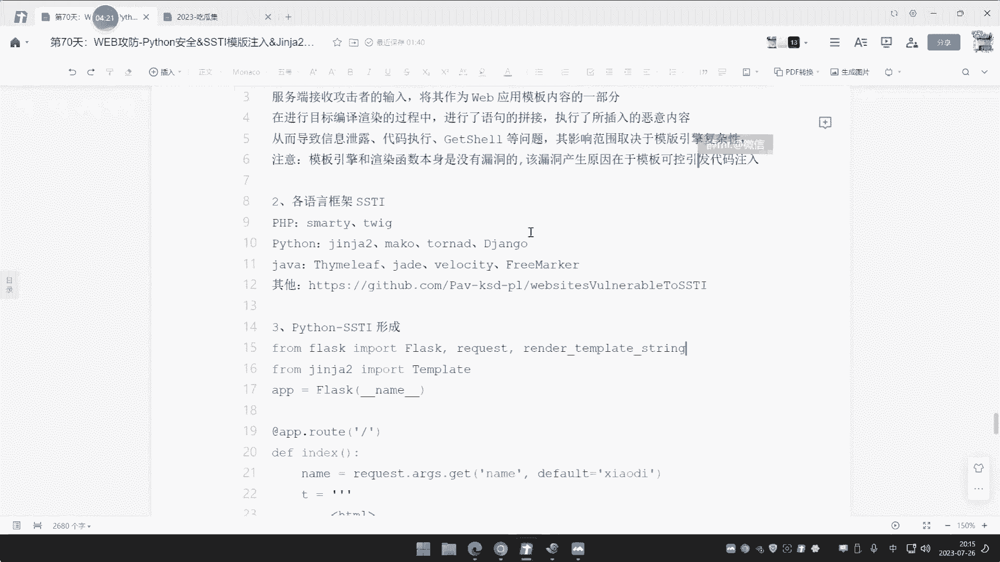

也是个菲斯科里面，那个web开框架里面集成的模板。

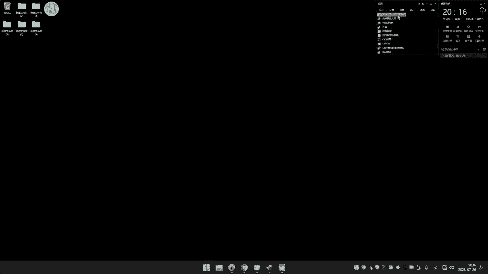

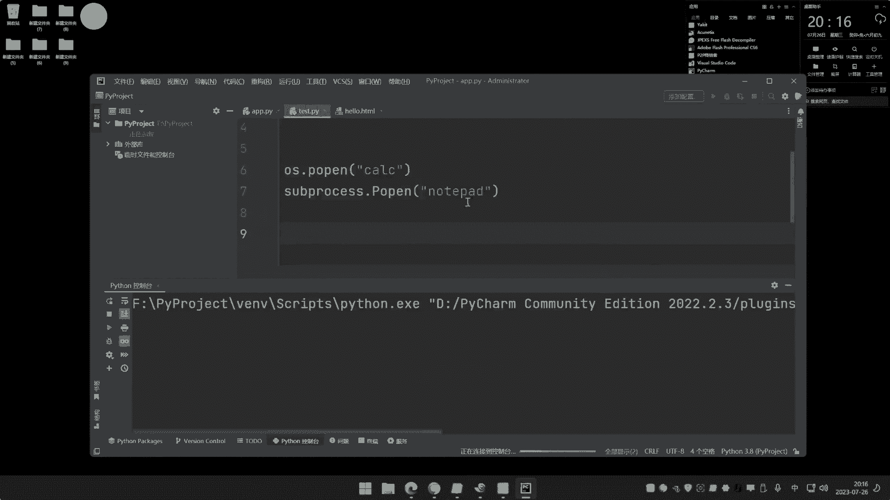

好我们看一下这个代码啊，来我们看一下这个代码，这个打码呢大家看一下啊，这个是一个java里面做web开发的一个代码，就是写web的一个应用的一个代码，用Python写的。

利用的是Python的这个叫菲斯的一个框架去写的，然后这里呢去app run呢就是启动这个服务啊，这里呢是他的路由，第一次请求当前页面讲这个index，然后呢这里有个页面啊。

他说这个类目呢等于这个request就是接收参数值呢，get接收过来的参数的名呢也叫雷姆，然后如果说你提交值，那就是以它为准，如果没有提交的默认值，那就等于小提，现在就是页面啊，一个T这个变量。

那等于一个ATM代码，ATM代码里面有个叫hello这个S，那这里呢这个S的值呢就由这个name来指定，后面呢再见再见，用这个函数呢去解析这个上面代码好，我们把它进行一个运行。

启动启动之后他就会开放一个5000端口，这个端口呢可以在这个里面呢。

去自行的去修改啊，这默认的是5000，我们打开一看啊，他这里呢就是hello小迪。

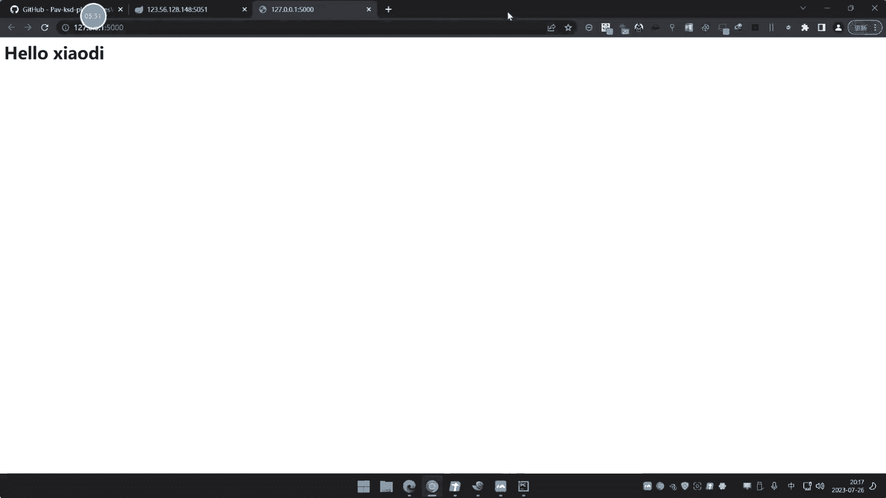

那这个hello小迪是怎么写出来的呢，我们可以看一下这个英文英文代码哈，那就是ATM2H一是吧，hello小迪，然后呢，这就是这里嘛ATMH1hello。

然后这个S呢就是等于这个name name呢如果不传参，就是等于默认小弟就是输出hello，小D啊，这个页面如果这里呢我们给值的话啊，我们就是在这里呢给值，比如说name呢等于123。

那么它就是hello，123，对不对，也就是说他以我们这个参数值为准，那去渲染这个页面啊，这就是一个典型的一个SSSTI的，一个形成漏洞的一个基本原型，就是说页面在其显示内容的时候呢。

某些地方呢会随机发生更改，这个更改呢由这个职能来决定，那么这个时候啊，如果说你把这个123改成其他东西的话，那么改成一个其他东西，你就像我们说的，这里呢还有类似的像这种花单的东西是吧。

我保你说我这里呢搞一个这个夸张语句在这里，那也其实就是一个类似的夸张的一个产生，对是吧，我跨语句写到这里之后呢，他页面中去渲染的时候，那他就会把这个页把这个值呢输出到页面。

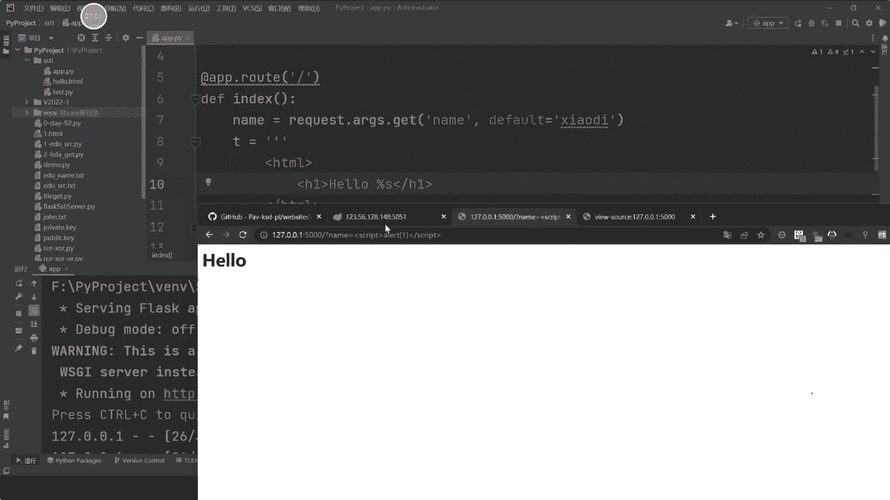

那输入页面，那这个值呢就是一个JAVASCRIPT代码代码，然后呢这里就执行这个什么JS语句，对不对。

那么这个是夸张啊，那么STI其实呢就是控制这里啊。

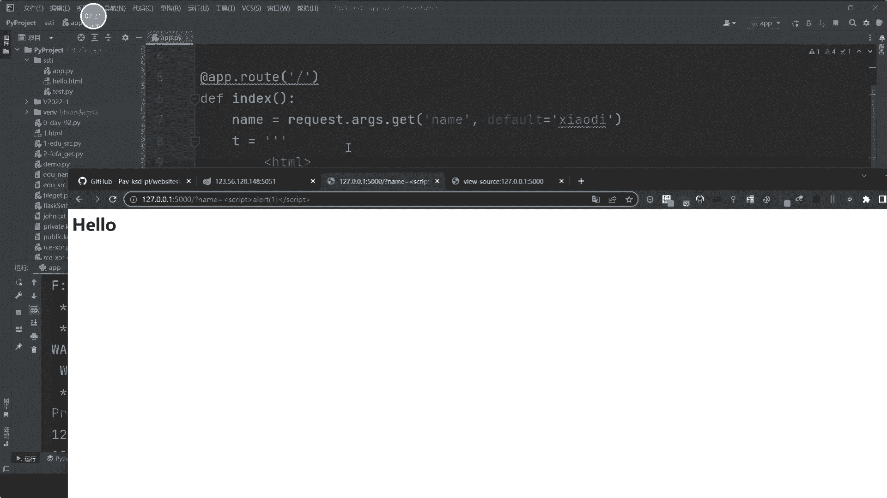

来形成的一个情况，那么如何来形成啊，这个Python里面这个STS是怎么玩的啊。

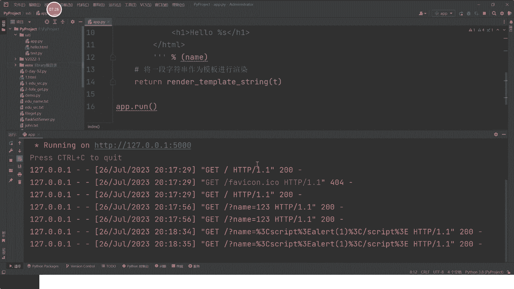

我们来看一下啊，首先他这里呢他用的是这个角，FISK的这个JINGAR，那么这个东西呢它的解析语法是怎么样的呢，它的解析语法是括号括号，然后两个括号为准，然后呢这里写值，比如说你写个一。

他这里面也解析为一，它就不是双括号的一。

那我可以看一下代码啊，那他还是显示一，对不对，这里没有显示这个前面两个括号和，后面两个括号一呢，我们乘以我说一加哦，执行它报错了啊，因为它不支持加号，但支持这个层来，2×2=4是吧，2×3=6。

你看他这里进行运算，正常来讲的话，按照我们常理来说的话，我们输入这个值的话啊，在我们这里呢在这里输入这个值，对不对，我们输入这个字的话，它应该来说是输出的，应该就是这个内容呢在这个页面中。

但是呢你可以明确的看到，这个值一输上去就变成一个六，那其实就是说这个东西呢它进行了解析执行，然后这里的这个东西是个啥呢。

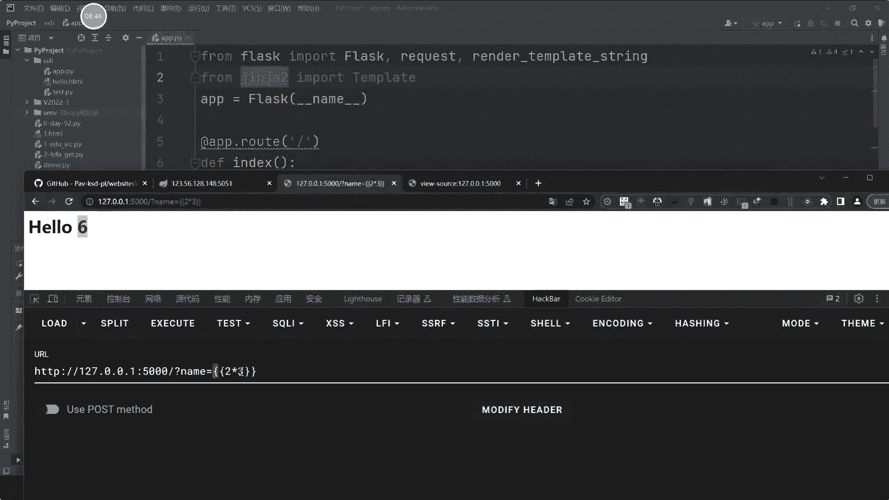

来我们来个简单解释一下啊。

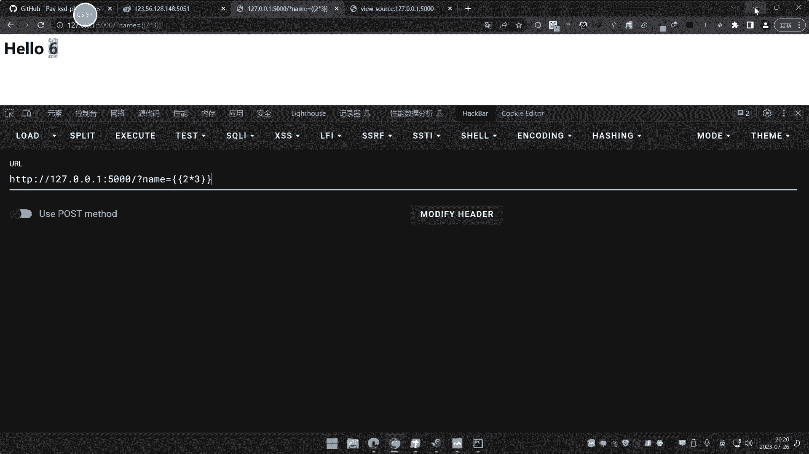

那这里呢正常来讲它应该显示，但是这里的显示六好，那我这个东西啊，这个符号我来说一下啊，ZA和ZA啊，这就是这个什么模板引擎的什么解析服，那么等同于就和我们这个pp代码一样。

或者说这个Python代码一样，那比如我们这里呢写这个pp代码是吧，这pp代码呢它这里面就是这么一个开端，那么我写java代码呢，写其他代码呢就这么东西，它就类似于这种啊，就把它当做去解析了。

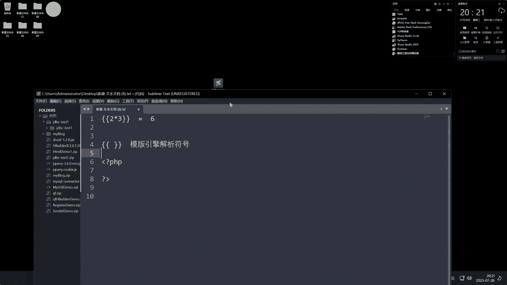

然后我们再来看这张图片啊，再来看这张图片，图片里面呢你可以看到右面R呢，这里有个叫TAGS，我们看这个部分啊，看这个部分，那这个图片这里呢有一个TAGS，然后你看一下啊，后面有个什么这个东西呢。

呐这个东西对不对，那这个就是他的解析的开端和结尾，也就是说你看啊我们是这个框架的，它的解析就是那百分号加百啊，就是这个两个括号，那假如说如果说我现在换成，是这个这个框架的话啊，就换这个解析啊。

这个模板的那个引擎的话，那么我们在利用的时候，那该怎么办呢，假如说我们换这个是吧。

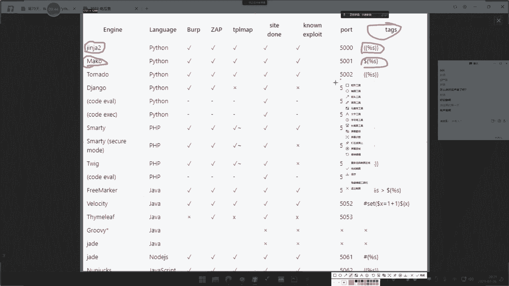

假如我换这个，那么对应的如果说你要执行代码的话，那应该是换成这个后面的什么白光，换成这种写法能理解吗，然后呢你在这里啊，再比如说2×3，对不对，那么他才是等于六的，就是要根据啊利用的情况的话。

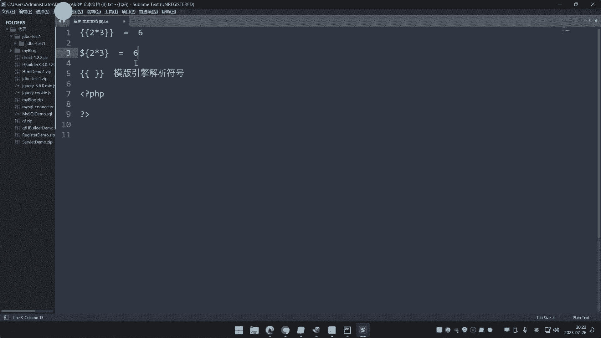

要根据它的一个解析的这么一个引擎去决定。

因为你正常来讲的话啊，如果说你不加字的话，你加个2×3执行，它就显示2×3，对不对，你加上这个之后呢，啊，他就知道哎你里面呢就是那个运算的一个东西，那么他就正常去发进行运算了，知道吧。

这个好理解了哈，把这个了解之后呢，我们接下来呢就来关注到几点了啊，就是他的一个漏洞利用了，他如何去把漏洞给他利用出来，一般呢就会借助21分为几步啊，在Python中的这个SSTI呢。

它的利用呢和之前的那些东西呢有点不一样，它是先看哪些类可用，再看找类的索引，最后再再利用类的方法，再那去构造这个东西，有点难理解，但是我们这里呢，可以给大家简单的去演示一下啊，是什么一个情况啊。

首先这条语句说是看Z的一个可用啊，这类的一个可用，这怎么一个解释啊，我们在这个这里呢去开个这个终端啊。

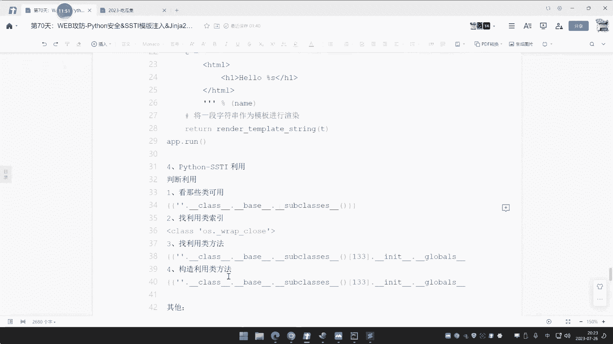

在这里呢看下这个终端。

在这里去运行一下啊，先把这个全部都清除掉，你看一下啊。

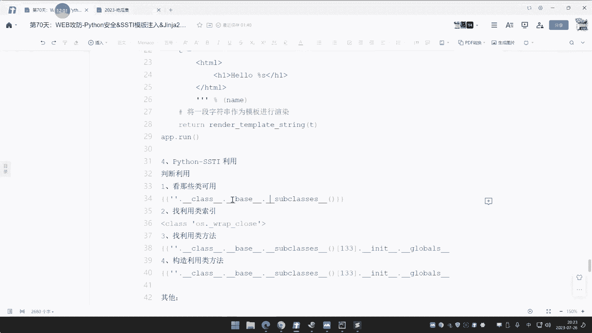

我写这个东西啊，你看啊写两点点是吧，然后这里呢有个这个点class，那然后呢再点这个class，那一个叫base，然后这里呢是怎么去写这个东西的啊，好我们来运行一下啊，好他就输出这个东西，那这是啥。

这个class base和这个so class，这是啥的，我们给翻下前面那个介绍啊，这是这个Python语言里面的魔术方法，class代表什么类的一个类子属性，base呢代表类的直接积累。

还有这个sputer class代表内的集合，啥意思啊。

这个是啥意思啊，来我们这里呢可以写一个简单的demo啊，给大家来看一下啊，比如说我们这里呢写这么东西啊，写个代码给大家看一下格拉斯A是吧，我们，唉不这样写了，直接来这里看算了吧。

然后呢我们看这里啊，这个说找哪些类引用，我们知道啊，这个Python语言是没有学过Python开发，说实话讲这个东西呢有些人是完全听不懂的啊。

你学过的话应该知道呃，我们都知道这个Python语言那里面，比如说我们要执行一个代码的啊，我们可以自己呢用这个代码来给大，简单演示下啊，我先把注释掉，先把这个DOM达启用起来。

呃他这里呢有个什么叫这个may的一个东西，那你这种呢把它换到里面的区域化执行啊，对不对，他这里呢就会优先的去执行这个地方，这就是它类似的魔术方法，那么这里的日文class呢也是这个意思。

你就直接这样子去理解它啊，这样子呢去获取它的所有这个可以使用的类啊，那么这里呢把这个括号括起来之后，也说执行这里面的东西好，我们可以看一下啊，这个东西执行之后的一个显示啊。

我们可以放到那个代码那里来，你看啊，我把服务到这来执行好，这里呢就包出这么多东西，那包出一大堆东西，哎一大堆，这是啥东西呢，它其实就是获取啊，这个Python里面的所有的调用的函数啊，类啊这些东西啊。

接下来呢再去找这个索引，啥意思啊。

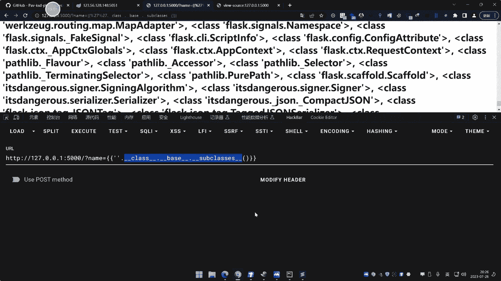

嗯没有展开发，没有讲开发这个东西还是难理解啊。

那这里有很多啊，我们把它拿出来。

呐就是这么多，然后我们把它进行一个，进行一个这个什么，分隔一下啊，把他换行一下，把这个替换成斜杠，N换行全部替换啊，这里那就换了所有哈，我看下这里面的东西，你看啊这里面就写了很多东西。

什么这个各种各样的一项呢，一什么class，这个获取的就是当前你这个语言环境啊，这个Python里面的所有的一些类。

然后我们都知道啊，如果我要执行一条命令的话啊，我该怎么写它呢，来我执行一条命令，比如OS点key open是吧，执行一个CLAC是吧，我这样呢去执行它打多少cl cs计算器，我这样运行这个脚本，哎。

它就会弹出计算器，对不对，这是一种执行命令模式，那么OS呢就是自带的函数是这个Python自带的函数，p open呢是它里面的方法，那这个OS呢它是其实是原生内，我们可以把选中的导入给你。

它来源于这个Python语言中的内，它是来源于Python语言的哪个地方，你看引用地方，我们把路径给复制出来，在他路径，路径那就是D盘python3。8label点OS点PY。

这个是他自己的这个什么函数，对不对，你看他选中它，然后你可以往下面翻，其实这个呢就是它它是语言自带的，我们刚才获取里面的就有这个东西。

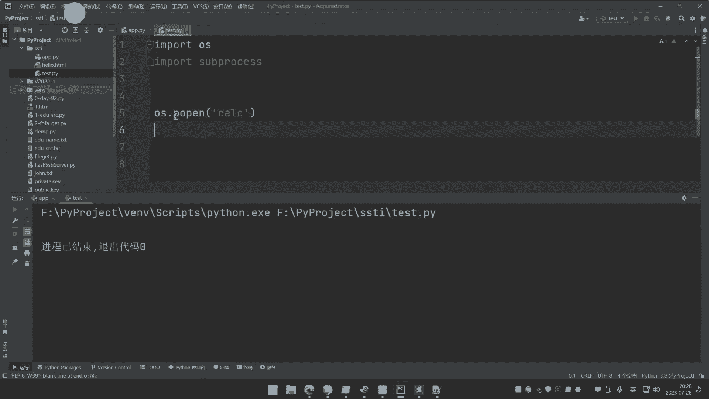

利用这个呢来执行命令，那么你想一下下啊，我们刚才获取的这个里面呢，你看一下是有个叫OS的，你看class里面有个OS的，那这里有两个是哪一个呢，一般会是这个W开头的WAP的，对不对，是这个啊。

其实刚才那个语法呢就是什么意思呢，就是我们利用这个SSTI呢，先去查找哪些类可用，就是查看下当前这个环境里面有哪些类，我们能够用。

然后选取我们要执行的类，我们这里要选取的是OS，为什么使用OS呢，因为我们知道OS点p open呢能够自执行命令，所以我就选取OS。

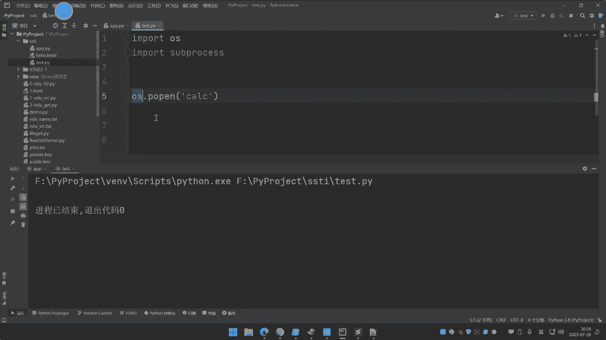

那么它在哪里呢，它在134行，134行，对不对，134行呢，你往上面翻啊，这里是第一行，是从这里开始，那么134行呢就是133，因为这个索引是从零开始的，不是从一开始的，我们这记录的是从一开始记录的。

能理解吗，所以我现在呢就去寻找133里面的这个，打133里面的这个OS的这个类，里面的东西，看里面有没有p open，那接下来该怎么寻找它啊，就用这个东西啊，133。

然后用这个艾特就OTS来我们看一下啊，这固定的啊。

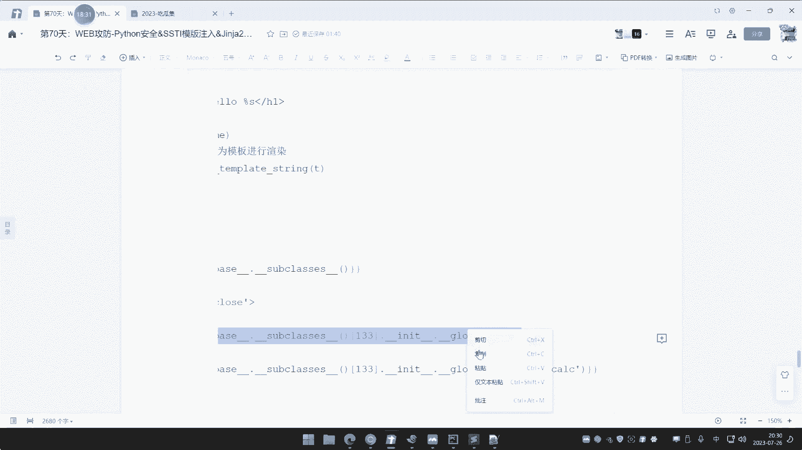

来把这个一改，这里的要写成133，因为它显示的是那个列表形式，我们的索引133，为什么写133啊，因为他在134行，刚才看到了啊。

他在134行，所以呢从零开始，所以是一带三三。

用这个呢来获取他所有空隙来执行好，这里呢又获取一大堆了，我们再复制出来。

在这说你呢再关注下正面，同样道理啊，进行一个，进一个换行，啊这是他所有东西，你看啊里面是不是有O有很多函数呢，有这个的什么，这个OS的一些各种各样的一些东西，好我们看一下p open在不在里面啊。

搜索一下，那在里面，那这里呢open function是它的函数，你自己可以看一下啊。

我们在写的时候，你比如说我在写个OS啊，里面的点啊，所有东西都在这里能找到。

比如说这个什么鬼，get的CWD，你那个应该也能在这搜到，看一下是吧，也是有的，对不对，其实这里呢刚才那个获取属类呢，就是获取这个当前环境变量的啊，获取这个什么环境变量里面的哪些都能用。

那么这里呢我们选用这里呢有个OS内，找到他去在获取里面的方法，获取里面的方法，那么到现在呢。

我们就调用这个方法呢来实现攻击，那该怎么调用呢，很简单的啊，这里呢就是获取这个133的OS，然后先调用的方法就是点p open去调用。

然后后面写上我们常规执行命令是怎么执行啊。

后面直接加上这个值吗，那我试一下，在这里执行一个CRAC是吧，执行哎，看到没，计算器弹出来了，这个SITI呢，就将这里面的东西给大家进行那个利用啊，这个东西是啥呢，为什么要这样写啊。

就是等到这里面133里面的那个OS内，再调用你的p open方法，执行一个CLAC，CLOC是啥意思，计算器的启动命令呀，比如说我现在改成个load趴着是吧，那part的就是我们既然啊记事本。

打开它弹出个记事本，好那么现在看一下啊，这个两点是啥意思呢，亮点就是我们的什么字符串的意思，就是一个字符串的类型，那么字符串类型，所以我在调用的时候呢，就是点PUEN，如果说我把这里换成什么这种类型。

那你以后呢这是什么鬼东西呢，这是我们Python里面一个什么类似的数组啊，列表的一个形式对，然后你看啊，现在如果你换成这种的话啊，你在使用它的时候，这个呢就变成了什么数组里面去调用t open。

这样子呢也是可以的，那他也执行了，其实前面两点和这种写法，这两点和这种写法是什么呢，就是我搞一个空的值给他，给个空的值给他，然后点就是获取它里面的内，为什么这样子呢，大家都知道啊，你如果学过开发的话。

像什么空的空的什么字符串啊，空的列表，那么很多这个类里面都有这个属性，都是能支持什么字符串呐，支持这个列表，他就获取这里面啊，谁引用过啊，就是这个这个这个类型呢是吧，在哪个类里面。

然后呢去获取所有类133，然后去读取里面东西。

那么这是一种执行命令啊，对不对，这是执行命令，那还有没有呢，你比如说执行命令，还有这个什么SUBPRCSS是吧，它也能执行命令，它也能自行运，你说他也能自定义COVC好好，我现在把这个注释掉。

你看它也能执行，也能执行计算器，它也能执行，那么是不是我现在就要找他的嘛是吧。

找他的话啊，一样的道理，我们先把这个去掉是吧，先找这里面的所有这个什么Z执行。

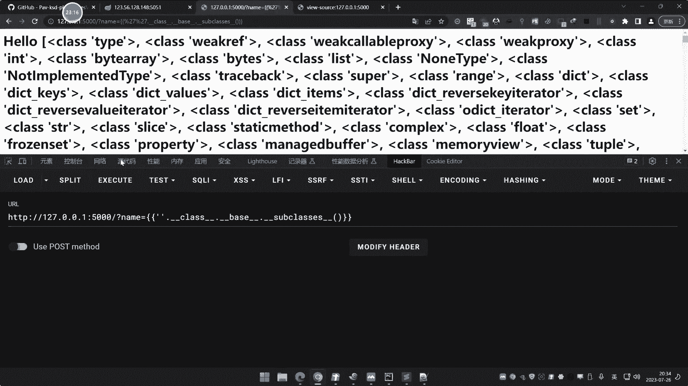

好找一下啊，然后呢，这是刚才那个结果，就是在这个界面里面是吧。

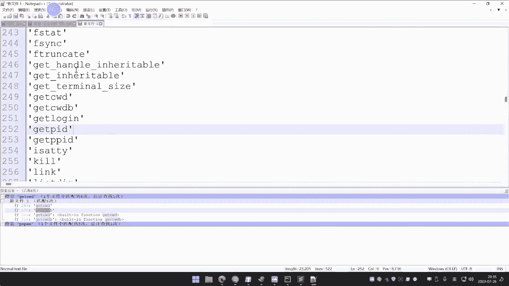

我搜一下来SUB这个。

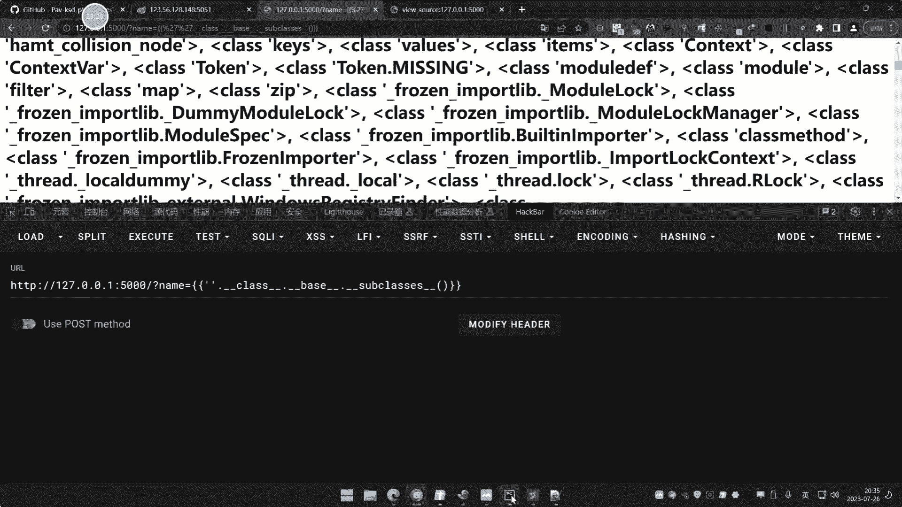

这个码哈看里面有没有啊，哎他这里面没有找到，那就不能利用这个能理解吗，就是说你要利用的话，你是要看啊，这个东西他在在不在这个环境里面知识，他能够的话就可以直接用，那这个呢是一种方式啊，这种是一种方式。

还有一种呢就是可以利用这种其他的，比如说这个confire ur for，还有i r p s u m get什么fixing matter，这又是啥呢，我们可以参考一下上面的啊。

这个东西呢大家有必要看一下呃，这里呢有个前面讲的，你看下class是吧，内置属性或内base获取他的积累，其实就是一个子孙爸爸爷爷的一个关系是吧，就是克拉斯呢顶级下级的base在的是这个Z级。

然后呢再是i i it啊，这个往下的这样去搞，就是一个个获取，然后在这里面呢有支持几个东西，你看这个叫you are for，他说是FISK一个方法，可以直接得到什么东西，利用的话就这样去利用它。

那他是个怎么利用呢，它比刚才那个呢要简单很多，你看一下这个对应关系啊，他直接这个class i n i t gt s，然后呢你看上面这个代码啊，我们先把它复制出来。

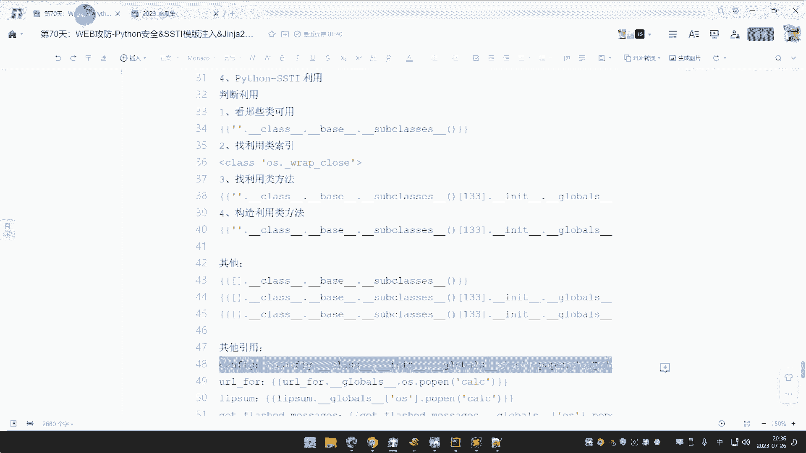

对应一下啊，那这是咖啡。

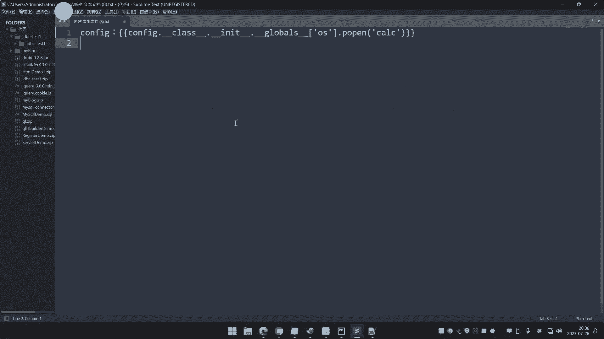

我们把它全部复制到这里来啊。

在这四个啊，这四个另外的四个，然后我们刚才去利用的时候。

这个这个情况再把它写出来，我刚才你用那个代码好写吧，写出来吧。

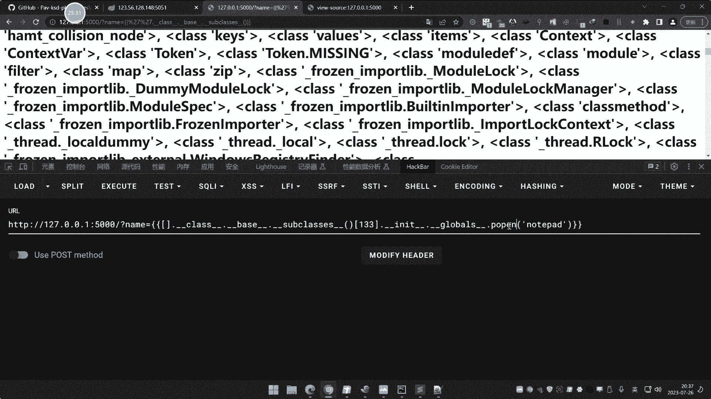

那刚才的啊，哎刚才的我们把它拿出来对应一下啊。

那这里呢我们对一下关系啊，这里是之前的，然后这里有个class呢呢，confaker class获取这个CONFAKER里面的class，然后INIT，那它ini it呢是在这个地方。

然后这个地方呢就直接这里操作，就后面那叫用什么OS啊，POP啊。

去执行了啊，这里那就没用了，这class呢你看他解释啊，他怎么解释的，CONFAKER的RCONFEKER这里当前application的所有配置，其实呢就是说呀这个一对比的话就好理解了啊。

这个就是从根源上去调用，而这个CONFAKER呢就可以把理解为什么呢，从当前项目中去掉一，而这个根源就要用这个东西来先获取来，这是它根源，这个东西呢就像是省略这一步，就直接来到了是吗，这一步。

然后呢这个就相当于就等于上面的这个东西，这个是从当前项目，这个是根源根源里面的去提，也不需要理解啊，我只是强加性让大家理解，因为大家在用的时候呢，基本上都是按照这个模型呢去修改完，但是如果说你不懂的话。

如果他要变招的话，避免什么过滤什么东西，你就不知道怎么组合了，这个月熬呢也是这个意思，越熬呢你呢他跟快捷直接省略这一步，那他这一步有省略，你看这个月凹的是越熬的，越熬的是这样写的。

它比这个class呢又少了一些，你看这个还写个class，那个大直接用这个东西，那后面那几个都是这个情况，直接用这个东西，那也这又是啥呢。

往上面翻呢，要引for的啊，他说什么东西可以直接得到，而刚才那个CONFIER呢，他说是这个东西，完全听不懂是吧，不用听懂啊，直接呢我们把这个东西呢给大家复制到这来啊。

来试一下啊，我们把这个几个东西呢执行在哪，看能不能执行啊，那COC啊，执行啊，把加压器弹出来是吧，这个CONFIER的语句获取当前项目里面，载入这个OS呢去提PUA啊。

用项目里面的这个OS呢p open来去执行，对不对，那再看这个u all in for的写法，电影符号呢直接在连到第二执行，它也可以执行是吧，这个是一个叫lab summer的具体解释。

你可以看一下上面的解释啊。

来执行他也能执行，还有这个get function什么message来也执行。

它也能执行。

这就是省略了啊，最原始的就是这种写法，就是这种啊从一点点的去去这个利用它啊，去一定去利用它，那么把这个东西呢讲清楚之后，我们来看一下CCTF题型啊，如果CDF的机芯能做，那么刚才讲的东西呢。

你就听的大概明白了，做不了，那就是完全没有搞清楚，其实这个东西你要搞明白也比较简单啊，就是我创建几个类呀，你看那个类的那个应用就可以了，能弄懂这几个意思啊，就是获取类里面呢又有另一个类的那个意思。

你写过这种类的东西的话应该就清楚了啊。

我们来看一下这个CCTF题型啊。

看完之后呢，我们再来对比一下啊，C6F题型。

因为这种题型的话一般是手工答，答完之后呢，再是这个实战中打。

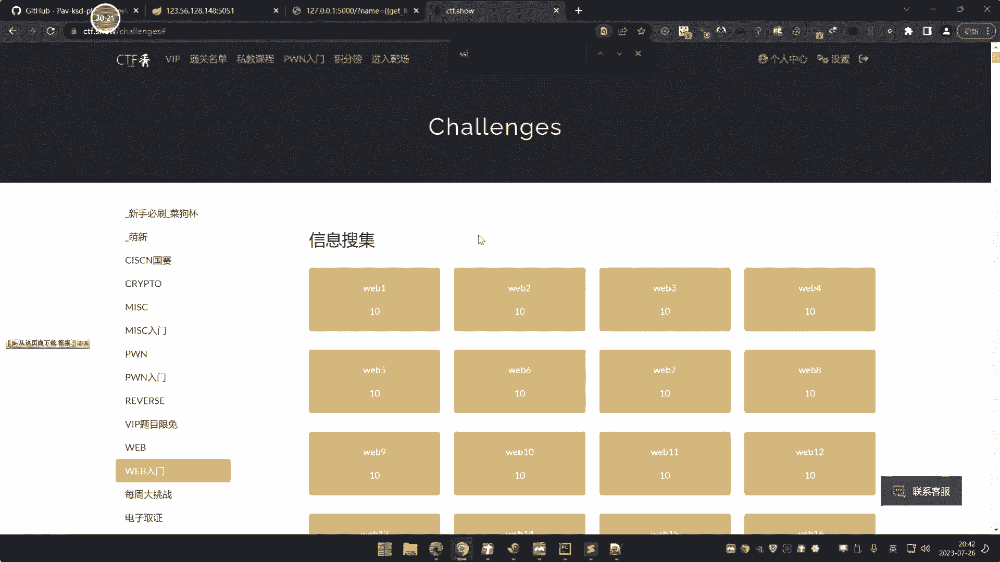

来SITI啊，我们打开给他看一下，我现在呢就复杂问你啊，我们看看怎么捉，把这一关捉了，能够对着捉出来。

那就没什么问题啊。

来这是这个东西，你看他说hello，朗啊，也是和那个sci一样，这个道理就是这里一个long呢，就我们自己呢给他传参嘛对吧，来内蒙跟它123，是不是它就显示这个。

123嘛，我在这里呢去写，它会显示这个LIM等于三，你改其他值呢，它显示更新，我测一下呢是吧，测一下有没有这个模板，猪通过信息收集呀，对不对，通过这个信息收集呢，看一下他这个情况是吧。

这是唉他这里没有没有涉及到什么信息啊，也没看出是模板什么鬼东西。

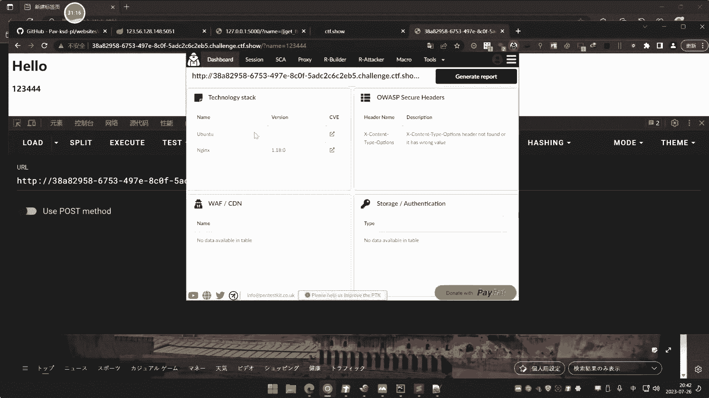

就设了个LINUX哎，那么试一下吗，那个是吧，就用这个今天学这东西来测一下啊，我存一下，看看能不能解析执行，而且那2×3变成六，说明他解析了，那就和今天支点是一样的，如果说你要测其他的话。

那就按照我们说的这个意思呢，后面这种东西来测它呢，按照这种语法呢有这么多啊，你可能会说我一个个测吗，是哪种模板，是拿个这个前面的东西啊，这个没必要啊，后面呢有相关利用工具啊。

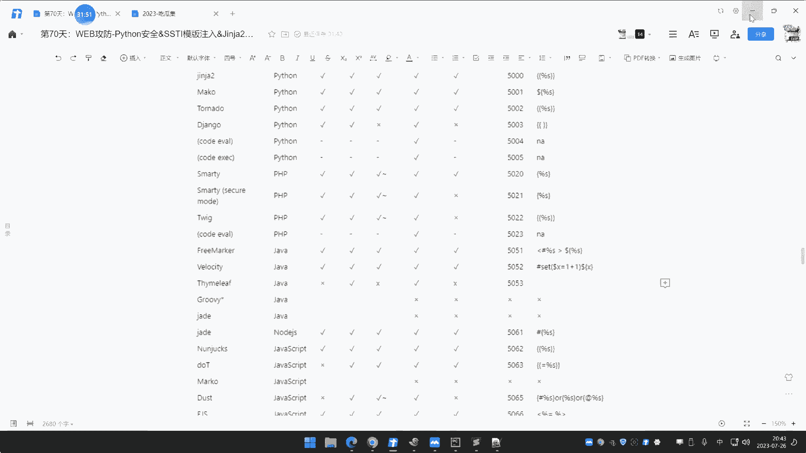

我只是说随口一吃啊，如果在实战中的话，你没有工具的话，你就是更改这个后面那个写法去测它。

看他能不能运算，能够运算的话啊。

那是对应的这个什么模板的名字好，那这里呢是他能够解析是new，那就说明是今天讲的这个东西知识点啊，是讲的用的这个东西，好啦，这里搞清楚之后啊，那怎么用呢，是不是就是按照我们刚才那个模型来呢。

你看啊我们就写下了，是不是按照我们刚才那个模型来的呢，class是吧，点base，然后点什么s u b glass。

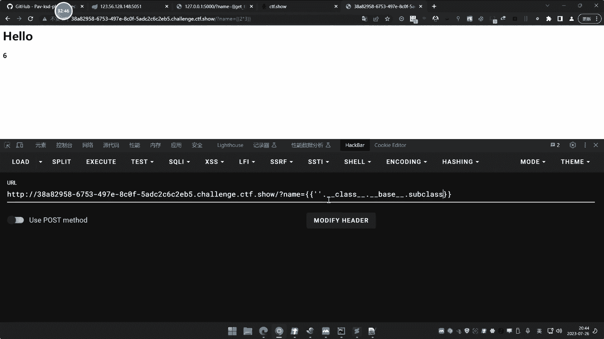

哦是这样写的吧，就是获取这里面的额少点斜杠，那获取这里面的这个什么，所有类吧是个写吧。

哎少了两个东西啊，来执行行不行啊，哎出来了，这是获取当前项目里面啊，可用内，CTRL加A，CTRL加C放到这来。

然后进行一个替换，把这里的这个逗号呢来替换成换行符，替换一下，便于我们这个分析他在哪一行对吧，搜索利用它执行一个RCE，那么就是利用OS模块，点击这个查找，看他在哪里，134行，那问一下大家。

这是写133，还是写130，还是写135，还是写132，说一下吧，这个呢要写多少呢。

你注意先要看一下你的索引是从哪里开始，往上面翻，所以从一开始，而且移这里的是hello，hello是只有你hello，那么等统一，这是从R开始，从二开始，原则上面来讲的话。

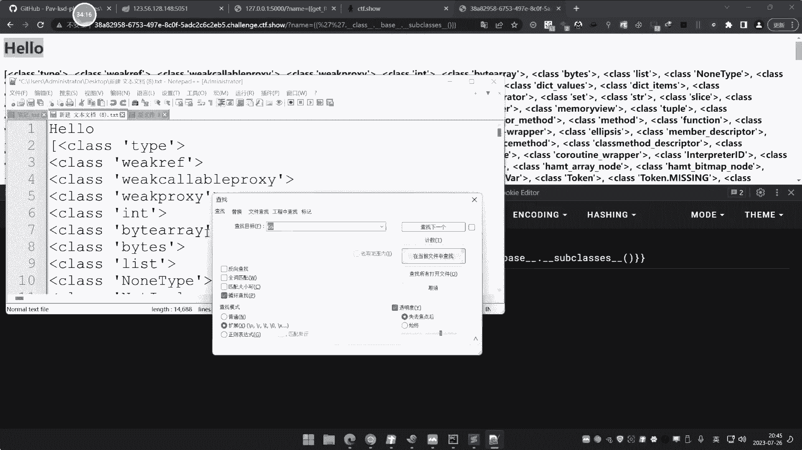

我们是从零开始，那么应该是130-2为132，能理解吗，好因为上一个我们演示的题目呢，是我们本地演示是113，是因为我从一开始类似，从一开始的这里面多了个hello，干扰他就多了两个，所以我要剪两个。

不是说这个值是固定的啊，如果说是固定的，直接那就是配load了，所以我们实战中都要去分析它在哪个地方，利用这个OS，知道吧，它是根据这个环境决定的，根据你这个当前的这个Python语言版本。

或者说根据你这个类型决定的，你看我电脑上面那是Python版本，那他那个靶子那可能又是个百，所以他是在132个里，我们是在133那里，有的地方的可能还不在这，哎132，对不对，132。

那么接下来利用它的话，是不是就是这里啊获取132这里。

然后获取它什么东西啊，是找他的这个类方法呀，是找得方法呀。

你把这个写到后面去，获取里面类方法嘛，执行里面有没有OS啊，搜一下啊，p open的搜有三个，来PO很方形，有这个函数，那我是不是可以直接用来啊，那怎么用，它前面写的是字符串。

所以这里要调用这个函数是点JEN，对不对，这里呢就是写你要执行的命令，我们这里是打靶场读他的flag，不是说让他执行一个计算器啊，执行一个计时的，这没什么用，这个环境呢是LINUX。

所以执行的是LINUX的读取命令，那不是windows linu读取命令的TAAC或者cut去读取，一般会访问到它的根目录的flag，对读取这个flag文件内容是这样执行吧。

你具体呢这个什么是LINUX啊，windows这我就不说了啊，一个大小写就能解决的事情啊，就能判断出来了，然后linux cat读flag是这里呢去读取它呀，然后我点执行，执行完之后呢。

他这提示个什么OS什么公布记录的，这其实表示这个东西已经执行了，那但是我的flag在哪里呢，不在这里它没有显示啊，为什么这里用这个o s p open，因为他支持这个什么支持这个回血啥意思啊。

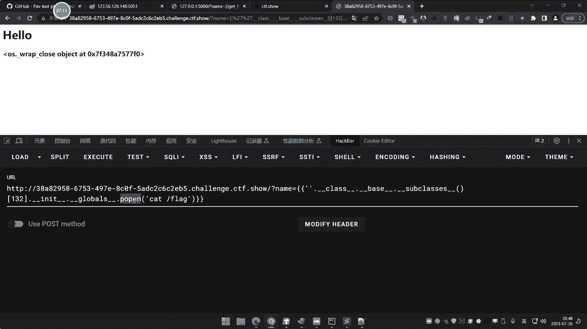

来运行一下呢，比如说我现在呢去读取个文件啊，你看我在我本机上面去读文件，我这里呢可以用这个C塔姆呢去执行一个C2，VC是吧，我这样呢去运行它，他的确也能执行计算器是吧，但是啊如果说我读文件的话。

我这个电脑windows电脑是top命令读文件，读D盘的什么，这个已点TIT，那我在你那去执行这条命令去读文件啊，他能读到这里呢，也不知道是啥东西好，如果说你这里呢用p open去执行这项命令哈。

他也能执行吗，他执行，好然后呢一个点什么点，Right rider，那就是获取它内容啊，他这里都没有执行出来，那应该是盘符的问题吗。

唉还不是top迷你们这个读文件的妈的鬼东西，这个系统命令。

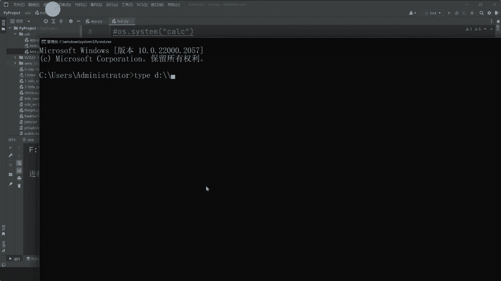

不能毒刀啊，真是奇怪呀，这个东西啊，哎他这里面命令执行搞不清楚啊。

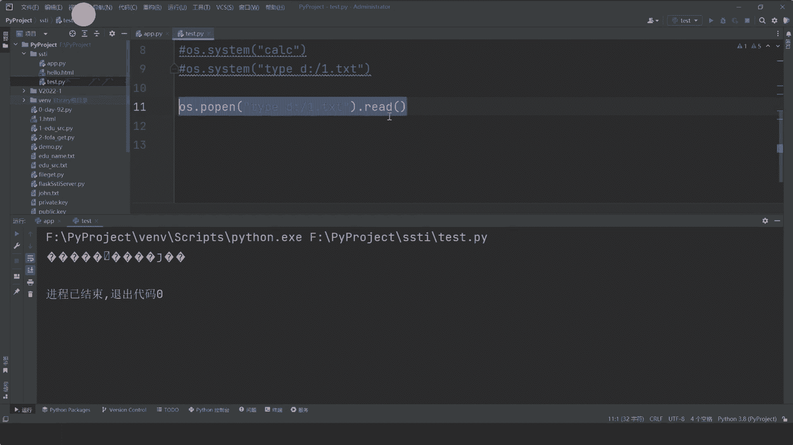

我意思就是说用system m的话，它是没有回血的，你这里呢使用这个p open，他有这个自带函数叫reader，就获取它的内容的意思，因为他这里不显示嘛，加个read去获取命令执行。

你看这个flag就打印出来了呀，所以说你为什么要用这个p open啊，因为他有这个带回血的这个函数呢。

可以调用这个set up里面那个东西呢，是比如果调用CTM的话啊，c time里面那是没有这个东西的，你看点呢它是没有这个东西的。

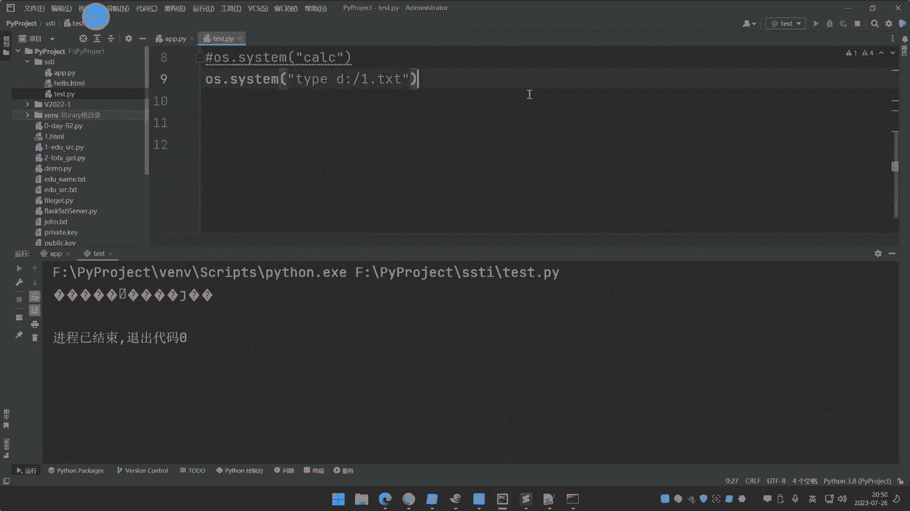

他这个是直行，没有回血，这读到了flag，你比如说这里让执行其他的as是吧，那他也能有回血，看到没，他能够得到执行命令的结果，把它进行回写出来，你OS的话要复制个变量，复制变量。

那再把变量输出出来才能看到结果，这个太麻烦了，所以我直接用这个标，对吧，他能够执行这个火线内，好这个呢是我们的底一罐啊，这个呢把它用的话，哎大家就用到了，那么如果说我用这个啊这种写法呢。

就说我前面两刚换成这个东西呢，那换成这个东西，那其实呢就这里换一下就完了是吧，这里换成这个东西了，因为三列表啊，因为他是列表来执行，它也是个一个不出来的，那他也能获取，那为什么这个要这样写呢。

啊因为前面这个那代表字符串，字符串的去调用函数，就是点，如果是列表里面就换成个列表格式，那为什么要换这个东西啊，你可以观察一下，我可以给大家看一下啊，在获取这个这个值的时候。

他那个格式你看他前面那就是这种找到POPEN啊，嗯你可以看一下啊，他这里面呢是这个括号把它括起来了，括号括起来了，你画成两点的话啊，你看画成两点，啊他也是括号啊，其实就是说一个那就是字符串的格式。

把显示出来一个那就是列表格式写出来，你调列表格式里面的函数的话就是这样的，用这张卡找这个索引，然后去运行它啊，之前的那个字符串，那就是点啊，你看你习惯用哪种就用哪种啊，这两个都行。

呃习惯用的话，为什么要讲这些方法啊，因为有时候他也过滤你，比如说他过滤这个单引号的时候是吧，那你是不是就前面就要用这个东西也能好啦，这个是这个100这个361罐，我们看362罐啊，这个SITI。

什么情况。

这我用别人的号都都都有人抢抢登录吗。

我都不能用自己号了啊，用自己号都给大家用去了，我怕我都用不了。

妈的自己买的号自己都不敢用哎，好这个呢你看啊来这个是个什么情况，你看啊，我一层这个八成8×9是吧，这个72，那他输出了的确是有，但是我们现在呢就是把刚才那个配楼的呢，把它写上去啊。

你看一下啊，我把刚才那个PLOAD把写上去。

把刚才那个PO把它写上去，那就是刚才那个配漏的是吧，一模一样的执行，他直接提示这东西啥情况呢，经过测试呢，发现他这里过滤了数字数字二和三，因为我们这边必须要引用这个二和三嘛，他过滤这个二和三。

你不信的话，我们可以测一下了，他明明有这个东西啊，明明有这个事情是吧，有这二和三，你这个8×9的时候呢，1×9他能得到九能增长，你写个二来报这个错误，写个三也报这个错误，它就是过滤二和三。

你写个其他数字太正常了，所以你看啊，我们的代码中这里有132，我必须要引用这个132的那个索引，就是那个OS那个V调用它里面的p open，才能执行这个flag，他这里的过滤有二和三。

也说这个东西不能改了，你怎么测出来的呢，广场那个车法是一种测法，你还有一种测法就是很简单，你比如说我回去要勒的时候啊，你回去勒的时候，你看啊，我获取这个类的时候，它获取它里面东西的时候，我这样执行。

还报错误是吧，你看啊，换个数字，换个141141，33他妈的怎么不显示哎，放个，换个其他的一个数字的看一下啊，刚是以A2换成个40，他应该是没有啊，找个其他数字，哎这不显示我也是很尴尬，三就报错了啊。

这个东西你得看一下的，这个66里面没有获取不到好，那就说那获取的就是那个二和三的那个东西啊，过滤二和三。

那这里呢什么方式去绕过它啊，这个是过滤了个二三，这其实非常简单绕过啊，我们这里那就完全可以使用，前面这个CONFIRE的语法嘛去绕过它们，因为很简单的道理啊。

你这里呢必须要写那个132他才行，他才能调用成功，就之前那个payload呢看才调成功，我这里呢只是用CONFIG，就是前面我讲的。

我把那个payload那直接拿出来来，在CONFIG那个写法来，我直接拿出来，这是我们本地测试的，放在哪啊。

config class啊，叫os p open，他这里那就不需要你写什么幺上啊，写了个索引的，它是获取当前项目里面，用当前项目里面啊去OS执行CLOC，那我就改成什么cut读flag好。

然后点read，是不是直接用这个CONFAKER呀，不要写那个索引了，就不需要写索引，所以索引的话必须要写，要上啊，要上R的二和三过滤了执行，比如说为什么要教这种其他的写法，啊这个132是吧，36号的。

363的看一下啊。

这个他的是什么绕过呢。

你都可以在这里测的啊，我们可以看一下这边的啊，这个关卡呢他是又是怎么个检测方式呢。

它过滤单引号，它过滤单引号为什么呢。

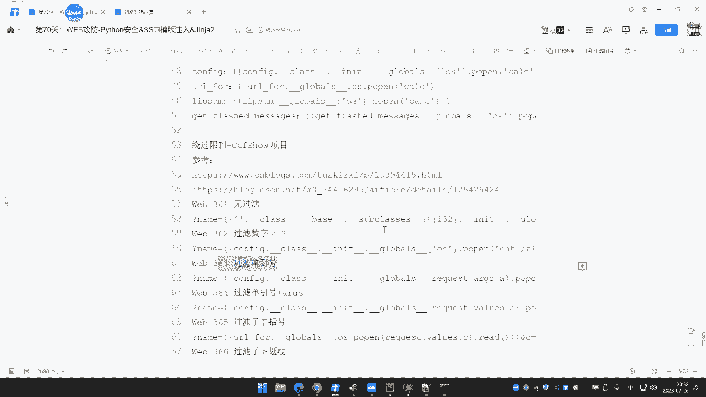

你可以看一下好了呃，2×3的时候，我看一下R来23他也是能够算出来了，也没有过滤，刚才就是这关可能没有过滤什么数字了，但是呢它过滤单引号，为什么过滤单引号啊，你可以在这里呢测一下呢。

比如说我们正常来讲的话是先获取这个类是吧，我们在连内看啊。

把写上去，那我这里呢是有单引号的啊，那我勾啊，你看，不要卡呀卡了啊，那他直接报这个东西，然后呢你这里写这个东西，你看啊来写这个的输入啊，这个列表的啊，你看列表正常了，那很明显嘛，这过滤了个单引号啊。

那你可能说哎呀，那我就用这个列表写。

但是你发现没有，如果说你用列表写的话，我们看列表前面的触发语法呢，这列表写的他是在后面，如果说你要调用的时候，还是还是要用单引号，你看这还是要用单引号啊，这还是要用单引号吧，那有没有方法呢，有哪种方法。

你把这个地方把它以参数传递也可以，或者说用其他不用代号的写法也可以，两种思路，就说你要用的话，他肯定是要调用这个地方嘛，调这个p open啊，或者执行这个东西，那么呢你这里要翻译好。

我这里呢就把这个关键地方呢移动request，把它发过去，啥意思啊，来我们可以看一下了，他这里呢有支持的，这个支持的一些那种Python语言里面那种代码叫request。

怎么点这个a args s get全参嗯，这个后面是参数值差异，写个叉就叉，那你这里能不能这样操作它呢，啥意思啊嘞，我们把那个PO的拿出来啊，这是那个payload啊，就这个PLOAD。

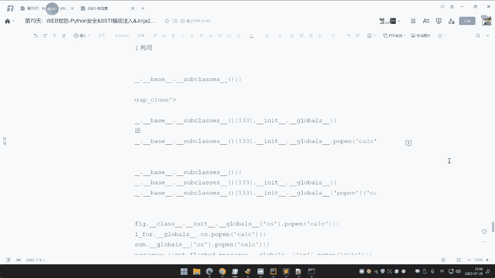

我们知道那个是132，就是项目中的是在132那个OS，在132这里，我们在执行这个p open，对不对，执行这个cl AC，然后这个呢是用单引号，那那这里呢你执行的时候呢，你看一下啊，我们给他执行下。

就按照之前那个东西要执行，那肯定这里就报错，那肯定就报问题，啊对吧，因为这里有单引号啊，你不用单引号的话，那肯定就不行了吧，你不用单号，这个代码就错了啊，那肯定不行啊，那报错了。

所以说你这里那就必须要用代号，那怎么办呢，是不是就可以利用这个什么request，点ARG就是这里那个么来写了。

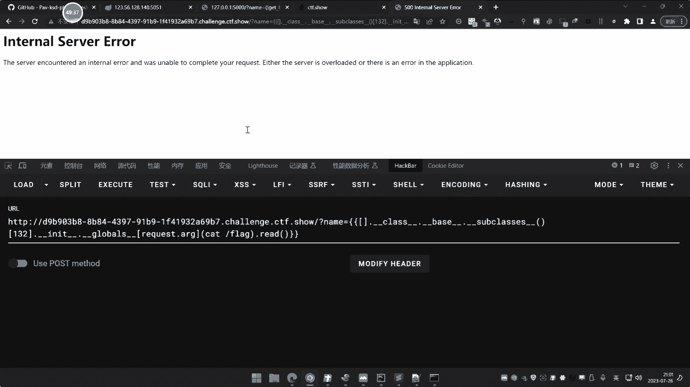

就是把它发到其他地方去是吧对好，这应该是参数名是吧，我就搞成差吧，搞成差好。

这个地方呢也单元号是吧，我就搞成么么，Y后面的再加上变量X等于什么QO，再加上一个什么Y等于cut点a cut flag，是不是这个意思啊，那我也不知道行不行啊，我们试验一下来执行，看没出来。

哎就说你这里呢就是不要用单引号啊，你这里呢就写这个东西怎么发过去啊，换到另外一个地方去，那这是一种解法啊，这是一种解法，那还有一种解法是什么呢，还有解法就不用代号。

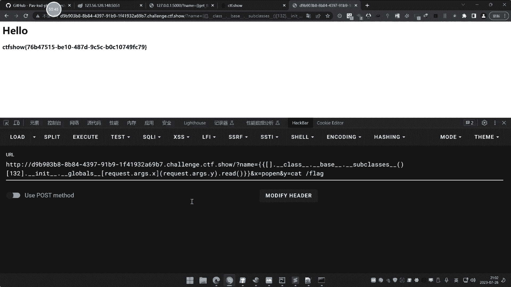

不用代号，我们看一下我们那个PLOAD里面，就是原生这种写的这种啊，他都要有单引号，这个有单引号，那不说了，这个有单引号也不说了，但你看这种有没有单引号啊，他这个有没有单号啊。

他这种那比如说用OS用OS，那怎么写的呢，你把OS拿过来放这里来，这是CONFIG的写法啊，好我们这里呢他也是这里有个单引号是吧。

OS那也是一样道理嘛，对不对，也可以写成刚才的request，点ARGV，然后点中空器是吧，来，这里就搞成交离吧是吧，那这个地方呢就搞成这个什么，A是吧，我们要连上去叫D等于就是这个值。

这个值呢我们原始呢是给他发的么。

是发的什么东西啊，当时给他发了什么，在CONFIG的一个写法玩法里面，CONFIG是OS，后面是mini，那写OS是吧，A呢就写成什么。

part然后，来发进行一个执行好，他执行了，为什么没有显示flag呢，因为呢你可以看到啊，这个地方传的gay读取flag pun，是不是还少了个什么reader啊，不也是一样道理啊。

这个其实就是参数逃一的意思是吧，就是把这个参数呢逃一出去啊，放到这个后面参数值那里去提交，因为他过滤的是这个内姆嘛，不是过滤这个小题和G。

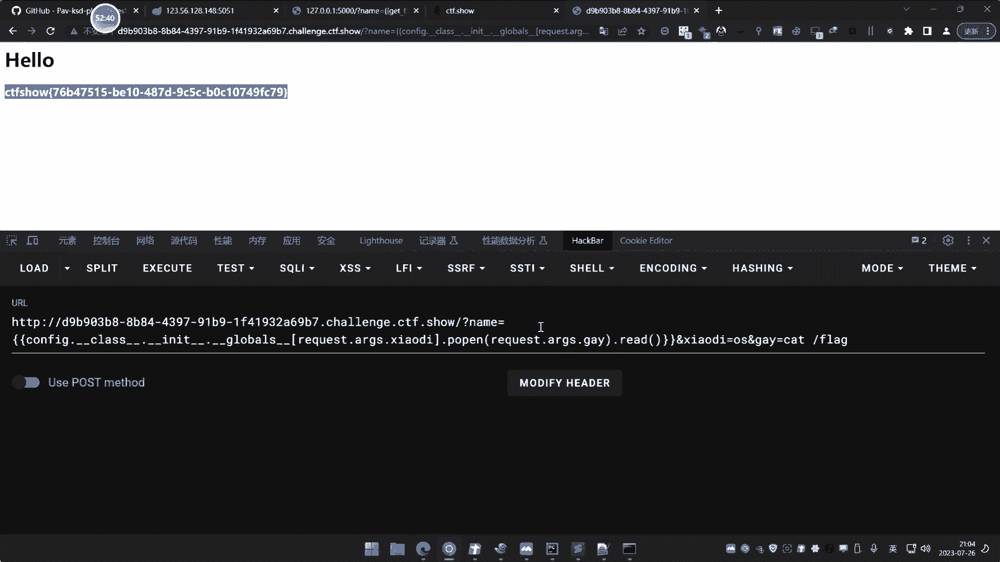

好这个是我们说的这个363的啊，双引号也是一样，道理啊，也没什么太大差异。

他过单引号过的多一点啊，双引号，那你给我双引号，你就用单引号不就行了吗，那单引号和他双引号没区别的呀，你变量里面一个用单引号括起来，一用双引号不是一样的事情吗，他知识的啊，这个呢这个364这个东西呢。

它又是怎么个过滤呢，364又多了个什么，我直接告诉大家，他过滤了个单引号，加这个ARGS，那就说我用刚才那个写法呢就不行了啊。

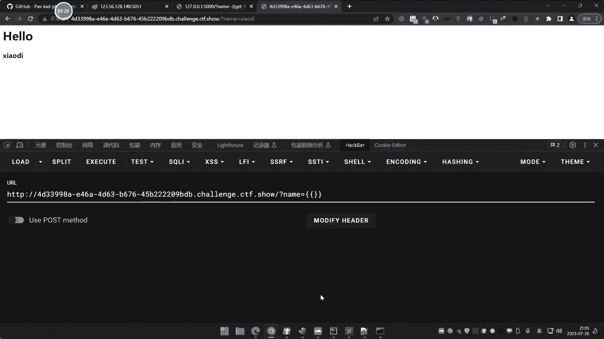

你赶紧看下啊，我先把这个拿出来，就是刚才那个过关的那个写法，刚才过关的写法啊。

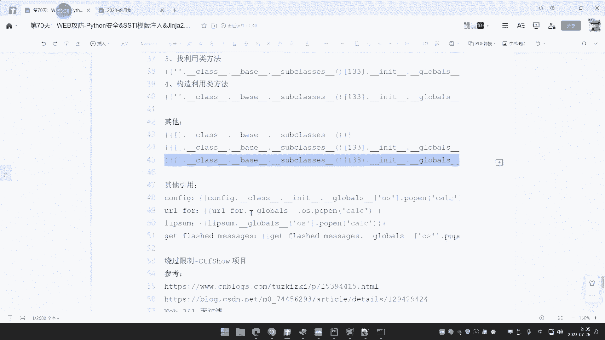

他应该不把那个删掉的，妈的，那刚才的国外写法就是在这里呢，搞成那个什么requests，点ARDV，然后点这个叉是吧，然后这里面写上，1ZY然后这里连一张去。

这个X等于有分Y呢等于c cut杠SPECT，在之前那个写法到这里有个V，但是这里呢他也过滤了啊，那执行之后呢也报错了VRGS，那这个也不影响啊，你这这样写呢也是，那它也过滤了什么过滤呢。

它过滤这个ARGSIGS，那你可能说我把这里写啊，你看我把这里去掉它，他就没有这个错误，他只是报错误，就自己写错了，而不是说这个这个错误，那是自己写错了啊，不是说这里过滤了过滤。

那就是刚才那个东西看了很多次了啊，这里那就换成什么cookie或者是values，就是换接收方式加，这个是get接收费，60呢是全部接受的意思，就是把关键字呢过滤下来。

FEUX全部接收杠，cookies呢就是获取代写cooking杠，FEUX呢去得到。

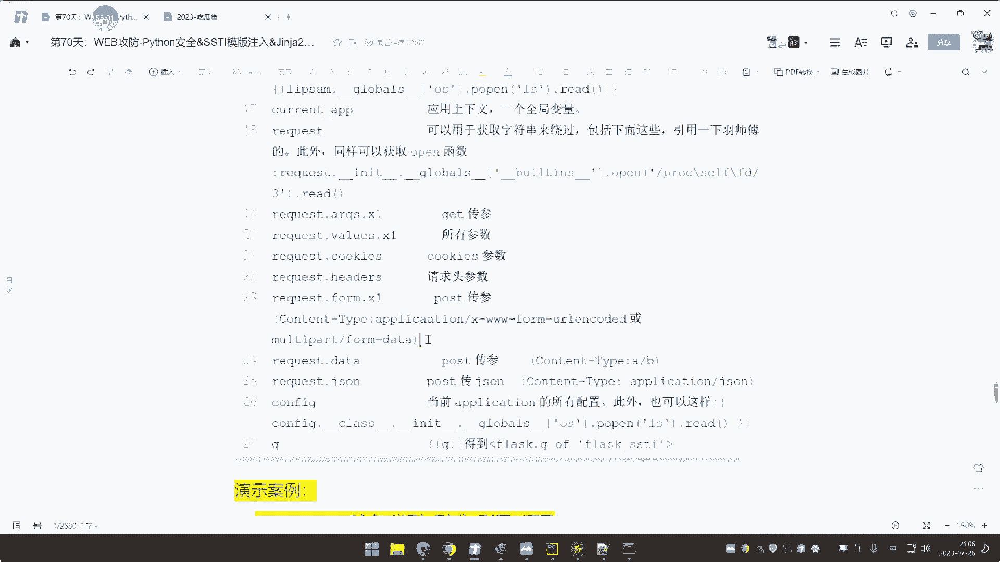

然后再执行，这里写错了，这个是Y诶，这哪里又写错了呃，他这是1322吧，好可以了是吧，就换一种写法啊，这个没什么太多说的啊，这一关说实话比较差啊，设计的不讨。

3。5啊，再看3。5。

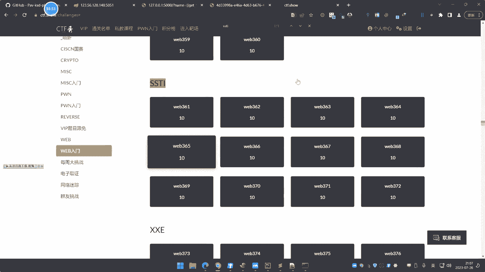

这关呢就多了一个事情，所以说这关没有设计好啊。

他应该还搞一些知识点里面去，回合中怎么测漏洞啊。

慢慢停，停了之后再再问这个问题啊，好这个内蒙呢我们现在讲课都要说，经常黑盒白盒，我都把你的问题都给你解答，对不对，以前在自己想学完之后，有一些解答，有些没解答，后面呢就基本都解答了啊。

上一个字典都数一数的，这个365这一关呢又出了什么问题呢，啊三五呢过滤的中括号，过滤中括号额，你可以试验一下啊，来我们正常来讲的话啊，你看啊我用这个来获取类的时候呢，他能够获取好获取这个用它获取呢。

它哎它也过滤了，单引号，也过滤了中括号，那也过滤了，或都获取不了了啊，它过滤是这个，就单引号呢是前期我们前面几关就过滤了，所以这单引号呢双引号它都过滤了，还有一个中括号，那也过滤了。

中括号就是这个东西嘛，啊你可以试一下的，比如说正常来讲的话，我们输出这个应该会输出个中括号，执行的就有过滤了是吧，你输入其他呢他就正常输出，那其他的就正常输出，所以说这个东西呢就被过滤了啊。

它过滤是中括号，那就说我们不要写中括号了，该怎么写呢。

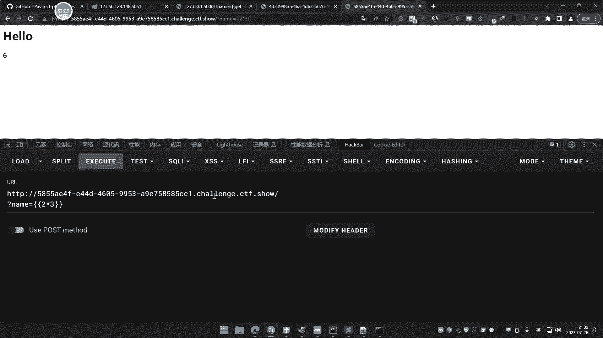

待会我们看一下啊，来嘶这个里面有没有写中括号啊，有写吧，你看对吧，这里有中括号啊，那正常来讲的话。

我们用之前那个思路啊，去过他的话是这样子再去写这个值啊，是吧，然后大家去执行它，直接提示这东西，那你这里呢你可以看一下啊，我即使不写这东西啊，就不是我不写单元号，这东西我就写这个值，它也过滤是吧。

你再去掉一部分，你看我在写这个东西，它也过滤，为什么呢，一旦你把这个去掉啊，他他正常了，是不是就说他其实就是过滤这个中括号，这个就获取他所有的那个什么内了，那这个呢如果加上去就GG了，或者中考。

那不用中括号，我们看一下啊，不用中括号的话该怎么办。

你看这几个写法来表里面有没有中括号啊，没有啊，这个URL里面没有中括号啊，那就直接这样呢，用这个URL的这个参数来去做它。

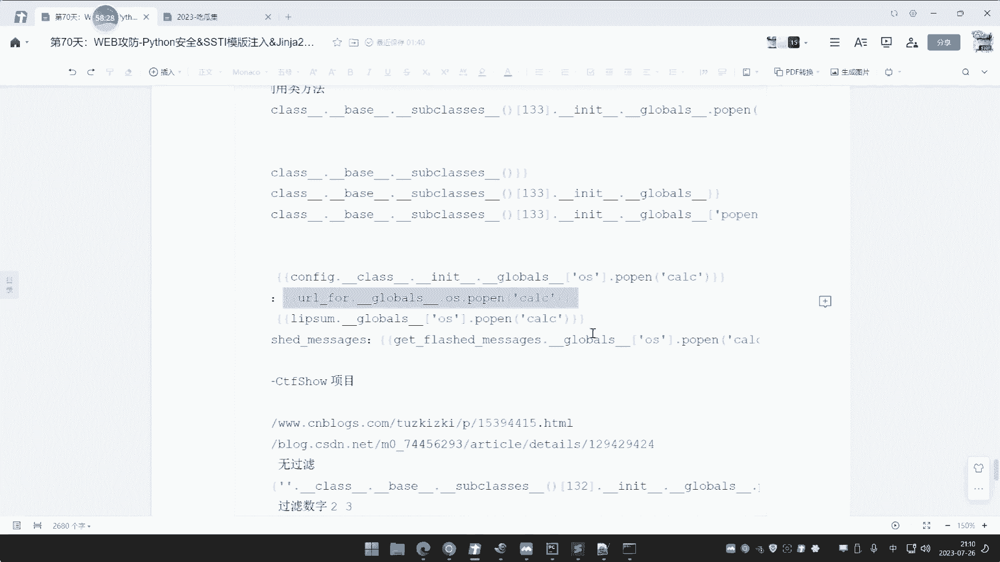

用这个东西呢u l o for这里不需要中括号啊，直接执行CLOC我改成这个CONFIRE是吧，然后呢点rate这个内容它写出来执行，但是这还报错，这个报错是什么，是个单引号的问题啊。

前面因为关卡里面过滤单引号，所以这块应该也集成过滤单引号，那这个怎么办呢，是不是一样道理，request是吧，VUS点X是吧，传递X值后面加上什么X等于好，fake过flag执行，这不出来了吗。

是用UIUR的米写法或者中括号去，这个就给代理好单，建好的，用这个淘是吧，他其实还有很多技巧啊。

还有很多关卡的一些关键技巧，你等下我们可以看一下文章。

看完之后呢，我们再讲项目，这个是366了啊，到366了，这个366呢又是什么呢，来看一下啊，三六这个呢就多了一个，他过了一个下划线啊，过了一个下划线。

直接打了个雷，没那砍，那我先把3。5那个过宽那个把它拿出来拿。

放这了，那这个3。5的啊，3。5的放这里，那你看执行报错了。

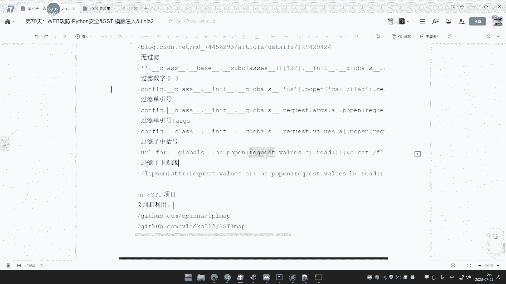

为什么呢，它过滤下划线呢，这里有有下划线，过滤这个下划线呢，他要过滤了啊，你不信的话，我们可以试一下啊，你看啊，我们正常来讲呢，把正常的翻出来看，我写个这个下划线是吧，执行它就已经出来了。

你看好我只写这个东西，它就出来了，你当然你换正常来讲就正常了啊。

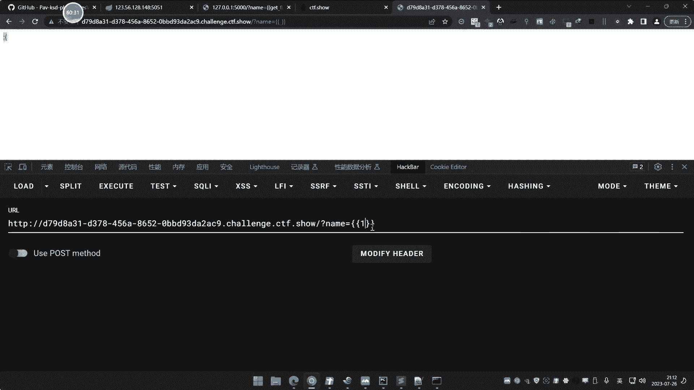

只有有下划线的不行，那我看一下啦，不用下划线怎么办，这里面都用下划线吧，那其中呢这个lap写法里面那可以不用下划线，用这种写法叫ATTRATR是什么东西啊，啊Python里面也学过啊。

他是参数的一个东西，就真正来讲你执行的时候，在这里就是点下划线是吧，格拉斯里面的OS去执行，他这边可以用AT调R加这个值啊，T t r，然后request这里呢给它传参，给他传什么glass。

然后呢B传这个东西好，我们先把原型拿过来啊，这算圆形这种写法，你可以说为什么不用URIF呀，用for里面自带就有下划线，在get方的message，你是你也有下划线。

所以说能选取的就是CONFIER和这个live，那么三网两个，那这里呢如果说用CONFIG该怎么玩好，我们等下说先看这个啊，把拿出来它的玩法是他支持另外一种写法啊。

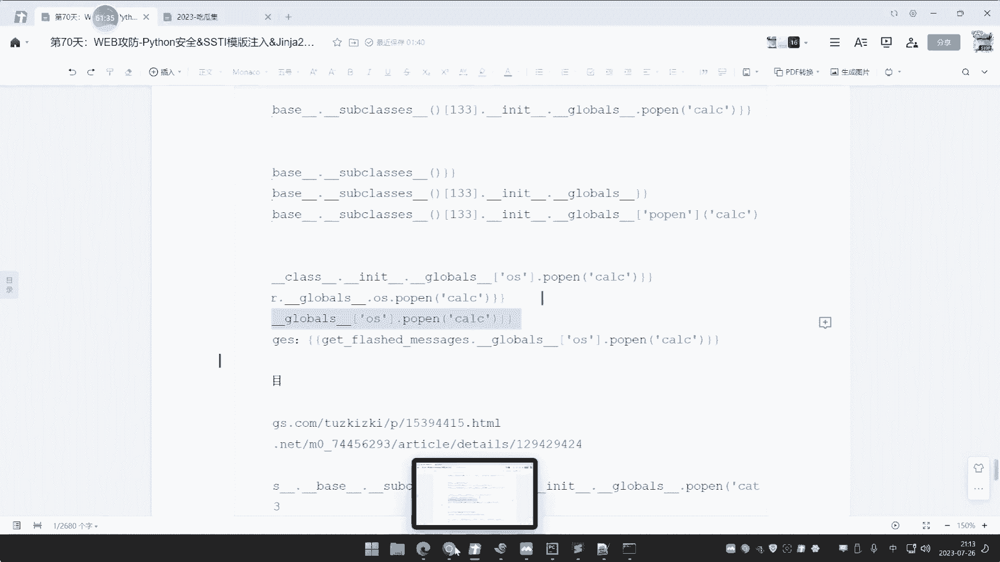

写上去这圆形，那这里有下划线，这个肯定不行，这个就怎么办呢，把它全参叫AD点R，然后呢看request，啊然后点V6点X传过去，这里有单引号啊，这里有单引号啊。

他这里呢也要传，就是说因为前面单引号呢已经被搞过了，他这里呢这样去ADR就不用写那个东西了。

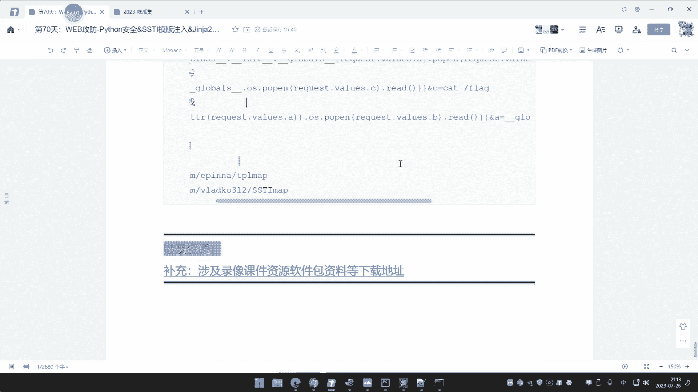

就这里那就权利OS。

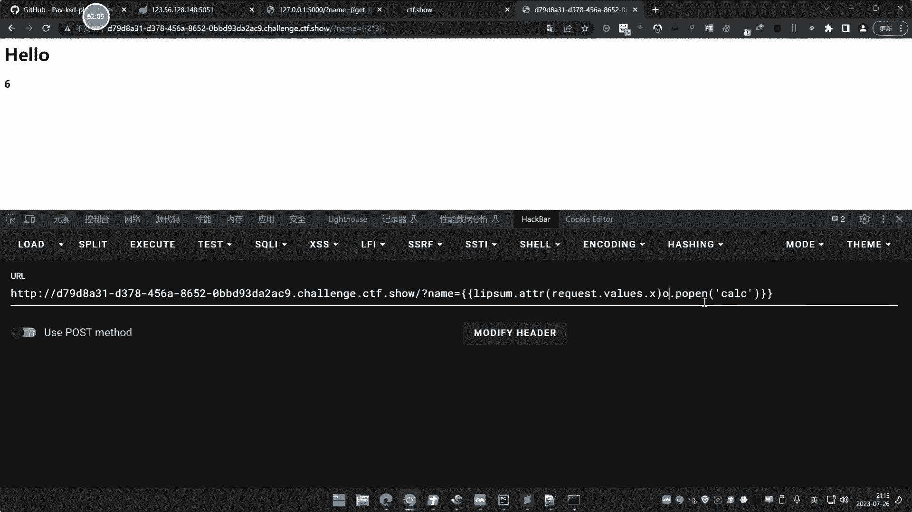

啊ADR呢是类似的，那个之前是数组，那现在的就变字串执行，这里呢给大家传这个东西呢，这里就有写request man feux，就和按照这个写完了一模一样的啊，没什么太大差异。

在这个执行命令，我们就把它里面取CD啊，去读，取了之后呢，就围着一下，然后后面就是这个差等于什么，GOODAS是，然后Y等于什么呢。

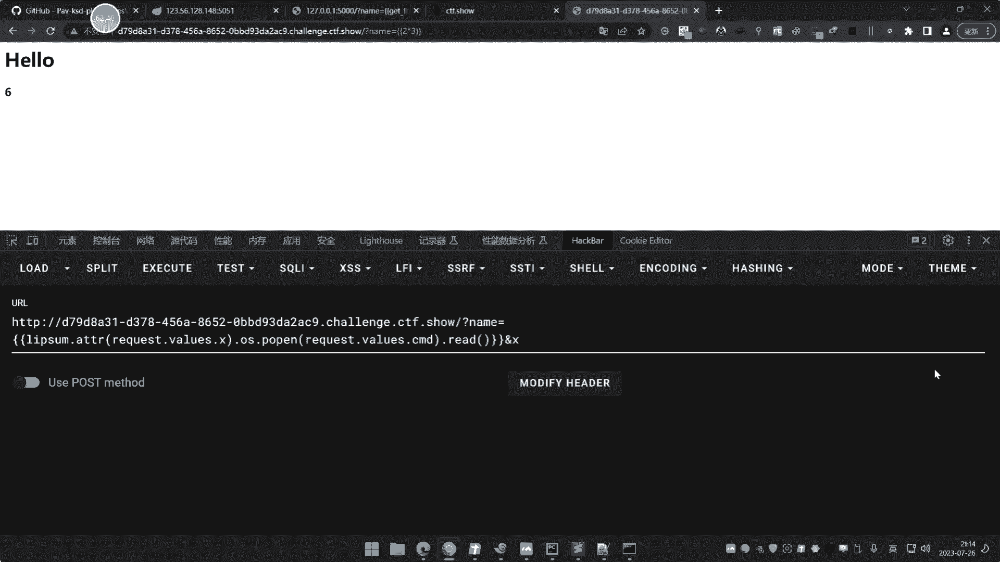

圆心嘛，你看圆形里面，这个后面那个A里面的值值分析嘛，啊前面的cut吗，cut来。

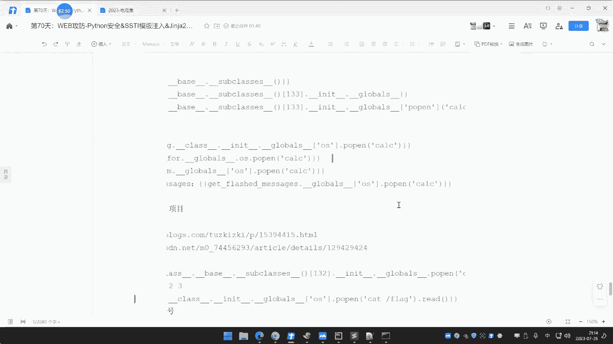

执行哎这CMDCMD参数哎，还有哪些错了呀，我这里少写了两个符号啊，哎不是写对了呀，我他妈到哪写错了呀。

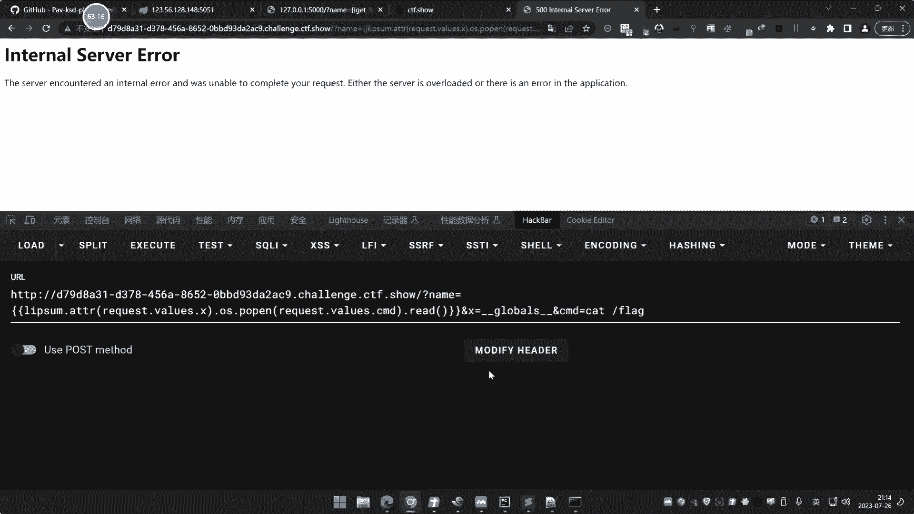

哦这不是点这里好。

这里要看一下嗯，哥搞的是哪个球啊。

不能写出来看一下。

哦他这个要形成一个整体啊，这个是要把它形成一个整体，他用这个ADR呢，要把形成的等级这个东西呢有点题外话啊，这是开发里面的东西，好这出来了。

那这个呢形成一个整体啊，如果说我不用这个东西做，我用这个CONFAKER。

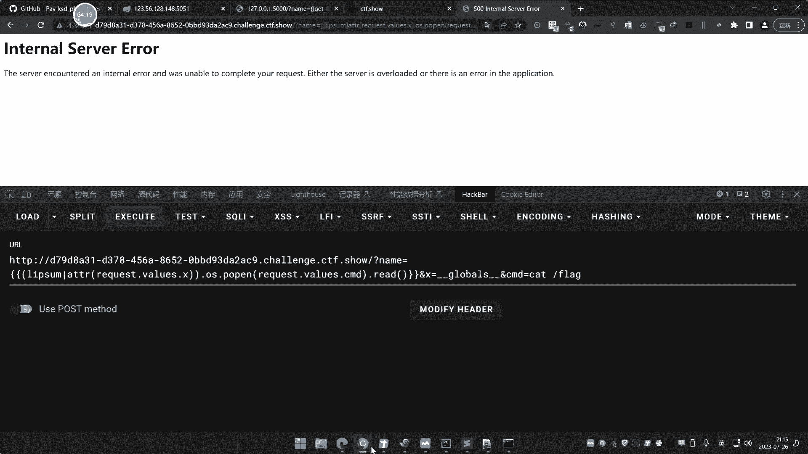

因为CONFAKER里面的他也没有下划线，就有下划线是在这个地方，那这种东西该怎么做呢，啊这东西该怎么做呢，你看这东西该怎能不能变形态，来，我搞个公下，大家来，如果我用CONFIER做的话。

那这个地方那就是CONFIG，这里有下划线，也就是说这里呢我要把全传出去。

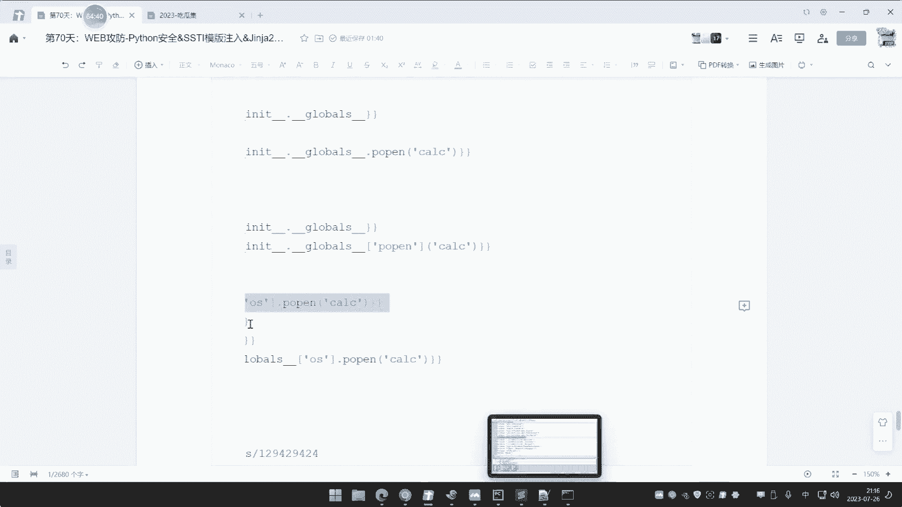

这里呢我要把全传出去，然后这里呢是不是也把全传出去啊，好这两个呢也可把传送出去，这也比较简单哈，那这个该怎么搞它呢，你写的话应该是这样写哈，额全部用这个request点那个查，那这里呢就换成这个。

列表形式request点多少啊，这个就是X这个呢就是，这样写啊，然后是request点Y是吧，哦这个呢也下，好像就把它request是什么，C好，这个呢应该也OS，对不对。

有OS那就把它改成这request叉叉，这里呢又有一个啊，再换成这个request，搞太多了，哎我就直接这个叉呀，叉叉啊，这个三个叉呀，然后这个四个叉就五个叉，他们搞漏了啊，对不对，这样去写它。

然后这里是点V的好，这样行不行呢，你看啊，那么后面呢再写上什么X等于request的原型，就是这里的class是吧，然后xx呢等于INIT1对吧，然后在这个什么xx等于，这个对不对。

然后这里OS又是四个S，等于它必须点上去5S后面要执行的命令啊，就是康康什么，这样行不行呢，来看其实这也是一种方法啊，这也是一种方法，能不能行，我们不清楚啊，试一下来，这是方法啊，不行的话。

那肯定是哪里写错了，要么这里点不用加了，就是不用加点了，但我也不知道，我们先试一下。

这里是有文章这样介绍过的啊，大家看一下，写这个name后面去，好这里报错了，报错是哪里又有问题啊，包括南街的南界哪个地方啊，在，过滤到点呢，点被过滤了，都点被过滤了，看一下啊，我看是否过滤。

把点也过滤了，因为正常来讲的话，这个后面都传到后面去了啊，我看是过滤也过滤点啊，如果过滤点，那还嘿嘿，那还真是没辙了，那还只能用前面的哦，中括号被过滤了，原来如此，原来如此啊，是的，中段过滤了。

那这个写这种括号。

那写中括号应该是不行的啊，嗯这种括号的应该是不支持这个写法，注意下啊，嗯我见过用那个中考能成功的啊。

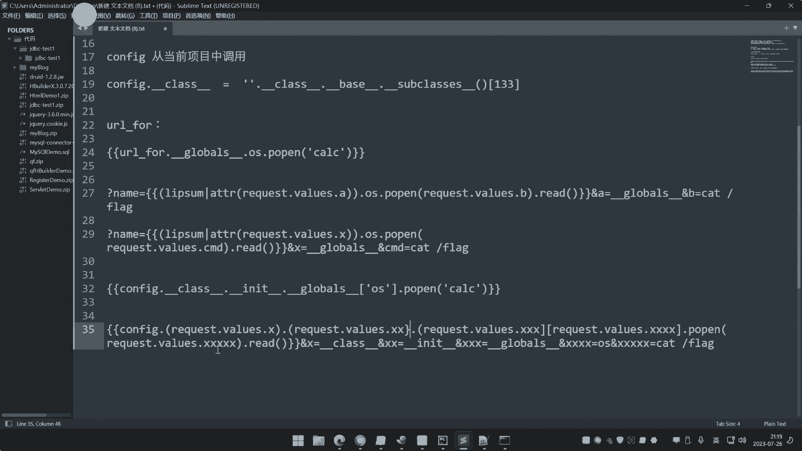

但是这个这个能不能成功，我感觉应该不能啊，报错了，如果是中括号的话就可以了啊，如果没勾中号这个方法，那应该是可行呃。

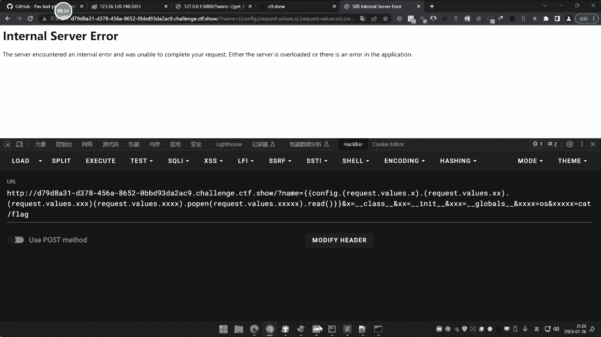

我们可以参考一下这个文章啊，这种写法呢你要看一下这个文章，就是说还有些过滤呢，我没有讲，我可以看一下啊，背一篇文章。

其实还有一些东西啊，还有一些技巧，就比如说这里呢过滤单个字符时。

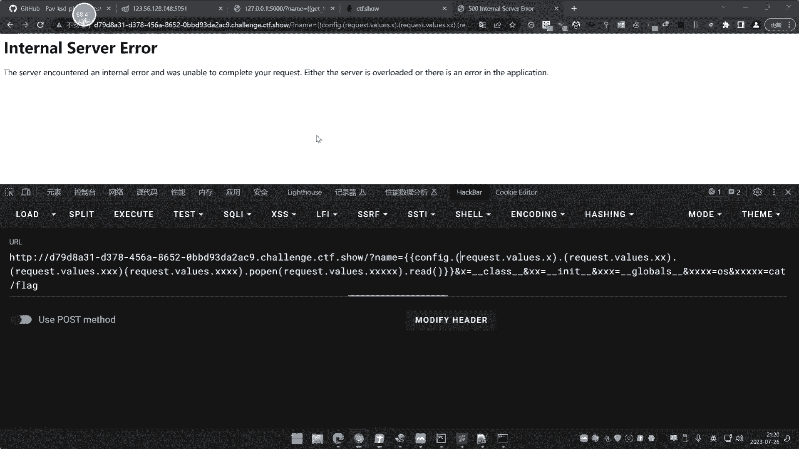

可以用那个加号，你看这里面有个什么过滤单引号呢，它的写法里面的呢过滤单双引号的，把过滤单引号的，他就把有这个传参呢给大家传到这个cookie里面去，他解释的是cooking cookies。

还用到这个签字，就把关键字符呢给它进行一个拼接啊，用这个拼接的，用这个签啊，就我们说那个类似转码的意思，把它关键字符那里进行转码，关于中括号这一写法啊，过于中括号就不能写中括号了啊。

那logo那就写这种符号了，就不写中号了，那用这种叫get info那代无穷，那之前写中号呢要这样写是吧，他这里要加个东西呢，就变成这个get in for，就等同于这个东西，那其实我们刚才也可以写。

但刚才那也过了下划线，你看过滤下划线的写法，你看他这里有这样写法，你看的是他把全部这个东西呢，以这种值呢去发送，对不对，全部之类的，比如这结束class class就是它是吧，这个MO呢就等于MO。

反正在写，啊关键字的话，比如说购物6OS，你就可以把O加S怎样去写，对不对，这个相关的各种照顾呢，你再参考一下资料啊，这个东西呢是讲不完的啊，太多这个组合了，包括下面还有一些关卡。

还有关卡呢就是下面这些其他用法，比如说把它进行这个呃这个用这个东西呀是吧，用铅呐还是种组合呀，把拆分呐，唉太多东西了啊，但是我们呢就是主要的还是说，从这个代码和神级，白盒神级和黑盒神级出发。

毕竟要强调用到实战中，这个虽然CCTF的题型呢我们了解之后呢，后续参考文章多打打也能训练上来，好那么现在呢我们就来改开看一下两个项目啊，这两个项目呢一个叫TP l m up，一个叫SITIMU好。

我们现在来看一下啊，网上查的项目都是TPL吗，你这里让给给搜一下来，比如说s sci是吧，他利用这个工具，或者说利用什么东西，行SS这个是今年发的。

那是漏洞检测工具TP l map，然后，是吧，你看一下啊，在这工具啊，我们下载了就不下地址的都给了啊。

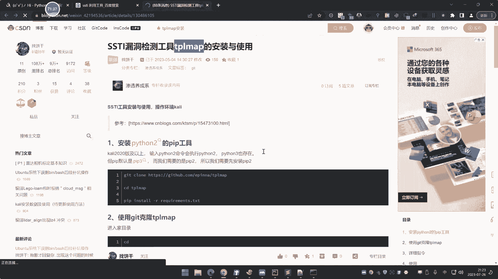

我们来给大家分辨演示一下啊，这个是干嘛的啊，这个是利用工具，但利用工具呢他不能利用这个绕过的工具，只能用这个。

只能用这个什么减一的啊，就是说直接有漏洞的，如果说上面有绕过呀，有过滤啊，那可能需要人工分析的，那这个利用呢就是先装库啊，先装这个是吧，PIP呢安装这个TIT里面的啊，这个安装呢很简单啊。

就是我们这里呢它是用python2写的啊，就只能用Python r执行，就我们的先来到我们Python r这个目录，然后呢找到一个什么pip啊，然后杠二隐私多对。

然后request这个文件让他去安装这个库，少了个音速，那他就安装了啊，由于我都安装了，安装好之后呢，接下来的话我们就用这个python2里面的，LET1呢去执行这个文件啊，执行这个TPL这个文件好。

直接呢它的显示的这个执行玩法呢就是杠H啊，直接加上路径看一下啊，杠U我们可以试一下啊，用这个先用这个CDF的题型。

那我们去看一下，就让它检测一下，看他能不能直接得到你的东西啊，这不修了。

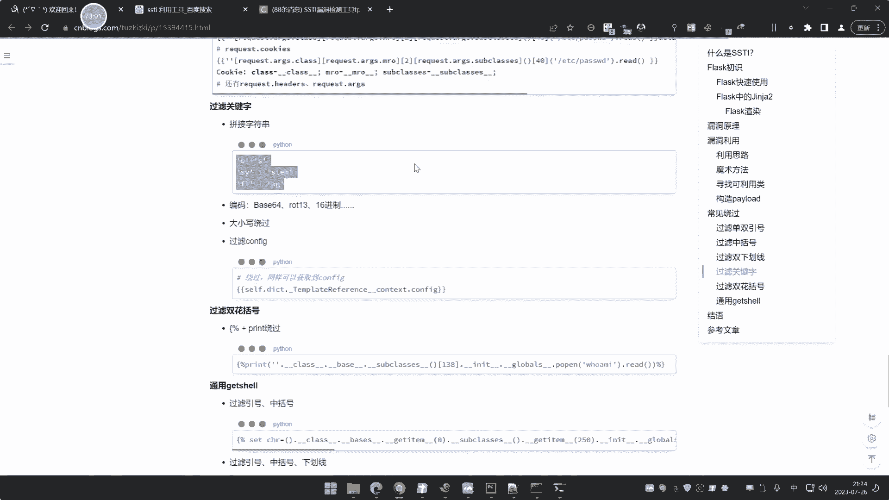

额只能用那个第一关的啊，第二关呢就不行了，为什么用第二关不行呢，因为第二关也过滤了啊。

他有些payload呢，它是不能像人工那样去分析哪个有过滤，然后呢再绕过它，它只能是吧，只是浅微的去利用。

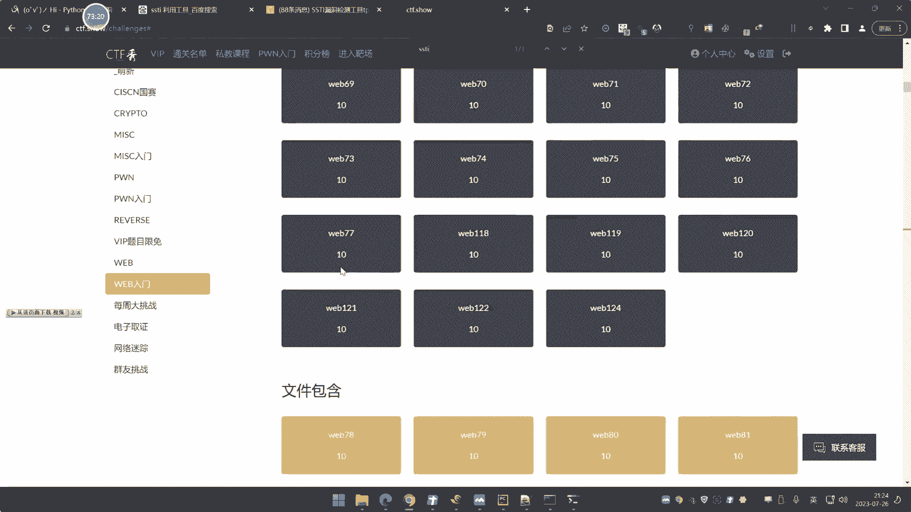

好我们看一下啊，这个是利用工具啊。

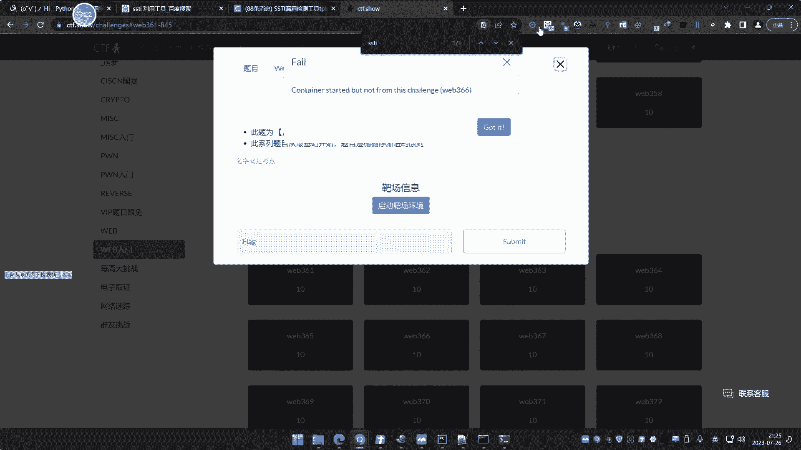

我们看一下，我直接把地址写上去啊，然后呢给他个参数name啊，就这样啊，继续让他执行，哎他执行结果是说什么，这些星号代表让他去租，入两点他就租了，那他说了，share呃。

CONFINDER呢支持ok been ok呢都能支持，然后刚刚OS需要就是返回一个交互式的，这个给那看一下，刚刚OS刚需要，那输入命令id art flect，嗯只要得到他的权限是吧。

他就直接用工具呢返回JAVS命令给你，就是一个关命令哎，想执行什么就执行什么，这是获取那个对方的21的权限吗是吧，这是这个项目，对不对，他能直接获取，而且他上面提示也很清楚呢，这里是啥意思呢。

我这里呢换成这个聊的命令，执行O这个什么反弹shell，OK文件写入，OK文件读取OK啊，执行代码OK都是能够执行的，这权限非常高，把能够执行，然后呢你再获取flag不就行了吗是吧，这是工具啊。

好我们看一下工具，如果说检测我本地的话啊，我再看一眼中国工具的检测，本地，这个是本地的地址，是这个172前端口的，这个是我们本地的啊，反简在本地的，本地地址的也是name啊。

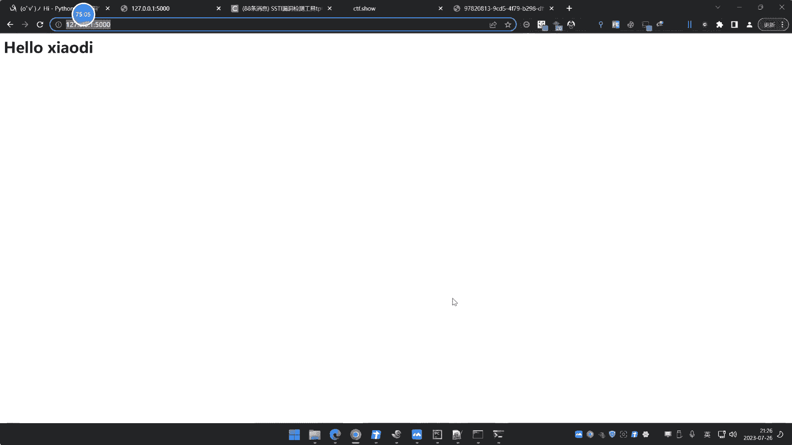

name参数给它执行下啊，你看本地的就不支持什么shell命令了，他这里就变成low low，为什么工具垃圾了呀，我们本地我刚才也执行命令过呀，这个本地环境了，我检测了个本地环境。

我刚才也用用这个shell，那也能把它成功的呀，但是为什么不行呢，工具拉进来呀，所以呢这个TP l map那不是他不给他推荐啊，你看他用这个t map来去检测我本地的，它不能进行这个OS系啊。

你比如说我这里要进行OS系，他说low system commander，那不支持目标的呢，不能行是吧，所以呢我更推荐大家用这个s t i map，因为这个是时长更新的。

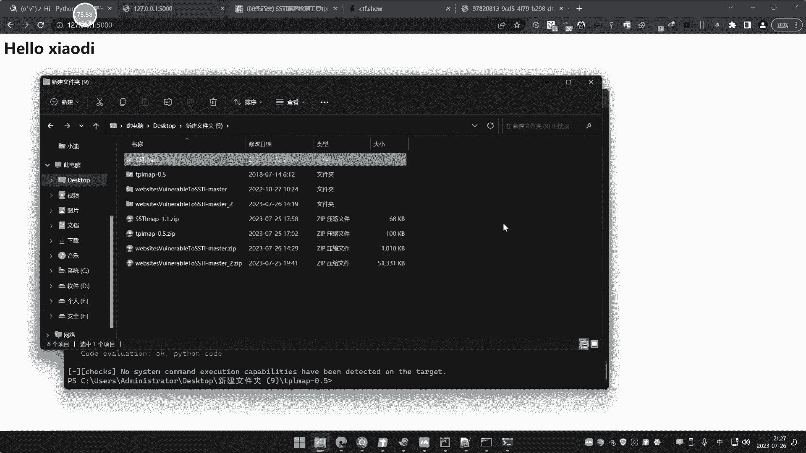

好把打开打开之后我们再用这个工具呢，这个工具是python3的啊，那么呢先装库啊，库的安装还是要给演示一下，怕有些人又不懂是吧，加点码在里面的啊，然后是script里面的那个pip啊。

然后杠多重装这个当前目录request prt，给他安装一下好，安装好之后呢，接下来啊，我们就用这个Python去执行这个SITIJPY啊，直接杠U啊，看一下啊，我们这写的目标地址的结果，本地地址的。

刚才有那个工具不行，有这个问题再试一下，不错，那需要OK两工具呢一样的目标，结果不一样，Ok，这个是OK这个是low，看看怎么写，直接来刚刚OS钢线，而且它支持的模板更多。

命令的OS斜杠三MD1cl shell，Gp l shell，什么反弹或是上传什么当地文件，下载文件都支持，好像啊他自己分析，然后看一下关闭啊，本地的一个命令关闭是吧呀。

这不就是我当前那个我自己电脑的权限了，同样道理呀，我也可以试一下这个靶机的，这靶机地址对不对，用这个工具来也检测一下，退出来把这个地址再改一下啊，改一下live，然后呢等于是吧，要单还是随便写啊，回错。

那他也支持对吧，然后刚刚OST就反弹个交互式命令行，给你对对方那个CCTF那个靶机啊，cf修的那个靶机啊，那C命令cut来个嗯，我要读取短名i id都能增加直线，所以说这个STI抹布呢。

要比那个TPLMAPLAY要好。

比如说有些东西呢你要多吃啊，这个呢就是SITI的那个呃两个项目啊，那么可能大家又说了，这和黑盒有什么意义呢。

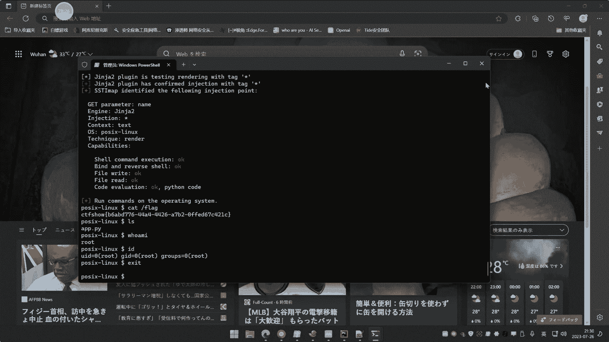

我们来先看一下聊效工具的原理啊，这个SITI和ta map呢支持的都差不多。

但是一个工具呢要强度要更高，所以我们呢看s i t i map，这他更新的时间呢也是在今年那个TP l map的，已经没更新了，他支持哪一些，我们可以看一下啊，来这是他支持的广度。

RCE和dinner的，一般我们大部分都是RC1，就是利用RCE执行文件读取文件写入，那这个也可以，这是模板引擎Python的呢，五个支持java，SQL的，支持ruby的，支持java的支持。

然后有两个不支持，一个是这个版本高版本，一个是这个版本的高版本不支持，这基本都是据说PPP啊，ruby啊，JavaScript Python的PPP啊啊都基本都支持啊，主流的都支持检测，对不对。

那我试一下呗，看行不行啊，那么试一下的话，我给大家答了一个靶场。

这个靶场呢模拟了所有的这个环境，就这个啊，这是那个专门SITI的训练靶场。

比那个CTF修的要更全，再不行，那就是只训练Python里面那个菲斯科的那个SSDI，其他语言的，没有其他语言的话，就可以用这个bug，这个button有哪些呢，大家看一下，这支持。

就是基本上所有语言里面的这个模板的STI，注入它上面都有继承，然后呢，你就可以配合上面的东西来训练你的技术，并且呢隐晦的测试，那就这里有这么这么多嘛是吧，然后这是端口啊，我觉得给他开了啊。

来我给大家打开看一下啊，这就是我们那个哎八层地址呢。

要我打他。

这里是我们那个靶机地址啊，我这里打建好了已经好。

那我直接用DOTA启动的，他从从这个5000端口到这个什么鬼，多少端口都开了。

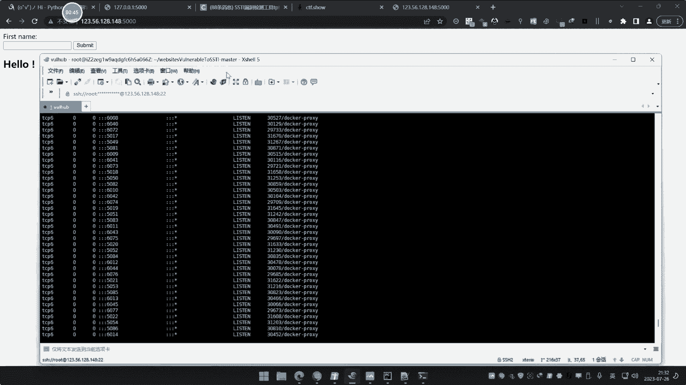

这个对应端口号呢就对应一个靶场啊，我们可以看一下了，5000就是这个Python的这个这个这个模板引擎框架。

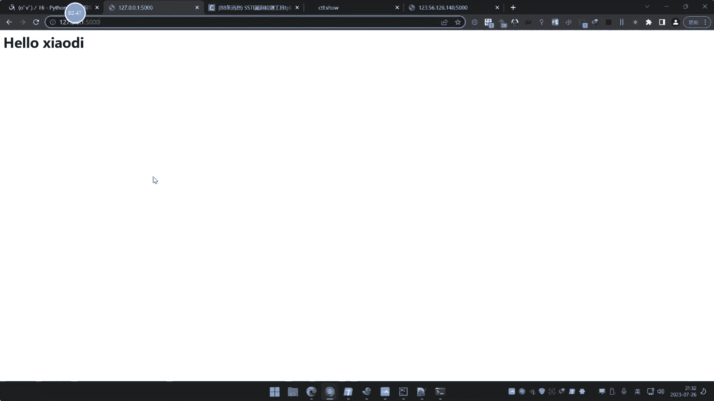

5001呢就这个，然后这个呢是5002，你可以测一下啊，比如说这个Python这个jungle，这个这个这个同学今天讲这个东西啊，我们来打开给看一下，这是5000的啊。

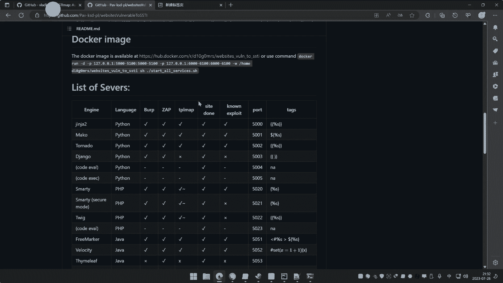

然后呢我们依次用工具去给他检测一下啊，这是他参数嘛，参数值我来抓个包。

这里呢是怎么一个请求头啊，看一下R呢，这是地址，然后呢请求的载荷是name啊，这是name以post请求的好。

哪个知道了，那现在呢去检测它该怎么检测它呢，就是杠U写到这个目标地址，详细，然后呢是杠data数据不是杠，这个get数据就是杠d data数据，斜杠name，快去检测检测post提交的这个类目数据。

去测试这里面的CI，那检测到了引擎的是呢，JINJAR支持全方面的对吧，都支持，那我们后面的go out s线，那就不测试了，这个是5000端口的好我们再可以换一下啊。

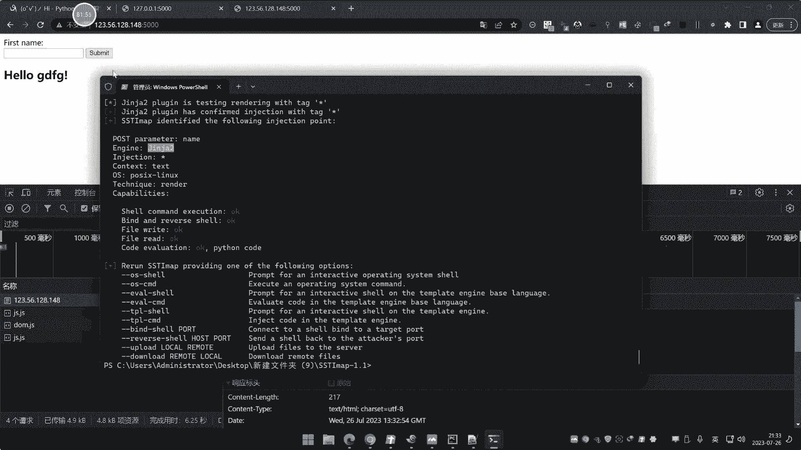

如果说换成这个什么另外一个洞。

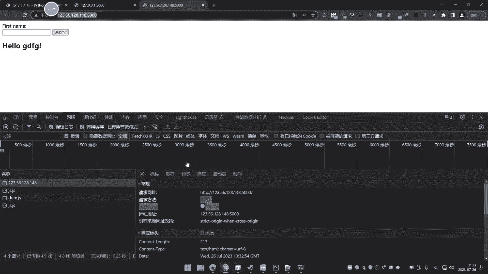

我们都要拿个PPP的来测啊，pp的smart505020的，打开一下5020的。

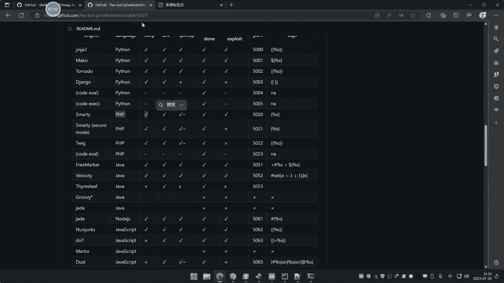

好这个是5020的，我们可以先设计看一下啊，他这里有pp啊，好那同样道理啊，这里应该也是那个data数据，带点数据，那就是5020了是吧，看他的一个简单是不是就是5。20的啊。

前面那个是针对模板的一个检测，CSN呢smart也是全部都能运行，对不对，全部都OK的状态。

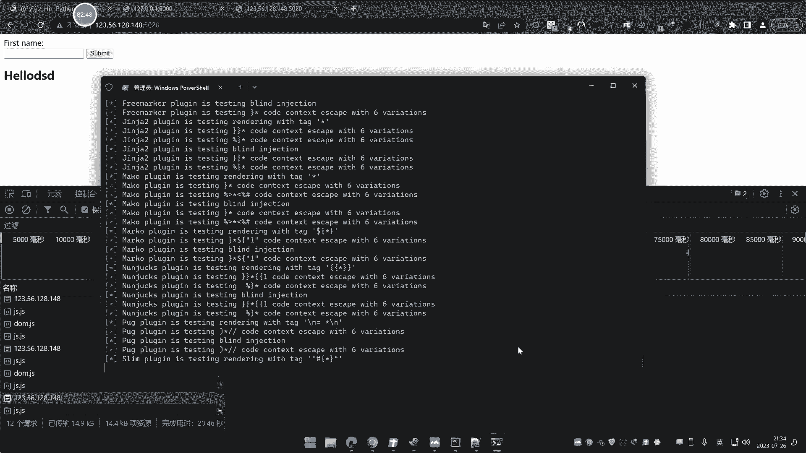

再来看一下，这是pp的啊，我们再来看一下这个另外一端口。

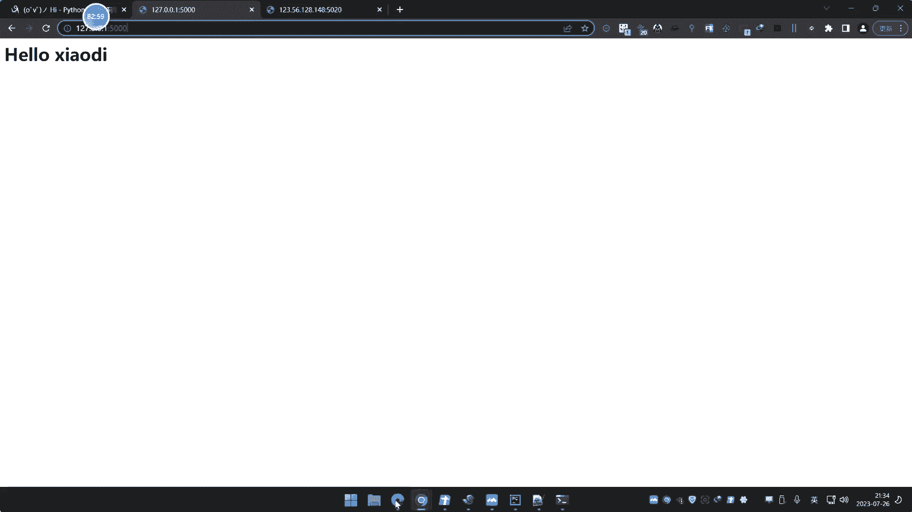

再来看一下这个java的java的这个随便找个啊，50251250525，50353都可以试一下，5051待会进行检测，5051呢是指的是这个java的free Mark啊，他也支持来remark。

是吧，然后这个卢比啊，反正我都不测了啊，就说这个工具和这个巴掌平台可以配合使用，一个是了解工具这个知识面，第二个呢就是了解各种引擎有哪些模板呢，出现过安全漏洞，好这里大伙问了哎呀，那黑客照那如何测呢。

你黑合成不用去想什么法子测呀，他只要满足几点就满足，你能测试到SSTI的一个问问题，白盒我们就不说了，白和你代码中的都能直接看到是吧，就像我们这里呢这里本地演示的这个app。

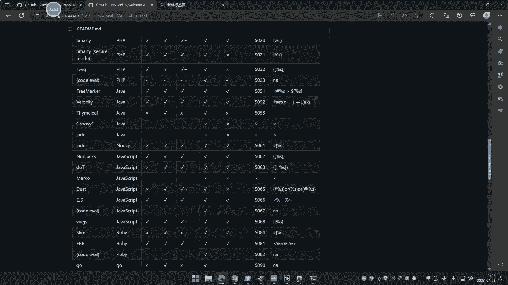

那这一看就是这个什么jj Python的FISK的框架是吧，这是典型的这个函数，这是不用看的。

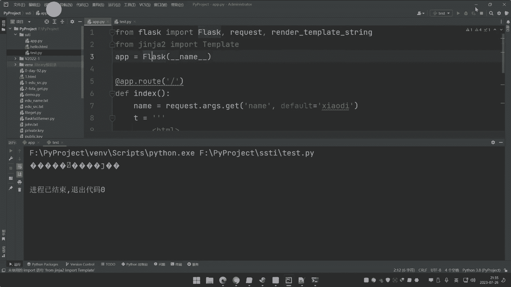

知道之后，那pp里面的什么smart呀，java里面的这个什么鬼东西，这也是讲的好多吃的呀，这种安全开发的。

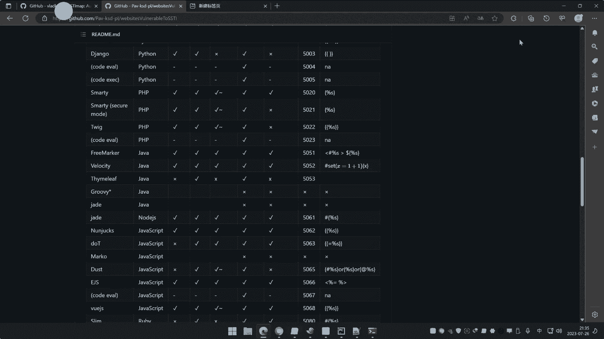

你不信我们都可以找到这个根据，那i id和这个pp storm都讲过。

pv storm里面呢我们讲了个DUMA，还这个德某站呢，妈的都不能打开，啥，我们先说白盒啊，我们待会再把它飞和一个看。

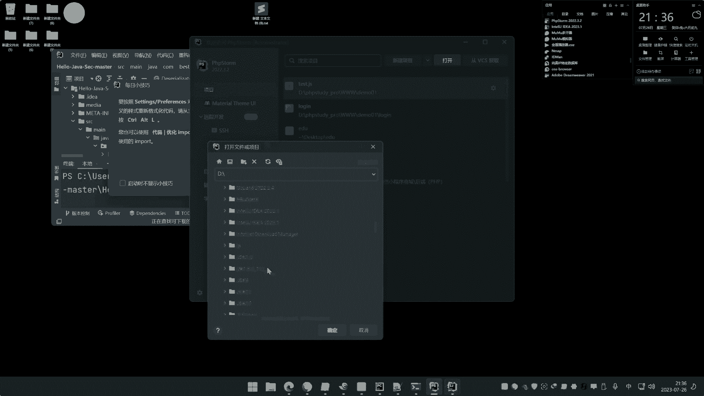

就是我们那个之前讲pp开发的那个源源代码，那个地方，那当前演示的时候呢，这个代码段里面呢我们还引用过这个smart呢，有没有印象啊，而且大家看一下呢，这还我当时做的实验呢。

用那个smart去操作那个smart那个情况，smart那个那个演示没代码都还在这里。

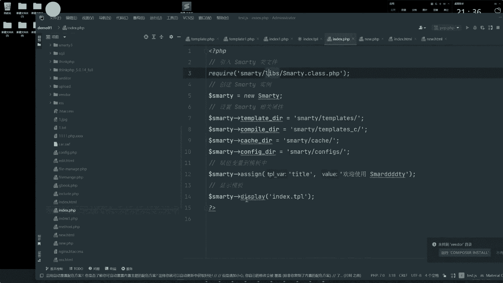

不要演示过啊。

然后说这是pp的java里面呢我们也讲过，java里面呢我们也讲过来，这个是既是java里面讲过的项目，用的是那个，这个呢按model打开，哎，我当时讲的呢用的是这个模板，就是这个模板，啊这个讲过了。

这是要选用的模板呢，我还是还写过这个几个的模板呢，这里呢用data是吧，就当时用java应用的的TRM的一个模板。

这个模板是不是就在里面，你看是吧，嗯pp讲这个嘛，java是讲这个，那今年呢是PON的，是讲了这个嘛是吧，哎那你肯定说哎呀，还有啊什么JS的呀，这个什么ruby的勾啊，那不好意思啊，那讲不了了啊。

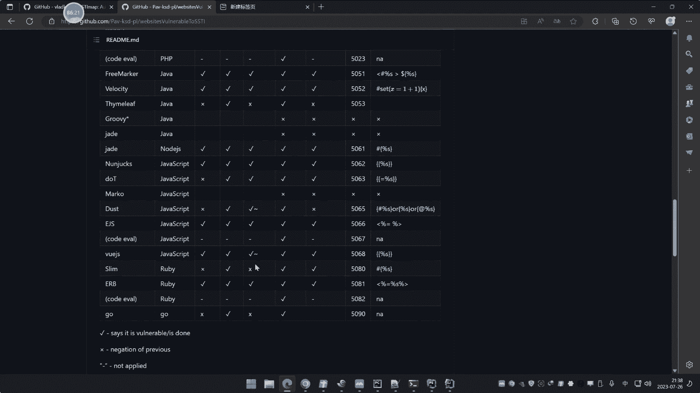

太多了，你要讲的话，那所以漏洞再讲一遍的，好我们这里呢看到了啊，那这个是白盒的啊。

白盒呢就很简单了，看到的这个模板用的是哪个引擎就知道了嘛，对吧，他有没有用这个技术。

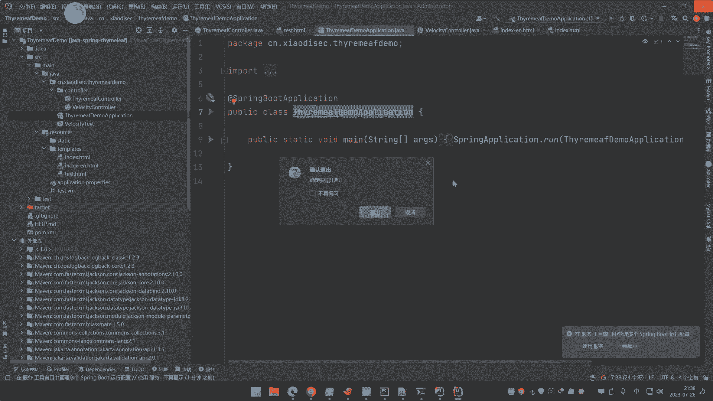

黑盒呢，那怎么测呢。

其实黑盒测法也是相当简单的，其实你你如果说你不知道他有没有用模板。

有没有用这个模板这种东西技术，你就记住一点就可以了。

什么一点呢，就是你的参数值如果有在这个页面中出现过，那么这就符合一个STI的这个测试点，立即要记住这一点就可以了，就很简单，你访问这个数据之后，你看一下这个页面中的源代码里面有没有，你上面提交数据。

比如说你上面写个类目是吧，等123，那这就是符合于已执行啊，它没有显示，你看它没有显示，那就不测一嘛，但是如果你在这里呢，它有显示你提交的数据里面参数值，有这个东西在页面中的有响应和它对应上了。

那这个就是一个测试点，因为这是黑盒中，你不知道这个东西究竟他是不是刷远了，但至少有一点理解，你输的值，他在页面中显示，就有点类似于和那个XSS漏洞的一个，那个那个黑盒测试那样。

那么你就只需要记住这个参数地址，你就直接可以用什么用这工具帮你去剪了。

能理解了吧，你就不要手工剪了，手工剪是你已经确定出它是什么模板引擎了。

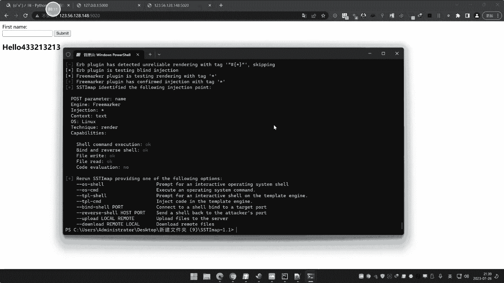

你才手工剪，因为手工剪的话，你需要让他知道是哪个引擎。

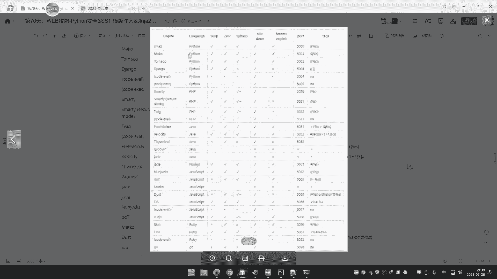

你才能用这后面这个语法是吧，用到我们讲的这个这个东西是吧，比如说嗯是这个啊，你就用这个东西呢代入那个查询表达式，让他去看他值不执行，确认他有没有，那你就这但你前期你可以合新收集。

不一定能收集到十这个东西呀，它有可能不显示啊，所以呢你不可能一个个测呀。

那就用工具帮你去跑，工具方去检测pass能支持这么多模板的检测，所以黑盒中测它的话，就是和测试差SS1模一样。

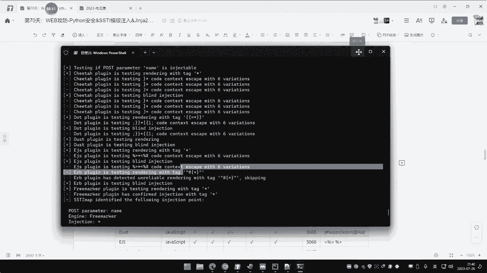

没什么太大的情况，配合那个Buff的一个抓包和那个hr1的插件，就可能直接识别出来了，就是发现你那个参数值在数据包里面，回血里面有，那不就可以撤了。

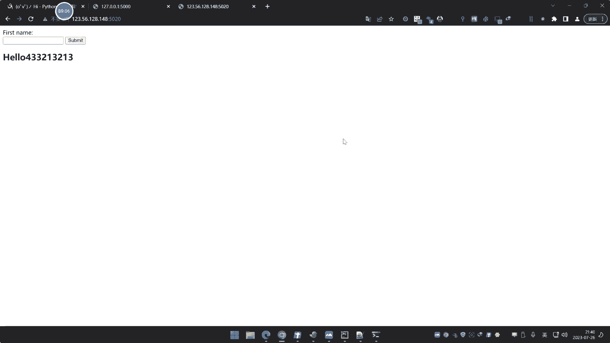

我不知道大家这样说呢，大家能不能理解啊，因为那个巴布斯特里面那个AHARX1呢。

那个高亮的那个插件呢，大家应该都知道，你自己呢就可以写个规则，就是说参数值和这个数据包里面的返回值一样，哎那恭喜你，同样呢你还可以写个正则表达式。

因为这个STI呢一般他全参的值是什么呢。

一般STI的话，用模板引擎的话都是传什么CN啊。

伊文啊这种东西，这个大家应该好理解啊，这个CNEN的一个解释，那都知道英文页面和CN页面就是中文页面呢，你切换它是另外一套这个显示的一个界面，那么英文界面呢，一切换呢就变成英文的一个页面对吧。

其实就是相当于他准备两个引擎，一个中文页面的引擎和一个英文页面的引擎，如果你有发现有些关键参数，有些值有作为参数值的话，那这里很有可能的就是SITFI在切换是吧，你全仓给他选CN的时候呢，他就解析。

那个CN的那个页面。

所以说呢你要根据这个原理啊，原先我们讲安全开发的时候啊，我们还讲过是吧。

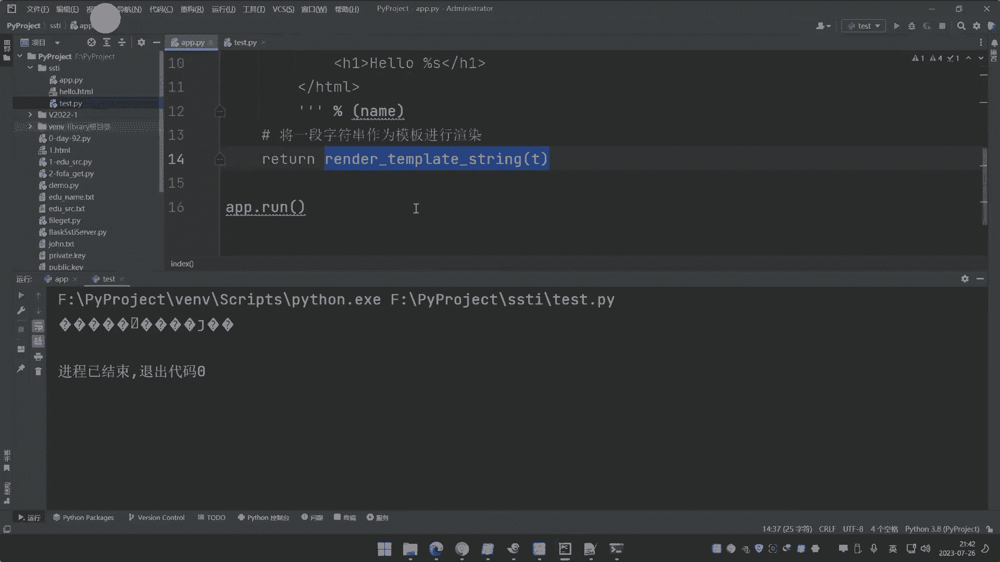

拿过这个例子，这个中文页面也中文页面的英文页面切换的，给他举过这个例子，这都是丰富你对这个漏洞的理解，那你便更更好的便于是吧，后期的这个安全测试一讲的话，听得明白，那前面安全开发的就讲通了。

听不明白的话。

那就没办法了啊。

所索取刀来啊，今天讲的这个字典呢，你需要很理解这个这些东西为什么这样写呢，不需要啊，因为大部分的一个操作呢有工具帮你完成是吧，时不时不行的时候呢，你再查一下这个资料是吧，着重的简单修改一下。

会用就可以了，因为这些东西呢你要搞得很清楚，为什么要这样写呢，你就要学习这个语言啊，那个pp1P呢，Python呢还讲啊，p pp和java还讲过这个Python呢我们用它做web开发的，没有讲。

做一下这个工具开发，还可以讲一下，但工具开发里面呢也不会涉及到这些鬼东西，也不会涉及到魔术方法这东西啊，你除非要学一下反序列化，下节课的，我们就讲一下这个Python里面的，简单的反虚化的一些情况。

和那个其他的什么SQL注入，Python里面SQL注入呢，我们讲他不是讲SL注入知识点，主要是讲Python里面SQL注入里面的联合的数据库，它的数据库联动呢。

一般就是MONDB和那个LOSQL两个数据库居多，我们前期讲SL注入呢，对这个什么鬼，阿克塞斯啊，MYSQL啊是吧，这种数据库讲的啊，这个什么MDBALOSL都没有讲过。

那讲那个设置呢是讲哪两个数据库的注入啊。

一般会调用哪两个数据库。

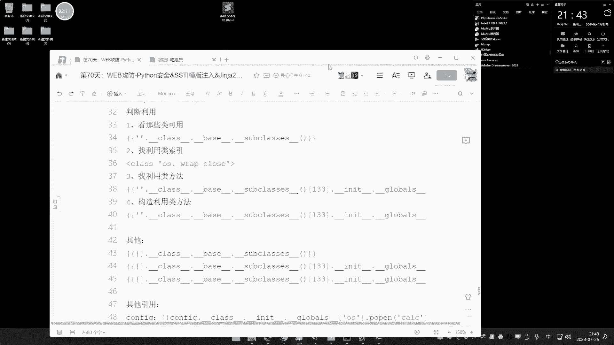

Python的知识点呢，说实话啊web上面的支点呢不是很多，网上呢像Python的web工坊的东西呢也很少，因为本身这个Python的web也不是那强项。

网上关于Python写出来的web应用呢也比较少，现在主流的还是pp和java居多，然后呢其次就是点net，再就是Python，然后再就是JS啊，JS简单成那些多JS点net呀，P 1p java。

这是四个web语言选择最多的。

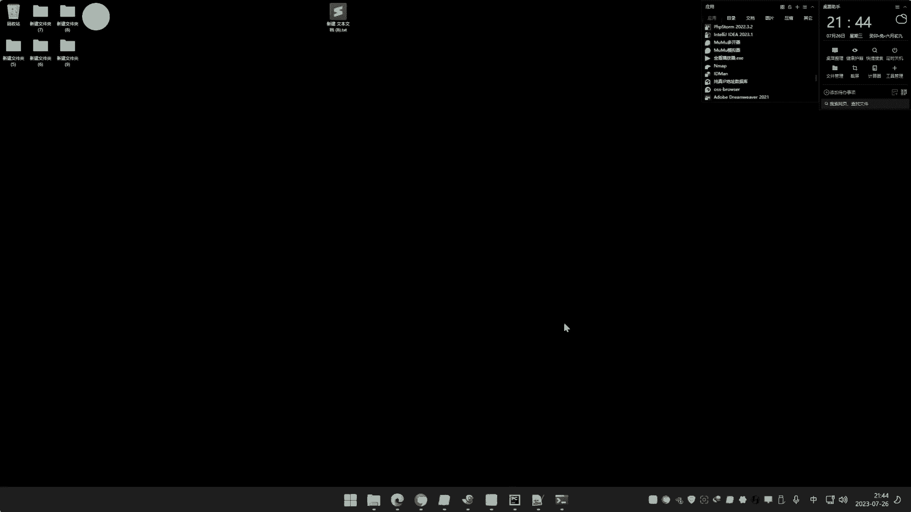

其次才是什么Python这些东西。

Python一般用它做大数据啊，AI啊，写安全工具啊，写一些脚本比较多，但是外部开发方面比较少，所以说网上呢针对这个web开发的Python的漏洞呢，知识比较少啊。

一般CTF里面才喜欢考一下，实战中的话。

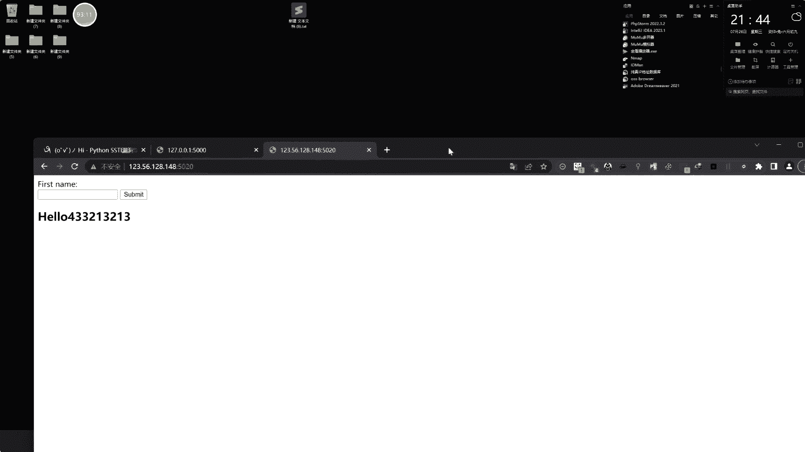

说实话还是比较少见的，除非是你做代码审计，那去升级。

碰到了这个Python的web产品，需要了解这块技能再有点用啊，石家庄大网站的话，黑盒中测试的话很少，哎好我们今天呢就说了这么多了啊。

看大家有没有什么问题啊。

啊我们呢把等下把录像关了，把瓜一吃。