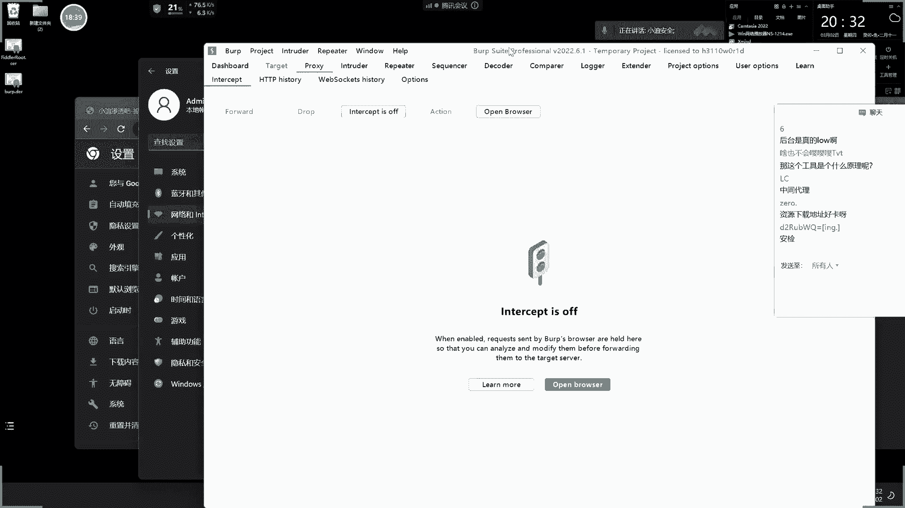
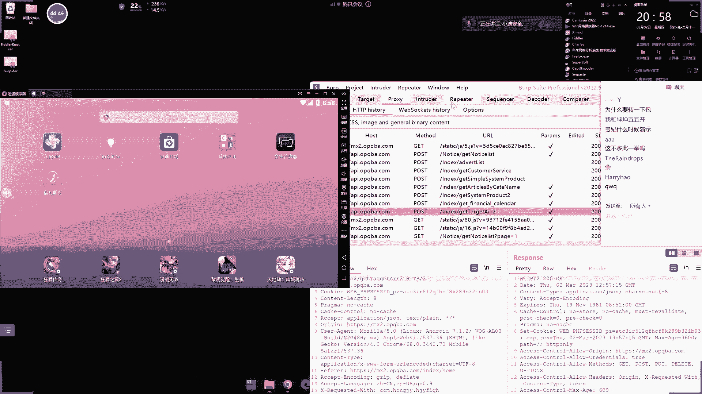
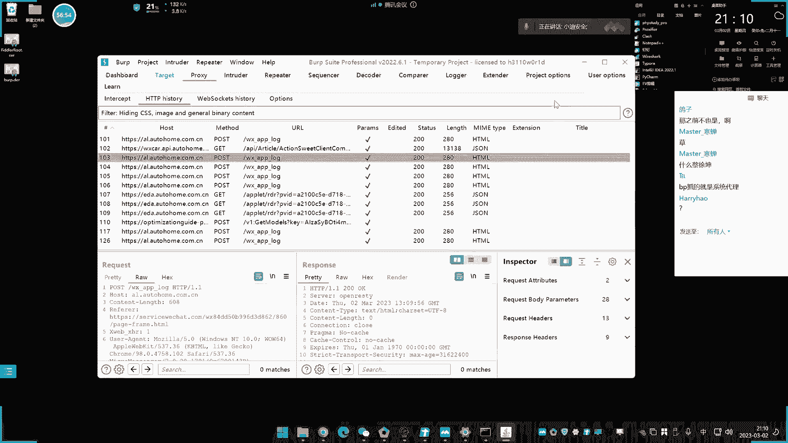
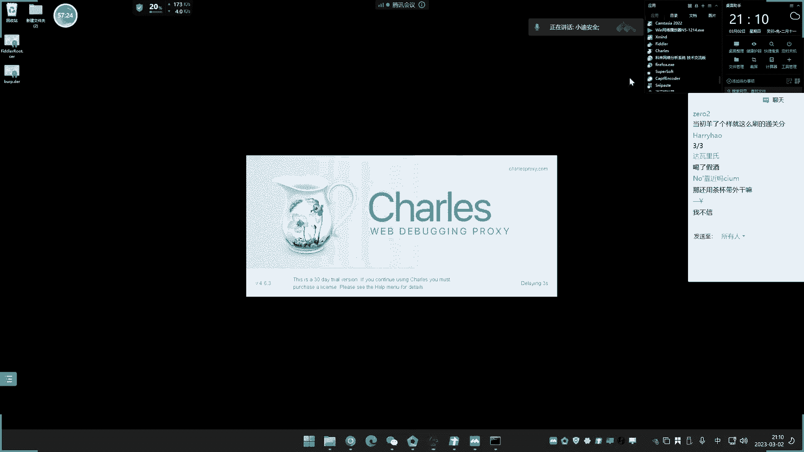

# 【小迪安全】V2024版 全栈网络安全 ｜ 攻防渗透工程师 （持续更新） - P6：第6天.抓包技术&HTTPS协议&APP&小程序&PC应用&WEB&转发联动 - 逆风微笑的代码狗 - BV1Mx4y1q7Ny

看今天内容啊，今天呢我们讲第六课了啊，关于这个抓包技术了，抓包技术呢其实可以上个三五次直播，都可以删出来，不过还有两三次直播呢，我们是准备在后面单独的去讲，因为这个有单独的章节的。

讲一下这个应用方向的功法，再来个章节讲，今天呢就是讲这个抓包工具的使用，不过这个招工具呢也只是讲了上半部分，下半部分，那我下节课还会讲，就是最简单先入门，然后呢我们再说他的一些拓展。

这抓包这个东西呢其实有五次直播要讲啊，五六次直播，因为他还是有蛮多这些防护和一些突破在里面，我们前面先说最基本的啊，那今天讲的是针对于这个hp和hp的抓包，一定要搞清楚啊。

知识点呢就是我们抓捕技术啊，几个工具的使用，同时呢了解这个hp和hp的一个抓包的演示，针对的对象呢是这个网站app小程序和PC应用，这是目前我们主要几个针对的目标是吧，电脑端的软件，微信小程序啊。

手机端的app和我们电脑端的这个web网站，这是我们针对的四个方向，用到的工具呢会延迟到三四款工具，简单来说就是final茶杯和bob suit，然后我们下节课再来说其他协议的抓包。

就会延伸到y shark和克莱，那么今天呢只是讲这个web程序的啊，首先呢我们来了解一下今天的一个课程的目的，是实现四个方面，就是了解了四点，第一点呢就是这几个抓包工具的，它的安装和配置。

就是它的增速配置，环境配置，第二个呢是了解这几个工具的使用，第三个呢就是我们说的，学会针对这四个方向的抓包，抓包呢是只针对的是抓他这个AP的，然后呢，再就是最后一点就是了解我们今天学到的东西。

是抓的是什么协议的，你不要搞错了啊，不是说我们今天讲这个东西呢，你的东西都能抓了，不是这样的啊，你要搞清楚，其实每个应用呢它有一些数据走向的，它是不一样的协议，那么我们要讲的今天呢是针对某一种协议。

就是我们说的这个web协议，app和P的，那么其他协议的话，那么用今天这个课程的工具，它是不死，它是不能行的，就不可以好，我们这里呢再来说一下啊，就是我们前期的把这个课程的背景呢，已经给他交代完毕了。

那么现在呢就来给大家演示一下这种抓包，然后在抓包之前呢，有一个配置是提前要配置好的，就是这个增速的安装，那么主要是集中在两个方向的安装，一个甚至是我们自己电脑的浏览器上面，去安装证书。

第二个呢就是我们的安卓模拟器呢去安装证书，就这两个啊，为什么要装这两个证书呢，证书不装的话，他是无法抓这个HTTPS的数据包，什么叫APS呢。

就是我们看到的啊，像我这个百度它就APS，那么像我自己的博客呢。

就是ATPE对吧，那么如果不装帧数的话，他是抓不到APS的。

所以你要装帧书，装帧数该如何抓了啊，我这里呢就是三款工具，在三个工具呢，第一个呢就是我们的这个茶杯，就是一个茶杯的图标叫chess，然后这个呢也是要装帧数的啊，它的帧数该如何安装啊，我给大家演示一下。

要装到两个环境里面，首先是我们的这个本地的啊，本地的如何装呢，在这里呢它有一个这个地方啊，这个地方呢，S s l pr，然后这里有个叫什么来保存这个can stoc啊，这个数把它保存保存到桌面。

然后名字随便取个名字就叫茶杯，然后这里就会出现一个文件是吧，这个文件记住了啊，然后如何装呢，首先我们看一下模拟器怎么装啊，模拟器这里面呢，我们把这个这里有个叫什么共享的，共享的一个东西。

我们可以让比这个音乐文件呢给它拖进去呢，先点到我们的正面来，现在我们这边来啊，把这个保存好，证书呢可以把它复制啊，复制到这里来，那浮到这里来之后呢，我们再点这个地方，它就会自动打开这个目录。

这个目录就是那个自动会共享的，这个这个模拟器里面，就通过电脑呢放到那个目录，它就会自动同步到这个模拟器里面，然后这边呢我们打开这个模拟器的设置，这里面啊拖到最下面这里安全这里啊，然后呢找到这里啊。

这里有个叫从SD卡安装，点击这个这里呢就会来到了这个目录，也可以点击这里了，那这个音乐这个文件嘛是吧，点这里呢大选中，然后这里输入你的密码，这个密码呢是我们的那个模拟器的开机密码，就是我的锁屏密码。

然后随便取个名字就叫茶杯，然后呢安装啊，他说已安装，那这个证书就安好了啊，同样道理啊，这个是茶杯的，还有一个就是我们的finder在网工具，这都是抓包工具啊，你用哪一款看你的需要。

然后这个呢又是怎么操作的呢，一样道理啊，首先把帧数给他拿出来，这个帧数在哪里呢，在这个工具这里选项这里有个叫HDS的，然后这里有个叫什么帧数，有什么生成，对吧好，这里有个动作动作，这里要点一下。

这里有个叫什么export root，卡拉卡拉disable，就是把这个帧数导出到桌面，这里就出现这个帧数是吧，这里就出现正数。

对不对，然后把这个数给他，同样道理啊，通过这个共享啊，把它传到这里来，先放到我们这个目录下面来，然后呢意思啊找到安装目录，这里看它的确存在了，存在之后呢，再来到刚才那个地方再安装，再选择这个好。

再来输入密码，然后那名字就叫ta ta人数，他说已安装，那就OK了，是不是啊，这两个呢安装好，然后还有一个就是我们的bb shot bob shot80的。

那我们用这个工具箱的，工具箱已经在今天的网盘资源里面给到了。

啊啊这个BB打开八。

报数人呢打开之后，点击这个地方代理这里，这个地方呢点击这个选项，这里好，这里有个叫什么excel帧数选中，然后选择第一个，下一步，然后保存到哪个地方，然后名字在水里取一下，就叫Buff，点DR。

就是这个格式啊，保存出来之后，再把这个呢按照刚才那个思路一样道理啊，拖进去8P的帧数，然后呢我们再来到这个模拟器里面，依旧安装哎，什么情况，等一下啊，我看一下那个帧数格式是第一啊，那这个不能直接安装。

因为它格式不识别啊。

你又怎么办呢，你就这样子啊，比较自选装，放个浏览器啊，浏览器里面下那个文件，然后呢我给大家演示一下啊，先把这个代理给他关一下，先，这个代理啊，这个代理我把它开了，我先把它关一下，然后呢打开浏览器啊。

本地浏览器就这个浏览器吧哈访问什么，访问你那个地址。

就是我们这个这边的监理例子啊，这点个添加添加于当前的网卡啊，这个是1。6的，就是我自己的本地传地址啊，随便选个端口四个八好。

那么这里就返回1。6，点四个八好，就来到这里，对不对，然后这里有个叫这的地方，点一下它就会下载了，就下载这个文件，下载下来是吧，那就是这里对不对，然后呢你这个时候呢就重新来到这个地方啊。

那刚才那个地方他已经下好了啊，下载了它好，那你就在这里重新再来点那个地方安，然后呢，他是下载目录，所以你来到这个什么叫DOWNDOWNLOAD，哦这个要改后缀名，改成那个CR格式。

嗯该的话你可以在这个地方给他改一下，在这个地方改一下，鼠标按住不动啊，上面重新运营啊，那这可以了啊，选择它再来安装加Buff的好，这里那就全部安装B了，这是模拟器上面装的这种情况啊。

如果是你这个个人电脑的话啊，个人电脑的浏览器是怎么装这个证书呢。

给他演示一下啊，首先呢你可以看一下啊，这个是怎么装帧书的。

我先给大家演示一下谷歌浏览器啊，来点一下设置，然后在这里呢选择叫什么帧数好，这里呢就找到这个安全这里点击一下，这里有个叫什么由管理设备证书点一下，然后点击这个中间证书颁发机构啊，导入我们的帧数。

然后呢选择我们这个桌面的这个帧数啊，刚才的呃，我就先把那个Buff的先装上去啊，先装Buff的。

点这个把保存的DR文件，桌面就叫八点DER保存好，那这里呢我们怎么装呢。

导入选择刚才那个啊，把这里选择所有文件，找到这里Buff里第二选确定确定确定啊，完了导入成功，那这里呢就已经装上去了啊，点击OK那么浏览器就装好了。

浏览器装好之后呢，这是浏览器的安装啊，同样道理，这个操作呢就和我们刚才去装的其他的几个了。

这样一个工具的盒子工具啊。

你就把都装好了就行了啊，这个是浏览器的安装啊，模拟器安装和浏览器安装的，就是这么一个情况啊，这个安装好之后呢，它才能支持对hp的安装，所以你在使用之前先把证书安装好，然后呢你再去尝试一下。

是不是能够抓ATPS呢，如果能够抓ADS呢，那就说明增速已经安装成功就可以了啊，嘶好，那么现在呢我们就来说如何针对这个数据包抓，首先呢我们先用这个计算工具呢，来给大家演示一下。

抓我们这个珍藏的这个数据包啊，我们现在浏览器来测试一下啊，比如说我刚才这个bug已经装好帧数了，所以我用这个浏览器去访问网站，看是不是能够抓到数据包啊，首先呢我们打开第一款工具茶杯。

然后这个呢不需要设置代理啊，他就可以抓，他不需要设置代理就能抓啊，打开之后呢，它会有一个启动时间啊。

我们等待它这个启动完成，他刚才报了一个错误啊，报了个那个端口冲突，那什么原因造成的，是因为这个工具开了啊，这个工具开了，这个工具呢也会占用那个888端口，然后这个工具呢需要设置个东西，在抓的时候呢。

这个叫APS啊，把这里呢默认这里是没有勾选的，你把勾选之后点击这个地方呢，然后这里呢要把它选中啊，说从原子客户端这些东西呢忽略，也把那个啊把这个勾选到这个意思呢，就表示说他能够抓这个所从所有进程里面抓。

还是从这个远程抓啊，这个如果说你是用模拟器装模拟器的话，你要选择这个从远程的啊啊知道吧，如果抓本地的，就从这里啊抓本地的选择这个好，那我们先把它清除啊，先把它清除掉好，我们现在在尝试浏览器去访问一下啊。

他端口的都是四个八，因为这里已经配置好了啊，它默认就是四个八，那四个八张口啊，所以那个工具也是个八，它有冲突，我们看一下，我们放网站呢，先看下1P，那么抓，那刷新一下，可以看到呢。

是能抓到一个访问百度点com的一个数据包。

你看，然后这边呢就可以看到这个数据包的一个显示，我们一般都会选择原始数据包，这样子呢就是一个数据包的格式，然后呢这个下面显示的也是属于原始，这是返回的数据，然后呢这是所有数据。

然后这里有个JSN就是显示这个格式是吧，这格式可以自己根据需要来自三位数包，真的就能看到这个所谓数据包对吧，比如说我现在返回小于八点com，他是不是也能抓到，就都测试下访问小六八点com访问了。

你看是不是抓到小六八的这个什么数据，对不对，来这里有，然后这里呢你可以根据它上面的数据包是吧，可以选择性的把它进行一个编辑，然后呢，再次发送就可以在数据包上面进行提示啊，对不对。

然后他这里呢还可以继续京城抓包，这就叫任意金城，这啥意思呢，它可以拖放这个地方，选择一个京城真正的京城的进行抓包，那就这里来这个呢我们现在先不用了解它哈。

然后这里呢就是这个数据包的一个情况，对不对，这个工具的简单使用啊，我们先简单简单使用好。

现在呢我们再来看茶杯套工具啊，好那现在呢我们来刷新一下这个网站号呢，看看能不能抓到了，是不是小力巴了是吧，有啊，80度的，那百度的是不是也完了，它就显示了，你看对不对嗯，这个就是茶杯啊。

但是他们都没有这个BUBU的好用。

不说BBC好用，而BUBU更偏向于我们安全测试，把把数字打开，因为八个数字就是数据包里面呢，我们可以把数据包进行这个抓取之后呢，然后啊实现这个在线的这个提交和测试，这个是开关这个选项。

这个选项抓获取本地8080，然后这个呢需要设置代理才能抓，刚才那种工具包呢，不用设置就直接用就可以了啊，这个呢需要设置代理啊，你需要把浏览器这边呢设置个代理，不然的话他是抓不到的，你看我们在那刷新一下。

他这个历史数据包里面是没有的，开关，这里开了之后呢，他也没反应，因为它设置代理，让这个代理的走向这个端口，然后这个工具的监听这个端口，就把流量都给它截下来，他就抓到这里来了啊，如果你关闭的话。

那么它就会走到这个历史里面，如果开启的话，它就会拦截到这个界面。

这是工具原理啊，拉条网工具呢是自己的去监听那个端口，然后抓到的这个是需要设置代理，代理怎么设置呢，我们直接点击这个设置里选择代理，找我代理好，打开计算机代理哈，然后选择这个手动设置代理，点击设置开启。

第二你地址呢选择本地地址8080，这里就是我们配置的嘛呢，本地是8080端口。

端口呢不能不能被占用啊，不能占用，这个是默认端口啊，我这里都没有使用8080端口呢没有占用，如果你本地的有8。8端口的应用程序的话。

你这里这里注意换一下端口，这个端口换了之后呢，这边也要进行相应的更换好。

然后点击保存，然后这里呢有个注意的地方，就是这个叫请勿对以下的这个地址，使用代理服务器啊，这个呢要注意啊，这里呢我默认把它扭空，最好大家把它都删除掉，为什么呢，因为他默认这个地方的下面。

显示的是一些本地地址，有些人呢经常没有把这个删掉，导致他一些本地网站抓不到数据包，就本地搭建了靶场，找不到，就是这个原因，所以你把它全部删掉啊，注意这个地方保存一下好。

开了之后就把开关开之后呢，我们现在来看一下啊，然后打开网站。

我看能不能抓到啊，首先呢我们测试一下hp hp的刷新，看这里是有AP的网站信息了，你看这个历史信息，如果你把开关开起来的话，那么你看这个数据包就会卡在这里，他就会卡在脸上，你看啊。

这小的八点com的数据包来看，它也会卡这里，然后你看浏览器呢一直会在这里进行一个暂停，就数据包一直卡在这个工具上面，就你就可以实时的监控这个数据包，并且对这个数据包进行增加修改啊。

比如说我要让他访问一个什么，放一个后台地址，这一笔system写了一个路径是吧，login点，pp让他访问这个地址，然后我们把它放出去，这个是丢弃就丢弃，就是说不发出去，这个呢就向前，就是把让他发出去。

发出去，好我们这个时候呢就关注一下，你看他是就来到这个后台地址这里，来来来敲到这个地方的跟踪页面，对不对，所以这个呢就是这个工具的简单使用啊，那这个工具是一个什么原理呢。

前面两个工具那就是不需要开代理啊，前面两个工具是不需要开理，这个是个什么原理呢，就是它启用监听状态，然后你浏览器会走这个监听的端口，数据就到这里来了，其实呢就是在浏览器在访问网站的时候呢。

中间多了一个这个工具，这个工具的进行一个拦截，它可以选择性的方形和选择性的什么监听，所以大家一定设置完代理之后呢，一定要注意啊，设置完代理之后，这个工具要开起来的。

如果不开起来的话，网站是打不开的，有些人经常问我说网址怎么突然打不开了。

那他设了代理，然后呢他的工具又没开，然后他一反网站网站出现错误提示。

打不开了是吧，他就会是有什么问题，为什么有问题啊，因为你让他走这个代理，这个代理连工具都没有了，走这个代理代理到这里就结束了。

所以你必须要把工具打开，因为工具打开，说明这个流量的增长在通过这个工具在再除去，你工具都没有打开，你工具都关了，流量到哪里就结束了呀，所以他出不去啊，所以呢你要让它正常访问，也把工具打开。

把这个端口监听上，然后再重新访问，这不就能访问了吗，并且数据包里面也有，对不对，所以像这种很小的东西呢，我前面都没有讲，但是很多人在这里都出了问题，这个工具的原理，其实就是在这里下了一个端点是吧。

李然现在就会从这个地方走啊，刚才那个工具的监听到这来了，所以这里有开关啊，这里有个开关，你把它开起来，它就拦截是吧，开起来就会在这里拦截下来，你不动它，它就一定是卡在，你把它放出去，他就会再发出去。

如果你不把它开启，他就会走到历史数据包，从历史呢能看到哪些流量，知道了吧，嗯这不叫细节，有些东西要靠自己悟的，讲课永远也只能做想到哪里讲哪里，不可能把每一个出现的意外都能讲到，这是不可能的。

因为我们每个人的操作系统，或者说每个人演示配置都会有小微的差距，这些差距都会造成一些意外情况，但是这是我们没办法能够讲全的，我能讲全的就是一些常见的错误，但是你碰到一些意外情况。

哪个呢可能我没有碰到，或者说你自己配置有误导致的。

为什么不备课啊，什么不备课啊。

这不是备课的吗，然后这个呢抓到了是吧，这个呢就是我们演示针对本地网站的一个抓包，帧数配置好之后，你看hp的是不是也能抓到了，包括我们现在正在使用的这个doc点QQ点com，就是我的腾讯文档这个域名。

对不对，这也抓到了呀，刘先生说话都不知道是啥意思啊，为什么不K歌，哪一天没有备课呀，啊不备课能行的吗，那笔记从哪来的，这个就是我们说的这个腾讯文档了哈，好这个呢就是我们说的那个网站，本地网站的抓包。

现在呢就来讲解这个其他的啊。

可以只赚指定网站的包吗。

肯定可以啊，这其实你们一问，每次讲这课呀，你们就喜欢问点别样的东西，我说不回答吧，理由觉得是吧，这个什么搞不搞不了啊，或者说什么这个不解答咋的，你看这个我就给你演示一下这个本地的，这你说小八的是吧。

那我刷新一下呢，这不是有很多一些乱七八糟的数据包吗，你这里筛选不就行了吗，哎怎么又画饼了，这不只显示小的八字形，那里一塞纸，就这几个了，就不可以了吗，只有筛选的呀，画屏啊，看不到了，但没办法。

你可以筛选的，好这个是我们那个网站啊，本地浏览器访抓包的数据，然后我再次再次再次强调，我们今天讲的是抓网站协议的，就是P和TPS的啊，其他协议就没有假，所以你有一些数据包，你抓不到是很正常的。

因为有些协议他不是走的这个协议，我们这个工具它只支持抓这个协议数据包。

有些人经常问，为什么我抓不到包，你连对方那个平台走的协议都不知道。

你用个app他不走AP，那哪有数据呢，就很简单，一个游戏，你打开一个电脑游戏，就游戏里面正在打怪那个数据包，他不走，他怎么可能会走ATP协议呢，你用它去抓那个打怪的数据包，抓得到吗。

好我们现在来说这个模拟器去抓数据包啊，首先呢我们模拟器在抓数据包之前，先把证书安装好之后，就准备工作，做好之后，你先来测试一下能不能抓，在测试之前需要准备几个东西，什么几个东西呢给大家看一下啊。

由于这个模拟器呢就相当于多了一个系统，它就不是你本机的东西了，所以说它安装到过本机，它其实就是单独开了一个，开了一个设备出来，所以这个设备呢它是有个单独的IP地址的，所以在抓数据包之前需要配置代理。

什么意思啊，我来先给大家演示一下，你看现在啊，我这里呢用这两个，先用这两个工具给你抓一下，看一下啊，你看能不能抓到。

好我们打开这个之后，我们先确定啊，我本地的数据包它是能抓的，我先确定一下啊，来我房我百度点com，它可以抓到本点航母是吧，抓到好再来关注下啊，现在再来关注一下，我们呢用模拟器打开模拟器里面放网站。

看能不能抓到来访问一个小的八点com，看看这里有没有小的八点开门，我看一下啊，啊我网址已经访问了，他这里有没有看到小八点com的域名啊，是没有啊，没有的吧，没有反应啊，为什么嗯，刚才我不是说了。

他这个地方有个什么水晶城，这里又叫从远程客户端，那我把这个勾一下，我把这个勾一下之后，我们再来看一下啊，再来访问一下，刷新再访问，对不对，还是没有，这又啥情况，翻车了吗，点了之后还是没反应呢。

这里还是抓不到啥情况，只要是模拟器，不是你本机，就不行，然后我们把它重新再访问，那个找不到是吧，这抓的是一些其他数据包，这个数据包是我电脑的那个腾讯文档的，就是你们现在正在看那个腾讯文档的，那个数据包。

因为腾讯文档一直有人看，这里有一些数据包啊，抓不到这个需要怎么办呢，需要怎么办呢，首先你先把这个地方调成全远程客户端，调了之后还要做第二个事情，什么事情呢，在你这里点击设置到了这个YY了。

他自己就相当于在你本地的建立个网卡，所以它相当于一个设备，这个设备呢就是一个就是模拟一个手机设备，这个手机设备呢需要让他走代理，为什么什么意思呢，其实就是说我们可以把它理解为，它是一个新的电脑。

而你这个温馨的抓捕工具呢，是在另外一台电脑上面，是在我本机，然后这个虚拟模拟器就是另外一台电脑，所以我让他跟流量，走到我这个什么工具的本机上面来，所以我要设置代理是这个原因，能理解。

就相当于这个模拟器是另外一台设备，你现在是在我的本机上面，抓你外台设备的这个流量，所以我需要设置，你让这个另外一台设备来走，我这个本地的这个工具能理解吧，所以我就点这里啊，点击设置，然后鼠标按住不动啊。

有些人呢我以前没有说鼠标按住不动，他都不会怎么设置，哎呀我真是服了啊，鼠标按住不动，提及修改网络，点击高级选项，选择代理，选择手动设置一下IP地址，这个IP地址呢选择什么IP地址呢，一定要搞清楚。

搞堆拿个P地址呢，先自己呢把你电脑的这个CMD打开，然后呢输入IP卡，Faker看一下你的IP地址，哪个IP地址是你的IP地址呢，你就看哪个是你的厨房IP，就是比如说我现在是接网线上网的。

这个就是IP地址1。6，你不要学到下面这几个了，你为什么说不要写下面几个，下面是什么view net，什么win8是啥，这是我那个虚拟机的那个IP地址，所以你把它选到下面来了啊。

如果你电脑上面有多个IP的话，你要选择像什么以太网，或者你那个WIFI名字连接网卡的，连接网线的连接这个WIFI的，就选这个和它对应上的啊，IP地址就这个啊，1。6选这个，然后输入到这里来。

然后输入一个IP地址，8R个四个八，选四个八呢，就根据你的设置的默认是四个八吗，那默认是四个八，所以选择四个八点，确定好，这样子，那就是WIFI把这个代理，然后开了这个代理之后，那么我们这边呢再抓包。

再来看一下是不是能抓到了啊，重新打开浏览器，小于八点com，看到没，是不是抓到了，你看抓到了吧，放大点看看下，看到没白，对他们也算了，你看，哎怎么是搜狗啊，这里有百度，你看嘛，这里有命名的这个呢。

他自从收购跳过到百度电，这是个流量带的插件，早知道啊，我再发个小的八点com，你看是不是又有了小的八点com是能抓到啊，然后呢你随便放个地址，比如说我们这边返回一个安全工具，看下地址啊。

TIGRE我们看这个路径看到没，TAGRE看到没，对的啊，对应上了，所以这里呢就是说我确保了他两个都能抓了，是不是我们这个浏览器啊，这个模拟器里面的app和hp都能抓了呀，这是第一步要做的啊。

你不要觉得说你这孩子在浏览器怎么说啊，不是app啊，对不对，你先要把这准备工作做好，看一下是不是能正常的抓ATP和HPS，确保这两个人抓了之后，你再打开一个app，你不要搞其他了啊。

你先把环境自己测试完成了是吧，能够装B的和abs，然后你看啊，我们现在再装个DP数据，看看能不能抓啊，再再再装个app的啊，然后再打开你的app，比如说我们前天用这个封装好的这个app是吧。

是个小贴吧的这个网站封装，我们打开一下，看看他是不是能够抓到水包，你看打开之后，你看请求的是不是就是小的八点com，这个app数据啊，对不对，是不是抓到了呀，就是app里面抓到的。

他是在访问这个小八点com啊，你看这是个BP吧，对不对，这是我们之前演示的封装的，然后呢我们再找一个不是封装的，就是网上随便下的一个，也是老演员是吧，打开它，你看看有没有数据包啊，然后对应一下。

是不是有数据包有了吧，然后你再看呢，打开一个地址，不对啊，这都有数据包啊，你一定要先搞清楚是那个叫啥呀，是那个app能抓了之后好，我们再来看一下会不会和我们这个信息，就是这个链接会和哪个数据包呃。

产生对应上呢，我们可以试一下啊，看一下这里我们找一下，看是不是在这里这几个啊，看一下，哎，好这里，我们一个往下面看啊，看那个数据包协议，就我们不是刚出发了几个那个呃来自数据吗，对吧，我看一下啊。

好我们尝试着去把它重新来一下，用刚才有些混乱的啊，重新再打开这个这个这个这个这个app，打开之后看一下阿森美的变动啊，大家看到有些变动啊，有些数据包变动，当你去触发任意选项的时候呢。

可以看一下这个几个变动的值，这边点这个之后呢，他好像是没什么反应，正面反应的数据包是腾讯的，TM这不是他的地址信息啊，好我们再看一下其他的，那这边刷这里呢点其他地方也没有任何反应呢。

他这个几个地方的都不是这个水包，为什么说这样子的，你自己的腰学会判断啊，他有些数据包的湿的有些不适的。

所以有可能那就是很简单的道理，这里没抓到，我们抓个登录数据包尝试一下，看能不能抓到，前面停一下，好在提示这个错误，这个数据包呢也没有看到，对不对，是不是也没有抓到吧，app里面这里没有抓到啊。

抓到的是前面这几个，这几个好像不像干好，接下来呢我们再换个工具啊，看一下啊，这个finder的，老师刚才使用的final啊，我用的茶杯，用茶杯看下，刚才使用了fight茶杯，看下。

那个京城是针对的是某些有些用不了的啊，不要想着搞什么抓的，不是你想的好，现在我们来确定一下这边他的一个能不能抓到，这个包小礼包，你看我能抓到，再放百里，看好也能抓到，那没问题，我先把它清除掉。

重新打开app测试一下，看他这边能不能抓，先把全部清除掉，避免一些垃圾包，打开这个地方诶，可以看到这里好像有几个东西在出现，点一下它会亮几个呢，有几个在亮亮的，就是当前触发的一个点，有亮几个。

这个呢一直在亮，我们看一下这个地方呢，这个是一个数据包的情况，然后这个呢说实话啊它是一个英文版本的，然后这边是显示格式数据包的指向，谁把指向，然后这边是他显示内容，这个都是PS的。

所以看上去都是这些乱码，你也看不到里面是啥，所以像这种东西的话。

一般都会结合Buff抓，然后我们现在用8P给他抓一下啊，这都是几个抓工具啊，我们来用Buff速度给他抓，BR呢也是一样道理啊，先把代理设置好，先确定一下代理是设置好的啊，1。6。

然后再打开我们的BB素材，来看巴卜树人不抓啊，来打开这个地方，然后这里注意一下啊，巴不是手抓的话，不能选择这个本地了，需要怎么办呢，添加选择1。6，然后端口它是四个八吗，我选择四个八。

要设置这个地方的啊，为什么要设置这个地方，本地是本地的，这个是1。6，他这里带的是走的1。6，所以你这里监听1。6，为什么这样子啊，本体和1。6有什么关系啊，因为我电脑上面有多个网卡，我有几个IP地址。

我要选择1。6，不然的话，这个不是一个吗，这个不是什么，我选1。6，就是说我监听1。6这个网络来的，所以他走了1。6，这样监听掉能理解吧，把这个要设置好啊，这个你不设置好是抓不到的啊。

有些人经常这些地方都忘记怎么设置，我加了无数百遍，就我没你十科三次，每期科我都讲过，这有些人就是他少这一步我都不知道咋听课的，好，我们来看一下啊，现在这个是历史数据包，我把这个给他怎么给他先清空。

那我给大家看一下啊，那能不能抓到啊，打开两个好，那有两个了，好我们来看一下这个地方，点一下这里有没有呢，看一下啊，我们看这个数据包，其中一个是不是和这个相关的，我们打开看这是一些什么这个编号的标注。

这个编号标注是什么，是不是就是我刚才看到的这种这种这种东西啊，对不对，还有没有其他的呢，我们看一下啊，比如说我们刚才点的那个地方啊，我们看一下找一下，其实这里呢我最好的操作方法呢，就是把开关开起来。

然后我点一下呢再看一下，好看啊，在这里有啊，你看这个数据包里面，你看刚才起步，其实几个工具都抓到了，只是我没有把它细分，没有像他这里呢细分出来，你看一下啊，这个地方呢这个这个数据包我们打开看一下。

看这个地方的信息，那是什么，20233月0。0分一二维，然后一大串这个东西，这啥东西啊，这其实是乱码了，乱码了，这不要紧，我们可以把它进行一个简单的转码，或者说从这里看，然后你看这个星系这个是啥星象啊。

就是这个星星的第二个预警提示，202300来，我下面再看另外一个的2。3，2月7号的，是不是这个F10A50来看，没中文乱码了，那你看下面这个呢，这个是平台公告了，这里有写稿，你看你打开看一下的。

23022302303 16点，这应该都有这个关键字，来16。23022302对应上了吧，那下面有几个就有几个，对不对，所以这个数据包就是这个地方的，可能你会问我怎么知道哪个是哪个，哪个是哪个呢。

这里有个开关，这就是它比其他工具好用，或者说更方便于我们做安全测试的感应，我把开关开起来，我把开关开起来啊，然后做什么事情我重新再打开，重新再打开啊，我先把开关开起来，重新再打开，慢慢的放放放放包啊。

慢慢放，等他先正常启动，这是他所有数据包好等他这里呢启动好之后，好我先把它关闭，然后怎么办呢，我点击一个地方的时候，再来再来把它开起来，点击这个地方点这个的话，它是没有展示出来，方来看没。

我把这个数据包把它放出去的时候，我们再观察一下这边的新闻，方方是不是出来了，那么就是刚才两个数据包，就是这个地方的操作能理解吗，那我怎么知道是哪一个，对不对，或者说我这里呢再把它开起来，我点击登录。

我先把它放开，那我点击登录的时候一插，那我再把它开起来，点登录，看到没登录，数据包是不是出来了，哎刚才输了账号密码，对不对，是不是这个意思啊，是抓到了呀，然后你把它放出去，它就会提示你看我不放出去。

他这里没有提示说我账号密码的问题，我放出去，这个提示用户和密码错误，刚才出提示了，唉可能你你抓的时候一定要注意，它有很多种莫名其妙会出来，就像其实我不动它，它也会有莫名数据包，这个莫名数据包是什么呢。

就可能是一些程序呢，它有一些自动的一些啊数据通讯，或者说一些杂乱的，比如说我模拟器里面呢，它会有自动一些这个什么检测版本更新的啊，或者说一些杂乱的数据包影响，所以你自己要学会把一些无关紧要的数据包的。

忽略掉啊，这个就要看你经验了，你也不要问我什么是经验，你看那个域名就知道了啊，因为有时候呢就是你不动它，它也会有一些乱七八糟的，比如我开启之后来，它会有莫名数据包，这是啥东西呢。

它有可能是一些这种这种叫啥呀，就是这个浏览器自己的自我更新程序啊，在偷偷在运行，所以你要学会自己去判断，好这个呢就是我们抓的这个app的啊，这个是抓app的，那我这里能不能把这个app数据包。

通过茶杯来进行操作呢，可以茶杯刚才我给他抓了，大家都不习惯这种茶杯和F的，因为他们显示的没有那个Buff的，那更偏向于我们做安全测试的人员是吧。

他只是分析的，但是他不会说能够提供我们这个去演示。

对不对，好我教大家一招啊，如何通过茶杯把数据包转到8P数字上面去，就是你可以利用茶杯抓到数据包给到你BB素材，如何操作呢，茶杯有这个功能，有个叫转发功能，我给你演示一下啊，刚才茶杯抓数据包的时候。

大家已经看到了，你看我打开这个地方，他其实这里是能抓到数据包的，对不对，他也有那个数据包，比如说我重新打开一下啊，那我打开就打开它茶杯也能抓到数据包呢，他也有，对不对，就包括我刚才说看新闻的。

他有这个地址，你看这个是有这个地址，刚才就是这个地址嘛，他也有，你看它点它就会亮，但如何把这个数据包给他，怎么样给到85呢，就是这里看的话，他不会像我们那个梳头一样是吧，这他妈的有点乱七八糟的东西。

对不对，他不会像我们那个大树这样，我们怎么办呢，看一下啊，有个操作，大家记住一下，点击这个地方呢，代理这里有个叫什么英文单词，翻译叫什么DIYDIY设置，点击一下选择带Y把它带到本地8080PS。

这个AP的下面是abs的，上面设置AP的，这下面abs的都带到本地8080，然后我们再打开我们的bob suit，看着啊，我再打开本地bob suit，然后在代理这边，监听本地8080，我先确保一下啊。

我先确保一下，我这边是抓不到这个这个这个这个模拟器，我现在抓不到他的数据包的啊，你看一下啊，我现在是抓不到这个app的，就是我爸说的，现在是目前抓不到他的，为什么抓不到啊，我先问一下大家。

我现在app打开了这个Buff，为什么抓不到啊，问一下大家，我看有没有人记住我刚才说的那个东西了，是不是这里要抓到，是要设置这个东西啊，这东西啊，对不对，那大家知道就行了。

好那么现在我要实现个什么东西呢，我让这个Buff抓到AP数据包怎么操作啊，我用茶杯装茶杯把它转发一下来，他有个转发设置嘛，对设置转发到本地的8080工具是用心找我。

就说这个差别的和boss都在一个G上面，所以他们都是本机，所以他选择的是12701，如果两台机器不在一起的话，这里就选择倒数的IP地址，知道吧，那选择这个了，确定带这个转发的啊，就要把茶位带个转发。

怎么呆呢，就这个地方呢把它勾选上，把它给设置，点击OK好，我们再来观察一下，我这里没有设置代理，看一下啊，重新打个ABB，看这个地方会不会有数据包，点击这个历史信息，你看啊，打开所有的大部分是有了。

是有了嗯，转发过来了，通过查边给到巴布斯特，对不对，所以说你BB不用监听啊，茶杯帮你搞好之后呢，给到这个B，你也可以直接用巴斯的啊，你也可以直接用Buff的，你刚才又问为啥不是用8P的。

我等一下就告诉你，为什么不用bub，现在就给你演示，你们说多此一举我会讲多此一举，我会讲废话吗，不会的好，现在我给你看一下案例啊，将就有用处，不是说多此一举。

我不是那样的人啊，看着啊，我现在搞个小程序给你抓，我现在给个小程序给你抓什么小程序，微信小程序，看着卫星是可以运行在你电脑端的，就是你自己电脑，所以呢微信抓的话怎么抓呢，那你看着啊，我先确定一下呢。

我先用finder打开，模拟器这里那就不用了，app这里就不用了啊，app已经讲完了，三个抓包都演示完了啊，对不对，你看啊，这是这是我们的fire好。

我打开微信小程序，打开我的小程序，大家看着啊，这是我的小程序，对不对，比如说我打开汽车之家，看着我能不能抓到啊，看这边，好好像是能装的，那这我70之家的app是能抓到啊，你看我点击一下看一下能不行啊。

来点哎，咱们这里看这里没反应啊，我再点一下看啊，有了有了，有啊有数据包，那还有东的，那这个这个这个这个70加的，对不对，那T之家的有数据包来看，没有动的啊，能抓到七之家的域名凹凸，这个地方是吧。

能装的啊，好这个是我们的这个这个这个finder能抓到好。

再来看我们的茶杯，看裁判能不能抓。

好看茶杯啊，嗯查票能不能抓到，是不是也能抓到啊，好这里把那个，重新打开一下啊，重新打开一下。

这个妹子是谁呀，就是别告诉我网站是密码，对不对，就是我们前几天吃瓜的那个东西吗，不知道了吗，他问我说这个解压密码是多少，我解压密码写的是这个，对不对，我说不写了吗，打开网站没有提示。

别告诉网站就是密码唉，怎么说呀，没办法的呀，兄弟们，我有我也没办法的呀，打开这个cs加我们看一下啊，怎么抓的，这是能抓到呀，你看我点一下他就动嘛是吧，能动嘛，对不对，能抓到啊，那看到没能抓到能抓到啊。

好好，那么问题来了，这两女都能抓到，八不出来的，能不能抓到，肯定能抓到啊，但是能抓到一个问题，什么问题啊，你们在发现一个问题啊，什么问题啊，barber shooter抓包需要一个配置代理配置。

我刚在模拟器里面抓包，数据包是不是在这里配置代理，他才抓得到啊，我不配这个代理，他能抓到吗，他抓不到我，它是需要让流量走到他这个定义好的，这个端口和IP上面，他才能抓，否则他抓不到，那么很简单。

我微信怎么佩戴你呀，微信有这个配置代理的地方吗，好像是有有是有啊，有啊的确有，但是你配置后呢，虽然你抓包可能抓得到，但是你很多东西都用不了了，应该你们就知道了啊，你们应该有一定的思过，所以他的解决办法。

我刚才讲的茶杯不就用了吗，用茶杯装再转给巴巴斯特，我是讲的废话吗啊。

你们老觉得我讲废话，因为他没有配置代理的地方，你这个工虽然说微信上面有配置代理，但是你那个配置代理之后，他会走了一些东西都走到那里去了，你就会乱七八糟的一大堆，搞不好你在微信里面消息都发不出去。

都不正常了，知道吧，你看现在我这里把他代理给他开，点击这个，你看我把它勾选上，那我重新再打开这个什么，再打开我们的小程序，看能不能抓了啊，看着啊，打开小程序，看我们这边80有没有数据包来，点一下。

这他妈什么鬼啊，都是一些乱七八糟诶，怎么没有啊，我没勾选上吗，把你把你勾选上了，哎我的巴不舒坦呢，哦打错了打这里啊，看错了看错了，不好意思啊，看到这边来了啊，不好意思不好意思，你看这里啊。

那在这里呢再打开看一下，哎呀我真是服了，我就点错了一个地方，刚看到我这个搞搞了一下，有点小问题，全都是聊天记录，翻车了，翻车了，哎呀看翻车了，你这他妈的什么鬼情况，真的是无语了，这不是的吗。

数据包呢咔咔咔的涨，你不信的话，我可以发个包给你看一下，你看一下这个包，你看域名就知道了，你看看啥呢，双击视频，哎呀重新点一下，点一下这个咨询，自定义放出去就有了，对不对。

那就是刚才那其中一个数据包他有了啊，能抓到，因为我关了之后，你看我把它关，我把开启之后，我点任何东西，他就会一直卡在这里了，不动了，你24呢，还有一直卡，这里看到没，我必须把它再翻开，它就显示，对不对。

说明是他的吧，不是有用吗，这男的没用吗，所以说呀，这个讲的东西是有用的啊，那么除了这个之外，还有没有其他方法呢，又还有什么其他方法呢，就是用另外一种工具帮我带，就说你可以用茶杯帮你转。

还可以利用另外一个工具，就是我们做的这个专门做代理转发的工具，这个工具啊，P r o f i f f i r，这在内网里面经常会用到的，这工具是干嘛的用的呢，这个工具是干嘛用的呢，给大家演示一下啊。

首先你点击代理服务器选择什么，hp选择127008080，就和你这个boss的保持一致，点击确定，点击确定，然后在这个代理规则，代理规则里面有什么东西呢，大家看一下啊，一基于应用程序的，基于目标主机的。

基于目标端口的，这是啥意思呢，比如说我这14个叫we cc，点EE，就表示说针对we cut这个进程进行这个转发，近代理什么意思呢，我们点击确定之后，你看一下啊，意思就是说这个规则设置之后呢。

就是wake up新的AC新代表任意字符嘛，就说反是前面有wake up的ESE程序，就会走这个12700001这个代理，就是说本身微信那个抓了个小程序呢，我们没有代理可设。

所以我就用这工具呢帮我针对这个进程啊，让他走这个代理不就是能抓到的吗，因为884需要设置代理才能抓嘛，对不对，我觉得他强制性走这个走这个代理，所以我就基于京城啊，就只抓这个京城走这个代理。

当然你也可以只针对进程，并且在针对这个目标主机和域名，比如说很简单，我可以让他只抓百度点com的，对不对，只抓百零com的，这里也可以设置，但是由于我抓猫是要的全面，所以我认为不是。

那是神的任意端口呢也可以再设置，这就是像是筛选啊，你抓包的数据显示的那个筛选是吧，你给筛选，他只抓那个目标地址的和那个目标地址端口的，这个给筛选，我就选你吧，因为我要的是全部要的是这个we cut。

就是说微信程序，微信程序的是吧，点击这个走这个代理对，就是这个代理啊，然后这个代理代理呢就是把它勾选上，然后点确定，然后这个代理就刚才设置这个嘛，那就这个八零马力，这个时候再把它开起来，对不对。

再把它开起来啊，然后我们现在再来测试一下啊，首先这里呢我为了真实有效，我先将这个茶杯都给它关闭了对吧，然后我先确定一下啊，我先把这个大一点的给大家先关闭，先把工具把它关闭一下，关闭了啊。

所以我先把它删掉，关闭之后，我现在确定一下，我现在8P是抓不了小程序的，我看啊，我现在box是抓不到小程序的啊，打开打开这个小程序诶，怎么还能抓到啊，哎啥情况。

等下是不是茶杯盖子。

哦这个代理服务器开了啊，这个代理服务器开了诶，这是这个代理，我开了吗。

关一下。

重新打开一下，重新打开一下，茶杯我都关了呀，没有翻车啊，只是说这抓都抓到了，怎么可能翻车，东西都抓到了，翻车翻翻锤子翻，他现在是抓不到。

我刚才是怎么把他抓到的，我是设置这个系统代理，那我现在系统代理那个茶杯吗，不是有些尴尬了。

抓到你看这个系统代理，那也就是说系统设置系统代理之后呢，他也能抓到，这也能抓到你，对不对。

好那现在呢我把这个系统在里边关掉。

刚才这个关了之后。

他也能抓，用茶杯，那怎么不能抓呢，你这么真实啊。

经说些胡话，你不开系统代理也能抓的呀，他转发了怎么抓不了啊，你不信我给你撕啊，我给你试。

我先把它关闭啊，你看看啊。

刚才帮宿舍看到了啊，我再把茶杯开起来，我带你关了啊。

别说我没关，我再给你看一下。

带的是怎么还是开的哦，我知道了我知道了啊，他这个是先关闭了。

关闭，然后这里呢把它开起来。

勾选上确定，好看这里啊，我们代理。

啊默认是关的啊，这里关的DF，这里关的代理是关的，打开看下来，那没反应为什么没反应啊，你看我这边把他开了之后，他为什么不反应，因为刚才这个设置这里的开关呢，是这个工具自己打开的，自己打开的啊。

他自己打开的能理解吗，他自己打开的，所以我刚才为什么说这个呃，呃为什么说突然能抓到啊。

他自己打开的，知道吧，他自己打开的啊，这个设置呢是他自己打开的，所以他能做的，因为他自己帮你打开了，也是要做一个转发啊。

好这个就是我们刚才说的那个小程序的啊。

然后除了这个之外呢，我们这个转发的呢他也可以抓，转发的，他也可以抓，我应该演示一下啊，转发了怎么抓呢，打开看着啊，也是用8P刷，由于那个代理呢，你在那个微信上面不好设置是吧，你系统设置单元呢又会全部走。

这个系统的一些东西会有一些凌乱的，你针对性的就可以用这个工具呢帮你抓了，用信用代理的话，那就所有用心的都会走那个代理，他就会有一些乱七八糟的，所以你这里就设置个什么代理服务器啊，走走这个巴黎马里的。

先是添加个代理分析，然后再来看这个代理规则，规则呢就针对这个WECHATE1程序来走，那么针对这个微信的，然后你看微信的这个星星呢，他就会走这个代理，然后八不速腾开起来。

bob在监听的是这个17008080端口是吧，所以呢就说通过这个工具呢，把这个流量来转发到这个bot好，我们来看一下这个数据包，你看啊，我现在用这个微信小程序打开。

是不是就能抓到了，点击一下看看是不是能抓到的，你看能抓到吧，你看这个是不是有数据流量的微小程序的流量，那个，对不对，这个流量就是微信小程序流量，通过这个工具把规则指向到这个代理这里来。

那么这个代理呢就是监听状态就是这里了，看到数据包，对不对，就基于这个京城，或是基于这个域名来去选择性的抓，其他就是一个转发作用，就是把这个小程序的数据包呢，给他转到这个什么这个八字数的上面来。

他是这个事情啊，所以说每一个操作那你都要明白原理，我没有把它写出来，但是你这个操作你要明白啊，就通过这么一个设置啊，这是添加你要转发的对象，然后这个呢就是你要这个什么设置，这个转发的规则。

就让work cut e s e的这个程序呢，把它转发到这个代理，然后这个代理就是我们bb shot啊，所以他和那个茶杯转发的其实是差不多的，道理差不多道理啊，这个呢就是可以设置的更加的这个智能一些啊。

就设置进程啊，设置只装哪些数据包啊，哪些端口啊，他都可以设置啊，为什么要做这个设置，是因为很简单，就是说我们巴不得要抓到个微信小程序啊，他需要设置代理，但是那个代理呢在微信里面设置好之后呢。

就会有一些很多的一些错误，就有些正常的都不能用了，然后呢除此之外，如果说软件它没有设置代理的地方，你又该怎么办呢，就要先找哈，我们再来说PC应用。

刚才抓的是微信小程序嘛，我来说PC应用，看一下PC应用又该怎么办，那我们打开PC应用，就拿我们这个腾讯文档来讲。

腾讯文档是我们那个电脑的PC应用是吧，这是PC端的应用应用软件好。

大家可以看一下啊，我点击这个地方。

我先把它推出来。

那这不是一个登录吗，我就说抓这个水包啊，然后呢，我可以先给他看一下，这两个工具肯定都能抓到，这不用说啊，就说如果是P的，他都能抓到，这肯定不用说他能抓到的，我都给看一下，啊这是这个腾讯文档的啊。

然后我们登录一下看一下啊，账号密码登录随便输了，点一下，啊把那个代理这关一下，这里脑没关，他他妈的关一下，重新，他能抓到的啊，就是刚才那把开关开了之后，他把转发出去了，又，所以你很多操作呢。

你一定要清楚每一步的那个含义，不然的话你不知道怎么设置的啊，点了之后呢，这里有点的啊，你看上面震动，老师傅，他有这种数据二，你看他会亮，你看这验证码的数据方法呢，从这个名词上面就能看出。

这是验证码的数据包呢，对不对，他能抓到吧，好我们再来看这个final的，它也可以，好我们先把刷新清除一下，来看一下啊，登录是不是有啊，你看这验证码的那个数据包，这个是验证码的，你看一下这个数据。

这是验证码的数据包，他也能抓到点微信登录到这里，有人发现了微信登录了这个接口啊，不用登录的，那也是有翻译，所以他能抓到啊，但这两个能抓到的都和我们BUBU的，看上去不方便我们测试。

所以我要用这个什么BB才去装BUBU，去抓这个数据包，PC应用PC应用BUBU如何抓这个包呢，很简单的道理，我就按照我这个刚才的这个什么代理设置一样，都要代理设置，我让他走这个巴里马力。

开了我把所有打开，这样子会有很多一些错误的信息会出现，但是我不知道能不能抓到，应该是可以吧，因为我本地很多流量都会走这个流量，那会有一些东西发不出去或砸的是吧，大家可以看一下啊，怎么抓到呢。

应该是能够抓到的啊，这已经有数据流量了，好我点击一下登录看一下啊，验证码的数据包邮，嗯是不是有啊，那你看这里输入账号密码，登录的信息的数据包，看一下呢，登录呢这是我QQ号码的1313嘛。

当然输的就是这个吧，对不对，是能抓到的呢，也是能抓到的，登录的这个水泵，是吧，包括呢我这里呢登录进去啊，他也可以抓到，也可以用那个端口转发工具，或者说进城抓工具来我看一下啊，看行不行啊。

我把这两个活学活用，因为那两个人都会用到的。

虽然说他这个也能像这样子去把他抓到，但是呢你还是要了解了解工具。

如果说没有设置呢，对不对，就像这个fighter，他不是刚才有介绍吗，我还把拉下去看能不能撞了，他要点击这个任意选择它，他选择了他cut DOS，对不对，看下能不能写，有没有反应，没有任何反应。

那抓不到，为什么，他有些程序啊他的权限不够，你要抓这个程序的这个水包的话，他有些程序就像这种什么360啊，或者说腾讯的一些文件，他默认他把他把这些权限都给他辅导，很高了。

你这些工具呢无法获得这个程序的所有权，所以你无法对这个程序的一些数据来进行拦截，所以他招不到，但是针对一些小程序，他没有获得这个电脑的一些高权限，那么这个程序呢就可以获得的那个小程序权限，知道吧。

是有这方面原因造成的，所以这个京城这样子搞的，其实很多一些大型应用它搞不了，因为大型应用它获得不了那个大型应用程序，就和我们那搞理想一样，你要你要得到一些权限的，他把这个权限锁死了。

所以你说得不到他那个程序权限之后，你就无法对这个程序的进行一些全新，上面数据包的一些拦截，都导致抓不到包，所以我刚才为什么没有介绍这个功能啊，他虽然说理解起来非常简单，把进程拖哎，我就对抓炮。

但这个呢是适用于一些小城小小小应用，这种大型应用，他把权限锁死了，他就为了防止这种逆向破解这种做的这个事情，好，这个是我们的这个这个这个这个这个这个抓啊，对不对，然后还有一种就是我们刚才说的啊。

也是可以利用那个代理工具也可以做的啊，那这个代工具呢我就给他活学活用一下，打开这个了，这都有用的，我讲的是都有用的，点击这个配置，如果要抓这个什么腾讯文档的信息，我该怎么办呢，我不开那个系统代理。

我该怎么办，这里是赛事腾讯文档的京京城了，京城是什么呀，等我俩进城打开一个，看一下你这个什么进程名，叫这在进程里嘛是吧，叫t n d s cs，对不对，把这个选择什么TENCENTUC，新点1S1。

后面我就不写全了，写的差不多就可以了啊，点击这里确定好这个微信的已经失效了，就不抓了，抓紧用文档的。

那么现在呢在开始工具，然后我先确定一下，我那个系统代理上是没有没有打开的。

那关闭状态下用它来作为转发，是不是也能抓到，好可应该有啊，来，嗯没反应，啥情况还有了，不过这个是微型的微型的一些流量，不是我们这个这个数据流量来，这是另外一些其他的啊，应该是我登录一下，我看一下怎么写。

点击登录没反应的数据包，也没有啥情况啊，写错了，嗯的确有啊，来数据包这里抓到低于他的DOS cs面，我们最好的方式呢就找到腾讯文档，这个E1最好的方式是找到他这个程序的。

就针对这个程序直接找到进程确定啊，在规则里面呢把它勾选上，确定全部先给它删掉，重新打开一下，好有了看到没有了啊，正常了，再登录一下，看一下身份登录的大密码，点击登录看这里呢，我在那个缺乏期间。

我点几个监听状态，在这里登录一下，看着啊，我点登录的时候抓个包，点击登录，log登录状态的U等于46184，密码应该是这里一些文，这个就是他刚才登录数据包的腾讯文档，登录数据包，这里是他登录数据包。

我这里卡着不动，把它放出去，放出去放出去好，他就提示了，对不对，然后呢，我这里呢给大家登录进去再看一下，我给他登录进去再看一下啊，然后呢，我看登录新区里面的文档是不是也能够抓到呢，对不对。

好我登录进去了，我先把这里全部清空，什么情况啊，这他妈是谁呀，我真是尼玛服了，我还在卡卡蓝登，把他妈给我吓一大跳，我说怎么他妈我闻到全没了，不要搞啊，你这真是呀，我妈的还没扫上去啊，完了完了。

这谁在抢啊，你真是你妹的无语，连个傲慢都和我抢，这有什么鬼，哎呀我真是服你们这些人呐，你干嘛呀，这是，哎我搞不了，这他妈的真是我手机都还没扫的快，你对着这个屏幕在搞吧，啊终于回来了，哎呀你们这些人呐。

我真是没办法看着啊，我随便打开一个文档，我看他地址能不能连接上，比如我们今天讲课的第六天的内容，我要打开打开看了是吧，看这个内容数据包的，这太多了，这真是你妹的，我这也不知道是哪一个了，在一个早啊。

或者你当时把那个包给他，给他拦截下来，我给拦截下来，看下行不行，拦截下来重新打开，好可以点击第六个，好拦截下来，我看是哪一个方，就这个我先测试一下啊，我先把他发包看一下。

不知道是不是我看的是哪一个伪造的方，方还没反应，是不是这个采访还没反应，还没反应这个吗，还没反应还没反应，感觉实际上是这个吧，这也太多了啊，这数据包实在是太多，是挺稳当的，唉，好出来了。

那应该是刚才那一前面两个，刚才在前面两个，应该是这两个其中一个啊，这个啊不在最下面的这两个，其中一个这个地址是那个我们那个叫啥呀，哎怎么又有了，就是刚才那两个刚才两个数据包。

这个第六天的那个文档那个地址，这里要慢慢自己吃啊，我就懒得测了，我就说这个意思啊，这个就是说这个PC应用的一个抓包的情况。

已经给大家讲了，其实我们今天讲的呢，只能解决一部分的这一个问题。

什么一部分的问题呢，相信大家应该也知道呃。

这几款工具呢它都有一个优点和一些缺点，同时呢它还有一些缺陷，加了三个工具呢，它都是针对这个HPHPS的，也就是说你这个应用里面的数据，走的是这种嫌疑的话，他就能抓到，不是走这种嫌疑，他是抓不到的。

不管说是什么小程序还是PC端，还是app，还是这个其他的，他只要不走这个AP和hp s的话，那么这三款工具呢他都是没有任何用处的，因为他抓不到，他只能抓这三这个AP的，那也就是说这个其他的一些应用的话。

可能抓不到，就是数据，像我们说啊，如果说我玩游戏的数据包，打游戏的，或者说一些其他应用呢，嗯他也没有，对不对，他也抓不到，而且这是一方面，这是我们下节课说的，就是说还有其他协议该怎么抓。

另外还有一种情况，就是有些这个软件呐，就是我们后面讲的啊，一旦打开代理之后呢，他就直接访问不了，打开不了app，直接网络连接中断，就是抓不了，就是因为他这个app它自身有这个代理。

防抓包的一些环境会有这种情况，知道吧，就说这个抓包技术，那为什么我说要讲五六次直播都讲的了，就是因为呢，他除了我们本身这种没房或者直接抓，还有一种情况就是说有防护的，另外呢还有一些协议呢。

它不是我们能抓到的，就需要用到其他工具去抓数据包，能理解吧，所以我们这节课的内容的核心点，大家一定要明白，是抓的是hp和hp s的，讲的是三款工具加一个转发工具的使用，抓的是四个对象。

浏览器的app的小程序的PC应用的，然后是针对于这四类应用走的是这个嫌疑，同时呢没有一些防护，就是反代理检测增速校验的一些这种情况抓的，所以啊你下去你测试你有些人他就喜欢，学完之后他就想测试。

他也想是吧，像看今天学的是吧，想举一反三，他就去抓一次主包，诶，嘿抓不到啥情况呢，要么就是数据就不是app，要么就是上面有检测，所以针对这类问题呢，我们后续课程再慢慢讲，后续课程再慢慢讲啊。

所以今天的内容呢大家要搞清楚，学完这些内容是针对哪些东西的，哪些东西适用，哪些东西不适用，你要搞清楚啊，刚才有人说了，说用八步数的配合代理转发不就好了吗，对的呀，是这个意思啊，所以我教了大家呀，对不对。

有人说直接在系统代理上面配置一下，我就能抓了，是那样子的，但是别人检测代理怎么办呢，那就用转发呀，或者说用其他方式啊。

然后今天内容啊讲是讲完了下这个内容。

就是讲其他协议的抓包，就比如说像一些走其他协议的数据包，又该如何抓，然后刚才我还看到有个人问到一个问题。

说了个什么问题啊，他说这个抓包是为了干嘛，所有刚才有这有这个问题啊，我看好像看到有人问过这个问题。

好这是三阶的比夹，我把上节课笔记和记这个笔记，都整理到这个导图里面去啊，上节课讲的是这个，今天呢我们讲的是这个，叫啥呀，这三款工具我先把今天整理一下啊，我等下再回答大家的问题啊。

我先把工具思维导图整理到这里面去啊，工具方面降了三款。

然后呢嗯还有个这个，转发工具，转换工具，这是我们说的这个加了几个工具使用，然后核心点就是方向，抓哪些应用方向啊，然后呢有几种方向，首先我们本地的这个什么web环境的，就单纯的浏览器的这个web抓啊。

还有就是我们说的这个app应用的，还可以说我们说的这个下午程序啊，但是这个PC应用，就是我说的cs端的客户端和服务端的应用，然后这几个东西呢有一些特点啊，然后这个工具呢也有一些有一些不一样的地方。

首先这个bb shot呢，他这个finder这里面呢我们要设置两个地方，就是一个设置，这个就是前期我们还要说的一个问题啊，就是这里的拳击准备环境啊，要说清楚准备工作，就是这个把什么证书安装。

证书要安装证书安装之后才能怎么样，还可抓到这个什么HDS只能安装，只安装了分两步这个模拟器安装，还有一个是我们做的这个浏览器安装啊，安装过程呢你自己呢已经给大家演示过了啊，然后发到这里呢。

还要配置一下那个设置里面啊。

就在这里，有几个地方要注意啊，因为配置呢你不把它写清楚，也造的。

工具选一下这里啊，这个P呢，要不这个P要勾选不勾选他抓不到的。

这个工具选项中，这个HDS呢要勾选这个没什么，没什么设置啊，打开就用，然后这个bup shot也是一样道理啊，他需要配置代理啊，配置代理才能使用，对不对，然后这个工具呢它分为两步。

第一步呢就是我们说的建立这个代理服务器，然后这里呢就是设置是什么代理规则，规则呢分为有几个规则啊，筛选基于这个进程筛选，还不来基于这个什么，IP或玉米筛选，三元转发对不对，X基于这个嗯端口筛选。

浏览器web和app小程序，还有小程序这里啊，然后这里着重点就是说有些需要配置代理啊，其他的不需要配置代理，这里学习啊，需要配置代理指的是哪个把连接起来，是top shot。

它配置代理app应用都需要配置代理，它比较重要，首先呢这里呢就是一个啊，安装好证书哦，第二步怎么办，第二步是我们说的这个，要把这个代理的配置上去，代理配置到哪里去，就是我们说的那个完整IP地址。

就不是12701配置代理都需要配置啊，PDD啊，就是在这个YLINE模拟器里面，在这里面配置配置好之后才行啊，配套代理才行，这是他要做的两步才能抓，然后这个是指向的报数的啊，这个浏览器要配在小程序啊。

一般是运行我们的运行环境，那是在什么本地微信，微信，本地微信就行加进去，所以这里就不需要安装这个什么，不需要安装这个代理了，那么需要配置代理的是什么，就是做了两步啊，用8848的话，他需要有几个方式。

第一种呢就是我们说的这个联动，他和这个什么巴普联动，联动抓，还有一个就是利用这个东西联动抓，对不对，还有一种不联动，不联动就是什么系统代理设置，这是用这个抓的啊。

然后其他两个工具抓的就不需要配置这种东西，直接抓就行了，PC应用就和这个是差不多的，P也是这么个情况啊，P应用也是这个情况，本地分析这个应用啊，然后呢也是通过这种方式都能抓偏移，也是个情况。

原因就是因为这个小程序和PC应用呢，它有个点有个什么点呢，我创建的这个东西啊，他们有个点什么点呢，就是没配置代理的时候，就是这种情况，没配置代理选项的时候呢，该怎么办呢，联系到这个是吧。

这一种还有呢就是我们说的第二种，这两方式啊，联系这个没有Python代理的话，一般都是采用这种方式把它直接点，没牌子打电话，这样搞，就是那直接联动，因为这两个工具它不需要配置代理，直接从他呢去转发。

他们两个都是转发啊，我把它写清楚点，转发年度，好这就是我们今天的主题啊，那么它是针对这个app的，然后呢我还得写个什么其他协议，那我就是下一个内容啊，下一个内容除此之外呢，还有几个点。

就是我们说的是什么，检测防护，检测防护呢就是后面要上的，可能在基础入门不会删，因为我上的话就不属于基础课程了，太难度了，有点糙了，就会在后面的单独章节里面去讲，就比如说app章节，小程序章节会单独讲。

就有些绕过啊，他要绕过一些这种防呆的检测，有些有些项目他抓不了就要去绕过他，好，这个呢就是我们说的这个抓包技术经典讲解啊，然后呢我们上节课的这个什么，上节课讲的这个命令带歪呢。

我们就把它copy上去啊，上一个讲的这个支点。

你看我现在打开网站都打不开了，流量正在转发，关一下，所以有时候你用完之后一定要关一下啊。

不关的话有时候会卡的啊，首先这里有讲过文件上传的啊，一个是我们基础命令啊，基础的命令包括三个，我们说的这个文件上传的啊，下载的，返程泄漏，基础命令呢指的就是LINUX的一个命令X。

windows的3D命令是windows的什么pop show命令，三个针对的文章参考文章可以给一个地址。

结果这个没有特殊讲啊。

给个特级第一次在上节课的内容啊，上节课讲的内容没有办法整理整理一下，文件下载呢我们采用的是什么情况呢，就分为两种情况，一个是windows，一个LINUX。

有哪些呢，我们写了一些LINUX的，有这几个。

windows是这几个，然后反弹笑呢就是演示的是这是两个系统啊，还有个区分想做的生成再次生成。

反坦西亚的生存也是在这个地方生存啊，然后呢比较重要的一点就是什么呢，这个地方它有个基数啊，有个什么技术呢，就是我们说的啊连接的一个方向问题，原方向的分为这个真合法。

是吧，然后增强连接反应连接该如何理解这个呢。

我们说了很清楚，真相一般指的就是说本地连接的等待这个什么，等待对方连接反向，他就主动给出去啊，对对方的器监听，这是它的一个方向，除此之外啊，这个连接方向的应用场景啊，我们讲了几个，为什么要讲他一个呢。

就是我们说的防火墙的这个策略，然后防火墙里面又分为炉灶和什么厨，站住在这里，是吧，入站的时候怎么办，出站的时候怎么办，对不对，防火墙策略，还有一个就是我们说的啊，内外网情况，对不对。

另外黄金呢他这个是智能，怎么样主动出去，那就让内网环境的内网主机主动二给出去，就属于我们说的这个什么翻译一下，连接一组，对不对。

这是我们说的他的一个连接的一个情况。

那么还有哪些内容我想一下啊，后面这个实力呢也基本上就是那个情况啊，没有什么太多，而是实例讲，没必要写上去啊，怎么管道服这里的管道符。

这个你得把它拖上去啊，这个不重要，龙山出站啊，然后这就是我们讲的那个支点啊。

互相的应用实例，然后数据不回显的话，我们当时采用的方式，那就是数据带歪啊，他利用这个什么数据呢，访问芝麻外部这个DSLOG呢，把数据带出去，对不对，除了这个方式之外，其实还有啊，比如说我们在写个思路。

我没有讲而已，就是利用这个数据呢访问啊，加上什么参数名，然后服务器进行什么，把它写几部吧，这是第一种方式，第二种方式就是我们说的啊，接收方式，哪几部呢数据给参数名啊，这是客户端的访问的数据。

把数据呢给参数名，然后这边服务器啊，这个接收参数名的值啊，僵直呢，进行这个处理啊，举个例子啊，例子写个方文HTTP，然后你的这个什么，你的这个IP加上这么一个接收名字。

比如叫get date点pp加上一个数据，比如说啊我们写的这个data数据，然后等于一个结果啊，这个数据结果，然后我这边呢就做个什么事情呢，这是个例子啊，就让对方去访问这个数据，你就这边呢就进行接收啊。

用这个app写个文件，写个文件，写get点data，点PPP啊，解收data后面的什么，然后这个的数据又从哪来的呢，数据就等于什么，就是以腰带Y的信息能理解吧。

一个呢就是利用平台的DNS logo把数据带出去，而这个呢就是说把数据呢通过访问一个网站，而这个网站是你构造的啊，这个网站的就是你自己创建的，我把它写清楚一点，你自己搭建的，这个是你自己答应的。

这个呢就是对方的数据，对不对啊，写这个数据，然后给这个相关参数名参数值加入，再进行处理，这个呢我们要讲啊，这个是带数据较多的时候，可以用这个数据代入，就比如说一个数据较多。

那你可以通过这个数据把它绑定好变量，让他去请求这个地址，这个地址那是你自己搭建的网站地址，用这个pp文件去接受这个变量值，把变量值进行后续的一个操作，我没有做的原因，不是说我不想讲。

是因为这里面涉及到一些简单的小开发，这个开发的我没有影片，没有伤到哪里，没办法给讲了，后期我们上到那时，那这个东西呢就你学了之后就会直接会用了啊，所以没有讲的原因是这个情况好。

这是这两节课的一个思维导图啊，给整上去了。

你可以根据自己需要去整啊，我这个是随便整点，我想到哪里整的啊，你们自己根据自己学到哪些东西整理好一点啊。

下一个内容呢我就不多说了，下一个内容呢就是我们说的这个呃。

抓其他协议的啊，抓其他协议的，这节课呢我们再次给大家说明一下啊，内容是讲抓H而且这个TTPS的。

那并不是说其他协议都能抓，你要知道这个是用这个协议才能抓到，否则的话是抓不到数据的，那么针对其他的一些情况呢，我们也给他说了啊，其他姐姐都会讲，然后呢针对他的一些防护呢，后期的一些其他课程来讲。

那也不属于我们基础入门，基础入门的，只是告诉大家啊，然后刚才大家有问过问题。

说为什么要抓包，很简单的道理啊，这个说这个意思就很明显啊，抓包的意思呢就是把数据抓出来，抓哪些数据呢，就是上面涉及到的网址，域名信息或者IP地址信息，对不对，抓到之后你就有目标了呀。

不然的话app给到你，你怎么做到进安全措施呢，你抓到这些目标之后，你才有测试的目标啊，否则你目标都不知道啊，这是第一点啊，还有一种抓包是为了干嘛呢，就很简单，抓包里面是不是有很多参数。

和一些这种地址信息这种东西出来啊，那么有些参数上面呢，就和我们后面在测试web漏洞的一些参数一样的，你可以在后面再加上一些参数呢，去测他这个数据包里面有没有一些安全问题，比如说什么SQL注入啊。

未授权啊，关老师一些信息泄露啊等等啊，这是最简单直接的回答，抓出来之后才能吃，否则的话你不知道，能理解吧，这抓到意义啊，还有一种意义就是搞一些理想和算法的，抓到一些这种数据之后。

他针对这个算法的一些东西来进行逆向，然后写一些开发的一些软件，还有一些是针对这个理想之后的分析，里面写算法，看能不能自己构造的来实现一些，比如说用户上面的越权啊等等啊，这些涉及到一些开发的东西了。

就是看到里面的JS文件，算法等等等等，很多很多啊，好今天呢我们就说到这里啊，我们下节课再讲其他内容啊，看看大家有没有问题啊，有问题没问题，我们就下了啊，能在手机上面去设置代理吗，当然可以。

我那个模拟器相当于是个手机，你手机上面也可以那样设置，封包那个东西是属于搞外挂的比较多，刚才有人说讲一下风暴，风暴那个呢我们只能简单去学一下，上期课堂也讲过啊，风暴，数据解密有没有app数据解密。

那是属于app章节内容，现在我们基础入门是讲不了那个东西的，我们修复赛是在基础入门，这里不是说我捡了个抓包之后，下面就没有抓包了，都有后面都会抓，只是说这是讲的最基本的入门，抓包就是抓一些常见环境。

包括你说的什么数据加密来解密那些，那是属于这个app专项的一些课程的，专门针对一些app的数据来进行分析，里面的一些数据，在同一局域网下面都可以吃的啊，你要保证你抓包工具和你的抓包那个呃呃。

设备啊是能够访问到的，就能抓，是啊，我的课本来一直都在增加，我上期课其实都上了很多内容了，只是你们有些人呢他下去没有看，没有仔细的带过一遍，他老以为和那个什么20年的课程呢，几年前的课程一样。

