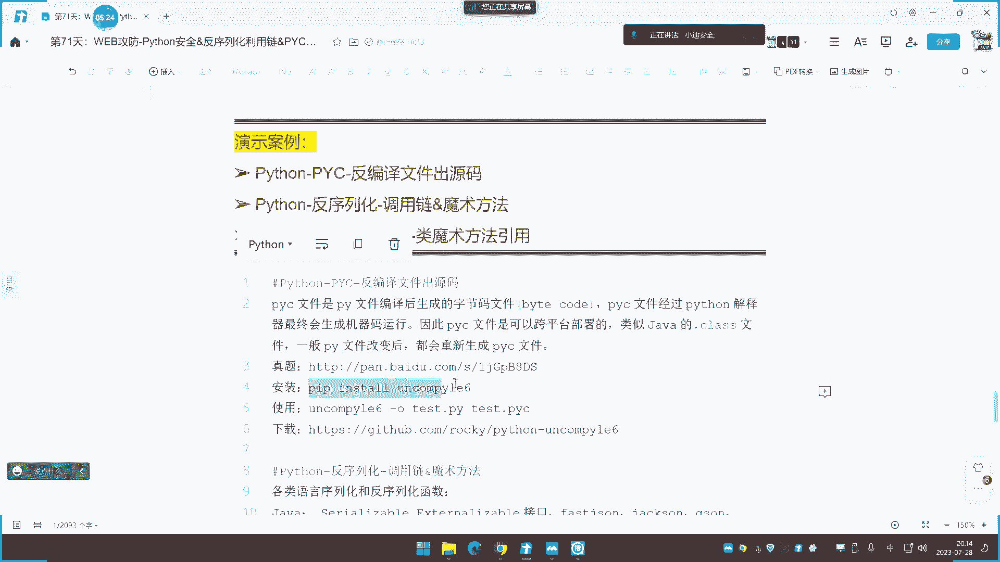
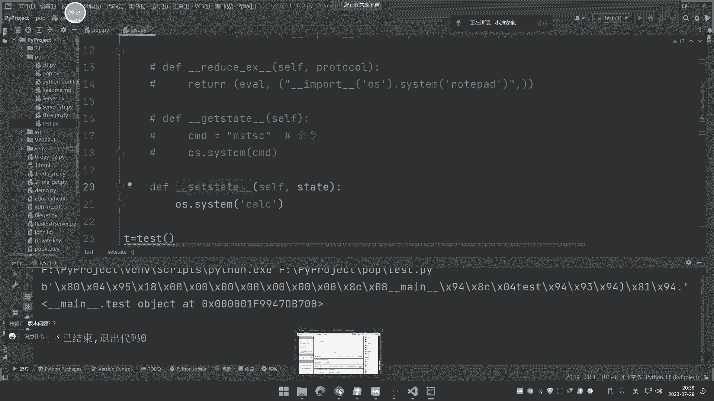
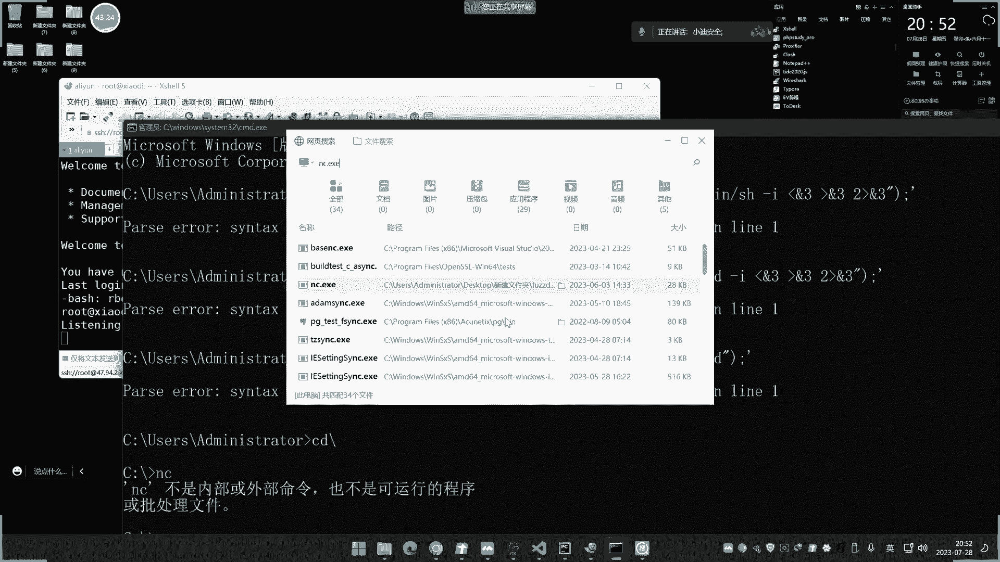
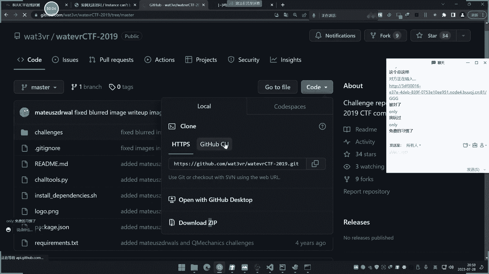
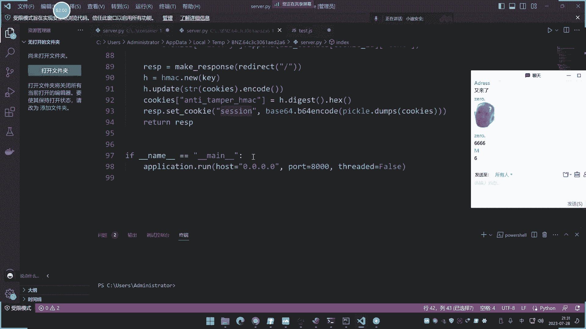
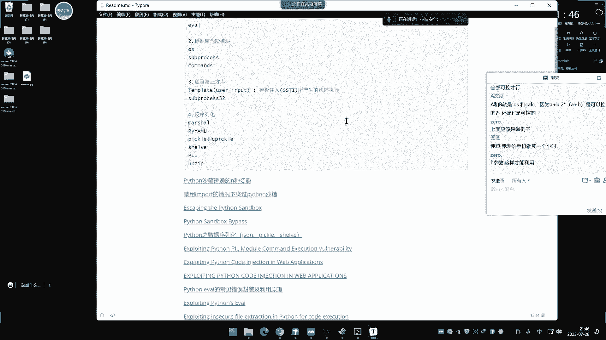

# 【小迪安全】V2024版 全栈网络安全 ｜ 攻防渗透工程师 （持续更新） - P70：第71天：Python安全&反序列化利用链&PYC文件反编译&格式化字符串安全 - 逆风微笑的代码狗 - BV1Mx4y1q7Ny

啊今天呢这个讲Python第二次直播，讲的是那几个特有漏洞啊，讲过pp的反序列化，讲过java的反序列化，Python的反虚化也搞一搞咯，然后这个java呢里面呢也有这个，类似的反编译是吧，PP没有。

那这个PON里面也有这个反编译也讲一下咯，然后还有一个这个Python的特有的一个安全问题，就是格式化字符串，其实今天讲的这三个东西呢，都有点类似于搞代码审计啊，搞这个，异乡的一些东西呢有点多啊。

在黑盒中呢这几个漏洞呢说实话呀，除了这个反序的话呢，黑客中有点庸之外啊，这后面两个啊，这个什么反编呀，这个什么字串的，一般黑客中呢也看不到，这个反虚化呢，在黑盒中呢有时候还是能看到的啊。

我们主要是这个三个知识点啊，先说第一个额，我们说一下啊，这个反编译啊，这属于离乡的一些支点，哪些语言有反编译的这个情况呢，一个是java的java呢，他反面也能够得到源码。

就是对那个打包的什么解压包和class文件，来进行反编译，来得到那个java的本身源码，但是java里面的，然后这个点net里面也有点net里面，那就是我们那个DLL就是个DL文件呃。

那个东西呢我们在那个代码审计呢，针对这个点net的时候呢，有些这个代码呢它是有的啊。

我们可以看一下啧，就是有些那个点net程序啊，他可以用我们这个，这工具啊叫a l s spy，网上的，还有其他工具。

好像这个呢就专门是对那个这个什么，这个第二文件，就是点net这个写出来，这个第二文件呢来实现这个反编译啊，它能够就是用点net开发的，你可以随便在网上找一个这个web源码里面啊。

点net的里面就有这种东西，那么呢它是能够用这个工具来进行反编译的，是点net的啊。

加完了就用那个id a了，他等于反例，然后这个Python里面呢也有啊，这个Python里面就是说用Python写出来的文件，我们都知道写出来文件的后缀那会点PY，但是如果说你把这个文件呢进行了编译。

编译的点net编译成DL，那个java的就是class和点JAR，就是把编译成一个完整的包，就是一些源码呢把它编译成一个执行文件啊，或者是一个完整的包，那么它就会涉及到反编译。

点net上没有加java呢，有简单演示过啊，点net的后面再说，那这个PON里面那就是P5ICE，那你说这个东西有什么用啊。

来我给他看一下啊，我们就拿我们这个狐狸这个工具箱来说啊。

就说我们不是打开之后呢，打个这个非abs呢，它是这么个UI是吧。

是这么一个工具，那么在这个3。0的时候呢，也还有个ES1，3。0版本里面还有个ESE是吧，你打开之后呢呢，它也是这个UI，那这个E21呢它是用什么语言写的呢，就是说其实他这个工具啊。

他是用的是这个Python写的，就是他这个界面它其实用Python写的啊，Python常规来讲我们都是PY的吧，那正常来讲的话。

你如果说用PY的话写出来的话，那肯定就是用Python的去运行这个PY的，来打开这个界面。

但是为了这个实用的话，他可以把编译成这个EXE，编译成EXE之后呢。

啊这里呢就可以直接打开了，就不需要你再装Python环境了，但实际上它的源码呢还是这个什么Python的代码，那么你可以看一下啊，在他的这个工具包里面有这么几个东西，看到没，那一个叫GUI to us。

Ws s python，G u y c，Python38 p i c，还有X310，这个是三八，这其实就是两个版本的啊，用3。8版本写的和3100写的，你其实就是说你有这两个东西之后呢。

就是它编译成这个页一的一个源码，有这两个东西之后呢，可以把它进行什么反面出来，就能看到这个EX1的什么源码，就是验一怎么写出来的啊，源码我可以看一下啊，那么如何进行反编译啊。

这个Python里面啊就针对这个PYC文件的啊，就是Python里面的去编译一个PY文件，把它编译成什么E啊，E啊，或者是一些其他格式的时候呢，它就会产生这个PYC文件，那么有这个PYC文件。

那就可以把这个源码的给还原出来。

那么现在我们可以还原一下啊，还原怎么还原啊，PIC呢是在一个pr文件的进行编译之后啊，生成什么ER1啊，或生成一些其他格式的时候呢，那么产生的这个PYC呢啊呃得得到之后呢。

就类似于java的class文件，那么这个文件得到之后呢，可以把它进行反编译得到源码，那么如何得到源码呢，就用这个啊，un com p y l e6这个模块就可以了，那么安装的就直接pip inst。

多安装它即可。

我们可以试一下啊，就安装这个模块啊，由于我这里安装了啊，这里提示已经包含了，安装的是安装到这个地方去了啊。

那么现在呢我们就找到这个地方，它安装好之后呢。

会在你电脑上面呢有这么一个电机产生来，那3。8和311的我都安装了啊。

那这里呢我用3。8这个啊打开，那这是安装好之后呢，就自动有了有这个页一了，你就直接在这个当前目录了是吧，去执行它，就可以un come执行它，然后呢加上杠欧生成一个，比如说生成一个这个GUI点PY文件。

然后呢后面呢加上你要反编译的对象，就把生成成GUI点PY，反面对象呢我们可以撕一下啊，就这里呢我们就拿这个GUI的这个PYC呢，给大家放到这来好，放这来之后呢，我们来看一下啊。

来针对这个GUI这个三八点PYC呢，把编译层解析成这个GY点PY啊，回车，那么这里呢看一下来GUI点PY就生成了啊，那这里呢他正在反编译，这里呢需要点时间，他现在是0KB，等待编译完成之后呢。

我们就会看到啊，这个本身的基PYC里面的核心代码，那其实那就是那个买卖工具包的那个，写出来的源码啊，这里呢可能需要等几分钟啊，啊差不多了，但已经出来了啊，成功反编译。

打开看啊，那这个就是那个工具包啊，那个狐狸工具箱的那个源码，那是他写的，你看一下是不是和我们对应上了，你看看还没呢管理工具，那你可以打开看一下嘛是吧，让我们看一下啊，打开界面看一下是不是对应上。

你转过去哥斯拉4。1哎，对不对嗯，对上了啊，下一个就是呢渗透利器，对不对，没有问题吧，这是标题，是吧，那后面那就是他的这个水工具那个那个啊，他其实就是写了个界面啊，写个界面，那其他的都没有去写其他东西。

那后面的就是当你去点击的时候呢，声明函数，比如说巴布斯点击的时候就会触发这里啊，我们的就是就这么写的啊，是吧嘶所以说这个东西呢说白了啊。

他就是给他介绍一种，就是说如果说你用Python去写的一些工具，写了一些这个编译的一些文字呢，是可以进行这个反编译呢，调试出这个Python核心代码的，这个东西说实话啊不是很常见。

但是针对这个Python写的工具呢，进行逆向和代码分析的话，这个东西呢就有点用了，比如说呢你针对这个Python写的应用啊，不管它是不是网站是吧，写出来的这个yes也好啊，或者是编译出来其他文件好。

那么呢它源码那是未知的，这个时候呢你可以拿到个PYC文件呢，折进反面能得到出他的源码啊。

这个没什么说的啊，在这个CTF的这个PWN的这个方向，就是我们的立项方向的时候呢，像这个知识点呢还是有考题的，呃这里呢是之前考的一个题目来看一下，这是一个叫create me点PIC文件嗯。

这个文件呢就是一个那个CDF的一个体系，他让你对这个PRC的进行逆向，逆向之后呢。

然后呢去做这个题目，其实这个web方向呢是没有这个东西的啊，web一般不会考这个。

除非是要对它的源码呢代码呢进行分析，这个时候呢才会有这个用到的一个情况，一般的话啊他不会用这个东西啊，反编译成功C里PY这个生成的啊。

这是那个源码啊，对源码那里面就有这个算法啊，然后呢让你这个去对这个算法进行逆向就完了，那弗拉格勒就在这里，紫砂员嘛，如果说你不离乡的话，他给个那个PYC。

那你是做不了任何事情的，看不了东西，因为这个PIC那你可以打开看一下啊。

它打开就这么个东西来打开，就这么东西啥都没有。

这个呢就是我们说的这个第一个点啊，大家简单了解一下就可以啊，以后碰到了知道有这么个思路就行了，web中呢不是很常见啊，在逆向中呢有一些，然后呢，再说一下在web中比较常见的这个反虚化啊。

前期呢我们讲过java了，那java呢则是一些反虚化的接口是吧，原声原声里面的这个反虚化接口，然后呢组建里面的发射J时候，那这个杰杰克商啊是吧，这些呢都是反序的结果啊，这是java里面的。

那么pp里面呢就是那两个函数，那Python里面的有哪些呢，Python里面的就有这么几个啊，原生态的PICKL1，然后呢，JSON模块对JSN呢，进行这个解析的时候呢，也会造成还有这个PYYAML。

这个YAMM呢其实就是一个规则文件，在那个流量分析的时候呢，经常会引用那个YAL嘛，这个规则文件来实现一些模块的导入是吧，这些呢都会引引入这个Python的反虚化。

Python反虚化呢是将类对象的转换为直接流，或者是文件反序的话，那就是将资金流或文件的转换为对象，就是刚好相反，那么原生态的这几个函数，那这里四四个啊，一般就会要用到这个S不用S呢是将文件啊。

就是将一个文件里面的进行反序化，再将序列化呢保存文件，那么如果加S呢，就是直接把它转换为字符串的资金流入，那将资金流流再返修或对象啊，这个加S的会用的比较多一点，然后还有几个呢。

这都是它的一些特点函数和模块啊，凡是看到这几个东西呢就意识到哦，这里呢就是Python里面的反学化的几个调个地方嘶，呃这个呢是他原声语言里面自带的，所以一般这个用的比较多啊，然后呢这就算魔术方法。

他的魔术方法呢相对于P1P和java的比较少，比较简单好理解，就这几个，这几个，那就是在序列化的时候，和反序列化时候会自动调用，那么现在呢我们就给大家演示一下啊。

这个java Python的反序列化是什么一个逻辑哈，看一下啊，主要演示第一个呢反序列化和反序啊，序列化和反序化这个操作，然后呢再来看一下漏洞是怎么形成的，然后呢再如何利用。

最后呢我们再通过这个利用呢搞一个塞题呢。

对应操作一下，好我们打开一下这个Python的这么一个东西啊。

好我们这里呢先给大家看一下这个额，写个这个这个是仅仅是71嘛，写个TC目录啊，我们创建个文件啊，仅是叫这个P9P吧，好这里呢写了个这么个文件啊，然后呢我们来引入这个模块啊。

这Python里面的TICKLE，然后呢你比如说像现在啊，我创建一个这个class是吧，创建一个class文件，然后呢这个Python里面呢它不像不像其他的啊，嗯你给这里呢操作很多。

我们直接把代码都拿出来给他看一下啊，好直接在这里看吧，懒得创建了，来啊，你看他创建个这个test对象对象，里面有个方法A，方法A呢去输出A那么现在我们看一下啊，来先给他看一下。

T等于test实例化实例消化的对象，然后呢用这个PICK这个模块，当时对这个T呢进行一个序列化操作，再打印一下这个这个DT就这个值我们看一下啊，执行执行之后呢，打印出来就是这个东西。

那这个操作就叫序列化操作，就是将这个对象呢把它封装成一个是吧。

那当时呢你看这个什么作用，就是将对象序列化呢，啊把它消化成这个字符串的一个字节流数据。

这就是它字节流数据，这个B代表比特流啊，beat资金流，把它们进行序列化操作，然后啊你再看我这个时候呢，再用这个PICK这个模块的，什么LUN式载入是吧，载入什么呢。

载入这个DT这个底T呢就是刚才序列化的数据，然后现在呢在进行什么反序化，然后再把这个值呢给他复制为LT对不对，然后呢再输出一下LT，好我们现在来看一下，那上面这个呢是序列化的数据。

后面这个呢就是反序化得到的数据，数据里面的就是mail test里面的object，那就是这个上面这个坏完了，这个就是序列化和反序化的一个操作啊，在这个Python中虚的话呢，就是将这个对象啊。

或者东西呢，把他怎么样转换成这个资金流数据啊，反循环呢就将资金流数据呢，把它还原成一个对象，那个写法伊森呢给看一下啊，把它进行一个top类型的一个打印，你看一下他这个类型类型呢，这个都可以看一下啊。

我们把这个类型的也打印一下，获取一下这个类型，这个呢就是比特流数据，下面这个呢就是什么class类型，是吧，这个就是我们说的这个操作的那个，序列化和反序化的两个函数啊，在这个Python里面的好。

那这里呢是它的一个使用，那么现在呢我们就在这个本身的基础上面呢，来给看一下这个魔术方法啊，首先大家看一下啊，我在这里呢重新再试，重新呢这就创建一个东西啊，你看啊，比如说我现在呢要使用这个A方法。

那么我接下来该怎么办呢，就是T点A嘛，这样去引用它是吧，它就会打印这个A对不对，我们现在这样子里呢，先把注释掉，这是引用这里面的方法，对不对呢，打印A如果你不引用呢，它就是什么都没用是吧，这个很简单啊。

没什么说的，那么接下来啊，你看它里面有个几个类似的魔术方法，我们来看一下哪几个呢啊首先第一个啊，就这个这个啊这个模式方法，你看啊，我们在这里呢进行一个OS点SMM，执行一条命令。

命令呢就是这个执行个计算器啊，就这么个东西啊，你看我们现在呢去执行它，去进行对对对，啥都没有是吧，比如说我调个V他就会输出A，但是这个没有进行执行是吧，好那么现在看一下啊，我进行序列化操作之后啊。

把它进行运行诶，看到没，计算器弹出来了，大家没看到，嗯运行它把计算器弹出来了，说明这里被执行了吧。

那这个是什么呢，看一下啊，反虚化是不调用虚拟环式调用。

还是个虚拟化会调用，诶嘶啊，这里有点不太明白了啊，这个序列化的时候怎么调用呢，哎或者说来我们再来看一下啊，哇这个东西那它也可以调用，那再来看这是这个啊，那再来看下面的啊，除了这个还有没还有啊。

比如我们在这里写个还有这个ex的啊，这个也是一样，再来执行，啊这里呢最好是怎么写呢，这里这样写的话也行，但这样写的话都执行，正常来讲呢，它是一个return，这样写啊，我们先给他看一下啊。

这个是执行load part的啊，换一个命令，把这个先注释掉，看这个啊，那开这个执行啊是吧，继承也打开了，那是哪一个造成的呢，对不对，我先把这个注释掉啊，喊它执行啊，它也打开了，对不对。

两个方形呢它也能真正打开。

那走这个R好，还有呢就这个呢这两个sea site和get set。

嗯OS点CTM继续执行一个，比如执行一个这个嘶，嗯R1G1。1就是我们的那个注册表是吧，然后把这个注释掉执行啊，哎你看啊，现在啊这边他就怎么样了，不打印了。

刚才这个笔记里面给到是什么反虚化调用，反虚化调用，反序化调用啊。

这个是虚拟化调用，这个呢是sea sea呢是反序化调用，我这里明明有反虚化呀，这个为什么这里没雕过呢，啊是这样子啊，刚才为什么逻辑上面有点问题，是因为我写的语法有问题啊，正常来讲不能这样直接写啊。

他是有个return的，就说是有个return的，啥意思啊，我们来看一下啊，来是这样写，把改动一下啊，在这调用这个执行C2为C好，就这样写啊，用e fl呢去包含执行这个OS里面，调用这个CAC。

这个呢就是应用模块，他怕有些脚本里面的没有这个模块好三点，那脚是执行note part，那这个执行这个注册表那个命令啊，就代表都能显示出来的嘛，然后写进去啊，然后这边我们先一个个试啊。

先死第一个再试这几个，我先把这个全部写上去啊，还有一个是这个，还有个是这个df get，还有个这个啊，然后把这个也写上去，这个呢就执行个MMSTIC，就那个染程终端的命令，好一个个撕一下啊。

我们来现在用这个啊来好运行好，他能弹出计算器啊，没有问题，并且这个下面没有报错，你刚才用这条命令的时候，他报了个错误，你看到没，我们看一下啊，刚才用这个啊，他要加返回的，比如说我这里执行CAC。

虽然说这两个都一样是吧，但是你运行这个时候呢，它也运行了，这下面有个不错误，他说什么这个方法里面必须有一个返回字符，对不对，好利用这个之后呢，他就不报错了，不报错了，然后呢这是序列化和反序的操作。

现在呢我把反串注释掉，我们在运行，你看现在是不是就没有这个执行结果了呀，是不会弹出这个计算器了呀，为什么，因为你上面那是虚的化操作，下面才是反需要操作，他有反虚化这个魔术方法才会调用，刚才调用。

那是因为你写的不规范，你就直接在里运行了，所以你这样正常来写return的话，语句不会报错，但这里呢就要遵循它的正确规则。

就是反修化的时候呢才会操作出来啊。

能不能理解啊，这个，所以你正确写的时候呢，这个魔术方法就要遵循反虚化才能触发的，魔术啊，才能触发这个操作了，就说这个呢你不写上去啊，正确值进行序列化操作的时候，它就显示序列化的数据。

但是呢没有进行反序列化，这个某说话呢是没有被调用的，当你把这个反向操作呢给他激活出来之后，我们运行哎，这个呢就被调用了，看到没，这样子呢就弹了，好理能理解吧，好只有这一个啊。

那么同理你再看这个这个也是的啊，你直接线上运行，它是能够显示这个记事本的，能够弹出来，对不对，来运行还能弹出来，记事本，就是这里的代码被执行了，对不对，他能执行。

但是如果啊你现在啊我把这个地方给它注释掉，只进行序列化操作的时候运行，哎这里呢就没有任何反应是吧，但是如果说你用这个呢写到里面去，那又可以又有反应了啊，但是那个是错误写法啊，注意一下。

一般正确的写法呢是不会写这个执行语句的，是写个return的啊，还有返回好，就这个，那么再看这个，讲这个啊，这个呢我们进行执行，你看他实也没反应，对不对，也不能执行这个REGIDIT。

但是呢把反应循环呢给他激活出来，你这不给不给面子啊，换一个mini试一下，哎他也不信。

这啥情况呢，C特东西反序还是被调用。

没被调用呢，哎这个没被调用啊，好再看下面这个，看下面这个啊，我看下面这个，我先把注释掉啊，我看什么原因，看下面这个啊，哦这个这两个是上面set里面是不是写错了，这个等一下啊。

这里面应该执行命令写才写好一点，Set set，嗯他这个地方不能这样写啊，那还只能用这种线去看一下，这两个的话有点不太一样，好我们看这两个啊，先把这个注释掉，先把这个注释掉。

看这个上面这个模式方法get里面的，那他能执行出MSTSC，把这个注释一下，还是能执行出来，O s。

Thea，区域化十哦。

这个是虚拟化四啊，好这个这个执行不出来了，问他是点C上三，好能执行出来，好现在执行不出来了，这个get set呢。

他是一个什么虚的话是被调用啊。

这个是虚的话是被调用嗯，你把这个反虚化呢把它写到里面去的话啊，比如说我这个DT呢随便给他DT这个上面不写，那也不行啊，你上面不写的话，他就执行不了，我只能给他传这个数据到里面去，一个beat流数据啊。

就说我DT呢就等于一个B特流数据，写这东西啊，写个beat里的数据啊，带你们去呢进行反虚化，这边呢就把注释掉，因为这个是虚化啊，它会触发我们看这个啊，直接反虚化执行之后呢，它能还原。

但这里并没有执行这get site，那就明白了啊，它就是虚的花式调用，其实呢就是这两行呢进行调用的，我现在是进行反虚化，给他直接传入的这个什么序列化数据，然后呢它进行反虚的化，所以真的没有调用。

它能理解吧，这个能不能理解好理解吧，这个所以说除了这个get set呢。

其他的三个呢都是反虚化式调用的，就这个呢他是虚的化啊，这个呢是虚化调用的啊。

因为刚才呢我这个呢你把这个集合出来是吧啊，把这个呢来把激活出来，他就是不是它就执行了，你看现在就可以了，他这个命令呢就被调用出来了么，是TIC对不对，因为这个进行序列化啊，没有这个东西，那就不行了。

这个是序列化吧，我直接给他传入这个序列化数据进反虚化啊，他就不行，他只是把正常回血了，但是呢这个魔术方法呢没有被调用呃，那这个呢就好理解了啊，这个呢就是反虚化这个操作，我可以试一下啊，那我直接执行。

哎这个这个怎么执行不了啊，额我把脚本放一下，是不是数据传输的事问题啊，哎这个这个执行不了，写错了吧，把这个去掉，Decide，哦这个没用了啊，这个执行完没有调用啊，那这个是哪里有问题啊。

这个网查的资料是这样的啊，实验的话这三个对应上了这个site site呢。

他是反修会调用。

现在没有执行出来啊，没有执行出来，they没有指印出来，我把这两个同时运行一下，看看是不是要在一起啊，这个被调用了，这个没有调用。

那说明这个有问题啊，这个B级上面有问题，塞的这个不行啊，我看一下啊，Python反序化的get set和那个。

哦这个是set，哦哦我知道了嘶，他这个呢是要应该是进行操作的时候啊。

这个site应该是进行操作，不是进行反序数，他和那个pp里面那个is set，那个模式方法呢有点类似，这个set呢应该是里面东西被变动的时候啊，序列化的时候它会被触发，而不是说直接反序列化就会触发。

那这个比几有问题啊，啊B有问题把写一写啊，这个应该是对，对来看一下啊，他说这个意思二呢，这个是get set seasset，还有几个魔术方法啊，其实还有很多啊，但是一般就这四个比较多。

那这个呢可以判定为啊，这个判定为，应该是需要对那个虚化数据呢操作，才可以触发的啊，不是说那个啊他这里说的也是的set的，那需需是调用。

奇怪啊，这个有没有大家知道的，这个这个这个模式方法是怎么调用的，和那个PPP的excite感觉有点像得似。

我是网上查资料，让他说这个是反虚化被调用，但我这里测了一下啊。

这个反序调用的时候呢没有调用啊，这里都进行正常的反序化，没有调用没有调用啊，这里正常解析这个地方没有被调用，感觉应该是这里被设置了值，在这里呢给值之后应该是那个啊，我试一下啊，T f i n i。

算了不不不搞吧。

那这个啊我们把它写一下，不是这个上面这个，调用它不是直接反需要调用啊，网上笔记有问题啊，这网上有些东西，还是不能单看啊，看因为看这里呢看到了这个效果啊，这面写的啊，他对这里面进行修改。

应该是这个对他属性值修改的时候，那会调用，是吧好，那这是这个简单的一个调用逻辑啊，就是内置的模组方法和使用的这个操作。

那么现在呢我们就要考虑一个问题，就是说啊就是说这里呢如何造成漏洞的呢，好我们如何造成漏洞呢，来我们现在给大家演示一下啊，你看一下啊，你看我如何找到漏洞啊，比如说我们在这里呢重新再写一个东西。

你看写个什么东西啊，呃然后这里呢我写个REST的，写个这东西，这里面呢就把刚才这个执行命令的东西呢，给他拉过来一个，啊执行一个cl AC对吧，这里是另外一个写法，就写成A吧。

A对象A对象里面呢有这个内置模式方法，内置模式方法呢，就执行一个CRVC的这么个东西，然后怎么办啊，大家看一下啊，然后呢我们先用这个东西呢，把它实例化这个对象啊，比如A史密是吧。

等于A然后呢我再进行虚的话，对这个A来进行序列化，名字就叫这个DA，那我把打印一下，答一下答案A啊，好，这里呢上面代码我们就先把他怎么样，先把它注释一下啊，先不管它了，上面代码先注释一下好。

就执行这些代码啊，这样的话打印出来呢就这么一个结果是吧，这是那个序列化的那个数据，这里啊我对这个数据呢看一下啊，我把这个数据呢给他一幅字好，再把这个代码呢给他注释掉，如果这个时候我把这个启用它啊。

把这个代码启用它，把这个地方把它改掉啊，DT等于这串数据，这串数据呢，其实就是刚才针对这个东西的一个序列化数据，让他进行反序列化操作，好我们现在来看一下啊，会有什么效果，执行计算器弹出来了。

这其实就是说啊你这个值如果说可空的话。

他就会有这个漏洞是吧，这个好理解啊。

那么现在我们再来看一下啊，再来看一下这个是怎么一个逻辑啊，我们现在有个类似考题，大家看一下啊，来这里有个server好，我们看下这个代码啊，这个代码呢就是用个Python写的一个web环境。

一个FISK的一个框架的环境，环境里面做了什么事情，大家看一下啊，我们看一下啊，那启动环境绑定5000端口啊，数位网卡上面的5000端口，然后在这个做个什么事情呢，你啊访问当前路由地址的时候啊。

它针对这个user进行接收，接收之后呢啊解释这个名字也叫user，user呢进行一个解码，然后呢解码之后啊，用到这个什么loaders，这个就是什么啊，这不就是反序列化这个操作。

对这个load呢进行一个反序化啊，然后呢他就经常进行一个显示啊，我把这里面也把它改一下吧，改成显示这个user啊，显示个user值，就说啊结束值值之后呢，就把它进行这个显示，Hello user。

对不对，那如果说啊如果说这个没有结束到值的话，就是异常的时候啊，username就等于gust，它它就输出hello gust，对不对，我们现在温习一下啊，运行起来之后他就启动这个外部环境。

我们来看一下啊，打开这个网站，你看他就输出的是什么hello gust。

对不对，就因为呢我现在没有传参值，没有传user过去，所以呢没有值的话，他就传他就选这个值嘛。

对不对，好理解吧。

好那么现在呢这怎么有漏洞呢，这就是个典型反序化漏洞，这代码上面也看到了啊，你看啊我怎么去攻击它啊，比如说像现在啊，我就把它传传这个字给他啊，然后这个值呢，由于它在这里呢，是把它进行贝斯六四的一个编码。

这里有个解码，所以我要把它进行编码，你可能说我为什么要用这个贝斯六四编码呢，很清楚啊，如果不庸，你觉得在数据里面你写这个字，对方认识吗，对方不认识，因为这是个beat流，数据，编码的意义。

是让这个数据在传输的时候不会出错，嘴巴编码就把这个B的流失叫编码成贝斯流斯，所以呢我现在呢要先做几个实情，我先把这个变成流失呢，导一下这个模块啊，就自己能构造一个什么在攻击的啊，把它进一个啊。

嗯点那进行一口的，把这个DT呢把它进行一个编码，然后呢就叫DPT看，啊然后呢把井打印打一下DVD，这两个先不管它哈，来好，这就是那个数据好，这里呢加上个decode，把它不再转换成这就是那个值啊。

好这个就是那个什么字啊，这个序列化数据我刚才说过了，他是什么，是不是这个我们自己写的这个东西啊，是写这个东西的一个输出啊，刚才演示过吗，来你看输出一下呢，就这个数据吗是吧，那就这个数据啊。

呐这个就是那刚才把它进行变身就是了，把它一复制啊，把这个值一复制来看一下啊。

我现在访问这个网站，然后怎么办呢，F12啊。

地址放上去传给值。

他传个user给他传什么值呢，传这个字给他。

我传这个值给他啊，这是个网站是吧，我传这个值给他看看他有什么反应啊，执行哎，没反应。

是哪里写错了呀，我看一下啊，留着序列化数据没没写错啊，妈的什么鬼东西啊，这，数据解析。

哪里呀。

你们说什么东西重复了啊，cookie呀，哦对对对，这是cookie里面搞错了搞错了，我还以为是那个那个gt结束呢，啊这个要cookie里面啊，我这个写解释方式是结束cookie里面的。

那这里那就换一个吧是吧，把它写在google里面啊，这里好写在这里啊啊user把这个词写进去啊，那刷新一下，看到没，计算器弹出来了，呐防我这网络键弹出来，你不信的话，我把你删掉，他又不弹了，那是删掉。

那他没反应了，这个例子就是说呀在这个Python里面啊，如果对方呢是吧，有接收这个数据的话，那么这个时候，如果说对这个数据的进行了反序化操作，那么你就可以自行的去随便啊。

本地的去写一个这个什么触发的这个方法，就是这个内置方法，这里呢改成你要执行的命令，对不对，至于呢你执行什么东西，那看你自己啊，一般的话肯定是反弹嘛，写个反弹命令到里面去，他就反弹了。

这个反弹命令那也好写的吗，反正命令就写一下这个东西就完了呗，反正命令那就这我给写下来看下命令啊，我们就试一下了，那这里呢也给大家演示一下啊，只是指数只演示了，我们把它写的是那个计算器是吧，发条命令。

那你可以再重新重新再自己写一下嘛是吧，重新再写一下来，比如说我在这里，那就重新再写一个E叉P是吧，然后反弹命令是吧，NC咳啊，把它反弹到这个566，但由于我的环境呢。

我是windows windows呢，没有这个NC啊，没有这个NC，所以我可能要用其他的了哈，嗯嗯这个反弹那个电脑上面，windows上面去反弹到外网去，那刷这个迷你呢，这只能用其他的了。

其他的呢windows的那个反弹命令就比较麻烦啊，啊婆婆修啊，那些是吧，那个找下那个菱角色去上面支持反弹命令。

那个东西啊，插件里面其实也有是吧。

我给他演示一下啊，如果在实战中的话。

可能是这样子啊，把它反弹到我这个服务器上面的五六端口吧，然后呢由于我目标主机啊，就是我服务器那是windows，所以说就必须要用windows支持命令啊，嘶你LINUX的话，那个NC可以用对吧。

这泡沫学呢就是PROMEAL命令，但用PROMEAL命令呢不一定能够成功啊，这有点烦啊，封面性命令，有时候呢会收到那个电脑那个什么呀，电脑的那个规则就有些呢，电脑上面不能自行破面修，他有那个限制啊。

所以windows呢比较麻烦，windows可能看有没有其他的啊，泡沫修可以啊，还可以用这个Python本身的这个代码呢去执行，因为它本身环境也是Python，所以他有这个环境啊，也可以用pp的。

试一下我这个二有啊，有PP环境。

有环境变量，那我这里呢给11+2呢，比如说是执行这个命令啊。

先打开我这个服务器啊，那之后，来监听一下啊，NC杠LPPP566。

然后比如说我们电脑上面呢，就执行这个pp的这个反弹命令啊，你看妈的，这还没有，写上去都关了，那这报错了啊，鬼东西啊，真是，他应该是反弹的，是那个哎呀，那我直接用NC吧，妈了个鬼东西，就默认我有NC好吧。

因为一般的这windows服务器呢，这实在是麻烦我放到那个哎C盘吧。

是吧和C。

因为他其他的不支持啊，其他的反弹的泡沫修。

你妈的老不支持你，比如我用一下吧，能行那就行啊。

这这你妈的就用了跟没用一样，来没反应，所以说哎那泡沫球不行啊。

那就用能C嘛，能C那个命令啊，比如说这里，那我们就换成这个C盘是吧，C盘分C啊，反弹到把这个绑定的胜利呢给他发过去是吧啊，就生成一个这个地址啊，然后呢，对这个DNA数据呢给它进行一个JS64打印。

然后这个发过去试一下啊，code等这个DA呢打印，是吧好这就是那个攻击代码啊，攻击代码就是这个对吧，固定挡板就这个啊，是不是这个我这里不是这个啊，这是个攻击代码啊，这是攻击代码啊，我把它复制啊。

看一下啊。

放到这边来，我刚才那个环节来啊，重新声明一下，如此啊，这写进去好，我看这边啊，566，我们来进行一个温性刷新啊，看到没收到了，看到没收到了，你没问题吧，是不是有问题啊，来我一暂停，这没有网址，正常啊。

来再试一下，来好收到是吧，没问题啊。

好这个就是我们说的那个。

所以那个徐州花那个漏洞的情况啊，呃由于我是windows环境。

所以说蛮麻烦啊，因为windows环境要反弹的话。

WC比较方便资助的什么泡沫修那些东西呢，会受到这个windows，有些在电脑上面不能自行PROMI秀啊，还会有一些这影响，所以一般windows呢都是用的，比如说用这个语言来执行，用pp语言呢。

用Python语言呢是吧，去执行一个反弹回去，但是要看这个电脑上面有没有装这个环境啊，所以说不是万能的，但是LINUX上面的很多民族知识像NC那样，他都自带，还有这个B器啊，这些东西啊要简单啊。

首先要看目标环境的啊，啊这个是那个漏洞那个产生啊，这个漏洞产生的其实很简单啊，就是说对方呢去结束这个数据啊，结束这个数据呢进行了反序化操作啊，也没有过滤域，所以说我们就给他怎么样传入一个LAN是吧。

传入我们构造哈这个执行这个命令的粘给他，让他去反虚化这个对象里面的这个写法，所以一旦它进行反虚化的话，那那那这个lade里面的东西呢就被执行了，执行的就是我们指定的啊，给它进行一个反弹，好啦。

这个搞完之后呢，嗯我们看一下有没有实力呢。

有的啊，我们看一下啊，啊在以前的CDF的一个题型里面有考过，而且比较偏向于黑盒，我们给大家演示一下啊，这环境呢在这个BUCTF里面啊，在这个cf修呢是没有的啊，搜一下这是在19年的时候啊。

这个double worst一个题目把开一下。

这个反序号呢还可以应用在免杀里面啊。

刚才有人说了，他免杀里面呢传递那个卸扣的呢，也可以用这个思路，哎什么火情况打不开呀，哎你这不是搞我吗，什么鬼啊，等一下吧，那等一下啊。

不行的话，那我还只能下大环境了，下大环境做了测试，它环境，这环境应该有多个这样的环境啊。

应该也好，也能编译起来，哼这环境打不开啊，你说这啥情况啊，这，重新再来一下啊，再打不开我，我，我就只能这个这个这个这个自己，再到源码上面去把拉拉拉拉起拉起来了啊，稍等一下啊，这是按那个黄金源嘛。

这一题那就刚好是反虚化这个题目啊。

哎呀真是难呐，这这应该是有两个啊，一个是这个JS文，那是那个说明，还有个是这个flag的一个操作，那这个应该是个多的环境，这个是它本身源嘛，你看那个SA里面应该也有，这是本身源嘛，自己本身一个源码啊。

要环境源码。

好我们再等一下啊，还不行，那就那就只能这个自己翘起来了。

妈了个锤子啊，你说这些bug这谁知道呢对吧。

我这个备课的时候还正常呢，他妈先在这打不开了，说是，切。

哎呀那行吧，那我只能瞎这环境了啊，哎呦这呀这不尴尬了，这，啧瞎也不好瞎呀，这个鸟毛东西呀，真是烦得很。

有人开了呀，水开了还是开个嘛，我打也打不开，打不开啊，你们能打开吗，打不开打不开啊，是我问题还是你，你能打开吗，是我网络问题吗，不应该吧，都是市密室。

嗯啊等一下啊。

我把CDF体系把拉拉一下。

拉下本本季起吧。

还好这个也有语音啊，有有有有这个环境的一个啊啊，没这个环境，这还再犯辙了。

啧这瞎子是好man的。

那妈的，开个代理，开个代理。

这开不开代理，这还是这个速度。

嗯我要写这个地址。

快乐一点啊，好快下了大力怪，快下来，但我不知道能不能搭建起来啊。

看上去好像就是一个多cut，但也不知道能不能打印起来啊，这个环境啊妈的答应不下就尴尬了。

妈的什么鬼子垃圾啊，那这CDF修没这个东西。

那他这里面有web塞提的，这web塞提啊，我们那个题呢是在这里啊，这个地方呢他有那个SH，也不知道直接启动行不行啊，我这肯定是放LINUX上面搭建的，这windows不用看的呀。

windows是个传过去传过去打啊，好我们这里那就un zip解一下那个white，来到white里面啊，哎DADY里面我看下啊，我在那个直接进那个目录里面看行不行，直接启动一下那个dot啊啊。

嗯搞错了，妈的，就这个啊，他这里有个beat s h，我感觉不这个啊应该是个dot环境是多，dot是在这里面还有一个dot啊，我们直接dot t刚那个啊，我看能不能拉拉下来啊，先编一下，看行不行，编译。

文件都没有。

文件都没有啊，没有那个dot那个环境文件啊，搭建时说这样搭建的，这个是那个cite题目名字，python3运行这个pr文件start是这么个情况吗，那我试一下啊，这里，有这个文件试一下啊。

他这个把他环境拉下来之后呢，直接运行就可以启动这个项目了，应该是我知道怎么搞了啊，就看这个金箱快不快了啊。

哎呀这我是没想到这个东西啊，哪知道有这些情况嘞，是不是没办法啊，没意识到啊，我上午准备好的，好好的，这环境突然崩了啊，了个锤子，瞎都瞎子不了了么，你急了哦，这个环境的语言报他把他删掉了，就下载不了了。

待你关着就就能下了，不能下不能下不能下，代理早关了啊，像这个这个这个东西啊，但这个东西在警告他脸不伤呲哭没有了。

我先开下源代码吧，连不上啊，下不了这个哭，这个文件被删了，应该是比三的啊，这个没有这个没有，也没办法，这个安装不了我这个鬼的鸟吗，POP3是什么鬼东西啊，有这库还，再看一下唉可以了，这别异响啊。

这编译看能不能成功啊，这要提示编译成功之后再启动，我看一下啊，等一下我这个编成功之后呢。

我们先看一下源代码啊，给大家看一下啊，源代码先看一下这个环境呢，现在启动不了，这个真是尴尬啊，看一下源代码啊，就是啊这个塞it的源代码源代码那也好看。

等下直接看一下啊，其实你看一下啊，他这个是怎么做的啊，啊访问这个地址啊，你看一下呢，是不是这里有个这个，那也是呢解释这个cookies啊，coins呢从session里面过来的。

那你看那个代码嘛来访问这个路由地址，get访问的呃，假设这个get传过来的啊，不cookie里面的这个get啊，得到这个参啊，参数名的session加到里面之后呢，如果啊没有cookie。

就是显示这个值，有的话就是进行什么，那GSK load是不是就是我们那个什么反虚化呀，那其实这里那你就只是控制这个cookie的行，cookie呢从这里申请过来，那其实你把他声音去换就可可以了啊。

其他后面都不用看了，现在后面都不用看了，就这么简单，一个代码，其实他就和我们那个本地操作一样，然后下面的一个flag后期就可以了。

哎呀这可咋办哦。

还击，环境有问题呀，这是真是。

启动不了啊，编译失败了。

我本地运行一下看行不行啊。

本地分析下这个代码，这个是环境本身就有问题啊，里面一些东西都改了啊，19年东西好像被删了，我只能这样子呢去启动一下，看行不行了，再不行，这个真没办法，在这里我启动一下啊，看他这个本身代码了。

是个菲斯科的感觉，应该可以试一下，分析一下啊，看能不能把启动起来，启动不起来啊，少了什么东西，少了什么模块，哎呀，扫这个东西啊，把区域掉下来插进去，鬼东西真是烦死，把代码删掉一下，我要这个代码。

那代码也无所谓，你启动再说，直接看这个代码吧，妈的鬼东西啊，真是，哎呀我们直接把这个代码把它删掉吧，看这个代码就可以了啊。

这只能从代码上面讲呢，环境有问题啊，启动不起来，没办法给他做啊。

方法都想明白，这除非把这个代码，把重新自己重新重新写一遍才行，少了这个地方，删掉它，RESPON这里返回全部删掉，看一下啊，把注释一下，删掉看一下还是少，这个地方有你这他妈的，这个地方还有个。

把这个删掉吧，这个下面的都注释掉，这应该可以吧，还是不行，我只启动这个啊，server里，还有哪里有这个代码，第五行，啊就用那个模拟一下吧，模拟一下这个题目啊，就很多东西我也不能改了，改了就出问题。

哎呀就这里啊，还有这个一些乱七八糟的代码在这里面，哎呀，还有些乱七八糟的代码在里面，妈的我就保留个的，杀晚了都不行，鬼东西呀，真是，改不了了啊，我懒得改了，这改的话是把东西都改完了。

不改了不改了啊，启动不起来。

环境有问题啊，那除非把代码重新写写了，和赛题那也也冲突了啊。

大家看有没有这个塞题啊，有没有三体的地址啊，没有的话，那我只能在网上给大家看一下这个WP了啊。

其实和我们讲的是没什么太大区别的，启动不起来嘛，这没办法，环境应该是有问题啊，这本身人马拉起来也不行，这个size给他开一下啊，插一个size的一个打皮给他看一下，你看是不是和我们讲的是一模一样的啊。

好这是那个塞提的一个WP。

我们看一下啊，他其实也非常简单，啊这是个塞体的个解释好了，怎么操作的，他说他自己生成一个呢创建一个呢1fl直接，这个地方呢CTRL当前的这个flag t i t，把它发送到这个模拟器上面就可以了。

这这该简单吧，那就是自己呢去重新写一个那个东西就可以了。

就是访问的时候呢，他发现这个C型啊啊是这么一个值，这个值呢大家有个特征啊，p Python的反序号呢有个特征是个GA开头的。

你看一下我们之前的啊，我们之前写的那个贝斯牛斯的反虚化的珠传的。

前面都是GA开头。

所以他是个特征啊，你可记住下来，全部是GA开头，看没反虚化特征。

Python的反虚化特征就GA小写G大写A，这是它的反序化特征啊，进行base6识别码的这个特征，他看到这个C型里面有这么一个词，尝试解码之后呢，就这个东西啊趴在一起减，解出来之后啊。

后面呢自己又重新构造了一个啊，执行一个SAMD的一个地方啊，利用Python呢去反弹给他发过去，没有什么其他区别啊，其实和我们讲的是一模一样的，这是那个反弹线那个写法，点文C那去反弹到那个九九连上去。

你看这个POC就这么简单啊，所以说其实和我们讲的没什么区别，就无非说我们当时呢，他是从C型里面获取到识别出来的。

唉环境启动不起来，我这没办法啊。

南海找没有没有环境啊，这个环境好一些呢，啊他对这个里面的数据观察下呢，就这里呢看到一个那个数据里面，C型里面有个GA开头的，意识到是java啊，这个Python的反虚化把它进行解码，解码之后呢。

就变成这样子了，然后他自己写POC啊，这是POC其实也非常简单，就是我们自己呢刚才实验操作的是吧，创建一个对象对象里面的要执行的命令，把它重新生成base64解码的解码之后呢，因为他在监听九九端口。

所以这在监听九九把它一替换一刷新访问，那C型就接到了结束到了，然后呢直接呢看了flag答案就出来了。

和我们本身讲的没什么区别啊，我们那个讲的那个题目呢。

讲的这个本地案例呢和这个赛题一模一样，环境呢启动不了而已，好这个就是我们说的那个Python那个反虚化啊。

这个题目，启动不了啊，其实我是有，是能够帮大家把这个环境给他启动起来的，就是我本地系统就有点时间啊，我怕大家等不得，所以我可把启动的啊，这个无非就换个人，换一个那个东西啊。

就是把那个里面代码简单修改一下就可以，也没什么太大难度啊，就是把这个本身代码修改下就行啊，但因为他是个判断吗，那不是很难啊。

忍得了啊。

他这里啊这里有个flag啊，flag打开嗯，东西我们呢这里那就，哎呀我说实话啊，这个东西我这个上面东西不用改它，你只参考我这边啊，这我那个奢望，我是按照我这个逻辑呢把它改一下就OK啦，这是我。

因为这个下面的无非就是说宣传那个index页面，那什么东西，这里有个什么，Make a response，他说少了这个东西，这应该是那个里面少了个引用的库啊，这个应该自定义的。

我看有没有有没有这个东西啊，看一下这是官方库还是自己写的库啊，这应该是自己写的库，没有这个库的名字啊，这个叫make up sever，这应该自己写的，这是返回了个消息，他们是路由地址。

我们直接把他妈的全部删掉，都给他删掉，我按照我那个写法写一下，下个三六，然后改一下啊，哎呀这，这其他的这好像不用改了，执行还是报错，第五行这里去掉它，有这两个，我直接把代码呢把它替换一下啊。

就是把那个C型那里改一下就可以了，确定，这都是一些变量私密啊，就不用管它了，好他这里呢是cookie啊，解释这个值这个地方啊，写着来吧，替换一下，我这都改完了啊，你这个，Oh no，有这个鬼东西啊。

怎么还有他，啧啊框架不一样啊，应该是那个包的里面东西不一样，啧哎呀，真的是，传群里面粘贴复制啊，妈的，这该直接把文件拿出来好吧，再把文件拿出来。

不要放到这个环境里去了啊。

嘻嘻，你动不了啊，我塞环境，这里把他，从头server好，现在又能正常启动了啊，这个Python那个地方把他，搞得搞得有点毛病了啊，我这个之前是用的是这个IDE，里面呢是用的是这个啊，他这个id里面呢。

他把他搞成那个3。8的这个问题造成的。

重新再减F啊，重新再来，我把那个id换一下就可以了，应该。

重新解压个R。

找到这里，直接用Python把启动它，把它里面一些东西删掉。

就这个啊我就用这个打开吧，这这flag这东西我们不要了啊，这都是生命的东西不要了，这个下面这个购买这个东西也不要了，因为这个漏洞不存在这里啊，他引用这些东西也没回复啊，这些东西都不要了。

就留这个定性分应该可以了啊，就这个地方漏代码就只有这个地方就可以了，把运行一下啊，这个地方需要改个弧度，把删掉，运行一下，嗯Python环境呀，运行呀，看下啊，Sa。

下课了啊，你可以走了啊，不用来听了啊，下课了，下课了啊，你直接走啊，下次也不要来了啊，记得啊。

好启动了啊，这是我们那个模拟的启动那个地方啊。

好多东西我都删了，然后呢这个怎么玩呢。

他就是C型里面吧，我来给大家玩一下吧，其实比较简单啊，和刚才那个玩法一样的啊，也是一样，他解说的是这个C型里面东西，我把它改成C型的就可以了，没有什么其他不一样的地方。

改成C型，这里啊我们结束一下，刚才那个是解说NC吧，NC is green NC端口的这个地方哎，NC5对吧。

呃这个这个是那个代码啊。

那个代码在这里我启动了啊，启动了代码的本身呢。

呃就是这个地方啊。

这个地方flag呢，那就算代码啊，接C型啊，C型里面结束这个值，那这里呢也是和刚才一样的啊，那贝斯649啊，啊payload构造呢就按照这个逻辑构造嘛，啊就按照这个逻辑构造啊，啊监听他的566端口啊。

把它反弹CD过去，创建一个这个POP链，然后这个是由于我电脑环境是是这个什么windows，所以这里呢需要用到这个NC啊，加路径盘附8G应该减吗啊，今天555端口，四个五端口打印下解码的数据出来。

好先把数据出来了，把它复制放到这个启动环境中来啊。

删除刷新返回，看到没，监听到了，来来了啊，好了，这和那个题一模一样的啊，刷新一下所都一样啊，真反不到。

那题的源代码。

你说是我乱改了啊，你可以看一下这个本身源代码啊，这个本身源代码也在这里，我没有乱改啊，环境自己有问题，其他不删的话又要搞半天。

所以我把一些无关紧要的一些那种界面的，方便的一些东西都删了，核心的嘛保留了。

是吧，你这个这是它本身源代码啊，这前面那你可以看一下啦，这是flag的地方是吧，这个是那个声明什么K这个ALICE是纯变量，这没有啥东西，无非就是说这里请求路由那个谁有这东西啊。

来结束这个值后面的什么什么东西，这都不重要啊，你只要记住这地方就重要，改这漏洞代码就产生在这里啊，然后这个结束怎么结束的啊是吧，这下面这些东西呢就是没有的事啊。

网上那个flag呢也呃，WP呢也这样写的，我把他扶起来写啊。

Python反序化在CTF系统里面有没有。

这个不知道啊，好像没有啊。

好像没有好，我们再来说一下这个最后一个漏洞啊，这个最后一个漏洞呢，其实这个呢一般是在白盒里面才有啊，黑盒里面是没有的，这个Python里面这个反循环呢，黑盒里面还可以看到一下。

其实我们这里呢就给他写一下啊，像上面这个呢是没什么说的，这黑盒里面也看不到，一般就是有这个文件才能进行这个反循环呢，白盒里面直接看这个代码呢，审计这个反虚化，这不说了啊，他的黑盒里面，那我一边写一写啊。

他的黑暗发现的一个情况啊，它一般呢这有个特征啊，这个Python的还需要特征，特征就是这个base64编码呢，前面呢是这个GA固定的这啥特征啊，所以说你看到这个参数值呢，以这个记个A开始的啊。

而且又是Python的网站，Python的应用，那么这里呢就极有可能啊，是Python的这个反序列化的，这个什么序列化的这个什么数据，这个是那个黑色的啊，黑色的一个特征啊。

呃因为你可以看到呢全部都是GA，包括这个网站也是的啊。

他给到的这个答P里面你可以关注一下啊，在正常的他也是这个GA，你看啊他抓数据包的时候呢，这里也是个GA，看到没，所以说这里是个特征点啊，黑盒里面就看这个特征点是不是序列化数据。

然后呢尝试性的去黑盒测试呢，后续就是我们说的这个直接是吧，提交这个做新的一个测试，那就是啊直接，要提交这个什么构造好的这个什么。

这个PAO的构造呢也非常简单，就是永远都是这么一个东西啊，后面要你执行的命令就完了，看他命令里没有执行啊，给个带YDIY，有数据出来，就是有漏洞，没有漏洞，就是DIY不出来，这是黑河一个测试。

白盒呢就不用说了，直接看代码。

还有个呢就是我们说的这个类里面，那个魔术方法引用的格式化字符串，这也是Python web中的一个常见漏洞，这个漏洞呢CCTF修里面的有考过，但是比较少，难点的有点多，这是个参考的地方啊。

我们直接给他看一下这个效果啊，这个比较少啊，简单理解一下啊，我们都知道啊，这个Python里面呢有这个对格式进行，字符串的一个操作，啥意思啊，你比如说像现在啊，然后我们这里呢写个这个特殊代码，在这里来。

先把这个代码注释掉，写这个来啊，这是个对象是吧，对象里面呢啊这是默认的首要执行方法啊，把这个name呢设置为全参的u name，把设为旧，那么打打印，Hello name。

然后这里呢就name是这个小迪，你看打印什么，这里呢不用看啊，先看这个代码，这个代码一执行，大家都知道答应的是什么呀，Hello，小迪嘛，对不对啊，这里呢就是你把这个值呢给替换，就是这是模板啊。

这里呢就替换值，比如说你打个小DIC，那么在打印的时候，那就变成hello小碟SA了啊，就是forget嘛，就是把这个值呢给大家替换成这个地方，就是呢对一串数据呢进行替换的，对不对。

但是这个时候啊大家关注一下，如果啊你写这个东西，你看它会打印什么嗯，写东西放这来，你看它会打印什么，来后面的这个name呢写上，嗯写上一个勒啊，把这个雷求求出来啊，比如说上面有个勒。

他获取类里面的所有东西就打印，你看他就把这个把前面这个干扰，先把去掉那个鬼东西来，这是在打印的后面传参的值，获取这个类里面的东西，啥意思呢，就其实这里让我给他传一个类的值里面进去，那么同样道理啊。

我再传这个字给他看一下，这个时候啊，那我后面呢进行这个user类里面，去引用一个什么CONFIG，CONFIG是什么，CONFIG是什么，那这里假如我写了个CONFIG啊，这里有个数据数据的flag。

等我在吃西瓜是吧，我明明这两条就说现在呢可以看到啊，这个东西啊，这个打印的CONFIG是一个列表，列表里面写这个值，写这个值，然后呢我去打印这个name的时候，这个name呢我给它加的是一个对象里面。

然后呢有那个什么CONFIRE这个东西，我一直执行，他打印了，Hello，Flag，啥情况啊，confer被打赢了，哎，额或者说你再看下面这个案例，这根据代表案例。

这个F呢它是一个字符串的一个转移东西啊，这个F如果F后面的变量可空，你可以直接执行命令，你可以执行一下，那这个命令没执行了。

其实就是说我们看一下这个文章啊。

这个呢大家做一些了解啊，这个不是很常见。

看这里啊，格式化字符串，在Python中呢会提供四种呢，去对事物串的进行格式化，比如说这个name的bl打印下百分之S，然后这里写上name，那么这里就打印hello bobb是吧，blame能值。

对不对，这是第一种，第二种呢是用这种，第三种呢就是我们刚才使用的啊，用这种，对不对啊，你只要打印这个词，然后后面的是name，那name呢是鲍勃总说要打印的是hello bob，对不对，然后这个时候呢。

就是说，如果说这后面这个值呢可以控制它的话啊，写个可以控制它的值，那么空子值呢传入这个东西啊，它就会获取到代码的其他的一些地方，那这个F根根据性这个危害更大，这个F呢也是3。65版本新增的一种写法啊。

就是一个F模式，F写这个值，这是正常逻辑，比如说A和B等于五和十是吧，然后呢你就写这个值，让他进行格式化，然后呢格式化后面数据如果说可空的话，就提交这个值，它就会执行命令。

所以说在这个Python中的话，一个是这个F的格式字符串的使用，还有一个呢是这个for matter的，for matter危害比较小，它只能获取代码中的数据，没什么太大作用，可以忽略不计。

他只能获取一些数据啊，没什么太大作用，这个比较关键，就是个F的，就是3。6版本之后的一种情况。

我们可以关注一下这个代码端，来把这个上面先去掉啊，这个上面这个forget呢说实话没什么太大鸟用啊，就是获取一下代码里面一些核心源码，啥作用都没有，这个啊这个是Python那个之后的一个情况啊。

然后他这里呢执行命令啥意思呢，这个东西就很简单了嘛，就说这里呢不是有可空的值吗，啊如果说这个F后面的这个值啊，你要进行转移的地方，那就很简单了，这里呢A和B5等于五和十，它其实呢就是要替换这两个地方嘛。

用F呢之后做了这个连接，按正确来讲，那就是替换这两个值，打印的话就是这个东西，但是如果说可空的话啊，你给他传入这个值，这个值呢就是执行命令的CIPCONFIER，那么去打印这个值的时候呢。

就出现这个问题，所以说你用F呢作为这个字符串格式化的时候，如果后面变量呢可空的话，直接传入这个值就会执行命令。

啊正常打印它是那么一个逻辑。

那你可以开一下了，我们这里呢比如说我声明下来，A和B等于五和十是吧，A和B等于五和十，我给你执行一下啊，大家看着啊，那比如说哎B是吧，等于五和十咳，诶跑哪去了，清除一下，你看比如说A等于五好吧。

我一个一来B5等于十好，设置好之后啊，你在这里再用F是吧，转移这里面的值，那这里有A和B嘛，那我就一次会替换这里是吧，我们执行，所以它就变成了什么fire plus灯，一直15，就是为什么15呢。

A加B嘛，A等于五的十，所以这就变成15，under the load r乘以A和BAB15R就变成30，对不对，那如果说这后面F后面这个东西呢，就这个东字符串的数据，我们能控制它的话。

我给他提交的是。

啊假如这是个变量是吧，那我给他提交是这东西，是吧，这里就执行id命令，由于我电脑没有id命令，只有这个什么windows命令，那计算器就会弹出来了，安利米是尼达斯的啊，对不对，这个好不好理解呢，说实话。

嗯哎简单来说，呃好吧，李姐，这有什么没看不懂的，没有没什么看不懂看不懂的，这个F就是一个格式化字符串呢。

你可以网上看一下这个F的这个使用啊是吧，Python呢这个F的格式的话，不需要特别理解啊，这都是我强加上去的一些课程，一般实际上情况下面除了CCTF没人搞这种事情，代码审计呢。

你pp java都搞不定呢，你搞这种西。

你没写过代码，你当然理解不了啊。

那这就是那个例子例子。

那就打印这个值，或者说很简单道理啊，那我们可以自己呢去这样去写一下了，比如说他这个A和B吗，这样写的话啊。

比如说我这里要写个数据啊，这个就像他这样的name的A级啊，这个东西打印一下就打印这个my name爱历史啊，什么30岁这个情况。

那假如这个值呢被改更改呢是吧，被更改呢，好我们就写一个了，比如说A等于什么，等于这个值，啊那么B随便那个斜杠，那么按刚才的逻辑，他这里呢有转换啊，来这里呢还是要一个整体才行，这样子呢不能直接执行出来啊。

这不能执行，指出来还是要整题啊，他除非这里那个是个整体才行啊，要说为是个整体才行。

还是有点麻烦啊，就是其实就是说F后面那可空就行啊，就看这里可不可控，这里可空的话，给他传个值字进去之后呢，进行这个序列化字串才行啊，不加F呢，不加F没有啊，这本来要加F的，不加F不行。

本身这个漏洞那就是很简单，这个漏洞产生的原理是什么呢，这个漏洞产生的原理啊，就是对数据进行字符串处理之后，因为你有时候呢要拼接这个字符嘛，编字符呢就会使用这四种方法。

一种是版本S后面加这个你要替换的变量对吧，比如说这hello版本s name写上去，那么就是hello bob，他就会替换这个变量值，还有一种呢这种还有一种forget。

还有种就是F这个F的就是危害最大的，也是我们最关注的，其他三个呢不用看啊，没什么卵卵用，他就是对这个数据进行LEGG的嘛，好今天呢这个课就讲这么多了啊，这个Python的课呢说实话啊，因为上了PVP。

上了java离这个不伤PON呢有点说不过去，所以呢伤一下我这里呢也给他打爆了。

打爆两个文件啊。

大家可以看一下啊，关于这个Python的一些安全，审计的一个分析的一些文件，其实好早就有人分析了，只是说现在网上的这种文章比较少。

所以没有什么东西，这是放到这里来了啊。

一个PDF很早别人就有分析了啊，所以有这个需求的时候。

这个东西呢还是比较关键的，没有这个需求呢没什么鸟用。

这很早就有了，这是那个一些文章，就是关于这个Python的一些代码，审计和安全类的文章，这里有一些啊，哎不过都有点老了也不要紧啊。

这是常见的一些函数的一些东西，还有呢就是这个PDF。

这个PDF那就是Python的自动化升级的一些东西啊，你可以看一下啊，SQL注入的是吧，只是这么一个test里面个SQL注入的查找代码，然后呢这是常规漏洞，他这里的也有预编译，那就是参与预编译命令。

执行呢也是这几个命令啊，然后再这是常见漏洞，其实也一样啊，无非就是说代码有点不一样而已，其他的都一样，这都和其他漏洞一样，其实Python代码呢更容易看懂啊，就是那个Python的那个什么鬼东西。

然后这里面还写了这个什么鬼项目，说实话这个项目不咋地，我用了一下啊，这是个Python怎么动态分析，那个项目没有更新了啊。

就这么多嘛，你这些这粉打包了啊，你到时候想下看看一下，看一下啊，如果你刚好有这个Python的这个代码，审计和安全测试的需求的话，可以参考一下啊，如果没有的话，说实话啊卡不卡都无所谓，啊就说这么多吧。

看大家也没什么问题啊，有问题就问啊，没问题就瞎了啊。

然后下节课开始呢，我们就讲逻辑漏洞了啊，这个JS呢今天还有我那个什么非U1怎么测试，其实JS呢不管什么非U1还是什么WORDPLER呀，还有这个什么，还有那个node js啊，都一样的啊。

都是分析JS代码，找里面的泄露的UL测未授权啊，看代码呀，分析加密算法呀，搞那些事情没什么太大区别，好就输这么多了啊，这是我们讲Python的几个特有漏洞啊，其他漏洞基本上一致。

没有什么和其他漏洞不相同的，Python里面特有漏洞就是SSTI，在这个反序的话有点特殊性，在格式化输出上是它特有的，其他语言没用。

通用漏洞什么SQL注入文件上传，那都是一码事情啊，都是一样的。

好就说这么多了啊。

大家看有没有问题啊，下节课呢我们就上其他漏洞了啊。

上一下逻辑漏洞，逻辑漏洞，那就和这个脚本也没有关系的啊，大家要知道，首先它漏洞类型的都已经改变了，是逻辑方面的问题，所以说你用什么java写的，用什么PPT写的呀，用什么Python写的，和他没关系。

他主要是涉及逻辑上面的安全问题，所以这块漏洞呢是不分什么语言的，你不管是用什么语言写的都一样，它是属于逻辑方面的安全导致的，所以说我们这个讲课思路那就很明显啊，先讲的是PPP，再讲的JS。

再讲的java，再讲的是这个Python，这是比较主流的几个web语言的开发吧，然后呢再来说这个逻辑方面的，英文逻辑方面呢，刚才讲了啊。

