# 【小迪安全】V2024版 全栈网络安全 ｜ 攻防渗透工程师 （持续更新） - P72：第73天：支付逻辑篇&篡改属性值&并发签约&越权盗用&算法溢出&替换对冲 - 逆风微笑的代码狗 - BV1Mx4y1q7Ny

我们看下今天的内容啊。

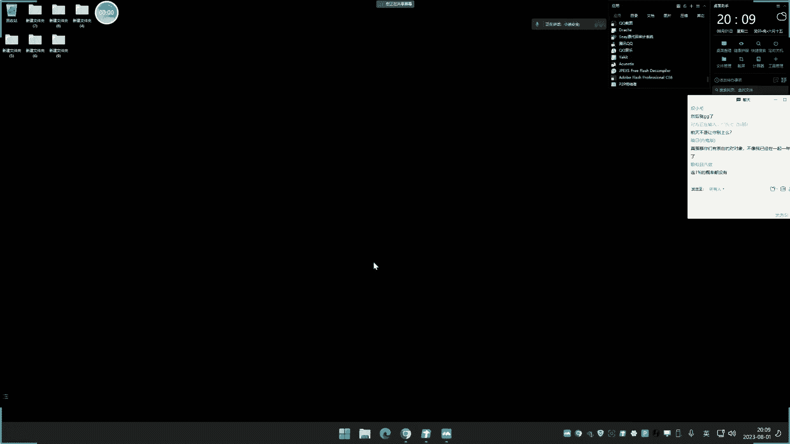

今天呢讲一下这个其三天的，关于这个支付逻辑的业务问题啊，这可能说实话一次直播那是讲不完的，有些直播呢，有些课内容呢也没有办法用案例去演示，能讲多少是多少啊，那字典还比较多，这个呢是漏洞呢。

主要是产生在这个商品购买，支付逻辑上面的一些东西，就比如说你什么开开会员呢，或者会员升级呀，购买商品呢，就凡是涉及到这种啊支付类的，那么一般呢都是通用的，这个支付逻辑呢简单来说呢你要了解的话。

首先呢我们从几个方面去了解它，就是你要把字典呢比较总结的比较好的话，那么你要对每个环节能产生哪些利用的思路，把它写清楚，除此之外呢，你还要针对不同的这个对象，和他不同的这个功能呢。

还要总结出一套自己的流程，简单来说就是说有一些通用的呢都能做，还有一些呢就是另类的，我们来先看一下啊，这里有四个方面，就是说关于这个字符逻辑常见测试啊，首先呢我们想象一下啊。

这个字符逻辑呢拿这个商品购买来去讲的话，你选择好商品之后呢，他也会让你去选择这个商品的数量，甚至有些呢还有什么这个套餐是吧，还有各种各样的套餐，然后你选择完之后呢，就会选择这个支付方式及配送方式啊。

就会生成一个订单的编号啊，通过对订单进行支付之后呢，就完成支付，最终呢就一个整套的一个商品购买支付流程，那就走完了是吧，在这个过程中的话里面有很多东西，就比如说商品里面的话，它会有一些商品的数据。

比如说商品的编号，商品的价格，商品的数量包括在订单产生的时候呢，优惠订单的属性，订单的属性是什么属性呢，就是订单不是也编号吗，他会有对不对，然后呢还有有时候呢你在支付的时候呢，还有什么优惠券呐。

积分呐是吧，有这种东西又会有折扣属性，那支付方式呢又有什么这个第三方支付，或者是余额支付，就是你本身账户的余额支付第三方支付，或者说呢还有这种啊呆呆字符是吧，就可以让别人帮你支付等等啊。

支付完之后呢还会支付状态，那其实就是说在每一个环节里面，都要考虑到这个安全性，比如说这个价格能不能篡改这个数量，能不能穿改订单在产生的时候，那这个订单能不能篡改，包括这个积分和什么优惠券。

这些东西能不能重复使用，能不能这个是吧，自己呢未收全都拿到别人的呃，这个制作方式也一样是吧，比如说他以前那是调用的哪个接口，而你这个时候呢把数据包替换之后呢，他这个结合呢换成其他的去了。

那自由状态的也可以改，但今天的我们不说字幕状态，因为这个字幕状态呢是属于修改，这个成功和失败，只这个呢是属于前端验证的一些安全问题，这个呢是下列课上的，是专门上这课的啊，因为这个支付状态还有什么密码呢。

找回状态，验证状态是唯一码事情，其实都是我们说的这个验证状态，就比如说你找回密码的时候，这个验证码是否输入正确啊，你的密码是否输入正确，把验证码是否发送成功啊，像这种逻辑呢。

它都是由这个状态值返回呢来去确定的啊，包括这个柱状态也是这么个情况，所以哪一个东西呢，我们把它称之为叫验证的一个逻辑啊，验证逻辑就比如说像你输入验证码是否正确，支付是否已成功啊。

你这个修改密码的逻辑步骤是否顺序完成，是否正确等等啊，这个呢是另外一个点，还有一个那就是我们说的这个修改方式，修改方式有很多种啊，这个替换字符这个指的是啥意思，就很简单啊，比如说你购买一个A产品。

它的价格是50块钱，购买B产品呢，它的价格是100块钱，你尝试用A产品的价格呢去触发B产品的订单，也就说你想用50块钱呢买到100块钱的东西，这个叫替换字符，因为你想想想啊，他是判断这个支付有没有成功。

但是他不知道你这个支付是对应哪个商品，它可能在这个逻辑上面呢有安全问题，所以造成这个替换支付呢，形成了一个低价买入高商品的一个情况，这个能理解吧，就说你付款成功之后呢，他只会检测你付没付。

而不会检测你这个付款是买的是哪个商品，就说我们用A产品的一个价格呢，去购买B产品的订单，还要重复支付啊，这也属于支付上面的逻辑安全问题，就是你购买成功之后呢，把这数据包再发一次，会不会又重新购买呢。

所以小额支付啥意思呢，还有什么复数字符，这都是属于算法上面的问题，就我们很清楚啊，这个什么叫算法呢，就比如说你这个账户里面是吧，有100块钱啊，你购买那个50块钱，他就会减去这个50嘛，是吧是吧。

是这个意思吧，然后你数据库里面呢就减去50，你这个个人账户上面编程，最后呢还要50块钱，这个时候呢他如果在这个算法上面是吧，把那个50改成个负以前，那就是100-50是吧，50是你的值，是你商品值。

100呢是你原有数据库的值，就是等于50，然后你再把商品价格或者是这个支付价格，改成-50，那么100--50就变成了100+50，变成150，自动的多了50块，对吧很多啊，还有一个就是说移除字符。

这又是啥意思呢，就在我们说的这个代码里面呢。

我们代码里面不是经常做这种数据运算吗，就是很简单的道理啊，就是我们代码里面如果说要进行这个数据换算。

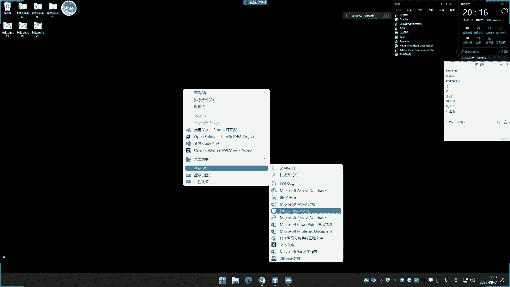

就是这个价格和你本身这个金额的一个换算，我们都知道啊，假如我在代码中里面也声明了一个int类型，int类型的它有个最高峰值，对吧，有个峰值，还有个这个值，就说你实这个变量，这个变量有多少V是吧。

他是个数值类型。

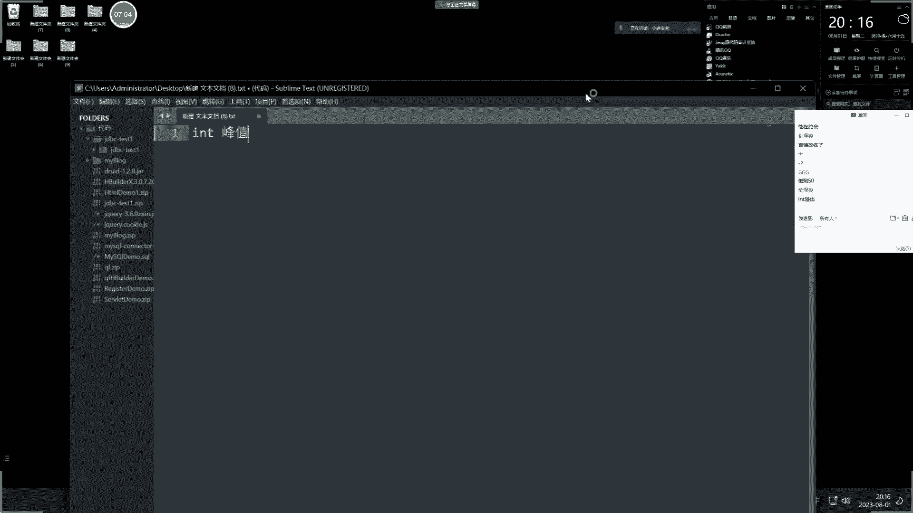

它有多少V是一个封，就不可能超过这个值了，就是我们那个程序里面代码里面的规定的，你超过这个值，它会是一个什么逻辑呢。

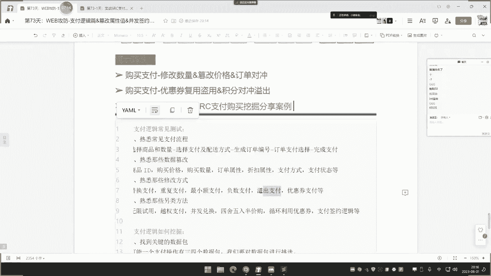

你超过一，那么就变成了一，就很简单，比如说它的峰值是R7888字这么多，对不对，然后呢你改个R7，279哎，他结果了就变成一，就是重新再来过，等一吧就下次减去，它就变成了一，那就重新来过，他会有这种啊。

就是不同的这个这个代码中的话，每一个语言里面它都会有一个峰值，一旦超过这个峰值，它就会重新开始。

就是我们经常说的，你在学开发的时候，应该知道有些变量，比如说你是int类型，它就固定那个长度，那么固定长度就是说那个值呢不可能超过，那长度，超过了就像是要重新再运算了，还有一些另类的方法。

这个另类方法呢也是在隔壁是吧，搞SRC这个喜欢教的一些方法，也是他们称之为高端方法是吧，这就是什么鬼，无限试用啊，什么源泉支付啊，并发约欢呐，四舍五入半价购啊，循环利用优惠券呐，支付签约漏洞啊。

就这些鬼东西，那么呢我们呢都把网上找一些相关的案例，到时候给他看一下啊，其实都简单，说白了这个字幕逻辑那是最简单的，就说他们呢不会涉及到一些代码层面的漏洞，虽然说它产生的也是对方开发者。

那这个考虑不到位，也是属于这个代码没有验证，但是他这个东西呢和我们实际的这个人的，这种逻辑思维呢很相关，就是你不需要有额外的基数啊，你只需要有一个是吧，思路上逻辑上面的这个认知啊，这个漏洞那就能明白。

好那么现在呢我们就来看一下啊，啊后面呢还写了啊，关于他的修复和这个挖掘方案，那这个挖掘方案呢可以提一下啊，其实呢说白了就是针对各种数据包里面的，各种参数来进行分析对应和修改。

然后呢也是可通过在PC端测试，VPC端测试小程序上面测试，就是说这个支付的流程是吧，电脑上面的web看了，然后呢app里面有没有继续开小程序，看为什么这样说呢，因为我们知道啊，有些这个应用呢。

它可能就是说啊web那是一套程序，app的，又是一套程序，小程序，又是一套程序，然后你自己呢也要多想一下啊，你如果按你正常你自己的这个设计逻辑，你会怎么设计这个支付流程，那么你在这个过程中。

你觉得哪里会出现问题，那么你就在哪里去测试它的安全性，我们也是要根据这个实际对象来去测的啊，好那么现在呢我们先通过几个本地的小demo呀，本地的小案例呢，给大家看一下这个具体的流程啊。

把这个流程看清楚呢，简单学习一下简单的一些常见方法，修改完了之后呢，我们再来看一下这个经典的案例，这个呢是我们的一个小案例啊。

这里有个商品购买，我们在这里呢啊数据包抓一下啊。

两个啊，一个是针对常规购买的，还有一个呢是针对这个优惠券的啊，还有个真的优惠券，拿这个积分制的。

虽然是老演员，但是知识点呢有些小微的更改啊，这是老演员是吧，知识点呢我们还是正兴的这个删除增加的，好这个代理呢把他一开一开啊，你比如说像现在啊，这个是他的先注册个账号啊，这个注册账号我就不说了啊。

这都会注册了6000块钱是吧，那我也去购买它，那我点个正常购买呢产品这个6000对吧，然后选择自己的这个支付方式，好比如说这里一选择的话，把自己第一次写进去啊，好好的点提交订单。

这就是6000块钱嘛是吧，那这里也写上去了啊，他就会这个请求这个地方去支付，由于我这个接口没有配啊，所以那个界面就弹不出来，但这个不要紧啊，咱就进入了这个界面，那么现在我们看一下啊。

来比如说我们在刚才这个地方啊，我们在这个商品购买这里啊，我们先重新看啊，把这个数据包的给抓到，那点击这个购买的时候啊，购买的时候你看这数据包啊，这个数据包里面的，你看一下啊，来这个A代表叫什么。

go by就是购买是吧，什么ID的要起内蒙等于这个值，然后什么QTY等于一，PRIC等于6000g tap等于这个东西，PIC等于这个东西好我们大家思考一下啊，嘶首先我们罚的这里是加个是6000。

然后数量是一，这里呢有个叫PRICE等于6000，就说在他的数据包里面呢，这里已经写了，加个对不对，然后一数量一，那前面拿了个值等于一啊，就是这个叫Q6I等于一。

那这里我们可以把它理解为这里可能是数量啊，这个地方是这个什么这个这个什么啊，刘谦的这个价格呃，比如说我对数量进行修改是吧，好我们先这里呢把数量修改成二，是不是就变成R呢，然后放出去，那你看数量就变成二。

对不对，好，那这是个正常的，就变成1万2了嘛，好那现在呢我们重新来过一下，那我这里呢是这个乙对吧，那么大家想一想啊，这个产品只有一间两间，不可能说搞个零点几间是吧，但是我可以怎么样，那我就搞个零点是吧。

搞这么多年就搞这么一间，发过去，价格呢就变成六分钱数量，认为0。07，他告诉你啊，你这样买了之后，对方是罚也罚的还是不罚的，所以他只有零和一啊，你这个也是个0。0几，你说对方是罚还是不罚，是这个意思吧。

那对对数量的进行修改，因为数量的换算方式，那就是乘加个，还有呢就是对价格进行修改，对不对，那比如说我这加个6000是吧，我这边改成一一块钱放出去，那这里就变成一块钱了，单价一，那购买的时候。

那就是合计支付一块钱，对不，像，这个就是最简单的一个数量和价格的修改，的一个形式，就说在这个购买商品的时候呢，啊，这个这个数据包里面呢，有有什么又显示这个啊，价格和数量的修改的地方，你尝试性修改之后呢。

他的追踪金额由你这个数据包的那为准，那这个就是很安全的，就说它本身固定6000是吧，你把它改成六块钱，改成一块钱数量进行修改，那最终的这个付款金额就发生更改，但是这个订单呢时长就能产生对方审核。

或者说对方发货，他会实施这个逻辑呢，那是他们的事情，但是至少这个订单呢被成功了，正常来讲是6000一个啊，你花了六块钱或者花了一块钱，甚至花没花钱是吧，你购买了订单，而且成功了，对方是罚还是不罚呢。

那就看他自己怎么选择了不对，那是后面他自己对这个订单的验证逻辑了，那就不是我们参考的事情，但至少现在金额呢你是成功付款，因为正常来讲他只只接收6000的整数的金额，那其他的就是假的，是这个意思吧。

那还有一种就是我们说的这个叫订单的，这个什么对冲的方式，就说假说这个价格和商品呢，我们不修改它，这里另外一个手机也叫是5400，就说我准备两个事情啊，我就说先把这个订单给他产生起来，产生起来之后呢。

我不付款，最后我还不进入付款，我先把订单呢把它搞搞好，然后我再怎么样呢，再开另外的5000的订单，我让这个5400呢去付款是吧。

去充那个6000的这种，我们叫之为也叫替换支付啊，修改数量是吧，篡改加格，还有这个什么替换字符，就是以这个A产品加个订单，去购买那个什么B产品的这个订单价格，因为很简单的道理，对方呢是检测这个。

购买的这个什么付款成功的这个状态，如果没有考虑到，这个对应的叮当和产品的话，那这里呢就会有这样的安全问题，就是说他只检测这个付款的状态，就是你有没有付钱，但是他没有考虑到这个付钱的。

这个对应的是拿个订单的或拿个商品的，他没有这个东西，就只看了这个状态是吧，你会付钱而已，就是接受那个付款那个回调的那个值，这个时候呢我们就先自己呢生成一个A的订单，尝试性的在购买B的订单。

就在B订单那里面把它改掉。

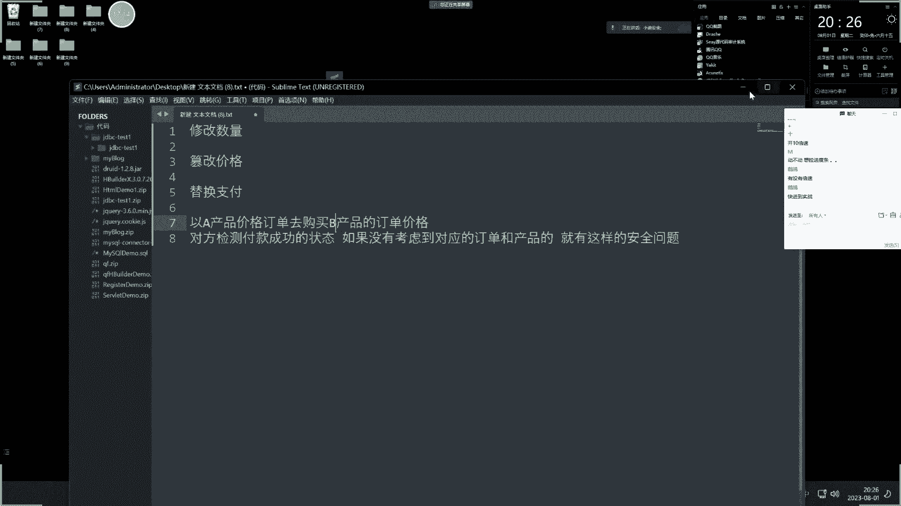

这个啥啥情况呢，我们来演示一下啊，比如现在5400的啊，我们可抓个包，好这个包抓到了。

这个是5400的那个订单号，订单的那个东西啊，5400的名字叫做8米手机cs。

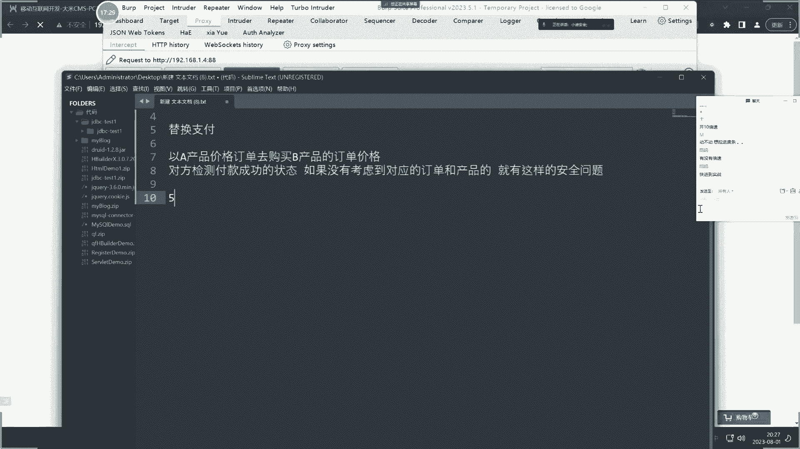

9S对吧，这5400的啊数据包在这里，就是这个上面这个整个这个参数啊，因为其他的他们都无所谓，其他的都不用改好啦，这里呢他在这里呢是来到了这个5400。

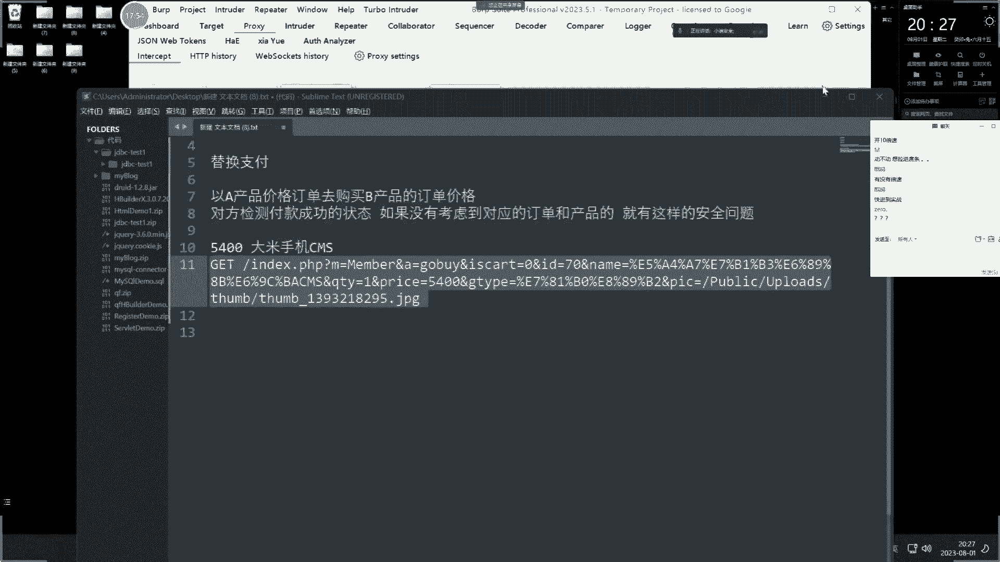

这里是吧，5400的啊，你看啊好就是这个显示的啊，正常的好，那么现在呢我们再来看这个啊，这个是6000的大米。

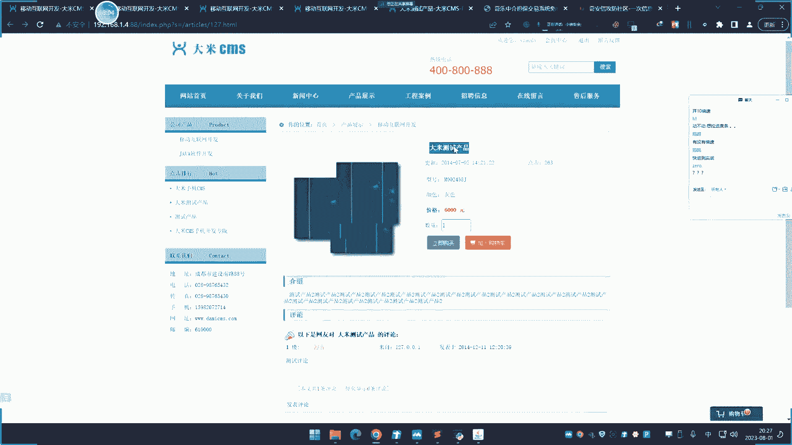

测试啥6000的六星价格的。

这是大产品，然后现在呢我们再进行一个抓包，好这个是那个流星产品的，把这个拿出来好。

大家看一下啊，这个数据包里面呢，你看到啊，这个这里有个6000是吧，然后这里是5400，这里是一啊，这个数量嘛，这个是6000，其他的基本上没有什么改动，但是你看一下啊。

我现在在购买这个6000产品的时候，我把替换成了替换成这个5400的，然后我只替换这个这个地方，就只替换这个数量和价格，这里其他我不改动它，其他我不改动，你可能说为什么不改其他的。

因为其他的是5400的商品的，对应的id和他的名字和他的这个图片，我不用改，我只改它的价格东西就是相当于说啊，我用这个5400的这个订单东西呢。

来冲这个6000的好，只改这个地方来，就这两个值啊，一个数量和一个价格还改，改完之后呢，把这个包放出去再观察一次，大家看到没，价格变成5400，产品变成大米才是产品。

啥意思呢，这不是6000吗，是不是变成5400了，其实说白了啊，还是刚才的去修改这个这个价格是吧，还是修改这个价格，只是说这个呢是偏向于这个数据包的，这个天下数据包这个什么，他的这个信息。

其实就是说它星系里面的其他参数呢，是代表的是这个商品，代表的是个商品啊，代表是这个商品，然后呢你对商品的其他值不要更改，对不对，你去冲这个其他商品或者很简单的道理，我不抓这个6000的是吧。

我把刘谦的这个东西呢给他放上去，那我用这个5400的让我购买这个5400的，我把这里也修改，改成放到个流放这个地方去啊。

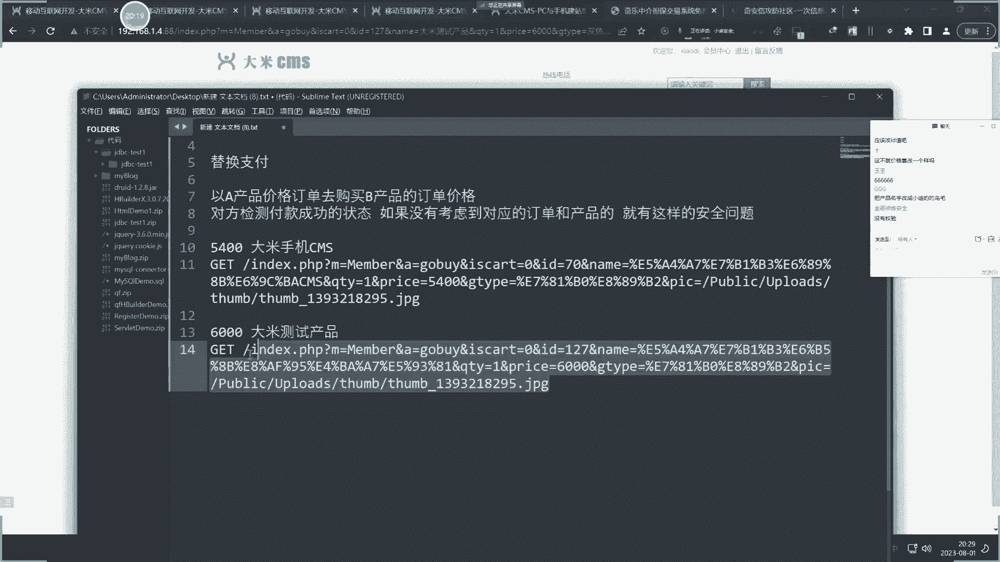

你比如说像现在啊，那我现在购买这个手机3MS，这是5400嘛，对不对，我去购买它啊，看一下。

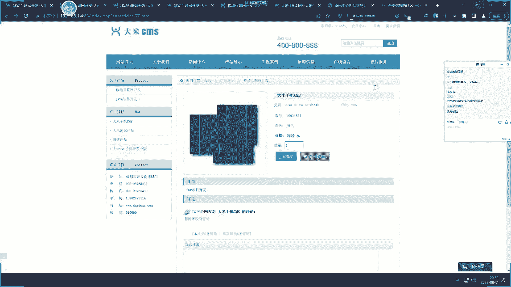

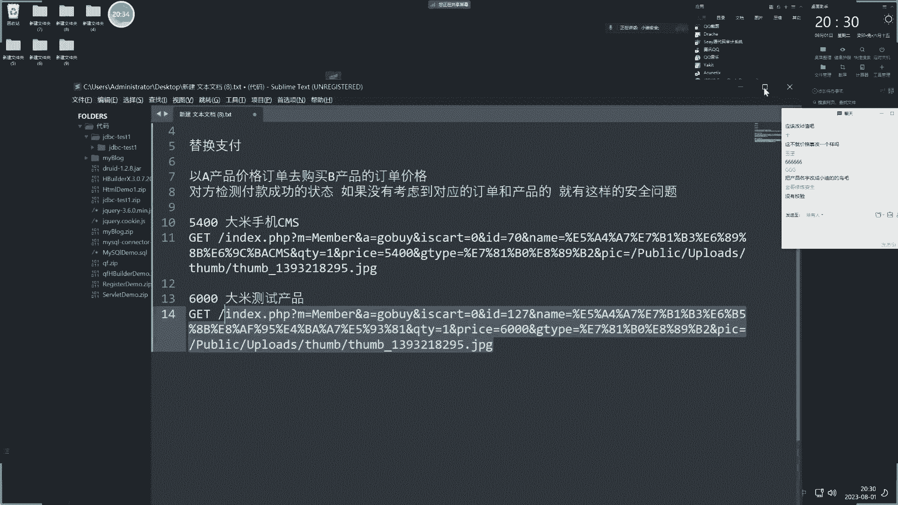

我购买这个5400的啊，这明明是购买的大米手机cs啊。

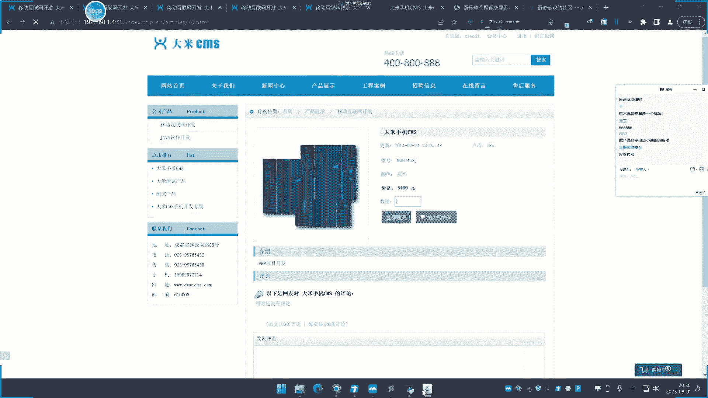

看一下，那现在呢我把它换成这个了，就是我把这个数据包呢给他替换成这个6000的，这个产品的数据包是吧，然后呢我这里呢就只改中哪几个地方呢。

就这里啊，除了这个这个这个地方不改啊，就是这个我们前面都换掉了，好我先把它放出去，观察下下页面啊。

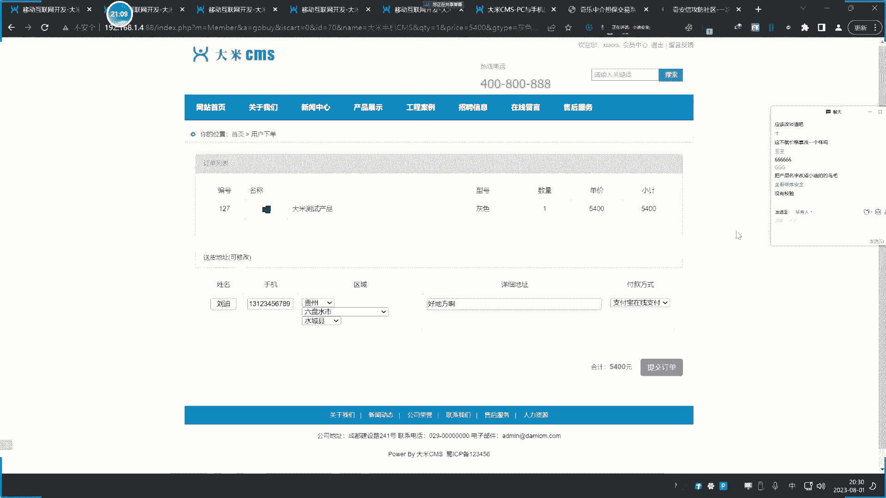

变成大米测试产品5400，明明刚才购买的是大米手机，现在变成大米产品，同样是5400的价格，就是我没有改它的价格和数量，我改的是这个上面的什么产品信息，也其实这个呢就属于什么叫做什么产品充对付。

就说我是以一个价格方面的，这个是吧，比如说你这个我这个5400购买，我不甘，我不更爱你的数量，也不更爱你的价格，但是呢我让你这个指向的产品信息呢啊，给他换成其他产品，就是换成一个高价产品。

换成个大米的产品，因为我们捕获到啊，这个大米产品和你这个这个产品呢，区别就在于上面字行的id值啊。

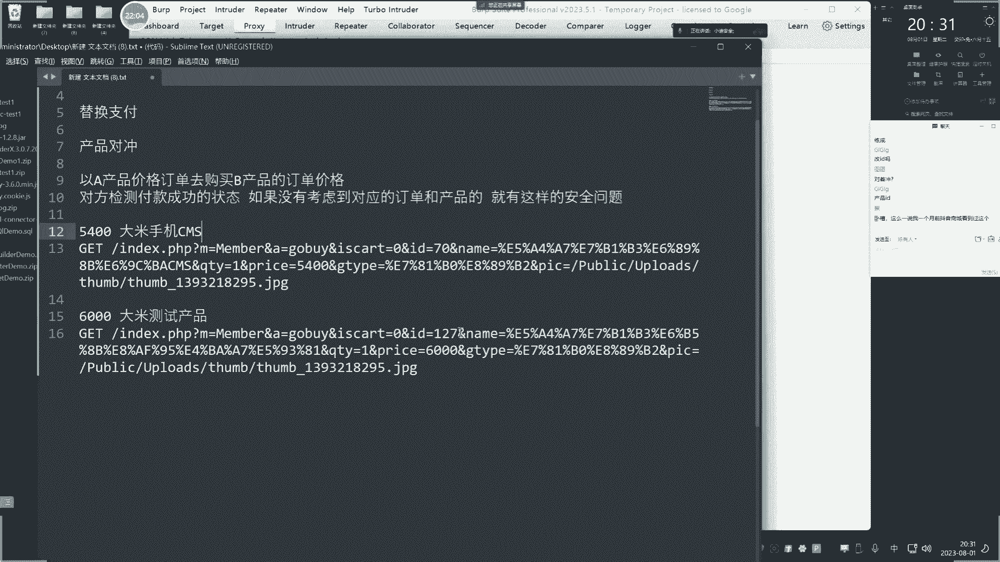

这些字有点不同，所以他就是这个对应材，其实就是说刚才是更改数量。

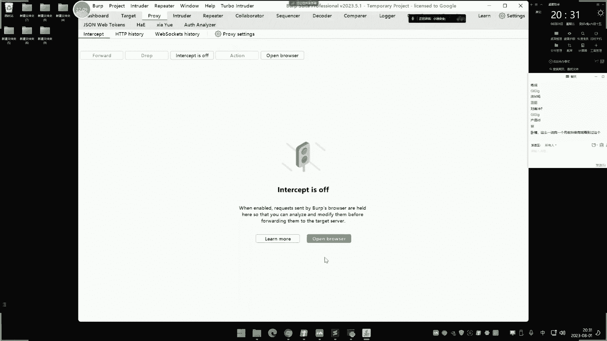

更改价格，那现在这个呢就是属于叫叫什么产品，对冲更改产品是吧，对冲产品还有一种就是说我们替换支付。

这个替换支付是啥意思呢，那举个很简单的例子啊。

替换支付呢要来到这个订单这里好，我们重新来一下好。

我们先来购买，点击这个提交订单的时候，我们来看一下它的订单产生，这是那触发这个订单是吧，然后这是触发那个订单的一个情况，然后这里有一些这个相关的值和价格，好放出去，它就会产生一个这个啊。

这这这个呢就是那个订单的那个值呢，请求是阿里云配，就是我们这个支付宝，对不对，而你就可以把这个数据呢给他。

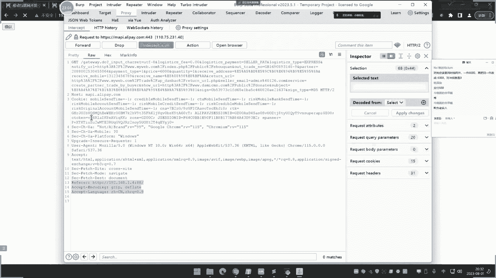

怎么样保存下来，那么这里呢可以简单写一下，这个是这个5400，8米手机cs的这个付款订单，结果是发过的地方，就是付款的那个那个东西。

就是一旦啊你这个包放出去，它就会弹出那个付款的界面出来，你看现在都还在等待我一放出去是吧，一放出去诶，他就来到了支付宝，由于这个接口我没有正确配置啊，所以这里面看不到，那就说这个呢就是刚才那个包。

对不对，然后现在呢我就再换一个产品是吧，换这个6000的产品，我来点购买，然后这个时候再抓个包好，这个就是这个就是那个另外一个产品是吧。

这是另外一个产品。

也就是说我可以怎么办呢，我5400那里我先不付款。

我先不付款，然后呢我再抓一个6000的包，然后我把5400那个购买那里呢，给他替换成-6000的，能理解吗，这是属于我们叫替换支付，就是一样的一码事情，无非就是说那个产生的点不一样。

就这里呢是五千六千块钱是吧，我购买的时候呢，它就产生这个订单的这个地方是吧，你等下那你就再开一个是吧，就购买这个5400的，然后这个时候呢就要5400的，这个付款值内是吧，那个真的指向那个6000的。

那么你付5400，那会不会就把6000那个订单给他付了呢，就是这个意思啊。

这个接口没有配置啊，也不知道有没有这样的安全问题。

是吧，这都是属于他逻辑上面的一些安全问题啊，这个都好理解啊，就说这个cm s呢给我们讲了四个点啊，哎四个点就是这四个点啊，就是我们说的这个一个叫订单对冲啊，这个叫订单对冲吧。

因为他们都属于这个替换对冲的意思啊，啊就是这个呢就是相当于说的这个，同样的这个什么好吧，这个低价，对应比如说是A是吧，5000是对应AA产品，然后呢这个6000呢对应B产品，这个时候呢。

他就针对什么购买A产品的这个请求名啊，修改这个产品属性，只将这个遗产，那么结果就是5400呢购买到了B产品，有这个概念关系，这是产品对冲，订单对冲呢就是很简单的道理，就是下两个单是吧。

下两个单单呢是5400和维三啊，这个东西下两个单，然后这个时候呢付款5400的，这个时候啊对吧，替换这个，数据包哎不是啊啊，这复古环境的替换数据包啊，讲那个B场景这个礼包。

然后那就是相当于那追踪那个5400呢，那打比他这个意思，啊对就是订单护甲啊，实际上是直接修改价格吧，怎么可能呢，这和加个没关系啊，我需要加个，我还修个毛，他本身五千四六千，我本没有中加个啊。

不要搞错了啊，这个能理解吧，其实都是一种替换方式啊，就是低价买高价，高价买低价的意思，这两个呢就属于叫并发替换方面的一，些安全问题啊，这两个呢就是很简单的道理。

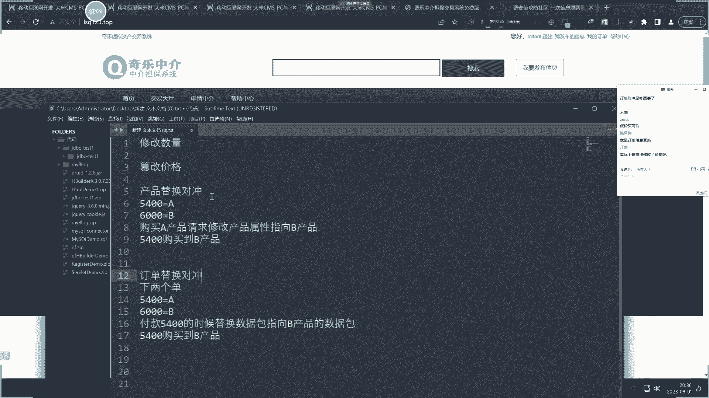

他就是检测状态，那这个呢我就说到这里啊，接下来呢我们再看这个另外一个啊，另外一个呢我们数量上面那就不讲了啊，这个数量和什么价格上面的更改。

那就不说了，我们主要是说一下这个优惠券和积分制，给大家看一下一些新的玩法，优惠者和积分子啊。

首先呢我们在后台里面先给他看一下，第一年怎么说做假这个事情，那在后台一个针对一下啊，那这是他的后台，我们先登录进去，哎，密码不对了，哦对了，这里有个营销信息，营销这边有优惠券，还有什么满减送，积分管理。

限制人口啊，这种东西好，我们先看右后项啊，右向这里，那我们可以看一下好了，这是我们那个优惠项添加的啊，一边高为100啊，发放数量为1万份，每人最大领取一份对应商品呢，我们就是自己这里呢创建的商品是吧。

啊这个创建商品呢你安装之后呢，我自己创建的啊，代表的是我们那个培训价格是吧，安全服务这个商品对不对，然后在这里营销啊，营销这里呢我们就搞了个优惠券，加了个优惠券优惠权，这里那就是每人呢只能限制你一分啊。

大家看到了啊，是只能领一份啊，然后一份是100块钱，少100块钱，这个产品呢参加了这个，参加了这个优惠活动是吧，啊这这个情况那个设置啊，给大家介绍完毕了，那么现在呢，我们就来到这个网站的这个首页过来。

那么现在呢我们来看一下啊，这是我们的商品，对这个是吧，这是我们这个商品，然后呢你看一下这里有个叫店铺优惠券，100的一个优惠券是吧，我点击领取，他说你的领取呢已达到上限了，去看看其他邮箱好啊。

这里呢为了这个真实有效啊，我就先给大家这样子啊，退出一下这个用户，我重新注册个用户好吧，重新注册个用户，那我们就取个名字是吧，注册个好，那么现在呢就注册个用户重新来到这里哈。

购买，当然我先去购买它，这是我们的购买啊，写个地址。

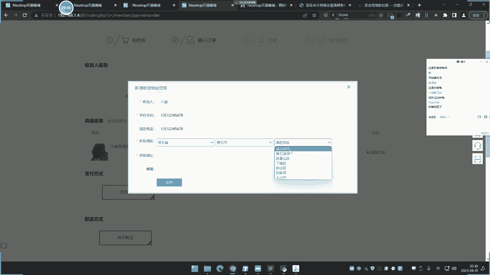

随便写个地址吧，好这是我们第一子啊，你看啊，他现在呢没有使用，我加的是2800是吧，3800，对不对好，那现在呢你看啊，我这里领取物价能够领取到好，领之后，我们再购买，这里呢有个东西了。

使用优惠券是可以使用120，100就变成2000几，对不对好，我们再来点提交好的，2000起意是吧，好，我们随便使用这个字符好好，那这里呢就购买了哈啊购买了我们不管它了，啊啊刷，我们重新再来下单。

好现在呢我们再领取，你看他就说提示已经已经上线了，就是刚才的我不是领取了一次吗，领取应用了是吧，现在你看啊，我在这里他就没有这个优惠价了，是看不到这个右下的，没有了，你本身的这个加个里面，你才下了。

这里有个优惠券呢，他没了，那你暂时没有右下，刚才那右下已经拥了，他已经拥了啊，在订单里面呢，这个呢那他已经拥了，这订单详情里面可以看到啊，他已经用了这个优惠券，所以那个订订单优惠券已经没了是吧。

好那么现在呢我们就来看一下啊，这个优惠券是很清楚的，我们都知道啊，就和你使用红包一样，你点外卖的时候，他经常使用红包，他这个优惠券和红包概念是一样的，都是这种折扣营销类的一些手段，当我们知道啊。

这个优惠源呢会存在几方面的问题，一个呢是我们说的盗用问题，还有个呢是这个叫服用问题，就重复使用，还有个人是我们盗用盗用，这是可以说是自己掌握这个规则，知道那个优惠券的编号或者说兑换码，这种人属于盗用。

那我们先看一下啊，这个首先看第一个，这里呢我是领不到了是吧，好我们重新呢注册个账号出来啊，观察一下这两个数据包，好在这里呢我们先不用优惠券购买一次，抓个数据包，好把它放出去放出去放出去放出去啊。

好这个呢首先写个例子。

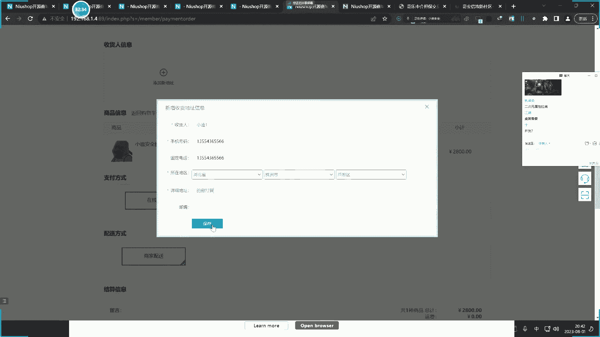

好这个呢是没有使用优惠券的时候啊，我们来产生这个订单bug的数据包，这是那个数据包啊，好我们来记录一下，这个是没有使用优惠券的一个数据包。

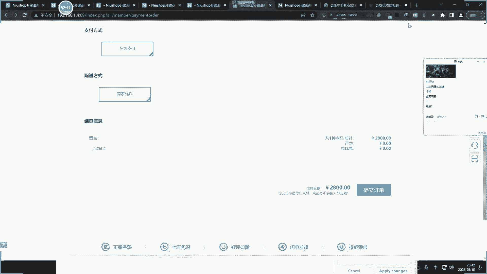

好那现在呢我们来看一下下面这个啊，使用优惠券呢观察一下两者的一个不同。

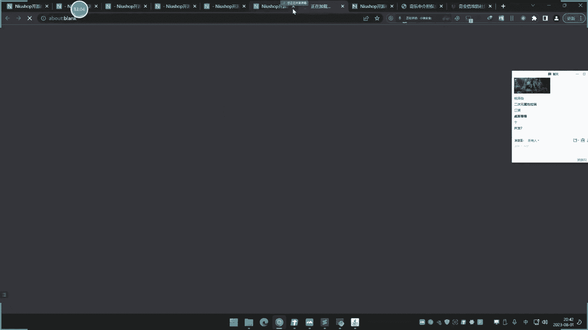

重新来到这边，同样来到这里，先领穿LINA购买，选择优惠券好，这里把书包抓到，这是使用优惠券的数据包。

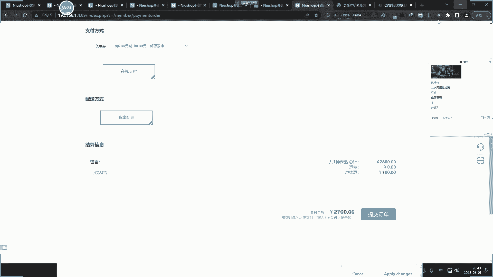

同样一个商品看一下啊，两者的一个区别，我们可以把这里呢前面揪的一只把它去掉，好这个是使用数据包，使用右键和不使用右键的一个这个数据包，我们完成一下啊，哪里有不同了，大家看一下来。

就这个叫user cp得个等，你这个是个失啊，对不对，那四法呢其他的相同吧，和其他的对应的，就唯独这里那一个是零，一个是四，那我猜测一下五行不行，U行不行，七行不行，四重复利用U行不行。

现在说啊，那么现在呢我们再来测一下我这个商户。

看他还能不能这个使用一下的啊是吧，我就完成付款好。

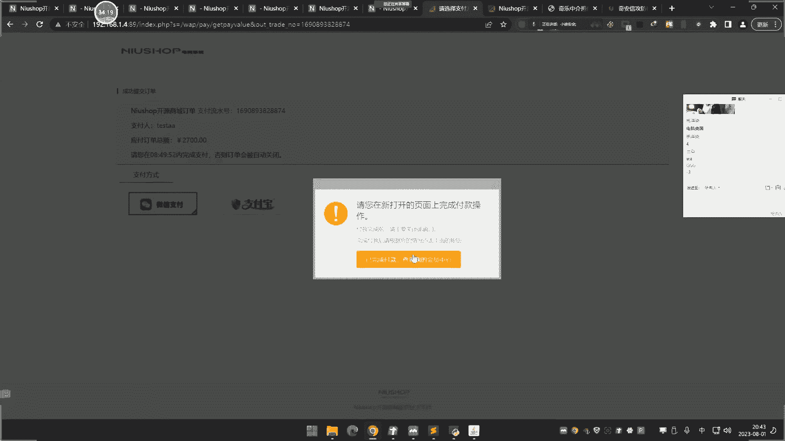

那现在呢就是说我产生两个订单，一个是用了优惠券的2800，一个是没有运动效应的，那么现在我看我的右下是没有的，是没有啊，我们在打到这里，再群里他说隐匿已上线了，因为在后台里面设置过一个账号，只能领一次。

所以就没有用，对了没有用啊，我再进行改包看下啊，我把数据包在这里先抓，然后呢把这个购买的这个数据包的这个值啊，把它改成刚才的四，改掉就是替换成刚才使用这个优惠券的数据包，把它换掉对吧，我改完之后。

我们先放看价格变成2700，加个变成2700，对不对，那就说这个优惠权重复利用了，订单里面你也看到的信息呢，这边是2700，价格里面你看啊是吧，这个使用优惠下单。

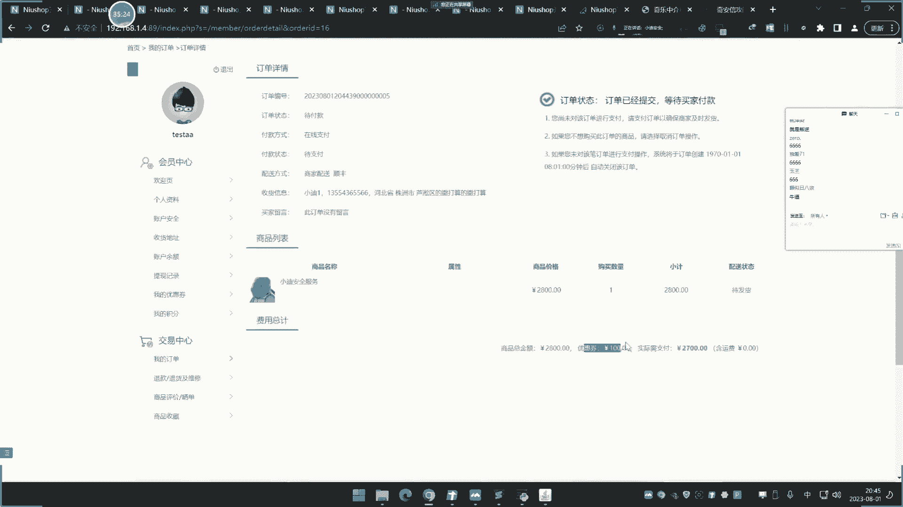

这个好，刚才有人说换个其他值，那你看一下啊。

再来一下，再拧它肯定不行了是吧，再继续购买，按道理再抓个包，好这里是吧，刚才说改成其他值，改什么六啊，七是吧，都可以改套进去，那也是2700，其实啊我跟大家说啊，他这个优惠券就是一到1万。

他这个网站有这么个生存逻辑，那其实就也告诉我们。

在实战中呢，右拳他有两个问题，就是说盗用和服用，复用呢就是说要重复使用的问题，还有个叫盗用就啥意思呢，就是啊栓出这个幽鬼圈的这个什么鬼女，就比如说他发放给你的时候，他的id编号，比如说右下那个编号。

它等于一一拆出来，就是R嘛，下个就三呐，这四啊往这拆啊，那是最简单的，如果说是这种实是那种随机命名呢，你要观察的规律，或者说这右上有算法是吧，算法你相它一相它能不能换算出是吧，可行的，这个接好能理解吗。

盗用的话就是要根据这个优惠率人啊，优惠券的规律就是这个值啊规律啊，可刚才这个年代他是什么职业，是什么师，那应该就是说他是第四个进去的，给他一个编号为四，那五呢牛呢七呢八呢一直有没有用呢。

你把它替换这个值能理解吧，就使用这个用户先啊，因为我们都知道他只能一个人嘛，一个人只能领一次，那么你每一次购买少100，那不就是好养猫吗，是不是，这里呢就是针对这个优惠券的这个规律的来猜。

还有没有其他优惠券的编号，就是猜它的编号，简单来说好重复使用，就是说重复啊，重新的再把这个邮箱的再发包再用一次，看他还行不行，如果他在代码和逻辑中没有验证，这个右上已经使用过的话，那么重复使用是可行的。

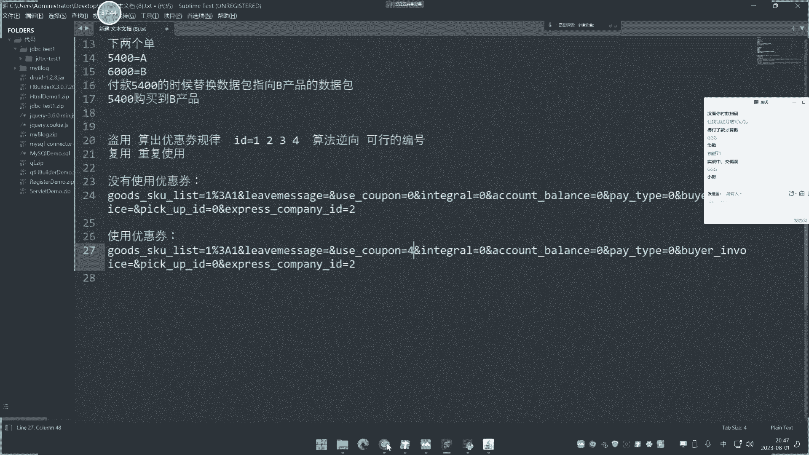

对不对好，这是这个优惠券的啊。

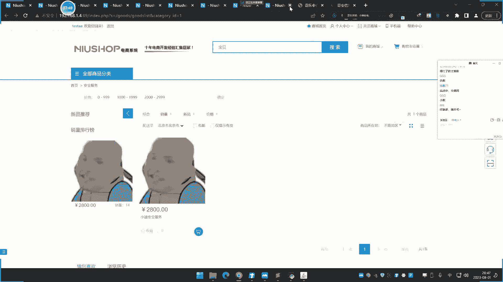

还有个叫几分子的，还有个叫几分子的好，我们看一下啊。

好我们先来到后台，先把这个几分子来给开起来，开出来啊，都是这种营销活动的啊，就是会员送积分啊，这种情况啊，那这个集中管理警用管理呢，比如说一积分呢等于一块钱，这里我把它默认是禁用的啊，我把开了。

那启用就是一积分呢等于一块钱，然后积分是什么呢，会员租车呢就送一一百积分，就送100块钱的意思啊，然后签到送信积分呐，分享索性积分呐，什么点赞数性积分啊，评论送新积分啊，这些都无所谓啊。

就是我们呢把这个积分都给他激活了，大家看到了啊，一块钱就是这个100积分，然后我们刚才不是注册个账号吗，好我们注册个账号啊，刚才那个账号要登录进去好，重新注册好吧，用重新来的，重新再搞个账号。

重新搞个账号啊，我重新注册了，那么也就是说这个账号应该是有一一百个积分，他松的啊，就我们那个设置里面的那个积分啊，果然我这个租车呢他输了100积分是吧，赠送一积分，然后这里有个约还余额。

比如说我点一是吧，我约还一，他也会约还金额，然后我看我余额里面啊，账户余额目前是零块钱，然后我呢点这个积分，我约还一下啊，比如说我约还这个十好吧，约要十就十块钱，点击约换约还之后又要成功。

积分呢变成了90积分啊，啊月换来了这个十个是吧，然后这里他账户余额变成了十块钱，就是90积分加十块钱嘛，因为这个十块钱，那就相当于十几分月要还的嘛是吧，然后你购买的时候。

那他就可以用这个几分呢进行相应的这个兑换，比如说100块钱是吧，你用十几分，那么就少十块钱，就这种意思，大家都购买过商品的，都知道，不用多说好，那么大家看一下啊，像这种积分上面它有没有什么安全问题呢。

这个兑换流程就会有一些安全问题，它有个换算什么意思啊，我们可以看一下啊，在这个数据库的设置里面啊，从原理上面开始解释啊，你在隔壁去听这种SRC课的话，他只会教你怎么用，他不会告诉你原理呀，对不对。

高速的原理呢就是从数据库里面要看一下，看那个代码逻辑哈，我们看一下啊，这个数据库里面啊，我们看一下应该会在哪里，那个积分应该是在灰原里面，是在这里哦，应该在这里就是对应十。

那应该是这个这个对应的原理为八，那是不是对应的就是那个用户为八的啊，果然用户为八的，你UID等于八啊，这个数据库里面就是呢UID等于八的，它里面这个代表这个point就是代表的是什么积分。

然后这个是你余额十块钱，因为这里一旦更改就会更改，你不信的话，我给撕一下啊，比如我这里的改成填好吧，把它进行修改复制，然后刷新一下我的这个界面，他妈的什么鬼啊，这改了跟没改一样，这应该是这里啊。

这里这里还有个100的啊，这里还有一个白的，什么叫啪啪打脸了，我叫爸爸打脸啊，他可能还有其他的验证逻辑，不仅仅是有这个数据库制，我就说讲这个意思啊，在这里看一下好，我们就这里啊，先把它这里操作好。

大家看到了啊，这个是便于我们对这个知识点的理解啊，其实就是说呀很简单的道理啊，我们现在算一下这里啊，我约换几，除了我再月花十块钱，那我对应这里那就变成了余额变成R8啊，余额额这个积分变成了80。

然后余额呢就变成20，你看这里刷新一下，那这里就变成了80，就变成20，是这个意思吧，啊这个数据库能和它对应上了啊，好我们大家想一想哈，嗯我们想想啊，我约换的时候，我约换一次，他就会相减。

能不能理解我减，我约花一块钱，它就变成了79，那么就加一块钱，就这个意思啊，约换成功是吧，那我变成79积分了，这边就可以找21块钱了是吧，好大家想象下啊，这会有什么安全问题呢，这会有什么安全问题呢。

我们想想代码里面是怎么去运算这个值的，你先想一下这个值情况，这就是它的原理啊，隔壁呢是不会讲这些东西的，他只会教你怎么修改它，但原理呢你自己呢其实很好理解它的啊。

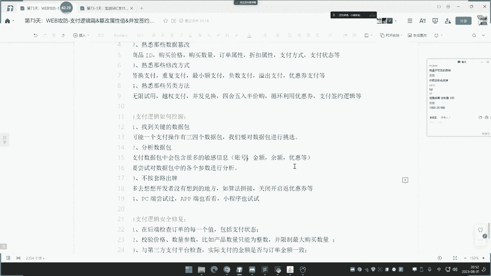

看着啊，我们怎么操作它啊，来，我写个什么一，他说积分必须为整数，那这个只是前端的验证，我可以这样子嘛，我抓抓猫对吧，额那哪个是这个参数值呢，这里有个乙，这里有个疑哪个啊，那看这个应该是判断类型的。

那这个呢是什么鬼，等个位移是吧，我把它改成了个一，改成一，那变成什么79积分啊，我一改方标换成功，再看积分变成80几分，啥情况啊，这啥情况，算一下呀。

你要学会算，那啥意思啊，那刚才原始是100积分是吧，你在那里，那你月换十，你说约换积分，它就变成99，对不对，那其实就是100-1=99，那个数据库里面呢就会这样去栓它，然后给它写到这里面啊。

然后这个时候呢你变成个什么呢，100搞了个减减一，那不就是100+1变成101了吗，加几分解二呀，就说他那个逻辑设计呀，他是这么个设计的，是不是，这其实就是说呀这么个设计，对不对。

那其实这种呢还有一种方式去玩它，还有一种方式是怎么玩它呢，那我举个例子啊，额他这里呢其实他还有一个换算，比如说像金额那里他去换算是吧，金额那里去换算对，比如说这个一是吧，你可以把这个补改复制。

你可以怎么样，后面继续加呀，你加个十，他这个结果不就还是什么鬼啦，109了呀，啊是这个意思啊，你还可以在后面写上你那个算法呀，或者你还搞个惩罚呀，因为他代码中呢他是有这个节收这个值换算。

然后形成这个追踪的结果，在数据库中去显示，你这你那你自己呢就是要根据，你觉得对方是怎么一个算法，对不对，你这个写个仪式吧，装个包一换是吧，我就你妹的是吧，直接给你十，对不对，一放出去哎。

这个马的积分就变成90分了，所以说你再换就看他支不支持这个算法了啊，就是看他支不支持了，你这里的再重新抓包再修改是吧，你这里的修改这里是乙嘛是吧，你这里呢就搞个这个一让他加。

再搞个加号XX不过他这里加的话就等死一，对不对，加的话就加答案为11，但是很简单的问题，假如在他换算的时候。

他这样换算的，比如说一积分对应一积分，它可能是100是吧，减一，然后后面有个括号是吧，就是你的积分加上你这个这个积分再这样去写，因为我们积分是一对一，导数可以乘一，所以它等于九九是吧，你想想啊。

你现在怎么算它呀，你是不是就这样子啊，来你这里是你自己控制的值是吧，你就搞个什么，你也搞个B括号，或者你也搞个对吧，搞个加号嘞，搞个减号，那一减嗯是吧，然后再搞个这个括号，前面呢这里加个括号。

这怎么算呢，是不是就是啦，100乘以它这个呢四-4×1等于多少，四四呢，这里是负负四-4+1个负就加四，那就变成110了，你自己呢要学会啊，就是说他不能改复制的时候，你自己呢再去想。

不就是他假设这里不能改复制，那你就搞这种情况啊是吧，自己呢去研想一下是吧，怎么让它成为一个家的一个情况，他前面是必定是减嘛，因为他是要换算减吧，哎你就搞个什么搞个这种东西进去，那你写进去的时候。

那就写这个值传进去。

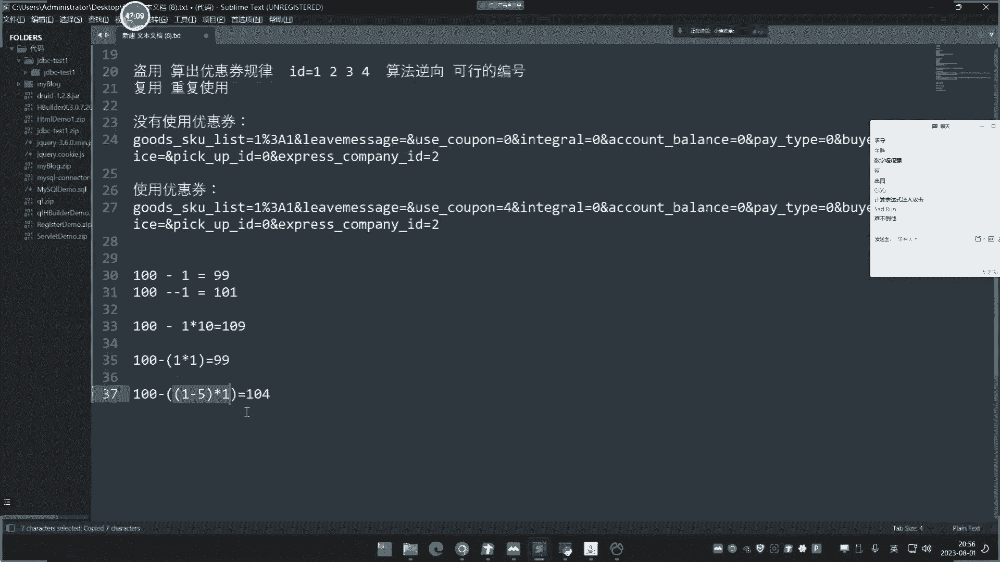

那写这个字呢，就这是你写的，在这里面就写这么细是吧。

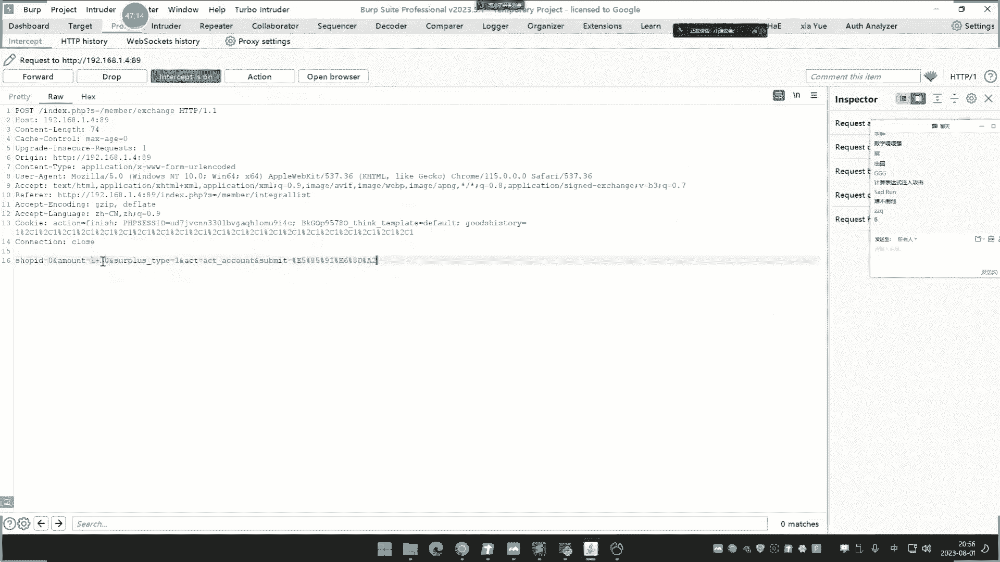

就说这是我的猜测，对不对，看看是不是这个情况诶，它传入进去了，本身呢它是这样去写的是吧，本身是这样写的，是它原本的值，你这里面有计划存这个东西了诶。

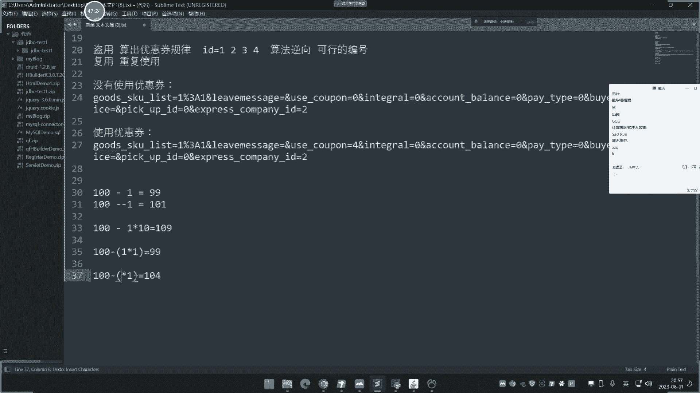

他就进行换算，就按这种逻辑去算了，这个具体要怎么写呢，你要去猜测去分析的啊，就这只是我个逻辑上面一个推推测，就如果说不能写复制的话啊，我这样去写，或者说我搞个除法都是可以的，甚至说我搞个这个追打值。

就是我搞些乱七八糟的，那比如我写个什么音，写这个东西过去，那他会是什么情况，那我也不知道，所以放不出去，他是约换成功的，变成了零，没有约化哈，写了个乱七八糟的，变成了个没有约换的情况。

那这里呢具体你还是要看待嘛，啊看呆嘛，那个逻辑是怎么三这个几分之怎么去减啊，怎么加的啊，这个就不是我们说的事情了，简单来说呢，从这个案例上面呢，大家看到的啊。

就是针对这种，有些呢是算法上面的一些差异性啊对吧，你自己呢要学会思考的啊。

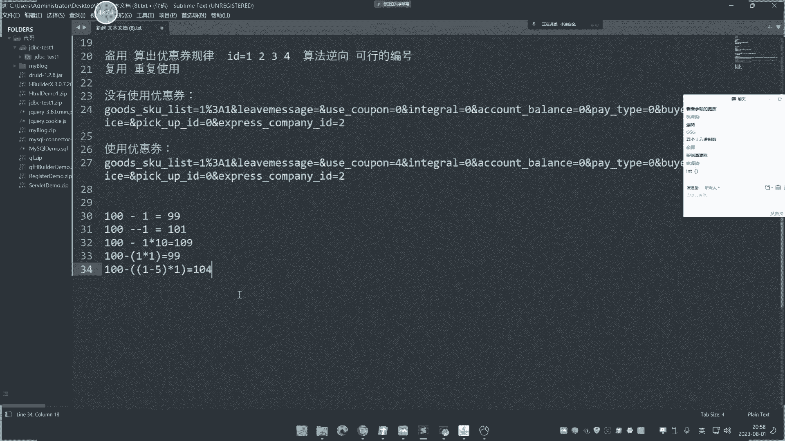

这个好好理解这个积分对冲的这种思路，应该不难理解吧，这没有什么，待会咱们成的漏洞是吧，主要就是和我们那个数学逻辑一样的啊，怎么让这个递减的东西再变成递增，看看余额变动情况，余额变动情况说白了啊。

我们的不想说的，你要看这个，你看啊余额变动情况是对应的，他这里呢有个类型，这个类型还可以做文章，啥意思呢，你看啊，就是我们这个换算呐啊换算对我换算，我换算他啊。

那他这个叫s u p plus tape1，这这里是啥意思啊，哎这还有个叫sure id，你这其实都对应一个意思，啥意思呢，举个例子啊，有可能这个一对应的就是积分到余额，或者说这个是super id的。

它对应的是积分到余额，啥意思啊，这个数据包其实就是说你要玩LOL的时候呢。

你要关注到每一个参数的一个对应的一一，那比如说这个值啊，这个我们看出来了，他是这个更换的是吧，积分数就是兑换的这个积分书，啊就是你换多少，对不对，好拿这个看到那这里呢，像这个super id。

还有这个什么鬼，s u r plus top是不是又代表什么呢，还有个就是这个ACT，那这个呢还好理解些吧，这个SPUTE那就提交了一个值，那这个呢这两个可能其中一个就是什么不说了。

兑换极值就是说是积分刀余额还是余额，刀积分就可能是这么个逻辑，感觉是这样的情况，修改id应该也有可能是这个兑换逻辑，就零代表是几分到余额，一代表是积分到余额啊，余额到几分。

你要关注到这个每个点来自己去猜，你可能说我改一下试一下，黑河中女士肯定是改一下，试一下，是不是不是按照你那个顺序逻辑思考顺序来，白和中肯定就看大A码了，那具体这两个对应什么意思呢，你要看大A码分析的话。

看大码这个代究竟是几分到余额，还是余额到几分，这改不改都无所谓。

你改他有什么一，那就改改成一改一呢，放看有没有换算的是吧，这都是你车的啊，啊颠在这里呢，你看没反应啊，页面错了啊，说明这里呢，啊有点问题啊，还是那个七九他没有任何改动，那就刚才那个时间没有任何改动。

改了之后没反应，那你可以再改后面的啊，这我只说一个猜词啊，你在实战中都要去猜每个值的那个对一，你比如我把它改成零放出去，然后他兑换成功了，你看78，但是还是正确的嘛，那那个一和零就有啥意义呢是吧。

这个就要看那个东西了啊，要看代码决定了，我就说一个意义啊，你在实战中要分析每个参数，好这就是我们这个本地案例呢给大家演示的啊，从这个数量啊，价格呀，包括订单对冲啊，这个替换啊，优惠券呐，盗用服用啊。

积分上面的这种换算算法呀，还有这种积分的这个逆向，其实就是积分的互转嘛，就说他的上面那是只有这个什么，只能换算这个鬼这个金额哎，你能不能金额换算成积分呢，是不是就刚才那我们就把积分加上去了，就是吧。

就这个意思啊，好那这边是我们进行分析，我们来看一下啊，还没有其他呃这个字符逻辑的一些技巧呢，有的啊，这是讲SRC隔壁培训什么几千块钱的，多少钱的啊，就是讲这些东西爱你啊，我给他看一下，这个安妮啊。

包括还有像什么支付的方式的更改，都是可以的啊，啥意思呢，你比如说像刚才我们去购买商品的时候，来给他看一下啊，然后购买商品的时候大家看一下。

这东西没有讲，但是一般实战中这种东西比较少，所以说没有讲提还是要提一下。

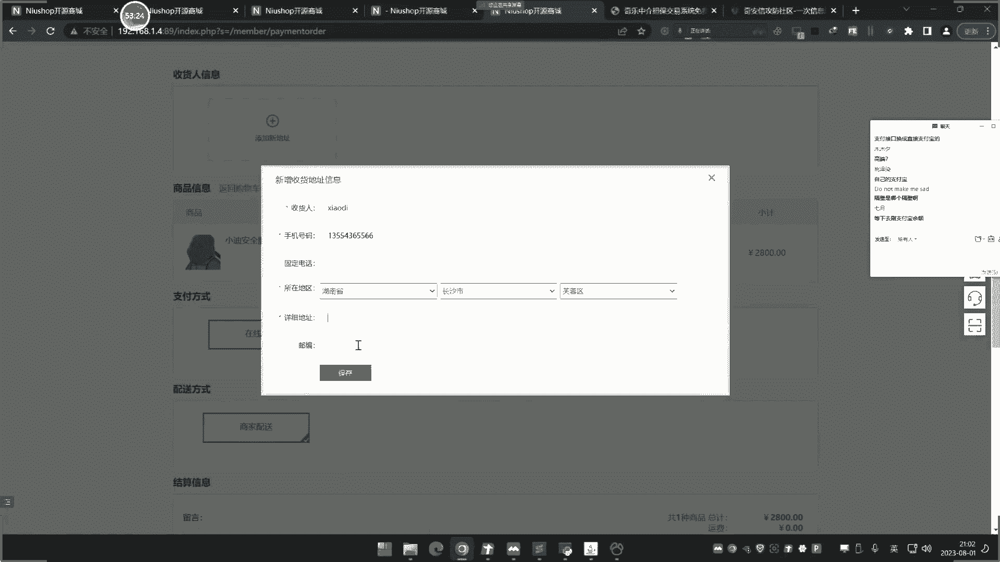

好比如说在这里购买的时候，我们来看一下这个这个购买的一个流程啊，点击购买购买之后呢，这里产生了个编号，然后你看一下啊，这里是那个产生那个订单订单是吧，然后呢再放出去啊，这里呢有产生名单。

你看他请求是这个什么鬼东西，好好好，这里选择呢，比如说你选择微信是吧，点击微信支付好，你看数据包啊，我们看数据包点击确定之后，你看他的这个叫index s等于w a p p we cut，微信支付。

如果说这里能够调的是其他接口，我把这个值改掉，我改个什么哪里，可是吧，我说这个地方的能重定向，我把定向到自己的这个字符结构上面去行不行，所以这些东西呢都是属于说调换结果，就是啥意思啊。

就是业务到机到这里的时候，哎他会调用这个自身的结构好，那这个代表自身结构的一个地址的配置，这个时候呢你把它改成其他的，或者改成自己的，看看能不能调用，一旦调用呢，唉他看变成支付宝了。

意思就是说我更改他的这个付款的接口，就他重定向他自己的那个就是我们后台里面吧，后台里面有自己的那个设置配置，对不对，然后呢他如果说能够自己重定向的话啊，你重定向自自己打进结果上去，那就说自己付款给自己。

然后再给他返回这个成功的状态，或者说我可以搭建一个和他一样的商城，用同样的程序是吧，我把那个接口呢，他付款结果呢换到我这个接口上面去啊，我同样以同样的那个返回值给他。

这个就是看他自己配置那个支付接口的时候。

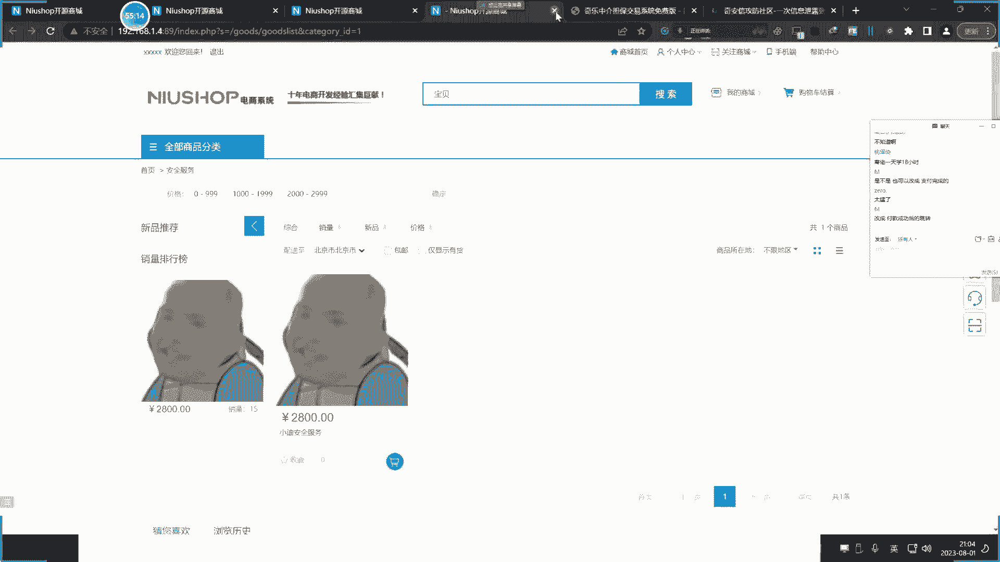

是否是吧，验证的完善，但一般这种事情呢，说实话啊漏洞比较少，而且很难测试，很难测试的原因，第一个是这种接口，现在我们搭建不了，因为打这种支付接口，说实话啊，现在做不了，他要企业。

而且现在都是打击这种洗钱的，所以这种结果很难的打击啊，然后这一块如果说出现安全问题，那说实话啊，那就是打高位了啊，虽然说他不会涉及到，会危害到网站什么鬼源码安全的什么鬼东西，但是你想想想啊。

这涉及到钱的事情，你钱跑别人那里去了，这个肯定就不是说小事情的是吧，所以这块的安全问题呢比较少见，也比较难测试，所以我没有说怎么可以提提它啊，但是测试的方法封面是有这种测试的啊。

就是把那个调用的时候啊，那个接口那个地址呢改成对外的，就是对外是你自己的啊，就是先付款的，跑到另外一个付款地方去了，咳好，我们来看一下这个实战SSRC里面，那些挖掘案例啊，这都是挖这个SC的啊。

再点进去看一下啊，啊举了这个。

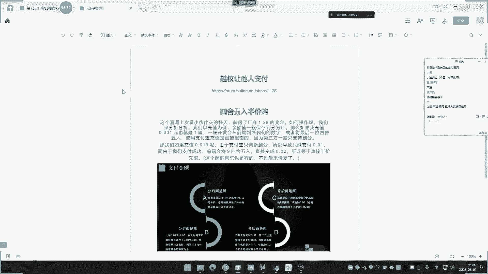

五个妮一个是越权让他人致富。

这是啥意思呢，越想让他人支付啥意思啊。

其实也非常简单啊，看一下啊啊这是一个类，应该是一个app的，或者是个小程序里面东西好，这是个界面界面，这里呢啊他是一个积分的，去约换一些产品的是吧，采用这个积分的去约换一些个人产品的。

然后这个时候呢他做了个什么事情呢，就是圆环一个产品在这个数据包里面呢，他也找到啊，他还找了个什么信息啊，找了个open id，后面id呢就是个人的id编号，就像是你这个人的，他把他替换成了这个什么。

其他人的编号去约还这个产品，结果呢就形成了个什么，就相当于啊让别人的积分去替换产品，能理解吧，他这个就是属于言传的替换，就是本身呢他自己是没有这个几分的，他几分为一是吧，没有积分的，他去约换产品的时候。

知道自己的这个open id，要知道别人的欧派一对不对，那么在这里呢他去约上场，然后把这个像是说你在约会的时候，对方肯定知道是谁在约会呢，在数据包里面呢，它有个open id，对应这YY定义。

就是对象随便换的，他就把这个值能改成别人的，那么别人就说几分勾的话，那就越换累，所以呢他就用别人的积分帮自己变换，就这个意思，这里写上武汉市洪山区是吧，大家说一下谁呢是吧，写这个文章呢人是谁呀。

是不是小迪呀，其实说白了啊，这些字符逻辑啊，包括这些东西上面的安全问题，你会发现全部都是做了什么事情呀，都是对这个数据包里面的值呢，哪个修改这个修改什么数量的值修改呀，价格修改呀，编号修改呀。

产品属性修改呀，都是修改这些乱七八糟的，有什么是难理解的呢，反正一句话，就是你自己呢把你实际情况呢往往里面掏思路，往里面掏，你觉得这个参数值是什么信息，他这里核心点他怎么把思路转明出来。

这个漏洞是怎么挖到的，就是核心点就是他知道了这个open id是他自己，就是open id代表的是你个人的身份的一个id值，然后他在约换数据包的时候，发现数据包里面带有这个id。

那么这里就可以理解为约换产品的时候，他要知道你这个产品对象是谁约换的，那么他就以这个id值为准，这个时候呢他就把他自己的地址替换成别人的，所以就往系统以为是别人在替换，在约换，就是这个意思啊。

你说这有什么好难理解的，那啊这五被抓包了，理解呀，他这里就是一个思路点，就很简单，一个思路点，什么思路点呢，他怎么知道这个open id是我个人的这个信息呢，你看他前面写了很多东西。

他说从数据包里看看到open id泄露，这里泄露很多IP，为了方便我就只了截了一个是吧，他怎么看到呢，就是通过数据包里观察，观察到一些返回信息里面有一些什么open id，我们id呢就是打开id。

你说这个东西和什么相关呢，那肯定就是id嘛，就是肯定就是哪些东西的一个编号是吧，然后id后面呢有一个呢叫like name，Like name，就是什么名字真名，那涉及到名字，那就是用户啊。

那用户里面有个open id，你觉得这个欧派id是啥的，那肯定就是和用户相关的编号啊，啊刚好这个go啊里面，那就有这个月换的时候有这个O派id，那肯定这就是你用户的个身份的标识，替换它就等同于换了身份。

所以这个漏洞能挖到，就是对方挖掘这个漏洞的人呐，他已经把这个open id呢理解了，或者说他已经假设了你挖不到的原因，第一个是在数据包里面没有发现open id，第二个是open id，即使你看到了。

你也不知道这是啥玩意，就这么简单，这个逻辑漏洞说白了啊，没有考任何的一些安全方面的技术，或者说代码层面的一些知识点，因为代码层面的知识点呢，说白了啊你要理解的话，一般做安全开发需要理解就是搞修复。

你挖这种漏洞，你靠的就是一个逻辑思维，靠的是逻辑思维，就是怎么去，说白了你会不会好养猫，会不会买产品，一般会省钱的人，非常节约的人，他对这种逻辑漏洞他就玩的好，我举个很简单的例子，那我记得我就是这样的。

对不对，我比如说我晚上我点外卖点外卖对吧，我先去外卖上面看了一圈点日子产品，然后呢我这个点外卖外卖，大家都知道美团呐和饿了吗，以前呢我就在美团上面点和饿了吗，上面点我点完之后呢，我就看有没有红包是吧。

红包呢有各种渠道获得，一个是官方的，哪里是吧，还是在是活动，再是自己充值啊，开会员送的红包和，反正就是各种各乱七八糟的啊，以前的我就说哎呀，在这个平台上面有没有红包到哪个红包多。

我用上去看下价格划不划算，现在呢我还学会了是吧，看平台了，我还看平台了是吧，我是说统一价是店家是吧，在这个饿了么上面我搜收到这个商家的了，我再到美团上面再搜，我把它全部一看，看在美团上面点便宜些。

还是在饿了么上面点便宜些，然后呢我还做做这个红包上面的差异对比，知道哪些地方能领红包，还有一些网上，还有一些这个领了红包之后还能返圈，还能返那个提点，那是一些这种商家给这种官方的提供的活动。

就是为了触发这个外卖量，订单量嘛都是一种出法啊促销，所以说呢你自己有这些想法，而你就会知道哪些地方对不对，有这种有这种优惠啊，或者怎么滴，那么这个漏洞呢也是这么个情况，也是这么个意思啊。

我举这个例子就是说这个意思啊，你自己要思考他哪有什么鬼，这个地方的是吧，哦这个是这个越传的是吧，你们你们看，那还有人说这个什么安卓比苹果还便宜，你说是不是人人就是会薅养猫就会搞这种事情，还能叫死舍无。

这个呢也是一个新套路，以前都没有听说过的，但是现在的高端课程是要和隔壁SRC的，等价前去啊，我们也把他锁一说，你不要说啊，我这里没有案例跟你讲啊，啊隔隔壁讲的好啊，我跟你说。

没有人会实战去把一个漏洞给他挖到了，给你现场看，现场演示都是用PPT，或者说用这个图片给你说，给你讲，你还准备这个是吧，花个几千块钱，别人带你实战，你想多了吧，你，他就是看谁讲的好不好了。

你能不能听懂呢，你不要想着说哎呀，你怎么花2000多，隔壁7000块钱，8000块钱，1万块钱是吧，那个绝对比你家的好，那你去花七千八千去试一试，试完之后是吧，看是什么想法，这个呢是那个45度搬家工。

这个是个什么呢，这个是其实就是支付平台的一个配置，或者说一个信息的一个一个差异，啥意思呢，我给他说一下啊，你看这个以前别人提交过啊，提交补贴获得了场上的1。2K的奖金，就是1200的一个奖金。

如何操作呢，这个一般如果说你用支付宝充值，或者说用微信充值的话，他都会有一个失手，啥意思啊，就是你充值的话，他只能精确到分，就是0。0多少，不可能是0。00多少，能理解吧，就说你用这种支付宝充值啊。

或者说微信充值，比如说你充0。0001，那么它没有，它只有0。01，只能冲，这么前他就精确到分，没有后面的小数点了，是这个意思吧，好大家思想想啊。

然后你看下这个图片啊，是什么一个逻辑呢，业务在忽略分后面单位之后呢，比如说现在啊0。0019，我在网上，我要冲0。0019是吧，在支付的时候，由于客户端呢传递给这个第三方支付。

就是支付宝或微信这种微型呢，他也不识别这个啊分后面的单位，所以它就变成了0。01，它就变成了0。01，也就是说呀你现在就是用0。01，去冲这个这个金额，但是在目标网站上面呢，他是个0。0019或者0。

02，如果他四舍五入，那就是0。02，如果它原本显示，那就0。19，其实他就是借助了这个第三方支付的，一个到分的一个过程，能理解吧，因为支付宝和微信他只接收到分。

这里他不可能后面这个九呢还能给你再冲上去，他没有这个东西啊，要么0。01，要么0002，没有什么0。19，所以你冲0。019，这个订单拉面显示就是0。010。02，那就是0。02。

所以你看一下这个截图啊，这是那个挖漏洞截图，来我的这个上面的金额为1。04，大家可以看到可用于购买自营商品，啥意思啊，自营是哪个的，京东的，这是京东当时报的一个漏洞，获得1200的奖金。

从此你看他充的钱啊，来充了一块钱，充了0。01，充了0。1，结果这里显示的00020002，我的结果呢就变成1。0。4，应该正确的这个金额应该是1。02，应该正确定的是1。0啊，刚现在变成1。04。

为什么呢，就是啊我充值的时候我写的是0。019，然后冲的时候呢只能充一分钱，他接触的就是你在付款的时候，他不能精确到后面的小数点，所以他只能进到前面的，你付你创0。019，它也是0。01。

好不好理解这个东西好不好，讲完之后就这么个事情啊，这个1200的漏洞就这么玩的，京东的一个app里面一个漏洞，在当时的啊阿里面点玩的1000万。

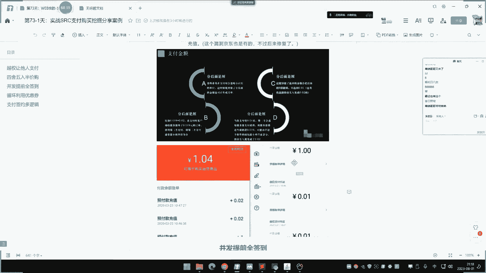

它造成的危害就是能够是吧，重复多次。

这个金额就一直在后，好这个再说，并发提前签到。

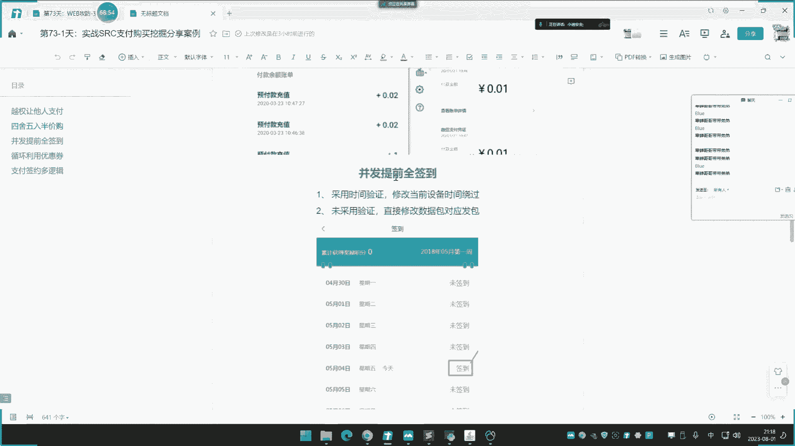

大家都知道啊，在我们购买这个商品的时候，很多网站都有这种签到这种奖励是吧，你签到送多少积分啊，送个什么鬼东西，你反正就是和你这个有优惠的一个事情，挂钩是吧，大家想一想啊，首先签到是每天只能1000。

签了就没了，你不可能说哎我今天签了是吧，把后明天签了，后天签了，那别人还设计这干叼啊，那他妈的还涉及这鬼干嘛呀，他肯定是个限的，今天签今天的，明天签明天的，他就是让你每天来，每天都进来。

他才有这个消费的这个可能性，这么个逻辑吧，好大家想想啊，一种情况，这种千刀的怎么薅它呢，既然他判断时间，你想象下吗，时间一打开之后。

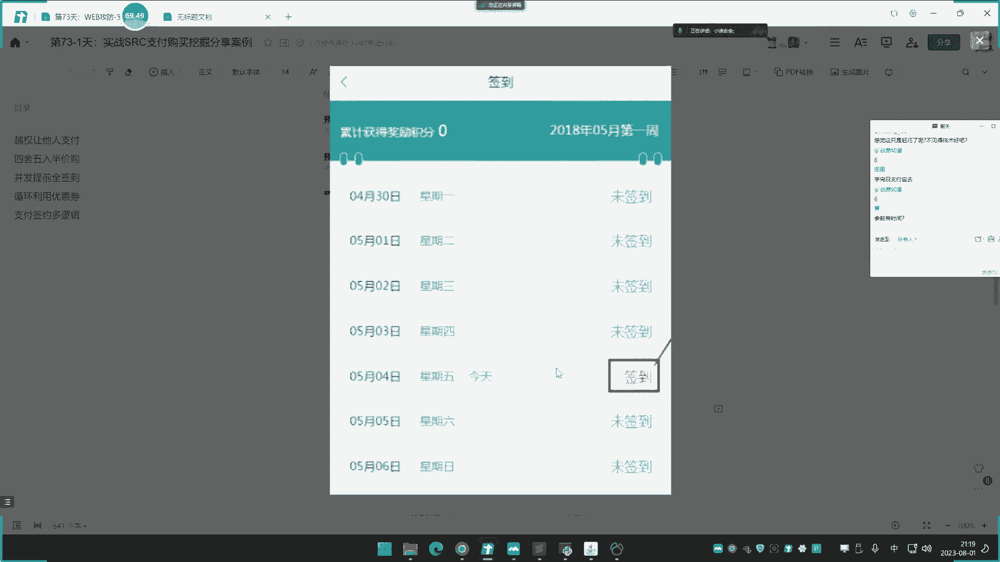

它对应假如今天是我们今天是8月1号啊，只要签8月1号的，有两个方式时间验证，你就直接把你当前的设备时间改一改一下，改成明天你再打开看一下，会不会他就是让你提示签名签的时。

所以你就可以一次性的把所有的签到给他签了，那么一次性的拿到签到的奖励，还有一种就是说压根就没有验证。

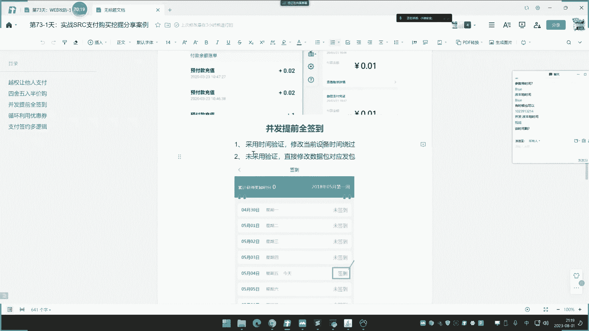

没有验证怎么办呢是吧，直接发数据包，就是说可能参数里面传递的是0504，然后来点签到之后里面有个054，你把054呢改成050050506，哎，那是不是又会把这下面两个签到呢。

这个呢具体要看数据包有没有这样的东西。

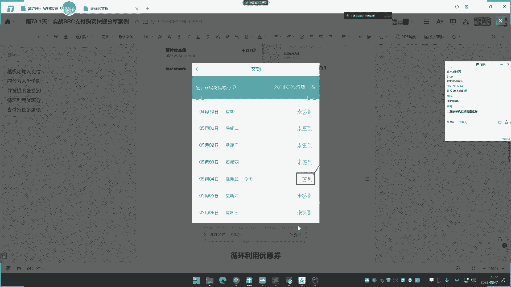

就是利用前导的那薅是吧，把签到奖励全部拿到，则也是一方面就是类似的所并发的意思，同时呢去不断发这个签到包，会不会把所有东西都签到，或者说如果说有这种验证的话，更改当前设备时间来看一下。

是不是以你这个当前设备时间呢，来对应这个签到时间，还有循环使用优惠券，这个呢说实话都可以在我们案例那去讲到。

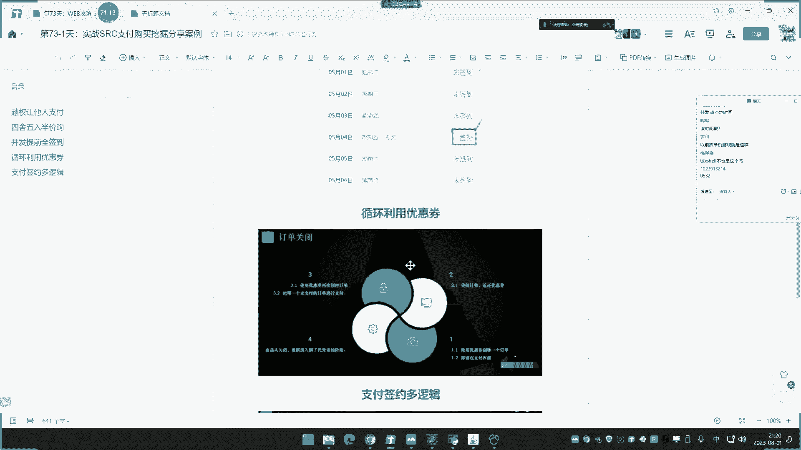

什么叫循环流互相呢，你看啊他这个逻辑啊，先使用优惠券创建这个订单，好在这里好吧，先用户下创建一个订单，停留在字符界面，把订单关闭，诶，右下就返回来了是吧，大家都知道啊，那你使用右下那里创建一个订单。

哎你现在不支付了，订单关了，那右下就还是回来了，就说你没有还使用这个这个pd啊，然后呢这里说使用优惠券之后呢，再次创建订单，把第一个未支付的订单来进行支付，啥意思啊，那然后重新打开。

重新进入待发货的阶段，这啥意思呢，这个好简单也不难的呀，就是说呀你先用用权创建一个订单是吧，然后呢你把那个右权呢给他，先关闭右权，反对你了，再回过来了，这个时候你再创建一个订单。

再把第一个未支付订单进行支付。

那么就相当于在这个过程中，就在这第三步核心关键好，你可能会有疑问，什么疑问呢，来我们来看一下什么疑问啊，这第一步啊，先创建订单，关闭了哈，返回了是吧，然后呢你可以说哎呀，这里又用又想再创清单是吧。

第一个订单为支付，那你可能会问这个问题，说哎呀嘶那里第一个，既然这里要进支付了啊是吧，进支付了，那这个右上就没了呀，那何来id又想再创建订单呢，你要看一下先后顺序吧，先后顺序。

他先把你这个返回的订单创建了个订单，然后再付第一个款，啥意思呢，就是你的订单已经创建了，那个订单是减的金额，再把它关闭，订单重新再返给你，你再用这个订单再创建一个订单，再去支付第一个订单。

那么他就把第一个来了，那个右传单再重复使用，能理解吗，就是先后顺序，因为他到这一步的时候，这个订单在支付时候，这个秀权就没了，但这个右下呢又创建了个新的订单，那个新的订单呢像是有享受优惠券。

那不就是优惠券的重复利用。

就是让你销毁之前，我先把你搞搞定，你们说不是关闭了吗，关闭还可以把激活出来的啊，重新发货，关闭激活，大家看那个订单那个逻辑了啊，有些是关闭之后呢，能重新再发货出来，我不知道大家能不能理解。

这个这个订单的这个循环。

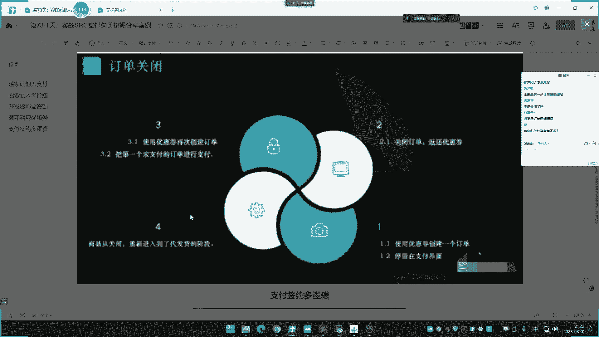

利用这个思路，那我们拿我们这个本地案例举个演示啊，你看，那这里我们看有没有用上的哈，好这里有个右上啊，我们连购买，啊这里有个右下是吧，我们要选中它了啊，已购买提交，好好等下改下好。

那现在呢我们看我的订单啊，就是个刚才也是有右向的是吧，你看我们现在看我右向啊，假设没有右下呢，这没有右上啊，空的，这个时候呢我把它关闭关闭了，关闭之后我们再看右选啊。

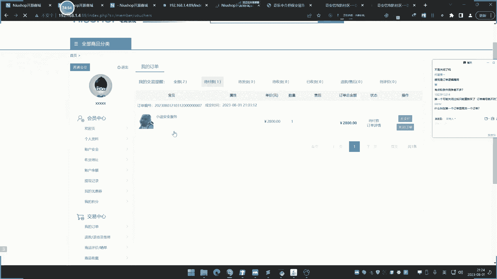

他又回来了是吧，然后时候呢这个时候啊我就再下一个单。

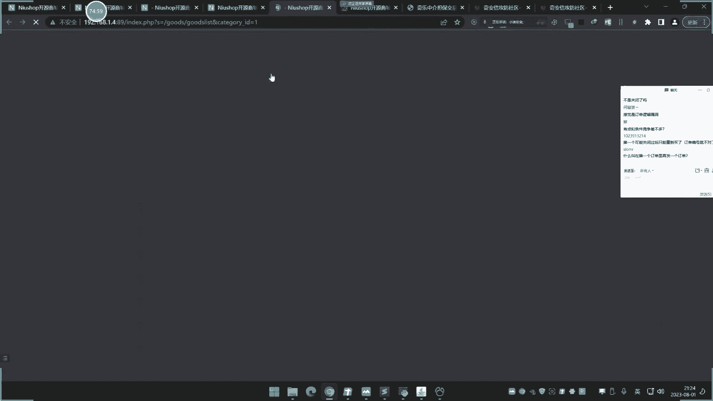

因为他回来了，我就能重新再使用这个优惠券了是吧，重新再来使用这个用回来，然后把这个优惠价呢给他搞出来，这个时候呢对不对，我再找到我的订单那里是吧，这是刚才已经关闭的是吧。

这个地方呢它关闭了就不能再搞了啊，那如果说有些网站这里关闭之后呢，还能继续是吧，再把开起来，那么这里就有安全问题了，能理解吗，他就这个逻辑啊，就这么个逻辑。

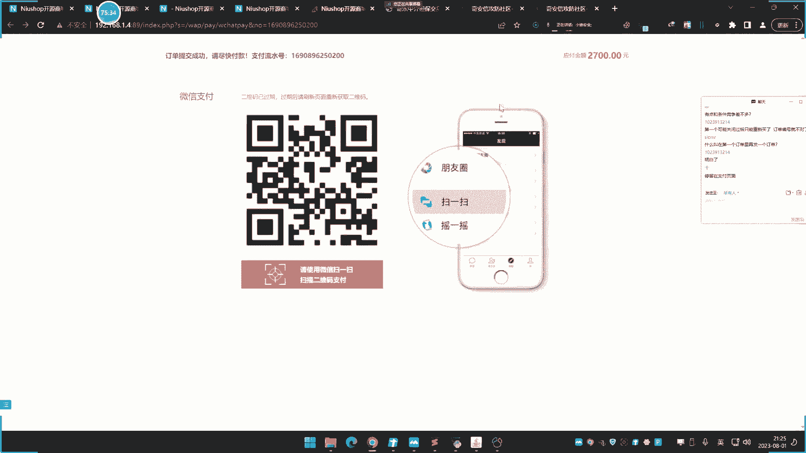

就先把你的优惠券呢给他释放出来啊，先给他释放出来，然后呢我再用这个地方呢再创建一个订单，那我再把第一个支付地址单给他支付，对不对，其实就是说第一个字定字符呢，想用上这个使用右户上订单也要享用右上。

好这个再来说这个支付签约的，支付签约的呢，也是SRC里面天天吹的一个漏洞是吧，什么冰发S什么圈圈，说的尼玛高端的要死啊，对不对，其实呢是个啥东西呢，大家都知道你有时开什么腾讯会员呐，QQ会员。

音乐会员呐，或者什么鬼乱七八糟的一大堆会员，他都会有个什么鬼签约的一个视频，就是说啊在那个支付宝微信上面付款的时候啊，签约一个合同，那么下一次下个月首任他帮你自动续费，说白了他搞这个前面的。

就是在你不知情的情况下，是啊你一同意呢，哎你可能下个月没注意诶，他你妈的都给你，直接是么，去飞了，对不对，就这么个事情，然后呢他签约就有个好处，你不签约的时候呢，他假如说是20块钱一个人。

你签约了可能就是十块就少一半，所以呢大部分都会签约，有些签约的不知道一签约他也没再把它关闭，导致呢过了一个月自动续费了，大家都知道吧是吧，你只要开过这种什么鬼QQ会员的，什么音乐会员啊，或者一大堆的啊。

都有这种鸟毛事情，然后呢这个前面是个什么安全问题呢，啊他是一个什么逻辑呢。

啊看一下啊，他说了，使用A手机登录A要开业务，在使用B手机呢也登录A账号的也要开业务，然后呢A手机呢点击进行签约，A手机支付完成之后呢，再到这个里面去解除这个自动续费，然后再用B手机呢再去支付。

再解除支付费，啥意思呢，说白了这个签约闹钟就是换了个手机，换了个设备而已，就是别人判断你能不能签约的一个情况，一个是基于你是不是他的签约对象，一个基于你是不是另外一个设备，那你可能说这有什么影响呢。

影响就是一直使用这个签约，导致这个价格呢就一直开下去，就比如说你签约了一次，你的时间是从这月8月号是吧，8月1号到9月1号是你的一个月的会员期，你再签约第二次，不是不就是这个9月到10月了吗。

你签两次就是两个月呀，但是你签约两次的价格是多少啊，就是永远的签约的第一个价格呀，因为我们都知道啊，签约他一个逻辑是吧。

你这个签约好之后，比如说签约第一个月是15块钱，那么后面正常续费二十二十是吧，你呢就是说相当于说你在这里啊，你签约一次的时候，两个月的这个费用应该是30块钱，对不对，就10+20。

但是这里呢你这个签约啊，你画了个东西就是10+10派，两个人，就是两个呢就80块钱，对不对，你可能说哎呀，那你妹的我先签约了，签约之后，我下个月我再签约，不也是20块钱吗，话是这样说。

但是你要想到这个签约不是什么时候都有。

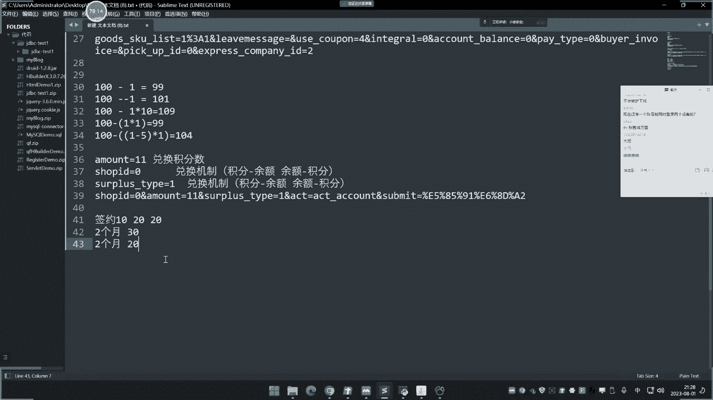

而且他有一些用户呢，他没有这个东西，知道吧。

他这个前缘啊，说白了啊就是什么一个逻辑呢，那这是他逻辑正常逻辑，新用户优惠下单收到这个订单请支付，然后呢是吧，设计单充值会员啊，发起支付，非新用户呢就下单失败了，就返回金额，对不对，所以新用户就成功。

他怎么办呢，下单收到了订单支付界面啊，那然后再换一个手机下单支付界面，然后呢就开始其实就是说啊换个设备，不如把这个签约的呢答疑为成，你是另外一个人，但是你们都操作是一个账号。

就像是那个呢制完成之后解释签约，你再用一个手机呢再再开一次，有什么太大难度。

那没有什么太大难度啊，这里有解释啊，自保和微信同时打开签约界面，这子线圆线笔线切圆圆形，现行签成功之后，然后微信里面再取消签约，然后再到支付里面再点击签约，这个企业发现了成功续费两个月的低价会员。

因为签约第一个月的会员是最低的，这是签约漏洞，就凡是有签约的，像什么百度网盘的，还有什么鬼，腾讯会员的很多啊，都有，要你不签约，价格就正常价格，签约就少一些价格，然后呢，但是签约只有一个月的生效期。

就是那一个月是那个价格，下个月就正常价格了，所以他这个签约漏洞，就是直接怎么样搞两次或搞多次，让你开三个月，四个月，多个月的时候，价格还是一个月的那个倍数，就这个意思啊。

这个漏洞搜嘛当然收啊，其实就是看他怎么去判你是不是签约对象，这个意思啊。

好然后呢我们看一下啊，你比如说像现在我们那里有个真实网站啊，这网站你看啊。

这个交易的网站点一下啊，要注册个信息啊。

在哪里，这也是个紧急的啊，交易啊看一下啊，打个包1100的交易价格额，卖家支付一千一四十，卖家获得1100啊，总结了抽33块钱，抽三个点好，我们来点击点击法交易好，这里有个叫价格为1111。

然后白嫖白嫖就什么买入的金额，买入金额是11443，卖家的得到金额为一，中间的抽33，很简单的道理，因为你选择了这个什么卖家，全部手续费为三个点嘛，手续费就是光家自己收的。

然后这个时候呢我就把我买家金额我改成了咦，一把放出去，结果变成什么卖家船夫，我支付一块钱，对方收到1100，所以说呢这个东西啊你自己要看实战中的话，看各种数据包有还是没有，有的地方尝试修改，看对应关系。

你可能说在实战中连你妹的是吧啊，搞一些这种网站，连什么数量啊，价格都看不到，没有那个参数，那没有你就不找那个思路了呀，你找其他逻辑呀，找什么优惠券上面有没有问题，有没有优选的附庸，优选的盗用啊。

没有又想找积分，积分不行，找千刀千刀不行，再找什么签约是吧，就是各种乱七八糟的一堆，找简单来说就是我们这一束花啊，王不知道他的这个支付逻辑，说白了自己呢会不会猜，能不能把这个值里面的数据包。

里面对应的这个信息啊，拆除对应的地方，哪个代表是金额，哪个代表是余额，哪个代表是优惠券，哪些代表是什么东西，裁好之后呢，就来整真逆猜是吧，优惠券编号这个金额是哪个账号信息是哪个啊，很简单的道理。

像刚才我说余额选支付就是拆到账号信息是吧，你自己账户上面没有那个几分去约会，你把账号改成别的的，搞成别人的，那不就是别人在约会了吗，用别人的身份去约换，是不是，所以说这些东西呢都要靠想的啊。

我们这个讲是讲不完的，案例分析的，再详细，案例分析的再多都没用，欧阳你自己呢在实战中搞那么几次，然后那里挖到过有经验的啊，你就会知道怎么看了，连这个玩具是啊，我都帮你找了。

你刚才有人问说这个图片是从哪里来的，那你管哪里从哪里来的呢，啊我都说了，对不对啊。

你都没看到啊的。

我把这个写上去了呢，这还打码了，帮你打码都打了。

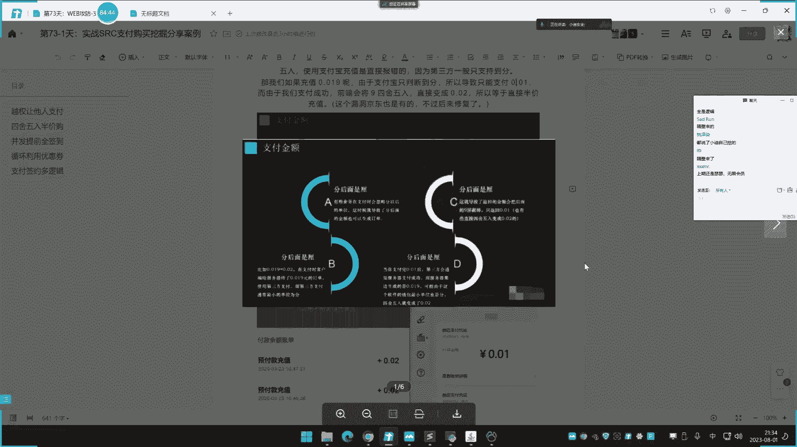

你是从你哪里来的呢，他不能告诉你啊，他马都打了。

上节课是吧，我忘记打码，那个打码那个身份证号码了，我后面都把打码了，泄露了一些人的身份证号码。

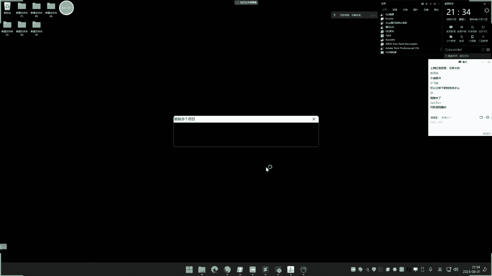

我就怕有些人乱搞是吧，安心的要死，我打后面那就重新打麻。

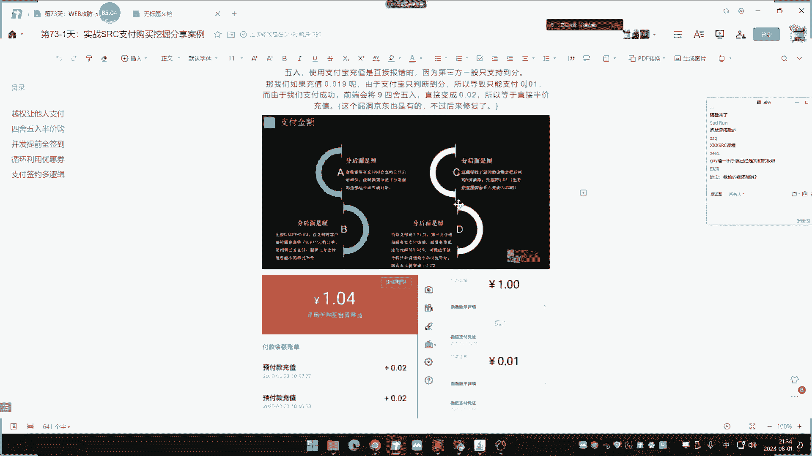

还没讲完啊，还有很多知识点啊，这个这个业务逻辑的啊，大家都喜欢听这样的课，原因是因为呢他和华东呢，瓦懂为什么喜欢挖这种漏洞呢，先简单好理解是吧，而且好多地方都能测啊。

不需要太多的一些这种代码层的一些知识点，这是大家喜欢的原因啊，也是说挖漏洞的，因为你直接挖了什么什么鬼猪路啊，那漏洞的太难玩了，所以就玩这些漏洞，这是SRC里面经常提起的一块知识点是吧，教SRC的都学。

都教这些东西，简单啊，易上手，又和瓦懂相关，哪个不喜欢呢啊今天就讲这么多了啊，然后呢这是我给大家写了一张整理一张图片啊，这还没写了一些啊，其实这个呢还是要根据实际对象，就是你要知道啊，你在哪些地方呢。

会碰到哪些情况是吧，商品本身的一些属性的价格，数量上面的修改导致的营销手段，什么优惠券啊，签到奖励呀，或者说无限私用是吧，有些这种产品的能适用，然后你要分析吗，那既然能适用，他肯定有个时间限制啊。

不可能说你妈的一直试用啊，要到哪点的时间结束了，那你就分析他是怎么判断这个适用这个截止呢，这个时间是是时间判断还是什么判断呢，对不对，你尝试找到那个逻辑把你更改，那无限试用不就得了吗。

这也是好养猫啊是吧，积分约换优惠券，说白了啊，就是你要去以一个，你是站在你设计这个产品的观念上面，你设计这个东西的一个观点上面，去分析对方会怎么做啊，然后呢你尝试性修改，这样子呢你才能挖好洞啊。

才能玩好这种类似的洞，呃其实任何字眼都是这样的啊，你自己下去呢要多想，多多考虑，课的内容是讲不完的，因为这里我们讲的知识点，都还是说从网上流传出来的一些这种测试手段，而且网上的文章的参差不齐。

一大堆的东西，那个说全了，这个说一半，那个说一半，你也没办法做到这个把所有字典都整理进去，而且这里肯定是有些人呢，还私藏了一些另类的一些挖掘技巧，他没有分享出来，因为它分享出来之后，你你你就能玩吧。

就这么简单的事情，所以说还是要靠自己的去玩一些这种东西，之后的子女总结一下这种是吧，另类的一些技巧，所以这句话说的非常好啊，你多去想象一下开发者没想的地方是吧，什么算法拼接。

就像我刚才说的那个积分的那个算法，拼接那些东西是吧，讲了个算法啊，什么复数啊，形成一个对冲的情况啊啊等等啊，嗯你了解好这个字符的整个流程之后呢，就要想啊，你把怎么去学它呢，就是把流程的规定好。

选择商品和数量的时候，哪些地方能修改是吧，然后在这个支付金额最终的换算的时候，有哪些东西会影响这个金额，优惠券积分是吧，哪个地方能又能影响这个金额，再融资金额上面做文章啊，订单产生的时候。

怎么这个让订单成功不付钱，就是更改状态呀，或者用低价买高价的呀，啊，这都是属于针对各个流程上面的，一些操作思考啊，就是了解整个购买商品支付流程的一个顺序，从每个顺序上面来想，哪些地方能够优惠。

哪些地方能够折扣，哪些地方能薅羊毛，再从哪些地方入手，在入手的时候，要想象一下对方，如果说检测他会是怎么个检测逻辑，尝试绕过，想好了啊，这个事情就好挖好，就说这么多了啊，今天课就讲这么多了。

我们下节课那就继续商，关于这个状态和这个什么鬼啊，就是类似的一些接口上面那些接口，接口状态的一些验证的，一些逻辑上面东西其实非常简单啊，就是我们说的这种返回包的更改嗯，会讲一些啊。

就像接口枚举啊这些东西啊，下节课的内容是哪些啊，这节课呢就说这么多了啊，大家看一下有没有什么问题啊，有问题就问。

有问题我就瞎啊，艺术挖掘咋整，一出挖掘是靠运气的，不是能够一定程度啊，艺术玩家其实就是看那个，就和那玩艺术漏洞一样，得搞一个那种打字，或者是压根就不是一个类型的值，给他看他是什么反应，他有可能成功。

有可能就直接崩溃等等一些情况，就像我们说的啊，数量那就是数字，你搞个什么英文单词进去啊，中文单词写进去，把它数量一替换，你看他是什么反应，对不对，这个要看对方的那个代码的处理逻辑才决定啊。

起码今天这个骑士金额发生啊，期重叠下这种情况该怎么处理，你问这样的问题吗，你说该怎么处理呢，就好比老问一些这种技术问题呀，就好比你在租的时候，别人提示你非法注入，你问我怎么办，那能怎么办呢是吧。

没办法搬难，你要分析这个地方它是怎么个验证，他说金额被改通是吧，那你不改它，它提不提示呢，不改它它不提示你改小一点，改大一点，他还提不提示，或是你在后面他是100块钱，你改个100。00，看他提不提示。

你要分析呀，比如说100块钱，你说改动呢，它提示这个提交是吧，好那你先改小一点，改小点，改大一点，看他提不提示，改大点，就是你想多肤浅，那谁不允许呢，你看你如果他也提示，那就说明一点了。

他就是确定这个值嘛，判定这个值，那么你想一下啊，我就拿这个逻辑来跟你讲，你自己挖这种漏洞要有思考的，你没点思考，永远这种意外情况你是永远说不完，道不清的。

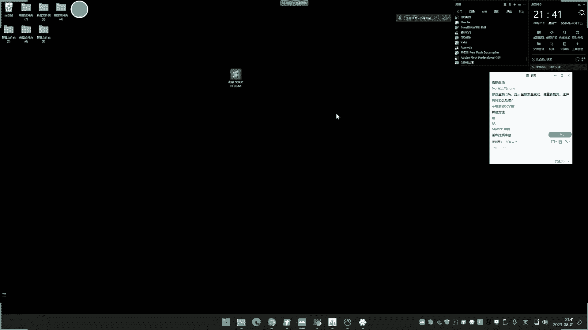

你没有一点节约办法能力是没办法的，你说这种问题是吧，该怎么解决啊，我们这处理下思路，比如你发100是吧，你改了金额，你把它改成零二或一块钱呢，他直接提示这个信息好，那么现在啊举个很简单的例子，改100。

01改改小一点，改成一块钱好，假如说都提示了，那就说这个值它确定了好，那既然这个值确定了啊，那么现在很简单的事情啊，我改个100。0的，我改个100，100。01的，100还是100块钱是吧。

如果改了这个之后，它还是提示，那说明点呢它固定这个值啊是吧，谷五零这个值啊，那是对这个值进行交易的，对这个值进行交验呢，那你就要想想了，这个值他怎么交验的，他不可能你发送过去100，他就交易100。

应该是会有个什么呢，就是在它的当前的提交请求里面有个缓存，或者说他接收到当前浏览器或数据库里面，有个值，要和这个对应对应上才是真实的这个价格，你要想想那个东西能不能照顾了，能理解吗。

我说这个意思能理解决吗，说白了啊，你要想这个东西能不能绕过来，如果说你把你想的方法和你思路都解决了，都还是搞不了，那就说明他非常安全，搞不了，因为毕竟他有这个检测，就是他考虑的这种事情。

那么就是看他考虑的周不周全，你能不能绕过的事情呢，就不是说这个安那个情况了啊，因为他提示这个信息，就说明他考虑的安全，就是看他的验证是否能够绕过对吧，100是商品的价格。

那这个100加个是存储到这个浏览器里面，那个写上去的100呢，还是怎么滴呢，你能不能把那个浏览器里面那个商品，价格审查元素把它改成十块钱，然后你再提交，再把那个十块也和它对应上，这样行不行呢。

他是和哪个做对比呢，还是说和他后端的数据库里面，那个值进行对比呢，对不对，然后他对比的时候还分几种情况啊，是吧，是对比的类型还是对比的什么，对比着整个东西呀，就是我们说在对比值的时候是分类型对比。

还有值对比，还有什么鬼对比啊，就说100呢，说白了对于我们来讲，100点点0米它是相等的，都是100块钱，但是类型不同啊，这个是应用类型，这个是double类型，如果在代码中的话，它需成这个对比是吧。

进行对比，如果他只是取整去对比的话，那很简单，100的取整还是100，100的，这取整也是100对应对上了，你传参的时候，你这样去传是吧，那这样去传对不对。

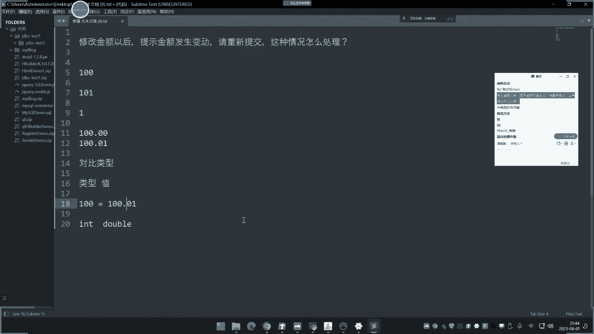

要自己思考的啊，有些东西，那个CPF里面就有这种类似题目，就我们说那个鬼什么，两个等于三个等于那种判断，还有判断类型的，有全部的判断类型值，都判断各种各样的，啊不撸桑不会撸的，我都说了，科永远删不完。

内容也是永远删不完的，就像我今天说的这个科，你怎么讲都讲不完的，他很多一些细节点，你没办法把所有实战中遇上的所有情况，都给你解答一遍，都是通过这个课程，大家听了之后，自己有一些这个不同的想法。

然后呢你在实战中碰到了自己思考过了，那这个字典就弄懂了，你刚才说那个金额被修改提示，那东西那个就是那很简单的道理，我们想抓包的时候是吧，有些人一抓包，我们讲的时候抓的好好的。

然后呢他跑去实战时候抓了个包，炸包的题是一个什么鬼，检测到代理，或者说不让抓包等等一些这种情况出现的，不知道怎么解决了就没了啊，这就是相当于就很简单的道理嘛，就只学了DOON内容。

没有做到这个后期的分析，分析分析和解决问题的能力，很多种情况啊，你这东西是传授不了的，你讲再多的案例，讲摘东西没用的啊，讲不进去的，这都是靠你自己学完知识点，自己思考，自己总结的，讲不完的。

说的再明确都没用，那个巴普shot呀，什么字典文件，我发了很多次激活，我也说了很多次，网上一大堆的这个激活东西，还是有人问，还是有人不会激活，这就是道理啊，没办法解决的，你这个事情，知道吧。

我说你想学好这个课呢，只能说给你铺个路是吧，讲的更好，能让你快速的理解，想深入啊，想学好还是要靠自己呀，因为实战中情况太多了，实战太情况太多了啊。

实战的话就是无非给他提升的解决问题的能力，不是说实战就好，就实战，那你会遇到各种各样的一些问题，然后呢你就学习一下是吧，其他人是怎么解决这种问题的，就学习这种思路，这实战中的一些好处。

微信小程序直接给你个二维码，让你付款，不提交，在状态是不是就没办法了，不提交在状态是不是就没办法了，这啥意思啊，我真没看懂，这说什么不提交在状态什么鬼啊，北京男喜欢B，没听懂啊，你说的。

啧你们说的都是些那种测完之后的一些那种，要么是检测，要么验证，要么拦截的一些事情，我都说了，别人如果说考虑到是验证和拦截了，大部分都是没办法的，只是说有些地方呢你思路活跃，你各种车车速绕过了。

前几天还有人问，把那个返回的状态码把它改完之后呢，浏览器提示成功了，然后他说提示成功了，怎么我还是没成功，因为你本身就在自威呀，你本浏览器搞完了之后，要对方施以浏览器的结果为准才行呀，他不是以那个结果。

他你只是把自己浏览器改完，然后他成功了就好，有简单道理，他本身要运行一个失败的代码，你强制性把它改成成功代码，就你自己看到成功的那对方服务器，他不认你这个东西啊，这也是我们下节课说的啊。

其实前期我们讲的什么JS，对一些这种验证JS的看，安全开发就特别强调过这种事情，讲的第一课，既然是根据开发就讲过这样的事情，你看我当时把那个课讲了，我还举了例，私下里还是有人是吧，碰到不一样的问题。

但是还是一个逻辑上面的安全漏洞，那还是不能理解，就说明安全安全开发，这个你就完全没有吸收进去。

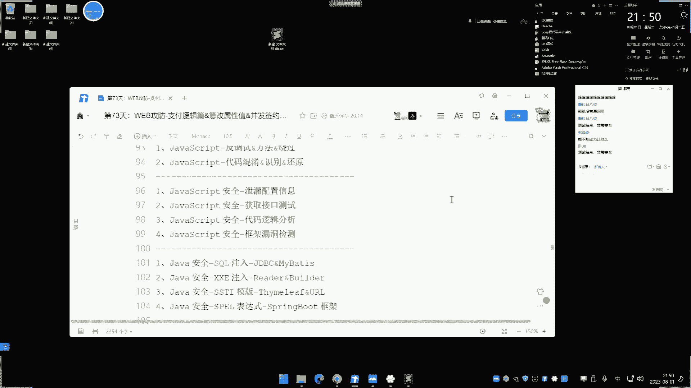

所以说还是那句话，伸头结束啊，非常安全，对不对，没有问题啊，大家看还没问题啊，没问题就下了啊。

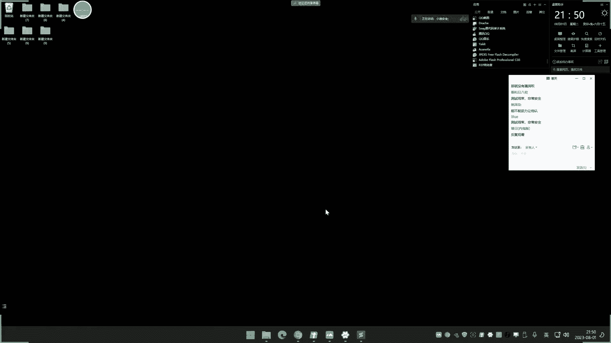

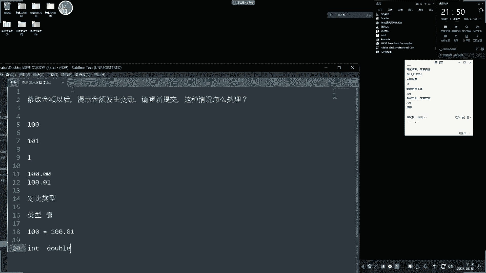