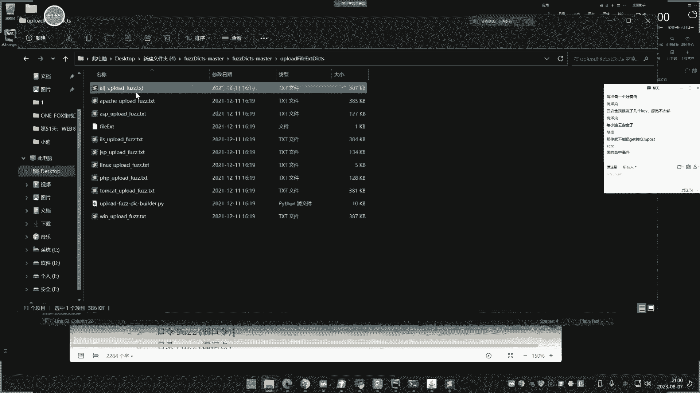
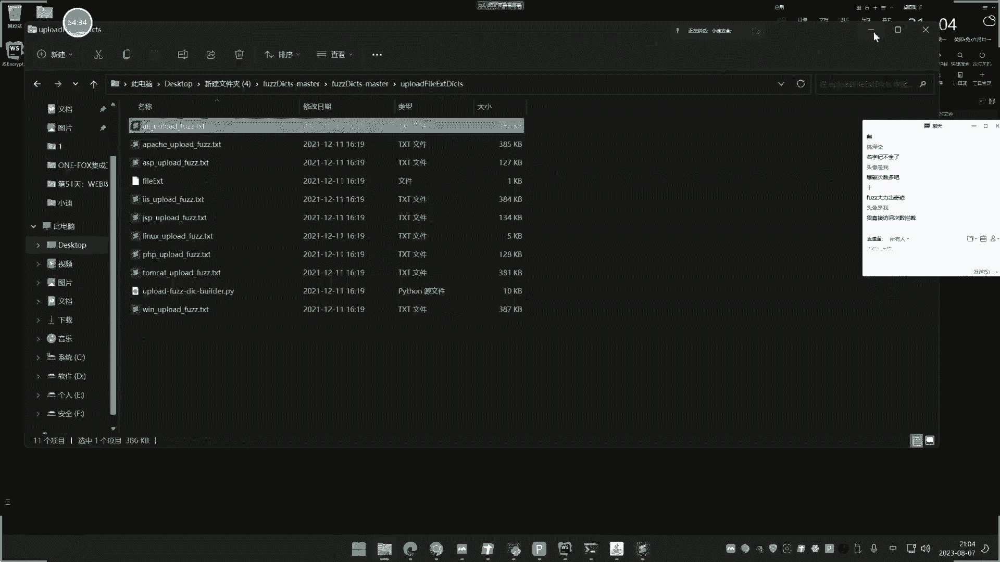
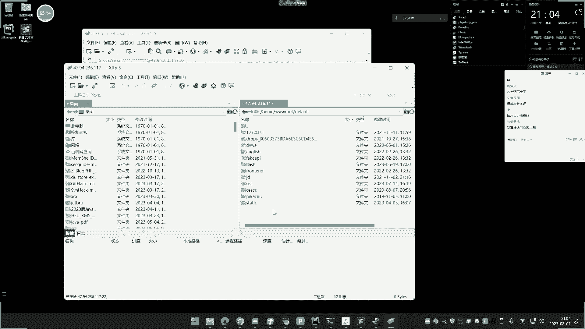
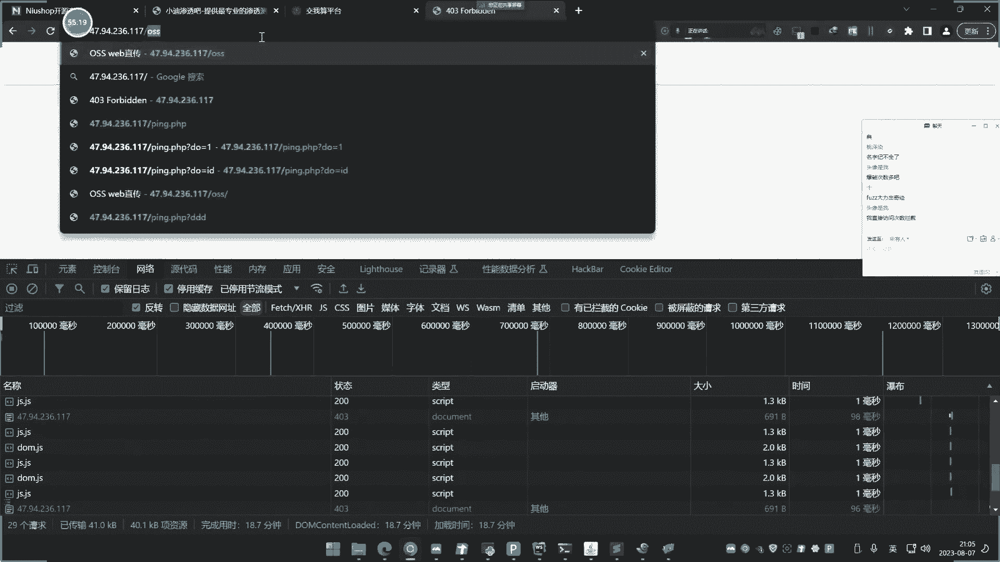
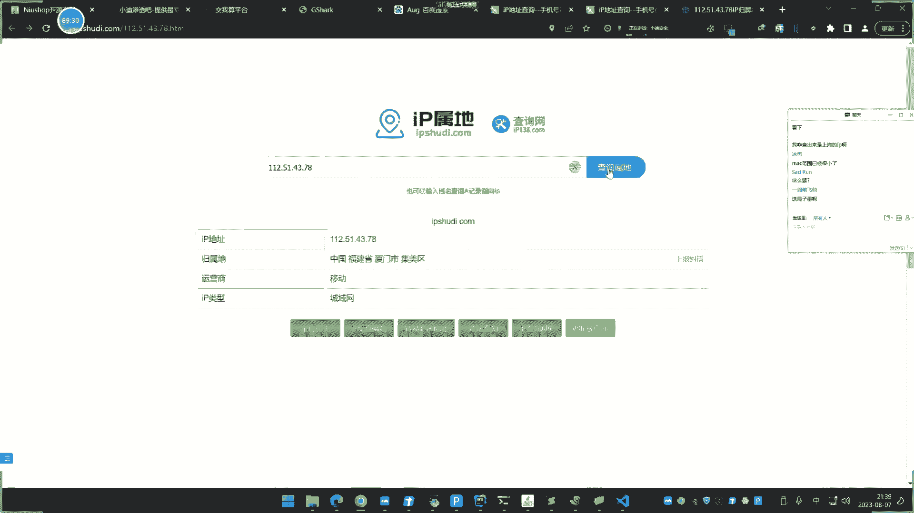

# 【小迪安全】V2024版 全栈网络安全 ｜ 攻防渗透工程师 （持续更新） - P75：第76天：Fuzz模糊测试篇&JS算法口令&隐藏参数&盲Payload&未知文件目录 (2) - 逆风微笑的代码狗 - BV1Mx4y1q7Ny

76天啊，想想这个FUZZ的这个技术啊，嗯这个基数呢，说实话啊是个比较简单的一个概念性的东西，只是有些人呢想想不到，或者说想想到了，他也不知道怎么做啊，就这东西呢还是对于挖东呢，还是有蛮大的这个影响。

然后呢也大家联系一下这个东西，平常在其他的技术领域呢也可以用到这个思路，说白了啊，这个FUZZ呢，等同于就是我们说的爆破的一个概念，它的水溶性都是属于一种爆破，只是说他从各方面各思路上面去枚枚举。

FUZZ的话，网上那个专业叫法，那叫做模糊测试，说白了啊，就是大量的批量的测试，啊就类似于我们去爆破一个密码，或者说类似于对一个谜文去解谜的一个过程，这个过程都可以称为，叫一个FUZZ的一个地方。

只是说这个产这个知识点的一个体现呢，我们专业叫做FUZZ，我举个很简单的例子啊，WBZZ呢是一种基于黑盒里面啊，自动化的一个模糊测试技术，简单来说呢就是一种懒散且暴力的技术。

融合了场景的构造的一些这个东西呢，来形成对软件或网站上面的一些安全措施，这个技术呢我们称之为叫FUZZ，也叫模糊测试，那说了这么多啊，我们举个简单的例子啊，什么情况下会用到FUZZ。

FUZ有帮助又能帮助我们啊，搞哪些事情，对不对，我们写了啊，在这个渗透测试里面啊，特别像这个web web1块的渗透测试，这个FUZZ的一个具体核心思想呢，会体现在弱口令，漏洞点和利用参数。

包括payload这四个方面去体现出来，可以尝试去爆破罗口令，包括敏感目录，包括文件地址，包括位置参数名，然后呢测试PAYLOADER的一个利用，这都属于FUZZ，好，我们通过案例呢。

来让你更能理解这个东西的一个概念概念，我们就不细说了，你把这个案例做出来，你也知道他是干嘛的了啊，就说你表达不出来，不能用这个专业的文字呢去把它呃说啊，说的那么清楚，但是基数一案例演示完之后呢。

哎你就知道了啊，这就叫FUZZ，那你就知道怎么去统称它了，好那么现在呢我们来看一下啊，我们从四个方面去体现，第一个呢就是从口令方面，用户的口令方面，口令方面呢，由于我们前期学到了一些东西。

比如说有因子马的呀，有加密的是吧，有些人还不会是吧，你既然F之间，那肯定要灰啊。

好我们来说这个最接最简单，或者说最能理解的啊。

好我们这里大叫先用本地那个最常规的啊。

三个类型，大家讲解一下，1。4IP啊。

我们启动一下。

而且网上有很多这种FUC这个工具啊，这个类似工具呢说白了啊，额你有这个bb suit。

用的好的话是等同的，那个工具呢无非就是只是做了个事情，显得专业一些，好我们先把这个扒谱呢给他拉起来，拉起来之后啊，我们来看一下啊。

首先呢把FUZ体现在这个包包里面啊。

妈的个厚的，第一次都搞忘记来，哎你看啊，我现在在讲课是吧。

这个聊天记录里面就说我是gay，唉我现在都是跳进黄河都洗不清了啊，嗯这个我们不用它吧，还是这个有验证码啊，其实验证码那无非就是换一种思路，验证码讲过，我也懒得去在上面记操作了，这操作没什么意义。

我就拿这里来讲啊，你看啊，我们看这里呢，我们来来看一下啊，最常规的就是我这里输入admin密码的，输入123456是吧，然后呢得抓个包，对不对啊，包抓到了大家可以看一下啊，这就是那个登录的包。

然后这个呢是我们那个用户，这个是密码，对不对，哎这个FUZZ呢体现呢第一个是爆破上面啊，那就是说模糊测试这两个地方，一个是账号，一个密码，我们呢发送到encoder文下面去啊，如果针对一个的话。

那么就可以说针对密码来进行替换，那我就把把它选中到啊，选好之后呢，然后这PO在这里面可以设置，然后这里面有很多这种密码的东西啊，我给大家准备了三个项目，这三个项目啊，这三个项目是干嘛的。

我们先简单介绍一下啊，这就是关于FCJ经常用到的三个项目。

其实就是一些字典和文件的一些东西，三个啊啊具体给大家看一下好了呃，这个是UZM，是pyo order，还有什么password，你看这人是password，然后你看这个项目里面也是一样道理啊。

这里呢可以看一下啊，这个是常见的一些这个DICE，然后你看啊，那password哪有一些这种呢，常见的一些口令的一些这种支点啊，所以以后呢就不要老问我说这个质点在哪里，在哪里啊，这三个项目里面都有。

所以说你可以选随便的去选择一个啊，比如说我们这里，那就选择哪个项目里面的是吧，比如说这个项目里面的哈，这个password这个DICT啊，和常见的口令啊，比如说这里的嗯，6000个洛口令啊。

某集了下发的洛口令啊，根据自己需要选择啊，直接搞6000的法选中啊，这有6000个多口令了，就显去了是吧，好然后呢你在里面进行对它进行发包，那这里呢就是等同于等同于什么样，是在这里呢对它进行操作上来。

密码就不断换，那就等同于你在上面那不断测试，ADD me和这个密码是吧，这个呢是针对常规的，然后是针对单个点的是吧，这个是真的单个点的，还有一种情况，那就是针对两个点。

就是如果说我要这个账号呢也作为支点，那怎么办呢，继续把他这个选中啊，先清除掉，先清除掉之后啊，把这个要换的地方把它清除掉，清除掉之后呢，把Z先加，再把这个地方呢也加上去，那就两个了，两个之后呢。

就要把模式换成这个模式自定义的一个模式好，第一个呢就第一个啊，这个第一个我们就设置为账号的支点，就选择username，蒙的又是个M的是吧，然后的常见用户名对不，把他拉进去好，再选择第二个。

再选择密码字典，啊啊我随便选择一个，那么现在看一下啊，就有400多万，可能因为就是500个密码加上多少个，大概1万个那个啊啊，大概就1万个那个什么账号了嘛，再跑一下是吧，那就是呢来先那账号为次幂也是零。

那么现在呢账号编了是吧，账号编编编编啊，一直像这样跑下去十多万可能是吧，就是针对这个多个变量的来进行跑，那这里呢我也说了，这是我们说的最简单的一种方式，叫做常规模式，这个常规模式呢就是针对于账号。

密码呢是明文的情况，而且大家都能看到了，你的这个组合的这个FUZZ的这个支点呐啊，是能够满足他的，和他是一个类型的，可以直接发包，没什么说的，无非就是说有几个是吧，一个字典还是两个，把它设置好。

对应上就行好，这是第一种，那么还，在我们这个网站跟踪这里，我们看下这边在我这个博客这里啊，然后呢我这里去输入我的账号密码，对不对，我去把这个包给抓到，尝试对这个包呢进行这个爆破。

这是FUC体现在入口令上面的，那么登录上去之后，包呢抓到了，这是我们的账号，这是我的密码，可以看到密码呢形成了一个MD5值啊，形成了一个密文，我们也不知道什么类型是吧，但是从这个肉眼可见。

这应该是个M65，你可能说啊，那怎么知道啊，你可以看一下那个铭文的一些识别，识别不出来，你再招上面去找这个加密的好，我们先说这种啊，就说已知的这种可可立项可编码，可进行这个加密的。

就是不需要额外的什么鬼密斯啊，偏移量的一些加密方式，贝斯六四啊，MD5啊，UL编码呀，像这种啊就是有自带模块的支持是吧，像这种的话，我们就怎么样呢是吧，如果说要爆破，那就发到这个模式上面去。

那么呢我对密码呢进行换上去，这就是我改变的密码，然后呢我再加上刚才的密码支点，随便选择一个，然后我这里进行破的话，那么你可以看到他密码这里就变成了什么铭文，显然这个铭文并不符合逻辑，因为很简单。

对方呢是接收的原始数据包，里面接收的是这个铭文，也就是说，你必须要按照对方的这种接收形式去发送，这样子呢才能形成一个正确的逻辑，否则的话你直接发密码为铭文，发过去的话，对方呢可能还涉及到解密，解密密文。

那是什么东西呢，啥都不是，所以说呢你就必须要按照是吧，按照他这个逻辑去发送，那么如何将你的密码形成这个东西呢，由于这个呢是可没有一些复杂的加密，所以我们把它认定为是MD5的话。

那就可以使用这个什么模块里面的东西，就是在这个bub树的下面是吧，加上这个加密模块，比如说这个叫decode解码的，这个是加码的，如果说解码的可以用这个是吧，进解的，然后是加的话，就是这个嘛。

然后呢是M05，所以这里应该就是MD5，应该就是哪种类型呀，就是哈奇值一个算法啊，哈奇里面找找这个MD5是吧，那M65选中它进行确定，那么也就是说对你这个payload呢进行M6加密，然后再发送勾。

我们看下现在呢密码呢就形成这种形式了，那其实就是将你选中的这个payload里面，东西呢自动进行了MD传参加密对吧，然后发送，那么现在才是一个正常的一个什么增长的，一个啥增长的一个爆破形式。

因为呢我们要按照他指定条件，但是我们是吧这种情况啊，对不对，好说明白了啊，好这就是说采用自带的模块，比如说一些注入的一些加密，我们能够识别出来的，可以使用这种方式好。

那么还有一种就是我们说的固定加密的是吧。

这种。

这种啊就是我们前面讲过那个JS的，然后JS的那个加密呢也给讲过。

那今天呢再给大家介绍另外一款插件，也是更加方便，这个呢就是另外一个爆破的一个地方是吧，采用哈利，那我们来谈一下啊，我们尝试去对它进行一个登录之后，我们得把数据包呢给他抓一下，看一下提交可以看到啊。

账号呢是铭文，然后密码变成这一串东西了，而这一层东西我们先把它认定为贝斯牛斯是吧，或者说这个其他格式，我们可以来尝试性，把这个值呢发送到这个这个decode下面去啊，看一下这个能不能解，是吧。

比如我们进行贝斯尼斯的先进UR，这个解又要解出来，是这样子是吧，然后我们再进行这个your base64解出来之后呢，变成六四呢变成乱码，那就很显然这里不是base64，那也不是M05。

因为我们都知道啊，前期所学过一些简单的这些谜文的一些特征，MD5那是32位和16位的固定的，这明显那就不是32位，也不是十十六位，所以这也不是M6，看上去呢这个像贝斯缪斯，但贝斯缪斯呢解也解不出来。

但又认定为不是贝斯缪斯，那就是其他算法。

其他算法不识别的情况，下面呢我们通过JS调试呢来分析，得到它是另外一种算法啊。

这个过程的前期在JS立项的时候，也已经给大家演示过这个案例了，我们在这里那就简单把它过一下是吧。

给他看一下结果就可以了，好那现在呢我们就看一下啊，讲过啊，不要说没有讲过登录，登录之后呢，诶这里怎么还断点了呀。

是不是这里我之前下了单的啊，好重新来一下啊，先不断点登录，先刷新一下啊，好我们来看一下啊，来随便输入个账密码，账号以艾特密密码123456是吧。

这种加密形式的哈，就是我现在呢由于犹豫啊，刚才那个数据包大家刚才已经看到了，来这个数据包在哪里嗯，post那刚才那个值呢已经看到这个呢是没有，我们的这个就是这里呢这个加密，我们这个模块里面没有。

它有个是M05，所以我无法呢就像刚才一样是吧，在这里加这种加密，他不是这种上面知识的啊。

他是自己呢写了一种啊，就是自己选择一个算法，算法里面呢还有一些密思啊，K量一些东西比较复杂，所以我需要逆向的得到那东西啊，好现在呢我们把它登录下啊，然登录把那个数据包的抓到，抓到之后呢。

就是那个登录数据包，在这里呢我们可以看一下，在这个启动器进这里有个value啊，选中它选上呢给大家进行一个端点啊，这个端点呢不跟他说了啊，讲过啊，端下来，然后重新呢给他再登录一下。

好登录之后我们观察一下啊，这是那个端点，然后大家可以看到上面这里看调用的文件，这里呢有个这个啊这个这地方哦，那这里有个算法，你看VR2的，你看下啊，MORGIN登录啊，然后这里看呢我看下这个值啊。

来这里有个这个能，I等于I等于这个I等于艾德米，A等于也算流，那就是说A是你刚才提交的密码，I呢是艾米，对不对，然后你这里也可以看一下啊，这个算法呢就是这里呢IS上面得到的，就是这个加密的过程呢。

这里有个这个这个东西啊，你可以试着调试一下啊，比如说这个S这个S呢是一个这个值，我们可以看一下，这个S值是不是就是和我那个铭文差不多的，来看到这个S呢，这个这个变量S在这里吗，S是等于R加这个东西。

A呢是什么，A是我们的密码，那应该就是呢可以看到就是这个东西，就是一个他的一个加密的一个事情是吧，那我们可以试一下啊，通端这里面来看一下A45的密码是吧，我比如说我把密码呢加一下123456，这把。

然后呢康硕士，你看他就把这个S呢给打印出来了是吧，S呢就是等于刚才我们生命这个东西嘛，你看啊我重新呢，比如说我换个密码，换成这个789是吧，回车，然后gala打印，然后他就编了这个值就变了。

那这个字就变了，看到没变化了，所以说这个呢就是那个加密的那个什么，在这里调试出来的加密的东西，但是由于这个里面的什么R，还有这个什么这个函数，这个函数呢你在上面可以调。

因为呢你是现在的代码是调用了参参条，如果说你不是在这个浏览器上面，那肯定不能调，所以我们就自己呢去把这个算法给他拿出来，对不对啊，真的变了吗，没没，这啊应该是刚才赋值啊，我重新复制一下啊，看下啊。

他打印的应该是这个值，我们给在在这里看啊，应该是那个变量没有改，我给你打印看一看，看到没，这改了吧，是因为那个东西那个变量没有改呐，这是东西了吧，他是先服务的那个值，那个值那个S呢是在这个里面存储的。

所以他打赢我这里呢它没有变化的，原因是那样子的，然后你不用那个S代替的话就变了，唉你们老喜欢这个搞这种事情啊，老说这个那个自己要学会理解啊，好来到这里啊，你看一下啊，他就这里嘛是吧。

然后你可以关注一下啊，这个东西又从哪里来的呢，是从这里呢，你可以看到啊，R从哪来的，这个啊从这里呢这个new对象来的，对不对，new对象来的，因为我们执行密码是在这里吗，那这里是从这里来的。

所以我们就我看一下这个JS，这个方法是从哪来的是吧，根据呢它是从这个JS文件来的，所以呢我们就把这个JS文件呢改成呀，拿出来存储到电脑上面去，然后把这个代码给复制一下。

在网上那种解析平台上面去执行一下是吧。

那这是他本身那个JS引用代码，引用那个JS代码，对不对，然后呢你把这个值呢给他拿出来，粘贴复制到这里去，加温一下，O呢等于这个c r code，CSS code呢，他这里已经有值了。

把O呢直接复制进去讲过啊，不要问我说为什么这样搞，前期已经讲过的，我这里只是走个过场，那么这个A呢，就是我们要进行这个解加密的这个密码是吧，你传的是什么东西，它里面写什么东西，比如我写个123。

那这里呢写完之后呢，进行一个CSOL是吧，点logo把这个S打印出来，就是我们那个加密的密码运行一下，他报错了啊，报错的原因不是代码写错了，可能是这个平台不支持，换个平台试一下，那看到没，这就出来了呀。

加密结果呢比加三的加密结果为什么呀，这是那加密代码的一个过程，这个代码是那个JS代码，因为呢他要调用这个对象，对象是来源于这个代码文件呢，所以你要把代码文件代码写上去啊，这里才能创建一个对象啊。

那么R才能出来呀，R出来之后才能调用这个里面的方法去加密，这个123呐，能理解吧，这个O呢就是个字符串呢，没有它不行呀，那么如何在我们的bob suit里面发包去体验中呢，我们前期也讲过。

前期讲过的案例呢给大家看一下，然后呢我们今天再介绍个插件，避免有些人又不会前讲，我是个JSKY是吧。

怎么做的呢是吧，浮现一遍又重复了一遍啊。

还不会，那就没办法了，好就这个项目里面啊，项目里面呢改一下东西就可以了啊，找到这个这个load server啊，打开。

然后呢在这个代码端里呢，把这个呢刚才那个语法给写进去啊，调用那个写个函数吗，那他说加密算法呢就写进去，那这个函数那就是我们那个密码那个函数嘛，你看对对不就是那个写法，你看就是那几个东西嘛。

哈那就是几个西把写进去，然后呢，你看啊，处理函数这里呢就写成了创建一个变量变量，那就调用这个函数里面的payload就可以了，就改这两个地方就行了啊，就打开这个本身文件，改这两个地方。

这个呢就是你那个史前加密那个地方，然后这里有个疑点JS，这个疑点JS是什么呢，就是我们下载下来的那个JS文件，就是我们下载下来的JS文件，其实呢就是哪个文件，就这个文件啊。

就这个问题就是那个这个JS这个对象啊，他的源文件，那么这点简单来说这个代码呢就很简单了是吧，这个就是引入那个文件，然后怎么才能进行调用，创建这个方法，这个应该是加密这个密码全弄到这里是吧，把这好之后啊。

然后现在呢再来运行它啊。

这个环境安装呢前提讲过啊，就不再啰嗦了，好把它进行运行。

运行之后呢就会启动一个端口啊，然后现在呢就在这里呢连接这个插件啊，连接能上去，然后这是我们测试的这个铭文，紧接一个test，你看他就全部加密了，全部加密成这种格式嘛，对不对。

然后这个时候呢我们再找到刚才的数据包，就是刚才那个包破包吗，把它发到这个模式下去，就刚才爆破包吗，把这个地方是吧，发到这个什么encoder文件去，把这个地方呢当做什么，当做要编环东西选中加上去。

再加入我们的密码字典，加上去之后，在这里加入模块，原来是选择什么哈，奇自带的模块，由于这里是插件，所以要选择什么巴普的插件模块，这里选中，找到JS1口规模，就是那个插件的名字，OK选中之后进行发包啊。

进行发包，Roll go，你看那么现在呢就按照这个逻辑密码，就按照这个逻辑去制，这的都有是吧是吧，这个密码呢就按照那个逻辑来，这个呢就是我们说的登录框里面碰到这个呃，JS加密的时候。

好自己理想出这个JB式的算法，修改那个算法的那个实现啊，整理到这个BUP上面去实现，按照它的加密形式去发包，那么就把你这个原始的密码呢，组合成那个密文呢去发了，呃，为什么这样做，因为我们知道啊。

这种密码是他特有的加密，这个特有加密，你不知道里面的密思是无法做到和他相似的，也就是说你这样去他对方呢才能成功的解密，那么逻辑才对了，否则的话啊乱七八糟搞一大堆是不行的，那这是我们前面讲过的插件。

那么还有一个插件呢，也给大家看一下X是什么插件呢，就这个叫发，然后它上面集成了一些常见算法，就是说如果你知道是什么算法，你可以在这里写进行解密，如果不知道是JS的另外一种，那可以用装ex1JS。

我们就可以按照刚才的逻辑，把这个JS模块粘贴放到这，来，到这来之后，我们刚才实线加密的算法是这么一个东西，把拿出来写到这里，然后写个函数叫function x，创建个名字就叫test，我说小黎好吧。

传了个小零，这是函数，把这个东西给它剪切进去，把东西给他解了进去，剪切到这来，这是我们刚才实现那个那个加密的那个地方啊，对不对，把写进去之后，那我这里呢搞一个返回return return s返回一下。

然后这就是我们那个实线加密的那东西，小离就是我们实现的，前面是我们引用的JS代码，就是这个啊，因为你要把这个介绍码写进去，那下面那才能进行这个new对new这个对象是吧。

然后下面那就实现这个什么加密的过程，对不对，然后这个是我们传入的参数，给他写个参数，就是我们的密码写个P吧，那这里就换成P是吧，所以调用了小D1杠P，然后P里面传密码，那么就会返回一个加密值出来。

把选好之后，然后这个时候怎么办呢，下面有一个叫js moon name，就是我们出发的函数名，选中叫小弟点击那把它选中，选中后叫添加进程，添加个什么名字呢，添加物叫比，比如这个名字随便取。

这个呢和他这个函数名对应上，确定他说添加成功，那这个是什么东西呢，我们再来到这个包里面来啊，把这个去掉，这原来是用这个东西嘛是吧，把它进行一个删条，再来添加，找到这里模块这里。

你看是不是这里bob car，这个EEC的EDU出来了呀，这个意思就是啥呢，就是说啊这个插件安装我还没熟，插件安装就不熟了吗，就直接添加呢导入进去给了啊，这个插件安装不说了啊，呃大家都知道了啊。

不讲了啊，你这个解压包一导进去就可能啊啊，那这里就是那个茶间啊，茶叶这里呢就是自己呢去把加密的这个JS文件，然后呢去调用它加密的时间，写一个函数，函数这里写上去添加一个方法，其实就添加个模块。

再到这里的时候，我们就可以怎么样呢，就多了一个是吧，在这里呢插件这里就多了一个呢，这个模块下面的EEC1流，是不是就刚才的名字啊，选中，那么再来发包诶，这里报错了，报错就是哪里写错了，我看一下啊。

呃这里报错了，是哪里写错了，这个好像没写错呀，我试一下啊，我把这个代码放到这边来试一下，看下这个代码有没有问题啊，诶这里怎么有那么多空格啊，空格都去掉一下，好我们现在调用一下试一下啊，第一个S等于角D。

然后传入一个加密这个Y是吧，然后conso logo打印下S，我看一下这里能不能正常执行啊，哦能够正常执行是吧，将这个函数啊这里传输你要加密的密码，把它复制为这个变量S再打印出来，这个S它没有问题啊。

那这个为什么会错呢，也是奇怪啊，重新来一下吧，那就把它放到这来啊，全部去掉，然后去掉之后，我，你换个换个名字吧，看看是不是这个名字问题啊，返回password啊，返回这个PWB吧，那你就返PWD。

然后这里就换成个呃S啊，这里传个P吧，嗯P大PWD吧，再全PWE，那换成个S换S好吧，我这样试一下，看行不行啊，再来看一下，在这里呢先把那个模块给删掉，1D用模块删删掉呃，这个函数名呢我也换一下吧。

看看是不是函数名的一些问题啊，换成test10好，在这里写上去，包含测试看下，哎怎么卡了呀。

被东西搞搞搞卡了，卡了啊，absolute卡了，关了吧，重新打开。

好重新来一下啊。

我就直接用我那个之前那个搞好的。

那一模一样的啊，没什么不同，换了个名字叫  p来，没什么不同啊，你们养的那就发，写上去，加入个名字，名字也叫buck，You u，确定好。

我们再来抓一下那个登录数据包，好把登录数据包再抓一下。

好就这个吗，发到这个模下面去啊，然后对这个进行这个改编啊，选择字典，随便选择一个呃模块这里，那就选择我们这个什么这里的啊，来发个一丢，确定扣下，好这里呢就不行了是吧，这个什么情况呢，刚才有人说了。

说是这里有这个问题啊，是不是这个情况，那我试一下是不是这个啊，我换成个TM的重新来一下，先把这个发给UU删掉，好再来加一个好buck吧，确定还是不是这个情况来看一下啊，重新关一下，选择发可的，好勾。

正确了，那就是刚才那个问题就这里啊选这个啊，TM的他因为还有几种模式啊，就是我们说的那个执行JS那个引擎啊，啊随便给TM啊正确执行啊，发包了，那么就按照这个逻辑去发包了吗。

那这个密码呢就组合成这个密文密密密文啊，两个插件都可以实现一样的功能啊，你想用哪个就用哪个啊，没什么好说的啊，大家都明白了，所以你就不要再问了是吧，哎呀这个什么鬼东西啊。

讲过都讲过，不要再问了啊，我们简单讲的就是这个思路啊。

好啦，这个呢是针对这个用户口令的方便的事情啊，呃常规类的直接铭文啊，我们就直接替换铭文字典就行了啊，如果说是什么MD5base64的，那就用巴布数的自带模块里面的东西，那如果说是这种自定义加密的。

那自己呢通过这个JS逆向找到算法，把算法的引用JS文件和实现方式呢，通过这个写上去，写上去之后呢，是吧啊，自己写个函数名来调用这个加密容器啊，进行一个return返回啊，加到这个模块里面去。

在使用的时候呢就加到这个模块，那么发包呢就会将你这个啊，铭文呢以他的加密形式去发送，就符合这个增长的一个通讯逻辑，我们才能正常测试啊，非常简单非常好理解啊，不要说解不掉。

那这个呢是针对这个用户口令的FUC技术呢。

还可以针对这个目录和文件，这又是啥意思啊，我们都知道我们打个简单例子啊。

比如说现在呢有个网站，那就像我们这里打开一个网站一样。

这个网站一打开是个空白的，或者说是这种页面，但你你可能想这个也打开，那么FUZA体现这里针对他的目录和文件名，啥意思啊，就说这个网站打开之后呢，上面啥都没有，或者说里面东西就空荡荡的。

那么FUZZ呢就通过包括他的目录和文件，来实现寻找更多有价值的东西。

对不对，就是文件和目录，那我举个很简单的例子，这个也是非常好理解的哈。

呃什么预检工具，那都是FUZZ的一种体现思路啊。

那个是这个网站，这个网站是这个吧啊对不对，刚才那个JS没学会是吧，哼没学会，你自己没学，那怪哪个呢，对不对，前期JS你以前讲过的，听过的就知道我在干嘛是吧，没听过这个就不知道吧。

这个这个东西呢打开之后是吧，哎装完之后它空白吧，比如说下面有个页面是吧，有个目录地址啊，我们就选个很简单的啊，比如说这个有个这个目录，那有个有个目录是吧。

有个目录有个目录打开之后呢，就是一个页面对吧，我们举个简单的例子啊，我打开了是吧，哎你看我打开OSS呢，就是一个这个页面就出来是吧，这里多了个上传，那你肯定是想我怎么知道有OSS呢。

是不是就是说用FUZZ的思路去尝试，下面有没有这个目录，或者说这个文件，这个呢是属于我们说的这个什么母鹿，还有一种就是文件文件，比如说很简单，比如说有没有插点pp，或者说有没有这种啊各种各样的文件是吧。

有的话就打开是不一样的是吧，其实呢就是尝试去访问他，我有没有展示出来的目录，和没有展示出来的文件，因为我们知道啊，如果你用网站扫描的话，网站扫描是基于这个网站上面体现出来的页面，去爬爬虫。

那就像很简单的道理啊，我们打开这个这个网站一样，那么它的页面呢是有很多加载的这个，地址和信息的，或者说JS信息一样的道理，我们来看一下啊，我们打开这个页面是吧，为刷新对不对，这个页面呢会加载很多图片。

图片里面呢就会有这种什么叫做目录啊，这种地址啊，这种地方对不对，好你能看得到，所以你爬虫，那能够爬到这个目录和这个文件地址，对不对，但是有些呢一打开是空白的，啥都没有，那你这里一打开去监听。

打开呢他就这么光秃秃的，啥都没有，是不是，那怎么办呢，对不对，所以呢你就要去找这种未知的目录，未知的文件啊，你用爬虫，那就是另外一种思路，你爬虫那就是它体现出来的，它不体现，那怎么办呢，那就只能盲猜啊。

盲猜就属于FUC这种思想啊，能理解吧，你不要把这两个混为一谈啊，说哎呀网上的引用这种技术是吧，哎找到这种目录文件，但是你要知道他是用什么技术实现的，FU这件事模糊测试就是盲猜，我不知道。

反正我就是跑抛到了就有，跑不到就没有，这种爬虫的是它体现出来的，是从这个体现出来的，从里面抠出的信息啊，被你说了啊。

所以这里面我们就盲猜它，那你这里那就怎么盲猜它的，这也很简单。

这目录和文件盲猜，那就等同于文件扫描嘛，就扫敏感文件这种东西到我这里是拆塔一打开。

刷新了这个地址是吧，我就发到这个模式下面去，对不对，说我这里发的这个in code往下面去，那么肯定是在这个路径这里啊，在这个地方，所以我只能随便写个名字，把它当做一个变换的值，好把它当个变换值。

就是猜这个get用get去盲猜这个后面的东西，然后拆什么东西呢，写上支点嘛是吧，找支点呐，字典里面有啊，你看呐这里那是啊，比如说我们猜这个目录结构的是吧，找目录结构的，比如我们猜一下啊。

这里有很多知识点啊，这些字典都可以来源于这里啊，discover的是DISS哈佛的，然后看这个里面啊，根据这个名字来选择，因为猜路径和文件名，所以这里呢还有些就不是啊，这个呢那diss disco嘛。

在目录嘛，目录字典呢选中它是吧，那这里呢就有一些是吧，根据你自己选择，如果pp来选这个是吧，如果不是的话，那就选择其他的啊，对不对，找一下呀啊比如说这里有个，那这里呢有5000多个的。

就是找这个pp文件的是吧，来这是找pp文件拆拆文件的，所以我们先猜目录好吧，先猜目录，先把删掉，猜目录了啊，参目录的话，那这里呢又有字典有这么多啊，就是发现的是吧，a wall cas网站路径的好。

这里有很多的很多这种类似的啊，这种字典形式啊，自己根据需要我们选这个，所以我选择啊，这里是目录，有带文件都有是吧，好我可以选择这个试一下啊，啊这个呢是你看到英文单词，这个是应该是一个什么后缀的。

我们这个呢是文件的files，可把选中看啊，这里有很多文件，你看是吧，就拆了这个那各种各样文件，然后呢我们就开始跑了吧，是吧好，就看它下面呢有没有这些类似的文件啊，根据我们信息呢还是pp的。

所以这个选择的还是有针对性的啊，那网站呢返回的信息包里面的是pp的一个，这个信息嘛是吧，我们猜一下猜一下看一下啊，找一下呢，200正确的哎你看是不是猜到了呢，有些文件的呀，你看有个什么鬼。

P点pp是吧啊pp里面呢有个什么组值，还有一个拼点pp来，那这200状态码的，或是通过这个长度呢返回来判断是吧，这里能看到啊，有这个评点PB是吧，比如说这个评点pp好，我们找到了，对不对。

然后呢接下来又该怎么办呢。

好我们想调调啊，我们先来思考一个问题，什么问题呢，好假设我这个P等pp啊啊p in pb是后面，如果说我要测漏洞，那肯定是有参数区别，那就说我要找漏洞啊，用漏洞来讲的话，我肯定是有个什么参数名。

它数值是有这两个东西的，就说找漏洞呢肯定是有文件目录和文件，就是目录和文件，找这两个这个地方就相当于目录是当前目录，文件是拼点滴滴，你去忙破他的目录，再忙破他的文件里，找到未知的未知的，对不对。

找到这个地方，然后你肯定是要知道他后面有没有参数名啊，有没有参数值啊，你要找漏洞啊，不然的话你怎么知道下面给他发什么东西啊，盲坡呀，暴力拆他报暴力拆的参数名，暴力拆他参数值，那正常来讲。

如果说一个漏洞是这样的形成，比如说漏洞啊里面写个3MB，等于这是一个执行命令的IPCONFIG，或者怎么样对吧，执行一个命令，比如说执行的cl和C执行的东西，就这个东西呢按照正常来讲，它是一个漏洞形成。

这个就是相当于是说啊，一个RCE执行一个漏洞，让RC执行执行个计算器的一个这个操作啊，对不对，执行一个计算器的一个地址里面呢就有文件名，目录当前目录文件名，拼点pp参数名SM啊，参数名CMD。

参数值cl c，那么参数值就是我们要执行定义，如果你改，那就是其他的嘛，就是指假如说是啊，假如这是一个什么动物，一个什么例子，那么你想一下，你现在猜到这个当前目录里面下面有个拼点PPT。

那我肯定要猜参数名的呀，是不是要拆这个SAMD呀，因为你不知道啊。

你打开你也看一下啦，我刚去看一下网站，我现在猜到下面有个拼点pp，但是我不知道它拼点PB是什么东西。

我也不知道下面参数，就我现在猜到了下面有个拼点pp了，哎它返回个数，那那我哪知道这个下面加什么参数啊，我测它时，我怎么知道这后面加什么参数给他传递过去啊，怎么才能执行，假如我认定那是查RC1的话。

那现在呢哎我怎么知道下面是什么参数啊，是不是就是又要爆破了呀，那怎么爆破的。

来继续，找到刚才那个地方，是不是继续盲猜啊，找到刚才的地方，把这里清除掉，这里写上什么平点pp，然后后面再写上什么值啊，写三个要变量值，随便写一个等于一，后面是你的参数值，对不对。

然后这里把它编上，那就等同于我在这里呢啊，我就像这样子猜它，它怎么拆啊，比如说我这里啊变化的CB1等于这个一好，然后我就这样弹怎么了呢，比如说这个是丢对不对。

或者是什么这个id或者是什么这个嗯acting是吧，各种各样的一些参数，就是这里盲猜，就是在这里盲猜它的参数名，后面问号等于一，是我随便写的，因为一一般场景都可以这样去尝试哈。

如果说你不写这个值的话就不行，因为你猜参数必定要带值，所以我随便写个字就写个一啊。

猜这个地方我就写个是吧，那就把边环这里为边环，然后支点再来换支点啊，还什么支点呢，这现在就是盲破它的这个什么参数了。

刚才是盲破目录和文件。

现在是盲破它是什么参数参数呢，又要换字典了，换哪个支点找一下，看这里面有没有参数字典啊，诶这个名字就是参数点的PARM参数字点，选中它来看一下啊，这里有这么多的，可以随便看所有参数字点。

这都是一些场景参数，有7万多个呀，看到没就猜它的，属于参数常见参数，但我也用不了这么多，我可以换一个，比如说pp的啊，这里呢常用参数index confire long，那其实就是在这里的。

不但换这个地方吗，能理解吧，就是不断换了个地方，二来这么多，对不对，还有呢你看这里还有啊这个这个参数呢，这里也有呢id什么id大写title什么的，各种各样的一些参数有5000多个，对不对是吧。

好我现在就来尝试下，来刨一下，看下啊，购物好，这里可以看到好多都是返回，这个什么200都是能正常返回，但是这里要返回的长度，我们通过长度来判断找一下啊，看能不能诶看到没，刚才有动的啊。

但是我要看长度具体啊，哎你看有个叫do的长度，就是R46，其他的参数全部是R51R46的，里面长度就不一样，长度不一样，因为其他的打开之后会有个错误提示，但这个丢的没有错误提示，所以我就猜到有个丢。

那么知道丢之后，猜到丢又丢了，那么现在是要拆，这个是参数参数名嘛，这个是对参数名的F1CBA，那么现在我们来看一下啊，对漏洞的payload plo怎么办呢。

我现在知道自己丢了，我再把它发到这个模式下面，来来继续，怎么办呢，do有了就把这个变换出，我估计他是一个什么漏洞，那么就用什么配漏的，如果都不知道传不伤，那我估计他是RC1，所以我用RC1的PO的测。

找RC1的payload r c1，RC在哪里啊，R c1，然后这里随便选择一个，比如说windows linux，根据你自己前期收信收集，如果说LINUX是选择了啊，执行的id的命令是吧，来考一下。

其实四个啊，当然了，你可以选择两个，比如说选择这个这个这对也要选择两两度，那好我再勾一下，跑一跑哎，结果就出来了吧，执行id的时候来看一下结果，这个是22，那通过长度来判断这是26的，结果里面为空啊。

找一下不一样的这个长度，那看没执行的时候返回了，直接RC1代到，这是我设计这个靶子，这个靶场就是利用按FUZZ思路搞，其实就是等同说你未知的这个技术领域啊，去找这种资车，他的这个各种地方各种地方。

但是他有些前提条件，你要知道什么叫前提条件，就是有一些返回，如果说他没有返回就不行，没有返回就不行，因为没有返回，返回长度一致的话，你就无法判定这个参数和这个值和配漏的，这东西可不可行。

我不知道我这样讲完之后。

大家能不能啊知道我在讲什么东西，这个东西有什么意义啊，这就是FUZZ右题思路，通过对一个啊这个位置的文件目录和文件名，去猜它，拆完之后呢去报理它的参数名，再暴力他的参数值，但是这里呢有个前提条件。

前提条件就是我们说的啊，这是真缺和这个错误呢是有差异的才行，如果说没有差异的话，你是无法判定你猜的正不正确的，能不能理解。

FUZZ其实就是个暴力盲解技术啊，我们介绍一下背景啊，这个背景呢就这个网站一打开，我们里面啥信息都没有，打开人类界面，所以你就要猜一下下面有没有文件。

有没有目录，是这个意思吧，来解释一下啊，打开啥都没有，什么都没有，那么接下来FUZ思路体现，先拆，目录和文件好，找到了，有一个是吧，有一个拼点pp，那有个评点pp好，有个评点pp之后啊。

接下来没有这个怎么，没有这个参数名，没有参数名呢，继续FFEZZ参数，要找到参数名的丢参数名，找到参数的对不对，所以就知道知道有丢参数名字后，那么值该怎么写，测漏洞呢是吧，怎么找漏洞呢。

那么我们就怎么样启用这个什么payload，payload就是合同漏洞，这是什么攻击的，这个什么东西带进去，那么就等于一个什么，等于这个命令的时候诶执行出了这个结果，那RC1找到。

其实就是说这是一个路径，我们最终呢就得到了一个完整的个体积，执行命令的是吧，这里呢就是一个执行命令，从哪里拆的盲坡目录，当前目录下面有个评点，pp再盲坡参数有个丢，再盲坡后面对应的值是造成什么漏洞。

采取id的时候返回了一个执行命令，如果这里呢执行其他的，那么就拆其他的，根据自己的需要，这个知识点里面都有，所以他用到了什么三个情况。

目录的探针，文件的探针，对参数名和它隐藏的参数进行，包括在构造参数值，直接利用恶意佩洛的组合看一下，把攻击的payload打进去。

或者再举个很简单的例子，你上传漏洞的时候啊，我举个例子呢，上传漏洞的时候啊，我上传什么格式是吧，上传格式被过滤，这个时候是不是可以用FUZ的思路上传图，让各种后兵强势。

看看哪个名分这个例子上传漏洞的时候，上传格式被过滤，所以我就FUZZ上传各种格式。

怎么各种格式呢，我们找一下这个支点，比如说我找一下这个上传的这种FUZZ的东西，打开一看啊，比如说呢这有很多字典嘛。

打开一看啊，那啊他帮你全部写好了标准格式，你就可以替换你上传的格式，不是尝试上传各种类似格式，来看一下哪个上传的没有吧，很多地方都可以用到FUC的思路，我只是举例，包括我们说绕过你上传的时候。

这不就是一个绕过思路吗，不也是一个绕过思路吗，它过滤这个，你就把这个置顶全部给搂上去啊，那个商船那个地方把它赶这个看哪个上传的，这不也是FUZ的思路吗，简单来说，FUZ的思路就是。

对未知黑盒里面的所有的测试，你只要知足知点足够强大，就能测出一些别人找不到的，再次说明一下啊，一定要知道它的产生意义和利用价值，但是这是我们自己测的，如果说真实情况下的话。

你肯定在车道找这个RC1漏洞，那我相信要找很长时间，为什么这样说呢，很简单，我们这里测了几点啊，刚之前那是测这个拼点pp测出了很多文件，每个文件都要测，为什么我选择拼点pp节约时间嘛。

实战中你哪知道这个地方有RCD的，你不知道啊，所以说实战中你要花很长时间做FUC，就是这种每个点都测好，那我即使找了P0PP，那我继续找这个丢啊，我找到它了，找了do之后呢是吧。

我也不知道是他是不是RCE啊，那我车的时候，我字典里面是给他提了RCE的这种配load，给他打的，那实战中的话，你这个payload你是不是可能会选用其他的，比如说我选用这个什么鬼。

这个circle是吧，注入里面的这个这个这个payload对不对啊，是这种注入语句是吧，长试它有没有注入点，对不对，所以说你会想到各种方式去测这个点，他时间很长，所以我说了FUZ为什么是某测试。

你看这个支点不多呀，真实情况下面你应该是把所有字典都勒上去，因为你对V你对目标未知情况不清楚，也不知道会造成什么漏洞，甚至说他有没有漏洞都不清楚，你只能测跑出来，结果通过差异性来观察有没有。

所以我说了一句很清楚的话啊，这个FUZ成功不成功，其实他是有个前提条件的，前提条件是这个正确和错误是有一点差异，才能用到这个思路的，如果说没有差异就不行，啥意思呢。

就是说刚才测这个do的时候，你可以看一下啊，我们在跑这个duo的这个PO的时候啊，好这个丢点PO，你看他测这个参数名为id的时候，全部返回到2V1，为什么全部返回叫错误，当跑到do的时候，他返回空白。

说明这个参数堆了，所以他有差异，你才知道这个差异地方是对的，如果很简单的道理，他的代码里面就说你即使输对了参数名，我也是显示这个error，就是你没有输入参数值，参数值没有对。

我也给你显示这个error，那这个时候你就判断不了了，是不是啊，所以这个FUZZ呢，他的成功条件是要有差异性才行。

我这里呢可以给大家看一下，我那个设计那个那个拼点pp那个代码。

大家就明白了，你一定要知道它的应用体系和它的应用条件，不是说他是万用的。

万用是要建立在有差异差异的情况下，是帮助我们方便，不是说它不行，而是说你在实战中，你肯定是要有依据判定它，你才会进行下一步啊，如果说你之前都判断不了，你怎么进行下一步呢，啊就像这里啊，我们找一下那个哎。

切，我能说啥呀，大家有没有发现个什么问题啊。

我真的想骂人啊，他把我那个文件给他删掉了，全部文件都给我删了，你是不是狗啊，这狗东西呀真傻啊，很厉害是吧，这还好，我是把这个内容都讲完了，这真是玩一步步。

这里面的都翻车了，还不知道什么情况，翻车了，还不知道什么情况，很人才啊。

说远呢发现有些人他真是他妈的有点神经病啊，狗东西真是狗啊，他妈的，等我查出来是谁，我决定把这个鸟毛给提出群聊哈，这这就是老鼠屎，我跟你讲就是老鼠屎，你知道吧，这老鼠屎这是打仗起来，先不用说内鬼间谍的啊。

汉奸。

我还以为我进错了，一打开里面的文件全部删没了，这我还好，说实话，这个靶机上面那些删掉的文件，对我来讲没什么太大意义，要是我里面先准备准备好的，这个什么鬼敏感材料，我这他妈的要报警找你了。

我不说了啊，不影响商科啊，我还是刚才那个思路给大家说清楚了啊。

我讲完之后呢，我们再看是哪里IP搞的啊，我只能查到哪个IP，查不到具体，如果说要查具体人的话，那会花很大气力，就是我要找一下那个IP地址和那个IP地址，去比对，大家大家用那个播放器IP。

我可以把比对出来，干死那个人，但是那量太大了，要一个比一个有点麻烦，哪天搞烦了，我没事做，我就比这虚的，我就非要把这鸟毛给他扫到，妈的，我明天我真那次我真去比这虚的啊，我先把课讲完啊，不受他影响啊。

大家看一下啊了，这个地址呢好吧。

给FUZ思路给他说了吧，那我们可以体现一下啦，看下这个核心思想呃，之前第一个方面来讲了口令，就是呢把这个口令人大量的去猜这个账号密码，然后账号密码了，我也说过，密码呢采用明文传输，采用常见的MD5啊。

base64这种加密传输，然后呢还有就是我们采用那种是吧，自己写的算法里面有什么偏移量啊，有V4那种加密复杂的，那就需要用到JS逆向念出来之后，配合那两个茶几是吧，进FUZZ。

这是针对弱口令的FUZZ的一个操作目录的，那其实很简单，像我们已知的一些软件什么预见呐，以前一些老牌的那都属于目录文件的。

而非这些思路，还有就是找到这个文件之后啊，这文件不是后面要有参数吗，因为你访问这个文件对不对，它没有值的话，那也不行啊，你可以访问到他，如果显示空白了怎么办呢，肯定要找到这种参数。

是不是，所以参数呢也要拖参数，破完之后再来替换后面的参数值来测试一位。

No，对不对，比如说这里是I等于一，我是不是就可以敲20101，来测他有没有注入啊，就很简单的道理，是不是哎我猜到这里这里有个do了，然后呢do这里呢我有猜id，这叫什么，加RC1加RC1，对不对。

如果说do点一安等于的一，这不就是个什么SQL图，如果是我仍然在写这个后面PLOAD啊，写什么什么script啊，可是啊就是测什么X2X4，对不对。

就是各种形式的，这里呢，我们那个字典里面是有各种各样的东西啊，对然后这是一种还没种呢，还没有啊，有的呀，还有才什么更改方法方法都能改。

你看一下啊，给你找了个字典，就这里呢我们测的呢他都是get get行为是吧，这个get行为也可以把它改动，get行为也可以改，就测不同的提交行为，因为我们都知道有可能呢get访问不了。

还测post，所以说你任何地方他都可以换。

你比如说这里呢它有一个是吧，是一个这个post post请求，这个包才会触发，就说代码中的直接是post的数据，那怎么办呢，是要换这个提交方式啊，所以说啊他有很多种这个车法哈。

嘶呃具体呢你就要找这种各种各样的R呢，这是一大堆的一种东西，这还测那个post，我具体呢我要打开看是在在哪个里面啊，就这个字典里面都有，但是要找一下是在哪个里，还有你想啊测JS文件也是一样的道理。

看找一下啊，应该有的，这个是插那个啊，这个应该是的，这个是应该是的，这个你看下看他们哎删掉先删掉这个不是吗，哦这个这个不是哎哈，在哪里呀，我搜一下搜一下。

这支点呢最好是自己先对他有个，整体的个了解啊，这个整体了解之后呢，就知道你选用哪个好一点，看一下啊，那我再搜一下加post，那这是那个字典，这pose啊没有关键字，我们换一个叫个hand的方法。

啊这里那这个就是哎不是不是，就是他这个字典里面呢有大量的啊，我搜到那个呃请求方法是在哪个文件里面，因为它有大量的文件和文件啊，你有时候呢有些人从字面上理解他，有些就理解不了。

所以你要找那个他在哪个里面有support也行啊，然后在这里两几个文件都打开看一下，搜一下，来搜我就搜那个提交方法了啊，就提交方法，他这里也有那种各种各样的提交方法，那个字典，这他妈的是找也找不到啊。

是有的啊，我都忘记是在哪个地方看见过了，哎呀真是的，区分大小写，反正是有的啊，你要自己找一下，我忘记在哪里，就是有个那个测试的时候，他有个那个名字叫做哦，应该这个啊。

那找找人来a h p request remote的TIT，你看这个文件里面就有了啊，各种方法了，就是那个啊自己贴放，就李白提换上去之后呢，他这里呢还能换这个什么请求包的这个方法。

对不对，就把它当做一个变换的来换请求方法去测。

还有一种就是我们说还可以测。

有没有下面有没有暴力破解JS文件，就你观察介绍文件，它也可以尝试暴力破解，你比如说我们举个很简单的例子，我们这里呢不是有些JS文件吗。

你看他有个路径，是不是我可以将这里那个复制下来，去请求这个网站。

比如说我知道这个JS的存储目录了，对不对。

我访问这个地址来一访问，那这地址，好我就把发了个ENCO码加进去，后面再记，随便加上个参数是吧，把它当做这个变换的东西好，然后呢PLOAD是吧，再找个什么JS的一些常见的一些这个情况的话。

JS啊JS的那是吧，do力破解下面有没有这些JS文件是吧，找他JS文件是不是也是一个道理啊，对不对，能理解吧，所以说啊很多东西你都可以用到啊，只要是涉及到这种东西啊，只要你的质量造好。

然后这个字典你觉得他不行，你可以自己呢再加上去。

这是我们介绍几个常用的三个啊，网上还有很多这FUVEFUZ字点。

根据自己的需要啊，选择哪个，你可以根据这个目录的名字，英文单词呢来简单理解一下，比如说像这个password，那应该是这个密码形式的，就是猜密码的那payload，那就是攻击的那种是吧。

跟漏洞漏洞的些payload，还有username就是账号的啊，这个discover应该就是发行类的是吧，就去看他那个名字呢来去选择性的选择哪里，对不对，嗯这个就是我们说的那个FUZ那个思路啊。

就是猜位置的文件名，目录及它的参数名和参数值。

其实就是说在实战中的话。

有很多隐藏的东西。

隐藏的东西啊，说一句话啊，这句话写到这个笔记里面去。

就是在黑单中啊，或者是在黑格中，这样和你下线有很多是吧，在网站或目标目标有很多没有显示word啊，这个其他工具扫描不到的，那个什么文件或者目录等，我们就可以通过这个什么，大量的这个字典，F u z z。

找的这些隐藏，文件及，用这个测试就是寻找更多的突破口，因为实战中的话啊，有些工具扫他是扫不到的，有些目录或者说文件名他扫不到的，它没有，因为我们知道工具如果说去爬这个目录，它是通过爬行爬的。

爬行就是说对方展示出来的才能爬到，他没有展示的，你哪知道呢，就很简单，就我刚才的网站，我做演示不是那个一码事情吗，我打开就是一个啥都没有的页面，你哪知道下面有哪些文件，或者说有没有文件，你都不知道。

你通过FUZZ才知道下面有个文件，有文件之后呢，再猜它的参数，为什么要拆它参数或参数参数名，其实就是为了有参数传递，我们才能测漏入，因为我们都知道，漏洞的本身都是需要有值发送过去的，你没有参数。

那怎么有值怎么发送呢，对不对，好这个呢就是我们说的那个FUZ思路啊，体现在这几方面，口令文件名，文件目录，参数参数名参数值，而且他只是在漏洞测试上面，在我们所得的很多地方都可以用到这种思路啊。

不仅仅是这个思路，比如说像什么WWF绕过呀，这是南极绕过里面都可以通过大量的猜测，看哪些没有他拦截就是绕过了嘛，我举几个很简单的例子，你斜传代码就拿这种免杀这个知识来去讲话，360国荣是吧，他傻。

你这个文件这个文件呢是采用A函数生成的，你找大量的函数A到Z，或者说再再把它变一，找100个，找1万个，用它来生成这么多文件，再让它少，哪个没有被杀，不就哪个就免杀了吗，这也是一种FUZ的思路啊。

所以说在二进制里面，二进制里面也有关于FUZZ挖东的一个思路，其实就是刚才我讲的那种情况，大量的时间最后才出哪个可行的嗯，由于他测的目标不同和或者说思路不同，所以说选用的东西和测试的流程啊，操作也不同。

但是思路你要知道，知道思路之后，你才能进行，好这个就是FUZZ啊，我问一下大家能不能明白，能不能明白刚才讲的这个FUZZ，它的体型和他应用啊，能明白我们就分，我们就把这个案例再给他看一下啊。

我讲的是本地案例，我给大家看一下三个SRC的，通过FUZZ挖到的案例，再给大家看一下，分享一下，因为我没办法做实战给他看，没有授权，违反法律，所以我只能找一些这种真实的，SC的这种案例给他看。

如果能明白，我就现在就看那个三个案例啊，不能我们就再给大家简单说一下，看哪里不明白，一定要明白了啊，你再看才有效果，你都不明白，你都不知道我在干嘛，这有什么意义，那没意义的啊，FUZZ他刚才说了。

他有个条件，就是说有那个差异对比才行的啊，所以说大家要明白一下啊，你刚才有人说这个什么防篡改，怎么搞什么鬼东西防篡改啊，换成个什么了不下，还有人说这个JS不懂，我说句实话啊，今天讲他都不是为讲了个JS。

我讲JS的原因是，因为刚好它里面呢有个那个叫FUZZ技术，里面有个那个啊用户的口令，包括就有口令这块的技术在里面，所以没办法了才讲这个东西，我不是想讲这个JS，你明白没有，JS早他妈几节。

前面几节课就讲到了，所以我就没怎么说这个事情你不懂，不是说这个情况，因为我今天压根就不是讲他呀，前面已经讲过了啊，装你挠，不要挑着看看，你老要挑着克看，你听不懂，那不很正常吗，好我就不说这废话了啊。

直接看三个案例，把三个案例看完之后呢，我们再来说其他的好吧，看这个案例啊，在哪里呢，来看第一个啊，FUCC手机验证码突破，绕过挖到一个logo，什么这个漏洞呢，大家看一下啊，登录框这里是吧。

打开SNOM个情况，然后呢随便输入个手机号码，它提示该手机未绑定任何DIO任何账号，好失误来了，FUC失误来了，发验证码去登录这个账号，他提示我这个烟手机号码没有绑名，就是没有激活。

我说这个东西压根就没有，怎么办呢，F有这思路啊，电话号码是有规律啊，十几位是吧，然后又是打开头的好字典里面怎么设置啊。

看一下130开头到13999，对不对，我选择10万种可能性撤，然后这里呢测到个什么东西啊，测到一个电话号码是200的状态，说明这个电话号码存在吗，他注册过其他全部是044百。

这就找到了一个当前在这个平台上面，一个用电话号码，然后呢他才通过向这个电话号码去发包，去发这个验证码包，在爆破这个验证码，最后呢成功登录这个用户，这就是那个F1Z的思路，就是爆破注册的手机号码。

这是要FUC思路找到它，然后呢尝试登录它，登录到后面就是验证码，包括验证码就是四四维或六维嘛，就不断爆破鞭子码，那是我们前面讲过的，所以说这两个其实都是一种FUZ思路，你包括验证码也好。

包括这个手机号码，都是FUZ思路，都是属于一种包裹，就是模糊测试都是未知的，只是说他们有规律，所以那可能性就那么多，这个好理解吧，对不对，然后大家可以看到这个大妈的也是漏洞盒子。

这个漏洞也是提交到漏洞盒子上面去的，222年的一个录，这不是说我把一些老图都翻出来给看，82年的，你不要问我这个文档从哪里来的啊，你不要问我这个东西从哪来的，我都是偷偷摸摸找别人要的。

有些人或者说自己挖的截图了，还有呢FUCCUR未授权，怎么未授权呢，大家看一下啦，一个网站后台地址登录是M等于index，然后怎么办呢，这个INDEST我们就把它换成其他目录名了。

然后呢我就用字典去更改这个index，应该导VUVIU1W有个VUCIEW，就把这里呢访问VIEW1打开诶，一个微收下得到了，就这么简单啊，根据他的URL地址猜出U2地址上面的一些信息。

这就是盲破他的防御哦，那就和我们今天讲的那个什么菜路径查文件，不是一样一码事情吗，无非就是说体现不一样，他这个访问那是以这种参数形式，所以呢我们就暴力拆解这后面的，但是你用FUC思路的去猜这个路径。

是吧，根据路径规则更改这后面的这个值菜，这里有个V6，然后呢访问V6获得一个未授权，因为如果说让你自己去测的话，你哪知道这里是个value的VUE，这里为什么你不知道啊，都是你盲泼出来的呀。

是吧好再来看第三个啊，密码组合支点信息泄露啥情况呢，这个还有点经典啊，来呃开局这里的有个学校，这个官网的一个介绍是吧，学校那个一个网站的个什么app下载，说账号为学号，然后密码是什么一个什么特殊字符。

加上身份证的后几位哎，他告诉你了，乔军告诉你账号是学号，密码是一个东西，加身份证后四后几位好，然后是VDV，然后呢，通过百度搜索。

找到这个学校的一个学号的一个设计，那这里呢他说呢新生学号是怎么一个学号啊，他说是如果说是2021级的是吧，就是前四位加什么，这个这个这个这个什么鬼年份。

就是来学好对吧，就是你在网上再搜集到这个学号这个规律，或者说在网上找这种学好的例子，这个时候密码不就是只要猜这个后面的身份证，后几位就行了吗，接下来就开始了组合支点密码。

这里就是呢这里这个地方当做我们的变量，这个前面就是那个密码的固有的符，后面又是name，就是学号写上去，在网上搜集到那个学校的学号了，你不要问我怎么收集的。

我就拿个很简单的例子，我给你看一下，老虎问这问题，形形设计白学了。

对不对，来看一下，我随便给你看一下吧，这网很多的啊，就你有时候自己呢要学会各种技巧，各种用，你哪怕是你妹的，你施工也行呀是吧，那个施工敌对不对，摔都能想到，你可以加到这个这个学学校的什么论坛啊。

百度贴吧呀，呃进到他这个学生群里面，你掏一下别人，这是学号多少啊，他妈的也知道啊，来这还这个呢，这个网站呢学号是怎么识别的啊，他告诉你了，这是哪些信息呢，比如说拿202来这个有血了的，你说这他妈的。

你这真是啊，老问这种事情对不对，自己通过先收集呀，社工啊收集呀，网上通过资料啊，有些自己写出来的呀，密码呢固定后六位，那就直接呢六位了，从00000到什么9999，然后呢结果呢是吧，就包括到这里。

那就是随便找了个学号是吧，这个选号那就是网上找的找这个选号，然后呢就包括密码密码，那就是前面固定支付加上后六位六位的，他的身份后六位就是011627返回200，然后直接用这个账号的序号和密码。

就登录进去了，所以你就可以怎么样。

现在就可以做一个事情，把学号当做个字典密码，这里再装个字典跑。

那就是跑所有学号索引密码，那么一旦跑出来，结果就是每个对应身份的泄露，这都是FUZZ思路，他没有用到任何的漏洞，他不是不是看漏洞的啊，就完全就是根据这个位置跑跑就完事了，只是说在信息收集的过程中。

他把这个跑的可能性呀把它缩小了，对不对，比如说六位是吧，那就是多少种可能学好啊，你有已知条件，对不对，可以直接生成字典，还要把这个可能性减小了，让你的跑的效率和这个成功的这个时间更短。

但是他们都是用的FUZ思路，所以说这个FUZZ呢在漏洞发现，漏洞利用，包括各方面都有体现，为什么一直要强调理不理解这个思路啊，不是说他只能做一件事情，也不是说他只能做这个事情，任何地方。

只要满足这种爆破事件盲猜的这个可能性的话，就可以用到它，没什么说的啊。

这都是三个案例啊，我也不是说都给大家搞个假图片忽悠大家，这也不是假的，来这个是补天响应平台的大码。

上面那个是漏洞盒子的，唉对不对。

都打的啊，啊这个就是我今天讲的内容啊，已经讲完了啊。

看大家有什么问题就问啊，没问题，我就要找找内鬼了啊，我看这个内鬼是哪里人啊。

我先把我IP排除一下，我的IP是119的啊，我直接在这定位一下啊，这个内鬼首先我们要把思路理清楚啊，把思路理清楚啊，我怀疑这个内鬼是不是故意想教大家，让大家去交出来啊，大家先思考一下啊。

说圆这个东西要讲究思路的分析是一方面，那我们现在整治整理一下已知条件。

首先他做了什么事情，内鬼做了什么事情，内鬼做了什么事情，发生时间都把它搞清楚，然后那内鬼做了什么事情，他做了什么事情，删除了文件是吧，删除文件好发生时间，那应该就是九点之后是吧。

九点之后具体时间我不清楚了啊，我忘记了刚才那个时间点了，不管它先不管它，那么它是通过一个漏洞进去的，刚好是我们讲的漏洞访问的P点pp，对不对，好，那么大家想想日子里面的话，是不是就可以更新了呀。

日子里面可以定性的呀，谁访问过他成为第一个条件，是谁访问过它成为第一个条件。

所以现在呢我就直接在全局搜索访问过P点P，放过这个P点P点PP的，然后呢，而且还要访问是DU的是吧，丢后面的，因为他是正确才行嘛，那抢去搜索一下，好看一下啊，大家看到没了，这都已经出来了呗。

这一定心都定了出来了，那在这个两毛在这这就是访问过的，这个是20。56分，这是什么月份啊，是不是今今这这AAUG是7月吧，8月2号是8月，是8月，那就是呢八月七号20。56分，哼的，你说这个真的是你吗。

说了个什么实验LS他做了个LS，你看然后我的IP是多少啊，我的IP自己IP是119，那这个要求的就不用看了吗，那幺九这个是五是不是哎这里带的对吧，放过这个东西，那我搜一下他究竟干嘛。

再对这个IP呢做一个地基传奇搜索，看他干嘛，哦他也没做什么事情，那文件怎么不兼得呢是吧，文件怎么不兼得呢，看时间节点啊，做了个LS好，这是这个IP地址啊，做了个i is呃，然后我们再来看一下啊。

还有没有其他的方法，这个日志可能也记录不全啊，我也不知道是什么情况，但大部分就是个鸟毛啊，这里还有个人访问个L120，这里有个id等于一啊，放过I等于一，我看一下这两个是谁啊，都看一下他们，你听一下。

对只访问过两个啊，访问个等于一啊，那个那这个不是的，这个120的，不是的，还是找刚才那个啊，这个S的最可疑啊，IS这个可以，我看是哪里，哪里的鸟毛啊，厦门，移动，基本就是它了啊，也不用看其他的啊。

基本就是这个鸟毛啊，你可能说他做了什么文件，删除那些东西呢，你不用去想这些事情，我告诉你啊，这还有他那个浏览器的一个信息啊，这个还有理论信息，那看没啦出来啦出来啦，这里有个呢RMIF斜杠新，逼死狗吧。

妹的，178的这个我还搞错了啊，来看一下呢，这访问这狗东西呢，在搞了个112。51的这个东西，那还是他吗，你看呢就这两个IP呢，遥遥二的，你看这个IP的地址呢，上面的URMIF，狗东西呀，你真是狗啊。

老子明天明天就要把你找出来，太狗了啊，这不直接找到那个分析数源，到了呀，看到没了，就这个鸟毛啊，那不用看了，这个星星都来了，就这个112的啊，就这个112的，就这个啊就这个IP地址，就这个的。

嗯他还是高手啊，他啥都没做啊，他搞了个什么事情呢，换算下他的心理啊，我看他第一次访问是什么时候啊，我来看一下啊，那就访问过三次，上来第一件事情就做了一个删除，删完之后他尝试一个LS看一下文件还有没有。

然后就散了，不搞了，后面就没有访问过了，你说他是来干嘛的，他哪怕是测一下，先测一下，我也好想点上面删除完了再看一下目录，看一下结果是不是删了，然后就跑了，唉不用说了啊，就是这个两毛哈，时间节点对上了哈。

你说这个这个不是的啊，这个不是的，这是那个因为是这个情况，为什么日志在这个后面显示啊，是这样的啊，这个日志生效时间，可能是他在删除的时候发生了错乱，所以这个日志写到后面。

总归来讲这个信息应该是在后面的啊，啊就是他啊这个时间节点呢，20：56分开始搞了，不用看了不用看了啊，说完已经得到了啊，下一步就找这个IP是哪个人在用啊，我把那个播放器啊，那些东西的信息我还好做了倍增。

我日我明天我没事做，我就在那里比一对啊，这逼嘴出来是你我不管我啊，直接提的啊，我不不用管，我明天没事做，我就搞去了啊，我哪天没事做，我就把它搞出来，就这样啊，今天就讲这么多。

拜拜啊，看大家有没有问题啊。

有问题就问啊，没问题就瞎了啊，太狗了，这这人实在是没话说的啊，还好我这上面没什么没什么这个太多文件啊，我我跟他说啊，这种人的话，他不会不是内鬼，知道吧，他就是应该是同行或者这个人呢，他和我有仇。

但是报名他为什么还报你的名呢，说白了啊，大部分就是这个是吧，过来偷学技术，然后自己教同行可能性非常大，再就是他对我有成见，我感觉有成见的可能性都很小，大部分这种情况。

就像以前去年我开那个内网八场的时候啊，已普普通正常人都在认认真真的打对吧，有些人呢就是不打他，就是在里面删，删完了你开了他再删，删不了的时候，他才直接你没的是吧，就是批量的给离子发报，你让他不发报。

他非要发，然后把环境总的来说就是不能让你正常的运行，上期我就见识过，所以我就知道啊，这群里面这内鬼不是说那个啊，它不仅仅就是说啊好玩啊，开跟你开玩笑一样的，他完全是搞破坏，就就就是这个情况啊。

你也看到前面我们讲课的时候，老一搞得出现这种情况，但有线是好玩，有线就是那个啊，而且最重要一点，什么情况呢，你想象下啊，大家来听课都是交过费的，来都来认真的学习，这个人他也在听课。

你想象下他是出于什么目的，他绝对不是为了搞破坏才听课的，他也不知道我今天讲什么，他能不能搞破坏，他听课说明一个什么东西啊，他要学东西，学东西，他还要非要搞破坏，只搞破坏，不搞其他的，不跟你开玩笑。

这就是有仇，说白了就是有仇和你有仇的，你想象一下正常来学习的人，他怎么可能会和你有仇啊，90%多的这同行同行，他来学干嘛呀，偷学吧。

上汽就见识过，为什么之前那么多课间老被翻出去是吧，那个有些这个一些其他的我那个课件都没改，就对着讲，网上一大堆啊，唉那他妈的内鬼太可恶了啊。

这肯定是要把他找出来的。

不找出来不行啊，这，要花点漆呢啊，我要把那个播放器里面东西都要把它一个堆，估计要花个一两天，看能不能把它堆出来，顺便钓个鱼啊，我来天我钓个鱼，把他钓出来钓出来吧。

提一他狗东西，不是的，你说你学就算了，你这个搞破坏就有点那个了啊，这种人就完全怎么说呢，唉就是就是个狗腿子啊，这个同行我不在意这些是吧。

你公平竞争，你学东西吗，你偷学偷学，跟哪个都学，我也跟着别人学过呀。

很正常的呀，一像这样子搞破坏，这人就心理有扭曲了啊，这这这这不是个正常的搞情况啊，心理扭曲了，IP地址是多少来着，我把记录一下啊，我来记录几次这个鬼东西了，已经就这个还比啥啊，好就说这么多了啊。

今天就讲这么多了啊，期待这个下节课我们把内鬼揪出来啊，他上个屁的带你呀，他上带你，他听课都卡，他也没想到他就是搞下破坏，他也没想到你动真格，他不会上丹尼的，他如果上代理，那这个人说实话特别危险了哈。

访问什么啥问三代访问4米4有什么思路啊，没有思路啊，勿包物包不用想了啊，没有这个东西不用想了，勿包啊。

好拜拜。