# 【小迪安全】V2024版 全栈网络安全 ｜ 攻防渗透工程师 （持续更新） - P8：第8天：算法分析&传输加密&数据格式&密文存储&代码混淆&逆向保护护 - 逆风微笑的代码狗 - BV1Mx4y1q7Ny

第八天内容啊，前面七天呢已经上了一部分，今天讲的是这些传输和加密的东西，今天这个系列的会上两三次直播，一次直播了，上不完嗯。

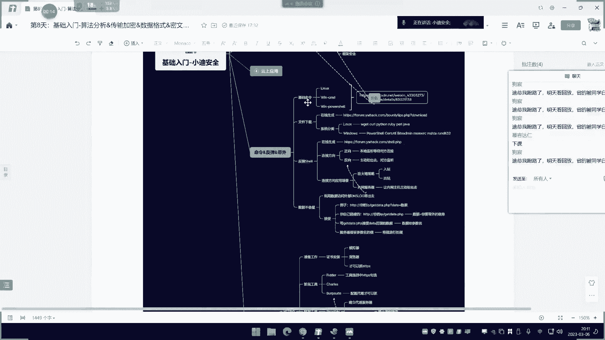

给大家说一下啊，那现实呢有个大致的了解，然后呢我们再把这个每个方向的点呢，给大家单独的列出来，然后呢再去做为一节课和两节课呢，去把它单独讲一下，然后我们今天主要学习的是这个四块。

第一块呢就是这个加密编码，包括一些格式混淆等等，这些东西呢，就是为大家呢在后期做测试的时候呢，呃这个数据的一些情况呢有些一定的了解啊，然后呢知道针对这种情况是怎么一个办法，那才能进行测试。

就说他是在做我们这个后期的安全措施里面，包括像漏洞的分析，漏洞的这个探针啊，包括挖漏洞这种情况下面啊是必不可少的一步，就是说你必须要有这个知识点呢，你才能在后期的这个漏洞发现里面能做得更好。

然后呢我们来看一下今天的内容啊，主要从四方面讲，第一个是传输数据，在传输格式，还有像这个密码的存储，包括源代码的一些问题，四个方向，我们先来看第一点啊，这个传输数据里面的一种情况。

然后呢这里有一些基本知识，我们基本知识呢先不给大家去讲，先看一下，然后呢从这个实例中呢，去把一些基本知识都给他带入进去，首先呢我们来看一下啊，为什么要去学习它，我们通过这个例子呢。

再通过讲解呢给大家搞清楚，首先来看一下啊，你像这里呢我们举个例子啊，这个网站啊，我们可以看一下啊，给他找一个。

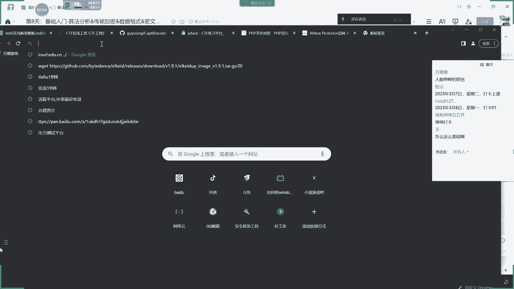

那比如说像现在呢我们给他找一个这个地址呢。

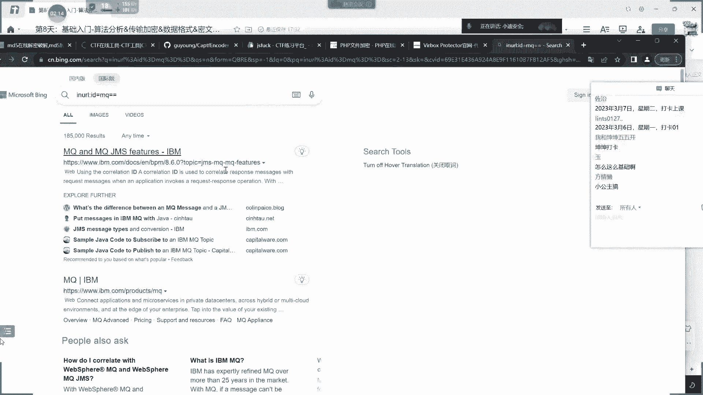

你看这个了。

我们看这个地址的一个URL地址啊，这是个URL地址，我们来简单的给大家看一下啊。

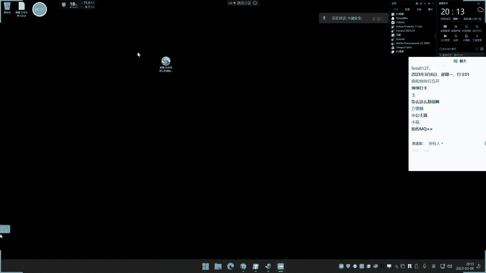

那这个呢是一个网站我们正常的一些诱饵，你知道可能是一个什么情况呢，就是说没有这个数据进行这个加密编码的话，他这个可能是等于一，然后呢正常是这么个情况，那他这个地址那就变成一个MQ。

等于等于MQ等于等于是个什么东西呢，我们来看一下，这个呢我们打开一个这个加密编码工具啊，我们这里面来选择一个模式，这个贝斯流斯的，我们把这个MQ等于等于放到这来啊，进行一个解码，解码之后呢。

它的结果是为一，那decode解码编码为一，然后一在这里进行编码，就是什么MQ等于等于，其实这里就相当于是等于一，那为什么要把这个东西露出来去给他讲。

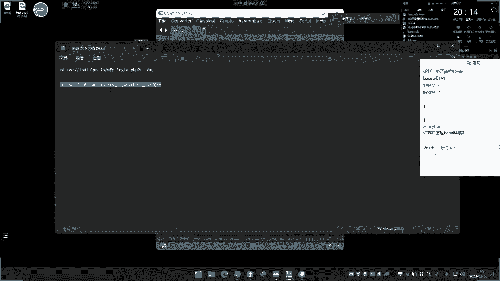

原因就是什么呢，就是很简单啊，他这里其实就是ID等于一是这个页面，然后啊我们拿出来讲的主要原因呢，就是因为他这个值呢做了一个数据的编码，就是我们编码的形式呢是这个东西，就说你这里写一的话啊。

他那是访问会失败。

但是你等于这个MQ等于等于的话，它就正常了。

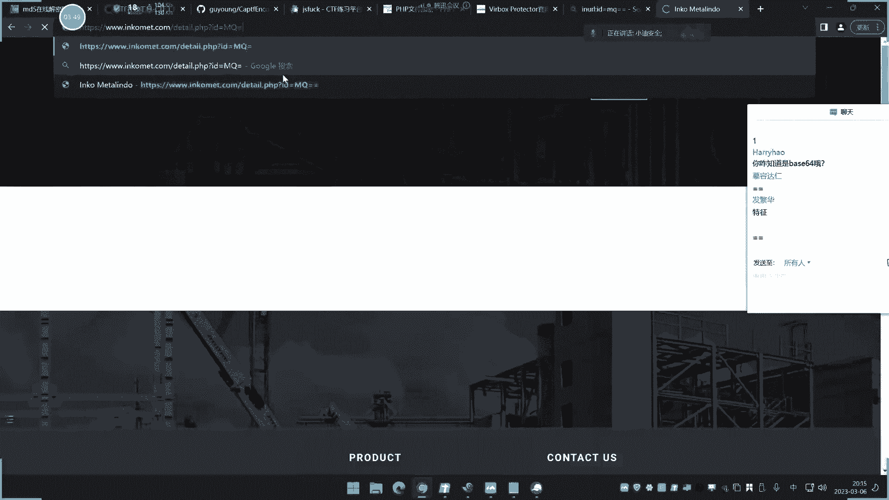

然后呢你再等于二它又会失败，但是呢你等于这个R的一个编码值。

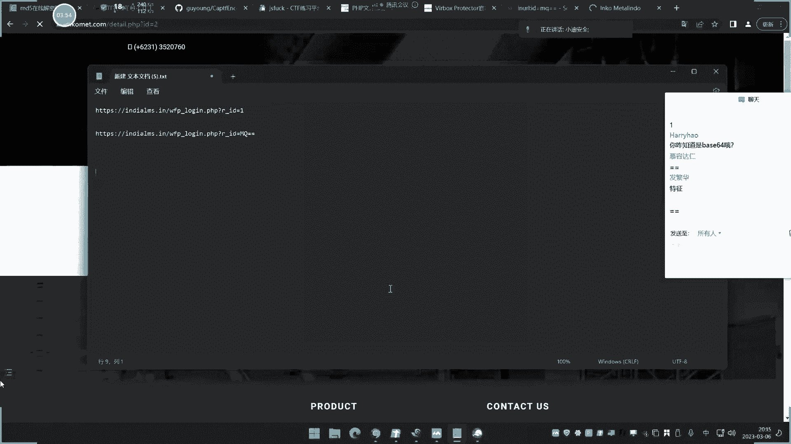

把R进行编码，等于这个mg等于等于的话，我放这里诶。

它又增长了，页面的又增长了，其实也就是说是个什么意思呢，就是说这个数据在，传输的时候啊进行了这个编码，那么进编码的话，这个会有一些哪些影响，我们为什么要去了解它呢，啊要了解这个东西呢是不是很简单啊。

如果你在这里测漏洞的话，我们都知道啊，一般在测试这个安全，测试这个漏洞的时候呢，通常我们都会进行这个数据的修改，数据的这个修改增加呢来进行提交测试是吧，这是我们在做漏洞探测的时候，就是我们说的啊。

经常会方山县这种漏洞攻击渔具啊等等，那么很简单，如果你没有考虑这个编码的话，你在这里呢直接去写一些语句的话，比如说这里后面是你的公寓鱼，那这个语句呢就和这个编码呢就不一样了，其实就是说很简单。

数据这里来进行编码之后，那么对方的服务器，可能会在接收的时候进行这个解码，再代入进阶嘛，再带入的话，如果啊我们呢还是按照这个什么燃油的思路，不对，自己的这个payload。

payload就是我们说的这个攻击的这个语句，进行这个同样的什么编码的话，那么传入过去的东西就是一个不认识的东西，那么这个车子呢就是无效，所以这个倒是很简单一个案例啊，就相当于说对方是结束这个值。

在对方服务器上面呢，它会把它进行还原，还原成一对不对，那么你在测试的时候，你也要按照，所以正确的思路应该是什么的做法，应该是测试的话，也要怎么进行这个payload的意思吗，同样的什么。

同样的这个加密或编码进行这个提交，能理解吧，所以正确的做法是，你同样的要对你的PLOAD的，和他保持一样的加密格式进行提交，因为你保持加密格式的，对方在进行一个，再把它进行一个什么解码的时候。

进行解码的时候，那么它才能把它正确的解出来，才是正确的，也就是说你要按照他的格式来去传输数据，对方才能争取的结束，简单一句话就是啊，以这个数据的正确格式发送接收才行。

就是说呃这就是说我们为什么要了解的原因，那么了解它的原因，其实就是搞清楚这个数据是什么格式。

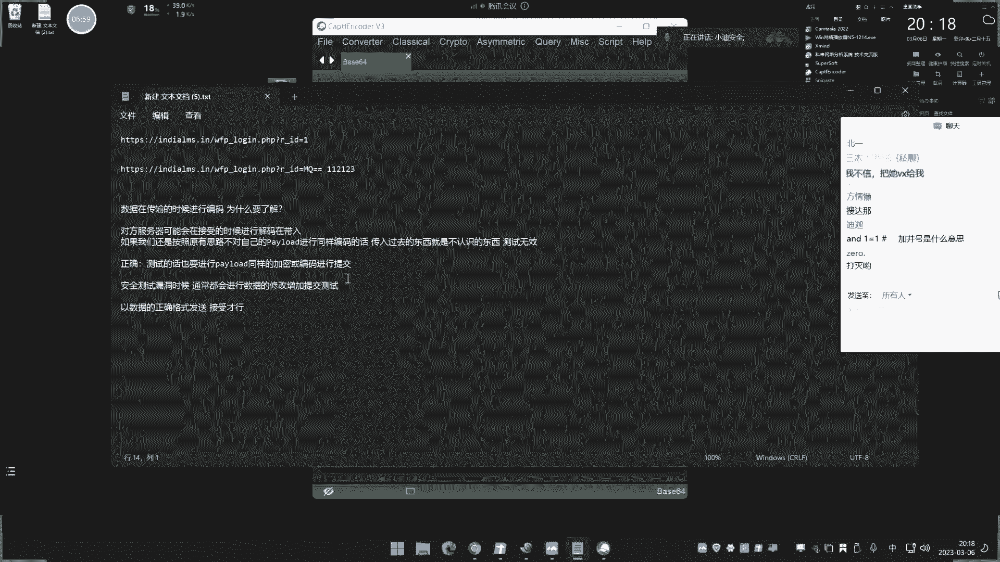

是什么加密，或者说什么这个编码，然后呢按照这个格式呢去测试，否则的话你进行正常的测试的话就不行。

这个呢我相信这所大家有理解了，所以我们在做漏洞测试的时候呢。

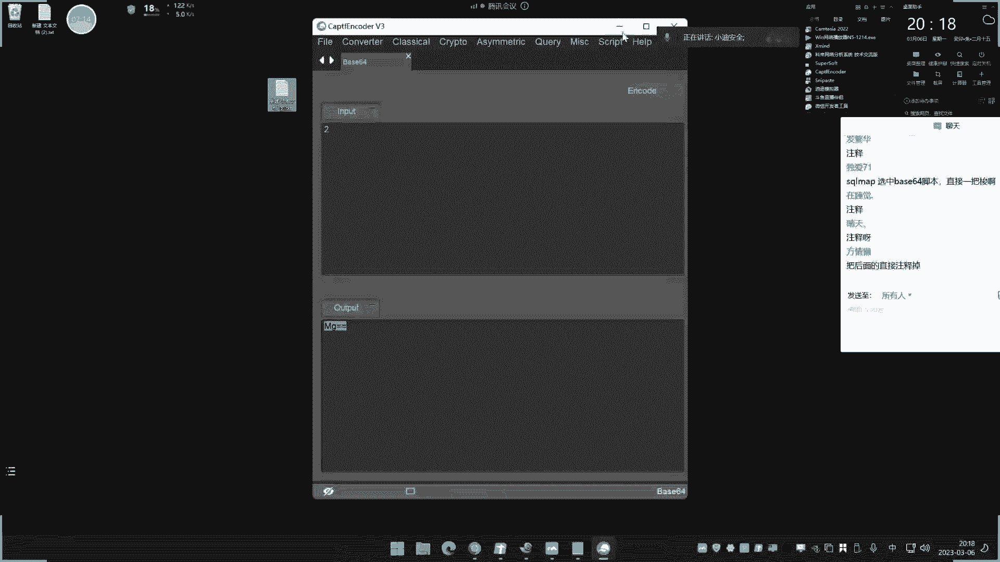

像这个传输数据，这属于传输数据，什么叫传输数据呢，就这个数据呢你可以修改它，然后让对方去传进去，对不对，有编码型的，有加密型的，我们再给大家看一下，你比如说像这个博客登录。

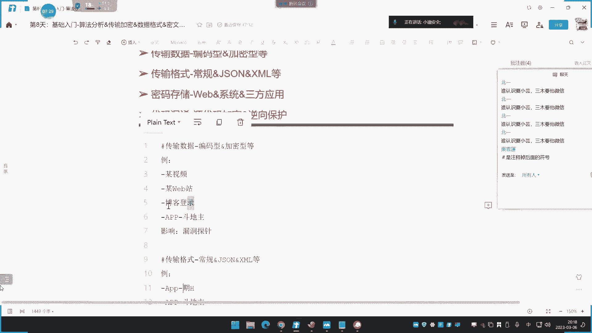

我再给他举个例子啊，你看我这个博客登录，我给大家抓个包看看一下啊。

好我们现在呢嗯给他抓个包啊。

看着啊，其实这里不用抓包也可以啊，我直接在浏览器里面看一样的啊，浏览器里面可以也可以开那个数据包。

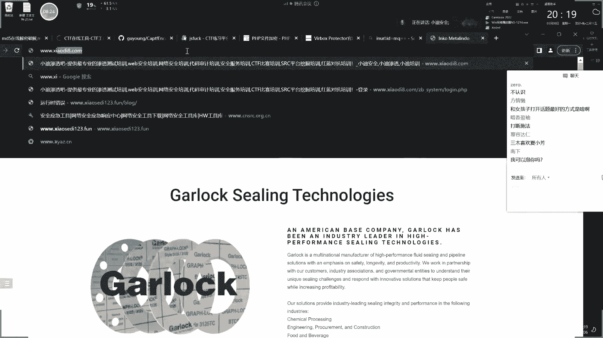

比如说像我们这个登录的这么一个，我的博客的登录后台，我们假设我们要在这里面来测试这个账号，密码是我输入一个密码，输入个账号呃，账号输艾德米密码的，输一样，3456。

那么在这里呢我们可以点击这个审查函数，监听一下网络包，在这里也可以抓包是吧，然后点一下确定他这里呢就会有一个数据包来，你这里就是那个post提交到数据包，我们来看一下啊，他的这个数据包里面呢。

我们可以看一下他在这里发送了账号密码啊，我们直接用这个这边看吧，我还是开个代理吧，用浏览用这个boss的话会更加的清晰一些，把代理开一下，好同样的，我在这里做一个提交。

看这个数据包啊。

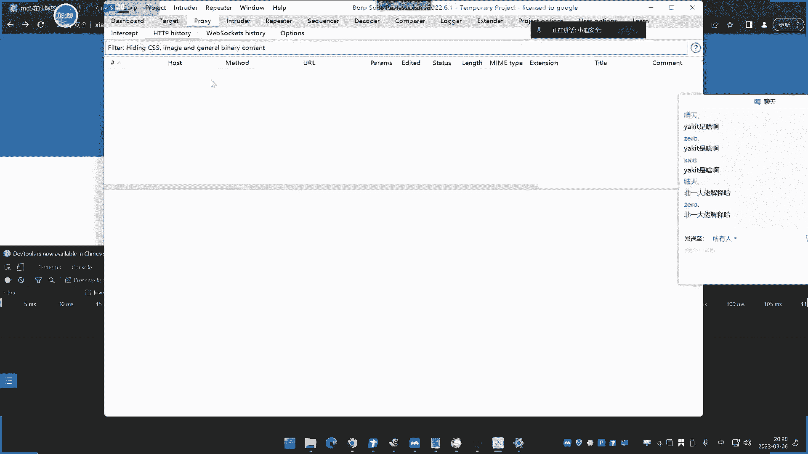

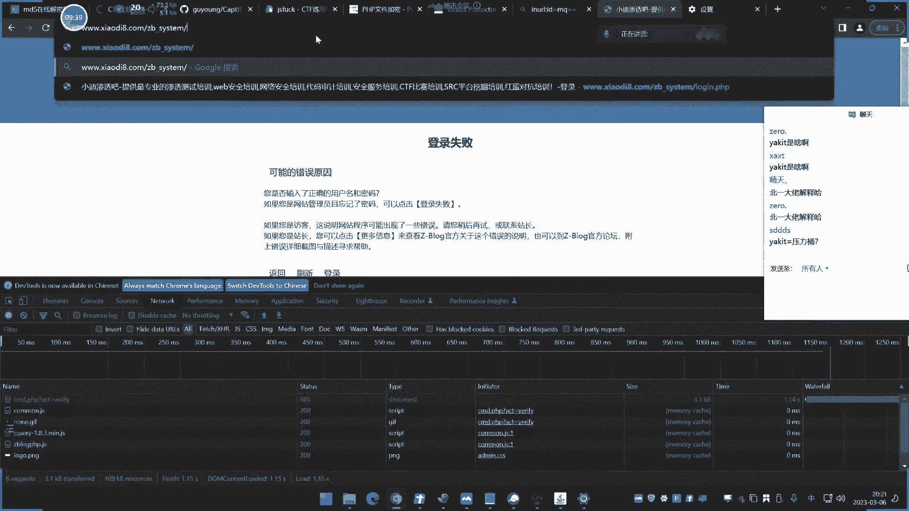

我把数据包抓一下啊。

水平写个123456抓个包好。

这里的数据包到这来了，我们看一下这个数据包啊，那你看这里啊，ULEMON等于amy password，变成了一个什么，变成一长串，这啥东西啊，这是啥东西啊，我输的是123456，怎么变成这个东西啊。

好我们就把这个东西拿出来去。

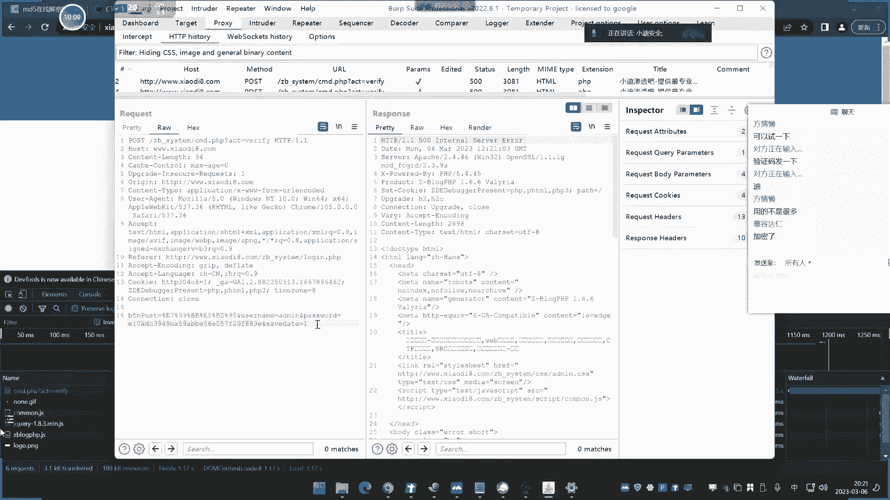

给大家简单的分析一下啊，这刚才那个案例，我们再看这个案例，这是一个什么登录的，一个在一个数据包，那么这个数据包里面呢，我把前面这个不关去掉了，就把这两个去掉，然后保存这个账密码就可以了。

我输的是艾米和123456，编程这个东西好，我想问你，如果现在啊我要进行这个密码的一个破解爆破，那么我去传入这两个值的时候就需要怎么办，就比如说我两个支点支点文件，一个账号字典呢，就什么都不用改。

去替换这个里面的值即可是吧，但是如果说这是账号，这是账号不用改，那么密码字典呢需要更需要什么，进行这个密码的三把包装和这个什么这个值，同等加密，开启对不对，你必须要这样做，你才是一个正确的爆破。

否则的话就会失败，为什么，因为他的密码传输的时候是这个加密方式，如果你直接传输，你是怎么传输啊，你直接密码什么都不懂，你密码里面写的是123456，那么就写12356，你这样去传输行不行不行，为什么。

因为你可以可想而知啊，他这个密码呢针对加密，那么也就是说对方是判断的是个密文，判断的是这个密文，如果你直接传123456，1346，对方用这个算法去解密，13456是个什么东西呢，啥都不是。

你必须要按照他符合的格式去传输这个数据，才是他一个正确的判断，所以你就必须要搞清楚这个算法，搞清楚算法之后呢，把你的铭文的像123456，把铭文呢变成123456的铭文，再到这个上面去再测试。

然后呢到这个之后，你再把理想出来是123456，你就知道密码是123456，这个案例就更好的说明这个问题，所以我们为什么要搞清楚，一些这个一些传输数据里面的数据，是不是加密了，数据是不是编码。

数据算法你要搞清楚这个之后，你才能去测试，否则的话你连他的这个方式都不懂的话，你随便把数据写进去，对方这个数据接收过去，他认为这个数据他不认识，他压根就没有带入到正确，正确的这个业务功能里面去。

就很简单，就像这个你直接把这里改成1356不行，对方接收到1356，他不认识，因为它的代码逻辑是要解释一个密文，这个密文呢是要通过他的理想算法，才把它还原出来，再比对啊，你这个时候呢直接传你1356。

他不认识，所以我们要传，要让他进入他的正常的这个验证逻辑的话，就必须要按照他原本的数据包的那个，格式去发送，这样子呢对方才是进入这个逻辑，能理解吗，我这样讲大家能不能理解，理解了这个就好理解。

这个就好理解了啊，你如果理解不了，那就没办法，对不对，你看啊，我就举这几个点呢。

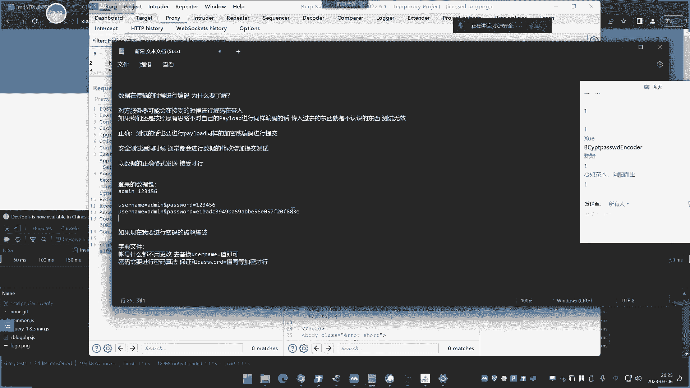

大家就知道我说的是什么意思啊，对了你看。

那么所以说这就是呃这个情况。

那么这里除了这个之外，还有没有其他的呢，还有啊来我们继续看啊，还有你看这个像我们说的APP的一些。

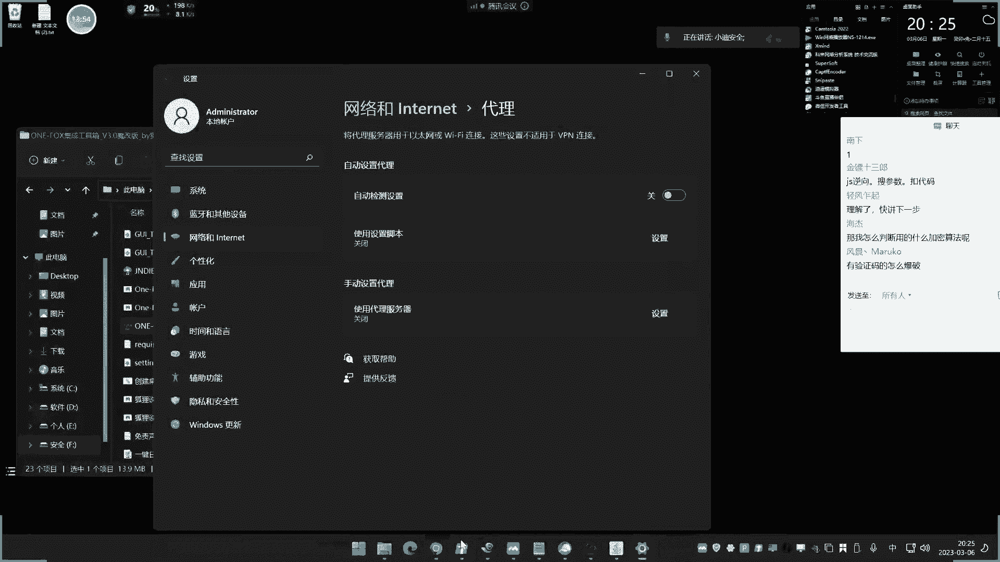

这个这个数据，大家可以看一下啊。

是不是会有这种加密数据啊，我们抓个APK的app的数据给大家看一下，就是说有很多啊，不管是网站还是app的，还是这个什么小程序的这些啊，你不管是什么啊，你就可以看一下他在这个数据传输的时候啊。

我们要搞清楚这个数据传输的加密形式呢，我们在后期测试说啊，这里呢提前一句话。

刚才我说了啊，就这句话要大家理解，就是我们在做安全测试漏洞的时候，通常都会加一些把他的数据进行更改，或者增加的来测试这个是不是有安全问题，就说你不管很多漏洞，都会什么都是这么个测试方式。

是把一些数据都把它修改，然后修改之后呢，取车车胎也没安全都懂，所以测的时候呢，这个数据的这个加密方式，或者说有没有加密这些呢，你是要提前搞清楚的，如果你不搞清楚，你随便在上面加一些这种东西的话。

那他不是他的牙根就不识别，就没有带入那个逻辑，那这个漏洞是怎么测都测不出来的啊，就是那个入口你都没入，好我们来看一下啊，我们可以随便抓一下这个app数据包。

看一下app数据包里面是不是这个，来我们抓一个这个app数据包啊，大家可以看一下啊，我先把原本的给删掉好，我们看下啊，app里面就说这个斗地主这个东西，诶这个声音怎么关掉啊，声音把线关掉啊，哎。

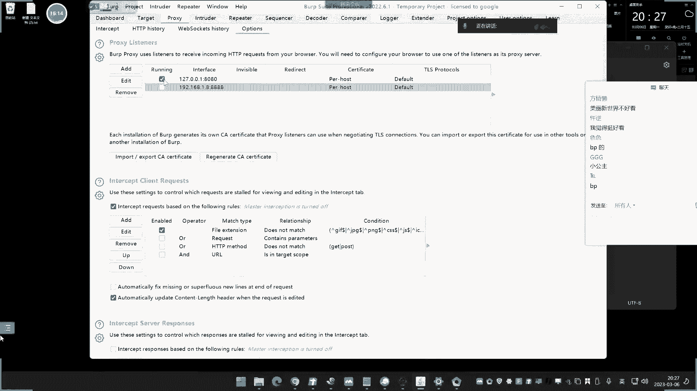

把代理开一下。

好这里有数据了啊，大家看一下啊，我们可以随便的给大家看一下。

这个数据包的情况，大家看到啊，你会发现在这种大量数据包里面，经常就会有一些这个加密数据，你看返回数据都是加密的，你看为什么说它安全，就是他很多东西都采用加密，你看这里是大部分数据包，我们可以来看一下呢。

好这里呢就打开就看到这个啊，我们可以看一下他的一个数据，你看地址上面都有这种呢就是加密数据，这不是说正常数据啊，正常数据不是这样的啊，要什么一样，但是怎么乱七八糟的英文字母和数字，这么长的一个组合呢。

这明显就是一个一个正常的铭文呢，被通过一些算法呢颠覆了这一长串的东西，对不对，就是这里呢是一些参数，这些是可以把它进行修改，进行测试的，但是你这里让你搞不清楚它的这个呃，加密方式你就无法去测。

因为那你很简单，你加入你把这地方你把它更改，你再去测一下这种漏洞是吧，加一些这种推漏的呀，怎么在这里加加上去之后呢，这啥东西他啥都不是了，因为对方结束了，要符合这个格式的，他才结束过去才能正常进入逻辑。

而你呢你不搞清楚这个算法，那你就无法预测，能理解吧，所以你看着看着呢，它有很多这个不一样的地方，而且你可以看到啊，他连这个返回的这个数据包的结果呀，这边是发送方，这边是返回的嘛。

就是返回给你看到的这个结果呢，也是一个加密的，所以你不知道这散户的究竟是啥东西，所以就不了解这是干嘛的，就很简单，如果正常了解的话啊，他如果说返回一或者返回二或三，你就知道哎这123代表什么意思。

但他这样一返回，你就不知道这是一还是23，是啥都不知道，所以你也不清楚这个数据包究竟是干嘛的，那么你车的点那就会少少了，你漏洞发现的几率就会小，就这么个意思，但是你把数据搞清楚之后呢，他就他就好一些。

所以这个呢就是我们说的啊，在很多这个地上面都有，你看我们一些视频上面。

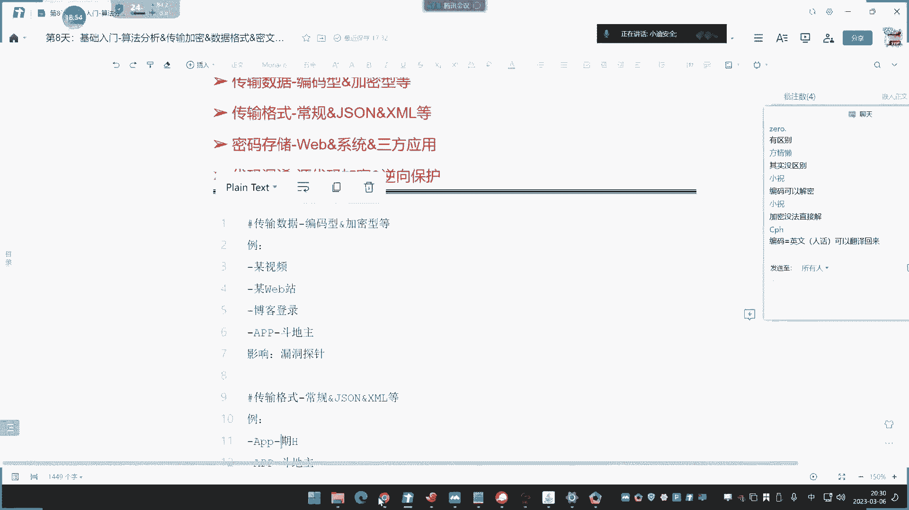

上面也会用到一些这个加密的一些东西，我们给大家看一下吧，你像这个搜狐视频啊。

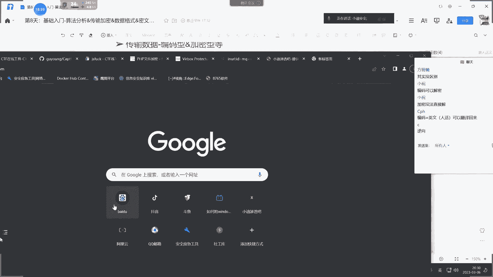

这种是吧，也是这个演员的一些搜狐视频，你看他的一些网址的一些情况，大家可以看一下啊，那我随便点开一个地址，我们看看这个路径地址，你打开看一下，你看这个地址啊。

那这个地址后面加上一个非，你看这是一长串的这个文件，你觉得一个文件名是这个东西吗，不是的呀，那这些长传这是文件名吗，不是的，我们来尝试用这个base60来看一下，是不是base60。

解密那是不是一个base60是等于这个看到没，US加上长出来是这个路径，解密之后是这个东西，而你可能会问他为什么要进行加这种加密，或者说进行算法呢，因为他这样子呢能保证一些东西的被泄露，就很简单。

利比亚说我们登录一个网站的好，你说为什么要进行这种事情啊，其实很简单很好理解，假设了一个路径后面写上个U能不能艾特米，而你就知道诶这个用户是艾德米，对不对，他如果把艾米呢换成一种算法的一个显示模式。

就比较大是吧，他把这个艾特你的缓存这种东西放到上面去，你不明白的，你就知道这是啥东西啊，看不懂啊，你又不知道是谁的，你对不对，所以你也不要问他为什么要做这个事情啊。

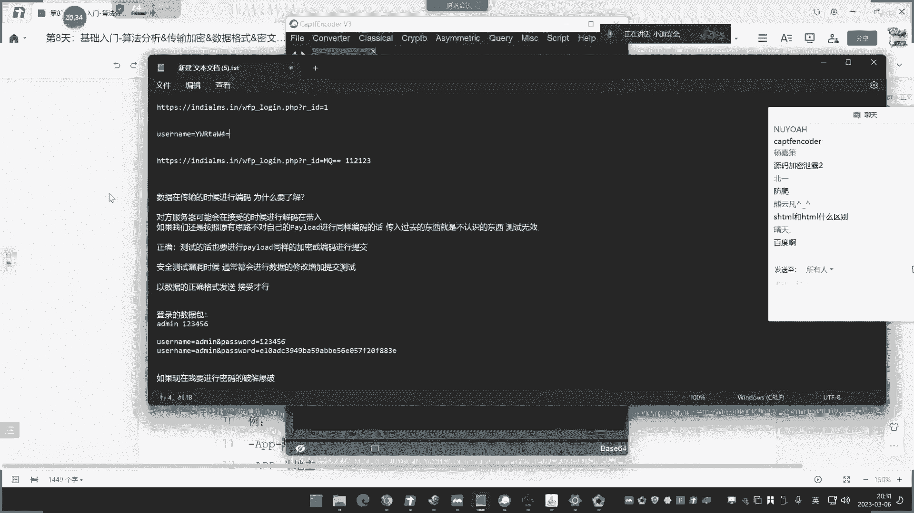

他做这个事情呢就是把一些东西给他看上去呢，让你不能那么直接的看出一些东西来返回，数据加密，加密啊和编码都是为了做一些事情，保证它的一些安全性，也是防安全的一种情况，那么这种情况呢。

就是我们说的它的一个这种类型，除了这个之外，还有一种叫传输格式，也要讲清楚什么叫传输格式呢，我们都知道数据的格式呢有各种各样的写法。

我们来举个例子来，我写一串123是吧，比如说我这个X等于123，我可以这样去写，对不对，我还可以这么写，我写个X，然后一个这种符号是吧，写成一个东西，然后写在这个里面是吧，X等于L冒号123。

我可以这样去写，对不对，我可以这样去再写，把它括起来，或者呢我利用其他的一些东西，就是他这个数据呢它有很多格式，比较经典的是什么JS文格式，还有什么XML的一个格式，还有其他的常规格式。

常规格式就是我们正常来讲，X等结算就这样写是吧，就这样写，那么由现在它就不是这样的写法。

由现在就不是这样的写法，有些就不是这样写法，我们可以抓个包给大家看一下啊，就我们刚才不是抓到一些数据包的吗，你就拿那个浏览器这个小六八。

刚才登录账号密码那个数据给他看一下，他是怎么写数据的，我们看一下啊，他在登录的时候呢，这里有个提交，提交了，就是这个数据就是这样一个写法，来数据是这么个写法，这是常规写法。

就其实就是说这个值呢就等于这个，然后这个use name9my password，就等于这场穿啊，是这么个写法，对不对，那还有一种写法会怎么写呢，你看啊，我们就随便找个写了，就像我们刚才说的。

他会把它全部写到一个索引里面，然后呢这个就等于这个U来到下一行对吧，他会这样写，他把它每一行的就像是搞这种情况，要啊去这样去写啊，它可以这种写法去写，对不对，然后呢这里就变成冒号。

然后呢字符串就有这个什么双引号或者单引号，把括起来，对不对，还有这样的可以这样去写它，哎他就这样去写，这也是一种传输方式啊，那这种写法也是一种传输方式啊，那你可能问，那我这里要学这个东西干嘛呢，很简单。

如果你去测试配漏的，你测这个点，你是在这里写啊，那按你123对不对，你测哪个点你咋写，如果你写到后面来了，那就写到这个参数里面去了，如果说你写了这个来，那就写了什么艾米这里去了，那么同样道理。

你在这里去测艾米，吃艾米的话，你要改变艾米的这个这个账号，你说你爆破的话，你要修改你这个登录的这个什么用户名，改他的话，你是要在这里改啊，对不对，修改密码只要在这里改啊。

而且你必须要按照他的格式去发送啊，你能不能把这个东西放到这个东西去，发送给他去提交啊，不行啊，他认识这个格式，那么就必须走他这个格式啊，一样道理，它是怎么传入的，编码传入的加密方式，你就按什么加密方式。

它是什么格式，你要按照什么格式格式，错了也不行，就像我们开发里面，开发里面是不是有很多格式啊，开发里面举个例子，开发里面是有这个什么输入格式啊是吧，数组格式还是什么列表格式啊，是必须要看它的格式啊。

对应上啊，你不按照格式的话，在结束的时候就会有问题，那我们可以看一下这个数据包里面有没有这种，我们刚才说的这种东西呢，有的啊，来我们可以随便抓个包的，不管是app的好，还是说这个我们说的这个什么嗯。

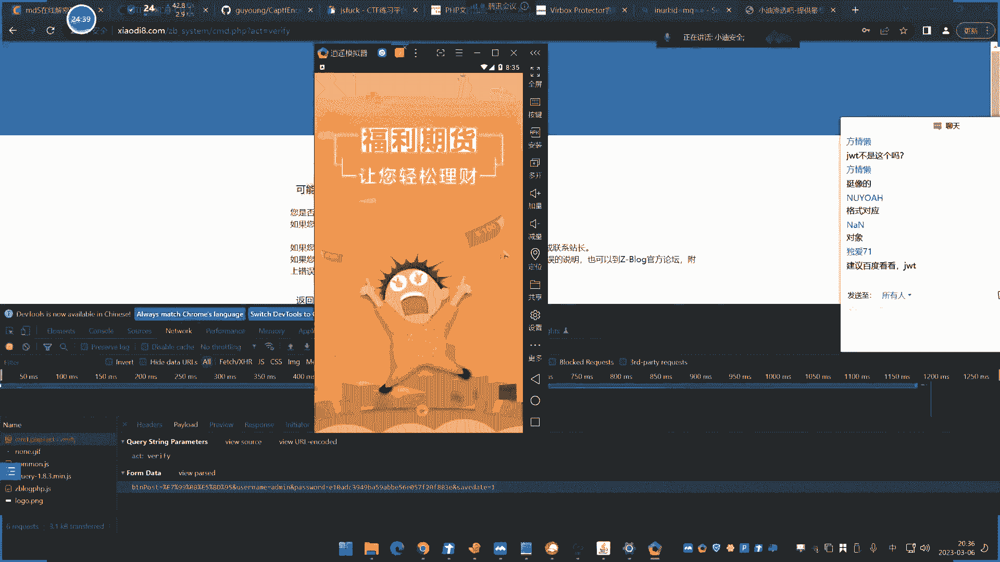

网站也好，都是有的，那你看你看这个呢，你看这个格式来看没，他是不是就是和我刚才说的差不多，你看看这格式，这种格式写的看到没，那这种呢就变成这种格式了是吧，有不同的写法去写，那么你在测的时候。

也必须要按照他这个格式的写法取车才行对吧，那你看他返回的数据也是的，你看他有些返回的数据呢，有的是你看啊，我们看看前面看，那这种就是这种返回来看到没列表格式呢，前面写个什么这种大括号。

然后一个中括号是吧，但是这样去写啊，有些在返回的就是这种的，看到没中括号，然后呢这种兼职返回啊，有些呢就是我们看到的是什么情况，有些也是这种，有些种子呢XML的一个什么语言格式呢。

不同的方式方法也不一样，有些就是纯粹的源代码，就啥都不是，就是一个一长串TM代码，有些人就是不一样的，有些是这种类，有这种什么列表形式的呀，还有什么数组形式，还是这种列表形式，还有JSN形式。

就像这种一个兼名对应兼职是吧，这种对应上那发送的时候呢有常规返回来，就是这种格式返回我们都不看啊，返回看他的话便于我们做什么事情呢，我给大家说一下啊，刚才我讲的传输数据的加密格式，它的影响就是漏洞探针。

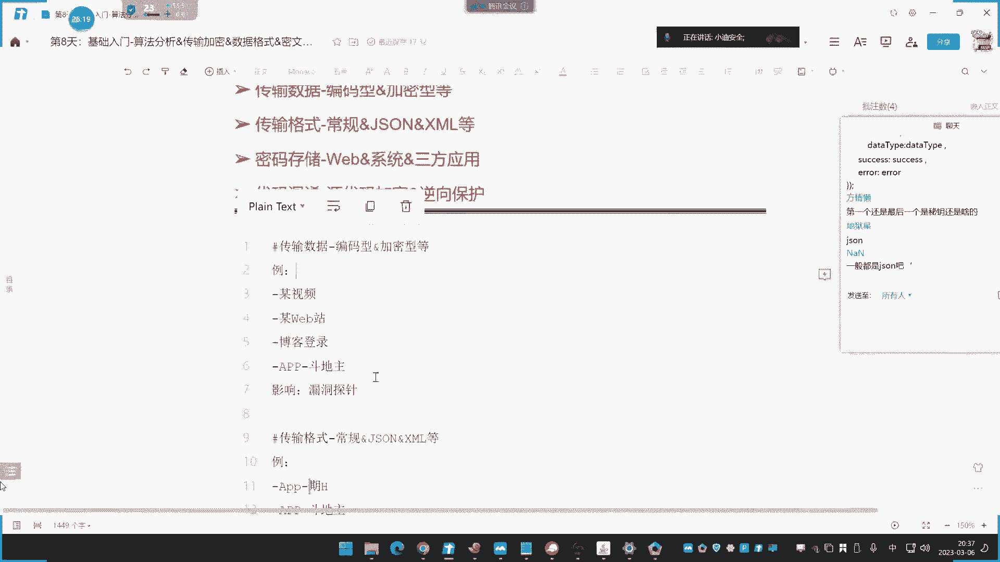

因为呢你要搞清楚它的加密值，然后呢，你才能按照正确的加密值呢进行修改之后呢。

来测试，所以他的影响就是针对我们后期在做漏洞探测，漏洞挖掘的时候，就说知道他有没有漏洞，我要去测，就必须要按照他那个固定的加密值，或者说加编码值来进行测，所以它影响的是漏洞探针。

但是现在这个数据格式它影响的是什么呢，发送方就影响到了是漏洞探针，回前方就利用到的是数据分析，怎么好理解的这话了，这面是属于发送方，正面是属于返回方，我发送方，我看它的数据格式是用来去测试你漏洞。

利用的时候，我要注意按照他的格式去发送去测漏洞，对不对，所以它影响到的是什么，你的漏洞探针，因为你是法国区进行判断有没有安全问题。

回钱的数据就是对方给你回血过来数据。

如果说回旋的数据你也搞不明白，回血的这是啥玩意，对不对，就像我刚才看到的数据包啊啊，这是回血数据是吧，你不了解这个格式，你都不知道哎这个代表什么意思，这个代表什么意思，对不对，所以你把它理清楚。

这个格式的话是便于你对它的分析，便于你对它的分析，包括他有些返回的数据，还是这种加密值，你看这个加密值，我们也要对这个返回的值，看能不能把它理想出来，得到这个什么，得到这个值的一个结果，得到结果之后。

你就知道诶这套数据要发过去，它是一个什么结果，就很简单，他如果说你这里这个返回这个数据包发过去呢，是一个错误结果，他应该提示是错误，但是他在里头搞了个加密值，你加密值的结果是错误，但是你看不出来。

你又不知道是正确还是错误，对不对，所以啊回弦值的一个格式和它的这个算法，就是便于我们去分析数据的一个情况，但是它只是一个分析发送方的这个格式，和加密值，编码字就是用来去分析漏洞，有没有漏洞的情况。

就是探测漏洞，所以啊一个是传输的数据，数据里面呢可以进行编码，也可以进行加密，我们刚才的那个两种呢。

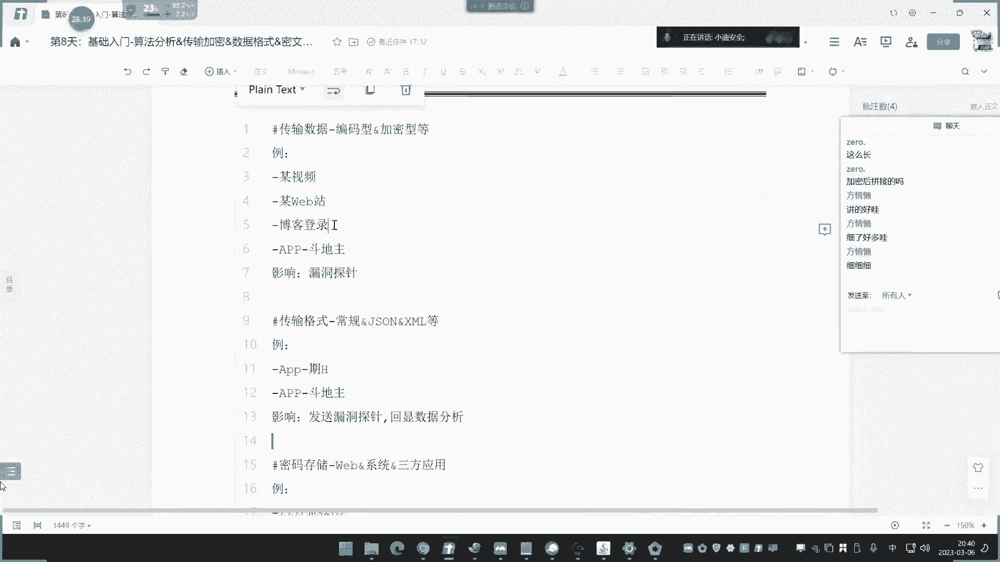

你看这种呢是把值进行编码，进行了什么base64的编码，这是我们学习的第一个base，64的一个编码算法，对不对，然后呢刚才在这里讲的那个登录数据包，这个密码是怎么个加密呢。

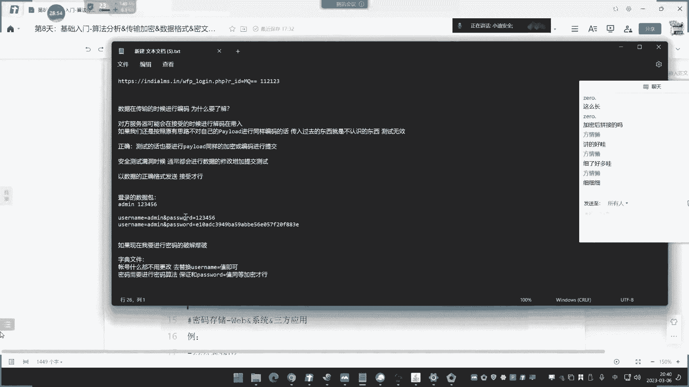

我们可以把它尝试去解密一下啊。

估计是个MD5，我看一下是不是啊。

他解不出来，那123456，那4MD5看到没减，123456，那里是个什么MD5的什么算法加密算法加密，对不对，这是我们学的第二个MD5，这个是贝斯六四好，你可能会说，那我怎么知道是哪一种编码。

或者说又是哪一种算法呢，这个呢现在不需要额外了解，我们先把这几个东西搞清楚之后，它的影响之后，我们后面的课程就是给大家说一下，它的一些规律和如何判断的一些技巧啊。

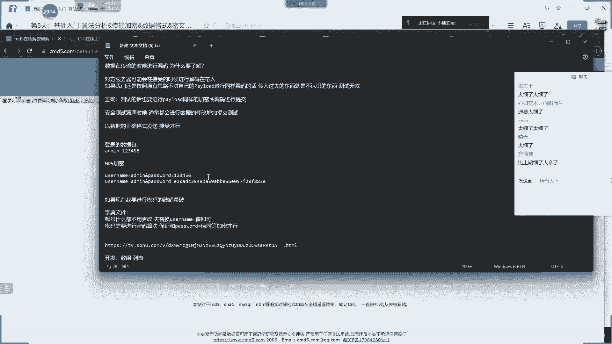

好那这里呢我们已经说到这里点了啊，对不对，能不能理解啊，格式也要看数据的这个形式，要看就现在说他是一个什么表现形式，它要是走的什么加密或是什么编码，这些都要看你看了之后你才能注册，就很简单啊。

就像刚才那我抓这个数据包嗯，把数据表拿出来，那这种呢这是铭文，就说这里没有进行编码，也没有进行这个加密，所以他看上去都看得懂啊，一个参数一个值对吧，但是如果你碰上这种呢，就刚才这种类，这种也是一种什么。

也是一个明文，但是它的格式是这种格式的，所以你测的时候就必须要按照他这里了，像他这种测法就在这里呢，比如说我在这个地方，你就在这里写一些这种攻击语句。

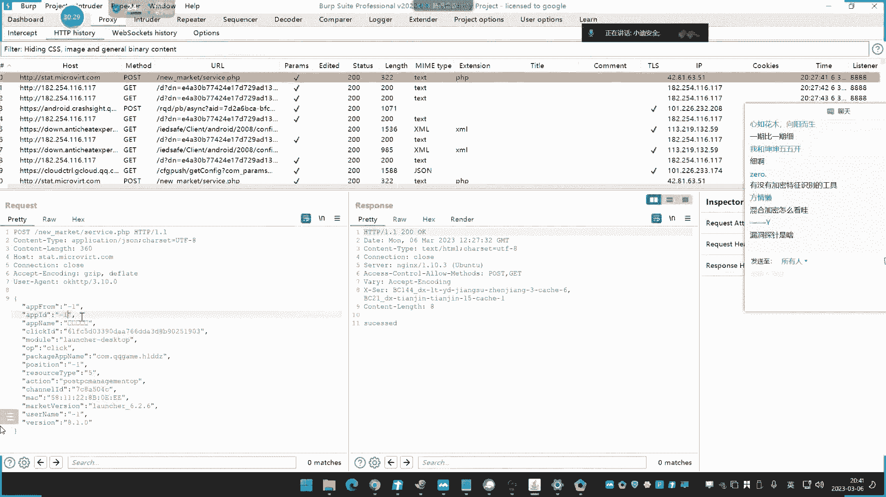

就测这个点，对不对，你就不能是吧，像这种格式呢骑车了。

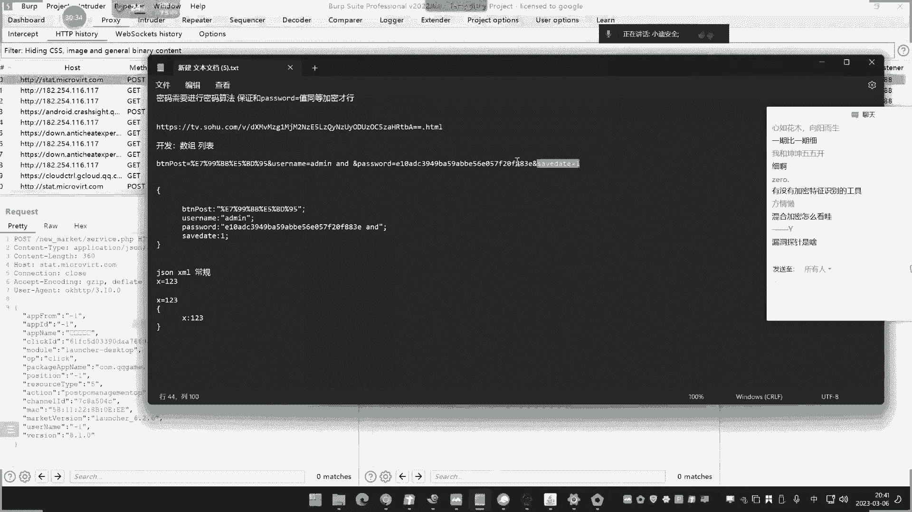

那就有问题了啊，所以这就是我们所给所有的大家听的，然后然后你看这里测试这个数据也是一样，简单来说就是不能去修改它的原由，网站自身的这种什么加密，也不能修改它的这种格式，你必须要按照他的这个逻辑去测才行。

就像我们说的，你必须要按照他这个流程去走，才能进入到他这个测试的一个入口，否则的话你连路口都进不去，就相当于说你这个东西是错的，发过去别人就结束了，那怎么去测试它的安全性呢，就测不了了啊。

就是要搞清楚他是什么格式格式，JSN还是XML，320呢，就是我刚才看到的啊，对这个有320，这边呢是有这个类型，你看为什么说经常会用到这个BB的这种工具呢，因为它是一个安全测试工具。

它很多功能都是给我们分析的，这个代表什么意思呢，难道是主机地址，这个是请求方法，这个是U啊，路径地址，这个是有没有参数，有没有参数，就说有没有参数值，你看化成对勾的，就是里面有参数没有化成对勾的。

就是里面的空的，能理解吧，然后这边是它的返回长度，然后这边是什么数据的类型，你看特殊类型是代表什么意思啊，就是文本类型就是一长串只，然后呢还有什么script类型，就是什么脚本类型啊。

这是一个什么JS语句，然后XML呢就是XML语言格式，js winner就JS格温的一个格式数据对不对，问题吧，那这个呢是ATM的一个格式呢，就TM该死对啊，他都给你整理好了哈。

那这两个呢给大家讲清之后呢，我们接下来再来看啊，刚才主要集中的是在web方面的，就说APP呢虽然也是app，但是我app里面有网站，所以刚还是属于web方面的一些安全点是吧，那么除了这个之外呢。

我们再来看啊，还要了解一些常见的一些加密算法，刚才了解到贝斯六四和和MD5，但是我没有说怎么去判断是哪种格式，因为这些格式呢你用的多，你就记住了，他有什么规律，对不对，我们后面会说啊。

这规律呢是没有固定的，就是说没有固定的，就能一眼判断，都是要通过分析哪些分析，就拿现在来说啊，就很简单啊，那我拿两个网站给大家演示一下，两个搭建好的一个源码程序。

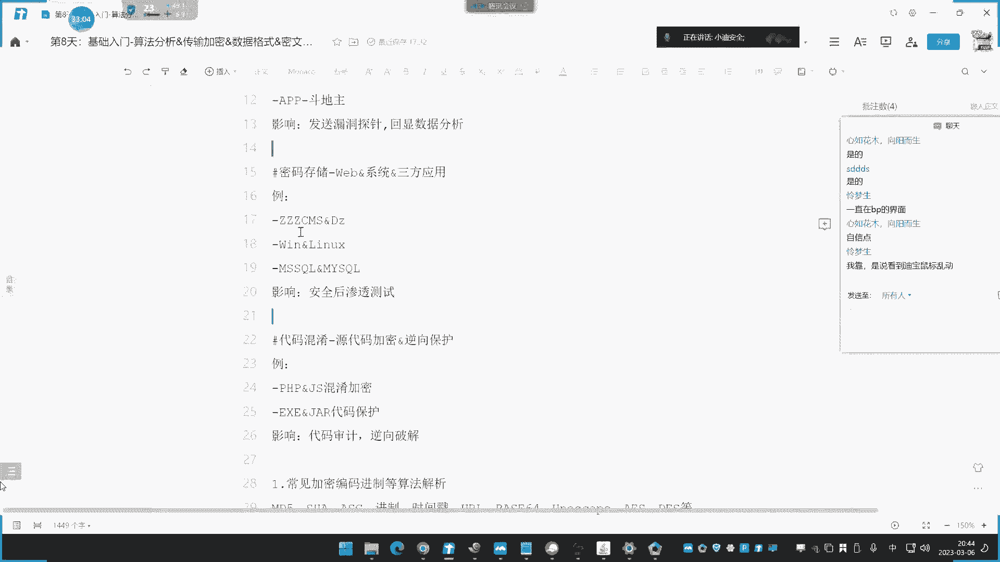

我给他搭建一下啊，我们用这个pp study给他搭建，首先呢我将这两个网站呢先给他删掉，重新给他打，他有些人呢连打都不会打，然后我是真的是没办法。

找到这个pp study的安装目录啊，然后呢我把那两个源码程序呢，先给大家拿出来两个源码下载的源码。

一个是这个Z这三个，这三个两个程序我都要把它打一下，先用这个ZZCMS的，然后呢我创建一个这个，先把这个源码把它解压一下啊，好解压好了，然后再写上域名，域名就是你的IP地址，就写你的IP地址。

就是你本机的IP地址，1。8端口的八零。

然后在网站目录就指向我这个解压目录，这里只是在目录保存好。

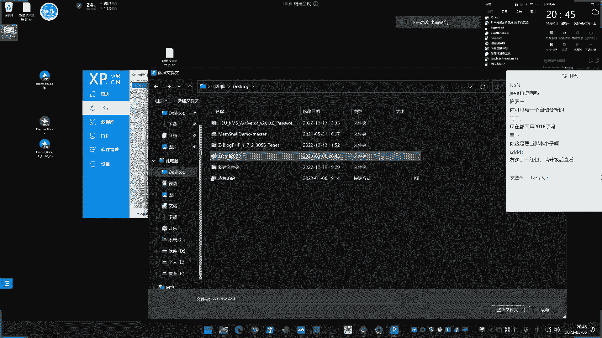

这里呢就用这个7。0版本把它加起来，点击确定好。

我们现在来尝试访问一下，看能不能正确的去访问和搭建，访问之后呢，他需要点击安装程序好，我们就来正常的一个安装统一下一步，下一步输入正确的账号密码，这个账号密码呢就是我们这里的数据库呢。

这个账号密码我密码是12356，数据库加密码，然后数据库名的水平取个名字就叫C4，密码呢就写123456好吧，就写123456，就是后台的管理上面好，点击把它安装一下好，这里呢已经这个安装成功好。

可以看一下啊，这是网站的一个首页已经搭建好了，这个程序搭建好之后呢，我们刚才已经知道啊。

那个密码是12356，好我们现在再来看一下啊，它的密码都会存储到数据库里面，我们呢现在用数据库连接工具啊，这个连接工具呢你可以下去下载一个啊，刚才下载一个破解版，我真的没有找到。

我以前的我都是一个试用版啊，然后连接下来点击新建MYSQL连接，然后输入你这个账号的账号密码13456，然后取个名字叫叉连接本地的这个数据库好，这是你本地数据库。

就是这个p p study启动下的数据库，MYSQL还是启动的好，连进去呢，刚才创建数据库名叫ZEM，打开在这里找一下，有个叫ZZCM的这个表，这个表呢就是存储数据库的这个信息的。

在我们前期基础课给他说过，数据库是存储这个网站的数据的是吧，打开然后你看这里是不是就有个账号等于艾米，立马pass等于一长串值啊。

好我们把这个长串字给他复制，放到放到这个什么网站这边来去解密。

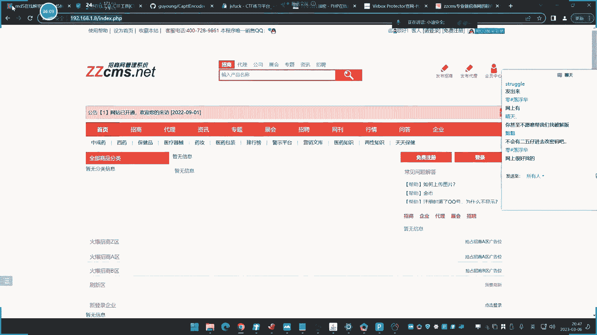

解密结果是1356，是不是就是刚才那个密码。

是不是就是刚才那个密码，对不对，是不是刚才就是我搭建好的那个密码，就是我的人那去登录123456，是123456，然后密码是二二答案，那就可以进去，对不对好，那么现在我们来做一个实验。

我把这个密码呢改成一个什么，改成个小，然后我把这个，就说你这里一旦这里改了之后。

在你这里密码也相应改，就说密码是储存在这里的是吧。

这是一种啊，我们现在把它记录下ZZZCMS呢，Sm1356，然后呢他这个密文是什么利用的，MD5加密好，那我们现在看一下一个DJ3。2版本，看dz3。2版本啊。

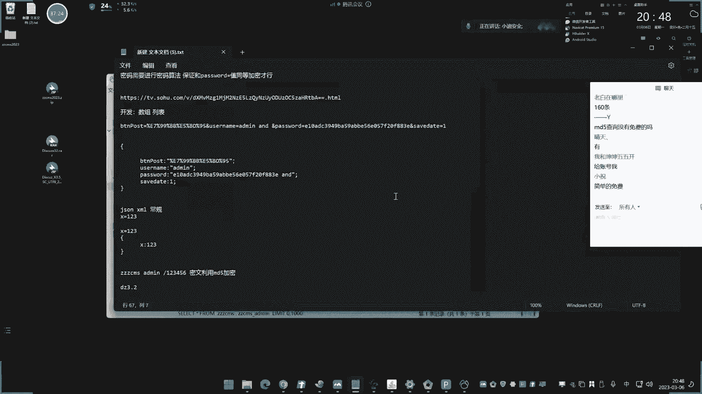

我们现在来安装3。2版本DJ的一个程序，一个以前老牌的一个论坛程序，论坛都是用这个程序好，我们这边把它进行搭建，点击创建网站啊，然后取IP地址还是写，刚才那个地址是162021。8。

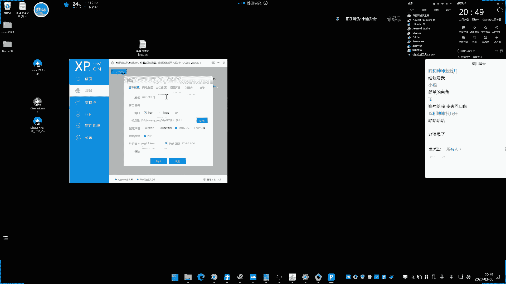

端口呢我就搞一个不冲突端口，把异端口找到那个我们的那个什么解压目录，就是在这里嗯，我这里还没有结，把这里还截。

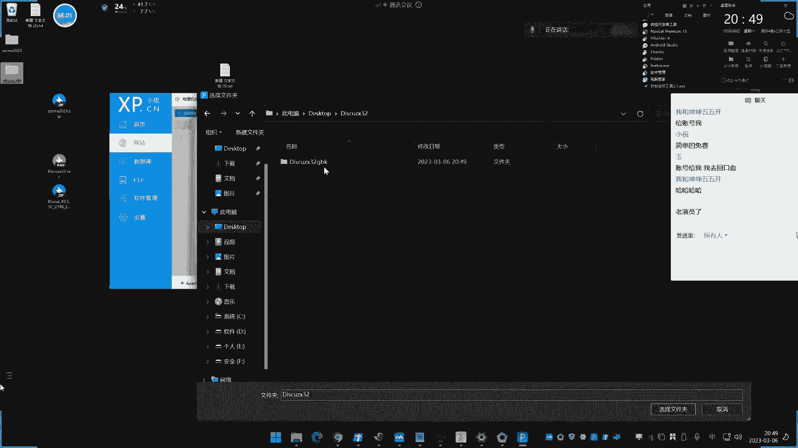

好找到这里啊，他选择中好。

然后呢选择这个5。4版本支撑它好好，然后这里呢就访问刚才的这个什么，把移动后去打印，好打剪一下啊啊，然后再给它点击下一步，好输入你这个数据库账密码，世界上流，然后呢这是你的网站的账号密码啊。

这个是数据库账号密码，这个是网站密码，网站密码呢我就写个艾特，你拔拔拔米八啊，就写个123456，123456，也写个1356密码，我也设置个1356点，下一步。

好这个呢就是我们用discuss搭建的账号，密码呢，我同样也是这个颜色是五六，那么现在呢我再来看一下我们连接它的数据库。

看一下啊，连接它的数据库，它连接上去之后立马显示的是什么，是这个吧。

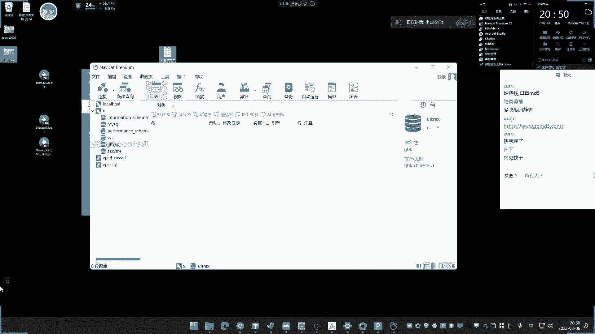

是刚才那个数据名嘛，打开这是他数据库，我们找一下啊，看一下啊，先把这个有数据的筛出来，这是行书嘛，把它塞下好，这里有这个数据，我们打开一下呢，比如说这里啊，这里是有艾德米的账号信息的。

这是一个password，看到没有password吧，对不对啊，除了这个之外呢，你可以看到啊，他还有个表呢，也有这个东西，就这里了，他也有了，这地方也有一个，这里有个password。

你看这个password，我把它复制下去解密，看能不能解密出来啊，好他解密出来，点击确定变成123456等条，缺少C啥意思啊，其实它是解密不出来的，只是我把密码呢给他设置的复杂简单一点。

这条密码呢是我之前呢给大家这个解密过的，所以他这里只能解密出来，它的解密要准确，解密呢要加上被减，那后面一个叫SAT，你正确的解密时，如果说不是这个密码的话，他正确需要什么，需要这个密文加上这个啥盐。

然后呢选择它这样去解密，它才能解密到，这才是正确的，然后呢你可以看到在那个加密方式里面，有个叫什么MD5，加上MD5，再加上password，再点盐来自于什么Faker，然后什么IICEBB和DJ。

这是我们常见的呢，还是个g blog，这也是一些网站程序，也就是说有些网络程序呢它是单独的MD5加密，有些人就是直接把这个什么加了盐，就是它加密算法的编程呢有一个盐加进去，啥意思呢。

就很简单啊，刚才这个程序呢，就单纯的什么把这个123456啊，把它进行一个什么MD5加密，就这种方法，然后呢现在这个discuss变成什么1356，进行一个什么MD5，把这个MD5加密之后再连接啊。

再连接了一个什么盐，就是刚才那个眼，它的结果是这样来的，密文是这样来的，嗯是这么来的啊，也就是说有些这个实验，就告诉大家一个什么事情呢，他的铭文并不一定都是MD5，就大部分是M65，就是单纯的MD5。

你可以拿去解密，但是有些呢他可能会有些像刚才这样的，有些眼这种算法，对不对，好，这是他的3。2版本。

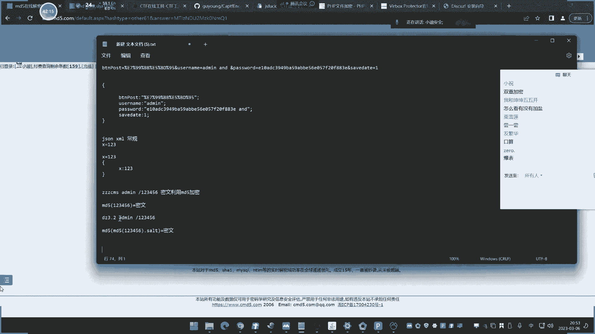

你看啊，我再给你装个他的最新版本，3。5的3。5的一个版本啊，你看3。5现在又成什么样，这是最新版本，就是今年2月份刚下的，2月4号开新出来的一个有它的源码来试一下。

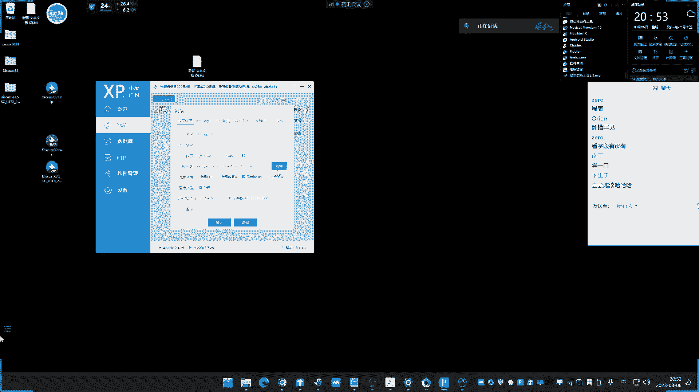

同样道理，端口改成82，不要占用啊，找到这个网站目录。

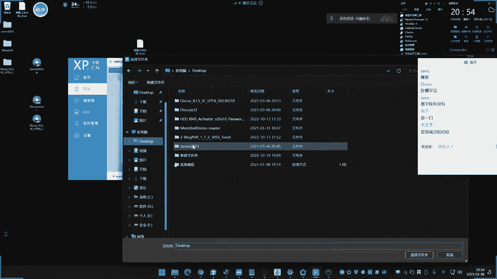

3。5万，创建好访问一下。

打扫好，等会好安装，下一步下一步输入这个数据库密码，还有我的账号密码，我也输一下，3456啊，看了一下3456啊，先进去点下一步，强制删除数据，或者说重新创建一个数据库，因为它数据库名字冲突了。

数据名都叫这个，我就取名叫dz dz3部吧，好选安装好，正常安装，这是最新版本啊，好那这里呢就是它的网站，就是我们经常看到一些论坛网站啊，好我们现在来看一下它的这个源码，来刷新一下它的数据库啊。

好这里是有个dc35啊，就这个吧，刚才创建数据库来，我打开一看啊，我们找到有数据这个数，好这里就有一些数据，你看这里打开一看啊，你看他的密码，这密码是吧，好我拿去解密看下啊，解密不解密不好。

那这里呢就是说按照刚才我们说的哎，会不会加盐，你看密码12345就解密不到，往后面拖有没有盐这个东西啊，看后面有没有盐是没用啊，好我们继续往下面看，刚才是在那个什么UZ避免，但这里没有看到UZI那个啊。

我给大家看一下他这个其他的一些数据啊，这里有UZUC开头的这个版本，刚才在这里看到的，你看看这个密码后面有没有盐呢，盐它去掉了，新版本里面没有盐了，盐你这里为空看没为空密码。

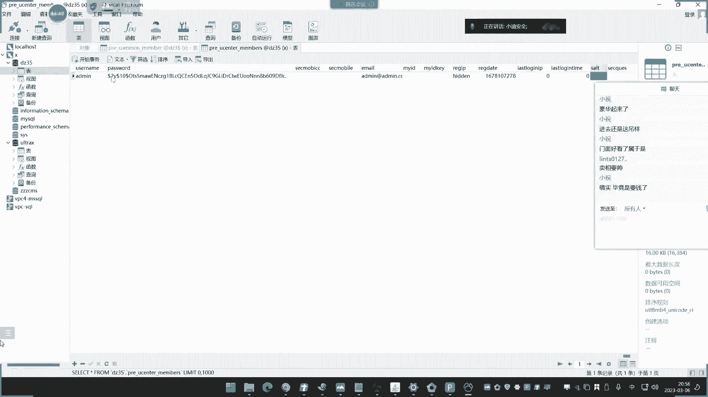

密码变成这东西啊，你看密码变成这东西是啥东西啊，嗯EZ3。5密码还是一样的，然后呢密码在变成这个东西，版本不一样的这个密码的加密值方式也改了，这个密码你看，所以说有很多复杂的一些加密形式。

其实在加密形式出现呢，也都是保证这个密码的重要性，就是即使你拿到这个数据库啊，也不能正确的，对里面的数据来做任何的一些登录，它的加密就是保证这个用户了是吧，即使知道这个文，但是你也解不出来。

解不出来就无法登录嘛是吧，这个铭文呢是一种，类似于我们说的这个ax d e s这种，有什么加密，密室，偏移量等等的一些即重算法的一些加密形式，我们呢会给大家到时候再来说这种加密。

这种是复杂加密也是比较难的一个加密，也说他他如果说要解出来的话，需要同时满足几种条件才能解，我们给大家看一下啊，在我们这个工具上面，那是有这么一个知识的，但是同样的道理，他不是说你有这个铭文就只能解。

他都需要一种其他的一些情况。

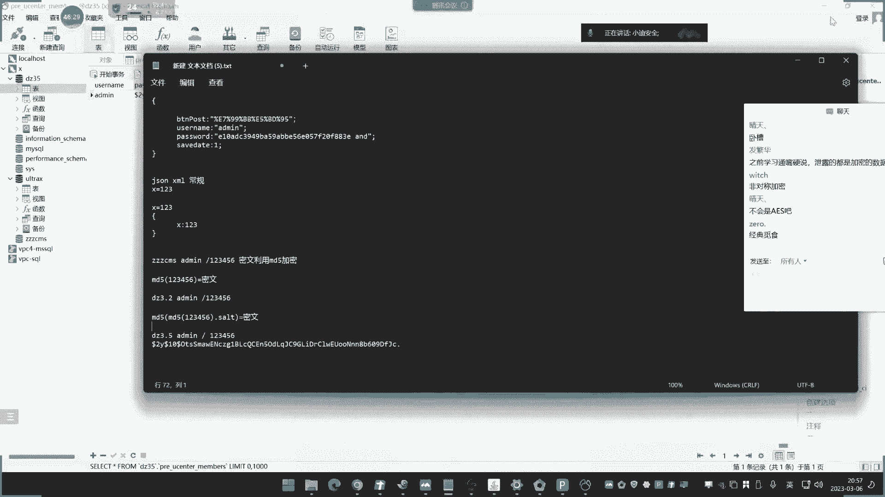

让我们来看一下，那你看这里面不是有这种形像，是d s ax88，另外我们打开他有一个叫K，还有个叫IZ代表偏移量，还有加密模式，还有这种pd模式，还有这个输出的一个形式，这个不用管。

就说他有四个东西来决定，四个东西你全部有你才能行，所以说这两个呢你可以把它全部撕一下就行，但这两个是必须要有的，一个是K1K一两，就它的算法呢它需要几个东西的知识，你才能铭文，要有偏移的扭。

解密的K也有模式，要有这些东西都要有，你才能把这个文把它解出来，否则的话是写不出来的，而这个东西呢它不会，一般都不会储存到数据库里面，它是一般是写到这个源码里面，就是源码在数据呃。

写入的时候就利用到程序源码呢把它进行加密，再写到数据库里去，数据库在调用出来时，它在用这个解密算法这么还原出来，所以说要解的话，你要知道这些东西放在哪里，你有没有东西，有没有权限。

或者有没有方法把它拿到，这才能解密的关键，那么大家可想而知，如果啊你在做安全测试的时候。

那我举个例子，他使用到的就是这种来我们举个例子啊，就比如说我现在要对一个点的进行测试，我拿个简单例子啊，就像这种啊，假如说他把这串数据呢，按照像这种方式来进行加密了，传输过去呢。

对方的程序呢再把那个相应方式把解密出来，如果他用这个方式去把这个数据加密了，你怎么测呀，你测个毛啊，测你连他的格式都解都解不出来，你吃个毛啊吃，所以说为什么啊，这些有些大网站它安全性好。

因为他都是搞这种事情况，他现在这个值呢，你看都看不懂，所以你不能测，你车都是弯弯在测，他不可能出结果的东西，你连他那个一传铭文都搞不清楚，你不知道里面写什么，就很简单，就像这种东西啊。

铭文铭文是这样子的，但是他加个名，一长串乱七八糟的字符，你要改哪个地方，你改哪个地方，你改了没用啊，对方死，只要对那个密文进行解密还原的，你随便改个地方，铭文就坏了，那啥都不是了。

那怎么去正常进入对方的那个延误逻辑，怎么再去测漏洞呢，测不了啊，你可以说我尝试解密，解密怎么办呢，解密你要知道那几个东西才能解密啊，但这几个东西你本来就是测漏洞的，你啥现在权限都没有。

你咋知道对方那些什么K啊，骗人啊，不知道啊，所以你玩不了啊，所以一般他都是说能对数据进解密的，我们才能挖解不了的那种加密数据，就直接过，不用看知道吧，看都不用看。

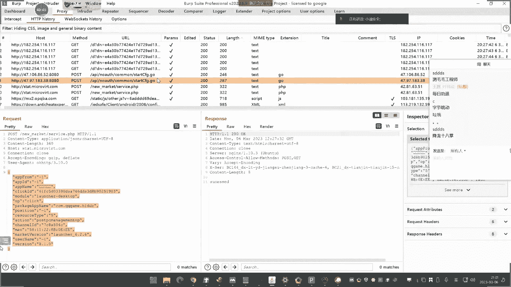

那是你搞不了的，那是搞不了的啊，因为这算法这些东西呢它能解就能解，解不了，就是解不了，他要解必须要满足几个条件，那条件你满足不了，你换谁来都不行，他本来这个加密算法设计出来就是防破解的。

你没有那几个东西，你谁也解不了。

好这就是我们说的这个网站方面的，你看我们电脑方面的也是一样道理，电脑呢也有电脑的算法，有哪些算法呢，这个是说到了一个MD5。

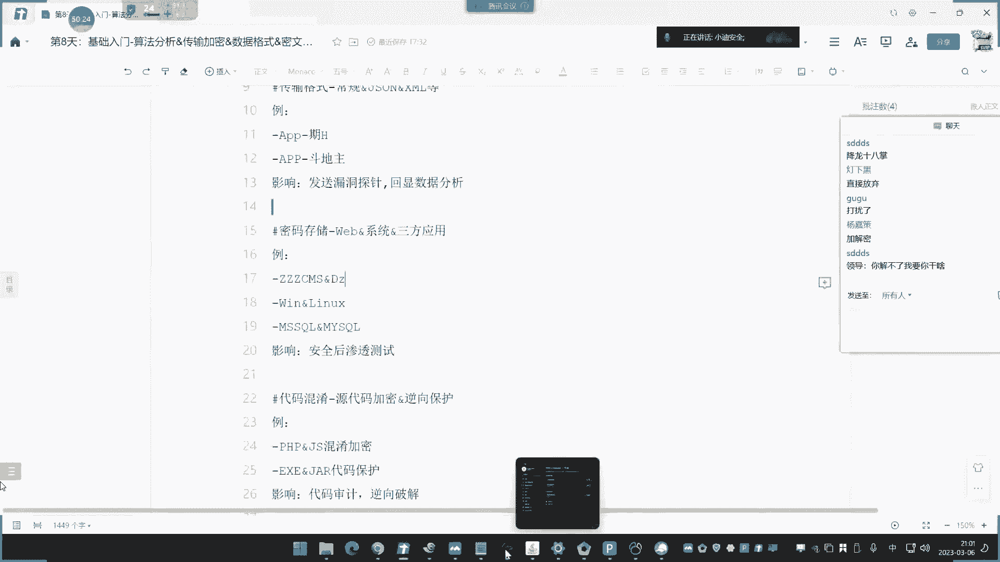

还有这种五加盐的算法啊，下面这个呢我们说的类似于什么AX，BX加密算法是吧，有那种什么啊，我们说的这个V10还有什么偏移量，就像这里的这里有个网站啊。

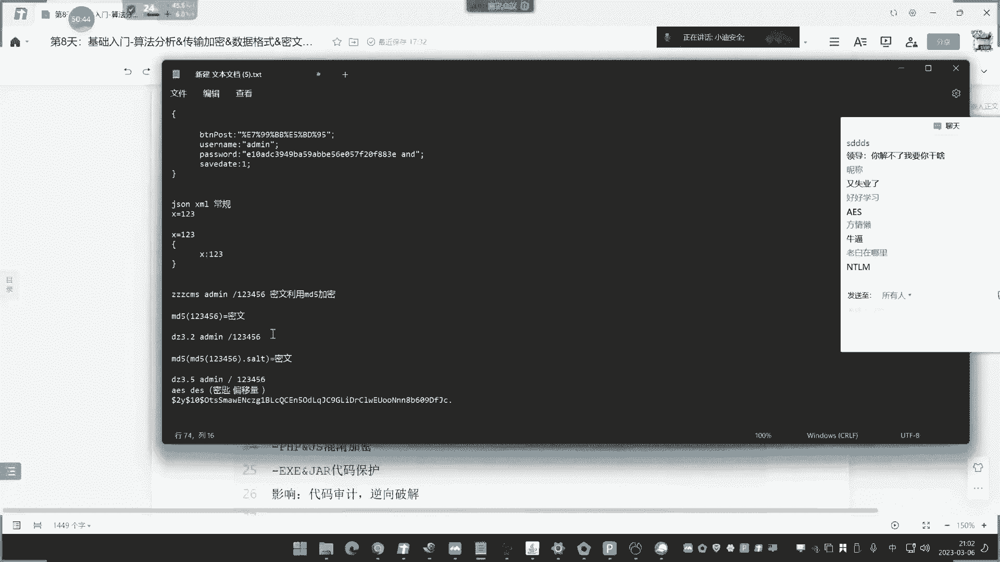

我们来看一下，没到网站关了吗。

就那个。

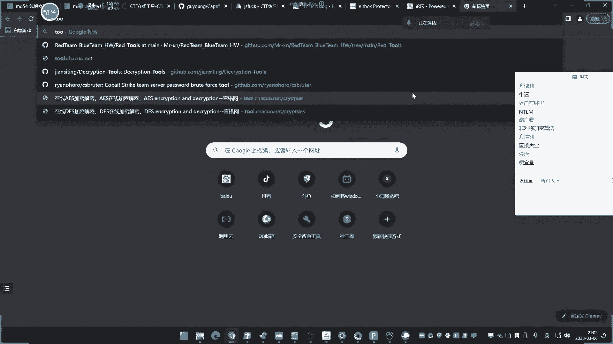

就这里了，你看那这里呢，你看他就有这种填充服务来加螺丝密码偏移量，那这也有这种的什么DX啊，3EDS啊，AS呢，这个格子内你必须要有这几个东西，你你这个东西没有。

你就不行啊，你必须要有这种东西你才能吃啊，然后呢呃就是说这几点啊，我们先来了解了解，也是要方便，我们接下来再针对这个每个细节再来说事情啊，这是网站方面的。

你看我们在说系统方面的，好我们打开虚拟机啊，用系统的来给大家演示一下，我们系统也有自己的加密格式，你像windows上面就用到的是一个叫哈奇的运算。

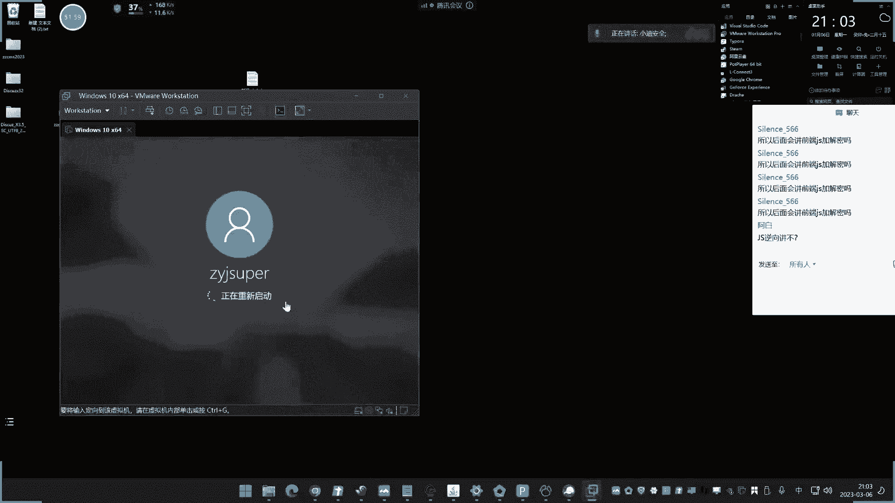

那么有哪些方法呢，我这里给他打包了一些这些，下面的大家自己要了解的是吧，有一些常见的一些算法的一些情况。

在后面呢也会详细说，在网上找了一篇文章啊，什么这个MD5的呀，这个杀的呀是吧，针对的是不同应用对象，就像MD5，它会在哪些地方用，网站的后台密码里面经常会是MD5是吧，你像这个NTML这种加密。

一般是windows的这个账号密码，就windows的登录电脑的账号密码对吧，然后呢还有像什么base64啊，这种是吧，就是网上一些传输的那个数据的那个编码值啊，就是外呢还有很多像这里的。

你可以往下面一翻啊，越越越高端的，你看是非对称性的加密算法，引入密室密文特征和背景就是相似。

还有一些各种各样的啊，你可以去看一下，我们现在先不管它啊，呃这里也写了一个简单的一个过程啊，我们这里也给他写了一个简单过程啊。

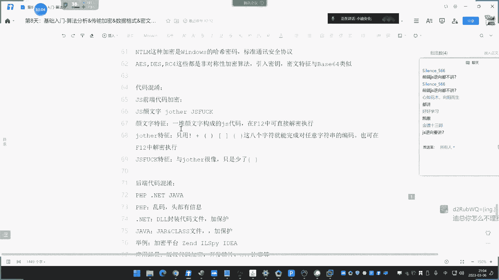

好那我们再来看这个这种情况啊，你看这里我们用工具来获取哈希值，这不给大家多说，内网卡我要了解的是这个文的形式，看看能不能解，好，我们这里呢用这个工具来获取一下，这个电脑的这个哈希值啊。

好我们这里呢来给大家看一下这个呃，那里有个疑问词啊，你看这里有个叫呢，当前用户名是这个叫z y z super，然后这里有个什么NTL的哈希值，我们把哈希值给他复制，这个呢就是我们说的那个铭文。

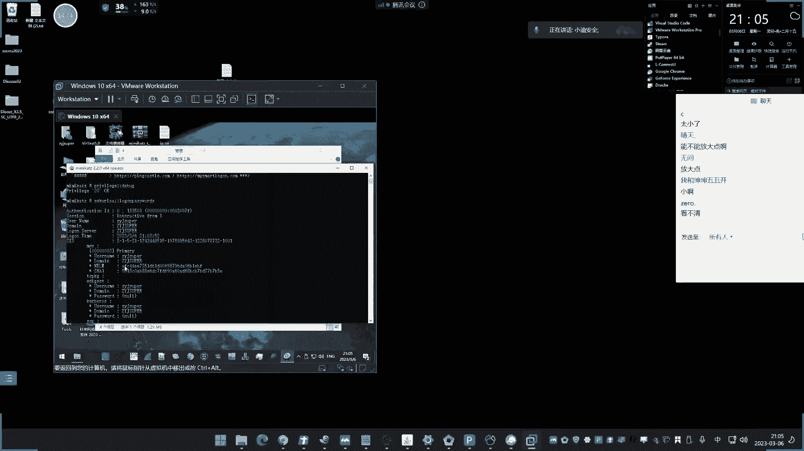

我可以拿到这里去截一下他密码是多少，我们来看一下啊，能不能解出来，这是电脑的这个铭文颠倒的用户密码，点开密码是TOO哈，好我们来尝试一下，看是不是个密码，让我登录一下，切换一下用户锁定一下，好。

我登录一下啊，那用户是这个ZYJ输盘，输入GORTOR进来了，对不对，这是系统的加密方式，这个调不大啊，不是我不想给他调大，这个调不大，这是一个工具啊，这个调不大，能不能调大。

我看一下我们这光标字体可以调大是吧，来给你看，这看得清楚吗，你，这是它的NTM的一个值啊，就把这个一复制去解密，解密的结果是什么，类型为NTML，windows的一个什么windows的一个加密方式。

NTML对不对。

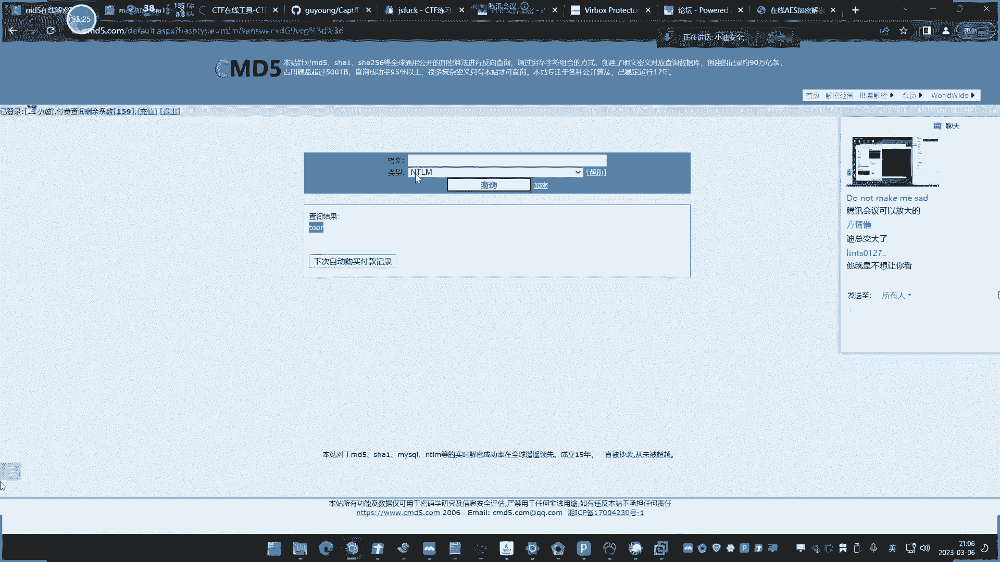

你要能解出来计划，然后你看LINUX也是一样，LINUX可以通过查看这个etc下面的小岛，来看看这个windows的root密码，你看root密码是这个的，你看一长串的这个能不能解密呢，也可以尝试。

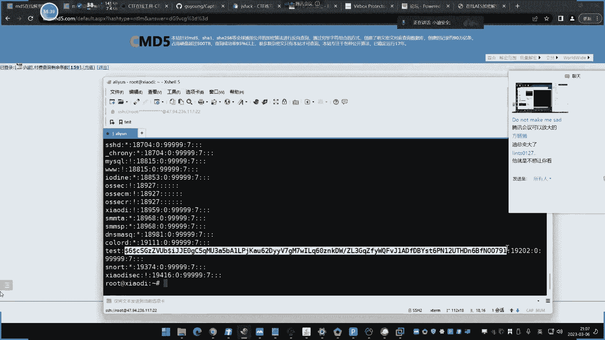

但这里是解密不出来，因为我的密码复杂了。

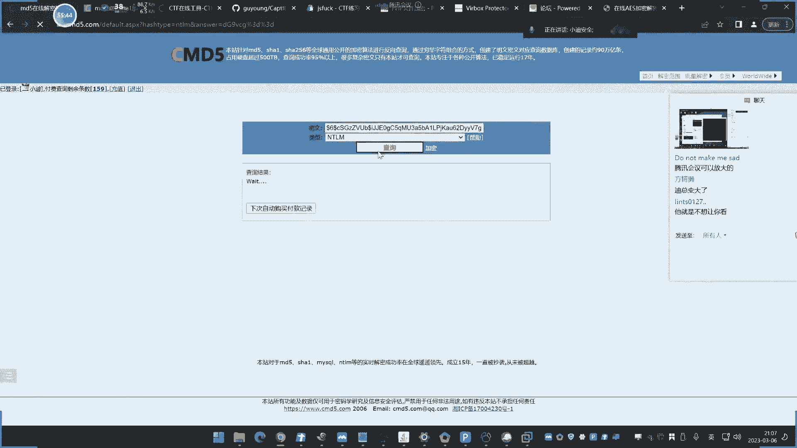

但解不出不对，因为其实我们做这个案例就是告诉大家，网站有他常见的几种加密方式系统，因为它固定的加密方式，有些是能够解，有些是解不出来，解不出来的原因是什么呢，密码过于复杂，再有现在就是什么呢，他慌了。

是我告诉你啊，一些常见的加密解密呢，它并不是说能够是算法的逆向解密，它是一种碰撞的一个解密，啥意思呢。

为什么说MD5有些能解，有些不能解呢，因为MD5它是一个不可逆向的一个算法。

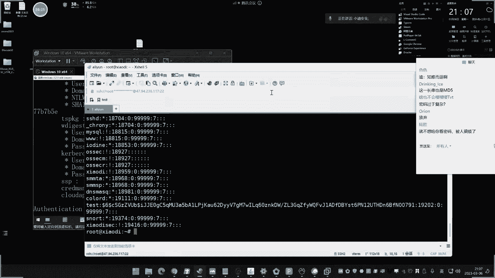

这又是啥意思啊，现在大部分的这个减零呢，都是基于这个碰撞式的建立，啥叫碰撞死啊，我举个例子，它不是这个算法的理想的环节，理能理解吗，啥意思啊，我举个例子啊，比如说我123456，我对应的是一串密文。

那假如说是这个嘛是吧，这是13501个铭文，然后呢他去解密它是怎么解呢，先把E进行一个碰撞好，345好，然后1231234123456，123456，12356的铭文呢，刚好他现在的思路是什么呢。

剪辑的思路是什么呢，平台解密是什么呢，对吧，就说R1的密文是多少，啊R的铭文是多少，然后依次相加，直到他跑出123456的铭文，诶和这个对应上了啊，这是什么封装对应上了，那我再来一缓，然哎也就是什么。

也算是五六，它是这种算法解密的，所以为什么会出现有些密码解密不出来的结果，就是因为你的密码复杂了，碰撞的太多，可能了就很简单，你码13561组合就能组合上去，搞一个这种密码的。

你比如说啊我搞个什么大写好，再搞个小写，再加一个这个东西是吧，好再加这个数字，我再点点点，我再写个什么一个东西，诶，那你告诉我，你要形成这种碰撞，微缩和字母数字等等等等，你把这个问题组合。

你有多少万种多少一种组合，那个太大了啊，他无法碰撞的那一点上去，所以那就失败了，能理解吧，所以说有些不能解，像下面那个呢它能解密码简单，但是你一换那个复杂点，他解不出来了。

所以为什么说要让你把密码设置复杂点，就是这个意思，即使对方打了，你问他也拿你没办法，好那刚才把这两个系统呢给大家做了这个演示。

就是告诉大家一个什么意思呢，就说了啊，网站有网站的一些加密方式，系统电脑系统上面的账户密码，也有自己的加密方式，比如说windows的nt ml linux呢是吧，是什么加密。

可以查一下啊，我也忘记了，你看数据库的也有，你看数据库也有，你看我们把数据库拿出来。

数据库的账号密码，输入账密码呢，买买SL是在哪里，是它自带的这个数据库MYSQL里面，然后就有个叫user，这是数据库账号密码，就是我们说的root12350嘛，看这里呢就是个root是吧，你往后面拖。

这里就有个什么，你这里就有一个呢这个铭文呢，把这个铭文为复制放在哪，1356，就比如说你看类型为MYSQL5，其实就是说除了这个网站，还有什么系统数据库，他们的加密都不一样，有些平台呢它支持的有些多。

有些平台的支持比较少，但是都不能说是东西都在里面，因为它有各种各样的应用，你换个数据库呢，对不对，换个数据库它会不会加密了，能不能解密，能不能解密，也不知道，我们只能讲常见系统的网站的是吧。

数据库的系统的，然后呢有一些这个可能有些数据库呢，还是或者有些网站呢还解决不了，因为你不知道他会用什么算法。

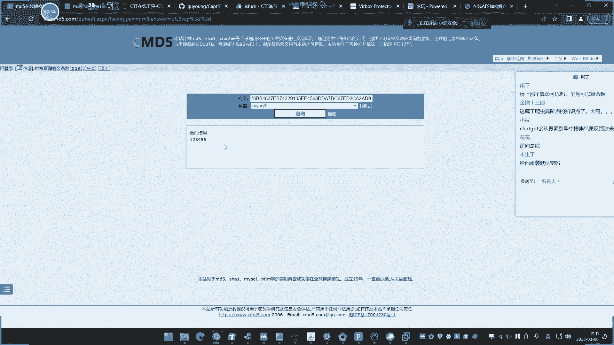

他有些人还会用到自定义算法，就像我刚才说的，你这种呢是这样去这样写加密的，就像这种加密的，我能不能在这里再加一个写法的，我再加一个一个说我搞个K，你没有K那也解释不了啊，对不对，它可以自定义。

因为程序是你自己写的，你可以自定义的，把你密码呢以什么方式英文加密方式去储存，那么大家想一下啊，我先不说这个，因为这后面内容呢不是我们现在要删的，我先问一下大家，就说你碰到一个你不知道是什么加密方式的。

你觉得你要找到这种加密的算法，你觉得是从哪里入手好一点，是看什么东西能知道这个分散大一说就知道了，源码代码对不对，所以经常有人呢就发传这个铭文给我，他问我是什么加密，这他妈的谁知道呢。

啊那铭文虽然说游戏是有规律，你能看出来，但没有规律，那你怎么看得出来，你看不出来呀，你只能说从他源码里面去找，看到这个负责加密的那个代码块，是采用了什么什么形式，有些铭文它是有这个东西的。

所以我们就一句话可以看一下上面一句话啊，一般啊这个密码的一些这种算法的话，一般是看哪几个地方呢，第一个看密码的密文的微书，因为每一个这个铭文呢有一些算法它是固定的，你觉得这个MD5MD5它就是固定的。

什么32位和16位它是固定的，石榴味和山楂味就是固定的，还有些是看铭文的特征是吧。

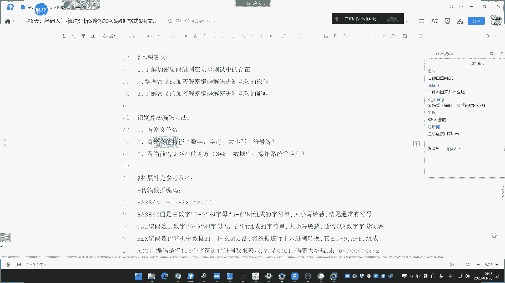

你想刚才MD5啊，它就是一长串，然后这个英文字母和数字的组合诶，刚才那个贝斯流斯呢就像这种的大小写区分啊，数值加上这种符号对不对，然后呢你看这种像ax啊这种东西，你看它就有这种东西在里面是吧。

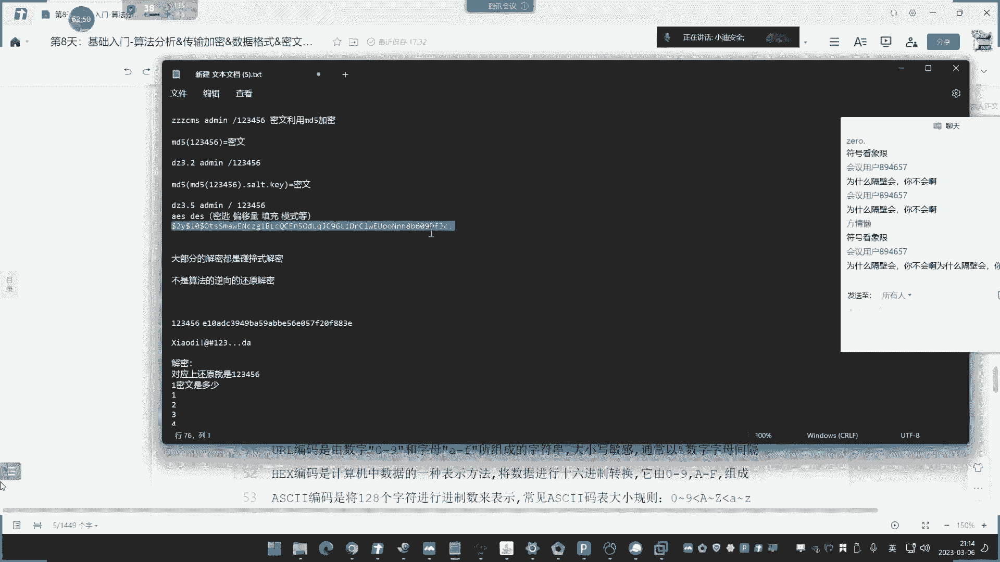

有这样的东西在里面有什么美元符号，这种乱七八糟的，就看它的特征，它是什么数字啊，还是没有数字啊，还是说没有字母啊，没有这种大小写区分呢，还是说有没有符号啊，这都是判断一个一准，同样道理呢。

你还要看你这个铭文是在哪里发现的，是从网站里面发现的呢，还是从数据库里面发现的，还是从这个电脑上面拖出来的呢等等，因为它产生的地方不一样，它就会有不一样的加密方式，你比如说像网站的。

他喜欢用的就是MD5啊，那些东西，对不对，那你就可以往上面靠，但是如果说是其他的什么系统上面的，那个肯定不是了呀，对不对，就是跟TML对，你看我们系统那个密文，但是我们抓出来的是哪一个呃。

在这里呢还把关了，啊就就就这里就这个就这个了，你看他看上去还不是像MD5啊，但是它是跟TM对不对，他是跟TM的高更强嘛，所以说呢有时候你不能只说看他的位数啊，看他那个行程。

你还要看他的这个什么在哪里发现的，要搞清楚，这是我们简单说一下啊，因为后期呢我们还要把这个东西说清楚了啊，还要给他过一遍的，而且我人呢还要说，你像这个刚才我们看到的那个什么，这个这个密码是吧。

我得到之后呢，我是不是还做了个什么事情，我我我这个LINUX我得到了密码伤害解密不出来呀，所以我们还要学习的就是不仅要知道是什么，这个加密方式是什么算法，同样还要学会对这个算法搞不出来的。

就是说平台不支持的工具不支持的，我们能有没有其他的方式把它搞出来，就是类似说用字典破呀，或者用怎么去猜呀，对不对，这些也是我们要学习的点，就比如说这个LINUX的windows这个账号密码是吧。

搞不出来，我能不能自己想办法去把账号密码呢，自己收集的丈母娘去破，有没有工具去讲解一下，对不对，然后呢也会给他说，像什么DJ啊，刚才那个3。5那个密码解不出来，对不对，我们该怎么去在哪里去找。

找到了又该怎么去组合它怎么操作去解，这是我们也要说的啊，后面要说的，在这个过程中把这个从看到解，你把它完善之后呢，你就大概知道有哪些解密，有哪些常见的几个常见的挽回是吧，后面的你碰到的多了。

你一眼就能大概判断出是什么，大概什么类型，你光靠这个去网上去查个资料，那你不可能把每个机组备注备注没什么意义啊，你碰到了还是得靠经验去分析好，我们再来看这种代码类的啊，那你看啊。

你看这种传输方式和这个密码存储，它会影响什么，影响后渗透，什么叫横生的，你得到一个网站找密码，你是要尝试去登录他的后台啊，密码你解不出来，登不了啊，你这个windows也是一样啊。

你带到这个windows电脑上，密码你要登录啊，解不出来也登不了啊，是不是好，再来说代码方面的，代码方面呢也会有算法，也会有算法啥意思呢，源代码加密和理想保护啥意思啊，理想保护主要针对的一些项目源代码。

那就是一些脚本语言，啥意思啊，就很简单，word程序写出来之后啊。

我把他代码进行加密加密之后呢，有个好处，对方看不到我是怎么写的，对方看不出我的思路，保证你的源码的思路和编写流程呢，他无从获知，也无法对你这个程序来做二次开发，所以说这是源码的一个好处。

但是对于我们安全测试者来讲呢，它有个坏处啥坏处啊，我源码都看不了了，我还怎么分析漏洞。

影响的是我们的代码审计，对不对，同样道理，像一个ESE程序，像一个APK程序，就是我们的安卓电脑应用，还有像我们的java程序jr，你把它进行保护之后，从作者来讲是保护他的版权，防止它的程序被逆向破解。

从而添加一些什么VIP功能呢，什么免会员版本呢，这种事情对不对，但是一旦道理他这样添加了，也是给我们这种搞异乡的人来说，什么夹壳呀，保护啊，都给我们提供难度，所以他就是一个这个正反看针对什么人来讲好。

我们现在看一下啊，我们就来个代码的加密给大家演示一下。

就拿PP的啊来去演示。

我们来准备这个两，那这里呢我们就放到这个地方吧，把你弄回来啊，我们在这边看一下啊，我先写个文件啊，我写个代码文件写着的，还要写个疑点，Pb。

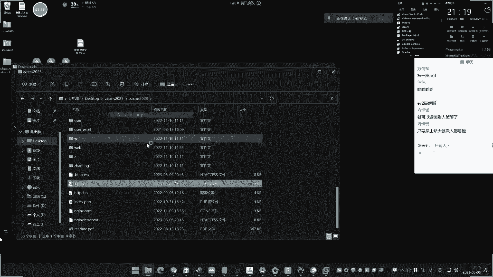

那我写个PB代码好吧，批评批评。

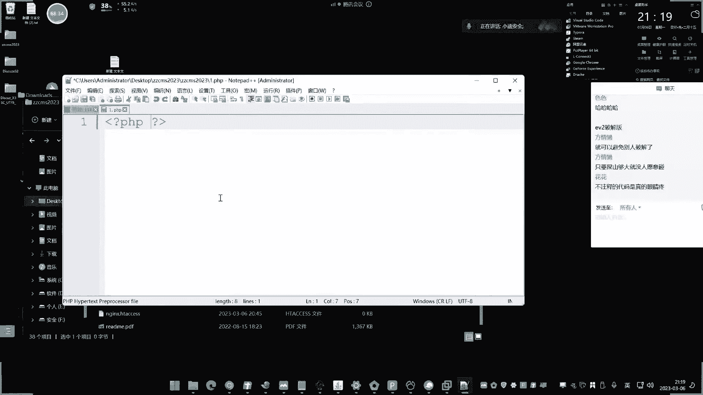

这是一个简单pp代码，我现在不要大家都清楚，大家知道是什么情况。

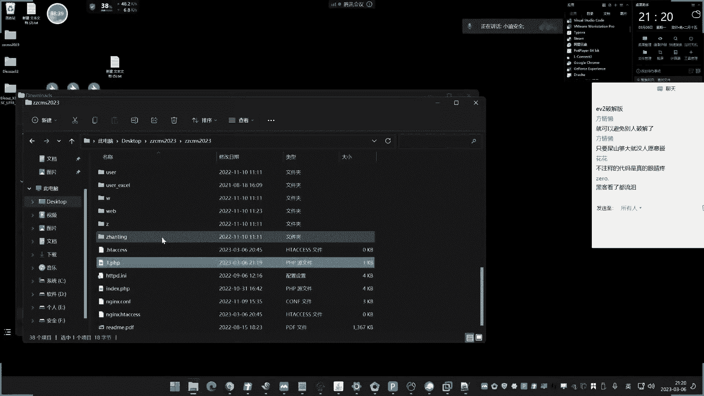

问他一下，12700。11点BB他能放过这个页面。

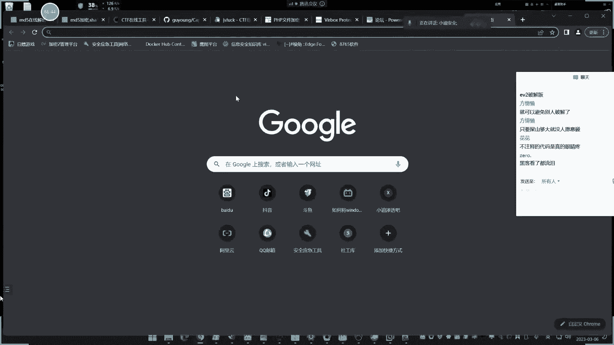

对不对，这是代码好，这个代码那就是很简单，就是一个简单pp代码，如果我不想让这个代码那张单。

让对方知道我写的啥东西，我该怎么办，我肯定有一些加密的算法。

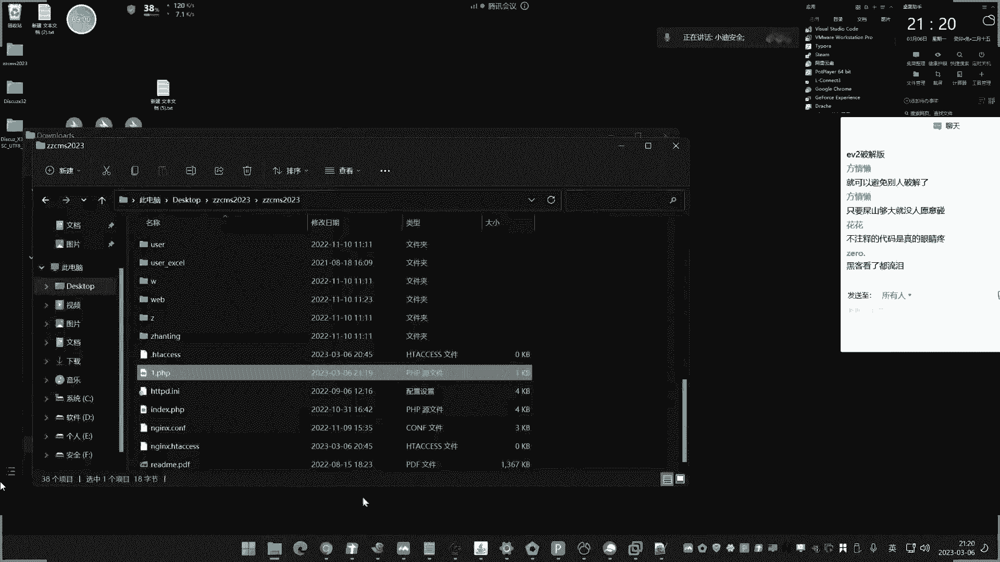

或者说这种代码加密，或者随便在网上找一个啊。

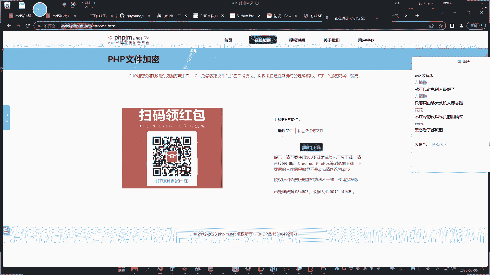

比如说这个pp文件加密，我把这个文件呢给他怎么样加密一下啊，找到刚才那个源码那个地方，就这一点pp嘛。

把加密下，用这个网站，用加密平台，这里用这五用找一个他把这个文件夹加密。

加密之后，我下下来看一下啊，这是加密的，加密的，打开给他看一下。

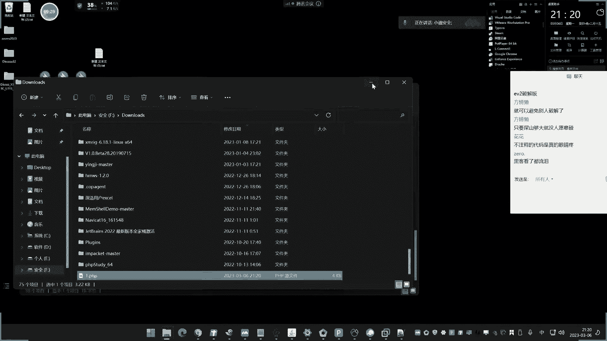

好我把加密的打开给他看一下。

那变成这种。

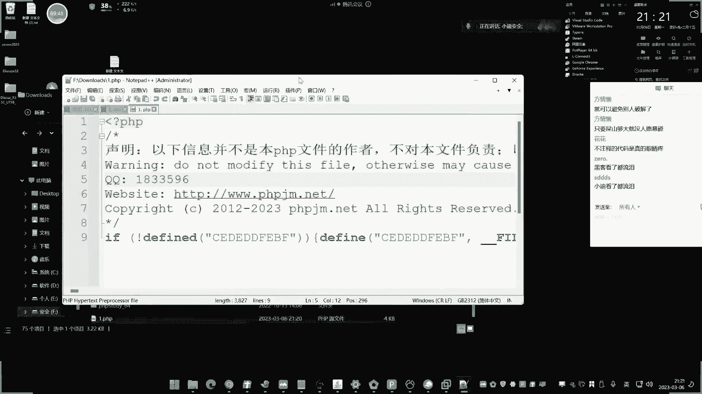

那变成这种呢，大家看一下后面的这种东西全部乱了一大堆，变成这东西了。

这谁看得清楚呢，对不对，好，我再把这个文件改成一，改成1+1呢，同样放到这个刚才的网站目录下面去，一是我们写的，你看加密之后变成10KB文件的大小都变了。

好我们来访问一下刚才那个路径地址。

一点pp是我没有加密的是吧，返回这个页面好。

我们再来看一点pp。

哎什么情况，加密加死啦。

哎呀这，换一个吧，等一下啊，我把那个换这个来试一下，多加几次啊，有些加密算法，它有些人会把那个源代码结果呢搞混淆，这个不是终点啊，你换个算法就完了，我把它找之前那个好的，好这个来看一下啊。

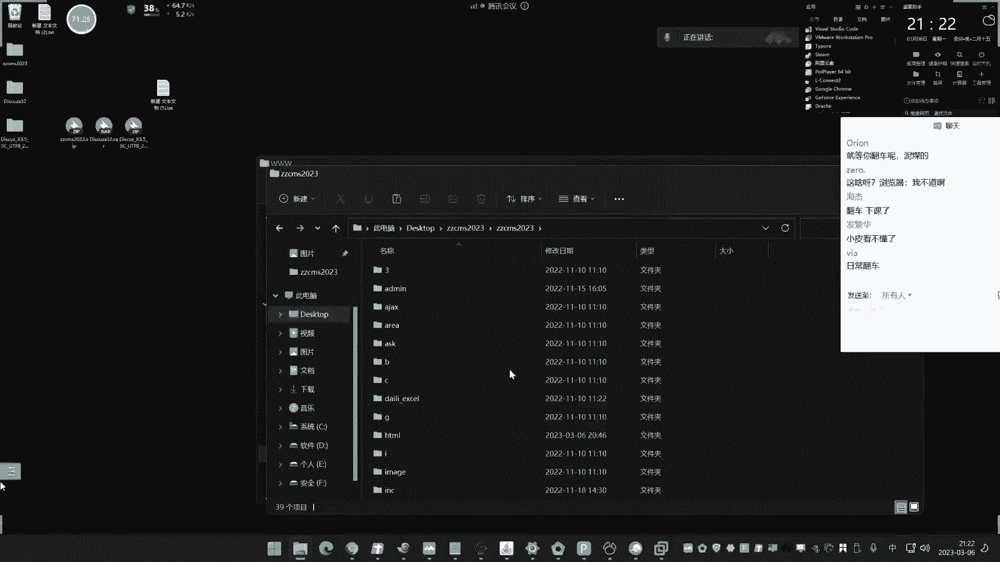

很有可能是那个编码的，可能是那个应该是我估计是那个版本的问题啊。

pp版本问题，我看一下，把版本切换下。

应该是版本问题，这个是七点几版本和一个几点几版本，就这里啊版本我用七点，我用个五点几版本看下。

你看刚才那个一点PP呢，看到没，有些版本，就可能是那个这个PV版本的一些算法的函数，它在新版本上面不支持所导致的，大家看看两个都正常了。

那你一点PP和这个一呢两个结果都是一样的，没什么区别，然后呢你可以看到这里面的代码。

那就是千奇百怪了，刚才给他看了就不给他看了，我意思就是说你可能拿到对方的源码，但是源码里面呢他把这个源码加密了，那你告诉我你怎么分析呢，你肯定就要先把这个源码文件给他解出来呀，对不对。

你不解出来咋个分析呢，他分析不了啊，看都看不懂，对不对，所以说除了我们说的网站上面的数据和密码，存储，可能会采用加密源码，也有这个东西了，那这样一搞，你不把解密怎么看源码源码都看不到，怎么分析的对。

所以你要知道啊，在无时无刻很多东西都变了模样，这也是为什么现在基数呢这么多的原因啊，没办法的。

你哪一个地方搞不了，那就是少一条路。

但是没办法，我们讲的还是有些是能搞的，搞不了。

那就是解密不出来，那没办法，这看着呀，还有像我说的理想保护啊。

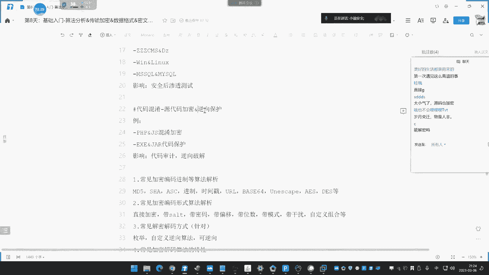

还有JS加密，就是我们JS语句呢。

你看一下啊，这里有个JS的一个靶场，你看啊，这个靶场是JS8K啥意思呢。

大家看一下，我先把那个靶场开起来。

那就是个靶场，靶场里面呢。

你看一下这个数据里面源代码里面有个啥啊，这他写了一个东西，这上写了一行数据，那个数据其实就是用JS代码写的，这个数据是个JS代码写的一长串的，用这东西写的，你看不懂的。

还不知道是啥东西，他就是用JS的一个一个这个JSFK，一个算法呢去给他把数据呢，就是说他原本就是一个弹窗的一个JS语，但是他用这个算法来写了之后啊，你如果不说不识别啊，你就不知道这该怎么搞好看。

我们当识别之后呢，我们再看一下来网上一个JS发的一个解密平台，我把它放进去，那我看一下我放进去进行装它，结果是结果是这个c t f y，就说你比如说我写个JS与arctic，这JS与一个弹窗的一个语。

我写进去我编码，你看编码就变，这东西就说明明是一个JS语，是这样写的，比他这一搞搞成这种写法，告诉热线方案，让他弹出一对不对，告诉漏写法，那你咋办呢，对不对嗯，参数一就是建代码是这样写的。

J代码的一个里面弹出这个函数是弹一，但是呢他写成这东西哪里看不懂啊，看不懂啊，你不熟悉这些常见的一些语言的一些什么算法，加密方案，代码都看不懂，他把一加密，你真找不到，不知道是啥东西。

这是一个CTF以前的题目是CTF的题目，JSFK2018年的CCTF题目，这同时也在我们如果在这个安全测试中，也可能遇到他哪一天把这个健康码这样一搞，你比如说我分析JS代码。

分析有没有什么微缩权漏洞访问，就像我们后面学的是吧，有些什么JS上面的去分析这种漏洞啊，分析这个接口，他这样，假如他这样一搞，你不知道，那咋办呢，你不把解密出来，你哪知道这里面究竟是啥呢，对不对。

所以说其实这个安全座车子里面很重要一点，就是这个数据的这种格式，和它的加密算法的熟悉，这样子能够大大提高我们华东，或者说找到漏洞的可能性，因为如果说你不识别的话，很多地方你看到这种铭文铭文了啊。

你就没办法，你就放弃了，客人那里就会有安全问题，但是你已经放弃了，你识别不了吗，所以这个东西呢还是很重要的啊，他是在乎关乎到你在后面这种挖洞和分析漏洞，找漏洞的这个这个几率啊，你有这方面的技能之后呢。

你就可可以比对方的是吧。

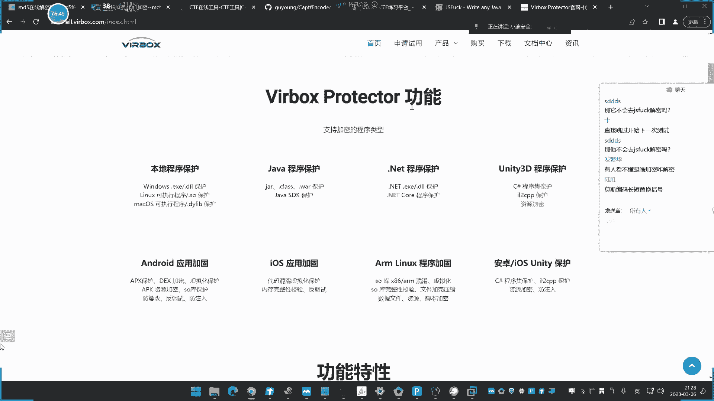

都有那么一些可能性啊。

然后是JS的，然后呢除了这个，还是不是还有我们说的软件版权的呀。

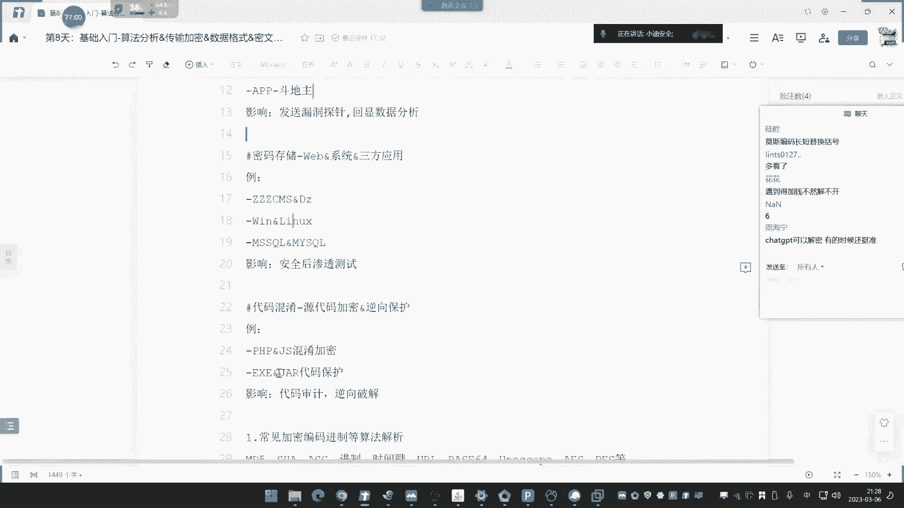

像这个ET，比如说我们现在这个网站呢，这是随便下载一个软件，我们在后期免杀的时候还用过这个软件，这个软件是一个保护的软件。

但是这里呢我是试用版本，我已经到期了，所以没办法给他演示了，我试用期已经到期了，去年已经到期了，购买的太贵了，他妈的几千上万的保护程序，它保护什么呢，你看啊，本地程序加密ESEDLESSO文件。

Mark的DYRD，java的jr class，Well，Sdk，点net e s e d l3D程序，安卓的程序，IOS加固等等，那个是干嘛的，他是干嘛的，保护的，啥意思呢。

就说你做这个我们不是说APP，就说APP这个安全城市里面好，拿安卓来讲，安卓给了APK好，你要进行反编译，查看里面的源代码好，他这个时候呢用这个工具把它怎么样，保护了一下诶，你反面没反应，编译不了了。

这这这里是不是断了呀，所以这个呢就是防立香的，虽然说我们不是专业搞离乡的，我们只是说讲的这个安全措施呢啊，刚好离箱里面呢，它是能够支撑我们一些安全测试的思路的，所以我们简单学习一下是吧，安全测试。

但现在呢你好不容易有一些简单基础啊，能够搞一下小小逆向了，他这里呢咔嚓一下给你一个保护诶，几级了，逆向的机房的就断了，是不是，所以说啊很多东西呢它都是相辅相成的啊，不管是针对你这种做安全测试的。

还是做这种二进制理想的啊，都会有影响，它一旦什么加密了或者加固了，你都会受到影响，这个本来就准备给大家做一下演示的，但是这里的妈的，我这个试用期到期了，你如果新注册账号，你可以测试一下。

你可以把这个什么ES文件呢，把那什么这个文件给大家进行保护一下，或者说ATK你在尝试反击下，看能不能反编译，看能不能反编译出来。

好那这里呢我们就举了几个常见例子啊。

我这里没有给他介绍什么算法呀，什么什么哪个加密方式啊，那些东西，因为这些呢，我们可以把它进行一个简单的看一下，有哪一些呢啊我们今天讲的有哪些呢。

思维导图理一下，把讲的给他理清楚，然后每一讲的再把它展示出来，也是要讲到的。

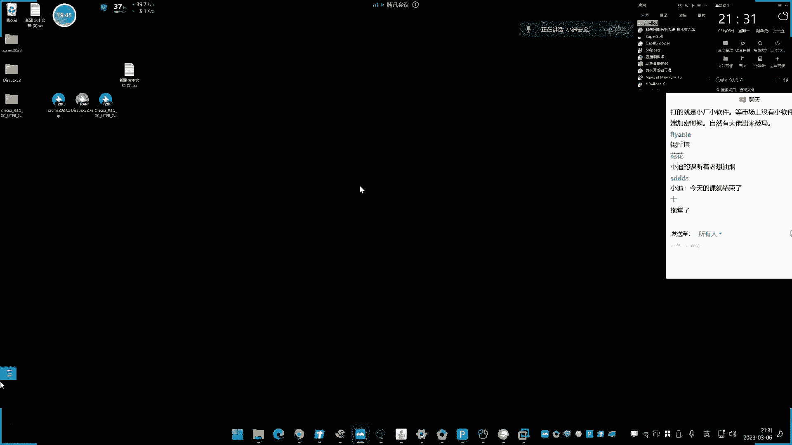

对不对，这哪里是拖堂总结。

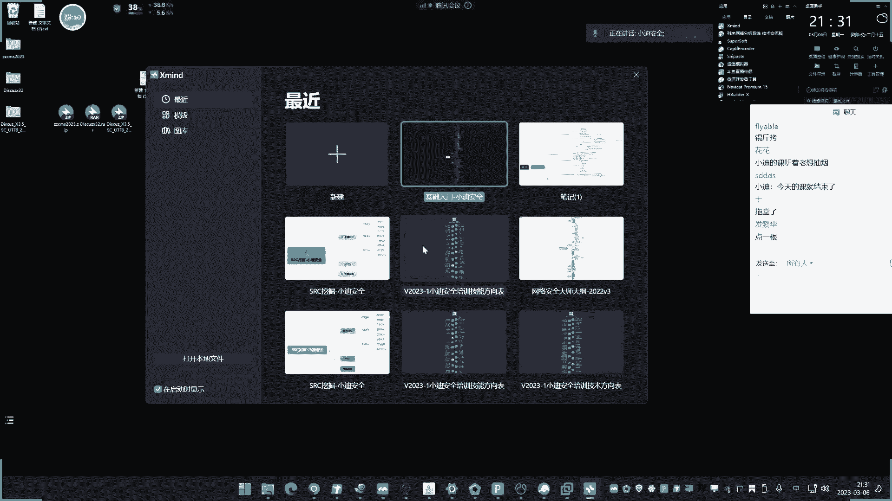

哪是拖堂的，我不想搞这四大主播，我现在就想什么，我四位老师都不做，我就直接给你是吧，咔嚓问你有什么问题我解答一下啊，我就拜拜，这四个老头说你妹的最费费脑筋了，我不想做，你知道吧。

首先呢我们这里主要讲的思路是针对应用方向，就对象对象里面就有几种啊，一个是这个web方面的，还是像我说的这个系统啊，还有我说的那个什么三方应用内向web方面呢，我加了好多是怎么传输的，传输的这个查询值。

传输数据，还有我们说的这个传输的数据格式，包括数据格式，做完了之后呢，还有我们说的是什么人代码的问题，那么传数据里面有什么东西的，数据里面要讲的就是说的这个加密啊，编码编是哪几种呢，对不对。

这是他的几个东西，除了这个之外还有什么，还有他这个源代码里面的一些产品啊，先把这个加密说一下，我们介绍哪几个S64啊，编码是编程式加密，是什么地图啊，对不对，然后在数据格式里面的。

There were n，才没有啊，对不对，假设这个，然后还有一些源代码里呢，就针对这个什么源代码加密是吧，源代码加密皮皮的呀，JS的呀，还有其他的，我们没有杀死，我就把它写上去，这是我们说的两个东西。

然后呢这是web的一个东西，然后web上面有区分什么产品的，对象码产品类就是我说的啊后台的存储，密码的存储啊，就是我说的这个密文存储，下载什么三个嘛，Md5，然后alt加什么盐。

还有我们说的这个类似的什么AEX啊，DS虽然我没有细讲啊，不过后面马上就要讲了，等类似的啊啊这产品的这个东西，然后呢就是源码方面把它归分到这里来吧，那存储方便，这关于web产品的一些就是数据。

就是你不管，那你还要搞传输数据方向的，还有那个数据格式也要了解清楚，然后像系统方面的讲了个windows和LINUX是吧，里面的那个windows里面的NT啊，没完了，这个历史呢暂时不管它。

后面说第三个应用呢说了一个数据库，捡了个MYSQL的，对不对，这是我们今天讲的这几个对象。

针对这三个对象。

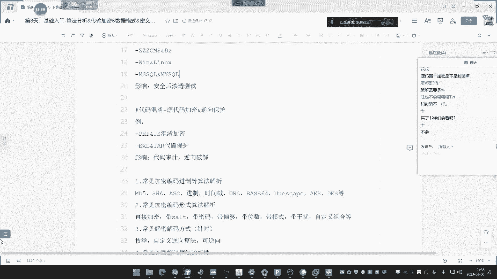

然后除了之外呢，还是我们说的代码方面混淆啊，能不能混淆啊，还有我说的这个产品，产品呢，除了这个之外的产品里面源代码，然后还有一些成品源码，还写着来吧，成品啊，比如说异乡的这种东西啊，保护。

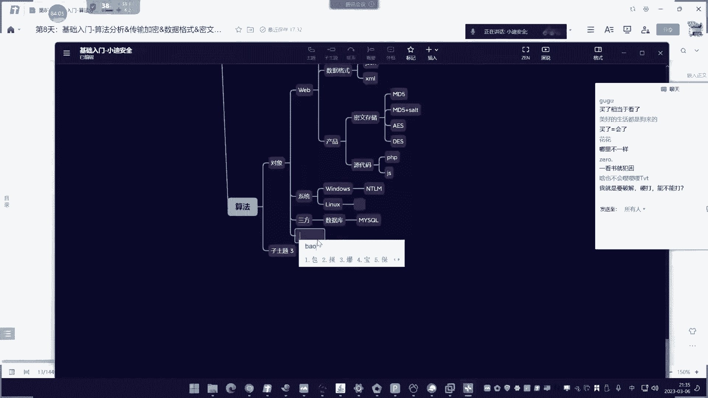

像什么这个类似产品啊。

这个java的呀，点了呀，安卓呀，这种AOS是加固的，这里呢就是提供这个斑马的一个保护，反击枪的。

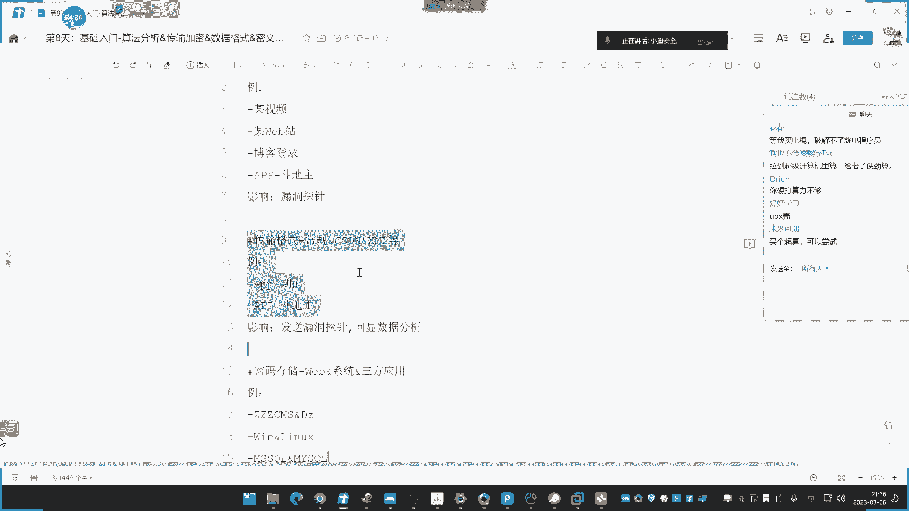

其他的没有了啊，今天大概讲这么多，然后呢说一下它的一个影响啊，影响影响，那就是我们说的啊，有几颗影响都要讲清楚的，这个影响呢我就写到这个上面吧，好这个写后面吧，数据格式的一个简单影响的就是我说的啊。

发送的时候，如果发送方如果回前方数据格式，影响数据分析，然后这个上面的传输站呢，这种东西影响的也是这个路太深，然后像这个影响了后世渗透，就像这种东西，这个是影响的，然后这个影响的是什么代码。

这个呢也是属于影响代码升级和音箱啊，都影响吧，对不对，这两个音箱也是这个后渗透，这个大概的一个今天一个点了，然后这里呢是针对对象，现在我们还要说这个像它的识别问题，就是这个铭文的十边。

然后呢还有后面是这个解密，这是我们要讲的啊，如何识别识别它的规律举例，然后呢再就是解密这个识别呢，说实话我是最不想讲的，但是他妈的问的是最多的解谜了，还有讲头戏，为什么说十遍是最不想讲的呢。

因为这个东西呀就像背课文一样，我就给你介绍诶，这个是什么形式啊，它有多少V啊，它是什么情况啊，他没有任何这个这个实战性的讲，就说就只能给你介绍啊，介绍这个啊，他有什么规律啊，给你记住啊，你记住啊。

就这个情况就这么个情况，然后呢你说解谜吧，他还有一些技巧在里面是吧，在哪里找一些这种东西，哎它会在哪里怎么看，把这个东西联合起来好，有些工具啊，或者有些这个平台呢可以介绍你用下，这还有一些东西。

但这个10年呢这个说实话，这只能对着那个网上那些那种尼龙蚊帐啊，给你过一遍，你不讲了，他有温讲了之后呢，听完之后就这样啊，就这就这唉太难了啊。

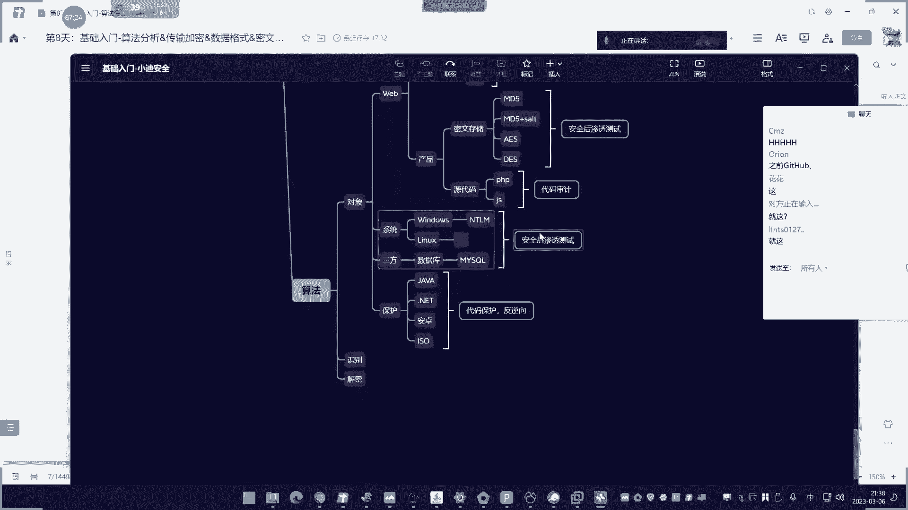

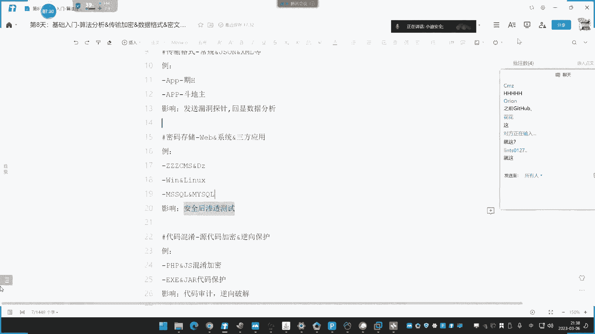

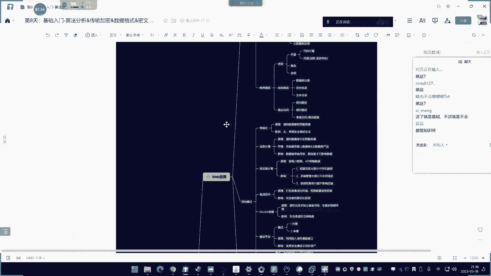

我看这个识别和这个东西是留着基础课讲。

还是留后面讲，哎呀我说我留后面讲啊，有些人就说哎呀，真他妈的听着听着真难，你给我讲完好，你说一讲啊，这他妈有些东西有些东西呢他也超纲了，唉又怕讲的听不懂，唉蛮麻烦的，好今天的内容那就讲完了哈。

其实我们主要就了解的是什么呢，就是我要把那个思想灌输到你脑海中，知识点这个东西呢你给后面慢慢补，这都不重要，重要就是说你把点了要搞清楚，就说学这个东西是为了干嘛，因为我给你说几句话，今天再继科。

今天这节课主要就是为了干嘛呢，就是解决你在发现漏洞，发现漏洞有几个方向，从代码中去发现，从网站上面去发现，对不对。

往我把它写个总方向，把四个里面还是写个总方向，就像这个，黑盒和白盒里面都要这个解谜，太好了，测试就这句话，简单就说这句话啊，因为你黑我们说黑盒白盒就是说一个有源码，一个没有源码啊。

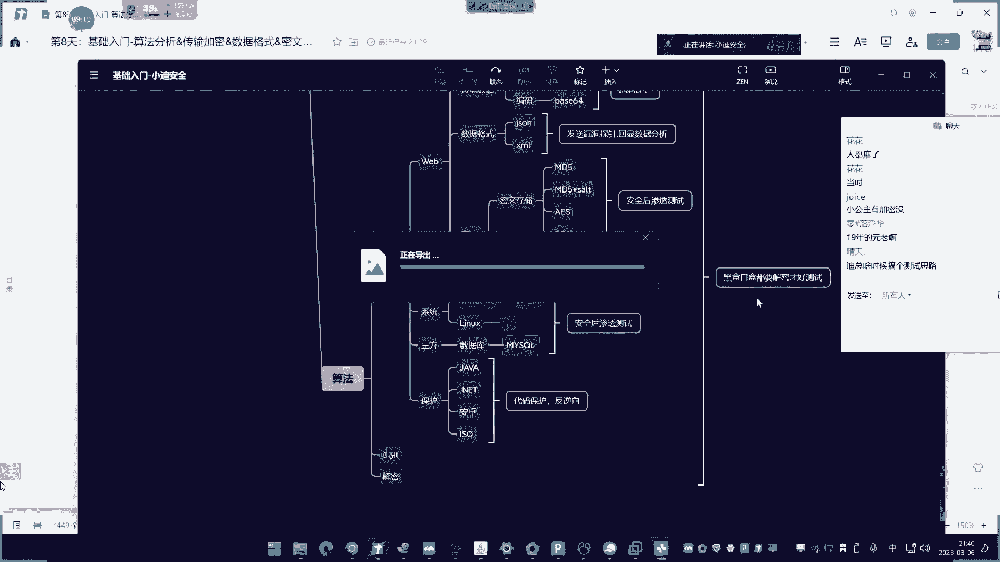

黑河就说没有源码，啥都没有，就只是一个目标给你黑白盒就是有源码，你不管说你黑盒还是白盒是吧，比黑盒测试的时候，这数据加密，你要测试，你需要把这个名额能把稿剪出来，剪出来之后呢。

你按照它符合逻辑这个名为的去提交去测试，才能进入，它是个正常逻辑业务的，才能正常运行，就很简单，对方的网站呢是要结束一个一一个，它识别的铭文，它才能进入他的系统去测试，你这个时候给他发一个明文。

给他发个不符合那个铭文的那个格式，他接受美吗，他接受不了啊，结束过来是个错误的，怎么进入新区呢，也不都搞错了是吧，然后呢，这是黑河，然后你那个这个密码里面，密码的那个存储里面还包括那个白盒里面。

他把那个原蛋白给加密了，你说你要做这个代码上面的分析，要分析这个源码里面，没有一些什么泄露的东西呀，有没有一些逻辑上的错误啊，安全性啊啊源码把你加密了，你不把它解密出来，不要不把它还原出来。

你看不到真正的源代码也没用啊，所以说它是对对于你后期做黑盒也好，白盒也好，都是有影响的，你不把这个东西解决了，那就不行，除非说他是这个都是铭文去发送，然后呢你也是铭文去测试。

但是呢这仅仅是一部分的这个目标，就是一部分的这个应用是这样的，那么如果说他换个加密的，你说你不了解是不是就搞不了了，对不对，所以我们就是针对这种是吧，有这种加密的传输的这种目标呢，做的这个事情啊。

就解决这种事情，当然我们的课上完了，也不是说你碰上了加密就能解决，那不现实啊，我们给他说个例子吧，你把那个课学完之后呢，也只能节约50%，就是一般般看一般机会了啊，因为大家可以看到啊。

你像一些这种大型的一些目标里面的，他一些算法呢你是搞不清楚的，你没有一些东西来佐证，也分析不了，如果说你能说都能解密的话，那别人搞这种东西有什么意义呢，就像很简单的它的算法的出现。

那就是为解决解决你对你防破解，防理想的一种思路，你还说都能破解，那这个东西产生还有什么意义呢，没有意义了呀，所以有些是搞不了，那是没办法的啊，还是看目标，看他，你就说你掌握的信息越多啊。

你能解密出来的结果就结结，结论就越大，你掌握的越少了，结论这个概率就越小，因为我想我说的有些什么算法呢，它需要一些什么迷思啊，K啊，需要什么偏移量，你说你那个东西没有，你换谁来也解决不了，那没办法了。

只能看着还是关乎到你当前的一个信息情况，好这是我们今天说的这个总结的一段话啊，然后像我们说的这个这些东西呢，都是不管是在真实英雄下面，还是像什么CTF比赛里面，这是经常出现的一个东西。

包括我们后期的一些漏洞，上面都会有这些东西的一些简单的一些利用。

好我们今天就说这么多了啊。

看看大家有没有问题啊，有问题问，我说那个50%呢是给大家一个心心，这个治愈是多少，我不清楚，我说50%就是听天由命的意思，能理解吧，运气好就有运气好，我就没有，你不要理解为爱两个就有一个不是这个意思啊。

但是你不学那也不行，碰到之后呢，你要问还有什么办法呢，其实这个和那个做开发里面找了个什么鬼，不是有时候经常有些什么，这个开发里面经常有一些什么要逆向算法吗，写的什么爬虫啊。

写那种什么这个批量注册一些这种工具，它里面都有这些东西，就是从那个一些东西里面去看那些JS文件啊，或者看一些这种泄露的接口，里面流出来的一些源代码，找到一些算法去分析，然后把它的算法搞清楚。

然后数据怎么提交啊，你就按照他格式去提交，才能进行什么注册呀，进行爬虫啊，等等啊，我们不是要大家搞清楚怎么去解，现在还没到那一步，你先了解这个思路，把思路理清楚了，后面再学的时候，那你就知道哦。

这是针对哪一个章节的，哪有让你一下子说我知道所有的算法，知道怎么减，哪有这样子的，你算法这个东西有网上的公开算法，还有一些自己写的算法，那你又该怎么说呢，是你网上买一本算法书，都有厚厚一本的。

不可能是讲那个东西，也不要用那个大家只要掌握这个简单的识别，一些常规的识别和一些通达了一些不认识的人，知道是什么个思路是吧，有能力就去解，没能力就放，就这么个情况。

好我们今天就说这么多啊。