# 【小迪安全】V2024版 全栈网络安全 ｜ 攻防渗透工程师 （持续更新） - P9：第9天：算法逆向&散列对称非对称&JS源码逆向&AES&DES&RSA&SHA - 逆风微笑的代码狗 - BV1Mx4y1q7Ny

今天讲第九天的内容，讲一下这个算法的一些知识点，上节课呢只是给大家简单普及了一下，这些加密编码的一些东西，然后呢给大家说一下它的一个影响。

上节课我们那个受导图呢给大家看一下，简单过一下上节课的那个，专访，然后呢说了一下，在这种数据库啊，web中系统中都是不一样的，这种加密形式也是会影响到一些安全，测试的流程，这是我们上节课主要内容啊。

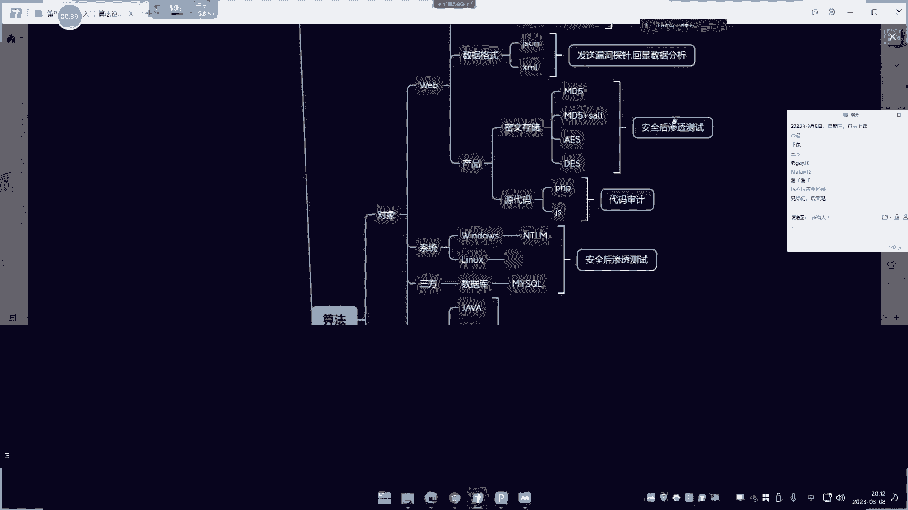

然后熟悉了一下部分的一些加密的一些算法啊，这节课呢我们就详细从这个算法里面的，剖析了几个比较重要的几个加密的算法，也是我们今后呢可以看到很多吃的这些算法。

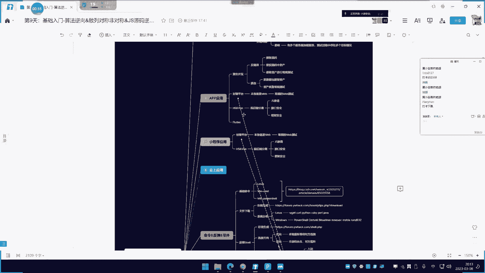

那么具体有哪些，我们先来说一下讲的内容呢，就是这四点啊，我们首先来说第一点啊，就是关于这个算法的概念和分类和类型，一般我们要了解的主要是分为三大类，第一类呢叫单向散列加密，代表的加密语言加密。

这个算法的类型为MD5SHAMACCCRC，这种算法的都属于单向散列加密，什么叫单向闪电加密呢，它的特点呢就是方便存储数好低，加密和性能呢没有什么太大的一个影响，缺点呢就是存在暴力破解的可能性。

也可以通过加盐的方式来提高安全性啊，这是我们说的单项，那么它的一个具体的一个差异是在哪里呢，它的具体还有什么啊，代表是MD5，它的一个差异地方和其他算法的一个类型，不同的差异地方。

它主要集中在他这个加密呢，不需要一些额外的东西，就没有说就是一个铭文，一个铭文，就这两个东西没有了，他不会说像其他加密里面还会有什么加密的，这个什么K偏移量或加密的模式，会有一些什么公式。

密室等等一些其他概念，它就是单纯的就是给个铭文，它它加密一个铭文给你，完了你有铭文推铭文，有铭文呢推铭文就这么简单，所以他如果要尝试解密的话，只需要得到铭文就可以解密，但是他解密成不成功就不一定了。

所以像这类加密呢，它的特点是什么特点呢，我给大家下面写到了，它的特点呢就是明文密文有了即可解密，但是复杂的这个密文就是复杂，用铭文解加密出来的，密文呢可能解不出，就它的特点就是存在失败的可能性，然后呢。

还有一点就是说不需要得到其他的一些东西，只需要铭文即可尝试解密，它的解密的一个这个原理是什么呢，就是我们说的碰撞，就是我们昨天给他举例的啊，就说一个固定的值，比如说铭文是123456。

那么它它就是固定的铭文啊，它固定的铭文就是固定好的，他不会有任何更改，就说你加123456，对不对，你第一次加也是这个铭文，第二次加名也是这个铭文，你照了哈，你加也都是这个铭文，它不会有任何的改变。

所以说别人呢就把1213 15，一直像这样子推下去，把所有一些常见的密码呢，把它全部加密成一个铭文，再用这个铭文的去比对你要破解的铭文，再反过来推算出你的铭文，也就是说。

如果他没有列举出来的铭文和铭文的话，没有这个东西的话，你的密文呢啊，铭文的设置的复杂一点的话，它就可能解不出来，这是我们上节课给大家讲的这个原因啊。

然后呢我给大家简单的这个说一下啊，就比如说一啊，然后呢他的铭文是这样写的好。

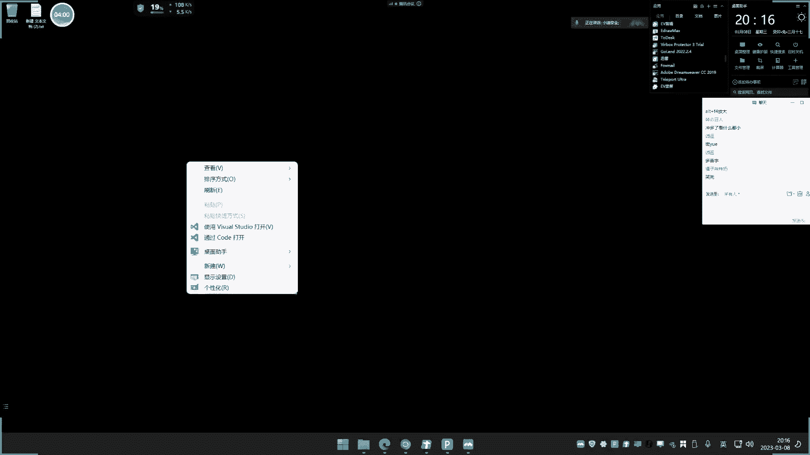

O看你文章是这样写的好，我们就随便写啊，这不代表这个意思啊，三然后呢这样写是吧，然后呢比如说你的密码是123，当它呢刚好在这个加密的时候啊，他是先什么先加你整理好那个什么，这个大概一个我们做的支点啊。

然后呢123对应的，假如说是这个YY，那么这个铭文呢他尝试在这里面去比对手哎，刚好这里呢这里123对应的是他，那么他就知道啊，铭文是这个它就是种碰撞法啊，这种碰撞法，那么也就是说如果这个铭文呢是吧。

复杂的话，就比如说我们写一个什么差额，然后加上一个标点符号，再加上感叹号，并用大小写在111这个变化，那么这种可能性就太多了，这数字呢有多少可能性，字母呢有多少属性，大小写有多少零符号有多种可能性对吧。

然后组合起来的话，可能要几多一啊，多少多少一种，可能才能把这个铭文呢给它编辑到，因为它是相当于一，然后二三，然后再一直到九，然后再变成1011，这样是吧，那这样子往往下翻，所以它可能性太多了啊。

所以导致了一些复杂密文呢，他没有这个东西呢，比对到最后呢就不能这个把它碰撞出来。

所以我们说的啊，像这种比较单向的这种散列加密呢。

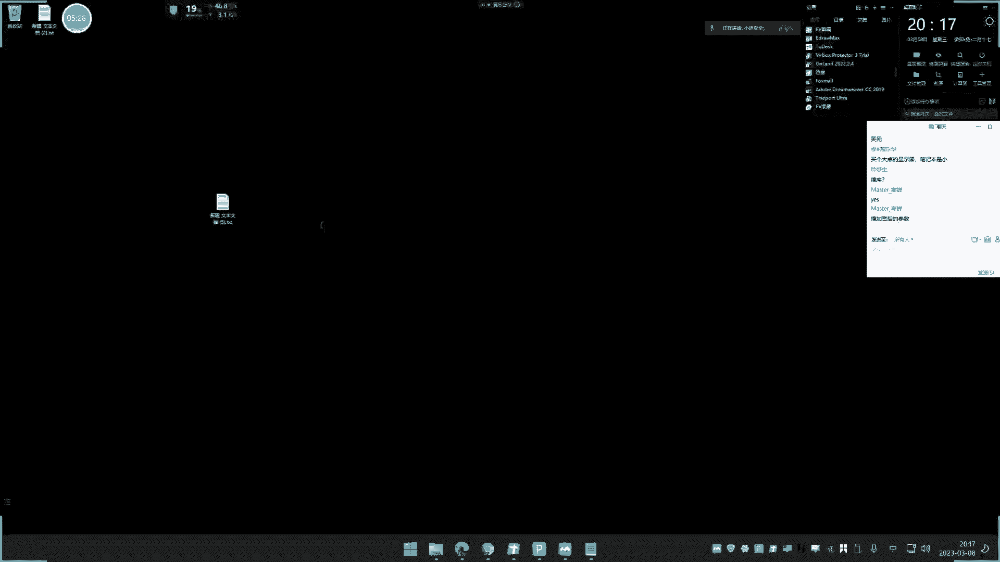

虽然他的这个解密条件呢非常容易满足，只需要铭文呢就能尝试解密，但是他的这个铭文能不能解出来，这个就是要看你那个铭文啊，铭文的那个铭文的那个复杂程度了，你如果因为复杂的话，它就几率就越低。

那这种呢就称之为叫单向闪电加加密啊，代表的一个加密算法呢就是MD5，那么还有其他的，但是一般用的最多的就是MD5，这个是叫对称加密，代表的就是我们的DES和ASRC4，这种算法就是对称加密。

对于沈家迷呢，它的优点就是算法是公开的，然后呢加密速度快，效率高，但它的缺点呢就是必须商量好密室，而且要双方保存好密室才能进行相应的解密，所以对称加密呢你如果要解谜的话，它需要一个特点。

就是一要加密的密文，要加密的模式，要加密使用的K就是我们说的加密的密码和，加密的偏移量，这几个条件你都知道方可解密，然后它的解密呢一般是9%，19。9都能解密，还有百分0。01的就是一些意外情况。

因为它的算法是有的，它是利用逆向的算法去解密，不像刚才是利用碰撞能理解吗。

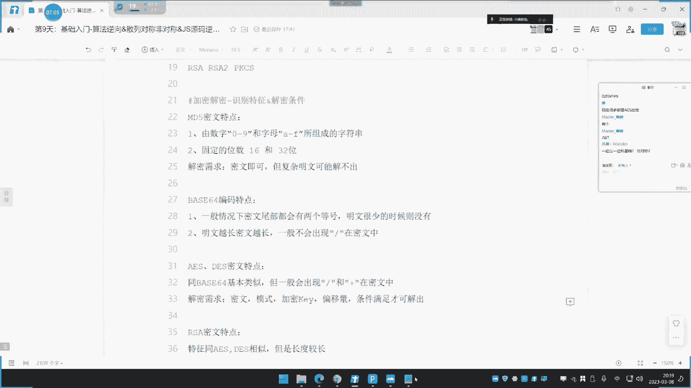

来通胀解谜，啊现在那是你用算法一项，就是一个呢是用算法去还原啊，这个呢是通装啊，就是我们说的碰撞运气一样的，碰到了就解了。

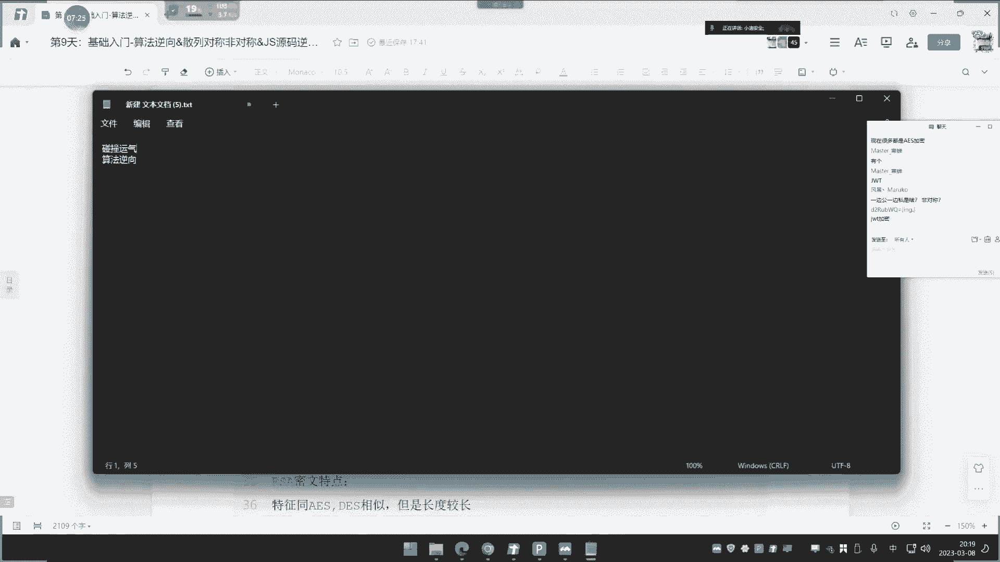

碰不到就碰不到，然后这个是算法逆向，就是直接用它的算法还原出来，所以他的解密的成功率较高啊，就成功率是200，但是他的这个要求太高了，就是说你有铭文呢还不行，必须要有这个相应的什么相应的这个模式。

加密模式，还有加密K偏移量等等都要知道才行，否则的话啊你解密的话就解不出来，这是我们说的这叫对称加密，就是双方呢都用一个固定的密室啊，就铭文那边去加密，密文是一个密室，那么这个密室呢在解放那边呢。

也要备好这个密室，双方商量好这个密室就是我们说的加加密密码，然后呢加密方用这个密码的去加密，解密方呢也用这个密码加密啊，进去解密，然后呢都是对这个密文的做手，所以说这个密室呢是非常关键的一个地方。

这种称之为叫对称加密，代表加密语言，ax和D，还有一种叫非对称加密，称之为RSA代表加密产品，然后呢还有RSS r p k cs这种的，都是属于非对称加密，那么它有个什么特点呢。

它的优点呢就是比对称加密的安全性要更好，而且它加解密呢需要不同的迷思，公司和miss就是有两个东西出来了，前面的是一个双方都用这一个，然后这里呢它就出现两个，一个叫公钥和密钥，但是它缺点呢就是速度慢。

只适合对少量数据加密，然后这种算法呢它有个特点，它的特点是什么呢，它需求密文，然后呢公司和密室随便得到一个也可以解密啊，看水平达到一个也可以解密，这是我们介绍的三种类型。

然后介绍了三个类型里面代表的加密语言，加密这个算法，那么现在呢包括这里还有很多是吧，这个加密的一些特点等等，我等下再看啊，现在呢我们就用个这个安利的去给他看一下啊，就用这个用脚本语言去写出来的几种。

加密的这种特征啊，我们来看一下。

现在我们写了个pp文件。

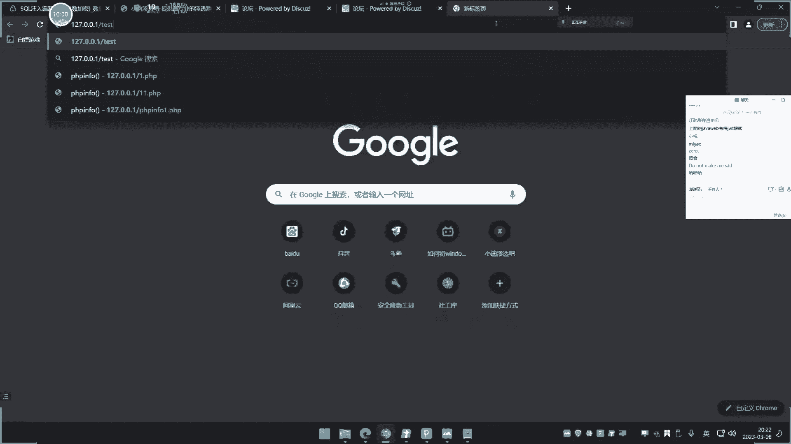

用pp呢给他看了一下啊，呃应用到了MD5加密和base news，加密和as加密和DEC加密，加密和RSA加密等等。

然后这个对应的代码呢我也给大家打开，给大家看一下啊。

这个是它的一个代码啊，然后呢我这里呢这个是利用AS1加密的，我们来给大家看一下啊，不用看，我们直接看下面啊，上面我们不管它的这个是MD5MD5，它的pp的一个大概加密了，原始数据呢是这个叫小迪SC。

利用这个pp的MD5这个函数呢，针对这个铭文，小迪SC这个铭文进行加密，并把它输出。

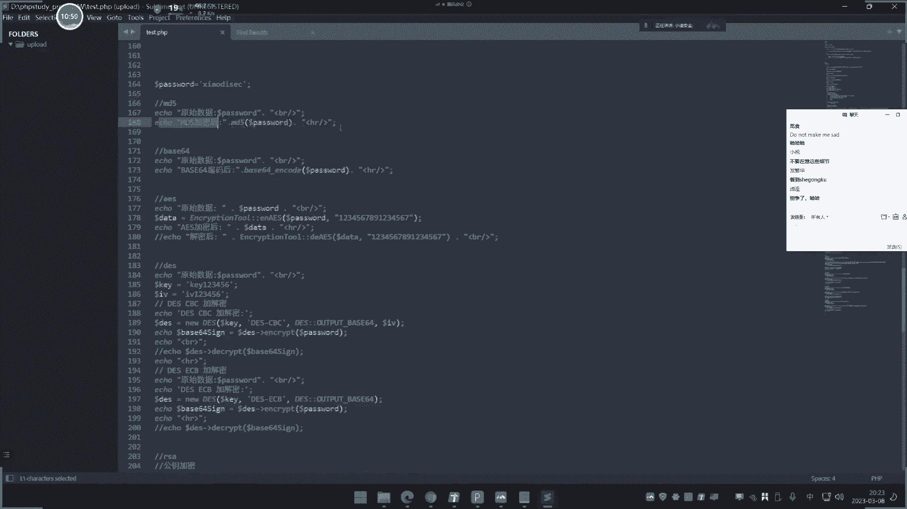

然后呢这里看到的结果是什么，就这里啊，这个就是小迪SEC，它的加密后的结果就变成这样子了，这个就是它的MD5加密值，上面是铭文。

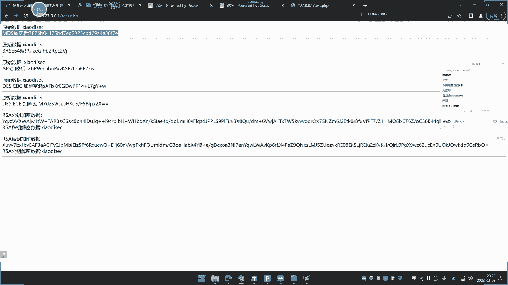

下面是英文，采用MD5加密，在这个过程中，我们看到代码呢只有两行，就是啊一个是我比较加密的铭文，然后呢再是利用这个函数呢把它进行加密。

就这么简单，然后接下来是菲斯六四。

也是一样，也是利用这个函数叫base61logo的，它是编码，前面是算法，这个是编码，编码不一样，编码可以直接解码了，因为后面经常会用到base64，所以我嘴巴提了一下啊，啊可以用工具直接编码。

也可以用这个脚本的直接解嘛都行啊，它是可以逆向的，而且只要有这个编码值和，就可以把这个铭文都给他复出了，你看他对这个小离是一个进行编码。

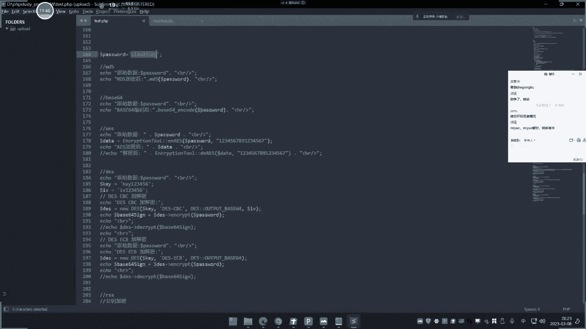

编码的结果就是我们看到这个人了，好这个是MD5，这个是B64。

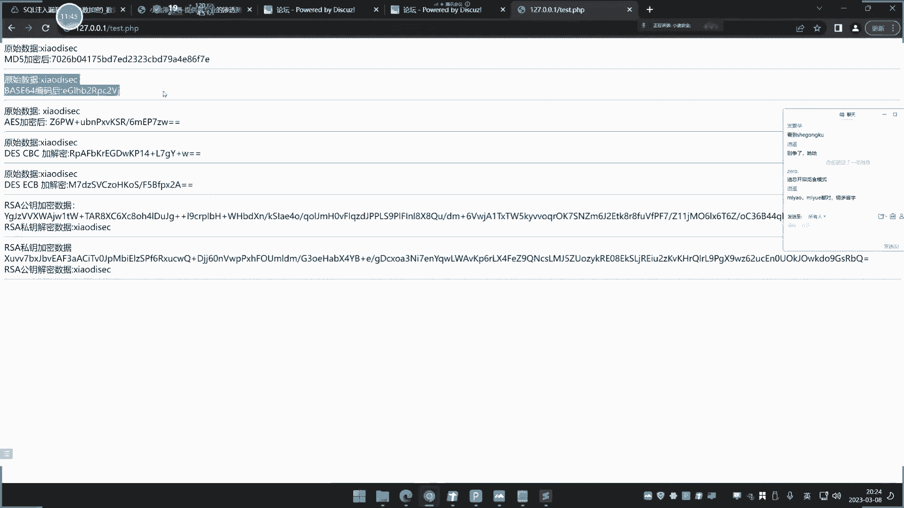

然后呢再来看这个AS加密，那这里的终点就来了啊，因为主要难度的就是在AS之后，看一下原始数据呢是这个小迪SEC对吧，然后你看他加密的时候采用的什么，这里有个什么呢，用这个东西。

然后呢用个什么password，然后写了个什么1234561大堆，这什么东西啊，我们追踪一下这个函数啊，看来是干嘛的啊，这是定义的函数啊，还利用这个东西加密的，我们看一下啊，这里有什么东西啊，你看啊。

他在加密的时候采用了一个叫什么ax128。

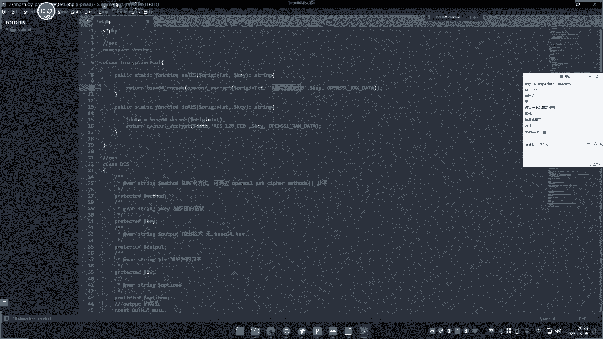

ECB一个K扫一下好，我们先把工具打开啊。

这里呢会用到这些工具。

我们刚才下啊，找到这里找到了个ax18，你看啊，他在这里呢有一个叫什么K，就是我们的加密迷思，这个叫model加密模式，E c b c b c c f b o f b，这个叫填充模块，那是物种。

然后这里输出有A7X和base。

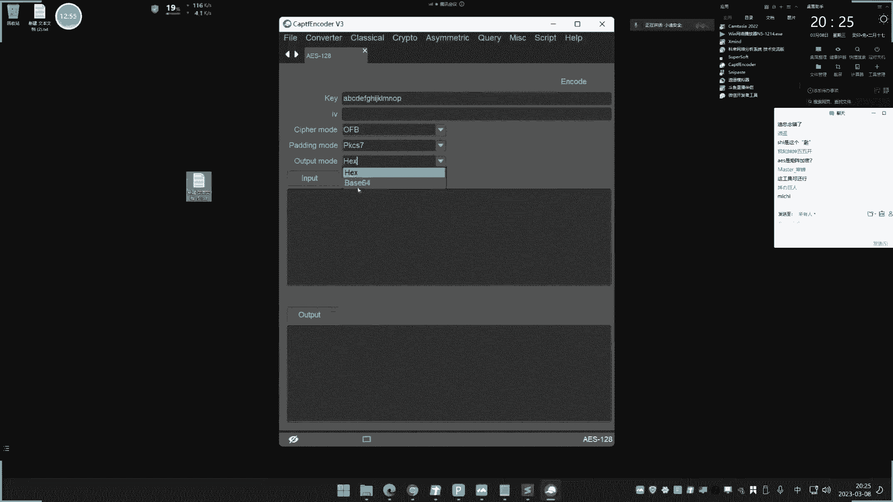

65种两种啊两种，那么你现在看一下啊，我这里呢针对小李SC把它复制过来放着来，这是我们的加密的明文写下进去。

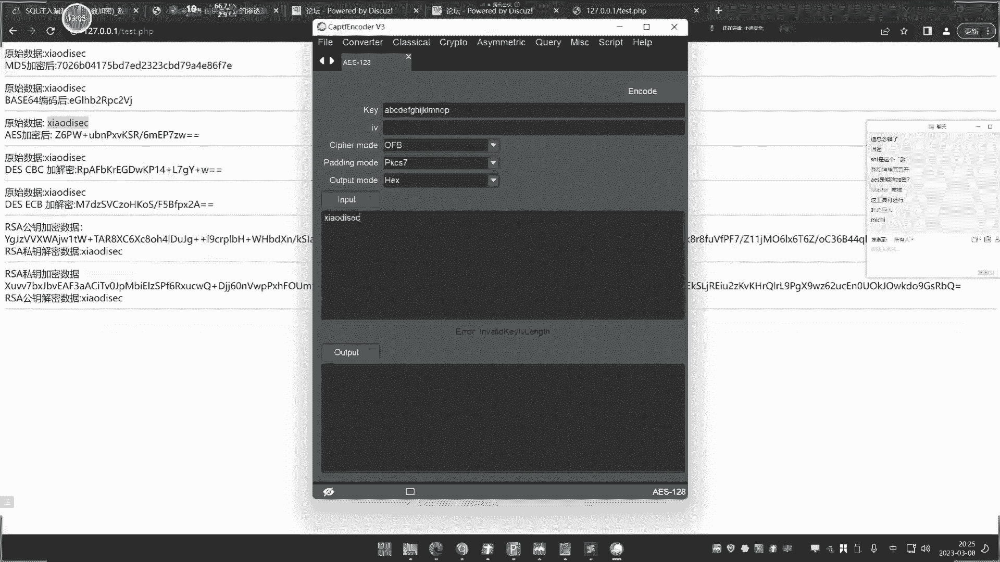

然后它的K他在这加密是采用什么加密的。

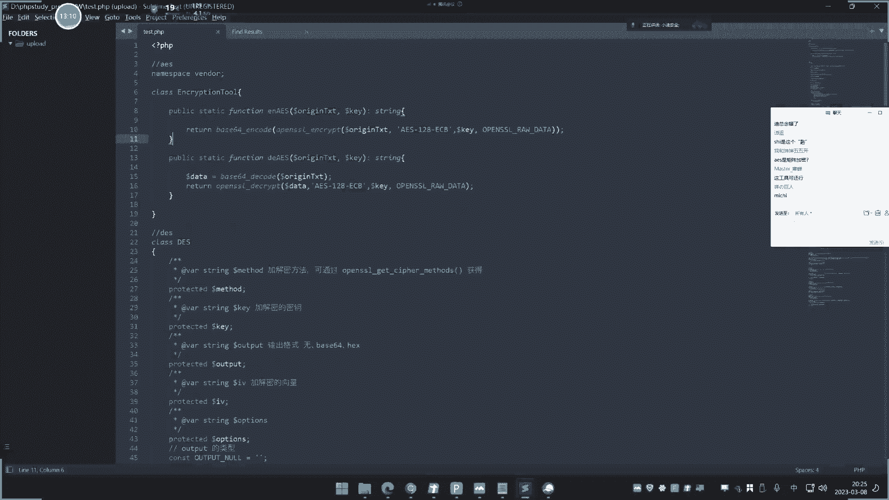

Ax 18128ecb，那么选择什么ECB模式，看到没，ECB模式，然后呢下面还有一些我们看代码里面。

这里的K是哪个啊，K就是我们传的第三个啊，我找到刚才下面他给他直接传的K是这个字，这是加密的，K把这个写进去好，然后呢填充模式如果不写的话，默认就是这个CEO选他好。

我们来进行把它取名为base64编码出来。

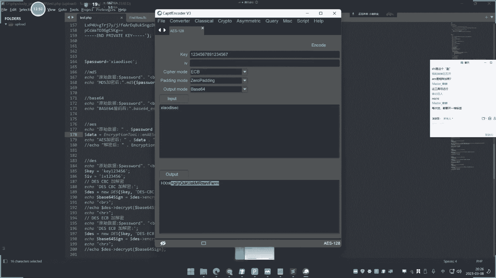

我们观察一下这里了，嗯这里呢ecb base就是呃小离CCPCB啊，诶这里有点不对呀，这个好，这个对这个pk c s7的，你看看是不是前面是PKS7代码中。

啊你可以查一下这个下面这个这个写法啊，他有些不写上去，并不代表就说啊它是哪种模式啊，这个是ANS这个D这个解密的加密的时候呢，采用这个这个应该是那个pk模式来pk c7模式。

你看小DC我们在这个工具这里啊，偏移量我没有写，因为这个ECB模式呢不用写P电量啊，默认没有利用其他模式的话，它有偏移量，你看小于C这里EDO等于八编码，编码就成为这个了，这个是你看合了四个对应上了。

你看同样道理啊，我们去解谜的话，该怎么解，你看啊，假如说我去解密的话，我怎么解，我把结果写了再来，然后这里点1decode，来点decode，你看是不是解密出来也是小于C啊，把这些给他选中。

当你一旦去掉之后，你看解不出来了，一堆的它就能解密出来，那解密就解密出来，对不对。

这个就是我们说的第一点啊，这个AEX的一个看到的一个结果，看到一个结果嗯，就是那个as他去解密的时候，是不是要熟知这几个东西啊，你一个东西没有选对的话，就解释不出来，而且最关键的就是这个KK没的话。

你后面因为这几个都可以怎么样去尝试着说，我假装不知道这个模式，我可以尝试怎么样去欢迎一下啊，能够行就有，对不对，这几个呢就这几种模式嘛，没有其他的，但是这个K呢是你无法知道的，如果说你不知道这个K的话。

你有这个密文他也解不出来，因为你这个K1旦错，你解不出来了，但是你是对的呢，但是你是对的呢，它就能解密出来，对不对，所以说这个ax的加密呢，它的关键所在就是这个K，然后如果说是其他模式的话。

这个偏移量也要有啊，它就能解密出来，你看是不是能解密出来。

好同样道理啊，我们再来看这个这个原始数据为小DC，用这个D加密了，我们再看这个D加密了啊，因为它有很多模式是吧，然后AS呢我举了一个模式，就只举了这个呢ECB模式的其他模式，我没有举，对不对好。

我们现在来看这个什么这个DS的，你看D里面也有这几种模式，你看对不对啊，是也和他AS差不多啊，你看啊看ASDS的，我们尝试解密这个看看这个能不能解密出来，这是它的小于C。

用CBC模式加密算的那把选中结果，然后在这里选择decode，然后呢你看看代码。

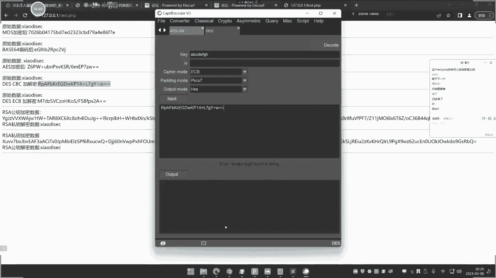

这里我看一下这个代码，这里还有DS原始数据，你看K等于K123456把它放出来，就说我知道这个东西了，我把它放出来，看能不能把解密出来了，K写进去，再看这个代码。

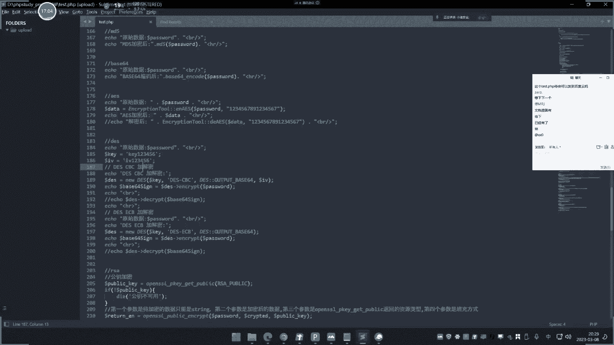

iv代表偏移量写程序，然后看一下模式是什么模式啊。

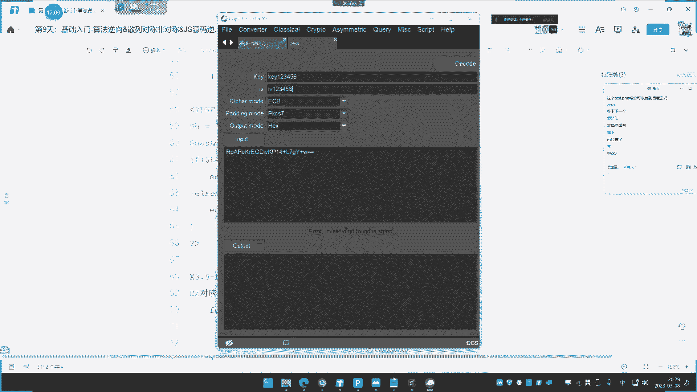

DCBC模式选择CBC模式，再来看填充方式啊，看一下这个后面的嗯，把输出为base64值，然后这里呢选择这个模式，哎，这不对啊，我们还要看这个他这个上面的这个函数呢。

跟踪一下他这个DS的一个一个加密的东西啊，看一下他这里是这个是加密的函数，这个加密函数呢，我们就说我们不是要大家可以去读懂，这个代码啊，就是你要看这个代码里面知道，就是说你以后碰到的这种加密语言。

它是要从哪里得到，我们后面的有案例去给他演示啊，现在呢就是说熟悉一下他那个，大概这个解密过程，然后看一下它里面有哪些条件，这个是我们需要得到的哈，这个代码懂不懂，现在还不要紧啊。

因为后面呢我们也会教到这个东西的啊，然后这里呢你看啊他解不出来，这是为什么，因为这里呢它有一个代码，你看他加密的时候，他把它进行了一个base64的一个这个操作，然后呢我们也就是说他其实输出的时候。

那就是base6，我们要先把它进行base60个解码之后，再进行这个操作，就是它结果呢进行了一个输出，我们来进行解密嗯。

哪里写写的有问题啊，AABC啊。

哦我用这个平台截一下吧，他这工具有时候有这个问题啊。

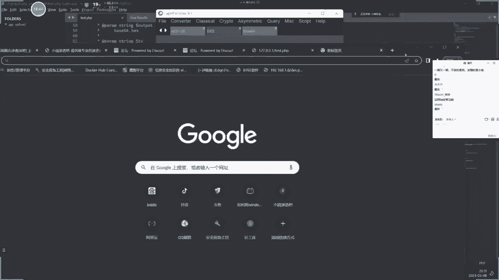

我用这个平台接一下，也可用这个平台截嗯，这个是DX拿平台截一下，我看一下啊，这是K写的热来便宜点写着来，然后CBC模式啊，这个是值解一下它看没截出来了吧，看到没截出来了啊，来了来CBC模式填充模式。

然后再来小C出来了，预备，然后呢这个是CBC模式。

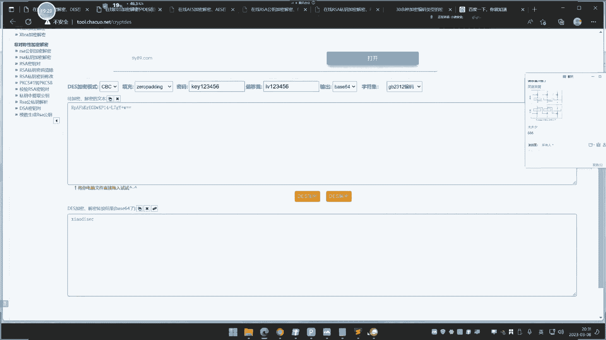

它的下面代码的输出呢，我们可以往下面翻它的下面代码输出呢，你看啊这个是ECB模式，那选择DESECB模式，换了个模式啊，换了个模式呢，换了个模式之后呢，我们看一下源代码。

源代码呢结果呢就不一样了啊，同样都是一个都是一个偏移量，都是一个密码，但是模式的话呢值也不一样了，变成这个变这个之后呢，那我发了再来，我去解密还是解不出来，你看结果没有了，为什么，因为模式搞错了。

要换成什么BCB模式解，是不是ECB啊，是是ECB啊，马竞加，请不要在无法提交刷新一下啊，他有时候是这样子啊，有点慢，稍等一下，稍等一下。

点快了啊，因为他这个逆向出来的结果有时候会有一些，你看这样行不行，这个也说长度问题。

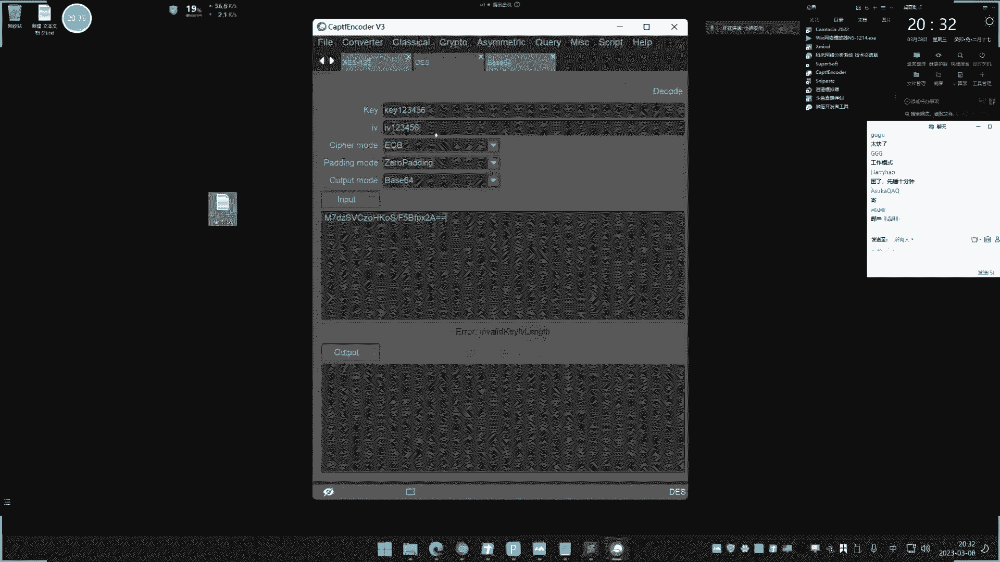

哎呀他这个这个平台工具还是没平台好用啊，出来了出来了，拿卡片都出来了个模式选对，所以从这个案例上面来讲，这个ax和DX我刚才已经给他讲过了，这两个加密算法都是属于我们说的。

刚才说的第二类就是我们说的对称加密，然后他的一个解密条件，刚才从这个上面那个操作，大家应该看到了，他需要哪几个条件，简单来说啊，其他条件呢我可以不用去，可以介绍，最主要条件就是密码和偏移量。

如果说你用这个没有偏移量的模式的话，他这里偏移量写不写都无所谓，但是最重要的就是个密码，如果没有密码的话，那几乎解释不出来，所以密码和偏移量这两个是必备的，像这种模式让你他就这几种。

你可以换着去替换一下，然后呢也就OK了，就说可能性的就这么几种，也不是很多，但是最主要的就是这个啊，这个密码呢和这个偏移量呢，你如果不知道的话，这无法构造出来的啊，那就懒得解密了啊，所以这两个是关键。

除了这块铭文密码，这两个是关键啊，如果没有这两个的话啊，铭文那肯定是有的，主要是密码和变量，没有的话，那就简明不出来，所以你可以看到这个铭文啊，好这是我们说的这个ax，然后呢。

我们再来看一下下面这个这个叫RSA的，就是我们说的第三类叫做什么非对称加密，然后呢他是一个什么情况呢，我给大家看一下啊，我教大家来看一下，这里面可以选择这个ASRSA的，嗯在哪里，在这里呢。

他这里有两个模块啊，那个RC的，然后这个叫RC的一个创建这啥东西啊，我们先不管它，再点这个了，好，你比如说这里呢我写个我要加密的小迪SC啊，效率IC，我把加密点这个加密，但是它需要两个东西。

一个叫public key和一个perfect，一个一个公司，一个是实施施啊，一个是公交，一个是一个是公钥，一个密钥，这个是密钥，这个是公钥，公司和密室唉我也不知道了，反正妈的哎这个什么药啊。

是啊我读不了啊，我烦得很，反正就那个东西，一个公的一个一个师的，然后这个东西从哪里来呢，你可以自己去创建啊，你可以自己去创建啊，你就说公有和私有就行了啊，你可以自己创建，怎么创建，这边提供创建。

然后网上也可以提供创建，网上的也是，他可以在网上找这种创建的这个网站上呢，他可以在网上去找一些接口的去生成啊。

然后呢你可以用这个工具的去生成，我们这里工具呢也提供了生成个200 042，2048字节的，然后呢pm然后点击生成，你看它就会生成两个东西，剩下两个东西一个呢就是我们说的公交，这个呢是要呃。

然后呢你再把这个东西的复制到这来啊，随便生成一个来放到这来啊，然后呢再把那个呃私钥的也放放在上面啊，这个填私钥这里写对啊，我要写错地方了啊，点击下了，针对这个小连C的铭文呢进行一个加密。

你看这就是这他这他密室啊，这就是密室，你看到没，然后你再把miss的替换到这个上面来，你看能不能解密出来，这个结果来点解密诶，什么情况，你这不是闹腾吗，炉子不对吗，好出来了啊，刚才应该是复制复制的问题。

你看看是不是能够正常的通讯了，你看加密，而且你可以看到了有个特点，大家有没有观察到啊，你看那现在这个是SZMI开头，开开开头的，对不对，好，我用这个东西呢去解它，你看是能解出来好。

然后我再生成一个看一下啊，我再生成一个，你看右边的，你生成一个他编一次呢一直在变，但是那边的东西呢，你不管他怎么编，你放到上面来，他依旧还是能解，对不对，还能解，而且它还有个特点啊，还有什么特点呢。

就是说你不需要这个公司和公钥和密钥，你只要有一个他都能解，你看我把这个公钥去掉，他能解出来对吧，然后我把这个私钥给他去掉，诶他解不出来了，这啥情况呢。

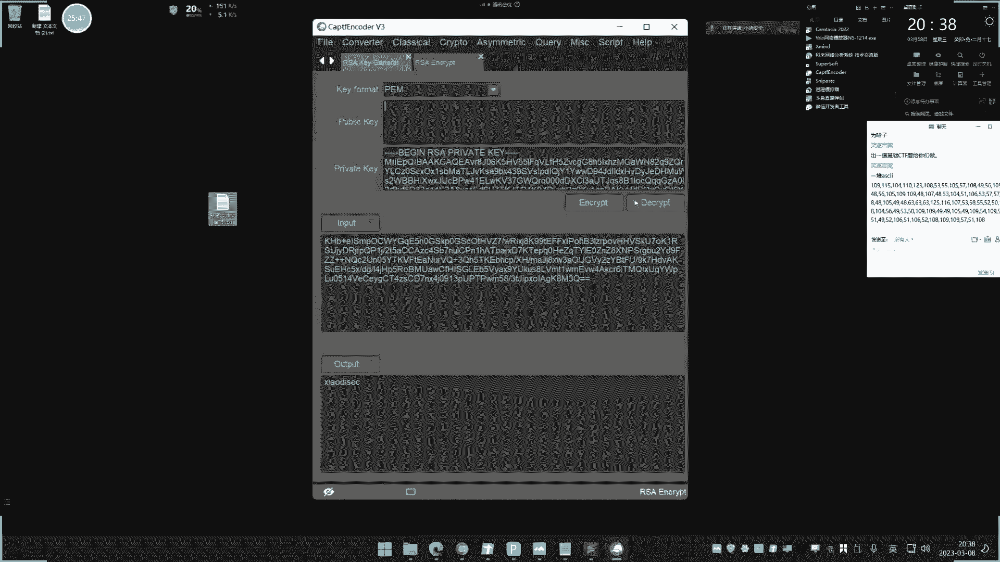

然后呢我就给大家看一下这个例子啊，你看了这个是用公钥生成出来的这个加密数据，这个呢是用私钥生成出来的加密数据，啥意思呢，他的意思就是我们刚才说的他的解密条件，那就是说有名有这个密文，然后呢有这个秘密文。

加上公钥和私钥即可结束，我给大家看一下啊，比如说现在啊我们看这个源代码，这里先看一下这个加密的一个源代码，在这里呢啊。

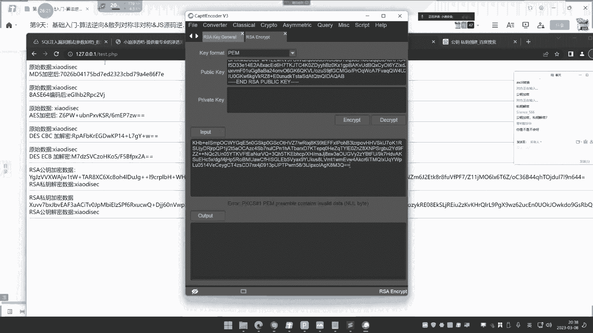

他先是用的这个叫公钥的加密，用的公钥加密，用的公钥加密，公钥呢我写到上面来了，这是我的公钥，这是我的公钥，这个是私钥，然后呢我把公钥都写上面了，他先用公钥加密加密之后的结果取出来啊。

然后呢再用这个私钥去解密它，所以我们就可以看到页面中的，你看啊，这是用公钥加密的密文。

但是用私钥来把它解出来了，那我们来对比一下，看是否能解啊，来把这个复制过来服务过来，我们用这个接口接吧，来找到这个RRRSA的，那这个是对称式加密嘛，那我们的非对称它是非对称的。

点这个呢然后他有两个选项，一个叫公钥加密解密和四爻加密解密，有两个选项啊，就说你是有四爻就选择这个，你有密啊，四啊，你有公钥就选这个，你有私钥就选择这个，那我这里呢假如说啊我有哪个，我有的是四样。

我就点下面这个，我点下面这个啊，然后呢我把这个写进去啊，先让我加密的这个恭喜，这是我的加密的铭文铭文，然后呢我再把公钥呢拿出来，从这里面选择的公钥，那是私钥私钥私钥私钥呢，这是我们的私钥。

把它复制出来啊。

那粘贴出来，放下来把替换。

这是我们的这个私钥，对不对，哦然后呢我们尝试呢解谜，那利用这个私钥解密，解是解出来了，是小的CR你看就说你有一团铭文，然后呢有他的这个私钥就可以解密，但是前提条件是什么呢，就说对方是用公钥加密的。

对方用公钥加密的，如果他用私钥加密的话，你用私钥能不能行呢，你看啊这个是用私钥加密的密文，我把它拿出来，就是我用私钥加密的，然后呢，我再用十秒啊，44钥去解密，哎这个什么公公要啊，哎哎我说的绕口。

这个鸟毛东西哎呀烦得很，那截不出来看到没，他是一个什么呢，就是说如果对方使用公钥加密的，你就只能用私钥解密，如果对方利用私钥解密，那你就用公钥解密，他身为一个裂痕，你说乖不乖啊。

你看现在啊这个是用公钥加这个用私钥加密的，然后呢我们用公钥解公公钥解密，你看啊这个是私钥加密的，我放这来了，这是要加密的，对不对，然后呢我这里是刚才复制的，是用这个什么公钥加密的，好这里选择这个公钥。

公钥解密了啊，把公钥写进去，这是这个东西，然后呢我们把公钥写进去，一个是利用公钥解密。

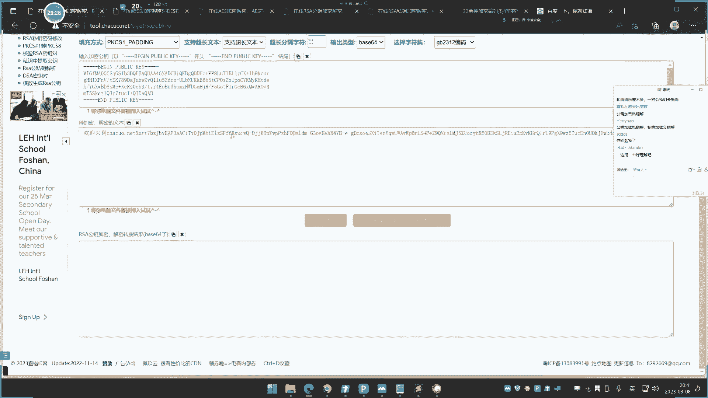

一个是用私钥解密，放出来好进行解密。

你看这解出来了，所以它是分为用公钥解密和用私钥解密，你看现在我们用公钥解密它，然后呢我把刚才用公钥加密的这个东西呢，把它放上去看看行不行，啊他截图出来了，看到没，他这个有点奇葩啊。

就说你是用那个要加密的，然后呢你解密呢叫相反，所以说不知道咋回事，复制错了呀，我这里复制错了啊，截不算还是结不算啊，稍等一下，这个快了啊，我都等一下再传，你下去死啊，我这个脚本子就把它写好了。

大家可以通过这个例子呢观察一下代码，然后注释我也给他注释了。

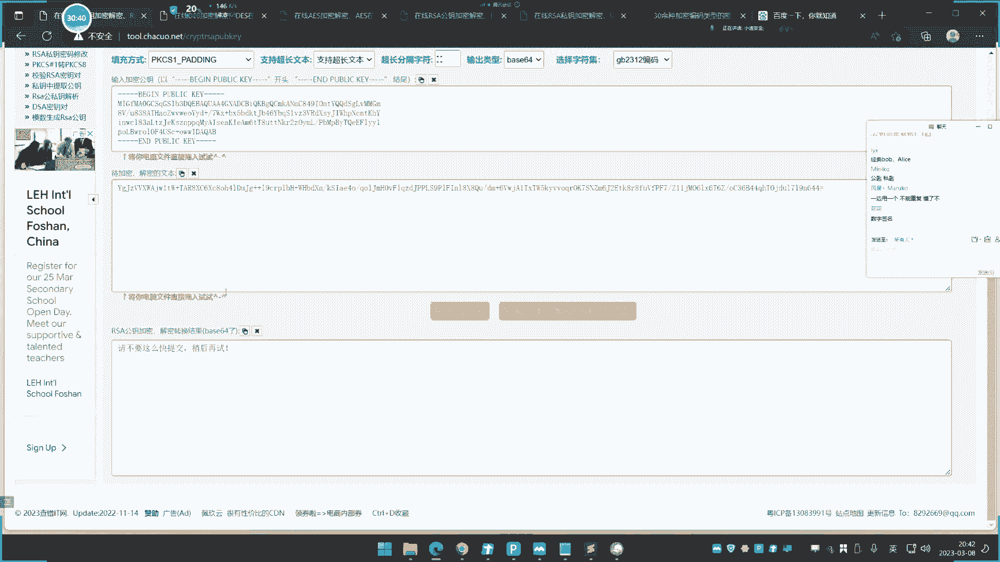

这个是负责私钥加密，然后这是用公式公公钥去解密它，对不对，然后这个呢是用公钥加密，然后这个是用私钥去解密，刚才这里也做过测试啊，就是像这个呢我们可以看到这个结果呢，我放到这来是吧。

这个是那个这个是公钥放上面来，然后这个是私钥就随便生成的是吧，放这来，然后呢结果我们是小李SC，结果是这个啊，加密成这个是吧，然后你看啊，我两个都有的时候，我把解密它能正常解密，对不对。

然后呢我去掉其中一个的，比如我去掉这个解密，它解密不了，对不对，然后你把这个去把这个去掉行不行呢，你看这样把它去掉诶，他有解密，这两你说乖不乖了，所以说啊这个RSA的这个呢有点奇葩啊，你只要记住啊。

这个相反就可以，它是个相反的，但是话说回来啊，因为你在实战中呢，你是无法确定对方是采用公钥还是私钥加密的，你都不清楚，或者说什么情况，你最好的情况是两个密室，就是两个药师呢公钥私钥里都有。

这样子呢就能正常解密了，就不用担心它究竟是什么情况，不用管它，因为你无非就是说啊尝试替换一下就完了，所以说他的这个加密需求呢就是运气好。

就说只要一个铭文，然后再加上一个公钥或其中一个私钥，就可以解密，就是我们说的啊，假如你有公钥的时候，诶，刚好他是用私钥加的，哎你能解密出哎，告诉人家说你有事要诶，他又是公钥加密的，诶你有人解出来。

就怕是什么呢，你拿到了公钥，但是呢对方呢是用公钥加密的，那就不好说了哈，所以最好条件是两个都拿到，然后呢或者是说运气好是吧，其中拿了一个，然后呢这是我们说的那个啊，像这个加密算法里面还有很多一些内容。

我都没有讲，因为不能讲啊，我也不是很懂，最最最不好的就是什么东西呢，这个东西你要学它是一本书都学完了，它里面一些原理啊，就是为什么是这个情况啊，啊是这么个流程加的呀，我们这里给他找了几张图片，呃。

这几张图片你可以自己下去看一下，我们就不跟着看了啊，就大家了解一下这几个特点，然后再通过刚才这个密码的一个特点呢，大家可以关注一下啊，MD5啊，贝斯六四啊，ax啊是吧，这个贝斯六四能不能解呢，也能解啊。

你看贝斯六四怎么解，这里有个这个杯子就40吧，把分上去了，但这个是编码，记得把你给还原出来了，对不对，而且它是固定的啊，MD5那能不能解呢，MD5不能解啊，他这里也没有看到MD5的这个东西呢，有MD5。

但是它是什么，是没有，这个刚才你看这里都有什么一和D，一个一个加一个解是吧，这个也是一个加一个几，对不对，都有M9，有没有没有，他有个输入输出，然后一个什么32和64，32和16。

然后你把这个小C放进去，你看变成这个了，是和他一模一样啊，你看对不对，然后你把这个放进去呢，他变成这个为什么，因为他对这个进行佳明，他有没有这个返回来的这个操作，没有工具也没有没有，不是他没有公正。

是因为他没有算法，它是不可逆向的，就是说它的算法是不可理想的，我们只能采用碰撞，知道吧，就我刚才说的那个原理啊，像其他这种几种语言呢，它是可以逆向的，其他这几个这个算法呢它是可以逆向的，它是有算法的啊。

这个没有，这不可理想的，所以你只能碰，所以他的成功几率呢，只能看那个铭文的这个复杂程度了，越复杂就越难，越简单的就越容易，然后呢我们关注一下啊，这几个加密之后的一个结果，然后呢我们总结一下。

给大家做了一个总结，就是识别方面的总结，如何识别它它的一个特征啊，我们给大家来做了一个简单的写法，你比如说MD5的，它的特点，那就是固定的位数16位和32位，这是它固定好的，通过微数来确定四个M65。

同时它还有一个显著特点，就是数字0~9和数值A到六点F，所组成的字符串，就是它不会出现F之Y的主场，你F之外的硬木字母，你看这里是全部是带F到F，就没有什么这个什么G啊。

这啊这种东西它没有那个就是随便啊，你随便搞个什么这个铭文啊，他基本都是这样，ABCDEF没了，英文字母就永远是几个，然后呢数字就永远是0~9，不会出现什么其他的，而且他的位数是固定的，要么16位。

要么32位不会出现其他位数，同样还有一点，就是它不会出现F之外的英文字母这三个特点，所以根据这个特点呢，可以判断400M6，好再来看贝斯缪斯，贝斯牛斯呢一般情况下，它在尾部都会有两个等于号。

然后呢你可以看一下啊，然后用base60呢给它编码一下呢，我编一下啊，比如说我编那个小的LCC，然后把编码来诶。

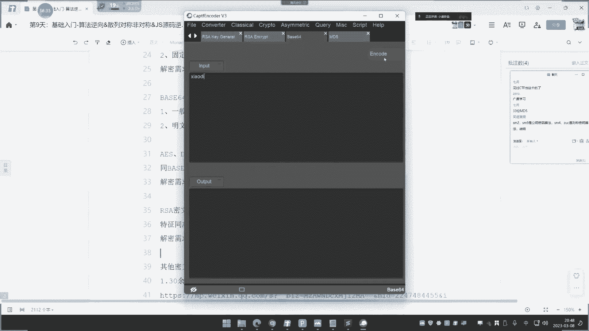

怎么关了呀。

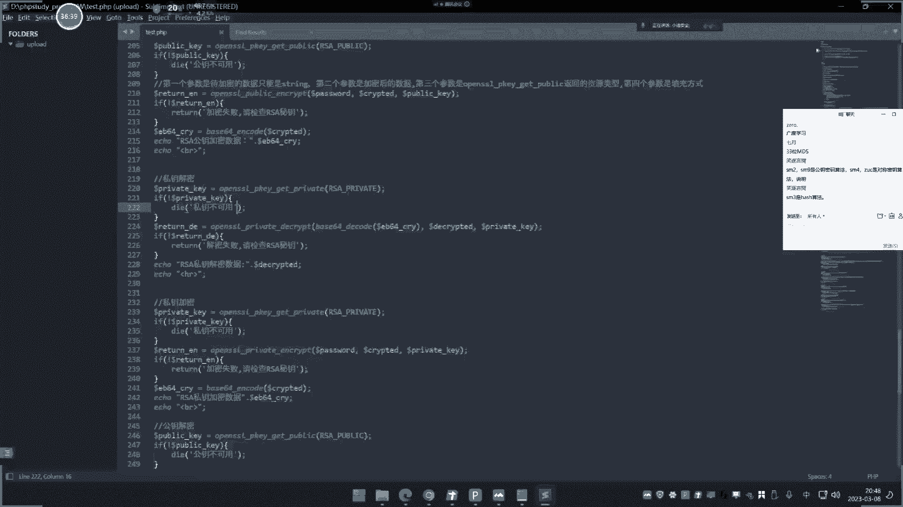

那你看一般有数字的时候，后面都会有两个等于号，一个等于两个等于它就会有这种特点呢，一般数字结尾，那它就会等于号啊，这边就是还有一个情况是什么呢。

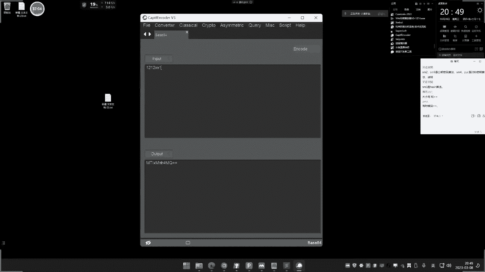

就是一般会有这个啊，一般会有这个什么诶，跑哪去了，这个数字后面会有两个等于号或者一个等于号，然后呢你的铭文越长，铭文就不会越长，来你越长它也越长啊，你的铭文越长它就越长，它会随时更改越短，那就越短。

对不对，就这个意思，然后呢它的这个字符呢有什么特点呢，我还要加一下啊，大小写区分，然后呢通常是这个数字和这个字母的组合，这是它的几个特点啊，你看一下啊，然后呢它有一个显著特点，就是一般不会出现斜杠。

在密文中就不会这里面有斜杠，他永远都是这些这些数字和英文字母，而且一般是英文字母居多，它不会有一些斜杠，就你英文那里看一下啊，我输很多很多，他都不会有一些斜杠的，不会有斜杠在里面。

因为为什么我要介绍这个东西在里面啊，因为在这个ax和DX和RSA里面，经常会出现斜杠来，我看一下AEX的，我看刚才那个特点呢，是不是有斜杠，你看还有什么加号的在里面的，看到没，这种一看呢。

斜杠呢加号看到没，大家看到没，你可以给大家演示一下了，等着我们加一下，先找到ASAS和DS，我们随便写一写啊，这个铭文，那我们把它进行这个decode，然后呢它有两种模式，HEX模式呢。

就是我们说的这个16进制变成64，六个字节，哎刚才的出来怎么一下子就没了，的，啊你看啊换成base64，你看看你看这个你可以看一下这个变动啊，你看那这个变动呢你可以看一下啊，他和那个贝斯尼斯呢有点相似。

你看也是有等于号，就这啊字母，但是它这里呢可以明确看到呢，会有一些斜杠在里面，看到没，那斜杠出现的意思呢，看到没嗯，还有加号，看到没，它的这个特点呢也和贝斯牛斯呢有点相似，相似的就是说明文明文约长。

铭文越长啊，他的这个铭文也就越长，然后呢后面呢也会有一些等号这种情况出现，也是有这种数字加英文字母，以英文字母居多的情况，但是它的特点呢就和贝斯流斯有一个最大区别，就是有斜杠和加号在里面。

这个base60，那是一般不会出现斜杠和加号，它一般不会出现，而这个ax和DX呢用base60呢，一旦搞了之后呢，斜杠和加号就就经常会在里面，一旦发生什么斜杠斜杠和加号的话。

那么基本上大部分都是as或者DS，然后RSA呢它的特征呢和ASES呢相似，那你看这个RSA的miss，但是它有个显著特点，就是这个密文呢特别长啊，我一个小DC这么长呢，而且这个公司啊。

这个这个密这个密文呢会不断的更改，啥意思呢，就像我刚才看到的，我先创建个创建一个这个公司密室，然后呢进行加密，那你看啊它不断变化，而且你可以发现啊，他这个长度呢好像是固定的，不算固定。

就是永远只是在一个限制长度里面，就你密文你即使多长，它也是这个东西呢，而且它会加一次变一次，加一次变一次加一次变，而且他永远就是你这个呢也可以还原出来，它也可以把它还原出来，对不对对吧，也可以还原出来。

然后呢你这个呃你怎么写啊，他都能反映出来，就那个东西呢就那个情况啊，大家看到效果也可以，就那长度呢就是固定在一个东西，它不会太长，它不会随着这个铭文呢加长了就会加长，而且这两个就会加长，对不对。

你越长密文就越长，但它不会，然后还有一些什么其他的特点，大家可以参考这个文章。

这个文章呢还有一些其他的一些这个特点，比如说这里呢有一些总结的特点，大家可以关注一下，比如说这里呢有一些特点啊，我们这里看一下呢，就算呢这里有些算法呢，MD5呢固定长度。

32和16SHA40R56644维，那它都会有一些其他加密算法的一些这种程度，但这些都是有固定长度的，没有固定长度，它就不能这样算了啊，你看由于这个其他加密算法，MYSQL的加密算法nt mm的是吧。

它可以固定长度，然后呢针对其他人，那你可以在上面看一下啊，啊其他的一些加密语言的一些，这个加密算法的一些这个特征，它上面都有简单写一下，你看ax和DS他这里说了一句什么，和贝斯尼斯类似。

其他的就不多说了，我他妈的想说，我就是想听你讲这个特征，你就说你不说了，唉咋办呢，只能自己想啊。

好这个案例给大家讲清楚之后，那么接下来我们就要来到，我们今天比较关注的一个点了，就是我们说的用实力去给大家分析，因为讲了这个东西呢之后呢，永远我们现在都是用看了一下，他这个大概的情况是吧。

脚本的情况完了之后呢，尝试解密了一下，但是没有一些真实的这种源码，或者说没有真实的应用呢，去佐证我的猜想的话啊，那个人看上去也会忘记，所以现在呢我就拿了啊，web源码和这个前端后端的一个是JS的。

一个是我们的后端语言啊，PP的一个源码里面那些加密东西呢，就来看就是说如果你得到这样明文的时候，你是怎么发现的啊。

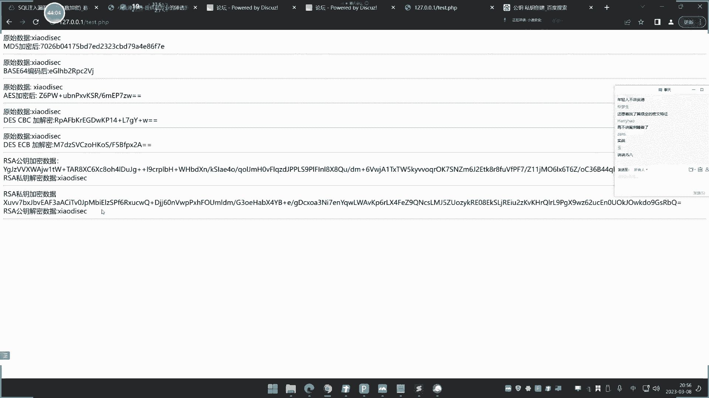

我们先给大家关注一下，首先呢我们来看一下啊。

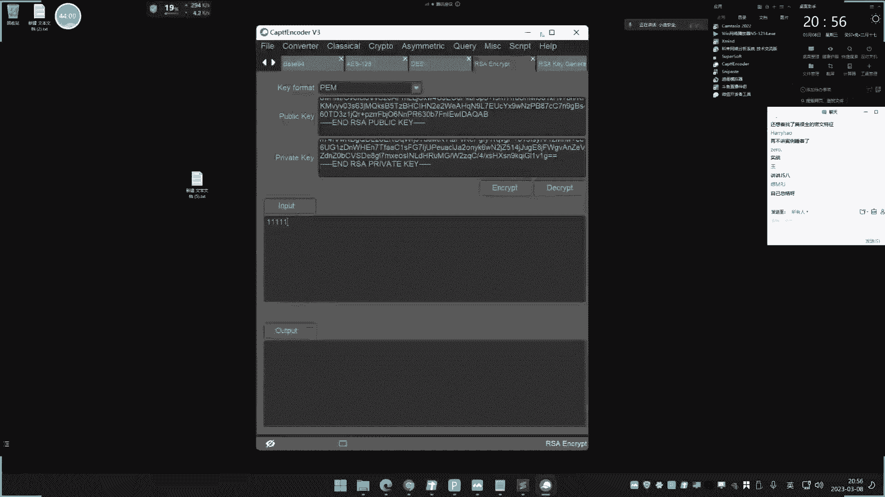

这里不是搭建的网站吗，我看一下，这是我们今天打的理性网站，看一下啊。

那我们进行打理网站，那么这个网站呢我已经打到本地了啊，也不用我说前提背景条件我也不交代了，我就是说，其实我就是说你得到了其中一个铭文啊，得到个铭文，然后这个时候你要把它解出来，你该怎么解好。

我们先来到它的数据库，我直接给你个疑问啊，然后呢，假如说你现在是把达到对方的数据库权限，然后呢，从数据库权限呢翻到了这个什么账号密码啊。

看到了账号密码，但是现在呢这个账号密码呢，这个密码是加密的，你无法知道这个密码呢，它是一个，这么一个铭文啊，你尝试要把这个东西把它还原出来，那接下来的话，那我们来思考一下是怎么做好。

这里呢有一个直根系呢，有个大password等于这个值，这个值呢大家可以关注一下底线，看上去这像什么呀，把尾数一数，那我们来看一下R358687888，1234，巴格斯32位，32位就是MD5，对不对。

那么这个呢如果说真是MD5的话，MD5怎么解呢。

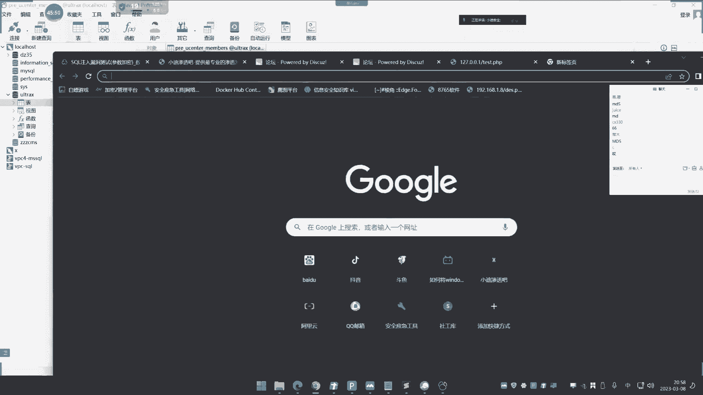

对不对，我们可以用这个SAMD5去解，对不对，3MD5去解，解了之后呢，他说已经查到，然后呢他说缺少严密码是1356，他虽然查到了，是因为我前天我查到的，他这里有记录，他缺少一个盐，那这个假说你查不到。

那又该怎么办，对不对，你查不到这个密码，他不给你截出来，确实个人什么情况呢，就是说如果说你这里它不是M6这个密码呢，它其实不是M6解密的，他是一个什么叫奥特六一的一个东西啊，不管他是啥情况呢。

我给大家分析一下啊，其实就是说像这种网站里面的话，这个密文你先确定他大概一个方向，然后呢再配合源码去分析，有人就会问了，如果我没有源码，我能不能去解密它，我们就需要思考几个点，思考什么几个点呢。

它的算法是哪一种类型的，能不能理解我意思啊，就比如说现在的这个密码给到底好，现在假如说你没有源码，这个码给了你能不能解出来，你先看一下啊，这个是什么类型的，这是我们说的这个单相。

类似MD5的那个算法的类型，还是说是什么AEXDX，还是说什么RSA那种模式，这一看就不属于什么ax啊，那些东西对不对，那么就是说他很有可能是和MD5相关的，那么既然是和MD相关的。

那就是一般的还是有些技能解出来的对吧，我们有30几，但解呢假如说这个解不出来，刚才我是解出来，是因为我有记录他这个言论，我已经把它写上去了，这个言论就这个了，它是采用MD5加盐的。

然后我怎么知道他是怎么个算法呢，有源码你就知道没有源码，那不好意思啊，没有源码你就只能靠猜了，你只能靠猜了，所以我现在就从源码的角度去给他分析，所以也就是告诉大家，如果你碰上一些铭文的话。

你明知道这个铭文，你分析它能够解就解解不了，就只能找他的源码，就是看他怎么出来的，你没有源码作证，那么你靠猜猜不出来，就是猜不出来了，那就是真没办法了。

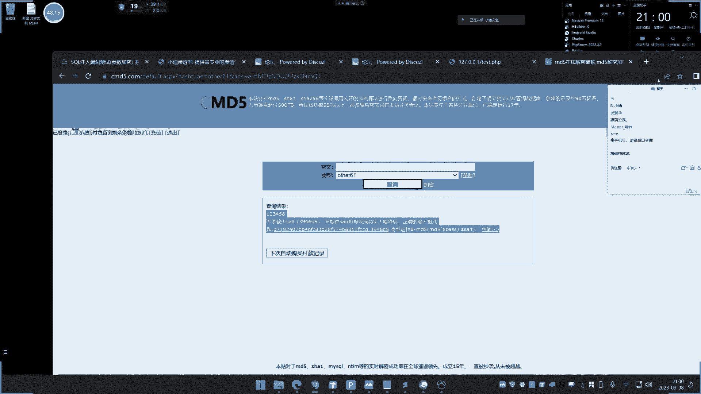

所以我就找他源码，然后呢我也不给他卖关子，我也不叫大家去熟悉这个征讨源码是吧。

我就直接给他找到那个地方看一下啊，这个呢是需要通读代码和web的一个简单开发的，才有一些了解基础的，但现在呢我们基础入门呢没有讲这些开发，没有讲这个东西，而且没有讲代码的一些函数，什么都没有讲。

所以我们只要看一下他在哪个文件里面，或者说test型的逻辑就可以了，那这是它的源码，我打开看一下啊，我把这个源码目录找到，然后给大家看一下啊，他在哪个里面，他这个源码呢是在这个里面，好到了啊。

给他看一下，那是在这个啊这个路径下面USP，然后这个叫AD d user这个函数里面，你看这里还有关键代码，看这里没MD5，加上password点SAT，然后MD5啥意思啊，把它关键代码把它拉出来了。

我们之前写MD5的话是怎么一个逻辑，那这是代码，我们之前写的时候，我们看我们那个案例代码，我看下我那个按钮代码啊，特殊点PP是吧，这是我的安全代码，你看我刚才去加密那个MD5的时候，我是怎么办的。

我是直接MD5password玩的，这是我之前的，他现在这个加密多了一个什么盐，而且用了两次MD5，用的ADIEM6，看到没好，我先按照真相角度去分析它的话，看一下啊，两次MD5，对不对啊，对不对啊。

首先我已知，其实学我们这个算法呢，它是和数学的关系特别大的，如果说你的数学强的话，逻辑性强的话，这个算法就简单，就是你可以做一个算法的研究，日去哀嚎，他去反理想管理想破解的也是要数学强啊。

如果数学不强的话，这个东西逻辑方面的一个东西呢，是实在是没办法，怎么怎么讲，你都有时候听不懂，我是真没办法，还好像我对不对，你像我啊，我这个上学的时候，那对吧，我的这个数学语文呢都还行，我不行的。

不是说英文不行，因为我记得住单词，但是我那个什么表达和那个听力不好，然后像什么物理化学是吧，那个也不行，对不对，我就物理和数学语文稍微好一点，其他的都不行，但是这是我可以说啊。

这特别是像这个数学和数学方面，是对这个学我们这个安全特别重要的，英文呢也有一些重要，但英文呢不用不用表达啊，你只要记住单词意思也可以，但数学是最重要的，开发里面也是重要啊，搞逆向的也是这个情况。

所以一般这个数学成绩好的话，基本上学我们这个安全呢后续学学开发，学理想的，他这个是确实要比一些人的要好接受，好吸收一些啊，但一般像很多学不懂的逆向思维，没有的话，他这个学起来你怎么讲他都听不懂的。

真的是没办法啊，然后我给他看一下啊，我们看一下这个呢是它的一个加密，然后呢，已知就说我们这个铭文呢是123456，对不对，好大家看一下啊。

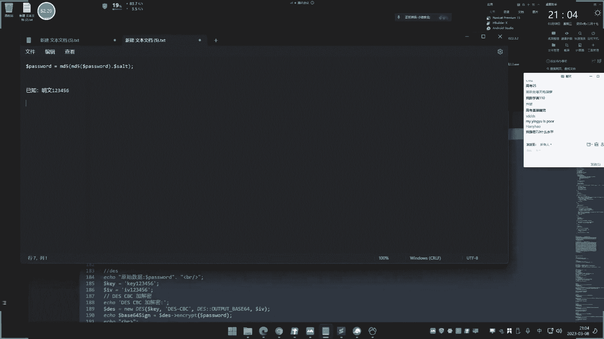

然后呢铭文我知道了，我先给大家还原一下，就按照它的真相。

四环来自沙的哈，SALT值，这是SLT，我们来加一下，看它和它对不对上啊，你看我们先分一下啊，好大家看看啊，我我用这个工具来看一下能不能把它还原出来，先看还原情况，我们再来想反向。

虽然说平台帮我解出来了，但是如果说平台解不出来，我们该自己怎么写脚本解，这也会交，那我先把MD5搞出来，你看啊，铭文是123456，好铭文先加一次MD5，123456等于这个词好记住了。

那么接下来是要加上这个盐呢，那加盐是怎么加，就是MD5这个值点盐盐就加上去，辅导过来，放到后面来吧，那MD5值加出来了，是等于这个值吗，电就是连接服务，把SAT连接上去。

连接上去就是把这个后面加上这个后面去，对不对，再把这个来进行MDV4，再进行一次。

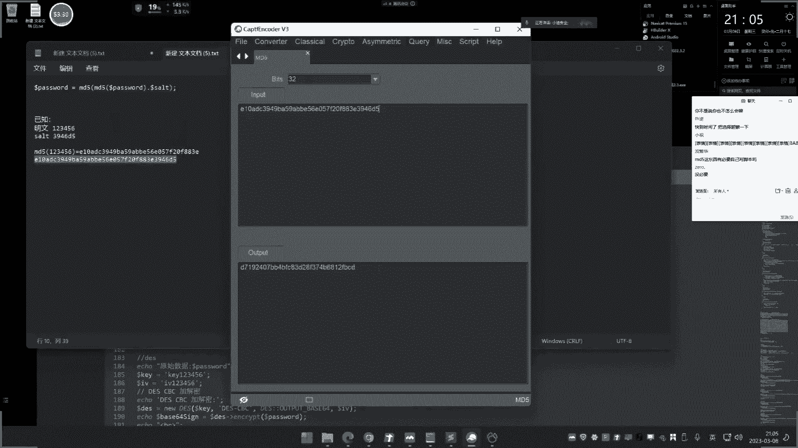

变成了D1D172，我们再来看数据库里面是不是大底。

172啊啊D7192呀，你看。

那结果，是不是结果是不是对上了呀，和数据库里面的呢，他是我的对上了，是不是好，大家想一想啊，这个我可以放到网上去解解它，解出来了，如果说解不出来，我们该怎么办呢，是不是反向一下写个脚本。

反向一下如何写，来，我教大家写出来，我找个网上一个pp在线执行，结果就是大家没有装P环节的话，可以在网上找一个在线运行的结果去运行啊，去给他演测试看啊，我找个PP的这个在线运行的，然后我写一下看看啊。

怎么写啊，我声明一下就说了，假如说password，因为它不是反逆向算法，它是通装，所以我生了一个呢，比如说写个123，然后我再写个什么，这个代码怎么写啊，我没有教大家后面再讲pp开发的时候会讲。

我简单告诉你意思啊，写生命密码跟他，然后呢用MD58的进行什么pass过一次，那把password，然后再加上什么结果呢，我先给他一下啊，我们生命为叫A好，再来AA等于什么呢。

等于变量A加上什么SALTS2T呢，我们来证明一个变量XFLT等于什么呢，对于这个词大家不求懂了，思路搞清楚就可以了，这些代码后面会讲啊，不要有焦虑感，那加上去，那么AA就是这个值加上它。

再怎么样对它的值进行MD5次幂什么，这个AA等于什么MD5，诶是吧，是不是就是这个逻辑，你看先把它加密一次，再连接它，再把M6514，对不对，结果呢为A然后进行一个判断，如果是AA等于什么。

把这个加密值呢拿出来等于这个结果叫什么，提示echo ok，对不对，就是吃这个密码else，一是什么low好，我们来看一下来，那我问问大家，这个结果是会low还是OK啊，来运行一下，这里少写了个分号。

结果OK，哎这个结果是OK的，哦少写了个等号，不好意思啊，少写个根号，一个等号是赋值，两个等号是判断，不好意思，6+4，出边边这个变量股还是666，是我们的真正密码吗，通也OK，那么密码123456。

所以也就是说这种解密的话，就是按照一直替换这个password里都值801，尝试碰撞的密码写进去，按照这里，就是把这个程序的逆向算法给他写出来了，知不知道啊，就是根据它的算法的逻辑，你在反自己呢。

自己呢利用自己的这个技能呢，去写一个解密算法出来，因为这个平台的也是这么一个逻辑在这样搞，只是说他有强大的计算能力，有大量的计算机帮他工作，理着你呢，因为你这个垃圾电脑呢，你就只能跑一点小支点。

他的资源特别多，他的跑的比你速度快，就这个原因没有什么太大区别，好这就是我们说的这个这个啊好，那么这个呢搞清楚之后，我们再来看下面一个啊，你看下面一个又看到另外一个好，现在呢又一个网站。

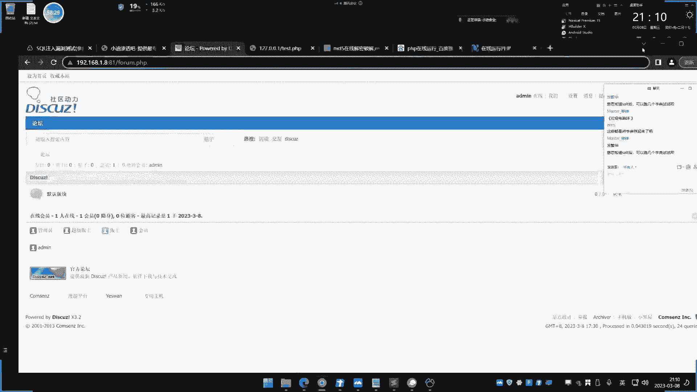

这个是3。2版本，它是用这个算法好，我们再来看另外一个。

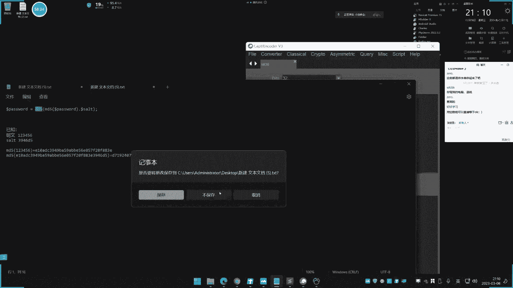

打扫的这是另外一个，这个是X3。5，然后我找了这个差3。5的密文，在这个数据库里，差303打进过养这个里面，这个里面的密码啊，改他的，你看这个边啊，你看他没有盐了，没有那个ST变成这个性了，这啥东西啊。

你看来在我们看都没看到过的一个东西啊，你看这是啥东西啊，他是这个密码呢，然后呢我就说我现在以我的认知，我不知道这是什么算法，我不清楚，对不对，我就怎么样呢，看源码呀，就说逻辑是这样子的啊。

就是你清楚算法，你就猜，当然前提条件说有源码的情况下面啊，没有源码的情况下，你猜有源码，你就直接看源码，你可能会问我看哪个源码呀，现在你不用懂这些啊，你把那个web漏洞和代码审计那个课程学完之后。

你就自重啊，你心目中有答案了，如果说那个没有学，那你肯定是不知道看哪个源码的，因为你把web漏洞学完之后，或者说把一些漏洞学完之后，把代码是你分析清楚，你就知道这个代码文件中，哪些东西可能会和加密有关。

你就知道怎么找了，能理解吧，所以你不知道找没找源码，就是你漏洞和代码方面太差了，你不知道这个开发框架为什么说要学开发呢，因为学开发就是熟悉的框架，你就知道这种加密的东西它会放在哪里。

或者说你有一个什么方法把它找到，能理解吧，所以我为什么要交开放啊，现在要把它安全的并用，就是希望呢令人熟悉下架构，然后呢你当你去找一些东西的时候，你知道在哪里，那么现在呢我们就来看一下啊。

这个招我就不交代了，我直接源码给你看一下，看一下是什么加密的，就是说你知道加密算法，你就直接尝试，不知道就看源码，你可能会源码不，咱们没有怎么办，然后没有了积极啊，那还有什么办法呢。

因为很多加密算法里面，都需要有一些什么密室啊，那些东西，那密室你得不到，肯定大部分都是从源码里面获取到的，源码都没有，密室也没有，那解密个毛啊，是那谁来都解密不了。

所以他是有条件的啊，我不对，他找那个加密那个文件啊，给他看下他是怎么加密的，也是这个文件啊，也是文件在这里啊搜一下，然后在这里是这个那ADD user，你看他怎么加密，打了加上这个函数。

把函数给他跟踪一下，来点击勾跟踪了，再来，在这里在这里用到一个什么，你看这里啊，这里的这个地方用到一个角，诶，这里在这里，叫password哈，气啥东西啊。

网查一下这个函数啊，不懂的话可以查一下，不是不是教大家用这个函数，不是教大家搞开发，就是我们要有这个案例给他演示，你知道这个流程啊，那一个这个pp特有的一个什么哈奇的一个闪联，也是属于单向加密函数。

然后呢这里网上也有它的一个使用的教程，大概使用了它有三个值，那这里有两个呢，EQ一下来用pr加密这个值，那结果就是这个，你看这个结果的案例式就和它相关的，你看和他差不多了，你看来看到没。

结果和这个差不多嘛，你看，对不对，然后这个该怎么解它呢，这个该怎么解呢，其实也非常简单啊，来也网搜一下啊，解明它可以使用另外一个函数，另外函数叫什么函数呢，我给他提前写好了啊，大家看一下。

我把代码的简单过一下就可以看着放到这来了，刚才我讲的样这个模式对密码写到这来，P比对这个值来用的，用password fie r i t y，这个是解密的那个函数，刚才那个是加密函数。

这个解密函数那对应到123456，对对它，因为它这两个都属于单向加密，就是说没有算法的，只能用这个碰撞，那我碰到123456碰撞它行不行呢，碰撞它如果成功碰到这个密码如何成功，他就是说比对这两个字了。

用这个来碰撞123456，结果和哈奇进行比对，成功了就会返回OK失败了就会返回error来，然后OK是吧，然后呢，如果你搞个错误密码的话，才错误码了，对不对，一直要你输入正确的密码的时候。

比如说我们解密，那就这么一个解密，而且这个解密呢，为什么他新版本用的这个解密呢，因为这是PP内置的一个算法，在网上CMD5上面他是没有的，它是没有的，能理解吗，那你把方上去查不到，为什么。

因为他不支持这个算法，那么网上没有这个接口。

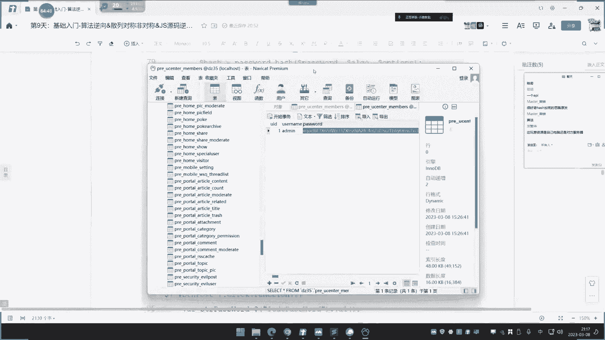

没有工具，这个工具也没有了，也没有。

因为这是PP的值的一个哈，希算法也是个单向加密的。

那么很简单，我如果不讲这一课是吧，你不知道这个东西不了解，这逼我给了你也没办法，但是你了解了，你就可以按照你的思路去写这么一个解密角度，尝试对它的东西来进行解，但是解不解出来，这也是运气了啊。

因为这个密码我设的是12356简单，对方如果设置个复杂的，那就看你能不能跑到哪里去了，跑不到也是没办法，所以说他这两个程序使用的两套算法呢，都是相对于来说是较为安全的，因为他们都是不可逆的算法。

不是像个ex d s是吧，因为那些条件之后就直接给他还原出来，不会存在这个还原不出来即可，但这个呢就存在还原不出来的可能，因为他的密码呢你是未知的，你只能碰，只能用字典装。

你是没办法去把它直接还原出来的，这就是我们说的这个等下java的杂解密，所以说我无论怎么去讲课程是吧，有些人呢我没有讲到点，他总会有疑问，刚才有个人说java咋解密，这个你说错了点啊，我说的是加密算法。

和你是什么语言没有关系，你java里面用这些是MD5也是一样的，解法无非就是说你用java去写一个这个解密脚本，就这点不同，但是你能用其他语言去写这个脚本脚本，何必要用java写的，其他也可以啊。

Python也可以啊，这有什么区别吗，我们是讲的算法和你什么语言不相干，只是说java程序里面会使用哪种加密语言，和P1P里面会使用那些加密语言，它会有一些差异之处，但是这种公共类的加密语言，加密算法。

MD5啊，什么ex啊，都是一样的，没有区别，能不能理解我不讲这个东西呢，就有人说你还在讲pp，这和pp和java有什么关关系啊，没关系啊，PP简单易懂，所以拿它去讲，你换个java也是这么个情况。

它的算法不会改呀，你无非就是说用哪种语言写个解密脚本而已，赶紧讲JS啊，那我就不讲JS，越想听，我就越不讲，对不对，开不开心，我都说了，我们这个JS呢是讲的入门的，没有真正的去教你这个JS机箱。

你可能说那就不讲了，那基础课程讲后面讲啊，不是现在我们这是基础门啊，不能讲，你像这个后面呢我们会说是吧，像那什么一些什么大网站，什么五八呀，或者什么这个哔哩哔哩呀，或者什么头条啊，这种网站上面是吧。

就和我们写那种写那种爬虫，那些租车的一些东西去分析他那个登录啊，或者这种算法是吧，那种把它解出来啊，就是那种立项嘛，那种呢就是大家所需要的啊，但不是现在讲，现在我们只是看个案例啊，熟悉一下啊。

然后呢我们主要看这两个程序的一个解密，然后呢我想大家想一想，这两个程序它都有一个特点，有什么特点，它的加密不管说他是加密这个密码的时候，它是采用什么加密的，采用后端语言加密的。

就是它本身的代码语言加密的，它是用pp写的，那么就是P的这个代码文件加密的，这是我们说的第一种情况，那么这种情况就是必须要得到源码文件才可以，为什么说呢，因为我们知道语言呢分为前端语言和后端语言。

前端语言就是我们常说的ATM2，JAVASCRIPT是前文的语言，后代语言就是注入什么pp点net java，Python web环境的都属于后端语言，后端语言就是说源码你没有的话，你是看不到真正代码。

所以源码它的源代码你必须要有才能看到代码，所以刚才演示的都是后端的加密，那么也就是说你没有这套程序员吧，你是不知道他是怎么一个逻辑的，就不知道他是怎么加密的，你不知道你只能靠猜。

但是还有一种情况就是我说的，大家刚才提到过的讲JS的，那么JS呢它是一个前端语言，它的所有代码都会在前端里面可以看到，就在浏览器里面可以看到它的源代码，但是我们这种刚才我们看到这种呢这种文件啊。

他是在前端看不到源代码，他只在这个源码里面才能看到，就你来去去翻我这个文件，他看不懂的啊，要知道啊，不要说为什么什么前端后端扯一大堆，我听不懂，你只要记住啊，前端浏览器里面是可以看到源代码。

后端语言像这个pp啊这种类似文件的话，你访问这个地址他也是看不到的，这个编码是不是这样的啊，它显示出来只是它的结果。

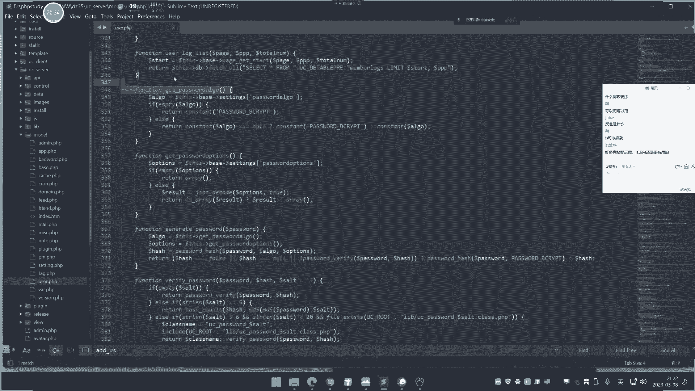

并不会显示它的真正原代码，那么现在呢我们看一下我们这个登录框，这里啊，你看啊，我把逻辑给大家看一下啊，那首先假设说我们先进行抓包，我把流程给他走一下啊，那我登录一个账号密码，那我登录一个账号密码。

这是我们的博客浏览博客服务器啊，还有很多啊，我等下可以给大家简单演示一下啊，我登录他对不对，大家看着登录之后我看数据包，数据包这里呢有个发送，我还没有讲一些数据包的知识啊，下节课就要讲了。

那这数据包知识，这是他发的，我上节课还把这个综合案例给大家去分析过。

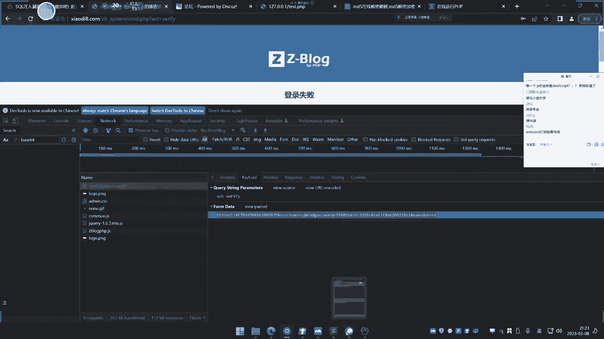

这是他发的数据包，然后把这个前面再去掉，只看这个和password，那uzenemy password是我说的是我输的是什么字，我也忘记了，但是呢他变成这种东西，肉眼看就像MD5，对不对。

那我去尝试把它解密一下。

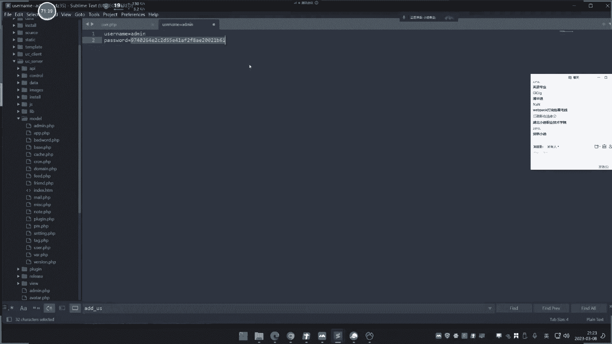

是不是MD5，是啊也算是解出来了，是M5，那靠你猜中了，对不对，那如果说我他不搞个M65，搞其他的，那怎么办呢，我是要看源码，源码也没有，怎么办呢，看前段，所以我们这里呢要给他写一句话到这上面去啊。

这种开算法除了我们自身的这种东西之后呢，就是测试安全，测试中有一句话，我要把它写到这个地方，我怕有些人我伤着伤着，他也听不进去，他也忘记了，比较关键英雄啊，啧啧，它的流程大概是这样的啊。

就说你碰到这个疑问了啊，一种呢就是说有两条思路走，有源码直接看源码，然后再分析算法对吧，还有一种呢就是我们说的英文没有源码，就是两条路走，第一条路走什么才十点，都是你自己靠猜，就像我刚才那样。

我不知道我原版没有，我就猜出来的M6，还有就是我们说的什么看前端JS，而且这个呢不一定会成功，因为它的成不成功又被软硬决定什么原因，就是它的这个加密逻辑是不是在前端，如果在前端，那恭喜你找到了。

如果不是在前端，它在后端的话，那没有源码还是不行，所以呢就是很简单啊，后端的话就必须要有源码才行才能知道，才能怎么彻底知道，好我们来看一下啊，那么现在我猜出来了，那我不拆的话。

我按照我不拆的思路去分析它，你看下啊。

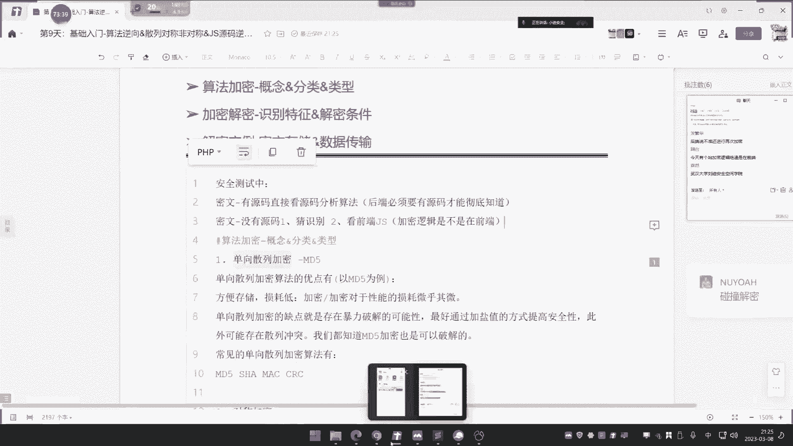

我不到啊，我能不能分析到，那找到刚才的地址在这里是吧，然后你看啊，我看有有有有有个什么不一样的地方啊，啊重新来一下，返回去啊，先把它清除掉，注意啊，这里要把这个勾选掉啊，这个勾选掉，如果你不勾选的话。

这个地方勾选掉啊，如果你不勾选的话，它有一些数据包可能会这个啊，这个是基督就是所有记录啊，意思就是这个不过瘾了，然后呢我们现在呢点一下啊，来看一下啊，我输入艾特，然后输一下3456或者怎么样的啊。

我随便刷新一下，给大家看一下啊，刷新刷新手呢大家可以关注一下啊，我在登录的时候，我可以点击这个地方，你看一下啊，有什么区点登录的时候，我们找找浏览器包看一下啊，它有什么逻辑性啊。

好这里有个JAVASCRIPT，你看啊，有个什么东西啊，你看啊，V那如果这里bb t n post点Lt function啥意思啊，就触发了这个登陆这个地方的话，就会触发掉了。

b t n post就是个登录这个地方，对不对，他的id叫bt n post，那这里是b t n post，然后什么声明一个变量等于1DTULEMON，点VL就是取它的值，声明一个变量password。

取这个e d password取它的值，那么这个EDUSM和password是什么东西呢，我们再往下面看一下，来把它拉到用户名这里，再点这里呢，是不是用户名name就是EDTU密码，这里就是1。

18105的呀，来对了，那就是说这两个呢就是获取账号密码，获取完之后做了个什么事情，你看点X型，直向地址，SAMD点ACDVERIEFDY，然后什么，你看这密码等于MD5扩上来。

S t r password，看到没，为什么说账号没有加，这里加了，那么这个MD5又是从哪里来的呢，MDV从哪里来的呢，开发里面如果这个函数是内置语言带的话，他可以直接写，如果不是的话。

它就会引用一些模块，我们看一下他引用什么模块，看看上面有没有英文的啊，看上面的加载JS文件里面有个叫script md5JS，包括这里程序加热包里面有个MD5JS，我打开一看。

这其实就是MD5函数的模块，也就是说刚才他利用M利用函数，就是触发这个函数来进行加密的，他引用这M6JS就是用这M65加密的，然后这个就是用JS写出来的加密的那个算法，那么很简单。

如果这个算法是一个ex的话，那么他就是AS加密，那你行吗，就是说它是什么逻辑呢，就是接收你的账号密码，调用MD5去出发，MD5呢不是这个JS的内置函数，他引用一个MD5J里面的。

重新构造了一个MD5的函数，所以它利用的就是这个JS里面的自定义函数，自定义函数就是MD5的一个功能，但如果这个MD5呢把它功能改成一个S，或者其他的加密算法的话，那么道理就是引用了新的算法。

所以我就说啊，这种网站就是我们说的前端的加密处理了，就是我们可以前端呢通过这个JS文件，翻到了它的加密的这个过程，所以我就知道啊，它传入的那个值是不是采用M65加密的，我本来是不想伤得这么深入的。

对不对，完全是想讲基础的，但是讲到这里了，我也不得不提一下，避免有些人呢就说哎呀这个不该讲的讲了啊，而且我告诉你像这种JS这类的什么，刚才我说的嘛，这个什么逆向的，我们还有更深入的都在后面，都在后面。

这只是一个是吧，简单理解就知道一个加固，像后面还有一些是吧，要追追那个JS文件追几层，说白了啊，这个东西要选好，这是离不开这个代码的，没办法啊，越高端就越有代码，所以说这个逻辑呢大家就能理解了啊。

你看我从那个上面登录这里呢，从这里翻是吧，然后这里你看解说这两个函数呢，指向这个X3D点ACTEV啊，他是发包，就是往这里发呀，他登陆的时候就是往哪里发呀，对不对，你看他登陆的时候，你看到了。

随便输个密码，登录的时候是往这里发，你看发的数据就是什么，你看发的数据这几个三个字呢好吧，还有那个SATD等于，你看前面代码是不是和他一组，真的我看下前面代码在这里，然后回过去啊，他前面代表的是一组的。

你看下面的是吧，取这三个字，你看把密码的进M65，其他的就正常发送，你取这三个字呢，请求的就这个地方，所以他这个登录那就是用JS写的，所以其实就是说有些这个数据呢，它是利用这个前端JS来负责的一些处理。

有些人就是用后端语言来处理的，如果后端语言处理的话，你就必须要有这个网站的源码，我说这个成套的源码你才能知道，如果说是前端处理的话，你可以通过这些我说的这种呢网络包。

也是这些包都可以用DBS的工具能抓到的啊，把抓到之后呢，在这里去找这种JS文件，看里面的是不是有那个涉及到和你这个数据，发售啊，结束啊，加密啊，一些相关的，从这里面去翻他那个算法。

然后呢就可以还原出他发出那个字符串的，那个结果出来了，前期我们说过啊，为什么要学这个算法，就是因为那些结果出来之后呢，也便于后期的一些配置的测试，就是漏洞测试来方便，所以说还是比较重要的啊。

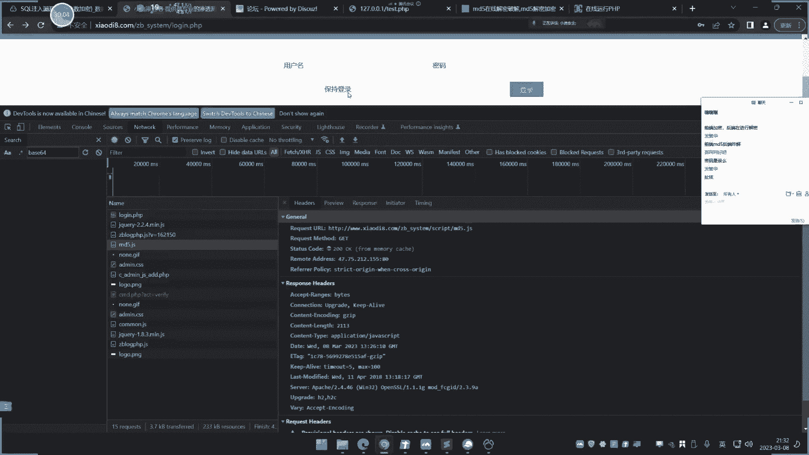

好这个就是我们说的那个JS对不对，那这个案例呢可能和漏洞呢，看上去没有什么关系，其实也有关系，就我们爆破那个就可以直接这样操作是吧，昨天也讲过这盘，你这个简单演示，那么我们先来看一下啊。

这个用个摸着靶场的去给大家分析一下，还是摸着靶场啊，这墨子把它那就是有一些这个操作了啊，自己在登录上我给他演示一下啊，虽然我不喜欢演示这墨子靶场，但没办法没有好的案例，你按这个模子八成啊。

它是一个怎么一个情况，通过这个案例呢，你能知道为什么要学这个加密解密了，为什么要学它了，这个摸着马上就直接告诉你了，而且它只是一个单方面的一个案例去应用，而且你学完之后呢，有很多方面的一些安全措施呢。

他都会用到，这也是为什么要学习它的原因，不仅仅是说啊这个什么后台密码我解一下呀，不仅仅是指责啊，像什么后台密码呀，储存密码是吧，我把它解出来，这只是其中一部分，在漏洞测试中，这种加解谜呢也是用得着。

灯都不让我登了，搞快点啊，他妈的。

我们这里还是很多东西没有学，有些人不懂啊，不要紧啊，你把这些架构思路学清楚，代码都可以一天天的慢慢补上来，这个都不问题不大，主要就是你能不能了解是吧，商这个东西的一个应用场景啊。

遇到这种情况思路是怎么样的，这个是更重要的知识点呢，现在可以慢慢补，但是讲的这个原因和应用场景，那你这个是要必须要了解的，我们学其实就更多是学这个知识点，那你可以下去慢慢补的。

好你看啊，你看这个上面有个地址，你看有个网站，那你看他的这个值呢，就是这一串，你看这话像什么，是不是像贝斯牛斯啊。

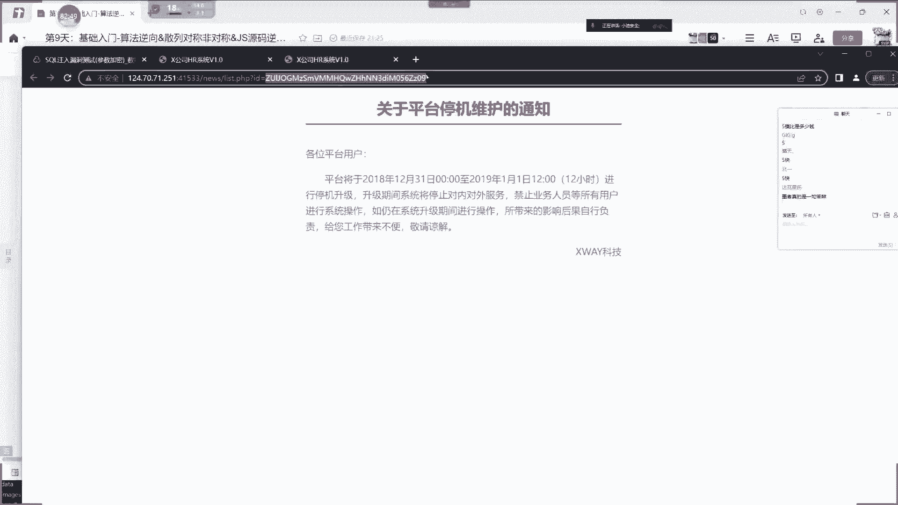

像什么东西啊，对不对，好我们的贝斯牛斯，那我去把它解好。

按照我正常思路是吧，这个是加密的东西，你看我把解，那我解一下了解了变成这个了，解密速度变这个哎这个又想变成六四啊，我再解开一下，再再减了，变变成乱码了，那这里面的啥也不是了，什么情况呢是吧。

关了解它变成这个东西，那U项变成就是五，再解下，这变成乱码了，那这就和我们有问题了啊。

那就怀疑不是贝斯流斯，可能是其他东西，在我这里他怀疑是什么其他的，但是我怀疑归怀疑，我只能靠猜呀，就说我怀疑这个，那也没办法，我要解密它，我要怎么办的，我是要有他的密室那些东西啊，没有啊，怎么办呢。

他刚好他的关卡在里面呢，给到了一个压缩包，看到没它的过关的一个创意，就是这里就这里给了个压缩包，压缩包就是关于这个文件的代码，如果他不给这个代码，这题就是无解，谁都解不了，所以他留了这个借口给你。

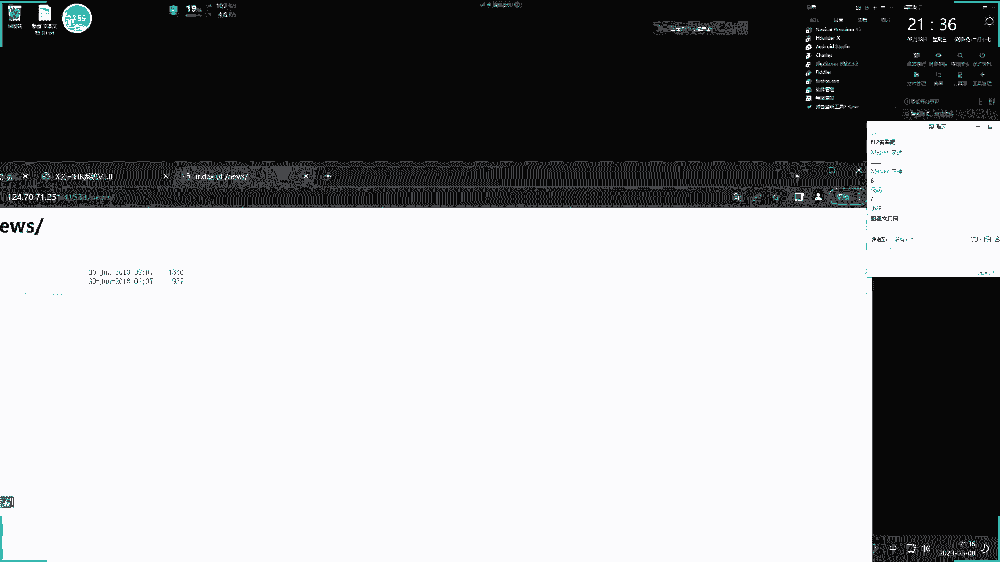

也就是告诉你，如果碰上这种加密的话，你没有源代码是很难操作的，就是告诉你这个意思，有源码那就好办。

源码呢我们打开看一下啊。

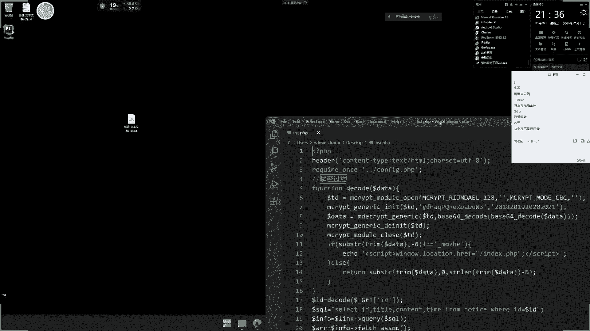

那什么这是一搜一搜就知道是ax的那个算法，然后你看啊这个什么东西呢，128模式CDC密室偏移量来拿出来接一下，看行不行，这个是历史JX偏移量，CDC选上来。

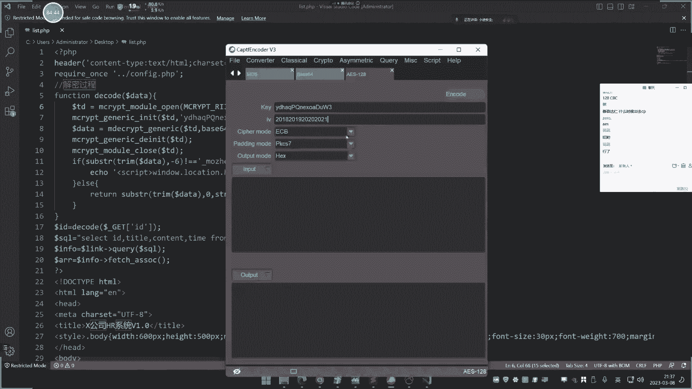

把密文呢搞过来。

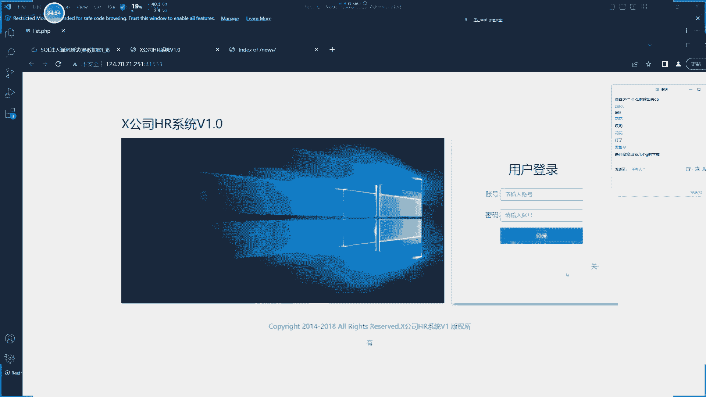

点过来，这是密文对吧，好再来，完了进行一个64的一个解谜，然后这个密文密文呢你看一下啊，他这里用了两个贝斯60，所以我这里要怎么办，他这里用了两个贝斯六四啊，然后你在这次加的时候，他会用一次。

然后我这里是不是要先把它解一下它，因为源码中要解，就是这些源代码源码接过来要解一次，U解一次，所以我这里是测试的时候他要加一次，所以我要把这个先把它解一次，变成这个了，先把它解一次啊。

先把它解释解释后再放出来，这才是它真正的好，再把进解密好，解不出来解不出来，我看一下是不是这个原因好看，没解出来，一下划线墨子，结果就是一下滑，摸着后面呢再有个什么替换，把墨子替换为空，接受再接受值。

那后面是猪肉中利用了啊，由于猪肉中利用，那我没有给大家讲过是吧，我这里就不讲了啊，我这里就给大家看一下结果就可以了，你看他后面是怎么操作的，我给他看结果就可以了啊，这个租楼层呢我没有讲。

所以我就不给大家继续多说了。

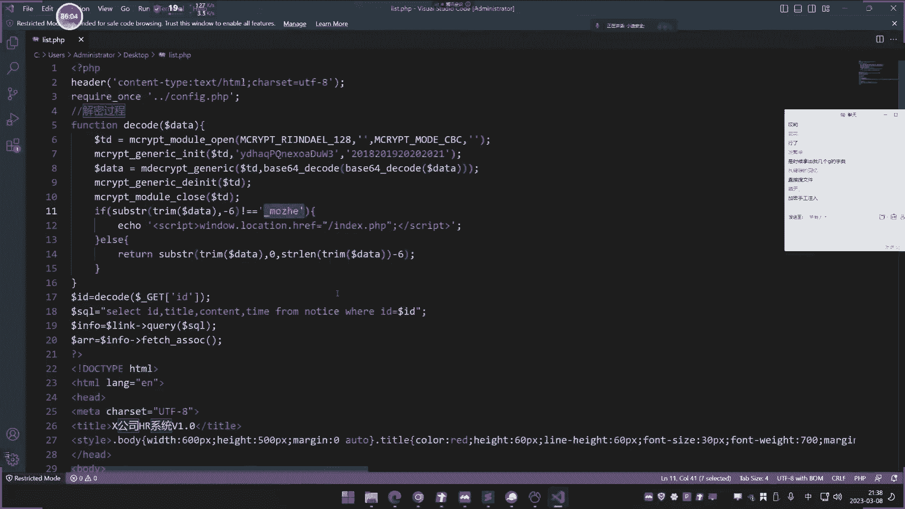

降到时候你再可以回过来看一下这个bug，然后这是一个猪漏洞的利用工具代码，你看啊，如果我直接在上面敲敲着你那去注入它，这是租了个工具代码，普通的就是没有加密的情况，下面我这样敲敲的没有任何反应。

我需要怎么敲它，我是要把这个主语句按照他的逻辑加密来，把加密下加密成这个样子，对不对，然后再进行一个base60，为什么，因为他代码中是加密两次嘛，变成这个模样，对不对。

就是说先把你的铭文用它这个算法去加密出来，加密出来之后一次百分60再把它进行编码，再进行一个ECODE，再加密加密base60，因为它的源码中是什么，哎干嘛呢。

两码中是有什么两次，你看以此结束这个值两次。

所以我为什么要搞两次原因啊，然后呢再把这个结果把它取出来，这个结果是用AS生成的，生成的是这个铭文的铭文，来一次放的来替换这个id值回车，你看主语句里面得到的数据库名义嘛啊，数据库账号啊。

数据库这个用户和数据库名就出来了，他的注入呢就是按照这个逻辑去租，就是你要把你所有的主语句，按照它的加密模式去加放上去，为什么呀，因为他的接收方是要对这个密文进行解密的，你直接放常规的输入语句放上去。

没有任何反应，因为他一剪啥都不是，你必须要按照把你字据写好，假好迷组合好放上去，对方正常接收，正常解密，正常还原，正常的数据处理，是不是就和我们商界和锁国的那个加解密的，印象就一样了呀。

所以你看这条主主语是这样写的，你如果不懂，那你知道这是什么东西呢，对不对，但是这个案例告诉我们两点，一个是那漏洞的影响，就是针对这个加密算法，会给我们漏洞测试带来哪些困扰。

另外一点呢就是我们说的能不能进行漏洞测试，就是看你这个算法能不能逆向出来，能不能逆向，就是看算法的这个种类是什么类型，对不对，类型呢又决定了你要立项的这个条件，那么就是我刚才说的常规的那几种几个条件。

记住了啊，这个思路讲的很清晰了啊，看铭文猜加密算法，猜不出，找源码，没有源码，看前端的JS有没有泄露这个加密算法，如果啥都没有，你又猜不出来，那就拜拜，不用搞了，除非是那个密文，就是MD5。

网上有直接的平台可以尝试去解，那还有办法，或者说贝斯流斯可以直接还原的，对不对，简单的就是你有铭文，我就直接给搞出来的，除了这种之外，像什么ax啊这种什么其他的，你有铭文也没用啊，也解不出来。

还是要其他东西啊，其他东西就需要源码来支撑的呀，因为你没有源码，你哪知道它里面写的加密密室和偏移量，那些东西是什么鬼呢，你不知道吧，大家想想是不是这么回事，我相信今天知识点呢还是有点多的啊。

初次来学的人，有些人不懂，但是我相信你学完之后啊，啊就是今天这个课程的了解之后，会有很深刻的理解的啊。

好我们现在就把思维导图呢给他整一下啊，这个思维导图呢这节课是有必要整的，前面几节课整不整都无所谓。

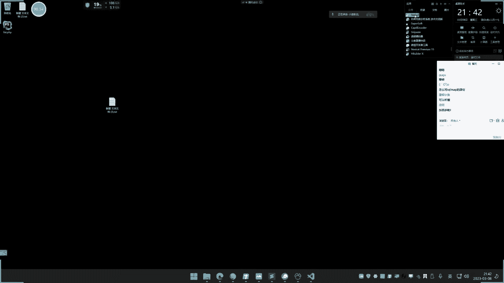

只要这节课都要整，因为这关乎到那个思想吗。

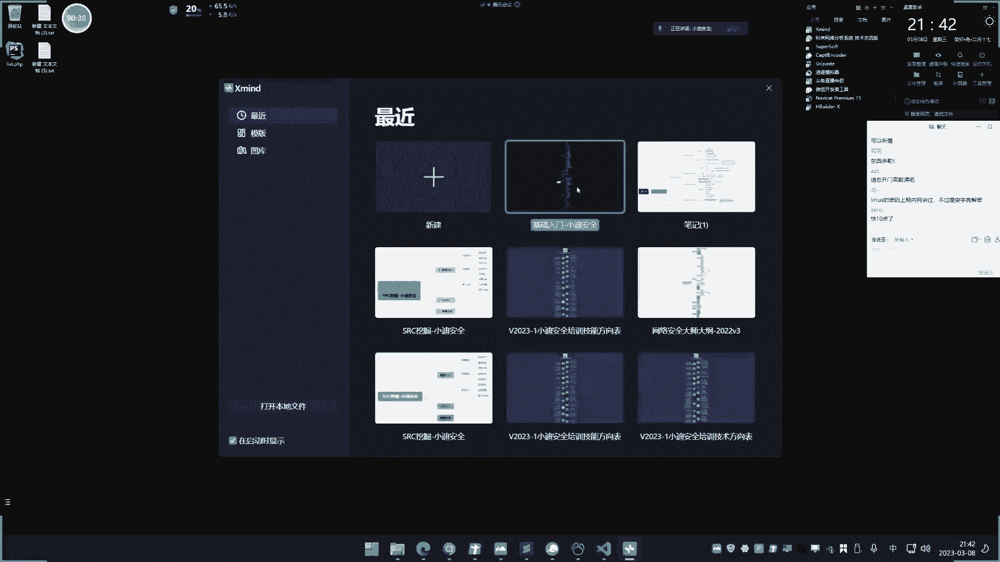

我也实话告诉大家啊，我本来今年五这个6月份的时候，我就准备去这个去学那个理想去的，我都已经准备报班了，我报的是实体班，就是开学那边的，武汉那边科瑞工程没去学，学几阶段的，后面这个要上课呀。

这妈的搞错了啊，我都准备学完之后呢，把它加到课程里去了，因为我有一个朋友啊。

他在那边在学，就是搞那个二进制机箱那一块的啊。

唉没时间去不了，要上课啊，我只能等到时候是吧。

搞点那个有时间的去听几次课，就那样子搞了，听了多少是多少。

然后这个识别是吧，我把它写一写啊，识别的这个东西呢，把它写到这里去吧，在文件夹的这个词例呀呀别。

然后这个解密需求的可以直接解啊，这识别的一些写的这几个东西啊，还是这个解谜呢，这个东西要说的很清楚，就是解谜的把它写下来，解识别解密，把它放一起啊，因为这个识别解密是一样的，还得是我们做的这个思路点。

思路点这个比较关键，就是一般的话啊分为几步，第一步呢就是看疑问的一个特征，分析算法好，这是第一点，那么分析的话走两步，一种是，啊这个所以分析到是可以分到，就继续下去啊，如果说无法分析，不知道。

那模块分析呢就走第二步，第二步事情啊，就是我们说源码获取方式对吧，还有就是我们说的这个第一种啊，那这种呢主要是针对啊两种情况，一种是这个后端处理降低的，可以采用这种思路就找源码获取啊，获取源码。

获取源码呢分析这个从源码中的什么，分析这个加密，不算吧，那第二组就五化分析化，拉直一下啊，第二方面，然后如何分析，如何分析呢，好这里呢是这个第二款，然后找后端加密是吧，还有一种情况就是我们要找第三种。

前端处理加密，这是我们说的JS啊，就直接通过这个什么这个打包了，获取这个BS源码，那就套用对不对，那么如果说可以分析的话，那就追溯到这个识别给你那个技术点啊去分析，对不对。

主要是我们今天讲的这几个字典啊，看看了能分析就按照这个逻辑进行是吧，哪种情况那就哪种铭文，那就接哪种不能分析，那就找源码，源码呢有分为后端和前端的，对不对，是前端的，就前端的抓包里面去分析后端。

那就找源码里面分析，如果说这几个都没有，那就GG，那我们今天这个课程的一个大概的一个点点，那个写上去了，然后后期呢就是在这个点上面去细分，就是说怎么分析是吧，JS怎么找。

这是我们后面课程的一个要讲的这个点了，所以大家不要问说哎怎么找哪个文件，哪个文件为什么是哪个文件，对不对，JS又是怎么分析的，这个呢就是后面要讲的啊。

基础入门呢只求先把思路点点清楚，后面呢我们上课的话啊，那么听懂了之后呢，就连上来了啊。

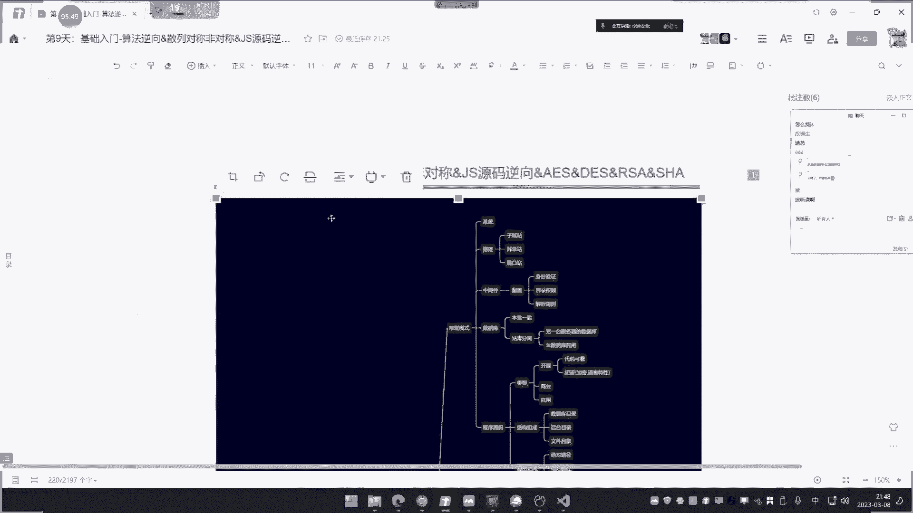

好这就是我们今天这个内容啊，上完了啊，下节课上什么内容呢，下节课就像这个网站数据包的一些情况。

还有一些人产品还没有上完，哎呀妈的东西还是特别多，还要上两三次吧，记住了妈的，好今天就上这么多了啊，大家有问题赶紧问是吧。

没问题，我关了啊。