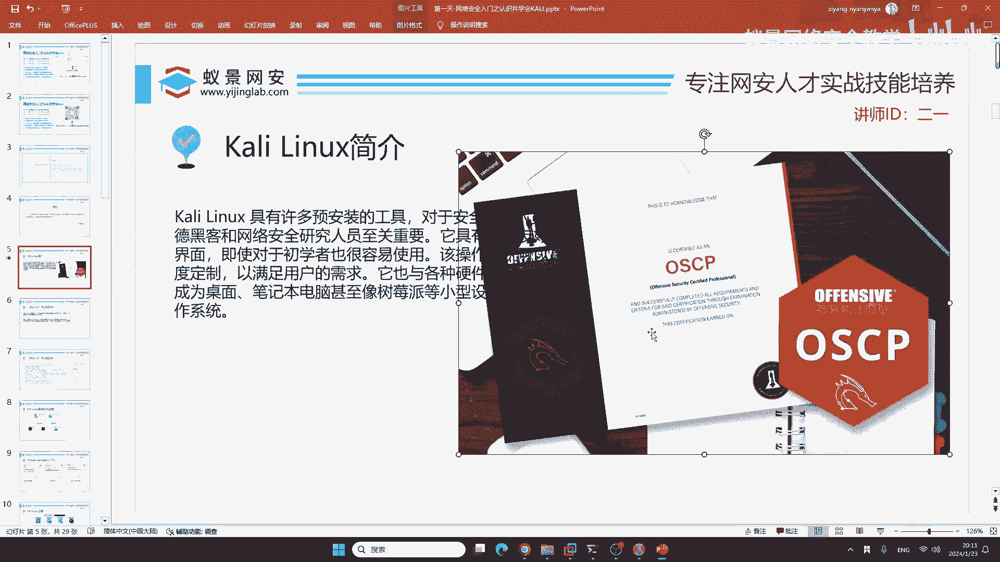
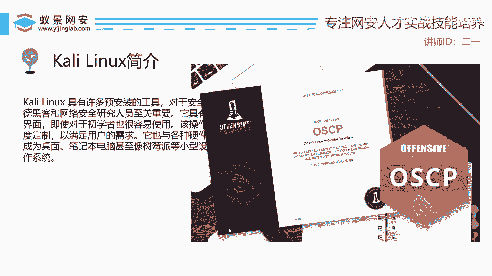
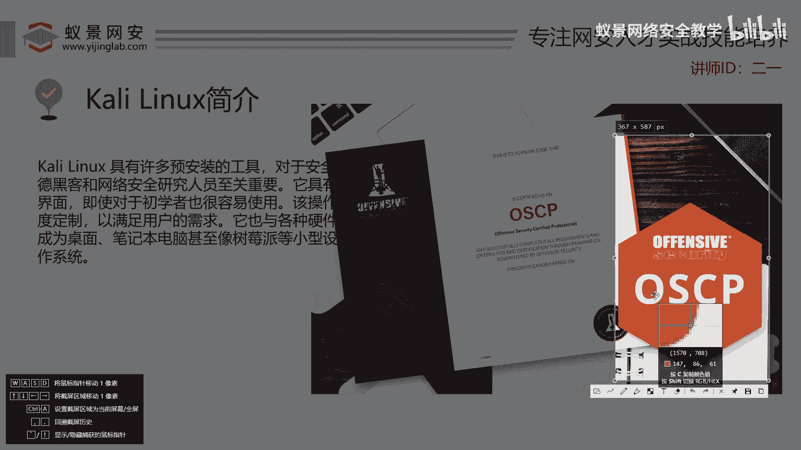
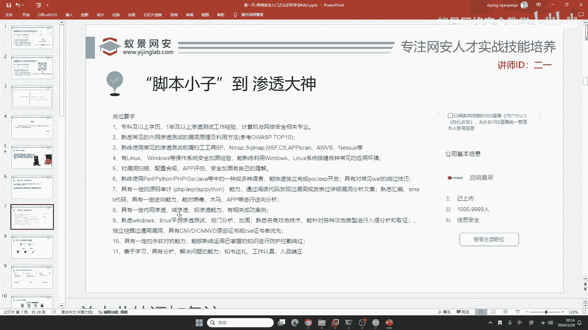
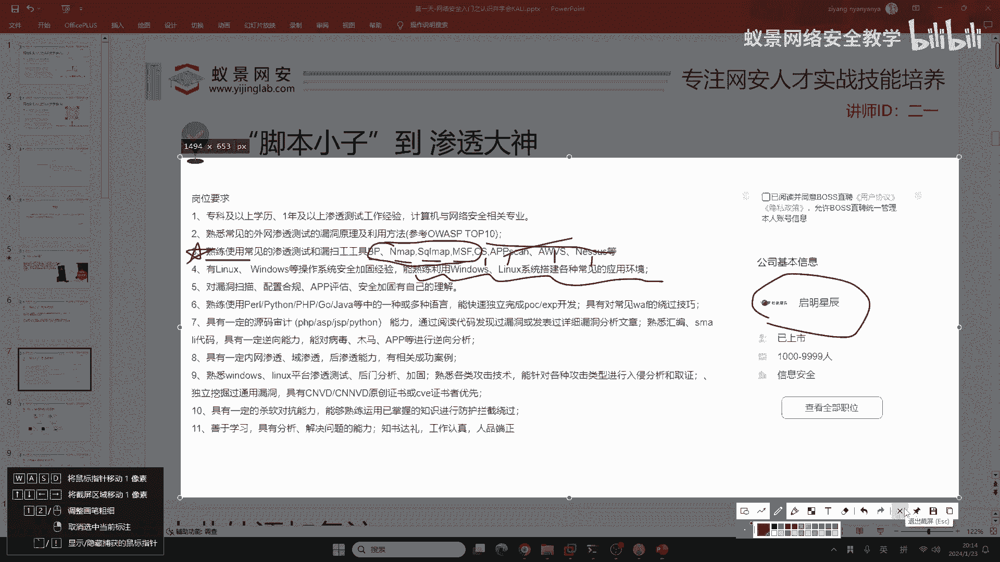
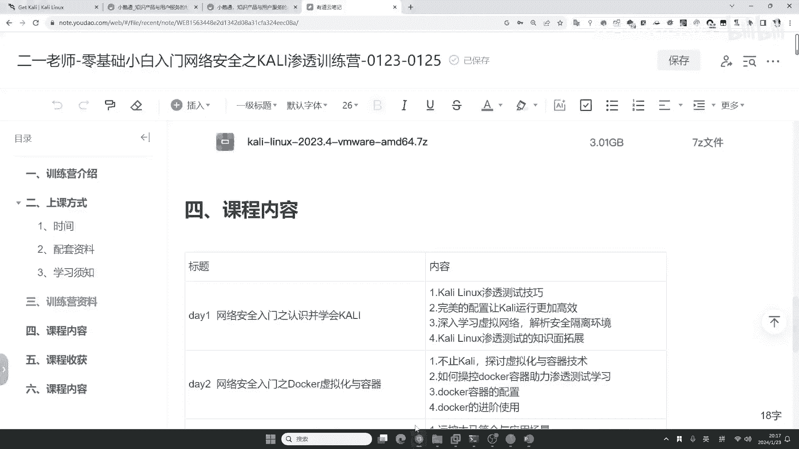

# 【零基础学网安】B站最全的网络安全教程，从入门到精通，学完即可就业，看完还学不会我退出网安圈！（渗透测试／kali渗透／内网渗透／黑客技术） - P10：1.kali linux简介.mp4 - 蚁景网络安全教学 - BV1fctLevETn

咖喱既然你来听课，或者是说既然你现在进到了咱们的课程，我相信你都了解过咖喱，咖喱是一个非常出名的操作系统，但是很多同学只是知道咖喱，对咖喱本身的公司或者是咖喱的一些历史不太了解。

首先咖喱这个公司是一个美国的巨头公司，它叫Offensive这个公司，这个公司在国外非常出名，并且这个公司它不仅有咱们人人皆知的咖喱，同时它有一个国际认证证书叫做OSCP。

这个国际认证证书在整个地球上网络安全领域含金量都非常高，作为大学生的同学们可能觉得我要不要去考取这个OSCP这个证书呢。

我这里不建议咱们大学生轻易的去尝试。

为啥呢，因为OSCP这个证书它为什么含金量高，就是因为它的通过率是比较低的，如果你是一个大学生，如果你是一个大学生的话，你想去通过OSCP，我只能说有点困难，除非你放弃你的学业。

不然的话OSCP还是比较困难通过的。

那咱们在大学里面要考什么证书呢，可能很多同学就是说，我大学里面要考个证书，当做自己工作的敲门砖是吧，同学们知不知道，网络安全在大学里面可以考什么证书啊，首先呢你能考的就是NRSP。

NRSP呢有一个叫二级，你不要考一级啊一级没啥用，大家如果想考的话，直接去考二级就行了，能理解吧就直接考二级就行了，这个二级呢不是你那个全国计算机等级考试啊，这个东西是NRSP二级。

还有呢就是这个CRISP啊，CRISP-PTE，这个PTE的意思呢就是渗透测试工程师，PTE的英语啊就是渗透测试工程师，这两个证书呢你大学生可以考，并且呢通过率比较高，都是国内的认证。

还有呢就是咱们这些高校的认证啊，比如说全国计算机等级考试，就计算机的二级，计算机的二级考试，你可以选一个比如说像C语言啊，考一考也不错，是吧这是在大学里面你可以考的证书，国际认证的话。

那个通过率是比较低的，就比如OSCP啊这个东西通过率非常低，并且呢它的一个考试和教材是全英语的，如果你的英语不太好，我建议还是不要挑战它了，因为它的考试费高达2000美元，是比较贵的啊是比较贵的。

好的我们继续来看，现在呢我相信你对咖喱就有了一个全新的了解，那下面我们来看，那咖喱应该是学习什么东西呢，首先呢就是，咖喱它能够自带的环境，能够避免很多网络安全入门者踩坑。

也能够帮助我们掌握基础的Linux系统，但是啊如果你仅仅只会咖喱，那跟现在网络安全企业招聘，包括同学们非常感兴趣的漏洞挖掘，以及呢实际的互网还是有一定差距的，所以说咱们三天的课程。

会帮助大家在掌握咖喱的基础上，更上一层楼来达到一个拓展和举一反三的效果，这是我希望能带领大家学会的智力。

能学会的这些思路啊，主打一个举一反三，比如说呢我在上课之前，给大家从BOSS职聘上面，BOSS职聘上面，选取了一个公司，这个公司呢叫启明星尘，他的总部在北京，是一个已经上市了十几年的网络安全龙头企业。

这个企业如果你是本科应届生到北京的话，到启明星尘，你的起薪啊月薪大概就是15K以上，就是15000元以上，并且呢他的年终奖一般是三个月，这种薪资在北京的本科生应届生啊是非常可观的。

我们来看一下他的岗位需求，他的岗位需求里面呢，首先跟我们咖喱相关的有哪些，来给大家简单分析一下，第一个，比如说这些工具，像BP Nmap，SQMap，MSF，这四个工具呢在咖喱里面是自带的。

我们需要干什么，需要熟练使用，就是说你要把它用的很熟练，你要知道它的原理，知道它的用法，知道它的工作流程，那其他几个呢，比如说像Cobus Rake，App Scan，AWS以及Nurses。

这些工具啊咖喱里面都没有，是吧，咱们咖喱相关的也就第三条，然后第四条呢，这里啊你可以看到，这一点呢跟咖喱有点相关，是吧，然后下面这些跟咖喱就没有关系了，比如说漏洞扫描，配置合规，App评估安全加固。

包括后面的逆向分析和源码审计能力，跟咖喱呢就不太相关了，就不太相关了，就是说咖喱重不重要，很重要，你需要精通它，但是如果你只会咖喱，不行，你现在就抱有这个态度，抱有这个态度啊，你去看咱们的课程就OK了。

看咱们的课程就OK了，好，下面我们来看咖喱怎么安装。

