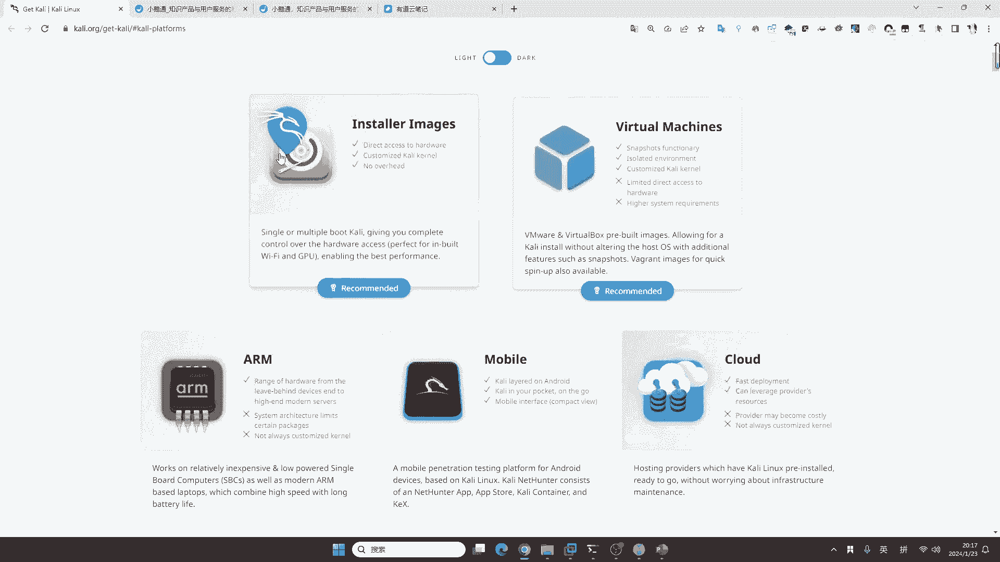
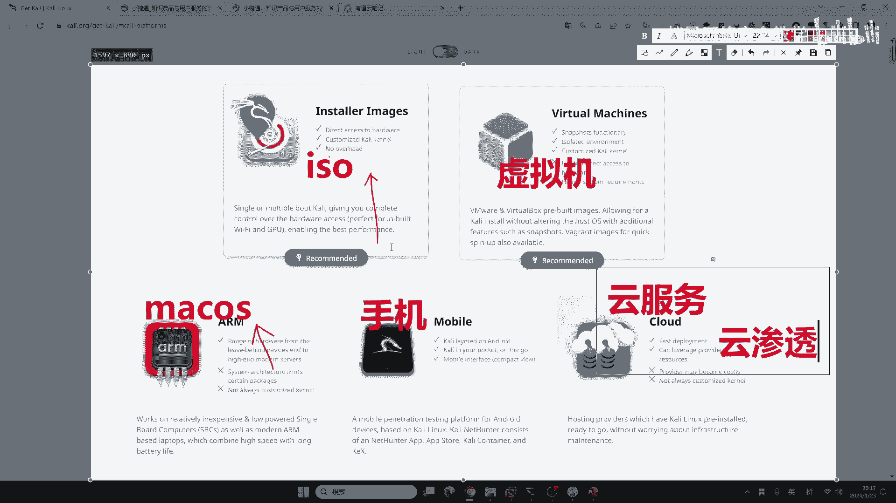
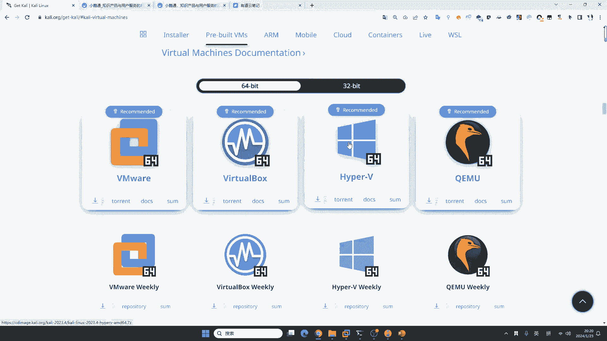
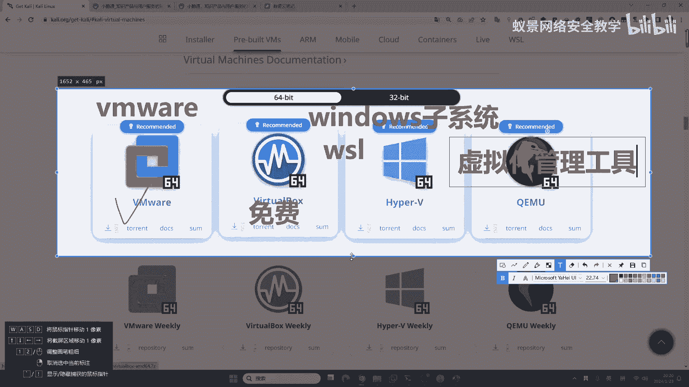
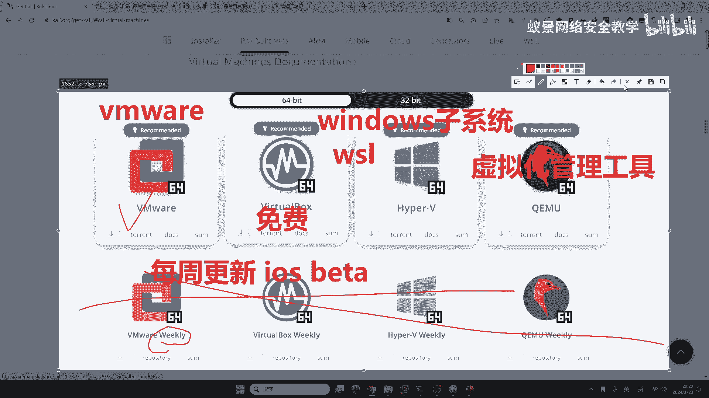
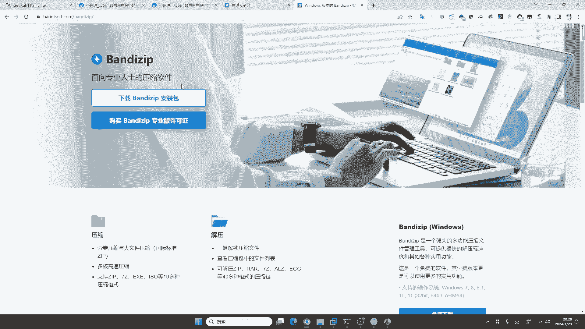
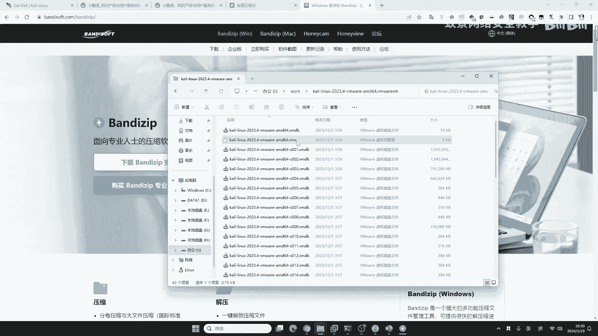
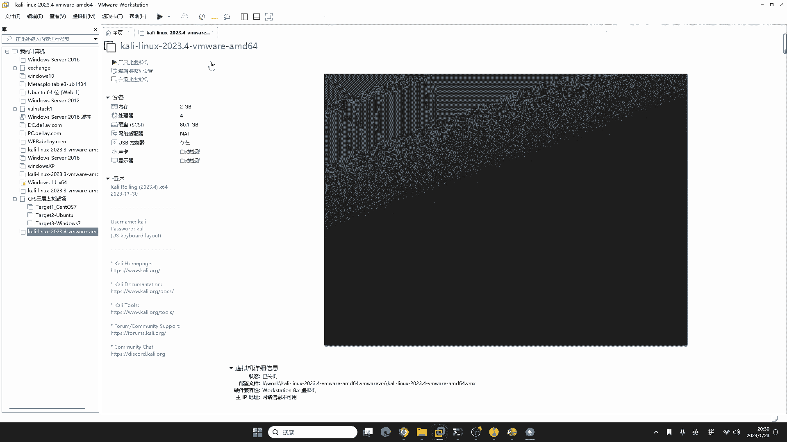
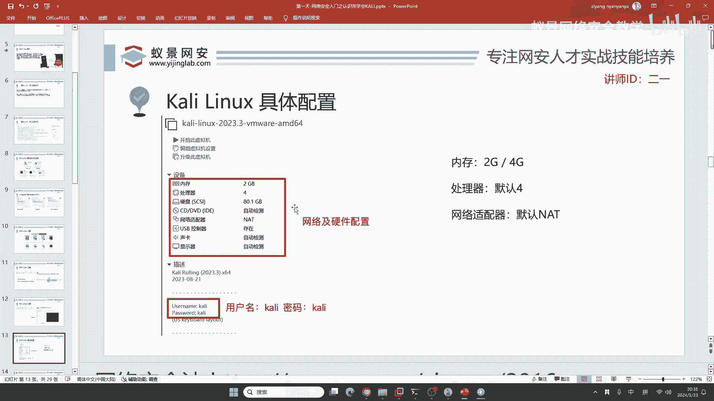

# 【零基础学网安】B站最全的网络安全教程，从入门到精通，学完即可就业，看完还学不会我退出网安圈！（渗透测试／kali渗透／内网渗透／黑客技术） - P11：2.安装kali.mp4 - 蚁景网络安全教学 - BV1fctLevETn

咖喱怎么安装的话，首先咖喱的官网它提供了很多版本的下载，这些版本有什么区别呢，我觉得下载一个咖喱或者是安装一个软件，我们每一位同学都能掌握，但前提啊，你要知道做一下拓展。

咖喱的官网为什么要给出这么多的方式，它到底是有什么含义。

我们来看一下，这里面首先我们来介绍第一个，它叫镜像，镜像安装很多同学都比较熟知，因为大家可能给自己的电脑安装过操作系统，就是ISO，这就是镜像，这边的这一个是虚拟机，也就是它的翻译是吧，虚拟机。

比如说我们使用今天要讲的VMware，使用的就是这一款虚拟机，那这里是啥呢，这个地方叫ARM架构清减指令集，这个ARM架构是哪里呢，就比如说有的同学他用的是苹果电脑，苹果电脑的操作系统是macOS。

那macOS如果现在就是2020年之后的苹果电脑，它的架构都是ARM架构的操作系统，那ARM架构的操作系统，就需要去安装对应的ARM架构的Kali才能够运行，这一个大家应该知道就是手机端的。

很多同学比较喜欢在手机上面安装Kali来进行无线渗透，或者是把自己的手机来当成一个黑客神器，这是完全可以的，但是大家要记住，如果你在手机上面安装Kali的话，一定要选择一个备用级。

或者是Kali官方推荐的两款手机，一个是谷歌的Pixel，谷歌的手机在国内用起来不是特别方便，第二个就是一加手机OnePlus，这两款手机对Kali的兼容性最好，如果你使用小米或者是OPPO也是可以的。

但是它可能会出现这些莫名其妙的Bug，这是手机端的Kali，这边是什么呢？这边是云服务的Kali，大家都知道现在进入到了云时代，即使你不知道啥是云服务，你应该听说过云渗透吧，同学们听说过吧。

云渗透你现在去互网，你现在想拿到高清工作，要不要掌握？肯定要掌握，这里的cloud云服务它就是指，把我们的Kali去搭建在一些公有云，或者是混合云的平台上面，来实现对云内部的一些安全检测，以及渗透攻击。

现在我给你讲这些，远比你去说你下载一个ISO要重要得多，这就叫做拓展和举一反三，如果是下载你们都会，点一下下载不就下载了，谁都会找一个小学生他都会。

虚拟机我们来看一下，为什么要使用虚拟机呢，为什么要使用虚拟机，就是因为虚拟机它非常的方便，现在看起来已经2024年了，VMware 17。5的优化水平，它可以让你的虚拟机。

跟物理机使用起来没有特别大的差别，就是性能折损非常少。

我们来看一下这里的虚拟机版本，虚拟机版本一共有四个，那这四个分别是啥呢，同学们应该都知道第一个，但是后面三个分别是啥，对之后你的工作非常重要，会给你讲你稍等一下，这一个是VMware。

它是在整个世界上使用虚拟化最多的软件，但是它有一个缺点就是收费，我这个收费的软件呢，已经为大家提供了免费的密钥，你们可以拿来直接用就行了，不需要去购买，因为购买的价格很高，购买的价格很高很贵。

你千万不要购买，除非就是说你以后到外国工作了，你需要买正版公司会给你报销，在国内的话，咱们直接用破解版就完事了，然后这边是Virtualbox，Virtualbox大家如果是上大学。

你大学的课程如果有虚拟化，用的都是它，为什么用它呢，它就是免费，就是免费版的VMware，但免费就有免费的缺点，它肯定没有收费的好用，这是版上叮叮的事，不然的话，它早就把VMware给它干死了。

但是并没有发生这件事情，说明免费但是不太好用，这个是啥呢，这个是Windows的子系统，子系统，就是说如果你现在的电脑比较新，现在的电脑比较新是吧，Win10 Win11，你里面都可以安装一个叫做。

WSL的服务，WSL叫做Windows的子系统，指定的就是Hyper-V，最后一个是QEMU，它是一个虚拟化的管理工具，同学们一定要认识一下这个鸽子，这是虚拟化的管理工具，这个QEMU以后。

你去做这样一个上班，就你上班是不是要接触到云渗透，如果你说你的工作没有云渗透，我告诉你就说明你有很大的提升空间，赶紧学习去跳槽，如果你的工作接触到了云渗透，那QEMU要比左边这三个占比要高得多。

就是它更加的专业，但是对咱们新手非常的不友好，能理解吧，就是你就不要用它了，咱们对新手非常不友好。

我们再来把目光放到下面四个，下面四个跟上面有什么不一样呢，它多了一个东西叫做weekly，weekly的中文叫每周更新，就是说它每一个星期，每一个星期，它都会更新一个新的操作系统。

就比如说咱们手机操作系统，有同学用苹果手机吧，苹果手机的iOS的Beta版，开发预览，开发者预览版，那这个Beta版是每周更新的，但是更新的东西跟安全无关，你不要指望它里面的安全工具，每周给你更新一次。

这是不可能的，它更新的一般都是一些系统的软件，或者是编程语言，跟网络安全不相关，所以说我们不会选择，下面的四个weekly操作系统，不会选择它们，而是选择上面这个vmware。

现在我相信大家对这些虚拟化，你就了解清楚了，这些东西放在面试里面，比你说，面试官我现在会咖喱，我现在会咖喱，比这个要强得多，就是你知道虚拟化有哪些平台，这是你的宝藏，这是你的优势，别人不知道。

你知道这就是你的优势，好的，那我们废话不多说，现在来看吧，首先就是vmware workstation的安装，在上课的时候就略过了，大家可以到咱们的课程云盘中，直接下载，就是这一个课程训练营资料。

下载之后，安装就行，我相信安装软件对大家来讲都不成问题，我这里提供给大家的这个下载安装包，是17。5的版本，也是vmware最新版的，那你说老师我用了16版本的怎么办，没关系，你继续用你的就行。

当然你想升级，也可以无损升级过来，如果你用的是16之前的怎么办，比如说你用的是15 14，我推荐大家升级，因为升级之后，你的vmware的运行速度，它会更高更快，而不像vm14或者是13的时候。

那时候虚拟化的技术还不是特别成熟，可能你运行虚拟机，就会对系统造成卡顿，或者是一些蓝屏，或者是一些不兼容的报错，你升级一下vmware就能够解决，然后呢，我给大家的kali就是官网中的最新版。

官网更新它才过了两个星期，它是2023年的第四季度版本，如果你用的是老版本的kali，我建议你更新一下，为什么，因为如果你的安全工具比较老，就比如说你现在使用sql map。

但是你的sql map太老了是吧，太老了，那这样的话，别人遇到一个sql注入，你也遇到一个相同的sql注入，你觉得一个人使用的是，2020年版本的sql map。

你使用的是2023年版本的sql map，谁成功的几率更大呢，肯定是新版本，因为新版本它会做优化，它会添加一些工具的特性，添加一些新的绕过方法，这对于你来讲是非常重要的，你要学会站在巨人的肩膀上面。

而不是说自己把这样一个打地基，或者是把这个楼盖好，你要先学会就是用这些工具，而不是说一个砖一个砖的垒起来，这种是效率非常低的，对17是可以的，16也可以啊，16也可以，好我们下面继续来讲。

这是vmware的安装，就三个步骤，第一个是选择安装位置，第二个等待安装，第三个输入许可证密钥就可以了，下面我们来看Kali，Kali在下载之后呢，大家可以得到一个压缩包，它的后缀是。7z的这个接位。

这个压缩包的后缀，如果你看不到的话，老师这里以windows11举例，你可以点击这里的查看，点击查看，在这里有个显示，有个显示，把这个叫文件拓展名给它勾上就行了，如果你不勾的话，你可以发现它没有后缀名。

你给它勾上，它就有后缀名了，勾上之后呢，然后就是要给它解压，我推荐你专业的人就使用专业的解压软件，你不要使用一些什么2345好压，这些压缩软件，为啥呢，因为它们有一些弹窗，有一些广告比较烦人，这里啊。

给大家推荐一个比较好用的解压软件，叫做班迪ZIP，当然如果你使用winzip，winrir也是同样可以的，7z也比较好用啊，大家就是说除了这些2345之外，其他的都挺好用的。

这个压缩软件你下载下来安装，你以后啊，电脑就可以去解压软件了，解压7z，解压zip，rir，甚至是jr都是可以的，我们把它解压到当前文件夹就可以了，解压到当前文件夹，解压的过程是很快的是吧。

360的zip也不错，也不错啊，我们不商用的话就是免费版，就是说这些国外的国外的软件呢，它有的时候需要商用，商用的话就要收费，就比如说你现在使用一个操作系统，或者是使用你的word。

就老外的软件一般都收费啊，咱们不收费，咱们都是用破解版，360zip啊，360zip现在也比较好用，因为它已经把广告去掉了，为啥呢，就是因为以前啊，360的这些压缩软件广告比较多，被别人骂，被别人诟病。

所以说呢，现在就去除广告了，也比较好用，也是推荐的，我们解压好之后呢，就会有一个新的文件夹，它就叫做Kali Linux，我们打开它之后啊，你看这个后缀，看这个后缀啊，这个后缀它有一个叫VMX。

VMX的后缀名，这个东西呢，被称为VMware虚拟机配置，虚拟机配置啊，注意，我们现在双击一下它，就会自动的打开到VMware虚拟机的后缀。

自动的打开到VMware Workstation里面，VMware Workstation里面，打开之后，我们就直接开机就行了。

但是在开机之前呢，因为你来听课，你能不会开机吗，是吧，你肯定都会开机，所以说呢，我不会告诉你直接开机的方法，我来给你讲另外一个方向，就是很多同学啊，所不能理解的，我们的咖喱默认的网络和硬件配置。

到底够不够用。

到底够不够用。