# 【零基础学网安】B站最全的网络安全教程，从入门到精通，学完即可就业，看完还学不会我退出网安圈！（渗透测试／kali渗透／内网渗透／黑客技术） - P12：3.kali软件配置.mp4 - 蚁景网络安全教学 - BV1fctLevETn

首先呢，就是说我们咖喱的内存默认是两个GB，我建议大家如果你的电脑运行内存是16GB以上的话，或者是16GB，你把它调成4个GB，否则你在后面使用的时候，可能会遇到一些小小的问题，怎么去调，大家会吧。

点击编辑虚拟机，点击编辑虚拟机，我们把这样一个内存啊，从两个GB给拖到四个GB就行了，好这时候呢，我拖到了4。3是吧，4。3不好看，咱们就拖到四个GB吧，四个GB是吧，这时候就把它内存提升了一下。

其他的处理器默认四核，网络适配器默认NAT都不用改。

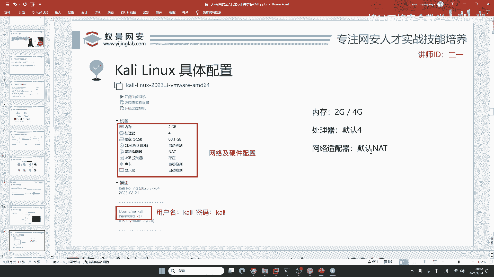

而且呢，就是在这个页面，它有告诉你Kali的用户名和密码，就Kali的用户名是Kali，密码也是Kali，我们在得知这些信息之后，你再开启Kali啊。

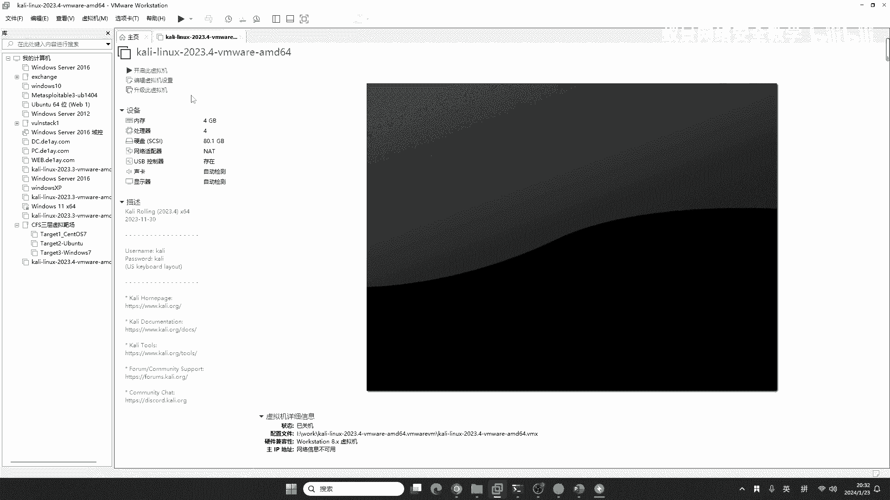

就胸有成竹了，这个同学问到啊，就是说，我开启多个虚拟机运行空间不够怎么办，没关系啊，我的电脑是32GB的运行空间，我能够承受住，就我电脑上所有的虚拟机开起来都行，而且呢，大家一定要知道。

现在的操作系统啊，它的一个内存压缩效率是非常高的，你不需要担心说，我16GB的内存会不会说运行两三个虚拟机就用满了呀，不用担心啊，你16GB的运行空间运行内存，它能运行五六台虚拟机都没有问题。

就是因为这个内存压缩和内存分配内存清理的效率非常高，现在的操作系统，那不像以前啊，以前是非常垃圾的。

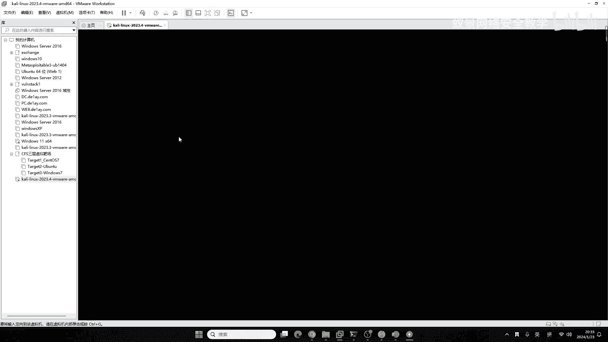

现在呢，我们把Kali开机，Kali开机，这是登录页面，那我们输入Kali的默认用户，Kali输入密码Kali就行了。

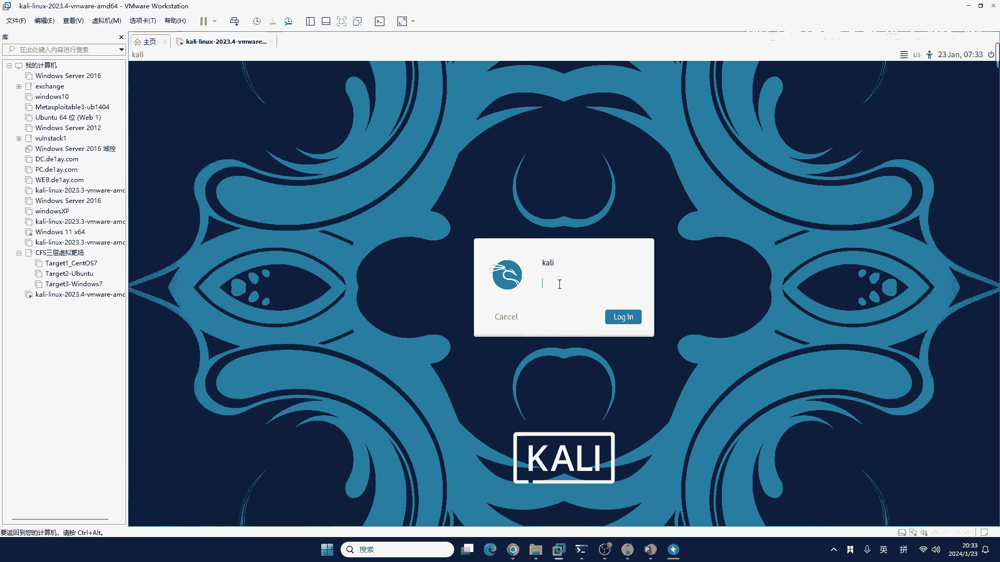

好的，我们登录到Kali操作系统，现在先解答一下大家的疑惑，很多同学就是会问到一个问题，我们的Kali。

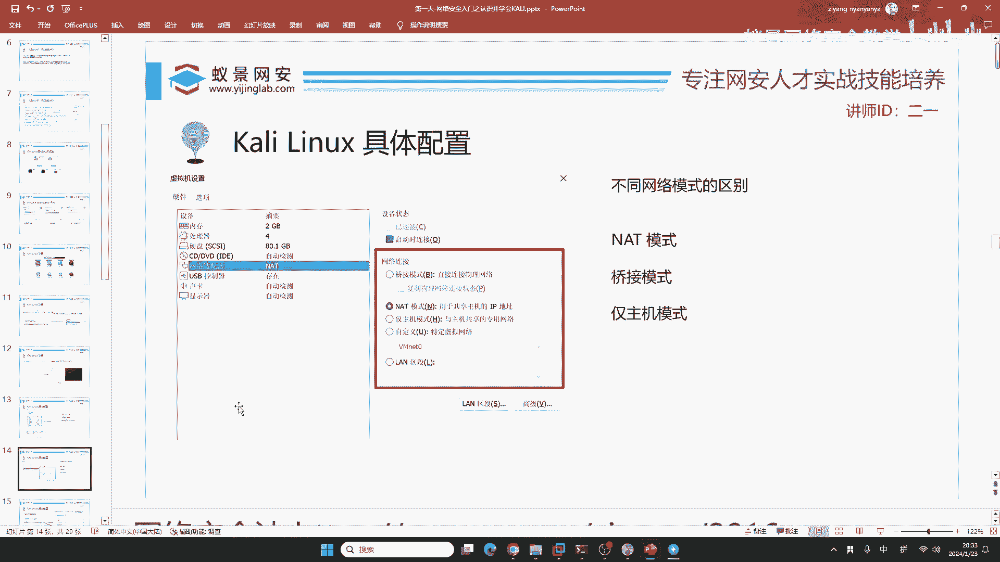

为什么没有root用户，首先呢，Kali是有超级管理员用户root的，但是这个root默认无法登录，且默认没有密码，Kali为什么这样做呢，我告诉大家，有同学讲，你这个Kali实在是太变态了，我受不了。

我就要登录root，那这怎么办呢，同学要注意，不仅仅是咱们的Kali这样，我想问一下同学，你知道咱们这个有多少Linux吗，我举一个例子好吧。

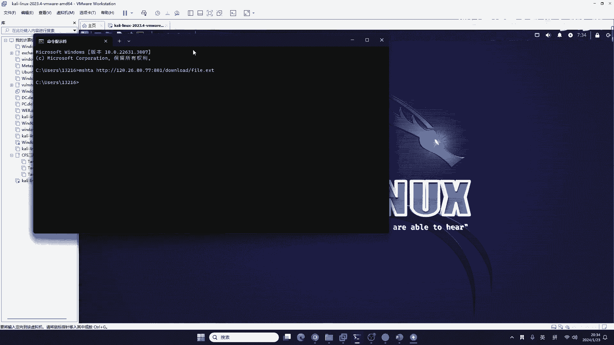

咱们常见的Linux操作系统，比如说D-BAN，同学们见过吧，还有什么呀，Ubuntu，听说过吧，还有咱们的Kali，以及呢，我们一些阿里云的OS，还有呢，就是三头S，三头S我们因为它已经停止维护了。

所以说现在三头S的占比比较少，阿里云的OS还有什么，对，红帽，Redheart，它跟三头S是一起的，Redheart，阿里云的OS，还有腾讯的系统，Tencent OS，是吧。

腾讯就是麻花腾的这个操作系统，还有什么呀，国产的操作系统，比如说腾讯的UOS，还有什么呀，还有麒麟OS，同学们听说过麒麟OS吗，还有什么呀，还有什么OS，麒麟，腾讯，是吧，很多，非常好。

说明你们对Linux了解还是有一定基础的，现在我就告诉你，为什么，它默认不能登录root，当然得加上咱们的苹果呀，苹果macOS，为什么它不能直接登录root，因为，这些系统都不行，这些系统都不行。

我们的Kali只是其中之一，你有必要去骂它吗，没有必要吧，因为它们都不行，懂了吧，它们都是统一的，不能让你登录到root，这就是操作系统的默认使用规范，它们两个是比较特殊的。

所以说它们两个是可以直接登录root的，它们俩比较特殊，现在我们再来看，你就已经知道。

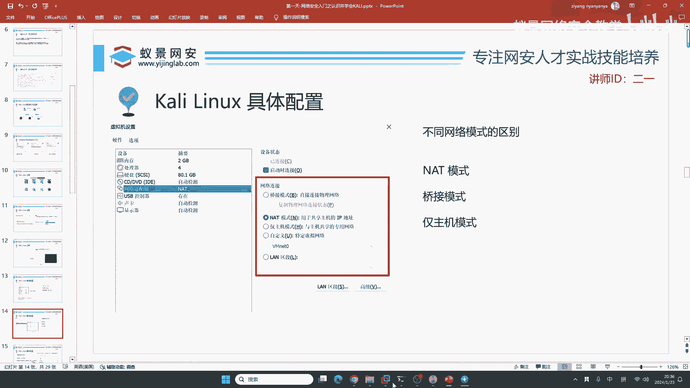

为什么Kali不能登录root了，相信我讲的这个东西，对于你来讲，有一定的帮助，因为Kali开机，谁都会，我不讲，这个我是多余的，是吧，我不讲你也会，那咱们怎样切换到root呢，现在我演示一波。

首先你打开这个东西，这个东西叫做terminal emulator，终端模拟器的意思，打开它，打开它之后，你看这个敲命令，这个敲的命令叫linux的命令，它比较小是吧，比较小，你把它给它整大一些。

整大一些，怎么整大，教大家一个技巧，按住你键盘上面的三个按键，control，shift，还有+号键，这三个按键按下去，就可以放大了，这个东西就能放大了，知道吧，那有同学讲。

我知道control shift和+号，我告诉你，我今天讲了Kali，以后你打开一个你不熟悉的软件，不知道怎么把它放大，你就试一下，control shift和+号键，那90%的软件，都是通用的。

都是通用的，在我们Kali里面是control shift++号，而不是control++，control++是部分编辑器的放大，我们这里是control shift和+号，那首先我们进入到的这个终端。

是普通用户的，普通用户的Kali，普通用户的Kali，普通用户的Kali，怎样切换的root用户呢，首先我先解决一下大家的问题，这个同学说怎么变小，你的问题非常好，变小的话是两个按键。

control和减号键，这两个按键是变小，三个按键是变大，control shift和+号键是变大，control+减号键是变小，变大之后呢，咱们输入这个命令叫sudo，sudo，空格SU回车。

这时候呢，它让你输入密码，这个密码要记住，是password for kali，是Kali的密码，就是Kali，那Kali的密码，你在输入的时候，它不会有显示，请大家注意，很多小白都会困惑这一点。

为什么，我的Kali在输入的时候，它不会有显示，为什么不会有显示啊。

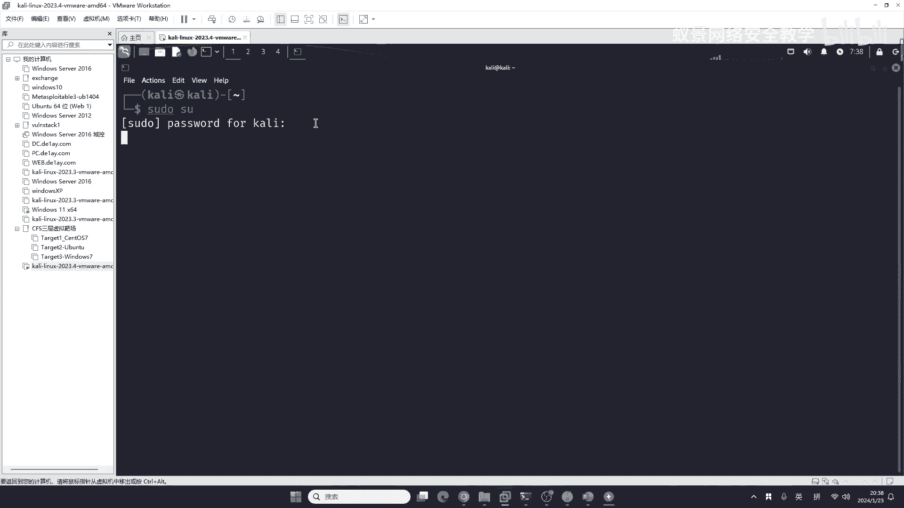

你不用担心，不是说Kali不想给你显示，而是这些都没有显示，不是说它自己啊，它们都没有显示的，那如果你纠结这个东西，那就疯了，是吧，它们都没有，那你说这个库克不讲武德，不给我显示是吧，我苹果系统不显示。

三头S也不显示是吧，这些都是通用的，你不要纠结了。

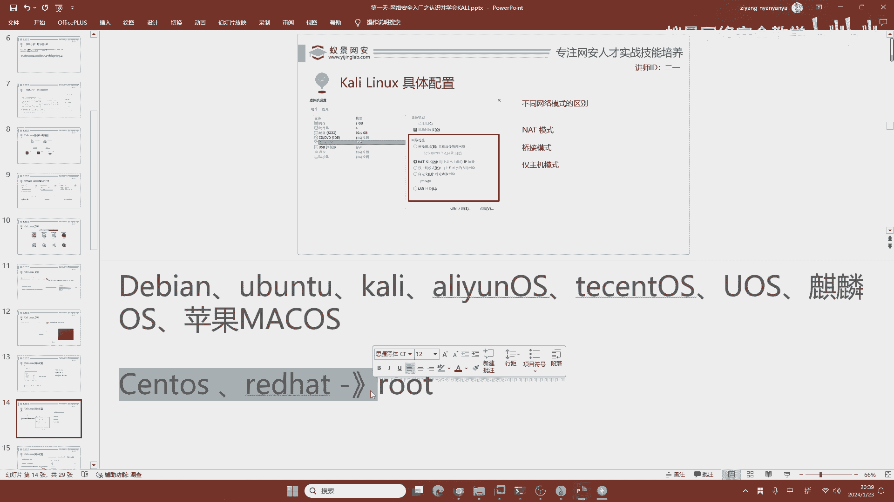

现在呢，我们就切换到了root用户，root用户呢，是我们系统的最高管理员权用户，我们在这个微信群里啊，在这个微信群里，我看到有个同学开玩笑，他发这个表情包，叫rm-rf/*，这个符号呢。

叫做删除Linux所有的文件，包括系统本身，也就是说，如果你切换到了root用户，运行了一下它，我们的Kali就完蛋了，Kali会把自己给消化了，就自己把自己删了，就没有用了，所以说呢。

你千万不要运行这样一条命令，那如何去解决，就是说我们的Kali，万一被别人攻击了，或者是呢，万一我们不小心格式化了自己的Kali操作系统，怎么办呢，这里要为大家介绍，VMware的第一个技术功能。

叫做快照，同学们应该都知道快照，但是我希望要提醒一下，今天我们讲解的快照，在你以后所有的云服务，云渗透，虚拟化里面，都有快照这个名词，叫snapshot，所有的都有，知道吧，你以后肯定会接触到公有云。

私有云，混合云，它都有，现在我来打一个快照，怎么去打呢，就是你要按住这个地方啊，叫管理此虚拟机的快照，你看，这个是个时钟加一个小扳手的图标，我们点开它，点开它之后啊，我们点拍摄快照，然后呢。

这有个名称可以改一下，比如说我改成这个1月23日好吧，1月23日OK好吧，就这个快照，点击一下拍摄快照，拍摄快照之后呢，它的拍摄快照的进度，在这个VM的左下角会有显示，一般情况下。

一般情况下需要5到10分钟左右的时间，才能够拍摄完毕，这个快照在拍摄完毕之后，不论你做什么操作都没有影响，就是说，如果你卡里不小心删了，不小心删了是吧，或者是呢，你不小心做错了什么东西，都可以恢复快照。

你可以把它理解为是系统的还原点，啥系统还原点啊，就是你游戏里面的存档啊，比如说你现在玩刺客信条，你现在玩赛博朋克，是吧，你可以下存档呀，我们啥时候这个任务不想做了，我可以退回存档。

可以回到建立存档的这一时刻，就可以完全恢复了，这就是快照，快照有可能被攻击者删除吗，那当然可能啊，当然可能咯，快照关机和开机都能拍，能理解吧，快照它是保存这个系统的状态。

你系统的状态本身就有开机状态和关机状态，所以说呢，不论你是开机还是关机，都是可以拍摄快照的，这个当然可以被攻击者删除啊，你这样讲的话，那就攻击者如果权限比较高，就比如说在内网渗透中有个技术叫什么呀。

叫权提权，知道吧提权就权限提升，这攻击者呢，通过一些漏洞或者是通过一些攻击手法，把你的系统提升到最高权限，你别说删快照了，他把你的C盘给你删了都行，还删快照呢，他什么都能做，什么都能做，好的。

我们下面来看怎么打开快照，你先别急啊，等我拍完，等我拍完，现在呢。

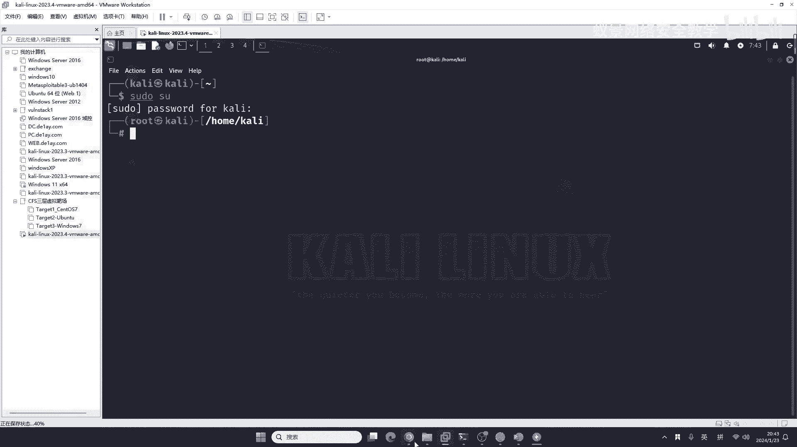

我们在快照拍摄了之后，要给大家介绍一个所有虚拟化都有的东西，叫网络模式，这也是解决啊，就是说，大家有的时候没有办法上网，或者是说没有IEP到底是咋回事，是吧，你知道这个之后啊，不仅你今天使用咖喱。

还是你后面使用任何的虚拟机，或者是你在工作中使用一些商用化的虚拟化平台，都是通用的哈，都是通用的，不是说你今天学了，只是对咖喱这样，不是这个样子，我讲的东西全部都是举一反三，伴随你一生的。

伴随你网络安全生涯一生的，下面我们来看，在咖喱的默认情况下，它有三种网络模式，分别是那特，金主机和桥接，那这三种网络模式到底是什么样的一个区别呢，我们一起来看一下，你想要搬DZIP是吧，那在课后的时候。

我写到笔记里面好吧，催催杀，因为我现在在上课，怎么发给你们呢，是吧，怎么发给你呢，我一会下课了，写到课件里面好吧，行吧，这个最方便了，我觉得，然后呢，这三种网络模式有什么区别呢。

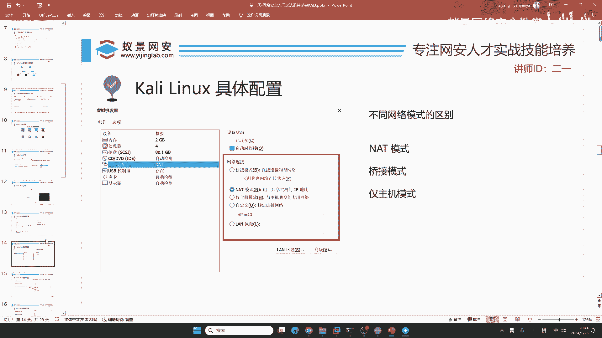

好，我们来一起看一下，这个这个快照还在拍摄啊，我们一会拍摄好了，再继续来讲，现在呢，我们先来看网络模式，默认情况的网络模式，我们右键这个咖喱，就右键这个小图标，点击这里的设置啊，点击这里的设置。

点击设置之后啊，他的网络设备器默认是那特模式，那特模式是默认的模式，也是最好用的模式，他能不能上网呢，首先那特模式是可以正常上网的，比如说呢，我们去拼一下这个百度是吧，拼一下百度，3W百度点com。

你可以看到呢，有一个延迟的数字，是24毫秒，证明了我们能够连通百度。

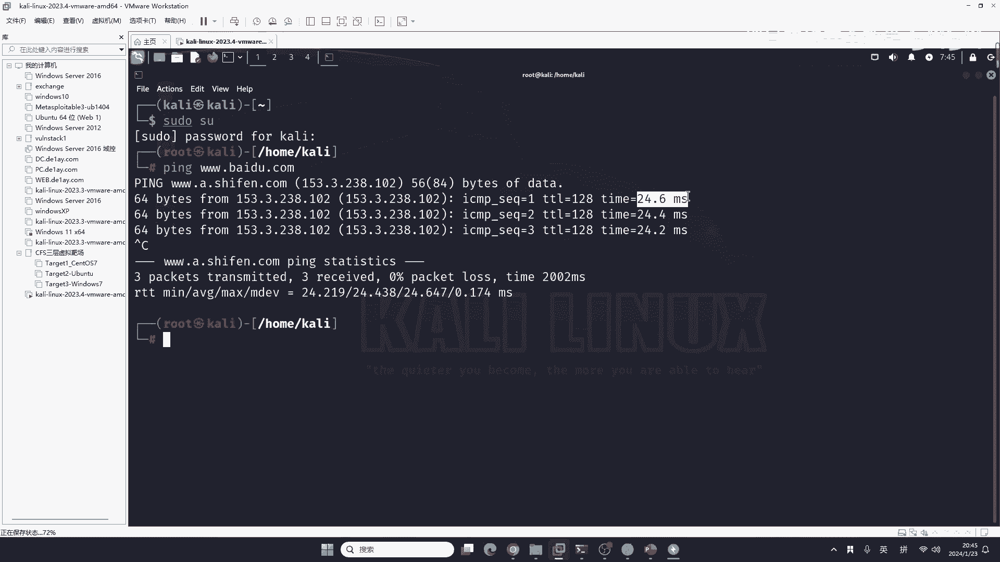

可以正常上网，那这个那特模式是什么意思呢，那特模式，他中文意思叫做网络地址转换，很多同学，你会错误的说，他是那特模式，你要记住了，如果你说那特模式，那就是闹笑话，你现在及时改正。

那特的意思就是network，网络，而那特，他是network，这个叫address translation，网络地址转换，他们两个完全不是一回事啊，你不要给他记混了，不要记混了，那特模式的情况下呢。

就是在我们自己的电脑上，自己的电脑ip怎么去看呀，就打开你的cmd是吧，命令提示符，咱们的cmd啊。

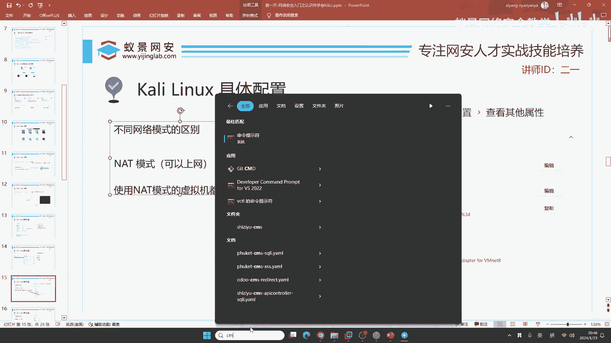

打开自己的电脑，打开自己电脑之后啊，这个ip configure，就是看一下你的设置是吧，看一下，看设置之后啊，咱们找这个网卡，叫vmware，network vmnet8，就这个网卡呀，那你会觉得。

这个老师，你怎么这么多ip地址啊，是吧，怎么这么多，这是为啥呀，你想象一下，现在几几年了呀，2024年了，正常人的电脑，只有一个网卡吗，不至于吧，正常的电脑都有什么呀，都有有线网卡，都有无线网卡。

蓝牙网卡，或者是你购买的外置网卡，这是一个电脑的基础功能，它每一个网卡，肯定对应不同的ip地址呀，难道说，它两张网卡，都是同样的地址吗，不可能吧，对，我是联想拯救者的台式机呀，因为老师自己比较懒。

我懒得自己组装电脑了，所以说就买的这个拯救者的拯机，因为它的性价比比较高，我相信啊，来听课的同学，应该有不少的拯救者用户，拯救者呢，就是不容易翻车，而且性价比比较高啊，当然我是台式机，在这里呢。

我们来看一下，你如果是，如果是你安装了vmware，它就肯定有这个vmnet吧，这个地址呢，是192。168。80。1。

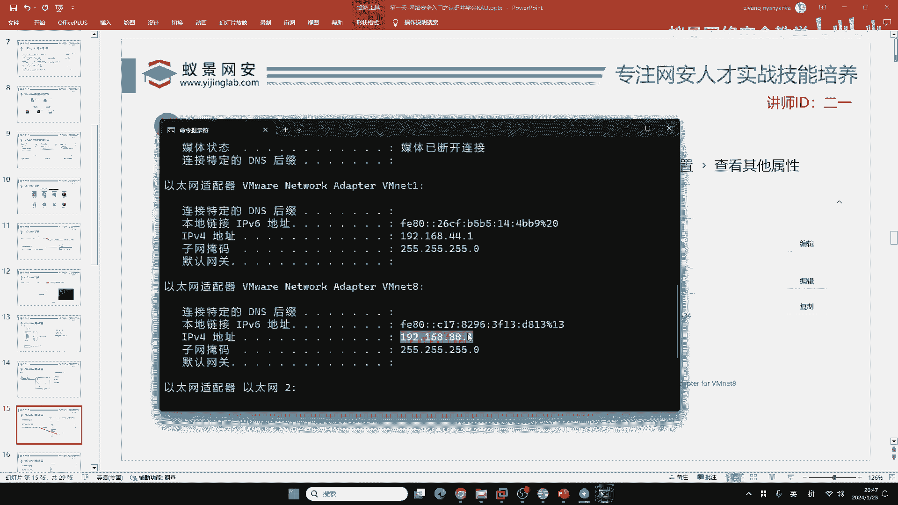

那我们现在的kali，用的什么模式呀，我们的kali用的是，NAT模式，kali的ip地址是多少，咱们的命令啊，是有变化的，在windows上面是ipconfigure。

linux上面叫ifconfigure，这个if呢，不是如果的意思啊，不是如果的意思，它是这个interface，就是接口的意思啊，interface的缩写，接口设置，我们要看哪一个地址呢，它有两个。

一个呢叫lo，lo的意思呢，叫localhost，就是本地地址，local，本地的前两个英语字母，就local的意思，这里啊是eth0，eth就是大家上网的以太网，以太网是什么呢，就是你现在连的网线。

不论你是在北京，还是在上海，还是校园网，还是酒店，你只要连接网线，就是以太网，这个以太网的地址是啥呢，咱们看ipv4就行了，在这个叫inet，它的地址呢，是192。168。80。148，有什么特点啊。

你来看，是不是与我们自己电脑上面的，vmnet吧，在同一个地址段，什么叫做同一个地址段呢，就是在这个ip地址中，前三位它一样，前三位一样，都是192。168。80，当然你是不是80，我不知道啊。

就是这个80，它是随机出来的，你有可能是90，有可能是100，有可能是10，每一个同学都不一样啊，我这里是192。168。80。1，这里对应的是192。168。80。148，好这就是那的模式。

那有同学讲，我知道这个东西有啥用，这个东西用处大着呢，以后你在工作中，那特是你的好朋友啊，你做内网渗透，你不得熟悉那他吗，不然的话，你连别人的网络拓扑都看不懂，你渗透个啥，是吧，你渗透个什么东西啊。

有道理吧，同学们，你首先你要对别人的企业，对别人的内网进行渗透，你是不是你必须要知道，别人的网络是什么样子的，是吧，别人的IP地址段是什么，别人有哪些存活主机，如果你连这都不知道，你的技术再强。

你渗透什么东西呢，别人把手机丢给你，给你渗透啊，不太可能吧，不太可能，那现在呢，我们再来看，我们再来看，就是说这只是那特模式，如果我们去变换它呢，好的，我把麦克风再调大一些，渗透测试是干啥的，跟你讲。

就是攻击漏洞，内网渗透，攻击漏洞加内网渗透，这两个东西，内网渗透是啥呢，就比如说你的家里，你家里就是处在一个内网环境中，你家里有没有智能门锁，有没有摄像头，有没有电脑，有没有手机，有没有游戏机。

有没有电视机，就对这些东西进行攻击的，这些东西都有漏洞，你们应该听说过吧，所有的东西都有漏洞，摄像头我就不多说了，摄像头你们都知道，为授权访问，直接的泄露你家庭里面的敏感信息，还有什么呀，还有什么。

小爱同学，之前出现小爱同学，出现了一个非常严重的劫持漏洞，超级严重，这个东西大家可以上网去搜，还有有同学喜欢玩游戏，玩游戏，你是不是有PlayStation PS5 PS4。

同学们知道PS4就出现过漏洞，就出现过漏洞，就是我们可以使用PS4自带的，这样一个溢出漏洞去改写它的操作系统，改写操作系统能干啥，第一个破解游戏，第二个我把你系统给你删了，我把你系统给你删了。

你还玩是吧，这样的话就可以对这些游戏机来发起攻击，你的路由器更不用说了，路由器华硕，普连华为小米，包括OpenWrt，都出现过很多漏洞，这就更不用说了，这就是内网渗透，这就是内网渗透，好我们废话不多讲。

我相信这个同学应该对渗透测试，有一个清楚的认知了，那现在我们再来看，在这里呢，我们现在把它的模式改一下，改成什么呢，改成桥接模式，就是第一个模式，改桥接的时候，这里呢有一个选项。

叫做复制物理网络连接状态，这个选项呢，你勾不勾都没有影响，就是说如果你现在的电脑，你不会乱搬走，就是说你只在宿舍里用，那你勾选跟不勾选是完全一样的，如果说你现在经常的移动位置，比如说呢。

上课的时候带着自己的笔记本，如果你勾选它，你每换一个位置，你的IP地址就会变，所以说呢，如果你看你自己的需求，反正对咱们使用的角度，是没有什么区别的，你勾不勾都行，好我们点击确定。

就是说你改完桥接模式之后，你要点确定，点确定，OK我们点确定之后呢，你一定要稍等一分钟左右，因为呢，这样一个网卡，它是需要去重启的一个过程，是吧，一个重启的过程，它会自动重启啊，你不要多此一举说。

要不要重启，手动重启网卡，没必要啊，它会自动重启的，现在我们再去输入IP，IF Configure，来看一下有什么区别，刚刚我这里的IP是多少，192。168。80。148，这时候变成了多少。

变成了192。168。2。170，这是个啥玩意儿啊，这个东西啊，就是我家庭的局网。

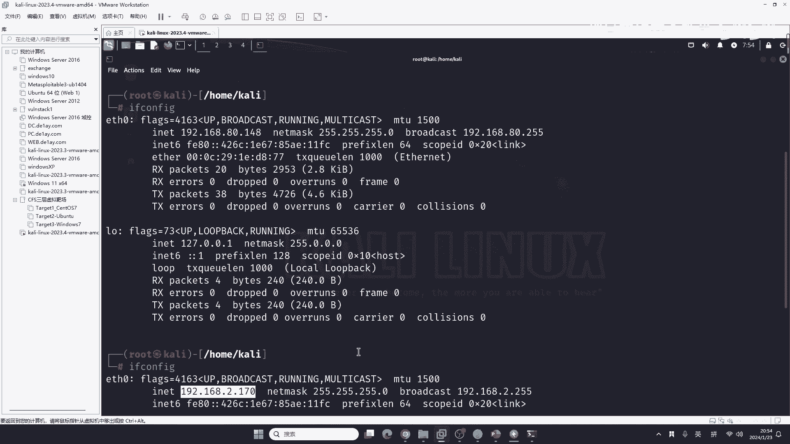

它的意思就是，咱们的桥接模式啊，就是把你的一个虚拟机，也就是说我们现在用的咖喱，连到你家里的路由器上面，或者是说，你宿舍的路由器上面，就是这样一个功能，这就是桥接。

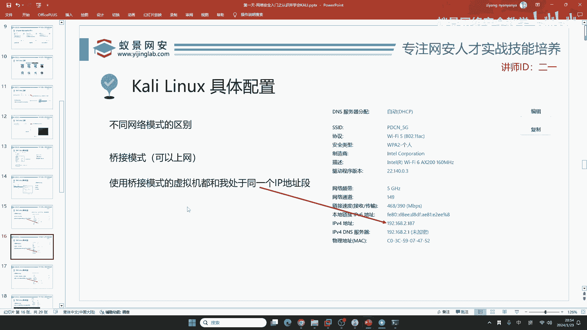

在这种条件下，我们来看一下，自己电脑的IP地址，我的IP地址呢，因为我连的是无线网，连的无线网，所以说我使用的是WLAN，就是无线局网适配器，我的地址呢，是192。168。2。187，来看一下咱们咖喱。

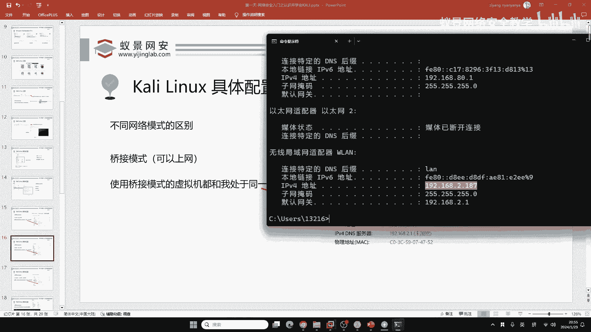

咖喱上面是不是是192。2。170，它跟我的无线网，在同一个IP地址段上面，说明什么，说明桥接模式连接到了，我家里的路由器，等一下啊，可以给大家访问一下，我的路由器，给你瞅一瞅，这个同学提到啊。

为什么这里是IF，因为它是Linux系统啊，Linux系统查看IP地址，其中的一个命令就是IF Configure，在互动区，这个同学提的问题，给你点一个赞，它是IPA，IPA呢，它是正宗的Linux。

就是查看IP地址的命令，我们的IF Configure啊，它其实是一个局外人，能理解吧，它其实是个局外人啊，它不是官方的，这个东西是Linux系统，官方的查看IP地址的命令，就是IPA。

A就是address的手写字母，我们就能看到它的IP地址了，现在我们在切换成桥接之后，能不能去上网呢，首先肯定是可以正常上网的，然后它在正常上网的同时，还能够连接到自己家里的路由器。

现在我打开Kali里面自带的，火狐浏览器，访问一下我的路由器，192。168。2。1，这就是我家里的路由器地址，OK。

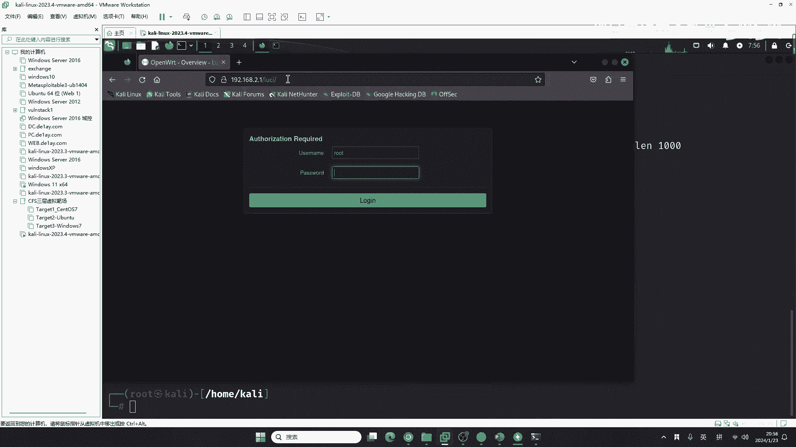

那这时候同学们来问题了，在互动区，有个同学提到啊，我在使用了桥接模式之后，为啥无法上网，为啥跟咱们二一老师不一样，我在这里就要为大家解释清楚，第一件事情，就是说你要查看桥接网卡是否错误，啥意思呢。

就是我在刚刚给大家说过一句话，我们现在的电脑啊，它有无线网卡又有有线网卡，如果你现在连着无线网，但是Kali却错误的桥接到了，有线网络上面，肯定就错了，就比如说我现在用无线网。

它如果桥接到了我的网线上面，就没法上网，因为我网线都没插，那怎么上网呢，这时候怎么去调节呢。

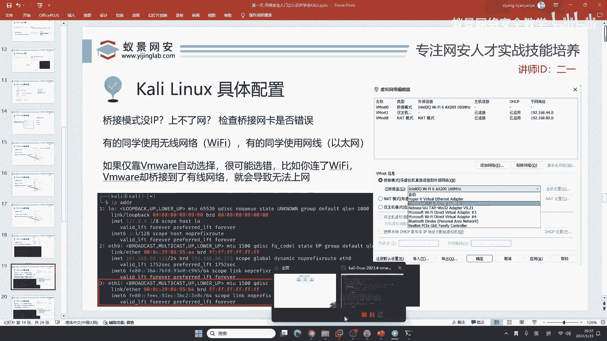

大家看好啊，你就不要去右键点击它了，我们要点击这里的编辑，点击这个地方的编辑，点击虚拟网络编辑器，在这个虚拟网络编辑器里面，我们要右下角点击更改设置，点击它点击更改设置，点击更改设置之后啊。

现在你可以看到这里有一个叫做，以桥接制，很多同学呢，它是默认的自动，我们需要按照自己的网卡去调节，比如说我现在连接的是无线网，你无线网怎么去找，就要找WiFi这几个英语字母，去找到它，桥接就行了。

有的时候你插的是网线，网线应该怎么去找呢，你要找PCIE，PCIE接口的网卡，就是你在主板上面焊接的这个网卡，就是属于PCIE网卡，也就是最后一个，我现在连接的是无线网，所以说呢。

我就改成WiFi就行了，改成WiFi之后呢，点击确定，就可以正常桥接至，我的无线局域网的路由器，也就是我的无线路由器，就是无线路由器，我说人话，大家就能听懂了，就是在我的课程中。

会尽量的减少专业术语的出现。

我把它解释成你能够理解的东西，对你来讲帮助非常大，下面我们再来讲，这时候呢，有的同学跟着我的思路，更改了桥接的网卡，发现还是没办法上网，这时候怎么办呢，请注意啊，如果你是校园网，很多的学校。

因为老师上大学呢，已经过了很多年了，我那时候呢，自己的宽带是可以使用，自己购买的路由器的，当时我们宿舍里面啊，是一起搞了一个普联的路由器，在宿舍里面可以进行上网，可以进行打游戏都不受限制。

但是现在绝大部分高校的校园网，你是不能够自己购买路由器的，也就是说呢，你使用的路由器，是属于你学校里面，给你分配的路由器，这类校园网都有一个特点啊，就是说大家上网的时候，需要输入自己的校园网账号和密码。

才能够正常上网，这种网络都没有办法使用桥接模式，为啥没有办法使用呢，就是因为上级路由做了限制，它不让你桥接，很简单啊，就是不让你桥接，常见的比如说像校园网，还有就是说，你到一些机场到高铁站，或者是呢。

你到酒店里面连接的无线网，这些无线网呢，都需要获取你的手机验证码，不然的话就没法上网，是的吧，同学们应该都有过经历，比如说你到星巴克里面，需要连它的无线网，首先呢，需要获取到你的微信。

获取到你的手机验证码，才能够正常上网，这种网络都没有办法桥接，没办法，没有办法越过去，你只能乖乖的使用那特了，你就不要再尝试使用了，手机的USB是可以的，手机的USB是可以的，怎么能。

就是如何看出来能连网，就是Pin百度啊。

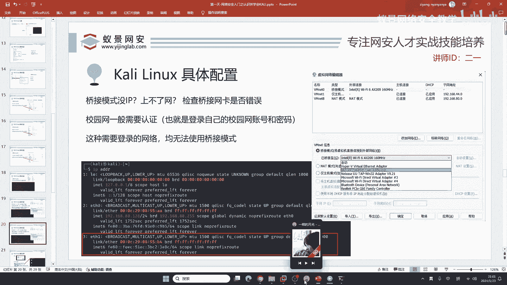

你能连通百度，就说明你能连网呀，我们Pin，Pin就是测试网络连通的指令，咱们Pin一个网站就行了，比如说我Pin这个百度，是吧，能通，怎么看出来它能通啊，怎么看出来它能通，手机热点是可以桥接的。

手机热点是可以桥接的，但是还是分运营商，分地区，我这里是可以的，我是在湖南啊，湖南是可以的，但其他地方，包括其他的运营商，我不太清楚，它可以就可以，不可以，就是基站做了限制，能理解了吧。

基站做了限制就不行了，如果没有做限制就是可以的，好，下面我们来看，怎么测试它连通呢，就看这边的这个延迟数，延迟数是25，就证明能够连通，连不通延迟是多少，0，连不通延迟就是0，首先你这个翠翠莎。

这个同学，你的这个社工能力非常好，老师啊不是南京的，但是我是一个非常靠近南京地方的，你这个社工能力给你点个赞，你能够听，听到这个口音啊，分辨这个地区的人，真的很厉害，好，那你就不要再猜了，具体是哪里的。

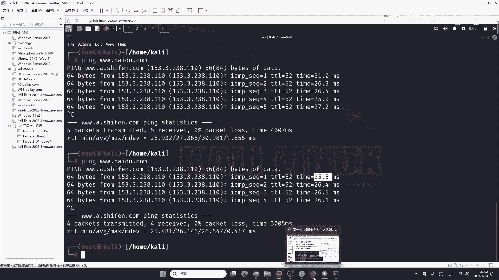

好吧，这里可以给你简单的唠一唠，但是咱们课还是要继续啊，咱们来看第三种网络模式，就是咱们的一个紧主机模式，可以，毫秒，40毫秒，当然可以啊，你只要有毫秒数就是可以的，没有毫秒数。

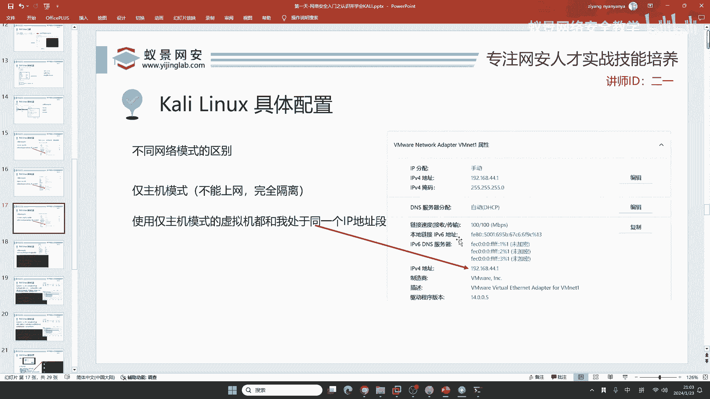

那就是不行，怎么停止啊，我告诉你，就是Ctrl+C，Ctrl+C就能停止了，知道吧，就Ctrl+C，就是一个强制终止的一个命令，你记一下吧。

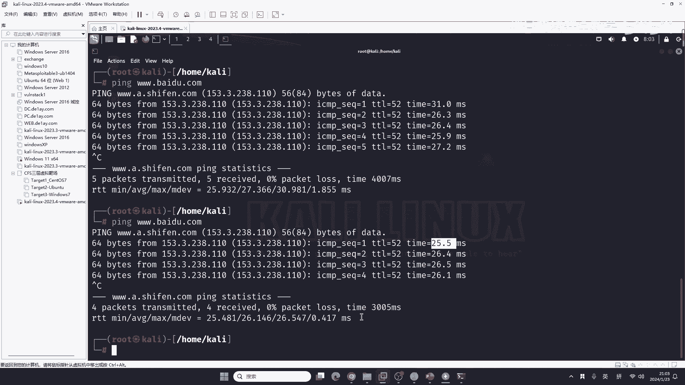

Ctrl+C呢，在所有的Linux中都是通用的，我建议大家还是记一下这个东西，当然我都会写到笔记里啊，你记不住也没关系，第三种网络模式呢，叫紧主机，紧主机模式是干啥的，它是一个非常特殊的模式啊。

它不能上网，那有同学讲，我整个虚拟机不能上网，那有啥用啊，你现在看医院去过吧，医院医生开药的那台机器，能不能上网，不能上网吧，或者是说你在公司里面，有的同学应该上过班，上过班，你公司里面的数据库服务器。

或者是你公司里面的开发机，你公司里面的测试机，你做单元测试用的那一台机器，能不能上网，不能上网吧，不能上，所以说呢，它就是做一个完全隔离的环境。

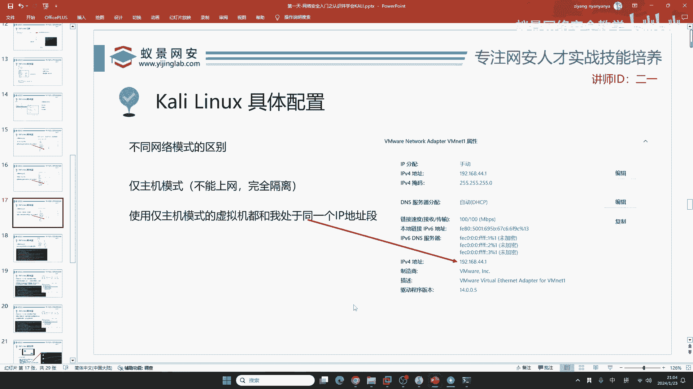

我们来看，就是说你现在不想让它上网，又要让它干什么，又要让它有IP地址，就是紧主机，就是紧主机，那你说我现在不想让它上网，我把网线拔了不就完事了，不行啊，网线拔了是不通互联网，它同样也就没有IP地址了。

我们现在要做的是让它通内网，不通互联网，防止被黑客攻击嘛，咱们把这个桥接啊改成紧主机，就第三个点击确定，对这个同学讲得非常对，就研究木马病毒的话，咱们就是要紧主机模式，给这个自己的电脑做一个网络的隔离。

它不会传递到自己的物理机啊，不会传递到自己的物理机的，大家放心，VMware的虚拟技术是完全虚拟化，就是说你现在看到的这个屏幕都是假的，能理解吧，你的咖喱的桌面驱动硬件，包括你的鼠标键盘都是假的。

都是虚拟的，叫完全虚拟化，跟你的这样一个物理机，没有任何的联系，这就是VMware的作用啊，VMware的作用，好的，我们下面继续来看，紧主机已经改好了，改好之后呢，咱们输入IFconfigure。

或者是IPA都是一样的，IPA都是一样的，我们在这里输入IFconfigure，你可以看到地址变成了192。168。44。135，那它跟我们物理机器的谁在同一个IP地址段呢。

跟我们的VMnet1在同一个地址段，我的VMnet1呢是192。168。44。1，那这里呢是44。135，很明显在同一个IP地址段中，这时候它不能上网，来给大家瞅一眼，ping不通吧，不能连通百度。

就说明它不能上网，那闲着没事啊，咱们搞一台不能上网的机器干啥，让它不能上网。

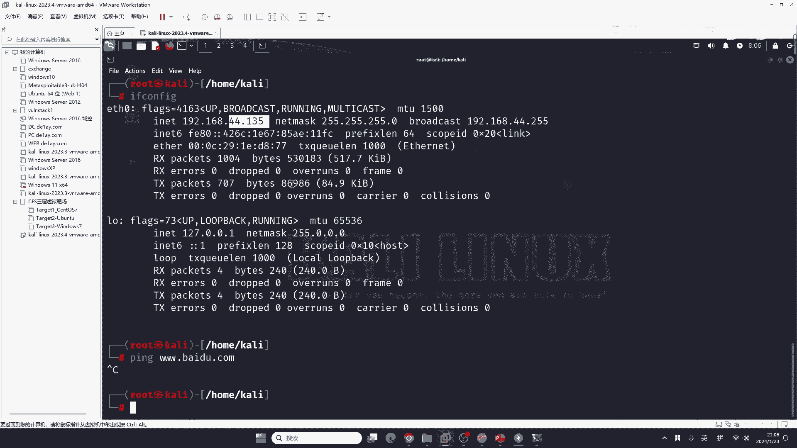

对渗透测试的影响也比较大，首先呢就是我们可以搭建内网环境，是吧，比如说我搭建一个模拟，是吧，模拟这个企业的内部环境中，企业的内部环境中啊，去做一个内网靶场，第二个就是我做病毒木马分析，病毒木马分析。

去进行相应的木马运行和调试，在这种完全隔离的操作系统上面，进行木马的调试，好的现在我问大家，你去想一想。

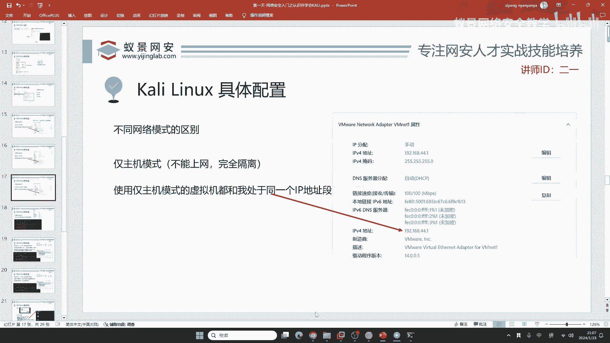

这一个虚拟机，它绝对安全吗，有没有绝对的安全，就在这地球上有没有绝对的安全，没有吧，肯定没有，有一种漏洞啊，叫做虚拟机逃逸漏洞，就像这个同学讲的，去年的Jake Kong。

有同学可能不知道Jake Kong是什么东西啊，给大家介绍一下，Jake Kong啊，它是以前的极棒大会，是国内啊，一个非常出名的，这一个，一个网络安全的沙龙会议，这些沙龙会议呢，会请咱们国内最顶尖的。

以及世界最顶尖的安全团队，来现场攻克一些比较复杂的，这个一些智能设备，或者是一些浏览器，一些比较新的操作系统，包括虚拟机的逃逸漏洞，还会邀请一些，比如说像清华大学的，包括呢。

这个腾讯玄武实验室的负责人TK，以及呢像清华大学的段海星等等，大家呢可能在这个开讲呢，也认识过段海星啊，他是清华大学，蓝绿化战队之前的负责人，当然现在呢已经升职了，这些里面啊，这些里面都充斥着漏洞。

但是我们作为一个正常的使用用户，你需要考虑到虚拟机逃逸漏洞吗，这里要告诉大家是不需要的，为什么不需要呢，给大家讲一个细节吧，像虚拟机逃逸漏洞啊，VMware的虚拟机逃逸漏洞。

它从始至终就包括这个Jikpong，吉邦大会，以及天府杯的这些高端人员，打到了这样一个漏洞，但是这样一个漏洞的攻击方法，永远不会公开，就是永远不会公开，那如果有一个人用这个漏洞攻击你。

你通过流量的抓取和分析，就能够得知这个漏洞的攻击方法，从而得到这个漏洞的攻击脚本，那我们啊就可以拿它赚钱了，你应该觉得开心，你应该觉得开心，知道吧，能理解吧，就比如说你现在你的系统被打了。

你应该觉得开心啊，咱们白嫖了一个价值数十万美金的虚拟机逃逸漏洞，你不开心吗，我肯定非常喜欢别人打我，所以说呢，正常情况下，这些漏洞都是不会公开的，就比如说这个同学讲的，看到苹果芯片的底层漏洞。

不仅是我就告诉大家，像天府杯的这种水平，你的iOS和macOS的系统，每一个版本都是可以直接拿到你的系统最高权限的，但是这些攻击手法，他们不会公布，不会公开，他们会用它来做恶意的事情吗，会不会啊，不会。

因为他和你们一样都是白帽子，都是白帽黑客，而不是说，而不是说什么呀，对国家战略储备，他可以去做国安，可以用这个东西维护国家安全，而他不会用这个东西去打你，能理解吧，他不会去打你，也不会去打我。

打我们的都是一些恶意的黑客，或者是一些脚本小子，要么就是境外的恶意黑客。

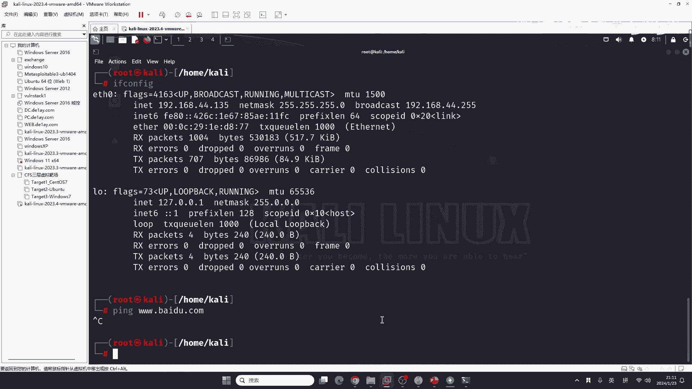

要么就是脚本小子，这些人才会打我们，也不是说价值太小了，你这说的也有一定的关系，也有一定的关联，好的，那现在呢，我们对这几个啊，对这几个基础的使用就已经完全了解了，都就已经完全了解了，好的。

那我们在知道这个网卡之后呢，现在我们来找一点小小的技巧。

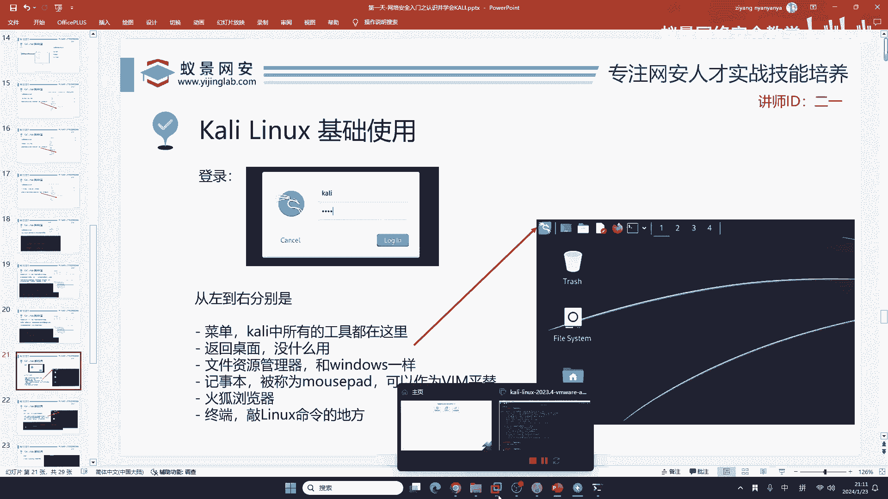

就是说这个咖喱里面，我们要精通他的哪些东西，你一个小白如何快速的去掌握这样一个咖喱呢，首先呢，我们要把他的网卡调回来，你既然想要让他去攻击网站，攻击别人的电脑，你得让他联网呀，你不让他联网。

那攻击个啥呢，是吧，那够不着别人，你攻击啥呢，咱们啊，要给他改成那特或桥接模式，如果你是校园网，改那他就行了，不要多此一举，咱们用那特模式，用那特模式之后啊，要稍等片刻，咱们看IP地址，现在还没变。

再刷新刷新，还没变，还没变，现在变过来了，192。168。80。148，能否正常上网呢，也是可以的，现在呢，咖喱就恢复了他应有的功能。

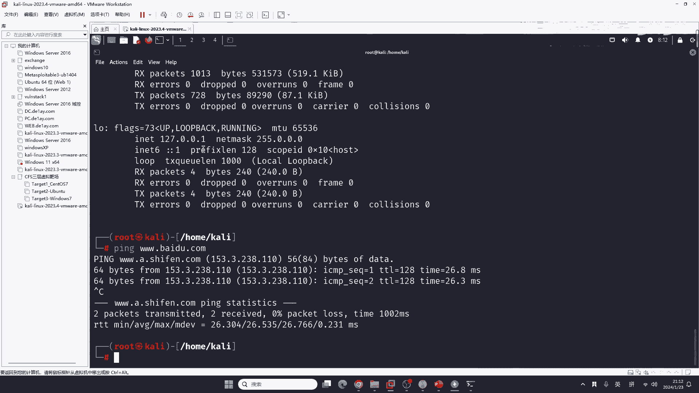

我们上面介绍的三个网络模式呢，还是告诉大家啊，你在之后，不论是我们明天讲的容器，Docker，还是像K8s，或者是像OpenStack，像KVM，OpenVZ，以及呢像PVE，这些商用的，这个虚拟平台。

全部都有这三个模式，分别是NAT，还有桥接叫Bridge，以及呢金主机Host Ole，讲这个东西比你说你会敲几个命令，要牛逼的多，你说IF Configure，你会，大家都会。

来听课的几百位同学他都会，那你怎么能脱颖而出呢，你怎么才能就是在这个面试中，把这个，这个面试官能够欣赏你呢，能够给你开一个月20K的工资呢，你一问三不知，或者是你知道的他都知道，那你就拿不到高薪。

很简单很简单，现在就是一个就跟你高考一样是吧，谁分高，谁牛逼，谁分低就上大专，就上甚至是考不上高，考不上大学是吧，就是这样一个东西，我们就是要掌握别人不知道的东西，不是别人不知道，而是这些细节。

别人没有掌握清楚，你可以掌握清楚。

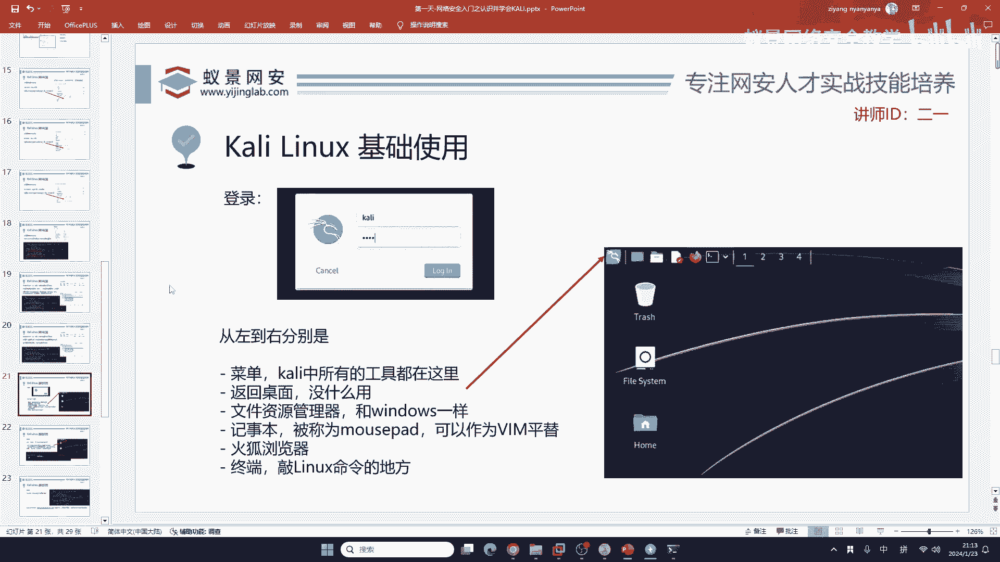

现在我们来看这个登录。