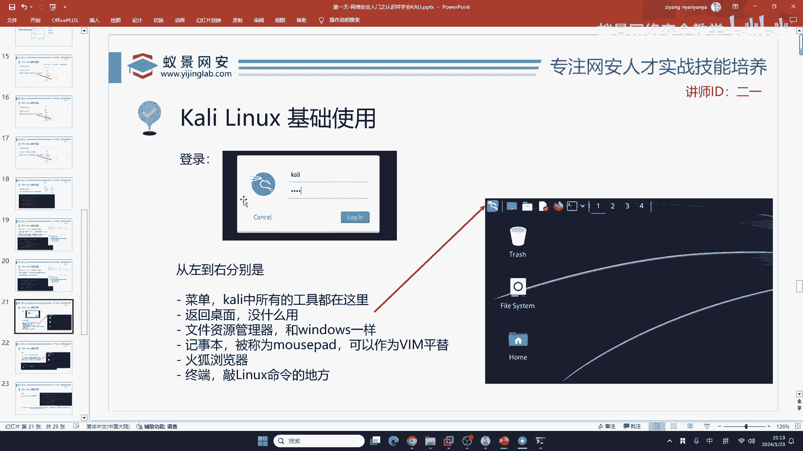
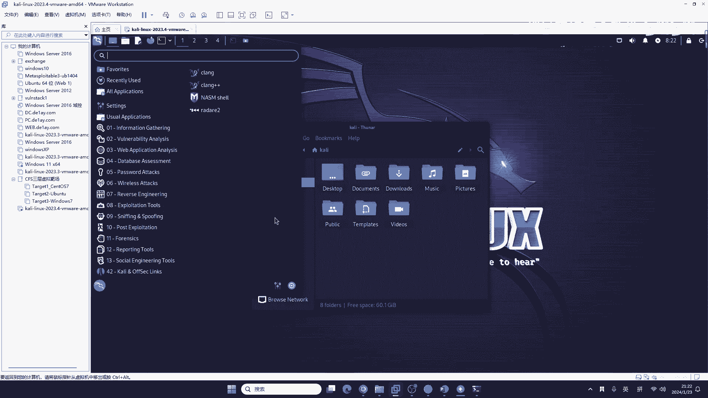
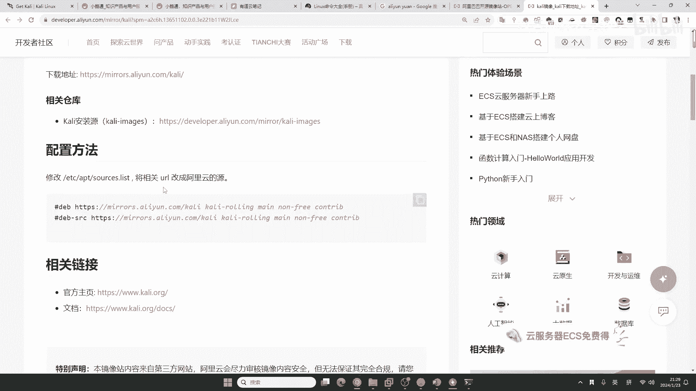
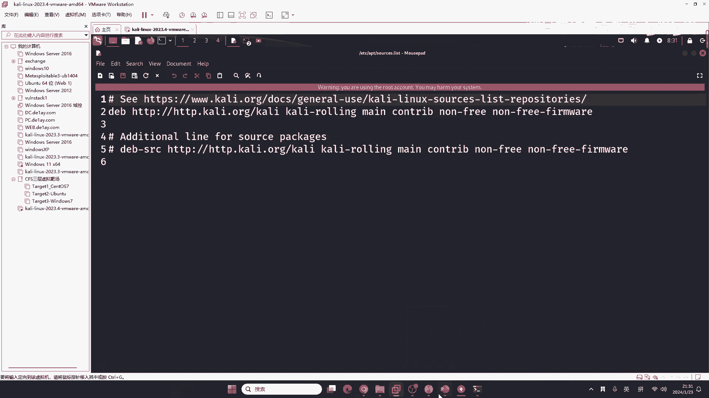
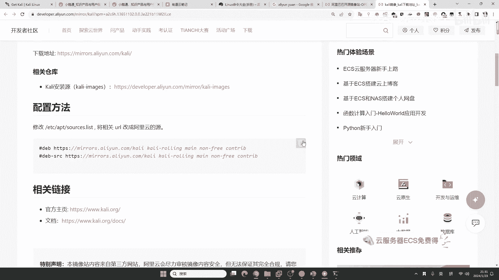
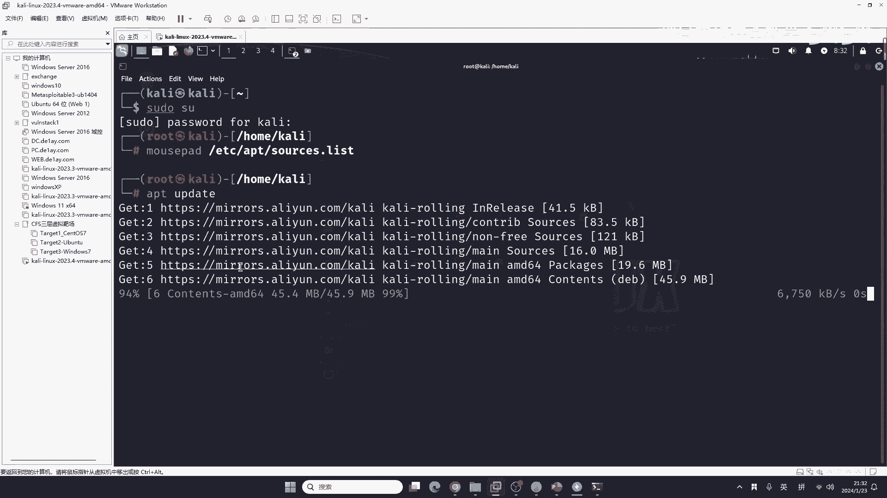
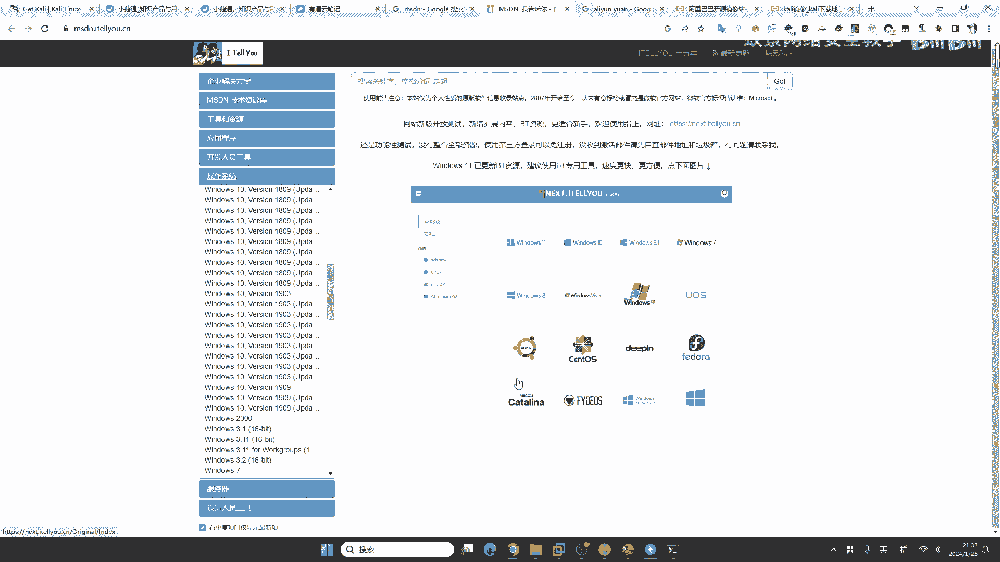
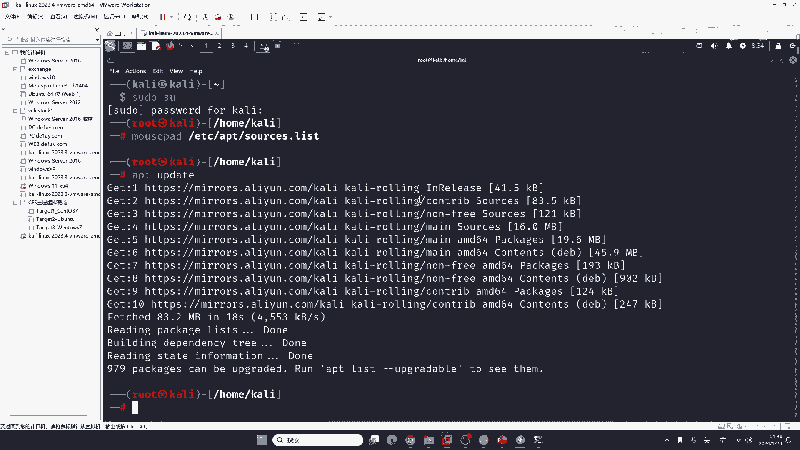

# 【零基础学网安】B站最全的网络安全教程，从入门到精通，学完即可就业，看完还学不会我退出网安圈！（渗透测试／kali渗透／内网渗透／黑客技术） - P13：4.kali基础使用.mp4 - 蚁景网络安全教学 - BV1fctLevETn

来看登录，这个登录呢，首先就是从左到右，我们来看这个菜单栏。

这个菜单栏呢，来看啊，来看第一个是应用，第二个是返回桌面，第三个就是咱们的文件夹，这个文件夹呢，你熟悉啊，跟windows一样，然后呢，是咱们的记事本也是跟windows一样的，只是英语版本的而已。

然后呢，是咱们的火狐浏览器，还有啊，就是我们一直在用的终端模拟器，它里基本上就这些功能，我们主要的使用呢，都在这里，就是applications应用程序，这个应用程序，它到底有什么东西呢。

我给大家简单翻译一下吧，就看下面就行了，就是代表渗透测试，包括网络安全的每一个方向，它都有，比如说像信息收集漏洞分析，web漏洞分析，就是网站漏洞分析啊，这是数据库攻击，密码攻击，无线攻击。

比如说你想做无线网的破解，无线网的嗅探，包括在嗅探之后，对一些敏感信息的获取，就可以使用这个无线攻击，逆向工程，这是攻击工具，嗅探和监听，比如说呢，你去监听这个系统中的流量，或者是分析系统中的流量。

或者是分析别人的攻击流量，然后反向攻击别人，这就叫嗅探，这里呢叫后渗透利用工具，就是内网渗透中要用到的，内网渗透中用到的，这个叫取证分析，什么叫取证分析呢，举个例子啊，你们看一些，探案类的节目。

比如说我们这个长沙非常火的，守护解放区，你可以看到这个守护解放区啊，这个警察在去抓捕一些犯罪分子的时候，都会及时的去收缴啊，他的一个手机，包括他的电脑，那收缴这个手机和电脑干什么呀，去找到你的犯罪证据。

去收集你的违法犯罪的聊天记录，包括截图，这就叫取证分析呀，这就叫取证，取证在国内的应用场景非常多，我希望大家你能够，就是了解一下取证分析，以后你们想去，比如说想去公安，或者是想去国安，这些企业工作。

你肯定是要会取证分析的，然后这里呢是报告工具，这个报告工具呢是老外的，跟咱们国内关系不是特别大，你可以直接忽略，这里是社会工程学工具，社会工程学呢就比如说，你现在要去钓鱼，要去钓鱼网站，要去做键盘记录。

要去做一些监听，就可以使用社会工程学的，这样一个工具，什么是社会工程学呢，给大家举个例子啊，有同学讲啊，社工我知道，就是说社工我知道，就是查别人身份证，你给我一个QQ，我给他身份证给他查出来。

这叫社工库啊，叫社工库，这种啊，只是社工的一个极小的分类，能理解吧，它只是社工的一个极小的分类，对就是骗人，社工就是骗人，就比如说，刚刚翠翠莎同学啊，听过老师的口音，他能听出啊是南京片区的。

就南京周围的这样一个口音，这就是社会工程学啊，就比如说一个人做社工，就比如说我做社工，我可以达到什么程度呢，一个照片，这是一个叫开源信息收集能力啊，就比如说一个照片啊，一个照片，他在飞机上拍。

或者是在这样一个旅游的时候拍照片，你看他的照片，你就能知道，他是在哪一个位置，哪一个角度拍下的这张照片，这就要求你有非常这个高超的开源情报收集能力，开源情报收集能力，这个东西很重要，很重要啊。

这是社会工程学，当然社会工程学呢，它是一个什么东西啊，它是一个行走在法律边缘的，如果说你现在没有得到合法的授权，你去做社会工程，很有可能会触犯法律，这边呢是他的一些相关链接，你可以去看。

这时候有同学就来讲啊，就是说这些东西啊，哎，他有没有中文版，我要告诉大家，中文版不建议你去汉化，为啥不建议你去汉化呢，因为啊，你的汉化基本上都是机翻，就是机器翻译，他汉化的啊，非常的这样一个不通顺。

很有可能就是讲，你还不如自己用翻译软件去翻译呢，你汉化的不通顺，第二个呢，就是有些工具，他不支持中文环境，就是你现在汉化了，他很有可能是，很有可能干什么，很有可能对你的工具正常运行造成影响。

这个同学问到了一句啊，就是说爬虫违法吗，爬虫不违法，爬虫如果你能够遵守爬虫协议，就是合法合规的爬虫收集数据，是不违法的，能理解吧，是不违法的，但是如果你现在爬虫，你是非法的获取大量的数据。

并且把这个数据用于你自己的收益，就比如说呢，我现在了解，咱们这个微博上面，有多少人今天骂了某个明星，有多少人啊，在讽刺今天的股票，你爬取这些东西啊，然后公开在互联网上，或者是你自己收益，这就是违法。

同学们看新闻了吧，微博有一个公司爬取微博，不是被那个告，然后这个判了判罚2000万吗，就是因为他在爬取微博的数据，他把这个数据用于自己的收益，并且他违反了这个微博的爬虫协议啊，那就是违法行为啊。

这个爬虫本身技术，技术是没有无害的，就比如说你现在学习攻击技术是吧，它也是无害的，能理解吧，就像这个一同学说的，就比如说咱们去攻击，攻击这个朋友的电脑，这属不属于违法行为呢，按理来讲呢，是不属于的。

就你提前给他说一声，比如说我们在以前，在自己的这个学校里面，把找一个朋友，你说我能不能找你测试一下木马，得到他同意了，你给他测试，是没有关系的，是吧，但是如果你现在学会了生成木马，你发到你的微信群里面。

别人如果有一个人，他非常的就是成心想搞你，成心想搞你，知道吧，他可能就会把你告上法庭，这种就是罗翔老师讲的轻告罪，不告不理，就是说如果这个人不去成心的想搞你，那就没关系，但是如果他搞你。

你必须要付出法律的责任，能理解了吧，就像有同学讲，我能不能对别人的网站随便乱扫，我理论上来说，就是基本上没问题，但是你要保证别人不去告你，如果告那是100%赢，你就要赔款，如果你没有造成影响还好。

就赔个款，签个字就完事，如果你造成了影响，那就是行政责任或刑事责任，那就非常严重了，就非常严重。

大家不要把法律当儿戏，做网络安全的人被抓的，又不是说取之可数，被抓的一大堆，甚至是说一个团队，脸窝被端，为什么，就是经不起这个利益的诱惑，你学习这些东西，我不是给你讲了吗，你现在把咖喱学会。

你可以对网站，可以对别人的系统进行攻击，你要这样去做吗，你不能这样去做，你应该把它发挥到你的一个技术的提升，包括以后工作互网中的用途上，如果你经不起诱惑，那就完蛋，就比如说你现在你看着别人的银行。

你总是想抢钱，那能行，是吧，那不行，那肯定不行，好的，这里我们讲过了，就是它的一个切换root用户，切换root用户，然后就是查看REP地址，现在我们来讲，咖喱有一个小小的门槛，就是Linux系统。

那Linux系统这么多的命令，同学们应该知道，成千上万的命令，你要掌握完吗，不需要吧，不需要掌握完，这里给大家一个网站，这个网站，我在课后会放到咱们的笔记里面，即使说你现在你来不及，没有关系。

绝对没有关系，所有的东西都会给到你，都会给到你，那这里我们来看一下，他讲的就是常见的Linux命令，这个网站，我觉得它最好的地方就在这里，叫最热命令，最热命令里面，其实你现在大眼一看。

就在这个屏幕上面的命令，有一半咱们渗透测试都用不到，也就是说你顶多最常使用的命令，就15个左右，能理解吧，你基本上就这15个里面乱转，这15个里面乱转，你哪个学校的，给你带毕业设计是吧，我一般情况下。

现在因为公司在长沙，我只给长沙周围的学校，可能会给他们做一些毕业设计的指导，可能会到现场做指导，包括毕业设计，还有答辩的一个评判，其他的地方，因为我现在工作是吧，在湖南地区，所以说我一般不到其他地方。

除非就是说公司有业务，公司有项目，这边就是比如说像文件管理是吧，这几个都经常用，这几个都经常用，然后就是文档编辑是吧，你可以自己去看，这些基本上用不到了是吧，删除文件这也用不到，这也用不到。

文本编辑器能用得到是吧，Find PS，UNAME是吧，好，RM，还有什么，没了，没了，还有KAT，我现在勾的这些命令，你看到没，我勾的这些命令，勾的这些命令，你把它记住，有多少个，大概15个左右。

其他的要不要知道了，其他的就不用记了，为什么不用记呢，我现在告诉你，新华字典，你能从头背到尾吗，不行吧，我长这么大，从来没见过任何一个人，能把新华字典，所有的汉字都知道，你肯定有不认识的字。

不认识怎么办，你自己查，自己查是吧，所以说你可以把这个网站，当成一个字典来去看，你不是说先把它去备汇是吧，备汇，对，主打一个熟能生巧，主打一个熟能生巧，现在我们继续来看，继续来看，这是咱们的一个。

命令是吧，命令就解决了，在解决命令之后，我们还要做一件事情，就是给它换圆，什么叫换圆呢，我举一个例子，就是我们在自己的国内，你去安装一些软件，比如说我们去安装一些安全工具，或者是安装一些漏洞的攻击工具。

它下载非常慢，为啥非常慢，就是它默认情况下，它软件的列表，它是在国外，我们连起来非常慢，这时候我们就要把它换成，阿里云的圆，我换圆，大家在任何的平台，任何的网站都能搜到，所以说我今天还是站在一个。

不同的角度跟你讲，这是我的收购方式，你听了之后，你能够进行举一反三，这个东西就是阿里云圆，阿里巴巴开圆镜像站，这个网站，我在课后，也会放到咱们的资料里面，同学们来看好，你所接触的，就是你现在脑子里。

你知道的所有的，所有的开发，所有的系统的源，在这上面全部都有，每一个都有，就是说，你接触过计算机的任何方向，不光是网络安全，比如说像Ubuntu，CentOS，Pyper，深度，Mevin。

有没有同学知道Mevin是什么，只要你学过Java，应该听说过Mevin，MongoDB，Kali，Kali是我们一会要用的是吧，OpenWrt，这些路由的，这些操作系统，它也有是吧，D-BAN。

NPM，这是NodeJS的，NodeJS的是吧，GNU，还有什么，Arch Linux，还有什么东西，你再看，所有的都有，所有都有，还有K8s，还有CYGWin，还有GoPro6，好，对，所有都有。

它涵盖了所有的计算机的领域，就是你现在下载东西慢是吧，你找这就行了，或者是说有同学讲，我现在要下Ubuntu，老师，我不知道Ubuntu的官网在哪，Ubuntu的官网都是英语，版本太多了，我不会下。

怎么办，这里有一个系统镜像，你点开看，看到没，点开这个叫OS镜像，你想下哪一个，比如说我想Ubuntu，版本选哪一个都行，看到没，从14到现在的23，每一个都有，每一个都有，这里是不是有个下载地址。

直接点下载就行了，它的下载速度非常快，这就是咱们的阿里云开源镜像站，完全免费，但是很多人都不知道，很多人只会换源，很多人只会换源，但是他不知道这个东西有啥用，Win10没有这个东西。

Win10没有必要换源，你下的Win10本身，它就是有本土化的，知道吧，咱们下的Win10都是本土化的系统，不需要换源，现在我们一起来瞅一眼，比如说我们换Kali的源，Kali的源怎么换。

你看它这里给你讲的清不清楚，让你修改这样一个地址，把相关的网址改成阿里云的源就行了。

复制，复制之后怎么去修改呢，有同学打开终端之后，首先咱们打开终端要做一件事情，就是要去放大终端，放大终端，然后切换到root，你小小的Kali想改源，你还是拉倒吧，咱们进入到root用户。

进入到root用户之后，有的同学经常使用vrm，vrm可以说是新手劝退哥，就比如说，以前在Steam里面，有一个游戏叫黑魂，很多同学应该玩过，这黑魂里面，它第一个boss很难，就被称为劝退哥。

就是说你学不会这个东西，你打不过boss，就退款，是吧，就退款，然后我们这个东西，我不建议大家虚拟机直接用它，你可以用Kali中自带的一个编辑器，叫mousepad，就是记事本。

就是这个mousepad，mousepad编辑什么，etc，apt，sources。list，不要打错，你可以按tab键去补全，但是不要打错，好我们回车，现在你又打开了一个记事本，在这个地方。

看到没打开了一个记事本，在这个记事本里面，你就可以把刚刚。

我们在网站上面，看到的这个东西。

放到看到这个东西，然后给它粘贴过来，给它粘贴过来，粘贴过来之后，知道怎么粘贴吧，Ctrl+C Ctrl+V，我就不用多讲了，这你们都会，Ctrl+C Ctrl+V，谁不会呢，在这里我们把警号去掉。

警号是代表注释，就是我不要它，给它注释，给它注释，注释掉，注释掉之后，咱们保存一下，就点这里叫save，就是保存的意思，点一下保存，你看这个源不就换好了吗，再插掉，换好之后怎么办，咱们一定要更新一下源。

为啥要更新，就是你现在换了，别人知不知道，他不知道，不知道你要告诉他一下，IPT update，IPT update，好，咱们按一下回车，然后大概稍等两分钟，就可以更新完毕，我们来看一下同学们的问题。

第一个问题，就是，这个同学问，这个是Win10系统在哪下，刚刚这个同学告诉过你。

你去MSDN搜就行了，有一个网站叫MSDN，给你看一下，就这个网站，这个网站里面，它有操作系统，你下哪一个都行，好，这个项羽同学，我要跟你解释一下，评论都说中科大的源更好，这个是时大师的实话。

中科大以前的源是最好用，但是中科大现在它咖喱源还在，部分的源，它可能仅供校园内部使用了，就是只有他们的校园网才能用，为啥，他说是一些不可抗的因素，所以说他关闭了，就中科大，他只能学校内部的人用。

你现在点开这个操作系统，你看，你想下什么就下什么，好，这叫MSDN，MSDN，虚拟机Win10没有网卡，你是什么模式，同学，是啥模式。

是吧，那特还是桥接，如果你是桥接的话，就改成那特，再试一试，对把所有的都删了，你没有网卡是咋回事，你重启一下试试，重启一下试试，一会给你发个文章，好吧，同学们，同学们就是说，你们现在没有网卡的。

没有无法上网的，都别急，今天给大家一个好处，我在我的笔记里面，我会把虚拟机网络的排查大全，同步发给大家，我会把虚拟机网络的排查大全，同步发给大家，好吧，我会在这个笔记里面，同步发给大家，这既然你们提了。

