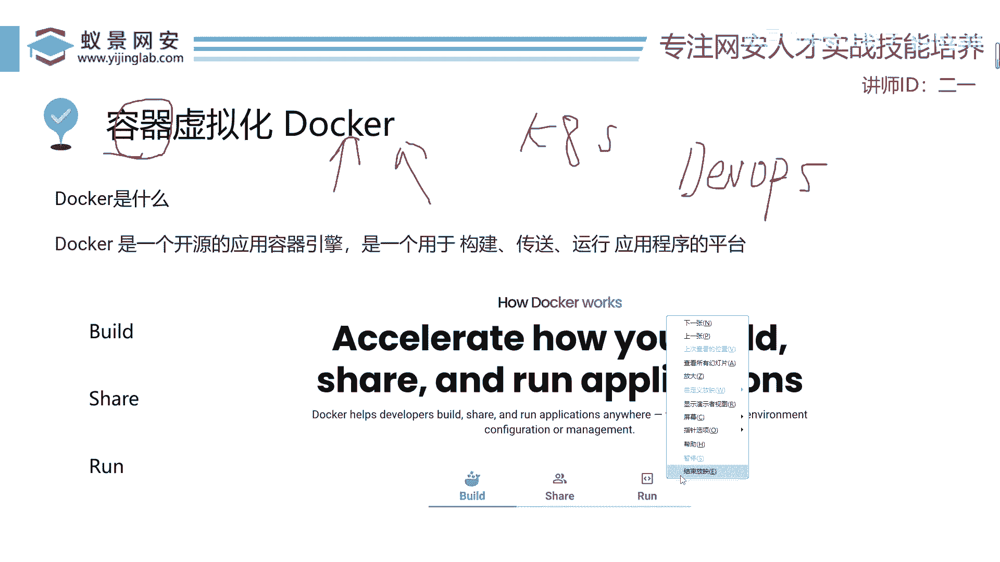
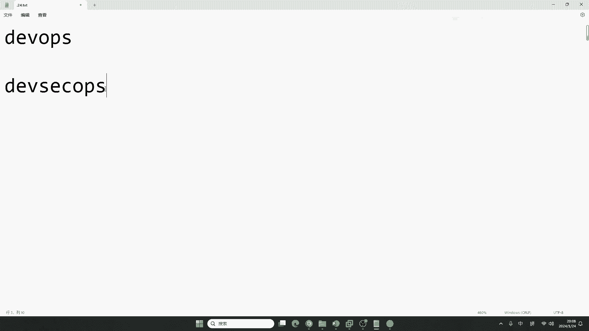
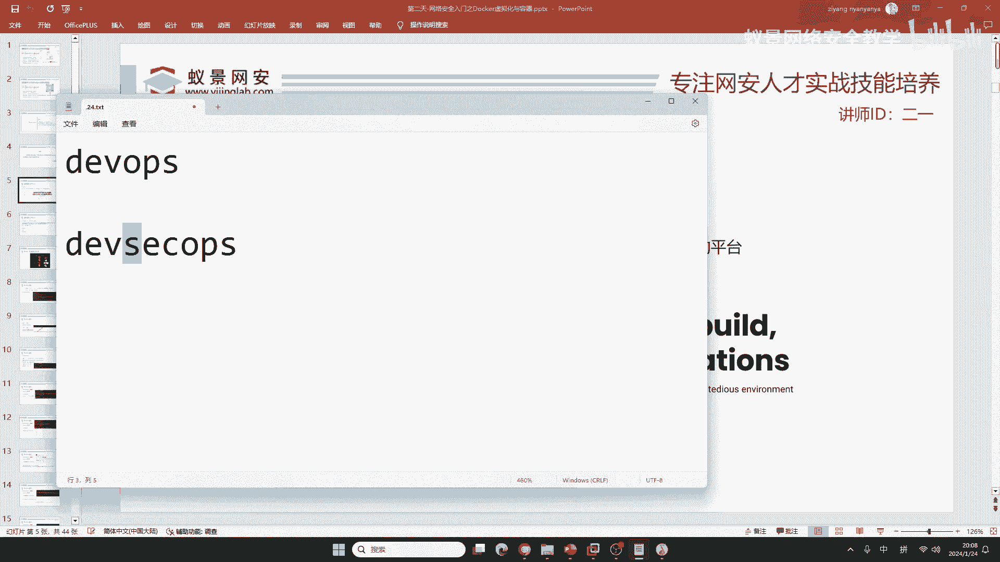
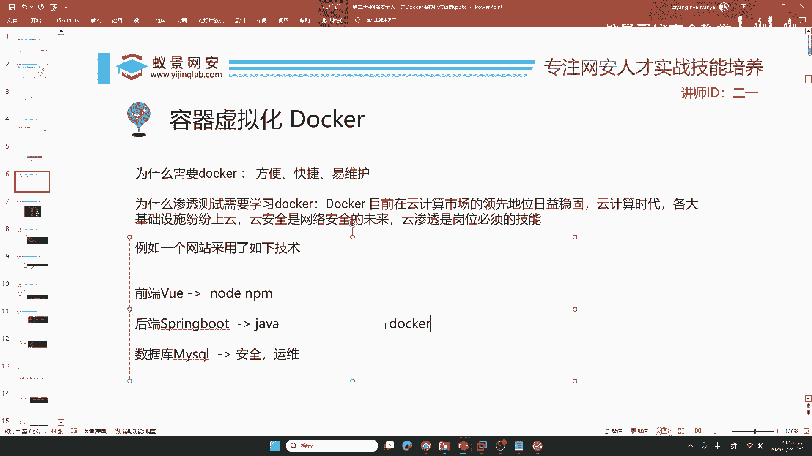

# 【零基础学网安】B站最全的网络安全教程，从入门到精通，学完即可就业，看完还学不会我退出网安圈！（渗透测试／kali渗透／内网渗透／黑客技术） - P14：5.虚拟容器docker.mp4 - 蚁景网络安全教学 - BV1fctLevETn

docker下载怎么这么慢 咱们今天给你解决啊 解决的方法 我希望就是告诉大家 能举一反三，你昨天听了我的课 应该也都知道啊 举一反三在网络安全中非常重要 就说你现在你去打漏洞。

是吧 你去打漏洞 我的天呐 这世界上的网站 世界上的每一个app是不是都不一样啊，如果你全部给学完 你觉得你的脑容量够不够 够不够 就比如说你现在把地球上所有的语言 你都学完 怎么可能。

全部学英语 法语 德语 是吧 西班牙语 我全部学 怎么可能呢 是吧，那所以说呢 你必须要掌握举一反三 别人为什么你看一个老哥 他能会20种语言 就是因为。

他知道这些语言的语法结构 包括音标都是有一定关联的，那今天我们来介绍docker 为什么要学docker呢 有同学讲 我不想学 虚拟机不就完事了 我还docker，docker啥。

好 首先呢 就是说你现在上班这个docker你必须得会 为啥要会它呢 同学们 我们昨天讲过一个名词叫云渗透，云渗透里面主要的是啥。

主要的就是咱们今天讲的容器 还有就是基于这个docker容器的一个非常出名的东西 叫kubernetes，我们把它叫做k8s。

如果你现在没有听说过k8s 告诉你啊 你对这个网络安全 可能你现在在学的东西，就有点过时了 就有点过时了 比如说你现在还在说 老师 我这个mysoco怎么去给他打穿 我怎么去获取数据库中的敏感信息。

那你看的课程可能有点少，现在别人都玩啥 现在网络上都是啥，是吧 k8s自动化运维 对这个同学讲的非常的对啊 我这个声音已经要爆麦了 你把你自己电脑的声音调大一些。

就看你昨天说 是吧 我麦小 我今天特意换了一个麦克风 而且把这个麦克风的增强，增强的加到5了 是吧，对自动化运维 就比如说这个同学讲的非常好啊 祝慕州给你点个赞 咱们自动化的运维是什么。

dvops是吧 dvops 同学们有没有人知道dvops是什么。

有没有同学知道 在互动区来告诉老师 这个dv还有这个ops是什么东西啊 同学们，这个是啥 知道不 现在咱们这样一个，网络安全 包括咱们的计算机 主打的就是这个东西。

dvops啊 它的一个作用叫做开发运维一体化，开发运为一体化，dv就是开发 你知道吧 能写代码的 码农就是开发，这个ops呢 就是运维，自动化运维 对的 就是开发运为一体化。

那现在呢 咱们国家重视什么 国家最重视什么 你不清楚吗 就是网络安全 那咱们这样一个，整个的一个加上安全 它叫什么呀 它叫dvops 是吧，叫开发安全运维一体化 这是咱们未来主要的发展潮流。

为什么声音忽大忽小 是因为老师的麦克风声音太大了 他有点爆麦，有点爆开了 所以说你听着忽大忽小 我现在把麦克风关小一点 就没有这个问题了。

那我们要想实现现在网络安全的这一点 那同学们 你说你不知道这个东西啊，你说那个工作 你以后毕业了想工作 没门，你现在就要知道一下 我就告诉你了 就告诉你了 你问你的同学 你看他知不知道。

肯定不知道 肯定不知道 我现在我告诉你了 知道吧 你要给我记住 开发安全运维一体化。

那在这个里面呢 docker，docker它是一个必备的东西，docker是干啥呢 它官网的解释非常清晰 它是用于构建 传送 运行应用程序的平台，这个应用程序呢 不是说你的抖音啊 你的淘宝。

而是咱们计算机专业的应用程序 就比如说 你的这个c语言 你的php 你的python，包括呢 你的golang这些东西的运行平台 而不是说你正常使用的app啊 它是专业级应用程序的平台。

那你问到这个nsb二级有必要考吗 如果你是大学 当然有必要考 大家都有 你觉得你有没有必要啊，就像这个东西 大家都有 现在是吧 大学生都有，为什么要使用docker呢 首先我站在两个角度来讲。

为什么开发要使用docker 就是为什么咱们这个开发运维安全一体化要使用docker 就是因为它方便快捷易维护，容器的出现 几乎在2016年的时候颠覆了咱们这样一个。

就是世界对于这个网站 或者是对于服务的一个概念，就是这个容器创造了你现在熟知的阿里云 腾讯云 亚马逊 谷歌 微软，如果没有容器 这些公司都不会存在 压根就没有他们的玩的，他们都是基于容器的。

那作为渗透测试 咱们为啥要学docker 就是因为docker目前在云计算市场的领先地位，它实在是太稳固了 现在是云计算的时代，你天天去取钱 是吧 itmg 银行 金融业。

包括你去交税啊 你交个人所得税 当然大学生比较多 可能你们没有交过税，交个人所得税 这些税务局 他们是税务云，你天天开车给自己加油 石油公司 中国石化 壳牌加油。

他们也都是上了自己的云计算的相应的应用程序部署，所以说 这个云会不会出现漏洞 肯定会出现，所以说 云安全是网络安全的未来 云渗透是网络安全岗位的必备技能。

那你不会云 那你玩啥呢 是吧 天天整个网站有没有sql注入 整个app说有没有sql注入 有没有万能密码，那你学的是几几年的东西啊。

学的是几几年的东西啊 是吧 sql注入 但这个地方啊 我们举个例子吧 比如说一个网站 它使用了一个成熟的架构。

你们如果是大学生啊 如果你的老师开过java 如果你没有开过java的话 你不知道 但是我跟你讲，为啥要跟你讲呢 你说你打网站，我不说你打app打小程序 你现在就打网站。

你不知道这个网站怎么开发的 你不知道这个网站它开发用的什么语言 那你怎么打呢，就比如说 你现在要去打一个国家 就是打一个敌人 你都不知道敌人有哪些部署，你都不知道他有多少架飞机 那你打啥呢 是吧。

好 比如说 前端用的是wheel框架 后端用的是java的supreme boot 数据库用的是mysql，如果啊 这一套东西交由一个，就是以前2016年之前的开发去做 他就比较头疼了。

比如说 他首先他安装这个wheel 他就需要很多的依赖，就比如说呢 他需要这个nodejs npm 整了一大堆，自己啊 大概需要一天的时间 或者是半天的时间 把这个wheel给他整好了。

整好之后呢 他还要去搞supreme boot 那supreme boot它是java 你可能没有听说过supreme boot 但是你一定听说过java。

为啥你听说过呢 我找一个不是计算机专业的人 他都知道java 都听说过 不是说他会写啊，你没有必要会写 你是会打 不是会写 你写他 你就是干开发了 我们是打开发 开发出来的玩意。

开发出来的网站应用 包括你的车载 车机系统都能打，这个后端呢 他这个java依赖非常多 比如说呢 需要选对相应的java版本。

需要有java的一些maven的配置 这个谁学谁头疼 你只要学过 你肯定知道他的难处，其次呢 就是mysql 最重要的是啥 就是他的安全 还有加密。

就像刚刚有同学说 我想搞别人的开房记录 那开房记录是哪里来的呀，数据库里来的吧 就是说你现在你到外面开房 你12306马上回家过年 是吧 你买票。

你买票的记录都在哪 都在数据库里面 那如果呢 这个数据库不安全 他会干什么 会发生，数据泄露 所以说呢 这个数据库最，重要的就是安全和运维 我同时呢 要保证这一个数据库的。

快速 就他比较快 如果你这个网站数据库卡的一批 那别人啊 抢个票，都卡半天 是吧 那谁用啊 都说你垃圾 所以说呢 这个运维也很重要，那现在 如果在以前想构造。

以前想构造这样一套系统 就需要大量的人员 那现在呢，现在不需要了 他只需要一个刀壳就行了，只需要一个容器就ok了 那有同学呢 就是不太了解啥是容器 容器啊 就是你家里的水桶，水桶知道吧 啥都能装。

比如说呢 我买的年货 哎 我不知道放哪 我往这个桶里一塞 哎 他就能装很多的年货，我现在啊 这个家里可能要停水 我提前呢 熏一些水在水桶里面，我给他把水往里一塞 他装满了水，就是说啊 这个桶他啥都能干。

你想用什么搭建网站 你想用什么开发 你想用什么运维 你想用什么数据库 都能塞，因为现在2020几年了 2024年了 刀壳2016年就有了。

那你现在八年的时间 就是你知道的 我告诉你 你知道的所有的跟it相关的应用。

刀客全部都有都有动能装。