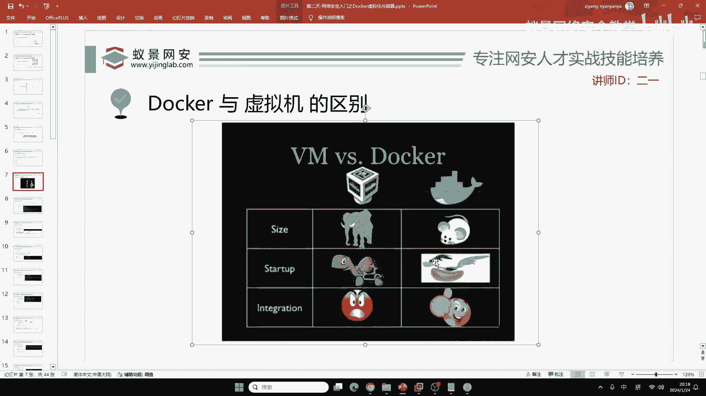
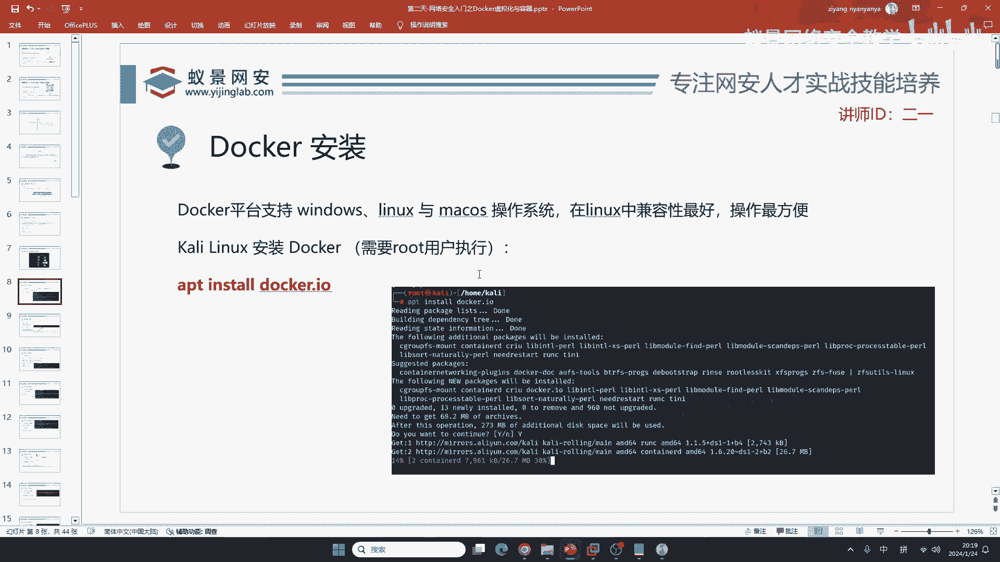
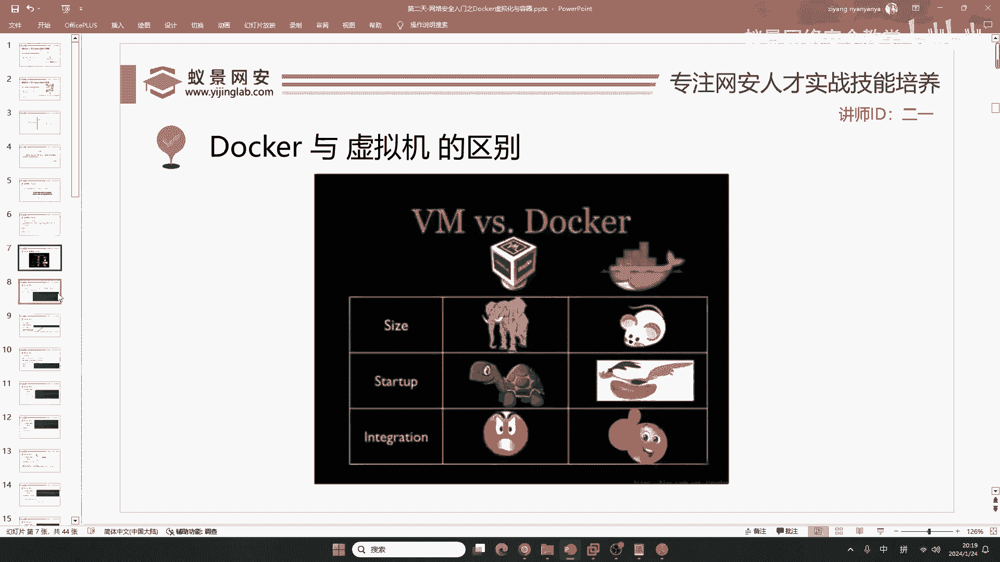
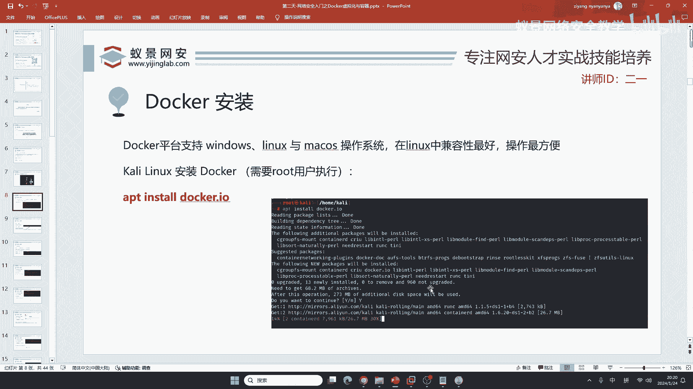
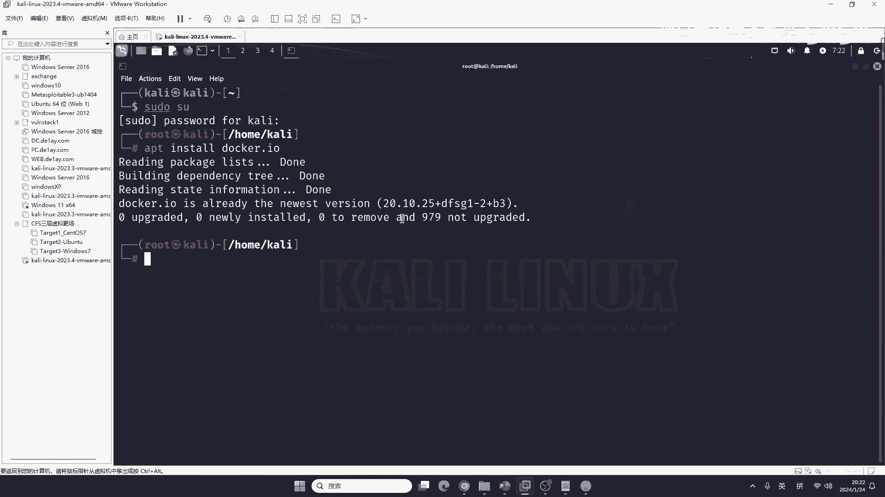
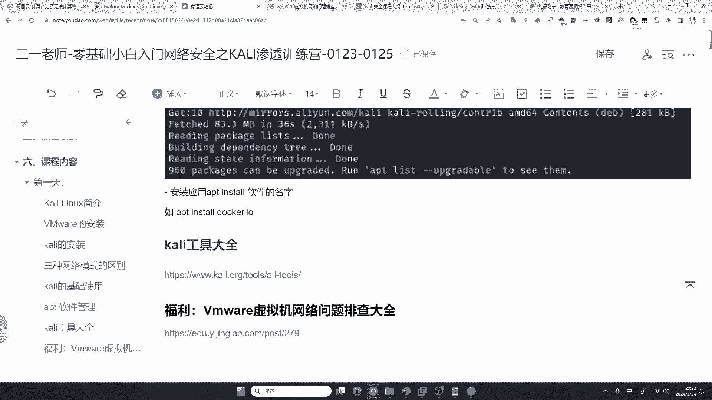
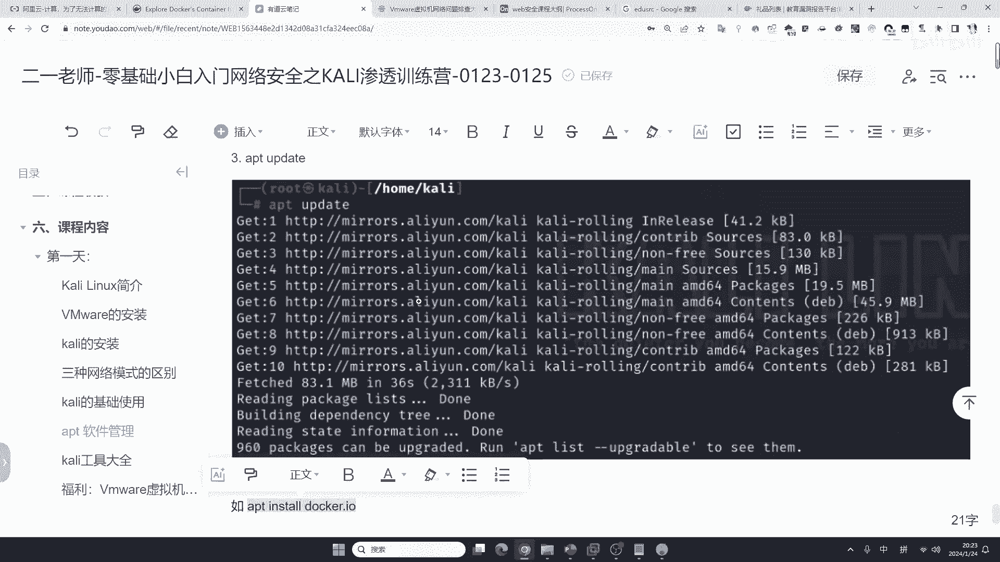
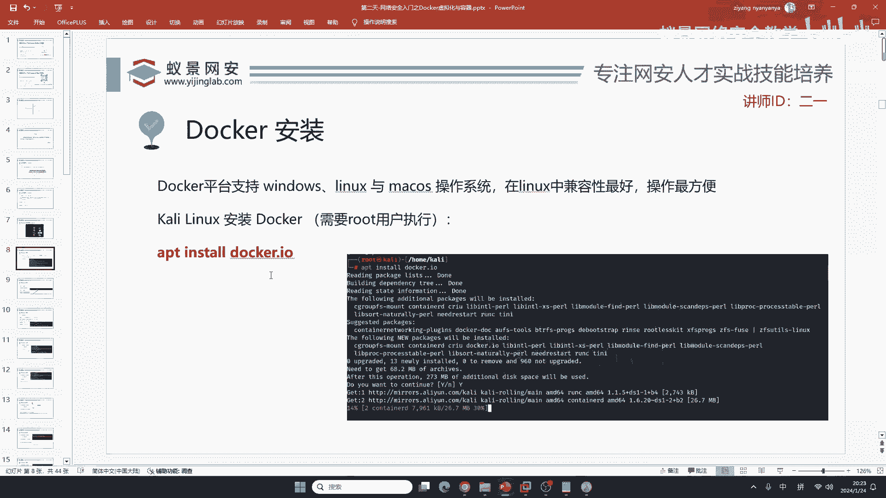

# 【零基础学网安】B站最全的网络安全教程，从入门到精通，学完即可就业，看完还学不会我退出网安圈！（渗透测试／kali渗透／内网渗透／黑客技术） - P15：6.安装docker.mp4 - 蚁景网络安全教学 - BV1fctLevETn

不能装 那有同学讲啊 费劲 我不如整一台虚拟机咯，你不是教我装咖喱吗 为啥还要讲docker，首先呢 我们来看虚拟机跟docker的区别 我觉得这个东西啊 它讲特别的形象。

虚拟机就跟个大象一样 而我们的docker啊就是小老鼠 小老鼠是什么意思呢 它比较小，你们在上一节课安装的咖喱有多大呀 老师看一下自己的咖喱有多大 我这个咖喱里面啥都没有 是吧 啥都没有。

啥都没有 你看这个咖喱20个gb 这20个gb我干啥不好呀 我非得装咖喱，而且咖喱中 它比较臃肿 是吧 咱们很多工具都用不着。

你说无线网渗透 你天天上个班爆破自己公司的无线网呀 到时候公司逮起来给你开除了 是吧，你要是到酒店里面 你带爆破 到时候酒店报警，你就不厉害了 是吧 就像之前，有的人去打比赛 打国际比赛。

打国际比赛 他去哪呢 我不知道同学们有没有听说过 这是个2017年的一个真实的案件 2017年的，就是当时啊 参加国际比赛是非常荣誉的 光荣的一件事情。

那他们啊 这个国际比赛一般都在 是吧 要么是东京 要么是新加坡 要么就是美国举办，当时啊 这个团队到新加坡，这个小老哥 他就想 到新加坡的这个酒店还怪爽的 我能不能对他们的无线网扫一扫呢 他就扫了。

扫了也没有扫出漏洞 结果呢 酒店都没出去 被这个新加坡的警方查了，为啥呢 就是因为你到这个地方 你不遵守别人的法律 你乱扫 你证明自己的技术 你是来打比赛的 不是来乱扫的，你乱扫就会被抓 伸手就被抓。

这里呢 我们的咖喱 是吧，20GB 那如果你用docker搭建一个linux 搭建个Ubuntu 它有多大呢，20MB 同学们记住了 一个Ubuntu 20MB MB跟GB相差多少。

相差多大的倍数 我相信大家应该都知道 一会我们给你看哈 20MB 搭建一个Ubuntu，然后它的启动 我们的咖喱非常的慢 跟蜗牛一样 启动要。

当然 现在的固态硬盘性能比较高 它启动也要几分钟 是吧 一两分钟 但是咱们的docker呢，一秒钟，一秒钟不会超过两秒 不论你是Ubuntu还是dban还是其他的系统 都不会超过两秒钟，然后它的维护。

那vm要爆炸 有同学讲 你的咖喱太难用了 我这个文件都传不过去，我文件传不进去 是吧 传不进去 然后呢 哎 我这样一个东西 咖喱动不动就卡死 动不动就不能上网。

动不动就不能上网 不上网 我还得排查 今天不能上网 明天ip地址都没了，疯了 是吧 要疯了 这docker呢 完全不需要考虑 docker就没有这回事。

就没有这回事啊 它一定能上网 完全不需要你做网络配置 它都是默认的。

下面我们来看 但是啊 我们要在咖喱上面安装docker。

那你就会想 哎 老师 你这不是套娃吗 那咖喱本身就笨重 你在咖喱上面套一个docker 神经病 是吧。

但是并不是如此 为什么咱们要在咖喱上面套docker呢 就是因为很多同学你用的系统都是windows，windows 那你会反驳我说 哎 老师 你不知道windows也有docker。

但是windows的docker跟你想的不一样啊 它首先，运行效率低 然后很多的镜像它都不支持，你想象一下 如果你在windows上面安了一个docker 结果呢。

结果呢 你现在 哎 动不动就卡死 动不动就出问题，然后呢 就会各种各样的东西 是吧 各种各样的问题 对 vm也不这么不堪 你讲的非常正确。

就是说 在家庭使用中 我们自己也就一个咖喱 是吧 你运行着肯定速度很快 咱们看不出来区别，但是如果现在你想一下 一个银行 它可能有几十万台服务器。

这些服务器是分部式的部署 那如果它每一个服务器都是vm的话 你想一想，这个耗费的资源有多大呀 耗费的资源有多大呀。

是吧 这个不要疯了 是吧 这个耗费资源太大了 那在咖喱上面怎么安装docker呢 就是我们。

昨天讲的命令 首先打开咱们第一天安装的咖喱，登录到咖喱里面 登录到咖喱里面，linux装咖喱 win上面装咖喱 咖喱界面是一样的 咖喱就长这个样。

你看他这个桌面 这个桌面都不是咖喱自己开发的 他还是找的第三方的 知道什么是桌面系统吧，就比如说小米手机 有同学用吧 小米手机是什么系统 meui。

当然 现在他改了 是吧 以前是什么 以前是meui meui是不是安卓 是不是安卓 是安卓吧，他只是换了一个桌面，他的内核是不会变的 他不跟鸿蒙一样 那鸿蒙啊 他的内核是变的是吧 他跟安卓是不一样的。

那不像这些Ui系统，那现在呢 我们打开这个咖喱，打开咖喱之后 首先你要切换到root用户 你不切换到root 你安装软件就会失败，怎么安装软件apt install docker。io，为什么要加。

io呢 他声明一下 就是说我这样一个名字就是，docker。io 就是比如说你的抖音 他就是叫抖音，抖音极速版就是叫抖音极速版 他就叫这个名字。

这大家都知道 你不知道现在哎 我跟你讲了 是吧 咱们回车一下 他就能安装好，当然呢 这个演示步骤 我在昨天给大家演示过了 是吧，如果你运行它出现暴挫是什么原因 昨天在笔记上给你们写了啊。

apt必须要先换源，必须要先换源，没有什么群的话找班主任啊，找班主任 我在直播啊 没时间拉你进群 找咱们班主任小姐姐 找客服小姐姐就行了 ok。

就找客服小姐姐就行了 咱们在这个地方呢 在这个地方换了源之后 你才能够执行docker的安装啊。

不然的话 这个docker他自己大概有81MB，81MB如果是你的网速 你的校园网再拉 也就两分钟就下好了，但是呢 如果你不换源 他默认是从美国下载。

翻阳过海 穿越整个太平洋 你的网速再牛逼连着也得慢 连着也慢 知道吧。

所以说 这就是咱们换源的原理 很多同学就不清楚为啥换源 你不换也行 就是慢。

