# 【零基础学网安】B站最全的网络安全教程，从入门到精通，学完即可就业，看完还学不会我退出网安圈！（渗透测试／kali渗透／内网渗透／黑客技术） - P16：7.docker基础使用.mp4 - 蚁景网络安全教学 - BV1fctLevETn

就是慢，你不惯可以就是慢，咱们执行之后，你现在看一下Docker有没有装好。

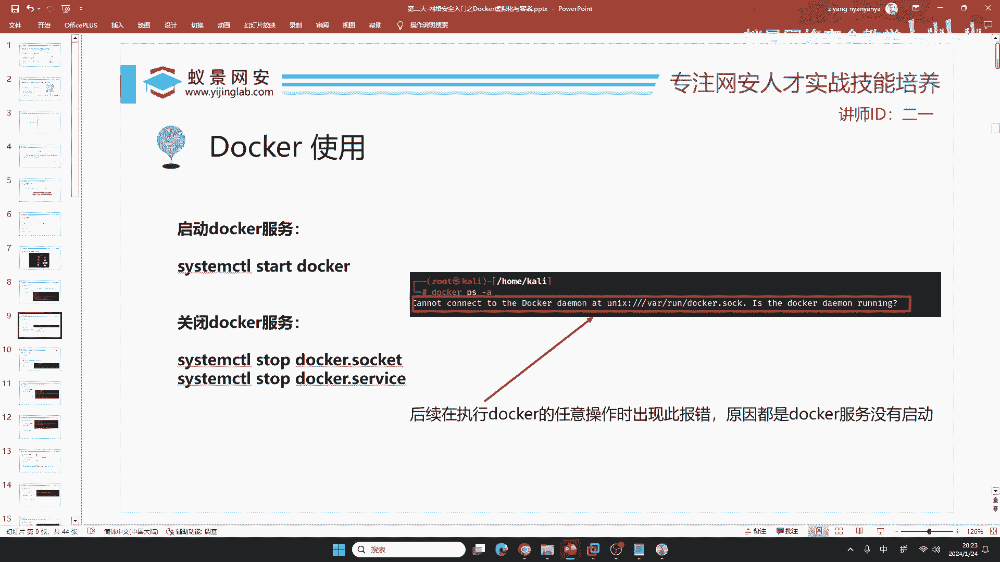

Docker怎么看有没有装好，就看Docker，输一个Docker回车，你看出现这个东西了，这个东西叫什么，叫帮助信息，就说明书，usage说明书的意思，你看到这个玩意就证明已经安装好了。

这就是Docker，现在咱们来使用Docker。

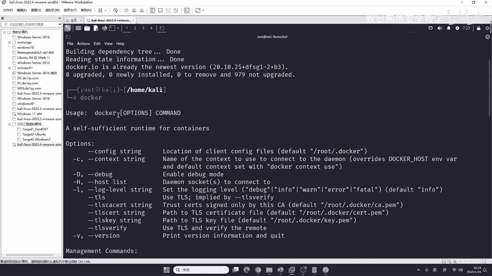

使用Docker，咱们必须要注意，Docker是4个部分组成的，但是有两个东西跟咱们的用户都无关，并且你现在是在使用Docker，不是在开发Docker，你是在使用它，用它搭靶场。

用Docker去找它的漏洞，找容器的漏洞，而不是说我要开发一个属于自己的容器，所以说对于使用者来讲，只有两个概念，一个概念叫镜像，一个概念叫容器，分别对应imagers以及container。

我们来看一下镜像，镜像你知道，就是跟虚拟机的镜像完全一样，不过这些镜像它非常的小，一个虚拟机咖喱可能两三个GB的镜像，但是咱们的Docker一般情况下都是，一两个都是一两个MB或者是一两百MB左右。

nmap扫描扫描啥玩意，扫描谁，扫描谁，可以扫，nmap是属于信息收集，它不属于攻击行为，所以说你对网站是可以进行nmap扫描的，容器没有必要扫，容器你nmap扫不了容器，nmap多少年的工具了。

你扫容器，你得用专门的扫描工具，扫看它有没有容器的未授权访问，是吧，容器的这些漏洞，容器的这些陶艺，你都得用这专门的云渗透的工具是吧，去进行扫，nmap扫漏洞，那扫不了Docker。

它里面扫的漏洞都是扫啥，扫一些比如说像SMB的漏洞，是吧，你应该知道你既然讲扫漏洞，你肯定知道SCRM的参数，是吧，它能扫这些，但是能不能扫，咱们的容器不能扫，它没有加，NSE脚本没有加。

你要是想开发的话，你可以自己加，毕竟NSE是开源的，你可以学，不会啥学啥就行了，在这里咱们的静态文件，就是说这个镜像，它固定的，就是说你虚拟机下载好，下载好，你不是得安装吗，安装之后，安装之后。

咱们如果是虚拟机，安装之后的东西叫啥，就叫虚拟机，虚拟机可以开机关机重启，是吧，还可以删除，那咱们Docker里面安装好的系统镜像，叫什么，叫容器，叫容器，你不要问他为啥叫容器，他想他想叫容器。

就是这样命名的，就是说你现在这个手机，为啥叫手机，他想叫手机是吧，好，我们来看一下，默认情况下，咱们的Docker镜像跟容器，都是空的，镜像跟容器都是空的，你可以看一下。

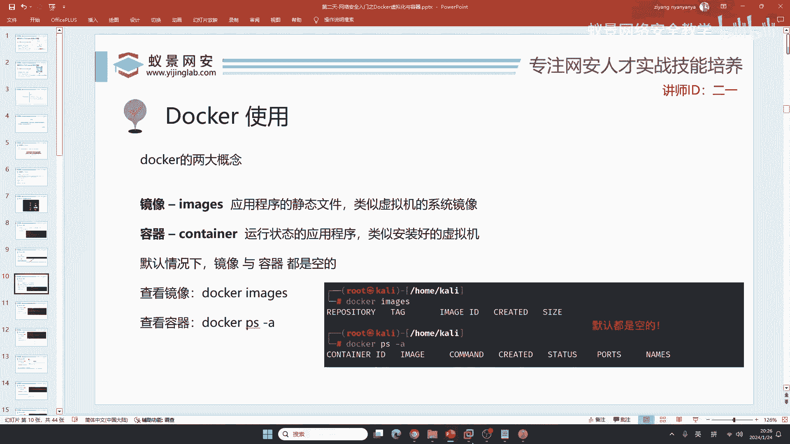

你可以看一下，怎么去看咱们的镜像，输入命令，Docker images，你可以按tab键补全，没有必要记，你要是记的话，那就完蛋了，命令多得很，是吧，命令多得很，你怎么记呢，Docker images。

我这里有一个，为什么有一个，这是老师在上课之前，测试Docker的时候，我拉下来一个镜像，同学们来看一下这个镜像，你们现在没有，一会我会教你怎么拉，一会我会教你怎么拉，别急，你看这个镜像。

这个镜像是一个，Ubuntu操作系统，加上Java，加上Supreme boot，它一共多少MB，多少MB，326，326，一个Ubuntu，一个Ubuntu，加上Java的运行环境，326MB。

你现在给我整个Ubuntu，你没有20个GB，你整不下来，这就326，这是Docker images。

如果你想看，我们的容器，容器是什么，容器是Docker containers，但是container，你好不好记，有的同学现在还在被abandon，是吧，你不好记，怎么办，PS-A。

PS-A就是替换咱们的container，这个英语的简写，它可以去查看，你这个系统Docker中。

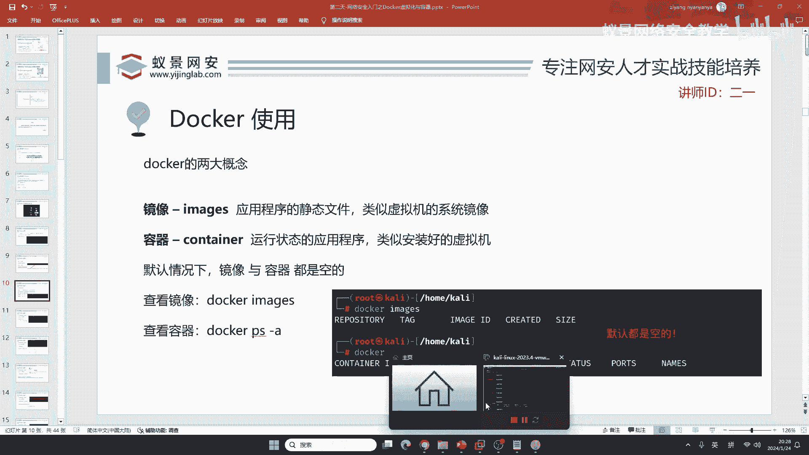

所有的容器，你默认有容器吗，没有容器，就像你安装了VMware workstation，它会自带一个虚拟机吗，不会吧，你默认安装的VMware workstation，它就是空的，它没有自带虚拟机。

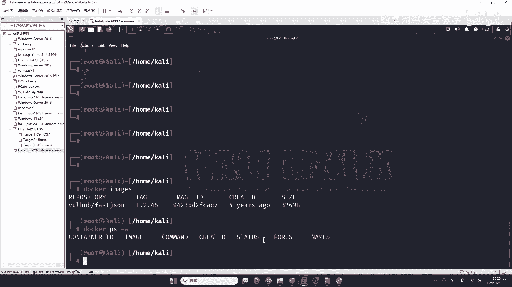

同样的道理，它也不自带容器，这时候我们怎么去下载一个，一个镜像，然后把这个镜像，咱们安装成操作系统，安装成的操作系统，就是可以开机关机重启的，这个东西，我们现在把它叫容器，一定要熟悉这些专业名词。

不要你去反着来，不要反着来，时代潮流怎么样，你就要跟着走，因为你不是创造者，你只是攻击者，现在我们来看，如果我们现在要下一个镜像，使用的命令叫下载的英语，下载一共有两个英语，一个是download。

一个是pull，它俩都有下载的意思，就是拉取，Alpine是什么，Alpine是一个Linux操作系统，一个发行板，就比如说同学们，昨天咱们认识了什么，认识了Ubuntu，认识了CentOS。

Deepin，Kali，Red Hat，红帽，麒麟，银河，统信，Alpine跟他们一样。

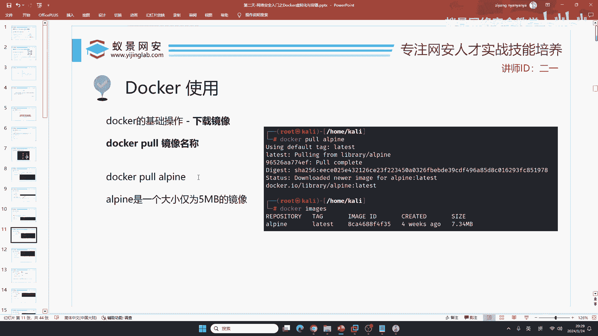

也是一个Linux系统，咱们来给它pull一下，Docker，pull，Alpine，回车，它就会自动的下载这个镜像，这个镜像你不要再去找了是吧，有同学说我东找西找，我下个Ubuntu还费劲。

我东找西找找不着，是吧，找不着，这个有多大，同学们看好，看好，Linux多大，7。38MB，7。38MB，红帽是一个操作系统，Red Hat，一个Linux操作系统，叫红帽，7。38MB，记住不是GB。

如果是GB的话，咱们这节课都下不完，它MB就是一个系统，现在同学你能不能举一反三，有同学说老师Ubuntu怎么下，来同学们，Docker，pull，Ubuntu，Ubuntu的英语会不会。

不会的话现在记住，Ubuntu，然后咱们回车，直接回车，同学们看好，一会我会教你，一会我会教你怎么找镜像，来看，一分钟时间都不到，我的Ubuntu就下好了，有同学讲，你下载的是哪一个版本。

默认叫做Lattice的，就是最新版，最新版，最新版，这一个Ubuntu的镜像，它有多大呢，我们images看一下，一个Ubuntu，77。9MB，这就是一个Ubuntu操作系统。

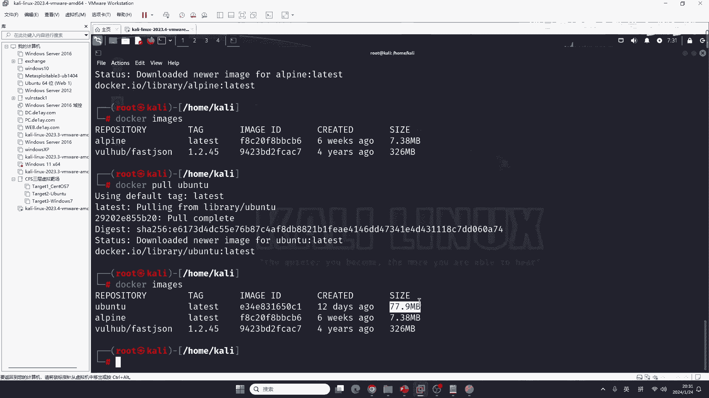

好，现在我们来讲，有同学现在发现问题了，老师你这里只是讲这几个，如果我想下Readheart，或者是我想下老版，我不想用最新版的Ubuntu是吧，我想用个老版，我怎么办呢，我上哪找，是吧，不知道上哪找。

这时候老师要给大家讲两个东西，第一个就是镜像，都在哪，镜像，全部都在Docker Hub这个网站上面，就比如说像Github，Github是保存咱们开源的，代码的一个公共仓库，Docker Hub。

它就是一个保存，所有的Docker镜像的一个网站，但是这个网站在境内，就是你在中国大陆地区，默认的网络环境是无法访问的，为什么无法访问，这里是不可抗因素，在直播的课程中，无法提及，希望大家理解。

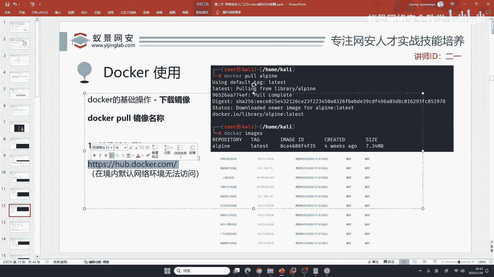

无法访问这个网站怎么办，等一下老师会给你们讲。

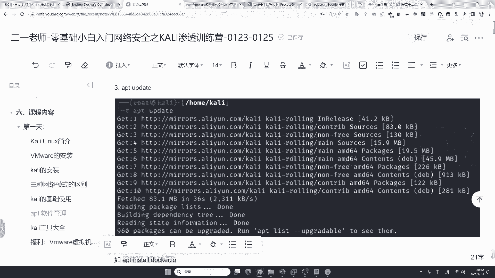

你不要急，就包括你下载卡住不动是咋回事，我都跟你讲，都跟你讲，首先咱们打开这个网站，你看我打开就行了，你们如果，你们如果就是讲，我没有特殊的网络环境，没有特殊的网络环境，因为你打错了，是images。

你看你打的英语打错了，好吧，这个images你打错了，我们来看一下这些镜像，同学们，Alpi我讲了，是一个Linux发行版，Nginx同学们听说过没，它是个什么，它是一个Web应用服务器，是不是。

Ubuntu你知道，Python，是个人都知道，Python，我现在我看小学生，幼儿编程，别人都讲Python，都讲Swift，你还能不知道吗，是吧，Python你肯定知道，Redis一个数据库是吧。

Postgres也是个数据库，这也是个数据库，Node就是JavaScript的服务端，是吧，Httpd这叫Apache，MongoDB是一个非关系性数据库，MySQL你知道，没压岁钱了，是吧。

没压岁钱了，就是这个数据库，剩下的都是常见的开发，所使用的软件，比如说OpenJDK，Golang，还有WordPress，Deepin，CentOS，PHP世界上最好的语言，等等，一共几十万个镜像。

一共几十万个镜像，你现在想干啥，你就干啥，有同学说我不知道我干啥，你听我讲，听我讲，现在咱们问题来了，很多同学，因为你默认的网络环境，无法去访问，咱们就要想办法，怎么想办法，第一个。

我们使用Docker加速器，要注意一件事情，Docker加速器，它不能让你访问网站，它不能让你访问网站，它只能让你在下载镜像的时候，比较快，有同学讲，你下载镜像比较快有啥用，网站访问不到。

我都不知道下载哪些镜像是吧，我快有啥用，就干等着着急是吧，你不要急，我后面都会跟你讲，你要下载哪些镜像，你现在先别急，先跟着我的思路听，咱们找加速器，因为你们很多同学是校园网，很多同学是校园网。

校园网的话，你尽量使用阿里云的加速器，为啥，就是阿里云跟腾讯云，你们都有账号，那账号你QQ没有，阿里支付宝没有，你没有支付宝吗，有吧，有支付宝，你就能登陆阿里云，因为他们都是阿里。

现在咱们登陆到阿里云之后，点击控制台，怎么登陆我就不讲了，你支付宝扫码登陆，你还能不会吗，现在我们来看，登陆到阿里云，登陆到阿里云之后，咱们一看阿里云东西，老多了一大堆，我告诉你，不是你看着头疼。

就老是看着也头疼，这个东西太多了，太多了，咋办呢，咱们要在这里搜一个东西，叫做容器，你今天学的是啥，你今天学的是容器，在容器里面，咱们找到一个地方，叫做容器镜像服务，看到没，容器镜像服务，ACR。

找到它，找到容器镜像服务之后，咱们点开，点开之后。

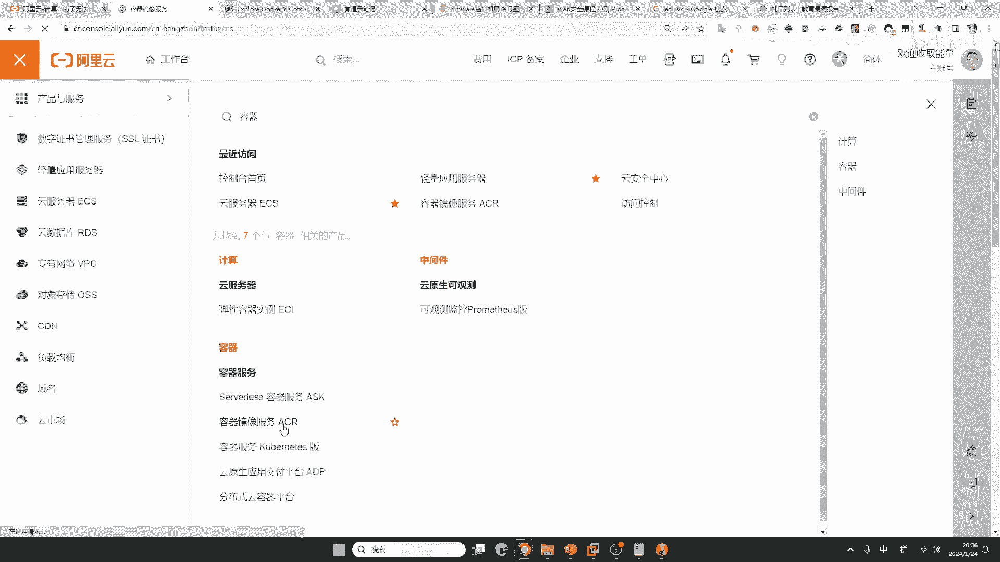

咱们不要买这个东西，但加速机是免费的，你不要买。

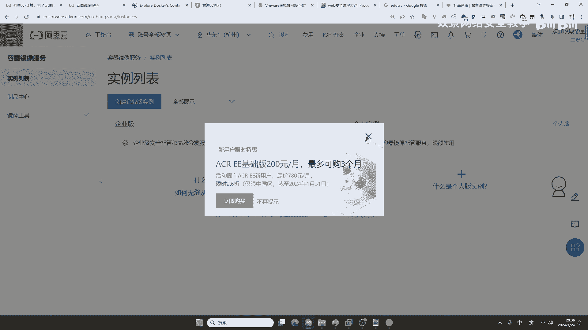

买这个东西跟咱们渗透没用，没有用，咱们点镜像工具，镜像加速器，这里有加速器地址，有同学讲我跟不上，老师你慢点，你别急，这个东西我客户都会给你，全部的笔记都会给你，网址都会给你，你不要急，好。

现在你没有支付宝，淘宝有吗，淘宝有吗，这个东西你还是注册一个，注册一个，同学，这个东西你以后用得着的，用得着的，加速器的地址，加速器的地址，每一个同学都是不一样的，每一个同学都是不一样的，怎么登录。

你点击上面的登录就有了，扫码登录，支付宝扫码登录，怎么注册支付宝，还要我教吗，同学们要不要我教，注册支付宝，不需要吧，这个地方，然后这里加速器的地址，每一个同学都不一样，每一个同学都不一样，知道吧。

每一个同学都不一样，这时候你要用自己的，有同学讲我不想，我就想用二一老师的，可以我给你用，没关系，因为你即使用自己的，或用我的，它其实都是做的一个，CDN的资源，没有关系的，现在复制这个东西。

复制这个东西，复制这个东西，它怎么配呢，你看它下面有个操作文档，阿里云的程序员，它比较贴心，下面给了什么，Ubuntu，CentOS，Mac，Windows，有同学讲你的Kali不给，怎么回事，同学们。

Kali是什么系统，D-BAN，D-BAN是什么，Ubuntu，所以说就是它，现在咱们怎么配加速器，同学们看好，就这那么多命令，看这一大堆命令，你复制，你记住不要复制一句，你全部复制过来，不要给它摊少。

不要摊多，也不要摊少，全部复制过来，右键复制，右键复制之后。

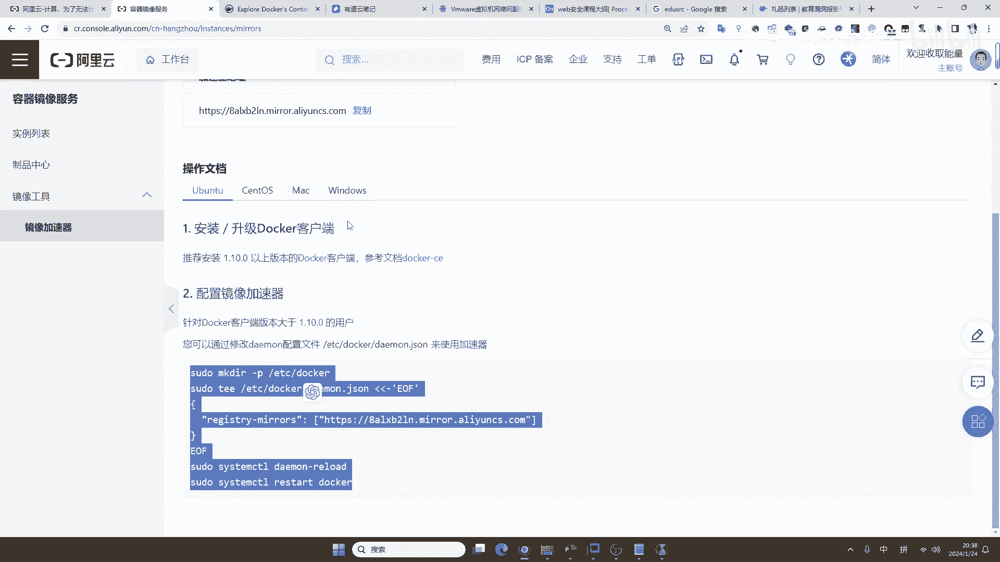

回到Kali里面，看好我的状态，老师现在是root用户，root用户，然后粘贴，粘贴是paste，粘贴selection，paste selection，就粘贴的选项，好，咱们粘贴过来，你看这个乱了。

乱了怎么办，按回车，按多按几次回车，你按到它结束为止，按到它结束为止，你把它全部粘贴过来之后，你多按几次回车，按到它结束为止，这时候加速器就配置好了，加速器配置好了，咱们应该如何的去，进行一个尝试。

如何进行尝试，同学们注册个支付宝，你得注册支付宝，不然的话，你们以后挖不挖漏洞，同学们想挖漏洞的，扣1，想挖漏洞的扣1，快点，挖漏洞找谁挖，挖百度，挖阿里，你挖不挖阿里，想不想挖阿里，想不想挖百度。

想不想挖爱奇艺，想吧，这些漏洞，它给你打款怎么打，百度怎么给你打款，百度怎么打款，给你打到你支付宝里面，是吧，它不是打到你的银行卡，它是打到你的支付宝里面，你到时候说我支付宝都没有，别人想给你钱都费劲。

是吧，所以说你还是注册一个支付宝，给你代收钱，再到时候别人给我逮住了，是吧，我还得给你交税，你这样说的话，我代收钱的话，你把税退给我，好不好，我给你代收，你把税退给我，是吧，这个税很高的。

你这个东西收入高，税就高，这是肯定的事，肯定的事，现在我们来看一下，你配好了怎么去看，你在这里输一个docker info，docker info，info是什么，information。

这高中英语是吧，information，information这里有一个叫做，咱们的注册源，你看一下这个注册源，这是啥叫阿里云cs。com，就是说这个注册源，它变成了阿里云的地址。

就说明你现在docker已经ok了，你的docker已经配置好了，以后你下就不会再卡了，我们举一个例子，好不，举个例子，比如说我拉一个啥，拉一个三头s，docker pool，三头os，拉一个三头s。

咱们瞅一瞅，瞅一瞅，这个加速器它是免费的，所以说你也不要指望它的速度多快，像你的校园网，是吧，本身速度就慢，然后你再整一个是吧，再整一个加速器，然后它也不可能达到千兆的速度，它也是正常的速度。

它不是说非常快，也不是说卡的用不了，这些都不会，来看三头s，三头s多大，images，不要打错，打错了就不会显示，三头s231MB，231MB，你会觉得，老师这三头s太坑了，它231MB。

Ubuntu就77，它凭啥这么大，这是因为三头s的内核，是经过二次打包的，你们如果看过linux内核，自己就知道了，三头s跟red heart，它俩比较特殊，它俩特立独行，知道吧，除了它俩。

咱们见到的linux，都长一个样，它俩是变脸的，知道它俩是变脸的，三头s，还有，这样一个，Ubuntu，你的校园网把steam都给封了，都给锁了，这太狠了，是吧，上大学不给打游戏，谁上大学不打游戏。

你在以前，你上大学没有电脑，你也会打，是吗，图形化界面没必要。

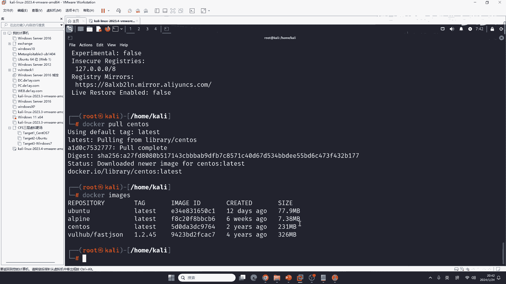

图形化界面，除了占你的内存之外，还有就是花里胡哨，花里胡哨的，不过也好看，也好看，现在加速器，我给大家讲完了，这个就是，愉快的下载镜像。

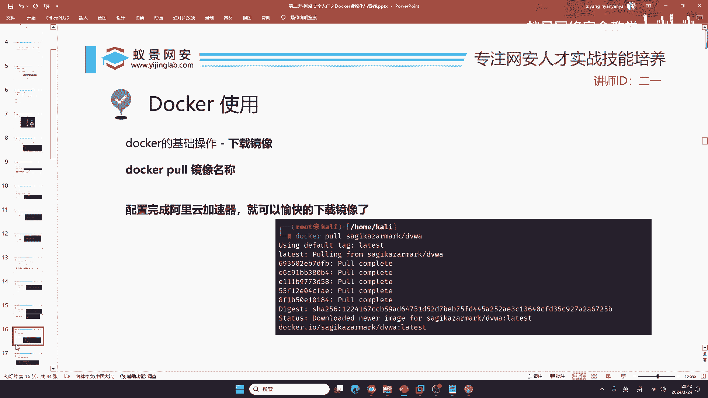

愉快的下载镜像，同学们来抽个烟，现在咱们讲的是啥，讲的都是下载，都是下载镜像，扯了半天，咱们还没讲，怎么去把镜像运行起来，我迫不及待的，要去用镜像，搞点活，搞点事情，是吧，比如说我安装个扫描器都行。

就是说安装个漏洞扫描器都行，是吧，安装到跟虚拟机一样。

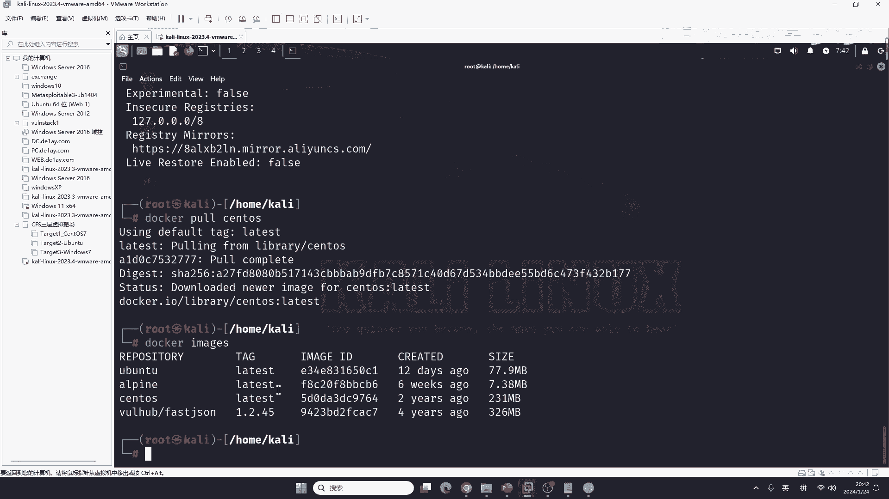

那现在怎么用呢，卡住了不动，卡住了不动，就是你加速器没配，你网不行，知道不，你的网不行，校园网的话，你们必须要用加速器，同学们你们发现了没，刚刚老师在配置加速器之前，我是不是也能用，是不是也能用。

我这里是长沙联通，即使不用加速器，也很快，你们如果是校园网，讲这个东西，就是给你们大学生讲的，如果你是自己家里的带宽，什么电信，电信，1000兆的电信，基本上裸联就行，裸联就行知道吧，你校园网。

你跟你的室友，你跟你整个宿舍，你跟你整栋楼，用的都是同一个网，你说能卡不卡，你说卡不卡，但你能拉个专线吗，校园网是吧，而且他还给你限制，还给你限制，不能让你打游戏，不能让你访问一些，什么访问一些。

什么奇怪的网站，是吧，这些学校肯定要，有同学讲，我用校园网，整些奇怪的活，看一些不良的网站，我告诉你，所有的校园网，都有上网行为管理，就你耍的那些花招，你的学校的机房，都能看着，知道吧，都是能看着的。

都是能看着的，有的学校没有，有的学校没有，我只是举例，你不要以偏概全，好吧，我只是举例，现在咱们来瞅一下，怎么去配置一个，怎么去配置一个网站，首先咱们同学们，关于咱们的靶场，有同学抗拒打靶场，有同学说。

老师我不想打靶场，我上来，我就想渗透百度，我就想渗透谷歌，你这个路径就错了，你打游戏也不能这样，你打cf第一关，也是教你怎么跳，怎么前进，怎么开枪，怎么换弹匣，是的，你肯定要打靶场。

咱们的网络安全靶场有哪些，网络安全靶场有哪些，比如说同学们可以说，你可以大胆的说，像dvwa是吧，dvwa，还有什么socore label，还有什么upload labels，这都是一些开源的靶场。

是吧，upload labels，包括什么皮卡丘，这些网络，这些就是网络的靶场，这些靶场超级多，成千上百个，有同学讲，老师你这讲的太基础了，dvwa我不会打吗，我知道，同学们，绝大部分人都会打dvwa。

我知道你很厉害，你会打，但是这些靶场有什么特点，同学们，这些靶场有什么特点，都是php，都是php，php是世界上最好的语言，这句话是有双引号的，你不会没关系，老师教你，你要是都会了，也没有必要听了。

是吧，你都会了，你都挖掘了，早发财了，你听这一节课，够你赚几万块钱的了，你还得听了，是吧，就是因为你不会，你才来到，我才跟你讲，是这个道理，闻道有先后，是吧，闻道有先后，现在我们来看一下。

不是皮卡丘加密，皮卡丘这个意思多着，任天堂也是皮卡丘，你这个东西，你不能把它的同名词，认为是同一个东西，这些靶场都有个特点，就他们全是php，现在我请问大家，在真实的互联网上，真实的互联网上。

php网站多吗，大家认为以后自己挖src，或者是自己做渗透，自己打内网，同学，你如果觉得php多的，你可以扣1，如果你觉得php不多的，你可以扣2，同学们，摆出你的想法，php在渗透测试中多不多。

漏洞挖掘中多不多，同学们，太棒了，太棒了，反正我建这么多年，10%，10个里面有一个能撑死了，10个里面能有一个就ok了，php，基本上没有，你现在你看，你说有同学讲你瞎扯，瞎扯。

boss直聘同学们知道吧，现在搜网站开发，你看一下，岗位，你看一下，字节跳动，百度阿里腾讯，他们招开发，有没有写php这三个字母，没有吧，别人都招什么，招java，招golang，招python。

招ruby，招node，是的吧，字节跳动主要的语言是什么，字节跳动主打的语言是什么，是go，就golang，同学们知道吧，字节的主要的语言是golang，有同学说淘宝是php写的，我知道，淘宝淘宝。

在疫情期间，淘宝已经变成golang了，早都改了，你不要再讲淘宝是php写的了，别人早都改了，都变成golang了，就这个go语言，所以说php不多，有同学讲，golang，简单，我也会，你现在。

python是吧，python的网站，python的靶场你怎么打，python有什么，python有几个非常出名的框架，一个是jango是吧，jango，一个是什么，一个是flask，flask。

还有现在的网红，现在的网红，fast，api，这个玩意真的是红到极限了，是吧，这个东西真的红到极限了，fast，api，同学们不知道的话，你现在知道一下，你现在知道一下，然后java，java。

比如说stress2是吧，supreme，supreme boot，supreme mvc，supreme，打错了，supreme boot，是不是，java写的，还有就是go写的是吧，go写的。

比如说grm框架，写的网站，这些网站靶场怎么打，你都会吗，都会吗，不可能吧，你说你现在刚入门一年，你都会，你开发也不能都会，所以说怎么办，你现在你搭一个php没关系，我能搭，你搭python搭java。

搭go，你都搭，不太方便吧，所以说你都不会怎么办，都不会，咱们慢慢来，你不可能说一天就学会，或一年就学会，咱们慢慢来是吧，java给你介绍一个webgoat，你把这个打完，java你基本上就差不多了。

webgoat，webgoat这个东西，给你介绍一个，好的，那我们现在来看怎么搭，我们先来讲php的，先来讲php的，没关系，你今天我告诉你，如果你零基础，你能听懂，一点，就是我今天这一个多小时说的话。

你能掌握住两三句，你能觉得，对你稍微有点帮助，或者是启发，或者是启发，这一点很重要，你说我讲的技术，未来10年还会存在吗，我不知道，我要是知道，我自己买彩票去了，我赚大发了，我不需要搞网络安全了，是吧。

我直接买股票赚大发了，那为什么还要学这个东西，就是因为我不知道，技术的更新很快，你主要是掌握学习技术的方向，还有这个东西，像dvw，你都知道吧，同学们，很多同学80%都知道，别人知不知道，肯定知道是吧。

肯定知道，所以说dvw，我猜他，就有刀客，有没有呢，我给大家搜一下，我给大家搜一下，在这里我直接搜dvw，直接搜dvw，他的搜索是需要时间的，我们需要等待他的搜索，好，搜dvw之后，你看一大堆。

这一大堆，哪一个是的呢，其实全部都是的，我要下哪一个呢，我一般情况下，我比较喜欢从重，就是说他哪一个下的多，我就下哪一个，比如说500k，500k多少万人下，所以说我就下这一个就完事了。

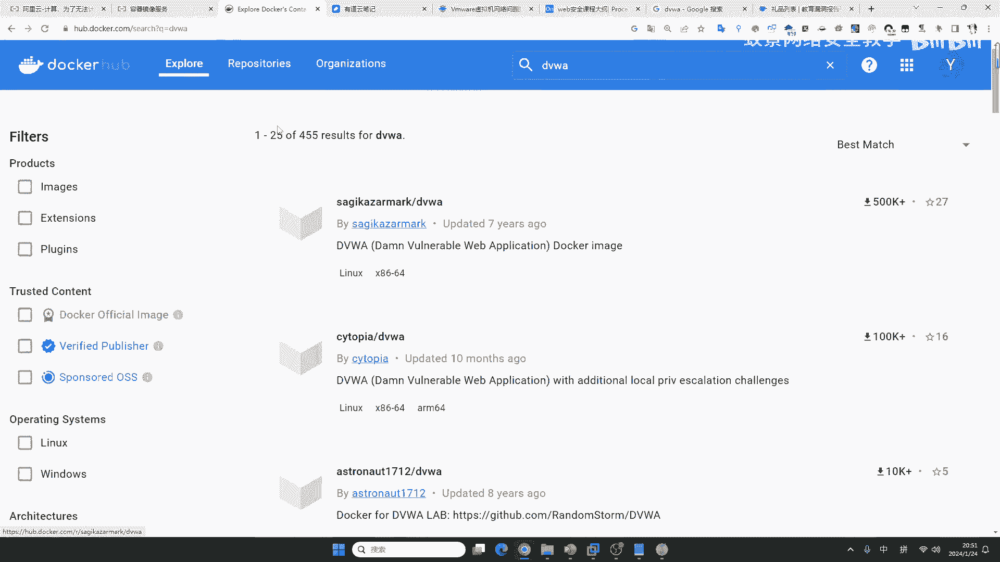

对，还有一种方法，同学讲得非常正确，有同学讲，老师我访问不了这个网站，访问不了这个网站，以后你会知道的，但是这个直播，希望大家能理解，咱21老师讲不出来，讲出来，第三节课就没有了，你就听不着了，知道吧。

所以说我不能去讲，希望大家能理解，希望大家能理解，刀客search，我们可以搜是吧，dvw，这样的话也能搜，你看这么多，是吧，这里有一个叫什么，这里有一个叫做标星数，就是收藏数，是吧，收藏数。

所以说我们就随便下一个就行了，下一个，这是镜像的名字，你怎么下载它，之前我们讲过，dokkerpool3tos，dokkerpoolubuntu，这里怎么下，dokkerpooldvwm吗，不是。

咱们这里，它是有作者的ID的，就比如说老师的作者是21，我就会写21dvwm，这里，他的作者的名字就是他，你就不需要是吧，就不需要纠结，它啥玩意儿了，现在我们把它pull下来就行了。

dokkerpool，把它复制，粘贴，这些命令我都会放到笔记里面，你们不要急，整个的下载，它大概需要一分钟的时间，我们可以等它下载，看一下大家的问题，哪些比较简单，入门的话都简单，入门的话全部都简单。

做难的话，都难，你把它往难了去学都难，知道吧，你要是做简单的都简单，现在我们来看，加速器配置不成功的话，截图发到群里，课后给你写的，在这个地方，在这个地方，我们现在给它下载下来了，下载下来之后，C语言。

如果你是做渗透测试的话，C语言，如果你是做渗透测试就不用学，如果你是做渗透测试就不用学，好吧，有同学讲，C语言不用学吗，你学了有啥用，是吧，你要有方向，有同学说我大学学了两年，学了两年。

我现在问你免刹怎么写，你会吗，会不会，免刹怎么写，我让你用C语言，给我写一个引擎出来，这C语言给我写个程序出来，你能不能写，会什么，数据结构的实现，什么双向链表，单线单向列表，你天天到别人公司里面。

写双向链表，什么公司需要你去写双向链表，没有公司需要，现在的公司是要你能够做出东西，你给那整链表有啥用，是吧，你要是学，咱往应用方向去学，应用方向，就是你能够有铲出，你要让你的上司，完成你的项目才行。

你整其他的，你输出个headword，谁要，没有人要，网络安全也是这样，你再牛逼，你逼逼的再多，给你一个网站，你打不下来，给你一个东西，你渗透不下来，那你干啥呢是吧，那就没办法了，那你只能做等保测评。

或者是一些不需要工具的，不需要工具的，对企业，他只会关注你有什么收益，只会有什么收益，好，现在我们来看，在这里，我们现在已经把它下载下来了，是吧，这个叫dbwa怎么运行，同学们看好，同学们看好。

首先在这里，我是二一老师，二一老师，昨天也是我讲的，只是今天我换麦克风了，你就听不出来了，这个东西，我换麦克风，你就听不出来了吗，咱们运行就是run，就是run，-dit，dit是什么。

dit是放在后台交互式的运行，其实你不用it也行，就-d也行，同学们，就是你这个参数要不要记，不要记，我都会给你，你复制粘贴就完事了，咱们-dit-d都行，你想加多加少都行，现在我们再加一个东西。

叫做-p，p叫做port，就是端口，就是端口，端口，这里我们要怎么去写，首先左边端口随便去写，端口的范围是0~655535，咱们随便写一个就行了，进去找班主任，我现在讲课没法拉你，咱们随便写个端口。

0~65535，咱选多少，我选12345，好吧，同学们，12345，冒号80，为什么它是80，后面，因为它是个网站，网站要么是80，要么是443，80你不能改，为啥不能改，就是因为你看老哥。

这个老哥是个外国人，外国人他已经帮你设置好了，就是80，你不知道怎么办，不知道，我现在告诉你，它就是80，左边随便写，但是你不要写超过65535，2的16次方，你不能超过它，好，现在我们再来看，还写啥。

加上咱们镜像的名字就行了，复制，copy，放到这里，右键粘贴，回车一下，看到没，同学们，我回车之后多长时间，一秒钟都不到，一秒钟都不到，就运行起来了，运行起来之后，咱们要访问什么呢，大家看好。

同学们看好，我是在咖喱里面打开的火壶，在咖喱里面打开的火壶，访问的是127。0。0。1，就是我自己，或者是说，192。168，就是说，127。0。0。1是怎么来的，同学们，昨天讲的命令。

IF configure，IF configure里面，你们看好，这几个IP都能用，你想用哪一个就用哪一个，比如说我这里写127。0。0。1，写192。168。80。148，都可以。

你想用哪一个就用哪一个，然后访问哪一个端口，同学们要注意一件事情，咱们访问的端口，是冒号左边端口，你不要问为啥，这就是这样规定的，就比如说为什么抖音，我双击一下是点赞，这是软件的设计，就这个样子是吧。

咱们不能纠结这个玩意，纠结这个玩意就是无底洞了，就如同你现在，在睡前，你闭上眼睛想。

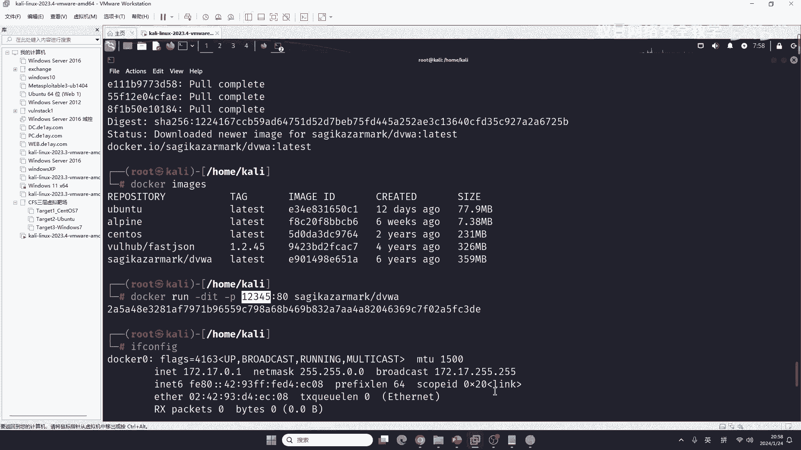

这个宇宙怎么这么浩瀚，宇宙怎么那么大，你就睡不着了。

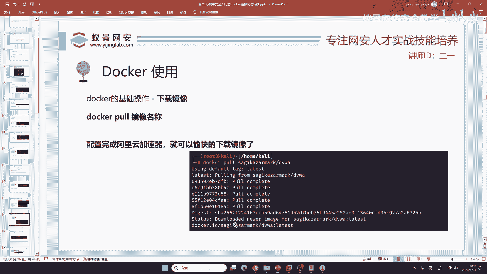

是吧，就疯了，这个东西，你千万不要去考虑它，是吧，然后咱们访问的时候看好。

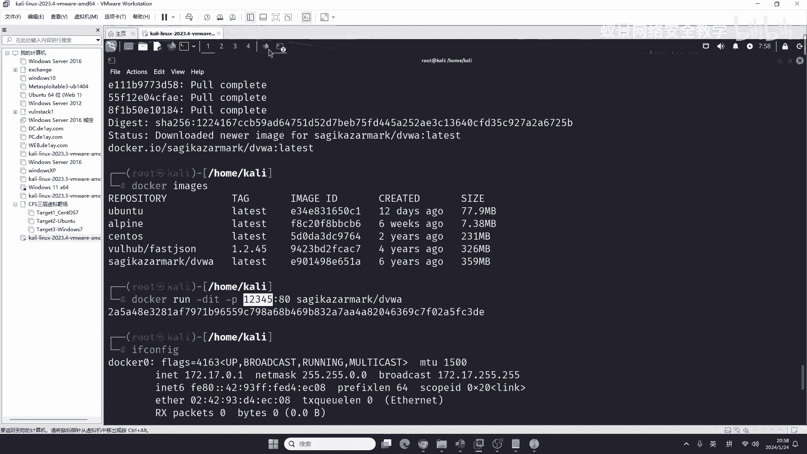

冒号加上英文的冒号，加上12345，记住，你这边写多少，你左边写多少，你这里就写多少，你写12346，你这里写的就是12346，咱们回车一下，看到没，dvw就装好了，它装好了，数据化，数据初始化是什么。

数据初始化是什么，好，这个同学讲广播地址，127。0。0。1，不是广播地址，广播地址是255，这个不是广播地址，他能不能访问，俗话说得好，实践是检验真理的唯一标准，你看我能不能访问，访问到了说明能不能。

可以，就是讲大家，你以后也是，你看到一个网站，它有没有漏洞，你不要去猜，你不要去猜，你去挖，你去挖它就行了，它有漏洞就有，没有漏洞就拉倒，没有漏洞就拉倒，同学们。

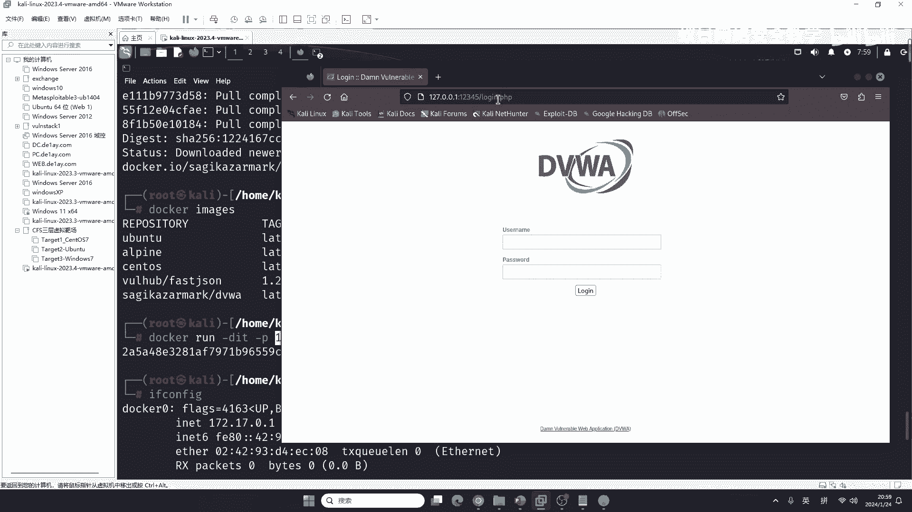

你们如果出现网络错误，一定要配好自己的加速器，你们校园网，为啥讲加速器，就是给大家，你校园网的同学准备的，我上过大学，当然我那时候上大学，大学没有这么管控，知道吧，没有这么多的管控。

什么要限制你的登录设备，扯淡，我们啥都没有，直接上网就行了，这网速比较慢，5M的网，5M的网，那实在是太早了，是吧，跟你们现在不一样，你们校园网应该也有，同学们，现在你们的校园网，有没有500兆。

有没有500MB，我想了解一下，就现在的校园网，有没有500M，就是那个速率，差不多吧，没有，现在都是多少，50KB，50KB，这也太过分了，你这个东西刷视频，都没法刷，是吧，50KB，这学校也太坑了。

10M，10M也太垃圾了，是吧，10M的话，你下游戏，我估计都抖音都给禁了，现在学校这么恐怖了吗，还好毕业的早，还好毕业的早，是吧，还好毕业的早，那你们挺可怜的。

就是学这个东西，还是大家要突破这些网络的瓶颈，以后或者是你们放寒假，回到家是吧，网络就变好的，或者是以后你们工作在办公环境，以及你自己有了家庭之后，你的网络就非常快，是吧，非常快，你可以办一个签照的。

这样的话你渗透，你挖漏洞，都非常快，非常快，非常快，七八十MB每秒，这非常快了。

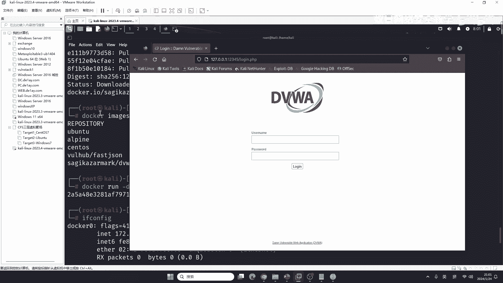

是吧，这非常快了，现在我们来看一下，我们再瞅瞅好吧，现在你只是装了一个，装了一个之后，同学们，你比如说现在这个玩意。

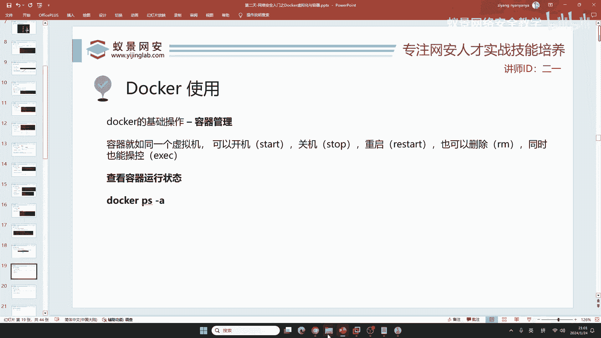

我不想要了，不想要了，咱们一个网站，或者是一个虚拟机，它可以干啥，同学们，你就现在就把容器，理解成一个虚拟机。

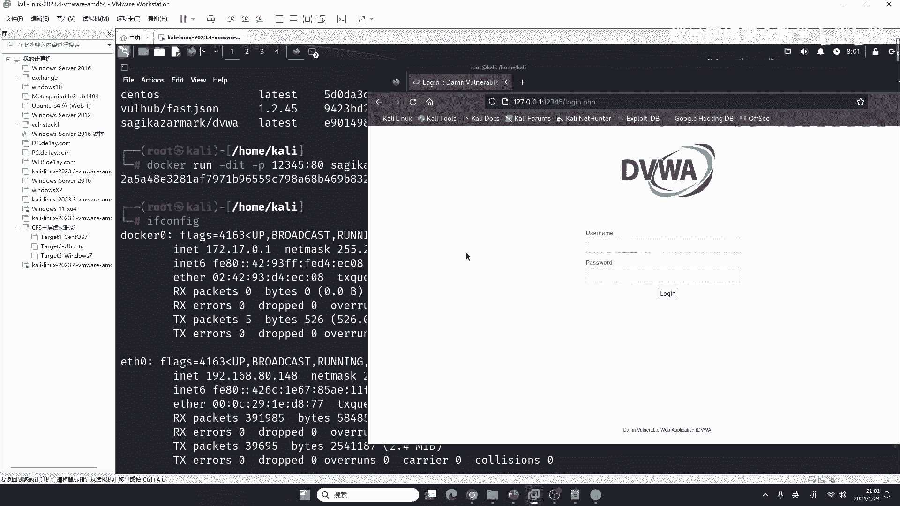

虚拟机它可以干啥，可以关机重启，这里能不能关机重启，当然可以了，怎么关呢，首先我们要看一下，就是自己的电脑，自己有哪些容器正在运行，怎么看，就是刚刚讲过的，docker ps-a，这个命令去看。

你看这个容器，它是在运行状态，怎么看呢，这里有个状态叫status，叫状态的意思，它的一个显示叫up，five minutes，就是已经打开了5分钟，我现在已经把dvwi运行了5分钟，然后是它的端口。

12345，咱们端口看箭头，左边的端口，12345，这里就是咱们的正在运行的状态，如果我想把它关闭怎么办，同学们看好了，想把它关闭，很简单，docker，关闭是什么，stop，stop。

然后咱们关闭是什么，不是docker kill，不是docker kill，kill是杀死的意思，stop是关闭的意思，来同学们看好，dvwi它前面有一个叫container id。

container id，它是一个随机的，就是id编号，随机的编号，它前三个字母，它是绝对不一样的，比如说我这前三个字母是多少，是2i5，我就写2i5，按一下回车，按一下回车之后，它关机是要时间的。

记住这是关容器，不是关你的咖喱，不是关你的咖喱，这是把咱们的dvwi关掉，关掉之后你再来访问，咱们打开火壶，来给你访问一下，刷新，是不是访问不到了，访问不到了是吧，访问不到了，好，那现在咱们再来看。

如果想把它开启怎么办，开启是什么，开启就是start，2i5，回车。

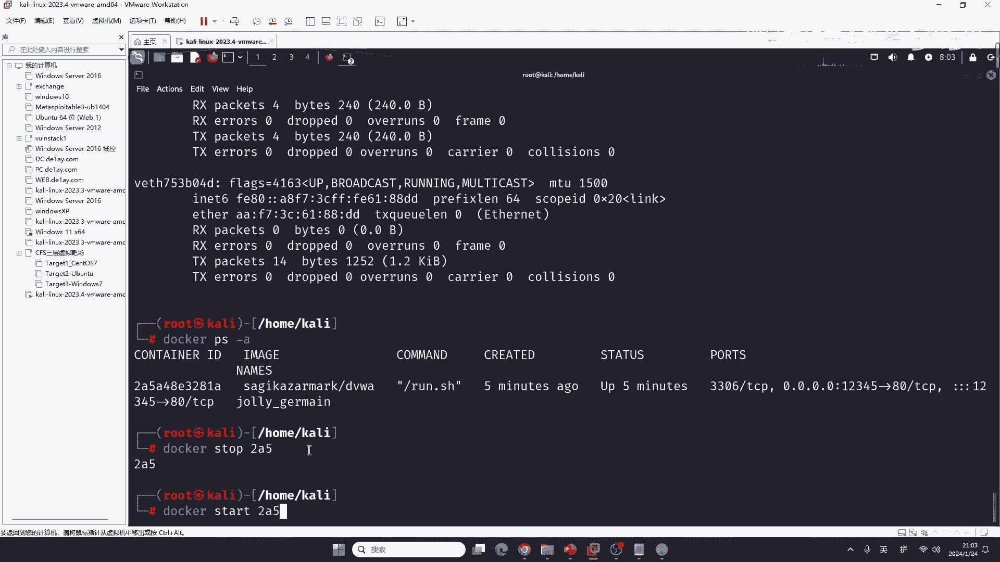

再来刷新，是不是又打开了，又打开了是吧。

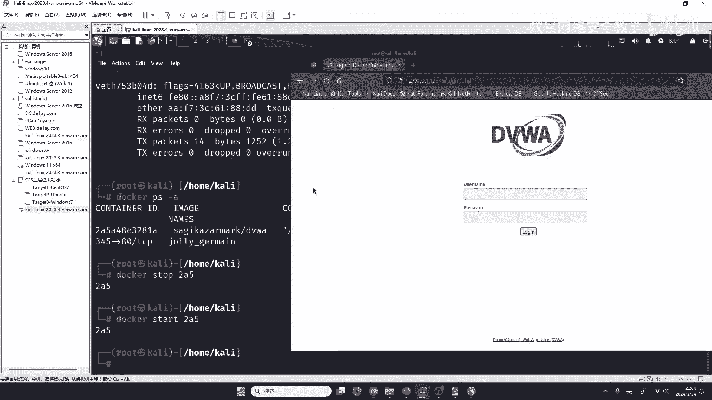

又打开了，没问题吧，没问题是吧，你看这个关机开启多快，如果说我现在不想要它了，我想给它删掉，怎么删，docker rm-f，加上2i5，有的同学他喜欢缺少东西，缺少东西的话，就是说。

如果你前面不加docker，删的就是你自己的电脑了，前面一定要加docker，回车，这时候我们这个容器就被删掉了，我们再来docker psa看一下，docker psa，你可以发现，这个容器没有了。

就是被删掉了。

你再刷新，那肯定也是无法访问的，刷新访问不到了。

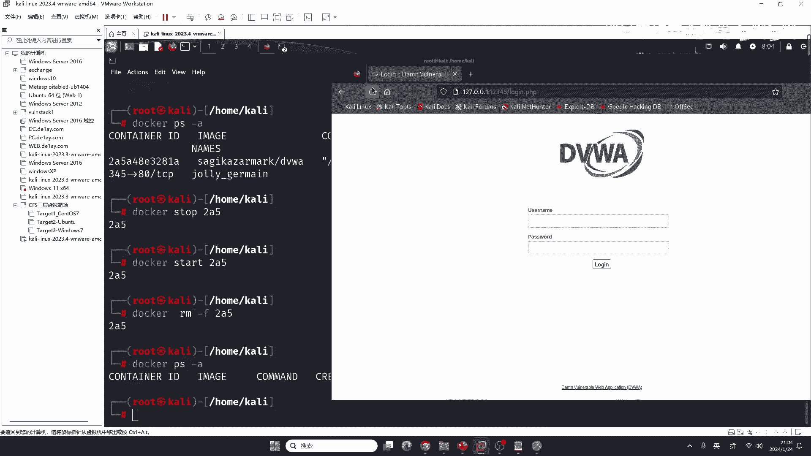

这就是因为容器被删掉了，这时候我们只是举了一个简单的例子。

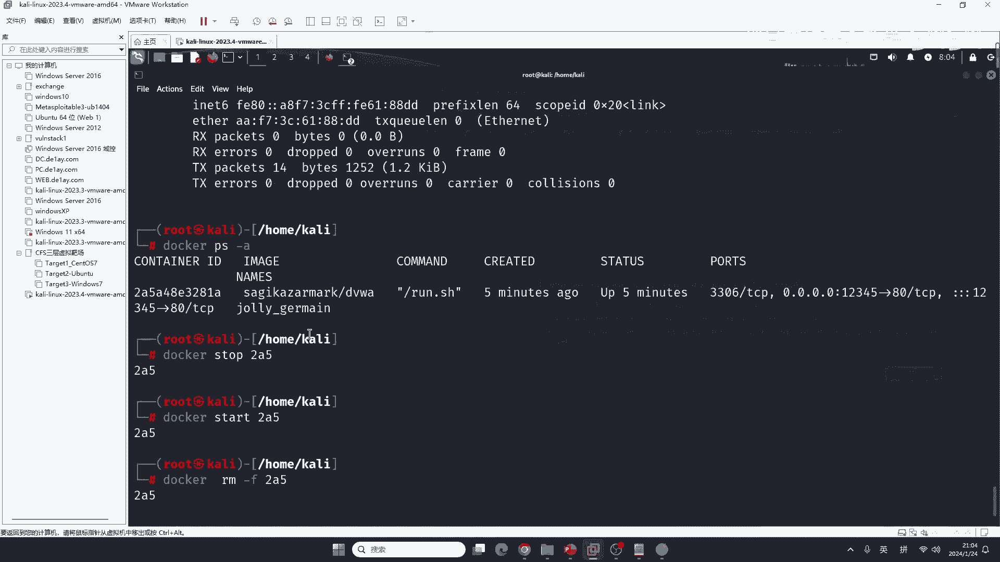

搭建了这个靶场，叫dvwa，现在它会搭建了，同学们，所有的靶场，你就都会打了，所有的靶场，你就都会打了，都会打了，同学们来看一下，比如说举个例子。

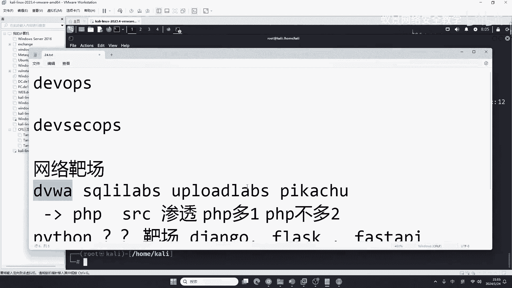

举谁呢，咱们举一个头举一个尾巴，比如说我举例皮卡丘，皮卡丘，很多同学都没有听说过这个靶场，因为它是一个不太出名的，不太出名的一个php的靶场，咱们怎么搭建它呢，还是老规矩，同学们看好。

docker search，search是什么，皮卡丘，可以的，可以的，你讲的这个东西当然可以，好，我们找皮卡丘，找皮卡丘之后，你可以发现这一大堆，这一大堆中哪一个是皮卡丘呢，前面两个都是的。

前面两个都是的，就是我推荐大家，就是说你看这里的stars，就是它的收藏数，它的收藏数越高，说明它越靠谱，你会讲，这些人是干啥呢，他在糊弄我是不，不是的，因为这个docker hub，就是谁都能访问。

谁都能上传，你现在你注册一个账号，你也能去创造自己的镜像，和自己的靶场，开放给互联网的人去使用，这就是docker的魅力，就叫做steam的创意工坊差不多，同学们应该知道，如果一个游戏。

它开放了创意工坊，就是让大家都来去创造，这个游戏就会蓬勃发展，长久不息，我们的docker也是这样，这些镜像，大家都能去做，我们现在是使用者，使用者怎么用这个镜像，复制下来，举一反三，举一反三，记得。

我们现在docker，docker，然后 pull，是在外网，但是我讲了加速器，我讲了这一个，就是说用docker加速器，阿里云的，让它变得更快一些，当然我在自己家里，我可以不用加速器，为了方便大家听。

我还是讲了一句，讲了一句，现在我们就能够把这个镜像，给它拉取下来，拉取的速度是非常快的，非常快的，没关系，没及时来的话，我会给到大家，到时候会给大家笔记，没关系，复制粘贴就行，这些都没必要记，记了。

也不是说就能够给你加薪升职，没这回事，你会用就行，现在咱们是不是又下了一个新的镜像，这个镜像叫做皮卡丘，它的大小是853MB，现在有同学就说了，老师，你一个巴掌就几百MB，我下10个巴掌。

不也是十几个GB吗，我的电脑吃不消，同学们，你们觉得这里的size，比如说我们现在下了一个皮卡丘，下了一个dvwa，一个是853，一个是359，它们占用的存储空间，是853加359吗，大家觉得是不是。

它俩占的存储空间，是不是两个相加，好，有同学能理解，不是，不是两个相加，为什么不是两个相加，我给大家讲一下，你看我这里有几个镜像，第一个是Ubuntu，Ubuntu它是77MB。

现在皮卡丘它用的操作系统是多少，操作系统，对，老师的语气其实就暴露了，我也发现了，我讲课的语气，你肯定能听出来是不是，你这个讲的也挺对的，皮卡丘它是什么操作系统，它是Ubuntu，是不是跟它一样。

有同学说我咋知道的，我这个东西我看过，我看过它里面的东西，你现在你就听我讲就行了，它里面是Ubuntu，因为这个网站它要运行，它肯定要操作系统，它又不是说里面整个php就能运行。

php它要运行在操作系统之上，所以说这里它也是Ubuntu，dvwa是什么，它也是Ubuntu，也就是说，他们三个，是不是情同手足，都是兄弟姐妹的关系，大家的内核都一样，内核一样的话。

咱们的docker就会自动复用，就是说，皮卡丘这个镜像，跟dvwa这个镜像，它里面可能有，200MB是重复的，它不会两次占用存储空间，就是说这200MB，它占用一次就行了，都在一个系统里面。

这就是docker的魅力，这就是docker的魅力，同学们知道了吧，对我们自己搭载kali，kali肯定是内网，kali肯定是内网，大家要是实际，你比如说你搭的靶场，你想给别人访问。

肯定是要做内网穿透的，但是你不能把你搭的靶场，给别人访问，你给他别人访问，不是找打吗，靶场是干啥，靶场就都是漏洞，你给别人就找打是吧，docker也能开它kali，docker也能开kali。

但是不建议，为啥，因为docker里面装的kali。

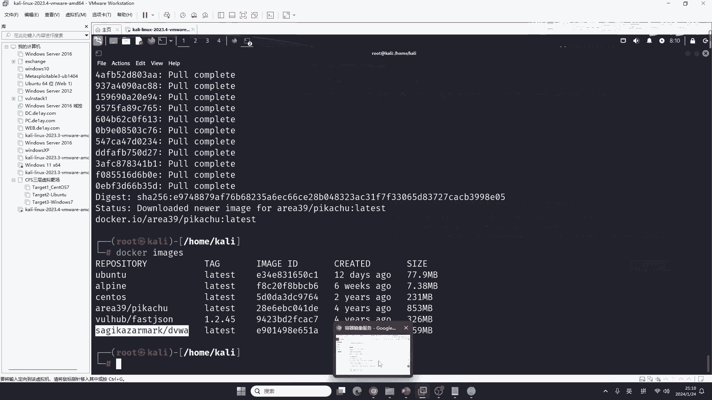

东西比较少，能理解了吧，就比如说有同学，在手机里面装kali，我知道现在很好装，但是你发现你装的kali，其实，它有点丢三落四的，它缺东西，如果你想装个完整版的kali，还得是买谷歌的pixel。

或者是一加的手机才行，是吧，还得买一加手机，或者是谷歌手机，这不是我想的，这是kali官方讲的，这kali官网讲的，我只是给你翻译一句而已，翻译一句，好的，这是咱们容器。

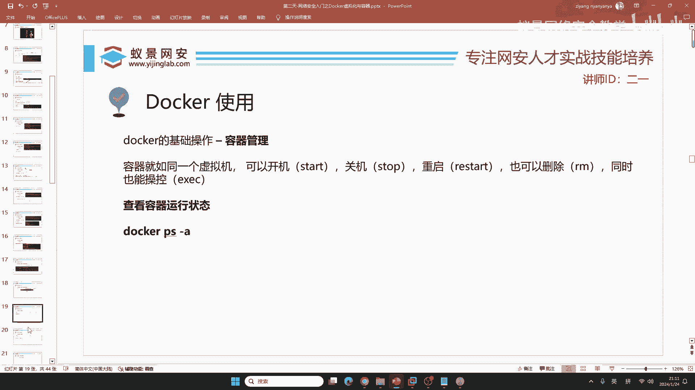

容器，你看一下，同学们，现在皮卡丘，我已经整下来了，整下来之后怎么运行，docker run -dit，dit -p，然后什么，端口是0~65535，随便选一个就完事了，随便选一个就完事了，我们比如说。

我选多少，我选一个12312，好吧，就叫它，然后右边写80，为啥要写80，因为它是一个网站，网站要么80，要么443，但是在内网里面，443端口是没有什么含义的，就是说你给它开443，没有用。

也正相当于是什么，光着屁股出腰带，多一道子没啥用，所以说咱们就是80，左边的随便改，右边的你就写80，然后加啥，加皮卡丘，加皮卡丘，咱们复制，往这一粘，不是这样粘，我重新演示一遍，复制皮卡丘的名字。

不能重叠，重叠就报错了，6万多个端口，你非得给它重叠干啥，不要重叠，运行一下，运行之后，咱们打开浏览器，访问什么，127。0。0。1，多少端口，我这里左边的写的是12312。

我们就访问12312，好会车，皮卡丘，就搭建好了，有同学讲，这里有一个汉字，叫皮卡丘还没有初始化，点击进行初始化安装，点一下，点一下，点一下，你看一秒钟就行了，是吧，几秒钟就行，这一个漏洞靶场。

我们就搭建好了，搭建好之后，你就可以去练习，比如说暴力破解，比如说像XSS CSRF，等等漏洞，你就可以练习了，但是，我们现在讲的，局部局限，同学们，局部局限，很局限，为什么局限，因为老师讲过。

这一个网站是什么，是PHP，现在有没有PHP了，当然有，只是占比少，你说没有PHP，那肯定是扯淡，那肯定有，但是占比比较少，未来，占比还是会更少，这个东西，就是皮卡丘和DFW，哪个适合新手。

都适合都要打，就全部都要，我全部都要，你不要去选一个，就全部都打，8080就是http网站的端口，8080，好，我们现在来看，既然皮卡丘跟DFW，你都能搭，怎么办，怎么打，你别急，现在PHP，怎么打。

咱们今天就90分钟，我要是把这些都给你讲完，估计得讲到明天早晨，21老师不要上班了，是吧，得请假，请假就得扣工资，扣工资头疼，所以说今天晚上。

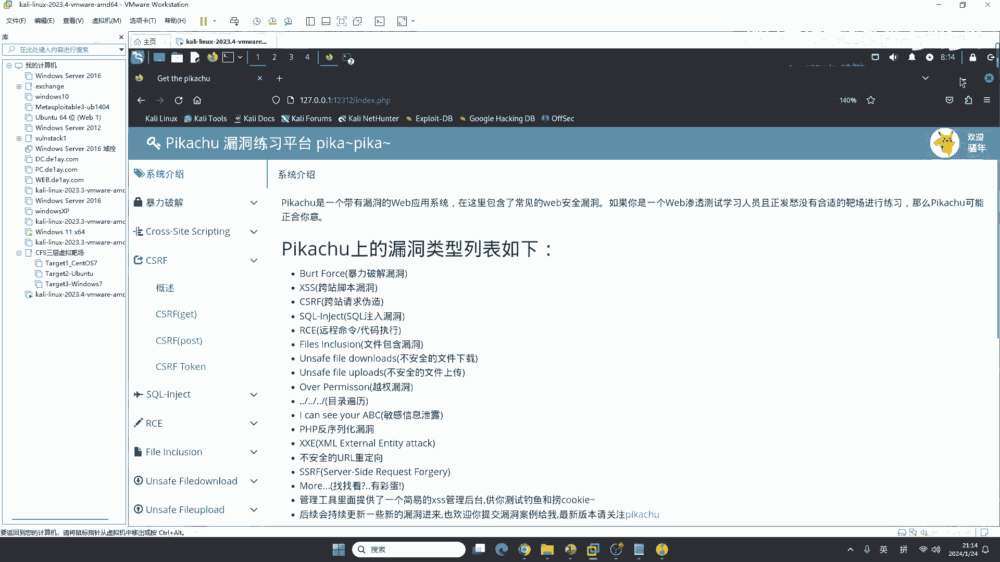

咱们先不想这么打，好不好，这些有弊兵，他就是PHP，就是PHP，windows上都装过了，kali上面还装吗，我建议你还是用docker装一下，为什么要用docker，因为docker它方便。

windows的话，你要做多余的配置，是吧，比如说我下面讲的，你就没有办法在windows上面打。

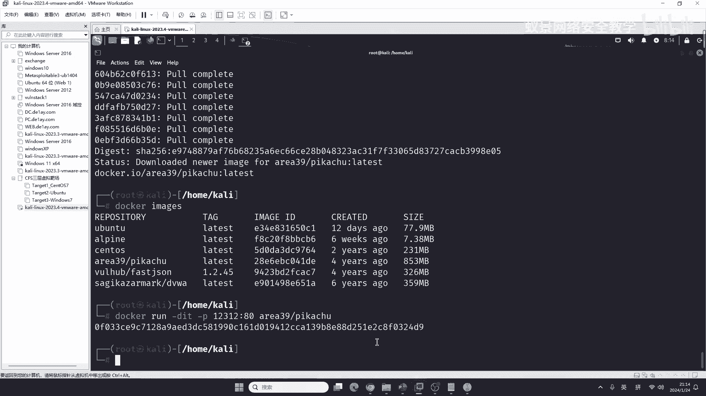

这些是什么呢，同学们，Java，Python，Golang，Node，这些靶场怎么打，没办法是吧，如果你在windows上面，我现在说，同学你给我打一个nodejs的靶场，你肯定一懵，是吧肯定一懵。

那node的靶场PHP肯定不行，PHP start，它就是PHP学习，我现在讲的是node，它不行，那不行怎么办，这里咱们要感谢开源的开发者。

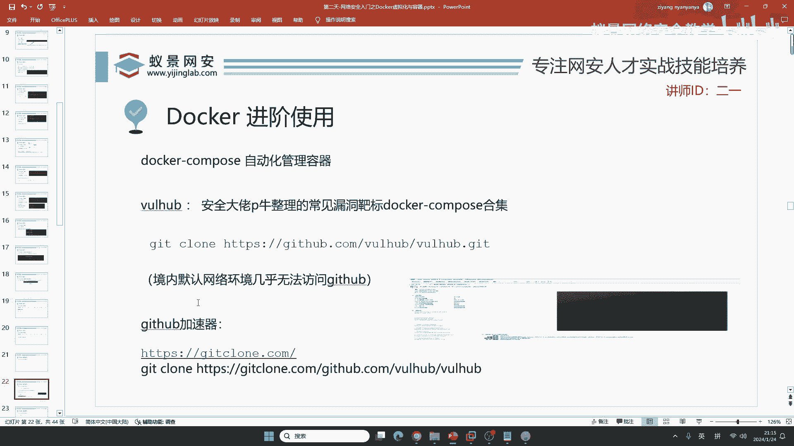