# 【零基础学网安】B站最全的网络安全教程，从入门到精通，学完即可就业，看完还学不会我退出网安圈！（渗透测试／kali渗透／内网渗透／黑客技术） - P17：8.docker进阶使用.mp4 - 蚁景网络安全教学 - BV1fctLevETn

开远的开发者 就是这个屁牛啊 这个屁牛这个人啊 以前是在国内 这个长亭这个公司，长亭啊 同学们知道不 知道的扣1啊 你们以后 以后如果有能力 你可以去长亭实习 可以去长亭上班。

长亭入职 来给你发一个16寸的苹果电脑啊 知道不 给你开一个16寸的苹果电脑，直接给你 是吧，有笔记啊 有笔记 笔记会发给大家 你不要急啊 就是说你没听清也没关系。

那现在呢 这个屁牛他做了一个东西啊 就是说 常见的漏洞啊 常见的漏洞全部都有，不管你是什么php啊 java 当然php比较少啊 为啥呢 因为这屁牛知道 现在你见到php网站的可能性还是比较低的。

他就不搞php的，所以说呢 他就主要就是java 主要就是java 90分钟 咱们，不远了哈 等会儿你不要急啊 不要急 我尽量讲快一点 好吧 尽量满足大家的需求 我讲快一些。

这个屁牛啊 他是把这个东西放到了github上面，github同学们应该知道 什么这个github出代码 是吧，但是啊 这个github逃不过他跟docker harbor一样的命运 就是在境内。

中国大陆地区默认的网站 访问他啊 时好时坏 有的时候就是访问不到 有的时候访问起来还ok，这时候咋办呢 这里有一个docker加速器啊 大家如果感兴趣的话 你可以用docker加速器。

不是docker git加速器 口误说错了啊 git加速器，包括呢 这个东西我也会，发给大家一份 发给大家一份 就是说你现在不想下 不想下 你从老师给你的链接里面下 就不要去。

纠结你的网络 无法访问了 非常方便 现在我们来看下载之后啊 咱们应该如何的把它搭建起来 同学们看好。

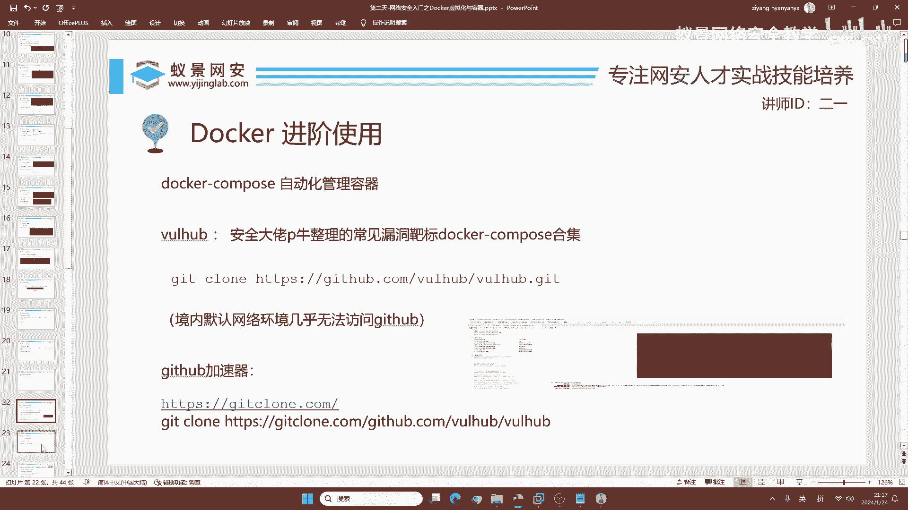

看好啊 非常简单 现在老师已经下好过了 已经下好过了 叫vul hub，这个文件夹，进到这个文件夹里面之后啊 进到这个文件夹里面之后啊。

这个文件夹怎么来 你们要么自己下 要么你用我的 然后给他拖到kali里面就行了，拖到kali里面就行了 知道吧 你能拖进去的。

你拖不进去 你复制粘贴也行 就是在windows中复制到kali里面粘贴就行了，别急呀 咱们才讲了一个小时，才讲了一个小时 如果有啥事的话 同学们 这个东西我尽量讲快一点 好吧。

不耽误大家上课 不耽误大家的时间 我尽量速放快一些 好 在这里呢 我们进入到vul hub里面之后 ls看一下，ls有同学说啊 这是啥玩意儿。

这啥玩意儿啊 如果你能全都知道 如果你能全都知道 那就说明你非常的牛逼，但是一般的人 他都不能做到全部认识，但是你肯定说不可能全部都不认识 我举个例子啊 比如说docker。

同学们 知不知道docker是啥 咱们这里今天就讲docker是吧，docker打docker，docker打docker之后又打docker 比较乱吧 比较乱 比较乱 但是我们可以不去问他。

这里有flask是python的靶场啊 python flask是python的一个框架，这是python的一个靶场 是吧，然后呢 我们再来看hadoop hadoop有的同学应该听说过大数据。

大数据是吧 大数据的靶场，java的靶场jackson的靶场 jackson是一个java的处理器 java的解析器。

jbox jbox是一个java的中间件 是吧 也是java的 然后还有其他的 比如说像liver，liver是什么 liver它是一个php的开发框架 是世界第一的php开发框架，php开发框架。

下面我们再来看啊logstreet 这里同学们应该知道是一个java的这个日志记录组件，java的日志记录组件 你在哪输啊 咱们又没讲这个soca注入漏洞啊 你在哪输的呀 这个同学。

你不能乱输啊 乱输到网站 你没有授权的话 别人可能就是会告你啊 你不能乱输，dvw输了还弹窗 你在哪输的呀 你首先你dvw要把它调成漏洞漏洞机 知道吧，要把它调成漏洞机 它默认叫impossible。

impossible是不可能的 是不可能的 知道吧 调成漏洞机soca injection 然后呢 输入这个东西就可以了，我看你好像输错了哈 里面没有空格啊 那单影号后面要有空格啊 单影号后面要有空格。

这个soca注入的问题 后面在群里问 好不好，就同学 因为咱们今天讲docker 有的同学啊 他这个时间太晚了 我要集中精力 先把docker讲好。

保证咱们这节课我能讲好 每一群找班主任 班主任呢 出来监应一下他 看一下这个同学，让他拉一下群 或者是怎么回事都行啊 我现在得集中精力给咱同学们讲课。

好的 这里mysoco是咱们数据库 是吧 数据库 数据库 一个非常出名的数据库 它有没有漏洞 漏洞一堆 怎么复现，通过这个东西复现 node 加把screen的服务端 php 你知道php是啥。

还有其他的 ruby 是吧 ruby是个什么，ruby是一个 日本人写的这个编程语言 你可能没有听说过 但是实际的用用还是比较广泛的 是吧 还是比较广泛的。

同学们不要急 你这个东西 你先听课 你能把那个班主任忙死了 而tomcat 这个加码的中间键，现在呢 我来给大家讲怎么搭建一个靶场 好不好。

比如说 我想去看tomcat有什么漏洞 我们就举个例子啊 我们就举个例子 你先看直播，先看直播下课再讲啊 你不要急 你不要催咱们班主任 好不。

你不要催咱班主任 我这个东西 包括咱们每节课的笔记 你得等我写好 才能给班主任 我现在讲课 你找他要笔记，那我讲课给你写笔记 不会吧 我讲好 我讲好 我才给你写笔记，你这个东西不要急啊 学习就是不能急。

这个tomcat啊 tomcat比如说，它是啥 它是加码的中间键 有没有漏洞 当然有 那这个地方 咱们应该如何，去搭建这个靶场呢 我们就cd到tomcat。

cd到tomcat里面 你ls看一下 漏洞都在这里 漏洞都在这里，漏洞都在这里 看到没 都在这里，不建议 不建议啊 你还是学一些比较有用的东西吧 他有的东西 应用性比较少 看好。

这些漏洞叫编号 就是你想 这世界上有，成千上万个漏洞 是吧 几亿个漏洞 不能说是上万了 几亿个漏洞 每个漏洞都得有编号呀 不然的话 就是咱人都有身份证号。

不然不搞丢了 是不 搞丢了 那在这里啊 我们就需要在这个地方，我们就需要在这个地方啊 去选择自己要附件的漏洞，就你选一个就行了 因为你现在还不会打 是吧 你先学会搭 你再打。

还没学会走呢 就想跑 是吧 那怎么可能呢 比如说呢 咱们先在这里啊，去cd到一个2020年的漏洞 咱们就整个新的 好不好 cd到cav2020。

然后1938 cd到这里面之后 怎么把这个漏洞去搭建起来呢，同学们啊 如果仅靠docker是不能搭建他的，因为啊 一个java他需要的东西太多了 你的docker啊不太行。

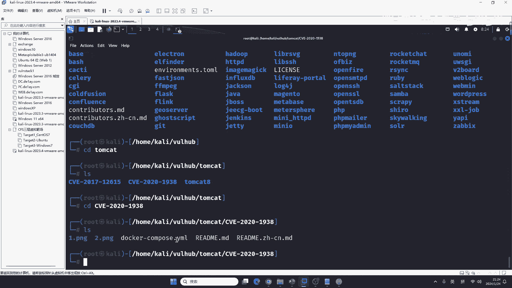

这时候怎么办 咱们要安装一个新的工具 叫做docker-compose，docker-compose怎么安装，你已经学会docker怎么安装了 我相信你也会docker-compose。

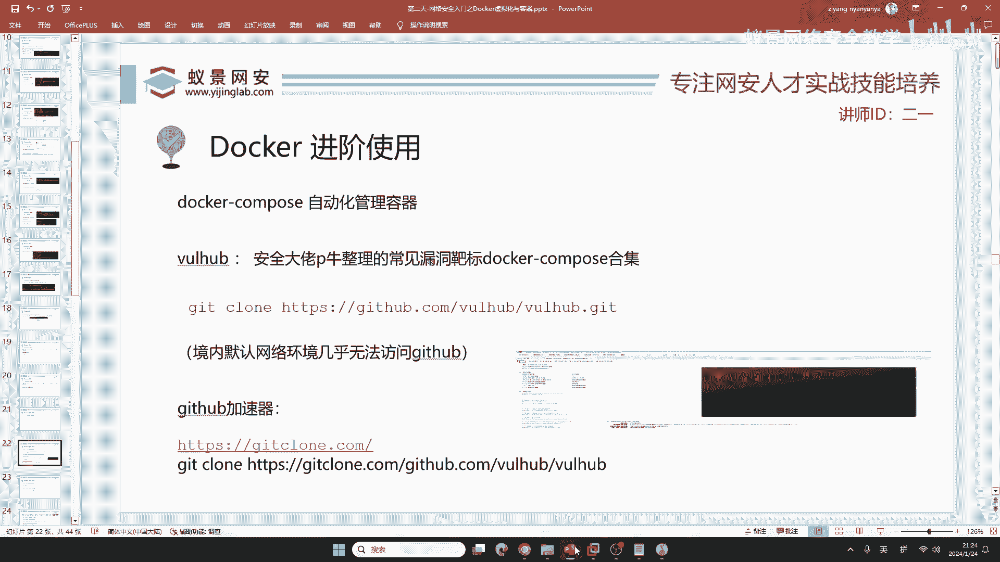

docker-compose 回车一下就安装好了 简单吧，这样的话 因为我在课前已安装了呀，你们安装的话 他需要一分钟的时间。

现在把docker-compose安装好了 你就任何语言的靶场都会搭了 知道了吧，任何靶场 ruby golang python node等等 所有的靶场你都会搭。

有同学说c语言有没有靶场 c语言不需要靶场 c语言就是静态文件 编译型语言哪有靶场呀，给你个exe就行了 还靶场呢 是吧 不需要这么麻烦，在这里呢 我们去进行这个叫pip。

不是pip啊 这个叫docker-compose up-d，up的意思是启动 -d是放在后台 你不放在后台的话 那个报错老多了 你看着都头疼 咱们把它放在后台，然后运行一下。

运行之后 他会有一个下载镜像的过程 是吧，你这个tomcat的镜像 你电脑上有没有啊 没有 所以说他会下载，这个下载配置 启动的过程 全部都是自动的 全部都是自动的，同学们看好 全部都是自动的。

好 现在我们等待他的下载就行了 从头到尾大概就一分钟的时间，一分钟的时间 我们就可以完成这个靶场的搭建，现在靶场搭建之后啊 同学们最大的问题就是说 我应该如何访问他 或者是我应该如何攻击他。

如何访问很简单，docker ps-a 这个项羽同学加速器有没有装 加速器有没有装啊 项羽 装了没啊。

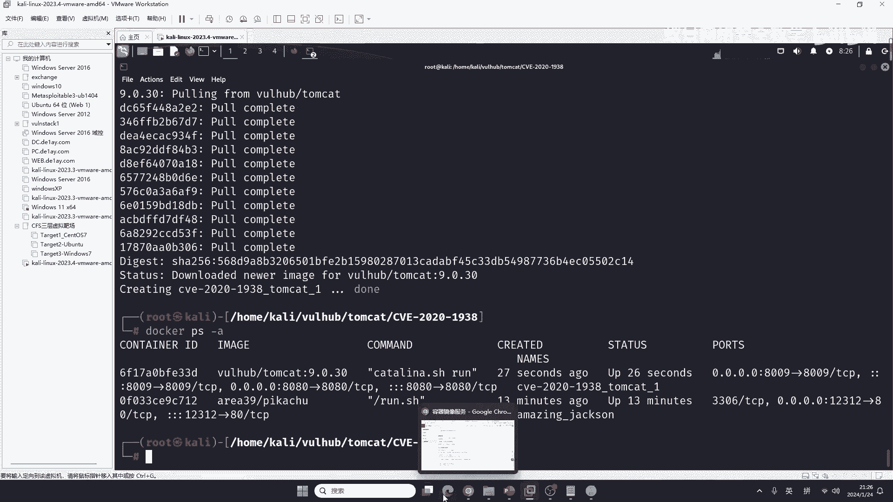

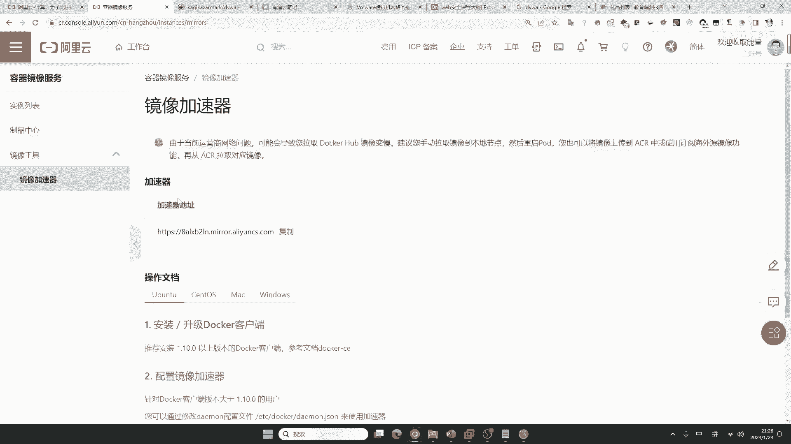

如果装了还是不行 那这个东西只能说 可能是校园网比较坑 是吧 那就装加速器，就装加速器之后 明显速度的提升 你信我 加速器怎么装 我下课给你啊 发给你 就发给你 你找班主任就行。

这时候呢 我们就docker ps-a，docker ps-a之后啊 同学们要瞅一瞅啊 在这个地方 咱们有一个8080，这个断口看好 0。0。0。0冒号之后的这个断口 8080就是我们要访问的。

那你说他为啥是8080呢 这是，这个vul hub的开源作者给你写好了 就比如说你打游戏 你用一些啊 一些mod或者用一些别人的创意工坊。

别人给你做好了 你用就行了 是吧 你学会打 你学会搭就行了 咱们访问一下，访问多少端口 8080端口 咱们把这个12312换成8080 回车一下，你看tomcat就被搭建起来了 就被搭建起来了。

那现在呢 对 这都是线上的靶场，那现在呢 就是有同学讲 我把他搭建起来了 怎么把他关闭呢。

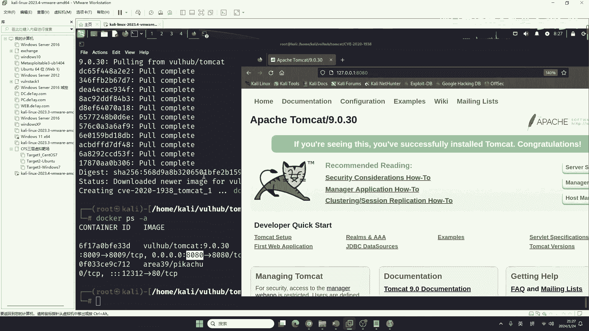

看好docker-compose，down是什么 down是下降和关闭的意思 按下回车，按下回车之后啊 咱们在这里访问一下 你看就不能访问了 因为他关闭了。

tomcat啊 没有汉化 如果你想汉化tomcat的话 可以自行做，这将是第一人啊 就你做出来之后可以贡献给大家 因为目前没有，包括docker-compose啊 也没有汉化 目前还没有啊。

对 是的 在对应的文件夹下 你总结的 我给你满分啊 给你打100分，就是说 你想开启的话 就在你想开启的这个漏洞文件夹下。

去docker-compose up-d就可以了 我再举个例子啊 那有同学讲我自己不能搭tomcat吗。

我告诉你 这个版本你都下不到 就这个tomcat 它是2020年的版本 你下去 你要么下的比较老 要么你下的比较新。

你怎么下 下不了吧 而且你下的是什么 你下的是windows的 你在linux上面搭一个试试，除非你自己学过java，这个东西无可厚非 比如说我 我就能搭。

但是你不一定 有同学说我学过java 现在我们来搭一个 搭一个那个，supreme boot的吧 或者搭一个structure 你看你还学过呗，好 我们来cd到 重新cd到之前的目录 好吧。

重新cd到之前的目录之后啊 你可以看到有这么多的东西 我们今天再来选一个搭建 选啥玩意呢，我选这个东西 叫solr 它是一个啥 它是一个开源的搜索引擎。

搜索引擎 有同学说我熟悉 百度 谷歌 搜狗 搜狐 我熟悉 这个东西不是那个搜索引擎啊，你想一下一个网站 有没有搜索功能 你学校的网站有没有搜索功能。

这个搜索功能 它要不要用一些开源的搜索引擎组件呀 要用吧，那solr就是其中之一，这个玩意是啥写的 这个玩意是java写的 你能不能搭。

我说实话 如果你搭这个环境 你现在不用docker 你至少得搭一下5，这最起码的就是说 如果你不会java 你至少得搭一下5 我们进到里面，进到这个文件夹之后啊 你看他的漏洞老多了 老多了。

同学们记住 你通过这个也能发现 就是在这个世界上 所有的语言 所有的app 所有的设备都有漏洞，就是看你会不会挖 就是看你会不会挖 怎么下啊 在课件上有 在课件上有。

好的 同学们写的很正确啊 同学们写的很正确，就是说这个东西你问的啊 问的东西给大家讲一下啊 这个docker compose的具体作用是什么 我给你讲清楚。

现在你看我讲这一点啊 比如说我想搭建这个靶场叫201917558，是不是要进到里面啊 进到里面，17558进到里面，进到里面之后啊 你看当前的文件中有一个叫做docker-compose。yml。

这一个东西，这一个东西它就是咱们docker compose的配置文件，就是说这个靶场应该怎么去搭 屁牛啊 都写到了这个文件里面，都写到了这个文件里面哈，然后你在这个docker-compose。

yml的当前目录 你去输入docker-compose-upd就可以了，它就会自动的下载 并且安装上这个靶场，这个靶场 如果你手动搭建 几乎不可能 几乎不可能。

这个语言同学说 现在开发语言功能就是互超互补 你讲的非常正确啊 不仅是开发，做手机 做电脑 都是互超互补 是的吧，小米手机oco vivo a+。

redmi 是吧 红米 是不是都是差不多呀 是吧 我讲的有道理吧 你看一下咱们的台式机，都是一样的主板 是吧 一样的cpu md inter。

都是一样的 是吧 操作系统 你看 你看 我不说windows啊 我不说windows 我说国产的 统计齐彬银河是不是差不多呀，他几个都差不多吧。

你别说他的桌面 桌面你想换啥就换啥 我说他的命令 他的内核都差不多吧 是吧 都是差不多的 所以说呢，这个是时代的潮流，这对我们有没有好处啊。

有好处 你打漏洞 你就很有可能就是说 我今天挖了一个漏洞 这个漏洞在很多地方都有，这叫通用性漏洞 价值很高 价值很高，现在来看好，8983断口 看0。0。0后面的这个断口啊 8983。

8983现在打开是暖气 咱们访问啊 8983 咱们把这个8080改掉8983。

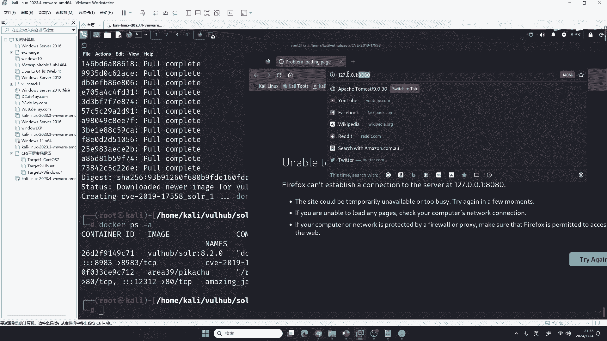

回车 你看到没 就搭建好了，这个东西有漏洞怎么去挖 怎么去挖 咱们今天啊 只是讲大哈 这个挖实在是没时间去讲了，因为这个东西太多了 有同学说 我有必要把这个v y号吧 号本里面所有的漏洞都打一遍吗。

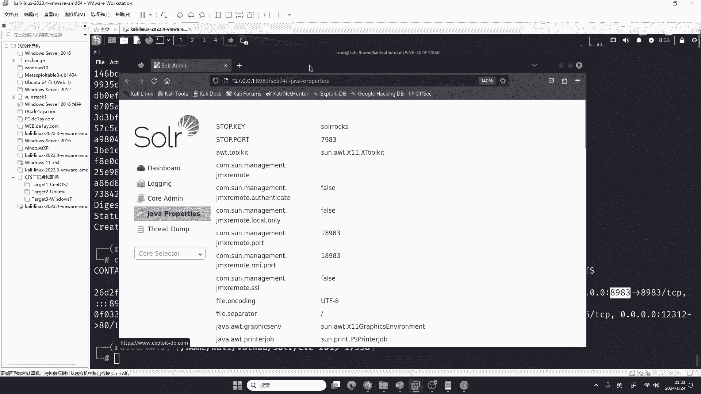

当然有必要啊 但是这个东西是个功夫活 这里面几千个漏洞呢 我估计你打完，你大学都该毕业了 大学都该毕业了 是吧 你可以选择去打 你觉得哎 哪个有兴趣。

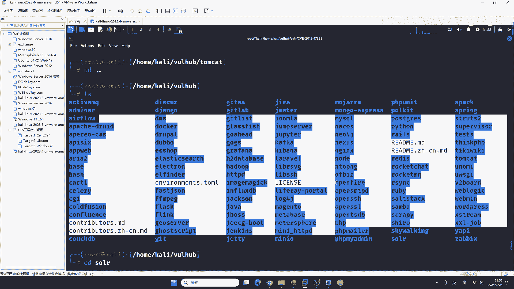

你就试一试 就打一打 现在我相信你用docker 以及docker啊 这一个compress就能够去搭建这些靶场了。

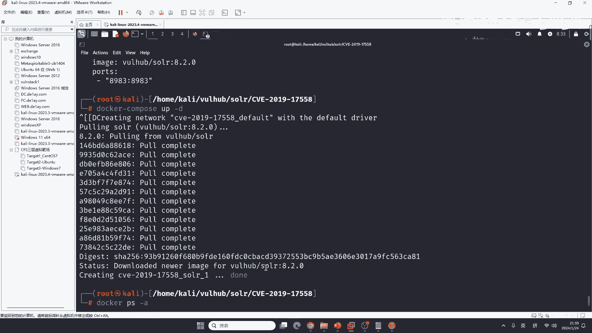

但是搭建这些靶场 同学们，搭建靶场的这个作用是什么 我们为什么要搭建靶场 就是要打靶场，要打靶场 我们在打靶场的时候 来发现 哎 漏洞它是长什么样子 就像有同学讲order buy。

现在这个东西压根就没有了 同学们 你现在建哪一个网站没有防火墙 有没有，基本上都有吧 除非这个网站非常的老 否则他都有防火墙 是吧 都有waf都有防火墙。

这是前提条件 是吧 都有防火墙 第二个呢 就是你学习的这些漏洞，符不符合现在的潮流，有同学说 我就会php 我dv w都能打 kali都会用 我想上班 想打互网 你还是歇一歇吧，嗯 不够 肯定不够。

那这时候 同学们就来想 我们如何能掌握一个技巧 就是说 你现在php java python go run我都能打，别人面试都问不到我 有waf怎么办 有waf我绕waf 是吧 有waf我绕waf。

别人入侵了怎么办 电脑被入侵了 我能入侵排查，有同学说 你知网站吗 不一定吧 咱们的docker跟dockerconverse目前局限的都是网站 是吧 都是网站。

都是网站 那现在你们觉得是网站多 还是app多呀，同学们都是搓手机 我也都是搓手机 我的父母也都是搓手机，app小程序 你每顿点餐 你去点 你去餐馆里吃饭 你点餐的小程序。

有没有想过是否有零员购漏洞 有没有想过有其他的漏洞啊，是吧 肯定是网站多 同学们一定要记住 肯定是网站多，网站 因为它的基数实在是太大了 知道吧 它的基数实在是太大。

就像印度人多一样 你这个地方 你美国你再生也比不上印度 为啥呢 因为印度的基数大 它十个人生一个都比你多。

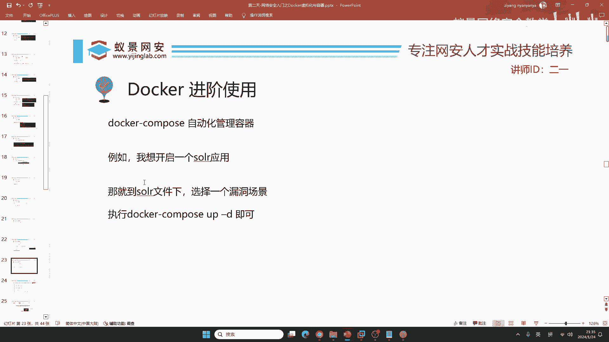

所以说呢 就是这个样子 是吧。