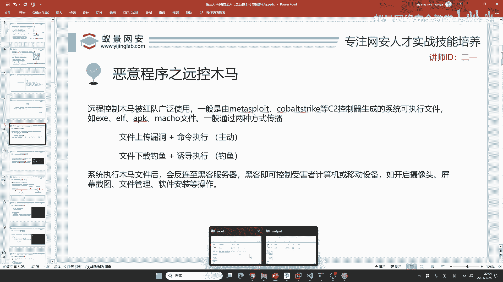
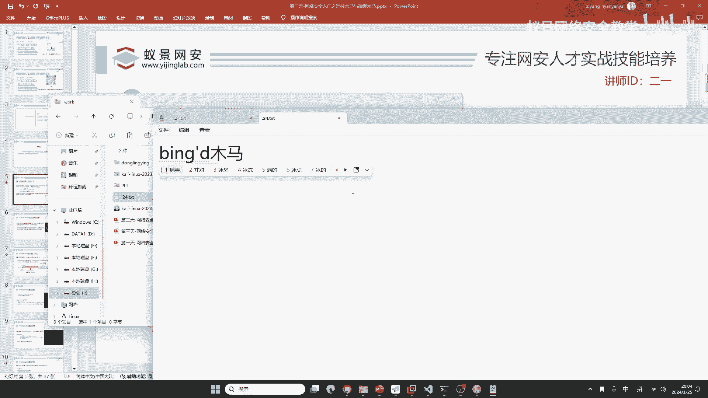
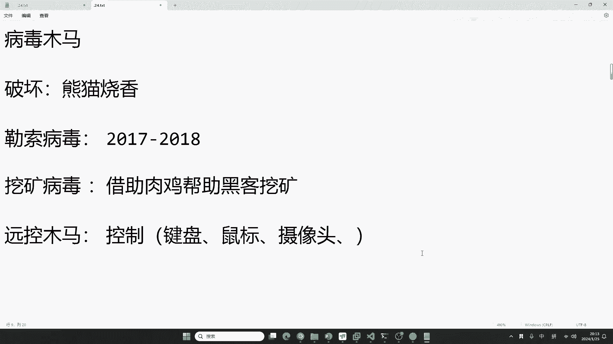
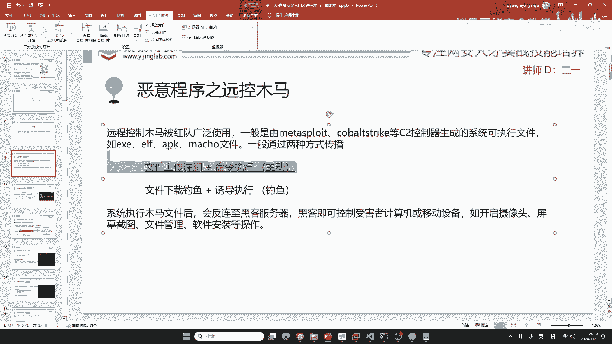
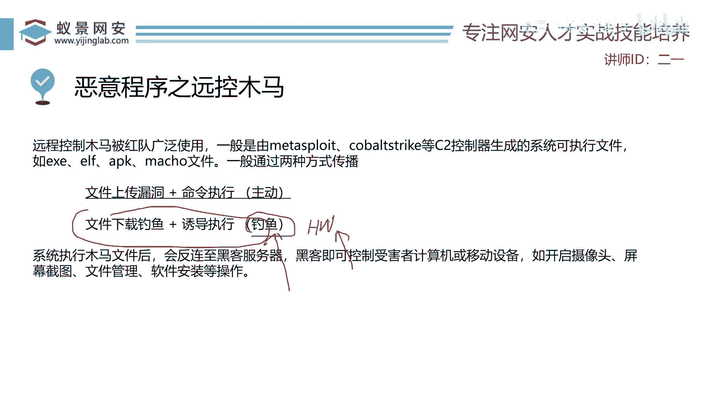

# 【零基础学网安】B站最全的网络安全教程，从入门到精通，学完即可就业，看完还学不会我退出网安圈！（渗透测试／kali渗透／内网渗透／黑客技术） - P18：9.远程控制木马.mp4 - 蚁景网络安全教学 - BV1fctLevETn

是吧，好，那我们下面来看一下，下面我们来看一下，首先就是我们要了解什么是远控木马，这是针对于咱们刚入门的同学。

来给大家讲解的，远控木马，首先同学们应该知道木马是啥，是吧，木马就是病毒的一个分类，但是关于这个病毒木马，你又了解多少呢。

我相信只要是咱们用过电脑的人，你应该都听说过熊猫烧香，是吧，熊猫烧香是以前，10年前非常流行的一个病毒，这一类病毒，咱们作为一个白帽子黑客，白帽子黑客，你应该去做这一类病毒吗，就是熊猫烧香。

那肯定不能做是吧，因为熊猫烧香病毒，它主打的是对你的电脑进行破坏，就是破坏性的病毒，我现在就是不让你用是吧，我让你的磁盘给你破坏掉，把你的系统给你破坏掉，甚至是破坏你的珠脉，以及硬件设备。

这是非常恐怖的，这种破坏性的病毒，不论你现在是工作，还是说你做什么研究，你只要生成这类病毒并传播，都是违法行为，即使是工坊引链，也不可能有这种病毒的存在，你想都别想了，这种只能是违法。

第二类就是近几年比较猖獗的，勒索病毒是吧，勒索病毒，勒索病毒是啥玩意儿呢，大家我不知道，有没有同学了解过勒索病毒，其实勒索病毒本身，它只是一些正常的加密软件，只是有的同学，或者是有的这些想赚快钱的人。

他就把这些加密软件，自己修改了一下，修改之后，他传播给别人的电脑，然后对别人的电脑磁盘进行加密，这啥意思，就是说你的电脑，所有东西都被上锁了，都被加密了，你怎么解开这个密码呢。

你现在想要获取这个解密的密码，你要给我打500万，这就叫勒索病毒，就跟绑架之后勒索的是一模一样的，勒索病毒在2017年的时候，是非常的猖獗，到2018年，别说你们公司中国，当时咱们公信部统计的。

我们全国每一个企业，都遭受过勒索病毒的攻击，不是说你的公司被攻击过，任何的公司，都受到了它的影响，非常的猖獗，这一类病毒都是你需要付高额的赎金，给到黑客组织，它可能根据你企业的价格。

就是说就像你绑架一个千金，跟绑架一个穷光蛋，你要的赎金肯定不一样，是吧，它根据这个价格去定赎金，定这个价格，然后很多的企业，或者是很多的个人，他有可能就是说吃哑巴亏，自己也不敢报警。

自己就是说也没啥好的办法，毕竟黑客就告诉你，如果你一个星期内不付款，你的电脑就别想要了，我全部给你删除，这时候受害者就怕了，就是说不如把这个钱转给你，所以说这些黑客组织，通过勒索病毒，赚的是盆满钵满。

你想一想，你能不能做这个病毒，你想死才做这个病毒，就是说想采缝纫机才能做，所以说这一类病毒，也不是咱们的制作对象，还有一类病毒是什么，就是挖矿，挖矿，挖矿病毒是啥玩意儿呢，有同学可能知道挖矿。

挖矿就是说，咱们现在有比特币是吧，有这些门罗币，就是虚拟货币，这些虚拟货币，这些虚拟货币，就是通过计算资源，去算它的一个账单，来去获取收益，但是你想去计算这个资源，你需要耗费大量的电力。

包括大量的运行资源，以及显卡CPU等等，这时候现在因为像门罗币，比特币已经跌下来了，如果你在自己家里挖矿，就比如说你购买4090，加上I9去挖矿，其实是你赚不回本的，为什么赚不回本。

就是因为像这些4090，它都对这些挖矿的算法，进行了相应的限制，让我们的成本变得非常高，那这时候这些违法犯罪分子，怎么办呢，他就是说，我不如看网吧里面，现在网吧的生意也不是特别好，你看它有这么多台机器。

我不如把网吧给入侵了，我让这些网吧的机器，不知不觉的为我挖矿，是吧，这是黑客行为，所以说就产生了大量的挖矿病毒，就是借助肉鸡，什么是肉鸡知道吧，同学们，知道啥是肉鸡吧，肉鸡就是说，你的电脑被黑客打了。

你的电脑就成为了黑客的肉鸡，就是借助你的电脑，甚至是你的手机，来帮助黑客挖矿，帮助黑客挖矿，这个行为肯定也是违法犯罪的，首先挖矿这个行为，在国内法律明文禁止，它是典型的违法犯罪行为，如果你在借助肉鸡。

帮助你自己去挖矿，这真是罪上加罪，这罪加一等，你至少得判刑，所以说挖矿病毒你也别想，这时候咱们工坊演练，或者是说你想做渗透测试，咱们做的是什么病毒，什么木马，叫远控木马，远控木马它主打一个什么，控制。

就是说我控制你，控制你干啥呢，比如说操控你的键盘，操控你的鼠标，或者是什么，有同学比较感兴趣的摄像头，是吧，摄像头，或者是说我操控你的手机，操控你的手机去拍一个照片，操控你的手机去录一段音。

同学们应该知道，像美国是吧，美国它最喜欢监听，它不仅是监听我们，它对那些盟友也疯狂的监听，这些东西都是有事实的证据的，是吧，不仅是我们国内，还欧盟都爆出过美国的窃听门，你想一下它窃听是啥。

它窃听就是不让别人发现，如果你说我窃听你一天，或窃听你几分钟，你就发现了，那就说明什么，说明你做的木马太垃圾了，轻而易举的就被别人发现，像这些控制力的木马，不仅被这些国际上的黑客。

就是有政府背靠的这些黑客组织，我们把它叫做高持续性威胁组织，就是同学们经常说的IPT，IPT，比如说像海莲花，海莲花，匿名者都是常见的IPT组织，一般都有政府做相应的靠背，就都政府为靠山。

这些IPT组织，他们长期的运用这些远控木马，对手机或电脑进行监控，包括你医院的一些设备，还有就是说你拍CT的那些机器，它只要联网都可以控制，在我们渗透测试中，远控木马你可以帮助是吗。

我们红队的一个攻击手法，我红队，我去攻击你的电脑，然后从你的电脑中，窃取敏感信息，是吧，窃取敏感信息，当然我不能给你拍个照，你如果以后参加工坊演练，或参加互网，你控制了别人的电脑，你刹一下给别人拍个照。

你就违法了，你打一个工坊，给自己打进去了，是吧，这还了得，打工坊，结果第二天自己踩缝身机去了，所以说，你怎么参加，你不要担心，我一会儿跟你们讲，一会儿我都给你们介绍，不用担心，咱们后面有聊天时间是吧。

想打比赛的，老师就是打比赛出身，我到现在的比赛，我也很了解，你们在学校里面怎么参加，或者是说，互网怎么参加，CTF怎么参加，比赛怎么参加，线上线，线上赛线下赛都可以问我，但是现在咱们先把这个课程讲好。

是吧，这是咱们的前提条件，也是我的工作需求，好，首先这几个远控木马是吧，现在它是我们最重要。

我们怎么去生成，现在生成木马，它有两种方式，第一种就是我们传播木马的方式，就是通过漏洞去传播，这种方式在以前非常流行，但是现在，我只能说它用的比较少了，为什么用的比较少，大家回想一下。

同学们，你们应该电脑或者是手机，或者是说你周围朋友的电脑，有过中毒的经历，如果你经常去网吧，我不知道现在的网吧怎么样，像以前，二一老师那时候，都是一些小网吧，那些网吧里面的都是病毒，这些病毒都是咋回事。

都是因为你自己下载一些，莫名其妙的APP，下载去看一些莫名其妙的网站，或者是你下载游戏外挂，导致的电脑中毒，这些方式，不论你是浏览网页，还是说下载软件，还是下载外挂，都是通过什么。

都是通过这些黑客的一个钓鱼，他通过文件下载钓鱼，然后诱导你去执行，大家想一想，这些木马，是不是针对所有的系统都有，是的，有同学说IOS也有吗，有，苹果的APP store里面。

也不是所有的软件都是安全的，以及有的同学可能买的iPhone，它是越狱之后的，你越狱之后的，就不再接受苹果的签名保护了，所以说你中毒的可能性就更高一些，如果你使用的是Windows。

中毒几率要比苹果要高，还有比Linux要高，有同学讲Windows不安全，其实并不是如此，为什么我们觉得Windows系统，比较容易中毒呢，很简单，就是因为你周围用的都是Windows，是不是同学。

你周围的同学用的，你的同事，你的室友，你的同学打游戏，这些游戏的网友，绝大部分用的都是Windows，因为你生活在一个Windows的海洋中，所以说你觉得Windows不安全，如果有一天，你跟老师一样。

生活在一个Linux的海洋中，你又觉得Linux，其实比Windows漏洞更多，因为Linux是开源的，Windows是闭源的，按理来讲开源的漏洞，要多一些是吧，开源，毕竟大家可以看到源代码。

可以对源代码进行调试，进行漏洞挖掘，就是代码审计，OK，咱们今天也会来讲这个东西，就是说，怎样通过文件的钓鱼，去诱导黑科学知识，这一点在咱们实际的工坊演练，就是护网，护网就是公安部组织的，工坊演练。

全国包括小县城，包括乡镇都要去做，它就是红队主要的攻击手法，钓鱼就是占有一半的比例。

