# 【零基础学网安】B站最全的网络安全教程，从入门到精通，学完即可就业，看完还学不会我退出网安圈！（渗透测试／kali渗透／内网渗透／黑客技术） - P19：10.msfvenom生成木马.mp4 - 蚁景网络安全教学 - BV1fctLevETn

下面我们来看，首先对钓鱼也是社会工程学的一种啊，这个同学讲的非常对，如果你这个社工就是你这个思路不太好，那你靠钓鱼，你的成功几率就比较小，那社工不是说社工库啊，社工库它只是社会工程学的一小部分啊。

你不要理解，社工就是我说我自己找一个什么社社会，工程学的网站是吧，查一查别人的这个什么玩意儿，查一查别人的身份证号，这个东西只是社工的一小部分啊，它其实社工还有很多的分类，还有很多的分类。

它是一个很深的这个学问啊，它不是说你整个QQ查一下身份证号就结束了，这个东西你就是停留在一个表面，大家以后接触到了就知道了，我也希望你们都能做红队，为啥呢，因为为啥呢，因为红队工资高是吧。

谁不想工资高呢，你们想不想工资高呀，那肯定想是吧，不然学着我也干啥，那我们今天呢先来了解一下metasploit，这个东西很多同学都知道，我就简单讲一讲了啊，你不知道的话，你跟我去做就行。

现在我们来看啊，就是说怎样生成一个后门幕，就这一句话，这一句话我告诉你啊，你在工坊演练中，你用到的其实就它，其他的功能啊，你都别想了，有同学说我知道永恒之栏，你知道我也知道啊。

2017年就有永恒之栏漏洞了，当时出现了，18年的时候还分析过是吧，这个堆溢出的缓冲区漏洞，这个缓冲区溢出漏洞，是吧，这个堆的一些漏洞，那这个永恒之栏呢，在2017年微软就已经修复了，你也想一想。

全国性的工坊演练，别人会不会修，别人都是傻子呀是吧，那些所有的防守方都是笨蛋呀，那不可能吧，所以说别人早都修复了，以前如果你生活在2020年，你说打工坊还能见到一些永恒之栏，现在已经2024年了。

那不可能了是吧，几乎为定，除非就是说你运气非常好，你有这个运气的话，不如去刮一刮这个彩票是吧，这赚钱的几率更高一些，那怎么办呢，我们只能采用钓鱼，就是说现在metasploit留给我们的机会。

已经不多了，只剩这一种，或者是常见的一些生成木马的方式，生成木马呢，我们要使用卡里中自弹的这个工具，叫做叫做什么，msfvenom，venom的意思，就是病毒的意思，有同学应该看过一个电影。

叫毒液的这个英语，就是venom，就是病毒的意思，然后这-p是pilot，pilot的叫攻击载荷，就是说你攻击了得干啥玩意是吧，对这个木马是只能局域网用，如果你要公网用的话，如果你要公网用的话呢。

你需要有一个公网IP，直播的时候，你就不要指望老师套出公网IP，给你讲了，否则如果就是有同学，拿着老师的木马去钓别人，到时候这个直播就不被法律允许，能理解吧，我在直播的时候肯定是，潜意识的用内网IP。

同学们能理解吧，如果你自己想去钓，不是同一局域网内的人，你需要把这个IP，换成公网IP地址，公网IP地址怎么来，花钱，花钱，或者是找你的运营商，你运营商跟你关系好，你说话好听，他可能会帮你开。

但是移动了连通就别想了，电信的话，你跟他说好听点，他可能会给你开，但是也可能不会，这个看运营商，看你所在的位置，然后这个pilot，他就这样写的，你看这是windows，就代表操作系统。

我们现在打windows，插64代表位数，现在的系统都是64位的，都是64位的，你不要指望，现在还有32位的操作系统了，32位的操作系统，只有你的ITM机还在用，ITM机你能渗透下去，你还没插上U盘。

警察就给你逮起来了，是吧，ITM机，所以说现在的系统都是64位的，你就写插64，插64就是代表64位的，然后meta predict是啥呢，meta predict，它是一个后渗透的框架。

就是说我们metasploit，就把它的后渗透，就比如说你想去开别人摄像头，你想去提权，metasploit就把它称为meta predict，就是给它起的名字，你不要纠结，这个东西是啥玩意。

他想叫啥叫啥，就是给它起的一个名字，然后下面reverse TCP，反弹TCP，反弹就是指受害者连接攻击机，一个反弹，当然如果你作为初学者，你可以不去了解这些东西，下面我们再来看，这两个是对咱们一个。

木马的配置，木马的配置，需要配置木马的IP地址，和端口监听，因为你这个IP地址跟端口，肯定是形影不离的，他俩分了家啥都不是，所以说咱们同样的遵守，TCP RIP的体系结构，写这个IP地址，写这个端口。

这个东西是钓鱼，同学记住钓鱼是什么意思，就跟你真的到河边钓鱼一样，同学们应该现在钓鱼比较火，我相信你们也钓过，这个地址是谁的地址，这是同学们最大的疑惑，也是在这个地方的重点，为啥，因为生成木马。

它就这样，你现在找别人，你找别人是吧，它也是这样生成，都是这样生成，你不找21，他也是这样生成，我们主要是理解它的原理，为啥这个地方要写攻击者的IP，我要写我自己的IP，这不是就暴露了吗，是吧。

你去想一想，为什么这里不写受害者的IP地址，我举个例子，就以钓鱼，就咱们真实世界中的钓鱼举例，你比如说现在钓鱼，你拿上这个鱼竿鱼饵，是吧，鱼饵就相当于是木马，你把这个鱼饵丢到河里面，你知道哪条鱼上钩吗。

就是在钓起来之前，你知不知道哪条鱼会上钩，你肯定不知道，所以说我们在受害者上钩之前，你压根就不知道受害者，会是哪一个受害者上钩，所以说你只能写你自己的，是吧，咱们反向推导，你只能写你自己的。

你又不知道哪条鱼会上钩，它哪条鱼上就上是吧，挂代理当然行，挂代理当然行，代理的话得内网穿透，不是说光靠socks代理就行，得内网穿透才行，你不论是内网穿透，还是什么代理转发。

你最终还是要有一个公网IP是吧，因为你内网穿透的前提，就是要有一个公网IP，不是说我说我想内网穿透，他自己又穿出去了，怎么没这个高级，没这么高级，你还是要付钱，你即使买第三方的什么花生壳。

同学们知不知道，花生壳，它是一个专门做内网穿透的，也是要花钱的，你不花钱的话，说实话，在2024年，像整个公网IP还挺费劲的，这里是IPort，就是端口0-65535，随便指定，这里是format。

format这里是exe，就是。exe后缀的，windows可执行文件，然后这里是把它的output，咱们去输出一个文件，比如说你输出，你想让这个文件叫啥名字都行，什么个人简历，什么大作业，什么360。

QQ，微信，WeChat都可以，想把它叫啥就叫啥，好，现在我们来看，这个地方是exe，windows可执行文件，我想问大家一个问题，我看大家对这个系统了不了解，因为我之前说过一句话，同学们。

绝大部分都生活在windows的海洋中，你的同学，你周围的人用的都是windows，世界上是windows的占比高，还是linux呢，如果是服务器或开发机测试机，那肯定是linux占比较高。

如果我们想生成一个linux的后马，linux的后门木马，不是后马，后门木马，这个exe应该改成什么呢，同学们，linux的文件是什么文件，现在有没有同学知道，你可以发到互动区，会是什么呢。

linux的，是吧，windows是exe，大家都知道，好，linux的可执行文件，linux官方把它叫做elf，elf的全称叫linux可执行文件，不是随便都行，exe它的全称叫pe。

pe就是windows的可执行文件，windows的可执行文件，这时候同学们说的对，elf文件可以是任意的后缀，记住，linux就是说，我不用后缀也行，但是我的格式是elf，就如同png是吧，png。

png的后缀也可以是什么都行，但是我这个文件格式就是png，这个文件的格式不能变，但是后缀你也是可以去改的，好的同学们，咱们在了解这些小技巧之后，下面老师来给你实际的运行起来。

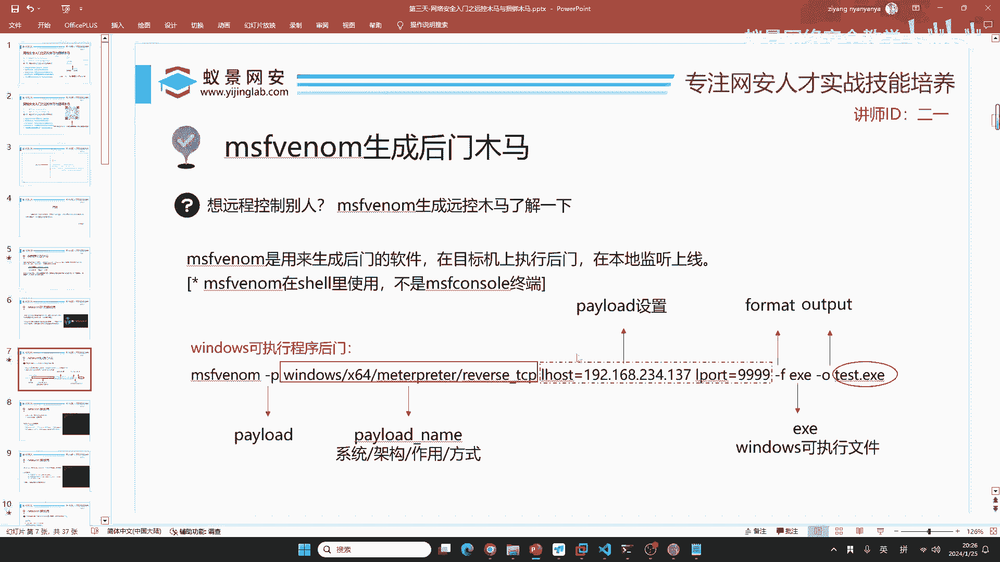

咱们生成一个，可以被shadow软件杀掉的后门，为啥它可以被杀掉呢，我相信来听课的同学，你们应该很多人都知道，MSF venom，你知道我也知道，shadow软件不知道，卡巴斯基不知道。

windows不知道，你肯定都知道是吧。

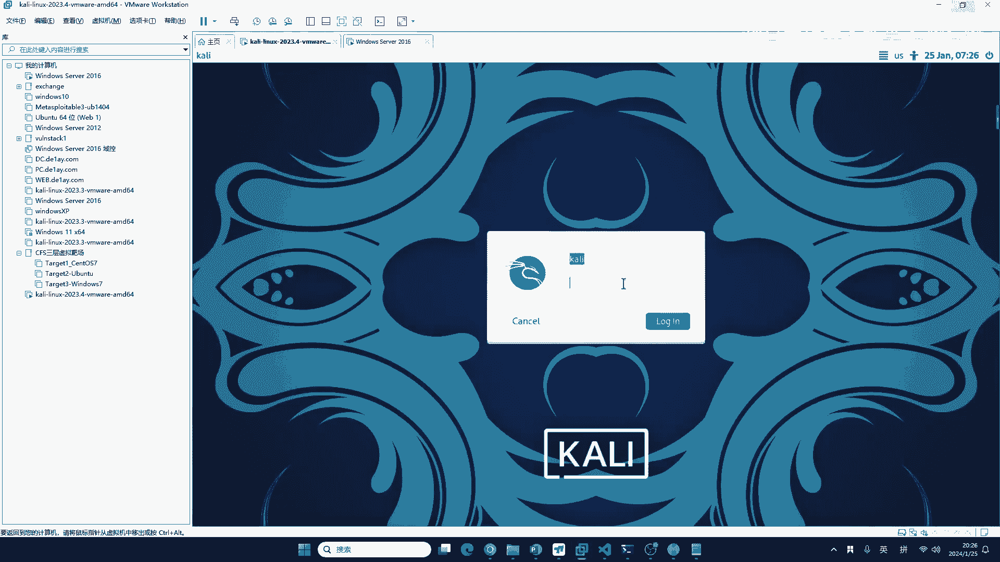

大家都知道，所以说这玩意儿，早就被shadow软件参透了，你的一举一动，早就被别人整明白了，所以说，咱们要一步一步学是吧，咱们先把这样一个东西搞好，然后再教你怎么把它变得好看一些，然后再教你怎么。

绕过shadow软件的一个查查是吧，好的，在进入到咖喱之后，有同学说，老师我这生成的木马，我都找不到在哪，这时候咋办呢，我们就给它放到桌面上，好不好，就是说咖喱的桌面在哪，有没有同学，就是说应该知道。

就是在咱们的desktop这个目录，我们现在刚登录咖喱是吧，你想切换到root就切，你不想切也没啥事，咱们今天的课程，你切不切root都无所谓，比如说我们在这个地方，你可以看到有个目录叫desktop。

就是桌面，如果你是把咖喱汉化了，你就需要主动打出来桌面，它就变成中文桌面了，就不是desktop了，你要注意一下，如果你没有汉化，你就跟二一老师一样，我们cd到desktop这个目录。

cd到desktop之后，咱们如果想生成后门，你生成的后门就在写着，就在这个地方，你就可以去用它了，是吧，就可以去用它了，好，现在我们来生成个后门，给大家瞅一瞅，好 msfvenom，-p，我直接写了。

我直接给它加载出来了，好的，在这个里面，它跟课件上面的，这个是一模一样的，只有改的地方，就是你的ip地址，还有端口号，ip地址是啥，同学们你要看好，new tab，咱们打开一个新的标签页。

为什么要打开一个新的标签页，就是因为它这站住了，是吧，站住了，我要给你讲其他的，那就点击fire，new tab，就打开一个新的标签，打开标签之后，咱们同样的control shift和+号。

给它整大一些，不然的话，看了一眼都瞎了，咱们整大一些，整大一些之后，在这边，咱们瞅一瞅ip地址，ip iddr，ip a，if configure，这几个命令，都是看ip，那这个ip是啥玩意呢。

我的kali现在是null模式，所以说我的ip地址，咱们就看以太网的就行，你不要看其他的，以太网，就是你正常上网都是以太网，你乔街纳特都是以太网，知道吧，就是说你上网上的都是以太网，所以说你就是eth。

eth就是以太网的前三个字母，咱们给他的ip地址整过来，复制过来，你看这里写的是80148是吧，192。168。80。148，那我这边呢，你看192。168。80。148，你要跟这边写的一样。

你得跟他写的一样，写的一样之后，这边的端口随便给0~655535，这个地方你不能改了，是吧，咱们windows必须是。exe，不是。exe，这不是后缀，这是format，就是格式的意思，同学们就是说。

学网络安全的时候，就会遇到一大困境，就是说这些选项，杠来杠去的，到底是啥玩意，你也不用担心，这些杠都是英语的单词的首字母，一般都是这样，所以说你只需要把这些单词了解，这些单词一般都是在比四级简单。

肯定比四级简单，这些单词，比如说这个p就是pilot，这里的f就是format，这里的o就是output，你把这些理解之后，你再去看这些东西，就都能用了，安卓还能用吗，安卓不能用了。

这个东西安卓10以上就不行了，这个msf，就是说，如果你现在用的是安卓13，同学们你们用的应该是安卓13，它都不行，鸿蒙也不可以，但是你要是整个虚拟机，还是可以的，安卓模拟器，或者是你的手机。

是一个安装了安卓10以下，操作系统的手机就可以，如果是高版本的话就不行，现在已经到安卓14了是吧，14不行，为啥不行，这个东西很简单，那肯定就是msf不会是吧，我怎么说，我只能理解是它不会。

所以说咱们如果想打安卓的话，你关靠它肯定不行，咱们如果就是说，你想只用它去照顾沙特软件，也是不行的，咱们得用其他方法，现在给它生成了，生成之后，这个木马我把它叫做9999。1x1，39感冒0。

我给它整了四个9，因为为啥，因为老师我怕在上课的时候，把端口给忘了，端口给忘了，到时候就如同咱们这个鱼竿，自己给丢河里了，捞不起来了，就麻烦了是吧，所以说这个地方，我就给它命名成9999。1x1。

然后这里你要看好，它就在桌面上了，为什么在桌面，同学们看这里有一个标识符，我在前面已经cd到了，desktop，好我cd到了桌面，如果你没有cd到桌面，它是不会在这的，这个前提条件，大家一定要听清楚。

现在这个1x1，咱们在这里双击能运行吗，肯定不行吧，它是linux，那我们把它放到windows上面，来看一下查查效果，同学们来看一下，查查效果，好现在我给它复制一份，copy。

怎么把它传到windows，同学们看好，我给它copy，复制，复制之后，你看这个地方，比如说。

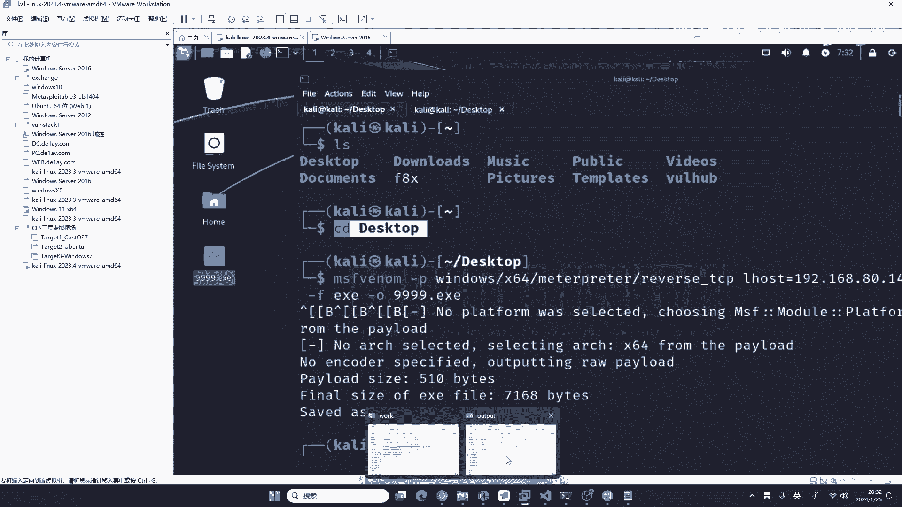

在这个文件夹中好吧，在这个文件夹中，我右键给它粘贴，杀毒软件有没有杀，杀掉了吧，同学们看，杀毒软件就杀掉了，安卓怎么弄，安卓14安卓13，你得有专门的方法，专门的hook方法才行，那今天的课程没有排了。

是吧，咱们今天讲这个windows的木马，安卓的木马，你这个东西，你得自己去写smart的代码才行，好你看这个东西，它肯定得被杀毒软件杀掉，你别想了，再垃圾的杀毒软件，都会给它杀掉，那杀掉了怎么办呢。

同学们，如果你想去演示它的话，你可以通过这些杀毒软件，去添加到信任区，这是演示它的一个过程，如果说你不会添加到信任区，就做免杀，如果你说你不会做免杀，那你就拉倒了，是吧，那你就听我讲吧。

好 那现在咱们先演示一下，就是说如果，我这个杀毒软件没有被杀掉，它是啥样子的，它啥样子，我跟你讲，即使它没有被杀掉，你也啥用都没有，好 现在我给它放到暗意盘中，我给它替换一下，替换到暗意盘中。

那这个暗意盘中，暗意盘中，好 这个119，119同学，就你打错了，Evaluate payload，就是说你这个载合打错了，知道吧，就Payload敲错了，所以说它就会报这个错误，就在这个里面呢。

同学们来瞅一瞅，现在我在暗意盘中，就我在暗意盘中有这个东西是吧，9999。exe，你看它长啥样，你瞅它长啥样，你看一下，这个东西，它就是个。exe是吧，这个东西7kb，发给你会点吗，同学们会不会点它。

不会吧，这个东西太low了，谁会点，是个人都不会上钩，就是说你，大家觉得就是用这个。exe，能不能钓到人，同学们如果觉得，你能钓到人的，你可以扣1，钓不到人的可以扣2，你觉得就是用这个。exe。

能不能钓到，同学们，你觉得它能不能钓到人，肯定钓不到是吧，肯定钓不到，就是这种东西，你的诈骗手法就如同什么，我是秦始皇，你给我打50万，打50万，除非就是说，你这个人，好奇心太强了，好奇心太强了。

那有同学讲，这样一个，我是秦始皇，给我打50万，能不能骗到人呢，能啊，你看那个法制节目，是不是有的老头老二马，会被骗到，但是别人那是，秦始皇，你又不是秦始皇是吧，你的诈骗的对象，不是那个老头老二马。

你骗的对象，是在攻防演练的时候，那些防守方，你整这个过去，谁上钩啊，傻子是不，傻子是吧，所以说这个不会上钩，那不会上钩，咱们就给他加点料。

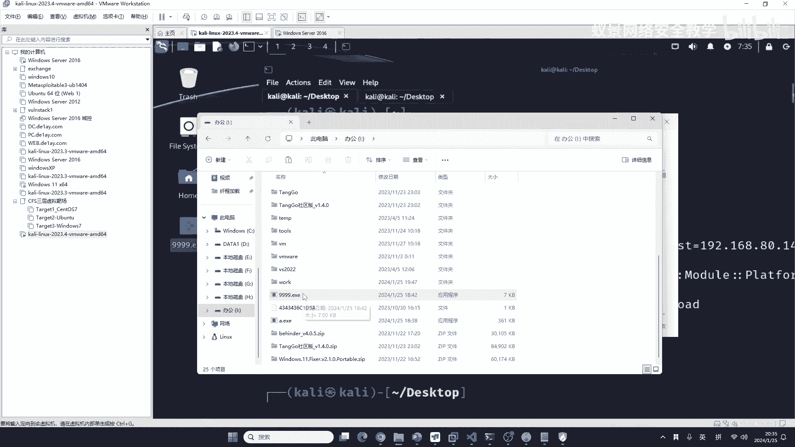

怎么加点料呢，就同学，这个，这个时候就。

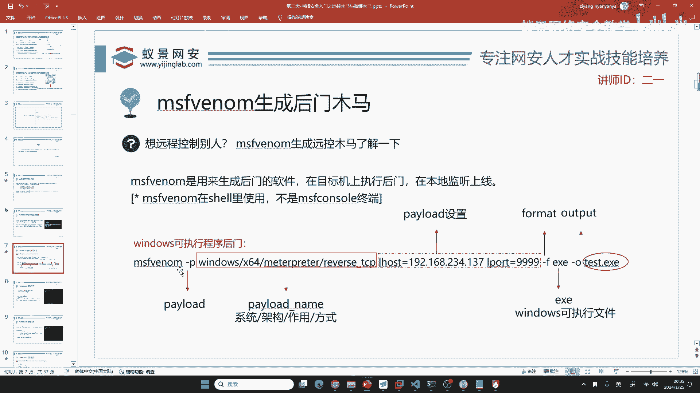

各种奇怪的方法，就整出来了是吧，就整出来了，那怎么给他加点料。

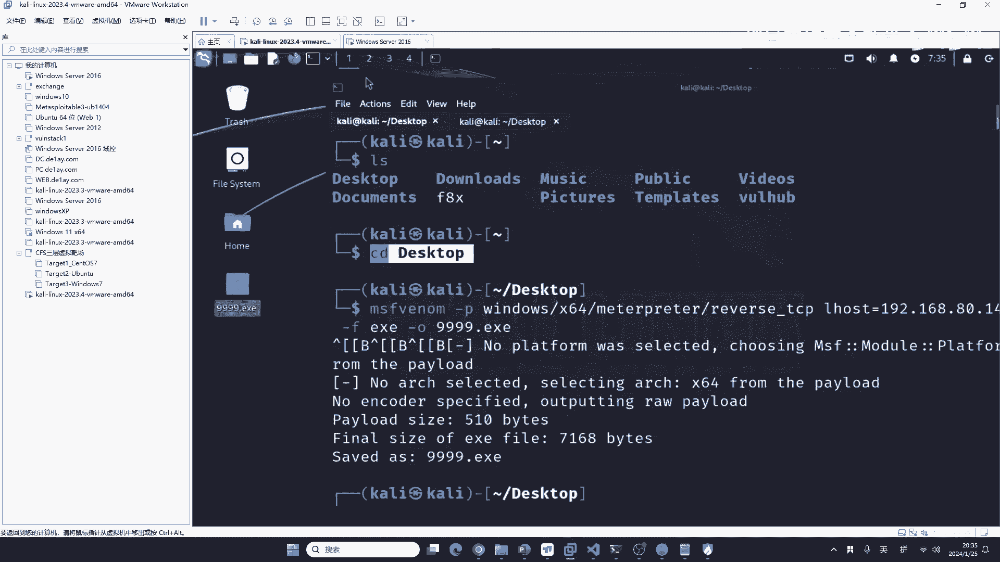

同学们看好，就是说，我有一种方法，就是改他的图标，或者是啊，给他，进行相应的一个捆绑，就是说，比如说，把它捆绑到微信上面，把它捆绑到，这一个电脑的，程序上面，大家想一想，就是安卓，能不能捆绑，就比如说。

你打开的微信，你打开的支付宝，或者是你，你这个，一些老年人，他们使用的支付宝，或者是微信的APP，或者是抖音，就极有可能被捆绑木马，但是咱们今天，不能讲这个捆绑方法，安卓的课，第一个为啥我不讲，第一个。

咱们今天排课没排，90分钟，你不要教我，我把所有的系统都讲完，这个东西，我这个嘴再快，也说不完，第二个，如果我在这里，教你了这个捆绑，任何的直播课，都不可能教，你放心吧，教了这个东西，明天。

就会有人上门来找我，这个东西叫什么，就是明知他人要，进行违法犯罪活动，提供技术知识，这在网络安全法中，也是明确的违法行为，那有同学讲我不违法，我现在给你演示了，你肯定有部分同学，你这个心里的歪心思。

就开始起来了，你又得整这个活，整这个活，给他绑定到支付宝上，让别人装，别人装，你就控制他了，你感觉爽的一批，结果呢，你就犯罪了，如果别人告你，你就犯罪了，如果别人不告你，那你这个侥幸，侥幸逃脱。

侥幸逃脱，侥幸逃脱，就是让你有更大的野心，然后你就是陷入犯罪的深渊，所以说，这个东西。

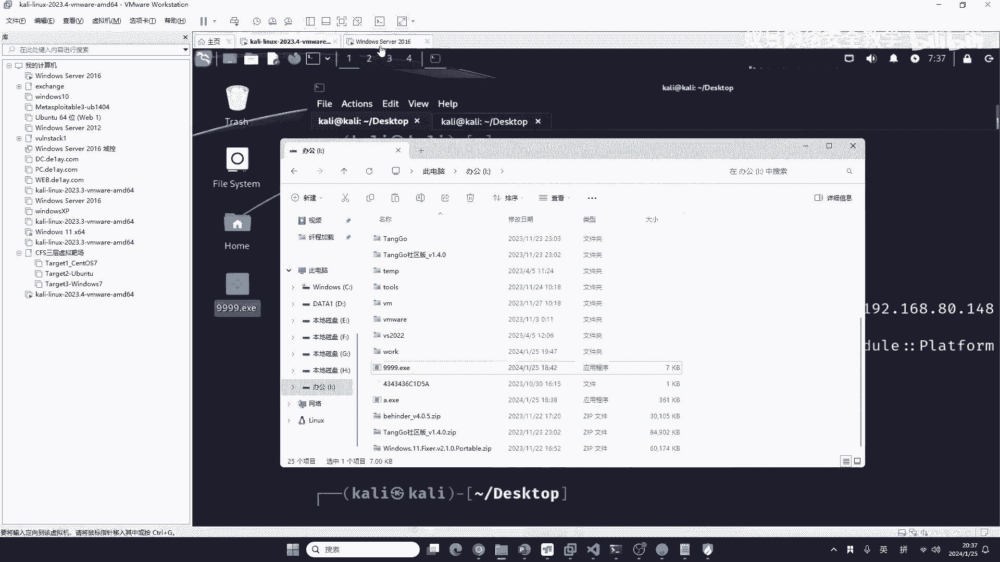

大家也还要小心小心，现在，来 我教你怎么去捆绑。

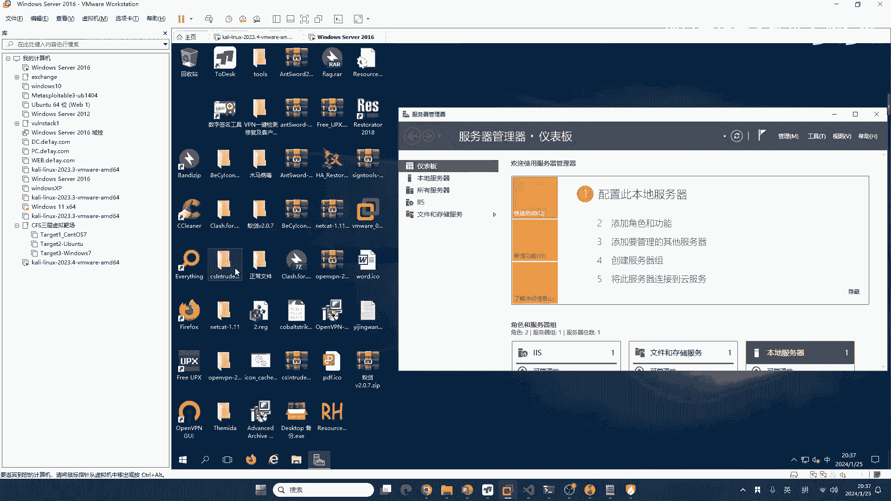

木马病毒，我在上课之前，上课之前，同学们不要觉得请喝茶，是一个，距离自己很远的事情，你做网络安全，你一定要遵守法律，我告诉你，你以为你的小操作，你以为你挂个代理，别人就不知道了，有同学说没关系。

我的代理好，匿名代理，那我想反问一下咱们同学，想反问一下咱们同学，就是说你有这种想法的，就是说老师我有代理，现在我问你，你连接你的代理，是通过谁的网络，是不是移动电信联通，移动电信联通是谁的。

你要不要实名制，要吧，要吧 是吧，要实名制，那你不还拉倒吗，是吧，除非就是说你这个是吧，除非就是说，你连接代理的网络，那不是咱们移动联通电信，或者是其他运营商的，那你还有可能侥幸逃脱。

那你这个家里的宽带，你去办快餐的时候，不要身份证，肯定要身份证，那你连代理，不是连了个寂寞 是吧，所以说 你的违法必被抓，大家千万千万不要动这个小心思，就是我今天教的东西，你换成公网了，也一定要在以后。

公防的时候 拍上用场，你不要整活，先给你们讲好，上课不规范 当然违法呀，你以为，所以说 我们这课程都是备案的，是吧，都是有这个法律支持的，都是合法合规的 不是违法的，咱们首先呢 就是说这个东西怎么换。

如果你只是给他改个图标，那就有点太low了，咱们首先得找个软件给他绑上去，找什么软件呢，那二一老师呢 在上课之前，我找了一个非常好的软件，因为这个软件 你去骗技术人员最有用，同学们应该知道。

比如说我在宿舍里面，或者是你们在宿舍里面，应该没这个需求，比如说 我在公司里面，想控制家里的电脑，或者是说什么呀，我在家里面想去控制别人的电脑，就是远程控制嘛，就需要下一些软件。

比如说呢 像toDesk 还有向日葵这些软件，那这个软件呢 它肯定需要安装 是吧，比如说你看这个软件，这个软件叫inst。exe 是吧，你打开它就会下载，下载之后呢 就会去安装这个软件。

这是一个正常的软件安装包，这个东西你可以换成微信，可以换成腾讯视频，可以换成qq，但是我在上课的时候不会给你换，你不要指望我整个微信给你绑个木马，即使这个木马是，你同学们知道举一反三吧。

就是我比个呼噜画个瓢你能不配，我现在整这个玩意儿，你可以换个软件 是吧，但是你换了之后不要乱传播，当然我教你的都是内网，你传播进去了 也没啥影响，除非就是你换成公网，换成公网 你找我就没用了。

我又没教 是吧，现在呢 咱们给它复制过来，首先提取他的图标，怎么提取这个正常软件的图标啊，你看这边是我提取的 非常简单啊，你用老师的工具啊 用老师的工具 这些工具啊，说实话 都是开源的。

所以说 我给你不算是提供计算机操作系统入侵工具罪，他本身又没有病毒 你只是用他来创造病毒，是吧 现在呢 我们打开他，打开他之后啊 我们运行一下，打开他之后啊 你看他长这个样，长这个样啊 他啥啥都没有啊。

你也不要去关注 你也不要去关注什么呀，关注他的一个相应的英语是啥，咱们就把这个软件往里一拖 你一拖 这个图标就出来了，你想要多大的像素的图标 你看这里都有 看到没，最大就256256256256。

咱们现在呢 给他保存一下，保存一下之后呢 你可以看到 他就能保存成这个ico，为啥我敏感 就是因为我想提高大家的兴趣 是吧，不然的话 听课都要睡着了 我自己听我的课 我头疼啊 都要睡着了。

所以是吧 你要是说 不跟你聊聊天的话 那这样的话 没法听了，咱们把这样一个东西啊 把这个图标给他提取出来，提取多大的这个像素 你自己选了。

你想让他模糊一点 你就选小一点 你想让他清晰一些 你就选大一些 是吧 给他保存，保存的这个后缀名 你不要变啊 他这个图标的后缀名就ico icon icon就是图标的英语。

你不要去改他 改他不行 你改成png 改成jpeg 就不太行喽 知道吧，就不太行了，好的 那现在呢 我们在这里啊 给他提取出来 就变成了什么呀。

你给他保存一下啊 你不要需要我直接插掉 因为我已经提取过了 他就变成了什么呀 变成了这样一个ico的文件，这个文件呢 我们现在你先放着不用啊 就是说你不要给他整上去了 整上去就露馅了。

整上去 你就露馅了 好吧 就露馅了 就露馅了，那现在呢 我们在这个地方啊 在这个地方怎么把它跟我们正常的软件捆绑到一起呢，同学们看好啊 首先这个正常的软件 我们给他复制一份 我们给他复制一份。

粘贴到这里，粘贴到这里之后啊 咱们现在做一件事情啊 就是给他打包一个字节押文件，哎 有同学说这个字节文件没啥用啊 我也会呀 当然打包的方式有很多种 用c++写你会不会，不会吧 所以说你先用工具把它搞好。

我的声音小嘛 我声音够大了啊 我收音声音够大了啊 都爆麦了 你看你看。

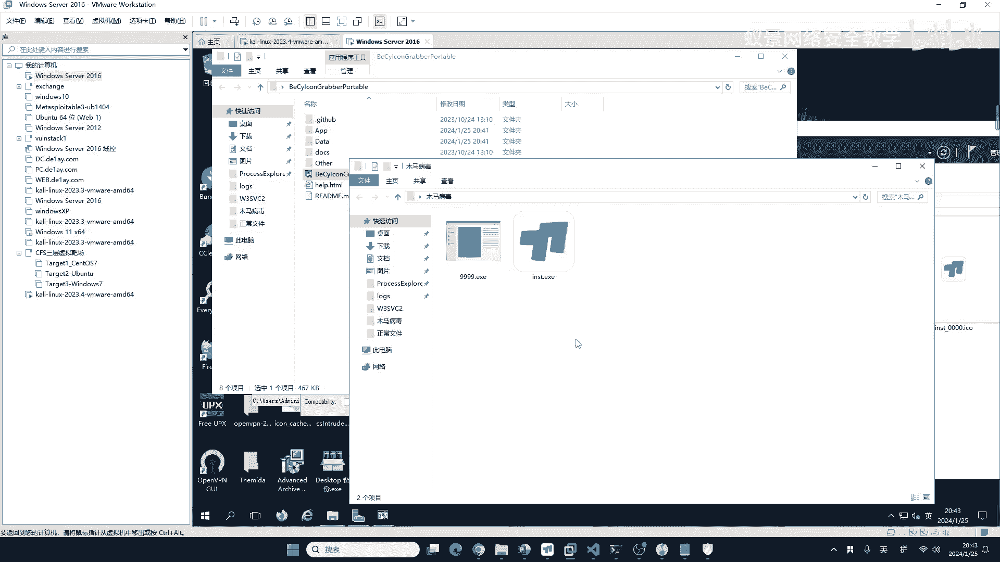

这能是我说假话 你看就爆了，是吧 你在自己电脑，你调大点声音呗 同学 如果觉得我声音小 你可以把声音调大一些啊 不要指望的，就是说 老师这个麦克风已经要爆掉了 知道吧 调到最大了。

哪里没听懂可以提出你的问题啊 哪里没听懂可以提出你的问题，就是这是个木马病毒 是吧 这是一个正常的软件 我现在给他整 整捆捆到一起 是吧 捆到一起。

现在大家看好 看好 怎么去捆呢 就是说咱们给他选中 选中，选中之后 选中之后 咱们右键一下，然后这个地方来看 咱们需要有一个软件 那有同学说。

我这个360能不行不行啊 360好压 不行啊 我2345好压 行不行不行 都不行啊，只能是winrar 没关系 我这些操作全部都有笔记，全部都有笔记啊。

全部都有笔记 你不用担心 听不懂的话 看笔记就行了 笔记我都用中文写 是吧 你直接下载软件 用就行了，这很正常 哪里没听懂呢 同学们 如果没听懂的话 可以提出问题哦 这个地方 你不要害怕。

现在的操作 都是基础操作 你这个木马生成的啥用都没有 就你这个木马生成了，直接被杀手软件杀掉了 别人也不会上钩 是吧 就如同你现在是一个直钩 姜太公钓鱼 是吧，姜太公钓鱼 愿者上钩 这肯定不行。

这个东西肯定不行 是吧 笔记下课给你啊 这个上课的时候怎么搞这个笔记啊 下课了 我给你写了 好发给你们啊，好 现在我们来看好啊 你给他全部选中。

全部选中之后啊 咱们右键他 点击添加到压缩文件 看我的步骤 我这些步骤你不要跟着我做，你不要跟着我做 配合cs的也可以啊。

我今天给你讲的这些方法 cobaltstrike metasploit以及其他的CR工具，不论是免杀 还是这个地方 全部适用啊 都是适用的 咱们打开之后啊 打开之后 然后可以看这里啊。

叫做创建自解压格式的压缩文件 你点了之后啊 他的后缀名就变成exe了，你可以看到这个exe的名字呢 是木马病毒 你可以先就保持他是木马病毒。exe吧，然后呢 就是后面的这一个后缀名啊 你不能改。

有同学讲 这个压缩文件不是zip吗 不是rlr吗 你不能改啊 它必须是exe，如果不上钩怎么办 不上钩就是你调的时候 话术不对 你这个社会工程学没掌握清楚 是吧，咱们先这样做好。

做好之后呢 咱们现在你千万不要直接点确定 把它创建起来了 咱们得做一些高级的东西，就是说 我们点击这里之后啊 点击这里之后，首先设置他的木马病毒。exe 然后点击高级，高级这里啊 有一个自解压选项。

能理解吧 这个地方，它是需要点击高级 然后点击高级自解压选项的，在这个地方呢 我们需要指定解压路径 对 就是内嵌程序 内嵌程序的方法很多啊。

不论是c++ 还是咱们的winr还是golang都能做 但是我现在讲的肯定是对新手最友好的，如果讲golang的话 那完了 你们都要睡觉 是吧 有同学说要睡觉 这肯定的是吧。

我听都要睡觉了 那你听能不睡吗 咱们尽量讲的有意思一些 好吧，现在呢 我们把它解压到哪里呢 windows啊 有个缓存目录，这个缓存目录呢 是在c盘的windows temp目录下。

为什么要写在这个目录下呢 其实原因很简单 就很多同学发现啊 有些这个电脑的用户，他自己的这个磁盘啊 他不是管理员权限 就会导致啊 自己没有办法去，正常的写入 而c盘windows temp，这个目录啊。

这个目录是任何的用户权限都能写到里面去的 就是tmp目录 下面我们再来看啊 这是第一步 就在常规这个地方设置解压路径，设置解压路径之后呢 我们现在要进入到设置的第二点。

就要到这个设置里面 我们要设置这个解压后运行 解压后运行什么呢 首先呢 我们要写一个c盘，第一件事情 我要运行 运行什么呀 运行我的后门木马。

如果你的后门木马不运行 那他怎样去控制他呢 是吧 你首先 你不论怎样去捆绑 不论你怎样去钓鱼 你的后门木马最终还是要运行起来的，后门木马 我这里叫什么 叫9999。exe 那我就写9999。exe。

然后呢 c盘接下来是什么，除了运行我的后门木马之后 我需要将这个后门木马 跟这个程序正常的软件 把它两个嵌在一起，就是把他们两个变成一个软件。

那这时候呢 我就是在运行完后门之后啊 我要去运行什么呀 我要去运行这个正常的软件，inst。exe，好的 那现在呢 我们就设置好了，设置好之后 需要继续的选择模式，其实这些。

不要记忆哈 你只要做过一遍 你自己的手就记住了，就比如说 你现在打一个游戏 qwer 你是不是用过一遍 你就记住了呀，这个东西跟那一样啊 你不要去纠结，这里啊 我们在静默模式里面选择全部隐藏。

什么叫做静默模式呢 就是如果你不去隐藏静默模式的话 你的解压会出现一个进度条，会引起啊这个受害者的怀疑 所以说咱们要点全部隐藏 每一个地方都是有它的道理的，那你说它是怎么实现的呢 其实呢 它是使用了。

rir的一个自带的功能 这个东西不是夹壳啊 这个东西跟夹壳一点边都不沾，夹壳的话是改变程序的原有逻辑 夹壳的话是改变程序的，这一个入口点 就是有压缩壳 有加密壳 加密壳的话就是把它的入口点加密。

通过一些算法 隐藏自己的程序入口点，那压缩的话 就是在压缩的时候 去进行相应的一个 帮将程序的这个段呀 包括程序的一个，入口点给它加密 压缩 隐藏起来 那如果呢 你学过文件结构 应该非常清晰啊。

文件结构在哪学 你大学里面那个计算机组成原理 那个课程里面有，只要是你是计算机专业的都会学 当然 如果你没听的话 那就，那就跟我无关了哈 这个东西 可能大学的教授讲的还没有我有意思呢。

是的吧 同学们 你们大学里面的辅导员 有的时候讲的，没有我们讲的有趣 当然呢 这些技术都是枯燥无味的 都是枯燥无味的 咱们这个还是，要把它整好 是吧 要把它整好。

然后这个地方呢 我们模式点击全部隐藏 然后高级 高级这个地方就不要设置了 然后这里有个更新，更新呢 为什么要在这里去找更新呢 就是因为如果，啊 如果他这一个东西，就是咱们。

更新模式 如果他的这个c盘windows temp里面，有一样的同名文件 我们需要给他覆盖 是吧，这时候呢 我们要解压并更新文件 然后覆盖文件 就这样去做。

去解压并覆盖 这时候呢 我们设置了什么 来 同学们来回顾一下，首先设置了常规 设置了解压后运行 设置了模式 设置了更新，在这些设置好之后啊 咱们就可以点击确定了 点击确定之后 直接点击确定。

这时候啊 就会生成一个新的exe 就是木马病毒。exe，但是这个exe文件啊 你现在觉得同学们会不会上钩啊，肯定不会上钩 首先呢 第一个问题就是他的文件名有点奇怪，第二个问题 就是他的图标不太推进。

这个图标一看啊 就是个压缩包 我正常人 我都不会上钩 我都不会上钩，那这时候咋办呢 首先呢 我要把他的文件名改的要好一些 我把他呀 改一个文件名。

7z不行啊 7z这个压缩方式是比较老的 我们要用这个winr啊 这软件到时候都发给你 不要着急，就是说 你现在没有必要跟着我做啊 大家 你要听 你不要跟着我做。

在这里呢 我们把这个改成啥呢 我就改成todesk远程控制 好吧，远程控制，好 回车一下，现在呢 我把这个文件名改好了 文件名改好之后 咱们还要做一件事情啊 就是把他的图标给他改掉。

把他图标改成什么呢 改成咱们刚刚 哎 提取出来的这个图标啊 提取出来的这个图标，我们给他换一下 怎么换呢 今天呢 会给大家一个非常好的工具啊，就是这个资源管理器 这个资源管理器，这个资源管理器啊。

啊 很多种 我给你们的可能是比较好用的 是吧 比较好用的 昨天的笔记找班主任 我上课呢 这个东西，咋给你发呀 我上课呢 找班主任 找咱们的摩卡小姐姐 好 我们现在呢 把这个叫。

资源编辑器这个软件打开 这些东西啊 我在课后都会发给大家 你可以不用着急，你自己尖亮的 你想上网下也行，上网下的话 你要注意一下 你下的软件不要被捆绑病毒了 知道吧。

有的同学说 我想学安全 我想用黑客工具 结果你从网上下的黑客工具 他本身就在病毒 那你如何应对，是吧 刚学网络安全技术的第一天就被当头一棒 那你不疯了，所以说呢 你自己下的话 还要注意一些。

那在这里呢 我们现在就是把自己要改图标的这个软件啊 它叫什么 twodesk远程控制 记住啊，它是一个木马 它是个木马 咱们往这一拖 鼠标一拽。

鼠标一拽之后啊 你看它原本啊 是有图标的 看到没 原本是有图标的，不会用到加壳技术 现在加壳 他那个不能绕叉软了 因为壳的特征很明显 我跟你讲一下吧 同学。

就这个power同学啊 跟你讲一下 你壳的话 你加什么壳呢 你比如说upx，那upx一般的人 就比如说，我自己啊 我虽然是打胖的 但是对逆向我也不能说了解多少吧 但ups壳。

我光看这个二进制就hacks嘛 都能看出来它是upx，而且呢 它特征很明显 就是你点开这个软件 我就知道它是upx壳 然后拖的话 手动都能拖出来。

那你觉得这个沙子软件不知道吗 沙子软件肯定知道 是吧 第一个很老 第二个呢，就是除了upx之外呢 其他的一些壳 比如说虚拟机壳 还有就是说这些加密壳 这些穿山甲，它的实在是。

就是说什么呀 就是说特征太明显了，大眼一看 你又知道是啥壳 那这个沙子软件 他也是知道的 所以说呢 就没啥用，加壳的这个技术 我觉得在免沙这里可以去淘汰了 可以去淘汰了。

c++可以给这文件快图标 当然可以咯，怎么不行啊 python go long都行 咱们这里只是讲鼠标拖拖拖的 我觉得现在带你写一个c++，不如咱们拖一拖 是吧 就像有同学之前讲过。

咱们尽量的就是使用别人已经造好的轮子 就比如说现在让你造一个手机 如果说你从系统开始写起，摄像头自己做 屏幕自己做 手机外壳自己做 那你最后就干啥呀 你最后就成本太高。

然后呢 你这个手机注定失败 那现在做手机都是怎么做呀 小米怎么做，小米就是说 我先找代工厂 是吧 我这个cpu用骁龙的，然后这个摄像头 我用索尼的 是吧 再跟什么莱卡哈苏合作一下。

这样的话 就能很快的实现一个手机的制作 很快的能推出属于自己的产品 而不是说你要纠结 哎 我为什么，不能从零到一写起来 就像大家写网站 你见过一个人开发网站是从第一行代码写起吗。

不是吧 就是你不要说你上学啊 就在工作岗位上，现在他本身 我们回到课上 现在他本身是不是有个图标啊 有图标，咱们把这个图标啊 给他删掉 你看这个图标太丑了 他这个压缩棒的图标 我只给他删掉啊 右键删除。

这也是删除掉 删除掉之后啊 你看图标没了 这时候咋办呢 咱们不是，上一步提取了这个图标吗 就是ico文件 icon图标文件，然后拽 给他拽 拽到这个地方 松手 看就过来了。

过来之后呢 过来之后 我们去保存 我们去保存，保存完成之后啊 你来看这边 哎 他的图标有没有变过来呀 没有，这时候就是说 这个文件的图标为什么没有变过来呢 同学们想象一下会是什么原因。

首先就是这里的图标 我已经给他改成了什么，改成了to desk的图标 改成了正常软件的图标 但是啊 我这边看 哎 他没变。

这是什么原因 难道是出了鬼了 是吧 出鬼了 哎 没变 那大家想一想windows操作系统，最可怕的是什么 就是缓存 同学们 你用啥软件给自己的电脑清过垃圾吧。

你可以看到c盘里面都是啥 都是缓存 咱们一听啊 都清十几个GB，就是这些图标的缓存啊 咱们这个windows也是给你保存到了c盘 就是我们啊 要刷新一下。

怎么去刷新呢 有两种方法 你刷新这个东西是没有用的 你刷新他是没有用的，咱们有两种方法 第一种就是改他的文件名 改文件名，我改文件名 先得把这个差掉 先把这个差掉。

改文件名 你可以看到 只要改了一个文件名 他就是2dex的原程了，我怎么知道你今天给c盘清理空间了 我不知道啊，这个东西是我自己的缓存 我给你 你就没缓存了呀 是吧。

同学们来看 这个东西 图标他变回来了 是吧 变成正常的图标了 这时候呢 记住 同学们，这个左边的是正常的软件，右边的是咱们的恶意软件。

现在啊 我运行恶意软件啊 记住 这是恶意软件 你可以发给你的室友 是吧 在同一个局域往下就行，你要是相差十万八千里 你就必须要用公网ip跟内网穿透技术了。

如果你就是在同一个宿舍里面 你就可以把这一个软件啊 发给他，或者是呢 你可以绑定一个更高级的软件 你比如说 你室友说 这啥玩意儿 我都没听说过。

你给他绑定什么 绑定游戏啊 绑定wegame 是吧 绑定谷歌浏览器 你给他爱怎么绑定就怎么绑定，现在啊 我来运行这样一个exe 运行之前 咱们要做一件事情 啥事情呢。

你想一下 咱们刚刚做了什么 刚刚生成了木马后门，木马后门 老师之前讲过相当于什么 相当于你的鱼饵 相当于你的鱼竿，现在你的鱼竿和鱼饵全部都搞定了 你要干啥呀。

你要把这个鱼饵跟鱼钩往水里丢 你不丢的话 那鱼能跳起来吃你的钩吗 肯定不行啊 是吧，所以说呢 咱们得做一个下钩的操作 这个东西啊 不叫下钩 叫监听 这是计算机网络安全的专业术语。

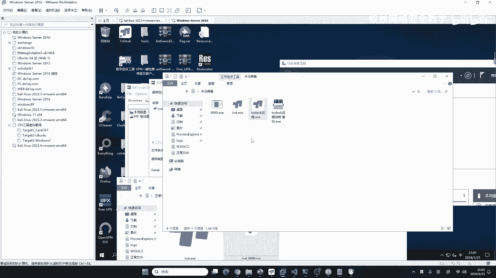

这个同学讲的非常对啊 给你点赞 我看你在群里也积极回答同学们的问题啊 说明你是一个非常，热心的网络安全工作者 咱们技术人员主要都是什么 开源互助。

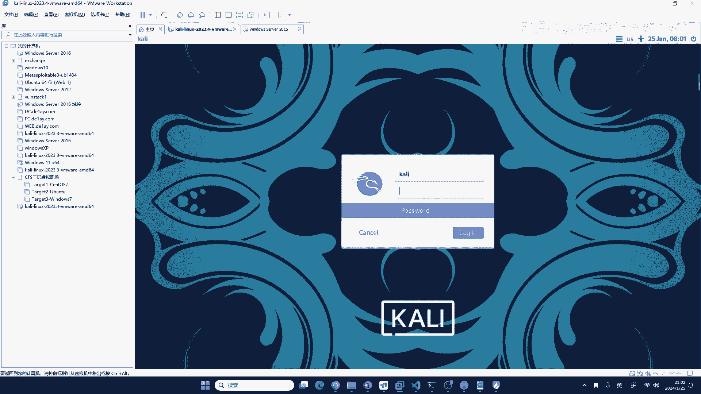

我觉得你实现 一个技术蓬勃发展 一个行业蓬勃发展 第一个就是开源 第二个就是共享 共享就是互助嘛 是吧，开源共享 这是最重要的，现在呢 但是你不能 就是我 包括这些同学们啊 都不能互相共享违法知识啊。

咱们就是合法的技术 是可以共享的 是可以开源的 下面呢 我们继续来看一下，在这里呢 我们是生成鱼沟 现在怎么开启这个监听呢 怎么去开启监听呢。

现在我们要做一件事情 就是输入这个命令 这些命令呢 我在下课之后都会整理成笔记发给大家 你可以不用着急，这个命令呢 叫做msf console，console的意思叫控制台的意思 叫命令控制台。

msf呢 就是咱们今天一直在讲的metasploit这款工具的缩写 上面msfvenom的，它也是metasploit的缩写 在这里啊 我们把msf console打开 打开。

打开之后呢 我们现在来开一个监听啊 怎么去开监听呢 咱们要用这样一个命令 叫做handler，handler在咱们的计算机中经常见到他 即使你今天不做网络安全 你也经常见到handler。

handler的意思呢 叫剧饼 有同学说剧饼啥玩意 从来没听说过，同时呢 这个handler他不仅有剧饼的意思 他还有个叫做处理程序 负载程序的意思。

同时呢 他也有鱼沟的意思啊 鱼沟的意思 但是沟子是hook，他有一定的 他跟hook有一定的关系啊 就handler，这个handler什么时候需要更新数据库 我这个操作不需要更新啊。

就是现在咱们metasploit跟postgresql的结合程度是比较低的 你可以不需要更新数据库 直接用就行，咱们这个-p -p呢 就是指定咱们的这个pilot 这个pilot在哪。

你看 你刚刚生成这个木马的时候 是不是也指定了一个-p啊 你给它复制过来，注意啊 你不要缺头缺胳膊少腿的 你直接复制过来就行啊 不要给他乱加东西 或者是少敲了哪个英语字母，好 现在呢 咱们给他复制过来。

然后呢 这个叫-h -h呢 就是host的意思 就是ip地址啊 host 主机地址，我们这个-h呢 是哪里呢 就是刚刚在生成的时候 生成的时候 你写了一个ip地址，192。168。80。

148 同样的 给他复制过来啊 复制过来，你们有问题都可以提啊 大胆的提 我这个有问必答 好吧，当然 我这个上课的进度还是要保证 我可能 你如果就是心里有一些其他的问题啊。

或者是跟咱们这节课不相关的 你可以在课后互动区给你们这个10-20分钟的时间 尽情的提问，现在呢 这个9999是吧 给他复制过来。

复制过来之后 粘贴到这里 这个-h就是host 主机地址 这个-p就是post 就是port，现在咱们回车一下 这个鱼钩啊就开起来了 这个鱼钩啊就丢到水里了，丢到水里之后干啥 咱们啊等着鱼上钩。

你有心理问题 没关系，一会啊 咱们下课之后 你 或者是说 课后留给你十来分钟的时间 咱们都可以沟通，这个同学说到目前免查的主力技术是什么 目前免查的主力还是，对一些sharecode的混淆。

然后在混淆的时候 以前是直接的把这个 就是，木马的这个核心 加载到内存中去执行 但现在的话呢 都是使用一些，其他的api这个接口 然后去实现对内存的加载 然后去运行，同时呢 还加上一些反杀枪的技术。

就是因为现在的查查方式太多了 等下我会跟你讲 好吧 等下会跟你讲查查方式 做针对性的免杀，你叫你查开放记录 这个东西怎么可能叫你查 是吧，这个同学讲的。

这种东西查开放记录 除非你是找警方 是吧 你自己受到了什么呀，受到了这个不公的对待 你可以去找警方 警方呢 在判案的时候 他是会帮你去查这些信息的，现在呢 我们来看。

现在我们把鱼钩丢到了河里 丢到河里之后干啥。

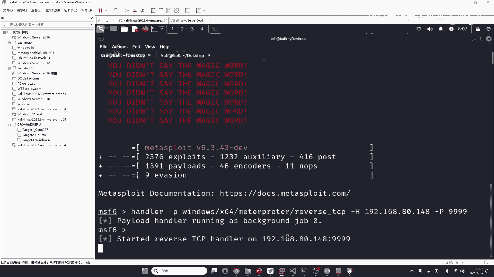

我现在就假装这个受害者 就给我假装我是个傻子啊 二一老师现在假装自己一个傻子，我去运行这个后门 看运行这个后门 双击，双击后门之后 我们的to desk是不是出现了安装界面 同学们看好。

我运行了这个后门 是不是跳出了to desk安装 然后这个受害者会干什么 他会自己的去安装这个to desk这个软件，是吧 他会去安装 一切正常吧 快速安装 是吧。

to desk能不能打开呢 我们安装之后看能不能打开 能打开吧，好 能打开 好 现在呢 我们这个软件正常运行 但是这个木马。

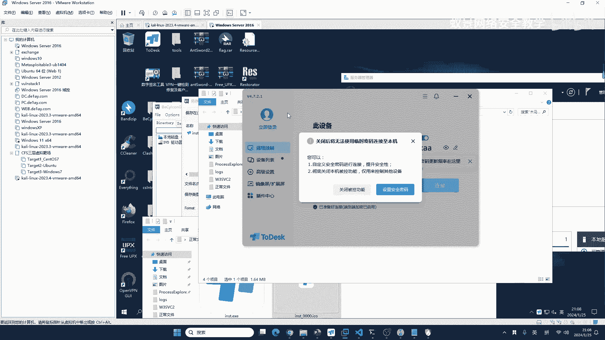

也启动了 来看同学们，直接上钩的这个鱼 这个鱼叫啥呢 这个鱼啊 就是我之前告诉大家的metasplate给他起的名字，就是metapretor 就是上线的鱼。

你上线你钓鱼 你钓鲢鱼 你钓鲤鱼 你钓鲫鱼 但是这里啊 我们钓的是叫metapretor session，就是metapretor汇划。

to desk就是跟向日葵一样啊 是吧 就是跟向日葵一样啊 肯定会被识别啊 咱们又没做免杀呢 几啥，肯定会被识别的 咱们还没做免杀呢。

to desk和向日葵啊 是同系列的产品 现在上线之后 咱们可以做什么，比如说 我看一下这个鱼 看一下这个鱼怎么做的好吃 是吧 咱们进到这个session1里面 这些命令。

这些命令 我都会发给大家 你不要着急呀 就是有同学说 你讲太多了 记不住 谁都记不住 除非就是你本身就会。

知道吧 你本身不会的话 你怎么可能记得住呢 在这里 咱们到这个位置之后 到这个位置之后 我们要干什么呢，举个例子 好吧 如果你不知道干什么 你就在这里敲一个问号 就你问他 哎 我要干啥。

敲一个问号 你看这时候就出来一大堆东西啊 这一大堆东西里面，左边是命令 右边啊是描述信息，就是说 左边是命令 右边是描述信息 这个描述信息看不懂怎么办。

自己翻译啊 你不要指望着 咱们看到一个英语怎么用啊 自己在那纠结，自己在那背英语 都没有必要 现在翻译软件这么多 翻译软件这么多 你直接的去用就行了。

直接的用就行了 看看摄像头 咱们看不到 为啥呢 因为二一老师用的是台式机，我的台式机没钱 买不了摄像头 所以说就看不了了，那这时候咋办呢 要看摄像头的话 大家就输入这一个东西啊 叫做。

webcam snap snap是什么意思 snap是snapshot 就是快照 就是照相的意思，webcam呢 就是电脑摄像头webcamera就这个意思 好，你只要输入这个命令就能拍照。

但是就是说 它一定能成功吗 肯定不能呀 就比如说二一老师这里拍照就会失败 为啥呢 因为我的电脑没有摄像头 你拍个啥呢 是吧。

我的电脑没有摄像头就拍个啥呢 那咱们怎么办呢 我就演示一个命令好吧 其他的你可以自己去看，比如说关机 比如说上传文件 比如说下载电脑的文件 或者是说呢 做键盘记录 做鼠标控制，以及呢 远程控制它。

那现在呢 我只演示一个 就是screenshot 因为其他的都是一样的 你这些命令你都可以输 是吧 screenshot回车一下，咱们就截了一张图 这个图长哪去了呢 在这呢 这个图在桌面上呢 看到没。

他有一个英语提示啊 有一个英语提示告诉你呀 告诉你这个叫home，tiny desktop就是在桌面中有这个叫jpeg的图像 我们打开它。

看就jpeg 这个图片是什么呀 同学们 就是我对他截了一张图 对这样一个。

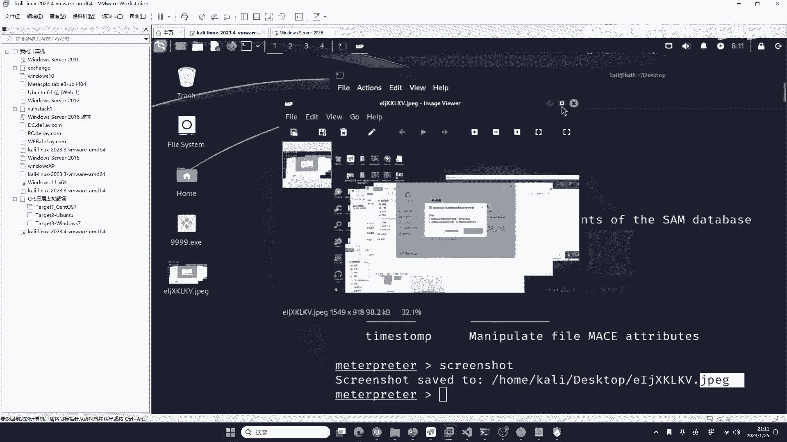

系统截了一张图 来实现了这样一个操作 当然呢 这只是。

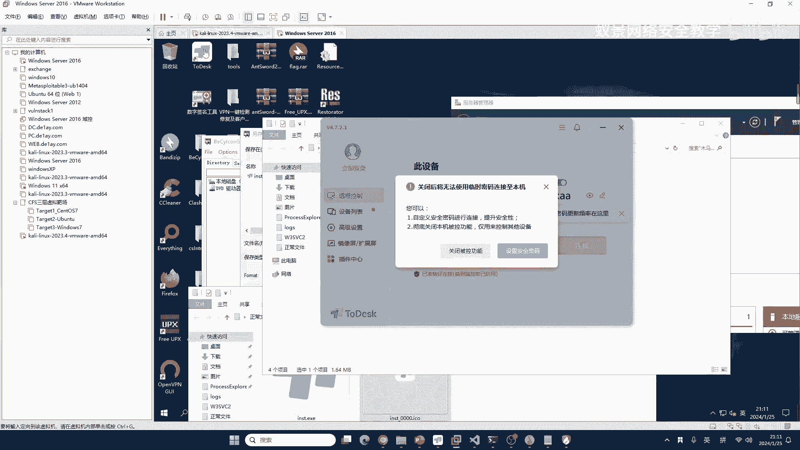

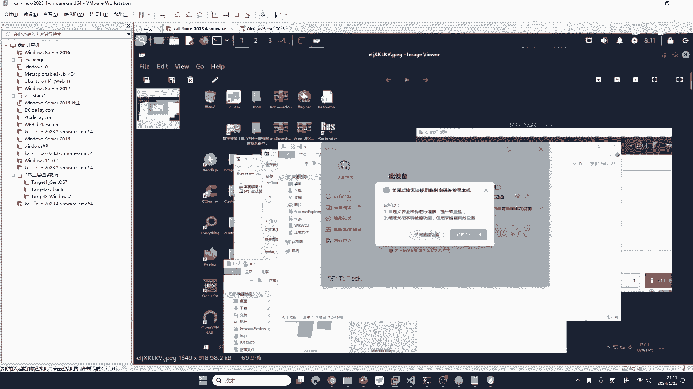

玩一玩 是吧 耳系 耍耳系 因为咱们真实的情况下 有同学说这个截图有什么功能吗 这截图，你们觉得 如果打工坊的时候 你面对一个人。

当然可以监视屏幕 监视屏幕的话 可能需要的带宽比较多 我可以给你瞅一瞅啊，当然可以监视屏幕 就是vnc啊 远程连接都行，我想问一下 就是同学们 你们觉得在实际的这个工作中 你拿到了一台别人的电脑。

你是做屏幕截图 还是做拍照 同学们 你会选哪一个 是拍照还是屏幕截图啊，可以看文件 对 可以看文件的，肯定是截图，截图能干啥呢 能够获取敏感信息 对 看文件和截图 这是最重要的。

我们主要的就是说 他的敏感信息，很重要 这个zzz给你点一个赞 这个是个非常好的方法，就是很多的高级红队 他会写定时任务 首先我们站在开启摄像头的角度。

开启摄像头 你很容易被别人发现啊 因为很多的电脑在摄像头打开的时候 它都会亮一个指示灯，或者是呢 这个电脑的右下角有提示 就是说 你这个摄像头已经被打开了，它是有提示的 对 有光 很容易被别人发现。

但是屏幕截图呢 这个动作根本就没有触发系统调用，沙都软件是不会检测到在屏幕截图的 但沙都软件会检测到你正在拍照，拍照是要调用系统驱动的 但是截图不需要。

截图 这个zzz同学讲的 就是一直截 有些红队会写自动化的程序，10秒钟或5秒钟给你截张图 截图干啥，你想一下 如果一个犯罪集团，他们肯定需要有大量的这个犯罪人员进行微信聊天 来去获取受害者的受骗信息。

所以说呢 就是通过截图来去取证他们的微信 或者是取证他们的操作，如果你是录像的话 或者是你对电脑录屏的话 他怎么办呀，就会被别人发现了 因为你有大量的流量在上传 别人是可以发现你的。

所以说 最标准的方法就是截图 你们通过抖音 包括小红书 应该也看过，就像有的监控设备啊 他就是说怎样获取，这个员工的微信聊天记录 就是说啊 每隔三秒钟给你截张图 然后再做文字识别。

你截一个图 他又不要费多大的这个空间 是吧 也不需要费多大的这个流量，所以说呢 轻松的就能够获取你的微信聊天记录 这就是截图的功能。

第二个呢 就是看敏感信息 比如说呢 他桌面上保存了什么 他平常都在干什么事情，他的浏览器有哪些历史记录 他的浏览器中保存的密码是什么 这都是在实际工作中能用到的，能用到的东西。

好的 这是咱们的捆绑木马 你可以看到。

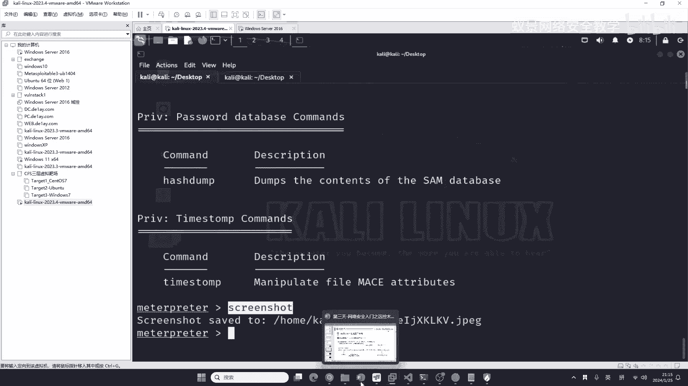

在捆绑之后啊 这个正常的软件 它是可以运行的，todesk也好 向日葵也好 或者是你使用的微信 腾讯视频 qq也行 都是一样的道理。

现在咱们面临的最大的问题 就是这个捆绑木马 你没有做免杀 杀的软件还是能够识别，就是说 我们现在虽然把它变得更高级一些了 但是杀的软件还是能够轻松的识别它，这时候怎么办呢 我们就要寻求免杀技术。

你们觉得有没有一种通用的方法 能绕过世界上所有的杀的软件啊 这一种是肯定不存在的，如果存在的话 只能说啊 这全世界几十种杀的软件实在是太菜了。

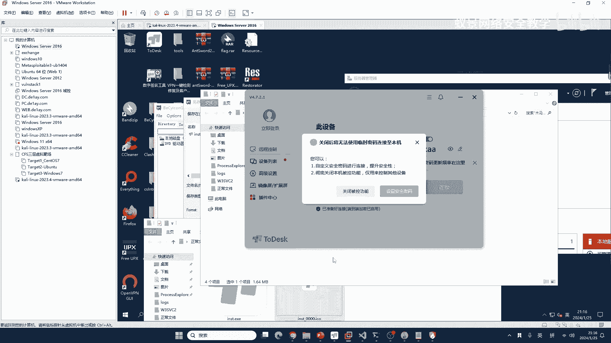

你说你绕过360还行 你要是说你全部都能绕过去 你就是瞧不起这些公司。

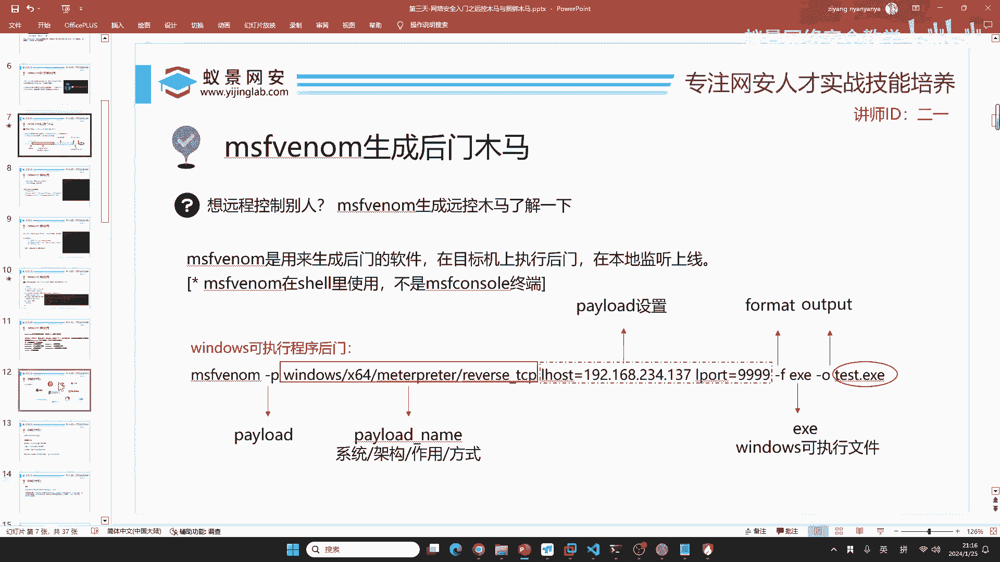