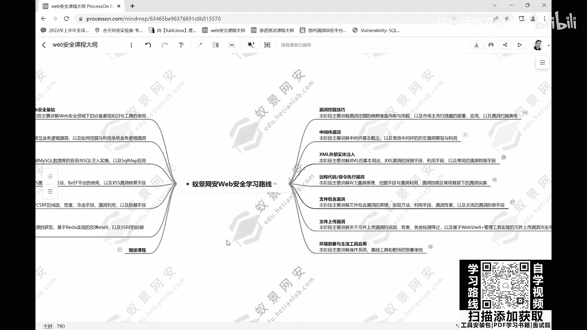

# 【零基础学网安】B站最全的网络安全教程，从入门到精通，学完即可就业，看完还学不会我退出网安圈！（渗透测试／kali渗透／内网渗透／黑客技术） - P1：web安全学习路线.mp4 - 蚁景网络安全教学 - BV1fctLevETn

在本期视频开始之前能麻烦给个三连吗，啊你要白嫖啊，那就给我一个免费的赞呗，谢了，这对我真的很重要。

web安全的学习，应该是一个体系化的内容，考虑到整体技术的难度，我们整个学习过程中，应该是需要循序渐进的去进行这个学习，在整个过程中，不停的去感受到自己的提升，在这个情况下，我们才可以能够更好的坚持。

持续的保持学习下来，在大家现在看到的脑图之中，我们依照技能的学习顺序，让大家逐步的去上手，从简单的再慢慢进阶到复杂的，把各种类型的技能，进行了一个细化的分类，以便于大家可以更加完整。

并且轻松的去掌握到整个，关于web安全的学习内容和技术体系，在这个体系当中，首先我们可以看到它的内容非常多，我们把所有的主题全部展开之后，就会看到，它有很多的内容，可能对于任何一个人来讲，我们的学习。

可能都会花费很长的时间，才能够把脑子上所列举下来的，所有东西全部学完，所以我们在这里，给大家去简单说一下，大家看到脑图也不用紧张，也不用觉得东西太多，对吧，按照一个web安全的整体学习。

为了让它更有效率的学习，首先第一个我们要学习的，应该是web安全基础这一块，有没有发现，当我们收起来之后，其实要学的东西，也就不是那么多了，对吧，首先在接触到web安全的时候，第一阶段，我们先要掌握到。

web安全的一些基础，这些基础包括什么，比如说网络协议，在整个的互联网的所有软件当中，我们都是基于网络协议，来进行数据传输的，所以了解清楚网络协议的相关内容，搞清楚IP。

搞清楚http相关的一些具体的内容，对于我们的后续学习，一定会事半功倍，所以像是IP，像是http这样的一些东西，我们把它熟悉好之后，是非常有帮助的，除了IP和http这样的一些网络协议之外。

接着在web安全领域上面，我们会频繁的使用到，某一些特定的工具，这一块首先，作为网络安全领域下，应用最为常见的一个抓包工具，叫做Burp Suite，这个东西也是我们在web安全的领域下。

技能学习的重中之重，Burp Suite它也同样包含有非常多的功能，像是Burp Suite代理，像是它的一些常用的模块，像是它的一些弱口令爆破，或者说是密码破解的，这样的一些实操。

这个是我们需要去懂得的，一些基本的使用，接着对于web安全，整个技术的学习，其实我们能够达到最直观的收益，并不是通过就业，或者说是其他的一些比赛之类的内容，而是什么，SRC的挖掘能力，所以web安全。

首先我们要搞清楚，SRC的独立挖掘的能力，是怎么去做的，常态化的一些操作行为，我们都要搞清楚，在了解完web安全的技术体系之后，我们接着就要开始进入到web安全的，一个相对比较核心的技术体系。

内容学习了，这个体系内容，就是有关于漏洞的学习，我们把所有的漏洞，按照目前市场上遇到的一些常见的，一些容易频繁出现的，这样的一些漏洞的情况，我们把它做了一个简单的排序，这个排序第一就是业务逻辑漏洞。

这也是我们在进行漏洞挖掘的时候，非常常见的一个漏洞类型，业务逻辑漏洞，对于这个漏洞的整体，我们会跟大家来讲解，有关于业务逻辑漏洞本身是什么东西，它包括有像是URL的跳转漏洞，像是信息轰炸的漏洞。

像是密码找回的漏洞，还有包括说像是支付逻辑的漏洞，这些漏洞他们是怎么样去发现的，大概会是在什么样的一些位置，以及说漏洞如何去利用，如何去绕过它本身的一些验证机制，以及常态化下面。

我们这些漏洞的一些修复的手段，会是什么样子的，通过这一章节内容的学习，我们就可以非常完整的去掌握到，关于业务逻辑漏洞，这样一个非常主流的漏洞技术体系，它应该是怎么样的一个操作情况。

包括说各种类型业务下的业务逻辑漏洞，它的成因，以及我们的挖掘和利用的方法，是什么样子的，就会在业务逻辑漏洞这一个阶段，下面会具体的去了解到，了解完业务逻辑漏洞之后，接着我们需要去了解一个。

在web安全领域下，非常主流，也非常常见的，另外一个漏洞，叫做secure入漏洞，secure入漏洞，它全程是基于软件的数据库，来搞的一个漏洞的相关内容，所以我们在掌握secure入漏洞的时候。

我们必须得优先去了解到，整个数据库，它在软件系统当中，它的用途是什么样子的，以及说它的数据管理的原理，以及包括说，市场现在最主流的关系型数据库，mysecure数据库的一个使用，到底是什么样子。

所以在这里我们列举出了，包括数据库本身的，一些基本的概念的东西，需要我们去了解的，包括mysecure本身的一些环境的安装，远程连接的一些手法，包括说通过一些常用的secure语句的，操作。

来操作我们的数据库，增删改查这些，包括一些常态化的函数，查看我们当前的状态，查看我们当前的版本等等，然后以及在secure入入领域下面，我们会非常常用的一个，叫做information schema。

这样的一个库，它有什么样的作用，我们可以做一些什么样的事情，通过在secure入入领域的前面，这一部分，我们把数据库的相关基础，做一个相对比较系统的学习，接着我们就会开始来了解到。

secure入入本身的内容了，像是secure入入本身的，它的一些基础，它的基本的概念，它的注入的原理，它注入的手法分类，包括说这个漏洞，它会产生一些什么样的危害，以及说搭建一些。

跟我们secure入入相关的靶场，比如常见的，像是dwa，像是circle i，labs，这样的一些东西，像这些内容的搭建，可以便于我们，很好的去学习到，secure入入的这样一个技术。

再把前期的环境的部署，以及说数据库的基础，全部都掌握之后，我们开始需要真正的进入到，secure入入的一个技术的掌握，和学习过程中，在这个过程中，会结合到联合查询，结合到布尔盲注，结合到时间盲注。

结合到报错注入，以及说宽字节注入，secure map的工具应用，这样的一些技术维度，带大家全方位的去了解到，有关于secure入入，这样的一个漏洞的技术学习，应该要掌握的所有内容，像是联合查询当中。

我们对于漏洞进行，判断它是否存在，以及对于漏洞当前，判断我们需要注入的数据类型，是什么样子的，然后通过一些方式，来明确到，我们需要展示的查询列数，确定我们的显示位，然后再从而获取到，我们想要获取的数据。

包括通过注尔盲注，对于无回显的，对于无回显的这种，显示状态，我们来如何进行secure注入，包括说时间盲注，它也是一样的，对吧，有很多的注入方式，这些不同的注入方式，都可以应对在不同的场景下面。

所以我们在学习secure注入的时候，不能够只是单纯从一个，注入的维度去思考，我们在应对到不同的系统，所应对的环境场景，真的太多了，所以对于secure注入的掌握，它有非常多的方式，方法。

是需要我们去掌握的，在这样的一个掌握情况下，我们才可以很好的去了解到，整个secure注入，它各种主流的注入方法，以及包括说，我们还需要去了解到，在secure注入这个领域下面，有一个非常常用的工具。

叫什么的，叫做secure map，secure map，它在secure注入的领域下面，它是起到一个什么样的作用，它的环境，该怎么去部署，我们怎么使用secure map的工具。

更快速的去找到系统当中，存有的secure注入的，这样一些漏洞，这些注入点，以及说通过secure map，可以很好的帮我们实现到注入，来获取到我们想要的内容，这也就是我们所讲到的。

自动化注入的一个实现，所以整个secure注入，这一章节的内容讲解，我们会，让大家去了解到，mysecure数据库的相关的应用，以及secure注入的，一些相关实操的技术，技巧。

同时也包括有secure map，它本身工具的，一些自动化注入的应用，通过这样的一些技术的全面掌握，大家可以对于secure注入，有一个非常好的掌握，然后第三个漏洞的讲解，就是跨站脚本攻击漏洞。

也就是俗称的，XSS漏洞的一个，讲解，在这个XSS漏洞的讲解过程中，因为它是关联到了，系统的前端，所以说在漏洞的学习之前，我们需要对前端，有一个基础的认识，包括html，包括javascript。

包括说前端对于事件处理的，这样一些逻辑，是怎么去实现的，这些内容，全部都很好的去熟悉了解之后，我们才能够更好地去实现，有关于XSS的这样一个漏洞的利用，这个在掌握到前端的一些，相关的基础内容之后。

我们会去了解到，XSS这个漏洞，它是什么样的一个原理，它存在于什么样的场景，这个漏洞可以给我们带来一些，什么样的危害，包括说漏洞的类型，像是反射型存储型，还有像是doom based，这样的一些情况。

这样的一些不同的类型，我们都需要很好的去了解，就像我说的，不同的软件，它会有不同的表现形态，我们在不同的环境下面，应对到漏洞可能生成的，这个情况是不一样的，所以我们需要更加全面的。

去了解到漏洞的方方面面，在了解完XSS漏洞的，基本的一些原理之后，接着我们还需要去了解到漏洞，我们可以用它，来做一些什么样的事情，包括说XSS当中，HotCookie漏洞去钓鱼，或者说做流量挟持。

这样的一些情况，都是我们在整个XSS的过程中，非常常用的，一些漏洞利用的手段，然后同样的，在这个领域下，像是我们的biff攻击，biff平台的一个攻击实现，这个也是XSS下面，非常主流解常用的。

一种操作行为，所以对于biff的一个使用，我们也是需要非常清晰的，去了解到的，同时对于漏洞，本身它是有很多的修复方式的，所以我们也需要去了解到，一般情况下，我们的网站，它对于XSS漏洞的一些修复手段。

是怎么去实现的，我们在了解到它的修复手段之后，我们可以更好地去做，一些漏洞限制的绕过，让我们可以更加好的实现，XSS漏洞攻击的，这样一个手法，所以在跨站脚本攻击，漏洞的章节内容下面，我们列举了。

包括XSS漏洞的原理，以及它的常态化的攻击手段，包括说漏洞的利用方法，然后结合到biff平台的一些使用，然后同时也会要求大家去了解到，关于XSS漏洞的一些修复的手段，以便于我们可以更好的去。

对XSS的漏洞，来进行多维度的攻击，这个是我们在了解一个漏洞，学习一个漏洞的时候，必然要懂得方方面面的知识，除了业务逻辑，secure注入，包括说XSS这样的一些形态之外，我们还需要去了解到。

跨站请求伪造漏洞，也就是CSRF，跨站请求伪造漏洞，CSRF，这个也是非常常见的一个漏洞，包括说同样的漏洞，它具体的原理是什么样子的，CSRF为什么会出现，它出现之后，会产生一些什么样的危害。

我们的攻击流程会是什么样子的，包括说漏洞，我们通过什么样的一些方式去利用，包括它的get请求，它的post请求，这样的一些内容上面，我们该怎么去做，怎么去利用这个漏洞，来达到我们的目的。

同时也会有一些常态化的漏洞，修复的一些手段，这些东西，我们都需要去一一的系统掌握，这个是关于CSRF漏洞，在了解完CSRF的漏洞之后，还有像什么，像是服务器端的请求伪造漏洞，也就是我们所讲的SSRF。

SSRF也是非常常见的一个，同样的，我们在做SSRF漏洞的列举的时候，也是基于漏洞本身的一个原理，它是在什么情况下出现的，我们该怎么样去发现漏洞，以及包括漏洞，它的分类，包括有危险的漏洞，无危险的漏洞。

这样的一些情况，同时漏洞我们该怎么去利用，利用漏洞，可以达到一些什么样的效果，比如说像是攻击redos，这样的一些事情，对吧，包括说像是反弹需要的，这样的一些内容，我们该怎么去实现。

这个是基于有关于SSRF漏洞的，一个实际的使用，同时包括说像是主流的一些，对于漏洞的防御手段，像是添加白名单，像是协议的限制等等，等等，这样的一些手段，他们是怎么去实现的，基于他们实现的过程。

我们该怎样的去，绕过这样的一些防御，来更好的去对服务端的，SSRF的实现，这个漏洞的攻击，来做到一个更好的效果，这个是关于SSRF漏洞的，一个相关内容，学完这些常态化的，比较市场主流的这些漏洞之后。

其实还有很多其他的漏洞，但是在学习完主流的漏洞之后，我们优先应该考虑的是，漏洞挖掘的技巧该怎么样，漏洞挖掘的技巧该怎么样，因为我们不可能只是单纯的，去了解到，不同的漏洞，它是什么样的成因。

该怎么样去利用，我更想要知道的是，在整个网站上面，我该怎么去挖掘，这些可能存在的漏洞，所以说我们需要对于漏洞，挖掘这个东西，有一个相对比较清晰的认知，要去了解到，在整个网站当中，我们做漏洞的挖掘。

应该需要用到，一些什么样的手段和方法，所以在这里，我们也列举了，关于漏洞挖掘技术的，一些相关内容，这些内容包括说信息收集，包括说我们常见的这些扫描器，该怎么去应用的，这样一些技术，通过信息收集。

我们可以在src的挖掘前的，系统前期的信息收集工作，以便于说我们后续正儿八经，开始做src的挖掘的时候，我们可以更加有效率的去进行，这些信息的收集，包括说我们的域名信息，包括说我们的IP信息。

包括端口信息，网站信息等等，这样的一些信息，它的收集，可以让我们更好的，去了解到这个软件，了解到这个网站，让我们可以做到更好的一个，src的漏洞挖掘，除此之外，在整个漏洞挖掘的过程中。

我们还会频繁的使用到，一个叫做扫描器的东西，扫描器的内容，它分为主动扫描器，和被动扫描器两种，并且目前市场最为主流应用的，像是AWVS，像是Xray，这样的一些扫描器，都是我们平时在做src的时候。

非常常会去用到的，这样一些工具，所以说在漏洞挖掘的阶段下，我们会给大家去列举到，你如果想要挖掘系统平台的，src的漏洞，想要去做src的漏洞挖掘的话，对于整个系统的前期信息收集，以及在挖掘过程中的。

扫描器的使用，该如何去应用，来提升我们有关于漏洞挖掘的效率，这个是可以结合到，前面我们所列举下来的，每一个漏洞来进行讲解，来进行使用，来进行应用的这样的一个过程，然后同样的，除了像是漏洞挖掘之外。

还有一些常见的漏洞，包括说文件包含漏洞，它是一个什么样的情况，我们怎么去利用漏洞，来实现我们自己的一些攻击，包括说上传一些含有恶意图片，或者说包含有恶意代码的这些文件，来对我们的目标网站。

进行一个对应的攻击，对吧，像是文件包含的漏洞，与此关联的，还会有一个叫做文件上传的漏洞，我们在文件包含的漏洞过程中，我们如何去，将这些有恶意的文件，去把它传递给到服务器，所以我们需要用到文件上传。

而文件上传的功能当中，很多系统的文件上传，它都是存在有漏洞的，它都是存在有漏洞的，所以文件上传和文件包含，这两个漏洞，都是我们一般会联合到一起，去使用的东西，而在我们的脑图当中。

也详细明确的跟大家讲解了，关于文件包含漏洞，和文件上传漏洞，他们是如何实现的，他们的基本的概念，会是什么样子的，以及说如何去制造一句话的木马，像是大马，像是小马这样的一些东西。

对于webshare的实现，该怎么去做，以及说对于文件上传之后，在系统当中，把文件包含的漏洞，可以让它运行起这些木马程序，来对我们的系统，产生更多的危害，来获取更多的权限，来获取更多的数据，等等等等。

这样的一些攻击手段，以及说针对于系统已有的，它的文件检测机制，或者说它的一些防御手段，我们该如何去绕过它，在我们所列举到的，关于文件包含和文件上传漏洞当中，我们都有详细的去说明。

除了文件包含和文件上传之外，还会有像是xml，就是参调的外部实体，注入的，XXe的漏洞，像是XXe的漏洞，因为它关联到了xml，这样的一个内容，所以我们得需要先了解到，参调它的一个基础概念。

包括说它的语法规则，是什么样子的，参调它的一些数据类型，包括什么，包括文件它的格式编写，是什么样子的一个形态，参调到底是个什么东西，以及说dtd，这个也是我们在参调的，应用过程中。

非常常见的一系列的内容，然后除此之外，对于XXe的漏洞，它是一个什么样的情况，我们该如何去利用这个漏洞，如何将xml的外部实体，注入这个，实现，在整个的xml的外部实体，注入XXe的漏洞。

内容讲解过程中，我们会非常详细的，把整个XXe漏洞的一个实现，包括它本身的介绍，包括它的利用，包括漏洞的常态的，一些修复手段，都会列举在这样的一个，阶段内，让大家去可以更加清楚的了解到。

有关于xml的外部实体注入漏洞，除了这些常态化的，一些技术漏洞之外，还有我们软件系统架构体系上面，可能会关联到的一些中间件，这些中间件本身，它也是存在有漏洞的，除去我们前面所讲到的，secure注入。

这样的一些内容之外，还有额外的，比如说像是jboss，像是weblogic，这样的一些历史版本过程中，它可能存有的漏洞，如果说对方的软件系统，他们使用的是这样的一些中间件，并且恰好他们使用的是。

这样的一些历史版本的话，也就意味着这些漏洞，是可以直接被我们所使用的，但是在讲这些jboss，讲weblogic之前，肯定大家还是得要先了解到，所谓的中间件的概念是什么，所以大家肯定要学习。

中间件的漏洞的话，优先你得要先考虑清楚，关于中间件，它到底是一个什么样的概念，同时像是历史版本下面，存在有明显漏洞的，这样的一些中间件，像是jboss，像是weblogic这些东西，他们这些漏洞。

到底是什么样子的，以及这些东西，他们自己是什么样的概念，这些漏洞，我们该怎么去利用，这个漏洞该怎么去发现，这样的一些内容，都是我们需要去了解到的，当我们了解到，这样各种维度的漏洞之后。

我们所应对的软件系统，它存在有任何一个维度的漏洞，都可以被我们非常清晰的去了解到，所以这个是我们所列举到的，关于web网络安全这一块，关于web安全这一块，我们应该需要去了解到的一些。

学习到的一些非常核心，且市场非常主要的技术体系内容，都在脑子上面，已经完整的列举了，而这个内容，如果大家有需要的话，可以去私信我们，找我们来要这个脑图，这个是没有关系的，然后除了脑子上所列举的。

这些常态化的漏洞，包括说web安全的一些基础内容之外，还包括有一些什么，对于web安全这个领域，如果说你想要好好的去学会它，想要让自己变得能力更加强，能够让自己可以学得更加完整，有两个东西一定绕不开。

一个是操作系统，Linux，因为我们应对的所有的软件系统，基本上99。99%，都是基于Linux操作系统，搭载的服务器，所以我们在做这些，web安全的学习，对于漏洞的一些挖掘和利用的时候。

我们一定需要去操作到，对方的操作系统，服务器，这个服务器基于Linux来部署的话，所以我们一定要了解到，Linux相关的内容，包括它常态化的一些指令，包括它本身的目录结构内容，包括它的用户组的权限。

等等一系列的内容，这些都是我们需要去了解到的，除了Linux之外，另外一个绕不过的就是PHP，可能你作为一个初学者，或者说有兴趣去想要了解的同学，你只需要按照脑子上面，前面所列举的这些漏洞的内容。

你把它全部学会，你就可以开始做src的挖掘，或者说你就可以开始进入到这个领域了，但是如果你想让自己卷起来，你想要让自己偷偷的经验到所有人，那么肯定在除去这些，web安全的常态化的。

技术体系内容的学习之外，你肯定还是得要去优先掌握到，一门叫做PHP的语言，PHP的语言在未来的时间里面，一定会给到你比较好的帮助，所以在这里我也列举了一些，关于PHP的这门语言，我们应该学习的内容。

包括说它的网站开发该怎么去实现，它的编程的一些基本的编程内容，该怎么去做，它的环境部署它的函数，它的对象等等，这样的一些内容，然后同时也包括说，像是PHP的代码审计，我们如何去做代码审计。

代码审计该怎么开展，中间会应用到一些什么样的技术，用到一些什么样的技巧等等，这些内容我们都会给大家去列下来，希望大家在除去web安全的，技术领域的学习之外，还可以去学到更多，其他在这个行业内有用的技术。

这个就是给大家列举出来的，这样一个web安全的，脑图的内容，如果大家已经听到这里了，觉得能够坚持下来，听到这个时候的同学，我觉得要一个三连，应该不是特别过分的一件事情，还望各位听到现在的同学。

可以给我一个意见三连，鼓励鼓励我，那么这一套，就是有关于web网络安全的内容，如果说大家想要进入这个行业的话，你不知道该学什么，不知道该怎么办，没有关系，你按照我列的脑图，你就无脑去学就完事了。

你无脑学会脑图上所列举的东西，按照我所讲的，从web安全到业务逻辑漏洞，到secure注入漏洞，再到跨站脚本攻击漏洞，再到跨站请求伪造漏洞，再到服务器端请求伪造漏洞，再包括漏洞挖掘的技巧。

以及说我们的文件上传漏洞，文件包含漏洞，包括远程代码的执行漏洞，参调的外部实体注入攻击漏洞，以及常见的中间件漏洞，你如果按照这样的顺序，一个一个的去列下来去学习，按照我的脑子上给到的这些技术，内容。

你无脑去学，你一定可以进入到，web网络安全的领域，一定可以成为一个，合格的网络安全人员，这个就是我要跟大家所讲到的，关于web安全学习路线上的一些内容，好。

