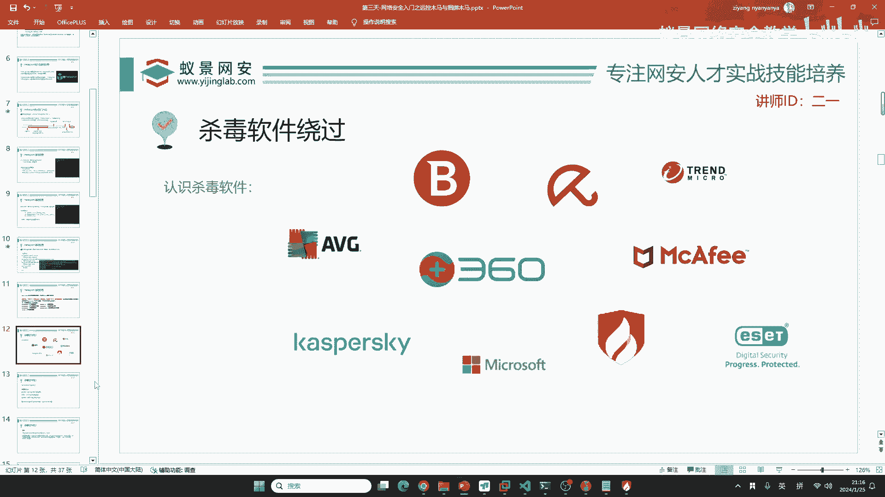
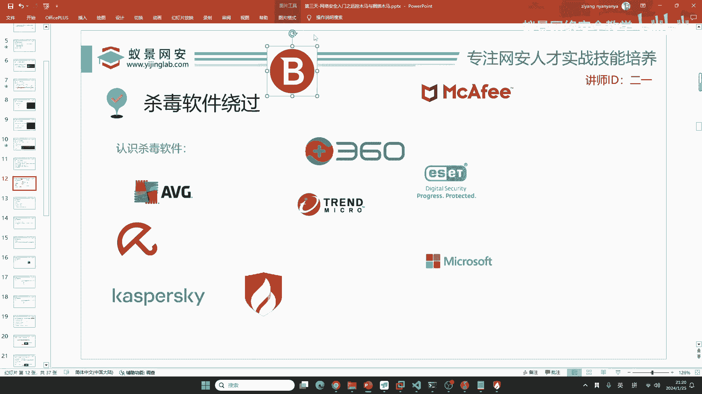
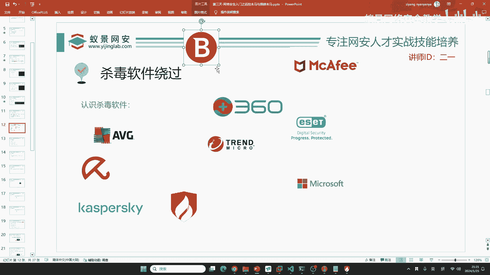
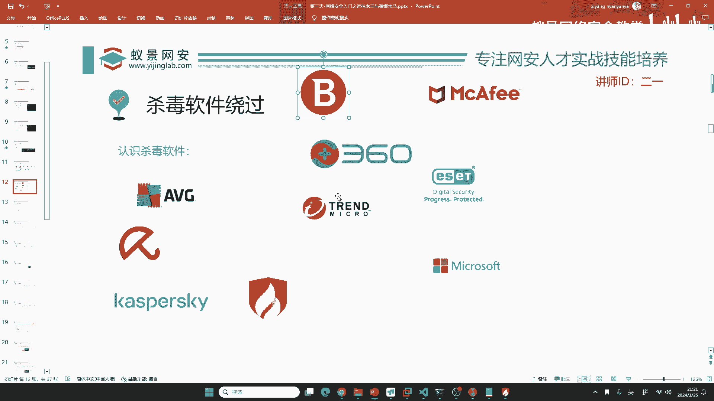
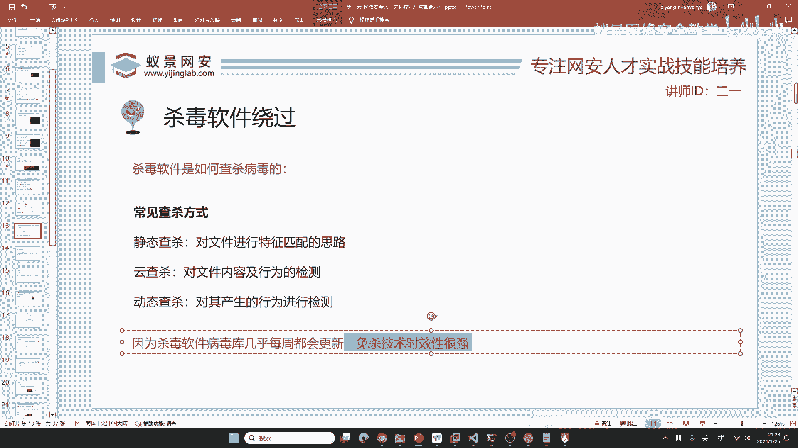

# 【零基础学网安】B站最全的网络安全教程，从入门到精通，学完即可就业，看完还学不会我退出网安圈！（渗透测试／kali渗透／内网渗透／黑客技术） - P20：11.遇到杀毒软件怎么办.mp4 - 蚁景网络安全教学 - BV1fctLevETn

我们来认识一下世界上占比最多的杀手软件，有同学说我知道腾讯电脑管家，腾讯电脑管家我的天哪，你加个壳都能绕过去。

腾讯电脑管家，它的占比并不高，我们要了解这个世界上占比最高最强的杀手软件，首先这些杀手软件要么是国际大厂，要么就是欧洲欧盟的公司，因为欧盟啊，在计算机一开始的时候啊，在一开始的时候。

就是欧盟经常遭受恐怖袭击，所以说这个欧洲的国家非常担心自己的网络安全，那他们的网络安全建设也可以说是最好的，包括俄罗斯啊，包括俄罗斯，我们来了解一下，首先AVG。

这个东西在全球的占比基本上是前三是国外的，然后呢，这是卡巴斯基，这是俄罗斯的，同学们应该听说过，卡巴斯基呢，以他的杀毒比较强，闻名于世啊，闻名于世，还有就是咱们大名鼎鼎的360，周鸿毅创建的。

同学们应该知道周鸿毅吧，周鸿毅360，然后呢，就是国内一个非常良心的，他轻量级杀毒软件，杀毒又非常强，就是火荣安全，专业的安全团队和研究院，这个是来自罗马尼亚，欧洲一个小国家的比特凡德，在全球的占比呢。

基本上也是前三，它的作用呢，就是杀毒引擎非常厉害，并且呢，比特凡德在这个勒索病毒的防治方面，是非常牛逼的，这个东西，这个是小红伞，小红伞呢，小红伞也是欧洲的一个杀毒软件啊，以前同学们知道不。

360使用的就是小红伞哦，在360初创的时候，360是没有自己的杀毒引擎的，所以说呢，360他就跟小红伞进行合作，就是说360的广告部分，由360自己做，360的杀毒部分呢，就交给小红伞了。

就是他内置一个小红伞，是吧，小红伞，然后这边呢，是麦咖啡，当然360现在已经拥有了自己的杀毒软件了，已经拥有了自己的杀毒引擎了，叫昆蓬，昆蓬引擎，这里呢叫麦咖啡，麦咖啡的占比也比较高，但是啊。

现在因为他的一些模型的操作啊，被大家吐槽的比较多，这个麦咖啡，他可能啊，大家可能不会去使用他，但是他很强啊，他很强，这边是趋势杀毒，趋势杀毒的话呢，他没有免费版，但是呢，他的杀毒能力。

包括对于后渗透的防御能力是非常强的，现在你在互网中，有些啊，有些这些，就是说客户，他重视安全，可能会花钱购买系列的趋势杀毒软件，来进行这个病毒的防治，这些东西是非常难绕的，然后这个叫ESET。

ESET呢，也是欧洲的一个杀毒软件，他比较火啊，杀毒能力也非常强，那有同学讲啊，老师，你讲的这些我都没装，那怎么办呢，不用不用担心啊，不用担心，就是咱们的电脑会自带，微软自家的杀毒软件。

Windows Defender，Windows Defender呢，在静态杀毒中是非常领先的，为什么他能领先呢，就是因为他病毒库多，病毒库大，同学们知道啥是病毒库吧，病毒库就像是这个公安的犯罪嫌疑人。

犯罪嫌疑人啊，他是就是说会公开到社会上，比如说呢，现在指定啊，某某地的某某人，他叫什么东西，他的照片是什么样子，他的身份证是什么，现在啊，比如说啊，比特凡德发现了一个新型的病毒，他发现这个病毒啊。

他的特征，然后呢，就把他列为犯罪嫌疑人，这个东西呢，我们把它叫做病毒库，或者是威胁情报。

然后呢，他会把这个病毒库，共享给其他家的杀毒软件，他会共享啊，就是说比如讲，在江苏省有一个人犯罪了，他逃窜到了广东省，或者是逃窜到了南方，这时候呢，江苏省的公安，会把犯罪嫌疑人的信息。

同步给全国的公安干警。

然后进行联合抓捕，杀毒软件同样也会做这件事情，他们会互相同步病毒库，这就导致了什么呀，导致了免杀的技术，非常有时效性，你今天学了这个免杀，可能过了一个月，就被某一个杀毒软件干掉了。

这是肯定的事，现在我们来了解，那这些杀毒软件之所以这么强，他们都是怎样做到的呢，他不可能说只基于这样一个犯罪嫌疑人的特征，进行查杀吧，确实是是的，首先如果是基于病毒的特征，或者是病毒的犯罪嫌疑人的特征。

来去进行的查杀，这种呢我们把它叫做静态查杀，静态查杀是所有杀毒软件必备的功能之一，它主要的呢就是自己有一个非常庞大的病毒库，你现在下了一个软件，他就啊去给你检测一下，看一看这个软件啊。

在不在自己的病毒库里面，如果在就会识别成是恶意软件，这是咱们的静态查杀，火荣和windows definer采用的都是这种方式，下面我们来看云查杀，云查杀呢，同学们应该知道360安全云大脑。

他采用的就是云查杀，云查杀，他主要呢就是把你下载的软件，比如说你下载了老师发给你的软件，这个软件呢，他会上传到360的服务器上面，这个服务器呢，他会做这个病毒的分析和杀伤检测，以及行为检测。

比如说检测到你这样一个病毒会勒索，或者是检测你这个病毒会去连接到某一台黑客服务器，那他就认为啊，你这个软件是病毒，但是云查杀并不是100%的，比如说你下载的一些文档，下载的一些游戏。

或者是下载的一些音乐，我相信啊，我们每一个人都不想360去获取我们下载的文件信息，这样的话呢，我们不知道自己的隐私是否可以得到保障，所以说云查杀在很多时候是不会生效的，他压根就不会做上传操作。

很多同学在使用360的时候，也会将云查杀关闭，因为我不想把我的软件上传到他们的服务器，但是啊云查杀是这样一个效率最高的，什么特征，什么是特征，特征比如说犯罪嫌疑人，姓名身份证号，这个样貌就是特征。

我们的这样一个软件，他也是有特征的呀，比如说他的软件名图标软件的特殊的hacks编码，都是属于相应的特征啊，包括软件的哈希值都是他的特征，就比如说咱们公民的身份证号一样，就是咱们的特征啊特征码。

云查杀很明显是最有效的，这个是最有效的查杀，但是他的弊病很大，就是不是说我所有的软件都到这个云上去查杀，这一个东西，你想一下你一个人，别人360都承担不起，更何况用360的用户，这个高达上亿人。

上亿台机器都使用360，他肯定受不了，第三个呢叫动态查查，动态查查是啥呢，就比如说你现在穿了一个吉利服，是吧穿了一个吉利服，同学们玩过吃鸡吧都玩过是吧，穿了一个吉利服，别人是不是看不到你，看不到你。

你为什么要穿吉利服，就是因为你要开枪，你要暗杀，当你的枪开出去的这一刻，是不是再穿吉利服也会暴露啊，再穿吉利服，只要你一开枪，你的位置都会被暴露，动态查查就是基于这一点，就是说你这个病毒没问题。

你现在蒙混过关了，但是你这个病毒后续，是不是要打开摄像头啊，是不是你要去干什么，你需要干什么，你需要进行截图啊，或者是说，你现在要进行敏感文件的窃取啊，你想看看我的浏览器浏览了什么，奇怪的页面。

我的历史记录，是不是都想去看呀，你这些东西就叫做危险行为，现在你这个病毒我不查你，但是你做的后续操作会被我精准的探测到，然后呢，我就给你列为黑名单，就证明你现在这个软件就是恶意软件，就是远程控制木马。

动态叉叉几乎难以逃避，为啥呢，我之前讲过你的吉利服穿得再好，只要你一开枪总是会暴露的，你们应该也看过一些碟中碟，或者是一些暗杀类的电影，特工类的电影，只要一开枪就立即的转移自己，就是因为啊，他被暴露了。

这就是动态叉叉的优点，但是动态叉叉他有一个很大的弊端，就是会占用系统大量的资源，比如说像卡巴斯基就可以打开动态叉叉，打开之后呢，你的电脑就会无缘无故的卡顿，所以说呢，现在卡巴斯基已经优化了策略。

包括像360本身也是，他不再进行全面的动态叉叉，保障性能就电脑性能不会受到损，那你会觉得这么好用的查询方式，为什么杀人软件会把他抛弃，或者是把他缩减呢，就是因为啊，古人就说过一句话，鱼可熊掌不可兼得。

如果你现在要绝对的安全，很简单，关机就安全了，只要你开机联网，你就时刻你的电脑就暴露在危险之中，这个危险和安全，它是一个平衡点，不是说你现在这个世界上没有病毒，没有病毒很简单，你又失业了，知道吧。

没有病毒，你又失业了，所以说病毒越多，对咱们越有利，漏洞越多，对咱们越有利，你不要指望着哪一天没病毒了，你就失业了，那所以说呢，这个病毒库包括沙的软件，你想火荣，火荣他几乎一个星期要更新两三次。

所以说什么，棉纱的技术失效性。

