# 【零基础学网安】B站最全的网络安全教程，从入门到精通，学完即可就业，看完还学不会我退出网安圈！（渗透测试／kali渗透／内网渗透／黑客技术） - P21：12.绕过杀毒软件实操.mp4 - 蚁景网络安全教学 - BV1fctLevETn

我们来看一下啊，比如说免啥又什么呢，第一件事情，就是说我改变程序的特征不就行了吗，就是刚刚有同学在互动区提出的加可，那加可呢他有一个弊端啊，就是说像360这种shadow软件。

他会直接的把加可后的程序视为恶意软件，知道吧，他会把加可后的程序视为恶意软件，你现在这个软件，你现在这个软件，他这一个就是被加可了，360一看，虽然360不知道他到底是不是恶意软件，但是他看了你加可。

他就认为你是病毒，360就会发起警告，所以说呢像加可，他的通用性不是特别广，360都能识别，那如果是他们这些呢，那也可以说是轻而易举啊，他们这几个家也是轻而易举，好那这个同学说，上钩了是不是断网就行。

当然啊，再牛逼的远控，你只要把网线一断就凉了，除非就是禁源渗透，禁源渗透是什么意思，就是同学们在微信群里面踊跃交流的，无线攻击，他就是禁源渗透之一，无线网的传播距离也就50米左右，如果是在国内是吧。

国内的话，这个无线网的传输距离更近，这时候呢，你就可以发动禁源渗透，就是靠近他，或者是蓝牙蓝牙也是有禁源渗透的，但是蓝牙的距离更短，就是15米或10米左右，10米的时候呢，就很容易被别人打。

不是说你渗透他，可能你还没打到他，他给你一拳，你就不打了，是吧，这就是禁源渗透很危险的地方，你很容易挨揍，下面我们来看，我们来看这个怎么免杀，免杀有什么方法呢，大家来看我操作，这个操作我建议建议就是说。

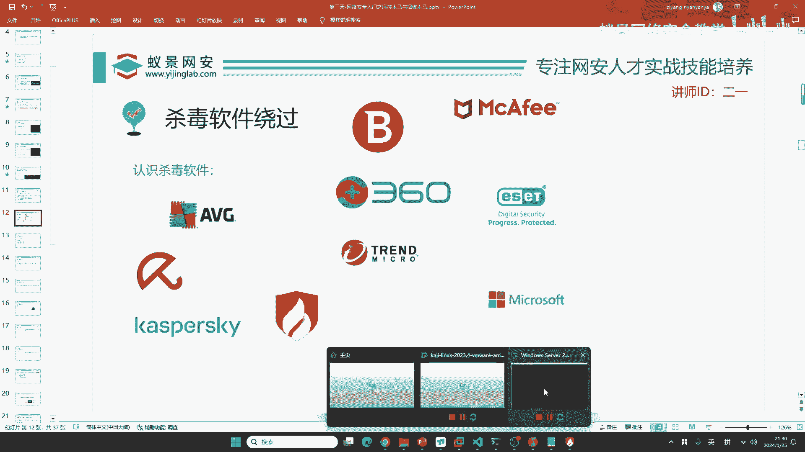

我觉得我还是不会把这个东西完全公开，公开之后，首先我是怕你们自己到时候查查查，到时候第二天不免了，或者是下个第二天不免，这个不太现实，或者是第二天不免了，你跑过来找到我说，怎么不免了，怎么免是吧。

你事有事是吧，所以说呢，咱们这里就来给大家演示一下，这个免杀的方法，现在呢，咱们首先生成一个木马，生成木马，生成啥呢，同学们看好，这几十GB怎么发给你呀，工具我会发啊，Windows server。

我可以给你下载地址，你自己下啊，发给你的话，这一个东西不太方便啊，不太方便，同学们看好啊，同学们看好，首先咱们生成这个后门的时候，生成的是啥，是exe，我不要生成exe，我生成一个二进制文件。

2-0叫9999，我这样去生成，这个文件啥都没有，它只是一个二进制，这些软件我都会发给你啊，这些软件我用到的所有软件都会发给你，然后现在，我们拿到这个二进制程序，把它拖到我们的Windows电脑上面。

这里啊，我就用到了C语言，同学们，你们啊，我相信很多同学都用过C语言，现在9999放在这，放在这之后啊，我要打开一个软件，去更改它的一个特征，怎么更改呢，现在我打开的软件叫做010editor。

二进制编辑器，有同学讲这个免删好复杂。

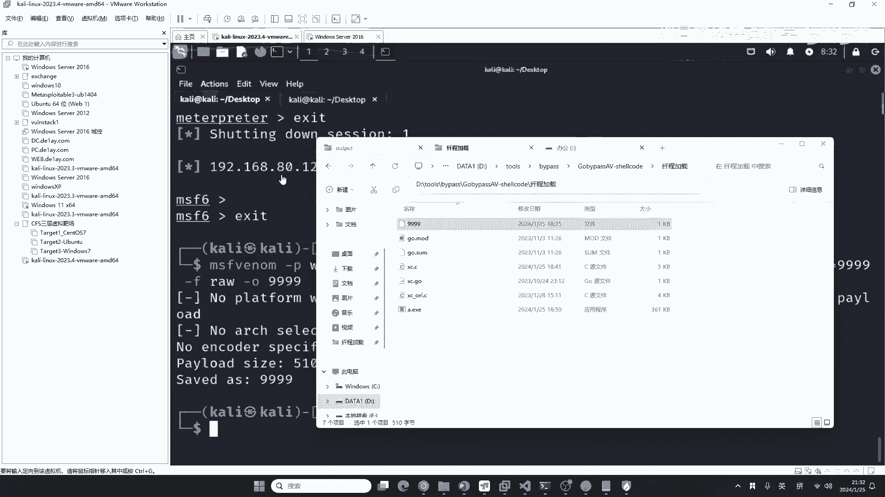

你觉得你点两下子就能绕过删除软件，你看不起删除软件，就是这个行为是吧，所以说免删，它肯定有它的复杂之处，它是属于高级渗透，现在呢，我们把这一个刚刚生成的，这四个9拖进来，拖进来之后啊，你可以看到，哎。

这都是乱码，这乱码怎么办，同学们看好我的操作，我们进行一个数学运算，叫做异祸，叫XOR，这里呢，我给它进行一个XOR的运算，在这里点击，X转异，这里啊，有个二进制的异祸运算，异祸呢。

这里你需要跟一个实进制数异祸，你看我操作就行，看我操作就行，这个实进制的异祸数是多少呢，比如说我想一想吧，我给它整成，66好吧，66，66，然后我们把这个东西OK一下，OK一下，OK一下之后啊。

OK一下之后，现在它已经进行了，二进制的XOR运算，有同学告诉老师，老师是16进制，好在计算机中的表现中啊，就是在计算机的表示领域，不是内核领域啊，二进制跟16进制是等价的，就是在计算机中。

二进制全部是以16进制表示出来的，为什么呢，第一个就是二进制，它不好显示在软件中，第二个呢，就是16进制，一个字节就能保存，就是一个Hex就能保存两个字节的，这样一个二进制数据，它就更好的去表示它。

更好的能让你的计算机识别它，所以说呢，站在咱们用户表示显示的角度，二进制跟16进制是等价的，能理解了吧，所以说咱们这里的叫010 Editor，二进制编辑器，为什么你看不到二进制，你看到的都是16进制。

就是这个原因啊，现在我们已经进行了一个数学运算，叫易货，易货之后呢，现在我们把它复制成C语言的字符数组，字符型数组，点击Editor，点击这里的Copy As，As C code，这里那么多语言都行啊。

有C有Java，有WebPage啊，还有其他的，我们就用C语言吧，因为同学们可能你们最了解的，也就C语言了，C语言之后啊。

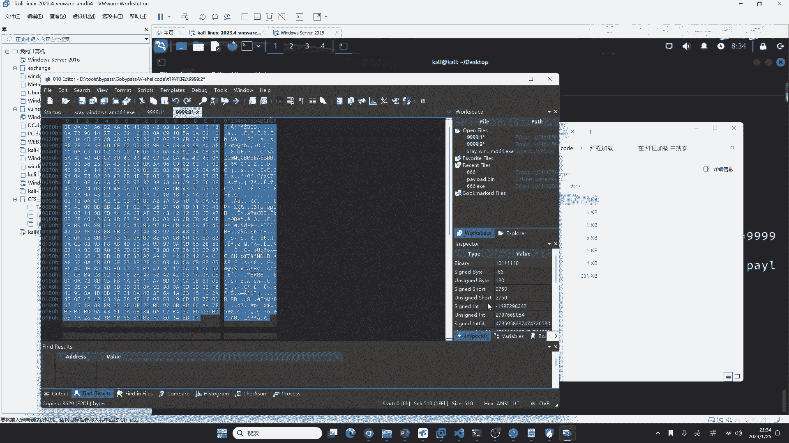

我们给它粘一下，粘到这个地方，这个是什么，无符号的字符型数组，这个数组啊，叫Hello，叫Hello，我们给它加一下啊，就是把它变成Hello，哎，你如果学过C语言，我觉得看了应该没压力。

如果你没有学过C语言，这里就是听天书，这也是为啥，我在绑定软件的时候，我不想去讲C语言，就是因为咱们，我估计得有一半的同学看不懂，现在我上面给它粘好之后啊，下面做了什么事情呢，这里啊是慢函数。

这里的慢函数呢，我做了一个参数判断，他做的呢，是一个沙腔绕过，就绕过云查沙，这个东西啊，绕过云查沙的地方，就在这里，就在慢函数里面写的，那绕过火龙在哪里写呢，在这个地方，使用的呢。

是首先是开展了一个内存空间，把我们上面经过数学运算的异货，给它加载进去，加载进去之后呢，再通过创建先程的方式，把它加载到内存中去执行先程，来触发我们的木马后门，就是这一种方式，是一个典型的。

是一个典型的免沙技术啊，那下面呢，是一个绕过沙盒，就是绕过云测试的一个小技巧，啊这个原理的话，你们自己没有学过的话，我觉得我一分钟把C语言讲透彻，这个我成神了是吧，我觉得我也没有这个能力，你还是就是说。

如果你会C语言的话，我觉得应该能看懂，比如说这R个C R个V是吧，是什么东西，以及我们这里做了啥事情，是吧，都能够看得非常清楚，如果你不会C的话，那你就跟着老师看一看吧，跟着老师看一看。

同学们来看好，现在呢，我写好这个软件，这个软件是我们刚刚谁啊，刚刚谁生成的，刚刚我们metasploit生成的这个软件，那这个软件脚本能不能直接运行，不行，不能直接运行啊，不能直接运行，咱们要给它编译。

同学们只要学过C语言，应该都知道啊，C语言中有一个东西啊，叫编译，我在windows中可以用两个方法，第一种呢叫Virtual Studio，有同学说我知道，VC++6。0，你现在整一个上世纪的。

这个软件是要做啥呢，是吧，现在咱们用GCC就完事了，你不要再用VC++了，要么你用Virtual Studio，要么你用GCC，你不要整个VC++出来了，咱们这个地方用GCC吧，GCC去编译一下。

我刚刚写好的这个C语言，然后里面呢，当然这个C语言我提前写好了哦，加上这个参数，就是我们要编译一个Windows的程序，编译一个Windows的程序，然后回车一下，回车一下啊，回车一下之后呢。

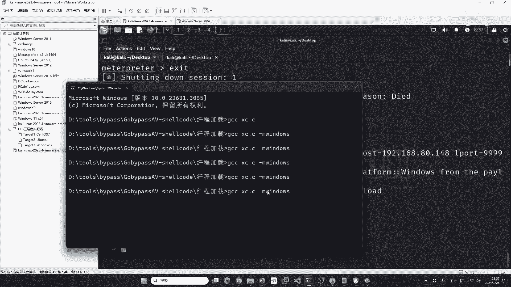

它在当前的目录，就会生成一个i。exe，这个i。exe啊，你是可以改名字的，比如说我们改成，咱们的9999。exe好不好，改成9999。exe，这个exe会被杀头软件杀掉吗，我们首先来测试一下测试一下。

右键火龙杀毒没问题，比如说有同学讲你的火龙杀毒，火龙杀毒可能杀不掉他是吧，杀不掉他来同学们看好，老师现在把火龙关掉，我用Windows Defender来杀一下他试试。

Windows Defender啊，他要比火龙静态杀毒强得多，如果杀掉了那情有可原是吧，情有可原，但是我想测试一下，我想测试一下这一个，就是说360以及这个Windows Defender。

能不能杀掉他就微软，现在火龙杀不掉他，我想测微软啊，现在我退出火龙，退出火龙之后，我用这个你看微软的杀毒软件就立即启动了，就是说你只要把第三方的退出微软的，他会立即启动，启动之后啊，我来查查一下。

在哪查查呀，我看一下，Windows Defender这个地方好像没有啊，那我在这里打开Windows Defender啊，在这里这个系统，Windows Defender。

叫Windows安全防护中心。

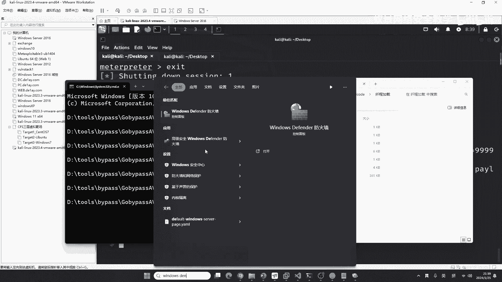

这个地方，现在病毒和危险防护是通过火龙接管的，火龙接管的，在这里呢，我给他拖进来，看一下能不能查查，就直接拖不进来啊，那没关系啊，我这个地方看一下，定期扫描给他打开，这里能不能查呀，好。

现在他已经打开了这个定期扫描，我来试一下哈，同学们，找一种Windows Defender，可能现在的这个我的右键过了删掉了，就是右键删掉了，没有这个Windows Defender，他现在呢在查杀了。

在查杀了，保护历史记录，还瞅一瞅，算了就不在这个机器上面放了啊，我找一台Windows server，他同样的有Windows Defender。

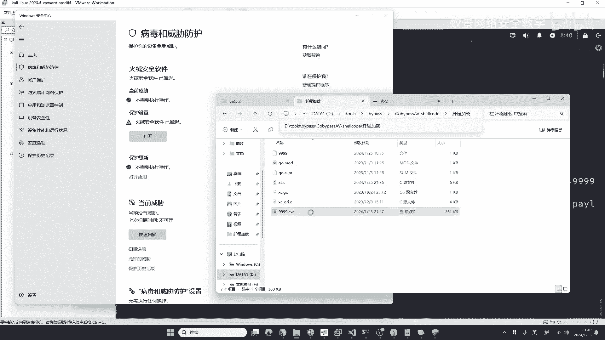

比如说这个系统啊。

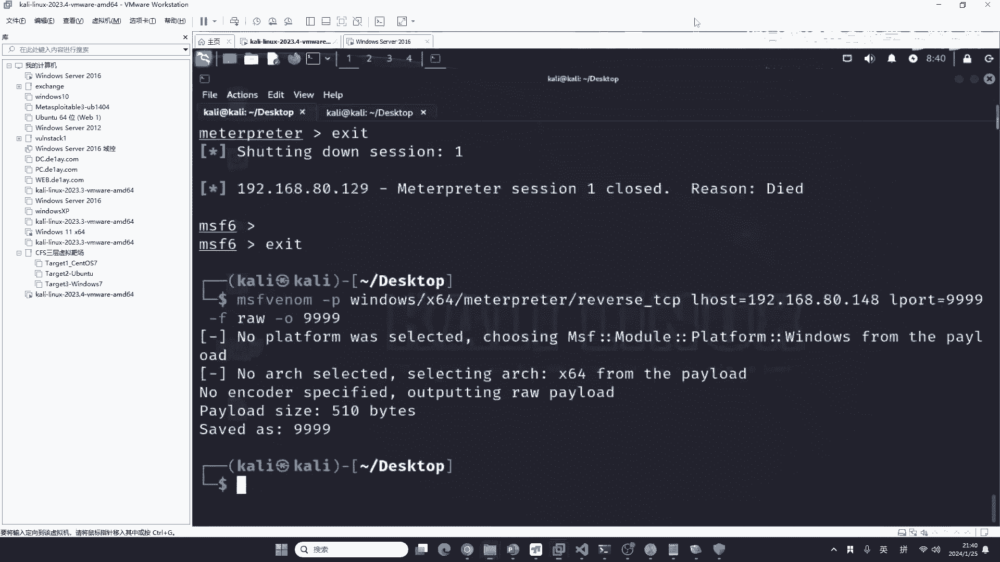

这个系统是刚刚我们用过的，用过的我并没有查杀，我现在复制替换一下，右键有没有Windows Defender，在这哈，同学们看好，我这一台电脑是连网的，他的Windows Defender。

他有没有更新库，我来瞅一眼哈，我先把它更新一下咱们的病毒库啊，瞅一下能不能免杀，这个Windows Defender，实时保护已关闭啊，咱们启用一下，启用一下这个实时保护，好。

现在的Windows Defender已经打开了，同学们看好啊，来更新一下这个病毒库吧，这个病毒库更新一下，我想试一下他能不能被杀掉啊，他如果被杀掉，那就再给他做免杀，如果他不能被杀掉。

说明咱们这个还是有一定用处的是吧，好，现在这个Windows Defender，他的一个已经更新了，1月25号晚上9点40更新的，那我们来查杀一下吧，好，现在扫描可以看到，没有扫描出来。

您的电脑上没有检测到任何威胁，看一下，没有任何威胁是吧，说明Windows Defender，也是不能把他查杀的，也是不能把他查杀的，那这时候怎么办呢，我们来看一下，他能不能正常使用啊。

咱们先给他打开一下，打开一下之后呢，还是同样的开启监听啊，把这个监听打开，监听打开之后，老师来运行一下这个软件好吧，运行一下这个软件，看，正常上线，好，可以正常上线，并且呢。

他获取的就是我Windows11的权限，可以给大家看一下，Sysinfo，都没有问题啊，Windows Defender跟火龙都没有把他杀掉，那你们想看这个软件，能被360杀掉吗，同学们。

360能不能干掉这个软件，我在今天特意给大家装了一个机器。

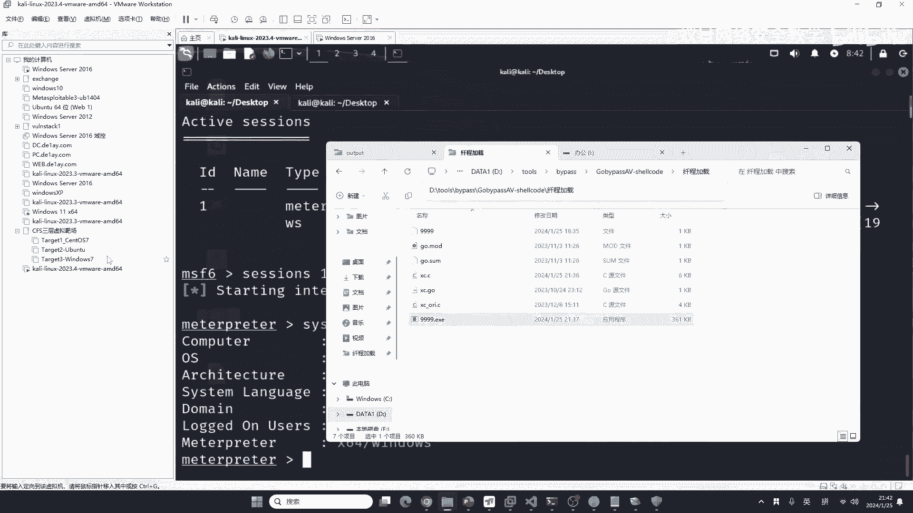

里面有最新版的360，我开启了云查杀，昆蓬，全部都开了，我现在把这个机器打开，我们来看一下360能不能把他查杀，他能绕过所有的杀手软件吗。

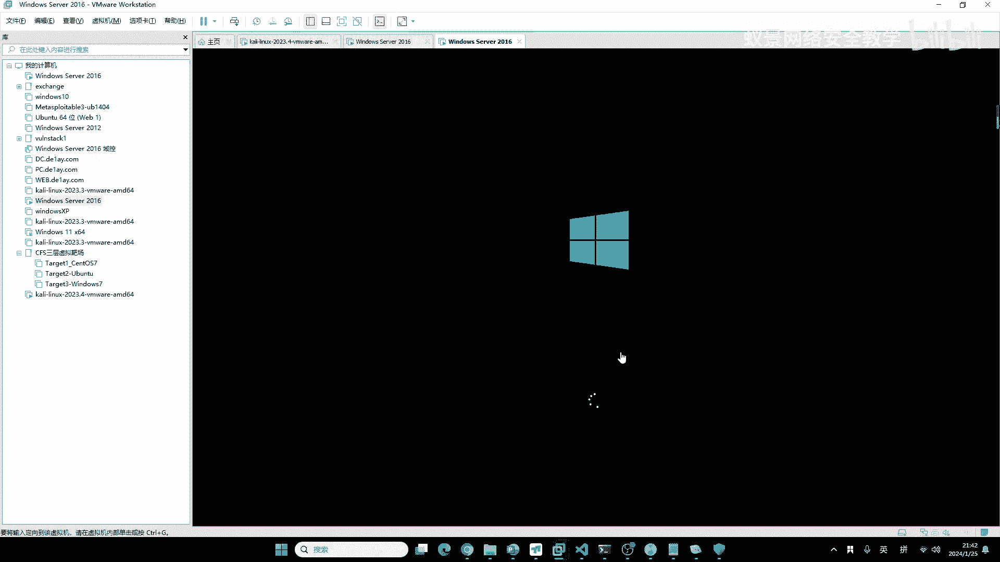

我首先，我现在我不知道，但是我可以明确告诉你，肯定不行，肯定不能通杀，现在来试一试吧，首先先看一下360，360在哪呢，在这呢，给他打开，打开咱们的360啊，要把他的这样一个，所有的威胁检测全部打开。

就是说这个360他是，可以进行什么呀，可以进行关闭云查杀的，但是现在我不想关，我想全部给他打开，这个木马查杀，不在这，不在这打开，我看一下在哪，性能模式，拦截报告，哎在哪打开来着，木马查杀。

在这个地方有个查杀引擎啊，你可以看到他有云查杀，启发是还有昆蓬引擎，他自己的，他自己的是吧，好现在我们来实验一下，实验一下，他拖进来，还有这个这个免查码啊，免查码拖进来，拖进来之后。

咱们来看一下能不能上线啊，来看一下就是说能不能控制他，360啊在这开着呢。

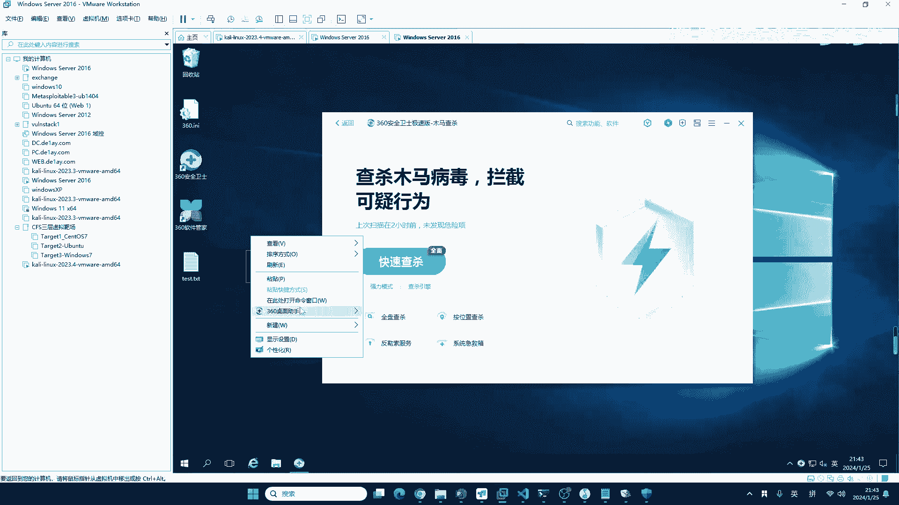

因为360，他是动态检测家云查杀。

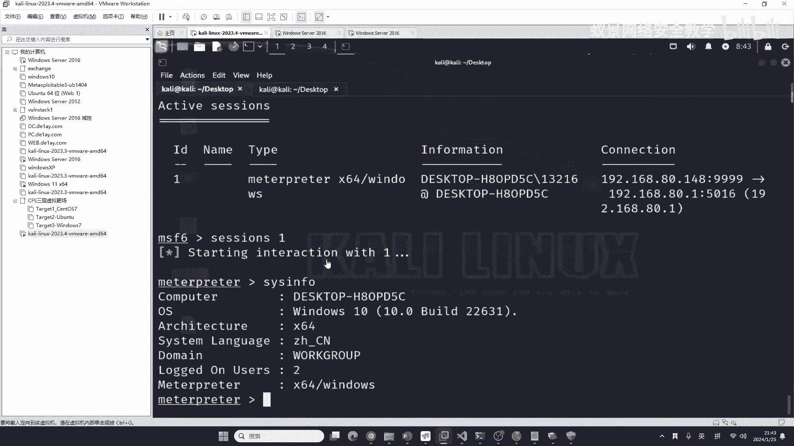

所以说呢，我要给他运行起来，才能看结果，是吧，然后运行起来，好360直接杀掉了，为什么360可以直接杀掉他呢，这就说明这个免杀，没有一个通用的技术，如果你想免杀360，或者是想免杀卡巴斯基。

你要对代码做针对性的修改，为什么要对他进行针对性的修改呢。

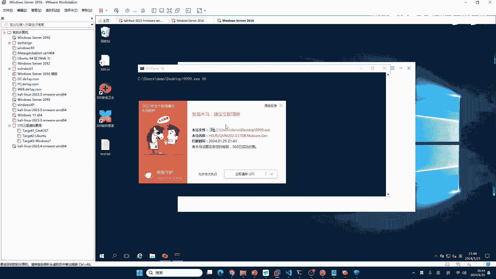

就修改这里就行了，这个地方其实只要改一点360就能过了，但是由于这节课，我不能告诉你，因为我如果告诉你的话，你现在360能过，他就能过卡巴斯基了，你有可能就会应用到一些奇怪的角度。

不不要说二一老师怎么不信任我，我信任你们90%的同学，但是我不能确保你们100%的人都像我，或者是像大家一样，想做一个漏洞的挖掘者，想做一个用网络安全合法用途的一个挣钱的人，而不是说想用他做黑灰产。

因为你这个地方是吧，现在他的免杀技术还是非常好的，如果你用他去做黑灰产的话，很有可能你会做的比较好，然后就会受到法律的严惩。

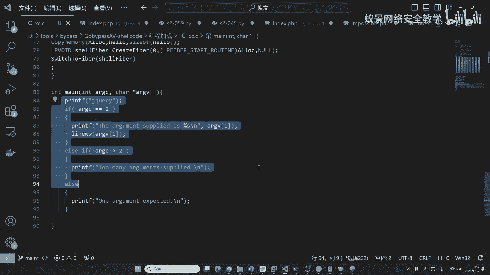

法网恢恢 疏而不漏，大家千万要注意，那像这些技术应该就是说，大家说你这个东西360是吧，绕过沙子软件的原理是什么，我可以跟你讲。

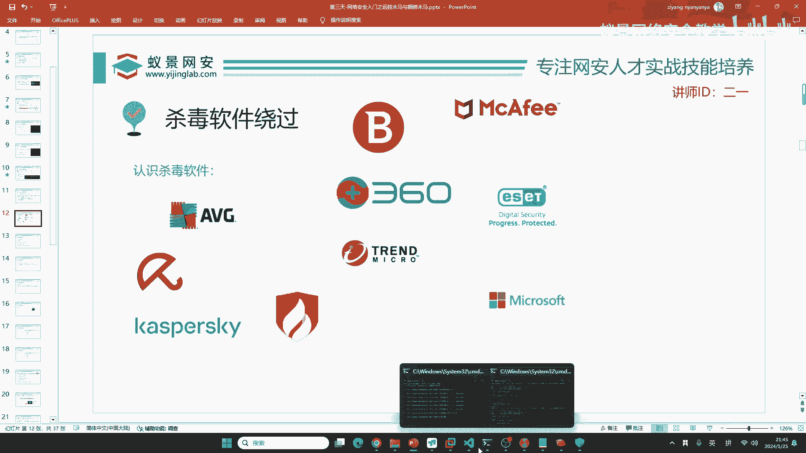

这里是做这个沙盒绕过，这边是绕过火龙跟Windows Defender的沙盒，这边是做先程，上面是做加密，就是加密混淆，加上特殊的加载方式，再加上沙盒的一些检测绕过，这三者旗下。

就是三管旗下来实现这个免杀，它的通用性是比较高的，前提你要优化一下这一点，你可以看到这里我写的非常垃圾，你只要优化这一点之后，360跟卡瓦斯机都能绕，上面的就不用动就行了，上面都不用动。

就是上面的这是混淆，下面的就是加载，然后下面的是防沙盒检测，这个代码会有吗，同学们想不想要，我看一下扣1的有多少，想要的话可以扣1，我上面的这些东西，这些东西我可能会做一些混淆，我做胖的肯定会写C。

你这就是是吧，好同学们想要是吧，OK但是我要告诉大家，想要的话，你不要觉得你拿了这个东西，你去违法，跟我就有关系了，咱们这个课程啊，都是合法合规的，我跟你讲的木马，可是生成在内网里面的。

它不属于木马病毒的范畴是吧，你只有在互联网中的木马，才能产生杀伤力，好的那今天这个脚本，我会放到咱们的笔记里面，你们到时候知道。

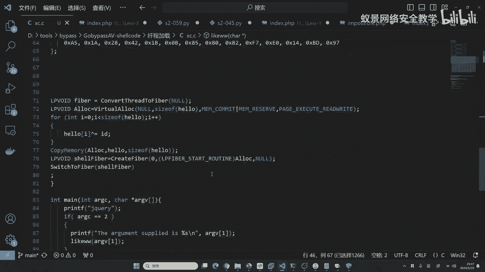