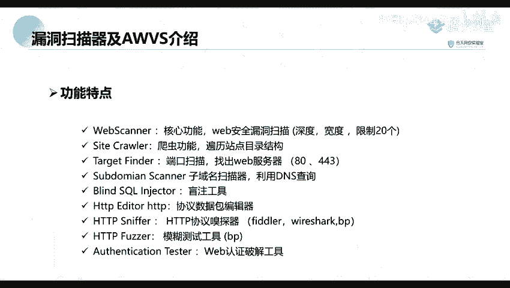

# 【零基础学网安】B站最全的网络安全教程，从入门到精通，学完即可就业，看完还学不会我退出网安圈！（渗透测试／kali渗透／内网渗透／黑客技术） - P22：1.AWVS工具介绍和应用场景.mp4 - 蚁景网络安全教学 - BV1fctLevETn

那我们就开始上课了，刚好8点，有回应吗，那我把这个窗关一下看看，现在呢现在好点没有，因为这个房间还是比较大的，对，今天是我给大家上课，好那我说话大声一点吧，这节课呢我给大家就是点一下我们的一个漏洞。

扫描器AWVS，这个呢是一个比较常用的一个扫描器，它呢是主要是针对web应用的一个扫描器，上节课上节就是前面那几节课，我们老师给大家讲了那个就是，一个信息收集，比如说一些端口啊或者网站信息收集。

以及它的一个网站的一个子域名的信息收集，对今天呢会讲一下这个批量扫描，当然我们上一节课就是，刘老师给大家讲了它的一个子域名信息收集，要收集到了子域名之后呢，我们就需要对它进行一个漏洞的发现。

也就是我们这节课讲的一个内容，就是我们利用这个AWVS进行一个漏洞扫描，首先呢我们这里是分为三个的内容，来给大家讲这个AWVS，第一个部分呢是讲我们的一个漏洞扫描器，就是讲我们什么是一个漏洞扫描器。

以及我们的一个这节课的一个AWVS的一个介绍，第二个部分呢就是我们的一个AWVS的一个安装与破解，因为我们一个正版的话是需要进行一个收费的，所以我们这里呢去就使用一个破解版，就是安装并进行一个破解。

第三个部分呢就是我们讲一下，我们的一个AWVS的一个功能介绍，比如说如何去使用，后面呢我们来看一下第一个部分，就是漏洞扫描器以及AWVS的一个介绍，这个有没有这个语速有没有就是比较快呀，好不快那就好。

首先呢我们来看一下漏洞扫描，就是什么是漏洞扫描，漏洞扫描呢是基于我们的一个漏洞估计库，通过我们就是扫描等一些手段，对指定的一些远程或者是本地计算机系统的一个安全性，进行检测。

也就是说我们就是通过这一个扫描的手段，对我们上一节课给大家讲的一个指寓名，进行搜集就是搜集到的一个指寓名，进行一个安全缺弱性的检测，也就是说我们对它扫描就是有没有这一个漏洞。

然后去通过这个扫描去发现可利用漏洞的一种安全检测的行为，也就是我们的一个渗透攻击，就是通过我们找到的一个漏洞，要去对它进行一个利用，那么常见的一个漏洞扫描的工具有哪些呢。

首先呢这个网络上公布的一些付费的或者免费的一个漏洞扫描的工具或者是表本，是很多的，比如说我们在kpop上面就是有许多的别人写的一个脚本，那种脚本呢也可以说是一个漏洞，可以进行一个漏洞扫描。

现在我们来看一下第一个点就是针对某类漏洞的，比如说针对我们的一个测透注入的一个漏洞，也就是，通过我们的一个有一个工具叫做叫做测透Map，通过这个测透Map这个工具。

就是可以发现我们那个网站是否存在我们的一个测透注入的一个漏洞，这个呢就是一个针对weblogic的一个weblogic scan，这个东西呢我们可以在网上可以搜索到这里给大家来看。

我们可以在我们的一个网上可以搜索，我们可以在我们的一个网上进行一个搜索，比如说是搜索这个weblogic scan，这个工具呢它里面也写了许多的一个就是，里面已经内置了许多的一个plc。

也就是我们的一个漏洞检测的脚本，我们可以看到这里呢有有许多的一个，比如说一些SSRF啊，还有一些反序列化以及一些为任意文件上传等等的一些漏洞，它里面已经内置了。

这个呢就是针对我们的一个weblogic的一个漏洞，以及我们针对某类CMS的一个waterflash的一个CMS，CMS呢也叫做我们的一个内容管理系统，就内CMS。

比如说我们针对CMS的一个wp-scan，以及一个dd-cms的一个dd-cms-scan，这个呢我们都可以在网络上搜索到的，比如说我们这里有一个wp-scan，这里呢我们可以搜索到。

还有呢一个就是我们的一个dd-cms-scan，这个呢是针对我们某一类漏洞的，这个呢也是内置了许多的一个检测脚本，这个呢是我们针对某一类漏洞，然后呢我们来看一下，针对我们的一个系统应用层的。

我们前面讲的呢都是一些web方面的一个工具，还有呢就是一个针对系统应用层的，比如说我们的一个network，network呢也就是我们经常是用来，对我们的一个扫描系统的一个工具，它呢也是一个收费的。

还有呢就是针对某类框架的一个，检测工具比如说structure的一个，一个框架可以使用我们的一个structure的，一个漏洞检查工具，这个呢这个工具呢你们的一个工具包里面，应该是有这个工具的。

还有呢就是针对我们的一个Spline-Pool的一个工具，就是脚本，我们的一个SB，然后这个工具我们这个呢都可以在我们的GitHub上面搜索到，然后呢还有呢就是一个针对我们的一个web服务的。

我们还有一个比如说我们的一个Blob of Swift，我们这个Blob of Swift，它不仅仅是一个抓包的工具，我们还可以使用它进行一个漏洞扫描，还有呢就是我们的一个长评，长评科技给的一个工具。

一个Xray，这个工具呢是最近比较火的一个工具，它也有一些色漆版，还有一些收费版，就是高级版，色漆版它的功能没有那么多，第二个呢就是我们这一节的一个内容，AWS，那么什么是AWS呢。

AWS它是一款知名的网络漏洞扫描工具，它呢可以通过网络爬虫测试我们的网站是否安全，去检测我们的一个流行的一些安全漏洞，比如说我们的一些是否注入啊，伤害SSR以及更多的一些漏洞，然后呢我们是在11。

0版本以前呢，是我们是一个客户端的一个工具，也就是，也就是相当于是我们相当于是我们的一个，比如说是一个类似于QQ这种客户端，或者说是一个微信的一些客户端的一些工具，然后从11。0之后，11。0之后呢。

它就变成了一个使用浏览器端打开的一个形式，我们访问它的话呢，就是使用我们安装时制定义的一个端口来进行访问的，那现在呢，是通过我们的一个网络。

就是客户端，就是这个浏览器进行一个访问，比如说这个呢，就是我搭建的一个就是安装的一个AWS，那么它有哪些功能特点呢。

首先呢，就是一个web scan，就是我们的一个web扫描，这个呢，是它的一个核心的功能，可以对我们的一个web安全漏洞进行扫描，这个呢，就是它的一个爬虫的功能。

就是便利我们的一个网站站点的一个目录结构，就是可以去爬取我们的一个网站，它的一个站点目录，第三个呢，就是一个端口扫描，扫出web服务器，就比如说我们的常见的一些80端口，443端口等等，第四呢。

就是一个指引名扫描器，利用一个DNS查询来发现我们的一个指引名，第五个呢，就是一个搜索输入工具，也就是说它可以去发现我们的一个搜索输入，还有就是一个协议数据包跟仪器，下面呢。

我们会对它进行一个展开来点我们的这个功能特点，引进一个http的一个协议修淡器，还有的一个就是模糊测试工具，我们常见所做的一个fail，还有呢，就是一个web认证破解工具。

也就是可以去对我们的一个用口令去进行一个破解，以上就是我们今天介绍的所有的功能特点。

我们下期再见。