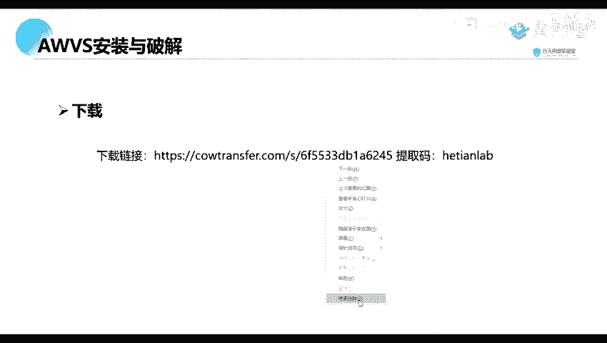
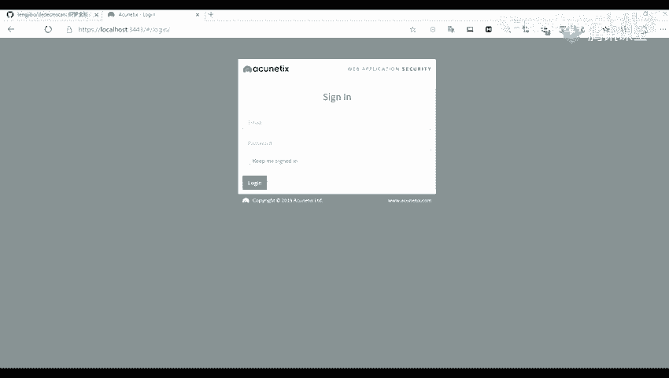
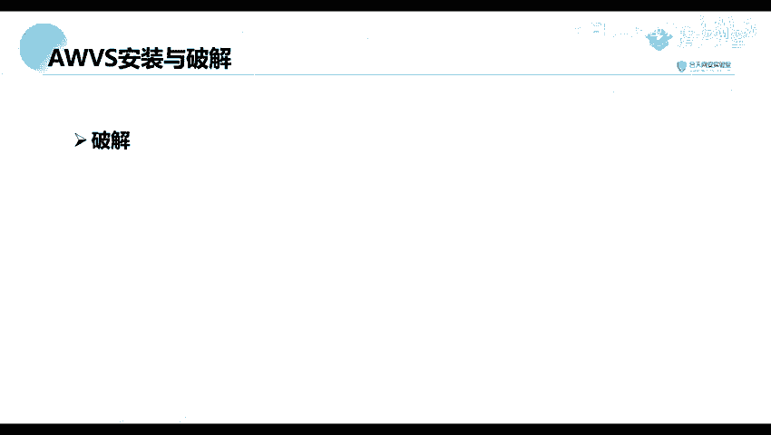

# 【零基础学网安】B站最全的网络安全教程，从入门到精通，学完即可就业，看完还学不会我退出网安圈！（渗透测试／kali渗透／内网渗透／黑客技术） - P23：2.AWVS的安装和破解.mp4 - 蚁景网络安全教学 - BV1fctLevETn

下面我们来看一下第二个部分，AWS的一个安装与破解，首先我们下载，将我们的一个工具进行下载下来，这工具我已经在你们的一个预期内容里面，已经写在上面了，并且把我们的一个破解的一个，那个破解好像是没有讲的。

但是我们这几个，那里是写的比较简单一点，这里看到我们来给大家讲一下如何去破解，首先这个是我们的一个下载链接，你们可以去访问进行一个下载。

那我们的一个P区码。

P区码是我们的一个核天Lab，就是我们这个HETIANLED，这个是我们的一个AWS，主要的一个安装包，以及它里面还有一个破解包，这是我们所做的一个模糊测试，你这个你可以去就是模糊测试，我们先来看一下。

然后安装的话，是跟我们正常安装一些QQ或者微信是一样的，不过到这一步，就是我们有一步是需要去，对我们的一个账户去进行一个设置的，就是设置我们的一个邮箱，登陆的邮箱，以及我们的一个登陆的密码。

这里都是一些比较简单的一些设置，以后我们还有一步就是去设置我们的一个端口，就是我们web访问的一个端口，就是浏览器访问的一个端口，这个端口你可以随意设置，就是设置完了之后。

我们访问的端口就是你所设置的一个端口，然后下面这个就是我们，就是询问我们是否允许远程进行一个访问，就是说是否只允许你这个本地进行访问，还是可以允许其他的机器进行访问，这一个AWVS。

我们我这里是没有选择进行，就是允许的，我这里是只能在我们的一个本地进行访问，下面就是一个破解，破解我们有，它里面就是有两个工具，就是我们的下载的一个下载包里面，结压了之后，里面有三个工具。

一个有三个安装包，一个是我们的一个AWVS的一个安装包，另外两个就是我们的一个破解的一个破解包，首先将我们的一个破解包。exe，还有一个date，这两个包去复制到我们的一个，AWVS的一个安装目录。

这个安装目录是我们默认的，它安装是我们不能去选择它的一个安装路径的，所以这里我们可以来找一下它的一个路径，我先找一下，在这个C盘上面，然后看一下是不是在这个，Cloudflare，这个文件夹下面。

就是在这个x86这个文件夹上面，我们这里有一个，第一个工具就是第一个，的这个ac1，这个文件夹，文件夹上面，然后我们可以看到我们，是不是将我们的这两个一个两个破解包，去复制到我们的这个目录上面。

破解到上面之后我们运行即可，就是我们以一个管理员的一个身份去运行，运行了之后，它会提示我们去填写一些信息，比如说这个姓名公司名称，还有一些就是我们的一个电话号码等等，那里我们可以随意填写。

因为这里我们有截图，但是这个都是我们看都能看懂的，所以我这里就不进行演示了，下面我们来看一下，我们的一个，以上言論不代表本台立場。

