# 【零基础学网安】B站最全的网络安全教程，从入门到精通，学完即可就业，看完还学不会我退出网安圈！（渗透测试／kali渗透／内网渗透／黑客技术） - P24：3.AWVS漏洞扫描的使用.mp4 - 蚁景网络安全教学 - BV1fctLevETn

我们的一个AWS功能介绍以及应用，首先我们它的一个页面布局，页面布局这里我们一个是一个仪表盘，就是仪表盘就是第一部分的一个仪表盘，仪表盘里面第二个就是一个目标，就是一个target。

第三个就是我们的一个漏洞，就是我们扫，就是我们通过我们扫描到的扫描的一个域名，或者是一个殖民所扫到的一个漏洞，第4个就是一个扫描，第5个就是一个report报告，就是我们导出的一个报告都在这里。

第6个就是一个设置，要从仪表盘我这里打开来讲，这里先登录，在登录的时候我们可能会经常会遇到这个的问题。

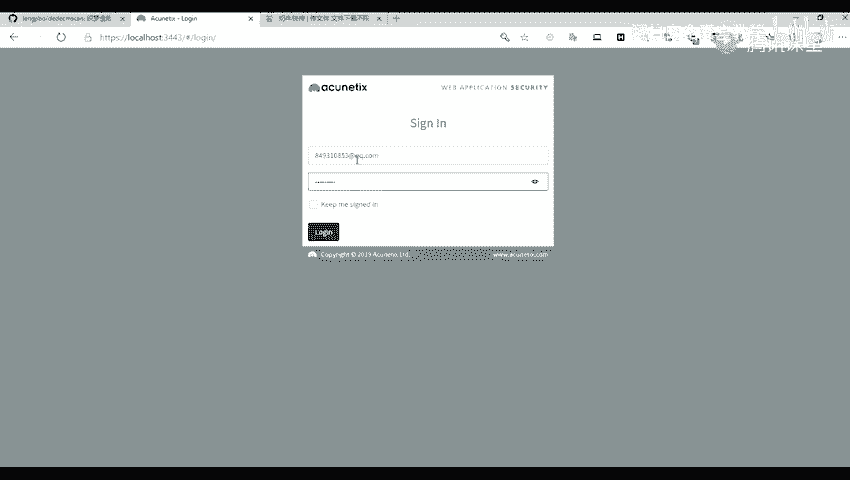

就是遇到他谈出我们，他说在我们的一个本地已经有另外的一个账号进行一个登录了，已经有账号进行登录了，所以因为我们在AWS现在是只允许同时登录一个账号，也就是说我们只允许我们的一个session是在这。

同时进行一个登录的只允许一个，所以我们这里是点击退出就行了。

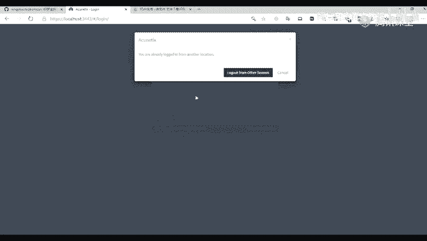

点击退出这里我们这里可以看到尤其仪表盘这里，仪表盘这里最上面这里是我们所找到的一个漏洞，漏洞数量以及漏洞分布，比如说我们在这个，第一个这里这个粉应该说是一个粉红色，粉红色这里就是一个高危漏洞的一个数量。

以及一个分布的数量，中间这个就是一个中危漏洞的一个分布的数量，就是这个橘黄色大黄色，这是一个中危漏洞的一个数量，然后到这个浅蓝色这里就是我们的一个低危漏洞，这是我们的一个低危漏洞的一个分布的数量。

然后上面这里就是左下角，左下角这里是我们所找到漏洞的一个网站，比如说我们在这个卡这个网站，卡点FLYME这个网站，我们可以扫到了88个红色的，也就是我们的一个高危漏洞，以及99+的一个中危漏洞。

这个就是我们的一个漏洞分布的一个站点，然后右下角这个就是我们找到的一个漏洞的一个排列，比如说我们找到了89个，这个就是我们的一个陌路边历，我们这里看这个英文也可以看出来，这是它的一个排名。

比如说陌路边历这个漏洞是89个是最多的，然后第二个就是一个DHS，也就是我们的一个XSS，这是88个漏洞，这个是按它的一个数量进行排序，第二个，这个仪表盘，仪表盘其实上方这里是一个漏洞数量。

中间就是我们的一个任务进度，我们刚刚也给大家讲了，还有一个就是左下角，就是我们找到漏洞的一个目标站点，右下角就是我们的一个漏洞类型，我们来看一下第二点，target就是这个目标。

我们点击这个target这个成像，就会展示我们之前新建的一些，扫描网站的信息，这是我们之前新建的一个站点信息，这个就是我们我之前的一个目标信息，我这里就直接给大家访问这个来讲，我们这里可以看到。

这个就是我们我之前的一个目标信息，首先我们这里有一个scan，scan这里，scan这里就是我们扫描。

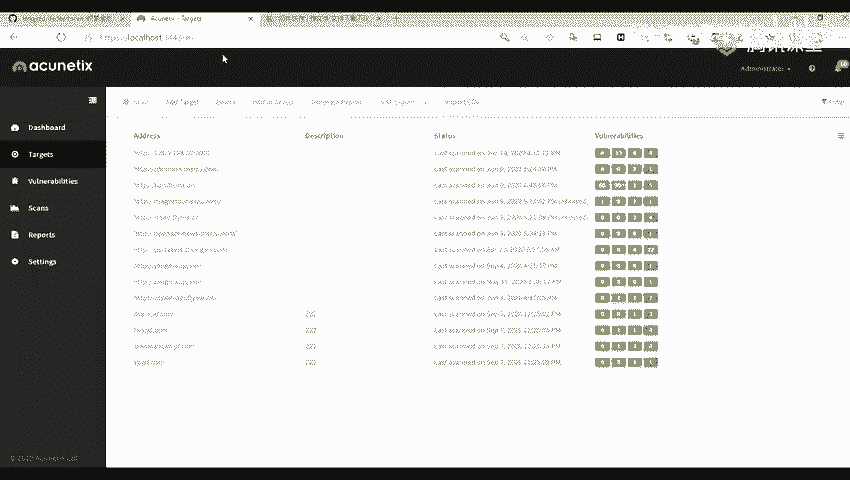

就是我们比如说我们添加了目标，让我们进行一个扫描。

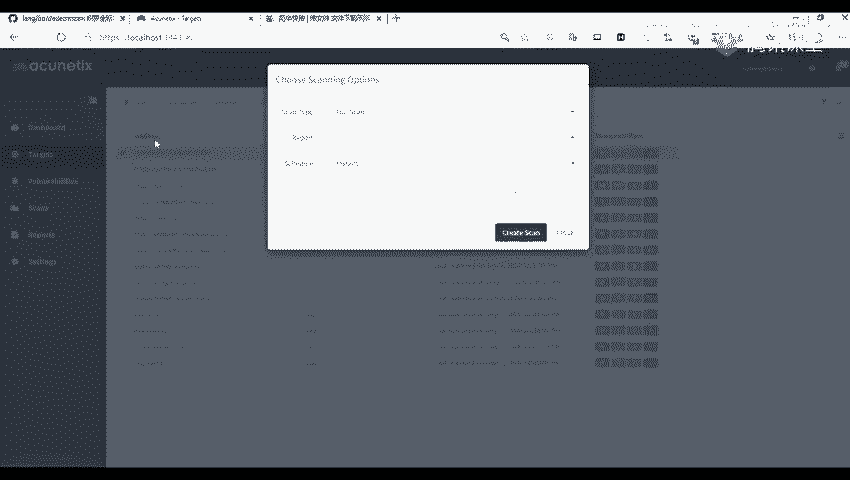

比如说我们在这里添加了一个。

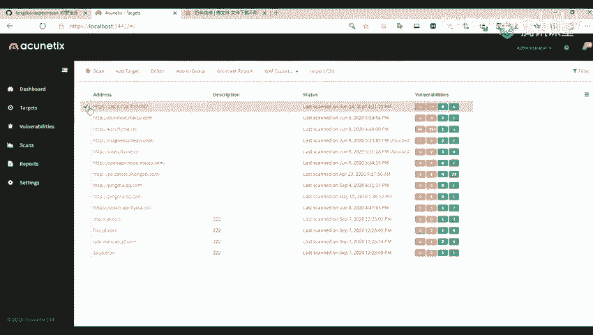

add就是添加目标，add target。

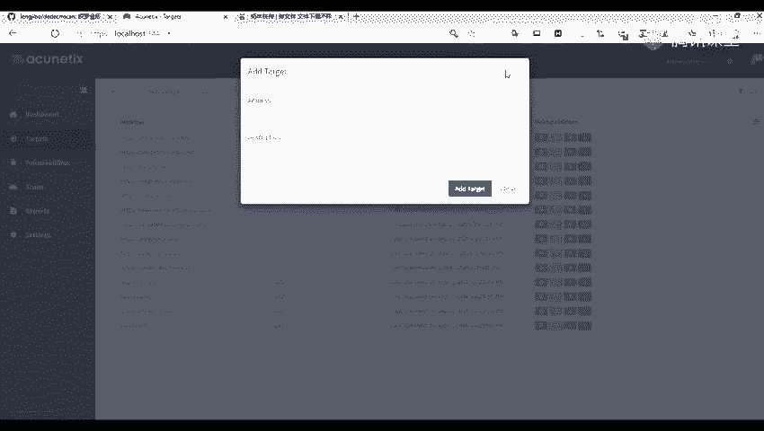

还有第三个就是delete，delete就是我们的一个删除目标，就是将我们这些目标进行选中，然后删除，第四个add to group，这个就是将我们的一个目标，添加到我们的一个组，比如说我们新建某个组。

然后我们比如说我们在这里，一个将我们的一个meizu。com，就是添加一个meizu。com的组，然后我们将这个meizu。com的一个站点，去都进行一个归类，就是将它去进行一个分类。

第五个就是我们找出我们的一个报告，就是将我们扫描到的一个。

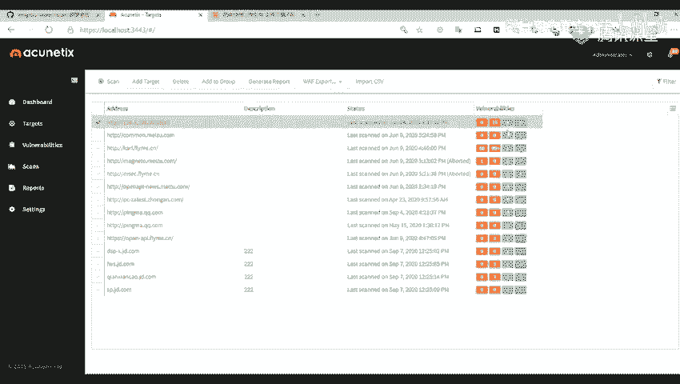

我们的一个目标，就是一个报告进行导出，这里我们也可以就是选择，我们导出的一个类型，比如说我们这里。

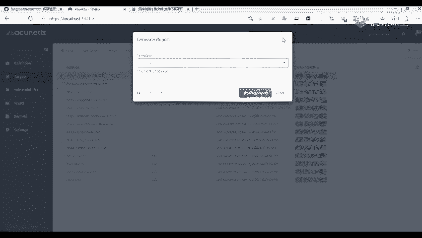

我们选择第一个就是139。9。

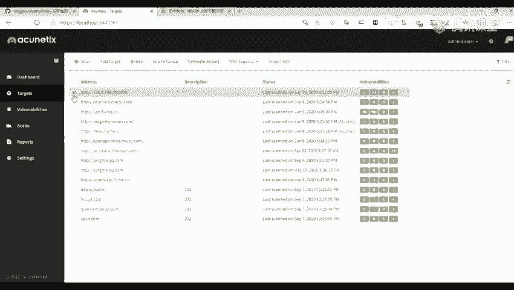

这个进行一个导出，比如说我这里就随便找一个吧。

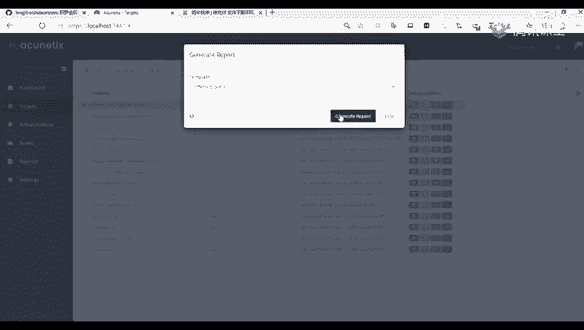

要找了之后，我们在我们在这里，在这个report这里，我们可以看到我们的一个，就是导出的一个目标，这里我们只是将我们的一个，导出到我们的这个report，这个选项，我们还需要进行下载才可以。

比如说我们将它进行一个下载，下载之后，我们可以看到它的一个命名方式，是我们的一个就是日期，加上我们导出的一个类型，以及我们的一个站点，站点后面的一个端口，要将它导出一个tdf的一个文件，我们保存之后。

我们可以来打开看一下这个文件，你哪里打不开，是有出现什么问题吗，打不开，https是一个https的一个站点，我们之前安装这里，不是有这个吗，我们安装这里也可以看到的，我们这里是不是一个https。

然后localhost，但是是单的一个端口，这个就是我们访问的一个端口，这个就是我们，就是刚刚下载的导附的一个文件，就是导出的一个报告，报告里都是一个英文的，我们报告里就是，它给出我们的一些信息。

比如说我们的一个url，还有一个就是网站，就是一个host，还有就是我们导描出来的一个漏洞数量，高危0个，然后中危13个，低危4个，还有一些信息泄露，其他的一些是8个。

然后后面就是我们导描出的一个漏洞的，一些介绍，这里我就不展开来讲了，就是给大家说一下导附的一个报告，你们点一下详细了解看一下，有问题的话，我们待会之后再解决，我们先进行上课，能捡到哪里。

我们捡到我们的一个目标，目标这里就是一个，目标我们刚才讲到目标的一个导出报告，然后后面其实也是导出的一个报告，这个blog，blog。export，这个选项也是导出报告的一个选项。

然后还有一个就是import，import csv。

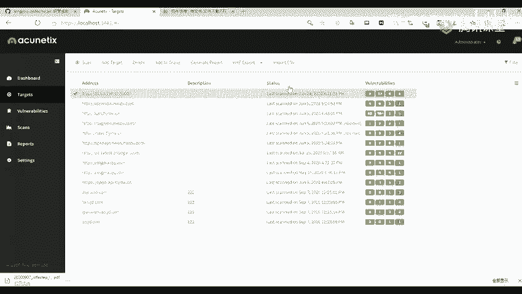

这个就是我们可以导入我们的一个csv文件。

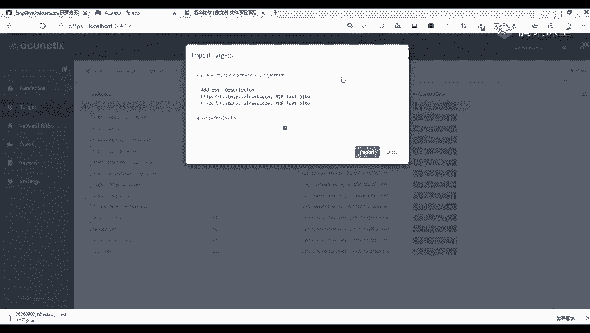

也就是将我们的一个目标进行一个，逼量的导入，这里只是一个逼量的导入，比如说我这里有一个csv的一个文件，csv里面文件是我们的一个，指引名，这个是我们csv文件里面的一些指引名，现在我们进行导入。

去进行一个逼量的导入，比如说我们这里，你先去import csv这个选项，现在我们可以看到它的一个，就是csv文件里面，我们的一个格式，前面是我们的一个地址，也就是或者说是我们的一个指引名。

或者是一个IP，后面就是我们的一个描述，就是后面跟一个道号，然后是我们的一个描述，我们这里导入一个csv，然后导入了之后，它这里就提示我们，成功导入五个目标，现在看到了吗，就是这样子导入完你上面。

你昨天是这样的购物吗，就是我们可以新建，就是新建一个excel的一个文件，比如说我们这里有一个新建的一个文件，我们这里有一些就是输入一些域名，比如我们这里随便输入一个，输入了之后，我们将我们的文件。

去另存为我们的一个csv，另存为我们的一个csv的一个文件，要点是这样就可以了，就可以看到我们这里是有一个csv的一个文件，导入了之后我们就在这里，就是灰色的这一些部分，是我们导入的一个文件。

我们是没有进行扫描的，然后我们可以点击scan进行一个扫描，然后我们这里面待会会给大家进行一个演示，当然还要在这里面还有一个filter，就是一个过滤器，就是我们将我们的一个目标进行过滤，比如说我们。

就是我们怎么过滤一个目标，是以一个地址或者是一个描述进行过滤，比如说我们这里就是选择三和二，就是我们这个描述是一个三和二的，对吧，那我们这里就选择三和二，这样它这里就给我们显示了。

它的描述是三和二的一个目标，还可以去选择一些其他的，比如说一些选择上一次扫描的，比如说从没有扫描过的一些目标，等等去进行一个过滤，现在我们来讲一下就是我们今天的一个扫描，首先在我们target那里。

目标就是我们目标那里，点击add target去进行一个扫描，然后上面那个address，就是我们需要扫描的一个域名或者是ip，我们在这里点击我们，第二个选项去添加一个域名或者是一个ip。

比如说我们这里，选择我们的一个http，add，和天，lab。com，我们添加我们的一个和天lab。com的一个目标，后面是一个描述，比如说描述我们可以随意填和天网安，时间电视，进行一个添加。

添加了目标之后，对呢，就是我们的一个目标信息，首先我们的比如说这个选项，biznets这个选项这里就是我们的一个扫描的优先级，比如说是一个低级的，或者是一个低级的，就是高级的，还有一些紧急的。

严重的紧急的，就是一些扫描的一些优先级，然后scans b这里就是我们扫描的一个速度，比如说一个fast，还有一些其他的一些slow，slow，这一点就是我们扫描的一个速度，扫描越快。

那么我们就越对我们的一个网站，就是越能越快完成进行扫描，但是呢，怎么样的越快，那也意味着我们扫描的一个并没有那么的仔细，我们可以去根据我们的一个需求进行扫描，然后上面还有一些。

data logging这个选项，就是去登录我们的一个网站，就是去扫描我们，比如说我们有一些网站，可能是你访问的时候就是什么都没有，就是只有一个登录的页面，那么我们这种我们就可以，先进行一个登录。

然后再进行扫描，这种就是一个需要登录的一个扫描，现在我们前面，前面我们就随便选择一个，就是一个hotendlab。com，然后我们这里就不点登录了，现在我们就进行一个，怎么点到保存了。

现在我们点击这个scan这里。

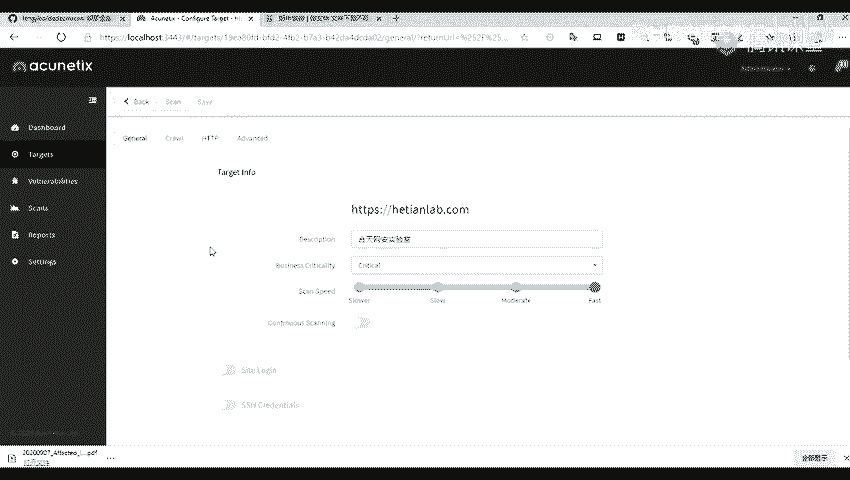

第一个这个scan file，就是我们点击了scan之后，在这里是需要我们去选择，我们的一个扫描的设置，比如说我们一个扫描类型，这个m-type，扫描类型有一些前面扫描，就是第一个就是它默认了。

就是一个前面扫描，还有一个就是扫，可以我们只是扫描一些高位漏洞，或者是一些x-axis的漏洞，一些surface入入漏洞等等，还有一些就是密码，就是热口令的一些漏洞，还有就是一些爬虫，就是指爬虫。

是爬起我们的一个目标网站，然后中间这个就是一个report，就是告诉我们，需要生成什么样的一个报告，比如说我们，它默认了是一个空，就是没有报告的，就是默认没有报告的，然后还有就是一个标准标准报告。

还有上面就是一些合规报告，就是以什么样的一个方式，去进行一个输出报告，还有就是一个扫描的频率，扫描的频率就是instance，这个就是我们的一些立刻扫描，这个instance就是一个立刻扫描。

然后中间这个就是我们，未来就是以后的某一个时间，就是我们做一个定时任务，比如说我们在9月7号，去进行一个扫描，或者是我们还可以，或者是一个9月8号进行一个扫描，还有就是我们可以选择多少点，多少分。

以及一个就是一个循环扫描，循环扫描就是说我们，在某一个时间点就没到达，那一个时间点就进行一个扫描，比如说我们，在周期进行一个扫描，比如说或者是哪一个月，就是每周进扫描一次，或者是每月扫描一次。

或者是一个每天都扫描等等，我们这里就选择一个立刻，就是立刻扫描。

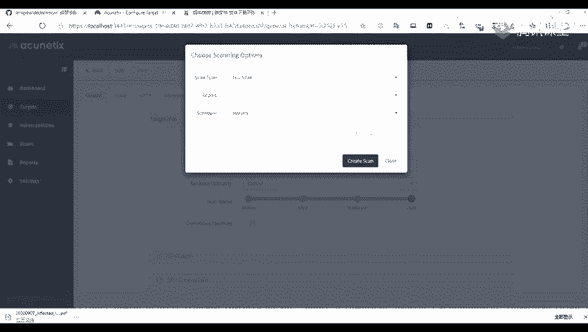

立刻扫描之后我们点击，这里X-Scan就可以了，然后它就会，进入我们的一个目标网站进行扫描，我们这里呢，因为我们机器的一个原因，就不进行扫描了，然后第三个，第三个就是我们的一个漏洞列表。

这个漏洞列表给我们展示了，给我们展示了我们所扫描到的一个漏洞，比如说我们一些CLRS的一些漏洞，还有一些其他的，然后我们可以点击某一个漏洞，比如说我们点击这个漏洞，点击漏洞里面它有一个漏洞详情。

不过都是一个英文的，我们可以找一个汉化包去进行一个汉化，不过我们在这种英文的话，我们也可以进行一个翻译一下，CPCLRS的一个漏洞，还有呢它会给出我们的，给出。

给我们展示它的一个http的一个request，也就是它一个请求包，还有一些返回包等等，还有呢就是一些，就是我们的一个漏洞漏洞修复，就给出了我们的一个漏洞修复的一个方法，或者我们选一个xs的一个漏洞。

所以呢，这个呢就是给出了我们的一个工具的一个拍照，也就是我们的一个工具的一个语句，我们可以看到它这里面，它在这一侧这个部分呢，实际上就是我们的一个工具的语句，然后呢就是我们的一个显印包。

就是我们在比如说我们，访问这个页面的时候，要插入某一些工具语句，看到这里呢就给我们返回，返回了给我们，你看呢还有就是一个scan，scan这里呢也有几个点像，一个呢就是new scan。

就是一个新建扫描，dotscan就是停止扫描，还有一些删除扫描，输出报告以及比较的结果，比如说我们这里呢是我们这里呢，是一个以前的一些扫描，我们可以，去进行一个new scan。

然后去扫描我们以前所扫描的一些站点，或者是我们将我们的一些，以前扫描的一些站点进行一个删除等等，那一些输出也是跟我们前面的是一样的，就是输出报告，还有呢就是一个比较比较结果。

也就是说比较我们两次扫描的一个，就是相同的一个站点两次扫描，是不同时间段扫描的一个结果，比如说我们在今天的时候，扫描到了一个漏洞，然后呢我们去通知别人进行一个修复了，然后呢我们在明天的时候。

就是他告诉我们已经修复了，那我们再重新进行扫描一下，扫描一下呢我们再将我们的两个结果，进行一个对比，要对比呢就可以，对比呢就会它自己会生成一个报告，报告呢我们将我们的一个报告进行下载下来。

看一下这两次扫描的一个结果，不是这一个是另外一个，对呢就会我们将我们的一个报告下载了，下来之后呢就会将我们的两个结果，进行一个扫描就是比较，比如说这里呢就是第一次扫描，这个新码点就是6。com。

新码这个呢就是一个第二次的一个扫描，就是将原来就是第一次扫描的一个，就是结果一些扫描到的一些漏洞，进行一个比较，还有呢一个就是我们的一个，报告这里，报告这里呢就是一个report。

report就是这里呢就是我们前面我们找出，找出的一个报告就是生成的一个报告，都在我们这个report这里呢都可以看到，那要我们想看一些报告呢，我们就将它进行一些下载下来。

我们可以下载为一个pdf的一个文件格式的文件，也可以下载成一个就是导出为，一个html的一个格式的文件，我们点击这download，download这里呢就可以进行一个下载，还有还有呢一个就是一个设置。

设置这里啊，还有一些是我们的一些设置，这里呢我就，会议给大家讲了因为我们的一个，时间关系我们主要是讲，我们前面的一些就是如何去利用这个工具，进行一个扫描，还有呢就是我们，我们在激活的时候啊如何去。

去知道我们是否，去激活成功了呢我们，就是在登录之后我们在这个右上角这个，administrator这里，我们点击点开它，然后我们找到这个第二部分这个listen，这里，这里呢我们可以看到我们的一个产品。

就是这个产品的一个到期的一个时间，我们可以看到是一个，到了这到这个2118年，才到期的，我们可以在这里去看，看我们是否激活成功了，然后呢这里呢我们就，讲到这里我们来，讲一下这个这个，批量批量扫描。

那为什么要进行一个批量扫描呢，因为我们在遇到，大批量的目标值比如说我们，可能一个网站它可能有一些，几千个的目标几千个的一个，指引名，这时候呢就需要我们利用一个批量的一个脚本，来进行一个操作。

因为我们不可能说每一个，如果说是一个单个的话我们不可能是每一个，每一个网站都去进行看，都去看它因为我们看一个网站它可能一些功能多，就功能点比较多的一些网站的话那你可能要，看，好，好。

不是这一个是另外一个，对呢就会我们将我们的一个报告下载了下来之后呢就会，将我们的两个结果进行一个扫描就是比较，比如说这里呢就是第一次扫描，这个，星巴点跟六点炮，平马，这个呢就是一个第二次的一个扫描。

就是将原来就是第一次扫描的一个，就是结果一些扫描到的一些漏洞进行一个比较，好，还有呢一个就是我们的一个，报告这里，报告这里呢就是一个report，report就是这里呢就是我们前面我们导出的一个报告。

就是生成的一个报告，都在我们report这里呢都可以看到，那要我们想看一些报告呢我们就将它进行一些，下载下来，我们可以下载为一个pdf的一个文件格式的文件也可以。

下载成一个就是导出为一个html的格式的文件，我们点击这个download，download这里呢就可以进行一个下载，还有还有呢一个就是一个设置，设置这里啊还有一些是我们的一些设置，这呢我就。

会一一给大家讲了因为我们的一个，时间关系我们主要是讲我们前面的一些就是如何去利用这个工具，进行一个扫描，还有呢就是我们我们在激活的时候啊如何去知道我们是否去激活成功了呢。

我们就是在登录之后我们在这个右上角这个administrator这里，我们点击点开它，然后呢我们找到这个第二部分这个listen，这里，这里呢我们可以看到我们的一个产品。

就是这个产品的一个到期的一个时间，我们可以看到是一个到了就到这个2118年，才到期的，我们可以在这里去看，看我们是否激活成功了，然后呢这里呢我们就点到这里我们来点一下这个这个，批量批量扫描。

那为什么要进行一个批量扫描呢，因为我们在遇到大批量的目标时比如说我们，可能一个网站它可能有一些几千个的目标，几千个的一个使用名，这时候呢就需要我们利用一个批量的一个脚本，来进行一个操作。

因为我们不可能说每一个人，如果说是一个单个的话，我们不可能是每一个每一个网站都去进行看，都去看它，因为我们看一个网站，它可能一些功能多，就功能点比较多的一些网站的话，但你可能要看半天，比如说我们这里。

我们展示我们这个hotendapp。com，我们在这个目标这里我们讲，讲了一个批量的一个导入目标，但是我们导入了目标之后。

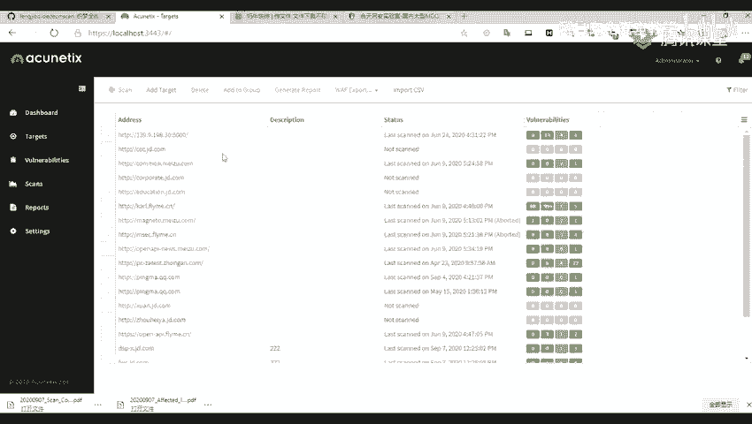

我们还是需要一个一个去进行点击，然后进行一个扫描的。

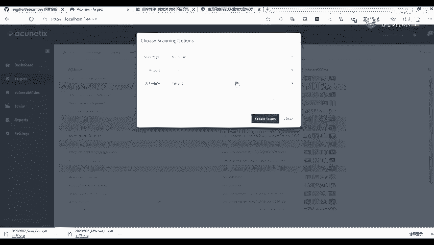

那么我们这里就来讲到一个使用我们的一个脚本，就使用我们的一个脚本进行一个批量，这个下载链接，我们我待会我会把这个PPT发下去，我们直接访问这个链接就可以进行下载了，那么我们对于我们的一个脚本。

主要是修改两个地方，一个就是我们的一个username，就是我们的一个账号的邮箱，登陆的邮箱，还有一个第9行的pw，也就是我们的一个password，这个password是我们是需要进行一个加密号。

是吧，就是一个sha256进行一个加密号的密码，这个密码我们可以通过一个buff进行一个抓包来获取，也可以使用我们的这个在线的一个网站，把我们的一个密码进行加密之后填入，那么我们来看一下我们的一个脚本。

这个是我们的一个脚本，脚本我们主要是修改我们的一个第7行，第7行的一个username以及第9行的一个pw，pw这里我们可以进行一个抓包，获取也可以将我们在我们的一个网站，就是在线网站进行一个。

我们输入我们的一个名文，比如说你的一个我的一个名文，可能是这个password，123，那我们进行一个加密，就是sha256这个加密，加密之后我们将我们的这个IP值。

在我们的这个IP值这里就进行一个复制，你要复制到我们的这个pw这里，就可以了，复制了之后，就是上面就是我们的一个登录的一个信息，就是登录的一个内容，那我们把我们要扫描的一个url列表。

保存成我们的一个test aws。txt的一个文件，可以看到我们这里是，我们来看一下，是哪一个，比如说我们这里就是去读取我们，这个test aws。txt的一个文件，比如说我这里是有一个，已经。

是有一个，txt的一个文件的，它这里里面是我的一个使用名，要我们要注意一点的是，我们的表板是需要在我们的一个python，2。7。9上面去进行运行的，我这里也有一个链接，因为如果不在我们这个2。7。9。

这个版本上面运行的话，它会进行一个报错，所以我们这里可以去再安装一个，python2。7。9的一个版本，安装了之后我们去，进行一个环境倍量的一个配置，比如说我这里是我们的一个。

比如说这一个是我的一个安装的，一个目录，这个python2。7。9，这个是我的一个安装的一个目录，我们去配置我们的一个环境倍量，就是点击我们就是，在这个此电脑这里点击要件，然后在主机这里我们这里是一个。

Win10的系统，你们Win7的话就是自己去白兔一下，我这里是只讲Win10的，然后我们在高级系统设置这里，我们打开它，在我们的一个环境倍量在这个part，在系统倍量里面的这个part，上面去编辑。

编辑了之后，将我们的这个python的一个安装路径，也就是我们python的2。7。9的一个安装路径，路径去复制到这里，再加我们的这个lib，这个文件闸这个路径也进行一个复制。

因为我们有时候是需要使用的，这个ip去进行下载我们的一个模块，或者说是一个库，将我们的这个这个lib，这个文件路径也将我们，放到我们的一个环境倍量里面，这样就可以了，现在我们执行一下，我们打开cmd。

然后python，因为我这里是我命名为一个python2。7，然后我们这里呢，输入我们的一个python2。7，然后输出给我们输出的，它的一个版本，版本定地就说明我们已经，这个环境倍量是配置成功了。

别的好像是的吧，我这里是安装的是一个12的版本，13的我这里好像没有，因为我们的一个版本的话，它就是每一个，aws的一个版本，我们就是这个批量。

导入的一个目标，就是批量导描的一个脚本，也是有所修改的，我这里是给大家，是一个aws的一个版本，版本的一个脚本以及安装包，修改完之后我们将我们的这个，我们的一个，这个tsp的一个文件。

跟我们的一个脚本放到同一个目录上面，我们执行一个python2。7，然后执行我们的这个，aws，我们没在我们的一个路径，要cd到我们的一个路径上面，python2。7，然后aws，要输入之后。

我们可以看到它这里有一个报错，报错它有一个是401的一个报错，401的报错就是我们的一个验证，它告诉我们一个验证报错，就是这里我们前面有给大家讲我们的一个，由于aws的修改。

我们只能同时去存在一个session，就是存在一个session。

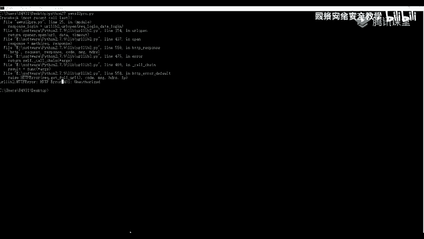

就是我们登录的一个状态，就是一个session，就是我们遇到这个错误的时候。

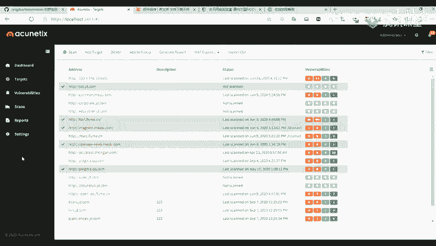

我们只需要我们退出这里之后。

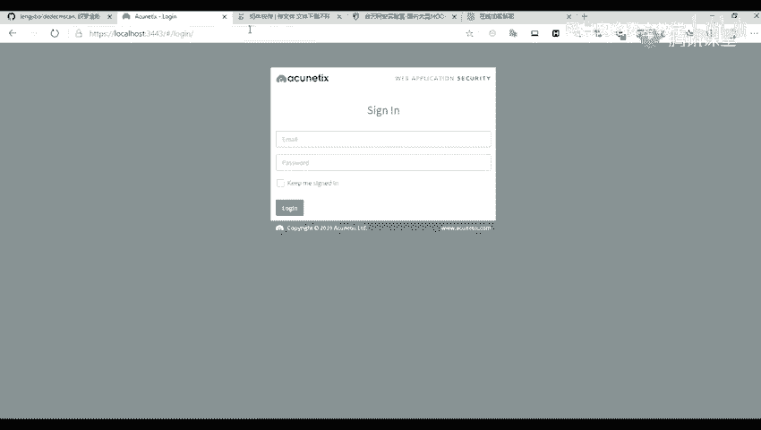

然后我们再次运行一下脚本来看一下，然后我们这里是不是已经去成功运行了，成功运行了之后。

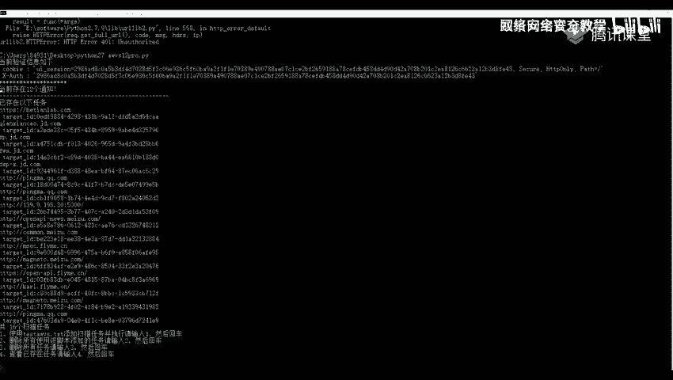

我们这里我们可以看到它有一个，让我们进行一个选择，就是我们使用一个，它说告诉我们使用一个test，aws。txt添加扫描任务并执行，要请输入1要进行回车，要删除所有使用该脚本添加的任务，请输入2。

要进行回车，我们这里添加1，1要回车，回车之后，它这里告诉我们已经添加成功了，添加成功之后，我们就会进行，并且自动为我们的这些添加的一些任务，进行一个扫描，这里我就不再登录上去了。

然后我们这节课就讲到这里，然后我们休息一会，然后再进行下节课的一个内容，我把这个txt发下去，你们前面有同学说打不开的那些同学，现在可以打开了吗，可以了是吧，是什么原因，是不是你点了了解详情。

就详细了解就可以了，你的怎么是一个http，你的苏豪东给你截图我看一下，*** 音量紧急 请敲击 "3" 或 " 0 " 打开帮我按钮，打开电话手机。

打开WhenSmart Cell Phone 公司会根据您的需要提供您的订购信息，然后为您提供更多的提供。***，看似沒多大成果，但實際上有些地方的確是可以上手的，因為它也算是一個安裝的話。

要看個人的需要，要不然的地方也是看手機的設定，所以沒頂到問題。它其實這個版本是相差不大的，只是我們的前提，應該說現在(目前的版本)已經更新了，但是我們是不想過要綁起來了。這個版本其實是相差不大的。

只是我們的一個(前提)，這個不可以，它是一個官方的(設定)，(下載中)。

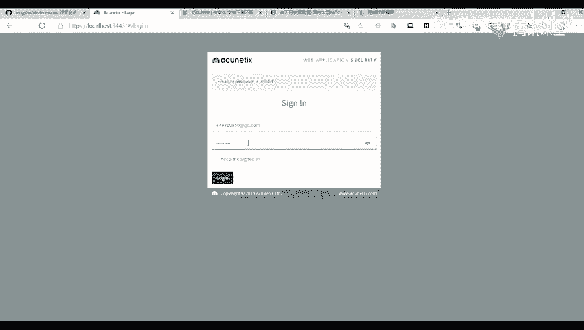

(下載中)，(下載中)，(下載中)，(下載中)，(下載中)，(下載中)，(下載中)，(下載中)，(下載中)，(下載中)，(下載中)，(下載中)，(下載中)，(下載中)，(下載中)，(下載中)。

(下載中)，(下載中)，(下載中)，(下載中)，(下載中)，(下載中)，(下載中)，(下載中)，(下載中)，(下載中)，(下載中)，(下載中)，(下載中)，(下載中)，(下載中)，(下載中)。

(下載中)，(下載中)，(下載中)，(下載中)，(下載中)，(下載中)，(下載中)，(下載中)，(下載中)，(下載中)，(下載中)，(下載中)，(下載中)，(下載中)。

