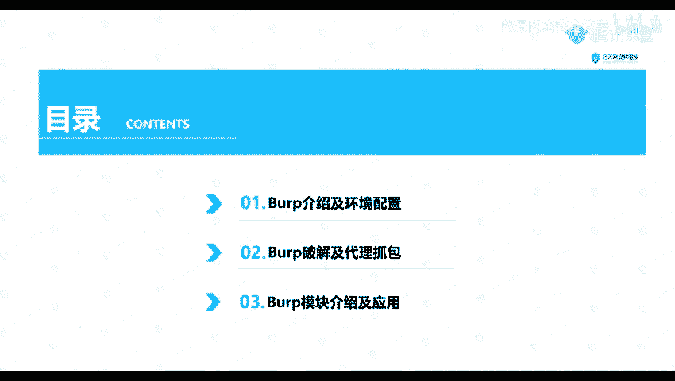

# 【零基础学网安】B站最全的网络安全教程，从入门到精通，学完即可就业，看完还学不会我退出网安圈！（渗透测试／kali渗透／内网渗透／黑客技术） - P25：4.Burp介绍及环境配置.mp4 - 蚁景网络安全教学 - BV1fctLevETn

我们的一个渗透神器之buff switch，这个其实也是一个工具，就是我们最常用的一个工具应该说，现在我们来看一下我们的一个目录，首先我们的一个buff的一个介绍，比如我们的一个环境配置，环境配置这里。

你们之前是有讲过环境配置的一个课了，我们现在就简单的过一下，第二就是一个buff的一个破解，以及我们的一个代理抓包，就是我们这个工具其实也是一个收费的工具，如果我们的一个专业版是一个收费的。

社区版是免费的，这里我们就是使用我们的一个专业版，进行一个破解以及一个代理抓包，第三部分就是我们的一个，它的一个常见的一个模块，介绍以及我们的一个使用，首先来看一下以下第一部分。

它的一个介绍及它的一个环境配置。

首先我们来看一下它这个工具是什么工具，它是一个集成化的一个渗透测试工具，它集合了多种渗透的一个测试组件，使我们自动化或者手动的，能更好的完成对我们的一个web应用的，一个渗透测试和攻击。

在这个渗透测试过程中，这个bob suite将使得我们的一个测试工作，随便可以使得我们的一个工作，变得很容易和方便，只要我们熟悉了这个工具的使用，我们的这个工作也可以变得很轻松，以及高效。

然后由于它是由我们的一个，沙瓦语言编写的，所以由于我们的一个沙瓦语言，它自身的一个跨平台性，所以我们这个元件使用了一个，可以更加的方便，比如说我们可以在我们的一个windows，进行一个使用。

也可以在我们的一个linux，上面进行一个使用，还可以在我们的一个mac os，也就是我们的一个苹果笔记本，上面就是一个mac os，进行一个使用，因为它是一个沙瓦去写的，沙瓦语言编写的。

所以我们就需要配置我们的一个，环境，首先这个沙瓦的一个环境配置，你们应该是在第二节的，应该是第一节是第二节课，你们是已经讲过了，这里我就简单的过一下，你们有不懂的话，你们到时候就是再看ppd。

进行一个操作，或者是看上面的一些课程的一个回顾，在这里我也已经放到我们的一个网上了，你们访问这个链接就可以进行下载，现在我们进行我们的一个，环境变量的一个配置，我们可以在我们的一个，要件我们子电脑。

这里，要件子电脑在我们的一个属性这里，在属性这里找到这个高级系统设置，然后我们在这个环境变量这里去，新建一个环境变量，新建一个系统变量，在一个变量名呢，就是我们的一个沙瓦号，变量值就是我们的一个。

jd安装的一个路径，但是实际上我们在这个沙瓦，这个jdk8以后，它好像是会自动帮我们配置的一个环境了，就自动帮我们配置这个环境变量了，就是我们在安装的时候，我们在安装的时候，我们这里可以那里面有一个。

在批盘上面它有一个隐藏的一个文件夹，在这个Programming在这里，它其实在这里给我们配置了这个，环境变量了，你这个这么高级的吗，就我们安装了之后，我们就它自动在我们这个文件夹上面。

就是有一个Ollico的这个文件夹，然后我们它实际上已经自动帮我们配置好了，如果说配置好了之后，我这里面就不讲了，配置好了之后，我们输入就是打开我们的一个cmd参考。

输入我们的一个java-vmware。

如果说它输出我们的一个java版本cp，就说明配置成功了，就是我们这里一个java-vmware，如果是出现出现这样子的一个信息，就说明我们已经配置成功了，如果说没有出现。

输入这个java-vmware没有出现这个信息的话，那么就需要我们进行一个手动的一个配置，这里我直接跳过了，影片就快到這裏吧，感謝觀看，下次見！

