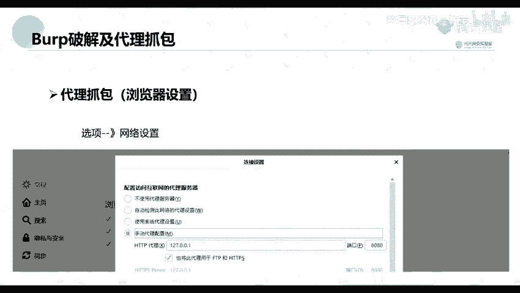
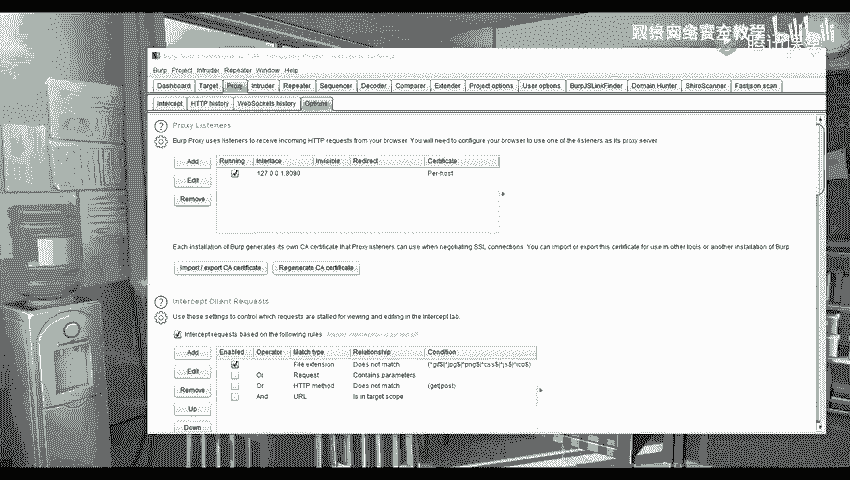
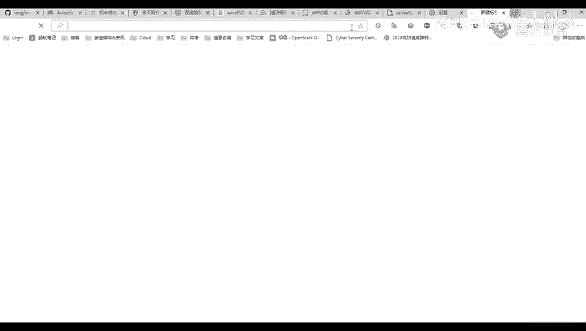
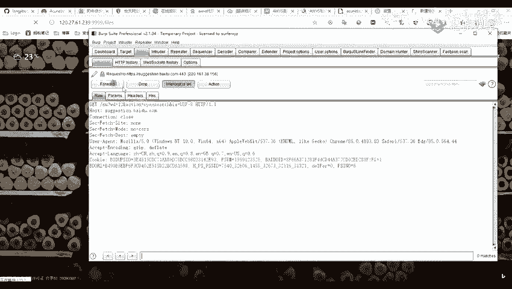
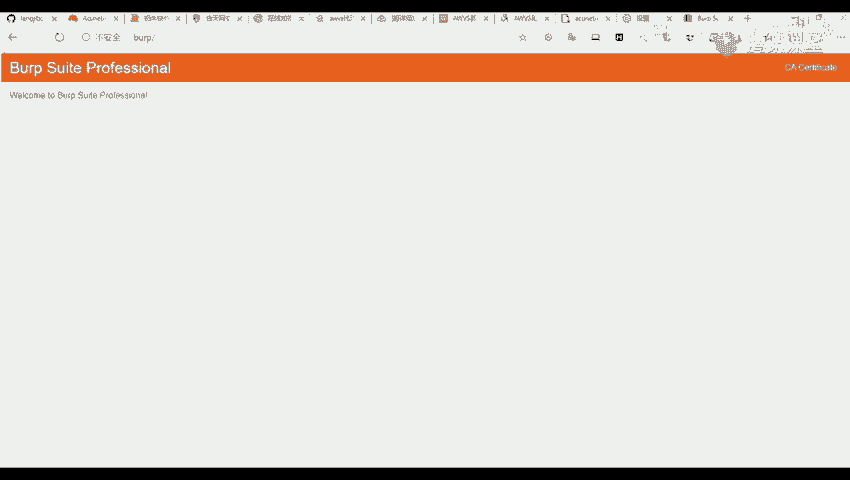
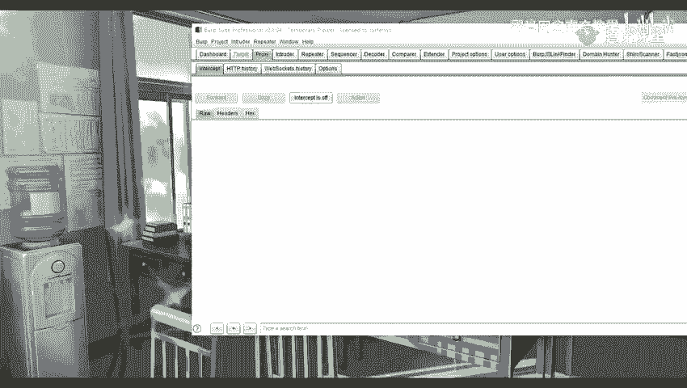
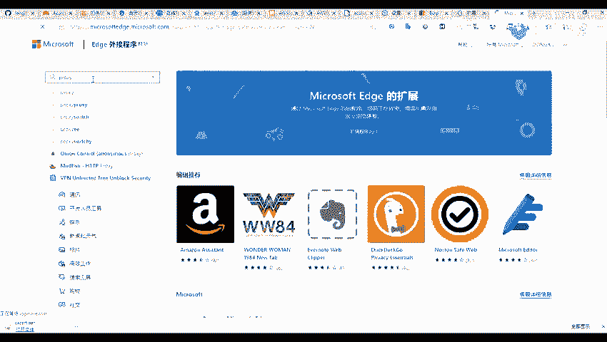
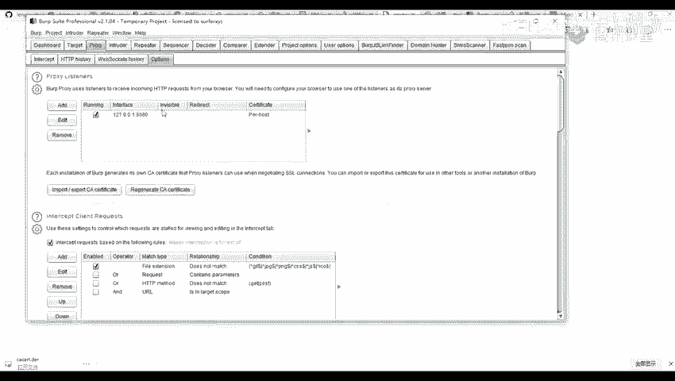

# 【零基础学网安】B站最全的网络安全教程，从入门到精通，学完即可就业，看完还学不会我退出网安圈！（渗透测试／kali渗透／内网渗透／黑客技术） - P26：5.Burp破解及代理抓包.mp4 - 蚁景网络安全教学 - BV1fctLevETn

因为这让我们检查我们的一个破口的一个破解以及我们的一个代理抓包，首先呢，破解我们下载的那个的话应该会有看一下，下载之后，我们应该会有里面有两个文件，一个是botloader。hacken。

还有一个是botsuite。yelp。ro，这里面应该是有两个文件的，现在我们点击这个botloader。hacken这个文件，点击了之后，我先在我这里重新来吧，这个文件就是我的一个文件，我双击它。

双击之后，它会出现这样子的一个窗口，这个窗口我们点击run，点击run之后，就会到这里，点击run之后，就会出现这个页面，botsuite-provisioner这个页面这里。

现在就将我们这个激活程序里面的，那个listen这个序列号，用我们的一个序列号进行一个复制，复制到我们这个enter-listen-page这个窗口上面，复制到这个窗口上面，我们去点击下一步。

有一个应该是右边第三个，就是从左边主体第三个按钮，去点击第三个按钮，然后我们就是到我们的这一步，就是破解，到了这一步之后，就是这个activation这个步骤这里。

就是点击我们那个activation之后，就是到了这里，到这里我们将我们的第二步，我们前面是将我们的listen复制到第二步这里了，现在就将我们第二步的内容，就将我们第二步的一个内容。

这个copy request复制到我们这个activation request这个框框这里，我这里因为已经破解过了，我这里就不再进行一个演示。

复制到我们这个activation request这个框框这里之后，就到了我们这第三步，复制到我们这个activation request之后。

它会自动生成一个activation request这个里面的一些字符串，将里面的所有的一个字符串，将里面的所有的一个内容，去复制到我们这个第三步这里，第三步这里，我们点击next。

就可以进行一个激活成功了，我们点一下代理抓包，因为我们这个box suite，是以一个拦截代理的方式，去拦截所有通过代理的网络流量，比如说我们客户端的一个请求数据，以及服务端，服务器端返回的信息等等。

那这个box suite主要是拦截我们的一个http以及一个https一个协议的流量，要通过这个拦截，我们这个工具box suite这个工具，在以一个中间人的方式，可以对客户端请求的数据。

以及服务器端返回的一些信息做各种处理，来达到我们这个安全评估测试的目的，但是在我们的一个日常的工作中，我们最常用的一个web客户端，就是我们的一些浏览器，比如说一些火狐啊，谷歌啊。

360啊等等一些浏览器，我们就可以通过代理的设置，做到对这个web浏览器的一个流量进行拦截，并且我们可以经过我们这个工具代理的流量数据进行一个处理，首先呢，我们来看一个代理抓包，http代理。

他呢是一个，他作为一个web代理服务器进行运行的，并且他作为我们的一个浏览器和目标web服务器之间的一个中间人，他允许检查并且修改这两个方向上的原始业务，首先呢，他是在默认的话，看一下，默认的话呢。

是默认拦截，在这个选项这里，默认呢，是拦截我们的一个127。0。0。1，还有一个是8080端跑，他是拦截这个地址上面的8080端跑的一个数据，所以呢，我们就需要对我们的一个浏览器进行一个设置。

比如说我这里呢。

我这里是一个微软的一个EPG浏览器，看你们的一个浏览器的不同来进行一个修改。

比如说我这里是一个浏览器，然后我们点击这个设置，设置这里，然后找到我们的一个系统设置，因为我这里呢，是使用了一个工具进行一个管理的，所以我们打开之后就是进行一个设置，如果说是我们的一个火铺的浏览器。

火铺的浏览器就是点击我们的一个选项，要找到我们的一个网络设置，就是拉到最上面找到这个网络设置，要将里面的一个配置访问互联网的一个代理服务器，他默认的话，他可能是这个不使用代理服务器。

我们就选择我们的一个手动代理配置，而配置的这个IP呢，就是我们前面的一个127。0。0。1，我们配置跟这一个一致的，就是这个Purpose-V的，它拦截的这个IP地址是配置成相同的。

这端口也是配置成相同的，然后我们下面就勾勾给勾上，勾上了之后我们就可以进行一个抓包，抓包就比如说我们访问，访问之后我们就访问我们的，我们设置了代理之后我们去访问。

我们并且我们的这个Purpose-V也打开了一个拦截，那么我们就可以进行一个抓包了，访问我们的一个浏览器，比如说我这里我这里呢，我这里呢是待会是给大家点一个工具，我这里有一个我这里呢开了一个代理了。

然后呢并且我们我打开这个intercept，这就是我们将它改为on，on 然后我们进行一个访问，访问之后他这里呢他就会将我们的这个包进行抓取，这个呢就是我们的一个包。

是跟我们访问的这个包是一致的，这差距其实都差不多的，你们可以就是搜索，我待会呢会给你们讲，我这里呢就先不讲，那我们这里呢可以看到我们是已经抓到了这个包了，然后我们就可以对这个包进行一个修改。

比如说我们这可以这里呢也可以去修改访问层，访问是其他的一些ppa地址，或者是专访或者是如果是他里头上面还有一些数据的话，我们也可以进行这个修改。

这是一个body，我这里先将它删了，我们先点这个ppp，然后呢，因为我们的一个bob suite，但是他通常情况下他只抓取我们的，我们的一个http的一个包。

但不能抓对我们的一个https的一个包进行抓取，所以我们这里呢就需要去安装一个证书，首先呢我们设置好代理之后，我们访问这个http要报这个地址，就是我这里设置代理，然后http，访问之后呢。

我们这里呢点击右上右右上角这个ca，这个呢我们将它进行下载下来，下载下来呢，它是一个。der的一个后缀的一个格式的一个文件，我这里将它进行一个保存，保存之后它是这样子的。

找不到了。

我刚下载到哪里了，在这里，我这里呢已经下载下来了，这个呢就下载了之后我们可以看到，它是这样子的一个证书，然后证书下载证书之后，我们需要将它进行一个导入，我们这里呢以我们的一个这个火狐浏览器为例。

让我们打开这个那个证书设置那里，就找到我们那个证书管理器那里，我们在这个证书颁发机构去导入这个证书，或者是我们这个浏览器看一下这里，设置，我们找到这个隐私搜索，这一个。

那我这里呢也可以看到有一个管理证书，就是我们找到这个管理证书这里，你们在其他浏览器呢可能是有点不同啊，其实也都差不多了，找到这个管理证书这里，你找到这个我看一下是哪一个。

我们这里呢就是一个中间证书的颁发机构这里，它去导入我们的一个证书，所有文件去进行一个导入，打开一下下一步我们就进行一个下一步就好，导入了之后呢它这里，我们可以看到成功了导入之后。

我们可以在这个颁发者这里或者是这个颁发者，这里可以找到我们的那个证书的一个地方，就是说这个呢就是一个Postmaker，我们可以看到它这个证书的一个颁发者是这个Postmaker。

就说明我们可以看到这个之后就说明我们已经导入成功了，因为我们这个工具这个Postmaker，Postmaker这个工具呢就是我们这个Postmaker，这个公司进行一个开发的。

导入了之后我们需要对我们的一个浏览器重启一下，就是关闭我们的浏览器再重新进行打开就可以了，要说设置了之后我们就可以去对我们的一个https的一些站点进行抓取了。

但是呢我们就是每次去进行一个设置代理的时候，我们是不是会就是很慢就是很复杂的样子，那我们就可以去找一些工具就是帮我们去快捷一些快捷方式吧，可以说比如说我们在我们的一个口服浏览器里面。

找到我们的一个扩展程序里面，然后去在扩展商店里面去进行搜索搜索这个工具，也可以就是在我们的一些其他的一些浏览器里面去找这个扩展就找到扩展这里。

然后我们去找这个或许其他的一些扩展要去搜索这个要双Y其实搜索这个也差不多了。

那里面的一些工具其实都差不多的，因为其他这些呢我也没用过我用的是另外一个的，你们待会要的话我也可以发给你们不过呢要是可能导入我那个的话可能会进行一个输出啊，现在你们可以在你们的一个浏览器上面去搜索这个。

搜索这个进行一个下载，进行一个设置比如说我这个工具，我这里去然后去进行一个添加一个现在一个就是我们这个代理类型的理论是不用理了，这个代理地址就是我们的一个17。0。0。

1要这个端口端口呢也就是我们的一个8080就是跟我们在这个设置上我们的这一个是一致的就是这个端口，8080，17。0。0。1我们这个localhost我们将它进行一个单独的。

我们上线上线了之后在这里有一个未命名设置我这里呢就选择这一个，我们可以看到要进行一个抓包，謝謝大家。

(音量注意)，只可惜这个地方没有他们。