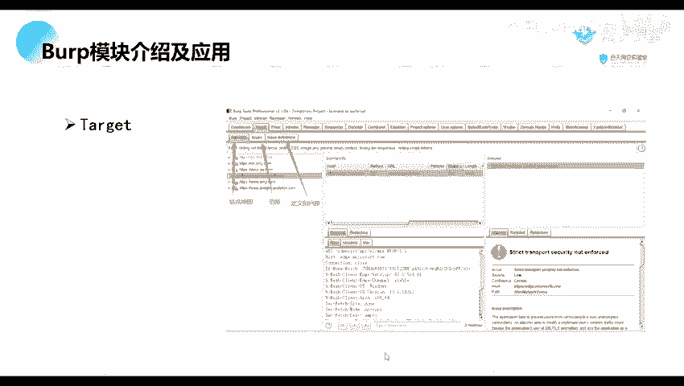
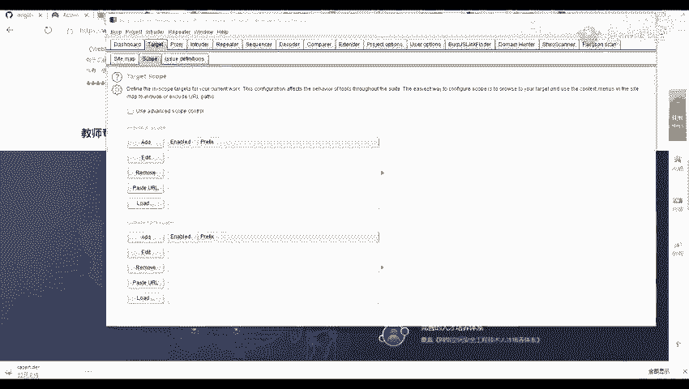
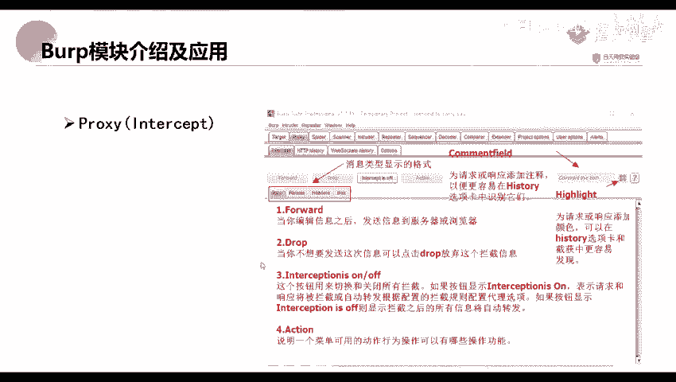
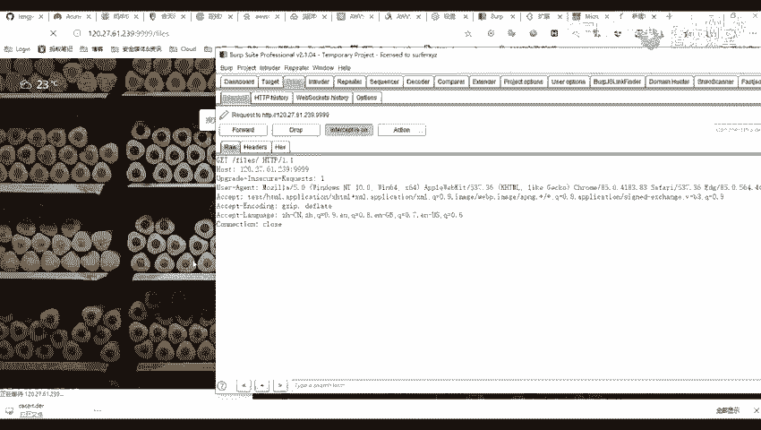
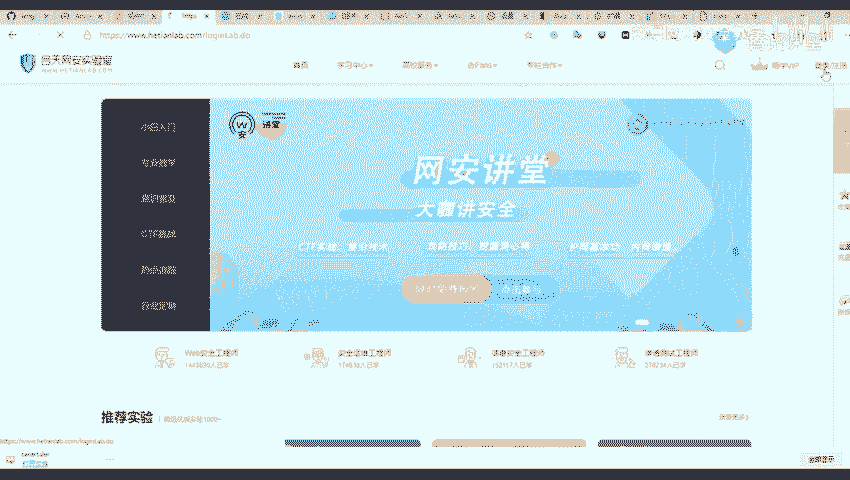
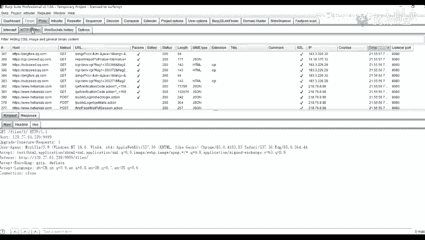
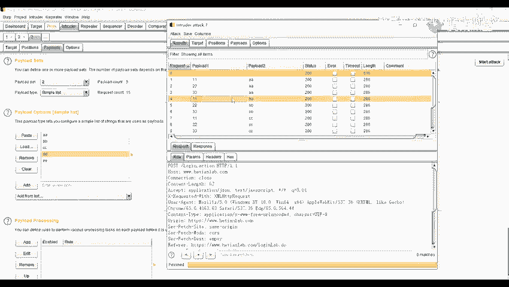
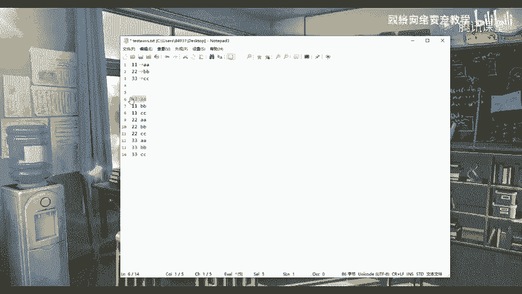
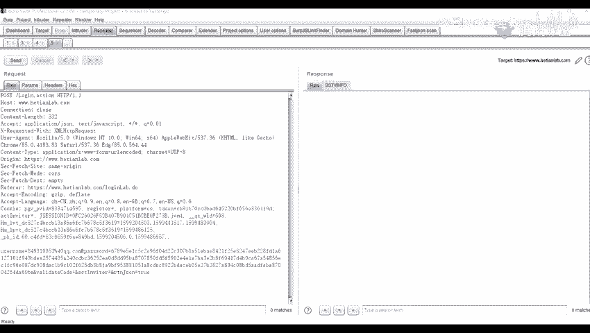

# 【零基础学网安】B站最全的网络安全教程，从入门到精通，学完即可就业，看完还学不会我退出网安圈！（渗透测试／kali渗透／内网渗透／黑客技术） - P27：6.Burp模块介绍及应用.mp4 - 蚁景网络安全教学 - BV1fctLevETn

首先呢，它是有一个11大模块，然后呢，我们会对这些模块进行一个展开来讲，就是去讲我们常用的几个模块，所以呢，我们最常用的话，只有三个，就是比较常用的，首先呢，我们来看一下第一个部分，dashboard。

这个呢，也叫做一个仪表盘，这个仪表盘这里，有几个窗口或者说一个界面，首先呢，这个libpatch，这个1，就是一个爬虫的设置，这个爬虫呢，就是对我们经过的所有的流量进行爬虫，第二个。

就是这个libaudit，这个libaudit就是一个被动扫描，就是对经过的流量进行一个审计，然后最上面，这个呢，就是我们的一个日字的界面，就是我们启动的一个Buffer switch。

或者是我们设置的一个代理，以及我们一些站点，就是不能访问或者是什么原因的一些日字的一个界面，然后右上角呢，这个呢，就是我们的一个问题活动界面，也可以理解成它的一个漏洞界面，就是它所扫到的一个漏洞。

就是这个被动扫描，就扫到的这个漏洞，然后上面呢，就是它的一个描述，比如说我们有一些问题的一个描述，我们可以看到，这些描述还有一些请求包，以及它的一个响应包，第二个呢，就是我们的一个Target。

就是一个目标模块，目标模块呢，有几个选项，一个就是Sitemap，就是一个站点地图，以及一个范围，就是第二个范围还有一个定义的问题。

比如说，这站点地图就是我们前面的一个爬虫，是爬虫爬到的一个站点目录，还有就是一个，第三个就是一个定义的一些问题，比如说我们里面可以看到，它这里有许多的一个漏洞的一些描述，还有呢，就是一个范围。

范围就是说我们爬取的一个范围，就是我们爬虫爬取的一个范围，下面呢，我们前面两个都简单的讲一下，我们简单的讲一下，这个是最常用的，Flows这个模块。

Flows这个模块呢，它里面也有几个小的功能，第一个呢，就是一个Intercept，这个应该说是一个小模块。

比如说我这里有一个地址，我这里还没有访问，然后我这里开启，进行抓包，这个呢，是一个无用的一个数据包，不用理它，那么我们点击访问，然后发送，这个呢，就是我们抓取到的一个数据包，我们可以点击Blog。

Blog就是一个放行的功能，然后我们第二个呢，这个Drop，Drop就是将它进行一个丢弃。

比如说我们这里丢弃了之后，我们可以看到，它这里是就没有去进行访问到我们的这个120。27。61，这个网站或者说是一个IP，那么我们快点，我们再重新访问一下，在这里进行一个抓取到的这个包。

然后我们点击这个Forward，点击了之后，我们是不是就可以进行一个访问了，然后呢，还有这个Intercept is on，这个就是选项，它有一个off，也有一个on，它的一个意思呢。

就是这个按钮就是用来打开拦截或者是关闭拦截的，比如说我们这里打开拦截之后，我们访问，我们再点击这个1之后，我们是不是就可以拦截到我们的这一个，就是它去访问我们的这个1的这个路径这里了。

那么点击Forward，还有呢，我们可以关闭拦截，关闭拦截，它的意思就是我们可以随意的进行访问，我们可以看到，比如说我们点击2，也可以进行访问，点击3也可以，它并没有进行。

它在这个Intercept这里，它并没有进行一个数据包在里面进行显示了，但是呢，如果说我们设置了代理之后，就是我们这里已经设置了一个代理者，对吧，那我们这里呢，也将我们的这个拦截进行关闭，关闭了之后。

我们可以在我们这个history，我们可以在这个history这个选项可以看到，我们的一个http的一个历史，首先呢，这里呢，是我，是它里面的一个注释，这个http history呢。

这个选项是用来显示所有请求产生的一个细节，比如说显示所有的一个目标服务器的一个端口，还有它的一个http的一个方法，以及一个UIL，以及请求中是否包含参数，或者是被人工修改http的选项状态码等等。

比如说我们这里找到我们的一个信息数据，我们这里呢，是不是可以看到，我们可以看到我们的一个目标服务器，还有它的一个端口，以及它的一个map这个方法，是get还是post，还有一个请求的一个UIL。

还有就是我们的一个请求中是否包含参数，比如说我们这里是不是有一个问号，问号V=1，这个呢，就是我们的一个参数，这V就是它的一个参数，然后后面这里没有这个问号，后面就是没有这个参数，然后后面呢。

就是它是否被人工进行一个修改过，比如说我们这里，毕竟您抓包了，没算，这样呢，就是它的一个状态码，比如说我们有一些是200的，有些是204的，有些是304的等等，还有一些101的，一些状态码。

还有它的一个长度，就是它的一个返回包的一个长度，看一下，是返回包还是请求包啊，就是它的一个响应字节的一个大小，还有它的一个响应的一个MIME的一个类型，比如说在这个HTML的一个类型。

还是一个TXT的一个类型，以及一个JSON的一个类型，还有一些其他的一些信息，比如说IP啊，BOOK啊，时间啊等等，以及从哪个端口监听来的，要不然我们在这里呢，点开这里。

我们就是它的一个点击这里进行一个过滤，比如说我们这里呢，是按一个请求，按请求类型过滤了，还是按一个MIME类型过滤了，这个呢就是说我们抓取的包啊，比如说我们这里，我们这里一个HISTORY。

比如说我们这里将我们设置我们这个包，就是将我们JSON格式的包进行一个过滤了之后，那么它就会，它就不能抓取到我们的那一个包，比如说我们这里将我们的一个HTML的包进行一个过滤。

就是去抓取我们这个HTML的一个包，还有呢就是我们的一个按一些正格表达式啊，或者是一些按状态码等等，我这里呢也进行一个注释了，这注释呢也写的很详细，你们可以，就是待会你们可以看这一个注释。

第三个呢就是一个这个PLOT上面的这个WEB SORTING，这个HISTORY，这个选项呢主要是用来记录WEB SORTING的一个数据包。

这个WEB SORTING是我们的一个HTML5中最强大的一个通信功能，它定义了一个全双功能的一个通信功能，通信功能，这个通信，它只需要在我们的一个WEB上面的一个SORTING，即可进行一个通信。

它可以减少不必要的一些网络流量，并且降低网络延迟，这个呢我们就简单的讲一下，然后我们讲一下第二个模块，Intuder这个模块，这模块它主要是对于我们的一个WEB应用程序进行一个自定义的攻击。

比如说我们可以最近一个暴力迫击啊，或者一些其实这工具呢，我们都可以去统称为一个暴力破解，或者说是一个可以去爆破我们的一个网站，一些登录登录用户名啊，一些密码等等，以及可以去媒体我们的一些攻击的一些。

一些那个QC，首先呢，我们这里我给大家举个例子啊，比如说我们这里呢，这个和天和天官网这里我们点击这个登录。

我这里呢就逐进行一个。

我打开拦截，拦截之后我这里有个用户名还有一个密码，那我进行一个登录，先将这些包围丢掉。

登录我们可以看到这个呢，就是我的一个登录的一个包，那我们可以点击这个action，将我们这个包去发送到我们的这个intuitive，这个模块这里也可以去通过一个右键，就是这个action。

就是跟我们的一个右键是一样的一个功能，就将它发送到我们这个intuitive这个模块，也可以去发送到其他的一些模块，那简单的来讲，这个action这个按钮就是进行一个交互的一个按钮。

就是跟其他的一些模块进行一个交互的按钮，我们这里呢，发送到这里之后，我们这个第一步呢，是通常呢，是不用去进行选择的，就是这个target，这个这一步呢，是不用选择的，我们来看一下第二步。

就是在我们第二步进行一个设置就可以了，第二步设置这里，它有许多的一些选项，比如说它这个攻击类型，OK，太好，这里呢，就是我们的一个攻击模式的一个设置，那里面呢，它有四个的一个设置，第一个snipper。

这个呢，就是对变量依次进行一个破解，要多的多个标记就依次进行，比如说我们这里有多个的一个标记，都会依次进行，在后面呢，这里有一个add clear，还有一个reflect，这个这四个按钮。

第一个这个add是一个先插入一个新的标记，比如说我们在这里，将我们抓到的这个包发送到我们这个int的模块之后，它会自动对我们的一个等于号，后面的一些参数参数的一个值进行一个标记，我们先到这一步。

到这一步我们先将它这个标记进行一个删除，删除之后，我们就在我们需要标记的地方进行一个添加标记，比如说我们这里在这个user name这里，添加一个标记，add，添加一个标记。

就在我们这个password这里也添加一个标记，我这里呢是举个例子，添加一个标记，现在我们也可以去删除这个标记，点击clear，这个这个add，这个按钮呢，就是它自动为我们参数值进行一个标记。

比如说我们点击这个add，它是不是就对我们等于号后面的那些参数的值进行自动的标记了，那我们再重新clear，去进行一个新图标记，那我们选择我们的一个user name，这里添加一个标记。

在我们的一个password这里，也添加一个标记，那我们前面讲到我们这个nipple，就是我们对我们的一个变量，依次进行破解，如果说我们多个标记，也进行一个依次进行，比如说我们这里有两个标记对吧。

那我们在这里highlight，这里呢我们就是是一个，这是我们的一个设置的一个字典，就是我们前面设置一个，我们待会呢，我们先讲这些吧，先讲前面的吧，先讲这一部分的内容，第二个第二个就是。

就是对变量同时进行破解，比如说我们前面这里呢，选两个标记，那么就会对这个两个标记进行同时的一个破解，第三个，第三个就是对每一个变量标记，对应一个字典，比如说我们这里选择第三个，我们这里是选择两个标记。

对吧，那他就会对每一个变量，就是取我们每一个字典的一个对应，进行破破，待会呢，我会给大家进行一个演示，第四个，第四个我们也可以叫它为一个急速炸弹，是一个急速炸弹，就是每一个变量对应一个字典。

比如说这里这一个是一个变量，我们选择第四个，然后这里这个变量一变量，一是对应一个字典，变量二也对应一个字典，他就会对这两个变量进行一个交集的破解，我们最常用的就是在用于我们的一个用户名以及密码的破解。

比如说我们这里破解我们的一个用户名以及密码，我们来先来看一下这个开了这个设置这里，我这里呢，也设置了进行一个比较详细的一些注释，我们呢，我这里呢就不讲这个了，我们直接进行一个演示。

比如说我们前面的第一个先讲第一个，我们先选择第一个，我们就选择一个一个标记吧，比如说我们这里呢，选择选择这个标记选择第一个是逆跑，然后我们在这个这里，我们就可以随意添加一个，我们这里就简单的添加一个。

比如说一些parts，就是一个粘贴就是粘贴我们的一些字典，等等，这个add就是添加一些字典，比如我这里呢就随意的输入啊，还有一些移除以及清除等等，或者是我们去移除我们这个第一个，或者是清除两个。

设置了之后呢，然后呢我们就可以进行一个报错，因为我这里呢是随便设置的一个参数啊，然后我们可以看到这里是一个报错完了，报错完了之后，我们可以看到他在这里，他这个user name是不是就是我们这个参数。

是不是就是我们前面所设置的一个字典，分别是一个118233，就这里，1233，然后我们来看一下选择第二个，第二个进行一个报错，选择第二个，如果这是对我们的一个标记，是多个标记，就对变量依次进行一个破解。

就从同时进行破解，就对我们这个变量同时破解，要如果说有多个标记的话，比如说我们这里也有一个标记，那也会进行一个同时的一个破解，那我们进入到我们这个pilot这个设置这里，我们可以看到他这里呢。

其实也是在我们这个pilot set，pilot set这个，只是也只有一个标记，只有一个1这里，那我们还是使用我们的这个字典，进行一个报错，那我们可以看到，他是不是他其实他是不是在这里，他的一个。

我们先这里发送到我们这里吧，这个就是我们报错的一个，就是参数值一个user name，还有一个password，前面我们是不是设置了一个11，设置了一个11，这里呢他就对我们的这个11。

同时进行一个破解，他这里呢一个22，然后呢这里呢也是对我们的一个22，进行一个同时的破解，还有就是33，那我们来看一下第三个，第三个我们选择第三个，第三个呢就是，对每一个变量标记对应一个字典。

比如说我们这里有两个变量，这个前面这个user name是一个变量1，这个password是一个变量2，然后呢，就是每一个变量就对应一个字典，要取每一个字典的对应的一个项，然后我们选择了这个字号。

我们进入到我们的pilot这里，我们可以看到我们的一个pilot set，这里我们有一个11233，1字典是这个第一号标记，是这一个，那么我们进入到第二个标记，第二个标记我们选一个随便输入一个。

a a b b c c d d，选择了之后我们可以看到一个空击，空击了之后我们可以发现，为什么这个这里呢就是第二个标记，这里输入五个字典，但是它实际上只包括了三次呢，这里呢就是我们的这个。

需要注意的一个地方就是，它只取我们最短的一个字典，比如说我们有一个字典有一个100，另一个字典是50，那么它是只包括50次而已，原来我们可以看到这里，一一一一一一一一，就是一号标记，然后对应了一个11。

二号标记了，就是对应一个a a，我们这里呢可以看到，分别是11对应a a，然后二对应b b，三三然后对应c c，然后后面呢这些d d，一一并没有进行爆破，因为它并没有一个数值，进行一个对应。

如果说我们在这里一个，一号字典也添加一个44，还有一个55，那么它也会进，就会对我们的一个二号字典，就会进行一个爆破完毕，嗯，还有呢就是一个最后一个，最后一个就是每一个变量，对应一个字典要并行。

并且进行一个标记的爆破，尝试各种组合，比如说我们这里呢，设置了两个标记对吧，让它每一个标记，对应一个字典，比如说我们这里标记，一标记一有一个，一字一字点，要标记二有一个二字点，标记二有一个二字点。

那么它就会进行一个交集，就交叉的一个爆破，那我们点击大进行一个爆破，那爆破之后我们可以看到，在这里一共有爆破了15次，分别是一个11，你要对应AA，然后22对应也是对应AA，33对应AA。

然后11对应BB。

也就是这样子的一个，顺序，比如说这11，然后旁边一个AA，2BB33，33，7CC，实际上爆破是这样子一个组合，要11AA，然后11BB，到11CC，要到22AA，22BB，到22CC，33AA。

33CC，33CC，实际上是这种的，那这里是不是就会，我们本来是只有三个字点，但是它实际上爆破了许多次，爆破了九次，对吧，是不是就会很繁琐了。

就是我们的一个字点量就会很庞大，对呢，如果是使用这一个的话，我们一般的话，那个字典就可能达到几十万，或者是几百万，如果说我们一个字分别是一个，一号字典，就是一号字典，是只有有100个参数。

里面有100个参数值，二号字典也有100个参数值，100乘100是不是就到10000，要这样子的一个字典就会进行很庞大，第三个就是一个repeat的一个点向，这模块，我们可以从这个blocklist里。

CMAP以及一个scanner的模块中，通过我们的一个要件菜单，或者是一个分手站的一个组合，发送到我们repeat的模块，这个模块呢，我们可以对，比如说我们这里这个模块，我们可以对这个模块进行一个修改。

比如说我们这个username改为一个test，或者是一个password改为一个test，要我们有一个send，send就是进行一个发送，就是发送我们就这个包，或者是我们的就是，原来我们这里呢。

刚修改了两次，要我们点击这一个，可以返回上一次的修改，或者是点击右边这个，就进行下一次，后一次的一个修改，那这个repeat也是我们最常见的一个模块，它主要是用来手动修改。

并且读发个别的一个http请求，并且分析他们的一个显示工具，左边的是我们的一个请求包，右边是一个显示包，那我们可以从我们这个flow，就是这个里通过一个要件菜单。

发送到我们的Central repeat，也可以在我们的这些target，这些站点地图将我们的这个包进行一个发送，要发也是发送到这个repeat这里，还可以从这个intuder这里进行一个发送。

这个它的一个快捷键都是一个看好，这个模块也是我们最常见的一个模块，那我们这几个就讲到这里。

你们有什么不懂的话就私底下问我吧，还有就是或者是在群里提出那个问题，那个问题。