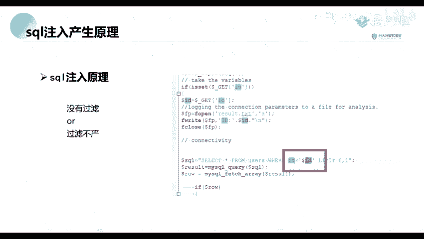
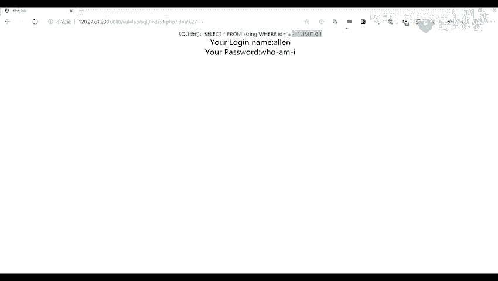

# 【零基础学网安】B站最全的网络安全教程，从入门到精通，学完即可就业，看完还学不会我退出网安圈！（渗透测试／kali渗透／内网渗透／黑客技术） - P28：7.sql注入产生原理.mp4 - 蚁景网络安全教学 - BV1fctLevETn

我们今天的一个内容就是我们的一个注入程序，ServoMap，我们在讲这个ServoMap之前呢，我们来先来看一下它的一个附入结构，就是第一部分我们首先讲一下这个Servo注入的一个产生的原理。

这部分呢就是一个ServoMap的一个介绍与安装，第三部分呢就是它的一个功能以及应用，就是如何去使用这个ServoMap对我们的一个漏洞进行一个注入，下面呢我们先看一下第一个部分。

Servo注入的一个产生的原理，首先呢这个Servo注入漏洞是从1998年，圣诞节大火以来长盛不衰的，就是在那时候就是在1998年就已经出现了这个漏洞了。

然后到现在呢我们还是能经常看到这一个Servo注入的一个漏洞，那么是Servo注入漏洞呢，也就是说它的一个Servo注入漏洞是将我们的一个Servo语句。

就是Servo一个查询的语句或者是其他的一个Servo语句，加入或者是添加到我们的一个用户的一个注入的一个参数中的一个工具，然后呢再将这些参数传递给后台的一个Servo服务器，来解析并执行。

也就是说可以将我们注入的一个数据，就是注入的一个Servo语句去当成传递给后台的一个Servo服务器去执行，这个呢你们可能是有一点点不懂，不过呢这个没关系，待会你们就是我们实验室里。

你们有就是里面可以对这个漏洞就去进行一个读取，下面我们来从代码的方面，我们来看一下它的一个注入原理，它是由于从一个，由于是没有过滤，也就是说我们注入的一个，可能将我们直接将我们注入的一个参数。

或者说是一个语句直接进行一个执行了，或者说是一个过滤不严，也就是说我们可以对它进行一个要求，首先呢我们从这图中的代码可以看到。

我们从代码中可以看到。

它对我们注入的一个ID，并没有进行一个严格的过滤，也就是这里的一个ID并没有进行任何的过滤，我们通过一个get方法去，算了我不翻译，它从我们就是我们通过一个get方法去获取我们一个ID，但是呢。

它并没有对我们获取到的这个ID里面的参数的值进行任何的过滤，那么我们就可以，它就是注入一些歌颂语句，来进行一个查询，我们想要查询的一个数据，这个能不能理解你们，这个可以理解吗。

就是讲的这个歌颂语句的一个注入的一个原理，你们学过这个歌颂语句的，学过数据库的话，应该是可以理解的，也是不能理解的话，扣到2，没问题的话，那我们就继续了，因为我们这里的更多的是一个两一个工具的使用。

所以我们最大的一个并没有最大的一个，其他的一些方面并没有进行深入的一个对，首先呢，我们判断的方法，我们可以看一下，我们一般呢，我们对这个思考判断，它是保存在一个思考注入漏洞。

我们一般都使用一个代研号进行一个判断，比如说这里是之前的一个实例，这是一个例子是真实网站存在的，我们正常的话，我们在这个line这里，这个参数后面，参数后面它是一串，这个四符串。

就是一个URL编码的一个四符串，我们可以看到我们在正常的情况下，我们输入的时候，它返回的这里是一个正常的一个内容，对吧，然后呢，我们我们插入一个代研号，就是我们可以看到在这里呢，可以看到，我们这里呢。

是插入了一个代研号，然后呢，我们可以看到它后面这里，它返回到这里，它跟我们前面返回的一个内容是不一样的，返回的不一样之后呢，我们再来看一下，我们再输入一个代研号，我们再输入一个代研号之后。

我们可以看到在这里，在这里呢，输入了两个代研号，我们这里呢，输入了两个代研号，然后呢，它这里它这里返回的一个内容，也就是跟我们前面没输入代研号的时候是一样的，那么我们就可以说这里呢，是存在一个注入漏洞。

比如说我找个网站吧，比如说我们这里有一个看一下，比如说我们这里呢，有一个网站，这个呢，是我们用来进行一个练习的一个网站，我们这里有一个网站，我们在输入E的时候，它是给我们返回的一个。

是这个是一个正常的回填，对吧，是给我们返回一个正常的一个页面，并且在我们这里呢，带着一个社口语句呢，也是相当于是这样子的，这是一个是let，要新要from users where id=1。

where id=1之后，它返回的一个内容是正常的，但是呢，如果说我们在这里加上一个代研号，代研号这里呢，是不是就会进行一个报错了，为什么报错呢，我们可以看到我们这里，社口语句这里。

在这里是不是多了一个代研号，我们在输入一个代研号的时候，在这里是不是多了一个代研号，代研号这里，是不是就会引起一个报错，这可以理解吗，好，然后呢，我们在输入一个代研号的时候。

因为在这里多了一个代研号对吧，那么我们怎么将这个代研号给闭合掉，或者是去掉呢，我们可以使用一个这样子，我们在输入，我看一下是不是这个，因为这个是一个数字型的一个输入，我们来看一下第二个的吧。

我们来看一下，因为前面那个是数字型的，因为我们这里呢，我们应该是这一个是这一关，我们我们这里，去查询一个A的号，他这里呢，是因为他我们输入的是一个字符，字符串，他这里是一个字符型的一个注入。

或者说是一个字符型的一个搜索，哦，就是如果是数字型的话，数字型的话，这个语句，我们在这里进行一个吗，这里举个例子，比如说我们如果是一个数字型的话，信号，ID等于1，这个数字这种呢，就是一个数字型的一个。

就这样子吧，数字型的他的一个搜索语句是这样子的，一个selector，等于1，他没有没有利用一个引号进行扩起来的，但是呢，如果说一个字符型的话，字符型的话，可能就是A。

他就是里面里面的是一个我们搜索的话，我们是搜索一个这样子的一个东西，就是ABCD以ABCD这些字母来进行一个开槽的，我们字符型是用有引号进行引起来的，数字型的话就没有引号引起来，回到我们这里。

回到我们这里，我们在输入一个A的时候，正常的一个查询的时候，他的一个搜索语句是这样子的，我们在这里，我们在这里，我们在这里，再添加一个单引号，对吧，这天下的银行这里他就会进行一个报错，为什么会报错呢。

因为我们这里就像那样，我们在这里做一个而已，要再输入一个单引号，他这里是不是就多了一个单引号，多了单引号是不是就会引起一个报错，要引起报错呢，我们。

那么我们怎么怎么将这个报错给就是让他不再进行一个报错呢，我们这里有两个方法，一个是我们可以将我们的这个语句，就这单引号给闭合，或者说我们再增加一个单引号。

增加单引号是不是我们就相当于是一个成为了两两个部分了，就是第一部分是在这一个，比如说我们在这里，再增加一个单引号，我看一下，增加了一个单引号，再增加一个单引号，是不是都没有报错了，但是呢。

他这里就没有但是没有并没有查出一个数据，现在我们可以利用另外一个方法，就是将我们后面的这一个部分的内容给注释掉，怎么注释呢，我们在思考语句中啊，我们有注释注释的一个方法呢。

有可以使用一个减减加进行一个注释，他的什么意思呢，也就是说我们将我们这减减加后面的一个内容给注释掉了，就是不起作用了，不起作用了之后，到这里呢，就相当于是成为这样子了，是不是我们就正常了呀。

所以我们可以利用一个减减加，减减加或者是一个引号给注释，或者是一个引号进行一个注释，我们这里呢，可以试一下，以后减减加，我们注意个点点大的时候，是不是就就为我们这个语句就会正常执行了，这可以理解吗。

简单来说我们就是将我们的一个报错，报错信息给注释，将后面的一个信息给注释掉就可以了，好，那么要是没有疑问的话，我们就继续了，我们这里呢，就简单的讲一下他的一个搜索注入的一个原理，以及他的一个判断方法。

首先是一個拖曝。