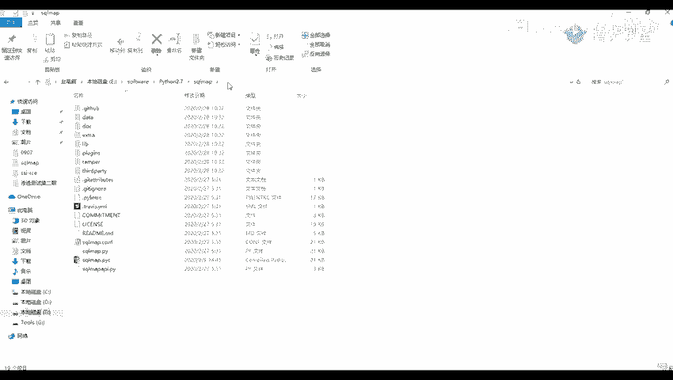
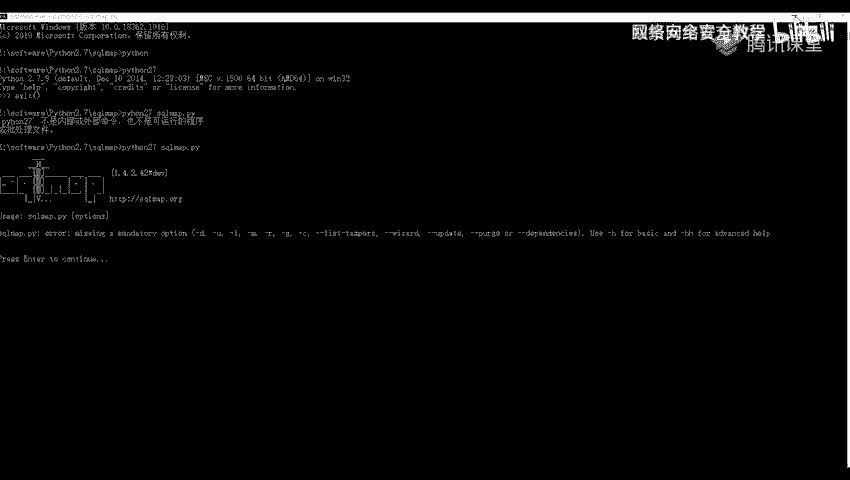
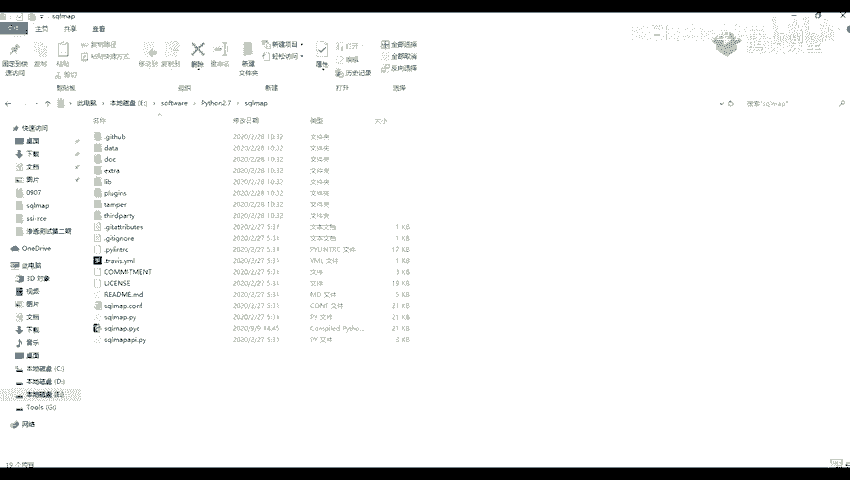

# 【零基础学网安】B站最全的网络安全教程，从入门到精通，学完即可就业，看完还学不会我退出网安圈！（渗透测试／kali渗透／内网渗透／黑客技术） - P29：8.sqlmap介绍与安装.mp4 - 蚁景网络安全教学 - BV1fctLevETn

下面我们来看一下ServoMap的介绍以及安装，首先我们来看一下ServoMap是什么呢，它是一个开源的渗透测试工具，它可以用来进行自动化的检测，利用这个Servo输入漏洞获取数据库服务器的权限。

也就是通过我们刚刚讲的那个输入漏洞，来获取一个数据库服务器的权限，它是用一个Python语言写的，所以如果要使用的话，我们需要安装一个Python的环境，Python的环境你们在前面的课已经安装了。

我这里就不给大家做一个演示了，我这里有一个是官方的网站，还有一个是Github，我们来看一下这个是它的一个官方的网站，我之前也给大家在预提内容里面，也给大家写了这个，你们就是将这个下载这个加车包。

然后进行解压就可以进行一个使用了，并不用说像其他的那些要激活或者什么的，另外一个就是它的一个Github，这个呢，是它的一个官方的一个仓库，这里也有一些它的一个安装方法，以及它的一个使用方法。

还有它在这里也做了它的一个运行的版本，看到我也给我我也在我的一个就是网盘里面给大家放了一个链接，你们可以也可以在我这里下载，下载了之后那是这样子的一个，这个呢就是我找一个这个。

解压了之后是它的一个车后麦卡，后面我们可以看到它这里它的一个运行的一个脚本，实际上是使用这个车后麦卡，我们就运行这个文件，但是呢，我们就是说每次每次都需要进入到进入到里面来的话。

就是进入到我们的文件里面来的话，是不是有一点点麻烦，那么我们就可以为他创建一个快捷方式，怎么创建呢，我们可以新建要面新建这个桌面，这个要件桌面要新建一个快捷方式，新建快捷方式，然后我们在这里呢。

需要我们去填，让我们填一个对象的位置，我们我们这里呢是为我们的一个cmd，一个cmd的一个窗口，我这里，我们要建创建一个快捷方式，然后为这个填一个cmd，它的一个路径，然后呢。

我们就是要件主性在它的一个起始位置，填我们的一个三方麦卡文件的一个位置，就是说我们在这里填入了我们的一个cmd之后，我们连接下一步，这里呢，你可以命名随便命名或者是一个sqlmap，就完成完成了之后。

我们在要件要件属性这里，在它的一个起始位置将我们的一个，sqlmap的一个路径给放上去。

在我们的一个起始位置这里将它放进去，点击应用就可以了，你应用之后呢，我们就可以在桌面区对待进行一个使用了，我们登记它，登记它在这里呢，是直接进就可以直接进入到我们的那个路径。

这里让我们输入一个python，python要看你们的一个python是输入python呢，还是一个直接的一个，多版本一个共存的，比如说我这里是一个多版本的。

所以我先用python改为一个python27，这里输入一个python27，到这里就会出现我的一个大的一个版本号，我们这里不是这样子，然后我们去执行这个python27。

然后在执行我们的一个sqlmap。py这个文件，现在我们，这里少了一个python27，现在我们就可以看到它的这里的一个，它给我们显示的一个版本信息，环境变量，环境变量里那个我，我没事啊，环境变量。

待会你们也可以试一下，我这里，就是我们主要是我们将我们的一个python的一个环境变量搞好就行了，这个的话都是不重要的，我们也可以就是我们在运行的时候，我们也可以进入到它的一个目录里面，执行一个tmd。

然后去运行它，我用一个拖曝。

