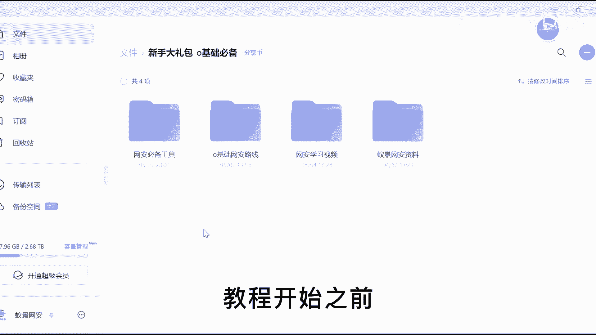
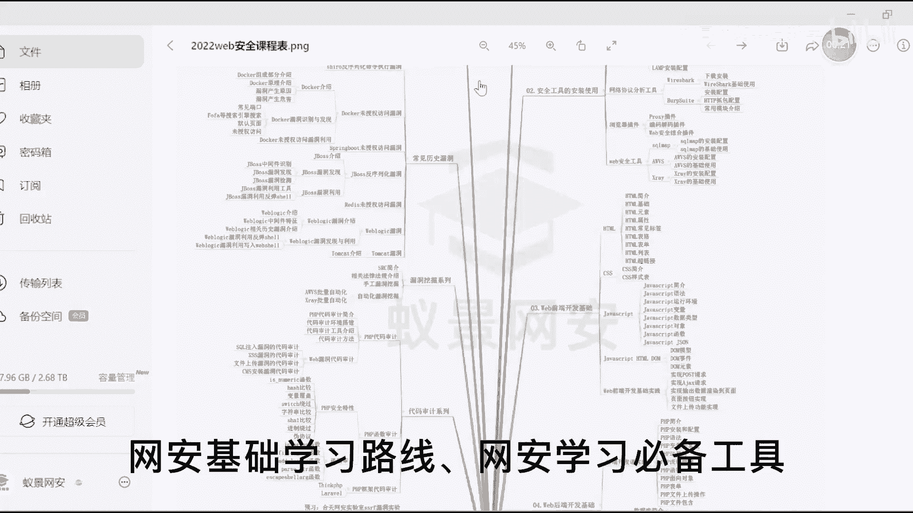
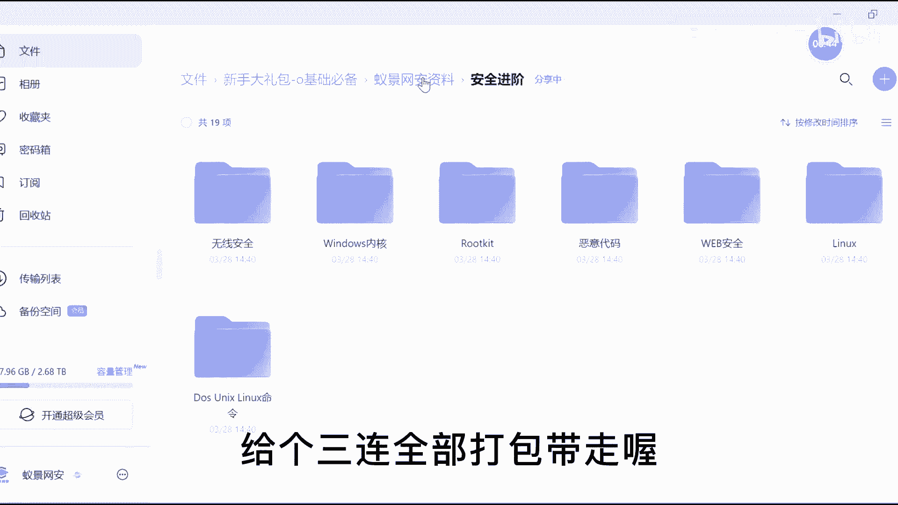
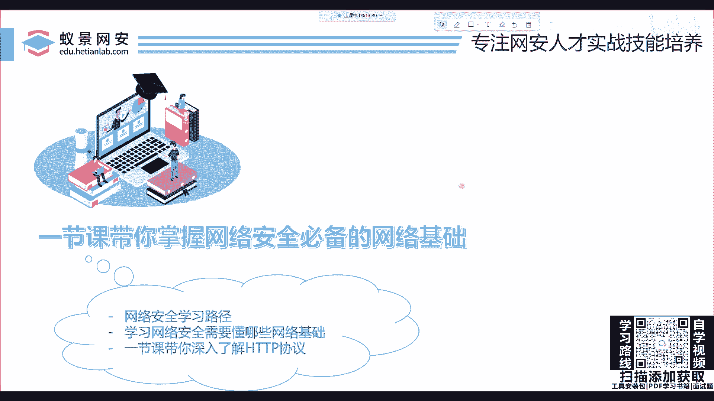
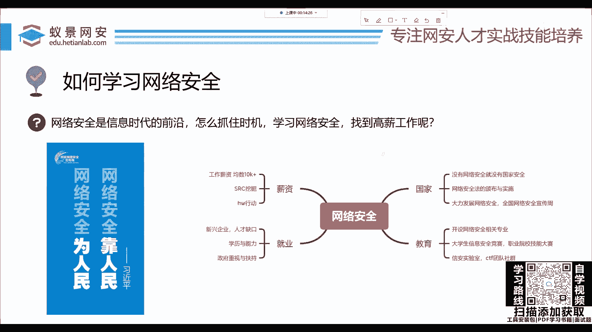
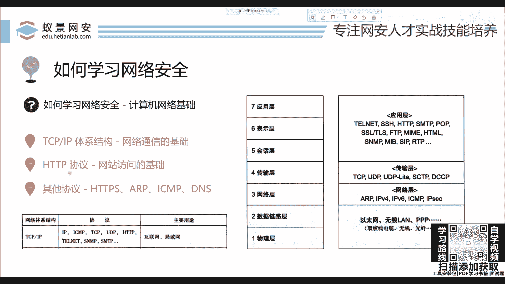
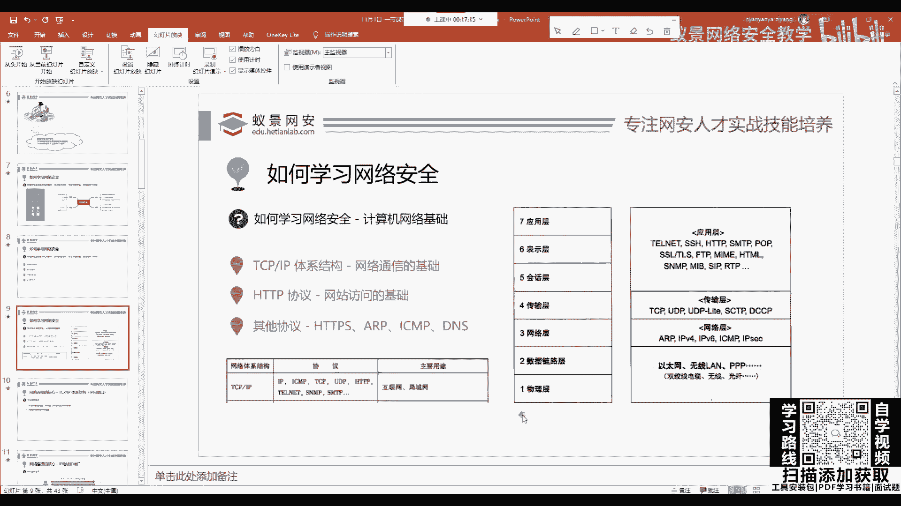
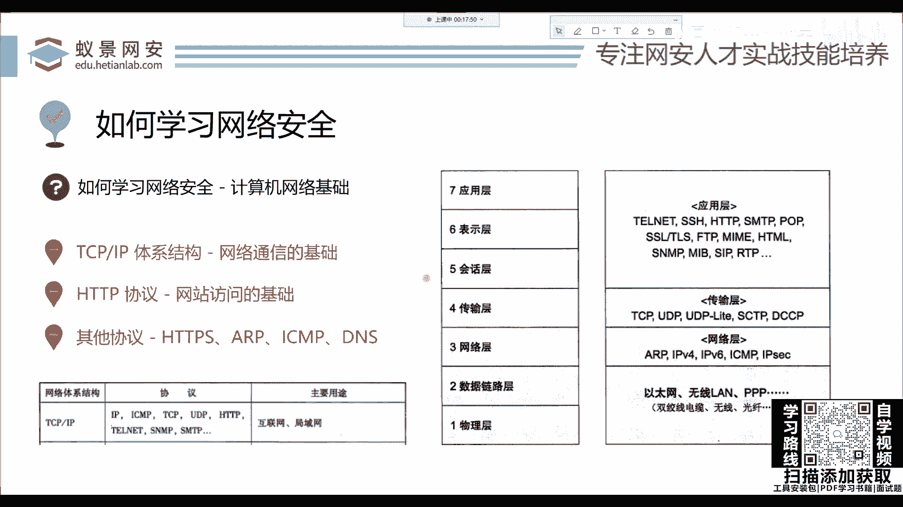

# 【零基础学网安】B站最全的网络安全教程，从入门到精通，学完即可就业，看完还学不会我退出网安圈！（渗透测试／kali渗透／内网渗透／黑客技术） - P2：1.系统学习网络安全.mp4 - 蚁景网络安全教学 - BV1fctLevETn

教程开始之前，UP已经把相关的。

网安基础学习路线、网安学习必备工具、。

电子学习书籍、高清教学视频、网安面试题，都已经准备好放在PL区了，给个三连全部打包带走哦，赶快冲呀。

首先提醒大家一下，本节课是一个完全基础的内容，如果你没有任何的计算机基础，也不要有任何心理压力，如果说你现在已经在从事网络安全相关工作了，已经入行了，那你也可以重复听一下。

对你可能会有一些基础的帮助以及回顾。

大家可以耐心的听一下，首先我们都知道，现在网络安全是站在了信息时代的前沿，这个是非常的火，不论是大学里面的招聘，还是各种CTF比赛、各种互网行动以及SRC的报酬，都是非常丰厚而且吸引人的。

很多同学就想去利用这个机会去学习网络安全，怎么学习路径，大家可能比如说去百度上去找，找到什么盗取账号等等，或者是什么黑客攻击，这些其实都是一个片面，就它只给你讲了一个点。

没有告诉你怎么去一步一个脚印的把它去学会。

去找到这样一个合适的工作，那我们下面就来简单看一下，我就总结为四点，其实这四点是非常好理解的，首先就是计算机基础，这是肯定的，你不论学习任何的IT，你都要掌握这些计算机的相关原理，比如说像操作系统。

当然我说的是基础性的，并不是说你去考取这些研究生去找的这些比较复杂的内容，然后是网络基础，这网络基础就是我们今天要讲的内容，然后在学习完网络基础之后，就可以进而学习一些网站漏洞以及渗透测试。

内网渗透的相关概念以及相关的技术这些操作，OK，那今天我们先来看网络基础，这个网络基础大家在大学里面都学习过计算机网络，就是谢希仁的那一本特别厚的书，这本书是把整个的网络体系、架构、各种协议。

都从原理方面描述得非常清楚，但是如果我们只是为了去学习网络安全，其实并不需要掌握那么多的理论知识以及大部分的协议，那这些协议在实际的工作中可以说几乎用不太到，用到的时候我们再去学也没有关系。

首先我们来看对于这样一本厚厚的书，我们应该学习哪些内容，我总结就是一个体系结构以及相关的协议，这个体系结构也是计算机网络中最为重要，也是大家耳熟能详的TCP/IP体系结构，这个结构是网络通信的基础。

我们可以看到TCP的协议是位于网络的第四层，也就是传输层，我们的IP是位于网络层，传输层和网络层就是构成了我们网络通信的基础，如果没有这个结构你想上个网都行不通，上不了。

这个TCP/IP中也有一个非常重要的协议，叫做HTTP，HTTP是网站访问的技术，如果没有这个东西你就没有办法去访问网站，一会儿我们就来探讨一下这个协议到底是什么东西，有同学说到这里可能会问。

为什么我要花时间去学这些东西，首先你想一下，挖掘SRC，挖掘这些漏洞，大部分的漏洞是不是都是属于一个网站的漏洞。

都属于一个网站的漏洞对吧。

对于这个网站我们肯定要清楚它如何去访问，你如果都不清楚这样的原理，它怎么去访问，怎么去响应给你这些图片信息的，那你就没有办法去下手去攻击这些网站，这是肯定的，OK然后就是其他的协议，大同小异。

HTTPs，IRP，ICMP，DNS等等这些协议，大家在后面都可以去了解一下，那么今天就来去打通网络基础的思路，大家可以根据二一老师的脚步一步一步地。

