# 【零基础学网安】B站最全的网络安全教程，从入门到精通，学完即可就业，看完还学不会我退出网安圈！（渗透测试／kali渗透／内网渗透／黑客技术） - P30：9.sqlmap功能及应用.mp4 - 蚁景网络安全教学 - BV1fctLevETn

然后呢我们这里呢有有一个中文的一个手册，中文手册呢也介绍的一个比较很详细的，我这里呢只是给大家介绍到的一个简单的一个用法，首先呢我们可以看是可以看到这里给大家列出了几个参数。

一个是杠H杠H参数呢是查看的一个基本用法，以及它的一个命令行参数，还有呢就是一个杠HH就是查看所有的一个用法，以及命令行参数，还有呢就是它的一个杠杠涡损查看它的一个版本信息。

下面呢我们先来看一下它的一个用法，我们先将我们一边介绍这个用法一边来讲这个课，首先呢我们进行一个漏洞的一个检测，漏洞的检测呢我们主要是使用一个杠U的一个参数。

杠U参数呢在后面呢就是跟我们的一个URL或者是一个杠M参数，也就是我们可以去批量去对我们的一个URL进行一个检测注入，就是检测它是否存在这个注入漏洞，比如说我们这里杠U我们来给大家测试一下。

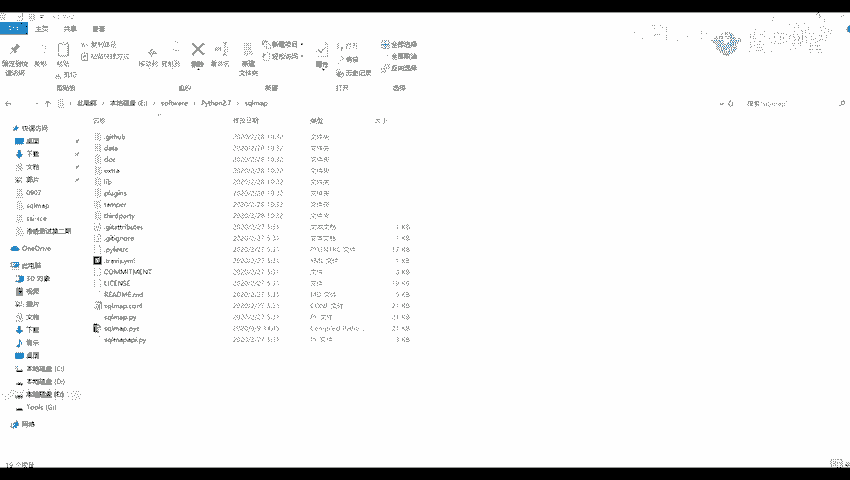

要Python27然后SoCallMap，杠U杠U呢就是跟我们的一个URL，后面跟我们的一个URL。

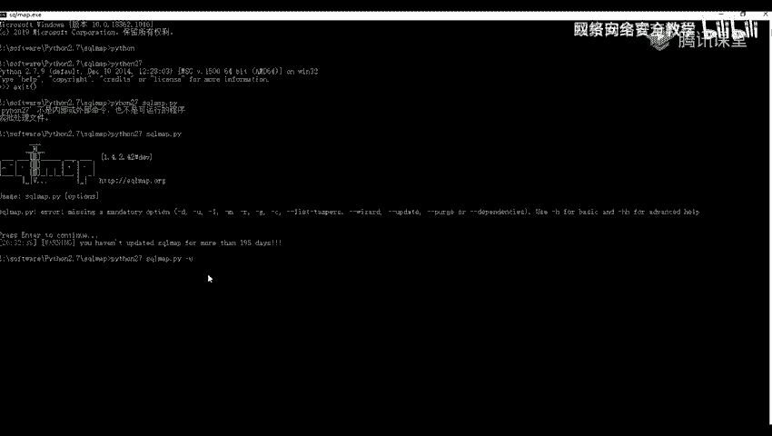

大家刷引号，然后这里呢就是跟我们的一个，跟我们的一个URL就是我们的一个参数的一个值这里。

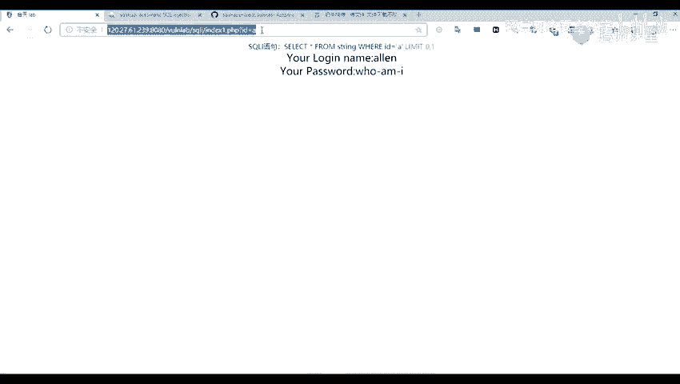

然后我们URL，进行回车，回车呢它这里呢就会给我们进行做一个检测。

检测的话，它这里呢Docx询问我们，就是如果说我们不懂这些英文什么意思的话，我们也可以进行一个复制，而这个意思呢就是告诉我们，我们后端的一个数据库看起来呢，像是一个埋车头的，看起来像是一个埋车头数据库。

要再询问我们是否去跳过测试其他的一个数据库，这里呢也可以去翻译一下。

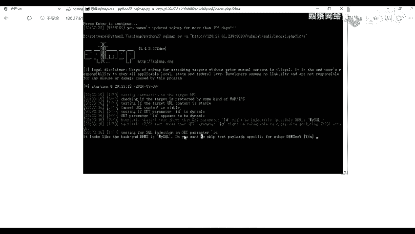

它这里呢是询问我们是否要跳过测试其他的一个数据库，然后我们就确定就好了。

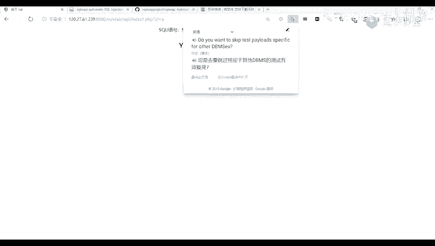

就有一个Y去确定，这里呢我们就是看不懂的话，但我们我们也可以进行一个复制，看看它是一个什么意思的。

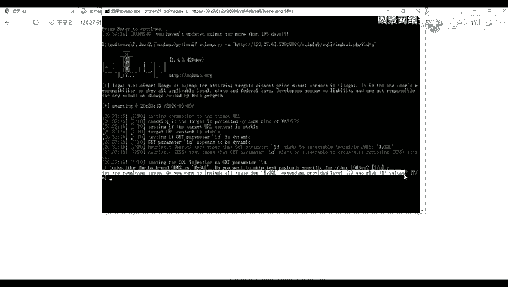

那这里呢询问我们是否要包括所有针对一个埋车头的一个测试。

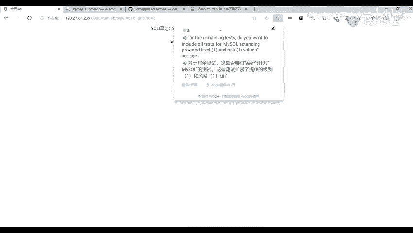

我们这里呢也可以可以就选个N你可以，我们可以就随便去就是我们不懂使用的话，我们都都可以去多进行一个尝试，就是可以输入Y，第一次输入Y看一下会是什么结果，输入N看一下会是什么结果，到这里。

它询问我们就检测到这个ID的这个参数是脆弱的，也就是说它检测到了这个ID的这个参数，可能是存在一个漏洞，然后后面这句话呢就是问我们是否要还要去测试其他的一个参数，我们这里呢就不进行测试其他的一个参数了。

我们这里呢就测试一个ID的一个参数，现在我们输入一个N，输入N之后，这里呢就是我们的一个检测的结果，这里呢就是检测到了它的存在了一个注入，就是存在了一个GET型的一个注入。

现在呢如果是我们使用了一个-M参数，-M参数呢我们可以将我们的一个URL复制到一个。

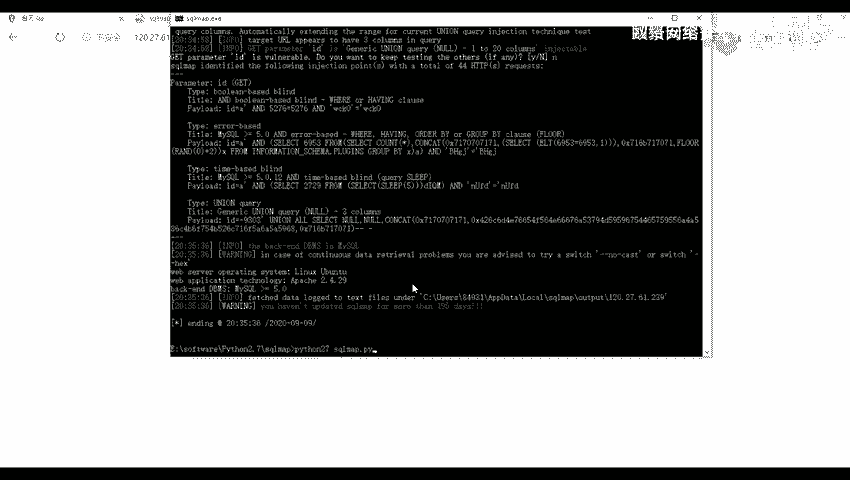

文本里面，比如说我们复制到这里，一行一条，比如说这里是一个1还有一个2，比如说这样子，如果我们是，就是我们一行一个URL，如果我们使用的一个-M参数。

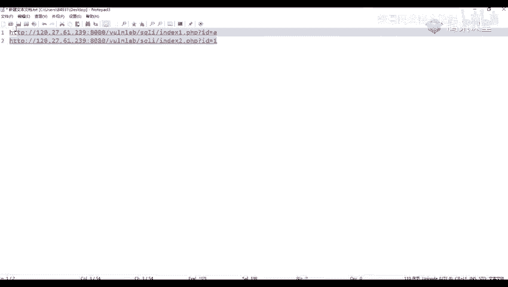

就是进行一个力量的一个检测，上面呢我们检测到了它存在的一个漏洞。

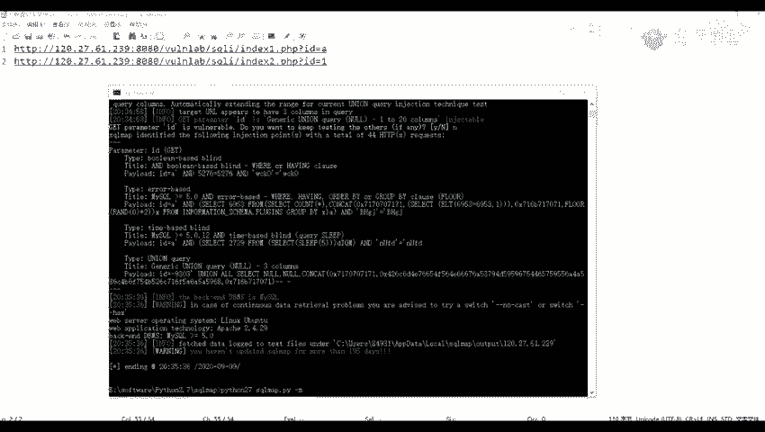

那么我们再怎么去进行一个利用呢，首先呢就是一个第一步，就是每举它的一个数据库，这里面每举它的一个数据库呢，就是我们要注意的时候，就是一个地方就是我们后面的这个-DBS，-DBS也就是说。

每举所有的一个数据库，也就是在我们的这个数据库系统里面的一个，所有的一个数据库，这个呢就是。

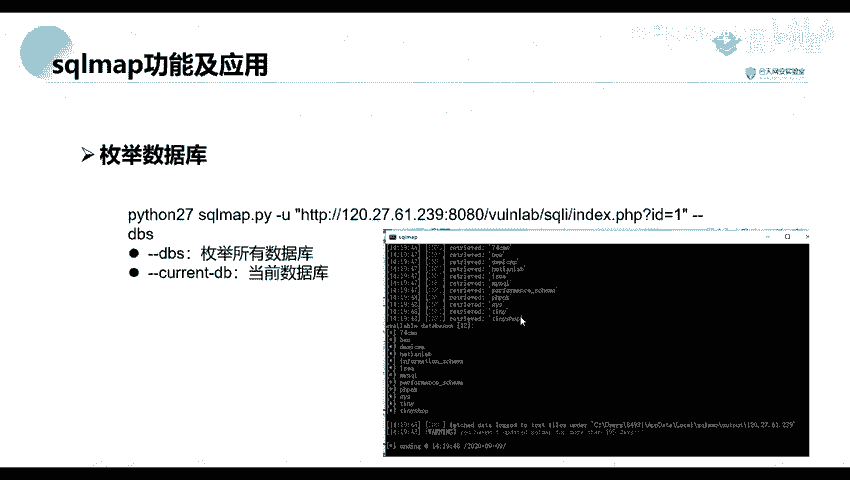

就是它的一个测试的一个等级，比如说我们这里呢是一个，因为我们一个注入的话。

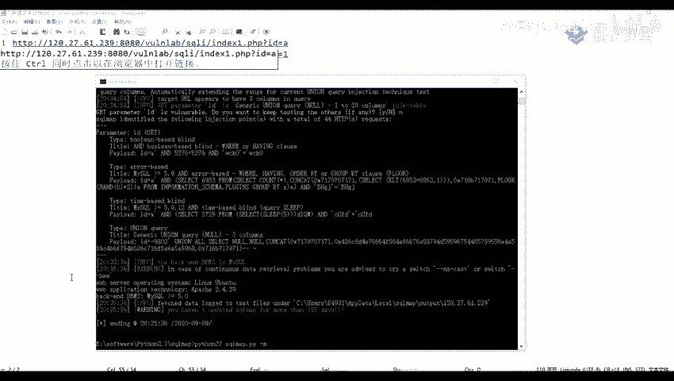

我们并不仅仅只有一个get，或者是这个post，我们还有一些，我们也有也可能会存在一些cookie注入，还有一个http投注入，http投注入，就是这什么意思呢，就是说如果我们注入的一个参数。

就注入点并不在这里面，get或者是post里面，并不在这里，那么它如果说在这个cookie的话，如果我们选择你刚刚说的这个，那么它就会去测试其他的一个地方，嗯，嗯。

比如说在的那个level就是你就是那个等，就是等级的level那里，它一共有五个五个等级，它默认情况下呢，这个servo map只支持我们的一个get，还有post参数的一个注入测试。

但是呢如果当当我们这个level，大于等于二的时候就会测试，它的一个http，http里面的一个cookie，以及一个user a准，还有一些你报了，你报了头等等，这个呢你可以看一下那个中文手册。

里面也有一个介绍，可以说是但是我们对啊，就是你你手没，你手没就是跟我们前面捡的一个，编辑器一样就是awbs一样，你你设置的就是越越慢，那就是我们不是有一个选择吗，可以设置快的还有一个慢的。

如果你设置5的话，那就会走得很慢，但是呢它就会可能就是走得比较详细，我们可以根据我们我们的一个需求，还进行一个设置，这边呢我们来看一下我们的一个。

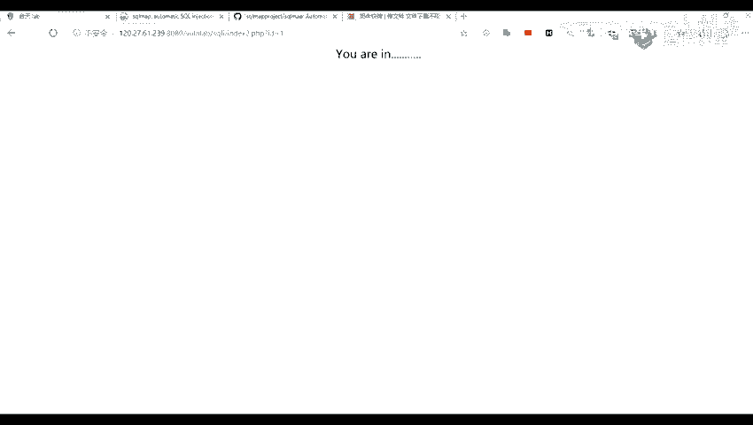

其实我们，我们在标面加上一个杠杠dbs，就是我们没没举我们当前的一个数据，这个数据库管理系统里面的所有数据库，我们可以看到我们这里呢已经给我们，美举了我们的一个所有的一个数据库，存在的一个数据库这里呢。

跟我们的一个是一样的这里。

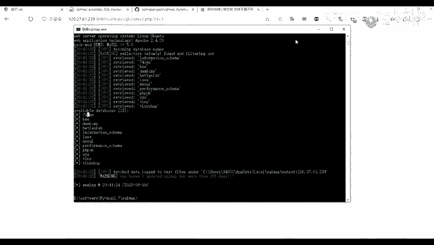

对模样呢是一级模样，一一单就是可以测试我们get还有post。

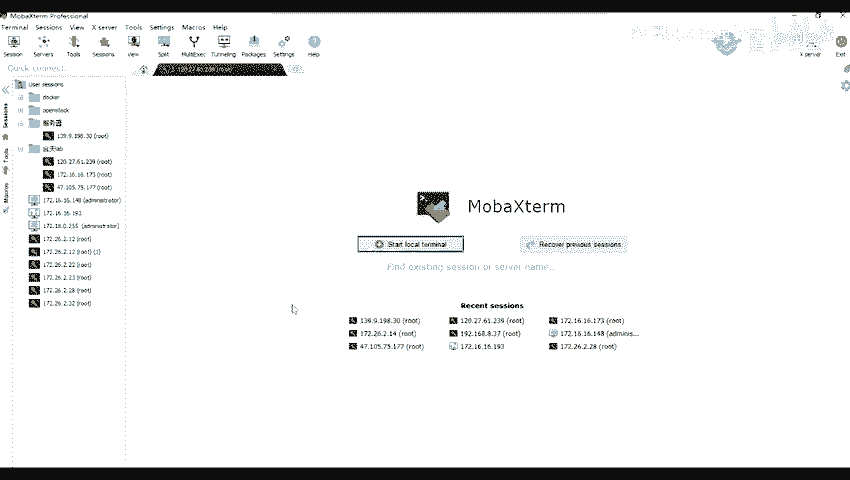

参数里面的一些参数，我们这里来说好，比如说我们进入进入到我们这个数据库，这里的要让我们来看一下它里面的，一个所有的一个数据库，这一颗，这个背景，我们这里可以看到呢他这里他的一个数据库。

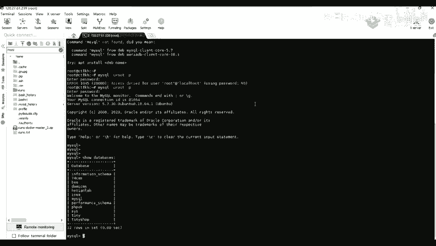

跟我们跑出来的这里呢是一模一样的，他这里呢是12个我们跑出来的也是12个，那我们除了我们的这个所有的一个数据库之外，我们还可以去跑我们当前当前的一个，当前所使用的一个数据库。

就是我们将我们的一个刚刚改为一个，这个参数呢，这个参数这个参数这个参数就是每几，每次查询我们当前当前这个网站所使用的，一个数据库。

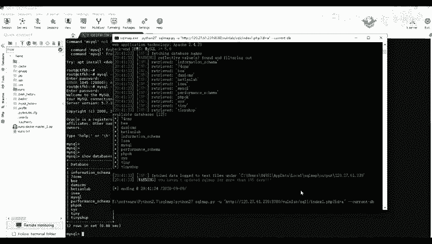

我们这里可以看到在这里，在这里我们已经注入出了一个他的一个数据库，名字当前的一个数据库的名字为一个和天，那我们在实际发src的时候啊，我们就是跑出这个数据库名就可以了。

就是我们在使用这个srcmap还是一个人工进行一个注入的时候，我们都是我们一般来一般来讲的话，我们跑出了这个数据库名就可以提交了，并并不再需要进行方面的一个注入了。

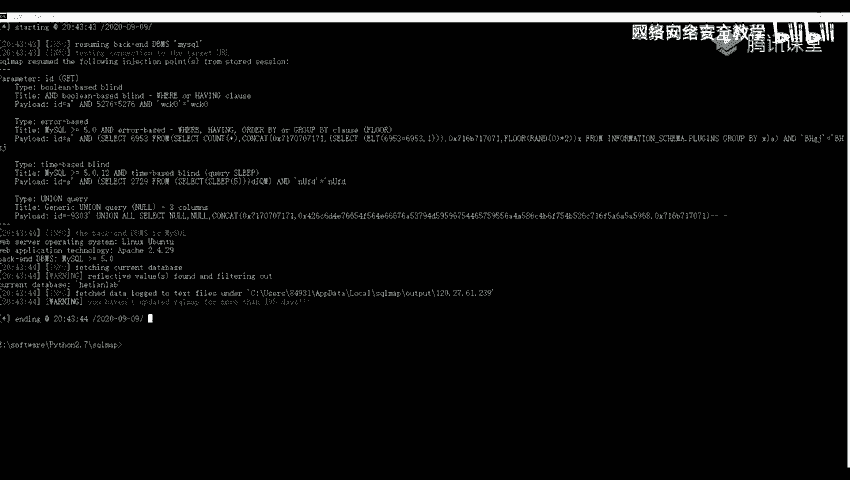

我们注入了一个注入出了跑出了一个数据库之后，我们就还可以去最大进行一个数据表，就是跑他的一个数据表，数据表呢，我们前面的一个数据库呢，是一个刚刚dbs，要数据表数据表呢。

就是一个刚刚黑宝黑宝就是一个表表明，对吧，这个这个杠逼杠逼参数就杠大写第一这里后面的就是跟我们上一步没举到的一个数据库名，比如说我们上一步上一步就是没举到了一个和天，那么我们这里报他的一个数据表呢。

就可以将我们的那个数据库名就是写写出来。

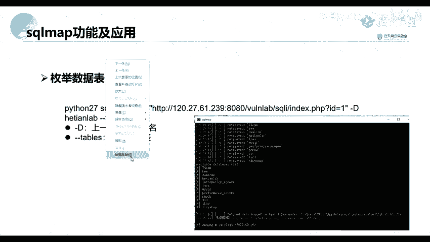

比如说我们比如说我们这里我们前面是，前面我们跑出了一个和天来吧，原来我们干逼干逼也就是我们的一个费特贝斯，这个数据库吗，要和天，然后面刚刚一个刚刚黑宝黑宝。

那就会对我们的这个数据库里面的一个表进行一个查询，我们可以看到我们查查到了这个吧八个表一个优色，以及一面你过了等等，那我们我们跑出了一个表明说我们是不是还可以跑他的一个表类就是他的一个列明。

那你比如说然后呢我们可以在这里我们前面跑出了一个表明。

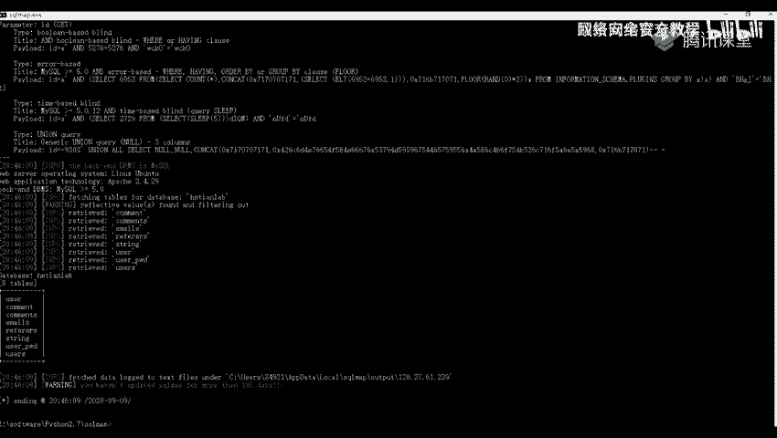

要干干逼干逼呢，就是我们跑出来的一个前面的一个表明，比如比如说我们这里呢好一个优优色，是不是这个优色就是我们前面跑到的一个表明，那我们在列明列明是哪一个呢。

就是column c o l u m m n s，这个呢就是跑他的一个列明，我列明之后我们来看一下，所以呢可以跑到他存在的三个类，分别是一个ID Password的一个以及一个User Name。

这些呢是自己自己添加了，就是那个是我们用来练习的一个网站的，这个你你在上一个的时候应该也也有做过这个吧，对，现在是给我们做一个练习的。

那我们跑出了这个ID还有一个User Name Password之后，我们还可以对他进行跑出他里面的一个具体的一个数据，那么怎么要到了这一步呢，也就是还要再继续的话，也就是我们所做的一个窝窟。

前面我们前面这里呢我们跑出了大的一个媒体，到了他的一个数据表列，然后我们这里呢还有一步是窝窟窝窟这里呢，我们在挖SRC啊或者是做一个，做一个其他的一个漏洞挖掘的时候，我们就这个呢尽尽量不要去使用。

除非说我们是在做一个渗透的项目，就是别人有的一个授权，要并且说明这个情况之后我们才可以对这个进行一个使用，不然的话我们这个窝窟这个命令，就是我们最好是不要对他进行使用。

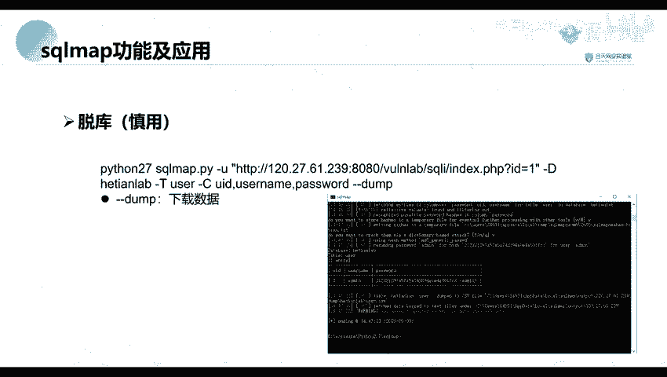

因为这个很容易就那个被抓进去，那我们怎么我们前面呢，我们跑到了他的一个跑到他的一个数据表列，然后我们杠鸡杠鸡呢，他们就是给我们的一个列，列名也是我们这里的一个IDID，然后又是那，然后他好像是他主要的。

后面是一个灯光灯火也就是一个窝窟。

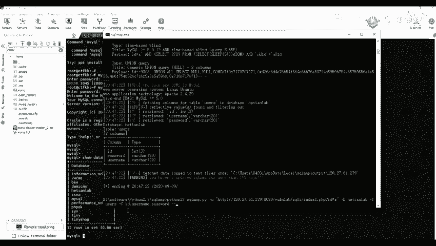

现在我们可以看到我们查查到了这个八八个表，一个优色他们已经一面了等等，那我们我们跑出了一个表明，我们是不是还可以跑他的一个表列，就是他的一个列名，那你比如说然后呢，我们可以在这里。

我们前面跑出了一个表明。

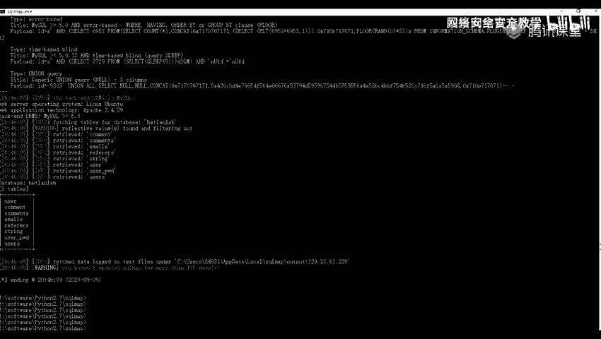

杠鸡杠鸡呢，就是我们跑出来的一个前面的一个表明，比如说我们这里呢，好一个优优色，这个优色就是我们前面跑到的一个表明，那我们在列名列名是哪一个呢，就是column，这个呢，就是跑他的一个列名。

列名之后我们来看一下，所以呢，可以跑到他存在的三个类，分别是一个ID Password的一个以及一个User Name，对这些呢，是自己自己添加了，就是那个呢，是我们用来练习的一个网站的。

这个你你在上一个的时候应该也也有做过这个吧，对，现在是给我们做一个练习的，那我们跑出来这个ID，还有一个User Name Password之后，那我们还可以对他进行跑出他里面的一个具体的一个数据。

那么怎么，要到了这一步呢，也就是还要再继续的话，也就是我们所做的一个窠窟，就是前面我们前面这里呢。

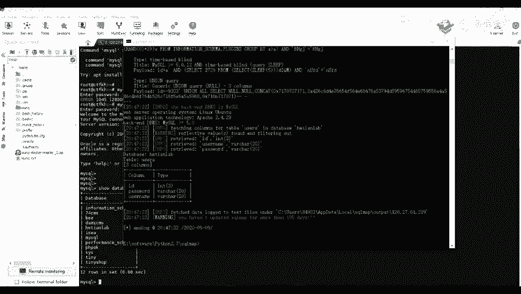

我们跑出了大的一个没给到的，他的一个数据表列，然后我们这里呢，有还有一步是窠窟窠窟这里呢，我们在挖SRC啊，或者是做一个对一个其他的一个漏洞挖掘的时候，我们就这个呢，尽尽量不要去使用。

除非说我们是在做一个渗透的项目，就是别人有一个有的一个授权，要并且说明这个情况了，之后我们才可以对这个进行一个使用，不然的话，我们这个窠窟这个档档档这个命令就是我们最好是不要对他进行使用。

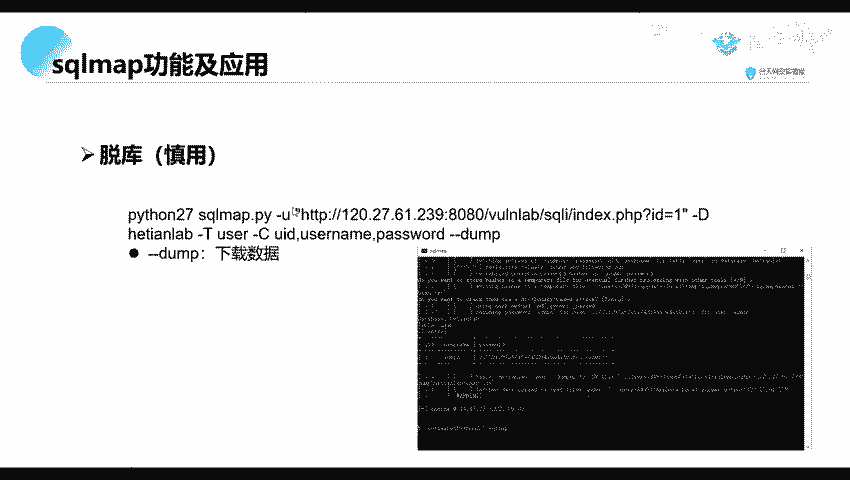

因为这个很容易就那个被抓进去了，那我们怎么我们前面呢，我们跑到了他的一个跑到他的一个数据表列，然后我们杠鸡杠鸡呢，他们就是跟我们的一个列，列名也是我们这里的一个IDID，然后又是那，然后到他说的。

后面是一个档档档也就是一个窠窟，要使用了这个命令之后，他会将这些数据。

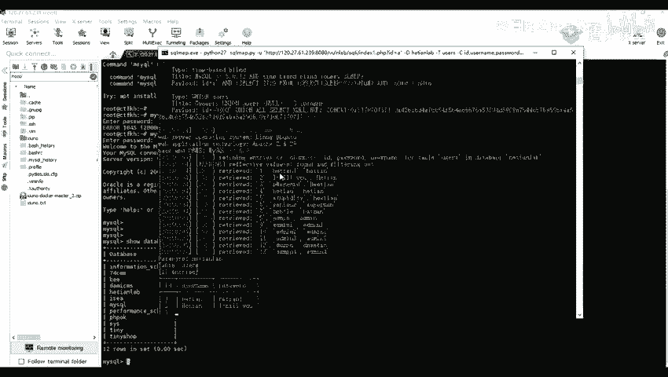

我们可以看到在这里将他会将他的一个数据会保存到我了，我们的一个本地，保存到本地，让我们可以就是保存了成了一个CSV的一个文件，我们可以看一下。

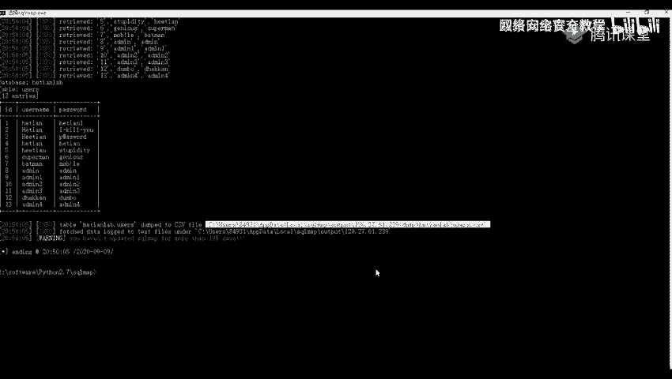

在此电脑在C盘里面要，用户，在这个找一下，APP在这里，捞被，我们的一个搜索，卖，我们这个搜索，卖也在all这里，我们可以看到这个档，这里的我们可以看到我们刚刚是已经，我们的一个数据给拖下来了，这个呢。

就是我们所跑到的一个数据，实际上我们正常的话，我们这里的是，这个是给我们做一个显示用的。

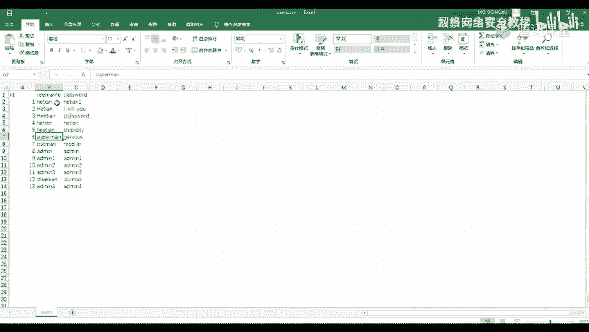

展示用的，我们就可以去比如说我们这里是跑其他的一个表。

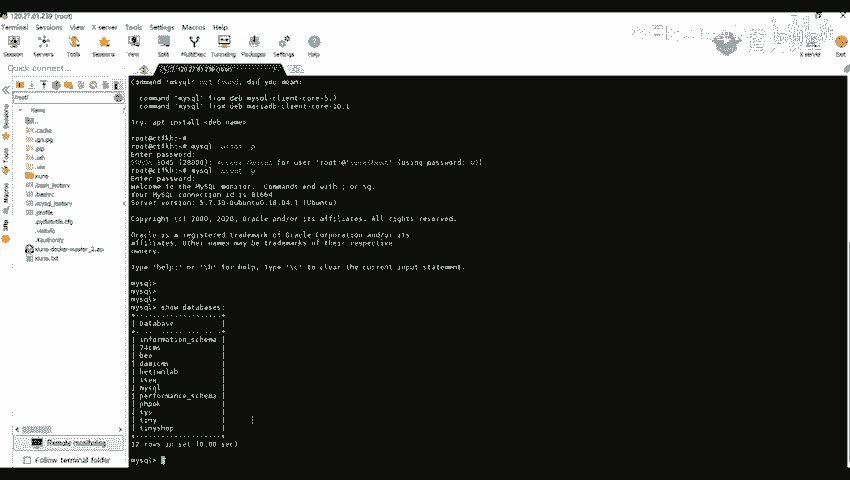

比如说我们这里前面这一步不跑他的一个优势，不跑优势，我们可以跑优势，WD，这个，啊，还有就是挖挖漏洞的话，就是你们在上传的时候，最好是上传一个PHP，上传个PHP，不就可以了。

因为因为你你这个不是做了一个就是我们在挖挖漏洞的话，并不是我们的一个渗透，就是我们上传一个漏洞去证明他证明他存在就可以了，并不是并不需要对他建立一个后一步的一个利用，我们这节课的一个说说麦博就讲到这里。

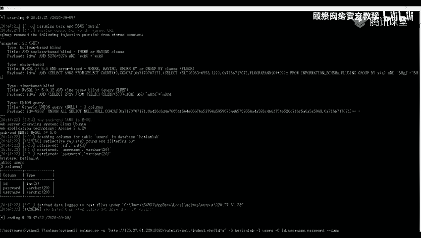

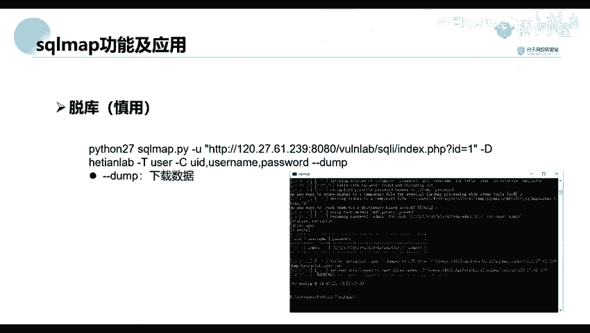

那我们先休息一下。

你们有什么不懂的吗，有不懂的话就发在上面啊，我们休息十分钟，然后到九点我们再开始下一节课，哪一个好摇摆的啊，我这我前面不是在预计内容里，那个因为我们一个时间的一个原因，就先不讲这一个方面。

我抽有时间的话，对待会就要换一个教室，后面我有时间的话，也会给你们讲一些其他的一个方法，好，好，那我们就先休息一下，我们下一个课我们就会开始讲一下我们的一些考虑，那我们就先休息一下。

我们下一个课我们就会讲一下我们的一些考虑，那我们先讲一下我们的一些考虑，那我们就先讲一下我们的一些考虑，那我们就先讲一下我们的一些考虑，那我们就先讲一下我们的一些考虑，那我们就先讲一下我们的一些考虑。

那我们就先讲一下我们的一些考虑，那我们就先讲一下我们的一些考虑，那我们就先讲一下我们的一些考虑，那我们就先讲一下我们的一些考虑，那我们就先讲一下我们的一些考虑，那我们就先讲一下我们的一些考虑。

那我们就先讲一下我们的一些考虑，那我们就先讲一下我们的一些考虑，那我们就先讲一下我们的一些考虑，那我们就先讲一下我们的一些考虑，那我们就先讲一下我们的一些考虑，那我们就先讲一下我们的一些考虑。

那我们就先讲一下我们的一些考虑，那我们就先讲一下我们的一些考虑，那我们就先讲一下我们的一些考虑，那我们就先讲一下我们的一些考虑。

那我们就先讲一下我们的一些考虑，那我们就先讲一下我们的一些考虑，那我们就先讲一下我们的一些考虑，那我们就先讲一下我们的一些考虑，那我们就先讲一下我们的一些考虑，那我们就先讲一下我们的一些考虑。

那我们就先讲一下我们的一些考虑，那我们就先讲一下我们的一些考虑，那我们就先讲一下我们的一些考虑，那我们就先讲一下我们的一些考虑，那我们就先讲一下我们的一些考虑，那我们就先讲一下我们的一些考虑。

那我们就先讲一下我们的一些考虑，那我们就先讲一下我们的一些考虑，那我们就先讲一下我们的一些考虑，那我们就先讲一下我们的一些考虑，那我们就先讲一下我们的一些考虑，那我们就先讲一下我们的一些考虑。

那我们就先讲一下我们的一些考虑，那我们就先讲一下我们的一些考虑，那我们就先讲一下我们的一些考虑，那我们就先讲一下我们的一些考虑，那我们就先讲一下我们的一些考虑，那我们就先讲一下我们的一些考虑。

那我们就先讲一下我们的一些考虑，那我们就先讲一下我们的一些考虑，那我们就先讲一下我们的一些考虑，那我们就先讲一下我们的一些考虑，那我们就先讲一下我们的一些考虑，那我们就先讲一下我们的一些考虑。

那我们就先讲一下我们的一些考虑，那我们就先讲一下我们的一些考虑，那我们就先讲一下我们的一些考虑，那我们就先讲一下我们的一些考虑，那我们就先讲一下我们的一些考虑，那我们就先讲一下我们的一些考虑。

那我们就先讲一下我们的一些考虑，那我们就先讲一下我们的一些考虑，那我们就先讲一下我们的一些考虑，那我们就先讲一下我们的一些考虑，那我们就先讲一下我们的一些考虑，那我们就先讲一下我们的一些考虑。

那我们就先讲一下我们的一些考虑，那我们就先讲一下我们的一些考虑，那我们就先讲一下我们的一些考虑，那我们就先讲一下我们的一些考虑，那我们就先讲一下我们的一些考虑，那我们就先讲一下我们的一些考虑。

那我们就先讲一下我们的一些考虑，那我们就先讲一下我们的一些考虑，那我们就先讲一下我们的一些考虑，那我们就先讲一下我们的一些考虑，那我们就先讲一下我们的一些考虑，那我们就先讲一下我们的一些考虑。

那我们就先讲一下我们的一些考虑，那我们就先讲一下我们的一些考虑，那我们就先讲一下我们的一些考虑，那我们就先讲一下我们的一些考虑，那我们就先讲一下我们的一些考虑，那我们就先讲一下我们的一些考虑。

那我们就先讲一下我们的一些考虑，那我们就先讲一下我们的一些考虑，那我们就先讲一下我们的一些考虑，那我们就先讲一下我们的一些考虑，那我们就先讲一下我们的一些考虑，那我们就先讲一下我们的一些考虑。

那我们就先讲一下我们的一些考虑，那我们就先讲一下我们的一些考虑，那我们就先讲一下我们的一些考虑，那我们就先讲一下我们的一些考虑，那我们就先讲一下我们的一些考虑，那我们就先讲一下我们的一些考虑。

那我们就先讲一下我们的一些考虑，那我们就先讲一下我们的一些考虑，那我们就先讲一下我们的一些考虑，那我们就先讲一下我们的一些考虑，那我们就先讲一下我们的一些考虑，那我们就先讲一下我们的一些考虑。

那我们就先讲一下我们的一些考虑，那我们就先讲一下我们的一些考虑，那我们就先讲一下我们的一些考虑，那我们就先讲一下我们的一些考虑，那我们就先讲一下我们的一些考虑，那我们就先讲一下我们的一些考虑。

那我们就先讲一下我们的一些考虑，那我们就先讲一下我们的一些考虑，那我们就先讲一下我们的一些考虑，那我们就先讲一下我们的一些考虑，那我们就先讲一下我们的一些考虑，那我们就先讲一下我们的一些考虑。

那我们就先讲一下我们的一些考虑，那我们就先讲一下我们的一些考虑，那我们就先讲一下我们的一些考虑，那我们就先讲一下我们的一些考虑，那我们就先讲一下我们的一些考虑，那我们就先讲一下我们的一些考虑。

那我们就先讲一下我们的一些考虑，那我们就先讲一下我们的一些考虑，那我们就先讲一下我们的一些考虑，那我们就先讲一下我们的一些考虑，那我们就先讲一下我们的一些考虑，那我们就先讲一下我们的一些考虑。

那我们就先讲一下我们的一些考虑，那我们就先讲一下我们的一些考虑，那我们就先讲一下我们的一些考虑，那我们就先讲一下我们的一些考虑，那我们就先讲一下我们的一些考虑，那我们就先讲一下我们的一些考虑。

那我们就先讲一下我们的一些考虑，那我们就先讲一下我们的一些考虑，那我们就先讲一下我们的一些考虑，那我们就先讲一下我们的一些考虑，那我们就先讲一下我们的一些考虑，那我们就先讲一下我们的一些考虑。

那我们就先讲一下我们的一些考虑，那我们就先讲一下我们的一些考虑，那我们就先讲一下我们的一些考虑，那我们就先讲一下我们的一些考虑，那我们就先讲一下我们的一些考虑，那我们就先讲一下我们的一些考虑。

那我们就先讲一下我们的一些考虑，那我们就先讲一下我们的一些考虑，那我们就先讲一下我们的一些考虑，那我们就先讲一下我们的一些考虑，那我们就先讲一下我们的一些考虑，那我们就先讲一下我们的一些考虑。

那我们就先讲一下我们的一些考虑。

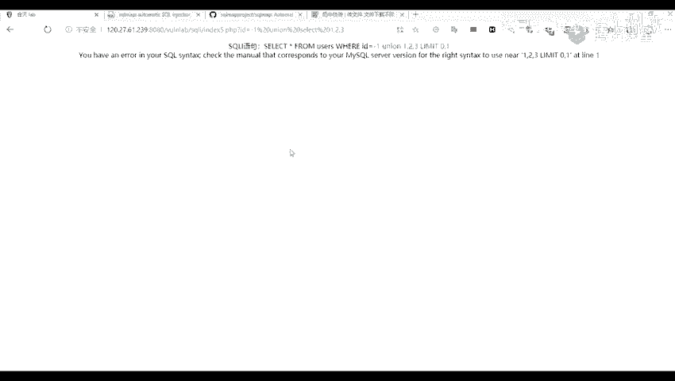

那我们就先讲一下我们的一些考虑，那我们就先讲一下我们的一些考虑，那我们就先讲一下我们的一些考虑，那我们就先讲一下我们的一些考虑，那我们就先讲一下我们的一些考虑，那我们就先讲一下我们的一些考虑。

那我们就先讲一下我们的一些考虑，那我们就先讲一下我们的一些考虑。

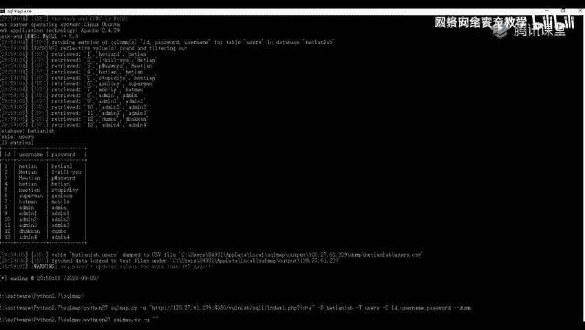

那我们就先讲一下我们的一些考虑，那我们就先讲一下我们的一些考虑，那我们就先讲一下我们的一些考虑，那我们就先讲一下我们的一些考虑，那我们就先讲一下我们的一些考虑。

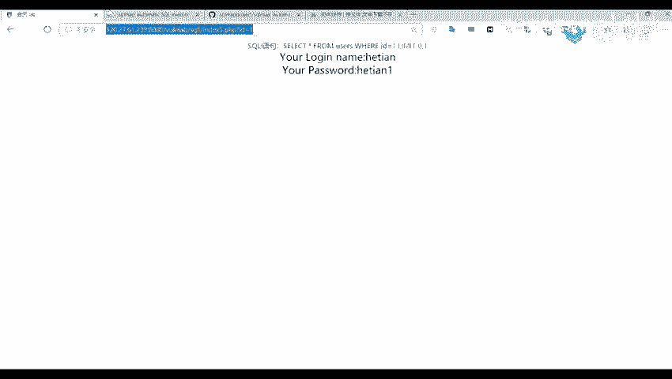

那我们就先讲一下我们的一些考虑，那我们就先讲一下我们的一些考虑，那我们就先讲一下我们的一些考虑，那我们就先讲一下我们的一些考虑，那我们就先讲一下我们的一些考虑，那我们就先讲一下我们的一些考虑。

那我们就先讲一下我们的一些考虑，那我们就先讲一下我们的一些考虑，那我们就先讲一下我们的一些考虑。

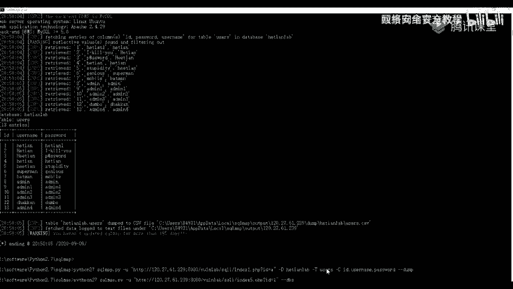

那我们就先讲一下我们的一些考虑，那我们就先讲一下我们的一些考虑，那我们就先讲一下我们的一些考虑，那我们就先讲一下我们的一些考虑，那我们就先讲一下我们的一些考虑，那我们就先讲一下我们的一些考虑。

那我们就先讲一下我们的一些考虑，那我们就先讲一下我们的一些考虑，那我们就先讲一下我们的一些考虑，那我们就先讲一下我们的一些考虑，那我们就先讲一下我们的一些考虑，那我们就先讲一下我们的一些考虑。

那我们就先讲一下我们的一些考虑。

那我们就先讲一下我们的一些考虑，那我们就先讲一下我们的一些考虑，那我们就先讲一下我们的一些考虑，那我们就先讲一下我们的一些考虑，那我们就先讲一下我们的一些考虑，那我们就先讲一下我们的一些考虑。

那我们就先讲一下我们的一些考虑，那我们就先讲一下我们的一些考虑，那我们就先讲一下我们的一些考虑，那我们就先讲一下我们的一些考虑，那我们就先讲一下我们的一些考虑，那我们就先讲一下我们的一些考虑。

那我们就先讲一下我们的一些考虑，那我们就先讲一下我们的一些考虑，那我们就先讲一下我们的一些考虑，那我们就先讲一下我们的一些考虑，那我们就先讲一下我们的一些考虑，那我们就先讲一下我们的一些考虑。

那我们就先讲一下我们的一些考虑，那我们就先讲一下我们的一些考虑，那我们就先讲一下我们的一些考虑，那我们就先讲一下我们的一些考虑，那我们就先讲一下我们的一些考虑，那我们就先讲一下我们的一些考虑。

那我们就先讲一下我们的一些考虑，那我们就先讲一下我们的一些考虑，那我们就先讲一下我们的一些考虑，那我们就先讲一下我们的一些考虑，那我们就先讲一下我们的一些考虑，那我们就先讲一下我们的一些考虑。

那我们就先讲一下我们的一些考虑，那我们就先讲一下我们的一些考虑，那我们就先讲一下我们的一些考虑，那我们就先讲一下我们的一些考虑，那我们就先讲一下我们的一些考虑，那我们就先讲一下我们的一些考虑。

那我们就先讲一下我们的一些考虑，那我们就先讲一下我们的一些考虑，那我们就先讲一下我们的一些考虑，那我们就先讲一下我们的一些考虑，那我们就先讲一下我们的一些考虑，那我们就先讲一下我们的一些考虑。

那我们就先讲一下我们的一些考虑，那我们就先讲一下我们的一些考虑，那我们就先讲一下我们的一些考虑，那我们就先讲一下我们的一些考虑，那我们就先讲一下我们的一些考虑，那我们就先讲一下我们的一些考虑。

那我们就先讲一下我们的一些考虑，那我们就先讲一下我们的一些考虑，那我们就先讲一下我们的一些考虑，那我们就先讲一下我们的一些考虑，那我们就先讲一下我们的一些考虑，那我们就先讲一下我们的一些考虑。

那我们就先讲一下我们的一些考虑。

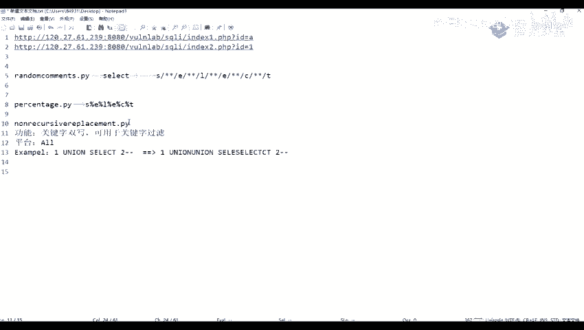

就使用这个吧，应该有这个表板吧。

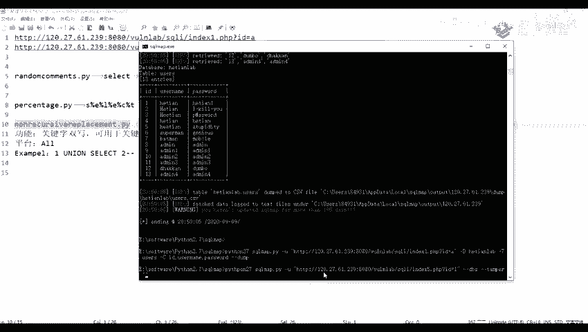

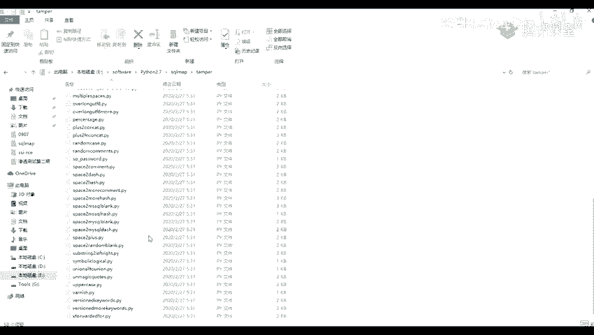

没有这个。

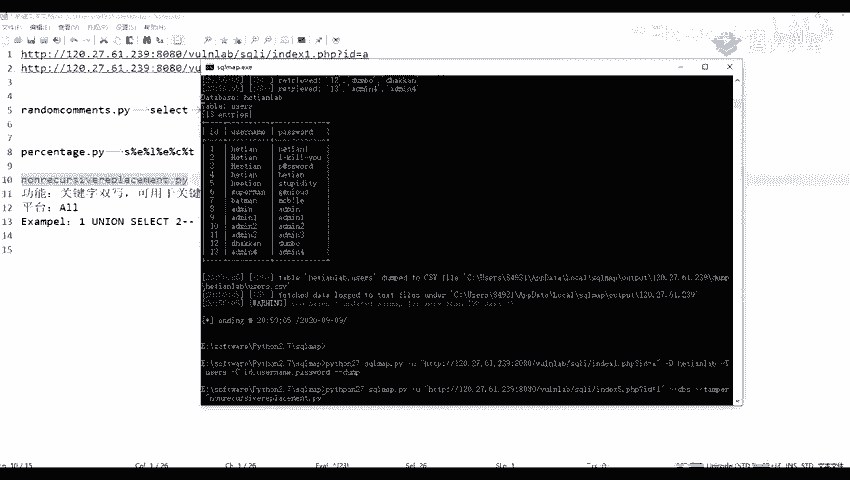

我找一个有的吧，没有这个，我们只用这个吧。

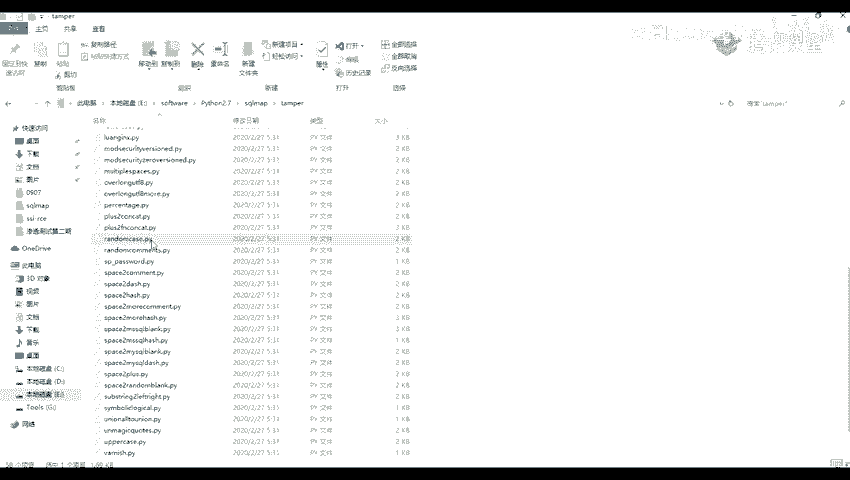

我看一下这个行不行啊，现在我们加上一个到，DoneV的一个参数，DoneV参数呢，就是显示我们的一个Pilot的一个变化，那我们可以看到它跑的一个数据。

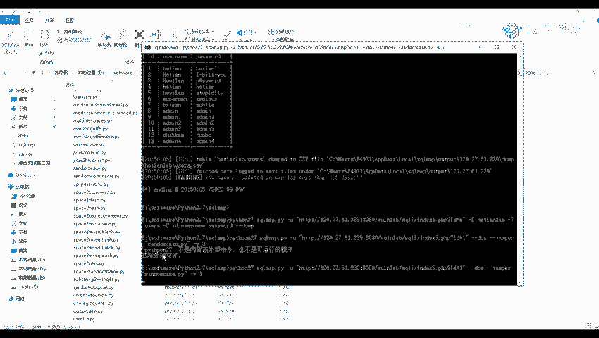

我们这里呢我们可以看到它的这个，我们现在可以看到它是不是将我们的一个，这个东西就是我们的一个关键词进行一个随机大小写了，明白了那就好，我们再休息几分钟吧，我去上个厕所。

我们这边先上课你们去到另一个教室吧，好，请大家不要忘记享有机的选择，谢谢大家，请大家不要忘记享有机的选择，谢谢大家，谢谢大家，再到你手裡就跟我討厭了，不是，讓我來，你瘋得小看我，既然我已經超意識到。

自己是個收敵，那就正當，感謝你，我不用你幫我，我倒是要做一個事，齊大哥，今天你辭職玩得挺開心的，這裡面沒人，我們和阿豪一起來玩，不如我們一起去玩吧，齊大哥，你怎麼不回來了，我沒什麼事。

我只是想跟你說個好消息，你怎麼不回來了，我沒什麼事，我只是想跟你說個好消息，你怎麼不回來了，我沒什麼事，我只是想跟你說個好消息，你怎麼不回來了，我沒什麼事，我只是想跟你說個好消息，你怎麼不回來了。

我沒什麼事，我只是想跟你說個好消息，你怎麼不回來了，我沒什麼事，我只是想跟你說個好消息，你怎麼不回來了，我沒什麼事，我只是想跟你說個好消息，你怎麼不回來了，我沒什麼事，我只是想跟你說個好消息。

你怎麼不回來了，我沒什麼事，我只是想跟你說個好消息，你怎麼不回來了，我沒什麼事，我只是想跟你說個好消息，你怎麼不回來了，我沒什麼事，我只是想跟你說個好消息，你怎麼不回來了，我沒什麼事。

我只是想跟你說個好消息，你怎麼不回來了，我沒什麼事，我只是想跟你說個好消息，你怎麼不回來了，我沒什麼事，我只是想跟你說個好消息，你怎麼不回來了。

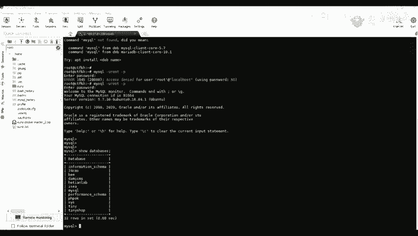

我沒什麼事，我只是想跟你說個好消息，你怎麼不回來了，我沒什麼事。

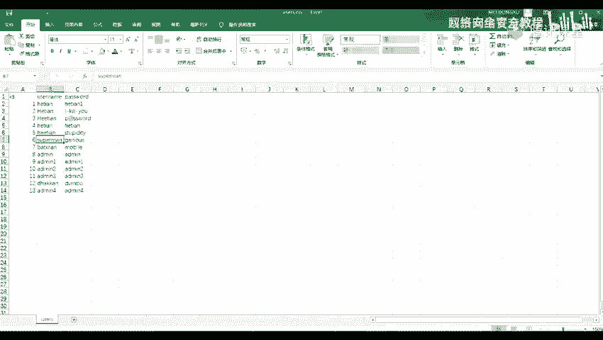

我只是想跟你說個好消息，你怎麼不回來了，我沒什麼事，我只是想跟你說個好消息，你怎麼不回來了，我沒什麼事，我只是想跟你說個好消息。

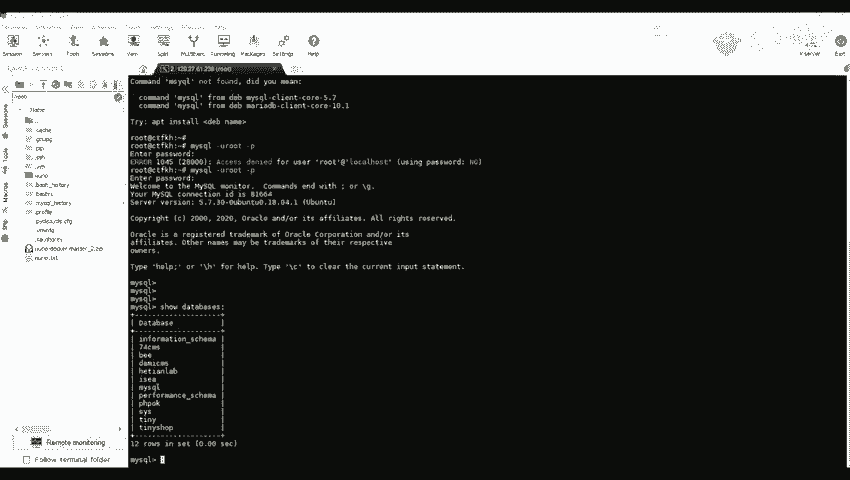

你怎麼不回來了，我沒什麼事，我只是想跟你說個好消息，你怎麼不回來了。

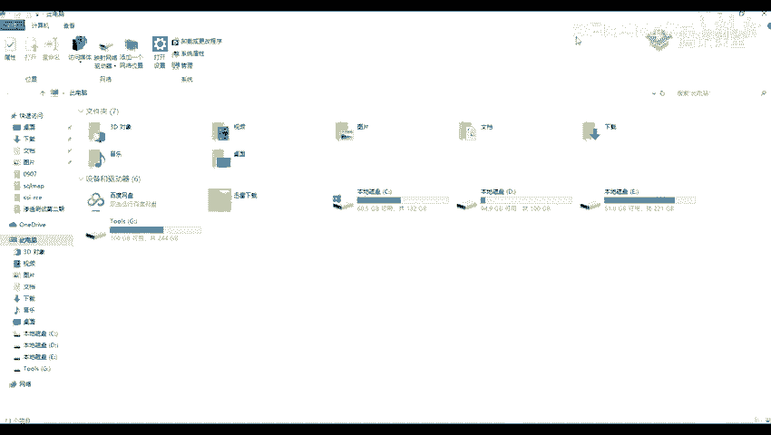

我沒什麼事，我只是想跟你說個好消息，好了我們開始第二節課的一個內容，這是我們上一節課的那個Table參數，我們在使用那個參數的時候，我們就是需要知道我們的網站，對哪一些關鍵詞進行了一個過濾。

然後才可以對它進行一個，對應的一個使用，我們下一節課就開始，你不是說你不想再跟他在一起嗎？

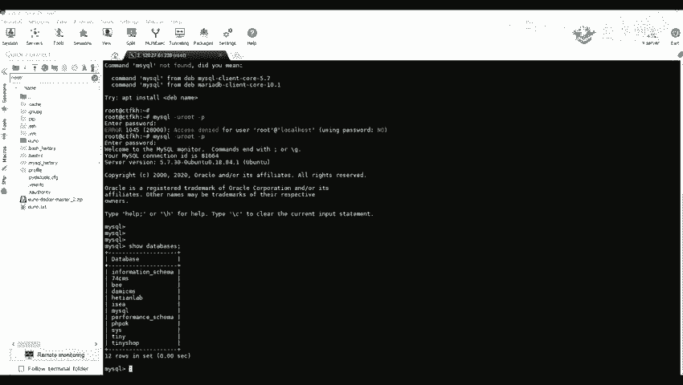