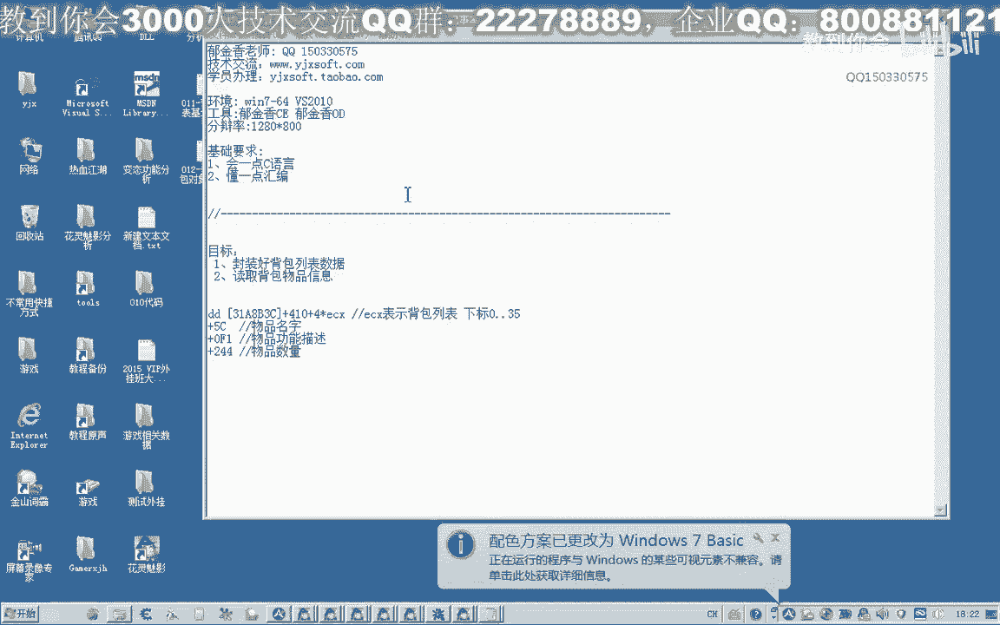
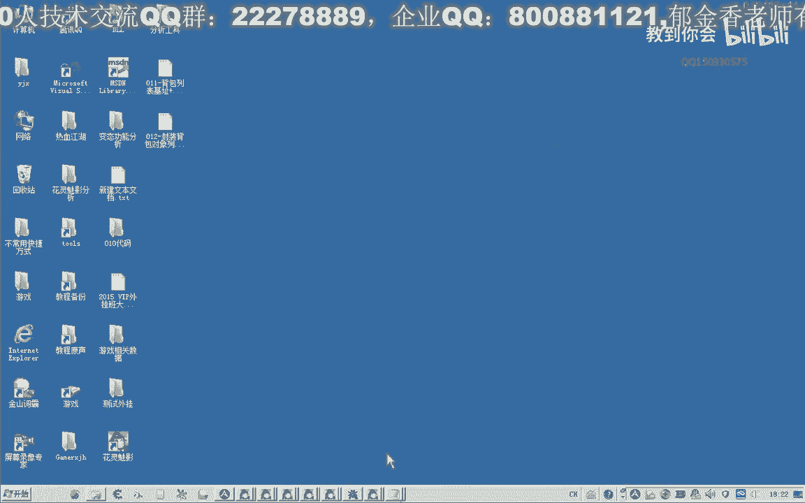
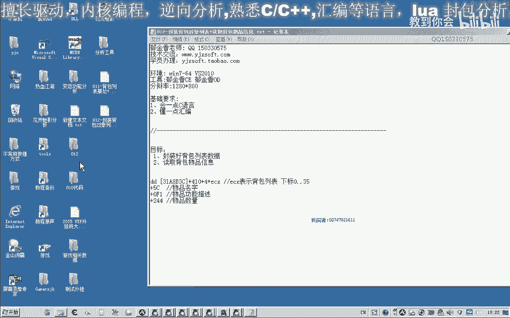
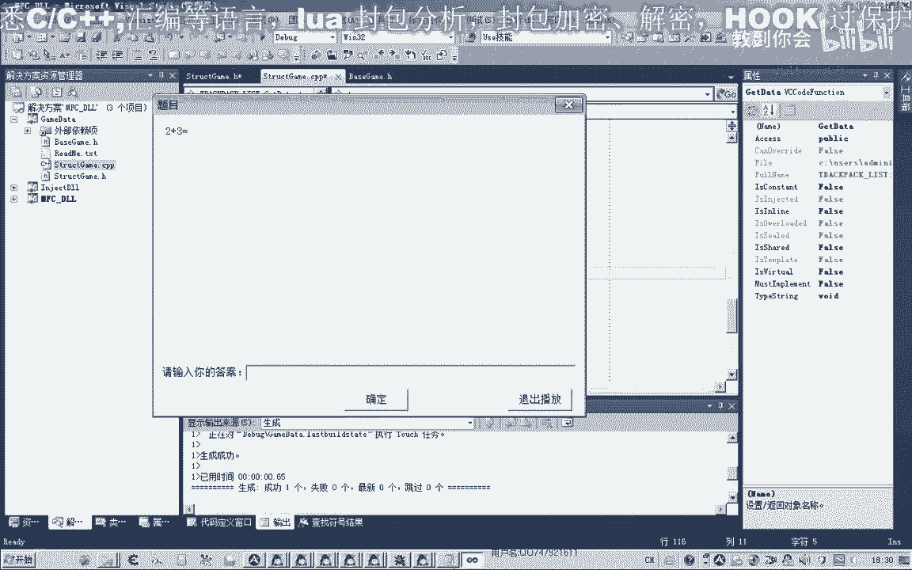
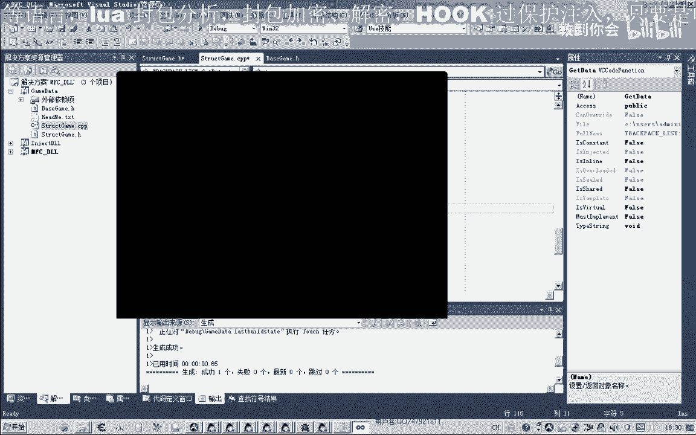
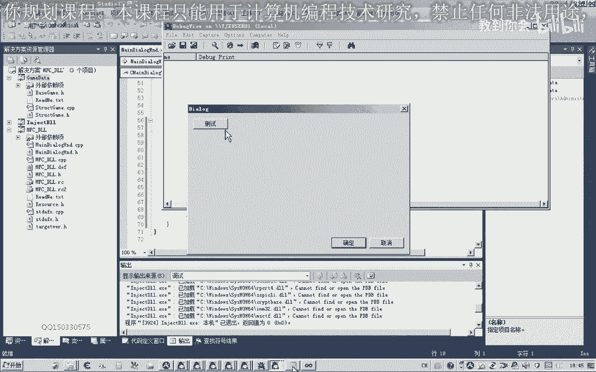
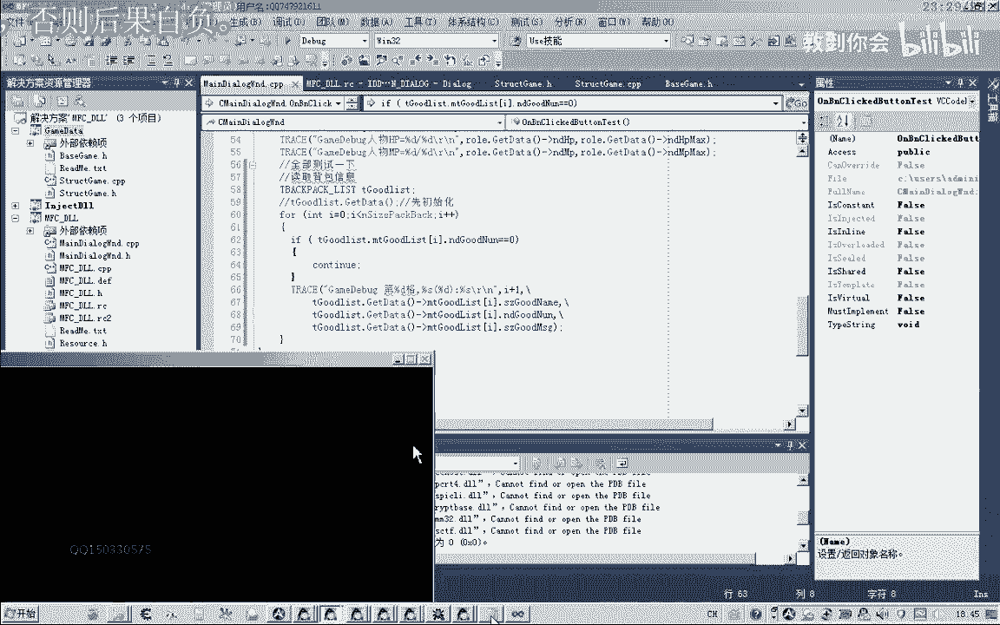
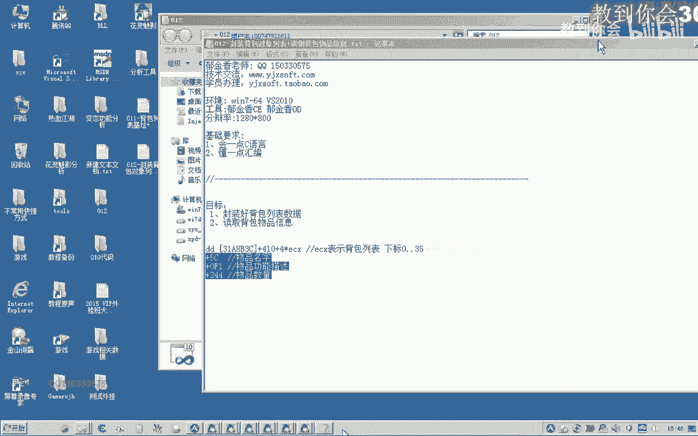

# P1：012-封装背包对象列表+读物背包物品信息_m - 教到你会 - BV1DS4y1n7qF

大家好，我是玉溪香老师，qq 150330575，欢迎大家参加滤镜将进水编程培训。

那么这节课呢我们对上面结构分析的数据来进行一下啊封装，好的，那么我们先把第，时刻的代码打开。

那么打开之后呢，首先我们把我们找到的这个机子复制一下，转到我们基层管理的单元，好像有个红，那么我们可以把这个公式呢跟它跟在后面，好那么机子封装好了之后呢，那么我们接下来来定义我们相关的结构。

那么首先呢我们分析的对象呢，它有这几项属性，那么我们定义一下这几项属性的一个结构，他这个算，这套对象，那么它它的属性呢有物品名字，物品功能的描述以及物品的数量，那么我们在这里呢就跟他定义这几项。

一个是物品的名字，还有一个是物品的描述，他们都是字符串类型，那么还有一个是物体的数量啊，这是第一关的运行，好那么这样呢我们就定义好了，当然这只是已知的属性啊，还有一些未知的属性呢，以后我们发现了之后呢。

往这边进行添加就行了啊，另外呢我们这个定义好了之后呢，好，这里一共有36分，那么所以说这里的它的数组的大小的话就是36 36，这就是这种类型的，当然在游戏里面呢，它这里呢因为存的是一个指针类型。

在这里呢我们需要存储数据的呃，我们最好是就不定义成只能的类型，因为如果设定一层层的类型的话，还要用六管去给他分配一个空间，相当的麻烦，那么在这里呢我们就直接用变量就行，36。

那为了这个程序的可读性更高一些，我们这里呢可以用一个平等代替这个常量，哈哈哈，好那么到这里的话，我们所有的这个结构方面的呢，我们就听听完了，全，我们也可以把它写在这个结构里面，首先呢我们要获取数据。

数据之前呢我们要对它进行初始化，然后呢我们可以把它封装在这个get to date里面，然后在这里呢我先把它写的先写的简单一点，写一个不带参数，这样可能会便于理解一些。

那么相关的代码我们在这个结构的cpp里面能添加，我看，那么这个呢相当于是对数据的一个初始化，那么这里面呢我们就对这个结构里面的这些所有啊，呃每一格的它的属性呢，我们给它进行一个初始化。

然后读到保存到这个列表里面，把游戏里面的数据能保存到我们自己的这个变量里边，所以说在这里的话，我们需要用一个循环啊，那要用一个循环来做循202，哈哈哈哈，实际上升啊，因为要图访问到我们内存的空间。

那么可能会出现一些错误，那么我们用这个串，啊来进行一下日常的处理，那为了简化它的异常的一个处理呢，我们把后面的全部取消掉，用三个点来代表所有的异常，就是说这个代码框里面所有的异常的话。

就会跳到这里来执行的，那么我们再把这个基础的公式呢粘贴一下，看作这个公式来写，哎那么首先呢我们要读出这个符号里面的数据，要把它读出来，先建一个变量的问题。

这，那么首先呢我们来读出最底层的这个机制啊，把它读出来，存放到这个n倍斯这个变量里面，然后呢我们再读出我们第一格的啊，那么这个地址他们加起来的话啊，就是第一个的一个地址，那么第一个的地址取出来之后呢。

后面呢我们就可以从这个地址呢加上相应的地址来表示啊，当然这个世家四乘以多少多少，这个下标呢我们就在下面来处理好，那么另外在建一个变量来取得对象的一个地址，真正的对象地址，如果你对象的一个地址。

那么物品出现的地址呢就等于我们第一个的啊，它的地址加上我们的41台这个下标就行，那么这个是从0~35，那这样我们把对象的一个指针呢就取出来了，当然要取得我们对象的地址的话，我们还要经过你的操作啊。

还要经过你经过另一个操作，在这里呢我们要涂一下它，这样取出来的才是你对象的地址，注意后面这个括号一定要加，不加的话也不正确啊，这里取出，i got对象，那么取出来之后呢。

我们就可以通过加里面的这个偏移啊，比如说这几个偏移啊，来获取我们相关的一个数据，就可以，那么第一段我们是名字偏移在这里呢，我们把这个偏移把它定义一下，哈哈哈哈，啊对方的话写一下，对方。

那么怎么来x c再来复制一下，物品的描述相关的一个信息，这个，是01f1 ，那么再下一个呢是我们物品的数量现代版，当然你可以用中文的也可以啊，这里也可以用中文来代替啊，那么这里面是24，好了。

那么既然我们第二个对象的地址取出来，那么我们通过这个地址加上这个偏移了，我们就能够得到相应数据的一个地址，找到另外一个地址，相当于，那么这个时候我们就可以开始对它的成员变量进行一个复制。

那么这里呢他也是个下标，是从i开始，然后呢我们取出的第一个数量，那么这个数量的话就等于我们后面的它的对象的地址，加上我们物品数量的一个偏移，那么这两个机子加上物品的偏移，它组成了一个新的地址。

那么这个地址的话就指向我们存放物品数量的一个地址，所以说我们在这里呢也要把它读出来，把这个地址的内容读出来，才是真正物品的数量，那么后面呢我们把它复制一下，这个是，右边右边。

那么接着我们取出物品的这个名字，对当然前面的这个成员变量我们也要变，后面的是一个物品的一个信息，没事啊，这里也要变，那这样写的话，这个指针这类型我们还要改一下，因为前面这个数据的话。

它直接是写入一个数据，而这里的话是一个字符串的一个指针，所以说我们这里不需要读出来，传一个指针开大就行了，而且是一个字符串的一个支撑，所以说这种类型呢我们得变一下。

这样的话理论上我们就可以把这些相关的数据呢就可以推出来，这一次这里是物品功能描述啊，那么我们还要考虑到的一个问题，就是比如说第二个它没有物品存在，那么那个相应的地址他就写入的是一个空啊。

零头取出来的这个是零，但是如果我们这里是零的话，我们再加上这个偏移去取相应的数据的话，就会出错啊，那么我们也要考虑到这种异常，那么所以说这里呢我们还要加上一个条件判断啊。

如果我们取出来的这个物品对象它为空，取出来的是零，那么我们就跳过后面的直接进行下一次循环，而且我们把这个相应的物品数量就改为零啊，在这里他那里没有物品啊，就用零来表示。

这样的话我们就把所有的数据来就存读取出来，读取出来的，那么读取出来之后啊，接着我们就可以使用这些内部的成员变量，那我们看一下具体怎样读出了我们的物品的信息，那么切换到我们资源选项卡，啊我们进行一下测试。

那么在这里读取的时候，我们同样的要用一个循环的图形，因为它有很多格，那么在读取之前呢，我们要先建立一个变量啊，用来访问它相应的对象啊，前面，这个呢对方列表的应该对象，那么在使用每次在使用它之前的话。

我们要对它进行一个初始化啊，必须先说实话，那么初始化了之后呢，我们才能够访问它里面所有的这个数据，如果没有初始化的话，它里面是没有信息的，好那么接下来我们就可以访问里面的这些数据，那么如果这个数量啊。

我们先要进行一个判断，如果这个数量的话，它不等于零，当然如果它等于零或者是等于空，那么我们就不执行我们的这个信息访问的一些操作，那么我们就继续下一次循环，那么如果它不等于零的话。

那么我们就打印出相关的调试信息，上面这段话复制于相，那这个呢它又分了几项啊，首先呢我们第几行，那么后面呢就是我们这个下标，加一就代表了第几个，那么第几个之后呢，它的名字叫什么之s数量是多少人民币。

那么我们后面紧跟着呢，就是它的呃，这个有点多，我们把它换一下再继续写，啊这个啥的名字，那么后面这个斜杠呢是一个表示代码的一个换行符，那么名字过来是我们的数量，哈哈哈哈哈，数量过来，最后是我们的信息啊。

请问那么就这样三个啊，最后我们在这里呢还需要一个相关的信息，说明相关的一个信息说，那么这样呢我们就把相关的这个数据呢就能够打印出来，当然在打印之前啊，这个我已经做了判断了，那么我们先编译一下。

好那么我们运行一下，这里设置为我们的启动项目，然后设置一下相关的一个工作目录，就是这一行调试，从中作用不是投资人，然后注入到这里，我们用调试的工具来看一下。

那么这个时候呢就把我们的呃相应的这些数据呢就读出来了啊，强化石有多少个啊，它的作用是什么啊，第一个是结婚书，那么比如说我们第六个，这里呢它是金疮药中回复多少生命，那我们就来看一下吧，这里呢它的数量在变。

刚才你还有125个，那么我们现在刷新就行了，现在已经变成一般11本了，那么我们读取出来的信息呢就是正确的轻松一下，那么这种写法呢，但是并不是很好啊，那么还有一种写法呢，我个人建议的话，可能，要好一些。

那么我们还可以这样写的，因为有的时候我们会忘记初始化的话，那么我们还可以把它写成一个指针的一个形式啊，只是这样的，那么我们在写之前呢，我们要先改一下我们之前的这个函数的一个返回值。

那么我们可以先返回这个z先给他啊，那么我们这里呢我们需要先改一下有态度this，那么它的返回值类型呢，我们也需要改一下，这改成纸张，那么它在头文件里面的定义里，我们也要跟他改一下。

这里让我们改个尺寸再定义一下啊，其他的功能它不变啊，刚才的代码因为有像，但是有时候我们会忘掉初始化啊，所以说呢我建议用这种指针的方式来写，那么我们就把这里做一个替换，就替换成这个指针，这个点，这里呢。

让我们替换成下一个指针来访问啊，实际上，这样呢他就会每一次都会进行一个初始化的一个动作，就能够保证到我们这个访问的信息呢啊就是最新的不会出错，好我们再测试一下。

好的，当然你觉得哪一种方式好了，就使用哪一种方式吧，但是我个人的话推荐使用后一种方式，这要方便一些吧，这样方便一些，好的，那么今天我们就讲到这里。

