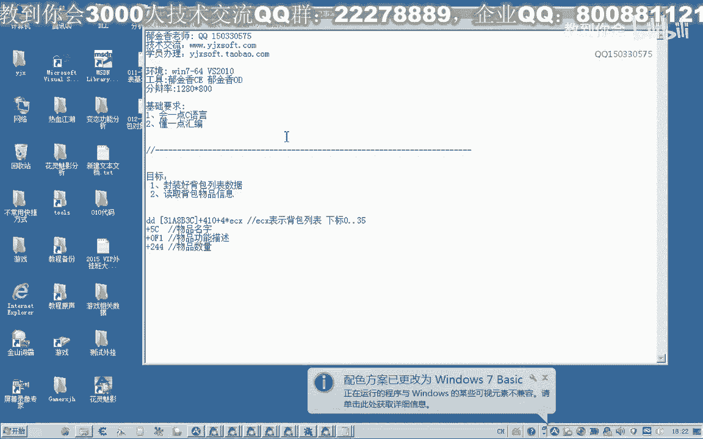
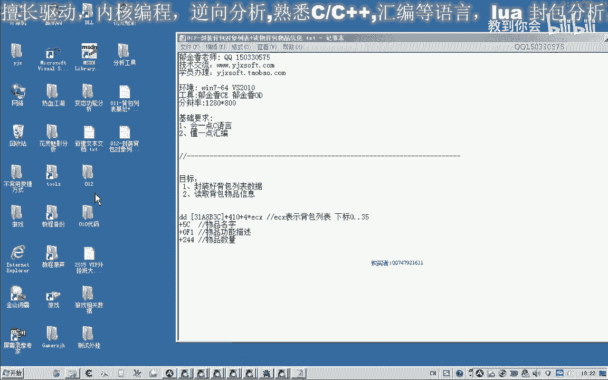
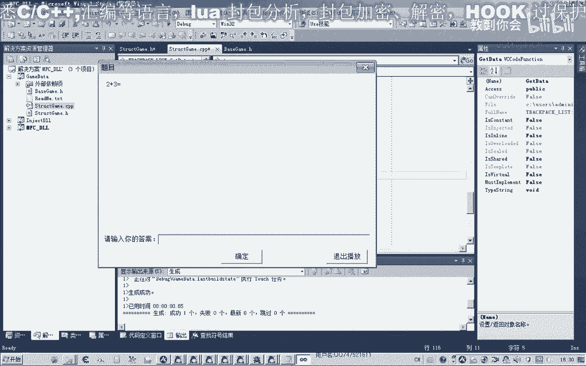
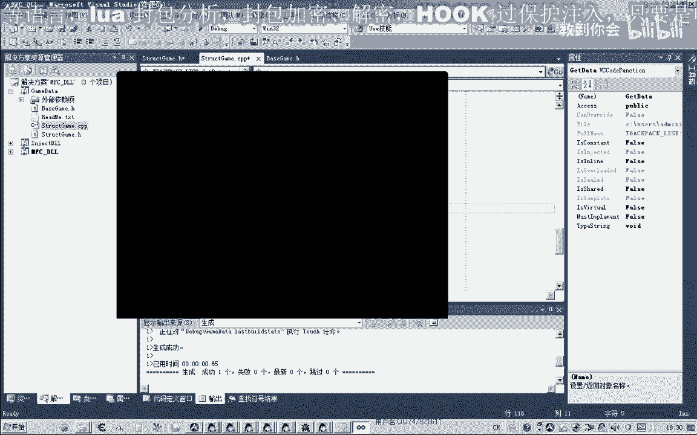
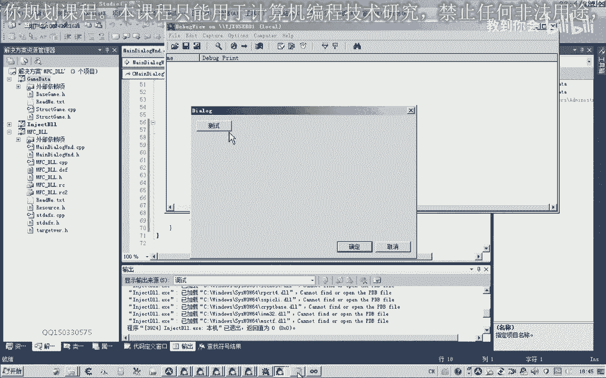
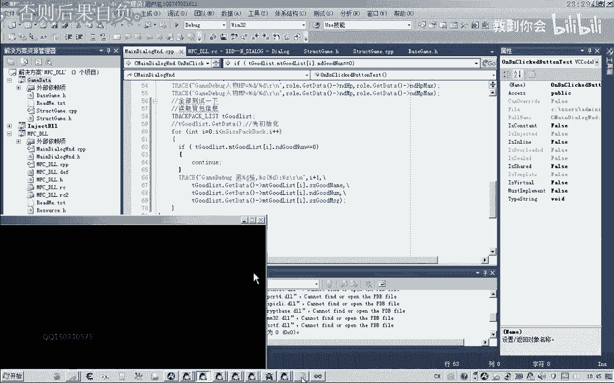
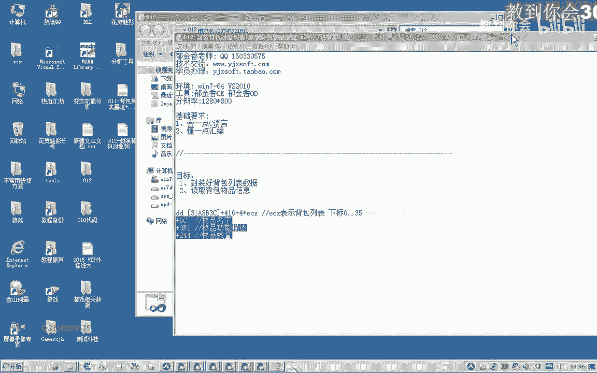

# 课程 P1：012 - 封装背包对象列表与读取背包物品信息 📦






在本节课中，我们将学习如何对游戏背包数据进行结构分析，并将其封装成易于管理的对象列表。我们将定义一个结构体来存储物品属性，并通过读取游戏内存数据来填充这个列表，最终实现背包物品信息的获取与显示。

---

## 结构体定义与封装 🏗️

上一节我们分析了背包数据的结构，本节中我们来看看如何将这些属性封装成一个结构体。

我们分析的对象包含以下属性：物品名称、物品功能描述和物品数量。因此，我们定义一个结构体来存储这些信息。

```cpp
struct BagItem {
    std::string name;      // 物品名字
    std::string desc;      // 物品功能描述
    int count;             // 物品数量
};
```

背包共有36个格子，因此我们需要一个包含36个元素的数组来存储这些物品信息。为了提高代码可读性，我们使用常量代替数字。





```cpp
const int BAG_SIZE = 36;
BagItem bagItems[BAG_SIZE];
```

---

## 初始化与数据读取 🔄

定义好结构后，我们需要从游戏内存中读取数据并填充到我们的结构体数组中。我们将这个过程封装在一个初始化函数中。

以下是初始化函数 `GetBagData` 的实现步骤：

1.  获取背包基础地址。
2.  循环遍历36个背包格子。
3.  对于每个格子，计算其物品对象的地址。
4.  通过地址偏移读取物品的名称、描述和数量。
5.  将读取到的数据保存到 `BagItem` 结构体中。

```cpp
BagItem* GetBagData() {
    // 异常处理，简化代码
    __try {
        // 1. 读取背包列表基础地址
        DWORD baseAddr = *(DWORD*)0x12345678; // 示例地址

        for (int i = 0; i < BAG_SIZE; i++) {
            // 2. 计算当前格子物品对象的地址
            DWORD itemAddr = *(DWORD*)(baseAddr + 0x4 * i);
            if (itemAddr == 0) {
                // 如果地址为空，表示该格子无物品
                bagItems[i].count = 0;
                continue;
            }

            // 3. 通过偏移读取各项数据
            // 物品名称偏移：0x1DC
            bagItems[i].name = (char*)(itemAddr + 0x1DC);
            // 物品描述偏移：0x1F1
            bagItems[i].desc = (char*)(itemAddr + 0x1F1);
            // 物品数量偏移：0x24
            bagItems[i].count = *(int*)(itemAddr + 0x24);
        }
    }
    __except(...) {
        // 处理所有异常
    }
    return bagItems;
}
```

**关键点说明：**
*   `baseAddr + 0x4 * i`：计算第 `i` 个格子物品指针的地址。乘以4是因为每个指针占4字节。
*   `if (itemAddr == 0)`：检查格子是否为空，避免访问空指针导致错误。
*   `(char*)(itemAddr + offset)`：获取字符串数据的指针。
*   `*(int*)(itemAddr + offset)`：读取整数数据（如物品数量）。

---

## 使用封装的数据 📝

初始化完成后，我们就可以方便地使用背包数据了。以下是如何遍历并打印背包中非空物品的信息。

在使用数据前，必须先调用初始化函数。推荐使用函数返回的指针来访问数据，这样可以确保每次访问时数据都是最新的。

```cpp
// 获取背包数据指针
BagItem* pBag = GetBagData();

// 遍历并打印物品信息
for (int i = 0; i < BAG_SIZE; i++) {
    if (pBag[i].count == 0) {
        continue; // 跳过空格子
    }
    // 打印格式：第X格: [名字] 数量: X 描述: XXX
    printf("第%d格: [%s] 数量: %d 描述: %s\n",
           i + 1,
           pBag[i].name.c_str(),
           pBag[i].count,
           pBag[i].desc.c_str());
}
```

**代码改进建议：**
将 `GetBagData` 设计为返回 `BagItem*` 指针，并在函数内部完成初始化。这样调用者无需担心忘记初始化，直接使用返回的指针即可访问最新数据。这是一种更安全、便捷的做法。

---

## 总结 🎯



本节课中我们一起学习了如何封装游戏背包数据。
1.  我们首先定义了一个 `BagItem` 结构体，用于清晰存储物品的名称、描述和数量。
2.  接着，我们实现了 `GetBagData` 函数，通过读取游戏内存并计算地址偏移，将原始数据填充到我们的结构体数组中。
3.  最后，我们演示了如何遍历并使用封装好的数据，并给出了返回指针以简化调用的优化建议。





通过本次封装，我们将底层复杂的内存操作隐藏起来，后续所有关于背包物品的操作都可以基于这个清晰、安全的 `BagItem` 列表进行，大大提高了代码的可维护性和可读性。