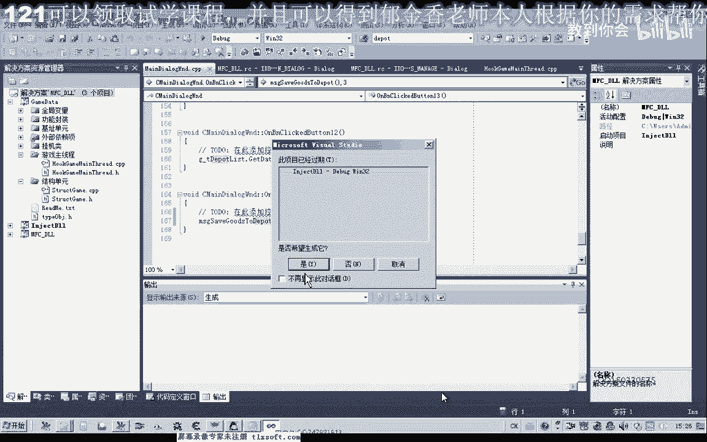
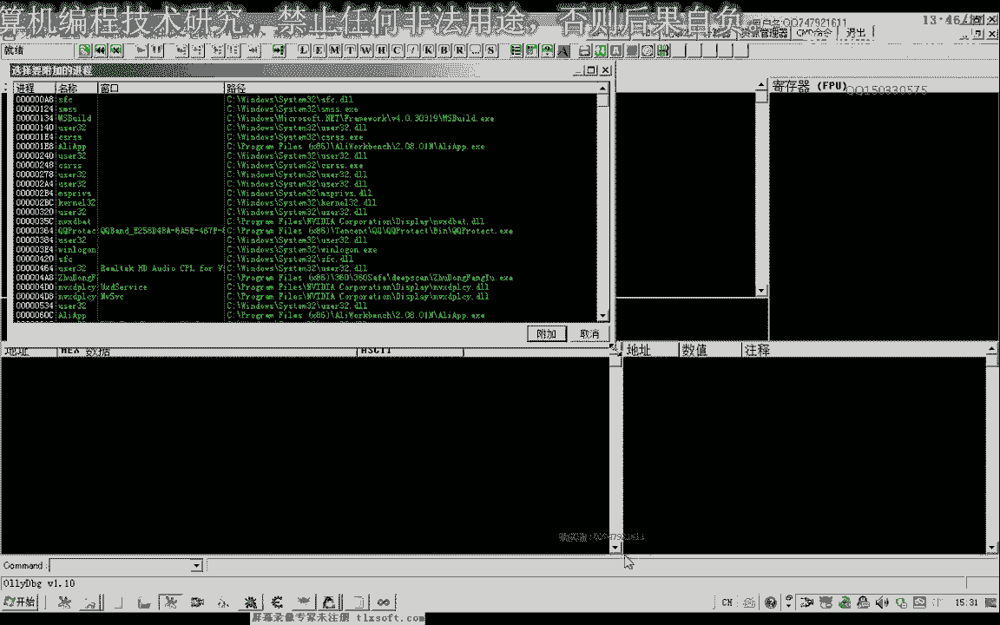
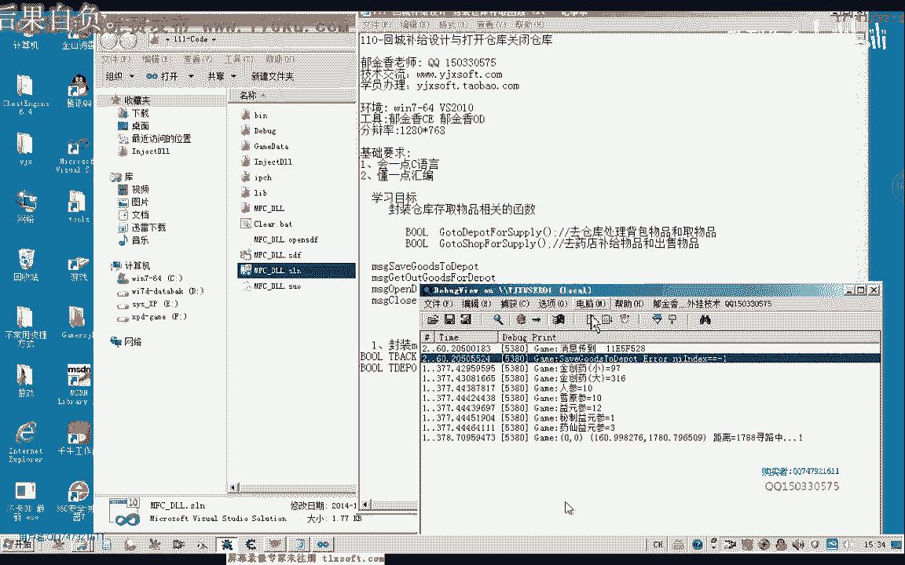
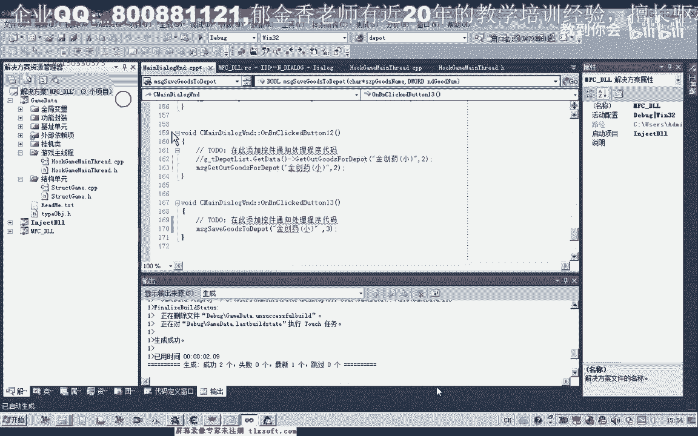

# P100：111-回城补给设计-封装仓库存取函数 - 教到你会 - BV1DS4y1n7qF

大家好，我是郁金香老师，那么这节课呢我们一起来分装一下与仓库相关的这些函数，把它分成一个独立的瓦解主线，成为一个，那么首先呢我们打开第，那么呢我们首先要工作这个保存到仓这个函数，那么在很多之前呢。

这个背包列表里面的这个成员函数呢，把大移植到我这个仓库啊啊这个结构里面呢，这样的话方便我们的管理，当时的话是这个不是配合的，这样我们会找你要方便一些，那么我们首先用了几个单元，因为这个代码比较多。

那我们先查查一下他不相关，那么在这里呢我们查找，存放物品这个图，那这个后来我们是把它写成这个b包结构，所以说在这里面试一下啊，仓库列表，那么等一下它的前景，那么另外呢它相关的代码。

那么首先呢我们找到相应的这个地址，能不能把整个代码，再推到重建里面，把它放到，这个该加二问题，就在这个地方，并且呢把他的所属关系的修改一下，好那我再申请一下，那他没有问题的话。

我们就可以把物包里面的这个相应的这个函数，还可以把它删掉，那么我们把它注释掉，就可以存放物品，那么这个编辑性，那么另外有地方的第二个方法，这个函数看对这点我，好的，这样的话我们就完成了我们代码的名字。

那么接下来呢我们就需要对这个保存仓库进行一个代码的一个封装，然后我们先找到我们的游戏主线程单元，那么在这里呢进行一个相应，然后把这段记一下，这段时间我才能去，那么复制我们说到这个主线程单元。

这对单线程来说明长途效应相关的这个操作的，那么这里已经有一个数据模型，这经我想你这个说明，那我只是这个说明，将六进行一个具体的一个封装，这里已经说明，好了有了之后呢，我们接下来让我们试一下这个函数。

那么转到，已经封装了这个小区的附近，那么我们知道它的，数据，然后里面的代码呢我们因为这两个获得参数的话都是一样的，照抄上面一个获得这些参数，那么把这个参数啊一次过了之后呢，我们需要进行一些改动。

是物品数量增持物品的名字，那么这里，计算题，那么这里的话也应当是全部一个插线板，那是一级对线，在之前我们写的时候里面有一些错误，整个节奏能量传进去，当然这里是传的一个数字都是一样的。

就是一片缓存存的数据的一个句子，当然这里的类型需要进行更多，那么我们不能说是使用这个，那么在这里呢我们就进行下载，把这个木板全拆下来，我们做的一些情况，这样写啊。

这个楼也需要在前面的忽略前面的这个消息的运行的相同啊，这样说出去好好在这里呢把消息传递过去，那么传递过去之后呢，我们现在要节省出业绩的消息，我需要，那么处理之后呢，我们也是很清楚这上面，那么这样写呢。

看到这个代码要复杂一点，他们写作要你是把相应的，安全需要钱，啊这这是取得两个相应的参数，那么取得这个参数之后呢，来看一下这地方需要做一下改动，去，那么在这里呢我们是要保存到，这次申请一下。

那么生成之后呢，我们也需要来进行一个测试，那么我们先讲到看一下，单独调用一下这个函数来进行一下测试，转到我们，然后这里呢我们选一个存放物品的存，那么在这里呢我们，选择先创，要醒来做一个测试，三个啊。

我想放大餐，然后呢申请一下，这里一共有两个参数，这里多了一个，然后呢我们可以把这考试进来嗯。

去掉，然后我们看一下，现在呢我们化解主线程测试打开，然后我们存放我们的这个物品，那么我们可以看到这里的信息，这时候是无法转移物品，那么我们仓库物品思想，那么取仓库物品可以那么长，放这个物品的话。

我们看一下它都可以轻松游戏，那么说明我们的这个代码的话应该是没问题，那么我们再来看一下它是整体这个流程，就这那么首先这里是一个指针，这里是一个指针，然后我们走到主线程里面。

那么这里的代码暂时看不出来问题，我们看是不是这个括它本身有问题，加好，那我们再次测试一下，看一下它的这个有没有出错的相关的一个调试信息，那么存放物品的仓库，那我们看一下确实信息。

那么这个时候呢它有一个错误啊，他好像是没有偏离到相关的这个物品，这是个仓库列表里，那么说出来我们就输出在这个地方，pc估计index or内，那么我们看一下我们是不是传递进去的这个名字出错了。

那我们在转账里面来看一下，那么这里是偏离背包那么比较相应的一个名字，那么最后呢它是没有找到这个相应的一个名字，那么我们转到这个get代替你去看一下是不是这个初始化出了问题，3148a24 。

那么我们先检查一下这个机子对不对，对了，因为这个时候他应当是要去骗你背包里面的这个金创药小才对啊。

不应当是去骗离我们的仓库，那么所以说我们之前是把它嗯，之前我们是把它放在这个背包里面，因为他要找到背包里面去找这个物品，获得了相关的这个对象，然后传进去啊，这样才是正确的，那么在这里呢我们可以这样写。

那么再退回去一下，按ctrl减号，那么在这里呢我们还是需要调用我们背包里面的这个，的这个成员变量来实现啊，因为始终要偏离到背包，虽然说我们在这里面封装呢，我们可以提供一个另外的一个接口。

那么我们再退回来背包的这个里面啊，这个注释的这个代码恢复一下，然后我们转到这个啊，转到第一，那么我们看一下下面这个注释掉的代码呢，我们把它恢复一下，那么或者我们也可以这样的写在里边呢。

我们再调用它的一个全局变量啊，这样来实现，那么我们再退回来呢，到我们的这个仓库里面，那么这个函数呢我们需要另外的把它包装一下，那么在这里的话，我们呢呃在查询这个物品是什么呢。

我们通过这个全局变量来调用gt，那么背包白卡，it started，然后再是get indepl，你过来啊，那么这样来调用的话，我们就能够查询到他相应的这个代码，那么这样写的话应该是可以的好的。

那么我们再次，这是编译下，那么这里呢有两个函数呢，我们也把它改一下，改为安全的这个函数加下划线s的这个，好的重新我们再输入。

挂接主线程啊，然后呢我们看一下啊，打开，然后呢纯物品，那么这个时候呢同样的是无法转移物品，我们看一下，那么消息的话我们是传到的，那么后面呢就没有一个相应的一个动作了。

那么说明我们的这个函数的话可能还是存在这些问题，那么我们跟着他的流程走一下，首先出现成，那么他应当是消息到了这里啊，然后呢他给的这里调试信息了，后面就没有信了，那么首先我们转到。

deport里面去看一下，那么我们把这个语句的啊复制一下，那万一这个视频我们把它打印出来，它的一个数值，那么打印出数值之后呢，我们在这里再来看一下，那么这里它所给的相应的这个数组的话，取得肯定是不对的。

那么我们也应当，是要用到前面的这个全局变量里面的这个数据才对，要给它加上一个前缀，因为我们用的是背包里给的这个数据，然后我们看复制相关的，我这里也是，提到，mt相关的我们全部要改，那么这里我们也需要改。

那或者我们还有一种简单的方式把这一段呢我们全部把它注释掉，那么我们直接去调用背包里面这个相关的这个函数就可以了，我改错了啊，这是这是get out。

那么我们需要再在前面后来去把这个相应的函数把它恢复一下，因为这里的话我们又写相应的这个数据，可能是刚才我们把它删掉了，get out，那么我们打开前一课的这个代码，然后搜索一下啊刚才的这个数字。

这个函数，然后呢把它相应的代码呢，我们把它复制出来，好很适合，那么在前面的话我们就直接调用这个背包里面的这个全局变量来实现，这几道题，点，估值to depart啊。

然后呢把相应的这个参数来传进来就可以了，好的，那么我们再卸载掉我们的主线程，再推出来，那么最后呢他需要一个返回值啊，你看，好的我们再次输入到游戏里面，瓦解主线程，我们来看一下，那么挂掉之后呢。

我们直接存放物品，那么这个时候我们就能够存放我们的这个物品的仓库里面去了，那么也可以取出物品，好的，那么我们的第一个函数的这个封装呢就成功了，那么接下来呢我们再封装一下其他的这个函数，那么我们看一下。

这是第一个函数的封装，那么第二个函数呢是跟masage get out goods for dep，那么我们一到主线程单元看一下有没有相关的这个函数，没有的话，这里呢我们需要了给它添加一个这样的函数。

当然之前的这个呢我们格式可以照前面的这个函数呢你来进行啊，只需要把函数的名次给它替换就可以了，那么这里呢是取物品质，那么它所有的格式都可以照前面的这个函数来，但是呢我们需要另外给他定一个进行一个消息。

那么我们把这个函数的名字复制一下，那么这里呢我们要一从卡梅克取物品，那么顺便呢我们要把后面的这两个人的消息了，给他定义一下，然后，打开窗，那么后面我们再来看一下啊，把它的这个函数复制一下，幺三，关闭长。

那么我们看一下还有没有其他的，那么还需要来一个打牌仓库的一个npc的一个兑换，打开对话，好的，那么这几个宏定义定义好了之后呢，下面呢我们也来定义这个呃，相应的这个函数的一个格式，那么这是从仓库取目平台。

我们再来看一下呃存储，然后就是我们打开npc对话的，然后再次打开仓库，这几个lab格式的都是一样的，后面跟一个npc的名字，那我们把这三个函数的名字啊，先复制一下。

那么后面这个npc的购买物品的数量就不需要了，这里呢改为npc类，好的，在后面呢添加相应的初始，再复制一下，复制两个啊，那么这个是打开我们的常打开仓库，那么这个呢是关闭仓库，好的，那么就是这几个函数。

那么我们再把这几个函数的形式来啊，也复制一下，那么然后呢转到我们的定义这个地方，那么在这里呢复制一下这几个函数的，把后面的分号呢全部删掉，那么这里呢我们还需要添加一个分号，所以它的头文件里。

这里是没有复制，没有复制，我们直接过来，这是下面一个函数，打开mp 4 top不累啊，h7 n p c，那么这个呢我们，还想打开npc对话的这个函数，我们已经有这个有过这个封装啊。

这里已经有一个你平时直接跳脱作不累啊，那么我们这个关掉，我们再来看一下之前的这个信息啊，看npc的，那么这里已经有这样一个消息，那么我们在后面的这个消息的话，我们可以了，定义为前面的这个消息就可以。

那么这两种形式的话，到时候都可以使用啊，都是代表的这个数字六，那么既然有了，我们就封装后边的这几个函数，就可以，一个是打开关闭仓库，还有一个就是我们的获取物品了，那么我们把前面的代码复制一下。

那么在后面呢我们也也通过这个来复制，或者我们之前的一个打开npc对话的啊，通过这段来复制，那么复制之后呢，我们要修改的参数，首先就是它的一个小写的一个类型，save，这个是我们是该。

取得从仓库里取得这个物品，当然这里传仓库，这个传递的方式也是一样的，那么第二个星期，这里我们也需要了进行修改，open，close啊，那么这里仓库传递的方式呢也是一样的，那么这三个消息的话。

我们要分别的转到我们的主线程单元了，进行相应的一个处理，那么我们从第一个开始处理，这三个啊复制一下，那么我们转到主线程单元，添加相应的这个开始结构。

那么然后呢这里呢我们就是通过全局变量来实现可以调out，分类，那么后面的这个参数的话肯定也是一样的，我们把上面这段参数来啊复制过来，那么这样的话我们就可以少一个临时的一个局部变量啊，直接这样写。

但是有局部变量的方式的话，嗯往往看出来要清晰一些，比如说我们比如说我们这个团结构的方式，那么这样的话我们看出来也不用什么转换啊，这一类看出来结构要清晰一些，但是这种呢我们呢就不用临时变量啊。

喜欢用哪一种方法，你就用哪一种方法，然后在这里开始应该是，打开我们的仓库，那么你也是把上面这段代码复制一下，当然复制之后呢，这里呢我们需要的，关掉npc，那么我们应该是调用了这种方式来实现。

我们不需要数量啊，只需要一个npc的一个名字，那么这里呢我们前边是仓库相关的，在这里呢我们是open departed for name，这样来实现，那么在下边一个case。

close关掉我们的这个npc，那么后面的这个参数呢也把持下来，我这里多了一个括号的删掉，然后呢我们在这里生成，好的理论上这样的话我们就能够实现单独的就可以调用啊这些代码。

那么也就是说我们前面的这几个函数呢，现在呢我们都已经封装好了，那么我们再一次来调用一个项目，那么我们一到测试啊这个界面看一下，当时我们是直接用这个m s t test来完成的，这个测试啊。

现在我们把它注释掉，首先呢我们是打开pc，那么在这里的话打开的是大宝，那我们看转转进去看一下，好伟大宝，这个打开之后呢，我们测试的是打开我们的这个仓库，open departed for this。

那么这里这里来也是5号，那么第三个呢我们是关闭，事情hello，那么关闭等于15到，那么中间呢我们还要存取物品，取物品的这点我们也把它收拾掉，这是他二级，那么我们把后面的拆出来，用进来。

那么同样的我们这里的话啊，这里是我们的存放物品填充要三个啊，这个之前呢我们就已经把它的代码来写好了。

直接测试，那么我们先把它关掉，直接这样测试肯定是没有效果的，你们要挂接到主线层打开打开仓库，然后是存放物品，保存了三个，然后呢取仓库物品全物品啊都可以，那么最后呢关闭仓库，ok好的，那么这节课的呃。

这节课呢我们就写到这里代码，那么下一节课呢我们在进行进一步的啊这个封装和测试好。