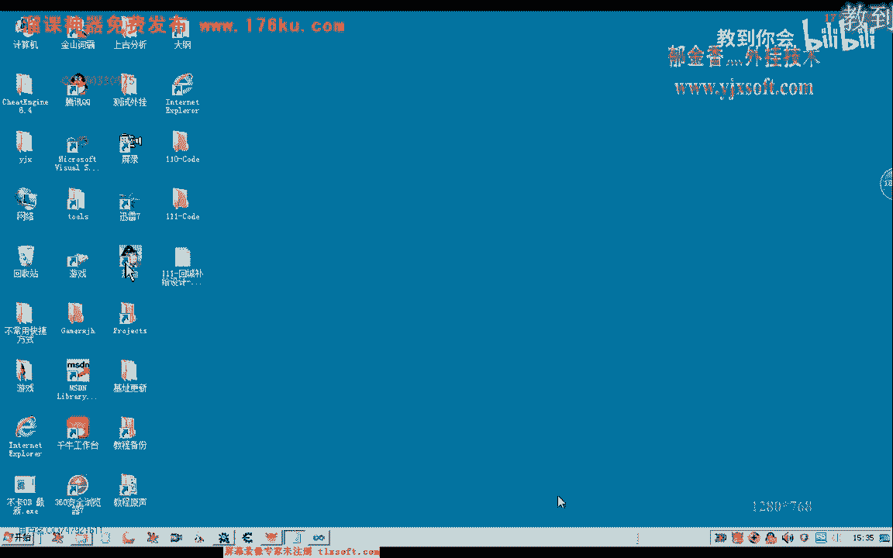

# 课程 P100：111-回城补给设计-封装仓库存取函数 📦


在本节课中，我们将学习如何将与仓库操作相关的函数进行封装，使其成为一个独立的模块，从而提高代码的可管理性和复用性。我们将从现有代码中提取功能，并重构为清晰的函数接口。

---

## 概述

我们将从游戏代码中提取与“存放物品到仓库”相关的逻辑，并将其封装成独立的函数。这个过程涉及代码迁移、函数重构以及接口定义，目标是让仓库操作像使用背包函数一样方便。

上一节我们介绍了仓库的基本结构，本节中我们来看看如何具体封装操作函数。

---

## 第一步：定位并迁移现有代码

首先，我们需要找到游戏中处理“存放物品”功能的原始代码。这段代码最初写在背包列表的成员函数中，现在需要将其移植到仓库结构中。

以下是具体操作步骤：


1.  在代码中查找“存放物品”相关的函数或逻辑块。
2.  确认该逻辑当前属于背包结构（例如 `Bag` 或 `Backpack`）。
3.  将找到的代码段整体剪切或复制到目标仓库类（例如 `Depot` 或 `Warehouse`）的定义中。
4.  修改代码的所属关系，将函数绑定到仓库类，并调整其中引用的成员变量（例如将背包列表 `bagList` 改为仓库列表 `depotList`）。

迁移并修改所属关系后，需要编译测试以确保没有语法错误。如果测试通过，就可以将背包类中的原始函数注释掉或删除。

---

## 第二步：在主线程单元中封装接口

代码迁移完成后，我们需要在游戏的主线程单元中创建一个统一的调用接口。这样，其他模块就可以通过简单的函数调用来使用仓库功能，而无需关心内部实现。


我们首先封装“保存物品到仓库”的函数。

1.  在主线程单元（例如 `GameMainThread`）中，找到或添加处理仓库操作的消息处理部分。
2.  定义一个函数，例如 `SaveToDepot`，它接收必要的参数（如物品ID、物品数量）。
3.  在这个函数内部，将参数打包成消息，并发送给仓库模块进行处理。

其核心流程可以用以下伪代码描述：

```cpp
// 伪代码示例
void SaveToDepot(int itemId, int count) {
    // 1. 准备消息结构体
    DepotMessage msg;
    msg.type = MSG_SAVE_TO_DEPOT;
    msg.itemId = itemId;
    msg.count = count;

    // 2. 发送消息到仓库模块的消息队列
    SendMessageToDepotModule(msg);
}
```




需要注意的是，在封装时，要确保参数传递正确，特别是物品名称或ID的查找，应基于背包的全局数据，而不是仓库数据。

---

## 第三步：测试封装后的函数

函数封装完成后，必须进行测试以验证其功能是否正常。

以下是测试流程：

1.  在测试代码中，调用新封装的 `SaveToDepot` 函数。
2.  传入测试参数，例如物品“金创药”和数量3。
3.  运行游戏，观察是否能成功将物品从背包转移到仓库。
4.  同时检查游戏日志或调试信息，确认没有错误发生。

如果测试中发现“无法转移物品”或“找不到物品”等错误，需要检查：
*   传递的物品名称或ID是否正确。
*   函数内部查找物品时，是否错误地查询了仓库列表而不是背包列表。
*   消息传递的流程是否完整，参数类型是否匹配。

---

## 第四步：封装其他仓库相关函数

成功封装保存函数后，我们可以用同样的模式封装其他仓库操作，形成一个完整的接口集。

我们需要封装的主要函数包括：

*   **从仓库取出物品**：`GetGoodsFromDepot`
*   **打开仓库NPC对话**：`OpenDepotDialog`
*   **关闭仓库**：`CloseDepot`

每个函数的封装步骤与之前类似：
1.  在主线程单元定义函数原型。
2.  在消息处理结构中添加对应的 `case` 分支。
3.  在 `case` 分支内，调用仓库模块的全局变量或函数来完成实际操作。

例如，取出物品的函数可能如下所示：

```cpp
// 伪代码示例
void GetGoodsFromDepot(int itemId, int count) {
    // 通过全局的仓库管理器调用取出功能
    g_pDepotManager->RetrieveItem(itemId, count);
}
```

---

## 第五步：集成测试所有功能

所有函数封装完毕后，需要进行集成测试，确保整个流程顺畅。

我们可以编写一个简单的测试序列：

```cpp
// 测试序列伪代码
void TestDepotFunctions() {
    OpenDepotDialog("仓库管理员"); // 1. 打开仓库NPC
    SaveToDepot("金创药", 3);      // 2. 存放3个金创药
    GetGoodsFromDepot("金创药", 1); // 3. 取出1个金创药
    CloseDepot();                   // 4. 关闭仓库
}
```

运行此测试，并观察每一步操作是否都能在游戏中正确执行。通过这个测试，我们可以验证所有封装函数的正确性和协同工作的能力。

---

## 总结


本节课中我们一起学习了如何封装仓库存取函数。我们首先将分散在背包模块中的仓库操作代码迁移并整合到仓库类中，然后在主线程单元为其创建了清晰的函数接口，包括存放、取出、打开和关闭仓库等功能。最后，我们通过测试验证了每个函数的正确性。通过这次封装，仓库相关的操作变得模块化且易于调用，为后续更复杂的自动化逻辑打下了基础。

下一节课，我们将在此基础上，进行更进一步的封装和流程整合测试。