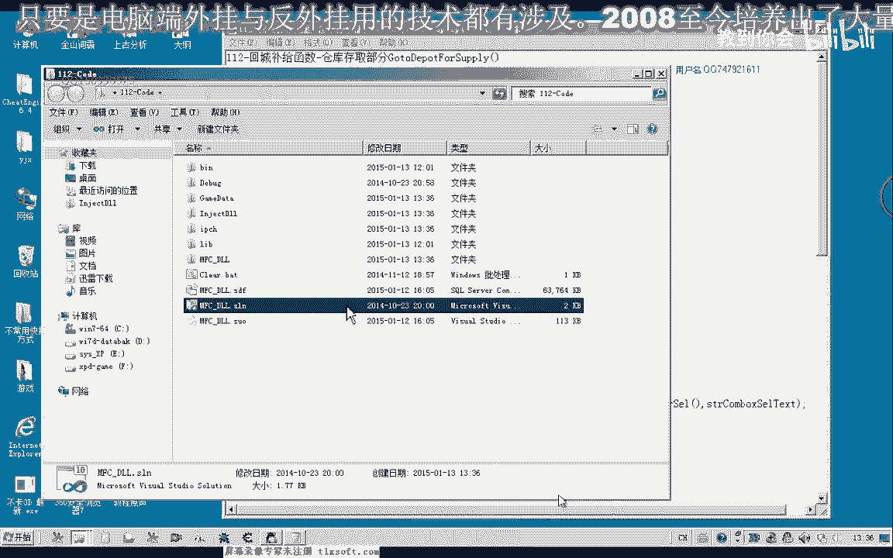
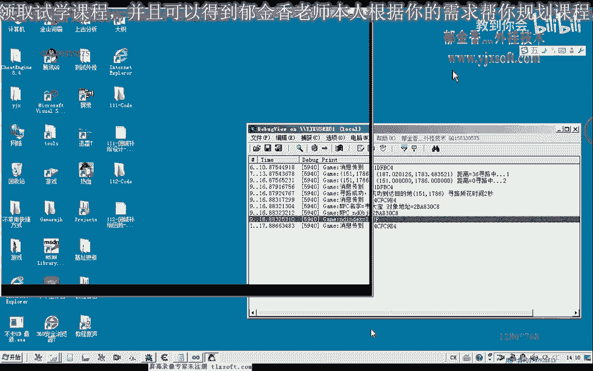
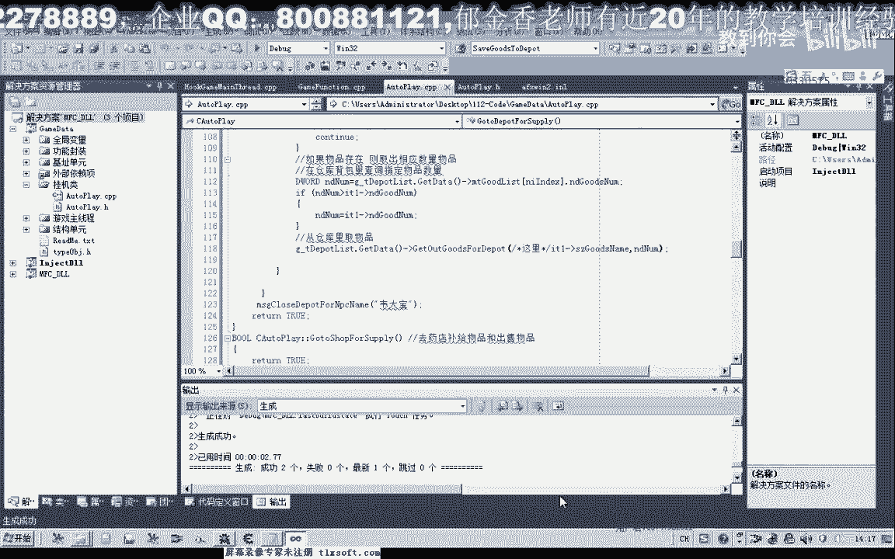
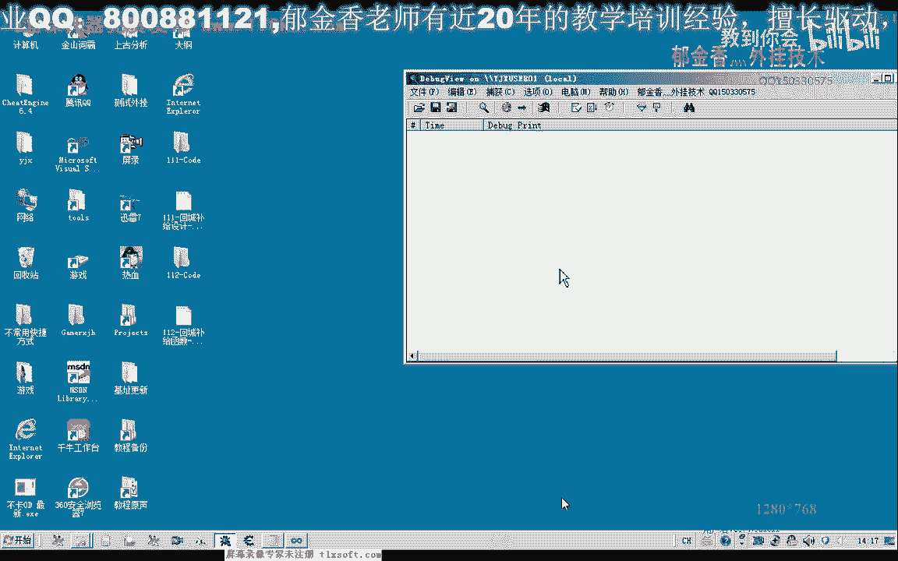

# 课程 P101：回城补给函数 - 仓库存取部分 🏦



在本节课中，我们将学习如何封装一个名为 `GotoDepotForSupply()` 的函数，用于处理角色返回仓库进行物品存取的操作。我们将重点讲解如何遍历物品列表，判断物品去向，并实现与游戏仓库的交互。

---

## 概述

本节课的目标是创建一个函数，用于处理角色返回主城后，前往仓库进行物品存取的需求。该函数需要处理两个核心列表：一个用于存放需要存放到仓库的物品信息，另一个用于存放需要从仓库取出的物品信息。我们将通过代码逐步实现这些功能。

---

## 函数声明与结构

首先，我们需要在代码的适当位置声明两个函数：一个用于处理仓库补给（存放物品），另一个用于处理商店补给（将在后续课程实现）。以下是函数声明的示例：

```cpp
// 函数声明
bool GotoDepotForSupply(); // 前往仓库进行补给
bool GotoShopForSupply();  // 前往商店进行补给（后续实现）
```

在回城补给的主函数中，我们需要调用这两个函数。为了确保代码结构清晰，我们先将这两个函数定义为空函数，后续再逐步填充其功能。

---

## 实现仓库补给函数

上一节我们声明了函数，本节中我们来看看如何实现 `GotoDepotForSupply()` 函数的核心逻辑。该函数主要处理两个 `std::vector` 容器（列表）中的数据。

### 1. 寻路至仓库

首先，角色需要移动到仓库NPC的位置。我们暂时使用固定的坐标和地图ID来实现寻路。请注意，不同地图的仓库坐标可能不同，后续我们需要将其与地图ID关联，以实现动态寻路。

以下是寻路至仓库的示例代码：

```cpp
bool GotoDepotForSupply() {
    // 假设的仓库坐标和NPC名称（后续需动态化）
    int depotMapID = 1001;
    std::string depotNPCName = "仓库管理员";
    Position depotPos = {120, 80};

    // 调用寻路函数，移动到仓库NPC附近
    if (!MoveToPosition(depotMapID, depotPos)) {
        // 寻路失败处理
        return false;
    }
    // 增加延迟，确保寻路完成
    Sleep(1000);
    return true;
}
```

### 2. 与仓库NPC交互

到达仓库附近后，需要与仓库NPC对话并打开仓库界面。我们同样使用固定的NPC名称进行交互，后续需要将其与地图ID关联。

以下是打开仓库界面的示例代码：

```cpp
// 与NPC对话
if (!TalkToNPC(depotNPCName)) {
    return false;
}
Sleep(1000); // 等待服务器响应

// 打开仓库界面
if (!OpenDepot(depotNPCName)) {
    return false;
}
Sleep(1000); // 等待界面加载
```

---

## 处理物品存取列表

成功打开仓库界面后，我们需要处理两个列表中的数据：一个是要存放到仓库的物品列表，另一个是要从仓库取出的物品列表。

### 处理存放物品列表

以下是遍历存放物品列表并执行存放操作的步骤：

1.  **遍历列表**：使用迭代器遍历存放物品的 `std::vector`。
2.  **判断物品去向**：检查物品的标记（例如一个 `DWORD` 类型的值），确认其是否需要存放到仓库。
3.  **查询背包**：在背包中查找该物品是否存在。
4.  **执行存放**：如果物品存在，则获取其数量并执行存放操作。

以下是核心代码逻辑：

```cpp
std::vector<ItemInfo>::iterator itDeposit = depositList.begin();
for (; itDeposit != depositList.end(); ++itDeposit) {
    // 判断物品去向标记是否为“仓库”
    if (itDeposit->destinationFlag == DESTINATION_DEPOT) {
        // 在背包中查询该物品
        int backpackIndex = FindItemInBackpack(itDeposit->itemName);
        if (backpackIndex < 0) {
            continue; // 背包中不存在，跳过
        }
        // 获取背包中该物品的数量
        int itemCount = GetItemCountInBackpack(backpackIndex);
        // 执行存放操作
        DepositItemToDepot(itDeposit->itemName, itemCount);
    }
}
```

### 处理取出物品列表

处理完存放列表后，接下来处理需要从仓库取出的物品列表。逻辑与存放类似，但查询和操作的对象是仓库。

以下是处理取出物品列表的步骤：

1.  **遍历列表**：使用迭代器遍历取出物品的 `std::vector`。
2.  **判断物品去向**：确认物品需要从仓库取出。
3.  **查询仓库**：在仓库中查找该物品是否存在。
4.  **计算数量**：比较希望取出的数量和仓库实际数量，取较小值。
5.  **执行取出**：执行从仓库取出物品的操作。

以下是核心代码逻辑：

```cpp
std::vector<ItemInfo>::iterator itWithdraw = withdrawList.begin();
for (; itWithdraw != withdrawList.end(); ++itWithdraw) {
    if (itWithdraw->destinationFlag == DESTINATION_DEPOT) {
        // 在仓库中查询该物品
        int depotIndex = FindItemInDepot(itWithdraw->itemName);
        if (depotIndex < 0) {
            continue; // 仓库中不存在，跳过
        }
        // 获取仓库中该物品的数量
        int depotCount = GetItemCountInDepot(depotIndex);
        // 计算实际取出的数量（取期望值和实际值的最小值）
        int withdrawAmount = (itWithdraw->desiredCount < depotCount) ? itWithdraw->desiredCount : depotCount;
        // 执行取出操作
        WithdrawItemFromDepot(itWithdraw->itemName, withdrawAmount);
    }
}
```

---

## 错误处理与优化

在实现过程中，我们需要注意以下几点：

1.  **容器初始化**：在每次更新列表数据前，清空 `std::vector`，防止数据累积。
2.  **延迟等待**：在关键操作（如寻路、打开界面、存取物品）后添加适当的延迟（如 `Sleep`），等待服务器响应和数据同步。
3.  **线程安全**：如果直接在其他线程中调用游戏函数，可能导致数据冲突或程序崩溃。理想情况下，应将此类函数封装并调度到游戏主线程中执行。
4.  **异常捕获**：在遍历容器时，添加异常处理机制，以便在出现错误时打印调试信息，快速定位问题。




---

## 测试与调试


为了测试函数功能，我们应在独立的线程中调用 `GotoDepotForSupply()`，而不是在窗口主线程中直接测试，以免造成界面卡死。

测试步骤建议如下：
1.  在补给设置界面，添加一些标记为“存仓库”的物品（如金创药小）。
2.  添加一些标记为“从仓库取出”的物品。
3.  启动挂机线程，观察角色是否能够正确寻路至仓库，并完成物品的存取。
4.  通过调试信息或日志，确认操作是否成功，以及是否有错误产生。

---





## 总结

本节课中我们一起学习了如何封装 `GotoDepotForSupply()` 函数，实现了以下核心功能：
*   角色自动寻路至仓库NPC。
*   与仓库NPC交互并打开仓库界面。
*   遍历物品列表，根据物品去向标记，将物品存放到仓库或从仓库取出。
*   实现了基本的错误处理和延迟等待机制。

请注意，当前实现中使用了固定的坐标和NPC名称。在后续课程中，我们需要将其改进为通过地图ID动态关联，并完善线程安全等高级特性。

---

## 课后练习

请尝试完成以下练习，以巩固本节课的知识：
1.  **完善代码**：根据课堂示例，补全 `FindItemInBackpack`、`DepositItemToDepot` 等辅助函数的实现。
2.  **实现商店补给函数**：仿照仓库补给函数，实现 `GotoShopForSupply()` 函数。该函数需要处理向商店出售物品以及从商店购买物品补给的逻辑。
3.  **优化列表管理**：在物品处理界面，实现删除某一行物品数据的功能。


通过完成这些练习，你将更深入地理解游戏辅助功能中数据管理和流程控制的实现方法。