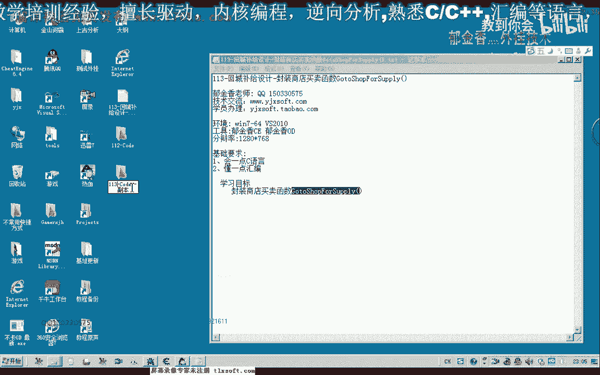
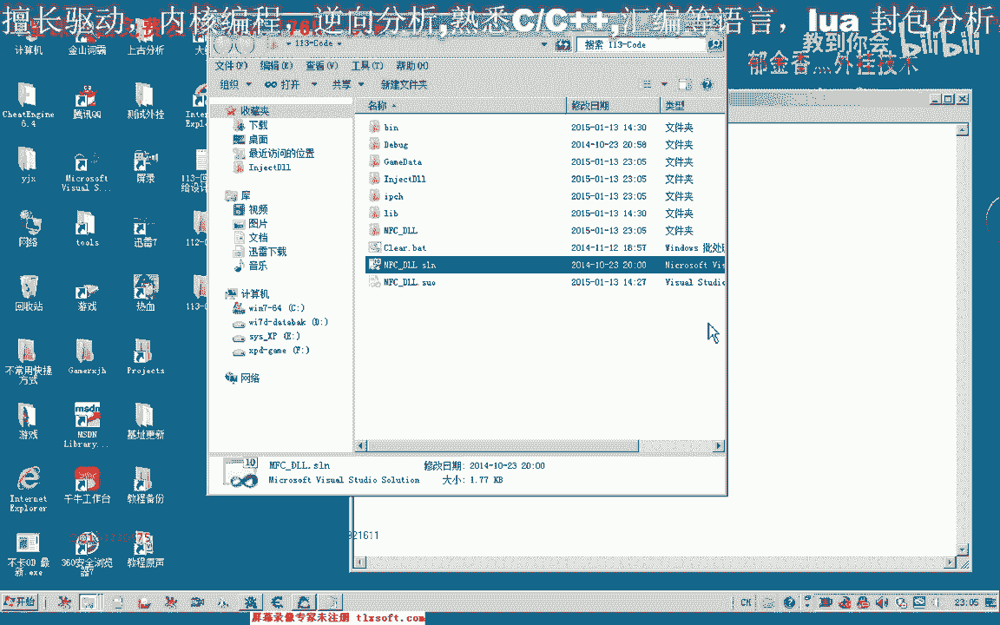
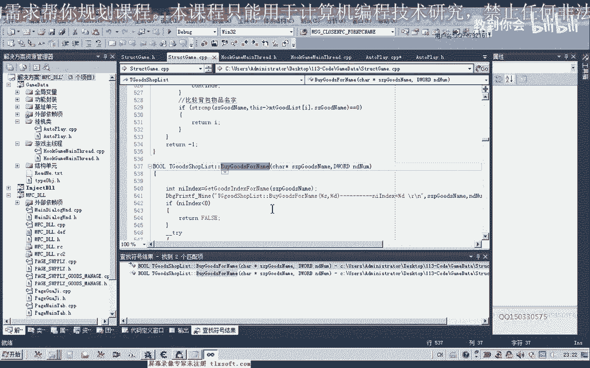
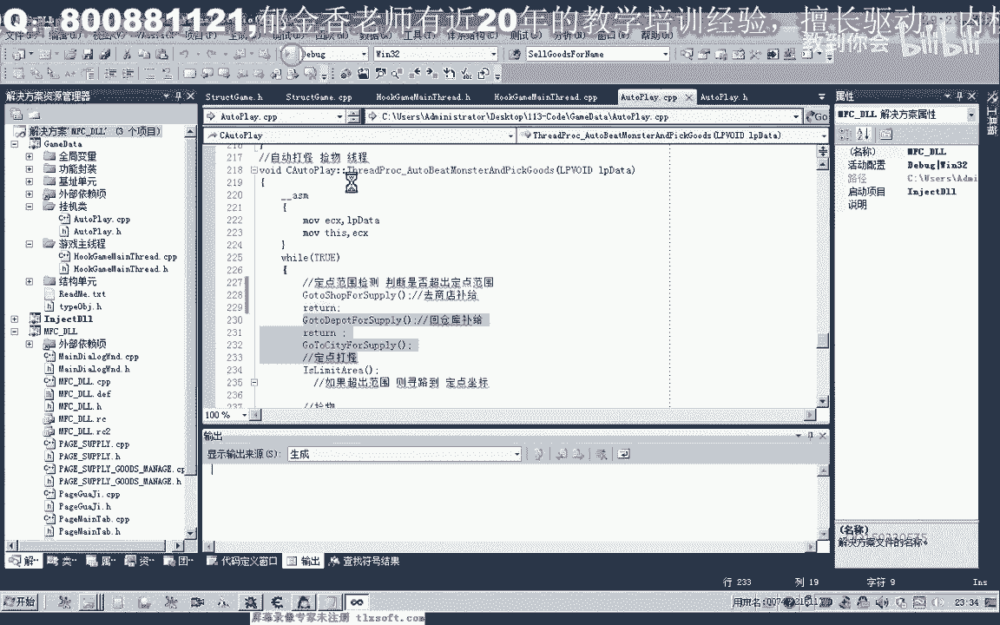
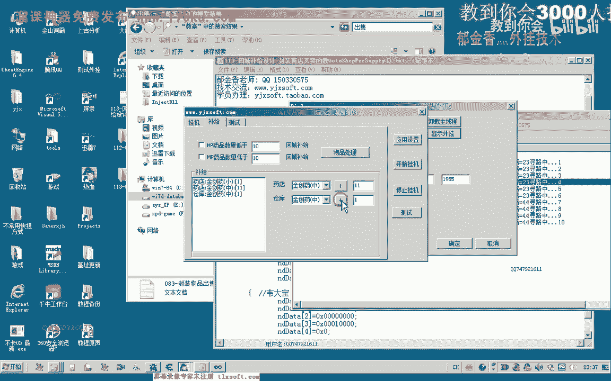
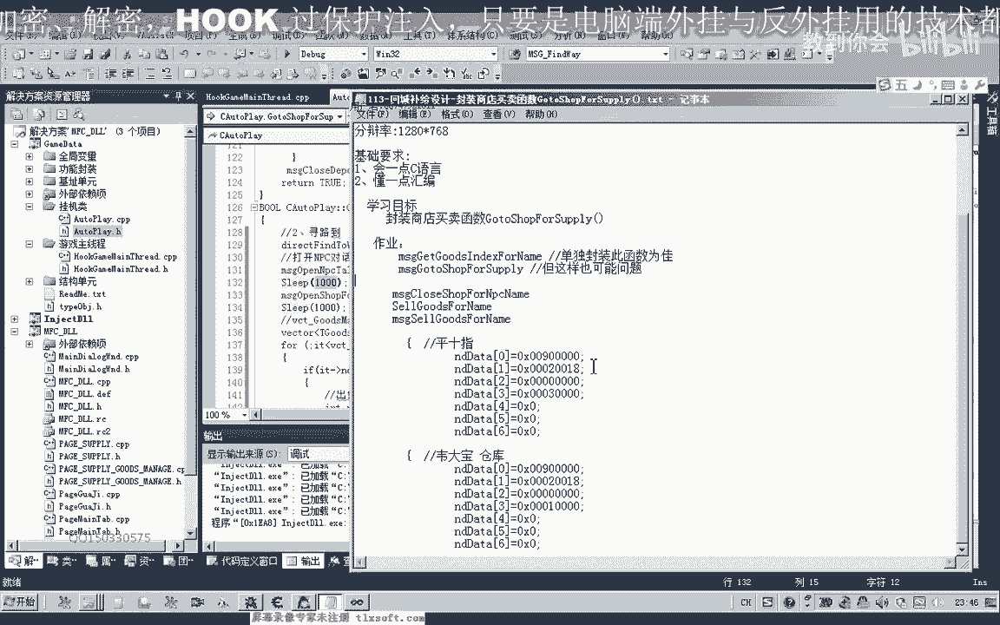

# 课程 P102：113-回城补给设计-封装商店买卖函数 GotoShopForSupply() 🛒





在本节课中，我们将学习如何封装一个完整的商店补给函数 `GotoShopForSupply()`。这个函数不仅会从商店购买所需物品，还会将背包中不需要的物品出售给商店。我们将基于之前编写的回城补给函数进行修改和扩展。

---

## 概述与准备工作

上一节我们实现了回城去药店补给的功能。本节中，我们将在此基础上，增加向商店出售物品的流程，从而创建一个更通用的商店补给函数。

首先，我们需要在现有代码上进行修改。找到并复制之前编写的回城补给函数（例如 `GoToWarehouseForSupply`）的代码作为基础模板。

---

## 第一步：修改寻路与NPC交互目标

原回城补给函数的目标是仓库管理员“韦大宝”。现在，我们的目标是商店NPC“平四指”。因此，需要修改寻路坐标和交互的NPC。

**核心修改如下：**
1.  将寻路坐标改为“平四指”所在的位置。
2.  将打开和关闭的NPC对象从“韦大宝”改为“平四指”。

```cpp
// 示例：修改寻路目标
MoveToNPC("平四指"); // 替换原来的 MoveToNPC("韦大宝")
```

---

## 第二步：封装关闭NPC的通用函数

在原有代码中，关闭NPC（如仓库）的操作是硬编码的。为了同时支持关闭“平四指”（商店）和“韦大宝”（仓库），我们需要一个更通用的关闭函数。

分析发现，关闭不同NPC的主要区别在于数据包中一个特定字节的值。我们可以根据NPC名称来动态设置这个值。

**以下是封装思路：**
1.  创建一个函数 `CloseNPCByName`，接收NPC名称作为参数。
2.  在函数内部，根据名称判断并设置关键字节的值。
    *   `"平四指"` 对应值 **3**
    *   `"韦大宝"` 对应值 **1**
3.  发送构造好的数据包以关闭NPC。

```cpp
void CloseNPCByName(const char* npcName) {
    // 构造基础数据包
    BYTE packet[PACKET_SIZE];
    // ... 初始化数据包 ...

    // 根据NPC名称设置关键字节
    int keyByteValue = 0;
    if (strcmp(npcName, "平四指") == 0) {
        keyByteValue = 3;
    } else if (strcmp(npcName, "韦大宝") == 0) {
        keyByteValue = 1;
    }
    // 将 keyByteValue 设置到数据包特定偏移位置
    packet[SPECIFIC_OFFSET] = keyByteValue;

    // 发送数据包
    SendPacket(packet);
}
```

这样，在商店补给函数中，我们只需调用 `CloseNPCByName("平四指")` 即可。

---

## 第三步：处理物品出售逻辑

商店补给的核心新增功能是出售物品。这需要两个步骤：
1.  **判断物品去向**：从配置列表中读取，判断物品是“存入仓库”还是“出售给商店”。
2.  **执行出售操作**：若为出售，则调用出售函数。

以下是处理物品列表的核心逻辑：

```cpp
// 遍历物品处理列表
for (Item item : itemList) {
    if (item.destination == DESTINATION_SHOP) {
        // 出售给商店
        SellItemToShop(item.name, item.quantity);
    } else if (item.destination == DESTINATION_WAREHOUSE) {
        // 存入仓库（原有逻辑）
        StoreItemToWarehouse(item.name, item.quantity);
    }
}
```



---


## 第四步：封装出售物品函数


我们发现，现有的背包操作函数中可能缺少直接出售物品给商店的功能。因此，需要封装一个新的函数 `SellItemToShop`。

**函数设计如下：**
1.  **功能**：根据物品名称和数量，将其出售给当前打开的商店。
2.  **参数**：物品名称 (`itemName`)、出售数量 (`quantity`)。
3.  **实现**：构造出售交易的数据包并发送。这通常涉及在背包中查找物品索引，然后向服务器发送出售指令。

同时，为了线程安全，最好将涉及游戏核心数据交互的函数（如出售）封装成消息，推送到主线程执行。

```cpp
// 声明一个主线程消息处理函数
MSG_SellItemToShop(const char* itemName, int quantity) {
    // 在主线程中安全地执行出售操作
    int itemIndex = FindItemInBackpack(itemName);
    if (itemIndex != -1) {
        // 构造并发送出售数据包
        SendSellPacket(itemIndex, quantity);
    }
}
```

在 `GotoShopForSupply` 函数中，调用 `MSG_SellItemToShop` 来出售物品。

---

## 第五步：处理商店购买逻辑

购买逻辑与原有仓库补给类似，但查询和操作的目标是商店而非仓库。

**购买流程如下：**
1.  查询商店中是否存在需要购买的物品。
2.  如果存在，则调用购买函数 `BuyItemFromShop`。
3.  同样建议将购买函数封装为线程安全的消息函数 `MSG_BuyItemFromShop`。

```cpp
// 在补给循环中
if (item.destination == DESTINATION_BUY_FROM_SHOP) {
    if (FindItemInShop(item.name)) {
        MSG_BuyItemFromShop(item.name, item.quantity);
    }
}
```



---

## 第六步：整合与测试

将以上所有步骤整合到 `GotoShopForSupply()` 函数中。完整的函数流程如下：




1.  寻路至商店NPC“平四指”。
2.  打开与“平四指”的对话并进入商店界面。
3.  **出售阶段**：遍历物品列表，将标记为“出售”的物品卖给商店。
4.  **购买阶段**：遍历物品列表，从商店购买标记为“购买”的物品。
5.  关闭商店界面。

测试时，注意在配置中正确设置物品的“去向”（出售/购买/存仓），并观察游戏角色是否能正确完成寻路、买卖和关闭界面等一系列操作。

---

## 注意事项与优化建议

在实现过程中，需要注意以下几点：

*   **线程安全**：所有直接读写游戏内存或发送关键数据包的操作（如买卖、寻路），都应封装成消息函数（`MSG_` 开头），由主线程统一处理，避免多线程冲突导致游戏崩溃或数据错误。
*   **函数分离**：避免在 `MSG_` 消息函数中使用 `Sleep` 或可能导致主线程阻塞的代码。耗时或等待操作应在辅助线程中处理。
*   **错误处理**：在关键步骤（如查找物品、发送数据包）后添加日志输出，便于调试。
*   **扩展性**：`CloseNPCByName` 函数可以进一步扩展，以支持更多NPC类型。

---

## 总结

本节课中，我们一起学习了如何封装一个功能完整的商店补给函数 `GotoShopForSupply()`。关键点包括：

1.  **修改基础**：基于仓库补给函数，更改目标NPC为商店。
2.  **通用关闭**：封装了根据NPC名称关闭对话框的通用函数。
3.  **买卖逻辑**：实现了向商店出售物品和从商店购买物品的双向逻辑。
4.  **线程安全**：强调了将核心操作封装成主线程消息的重要性，以确保稳定性。




通过本课，你掌握了如何设计一个集购买与出售于一体的自动化商店交互模块，这是游戏辅助功能中非常实用的一环。请务必进行充分测试，并根据实际游戏情况调整数据包参数和延时设置。