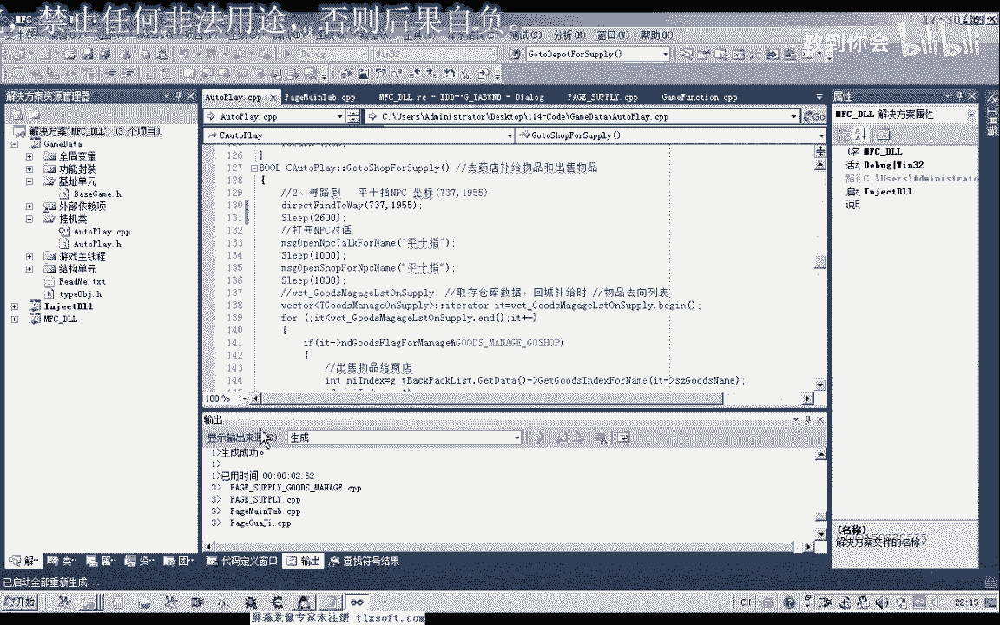

# 课程 P103：114 - 重新设计挂机代码、防移动卡死与完善回城补给 🛠️


在本节课中，我们将学习如何重构挂机代码的逻辑，解决角色移动时可能出现的卡死问题，并完善自动回城补给的功能。我们将从分析现有代码的问题开始，逐步进行修改和优化。

---

## 概述

本节课的核心任务是优化挂机脚本。我们将修正原有代码的逻辑错误，更新游戏机制，并重新设计代码结构以提高可读性和健壮性。重点包括实现低血保护、完善回城补给流程以及为寻路系统增加防卡死机制。

---

## 第一步：更新游戏机制与初始化

首先，我们需要更新游戏的机制数据，因为游戏本身已经发生了变化。

1.  打开机制单元，运行机制更新工具。
2.  对比新旧机制，删除旧的机制数据，导入新的机制数据。
3.  重新编译代码。

完成机制更新后，我们需要对数据进行初始化修改。

以下是初始化回城补给选项和仓库数据的步骤：
*   移动到回城补给选项，复制相关数据。
*   删除仓库的旧代码，并重新进行初始化。

---

## 第二步：重构挂机循环逻辑

上一节我们更新了基础数据，本节中我们来看看如何重构挂机的主循环逻辑。我们将使代码结构更清晰，功能模块化。

移动到挂机单元，对挂机率的代码进行完善。可以删除旧有的复杂循环，重新设计。

新的挂机循环将按以下顺序执行：
1.  **低血保护**：当生命值过低时采取保护措施。
2.  **回城补给**：检查药品和物资，必要时回城购买或存取。
3.  **自动打怪/任务**：执行自动打怪或定点打怪逻辑。

我们将相应的功能代码（低血保护函数、回城补给函数、自动打怪函数）粘贴到新的结构框架中。自动任务逻辑应放在自动打怪之前。

**低血保护**的核心代码示例如下：
```cpp
if (currentHP < lowHPThreshold) {
    useHealthPotion(); // 使用血瓶
    retreatToSafeZone(); // 撤退到安全区
}
```

---

## 第三步：完善回城补给与自动打怪

在重构了主框架后，我们需要完善各个子模块。首先处理回城补给和自动打怪模块。




在挂机循环中，我们将旧的、分散的代码删除。定点打怪的逻辑需要整合到自动打怪的函数中去。


我们需要设计一个独立的自动打怪函数，将挂机循环和定点打怪的代码都添加进去。这样的设计提高了代码的可读性和可维护性。自动拾取物品的功能我们将在后续另外设计。

修改后，循环内的代码主要分为三部分：低血保护、回城补给以及预留的自动拾物。


---

## 第四步：解决寻路卡死问题

一个常见的问题是角色在寻路过程中会在某个点卡住不动。我们需要修改寻路逻辑来防止这种情况。

原有的寻路逻辑有一个错误：当距离目标**小于**某个值时，它错误地继续执行寻路。正确的逻辑应该是：当距离**大于**该值时，才继续寻路；当距离**小于或等于**该值时，表示寻路成功并返回。

为了防卡死，我们可以引入一个记录上次距离的变量 `lastDistance`。

防卡死算法的核心思路是：
1.  初始化 `lastDistance` 为0或任意值。
2.  每次寻路后，保存当前距离到 `lastDistance`。
3.  在下一次寻路前进行判断：如果 `当前距离 == lastDistance`，说明角色卡住了。
4.  触发防卡移动：将当前坐标的X或Y值增加一个随机数（例如1-10），然后重新寻路。
5.  移动后，需要给予角色足够的时间到达新设定的目的地。

修改后的寻路判断逻辑如下：
```cpp
if (currentDistance > targetDistance) {
    // 继续寻路
    findPath(targetX, targetY);
} else if (currentDistance <= targetDistance) {
    // 寻路成功，返回
    return true;
}

// 防卡死判断
if (currentDistance == lastDistance) {
    // 卡住了，进行随机位移
    currentX += rand() % 10 + 1;
    findPath(currentX, currentY);
    Sleep(2000); // 等待2秒让角色移动
}
lastDistance = currentDistance; // 更新上次距离
```

---

## 第五步：修正数据获取与界面同步

在回城补给模块中，从编辑框获取数据的方式需要修改，以支持用户直接输入和从列表选择。

我们不能直接获取列表选中的项，而应该先取得编辑框内的文本。这确保了无论是选择的还是手动输入的数据都能被正确添加到列表。

以下是修改编辑框文本获取的示例：
```cpp
TCHAR buffer[256];
GetWindowText(hEditBox, buffer, sizeof(buffer)/sizeof(TCHAR));
// 此时 buffer 中存储了编辑框内的文本
```

同样，仓库相关的代码也需要进行类似的修改。

此外，我们需要确保在界面上应用的设置能同步更新到挂机脚本的核心变量中。在“应用设置”的功能里，应将窗口控件的数据更新到对应的成员变量，最终更新到挂机对象中，这样脚本运行时才能使用正确的数值。

---

## 第六步：添加延迟与测试优化

在寻路到NPC或特定地点后，NPC可能不会立即刷新出来。如果立刻执行交互操作（如购买、对话），可能会失败。

因此，在关键操作点需要添加适当的延迟：
*   到达NPC处后，等待1-2秒让其刷新。
*   前往仓库等特定地点时，等待时间可以稍长，例如2.6秒。

完成以上修改后，进行全面的功能测试。测试流程应包括：
1.  启动挂机脚本。
2.  设置药品补给数量（设置一个较大的值以触发回城）。
3.  测试购买药品、存取仓库、出售物品等功能。
4.  观察调试信息，确保逻辑按预期执行。
5.  测试在城外挂机点，是否不会误操作NPC。

在测试过程中，如果发现购买数量出现负数、寻路不动等问题，需要返回检查对应的计算逻辑和防卡死代码是否生效。

---

## 第七步：完善用户交互与配置保存

最后，我们还需要优化用户交互体验并实现配置的持久化。

1.  **列表交互优化**：当用户再次点击已选中的列表项时，应取消选中状态。这需要在列表的单击事件处理中，先判断当前单元格是否已有选中标志，如果有则清空。
2.  **配置持久化**：将药品列表、补给设置等数据保存到配置文件（如INI或XML文件）。这样每次启动脚本时无需重新设置，直接加载即可。
3.  **NPC选中状态清理**：在打开商店或仓库NPC并关闭后，应取消对NPC的选中状态，避免干扰后续的自动打怪逻辑。这个功能可以在关闭NPC窗口的函数中实现。

---

## 总结


本节课中我们一起学习了如何系统性地优化一个挂机脚本。
我们首先**更新了游戏机制并初始化了数据**，然后**重构了挂机主循环**，使其结构更清晰。
接着，我们重点**完善了回城补给逻辑**并**为寻路系统增加了防卡死机制**。
此外，我们还修正了**数据获取方式**、**优化了用户界面交互**，并提出了**配置持久化**的方案。
通过这些步骤，我们使得脚本的稳定性、可读性和用户体验都得到了显著提升。