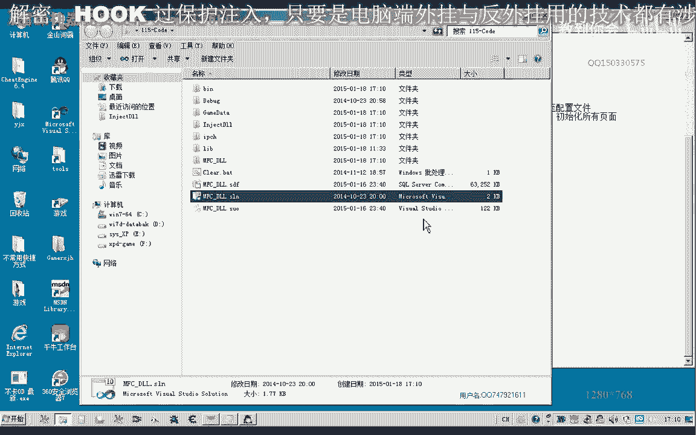
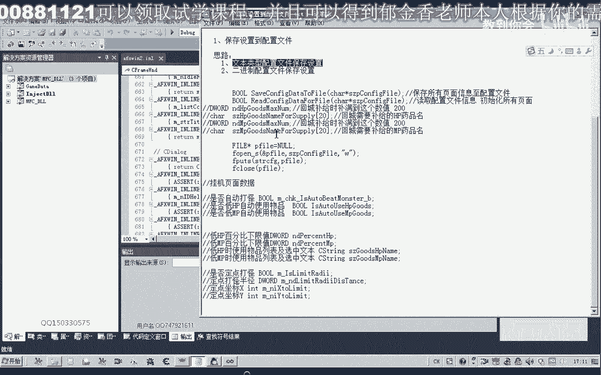
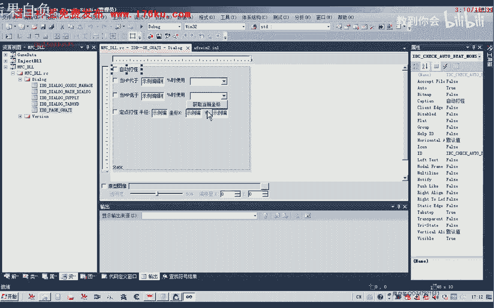
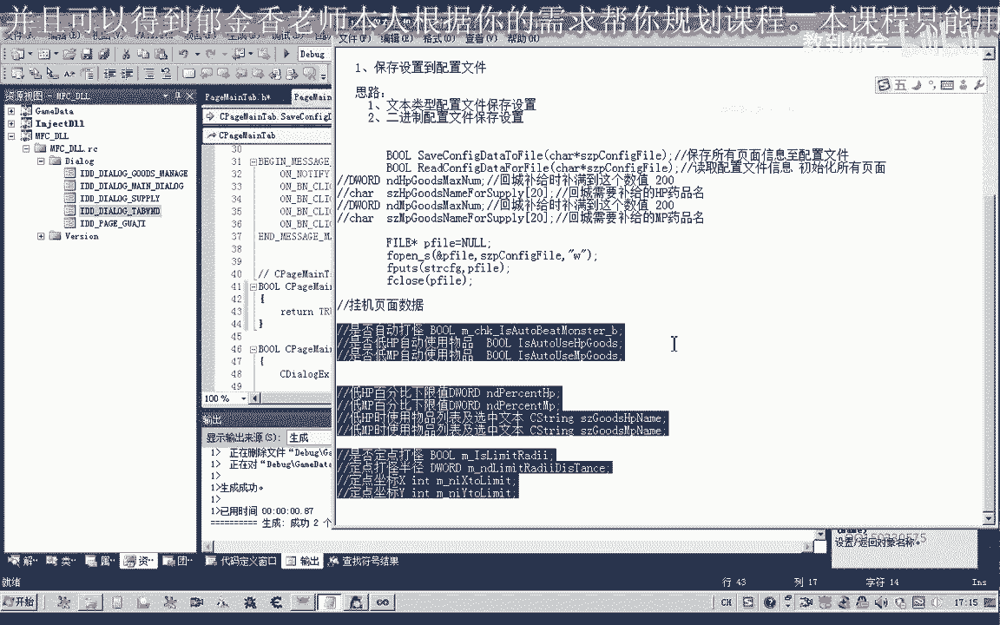
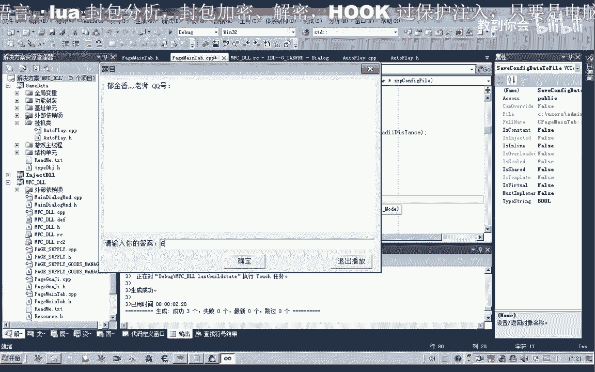

# 课程P104：115-保存挂机设置到配置文件 🗂️

在本节课中，我们将学习如何将窗口界面中的数据保存到自定义的配置文件中。我们将以挂机页面的变量数据为例，演示如何将这些数据写入文本文件，以便下次使用外挂时无需重复设置。

---


## 概述与目标



上一节我们介绍了窗口数据的处理。本节中，我们来看看如何将这些数据持久化保存到本地文件中。我们将创建一个函数，用于将挂机页面的所有设置项保存为文本格式的配置文件。

以下是实现此功能的核心步骤：

1.  将窗口中的各类数据（如布尔值、坐标、字符串）转换为文本格式。
2.  将这些文本数据按特定格式组织。
3.  将组织好的数据写入到指定的文件路径中。



---

## 准备工作与思路分析

首先，我们需要打开第114课的代码作为基础。保存设置的方法有多种，例如，如果数据是连续的内存结构，可以直接保存为二进制文件。但为了方便手动查看和修改，本节课我们选择使用文本文件来保存配置。



我们将以挂机页面为例，该页面包含复选框（布尔类型）、坐标值（整数类型）和文本框（字符串类型）等共11个数据项。在保存之前，需要先清理代码中一些已无用的数据项，例如已保存到其他列表中的武器名称等。


接下来，我们将在窗口单元的应用设置部分，添加一个用于保存所有配置数据的函数。

---

## 实现保存配置函数

我们的核心思路是：将所有数据转换为字符串，格式化后拼接成一个完整的配置字符串，最后写入文件。


首先，我们创建一个字符串变量来保存最终的配置内容，并创建一个临时字符串用于格式化每一行数据。

**代码示例：格式化并拼接数据**
```cpp
CString strConfigData; // 用于保存最终的配置字符串
CString strTemp;       // 临时字符串，用于格式化每一行



// 示例：格式化一个布尔值选项
strTemp.Format(_T("AutoFight=%d\n"), m_bAutoFight);
strConfigData += strTemp;

// 示例：格式化一个坐标值
strTemp.Format(_T("PosX=%d\n"), m_nPosX);
strConfigData += strTemp;

// 示例：直接添加一个字符串（如角色名）
strTemp.Format(_T("RoleName=%s\n"), m_strRoleName);
strConfigData += strTemp;

// ... 重复此过程，处理所有11个数据项
```

对于布尔值和整数，我们使用 `%d` 进行格式化；对于字符串，我们使用 `%s` 进行格式化。每行格式为 `“变量名=值”`，并以换行符 `\n` 结尾，使配置文件清晰易读。

---

## 写入配置文件

数据拼接完成后，我们需要将其写入文件。可以选择相对路径（如游戏主程序目录）或绝对路径。这里我们选择相对路径。

**代码示例：打开文件并写入数据**
```cpp
FILE* pFile = NULL;
// 使用 _tfopen 打开文件，指定写入模式("w")
errno_t err = _tfopen_s(&pFile, _T("MyConfig.ini"), _T("w"));



if (pFile != NULL && err == 0) {
    // 将整个配置字符串写入文件
    _fputts(strConfigData, pFile);
    // 关闭文件
    fclose(pFile);
}
```

函数 `_tfopen_s` 用于安全地打开文件。第二个参数 `"w"` 表示以写入模式打开，如果文件已存在则会覆盖。写入完成后，务必使用 `fclose` 关闭文件以释放资源。


在调用此保存函数之前，必须确保窗口上的最新数据已经更新到了对应的成员变量中。

---

## 功能测试

我们可以在代码中添加一个测试调用，例如在某个按钮点击事件中调用保存函数。保存成功后，在程序的当前目录下会生成配置文件（如 `MyConfig.ini`）。


打开该文件，可以检查内容是否与窗口设置一致。可以尝试修改窗口设置后再次保存，观察配置文件内容是否相应更新。


---

## 总结

本节课中我们一起学习了如何将窗口数据保存到自定义的文本配置文件中。我们掌握了将不同类型数据格式化为字符串、组织文件内容以及使用文件API进行写入的完整流程。


通过本课的学习，我们实现了外挂设置的持久化功能，避免了每次启动都需要重新配置的麻烦。下一节课，我们将讨论如何从配置文件中读取这些数据，并在程序启动时自动更新到窗口界面上。