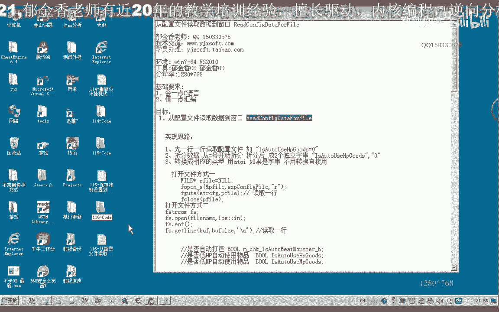
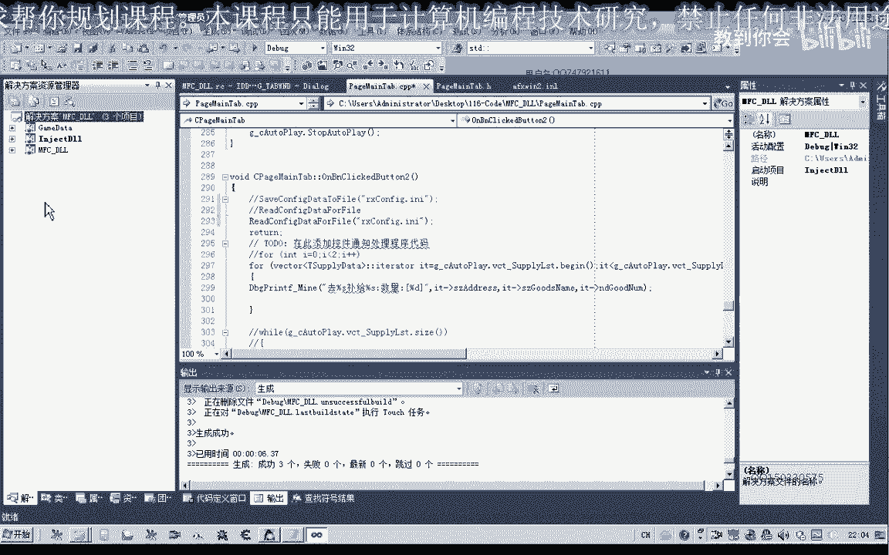
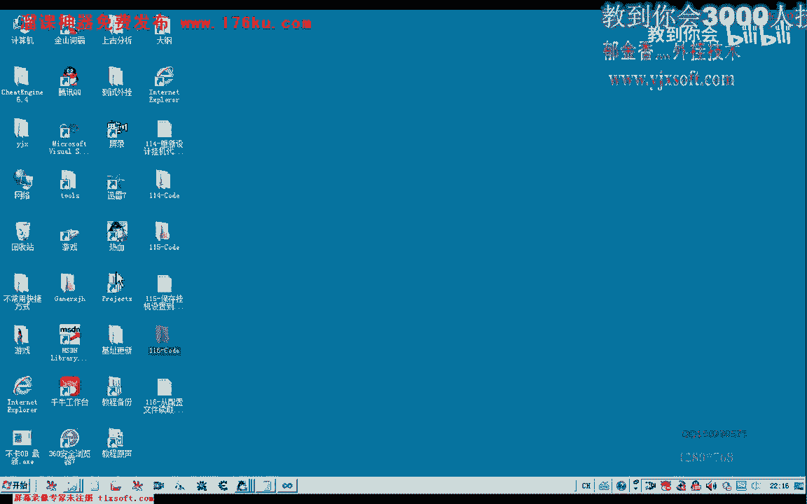

# 课程 P105：从配置文件读取数据到窗口 🗂️➡️🪟




在本节课中，我们将学习如何从上一节保存的配置文件中读取数据，并将这些数据更新到应用程序的窗口中。我们将使用文件流操作来读取文件，解析其中的数据，并最终更新界面控件。

---

## 打开项目与添加头文件

上一节我们介绍了如何将窗口数据保存到配置文件。本节中，我们来看看如何反向操作，将数据读取回来。

首先，打开第115课的代码项目。为了使用文件流进行读取操作，我们需要在文件头部包含相应的头文件。

```cpp
#include <fstream>
```

---

## 实现读取配置文件的函数

接下来，我们在类中添加一个成员函数，用于从指定文件路径读取配置。



以下是实现该函数的核心步骤：
1.  使用 `std::ifstream` 以读取模式打开文件。
2.  循环读取文件的每一行。
3.  对每一行数据进行拆分和解析。
4.  根据解析出的变量名，为对应的成员变量赋值。


```cpp
void YourClass::ReadConfigFromFile(const char* filename) {
    std::ifstream file(filename, std::ios::in);
    if (!file.is_open()) {
        // 处理文件打开失败的情况
        return;
    }

    char buffer[256];
    while (!file.eof()) {
        file.getline(buffer, sizeof(buffer));
        // 处理读取到的每一行数据
        ProcessConfigLine(buffer);
    }
    file.close();
}
```

---

## 解析配置行数据

在 `ReadConfigFromFile` 函数中，我们逐行读取了文件内容。现在，我们需要编写 `ProcessConfigLine` 函数来解析每一行。

配置文件的每一行格式通常为 `变量名=值`。我们需要将其拆分为两部分。

以下是拆分字符串的核心逻辑：
1.  使用 `strchr` 函数查找等号 `=` 的位置。
2.  将等号替换为字符串结束符 `\0`，从而将原字符串分割为变量名和变量值两部分。
3.  移动指针，使变量值指针指向等号之后的位置。

```cpp
void YourClass::ProcessConfigLine(char* line) {
    char* pVarName = line;
    char* pValue = line;

    // 查找等号位置
    pValue = strchr(line, '=');
    if (pValue == nullptr) {
        return; // 格式错误，跳过此行
    }

    // 将等号替换为结束符，分割字符串
    *pValue = '\0';
    pValue++; // 指针后移，指向变量值部分

    // 根据变量名进行赋值
    AssignValueToVariable(pVarName, pValue);
}
```

---

## 根据变量名进行赋值

拆分出变量名和变量值后，我们需要根据变量名将值赋给对应的成员变量。

以下是赋值过程的关键点：
1.  使用 `strcmp` 函数比较变量名。
2.  根据变量类型（如 `int`, `float`, `bool`, `char*`），使用 `atoi`, `atof` 等函数将字符串值转换为相应类型。
3.  为对应的类成员变量赋值。

```cpp
void YourClass::AssignValueToVariable(const char* varName, const char* varValue) {
    if (strcmp(varName, "m_AutoUse") == 0) {
        this->m_AutoUse = (atoi(varValue) != 0);
    }
    else if (strcmp(varName, "m_PlayerName") == 0) {
        strcpy(this->m_PlayerName, varValue);
    }
    else if (strcmp(varName, "m_CoordinateX") == 0) {
        this->m_CoordinateX = atoi(varValue);
    }
    // ... 处理其他变量
}
```

---

## 更新窗口界面数据

所有变量从配置文件读取并赋值完成后，最后一步是将这些数据更新到窗口的各个控件上。

我们可以在 `ReadConfigFromFile` 函数的末尾，调用更新窗口数据的函数。

```cpp
void YourClass::ReadConfigFromFile(const char* filename) {
    // ... 读取和解析文件的代码 ...

    // 文件读取并赋值完成后，更新窗口
    UpdateData(FALSE); // 假设使用MFC，将变量值更新到控件
}
```


---



## 测试与调试

完成代码编写后，进行编译和测试。可以修改配置文件中的值，观察程序启动后窗口控件是否正确地显示了这些值。

例如，将配置文件中玩家名字改为“张三”，坐标改为 (100, 200)，然后运行程序，检查界面是否相应更新。


---

## 总结


本节课中我们一起学习了从配置文件读取数据到窗口的完整流程。我们掌握了使用文件流读取文件、按行解析字符串、根据变量名进行类型转换和赋值，以及最终更新界面控件的方法。通过本课，你实现了程序数据的持久化加载功能，这对于保存用户设置和程序状态非常有用。


对于更复杂的数据（如列表控件），其解析逻辑会更为复杂，可以作为课后练习进行探索。