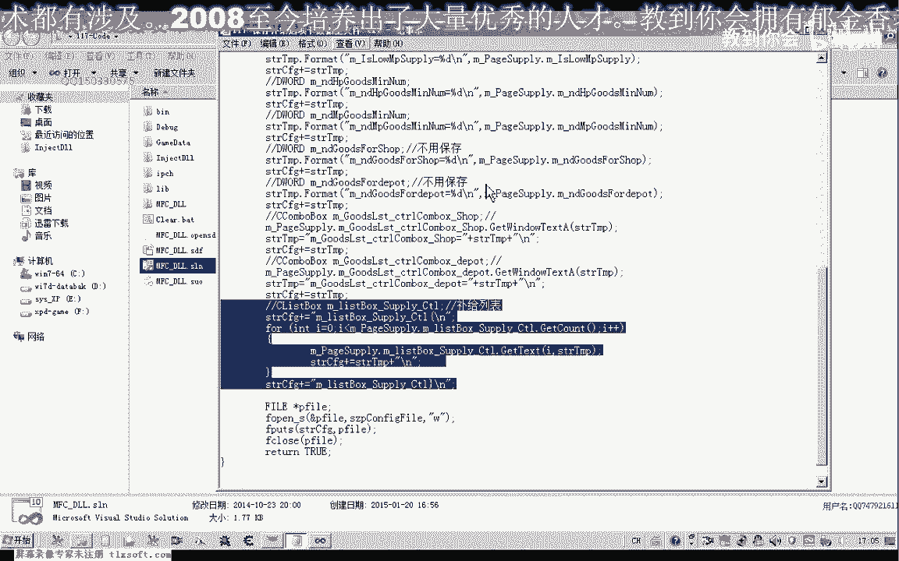
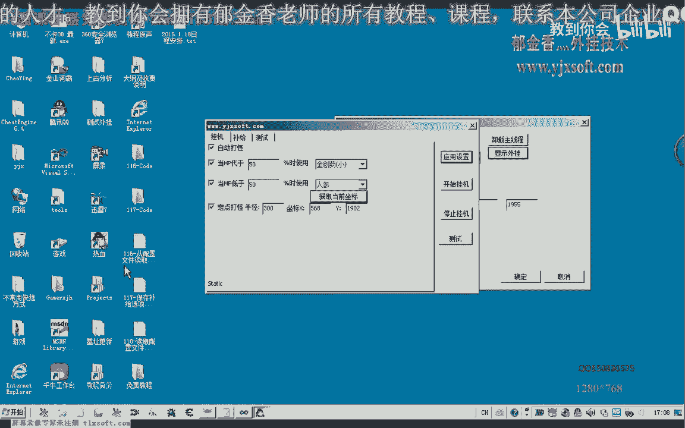

# 课程P106：保存补给选项卡数据至文件 📂


在本节课中，我们将学习如何将第116课中“补给”选项卡界面的数据保存到配置文件中。我们将重点关注如何保存包含多项字符串内容的列表控件，并确保配置文件具有良好的可读性，以便后续修改和读取。

---

## 界面回顾与问题分析

上一节我们介绍了武器界面的数据保存。本节中，我们来看看“补给”选项卡的界面。

打开第116课的代码。补给选项卡中的其他控件，其保存方式与上一节课相同。例如，选中的药品项及其后的数值（整数类型），都可以方便地保存到配置文件，并在读取时根据变量名定位数据。

然而，补给列表控件有所不同。这个变量包含了多项字符串内容，在保存方式上与上一节课存在差异。因此，本节课的重点就是讲解如何保存补给列表，以及后续如何从配置文件中读取这些数据。

需要保存的变量共有九个。我们将依次对这些变量进行操作。

---

## 编写保存配置的代码

我们转到代码的 `save_configure_to_file` 函数中。前面的代码段用于保存“挂机”页面的数据，我们将对其稍作改动，以提高配置文件的可读性和后续读取的便利性。

如果不考虑用户手动修改配置文件，我们可以将控件数据以二进制形式保存。但为了方便用户修改，我们选择以文本格式保存。

首先，我们为“武器”页面添加一个标识。这样在读取时可以方便地定位。

```cpp
// 设计武器页面标识
config_file << "[Weapon Page]" << std::endl;
```

接下来，我们将依次存储这九个变量的值。前面变量的保存方式与之前相同。

对于“补给”页面的数据，我们复制一段类似的代码结构，并替换为对应的变量属性和类名。

最后，我们重点讲解如何保存“补给列表”。因为它包含多项数据，我们需要使用循环来解决。

---

## 处理补给列表的保存

以下是保存补给列表的核心代码逻辑：

首先，我们需要定位列表的开始和结束位置。通过 `GetCount` 方法获取列表项的数量，并循环相应次数。

在循环中，我们获取从零开始的每一项的字符串，并将其添加到总的配置字符串中，每项之后进行换行。

处理完成后，我们添加一个特定的结束标记（例如 `{End of Supply List}`）来表示列表数据结束。这样在读取时，当我们读到这个标记，就知道列表数据读取完毕。

```cpp
// 开始保存补给列表
config_file << "[Supply List Start]" << std::endl;
int itemCount = m_listSupply.GetCount();
for (int i = 0; i < itemCount; ++i) {
    CString strItem;
    m_listSupply.GetText(i, strItem);
    config_file << strItem << std::endl;
}
config_file << "[Supply List End]" << std::endl;
```

在后续读取配置文件时，我们可以设定一个条件判断。当读取到 `[Supply List Start]` 标记时，开始循环读取后续的每一行，并将其添加到列表框中，直到遇到 `[Supply List End]` 标记为止。



---

## 测试与验证



现在，我们进行编译和测试，以验证配置文件是否正确写入。

首先，清空旧的配置文件。然后运行程序并注入游戏。

检查生成的配置文件，可以看到所有数据，包括补给列表，都已正确保存。列表数据以清晰的开始和结束标记包裹，便于识别和解析。

在定位和快速读取时，可以编写一个快速定位函数。例如，先搜索“补给页面”的标识，如果匹配成功，再进行后续的赋值读取操作。这只是一个设计思路的示例，具体实现可根据需求调整。

---

## 总结

本节课中，我们一起学习了如何将补给选项卡的界面数据保存到配置文件。重点掌握了如何处理包含多项数据的列表控件，通过循环和添加特定标记的方式，实现了数据的结构化保存，为后续的读取操作奠定了基础。


下一节课，我们将讨论如何从配置文件中读取这些数据，并完整地还原整个界面。