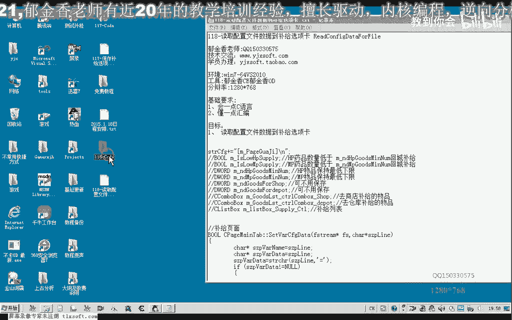
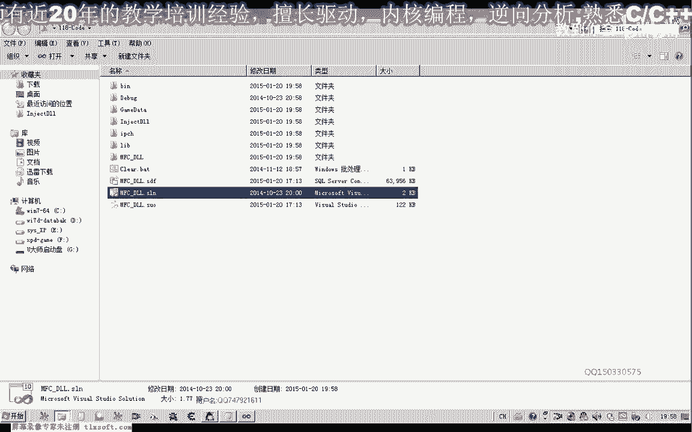
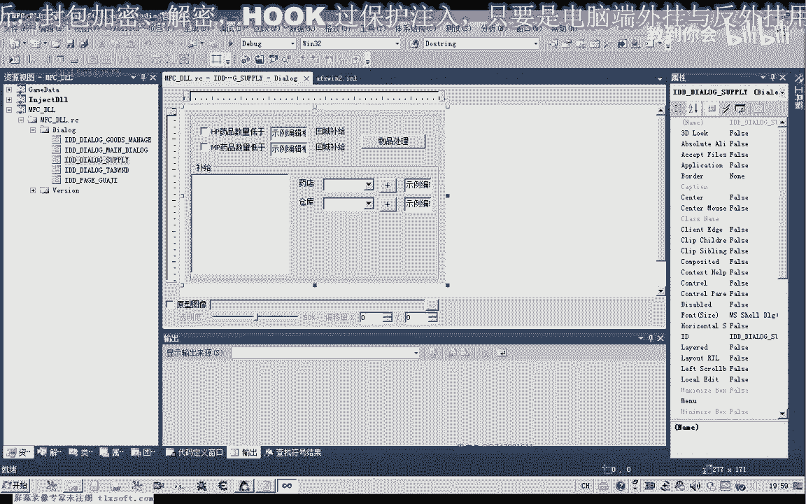
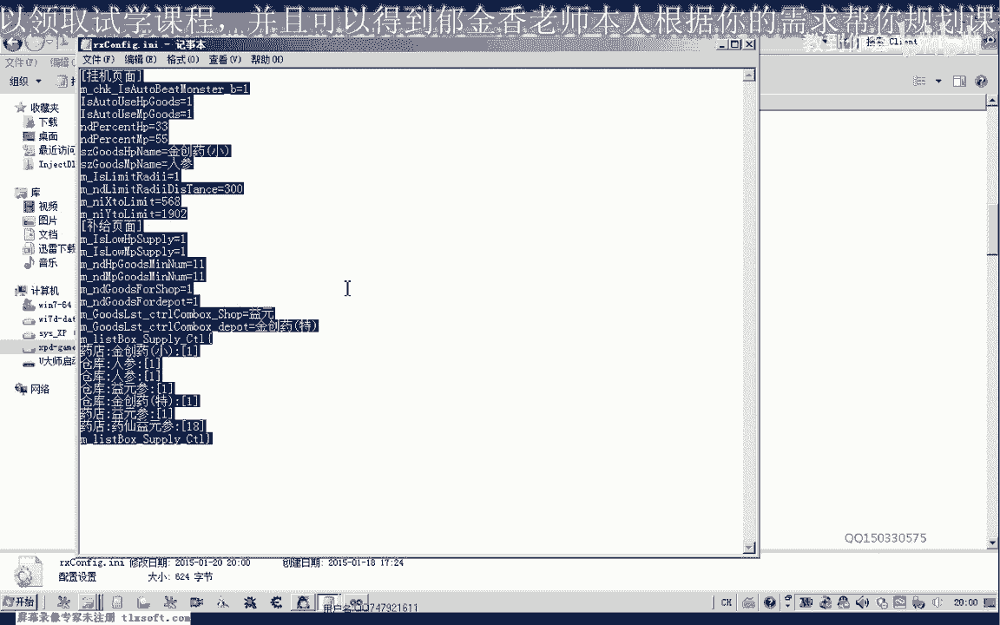
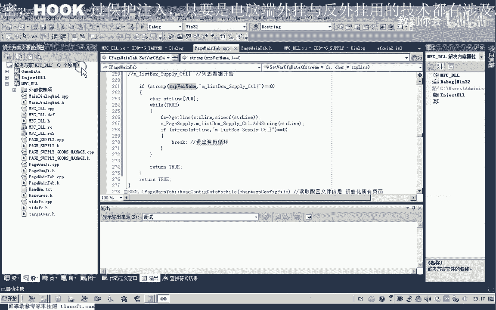
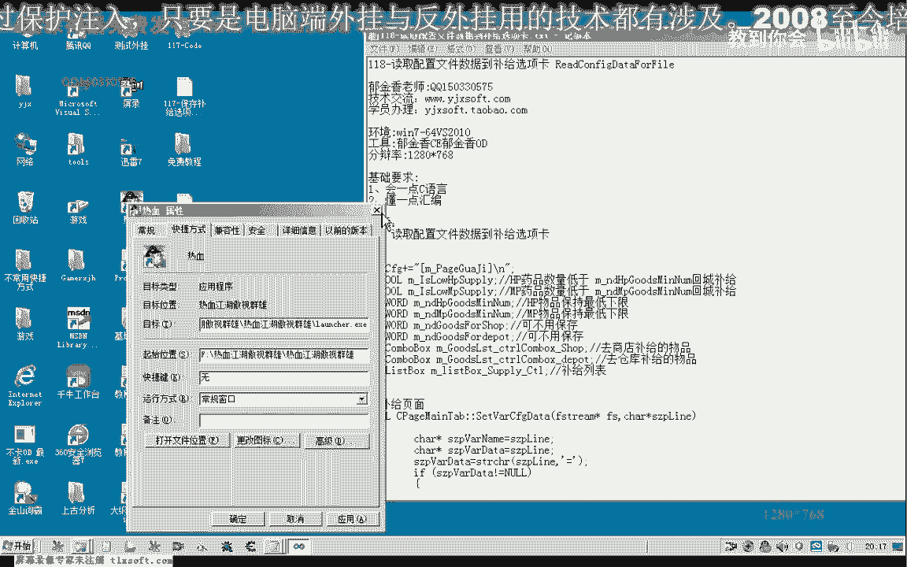
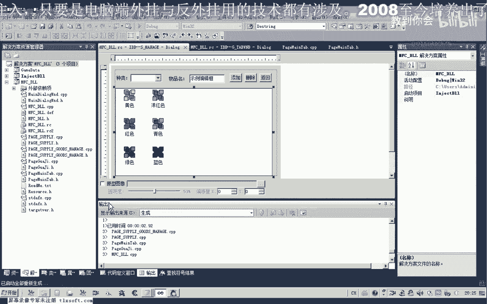
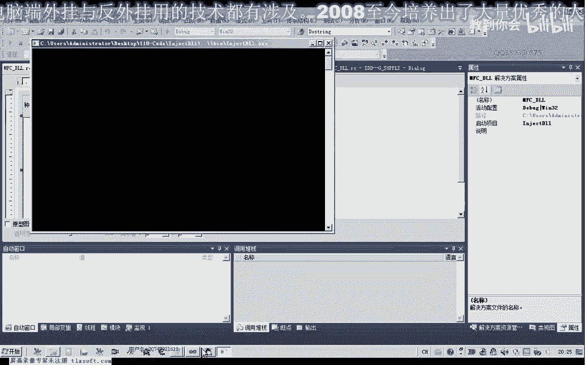
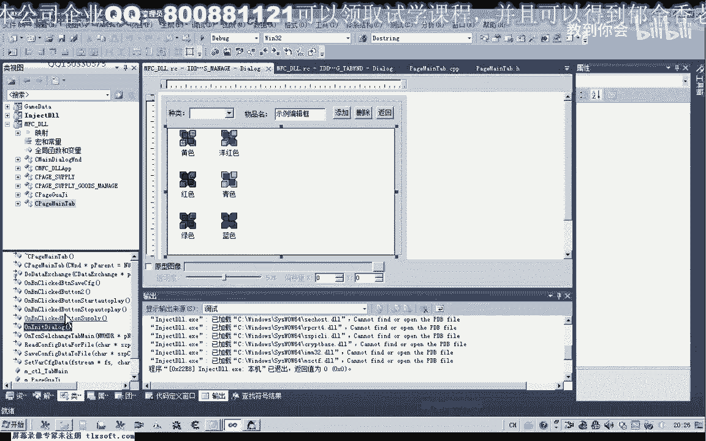
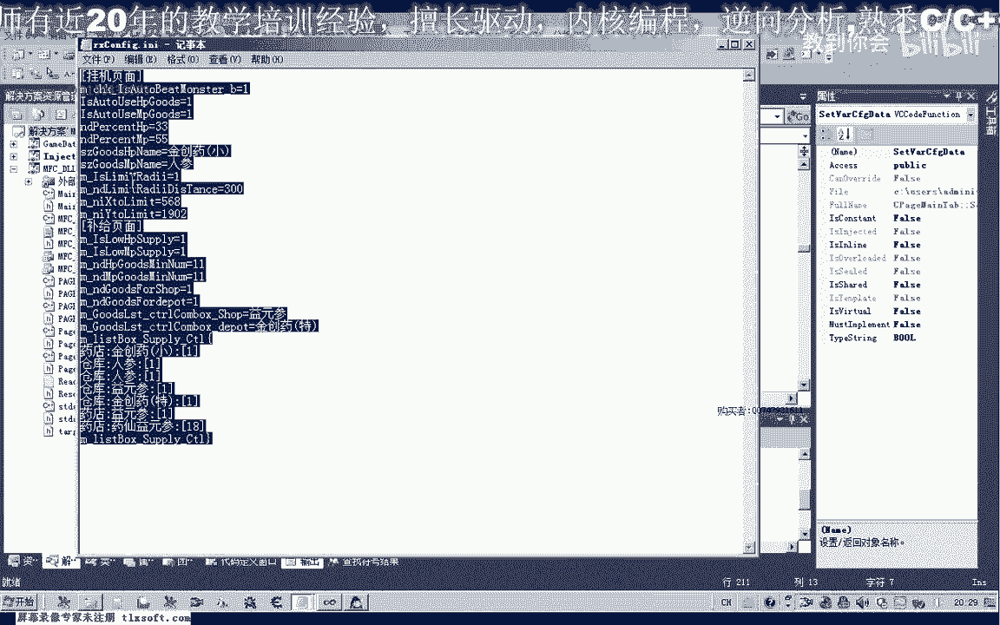

# P107：118-读取配置文件数据到补给选项卡 - 教到你会 - BV1DS4y1n7qF

大家好，我是郁金香老师，那么这节课呢我们一起来看一下，怎么把我们117克的这个保存在配置文件里面的数据呢，更新到我们的笔记啊页面，那么我们首先打开117克的代码。

那么这节课呢我们就要把我们上一节课保存的配置文件里面的数据，来更新到我们的这个窗口界面，用来初始化我们这些啊硬件的相关数据，那么好的，我们首先看看一下哈，上一节课的配置文件的格式。

那么配置文件的话，我们主要的是有一个这个物品的一个列表啊，武器物品的一个列表，因为它的一个大小的话可能是变化的，那么可能这下边的话比如说呃这里是一元三款，第三次改成这里需要有一些改动。

那么可能我们下面的还有我们的呃，其他的野山参呢，嗯还有这个药先医生这一类的，那么我们也可以自己来编辑啊，这个配置文件，那么注意这个格式要对得上，好的，那么我们保存一下，那么这一节课的话，我们要读取的啊。

也就是这个格式的一个配配置文件，那么所以说我们在设计啊这个读取对函数的时候呢。

我们也要按照这个格式来读取，那么我们呃先移动到我们的内，然后我们的这个table哈对，然后我们移到really company代替for file，那么移动到这这里。

那么之前的代码呢我们要需要来进行一些改动，那么主要是我们一行数据的一个处理啊，这个地方，那么这个时候我们读取的话肯定是读取的第一行式的挂机页面啊，那么按照这一行的一个处理的话。

我们是一行数据的一个处理呢，是在这个cctv 2这个函数里边去处理的，但是按照它的一个处理的话，那么我们就要去找这个等号，那么找不到的话啊，我们也要去对这个等号来进行一个写入的一个操作。

那么我们明显来看的话，那这个挂机页面里面呢，它不包含这个等号这一项，那么肯定呢也就查找不到这个等号的字符，那么最后他返回的话，这个指针呢就是一个空指针，那么我们对一个空指针进行一个写作的话。

这里呢它就会报错啊，会让我们的游戏来退出，那么所以说在这里呢我们要呃做一个判断啊，p我要这个我们找到的如果是一个空的一个指针的话，那么我们就啊就不执行相应的这个操作。

或者说找到的这个指针它不是一个空指针，那么呢我们才进行下边的这个操作啊，才进行这一步的一个操作，好的，那么这是这一点啊，这一点我们必须要进行一个相应的一个操作，那么后面的这个比较的话，他都不会来成功啊。

所以说这一点的我们不用操心啊，其他的，那么在前面的话是我们挂机页面的一个处理，那么后边的话这里呢我们添加一个啊5g页面的一个处理读取，或者是，那么我们看一下统计页面，这里啊。

那么补贴页面的话我们需要先定位到这个位置啊，才是我们的这个补给页面啊，那么前面的这一段的话，我们呢可以按照前面的一个类似的一个操作来完成，都是可以的呃，那么只有我们后边的最后这一项啊。

那么这一项呢我们需要进行一个特殊的一个处理啊，需要进行一个特殊的处理，那么前面的这个拆分的一个方式的话也是一样的，那么这里的应当是一原生，那么我们的初始化这里呢需要进行一些更改，转转转转，好的。

那么我们继续退回来到这个呃table dc p p里面，然后之前到这里呢，我们就把前面的这个格式来复制一下啊，然后呢在这个地方来进行我们的一个数据的一个读取，那么在这里的话我们需要处理的数据的话啊。

有这几项，那么我们把它复制一下，那么这几项数据的话是固定的啊，那么所以说我们就固定处理，那么第一个啊我们也需要来进行一个相应的替换啊，啊这个名字来进行一下替换。

那么这里呢我们控件的名字呢也需要进行一个替换页面，那么这个呢我们是我们的补给页面，好的，那么我们接着来往后边，这个位置，好再把这一项呢复制一下，啊，再复制一下这一项，那么就进行一个相应的替换。

那么这两项的话它的类型不一样，那么我们需要改动一下啊，这里这个地方因为它是字符串类型的，那么前面的我们也需要做一个比较，那么比较成功之后呢，这里的话我们需要来就不需要转换了。

就直接复制为相应的这个数据就行了，这个地方，呃这个地方的话我们应当是直接应当是设置window text，好的，那么我们先编译生成一下，他也没有错误，那么后面呢把这一段哈再复制一下，那么这是仓库的啊。

这个相关的这个默认默认设置，那么我们在这里边也进行一个相应的修改就可以了，那么后面呢这是拆分的这个数据啊，数据段很靠后面的这一部分，比如说这个精装要特哈，那么我们就设置为这个相应的呃这个字串啊。

那么前面的都没有问题，那么最后的也就是我们这一段啊，那么我们需要来进行一个单独的一个处理，但是我们中间这个列表的一个长度的话，它不是固定的啊，所以说我们不能像之前这样固定的进行一个处理。

当然我们开始也是要判断的这个条件，那么我们在这里啊添加一个数字，也需要进行一个判断就行，那么呢也是对我们的这个项进行一个判断，那在这里的话就表示我们的呃列表的电表数据开始，那么既然列表数据开始的话。

那么我们这里边呢我们就要对这个列表来进行一个数据的一个添加，八，但是究竟添加什么数据呢，啊在这里的话我们需要来进行呃循环的一个处理，那么在这里的话我们它的一个结束条件我们先要开出来。

在这里呢我们需要进行一个循环的一个处理，那么循环处理的话，这是一个死循环，我们需要一个条件来退出，那么他退出的条件的话就是呢呃偏离到我们的结束，那么也就是他取的函数呢取到了这个位置。

那么我们就退出这个循环，那么如果这个条件成立的话，那么我们就退出去，那么但是在在这里的话，我们要保证的也要一行一行的读取，一行一行的读取，那么一行一行的读取的话，我们一次来重新打开这个文件啊。

获取文件的留到一个支撑，那么第二个办法呢就是从我们之前的这个函数里面呢，把我们的文件留了呃，文件指针呢把它传进来，在这前面这个位置啊，把我们的fs其实呢把它传进了，那么所以说在这里的话。

我们需要对这个函数的话进行了另外的一个定义，转到声明这里啊，首先呢我们进行一个定义，那么这里的话我们还需要来传一个指针处理进来啊，fs的指针，那么需要这个fs指针的一个声明呢。

我们这里呢也需要包含它的这个图文件，那么包含头文件之后呢，我们还需要一个，啊匿名的空间的一个约定啊，调动的啊，然后呢才能够进行一个相应的一个声明，那么当然也可以在这里呢直接加上一个s的。

有一个前缀也可以，那么就不用一个呃，前面的就不用这个命名空间的一个呃，定义好的，那么我们再转到它的定义这个地方，转到定义这个地方的话，我们也需要在这里给它增加一个相应的参数，好的。

那么我们再编译生成一下，那么这个时候的话我们还需要来传一个文件的尺寸进去，再生成一下，好那么在这个时候我们把文件的指针传送进来了之后呢，我们就可以在这个地方呢可以把它利用起来啊，可以把它利用起来。

那么进来之后呢，我们先取得一行，那么这里呢我们需要的呃它有两种格式，一个是掐的类型呢，呃一个有一个结束服务，一个人没有这个结束的一个标志。

那么我们可以参照之前的这个reader computer dentifier，这里来嗯，读取读取我们的一行，好的，那么在这里的话，我们也要加上一个文件结束的一个判断，实际上文档按ctrl减号啊，再退回。

当然这里是用指针的一个操作，我们需要改一下，那么这个这个还是批判呢，在这里的话它没有定义，我这里有一个呃三个p line，那么我们在这里的话需要另外定义一个函数s t r l，那么在它之前呢。

我们定一个临时变量啊，或者是定一个块变量也可以啊，那么我们就有两嗯200个字节的一个快变量，用来取得一行的这个数据，那么取得这一行之后呢，我们就可以了，在这里呢把它添加到我们的这个列表里边啊。

当然它这一行肯定是存在的啊，所以说我们这里的话也可以不添加一个文件的一个结尾的一个说明啊，因为这这个在我们写的时候肯定存在这一行，那么这个条件呢肯定能够达成嗯。

那么这样的话就能够完整读取我们的这个整个哈这一块列表的，这个数据啊，那么我们编译之后呢，来测试一下，好的，那么我们转到，转到资源窗口测试啊这里，然后呢我们读取我们的这个相应的配置文件，再次生成一下。

那么我们转到我们的这些数据来，相当于都是没有初始化的，我们都可以啊，相当于没有初始化，然后呢我们点一下测试啊，呃那么我们看一下这前面的初始化是正确的，那么到这里的话，这一串数据呢呃应当是出错了啊。

应该是出错了，那么我们这里边的啊，这些相应的数据呢都没有进行更新，那么我们把它关掉之后来检测一下原因，那么我们发现的话，这里的话我们还应该有一个ipage supply。

那么我们要把变量里面的数据要更新到我们的窗口啊，这是第一点，那么我们再再次生成一下，好那么我们不去问啊，再测试一下，那么这些呢我们都成功了，但是取得这个列表的信息呢，这里没有成功，那么我们再来看一下呃。

我们的是什么地方失误了，那么也可能我们这个循环呢它没有没有达成，就是我们设置数据在里，那我们再来看一下文件指针的一个操作，那么在这里的话看样子的话应当是我们的这个哦，这里是写入的3s p2 哈。

我们当时s t r啊啊啊这个变量传入的不对啊，说明所以说这个地方呢它取取得的这个字串的数字的话肯定就不对了，好的，那么我们再来看一下，嗯那么这个时候好像是出错了吧，一直在循环，应当是一个死循环。

在这个地方，那么他这个条件的最终的这个这里我们的判断的条件呢出错了，领导是这个地方条件的一个判断出错了，那么在这里的话我们应该用s t r lt来进行一个判断，因为我们之前的在这个参数的话。

它会一直是这个变量啊，不会改动啊，因为在这里呢我们也没有改动它，那么所以说在这里的话比较的时候，我们一行一行的数据读读出来了啊，是用这个s t r lm来做一个结束的一个条件的一个判断。

那么如如果用这个材质p5 r类人类的话，那么所以说他这个结束的条件呢一直不会达成，那么这里的话就会造成一个呃这个死循环啊，所以说最终出错了，好的，那么我们再次改动之后呢。

嗯再再次打开游戏来看一下。

好的，那么我们再次输入，那么这个一旦设计的不对的话，可能就容易出错啊，要注意检查自己的代码了，那么这个时候呢也有一个错误，那么这一行的话他把这个多余的数据呢也添加进去了，其他都没有错，呃。

那么我们还需要对我们的代码来进行一下啊更改，那么这个条件的话，我们应当放在它的前面啊，那么应该放在这个位置，那么一旦呢呃是这个列表结束的时候呢，他就退出了，就不会添加我们这一行啊，好的，好的。

那么在这个时候的话，我们的这个所有数据都是正确的啊，那么当然这些数据的话，我们也会来呃把它抱保存到我们的这个配置列表里面啊，做了这个相应的这个改动，那么现在我们就这两个函数写好之后呢。

我们就需要来把它添加在我们的这个初始化的呃，相应的位置就行，那么这个应用设置这里呢我们就是什么呢，是宅舞啊，最后的时候呢我们就是保存我们的这个配置啊，调用我们的save config。

那dt fidentifile啊，这里呢我们csp config，那么我们看一下最新的啊，这个地方的一个红的一个定义，啊那么我们把这一段做成一个红的一个定义，把它移到前面。

那么我们进行一个红来代替我们的这个字串，这样的话我们只需要改一个地方就可以了，好的，那么我们就到他的程度，那么这里呢我们也可以把它改一下，好的测试成功了之后呢，我们把这两个函数来看剪切一下呃。

应用设置的时候呢，我们需要保存一下这个相应的位置，移到最后，好读取的这个呢我们需要呢呃呃这个时候应该是保存，那么读取的时候呢应当是我们这个外挂窗口加载的时候呢，我们就读取读取的时候的话。

那么读取呢我们可以把它添加到这个类的初始化函数的这里哈，那么最后这个测试的后边呢，那么我们就添加这个读取的这个函数啊，好的那么我们再次重新生成一下，当然我们也可以在在这里边呢添加我们的这个显示外挂。

这里呢我们可以再添加两个按钮按钮，一个是保存设置呃，一个是我们载入这个设置都是可以的啊，再入一个默认的一个设置，一个是保存我们的这个页面的一个配置啊，可以添加这两个案例，当然应用这个设置的话。

就相当于把我们的这个呃配置文件能保存到，就是把我们这个窗口界面的这个信息保存到我们的文件里边了啊，另外呢还有一个呢就应当是载入我们的一个呃默认的一个设置啊。

那么这里的话我们可以写写成哈载入默认的一个配置，在于设置，咳咳咳，差，嘟嘟嘟好，那我们再检测一下相应的，当然这个时候的话我们只有两个页面，一个是我们的挂机页面，可以在日，那么另外一个呢是界面，好的。

那么其他的话其他的代码呢大家自己下去完成一下，那么其他的还有一个这个物品的一个页面啊，当然这里的呃主要的复杂一点的，也就是我们的这个物品处理的这个列表啊，它的一个呃设置的话要相应的要复杂一点。

可以单独的另外建一个配置文件来进行一个数据的一个载入啊，它也是一行一行的数据，碰到几个像啊，这个时候呢我们再入的时候呢，需要把它拆分一下，也需要。

那当然也可以我们每一个单元的这个数字来给它单独的设置成一行，这样的载入也可以了，好的，那么这一节课我们暂时呢就就讲到这里，那么我们下节课再见，那我们还需要重新把它编译一下。

啊这个时候的话坐标这些就会在如上一次的这个坐标的一个数字，当然后边这里的话它也会自动载入这些配置的这个数据了，这个列表呢它也会自动的进行一个初始化，那么这里呢我们也可以保存它的一个设置。

那么我们也可以取消之后呢，再次再用这个设置，但是我们发现多次在用这个设置的时候呢，有一定有一些地方呢它就出错了啊，这个列表里边的主要是这个列表呢它没有清空啊，那么这一点我们需要注意啊。

那么每多再读一次来这里面的数字呢它就会增加，那么我们还有一个缺点的话，应该是要在呃这个读取数值的时候呢。

需要进行相应的一个清空的一个操作好的，那么我们，再次转到我们的这个city config，对t0 ，你到这个循环列表，那么在这个位置的话，我们还需要来进行一个操作，也就是要清空的一个操作，这个控件。

那么载入配置文件的话，这里呢我们要肯定，哈哈，那么这里呢我们reset一下相应的一个数据，好的，那么我们再次编译生成，好这次我们载入一下相应的设置，那么这个时候的话它就不会出现这个相应的这个错误了。

应用设置啊，这个时候呢再再做也是可以的好的，那么这节课呢我们就交流到这里。

