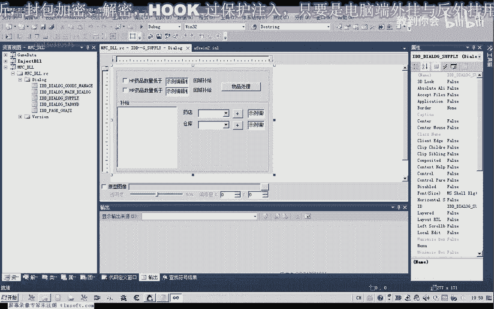
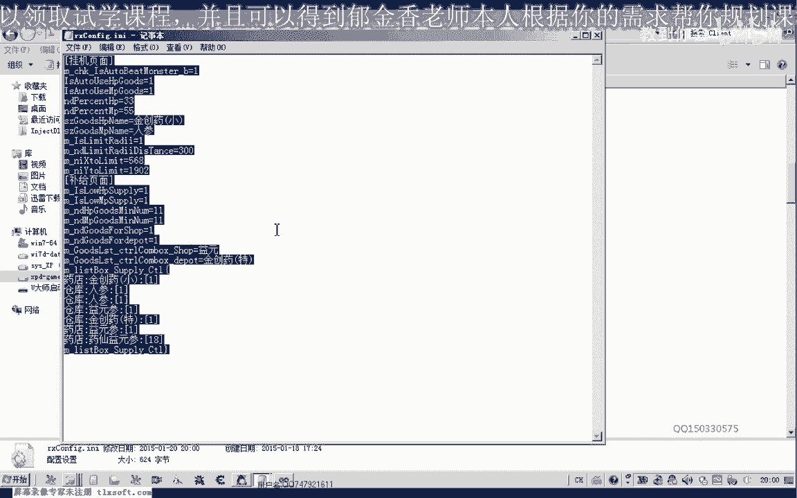
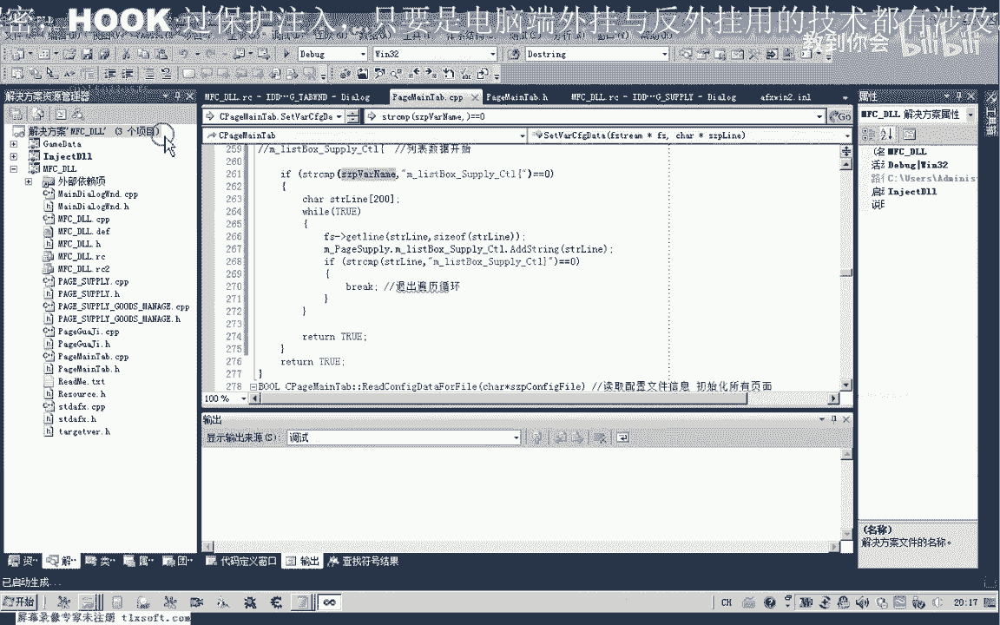
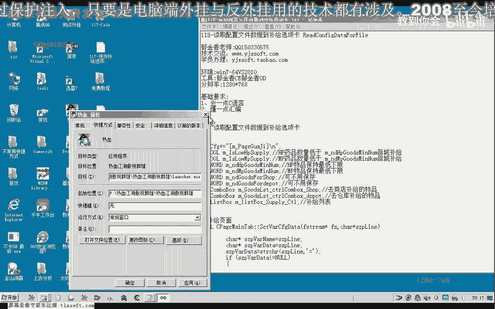
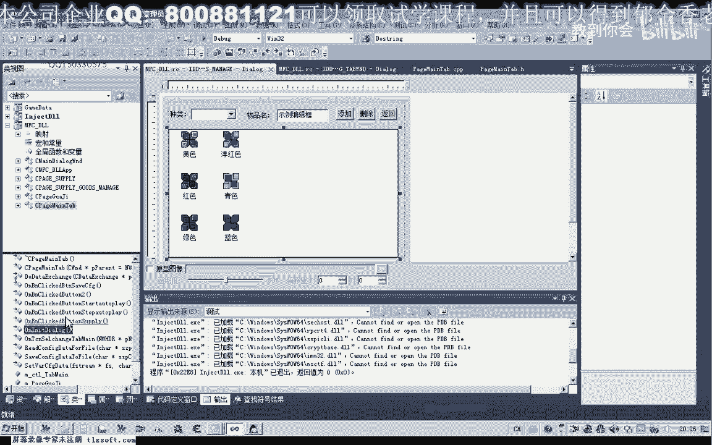

# 课程 P107：118 - 读取配置文件数据到补给选项卡 📂➡️📝


在本节课中，我们将学习如何将上一节课（P117）保存在配置文件中的数据，读取并更新到外挂程序的“补给”选项卡界面中，用于初始化相关的硬件数据。



---



## 配置文件格式回顾 📄

上一节我们介绍了如何将数据保存到配置文件。本节中我们来看看配置文件的格式，以便正确读取。

配置文件主要包含一个武器物品列表，其大小可能变化。列表下方可能包含其他物品，如“野山参”、“药仙医生”等。用户可以自行编辑配置文件，但必须确保格式正确。

以下是配置文件的核心格式示例：
```ini
[挂机页面]
坐标X=100
坐标Y=200
[补给页面]
物品1=精装药特
物品2=野山参
物品3=药仙医生
```

本节课的任务就是读取这种格式的配置文件。

---

## 修改读取函数以适应新格式 🔧

为了读取新的配置文件格式，我们需要对现有的 `ReadConfigFromFile` 函数进行修改。主要改动在于对每一行数据的处理逻辑。

之前的代码在 `CConfigDlg::OnInitDialog` 函数中处理数据行，其逻辑是查找“=”号并进行分割。然而，“挂机页面”这样的节标题行并不包含“=”号。如果找不到“=”号，相关指针会变为空指针（`NULL`），后续的写入操作会导致程序崩溃。

因此，我们必须添加一个判断：只有在找到的指针**不是空指针**时，才执行后续的分割和赋值操作。这样可以安全地跳过节标题行。

---

## 处理“补给页面”的数据 📦

上一节我们介绍了通用行的处理逻辑。本节中我们来看看如何专门处理“补给页面”的数据。

“补给页面”的数据结构较为特殊，尤其是最后的物品列表，其长度不固定。因此，我们不能像处理固定项那样进行硬编码。

以下是处理“补给页面”的步骤：

1.  **定位到“补给页面”节**：首先，我们需要在读取文件时，定位到 `[补给页面]` 这一行。
2.  **处理固定项**：节标题之后，有几行固定的配置项（如某些特定物品的默认设置）。这些可以像之前一样，通过查找“=”号、分割字符串并赋值给对应控件来处理。
3.  **处理动态列表**：固定项之后，就是动态的物品列表。这是我们需要重点处理的部分。

为了处理这个动态列表，我们需要进入一个循环。循环的**退出条件**是读取到文件结尾，或者读取到下一个节标题（如 `[其他页面]`）。在循环体内，我们逐行读取数据，并将每一行作为一个新项添加到列表控件（如 `CListCtrl`）中。

这里的关键是，我们需要将文件指针（`FILE*` 或 `CStdioFile`）传递给处理列表的函数，以便它能连续读取行，而不是每次都重新打开文件。

---

## 代码实现与调试 🐛

根据上述思路，我们对代码进行了修改。主要改动包括：

*   在分割字符串前，增加了对空指针的判断。
*   修改了 `ReadConfigFromFile` 函数的签名，使其能接收文件指针参数。
*   在读取“补给页面”时，使用 `fgets` 或类似函数逐行读取。
*   使用循环来读取动态列表，直到满足退出条件。



在初步测试时，我们遇到了问题：列表数据没有成功加载。经过调试，发现原因如下：



1.  **变量更新遗漏**：读取数据后，需要调用 `UpdateData(FALSE)` 将成员变量中的数据更新到窗口控件上。
2.  **循环条件错误**：在处理动态列表的循环中，结束条件判断有误。我们错误地使用了不变的缓冲区地址进行比较，导致循环无法退出，形成死循环。修正方法是使用每次读取后更新的行内容字符串进行比较。
3.  **多余数据添加**：循环结束的判断应放在添加列表项的操作**之前**，否则会把结束标记行本身也当作数据添加进去。
4.  **列表未清空**：每次读取新配置前，没有清空列表控件，导致多次读取后数据累积。需要在读取函数开始时，调用列表控件的 `ResetContent()` 或 `DeleteAllItems()` 方法进行清空。

修正这些问题后，配置文件的数据就能正确读取并显示在“补给”选项卡界面中了。

---

## 集成到程序流程中 🔄

函数修改调试完成后，我们需要将其集成到程序的初始化流程中。

*   **保存设置**：在用户点击“应用设置”按钮时，调用 `SaveConfigToFile` 函数，将当前界面设置保存到配置文件。
*   **读取设置**：在外挂窗口初始化（例如 `OnInitDialog` 函数）时，调用 `ReadConfigFromFile` 函数，自动载入上次保存的配置。
*   **可选功能**：为了更方便，可以在界面上添加“载入默认配置”和“保存当前配置”两个按钮，分别调用读取和保存函数。

对于程序中其他类似的复杂页面（如单独的“物品页面”），也可以采用相同的思路：为它们建立独立的配置文件节，使用循环读取动态列表。


---


## 总结 📚

本节课中我们一起学习了如何从配置文件中读取数据，并更新到程序的“补给”选项卡界面。我们重点掌握了：



1.  分析配置文件格式，并据此设计读取逻辑。
2.  修改读取函数，增加安全性判断（空指针检查），避免程序崩溃。
3.  处理包含动态列表的复杂数据结构，使用循环逐行读取。
4.  将读取和保存功能集成到程序的初始化与设置流程中。
5.  通过调试解决了数据未更新、死循环、列表累积等常见问题。


通过本课的学习，你的程序现在具备了完整的配置持久化能力，可以记住用户的设置了。