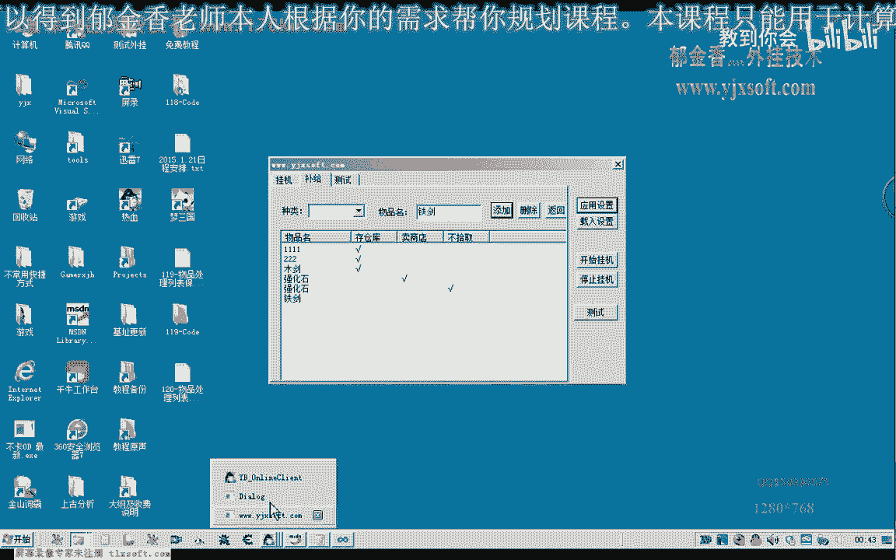
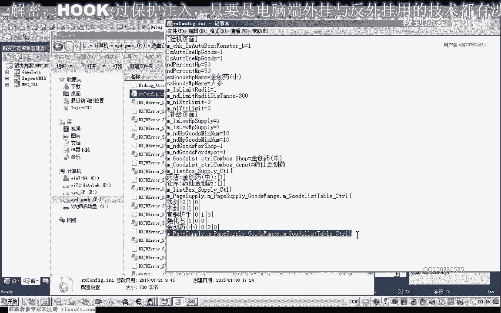

# 课程 P108：物品处理列表保存 💾

在本节课中，我们将学习如何将物品处理列表的信息保存到配置文件中。我们将设计一种数据格式，用于存储物品名称及其对应的处理选项（如存入仓库、出售等），并编写代码实现数据的写入功能。

---

## 概述

上一节我们介绍了物品处理列表的界面设计。本节中，我们来看看如何将用户在列表中设置的数据持久化保存到本地配置文件中。核心思路是设计一种特定的字符串格式，将表格的每一行数据序列化后写入文件，以便后续程序启动时能够重新加载。

## 数据格式设计

为了清晰地区分和读取数据，我们设计以下保存格式：
*   **起始标记**：在物品列表数据块的开头，写入一个特定的起始字符串，例如 `[ItemListStart]`。
*   **数据行格式**：每一行数据代表一个物品及其处理设置。格式为：`物品名称|选项1|选项2|选项3`。其中，`|` 是分隔符，选项通常用 `0`（未勾选/否）或 `1`（已勾选/是）表示。
*   **结束标记**：在所有物品数据写入完毕后，添加一个结束标记，例如 `[ItemListEnd]`。

这样，在读取时，程序可以先定位起始标记，然后逐行读取并解析，直到遇到结束标记为止。

## 代码实现：写入配置文件

以下是实现保存功能的核心代码步骤。我们将在保存配置的函数（例如 `SaveConfigToFile`）中，找到写入其他列表（如技能列表）的代码位置，并在其后添加物品列表的保存逻辑。

首先，我们需要获取指向物品列表控件（假设为 `CListCtrl` 类型，变量名为 `m_listItem`）的指针，以便操作其内容。

```cpp
// 假设在保存配置的函数中
CString strConfig; // 用于累积所有配置信息的字符串

// ... 其他配置的保存代码 ...

// ========== 开始保存物品列表 ==========
strConfig += _T("[ItemListStart]\r\n"); // 添加起始标记并换行

// 获取列表控件指针（假设通过类成员变量访问）
CListCtrl* pList = &m_listItem;
int nItemCount = pList->GetItemCount(); // 获取列表中的总行数

// 循环遍历列表的每一行
for (int y = 0; y < nItemCount; y++)
{
    CString strLine; // 用于保存当前行的数据
    // 1. 获取物品名称（第0列）
    CString strItemName = pList->GetItemText(y, 0);
    strLine = strItemName + _T("|"); // 物品名后添加分隔符

    // 2. 循环处理后面的选项列（假设第1, 2, 3列是勾选框）
    for (int x = 1; x <= 3; x++)
    {
        CString strValue = pList->GetItemText(y, x);
        // 判断该单元格是否被勾选。通常，勾选框被勾选时，GetItemText返回非空字符串（如"1"或"√"）。
        if (strValue.IsEmpty()) // 为空表示未勾选
        {
            strLine += _T("0");
        }
        else // 非空表示已勾选
        {
            strLine += _T("1");
        }
        // 如果不是最后一列，添加列分隔符
        if (x < 3)
        {
            strLine += _T("|");
        }
    }
    // 当前行数据处理完毕，添加到总配置字符串并换行
    strConfig += strLine + _T("\r\n");
}
// 所有行处理完毕，添加结束标记
strConfig += _T("[ItemListEnd]\r\n");
// ========== 物品列表保存结束 ==========

// ... 后续将 strConfig 写入配置文件的代码 ...
```


**代码解释**：
1.  `GetItemCount()` 获取列表的总行数。
2.  外层 `for` 循环遍历每一行。
3.  `GetItemText(y, x)` 获取第 `y` 行、第 `x` 列的文本内容。对于勾选框列，勾选状态会以特定文本（如”1″）表示。
4.  内层 `for` 循环处理第1到第3列（选项列），根据单元格是否为空来判断勾选状态，并拼接成 `0` 或 `1`。
5.  每一行数据拼接完成后，加上换行符 `\r\n` 追加到总配置字符串中。
6.  最后，在物品列表数据块末尾加上结束标记。

## 功能测试


编写完代码后，需要进行测试以确保数据能正确保存。


1.  在程序的物品列表中添加几行数据，例如：
    *   物品：铁剑，选项：出售。
    *   物品：强化石，选项：存入仓库。
    *   物品：金创药，选项：不处理。
2.  点击“保存”或“应用设置”按钮，触发保存代码。
3.  打开生成的配置文件，检查内容。正确的格式应类似于：
    ```
    [ItemListStart]
    铁剑|1|0|0
    强化石|0|1|0
    金创药|0|0|0
    [ItemListEnd]
    ```
    这表示“铁剑”的第1个选项（如“出售”）被勾选，其他未勾选；“强化石”的第2个选项（如“存仓库”）被勾选。



如果文件内容符合预期，则证明保存功能工作正常。如果写入失败或格式错误，需要检查代码中的字符串拼接逻辑和文件写入操作。

---

## 总结



本节课中我们一起学习了如何将物品处理列表的数据保存到配置文件。我们首先设计了一个包含起始标记、数据行和结束标记的清晰格式。然后，通过编写代码遍历列表控件，将每一行的物品名称和勾选状态序列化为字符串，并最终写入文件。下一节课，我们将实现相反的过程：从配置文件中读取这些数据，并重新填充到物品列表控件中，完成数据的持久化闭环。