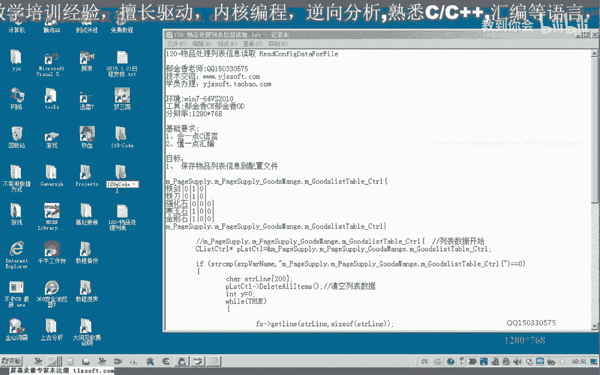
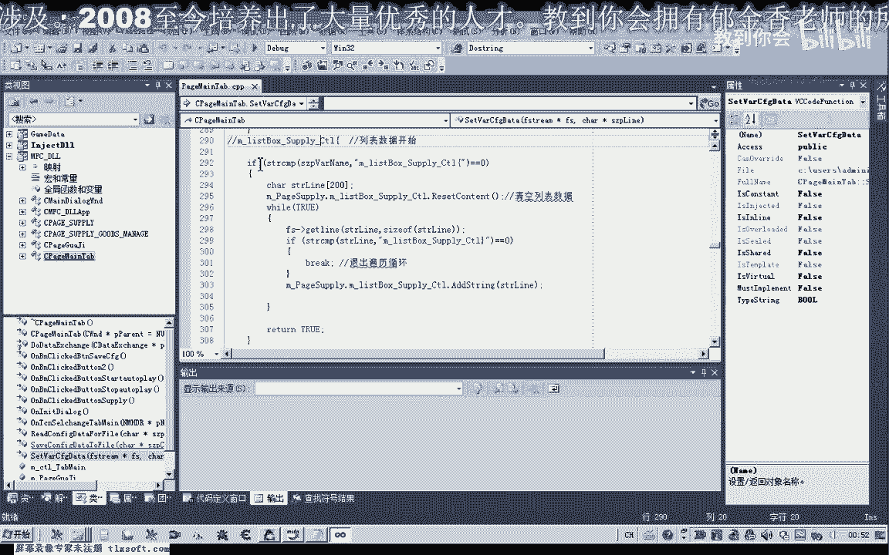
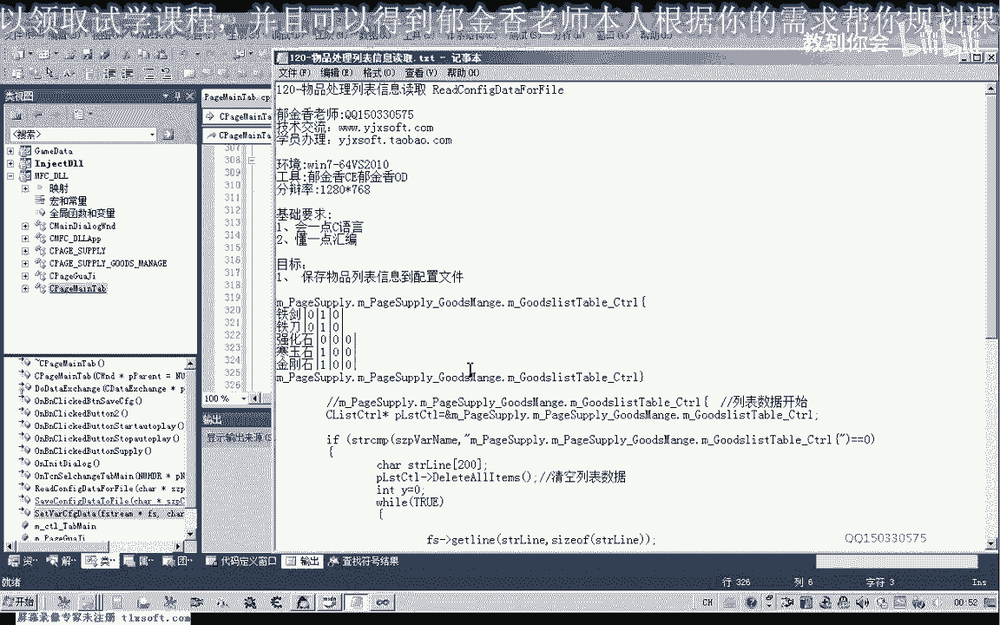
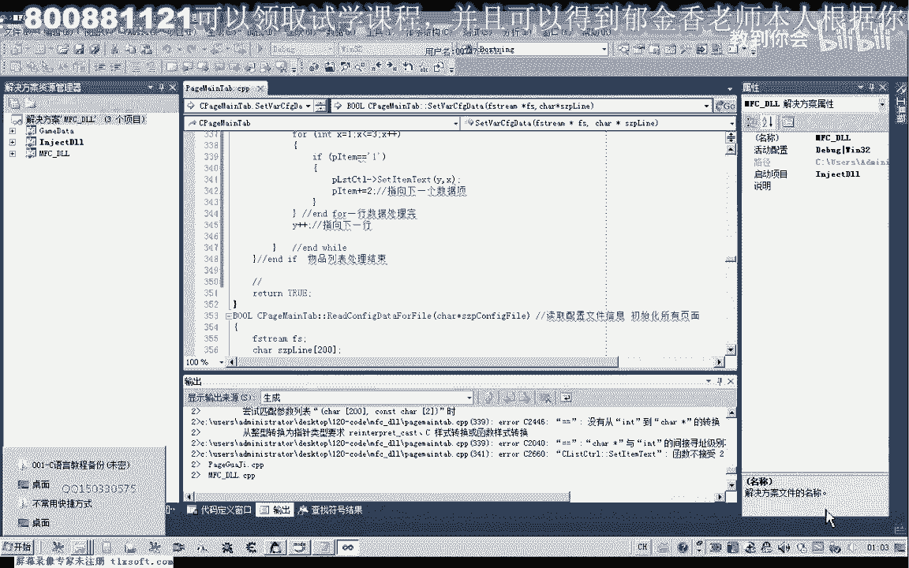
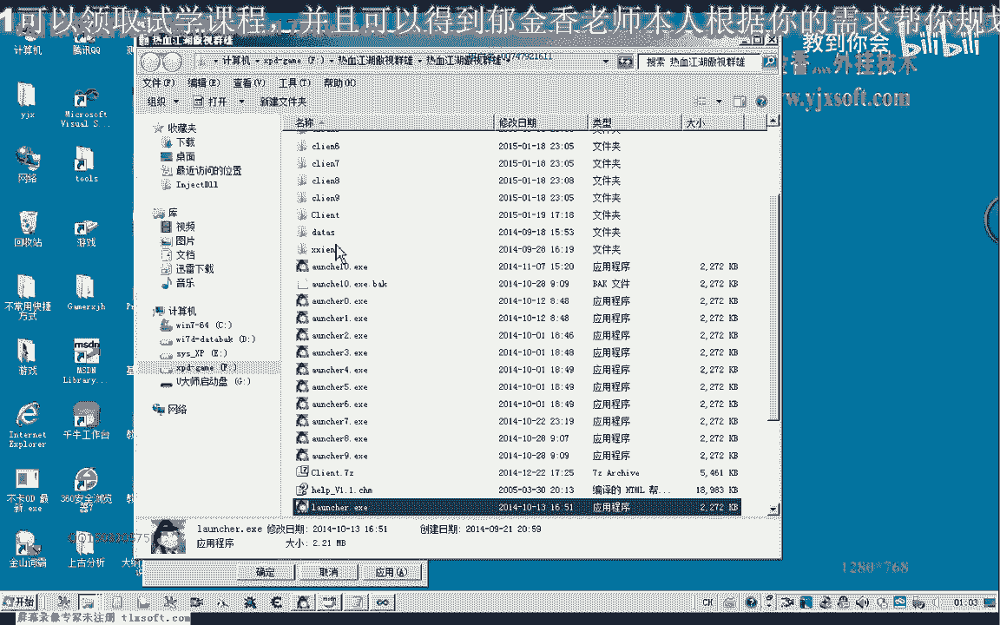
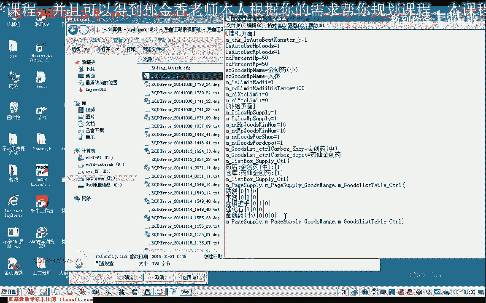
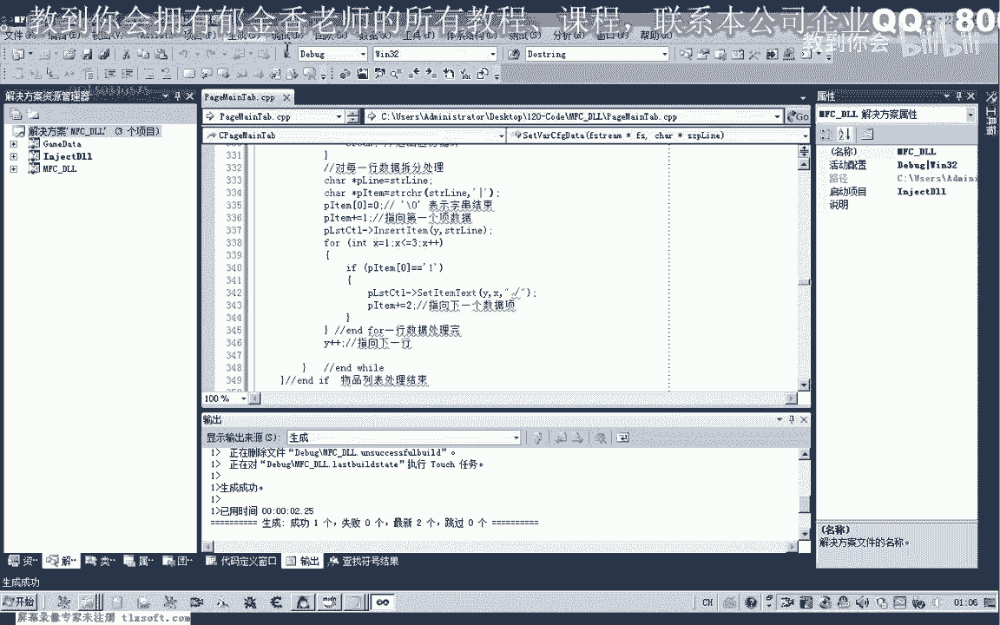
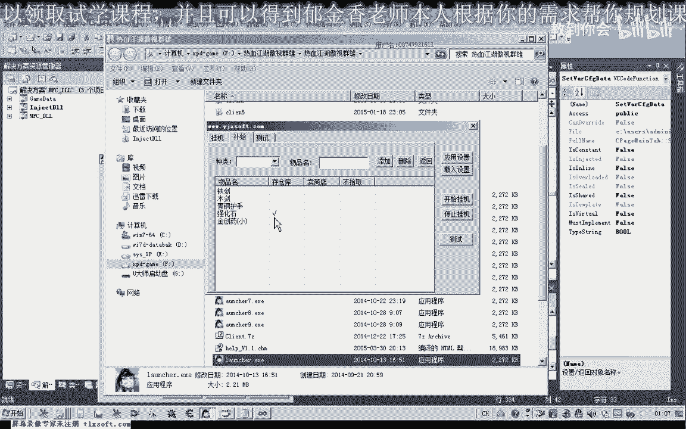
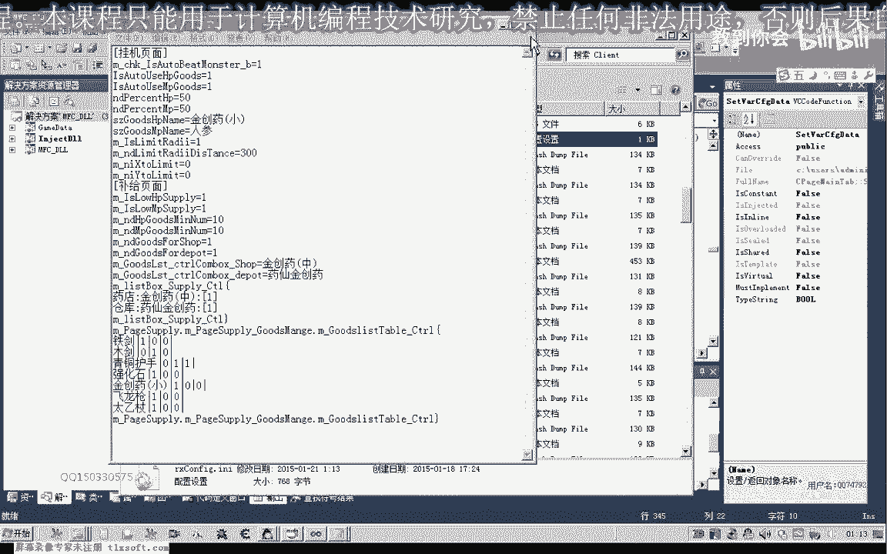

# 课程P109：120-物品过滤列表信息读取 📖

在本节课中，我们将学习如何从配置文件中读取物品过滤列表的信息，并将其正确地加载到程序界面中。我们将基于上一节课保存的配置文件结构，编写代码来解析数据并填充表格控件。

---

## 概述

上一节我们介绍了如何将物品处理列表的信息保存到配置文件中。本节中，我们来看看如何从该配置文件中读取这些信息，并还原到程序的列表控件中。

首先，我们打开上一节课（119课）的代码。

我们转到 `main` 函数内部。

转到 `LoadConfig` 函数。这里是我们对每一行读取出来的数据进行处理的地方。我们移到最后。

该操作与我们之前处理列表数据的代码有类似之处。因此，我们可以将之前处理列表的那段代码复制过来。

需要取消掉 `return` 语句。我们把前面的数据复制过来，并按照配置文件的格式进行一些改动。

## 定位数据起始与结束

首先，我们需要判断读取的起始位置。如果读取到的行名等于特定字符串，说明我们定位到了“物品处理列表”的起始位置。

结束条件与之前代码中的结束条件相同。

## 数据读取与处理

数据读取的逻辑是相同的。不同的地方在于对每一行数据的处理，以及对控件清空的操作。

以下是处理流程的核心步骤：

1.  **定位控件**：首先用一个指针指向我们的列表控件。
2.  **清空控件**：在载入新数据前，清空表格中的所有项。
3.  **读取并解析行数据**：从文件读取一行数据。判断是否到达结束标记，如果是则退出循环，否则继续处理。
4.  **拆分数据**：定义指针变量，指向读取的字符串缓冲区。使用分隔符（如逗号）将字符串拆分为物品名和后续的数据项。
    *   代码示例：`pItemName = strtok(lineBuffer, ",");`
5.  **处理物品名**：分隔出的第一个字符串是物品名，将其插入表格的第一列。
6.  **循环处理后续数据项**：后续有三项数据（例如，是否存仓库、是否使用等）。我们用一个 `for` 循环来处理。
    *   指针 `pData` 指向第一个数据项（`0` 或 `1`）。
    *   在循环中判断 `pData` 指向的字符是否为 `'1'`。
    *   如果是 `'1'`，则对表格中对应的项进行设置（例如，勾选复选框）。
    *   处理完一项后，将指针 `pData` 向后移动两个字符（跳过当前数据和分隔符），指向下一个数据项。
7.  **更新行索引**：每处理完一行数据，将行索引 `y` 加一，以便下一行数据插入正确的位置。

## 调试与修正

在初步编写代码后，运行程序发现数据未能正确读取。通过添加调试信息和分析，发现了一个逻辑错误。

**问题**：在判断数据项是否为 `'1'` 的 `if` 语句内部，才移动指针到下一项。这意味着如果数据项是 `'0'`，指针就不会移动，导致程序一直判断第一项，后续项无法被处理。

**解决方案**：将移动指针到下一项的操作 `pData += 2;` 移到 `if` 判断语句的外面。这样无论当前项是 `'0'` 还是 `'1'`，处理完后都会指向下一项。

修正代码后，重新编译运行。

再次检查配置文件，确认物品名读取正确，但勾选状态仍不对。检查代码执行流程后，确认了上述指针移动的逻辑错误，并进行了修正。

修正后，程序成功从配置文件读取了所有物品及其设置（如“铁剑”、“强化石”等），并正确地在表格中显示了勾选状态。

我们可以修改表格中的选项，点击“应用设置”保存，然后点击“载入设置”，界面会恢复为配置文件中的状态。如果配置文件损坏或格式错误，载入时程序会进行相应的初始化。

## 总结

本节课中，我们一起学习了如何从配置文件读取物品过滤列表信息。我们实现了以下关键步骤：
1.  定位配置文件中特定数据段的起始和结束。
2.  清空目标控件并逐行读取数据。
3.  使用字符串分割和指针操作解析每行数据。
4.  将解析出的物品名和状态数据填充到表格控件中。
5.  通过调试解决了指针移动的逻辑错误，确保了所有数据项都被正确处理。

至此，关于配置文件读写物品过滤列表的相关内容就讲解完毕了。

