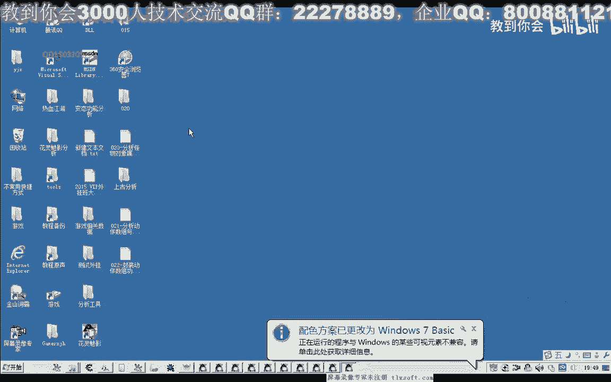
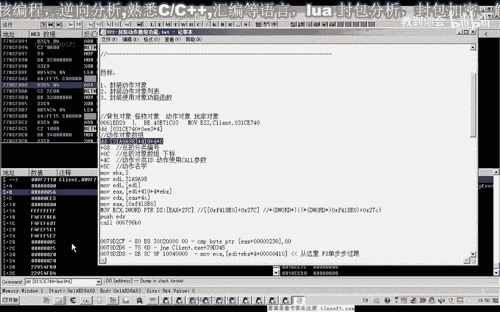
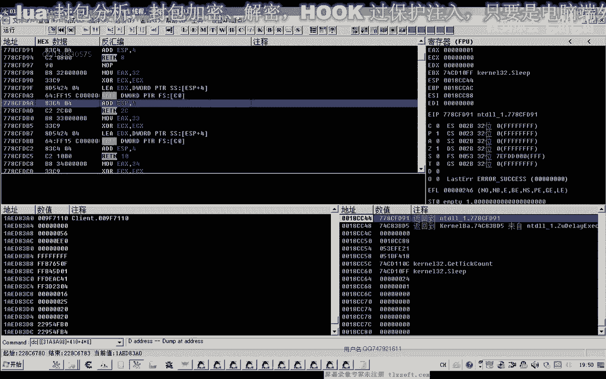
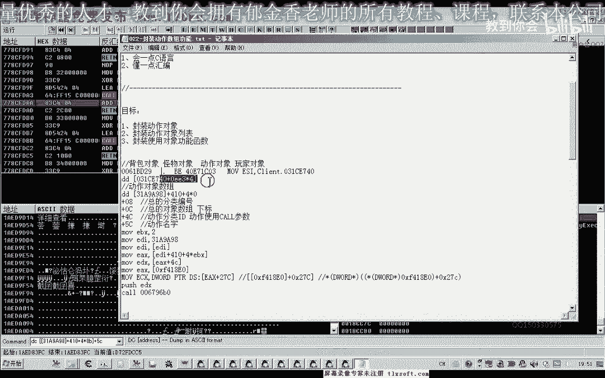
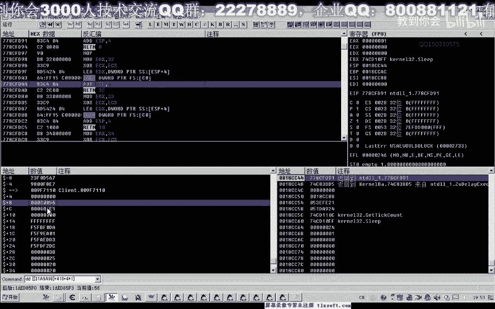
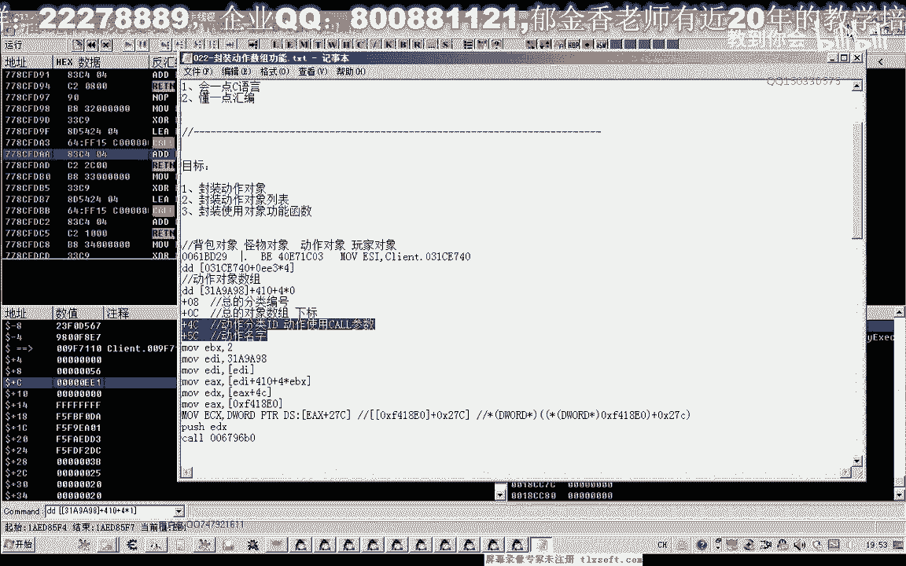
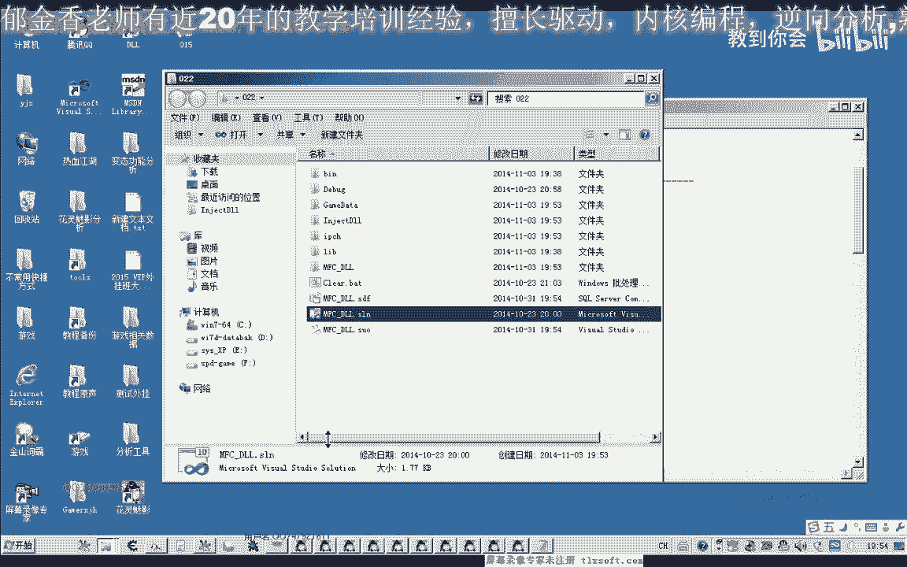
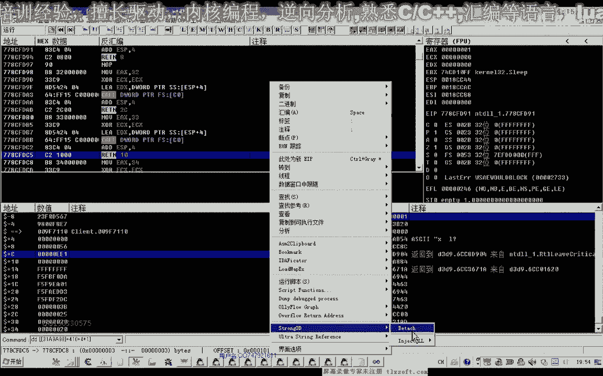
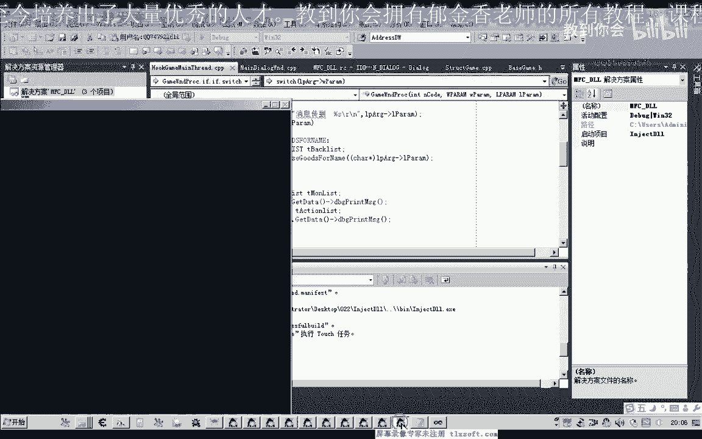
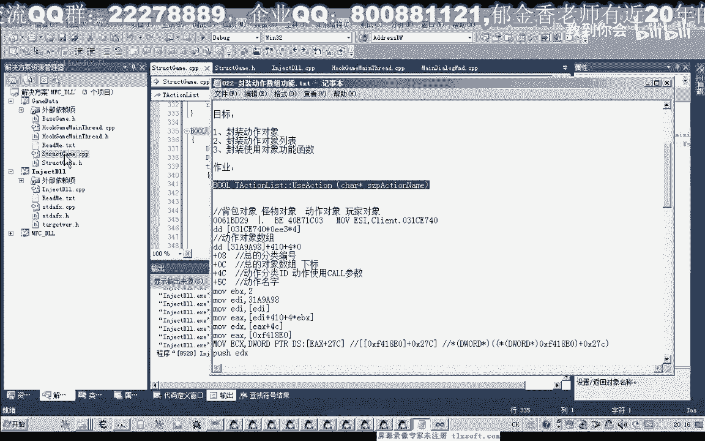

# 课程 P11：022-封装动作数组功能 📚



在本节课中，我们将学习如何分析游戏中的动作对象属性，并封装一个用于调用多个动作对象的功能函数。我们将从分析内存结构开始，逐步构建数据结构，并最终实现一个可通过下标调用动作的函数。



---

## 分析动作对象属性 🔍



上一节我们介绍了如何定位游戏中的对象。本节中，我们来看看动作对象的特定属性。

通过查看内存地址，我们发现动作对象有两个关键属性：
*   在偏移 `+0xC` 处存储了动作的名称。
*   在偏移 `+0x4C` 处存储了动作的分类ID。

这两个偏移与我们之前分析的背包对象有相似之处。此外，我们还注意到在偏移 `+0x0C` 和 `+0x08` 处存在与一个更大的总对象数组相关的下标和分类编号，但当前阶段这些属性对我们暂时没有用处。

因此，在封装对象结构时，我们将只包含名称（`+0xC`）和分类ID（`+0x4C`）这两个有用的属性。



---





## 定义基址与数据结构 🏗️



为了访问动作数组，我们首先需要定义相关的内存基址。

以下是动作数组功能所需的核心基址：
```c
#define BASE_ADDR_1 0x00A98XXXX // 动作数组基址1
#define BASE_ADDR_2 0x00XXXXXX  // 动作数组基址2（扩展）
// 计算最终ECX值的公式，对应两条汇编指令
// ECX = *(DWORD*)(*(DWORD*)(BASE_ADDR_1) + 0x2TC)
```

基址定义好后，我们接下来定义动作对象的结构体和数组。

动作对象结构体定义如下：
```c
typedef struct _ActionObject {
    wchar_t name[20]; // 动作名称，偏移 +0xC
    DWORD typeId;     // 动作分类ID，偏移 +0x4C
} ActionObject;

// 动作对象数组，共有12个元素
ActionObject g_ActionList[12];
```

---

## 初始化动作数组 🔄

定义好结构后，我们需要初始化这个数组，从游戏内存中读取数据填充它。

以下是初始化动作数组的步骤：
1.  计算指向第一个动作对象地址的指针。
2.  使用循环遍历所有12个动作对象。
3.  对于每个对象，根据公式计算出其内存地址。
4.  从该地址的 `+0xC` 偏移处读取动作名称。
5.  从该地址的 `+0x4C` 偏移处读取动作分类ID。

核心读取代码如下：
```c
// 计算并读取第一个对象的地址指针
DWORD basePtr = *(DWORD*)(BASE_ADDR_1);
DWORD firstActionAddrPtr = basePtr + 0x410;

for (int i = 0; i < 12; i++) {
    // 计算当前下标对象的实际地址
    DWORD objAddr = *(DWORD*)(firstActionAddrPtr + 4 * i);
    // 读取名称 (+0xC)
    wcscpy(g_ActionList[i].name, (wchar_t*)(objAddr + 0xC));
    // 读取分类ID (+0x4C)
    g_ActionList[i].typeId = *(DWORD*)(objAddr + 0x4C);
}
```



为了验证初始化是否成功，我们可以编写一个测试函数来打印数组内容：
```c
void PrintActionList() {
    for (int i = 0; i < 12; i++) {
        printf("Name: %ls, Index: %d, TypeID: %d\n", 
               g_ActionList[i].name, 
               i, 
               g_ActionList[i].typeId);
    }
}
```
运行测试后，控制台会输出类似“攻击”、“拾取”、“逃脱”等动作名称及其对应的索引和ID。

---

## 封装动作调用函数 ⚙️

初始化并验证数据后，我们就可以封装一个直接通过数组下标调用动作的函数了。

这个函数的核心任务是模拟游戏调用动作的流程，需要处理两个关键参数：
1.  `ECX` 寄存器值，我们从固定的基址公式计算得出。
2.  需要压栈的参数，即动作的分类ID（`typeId`）。

封装后的函数代码如下：
```c
void UseActionByIndex(int index) {
    __try {
        // 1. 获取所需的 ECX 值
        DWORD ecxValue = *(DWORD*)(*(DWORD*)(BASE_ADDR_1) + 0x2TC);
        
        // 2. 获取要使用的动作的分类ID
        DWORD actionTypeId = g_ActionList[index].typeId;
        
        // 3. 内联汇编：模拟游戏原有的调用过程
        __asm {
            mov ecx, ecxValue      // 设置 ECX
            push actionTypeId      // 将动作ID压栈
            call CALL_ADDR         // 调用游戏的功能函数
        }
    } __except(EXCEPTION_EXECUTE_HANDLER) {
        printf("调用动作时发生异常。\n");
    }
}
```

---

## 功能测试与作业 🧪

我们可以编写一个简单的测试来验证函数是否工作。

例如，要执行“攻击”动作（假设其下标为1）：
```c
// 选中一个怪物后调用
UseActionByIndex(1);
```
注入代码并运行测试，角色应该会对选中的目标发起攻击。

本节课中我们一起学习了如何分析动作对象、定义数据结构、初始化数组以及封装功能函数。

最后留给大家一个作业：**重构动作调用函数**。
*   **要求**：新函数应通过**动作名称**（而不是数组下标）来调用动作。
*   **提示**：可以参考之前封装背包物品使用函数的思路，实现一个 `UseActionByName(const wchar_t* actionName)` 函数。



通过完成这个作业，你将能更灵活地操作游戏功能。