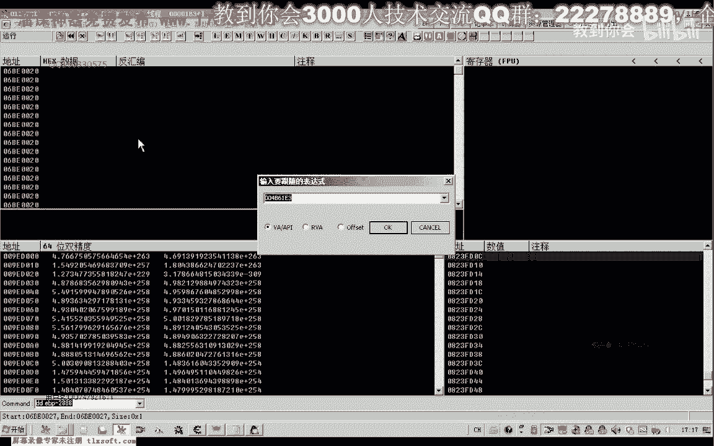
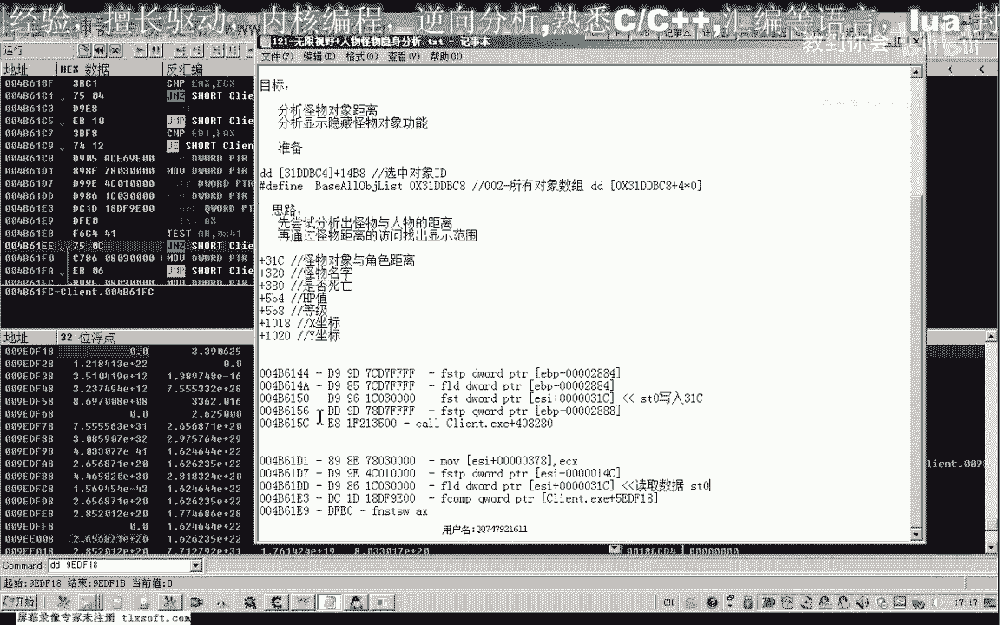

# 课程 P110：121 - 无限视野与怪物隐身分析 🎯

在本节课中，我们将学习如何通过逆向分析，找到并修改游戏中控制怪物显示距离的关键数值，从而实现“无限视野”和“怪物隐身”的功能。

## 概述与思路

上一节我们介绍了逆向分析的基本概念。本节中，我们来看看如何具体定位并修改游戏中的关键数据。

实现无限视野或隐藏怪物的核心思路在于：游戏通常会计算怪物与玩家角色之间的距离，并以此判断是否在屏幕上渲染该怪物。如果距离超过某个设定值，怪物就不会显示。因此，我们的目标是找到这个用于判断的距离值或计算它的代码，并进行修改。

*   **扩大视野**：将判断距离的数值改大，使更远处的怪物也能被看到。
*   **隐藏怪物**：将判断距离的数值改小，使怪物即使在很近处也不显示。

## 定位怪物对象与距离属性

以下是定位关键数据的具体步骤：

首先，我们需要在游戏中选中一个怪物，以获取其对象ID。通常，选中怪物的ID会存储在某个特定地址（例如示例中的 `0x14B8`）。当没有选中任何对象时，该地址的值可能是 `0xFF`。

当玩家靠近怪物时，怪物才会显示并被选中。此时，我们记下怪物的ID（例如 `0x12BF`）。这个ID是怪物在游戏全局对象数组中的索引。

通过对象数组的基址，加上索引乘以每个对象的大小（结构体宽度），我们就可以计算出该怪物对象在内存中的起始地址。通常，一个怪物对象的大小在3000字节左右。


## 搜索距离数值


取得怪物对象的起始地址后，我们以其为起点，在其后约3000字节的范围内搜索可能的距离数值。




因为距离通常是浮点数，所以我们在内存扫描工具中选择 **浮点 (float)** 类型进行搜索。




搜索时，利用距离会动态变化的特性：
1.  先远离怪物，距离值会**增大**，搜索“增加的数值”。
2.  再靠近怪物，距离值会**减少**，搜索“减少的数值”。
通过反复筛选，最终可以锁定一个最可疑的地址，其数值随玩家与怪物的距离变化而同步变化。

## 分析关键代码

找到可疑的距离值地址后，我们使用调试器（如OD）查看哪些代码访问了它。

我们特别关注包含 **比较 (CMP)** 指令的代码段，这很可能就是进行距离判断的地方。例如，可能会发现类似以下的汇编代码：
```assembly
FLD DWORD PTR [ESI+31C]    ; 将怪物距离（ESI+31C）加载到浮点寄存器
FCOMP QWORD PTR [EBP-288]  ; 与某个值（可能是预设视野范围）进行比较
```
在分析过程中，我们可能会找到两处关键代码：
1.  **写入代码**：负责将计算出的距离值写入怪物对象属性（如 `ESI+31C`）。
2.  **判断代码**：负责读取距离值，并与一个固定的“视野范围”值进行比较，以决定是否显示怪物。

通过跟踪，我们最终定位到核心的判断逻辑。这里有一个固定的浮点数值（例如 **250.0**）与怪物距离进行比较。这个数值就是控制怪物显示范围的**关键阈值**。

## 功能验证与修改


找到关键地址后，我们进行验证和修改：

1.  **修改视野范围值**：在内存中修改这个关键数值（例如从250改为10000）。
    *   **效果**：远处的怪物开始显示，实现了“无限视野”。
2.  **修改为极小值**：将该数值改得非常小（例如改为1）。
    *   **效果**：几乎所有怪物都消失，实现了“怪物隐身”。

在分析中，可能会发现另一个较大的数值（例如100000），它可能用于其他系统（如AI活动范围）的判断，但对“显示/隐藏”功能影响不大，核心修改点通常是第一个较小的比较值。

最后，记录下包含此关键比较指令的代码段特征码，便于日后制作辅助工具时进行定位。

## 总结


本节课中我们一起学习了如何通过逆向工程分析游戏中的怪物显示机制。我们掌握了从定位怪物对象、搜索动态距离数值，到分析关键比较代码并最终修改实现“无限视野”和“怪物隐身”功能的完整流程。核心在于找到并修改那个与怪物距离进行比较的**固定范围值**。