# P111：122-穿墙功能相关数据分析-寻路路径与坐标数组 - 教到你会 - BV1DS4y1n7qF

大家好，我是玉京先生老师，那么这节课我们一起来分析一下走路的坐标数，那么也就是为我们的穿墙功能来做一个准备，那么穿墙之所以它不能够穿越障碍物，肯定是游戏当中它有相应的代码在判断，指定的坐标点有没有障碍。

那么如果有障碍的话，它就会绕过，那么我们要分析穿墙的话，实际上最终的目的就是要找到障碍的判断的代码，那么我们可以先分析一些走路巡路的相关的数据，然后收集数据我们收集齐了之后，我们再来分析巡路和走路。

那么如果它是有障碍的话，指定的点，如果它是不能够到达指定的地点的话，它也有可能巡路的数据它就不能够生成，好的，那么我们先来看一下，那么在游戏当中，如果我们到达指定的一个点。

我们可以看到它有很多小的一个点，它表示先到这个点，然后到下一个点，那么这就是所谓的一个巡路，巡路它就会形成很多坐标的一个数据，那么首先我们把坐标数据来把它分析出来，那么在之前的话。

我们已经分析出来的有当前的坐标地址，目的地的坐标地址这几个，那么我们目的地的坐标地址的话，它肯定也就是从我们的不断的从我们的坐标数据里面把它取出来，然后写到我们的目的地地址里面去。

所以说我们只要对目的地坐标的地址这两个来，加一个我们的写入的访问，写入的代码，那么我们可能就能够找到它的一个附近，那么我们来看一下，首先，那么我们可以看到这里应该是一个目的地的一个坐标。

这是我们的当前坐标，1650，这是当前坐标，168C，那么这个时候我们可以看到的话，目的地坐标是这个，但是这两个坐标的话实际上在不断的变化，这两个地址为什么是一样的，这里看一下，这里应该是1650。

那么这是当前坐标不断在变化，这是我们的目的地坐标，那么实际上目的地坐标的话，它也是在变化的，我们可以看到在走路的过程当中，那么最终到达的目的地的话，它实际上不是1147，那么它一旦没有直线的话。

有这个转角的时候，它就会，它就会变化，1283，这一个，这个时候变成12，然后是12，如果在这里有一个转角的时候，它又会再一次的变化，这个时候变成了415，那么所以说如果是直线的话，它不会存在坐标。

它会执着的走，那么我们现在要找的也就是先把坐标数给它找出来，那么我们可以在这个地方，下一个改写的，找出改写指针指向地址的代码，那么我们看一下这段代码，它是从这里出站的，这是它的EDI。

那么下面这里有个ESI14C0，这里也有一个载入的，它是把这个数据载入之后弹出到我们的EDI里面，那么我们看一下EDI的数字等于多少，2以1，那么我们看一下，这个时候的话，我们这里的人物的属性的话。

也是2以1，那么我们用计算器计算一下，把EDI的数字复制出来，对了，我们的50A的话，我们看一下，这就是我们的目的地的坐标，这里可以看到，它弹到站里面，那么还有后面的代码也是4以A，这里，好的。

那么我们把这两个代码把它复制出来，当然这里还有一个，这里的话它是整串的这样复制，那么这几个地址都是向我们的目的地，地址进行坐标的一个写入，那么我们把这几段代码先复制出来。

那么关键是我们要找它的一个数据的来源，坐标数据的一个来源，看它是从什么地方来的，那么这里它是来源于EPP+150，应该是154，那么这之前的这里它肯定是来源于我们的ESI，这里一个EDI，ESI。

那么我们还是这个时候，我们把调试器的卸载掉，然后我们通过OD进去看一下。

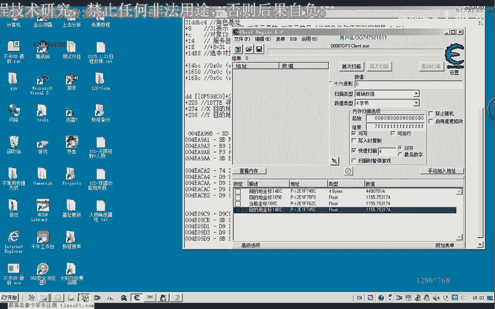

那么首先我们转到第一个地址，这里去看一下，那么这里的话我们可以看到它一次的话，1834，一次的话就是接近80个字节，80多个字节应该是的一个复制，那么从这里的话，它把我们的坐标来复制过去了。

那么这里的话它有一个坐标源，来源于这个地方，那么我们看看一下，寻路走路的时候是不是这样，走路的时候不会断下，寻路的时候这个时候才会断下，那么我们看一下ESI的一个数据。

那么我们看一下ESI里面存放的究竟是什么，那么ESI这里的话，我们发现了只有一个坐标，而不是我们所要找的数字，应当，那么我们再去第二个地方看一下，第二个地方是在这个地址，那么我们要找的是一个坐标集。

那么从这里弹出我们的数据，那么我们走路的时候看一下，寻路的时候看一下，那么这个时候我们看一下，它是弹到我们的ETI的话，是我们现在的目标的一个地址，它的一个来源的话是来源于我们的。

EBP+154这个地方，那么EBP+154是从这里，应该是从这里取得的数字，可能是从call里面取得的，那么我们在这里来下一个段看一下，EBP-154，那么这里的话我们能够看到一些，只能看到两个坐标集。

这个时候两个坐标点，那么我们重新再次让它断一下，那么这个时候我们看一下，这个时候EBP+154里面本来就是有坐标的，那么我们通过这个框的时候，看一下坐标它变不变化，但是我们通过这个框之后。

我们发现坐标它已经变化，说明我们的目的地坐标的话是从，这个函数里面获得的，那么可能函数里面的话，它会对我们的列表来进行一个骗离的，一个操作，那么我们跟进去看一下，它什么时候对它进行写入的。

那么我们再次让它跑起来，那么下次的时候，我们下一个访问段点，寻入，然后我们对这里的下一个内存写入的断点，然后按F8，看它在什么地方断下来，但是这个时候的话它没有断下，按F8的话，那么我们再次让它跑起来。

那么可能这个时候我们下内存断点的话，可能没有用，那么我们下一个应该能见到一个访问断点，下次那么我们再次让它跑起来，寻入，然后我们这里的HW写入的时候，我们下一个断，然后按F8，那么这个时候断下了。

那么我们可以看到它的数据的话，ECX写像EDI，那么ECX它来源于我们的EX，而EX的话来源于我们的1。64，那么我们看一下ESI+1。64是什么，也就是它一个坐标的来源，ESI+1。64。

那么这里面的话可能就是我们所要的坐标，数据，一个坐标，这里边，这里我们把它显示成佛典数来看一下，那么一个坐标，这里也是一个坐标，两个坐标，这些我们看全部都是坐标，这一片有很多的坐标相关的数据。

那么这里的话应当我们就可以把它看成是一个坐标级，我们的坐标数据路径，好的，那么我们来看一下EDI是一个什么数字，ESI，那么ESI的话，我们从对象属性这里看到是3。1，那么这里的话。

18就应该是我们对象的名字，我们来看一下，那么发现我们就是这个地址的话，就是我们的角色的，玩家角色的地址，ESI，那么我们来核对一下。

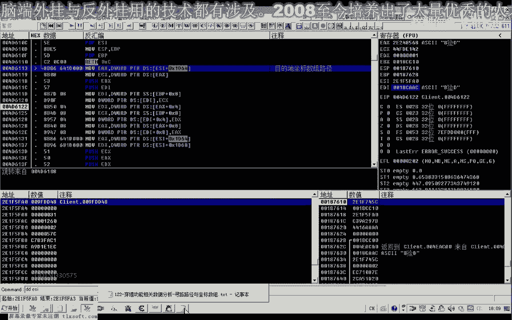

那么也就是说这个地方的164就是我们的坐标级的。

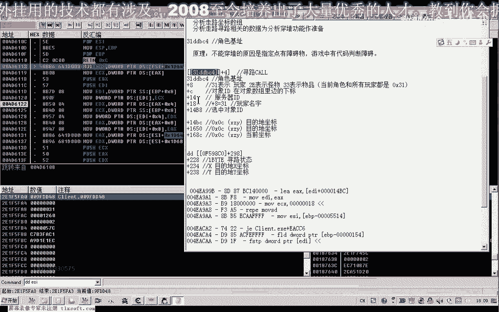

这个数字的指针，那么然后我们再进去就能够看到我们的坐标的，数字，那么的确进去就是这样的，那么这就是我们的玩家角色机制，那么也就是说我们已经找到我们的坐标。

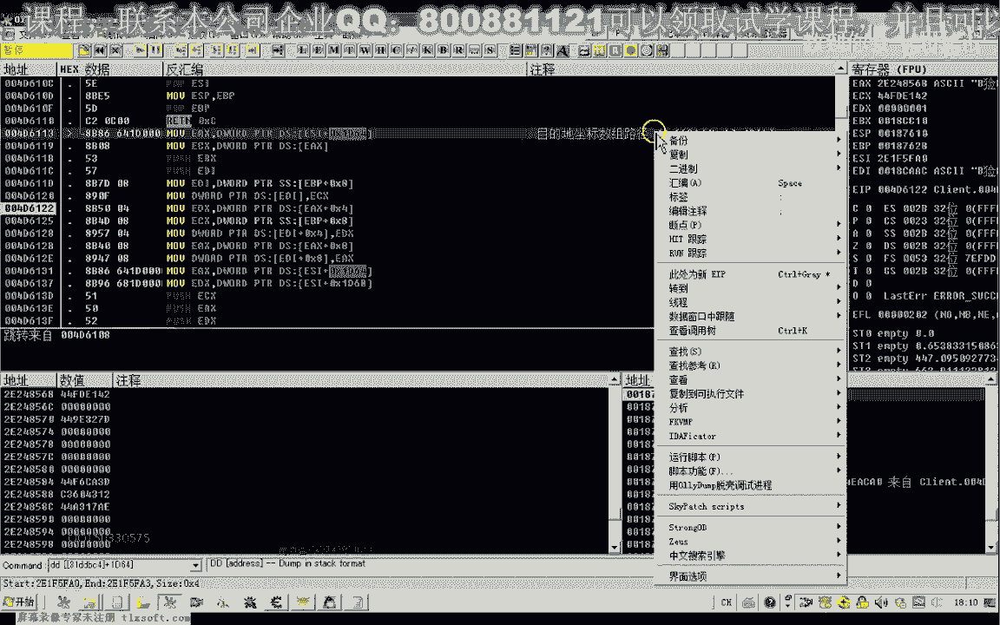

数据的一个起始地址，这个是啥，也就是这个1。64，然后注意这里的话。

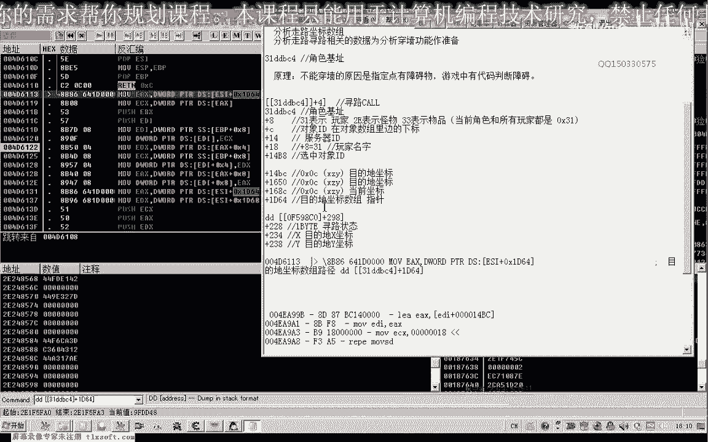

它只是一个指针，要进去之后才是，那么我们再往下面看一下，刚才这里进行写入的，然后不断的写入，那么后边的这里也有一个1。64，那么还有一个，这里还另外出现了一个偏移是1。68，ESIDX。

那么这两个它又进到了这个库里面去，IDDX-EC，那么这里有点看不太懂，看一下161。68，这里有一个-EC，那么我们再往下边执行一下，那么我们看一下这个1。68，这里又是一个什么。

那么我们看它的地址的话，基本上是差不多的，68一个是84，差距很小，那么这里也是68，然后我们再往下面执行，我们进行，它们相差的偏移只有4，那么我们进这个地方来去看一下，那么我们发现了这里来。

它也是一个坐标的一个坐标集，这两个都是坐标集，但是在这里有一些乱码的一些出现，那么我们继续往下看一下，这里的话，它就把我们的地址的话就取出来，相当于写到我们的，14BC这个地方，那么写完之后。

它调用了一个库，让EX看一下EX是多少，加上EC，那么这也是我们的，16，1。64加上EC，扑西这个地方的话，实际上的话也就是我们的1。64，在它的基础上来加了64，那么我们再往下执行一步，那么看一下。

那么这里也是一个坐标进行压占，它可能是我们的目的地的一个坐标，我们看一下，1974，那么这里是一个坐标，这里也是一个坐标，那么EC的话，可能是它里边的我们的1。64，它可能里边存放的是一个结构。

而结构的大小来看就是EC这么多个字体，那么我们来看一下，那么这里边它可能是一个结构的一个地址，那么这个结构，首先我们从这里来看，那么这里的话，它前面的存放的是一个坐标，那么前面的话。

它实际上所占的字节就是EC，那么第6个坐标又从EC开始，那么下一个坐标的话又到这里开始，那么也就是说它连续的取了两个坐标，这样取，那么我们也把它记录一下，这里的坐标结构大小是EC。

是这样的，一个是X坐标，Z坐标，然后是Y坐标，后面是跟了4个0，所以说一共是坐标大小是0XEC，它里面是这样的一个结构。

然后在这里的话，它让我们的EDI+161/68这里减掉了EC，这又是什么意思，我们来看一下，也就是说它让首先是指向的这个地方，然后它把这个地方我们前面加了EC，它后面就减掉EC。

那么这里的话从这里来看的话，它可能是这里是宿主的结构的起始地址，那么因为这里它已经访问了EC一个数据，那么这里它使它这个数据减掉EC，相当于是我们弹出了一个结构，那么我们仔细下去看一下。

那么这个地方这个时候改变了，那么这个时候我们结构的指针的首地址与尾地址，两个都相同了，那么证明我们整个路径列表循环完成了，应该是我们的巡路已经完成，表示的话，巡路的结束地址应该是1/68，这里的话。

这里是路径结束地址，路径结束地址，因为在这个宿主的话，它是在我们的人物角色对象里面的，那么所以说它用了一个指针来做一个宿主的，一个起始和一个结束，那么6、8这里是目的地坐标，宿主指针也是指针结束地址。

那么这里是它的开始的位置，开始的一个地址，但是有一点奇怪的是像这种的话，可能它是把下面的数据要往上边移动，那么不然的话，它整个宿主它访问不完，应该是我们正常的思路的话，应该是这前面的数据来再变。

应该是我们正常的访问的宿主的话，比如说这里是结束条件的话，它应该是前面的指针不断的加碎，这样的话才能够访问完我们的整个宿主，但是它这里是减，减的话我们可能我们猜想的话。

那么可能是它会把宿主的数据往前移动，有可能，那么我们再次把断点删掉，然后按减号退回来，好的，那么我们把这个地方记住。

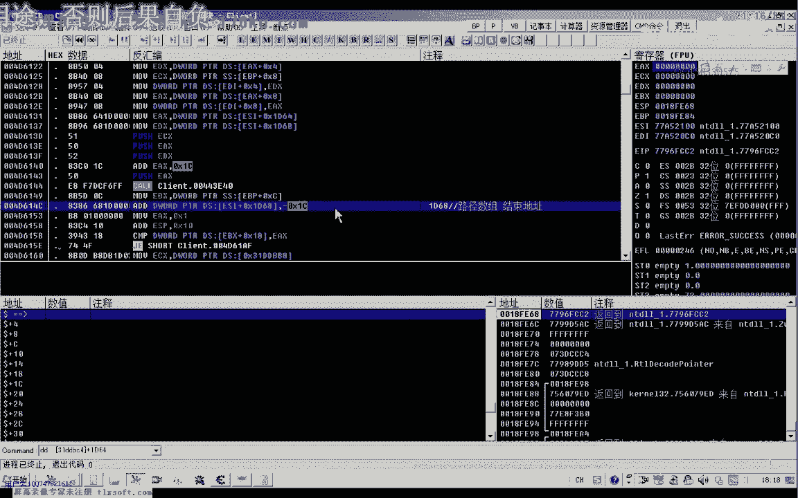

再次下一个，断点。

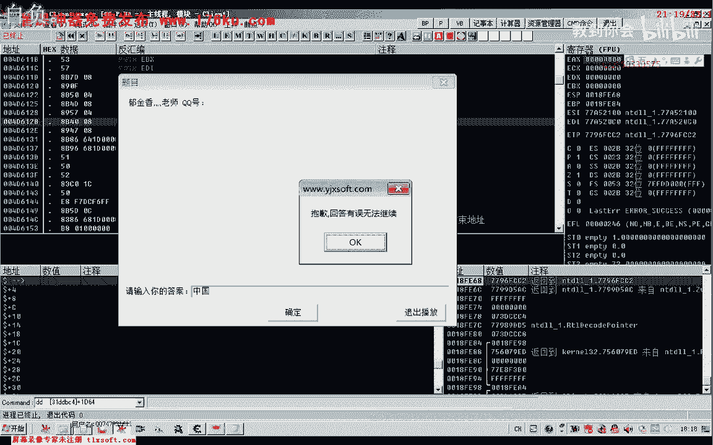

那么我们看一下等会它这个数据的一个变化，好的，先退出，好的，那么我们再次询问让它断下来，断下来之后我们再看一下，那么最终的话，它是写到我们的目的地地址，写到EDI这几个位置，谈账。

那么它的数据来源的话就是这个地址，那么它从这个地址进去之后，我们再来看一下，那么从这里，1。64这里，它获取我们的目的地地址的一个首地址，然后这里是地址的开始，这里是地址的一个结束。

那么我们再次进去看一下，那么进去看了之后，我们看一下它结束的一个地址，结束地址是1。68这个地方，那么70，那么这个是它最后一个地址，但是它第一次访问了之后，它就把这个地址来减掉了。

那么也就是访问不到了，访问不到的话，这与我们的正常的思路的话，有一些不相同，那么我们来看一下这段地址，继续往下执行，那么主要是这里它加了EC，然后这里它减掉了EC，那么继续往下执行，这里有一些奇怪。

我们再来看一下，1。68，那么还是指向这里，它没有减掉，1。68加上EC，那么我们再来看一下，1。68，它不断的往这个地方再取坐标，对了，它是从这个地方再不断的减掉它的数据，那么我们进去再看一下。

那么我们发现这里的话减掉之后，它往前移了，那么它后面的这些数据的话，好像也是有相应的变动的，那么我们再重新再执行一次，这是结束的地址，那么另外一个是起始的地址，这是起始地址，那么这是结束的地址，1。

68，但是结束的这份地址的话，现在已经为0了，这里我们减掉EC，看一下，减掉EC的话，就是在这个位置，那么我们看执行这个扩大的时候，这里的数据它发生了一些变化，好像是它把这个数据来移到前面这一块来了。

好，那么我们再次来看一下，再减一个EC看一下，那么我们注意这段数据，F6，8F6，我们看到它是不断的把这段数据再往前面移掉，从这个位置往前移掉了EC扩展一个作用，它是前移的一个作用。

那么所以说后面减掉EC，它就没有，对它之前的数据没有相应的影响，然后这里它会减掉，减掉EC，那么在前面，这里的数据是1。64，那么也就是说1。64，它后边的数据的话会不断的也会，那么下一次巡逻的时候。

它会把这个数据了，前移到这个地方来，那么所有的后边的数据了，依次它会前移一位，好像是这样来访问的，那么我们再次看一下，那么这里是A8F，那么A8F的话就移到了前面，那么这样它来保证。

遍历到了我们整个路径数据，这样来保证，那么也就是说退回来，我们返回到上一层，3B，EDI，看一下，这里要在哪三个程序，那么我们按ControlF9，回到上一层，那么上一层的话也就是这个地方。

再次再来看一下，好像我们这个地址出错了，应该是这里，那么这里的话，它每次来EBP+14，这里每次来取出，从我们的路径数据里面，取得下一个转角地址，转角目标地址，那么从它的变化来看的话。

好像是取得转角的目标地址，如果没有转角的话，好像它目的地坐标它不会变，那么也就是说走直线的话，这里它可能最多取一次，按照这种推想的话，那么我们这里再来看一下，那么如果是走直线，那么走直线的话。

这里它不会断下，根本就，那么只有在这里边访问的时候，它才会断下，产生路径，好的，那么这几个我们先分析到这里，那么我们再往下边看一下，这里ESP EDI，那么这个EDI的数字的话。

恰好也就是我们的目的地坐标，那么我们再来看一下，EDI，14PC目的地坐标地址。

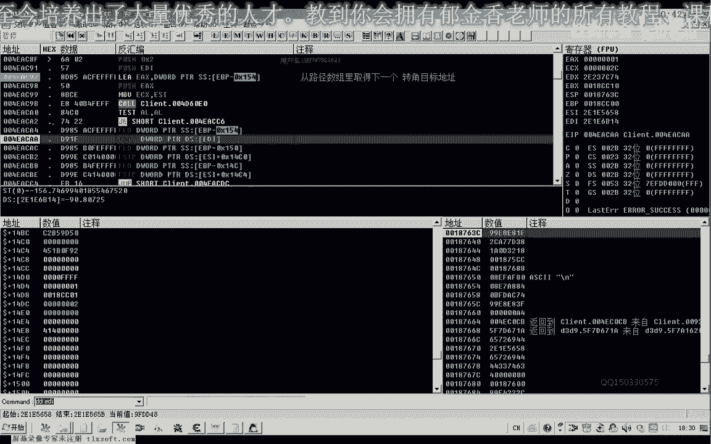

14PC目的地坐标的一个地址。

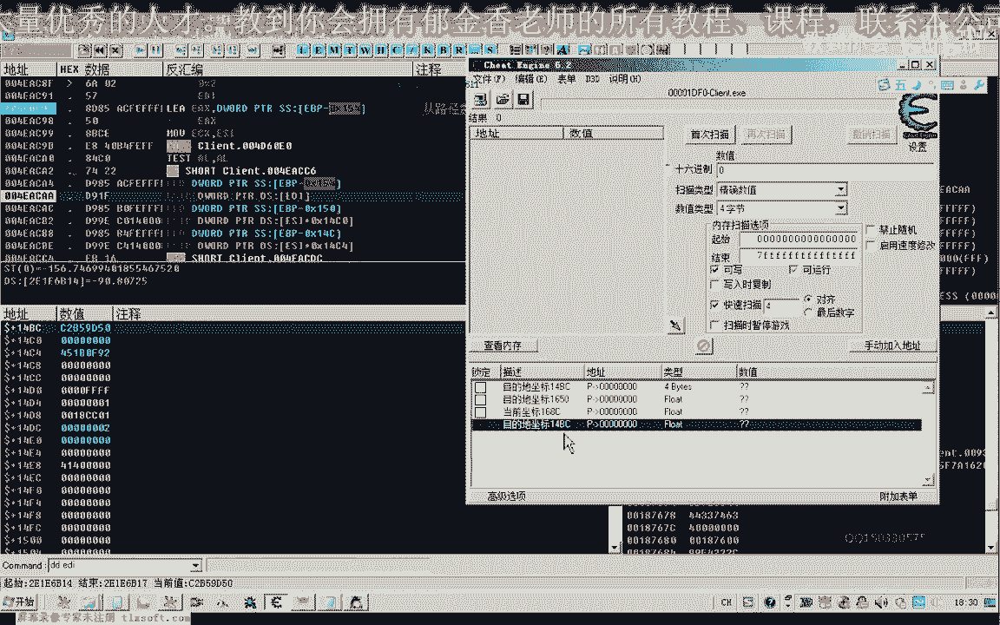

那么在下面还有一片好像是一个结构，也是，对联的一个结构应该是对向一边，那么这几个我们就先分析到这里，那么这里我们还是把它标注一下，14PC，那么这里应该是X坐标，然后后面依次是我们的Y坐标，Z坐标。

那么这里是我们的Y坐标，14C0，BC+4就是14C0，那么这里是14C4，好的，那么下一节课我们再继续从这里来开始分析，那么下一节课我们要分析的，这个任务就是我们看一下，它坐标序列也就是我们的目的地。

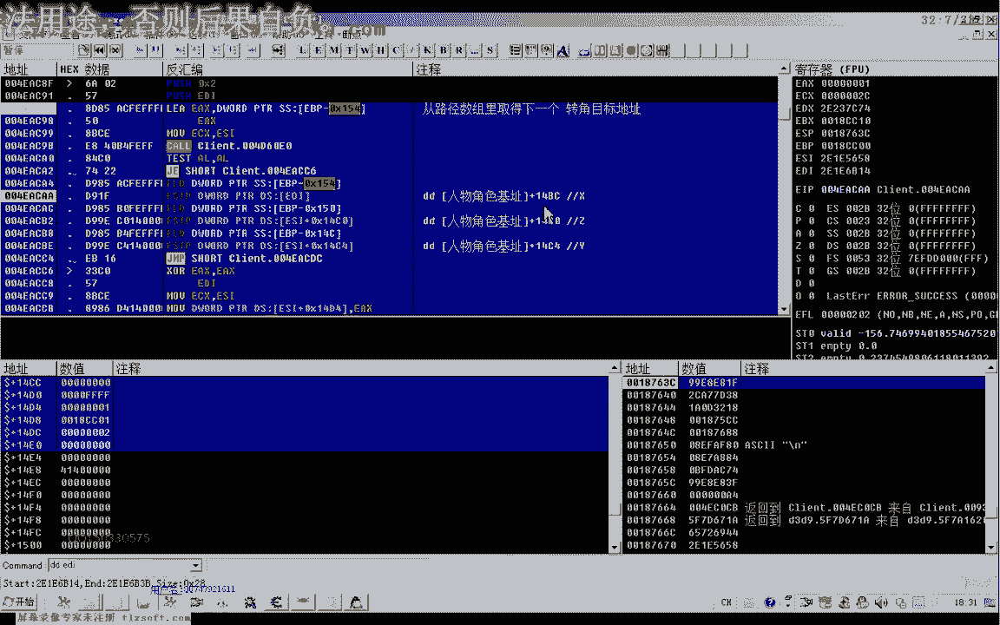

坐标的序列它究竟是怎么产生的。

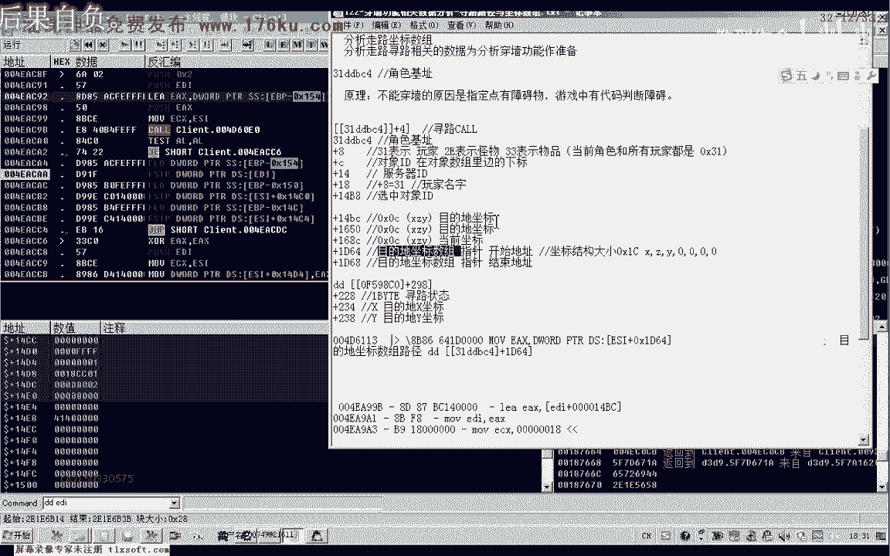

那么在它的附近，我们可能就能够分析到所谓的，团墙相关的一些数据，那么这里边的相关的数据，我们也把它进行一下复制，这个坐标结构大小，好的。

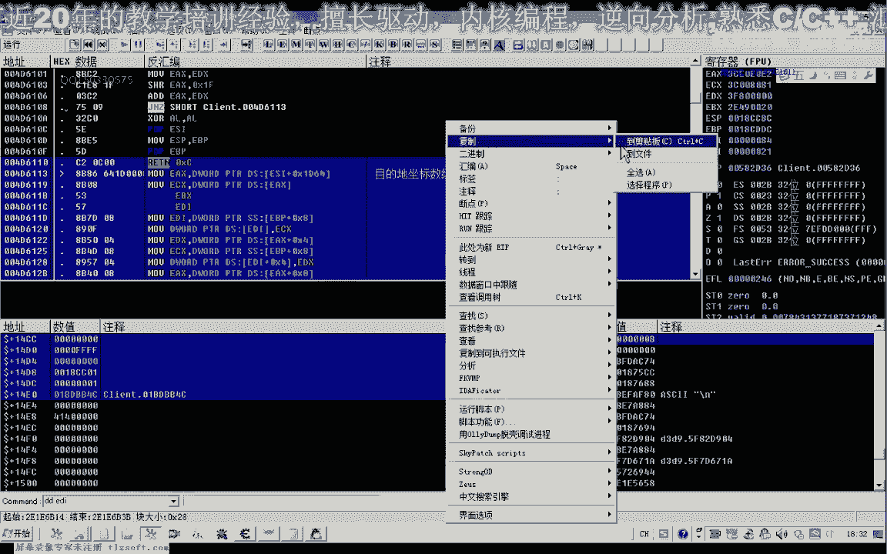

那么我们下一节课。