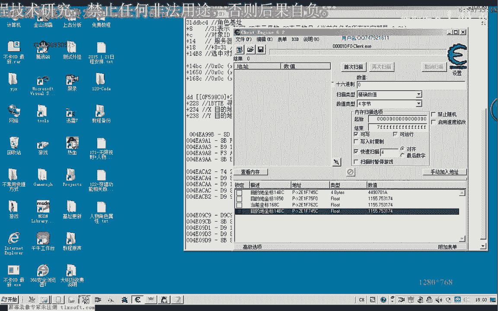
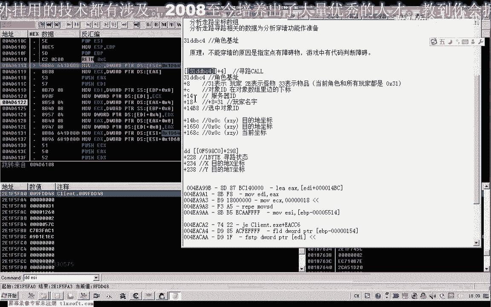
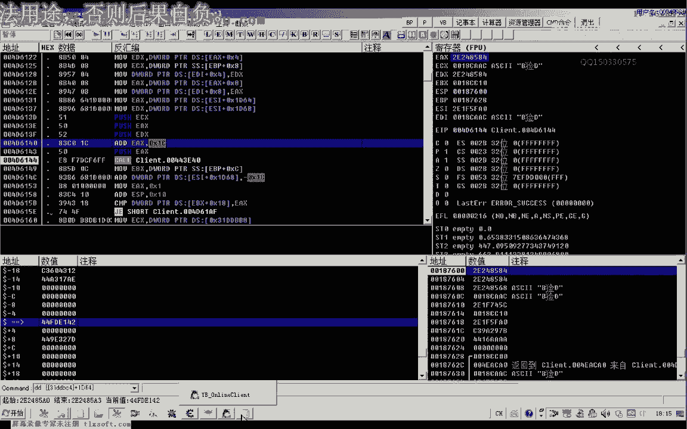
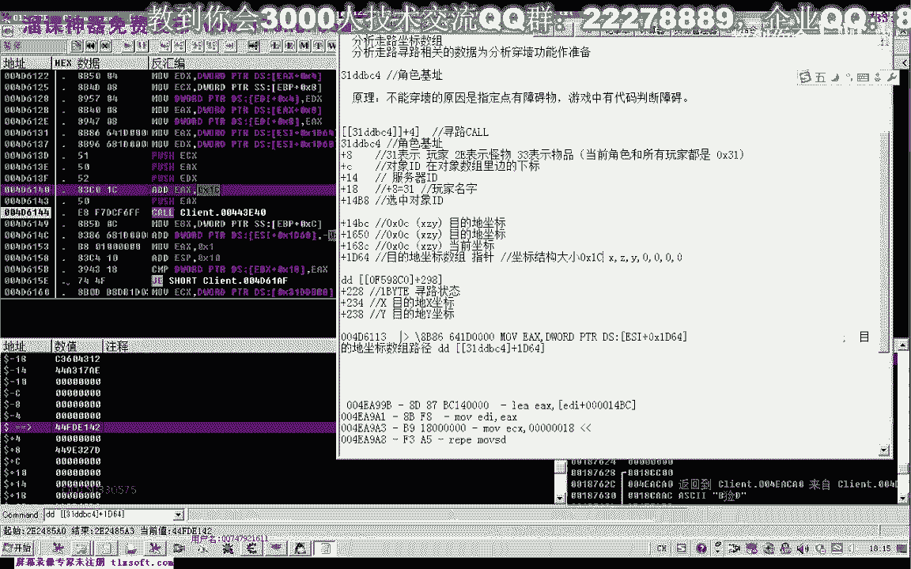
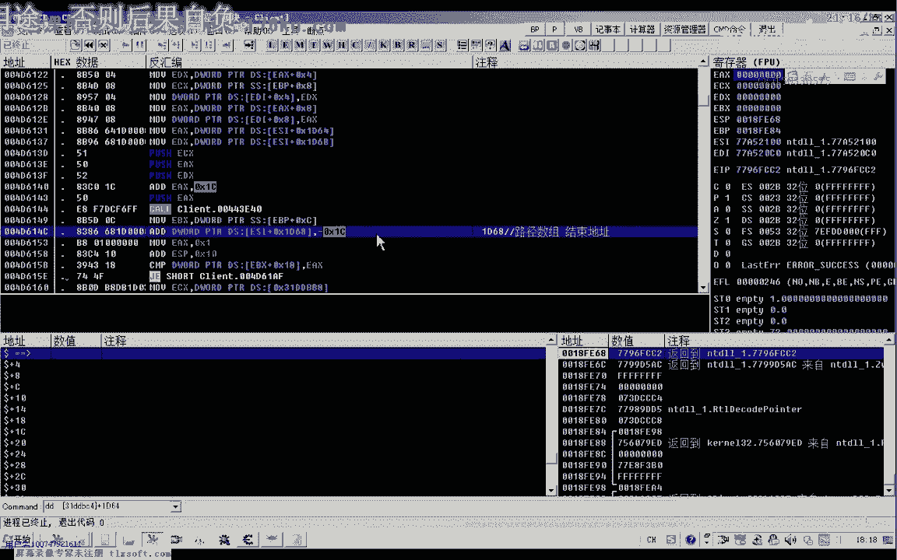
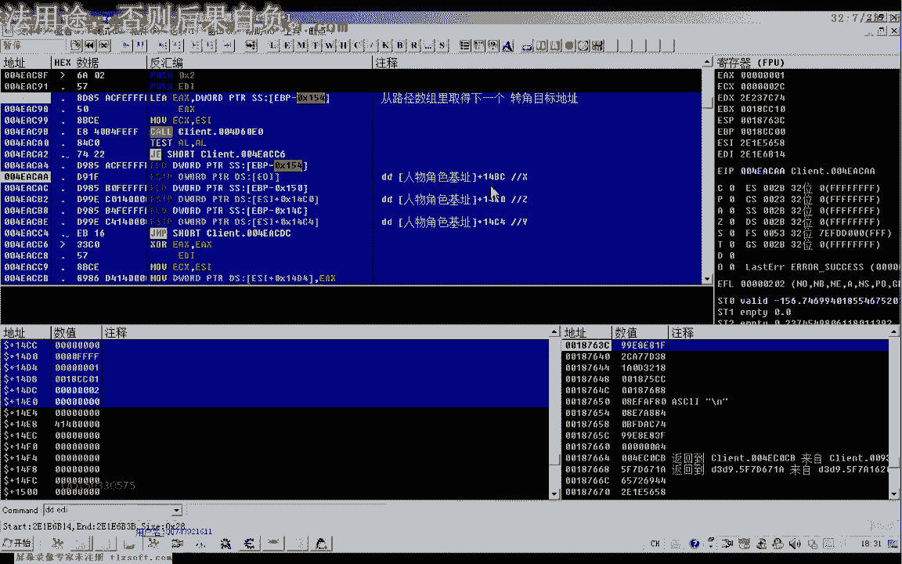

# 课程 P111：穿墙功能相关数据分析 - 寻路路径与坐标数组 📊

在本节课中，我们将学习如何分析游戏中的寻路路径与坐标数组。这是实现“穿墙”功能的关键准备步骤，因为穿墙功能的核心在于绕过或修改游戏对障碍物的判断逻辑。我们将通过分析坐标数据的来源、结构和变化规律，为后续定位障碍判断代码打下基础。

## 概述：寻路与坐标数据

游戏角色在移动到指定地点时，会生成一系列路径点坐标，这就是寻路。如果路径上存在障碍物，游戏会生成绕行的坐标点。我们的目标是找到存储和管理这些坐标数据的数组及其相关代码。

上一节我们介绍了游戏坐标的基本概念，本节中我们来看看如何定位和分析寻路产生的坐标数组。

## 定位目的地坐标的写入点



首先，我们已经知道游戏中存在“当前坐标”和“目的地坐标”的地址。目的地坐标会随着寻路过程不断更新，其数据来源于一个坐标数组。

为了找到这个数组，我们可以对“目的地坐标地址”下写入断点，追踪是哪些代码在修改它。

以下是定位写入代码的关键步骤：

1.  在调试器中找到写入目的地坐标的汇编指令。
2.  观察指令的数据来源，例如 `[EBP+0x154]` 或通过某个 `CALL` 函数获取。
3.  逆向追踪，找到数据的最终来源。

通过分析，我们发现写入目的地坐标的代码类似以下形式：
```assembly
MOV DWORD PTR [EDI], ECX  ; 将ECX中的坐标值写入EDI指向的目的地地址
```
而 `ECX` 中的坐标值，最终来源于角色对象地址的一个特定偏移。




## 分析坐标数组的结构


通过追踪数据来源，我们定位到坐标数组存储在角色对象基址的一个偏移处。

以下是关于坐标数组结构的重要发现：

*   **数组指针偏移**：坐标数组的起始指针位于角色对象基址 `+ 0x164` 的位置。这是一个指针，需要再次寻址才能访问到实际的坐标数据。
*   **数组结束指针偏移**：数组的结束指针位于角色对象基址 `+ 0x168` 的位置。游戏通过比较起始和结束指针来判断是否遍历完所有路径点。
*   **坐标结构体**：每个路径点坐标是一个结构体，大小为 `0xEC` 字节。
*   **结构体内容**：每个结构体包含 `X`, `Z`, `Y` 三个坐标值（可能是浮点数），后面跟随4个字节的0。用伪代码表示如下：
    ```c
    struct PathPoint {
        float X;
        float Z;
        float Y;
        int zero[1]; // 占4字节，值为0
    }; // 总大小 = 0xEC
    ```

在寻路过程中，游戏会从 `[对象基址+0x164]` 指向的地址开始，依次读取这些 `PathPoint` 结构体，并将其坐标写入目的地地址，引导角色移动。





## 理解坐标数组的遍历机制

我们发现一个有趣的机制：游戏在读取一个坐标点后，会将整个数组的数据向前移动一个结构体的大小（`0xEC` 字节）。

以下是该机制的工作原理：




1.  起始指针 `[对象基址+0x164]` 指向数组第一个坐标点。
2.  结束指针 `[对象基址+0x168]` 指向数组末尾。
3.  当读取一个坐标点后，执行类似内存移动的操作，将后续所有坐标点数据前移，覆盖已读取的点。
4.  同时，结束指针的值会减去 `0xEC`，指向新的“逻辑末尾”。
5.  这样，起始指针位置不变，但内容已经是下一个待读取的坐标点，实现了队列（FIFO）的遍历效果。

这种机制意味着路径坐标数组在内存中是一个动态变化的队列，而不是静态列表。

## 坐标数据的产生与穿墙关联

直线行走时，目的地坐标不变，不会触发寻路和坐标数组的更新。只有当遇到障碍、需要拐弯时，游戏才会生成新的路径点序列，并更新坐标数组。

因此，**坐标数组的生成逻辑（即寻路算法）必然包含了障碍物判断**。这正是我们实现穿墙功能需要切入的关键点。在下节课中，我们将重点分析这个坐标序列是如何产生的，并尝试在其附近找到障碍物判断的相关代码。

## 关键地址与偏移总结


本节课我们共同学习了寻路坐标数组的分析方法，并找到了以下关键信息：



*   **角色对象基址**：分析的核心起点。
*   **坐标数组起始指针偏移**：`对象基址 + 0x164`
*   **坐标数组结束指针偏移**：`对象基址 + 0x168`
*   **单个坐标点结构体大小**：`0xEC` 字节
*   **目的地坐标写入地址**：例如 `[EDI]`（具体地址需动态分析）


通过理解坐标数据的存储和遍历方式，我们为下一步直接分析寻路算法和障碍判断逻辑做好了充分的数据准备。下节课，我们将向“穿墙”的核心逻辑迈进。